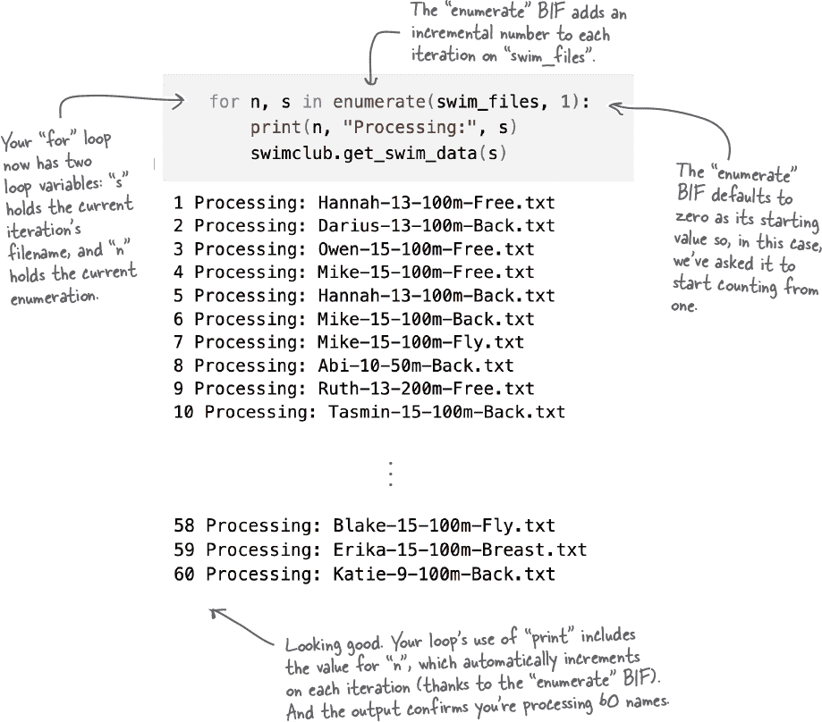

# 第四章：文件列表：*函数、模块与文件*

**你的代码不能永远留在笔记本中。它想要自由。** 当谈到解放你的代码并与其他人**共享**时，一个定制的**函数**是第一步，紧随其后的是一个**模块**，它让你组织和分享你的代码。在本章中，你将直接从到目前为止编写的代码中创建一个函数，并在此过程中创建一个**可共享的**模块。你将立即使用你的模块处理教练的游泳数据，使用**for**循环、**if**语句、条件测试和**PSL**（Python 的*标准库*）。你还将学习如何为你的函数添加**注释**（这总是一个*好主意*）。有很多事情要做，所以让我们开始吧！

# Cubicle Conversation

**Sam**: 我已经向教练更新了至今为止的进展。

**Alex**: 他满意吗？

**Sam**: 在某种程度上，是的。他对事情已经开始感到高兴。然而，正如你可以想象的那样，他只对最终产品感兴趣，对教练来说，最终产品就是条形图。

**Alex**: 现在最近的笔记本产生了我们需要的数据，这应该很容易做到，对吧？

**Mara**: 嗯...差不多吧。

**Alex**: 为什么？

**Mara**: 当前的笔记本`Times.ipynb`为 13 岁以下年龄组的达里乌斯游 100 米蝶泳提供数据。但是，需要执行转换和平均计算来处理*任何*游泳者的文件。

**Alex**: 当然很简单：只需将笔记本顶部的文件名替换为另一个文件名，然后按下*Run All*按钮，然后 – voila！ – 你就得到了你的数据。

**Mara**: 你认为教练会乐意这样做吗？

**Alex**: 呃...我没有考虑教练如何运行这些东西。

**Sam**: 我们正在朝着正确的方向前进，我们确实需要一个可以处理任何游泳者文件名的机制。如果可以做到这一点，我们就可以继续为条形图创建代码了。

**Alex**: 所以我们还有一段路要走...

**Mara**: 是的，但还没做到很远。正如你已经提到的，我们需要的所有代码都在`Times.ipynb`笔记本中...

**Alex**: ...你不想把它给教练...

**Mara**: ...好吧，不是它当前的形式。

**Alex**: 然后怎么办？

**Sam**: 我们需要一种方式来打包这段代码，使其可以与任何文件名一起使用，并且可以在笔记本之外访问...

**Alex**: 啊，当然了：我们需要一个函数！

**Sam**: 这使我们进展了一部分。

**Mara**: 如果函数放在一个 Python 模块中，它可以在很多地方共享。

**Alex**: 对我来说听起来不错。我们从哪里开始？

**Mara**: 让我们首先将现有的笔记本代码转换成一个可以调用的函数，然后共享。

# 如何在 Python 中创建一个函数

除了实际的函数代码之外，你还需要关注函数的*签名*。有三件事需要记住。你需要：

 **想出一个好的、有意义的名称**

在`Times.ipynb`笔记本中的代码首先处理文件名，然后处理文件内容以提取教练所需的数据。因此，让我们称这个函数为`get_swim_data`。这是一个很好的名字，是一个有意义的名字...天哪，它几乎是完美的！

 **确定任何参数的数量和名称**

您的新`get_swim_data`函数接受一个参数，用于标识要使用的文件名。让我们称这个参数为`fn`。

 **在 def 语句下缩进函数的代码**

**def**关键字引入了函数，让您可以指定函数的名称和任何参数。在**def**关键字下缩进的任何代码都是函数的代码块。

###### 注意

**把“def”看作“定义函数”的简写可能会很有用。**

# 请务必向您的函数添加注释

全部披露：我们说了一小白谎...我们让你误以为你只需要将代码复制到函数中，适当缩进即可。但是，您还应该在函数开头添加注释。

您已经看到一个单独的`**#**`字符如何在代码中开启单行注释。当您需要添加多行注释时，您可以将注释括在**三引号**中，信不信由你，它也是一个字符串对象。

###### 注意

**当您用三引号括起时，一个字符串可以跨越多行。**

当 Python 遇到未分配给变量名的字符串对象时，它会简单地忽略它，这使得使用三引号括起的字符串非常适合多行注释。这里是一个例子：

**很好的问题（发现得也很好）。**

**元组**是 Python 内置的数据结构之一，在第一章中简要介绍过。当时我们有点过于泛化，暗示元组很像列表。稍后在本书中我们会详细介绍元组。现在，请回忆一下它的样子：

现在，你的第二个问题是什么？

**这是另一个很好的观察。**

不，我们没有忘记声明参数的类型。事实上，在 Python 中，您不需要声明参数的类型，因为每个函数参数都可以是*任何*类型。

Python 是一种*动态类型*语言。这意味着，除其他外，类型决策不会在运行时进行，这与那些*古板*的静态类型语言截然不同，在编译时必须了解一切。

###### 注意

**根据您的编程背景，这可能使您感到有争议。我们的建议是不要让这件事困扰您。本页的“极客注”讨论了一个 Python 3 功能，可以被认为是在静态类型坚定派中间。**

# 为您函数的代码创建一个文件

在 Jupyter Notebook 的代码单元格中，你可以定义任何函数。实际上，当你试图确定需要创建的代码时，首先在笔记本中进行实验是我们推荐的方法。

然而，你在 `Times.ipynb` 笔记本中已经有了添加到 `get_swim_data` 函数中的所有必要代码，所以不需要进一步的实验。相反，让我们使用 VS Code 创建一个名为 `swimclub.py` 的新 Python 文件。

###### 注意

**在 VS Code 中，选择“文件”，然后“新建文件”，然后选择“Python 文件”作为类型。当出现空编辑窗口时，将文件保存为“swimclub.py”（并确保将文件保存到你现有的“学习”文件夹中）。**

这是我们复制到 `swimclub.py` 中的代码，我们对其进行了一些微小的调整（请注意注释）：

**是的，完全正确。**

只需对函数的代码进行一点小修改，确保它真的有用。

## 函数可以将结果返回给它们的调用代码

除了在传入数据时接受数据 *外*，函数还可以将数据传递给调用它们的代码（也就是在传出数据 *时*）。发送到函数中的参数将被分配给函数签名中定义的参数名称，而任何结果将通过 **return** 语句返回到调用代码。

## 在继续之前更新并保存你的代码...

在转到下一页之前，请确保在你的 `swimclub.py` 文件中的 `get_swim_data` 函数的最后一行添加以下代码行。请小心匹配此代码行的缩进，以与函数中的所有其他代码使用的缩进相匹配：

# 使用模块来共享代码

如果你查看 `swimclub.py` 文件中的代码，你会发现它包含一个单一的 **import** 语句，一个单一的常量定义和一个单一的函数。一旦将代码移入单独的文件中，它就成为了一个 Python *模块*。恭喜你：你已经创建了你的第一个 Python 模块，名为 swimclub。

**基本就是这样。**

事情可能会变得更加复杂，但正如你刚刚看到的那样，在 Python 中创建一个 **可共享的模块** 就像把一些代码放入文件中并给它命名那样简单。如此简单，简直应该有个法律来禁止它。.. 

**这是一个完全合格的名称。**

当你用“模块点函数”来引用你的函数时，你是在使用包含它的模块的名称来限定函数的名称。这在实践中非常常见，虽然还有其他常见的导入技术。随着你继续阅读本书，你会看到这些技术的例子。

**很好。也注意到了。**

这可能不是你在这里期待的解释，但这些括号确实是必须的。

让我们稍微深入一点，这样你就能理解发生了什么。

# 当需要时，函数返回一个元组

当你调用一个看起来返回多个结果的函数时，实际上并不是这样。相反，你会得到一个包含所有结果的单个元组（不管有多少结果）。

**这是个好建议。**

虽然我们并不是在暗示这里有一些心灵感应的事情发生，但是我们确实有了同样的想法...

**往往有一个“更好”的方法。**

上一页的代码是有效的，并且按照你的期望工作。（你确实在笔记本上尝试过了，对吧？！？）通过一些小的变化，你可以使这两个示例更加*Pythonic*，你将在下一页探讨这些变化。

###### 注意

**“Pythonic”：代码利用 Python 所提供的功能编写，而不是明显看起来是为了符合其他编程语言“正确方式”而编写的 Python 代码。**

希望一旦应用这些变化，你的代码就不会感觉那么笨重了。

**希望有一个文件名列表。**

你的`get_swim_data`函数，属于`swimclub`模块，接受任何游泳者的文件名并将结果作为元组返回给你。

现在需要的是文件名的完整列表，你应该可以从底层操作系统中获得。Python 当然可以帮到你。

# 让我们确定文件名列表

当涉及到操作系统的工作（无论你使用的是*Windows*、*macOS*还是*Linux*），PSL 都为你提供了支持。`os`模块让你的 Python 代码以跨平台的方式与操作系统进行交互，现在你将使用`os`模块获取`swimdata`文件夹中的文件列表。

记得要在你的`Files.ipynb`笔记本中跟上进展。

你希望知道你的`swimdata`文件夹中的文件名，并且`os`模块提供了方便的`listdir`函数来完成这个任务。当你传入一个文件夹的位置时，`listdir`会返回该文件夹包含的所有文件的列表：

你原以为`swim_files`列表中会有 60 个数据，这是可以理解的。毕竟，你的文件夹里有 60 个文件。然而，在我们的*Mac*上，当我们再次检查`swim_files`的大小时，我们感到震惊：

# 现在是一些侦探工作的时间...

你原本以为你的文件列表有 60 个文件名，但是`len` BIF 报告你的`swim_files`变量中有 61 个项目。

为了试图弄清楚这里到底发生了什么，让我们首先在屏幕上显示`swim_files`列表的值：

**多好的主意。**

让我们使用组合输出来查看列表中内置了什么。

# 你可以对列表做什么？

这里是你的`swim_files`列表的**print dir**组合输出：

**是的，这可能是个问题。**

由于`swimdata.zip`文件最初是在 Mac 上创建的，`.DS_Store`文件被自动添加到了 ZIP 存档中。这种特定于操作系统的问题总是令人担忧。

在继续之前，重要的是要*移除*`swim_files`列表中不需要的文件名。

**确实如此。**

在你学习本书时，你会看到大多数内置方法的实际应用。但是现在，专注于完成这个练习所需的部分就可以了。

**那会很好，不是吗？**

我们可以不顾一切地着手创建一些条形图，但现在可能为时尚早。

到目前为止，你的`get_swim_data`函数已经运行良好，但你能确定它对*任何*游泳者的文件都适用吗？让我们花一点时间确保我们的`get_swim_data`函数如预期般工作，无论它接收到哪种数据文件。

# 是你的数据有问题还是你的代码有问题？

现在你已经找出了问题文件，让我们打开它的内容，看看是否能找到问题的根源。这是在 VS Code 中打开的`Abi-10-50m-Back.txt`文件：

这是抛出错误的代码行。你能看出问题在哪里吗？

**一个错误的假设是问题的根源。**

按照你的代码编写，假定每个游泳时间都符合*分钟：秒.百分秒*的格式，但 Abi 的 50 米游泳时间显然不是这种情况，这就是为什么你会遇到`**ValueError**`错误。

现在你知道问题所在，那解决方案是什么？

# 小隔间对话

**Sam**：在这里，我们有什么选择？

**Alex**：我们可以修复数据，对吧？

**Mara**：怎么了？

**Alex**：我们可以预处理每个数据文件，以确保没有缺少的分钟，也许在分钟数缺失时加上零和冒号作为前缀？这样，我们就不必改动任何代码了。

**Mara**：那样会起作用，但是……

**Sam**：...会很混乱。而且，我不太想要处理所有的文件，因为绝大多数都不需要修改，感觉这可能有些浪费。

**Mara**：虽然作为一个策略，我们不需要改动任何现有的代码，但我们需要创建代码来进行预处理，也许可以作为一个单独的实用工具。

**Sam**：还要记得，数据是固定格式的，并且由教练的智能秒表生成。我们确实不应该去修改数据，所以我们最好还是保持原样。

**Alex**：那么，我们要修改我们的`get_swim_data`函数了吗？

**Mara**：是的，我觉得这是个更好的策略。

**Sam**：我也是。

**Alex**：那么，我们需要做什么？

**Mara**：我们需要确定我们的代码中需要进行哪些更改……

**Sam**：……以及这些代码改动需要做哪些内容。

**Alex**：好的，听起来不错。所以我们要仔细查看我们的`get_swim_data`函数，看看需要改变哪些代码？

**Mara**：是的，然后我们可以使用一个**if**语句来根据当前处理的游泳时间是否具有分钟值来做出决策。

###### 注意

**翻页看我们的选择。** 

# 决策，决策，决策

这就是**if**语句的作用，日复一日：它们做出决策。

**是的，在这里需要这个。**

让我们更仔细地看一下两种可能的游泳时间格式。

首先，这是达里奥在他的文件中记录的一个时间：

`'1:30.96'`

这里是阿比的数据中的一个时间：

`'43.35'`

很容易看出区别：*阿比的数据不显示任何分钟*。考虑到这一点，可以提出一个条件来检查在做决策时。你能想出是什么条件吗？（提示：考虑你的好朋友冒号）。

# 让我们在字符串中查找冒号“in”

如果冒号出现在任何游泳时间字符串中，则该时间具有分钟值。尽管字符串带有许多内置方法，包括可以执行搜索的方法，但在这里我们不要使用任何这些方法。因为搜索是如此常见的需求，Python 提供了**in**运算符。你之前见过**in**，在**for**循环中使用过：

###### 注意

**“find”和“index”字符串方法都执行搜索。**

使用**in**与**for**标识正在迭代的序列。然而，当**in**在循环外使用时，它具有*搜索*的功能。考虑以下**in**的使用示例：

**我们也喜欢** `**in**` **关键字。**

这是 Python 的超能力。

**绝对，在稍作整理之后。**

确保将以上代码添加到你的`swimclub.py`模块中的`get_swim_data`函数中，并不要忘记**保存**你的文件。

完成这些后，返回你的笔记本，并跟随下一页的*测试驱动*。

# 你处理了 60 个文件吗？

你可能对你最近的代码很有信心，它正在处理`swimdata`文件夹中的所有文件。我们也是如此。然而，确认这些事情通常是件好事。总是有很多方法可以做到这一点，但让我们通过为你的**for**循环的结果编号来在屏幕上显示每行输出来实现。

为了实现这一点，让我们再使用另一个专门为此目的创建的 BIF，叫做**enumerate**：

# 教练的代码正在形成中……

您的`swimclub`模块现在已经准备就绪。给定一个包含游泳时间字符串的文件名，您的新模块可以生成可用的数据。教练期望从这些数据中创建一些柱状图，所以让我们在下一章中实现这个功能。

一如既往，在你浏览了本章总结并尝试了本章的填字游戏之后，你可以继续前进。

# 关于作者

**保罗·巴里**拥有信息系统学士学位以及计算机硕士学位。他还有教育学与教学的研究生资格。自 1995 年以来，保罗一直在卡洛技术学院工作，并自 1997 年起在那里讲课。在从事教学工作之前，保罗在爱尔兰和加拿大的 IT 行业工作了十年，其中大部分工作是在医疗保健领域。
