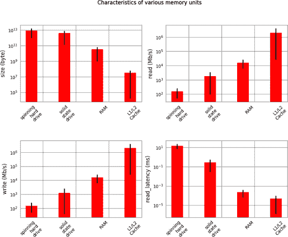
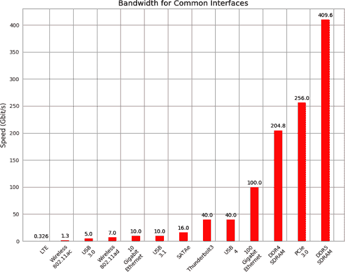

# 第一章：理解高性能 Python

编程计算机可以被认为是移动数据位并以特定方式转换它们以达到特定结果。然而，这些操作都需要时间成本。因此，*高性能编程*可以被看作是通过减少这些操作的开销（即编写更高效的代码）或者改变执行操作的方式来使每个操作更有意义（即找到更合适的算法）的行为。

让我们专注于减少代码中的开销，以便更深入地了解我们在其中移动这些位的实际硬件。这可能看起来像是一个徒劳的练习，因为 Python 很努力地抽象出直接与硬件的交互。然而，通过了解在实际硬件中位移的最佳方式以及 Python 抽象如何强制您的位移动，您可以在编写 Python 高性能程序方面取得进展。

# 基本计算机系统

组成计算机的基本组件可以简化为三个基本部分：计算单元、存储单元和它们之间的连接。此外，这些单元每个都有不同的属性，我们可以用来理解它们。计算单元具有每秒可以执行多少次计算的属性，存储单元具有数据容量和读写速度的属性，最后，连接具有从一个地方移动数据到另一个地方的速度属性。

使用这些构建块，我们可以在多个复杂程度的级别上讨论标准工作站。例如，标准工作站可以被视为具有中央处理单元（CPU）作为计算单元，连接到随机存取存储器（RAM）和硬盘作为两个单独的存储单元（每个具有不同的容量和读写速度），最后有一条总线连接所有这些部件。然而，我们也可以更详细地了解到 CPU 本身有几个内存单元：L1、L2，有时甚至是 L3 和 L4 缓存，这些缓存容量虽小但速度非常快（从几 KB 到数十 MB）。此外，新的计算机架构通常配备新的配置（例如，Intel 的 SkyLake CPU 用 Intel Ultra Path Interconnect 替换了前端总线并重构了许多连接）。最后，在这两种工作站的近似中，我们忽略了网络连接，这实际上是与潜在的许多其他计算和内存单元连接的非常慢的连接！

为了帮助理清这些复杂的细节，让我们简要描述一下这些基本组件。

## 计算单元

计算机的*计算单元*是其实用性的中心 - 它提供了将其接收的任何位转换为其他位或更改当前进程状态的能力。 CPU 是最常用的计算单元; 但是，图形处理单元（GPU）作为辅助计算单元正在增加其流行度。 它们最初用于加速计算机图形，但由于其固有的并行特性而越来越适用于数值应用程序。 这允许许多计算同时进行。 无论其类型如何，计算单元接收一系列位（例如，表示数字的位）并输出另一组位（例如，表示这些数字之和的位）。 除了对整数和实数的基本算术运算以及对二进制数的按位操作之外，某些计算单元还提供非常专门化的操作，例如“融合乘加”操作，该操作接收三个数字`A`、`B`和`C`，并返回值`A * B + C`。

计算单元的主要关注属性是它可以在一个周期内执行的操作数以及它可以在一秒内执行的周期数。 第一个值由其每周期指令数（IPC）^[1]（ch01_split_001.xhtml#idm46122429262840）衡量，而后一个值由其时钟速度衡量。 这两个度量值在制造新计算单元时总是互相竞争。 例如，Intel Core 系列具有非常高的 IPC 但较低的时钟速度，而 Pentium 4 芯片则相反。 另一方面，GPU 具有非常高的 IPC 和时钟速度，但它们遭受了其他问题的困扰，例如我们在“通信层”中讨论的慢通信。

此外，虽然增加时钟速度几乎立即加快了所有在计算单元上运行的程序（因为它们能够每秒执行更多计算），但更高的 IPC 也可以通过改变可能的*向量化*水平，从而 drasticaly 影响计算。 向量化发生在 CPU 一次提供多个数据片段并且能够同时对所有数据执行操作时。 这种 CPU 指令被称为单指令，多数据（SIMD）。

总体而言，过去十年来计算单元的进展相当缓慢（参见图 1-1）。 由于使晶体管变得越来越小的物理限制，时钟速度和 IPC 都停滞不前。 因此，芯片制造商一直依赖其他方法来获得更多速度，包括同时多线程（多个线程可以同时运行），更巧妙的乱序执行和多核架构。

超线程向主机操作系统（OS）提供了一个虚拟的第二个 CPU，并且聪明的硬件逻辑尝试将两个指令线程交错到单个 CPU 的执行单元中。成功时，可以比单线程获得高达 30% 的增益。通常情况下，当两个线程的工作单元使用不同类型的执行单元时，这种方法效果很好——例如，一个执行浮点运算，另一个执行整数运算。

乱序执行使编译器能够发现线性程序序列的某些部分不依赖于前一个工作的结果，因此这两个工作可以以任何顺序或同时发生。只要按时呈现顺序结果，程序就可以继续正确执行，即使工作片段是按照非编程顺序计算的。这使得一些指令可以在其他指令可能被阻塞（例如，等待内存访问）时执行，从而允许更大的可用资源的整体利用率。

对于高级程序员来说，最后也是最重要的是多核架构的普及。这些架构在同一单元内包含多个 CPU，这增加了总体能力，而不会遇到使每个单元变得更快的障碍。这就是为什么目前很难找到少于两个核心的任何机器——在这种情况下，计算机有两个物理计算单元彼此连接。虽然这增加了每秒钟*可以*完成的总操作数量，但这可能会使编写代码变得更加困难！

###### 图 1-1\. CPU 随时间的时钟速度（来自[CPU 数据库](https://oreil.ly/JnJt2)）

简单地向 CPU 添加更多核心并不总是会加快程序的执行时间。这是因为有一种被称为[*安达尔定律*](https://oreil.ly/GC2CK)的东西。简单来说，安达尔定律是这样的：如果一个设计为在多个核心上运行的程序有一些子程序必须在一个核心上运行，这将限制通过分配更多核心来实现的最大加速度。

例如，如果我们有一个想让一百人填写的调查问卷，而且每份问卷需要 1 分钟完成，如果我们只有一个人问问题（即这个人去参与者 1，问问题，等待回答，然后移动到参与者 2），我们可以在 100 分钟内完成这个任务。这种一个人问问题并等待回答的方法类似于串行过程。在串行过程中，我们有操作一个接一个地满足，每个操作等待前一个操作完成。

然而，如果我们有两个人来提问，我们可以并行进行调查，这样就能在短短的 50 分钟内完成整个过程。这是可能的，因为每个提问者都不需要知道其他提问者的信息。因此，这个任务可以轻松地分割，而不会有任何依赖关系。

添加更多提问者将会带来更多的加速，直到我们有一百个人提问。在这一点上，过程将花费 1 分钟，并且仅仅受到参与者回答问题所花费的时间的限制。添加更多提问者不会进一步加速，因为这些额外的人将没有任务可执行 —— 所有参与者已经在被提问！在这一点上，减少运行调查的总时间的唯一方法是减少个体调查的时间，即问题的串行部分，以完成。同样地，对于 CPU，我们可以添加更多的核心，根据需要执行各种计算的块，直到我们达到一个核心完成其任务所需的时间的瓶颈点。换句话说，任何并行计算中的瓶颈始终是正在分布的较小的串行任务。

此外，在 Python 中利用多个核心的一个主要障碍是 *全局解释器锁*（GIL）。GIL 确保 Python 进程一次只能运行一个指令，而不管它当前使用多少个核心。这意味着即使某些 Python 代码同时可以访问多个核心，但任何时候都只有一个核心在运行 Python 指令。使用调查的前述例子，这意味着即使我们有 100 个提问者，也只能有一个人提问并听取答案。这实际上消除了拥有多个提问者的任何好处！虽然这可能看起来是一个相当大的障碍，特别是如果当前计算的趋势是拥有多个计算单元而不是更快的计算单元，但可以通过使用其他标准库工具来避免这个问题，比如 `multiprocessing`（第九章），像 `numpy` 或 `numexpr`（第六章），Cython（第七章），或计算的分布式模型（第十章）。

###### 注意

Python 3.2 还进行了 [全局解释器锁（GIL）的重大改写](https://oreil.ly/W2ikf)，这使得系统更加灵活，缓解了关于单线程性能的许多担忧。尽管它仍然将 Python 锁定在一次只能运行一个指令的状态，但现在 GIL 在这些指令之间更加高效地切换，并且开销更小。

## 存储单位

计算机中的*内存单元*用于存储位。这些位可以是表示程序中变量的位，也可以是表示图像像素的位。因此，内存单元的抽象适用于主板上的寄存器以及 RAM 和硬盘驱动器。所有这些类型的内存单元之间的一个主要区别在于它们读/写数据的速度。为了让事情变得更加复杂，读/写速度严重依赖于数据读取的方式。

例如，大多数内存单元在读取一大块数据时表现得更好，而不是许多小块数据（这称为*顺序读*与*随机数据*）。如果将这些内存单元中的数据视为大书中的页面，这意味着大多数内存单元在一页一页地翻书时具有更好的读/写速度，而不是不断地从一个随机页面翻到另一个页面。虽然这个事实通常适用于所有类型的内存单元，但这种影响每种类型的程度却是截然不同的。

除了读/写速度之外，内存单元还有*延迟*，这可以被描述为设备找到正在使用的数据所需的时间。对于旋转硬盘来说，这种延迟可能很高，因为磁盘需要物理上旋转到速度，并且读取头必须移动到正确的位置。另一方面，对于 RAM 来说，这种延迟可以相当小，因为一切都是固态的。以下是标准工作站内常见的各种内存单元的简短描述，按照读/写速度的顺序排列：²

旋转硬盘

长期存储，即使计算机关闭也会保持。由于必须物理旋转和移动磁盘，因此通常具有较慢的读/写速度。随机访问模式下性能下降，但容量非常大（10 TB 范围）。

固态硬盘

类似于旋转硬盘，具有更快的读/写速度但较小的容量（1 TB 范围）。

RAM

用于存储应用程序代码和数据（如正在使用的任何变量）。具有快速读/写特性，并且在随机访问模式下表现良好，但通常容量有限（64 GB 范围）。

L1/L2 缓存

非常快的读/写速度。数据传输到 CPU *必须* 经过这里。非常小的容量（兆字节范围）。

图 1-2 通过查看当前可用消费类硬件的特性，给出了这些类型内存单元之间差异的图形表示。

显而易见的趋势是，读/写速度和容量成反比—我们试图增加速度时，容量就会减少。因此，许多系统采用分层存储的方法：数据最初以完整状态存储在硬盘中，部分数据移至 RAM，然后其中的一小部分再移至 L1/L2 缓存。这种分层存储的方法使得程序可以根据访问速度的要求将内存保留在不同的位置。当试图优化程序的内存模式时，我们只是在优化数据放置在哪里、如何布局（以增加连续读取的次数）以及在各个位置之间移动多少次。此外，诸如异步 I/O 和抢占式缓存等方法提供了确保数据始终位于需要的位置的方式，而无需浪费计算时间——大多数这些过程可以独立进行，而其他计算正在执行！



###### 图 1-2\. 不同类型内存单元的特征值（值来自 2014 年 2 月）

## 通信层

最后，让我们看看所有这些基本模块是如何相互通信的。存在许多通信模式，但所有这些模式都是对一种称为*总线*的东西的变体。

例如，*前端总线*是 RAM 和 L1/L2 缓存之间的连接。它将准备好被处理器转换的数据移入到准备进行计算的暂存区，并将已完成的计算移出。还有其他总线，例如外部总线，它是从硬件设备（如硬盘驱动器和网络卡）到 CPU 和系统内存的主要路由。这个外部总线通常比前端总线慢。

实际上，L1/L2 缓存的许多好处都归因于更快的总线。在缓慢的总线上（从 RAM 到缓存）可以排队等待计算所需数据的大块数据，然后在非常快速的缓存行（从缓存到 CPU）中可以访问这些数据，这使得 CPU 在无需等待太长时间的情况下可以进行更多计算。

类似地，使用 GPU 的许多缺点来自其连接的总线：由于 GPU 通常是一个外围设备，它通过 PCI 总线进行通信，而 PCI 总线比前端总线慢得多。因此，将数据传输到 GPU 和从 GPU 传输数据可能是一项相当耗费精力的操作。异构计算的出现，或者在前端总线上同时具有 CPU 和 GPU 的计算块，旨在降低数据传输成本，并使 GPU 计算成为更可行的选项，即使在必须传输大量数据时也是如此。

除了计算机内部的通信块之外，网络也可以被视为另一个通信块。然而，与先前讨论过的通信块不同，这个通信块更加灵活；网络设备可以连接到存储设备，比如网络附加存储（NAS）设备，或者连接到集群中的计算节点。然而，网络通信通常比先前提到的其他类型的通信慢得多。虽然前端总线可以每秒传输几十个千兆位，但网络的传输速度仅限于数十兆位的数量级。

总之，巴士的主要属性显而易见：它的速度，即在一定时间内能够传输多少数据。这一属性由两个量合成：一次传输可以移动多少数据（巴士宽度）和巴士每秒可以进行多少次传输（巴士频率）。需要注意的是，一次传输的数据总是顺序的：从内存中读取一块数据并移动到另一个地方。因此，巴士的速度被分解为这两个量，因为它们各自可以影响计算的不同方面：较大的巴士宽度可以帮助矢量化代码（或任何顺序读取内存的代码），因为它可以在一次传输中移动所有相关数据；另一方面，虽然巴士宽度较小，但传输频率非常高，可以帮助那些必须从内存的随机部分进行多次读取的代码。有趣的是，这些属性被计算机设计师改变的一种方式是通过主板的物理布局：当芯片彼此靠近放置时，连接它们的物理导线长度较短，这可以实现更快的传输速度。此外，导线的数量本身决定了巴士的宽度（给“巴士宽度”这一术语赋予了真实的物理意义！）。

由于接口可以调整以提供特定应用程序所需的正确性能，因此不足为奇，会有数百种类型存在。图 1-3 显示了几种常见接口的比特率。请注意，这并没有涉及连接的延迟，后者决定了数据请求的响应时间（尽管延迟非常依赖于计算机本身，但某些基本限制是固有于所使用的接口的）。



###### 图 1-3\. 各种常见接口的连接速度³

# 将基本元素组合在一起

仅了解计算机的基本组件是不足以完全理解高性能编程问题的。所有这些组件之间的相互作用以及它们如何共同解决问题，引入了额外的复杂性。在本节中，我们将探讨一些玩具问题，说明理想解决方案将如何工作以及 Python 如何处理它们。

警告：这一部分可能看起来暗淡无光 —— 这一部分的大多数备注似乎都在说 Python 本质上无法处理性能问题。这是不正确的，有两个原因。首先，在所有“高性能计算组件”中，我们忽略了一个非常重要的组件：开发人员。原生 Python 在性能上可能缺乏，但它立即以开发速度弥补了这一点。此外，在整本书中，我们将介绍可以相对轻松地缓解许多在此描述的问题的模块和理念。通过结合这两个方面，我们将保持 Python 的快速开发思维方式，同时消除许多性能限制。

## 理想化计算与 Python 虚拟机

为了更好地理解高性能编程的组成部分，让我们看一个简单的代码示例，检查一个数是否为素数：

```py
import math

def check_prime(number):
    sqrt_number = math.sqrt(number)
    for i in range(2, int(sqrt_number) + 1):
        if (number / i).is_integer():
            return False
    return True

print(f"check_prime(10,000,000) = {check_prime(10_000_000)}")
# check_prime(10,000,000) = False
print(f"check_prime(10,000,019) = {check_prime(10_000_019)}")
# check_prime(10,000,019) = True
```

让我们使用我们的抽象计算模型来分析这段代码，然后将其与 Python 运行此代码时发生的情况进行比较。与任何抽象一样，我们将忽略理想化计算机和 Python 运行代码的许多微妙之处。然而，在解决问题之前进行这种抽象思考通常是一个好方法：思考算法的一般组件以及计算组件共同解决问题的最佳方式是什么。通过理解这种理想情况，并了解 Python 底层实际发生的情况，我们可以迭代地将我们的 Python 代码接近最佳代码。

### 理想化计算

当代码启动时，我们在 RAM 中存储了`number`的值。为了计算`sqrt_number`，我们需要将`number`的值发送到 CPU。理想情况下，我们可以只发送一次值；它将被存储在 CPU 的 L1/L2 缓存中，并且 CPU 将进行计算，然后将值发送回 RAM 以进行存储。这种情况是理想的，因为我们最小化了从 RAM 读取`number`值的次数，而是选择了从 L1/L2 缓存读取，后者速度要快得多。此外，我们通过使用直接连接到 CPU 的 L1/L2 缓存，最小化了通过前端总线传输数据的次数。

###### 提示

在优化方面，保持数据在需要的地方并尽量少移动数据的概念非常重要。“重数据”的概念指的是移动数据所需的时间和精力，这是我们希望避免的。

对于代码中的循环，我们希望将`number`值和多个`i`的值一起发送到 CPU，而不是每次仅发送一个`i`值。这是可能的，因为 CPU 可以向量化操作而不会增加额外的时间成本，这意味着它可以在同一时钟周期内对多个独立的计算进行操作。因此，我们希望将`number`发送到 CPU 缓存，以及尽可能多的`i`值，CPU 缓存可以容纳多少就发送多少。对于每个`number`/`i`对，我们将进行除法运算并检查结果是否为整数；然后我们将发送一个信号返回，指示是否确实有任何值是整数。如果是，则函数结束。如果不是，则重复上述过程。通过这种方式，我们只需为许多`i`的值之一返回一个结果，而不是为每个值都依赖慢速总线。这充分利用了 CPU 在一个时钟周期内*向量化*计算或在多个数据上运行一条指令的能力。

这个向量化的概念可以通过以下代码进行说明：

```py
import math

def check_prime(number):
    sqrt_number = math.sqrt(number)
    numbers = range(2, int(sqrt_number)+1)
    for i in range(0, len(numbers), 5):
      # the following line is not valid Python code
        result = (number / numbers[i:(i + 5)]).is_integer()
        if any(result):
            return False
    return True
```

在这里，我们设置处理方式，使得每次处理五个`i`的值时进行除法运算和整数检查。如果正确进行向量化，CPU 可以一次完成这一行，而不是对每个`i`进行单独的计算。理想情况下，`any(result)`操作也应在 CPU 上进行，而不必将结果传输回 RAM。我们将在第六章更详细地讨论向量化的工作原理以及何时有益于你的代码。

### Python 的虚拟机

Python 解释器会尽力抽象出正在使用的底层计算元素。程序员在任何时候都不需要担心为数组分配内存、如何安排内存或发送到 CPU 的顺序。这是 Python 的一个优点，因为它让你专注于正在实现的算法。然而，这也导致了巨大的性能成本。

重要的是要意识到，Python 在其核心确实运行一组高度优化的指令。然而，关键在于让 Python 按照正确的顺序执行它们以获得更好的性能。例如，在下面的例子中，很容易看出`search_fast`比`search_slow`运行得更快，仅仅是因为它跳过了不必要的计算，尽管这两种解决方案的运行时间都是`O(n)`。然而，当涉及到派生类型、特殊的 Python 方法或第三方模块时，情况可能会变得复杂。例如，你能立即判断哪个函数会更快：`search_unknown1`还是`search_unknown2`？

```py
def search_fast(haystack, needle):
    for item in haystack:
        if item == needle:
            return True
    return False

def search_slow(haystack, needle):
    return_value = False
    for item in haystack:
        if item == needle:
            return_value = True
    return return_value

def search_unknown1(haystack, needle):
    return any((item == needle for item in haystack))

def search_unknown2(haystack, needle):
    return any([item == needle for item in haystack])
```

通过分析性能并找到更高效的计算方式来识别代码中的慢速区域，类似于发现这些无用操作并将其删除；最终结果相同，但计算和数据传输的数量大大减少。

这种抽象层的一个影响是无法立即实现向量化。我们初始的素数判断例程将针对每个`i`的值运行一次循环迭代，而不是结合多次迭代。然而，观察抽象化的向量化示例，我们发现它并不是有效的 Python 代码，因为我们不能将浮点数除以列表。外部库如`numpy`将通过添加执行向量化数学运算的能力来帮助解决这种情况。

此外，Python 的抽象性损害了依赖于保持 L1/L2 缓存填充下一个计算所需相关数据的任何优化。这源于多种因素，首先是 Python 对象在内存中的布局并不是最优的。这是 Python 是一种自动进行垃圾回收的语言的一个后果——内存会在需要时自动分配和释放。这会导致内存碎片化，可能会损害到传输到 CPU 缓存的效果。此外，在任何时候，都没有机会直接在内存中更改数据结构的布局，这意味着总线上的一个传输可能不包含计算所需的所有相关信息，即使它们可能全部适合总线宽度内。⁴

第二个更根本的问题来自于 Python 的动态类型和语言的非编译特性。正如许多 C 程序员多年来所学到的，编译器通常比人更聪明。在编译静态代码时，编译器可以通过许多技巧改变事物的布局以及 CPU 执行某些指令的方式，以进行优化。然而，Python 并不是编译的：更糟糕的是，它具有动态类型，这意味着在运行时可以更改代码功能，从而在算法上推断出任何可能的优化机会变得极其困难。有许多方法可以缓解这个问题，最重要的是使用 Cython，它允许将 Python 代码编译，并允许用户创建“提示”，告诉编译器代码实际上有多动态。

最后，前面提到的 GIL 如果尝试并行化此代码会影响性能。例如，假设我们将代码更改为使用多个 CPU 核心，以便每个核心获得从 2 到 `sqrtN` 的一部分数字。每个核心可以为其数字块执行计算，然后在所有计算完成后，核心可以比较其计算结果。虽然我们失去了循环的早期终止，因为每个核心不知道是否找到解决方案，但我们可以减少每个核心需要执行的检查数量（如果我们有 `M` 个核心，则每个核心必须执行 `sqrtN / M` 次检查）。然而，由于 GIL 的存在，一次只能使用一个核心。这意味着我们实际上正在运行与未并行化版本相同的代码，但我们不再具有早期终止功能。我们可以通过使用多个进程（使用 `multiprocessing` 模块）而不是多个线程，或者使用 Cython 或外部函数来避免这个问题。

# 那么为什么要使用 Python？

Python 非常表达丰富且易于学习——新程序员很快发现他们可以在短时间内做很多事情。许多 Python 库封装了用其他语言编写的工具，以便调用其他系统；例如，scikit-learn 机器学习系统封装了 LIBLINEAR 和 LIBSVM（两者均为用 C 编写的），而 `numpy` 库包括 BLAS 和其他 C 和 Fortran 库。因此，正确使用这些模块的 Python 代码确实可以与相似的 C 代码一样快。

Python 被描述为“电池包含”，因为许多重要的工具和稳定的库都内置在其中。这些包括以下内容：

`unicode` 和 `bytes`

内置到核心语言中

`array`

用于原始类型的内存高效数组

`math`

基本数学运算，包括一些简单的统计操作

`sqlite3`

围绕主流 SQL 文件存储引擎 SQLite3 的包装器

`collections`

包括 deque、counter 和字典变体在内的各种对象

`asyncio`

使用异步和等待语法支持 I/O 密集型任务的并发

核心语言之外可以找到大量的库，包括这些：

`numpy`

数值计算 Python 库（与矩阵有关的基础库）

`scipy`

大量受信任的科学库集合，通常封装了备受尊敬的 C 和 Fortran 库

`pandas`

用于数据分析的库，类似于 R 的数据框或 Excel 电子表格，构建在 `scipy` 和 `numpy` 上

`scikit-learn`

快速成为默认的机器学习库，基于 `scipy` 构建

`tornado`

提供易于绑定并发的库

PyTorch 和 TensorFlow

来自 Facebook 和 Google 的深度学习框架，具有强大的 Python 和 GPU 支持

`NLTK`、`SpaCy` 和 `Gensim`

具有深度 Python 支持的自然语言处理库

数据库绑定

用于与几乎所有数据库通信，包括 Redis、MongoDB、HDF5 和 SQL

Web 开发框架

创建网站的高效系统，例如 `aiohttp`、`django`、`pyramid`、`flask` 和 `tornado`

`OpenCV`

计算机视觉的绑定

API 绑定

便于访问流行的 Web API，例如 Google、Twitter 和 LinkedIn

有大量托管环境和 Shell 可供选择，以适应各种部署场景，包括以下内容：

+   标准发行版，可在 [*http://python.org*](http://python.org) 获取

+   `pipenv`、`pyenv` 和 `virtualenv`，用于简单、轻量和可移植的 Python 环境

+   Docker，用于简化启动和重现开发或生产环境的环境

+   Anaconda Inc. 的 Anaconda，一个专注于科学的环境

+   Sage，类似 Matlab 的环境，包括集成开发环境（IDE）

+   IPython，科学家和开发人员广泛使用的交互式 Python shell

+   Jupyter Notebook，基于浏览器的 IPython 扩展，广泛用于教学和演示

Python 的主要优势之一是能够快速原型化一个想法。由于有多种支持库的支持，即使第一次实现可能有些不稳定，也很容易测试一个想法是否可行。

如果您想使您的数学例程更快，请考虑 `numpy`。如果您想尝试机器学习，请试试 scikit-learn。如果您正在清理和操作数据，那么 `pandas` 是一个很好的选择。

一般来说，提出问题“如果我们的系统运行得更快，我们作为一个团队长远来看会运行得更慢吗？”是明智的。如果投入足够的工时，总是可以从系统中挤取更多的性能，但这可能导致脆弱且理解不足的优化，最终会使团队陷入困境。

一个例子可能是引入 Cython（见 “Cython”），这是一种基于编译器的方法，用于使用类似 C 的类型注释 Python 代码，以便转换后的代码可以使用 C 编译器编译。虽然速度提升可能令人印象深刻（通常可以达到类似 C 的速度，而付出的努力相对较少），但支持此类代码的成本将会增加。特别是，支持这个新模块可能更加困难，因为团队成员需要在编程能力上具备一定的成熟度，以理解离开引入性能提升的 Python 虚拟机时发生的某些权衡。

# 如何成为一名高效的程序员

编写高性能代码只是长期成功项目中高效性的一部分。整体团队速度比加速和复杂解决方案更为重要。几个关键因素包括良好的结构、文档、调试能力和共享标准。

假设您创建了一个原型。您没有彻底测试它，也没有让您的团队审核它。它似乎“够好”，于是被推送到生产环境。由于从未以结构化的方式编写，它缺乏测试和文档。突然间，这成为一个惯性代码片段，需要其他人支持，而管理层往往无法量化对团队的成本。

由于这种解决方案难以维护，它往往保持不受欢迎——它从未重构过，没有测试帮助团队重构它，也没有其他人喜欢接触它，因此落到一个开发人员手中来维护。这在压力时期可能会引起严重的瓶颈，并提高了一个重大风险：如果那位开发人员离开了项目会发生什么？

典型地，这种开发风格发生在管理团队不理解由难以维护的代码造成的惯性时。在长期来看，测试和文档的证明可以帮助团队保持高效率，并说服管理者分配时间来“清理”这些原型代码。

在研究环境中，通常会使用不良编码实践创建许多 Jupyter Notebooks，以迭代思路和不同数据集。意图始终是在稍后的阶段“正确地写出来”，但这一阶段从未出现。最终得到了一个工作结果，但缺少复现、测试和信任结果的基础设施。再次高风险因素，结果的信任度将会很低。

有一个通用的方法会给您带来很大帮助：

让它运行起来

首先构建一个足够好的解决方案。建议先“建立一个用来丢弃的”原型解决方案，作为第二版本使用更好结构的可能性。在编码之前进行一些前期规划总是明智的；否则，您会发现“我们通过整个下午编码省了一个小时的思考时间。”在某些领域，这更为人熟知为“量一次，切一次”。

做对

接下来，您添加一个强大的测试套件，支持文档和清晰的可复现性说明，以便其他团队成员接手。

做快

最后，我们可以专注于分析和编译，或并行化和使用现有的测试套件来确认新的更快解决方案仍然按预期工作。

## 良好的工作实践

有几个“必须具备”的要素——文档、良好的结构和测试至关重要。

一些项目级文档将帮助您坚持清晰的结构。这也将帮助您和您的同事未来。如果您跳过这一部分，没有人会感谢您（包括您自己）。在顶层编写一个*README*文件是一个明智的起点；如果需要的话，随后可以扩展为*docs/*文件夹。

解释项目的目的，文件夹中包含什么内容，数据的来源，哪些文件至关重要，以及如何运行所有内容，包括如何运行测试。

Micha 还推荐使用 Docker。一个顶级的 Dockerfile 将准确解释需要从操作系统获取哪些库才能使这个项目成功运行。它还消除了在其他机器上运行此代码或部署到云环境中的难度。

添加一个 *tests/* 文件夹并添加一些单元测试。我们推荐 `pytest` 作为现代测试运行器，它建立在 Python 内置的 `unittest` 模块之上。先从几个测试开始，然后逐步增加。进而使用 `coverage` 工具，它将报告你的代码有多少行实际被测试覆盖，有助于避免令人不快的惊喜。

如果你继承了旧代码且缺乏测试，那么一个高价值的活动就是首先添加一些测试。一些“集成测试”可以检查项目的整体流程，并确认使用特定输入数据时能够获得特定输出结果，这将有助于你在随后进行修改时保持理智。

每当代码中的某些东西“咬”到你时，添加一个测试。被同一个问题“咬”两次是毫无价值的。

在你的代码中为每个函数、类和模块添加文档字符串将总是对你有帮助。努力提供有用的描述说明函数*实现*了什么，并在可能时包含一个简短的示例以展示预期的输出。如果需要灵感，可以看看 `numpy` 和 scikit-learn 中的文档字符串。

每当你的代码变得过长——比如函数超过一个屏幕长度——要习惯性地重构代码使其变得更短。较短的代码更易于测试和维护。

###### 提示

在开发测试时，考虑遵循测试驱动开发方法论。当你确切知道需要开发什么，并且手头有可测试的例子时，这种方法将变得非常高效。

编写测试，运行它们，观察它们失败，*然后*添加函数和必要的最小逻辑来支持你编写的测试。当你的测试全部通过时，你完成了。通过提前确定函数的预期输入和输出，你将会发现实现函数逻辑相对简单。

如果你无法提前定义你的测试，这自然会引发一个问题：你真的了解你的函数需要做什么吗？如果不是，你能高效地正确编写它吗？如果你正处于创造性过程中并正在研究尚未完全理解的数据，这种方法可能效果不佳。

总是使用源代码控制——当你在不方便的时刻覆盖了一些关键内容时，你只会感谢自己。养成频繁提交（每天或甚至每 10 分钟提交一次）并每天推送到你的代码库的习惯。

遵循标准的 `PEP8` 编码规范。更好的做法是在预提交源控制钩子上采用 `black`（一种有见解的代码格式化工具），这样它会自动将你的代码重写为标准格式。使用 `flake8` 来检查你的代码，避免其他错误。

创建与操作系统隔离的环境将使你的生活更轻松。Ian 偏爱 Anaconda，而 Micha 则喜欢`pipenv`与 Docker 结合使用。两者都是明智的解决方案，显著优于使用操作系统的全局 Python 环境！

记住自动化是你的朋友。做更少的手动工作意味着出错的机会更少。自动构建系统、与自动化测试套件运行器的持续集成以及自动化部署系统将单调且容易出错的任务转变为任何人都可以运行和支持的标准流程。

最后，请记住可读性远比聪明更重要。复杂且难以阅读的短代码片段将使你和你的同事难以维护，因此人们会害怕触碰这些代码。相反，写一个更长、更易读的函数，并配以有用的文档显示它将返回什么，并通过测试来确认它*确实*按照你的预期工作。

## 关于良好 Notebook 实践的一些想法

如果你正在使用 Jupyter Notebooks，它们非常适合视觉交流，但也容易使人变得懒惰。如果你发现自己在 Notebooks 中留下了长函数，请放心地将它们提取到一个 Python 模块中，然后添加测试。

考虑在 IPython 或 QTConsole 中原型化你的代码；将代码行转换为 Notebook 中的函数，然后将它们提升到一个模块中，并通过测试来补充。最后，如果封装和数据隐藏是有用的，考虑将代码包装在一个类中。

在 Notebook 中大量使用`assert`语句来检查你的函数是否按预期行为。在将函数重构到单独的模块之前，`assert`检查是添加某种验证级别的简单方法。在将其提取到模块并编写合理的单元测试之前，你不应该信任这段代码。

使用`assert`语句来检查代码中的数据应该受到批评。这是一种断言某些条件是否满足的简单方法，但它并不符合 Python 的惯用法。为了让其他开发人员更容易阅读你的代码，检查你的预期数据状态，如果检查失败，则引发适当的异常。如果函数遇到意外值，常见的异常可能是`ValueError`。[Bulwark 库](https://oreil.ly/c6QbY)是一个以 Pandas 为重点的测试框架示例，用于检查你的数据是否符合指定的约束条件。

你可能还想在 Notebook 的末尾添加一些健全性检查——一些逻辑检查和`raise`以及`print`语句的混合，这些语句表明你刚生成了确实需要的内容。当你在六个月后回到这段代码时，你会感谢自己让它易于看出它始终正确工作！

使用 Notebooks 时的一个困难是与源代码控制系统共享代码。[nbdime](https://oreil.ly/PfR-H)是一组新工具中的一员，它可以让你比较你的 Notebooks。它是一个救命稻草，能够与同事进行协作。

## 让工作再次充满乐趣

生活可能很复杂。在我们作者撰写本书第一版五年来，我们通过朋友和家人共同经历了许多生活事件，包括抑郁、癌症、家庭搬迁、成功的企业退出和失败，以及职业方向的转变。不可避免地，这些外部事件会影响任何人的工作和对生活的看法。

记得继续寻找新活动中的乐趣。一旦你开始深入探索，总能找到有趣的细节或要求。你可能会问：“为什么他们做出那个决定？”以及“我会怎么做得更好？”突然间，你就准备好开始探讨如何改变或改进事物了。

记录值得庆祝的事情。忘记成就并被日常琐事所困扰是很容易的。人们之所以会烧尽自己，是因为他们总是为了跟上而奔波，并忘记了自己所取得的多少进步。

我们建议你建立一个值得庆祝的事项清单，并记录你如何庆祝它们。伊恩就保留了这样一个清单——当他去更新这个清单时，他会惊喜地发现在过去的一年里发生了多少酷炫的事情（这些事情本来可能会被遗忘！）。这些庆祝不仅限于工作里的里程碑；包括爱好、运动，以及你取得的各种成就。米卡确保优先处理个人生活，每天远离电脑，专注于非技术项目的工作。保持发展你的技能集团至关重要，但烧尽自己并非必要！

编程，特别是在性能方面，靠的是一种好奇心和深入技术细节的意愿。不幸的是，当你烧尽了激情时，这种好奇心往往是第一个消失的；所以，请花些时间确保你享受这个旅程，并保持快乐和好奇心。

¹ 不要与进程间通信搞混，虽然它们共用同一个缩写——我们将在第九章中探讨这个主题。

² 本节的速度来自[*https://oreil.ly/pToi7*](https://oreil.ly/pToi7)。

³ 数据来自[*https://oreil.ly/7SC8d*](https://oreil.ly/7SC8d)。

⁴ 在第六章中，我们将看到如何重新获得控制权，并调整我们的代码，一直到内存利用模式。
