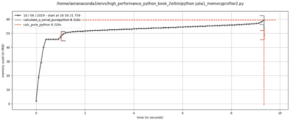

# 第二章：找出瓶颈的性能分析

*性能分析*能帮助我们找出瓶颈，使我们可以尽最少的努力获得最大的实际性能提升。虽然我们希望能够在速度上取得巨大进步并在资源使用上做出大幅度减少，但实际上，您会为了使代码“足够快”和“足够精简”来满足您的需求而努力。性能分析将帮助您为最少的总体工作量做出最为务实的决策。

任何可测量的资源都可以进行性能分析（不仅仅是 CPU！）。在这一章中，我们将研究 CPU 时间和内存使用情况。您也可以应用类似的技术来测量网络带宽和磁盘 I/O。

如果程序运行太慢或者使用了太多 RAM，您将希望修复您代码中负责这些问题的部分。当然，您可以跳过性能分析并修复您*认为*可能是问题的地方，但要小心，因为您往往会“修复”错误的东西。与其依赖您的直觉，最明智的做法是首先进行性能分析，定义了一个假设，然后再对代码结构进行更改。

有时候偷懒是件好事。通过先进行性能分析，您可以快速识别需要解决的瓶颈，然后您只需解决这些问题中的足够部分以达到所需的性能。如果您避免性能分析而直接进行优化，长远来看您很可能会做更多的工作。始终根据性能分析的结果来驱动您的工作。

# 高效的性能分析

性能分析的第一个目标是测试一个代表性系统，以确定什么地方慢（或者使用了太多 RAM，或者导致了过多的磁盘 I/O 或网络 I/O）。性能分析通常会增加开销（典型情况下可以是 10 倍到 100 倍的减速），而您仍希望您的代码在尽可能接近实际情况的情况下使用。提取一个测试用例，并隔离需要测试的系统部分。最好情况下，它们已经被编写为独立的模块集。

本章首先介绍的基本技术包括 IPython 中的`%timeit`魔术命令，`time.time()`和一个计时装饰器。您可以使用这些技术来理解语句和函数的行为。

然后，我们将介绍`cProfile`（“使用 cProfile 模块”），向您展示如何使用这个内置工具来理解代码中哪些函数运行时间最长。这将为您提供一个高层次的视图，以便您可以将注意力集中在关键函数上。

接下来，我们将介绍`line_profiler`（“使用 line_profiler 进行逐行测量”），它将逐行地对您选择的函数进行性能分析。结果将包括每行被调用的次数和每行所花费的时间百分比。这正是您需要了解什么正在运行缓慢以及为什么的信息。

有了`line_profiler`的结果，您将拥有继续使用编译器所需的信息（第七章）。

在第六章中，您将学习如何使用 `perf stat` 来了解在 CPU 上执行的指令数量以及 CPU 缓存的有效利用情况。这允许您对矩阵操作进行高级调优。完成本章后，您应该看看示例 6-8。

在使用 `line_profiler` 后，如果您正在处理长时间运行的系统，那么您可能会对 `py-spy` 感兴趣，以窥视已经运行的 Python 进程。

为了帮助您理解为什么 RAM 使用量很高，我们将展示 `memory_profiler`（“使用 memory_profiler 诊断内存使用情况”）。它特别适用于在标记的图表上跟踪 RAM 使用情况，以便您向同事解释为什么某些函数使用的 RAM 比预期多。

###### 警告

无论您采取何种方法来分析您的代码，您必须记住在您的代码中拥有充分的单元测试覆盖率。单元测试帮助您避免愚蠢的错误，并保持您的结果可重现性。不要因为它们而忽视它们。

在编译或重写算法之前*始终*对您的代码进行分析。您需要证据来确定使您的代码运行更快的最有效方法。

接下来，我们将向您介绍 Python 字节码在 CPython 中的使用（“使用 dis 模块检查 CPython 字节码”），以便您了解“底层”发生了什么。特别是，了解 Python 基于栈的虚拟机如何运行将帮助您理解为什么某些编码风格运行速度较慢。

在本章结束之前，我们将回顾如何在优化过程中集成单元测试以保持代码正确性（“在优化过程中进行单元测试以保持正确性”）。

我们最后将讨论性能分析策略（“成功分析代码的策略”），以便您可以可靠地分析您的代码并收集正确的数据来测试您的假设。在这里，您将了解到动态 CPU 频率缩放和 Turbo Boost 等功能如何影响您的分析结果，以及如何禁用它们。

要走完所有这些步骤，我们需要一个易于分析的函数。下一节介绍了朱利亚集。它是一个对 RAM 需求较高的 CPU 绑定函数；它还表现出非线性行为（因此我们不能轻易预测结果），这意味着我们需要在运行时而不是离线分析它。

# 介绍朱利亚集

[朱利亚集](https://oreil.ly/zJ1oB) 是一个我们开始的有趣的 CPU 绑定问题。它是一个产生复杂输出图像的分形序列，以加斯顿·朱利亚命名。

接下来的代码比你自己可能写的版本稍长一些。它包含一个 CPU 绑定的组件和一个非常明确的输入集。这种配置使我们能够分析 CPU 和 RAM 的使用情况，从而理解我们的代码中哪些部分消耗了我们稀缺的计算资源。这个实现故意地不够优化，这样我们可以识别出消耗内存的操作和执行缓慢的语句。在本章的后面，我们将修复一个执行缓慢的逻辑语句和一个消耗内存的语句，在第七章中，我们将显著加快此函数的总执行时间。

我们将分析一个生成假灰度图（图 2-1）和朱利亚集的纯灰度变体（图 2-3）的代码块，复数点为`c=-0.62772-0.42193j`。朱利亚集通过独立计算每个像素来生成；这是一个“尴尬并行问题”，因为点之间没有共享数据。


###### 图 2-1\. 朱利亚集的绘图，使用灰度假色以突出细节

如果我们选择了不同的`c`，我们会得到不同的图像。我们选择的位置有些区域计算迅速，而其他区域计算缓慢；这对我们的分析很有用。

这个问题很有趣，因为我们通过应用可能无数次的循环来计算每个像素。在每次迭代中，我们测试这个坐标的值是否朝无穷远处逃逸，或者是否被某个吸引子吸引住。导致少量迭代的坐标在图 2-1 中被着深色，而导致大量迭代的坐标则被着白色。白色区域的计算更复杂，因此生成时间更长。

我们定义了一组将要测试的*z*坐标。我们计算的函数对复数`z`进行平方，并加上`c`：

<math display="block" alttext="f left-parenthesis z right-parenthesis equals z squared plus c"><mrow><mi>f</mi> <mrow><mo>(</mo> <mi>z</mi> <mo>)</mo></mrow> <mo>=</mo> <msup><mi>z</mi> <mn>2</mn></msup> <mo>+</mo> <mi>c</mi></mrow></math>

我们在测试时迭代这个函数，同时使用`abs`检测是否满足逃逸条件。如果逃逸函数为`False`，我们跳出循环并记录在这个坐标处执行的迭代次数。如果逃逸函数从未为`False`，我们将在`maxiter`次迭代后停止。我们随后会将这个`z`的结果转换为一个表示这个复数位置的彩色像素。

伪代码可能是这样的：

```py
for z in coordinates:
    for iteration in range(maxiter):  # limited iterations per point
        if abs(z) < 2.0:  # has the escape condition been broken?
            z = z*z + c
        else:
            break
    # store the iteration count for each z and draw later
```

要解释这个函数，让我们尝试两个坐标。

我们将使用绘图左上角的坐标`-1.8-1.8j`。在我们尝试更新规则之前，我们必须测试`abs(z) < 2`：

```py
z = -1.8-1.8j
print(abs(z))
```

```py
2.54558441227
```

我们可以看到，对于左上角的坐标，`abs(z)`测试在零次迭代时将为`False`，因为`2.54 >= 2.0`，所以我们不执行更新规则。这个坐标的`output`值为`0`。

现在让我们跳到绘图的中心，`z = 0 + 0j`，并尝试几次迭代：

```py
c = -0.62772-0.42193j
z = 0+0j
for n in range(9):
    z = z*z + c
    print(f"{n}: z={z: .5f}, abs(z)={abs(z):0.3f}, c={c: .5f}")
```

```py
0: z=-0.62772-0.42193j, abs(z)=0.756, c=-0.62772-0.42193j
1: z=-0.41171+0.10778j, abs(z)=0.426, c=-0.62772-0.42193j
2: z=-0.46983-0.51068j, abs(z)=0.694, c=-0.62772-0.42193j
3: z=-0.66777+0.05793j, abs(z)=0.670, c=-0.62772-0.42193j
4: z=-0.18516-0.49930j, abs(z)=0.533, c=-0.62772-0.42193j
5: z=-0.84274-0.23703j, abs(z)=0.875, c=-0.62772-0.42193j
6: z= 0.02630-0.02242j, abs(z)=0.035, c=-0.62772-0.42193j
7: z=-0.62753-0.42311j, abs(z)=0.757, c=-0.62772-0.42193j
8: z=-0.41295+0.10910j, abs(z)=0.427, c=-0.62772-0.42193j
```

我们可以看到，对于这些首次迭代的每次更新`z`，它的值都满足`abs(z) < 2`为`True`。对于这个坐标，我们可以迭代 300 次，测试仍为`True`。我们无法确定在条件变为`False`之前必须执行多少次迭代，这可能是一个无限序列。最大迭代（`maxiter`）中断子句将阻止我们无限迭代。

在图 2-2 中，我们看到了前 50 次迭代的序列。对于`0+0j`（实线与圆形标记），序列似乎每 8 次迭代重复一次，但每个 7 次计算序列与前一个序列有轻微偏差——我们无法确定这个点是否会在边界条件内永远迭代，或者长时间迭代，或者只是再迭代几次。虚线`cutoff`线显示在`+2`处的边界。


###### 图 2-2\. Julia 集的两个坐标示例演变

对于`-0.82+0j`（虚线与菱形标记），我们可以看到在第九次更新后，绝对结果超过了`+2`截止值，因此我们停止更新此值。

# 计算完整的 Julia 集

在本节中，我们将分解生成 Julia 集的代码。我们将在本章的各个部分进行多方面的分析。如示例 2-1 所示，在模块的开头，我们导入`time`模块以进行第一个性能分析，并定义一些坐标常量。

##### 示例 2-1\. 为坐标空间定义全局常量

```py
"""Julia set generator without optional PIL-based image drawing"""
import time

# area of complex space to investigate
x1, x2, y1, y2 = -1.8, 1.8, -1.8, 1.8
c_real, c_imag = -0.62772, -.42193
```

为了生成图形，我们创建两个输入数据列表。第一个是`zs`（复数*z*坐标），第二个是`cs`（复杂初始条件）。这两个列表都不变，我们可以将`cs`优化为单个`c`值作为常量。构建两个输入列表的原因是，当我们在本章后面分析 RAM 使用情况时，我们有一些合理的数据进行性能分析。

要构建`zs`和`cs`列表，我们需要知道每个`z`的坐标。在示例 2-2 中，我们使用`xcoord`和`ycoord`以及指定的`x_step`和`y_step`来构建这些坐标。这种设置有点冗长，但在将代码移植到其他工具（如`numpy`）和其他 Python 环境时很有用，因为它有助于为调试清晰地定义一切。

##### 示例 2-2\. 将坐标列表建立为我们计算函数的输入

```py
def calc_pure_python(desired_width, max_iterations):
    """Create a list of complex coordinates (zs) and complex parameters (cs),
 build Julia set"""
    x_step = (x2 - x1) / desired_width
    y_step = (y1 - y2) / desired_width
    x = []
    y = []
    ycoord = y2
    while ycoord > y1:
        y.append(ycoord)
        ycoord += y_step
    xcoord = x1
    while xcoord < x2:
        x.append(xcoord)
        xcoord += x_step
    # build a list of coordinates and the initial condition for each cell.
    # Note that our initial condition is a constant and could easily be removed,
    # we use it to simulate a real-world scenario with several inputs to our
    # function
    zs = []
    cs = []
    for ycoord in y:
        for xcoord in x:
            zs.append(complex(xcoord, ycoord))
            cs.append(complex(c_real, c_imag))

    print("Length of x:", len(x))
    print("Total elements:", len(zs))
    start_time = time.time()
    output = calculate_z_serial_purepython(max_iterations, zs, cs)
    end_time = time.time()
    secs = end_time - start_time
    print(calculate_z_serial_purepython.__name__ + " took", secs, "seconds")

    # This sum is expected for a 1000² grid with 300 iterations
    # It ensures that our code evolves exactly as we'd intended
    assert sum(output) == 33219980
```

构建了`zs`和`cs`列表后，我们输出了关于列表大小的一些信息，并通过`calculate_z_serial_purepython`计算了`output`列表。最后，我们对`output`的内容进行了`sum`并`assert`其与预期输出值匹配。Ian 在这里使用它来确认书中没有错误。

因为代码是确定性的，我们可以通过对所有计算出的值求和来验证函数按预期工作。这在检查代码中的数值变化时非常有用，*非常*明智，以确保算法没有出错。理想情况下，我们会使用单元测试，并测试问题的多种配置。

接下来，在示例 2-3 中，我们定义了`calculate_z_serial_purepython`函数，该函数扩展了我们之前讨论的算法。值得注意的是，我们还在开头定义了一个与输入`zs`和`cs`列表长度相同的`output`列表。

##### 示例 2-3\. 我们的 CPU 绑定计算函数

```py
def calculate_z_serial_purepython(maxiter, zs, cs):
    """Calculate output list using Julia update rule"""
    output = [0] * len(zs)
    for i in range(len(zs)):
        n = 0
        z = zs[i]
        c = cs[i]
        while abs(z) < 2 and n < maxiter:
            z = z * z + c
            n += 1
        output[i] = n
    return output
```

现在我们在示例 2-4 中调用计算例程。通过将其包装在`__main__`检查中，我们可以安全地导入模块，而不会启动某些分析方法的计算。这里我们不展示用于绘制输出的方法。

##### 示例 2-4\. 我们代码的`__main__`

```py
if __name__ == "__main__":
    # Calculate the Julia set using a pure Python solution with
    # reasonable defaults for a laptop
    calc_pure_python(desired_width=1000, max_iterations=300)
```

一旦我们运行代码，就会看到有关问题复杂性的一些输出：

```py
# running the above produces:
Length of x: 1000
Total elements: 1000000
calculate_z_serial_purepython took 8.087012767791748 seconds
```

在错误的灰度图（图例 2-1）中，高对比度的颜色变化使我们了解了函数成本变化缓慢或迅速的位置。在这里，我们使用线性颜色映射的图例 2-3 中，黑色计算速度快，白色计算费时。

通过展示相同数据的两种表示，我们可以看到线性映射中丢失了大量细节。在调查函数成本时，有时记住多种表示形式是有用的。


###### 图 2-3\. 使用纯灰度绘制的 Julia 图例

# 时间测量的简单方法——打印和装饰器

在示例 2-4 之后，我们看到了代码中几个`print`语句生成的输出。在 Ian 的笔记本电脑上，此代码使用 CPython 3.7 运行大约需要 8 秒。需要注意的是，执行时间总是会有所变化。在计时代码时，必须注意正常的变化，否则可能会错误地将代码改进归因为执行时间的随机变化。

在运行代码时，您的计算机会执行其他任务，例如访问网络、磁盘或 RAM，这些因素会导致程序执行时间的变化。

Ian 的笔记本电脑是戴尔 9550，配有 Intel Core I7 6700HQ 处理器（2.6 GHz，6 MB 缓存，四核支持超线程）和 32 GB RAM，运行 Linux Mint 19.1（Ubuntu 18.04）。

在`calc_pure_python`中（示例 2-2），我们可以看到几个`print`语句。这是测量函数内部代码执行时间的最简单方法。虽然这是一种快速而不太精确的方法，但在初次查看代码时非常有用。

在调试和性能分析代码时，使用`print`语句很常见。它快速变得难以管理，但对于短期调查非常有用。在完成时，请尽量整理`print`语句，否则它们会杂乱你的`stdout`。

一种稍微更清晰的方法是使用*装饰器*——在这里，我们在我们关心的函数上面添加一行代码。我们的装饰器可以非常简单，只需复制`print`语句的效果。稍后，我们可以使其更为高级。

在示例 2-5 中，我们定义了一个新的函数`timefn`，它将一个函数作为参数：内部函数`measure_time`接受`*args`（可变数量的位置参数）和`**kwargs`（可变数量的关键字参数），并将它们传递给`fn`以执行。在执行`fn`周围，我们捕获`time.time()`并且`print`结果以及`fn.__name__`。使用这个装饰器的开销很小，但如果你调用`fn`数百万次，这种开销可能会变得明显。我们使用`@wraps(fn)`来将函数名和文档字符串暴露给装饰函数的调用者（否则，我们将会看到装饰器的函数名和文档字符串，而不是它装饰的函数）。

##### 示例 2-5\. 定义一个装饰器来自动化计时测量

```py
from functools import wraps

def timefn(fn):
    @wraps(fn)
    def measure_time(*args, **kwargs):
        t1 = time.time()
        result = fn(*args, **kwargs)
        t2 = time.time()
        print(f"@timefn: {fn.__name__} took {t2 - t1} seconds")
        return result
    return measure_time

@timefn
def calculate_z_serial_purepython(maxiter, zs, cs):
    ...
```

当我们运行这个版本（我们保留了以前的`print`语句）时，我们可以看到装饰版本的执行时间略微比从`calc_pure_python`调用快。这是由于调用函数的开销（差异非常微小）造成的。

```py
Length of x: 1000
Total elements: 1000000
@timefn:calculate_z_serial_purepython took 8.00485110282898 seconds
calculate_z_serial_purepython took 8.004898071289062 seconds
```

###### 注意

添加分析信息无疑会减慢代码执行速度——某些分析选项非常详细，并且会导致严重的速度惩罚。分析详细程度和速度之间的权衡是你必须考虑的事情。

我们可以使用`timeit`模块作为另一种获取 CPU 绑定函数执行速度粗略测量的方法。更典型的情况下，你会在尝试解决问题的不同方式时，使用它来计时不同类型的简单表达式。

###### 警告

`timeit`模块暂时禁用垃圾回收器。如果垃圾回收器通常会被你的操作调用，那么这可能会影响你在实际操作中看到的速度。请参阅[Python 文档](https://oreil.ly/2Zvyk)获取相关帮助。

从命令行，你可以像下面这样运行`timeit`：

```py
python -m timeit -n 5 -r 1 -s "import julia1" \
 "julia1.calc_pure_python(desired_width=1000, max_iterations=300)"
```

注意，你必须使用`-s`将模块导入为设置步骤，因为`calc_pure_python`就在那个模块里。对于长时间运行的函数，`timeit`有一些合理的默认设置，但对于更长时间的函数，可以明智地指定循环次数（`-n 5`）和重复次数（`-r 5`）来重复实验。所有重复实验中的最佳结果将作为答案给出。添加详细标志（`-v`）会显示每个重复实验中所有循环的累积时间，这有助于了解结果的变化。

默认情况下，如果我们在这个函数上运行 `timeit` 而不指定 `-n` 和 `-r`，它会运行 10 次循环，每次重复 5 次，完成时间大约为 6 分钟。如果你想更快地获得结果，覆盖默认设置可能是有意义的。

我们只对最佳情况的结果感兴趣，因为其他结果可能已经受到其他进程的影响：

```py
5 loops, best of 1: 8.45 sec per loop
```

尝试多次运行基准测试以检查是否得到不同的结果——你可能需要更多的重复次数来获得稳定的最快结果时间。没有“正确”的配置，所以如果你看到计时结果有很大的变化，请增加重复次数，直到最终结果稳定。

我们的结果显示，调用 `calc_pure_python` 的总耗时为 8.45 秒（作为最佳情况），而单个调用 `calculate_z_serial_purepython` 由 `@timefn` 装饰器测量的时间为 8.0 秒。差异主要是用于创建 `zs` 和 `cs` 列表的时间。

在 IPython 中，我们可以以同样的方式使用魔术 `%timeit`。如果你在 IPython 或 Jupyter Notebook 中交互式地开发代码，可以使用这个：

```py
In [1]: import julia1
In [2]: %timeit julia1.calc_pure_python(desired_width=1000, max_iterations=300)
```

###### 警告

要注意，“最佳”是由 `timeit.py` 方法和 Jupyter 和 IPython 中 `%timeit` 方法不同计算得出的。`timeit.py` 使用最小值。2016 年起，IPython 改为使用均值和标准差。两种方法都有其缺陷，但总体上它们都“相当不错”；尽管如此，不能直接比较它们。选择一种方法使用，不要混用。

值得考虑的是，普通计算机的负载变化。许多后台任务正在运行（例如 Dropbox、备份），可能会随机影响 CPU 和磁盘资源。网页中的脚本也可能导致不可预测的资源使用。图 2-4 显示此计算机上单个 CPU 在我们刚刚执行的某些计时步骤中使用了 100%，而该机器上的其他核心则轻度工作于其他任务。


###### 图 2-4\. Ubuntu 上的系统监视器显示我们计时函数时后台 CPU 使用变化

有时，系统监视器显示此计算机上的活动突然增加。检查系统监视器以确保没有其他东西干扰你的关键资源（CPU、磁盘、网络）是明智的做法。

# 使用 Unix 时间命令进行简单计时

我们可以暂时离开 Python，使用 Unix-like 系统上的标准系统实用程序。以下内容将记录程序的执行时间的各种视图，并且不会关心代码的内部结构：

```py
$ /usr/bin/time -p python julia1_nopil.py
Length of x: 1000
Total elements: 1000000
calculate_z_serial_purepython took 8.279886722564697 seconds
real 8.84
user 8.73
sys 0.10
```

注意，我们特别使用 `/usr/bin/time` 而不是 `time`，以便获取系统的 `time` 而不是我们的 shell 中较简单（且不太有用）的版本。如果你尝试 `time --verbose` 时出现错误，你可能正在看 shell 的内置 `time` 命令，而不是系统命令。

使用 `-p` 可移植性标志，我们得到三个结果：

+   `real` 记录了实际经过的墙上或经过的时间。

+   `user` 记录了 CPU 在执行您的任务时在内核函数之外所花费的时间。

+   `sys` 记录了在内核级别函数中花费的时间。

通过添加 `user` 和 `sys`，您可以了解 CPU 花费了多少时间。这与 `real` 的差异可能告诉您有多少时间花在等待 I/O 上；这也可能表明您的系统正在忙于运行其他扭曲您测量的任务。

`time` 非常有用，因为它不特定于 Python。它包括启动 `python` 可执行文件所花费的时间，如果您启动了大量的新进程（而不是运行长时间的单个进程），这可能是重要的。如果您经常运行短暂的脚本，启动时间可能是整体运行时间的一个重要部分，那么 `time` 可以是一个更有用的度量。

我们可以添加 `--verbose` 标志来获得更多输出：

```py
$ /usr/bin/time --verbose python julia1_nopil.py
Length of x: 1000
Total elements: 1000000
calculate_z_serial_purepython took 8.477287530899048 seconds
 Command being timed: "python julia1_nopil.py"
 User time (seconds): 8.97
 System time (seconds): 0.05
 Percent of CPU this job got: 99%
 Elapsed (wall clock) time (h:mm:ss or m:ss): 0:09.03
 Average shared text size (kbytes): 0
 Average unshared data size (kbytes): 0
 Average stack size (kbytes): 0
 Average total size (kbytes): 0
 Maximum resident set size (kbytes): 98620
 Average resident set size (kbytes): 0
 Major (requiring I/O) page faults: 0
 Minor (reclaiming a frame) page faults: 26645
 Voluntary context switches: 1
 Involuntary context switches: 27
 Swaps: 0
 File system inputs: 0
 File system outputs: 0
 Socket messages sent: 0
 Socket messages received: 0
 Signals delivered: 0
 Page size (bytes): 4096
 Exit status: 0
```

这里可能最有用的指标是 `Major (requiring I/O) page faults`，因为这表明操作系统是否不得不从磁盘加载数据页，因为数据不再驻留在 RAM 中。这将导致速度降低。

在我们的示例中，代码和数据要求很小，因此没有页面错误发生。如果您有一个内存绑定的进程，或者有几个使用变量和大量 RAM 的程序，您可能会发现这为您提供了一个线索，即由于它的部分已经被交换到磁盘而减慢了操作系统级别的磁盘访问速度。

# 使用 cProfile 模块

`cProfile` 是标准库中内置的性能分析工具。它连接到 CPython 虚拟机，测量每个函数的运行时间。这会引入更大的开销，但您将得到更多对应的信息。有时，额外的信息可以带来对代码的惊人洞察。

`cProfile` 是标准库中的两个性能分析器之一，另一个是 `profile`。`profile` 是原始的纯 Python 性能分析器，速度较慢；`cProfile` 具有与 `profile` 相同的接口，但由于用 `C` 编写，开销较低。如果您对这些库的历史感兴趣，请参见 [Armin Rigo's 2005 request](http://bit.ly/cProfile_request) 来包含 `cProfile` 在标准库中。

在分析性能时一个好的实践是在分析之前对您的代码的速度生成一个*假设*。Ian 喜欢打印出相关的代码片段并加以注释。提前形成假设意味着您可以测量您的错误程度（而您将会！）并改进您对某些编码风格的直觉。

###### 警告

您绝不应该避免使用性能分析来取代直觉（我们警告您——您*肯定会*错！）。提前形成假设以帮助您学会识别代码中可能慢的选择是绝对值得的，您应该始终用证据支持您的选择。

始终依据你测量到的结果进行驱动，并始终从一些快速而粗糙的分析开始，以确保你正在解决正确的问题。没有比聪明地优化代码的一个部分，然后意识到（数小时或数天后）你错过了最慢的部分，实际上根本没有解决底层问题更令人感到羞愧的事情了。

假设`calculate_z_serial_purepython`是代码中最慢的部分。在这个函数中，我们进行了大量的解引用操作，并调用了许多基本算术运算符和`abs`函数。这些可能会显示为 CPU 资源的消耗者。

在这里，我们将使用`cProfile`模块来运行代码的一个变体。输出很简单，但帮助我们找出需要进一步分析的地方。

`-s cumulative`标志告诉`cProfile`按累积时间对每个函数进行排序；这使我们能够查看代码部分中最慢的部分。`cProfile`的输出直接写入屏幕，紧随我们通常的`print`结果之后。

```py
$ python -m cProfile -s cumulative julia1_nopil.py
...
Length of x: 1000
Total elements: 1000000
calculate_z_serial_purepython took 11.498265266418457 seconds
         36221995 function calls in 12.234 seconds

  Ordered by: cumulative time

  ncalls  tottime  percall  cumtime  percall filename:lineno(function)
       1    0.000    0.000   12.234   12.234 {built-in method builtins.exec}
       1    0.038    0.038   12.234   12.234 julia1_nopil.py:1(<module>)
       1    0.571    0.571   12.197   12.197 julia1_nopil.py:23
                                              (calc_pure_python)
       1    8.369    8.369   11.498   11.498 julia1_nopil.py:9
                                              (calculate_z_serial_purepython)
34219980    3.129    0.000    3.129    0.000 {built-in method builtins.abs}
 2002000    0.121    0.000    0.121    0.000 {method 'append' of 'list' objects}
       1    0.006    0.006    0.006    0.006 {built-in method builtins.sum}
       3    0.000    0.000    0.000    0.000 {built-in method builtins.print}
       2    0.000    0.000    0.000    0.000 {built-in method time.time}
       4    0.000    0.000    0.000    0.000 {built-in method builtins.len}
       1    0.000    0.000    0.000    0.000 {method 'disable' of
                                              '_lsprof.Profiler' objects}
```

按累积时间排序使我们对代码中大部分执行时间都花在哪里有了一个概念。这个结果显示，在 12 秒多的时间里，执行了 36221995 次函数调用（这个时间包括使用`cProfile`的开销）。以前，我们的代码执行大约需要 8 秒钟，现在我们通过测量每个函数执行的时间增加了 4 秒的惩罚。

我们可以看到代码的入口点`julia1_nopil.py`在第 1 行上总共花费了 12 秒钟。这只是对`calc_pure_python`的`__main__`调用。`ncalls`为 1，表示这行代码只执行了一次。

在`calc_pure_python`内部，调用`calculate_z_serial_purepython`耗时 11 秒。这两个函数只被调用一次。我们可以推断，在`calc_pure_python`内部的代码行大约花费了 1 秒钟的时间，与调用 CPU 密集型的`calculate_z_serial_purepython`函数是分开的。然而，我们无法通过`cProfile`确定在函数内部哪些行花费了时间。

在`calculate_z_serial_purepython`内部，代码行的时间（不调用其他函数）是 8 秒。这个函数调用了 34219980 次`abs`，总共耗时 3 秒，还有其他调用时间不多的函数。

那么`{abs}`调用呢？这行代码测量了`calculate_z_serial_purepython`内部调用`abs`函数的次数。虽然每次调用的成本微不足道（记录为 0.000 秒），但 34219980 次调用的总时间为 3 秒。我们无法预测到`abs`会被调用多少次，因为 Julia 函数具有不可预测的动态特性（这也是我们感兴趣的原因）。

我们最好可以说，它将至少被调用 100 万次，因为我们正在计算`1000*1000`像素。在最坏的情况下，它将被调用 3 亿次，因为我们计算 100 万像素最多 300 次迭代。因此，3420 万次调用大约占最坏情况的 10%。

如果我们查看原始的灰度图像（图 2-3）并将白色部分压缩在一起并挤入一个角落，我们可以估计昂贵的白色区域大约占了图像的其余部分的 10%。

分析输出中的下一行，`{method 'append' of 'list' objects}`，详细描述了创建了 2,002,000 个列表项。

###### 提示

为什么是 2,002,000 个项目？在继续阅读之前，请思考一下有多少个列表项正在被构建。

在设置阶段，正在发生 2,002,000 个项目的创建，这发生在 `calc_pure_python` 中。

`zs` 和 `cs` 列表将分别为 `1000*1000` 个项目（生成 1,000,000 * 2 次调用），这些列表是从 1,000 *x* 和 1,000 *y* 坐标的列表构建的。总共，这是 2,002,000 次调用 `append`。

重要的是要注意，这个 `cProfile` 输出不是按父函数排序的；它在执行的代码块中总结了所有函数的开销。使用 `cProfile` 逐行了解发生的情况非常困难，因为我们只获取函数调用本身的概要信息，而不是函数内的每一行。

在 `calculate_z_serial_purepython` 中，我们可以考虑 `{abs}`，总体而言，这个函数的成本约为 3.1 秒。我们知道 `calculate_z_serial_purepython` 总共花费了 11.4 秒。

分析输出的最后一行提到了 `lsprof`；这是演变为 `cProfile` 的工具的原始名称，可以忽略不计。

要更好地控制 `cProfile` 的结果，我们可以编写一个统计文件，然后在 Python 中进行分析：

```py
$ python -m cProfile -o profile.stats julia1.py
```

我们可以按照以下方式将其加载到 Python 中，它会给我们与之前相同的累积时间报告：

```py
In [1]: import pstats
In [2]: p = pstats.Stats("profile.stats")
In [3]: p.sort_stats("cumulative")
Out[3]: <pstats.Stats at 0x7f77088edf28>

In [4]: p.print_stats()
Fri Jun 14 17:59:28 2019    profile.stats

         36221995 function calls in 12.169 seconds

  Ordered by: cumulative time

  ncalls  tottime  percall  cumtime  percall filename:lineno(function)
       1    0.000    0.000   12.169   12.169 {built-in method builtins.exec}
       1    0.033    0.033   12.169   12.169 julia1_nopil.py:1(<module>)
       1    0.576    0.576   12.135   12.135 julia1_nopil.py:23
                                              (calc_pure_python)
       1    8.266    8.266   11.429   11.429 julia1_nopil.py:9
                                              (calculate_z_serial_purepython)
34219980    3.163    0.000    3.163    0.000 {built-in method builtins.abs}
 2002000    0.123    0.000    0.123    0.000 {method 'append' of 'list' objects}
       1    0.006    0.006    0.006    0.006 {built-in method builtins.sum}
       3    0.000    0.000    0.000    0.000 {built-in method builtins.print}
       4    0.000    0.000    0.000    0.000 {built-in method builtins.len}
       2    0.000    0.000    0.000    0.000 {built-in method time.time}
       1    0.000    0.000    0.000    0.000 {method 'disable' of
                                              '_lsprof.Profiler' objects}
```

要追踪我们正在分析的函数，我们可以打印调用者信息。在以下两个列表中，我们可以看到 `calculate_z_serial_purepython` 是最昂贵的函数，它只从一个地方调用。如果它被多处调用，这些列表可能会帮助我们缩小最昂贵父函数的位置：

```py
In [5]: p.print_callers()
   Ordered by: cumulative time

Function                                          was called by...
                                                ncalls  tottime cumtime
{built-in method builtins.exec}       <-
julia1_nopil.py:1(<module>)           <-       1    0.033   12.169
                                               {built-in method builtins.exec}
julia1_nopil.py:23(calc_pure_python)  <-       1    0.576   12.135
                                               :1(<module>)
julia1_nopil.py:9(...)                <-       1    8.266   11.429
                                               :23(calc_pure_python)
{built-in method builtins.abs}        <- 34219980   3.163    3.163
                                               :9(calculate_z_serial_purepython)
{method 'append' of 'list' objects}   <- 2002000    0.123    0.123
                                               :23(calc_pure_python)
{built-in method builtins.sum}        <-       1    0.006    0.006
                                               :23(calc_pure_python)
{built-in method builtins.print}      <-       3    0.000    0.000
                                               :23(calc_pure_python)
{built-in method builtins.len}        <-       2    0.000    0.000
                                               :9(calculate_z_serial_purepython)
                                               2    0.000    0.000
                                               :23(calc_pure_python)
{built-in method time.time}           <-       2    0.000    0.000
                                               :23(calc_pure_python)
```

我们可以将这个过程反过来，显示哪些函数调用其他函数：

```py
In [6]: p.print_callees()
   Ordered by: cumulative time

Function                                          called...
                                              ncalls  tottime  cumtime
{built-in method builtins.exec}      ->       1    0.033   12.169
                                              julia1_nopil.py:1(<module>)
julia1_nopil.py:1(<module>)          ->       1    0.576   12.135
                                              julia1_nopil.py:23
                                                (calc_pure_python)
julia1_nopil.py:23(calc_pure_python) ->       1    8.266   11.429
                                              julia1_nopil.py:9
                                                (calculate_z_serial_purepython)
                                              2    0.000    0.000
                                              {built-in method builtins.len}
                                              3    0.000    0.000
                                              {built-in method builtins.print}
                                              1    0.006    0.006
                                              {built-in method builtins.sum}
                                              2    0.000    0.000
                                              {built-in method time.time}
                                        2002000    0.123    0.123
                                              {method 'append' of 'list' objects}
julia1_nopil.py:9(...)              -> 34219980    3.163    3.163
                                              {built-in method builtins.abs}
					                          2    0.000    0.000
                                              {built-in method builtins.len}
```

`cProfile` 相当冗长，如果不进行很多换行，你需要一个侧屏才能看到它。然而，由于它是内置的，因此它是一个快速识别瓶颈的方便工具。像 `line_profiler` 和 `memory_profiler` 这样的工具，我们稍后在本章中讨论，将帮助您深入到您应该关注的特定行。

# 使用 SnakeViz 可视化 cProfile 输出

`snakeviz` 是一个可视化工具，它将 `cProfile` 的输出绘制为一个图表，其中较大的框表示运行时间较长的代码区域。它取代了较旧的 `runsnake` 工具。

使用 `snakeviz` 可以对 `cProfile` 统计文件进行高层次的理解，特别是当你在调查一个你对其了解较少的新项目时。该图表将帮助你可视化系统的 CPU 使用行为，并且可能突显出你未曾预料到的开销较大的部分。

要安装 SnakeViz，请使用 `$ pip install snakeviz`。

在 图 2-5 中，我们有刚刚生成的 *profile.stats* 文件的视觉输出。图表顶部显示了程序的入口点。每个向下的层级表示从上面的函数调用的函数。

图表的宽度代表程序执行所需的整体时间。第四层显示大部分时间花费在 `calculate_z_serial_purepython` 中。第五层进一步分解了这一点——右侧未注释的区块大约占据了该层的 25%，代表在 `abs` 函数中花费的时间。快速看到这些较大的块可以迅速理解程序内部时间的分配情况。


###### 图 2-5\. `snakeviz` 可视化 profile.stats

下一节显示的表格是我们刚刚查看过的统计数据的漂亮打印版本，你可以按 `cumtime`（累计时间）、`percall`（每次调用成本）或 `ncalls`（总调用次数）等分类进行排序。从 `cumtime` 开始将告诉你哪些函数总体成本最高。它们是开始调查的一个很好的起点。

如果你习惯查看表格，`cProfile` 的控制台输出可能已经足够了。为了与他人交流，我们强烈建议使用图表，比如来自 `snakeviz` 的此类输出，以帮助其他人快速理解你的观点。

# 使用 `line_profiler` 进行逐行测量

依据伊恩的观点，Robert Kern 的 `line_profiler` 是识别 Python 代码中 CPU 绑定问题原因的最强工具。它通过逐行分析单个函数的性能来工作，因此你应该从 `cProfile` 开始，并使用高层次视图指导选择要使用 `line_profiler` 进行分析的函数。

当你修改代码时，值得打印并注释此工具输出的版本，这样你就能记录下（成功或失败的）更改，以便快速查阅。在逐行更改代码时，不要依赖于你的记忆。

要安装 `line_profiler`，请输入命令 `pip install line_profiler`。

用装饰器 (`@profile`) 标记选择的函数。使用 `kernprof` 脚本来执行你的代码，并记录选定函数每行的 CPU 时间和其他统计信息。

参数`-l`表示按行（而不是函数级别）进行分析，`-v`表示详细输出。如果没有`-v`，你将得到一个*.lprof*输出，稍后可以使用`line_profiler`模块进行分析。在示例 2-6 中，我们将对我们的 CPU 绑定函数进行全面运行。

##### 示例 2-6\. 运行`kernprof`以记录装饰函数的逐行 CPU 执行成本

```py
$ kernprof -l -v julia1_lineprofiler.py
...
Wrote profile results to julia1_lineprofiler.py.lprof
Timer unit: 1e-06 s

Total time: 49.2011 s
File: julia1_lineprofiler.py
Function: calculate_z_serial_purepython at line 9

Line #      Hits  Per Hit   % Time  Line Contents
==============================================================
     9                              @profile
    10                              def calculate_z_serial_purepython(maxiter,
                                                                      zs, cs):
    11                            """Calculate output list using Julia update rule"""
    12         1   3298.0      0.0      output = [0] * len(zs)
    13   1000001      0.4      0.8      for i in range(len(zs)):
    14   1000000      0.4      0.7          n = 0
    15   1000000      0.4      0.9          z = zs[i]
    16   1000000      0.4      0.8          c = cs[i]
    17  34219980      0.5     38.0          while abs(z) < 2 and n < maxiter:
    18  33219980      0.5     30.8              z = z * z + c
    19  33219980      0.4     27.1              n += 1
    20   1000000      0.4      0.8          output[i] = n
    21         1      1.0      0.0      return output
```

引入`kernprof.py`会显著增加运行时间。在这个例子中，`calculate_z_serial_purepython`花费了 49 秒；这比简单使用`print`语句的 8 秒和使用`cProfile`的 12 秒要长。好处在于我们可以得到函数内部时间分布的逐行详细信息。

`% Time`列是最有帮助的——我们可以看到 38%的时间用于`while`测试上。我们不知道第一个语句（`abs(z) < 2`）是否比第二个语句（`n < maxiter`）更昂贵。在循环内部，我们还看到对`z`的更新也相当昂贵。甚至`n += 1`也很昂贵！Python 的动态查找机制在每个循环中都在工作，即使我们在每个循环中使用相同的类型来定义每个变量——这就是编译和类型专门化（第七章）给我们带来巨大优势的地方。与`while`循环的成本相比，`output`列表的创建和第 20 行的更新相对较便宜。

如果你之前没有考虑过 Python 动态机制的复杂性，请考虑一下`n += 1`操作会发生什么。Python 必须检查`n`对象是否有`__add__`函数（如果没有，它会沿袭任何继承类来查看它们是否提供此功能），然后将另一个对象（在本例中为`1`）传入，以便`__add__`函数可以决定如何处理操作。请记住，第二个参数可能是一个`float`或其他可能与之兼容或不兼容的对象。所有这些都是动态发生的。

进一步分析`while`语句的明显方法是将其分解。虽然在 Python 社区中已经有一些关于重写*.pyc*文件以提供更详细的多部分单行语句信息的讨论，但我们不知道任何生产工具比`line_profiler`提供更精细的分析。

在示例 2-7 中，我们将`while`逻辑分解为几个语句。这种额外的复杂性将增加函数的运行时间，因为我们需要执行更多的代码行，但这*可能*也有助于我们理解代码的这部分所产生的成本。

###### 提示

*在查看代码之前*，你认为我们能通过这种方式学习到基本操作的成本吗？其他因素可能会使分析复杂化吗？

##### 示例 2-7\. 将复合`while`语句分解为单独的语句，记录原始语句的每个部分的成本

```py
$ kernprof -l -v julia1_lineprofiler2.py
...
Wrote profile results to julia1_lineprofiler2.py.lprof
Timer unit: 1e-06 s

Total time: 82.88 s
File: julia1_lineprofiler2.py
Function: calculate_z_serial_purepython at line 9

Line #      Hits  Per Hit   % Time  Line Contents
==============================================================
     9                              @profile
    10                              def calculate_z_serial_purepython(maxiter,
                                                                      zs, cs):
    11                            """Calculate output list using Julia update rule"""
    12         1   3309.0      0.0      output = [0] * len(zs)
    13   1000001      0.4      0.5      for i in range(len(zs)):
    14   1000000      0.4      0.5          n = 0
    15   1000000      0.5      0.5          z = zs[i]
    16   1000000      0.4      0.5          c = cs[i]
    17   1000000      0.4      0.5          while True:
    18  34219980      0.6     23.1            not_yet_escaped = abs(z) < 2
    19  34219980      0.4     18.3            iterations_left = n < maxiter
    20  34219980      0.4     17.3            if not_yet_escaped and iterations_left:
    21  33219980      0.5     20.5                z = z * z + c
    22  33219980      0.4     17.3                n += 1
    23                                        else:
    24   1000000      0.4      0.5                break
    25   1000000      0.4      0.5          output[i] = n
    26         1      0.0      0.0      return output
```

这个版本的执行时间为 82 秒，而之前的版本为 49 秒。其他因素确实*使分析变得复杂*。在这种情况下，必须执行的额外语句次数为 34,219,980 次，导致代码变慢。如果我们没有使用`kernprof.py`逐行调查这一变化的影响，我们可能会对减速原因得出其他结论，因为我们缺乏必要的证据。

现在回到之前使用`timeit`技术来测试单个表达式的成本是有意义的：

```py
Python 3.7.3 (default, Mar 27 2019, 22:11:17)
Type 'copyright', 'credits', or 'license' for more information
IPython 7.5.0 -- An enhanced Interactive Python. Type '?' for help.

In [1]: z = 0+0j
In [2]: %timeit abs(z) < 2
97.6 ns ± 0.138 ns per loop (mean ± std. dev. of 7 runs, 10000000 loops each)
In [3]: n = 1
In [4]: maxiter = 300
In [5]: %timeit n < maxiter
42.1 ns ± 0.0355 ns per loop (mean ± std. dev. of 7 runs, 10000000 loops each)
```

从这个简单的分析中看来，对于 Python 语句的逻辑测试来说，`n`的逻辑测试速度要比调用`abs`快两倍以上。由于 Python 语句的评估顺序是从左到右且机会主义的，因此将最便宜的测试放在等式的左侧是有道理的。对于每个坐标的 301 次测试中的 1 次，`n < maxiter`测试将为`False`，因此 Python 不需要评估`and`运算符的另一侧。

我们在评估`abs(z) < 2`之前永远不知道它是否为`False`，并且我们对复平面这一区域的早期观察表明，在 300 次迭代中，大约 10%的时间是`True`。如果我们想对代码这部分的时间复杂度有一个深入的理解，继续数值分析是有意义的。然而，在这种情况下，我们希望进行一个简单的检查，看看我们是否能够迅速获得胜利。

我们可以提出一个新的假设：“通过交换`while`语句中运算符的顺序，我们将实现可靠的加速。”我们*可以*使用`kernprof`来测试这个假设，但是用这种方式进行分析会增加太多的额外开销。相反，我们可以使用代码的早期版本，运行一个测试，比较`while abs(z) < 2 and n < maxiter:`与`while n < maxiter and abs(z) < 2:`，我们在示例 2-8 中看到了这个例子。

在`line_profiler`之外运行这两个变体意味着它们以类似的速度运行。`line_profiler`的开销也会扰乱结果，并且第 17 行的两个版本的结果相似。我们应该拒绝在 Python 3.7 中改变逻辑顺序会导致一致加速的假设——没有明确的证据支持这一点。Ian 指出，对于 Python 2.7，我们*可以*接受这个假设，但在 Python 3.7 中不再适用。

采用更合适的方法来解决这个问题（例如，切换到使用 Cython 或 PyPy，如第七章中描述的）将会带来更大的收益。

我们可以对结果感到自信，因为以下原因：

+   我们提出了一个易于测试的假设。

+   我们修改了代码，以便只测试假设（永远不要同时测试两个事物！）。

+   我们收集了足够的证据来支持我们的结论。

为了全面，我们可以对包括我们的优化在内的两个主要函数运行最后的 `kernprof`，以确认我们对代码的整体复杂性有一个完整的理解。

##### 示例 2-8\. 交换复合 `while` 语句的顺序使函数稍微更快

```py
$ kernprof -l -v julia1_lineprofiler3.py
...
Wrote profile results to julia1_lineprofiler3.py.lprof
Timer unit: 1e-06 s

Total time: 48.9154 s
File: julia1_lineprofiler3.py
Function: calculate_z_serial_purepython at line 9

Line #    Hits  Per Hit % Time  Line Contents
=======================================================
   9                            @profile
  10                            def calculate_z_serial_purepython(maxiter,
                                                                  zs, cs):
  11                             """Calculate output list using Julia update rule"""
  12         1   3312.0    0.0      output = [0] * len(zs)
  13   1000001      0.4   0.8      for i in range(len(zs)):
  14   1000000      0.4   0.7          n = 0
  15   1000000      0.4   0.8          z = zs[i]
  16   1000000      0.4   0.8          c = cs[i]
  17  34219980      0.5  38.2          while n < maxiter and abs(z) < 2:
  18  33219980      0.5  30.7              z = z * z + c
  19  33219980      0.4  27.1              n += 1
  20   1000000      0.4   0.8          output[i] = n
  21         1      1.0   0.0      return output
```

正如预期的那样，从 示例 2-9 的输出中，我们可以看到 `calculate_z_serial_purepython` 在其父函数中占用了大部分（97%）的时间。与此相比，列表创建步骤则较小。

##### 示例 2-9\. 测试设置程序的逐行成本

```py
Total time: 88.334 s
File: julia1_lineprofiler3.py
Function: calc_pure_python at line 24

Line #      Hits  Per Hit   % Time  Line Contents
==============================================================
    24                              @profile
    25                              def calc_pure_python(draw_output,
                                                         desired_width,
                                                         max_iterations):
    26                               """Create a list of complex...
...
    44         1          1.0      0.0      zs = []
    45         1          0.0      0.0      cs = []
    46      1001          0.7      0.0      for ycoord in y:
    47   1001000          0.6      0.7          for xcoord in x:
    48   1000000          0.9      1.0            zs.append(complex(xcoord, ycoord))
    49   1000000          0.9      1.0            cs.append(complex(c_real, c_imag))
    50
    51         1         40.0      0.0      print("Length of x:", len(x))
    52         1          7.0      0.0      print("Total elements:", len(zs))
    53         1          4.0      0.0      start_time = time.time()
    54         1   85969310.0    97.3     output = calculate_z_serial_purepython \
                                           (max_iterations, zs, cs)
    55         1          4.0      0.0      end_time = time.time()
    56         1          1.0      0.0      secs = end_time - start_time
    57         1         36.0      0.0      print(calculate_z_serial...
    58
    59         1       6345.0      0.0      assert sum(output) == 33219980
```

`line_profiler` 为我们提供了有关循环内行和昂贵函数成本的深刻见解；尽管分析会增加速度惩罚，但它对科学开发人员是一个巨大的帮助。记得使用代表性数据来确保你专注于能为你带来最大收益的代码行。

# 使用 `memory_profiler` 诊断内存使用

就像 Robert Kern 的 `line_profiler` 包测量 CPU 使用情况一样，Fabian Pedregosa 和 Philippe Gervais 的 `memory_profiler` 模块按行测量内存使用情况。了解代码的内存使用特性使您可以问自己两个问题：

+   通过重写这个函数以更高效地工作，我们能否使用*更少*的 RAM？

+   通过缓存，我们能否使用*更多*的 RAM 并节省 CPU 周期？

`memory_profiler` 的操作方式与 `line_profiler` 非常相似，但运行速度慢得多。如果安装了 `psutil` 包（可选但建议安装），`memory_profiler` 将运行更快。内存分析可能会使您的代码运行速度慢 10 到 100 倍。在实际应用中，你可能偶尔会使用 `memory_profiler`，而更频繁地使用 `line_profiler`（用于 CPU 分析）。

使用命令 `pip install memory_profiler` 安装 `memory_profiler`（可选的还可以用 `pip install psutil`）。

如前所述，`memory_profiler` 的实现性能不如 `line_profiler`。因此，对于能在合理时间内完成的较小问题进行测试是有意义的。隔夜运行可能适合验证，但是你需要快速和合理的迭代来诊断问题和假设解决方案。示例 2-10 中的代码使用了完整的 1,000 × 1,000 网格，并且统计信息在 Ian 的笔记本电脑上收集大约花费了两个小时。

###### 注意

修改源代码的要求是一个小的烦恼。与 `line_profiler` 类似，一个装饰器（`@profile`）用于标记选择的函数。这将破坏你的单元测试，除非你创建一个虚拟的装饰器—参见 “No-op @profile Decorator”。

在处理内存分配时，您必须意识到情况并不像处理 CPU 使用率那样明确。一般来说，在可以自由使用的进程中过度分配内存更为高效，因为内存分配操作相对昂贵。此外，垃圾回收并不是即时的，因此对象可能在垃圾回收池中不可用，但仍然存在一段时间。

结果是，很难真正理解 Python 程序内存使用和释放的情况，因为一行代码可能不会分配确定量的内存*从外部过程中观察到的情况而言*。通过观察一组行的总体趋势，可能会比仅观察一行行为获得更好的见解。

让我们来看看`memory_profiler`在示例 2-10 中的输出。在第 12 行的`calculate_z_serial_purepython`函数内部，我们可以看到分配了 100 万个项目导致该进程增加了约 7 MB 的 RAM。¹ 这并不意味着`output`列表确实是 7 MB 的大小，只是在列表的内部分配过程中，该进程大约增长了 7 MB。

在第 46 行的父函数中，我们看到`zs`和`cs`列表的分配将`Mem usage`列从 48 MB 变为 125 MB（增加了+77 MB）。同样值得注意的是，这并不一定是数组的真实大小，只是在这些列表创建后进程增长的大小。

在撰写本文时，`memory_usage`模块存在一个 bug——`Increment`列并不总是与`Mem usage`列的变化相匹配。在本书第一版中，这些列是正确跟踪的；您可能需要查看在[GitHub](https://oreil.ly/vuQPN)上此 bug 的状态。我们建议您使用`Mem usage`列，因为这可以正确跟踪每行代码的进程大小变化。

##### 示例 2-10。在我们的两个主要函数中，`memory_profiler`的结果显示在`calculate_z_serial_purepython`中存在意外的内存使用。

```py
$ python -m memory_profiler julia1_memoryprofiler.py
...

Line #    Mem usage    Increment   Line Contents
================================================
     9  126.363 MiB  126.363 MiB   @profile
    10                             def calculate_z_serial_purepython(maxiter,
                                                                     zs, cs):
    11                                 """Calculate output list using...
    12  133.973 MiB    7.609 MiB       output = [0] * len(zs)
    13  136.988 MiB    0.000 MiB       for i in range(len(zs)):
    14  136.988 MiB    0.000 MiB           n = 0
    15  136.988 MiB    0.000 MiB           z = zs[i]
    16  136.988 MiB    0.000 MiB           c = cs[i]
    17  136.988 MiB    0.258 MiB           while n < maxiter and abs(z) < 2:
    18  136.988 MiB    0.000 MiB               z = z * z + c
    19  136.988 MiB    0.000 MiB               n += 1
    20  136.988 MiB    0.000 MiB           output[i] = n
    21  136.988 MiB    0.000 MiB       return output

...

Line #    Mem usage    Increment   Line Contents
================================================
    24   48.113 MiB   48.113 MiB   @profile
    25                             def calc_pure_python(draw_output,
                                                        desired_width,
                                                        max_iterations):
    26                                 """Create a list of complex...
    27   48.113 MiB    0.000 MiB       x_step = (x2 - x1) / desired_width
    28   48.113 MiB    0.000 MiB       y_step = (y1 - y2) / desired_width
    29   48.113 MiB    0.000 MiB       x = []
    30   48.113 MiB    0.000 MiB       y = []
    31   48.113 MiB    0.000 MiB       ycoord = y2
    32   48.113 MiB    0.000 MiB       while ycoord > y1:
    33   48.113 MiB    0.000 MiB           y.append(ycoord)
    34   48.113 MiB    0.000 MiB           ycoord += y_step
    35   48.113 MiB    0.000 MiB       xcoord = x1
    36   48.113 MiB    0.000 MiB       while xcoord < x2:
    37   48.113 MiB    0.000 MiB           x.append(xcoord)
    38   48.113 MiB    0.000 MiB           xcoord += x_step
    44   48.113 MiB    0.000 MiB       zs = []
    45   48.113 MiB    0.000 MiB       cs = []
    46  125.961 MiB    0.000 MiB       for ycoord in y:
    47  125.961 MiB    0.258 MiB           for xcoord in x:
    48  125.961 MiB    0.512 MiB               zs.append(complex(xcoord, ycoord))
    49  125.961 MiB    0.512 MiB               cs.append(complex(c_real, c_imag))
    50
    51  125.961 MiB    0.000 MiB       print("Length of x:", len(x))
    52  125.961 MiB    0.000 MiB       print("Total elements:", len(zs))
    53  125.961 MiB    0.000 MiB       start_time = time.time()
    54  136.609 MiB   10.648 MiB       output = calculate_z_serial...
    55  136.609 MiB    0.000 MiB       end_time = time.time()
    56  136.609 MiB    0.000 MiB       secs = end_time - start_time
    57  136.609 MiB    0.000 MiB       print(calculate_z_serial_purepython...
    58
    59  136.609 MiB    0.000 MiB       assert sum(output) == 33219980
```

另一种可视化内存使用变化的方法是随时间取样并绘制结果。`memory_profiler`有一个名为`mprof`的实用程序，用于首次取样内存使用情况，并第二次用于可视化这些样本。它通过时间取样，而不是通过行，因此几乎不会影响代码的运行时间。

图 2-6 是使用`mprof run julia1_memoryprofiler.py`创建的。这会生成一个统计文件，然后可以使用`mprof plot`来可视化。我们的两个函数被框定起来：这显示了它们在时间轴上的输入时刻，并且我们可以看到它们运行时 RAM 的增长。在`calculate_z_serial_purepython`内部，我们可以看到在函数执行期间 RAM 使用量的稳定增加；这是由创建的所有小对象（`int`和`float`类型）引起的。


###### 图 2-6\. 使用`mprof`的`memory_profiler`报告

除了观察函数级行为外，我们还可以使用上下文管理器添加标签。在示例 2-11 中的片段用于生成图 2-7 中的图表。我们可以看到`create_output_list`标签：它在`calculate_z_serial_purepython`之后大约 1.5 秒的时候瞬间出现，并导致进程分配更多 RAM。然后我们暂停一秒钟；`time.sleep(1)`是为了使图表更易于理解而添加的人为延迟。

##### 示例 2-11\. 使用上下文管理器为`mprof`图表添加标签

```py
@profile
def calculate_z_serial_purepython(maxiter, zs, cs):
    """Calculate output list using Julia update rule"""
    with profile.timestamp("create_output_list"):
        output = [0] * len(zs)
    time.sleep(1)
    with profile.timestamp("calculate_output"):
        for i in range(len(zs)):
            n = 0
            z = zs[i]
            c = cs[i]
            while n < maxiter and abs(z) < 2:
                z = z * z + c
                n += 1
            output[i] = n
    return output
```

在运行大部分图表的`calculate_output`块中，我们看到 RAM 使用量呈现非常缓慢的线性增长。这将来自内部循环中使用的所有临时数字。使用标签确实帮助我们在细粒度级别上理解内存的消耗情况。有趣的是，我们看到了“峰值 RAM 使用量”线——在程序终止之前的虚线垂直线标志出现在 10 秒标记之前。可能这是由于垃圾收集器在`calculate_output`期间恢复了一些用于临时对象的 RAM。

如果我们简化代码并删除对`zs`和`cs`列表的创建，会发生什么？然后我们必须在`calculate_z_serial_purepython`内计算这些坐标（因此执行相同的工作），但通过不存储它们在列表中可以节省内存。你可以在示例 2-12 中看到代码。

在图 2-8 中，我们看到行为有了重大变化——RAM 使用总体包络从 140 MB 降至 60 MB，将我们的 RAM 使用量减少了一半！


###### 图 2-7\. 使用带标签的`mprof`的`memory_profiler`报告



###### 图 2-8\. 移除两个大列表后的`memory_profiler`

##### 示例 2-12\. 动态创建复杂坐标以节省内存

```py
@profile
def calculate_z_serial_purepython(maxiter, x, y):
    """Calculate output list using Julia update rule"""
    output = []
    for ycoord in y:
        for xcoord in x:
            z = complex(xcoord, ycoord)
            c = complex(c_real, c_imag)
            n = 0
            while n < maxiter and abs(z) < 2:
                z = z * z + c
                n += 1
            output.append(n)
    return output
```

如果我们想要测量多条语句使用的 RAM，可以使用 IPython 魔术命令`%memit`，它的用法与`%timeit`类似。在第 11 章中，我们将探讨使用`%memit`来测量列表的内存成本，并讨论更高效使用 RAM 的各种方法。

`memory_profiler`通过`--pdb-mmem=*XXX*`标志为调试大型进程提供了一个有趣的辅助。当进程超过`*XXX*` MB 时，`pdb`调试器将被激活。如果你在空间受限的环境中，这将直接将你放在代码中过多分配内存的地方。

# 使用 PySpy 检查现有进程

`py-spy` 是一个引人入胜的新型采样分析器——它不需要任何代码更改，而是 introspects 一个已经运行的 Python 进程，并在控制台中以类似 `top` 的显示形式报告。作为一个采样分析器，它对你的代码几乎没有运行时影响。它是用 Rust 编写的，需要提升权限才能 introspect 另一个进程。

这个工具在生产环境中有很大用处，特别是对于长期运行的进程或复杂的安装需求。它支持 Windows、Mac 和 Linux。使用 `pip install py-spy` 安装（注意名称中的短横线——还有一个与之无关的 `pyspy` 项目）。如果你的进程已经在运行，你需要使用 `ps` 获取其进程标识符（PID）；然后可以将其传递给 `py-spy`，如 示例 2-13 所示。

##### 示例 2-13\. 在命令行运行 PySpy

```py
$ ps -A -o pid,rss,cmd | ack python
...
15953 96156 python julia1_nopil.py
...
$ sudo env "PATH=$PATH" py-spy --pid 15953
```

在 图 2-9 中，你会看到控制台中类似 `top` 的显示的静态图片；每秒更新一次，显示哪些函数当前耗费的时间最多。


###### 图 2-9\. 使用 PySpy 进行 Python 进程 introspection

PySpy 还可以导出火焰图。这里，我们将在运行 PySpy 时使用该选项，并要求 PySpy 直接运行我们的代码，而不需要 PID，使用 `$ py-spy --flame profile.svg -- python julia1_nopil.py`。你将在 图 2-10 中看到，显示的宽度代表整个程序的运行时间，每一层向下的图像代表从上方调用的函数。


###### 图 2-10\. PySpy 火焰图的一部分

# 字节码：引擎盖下

目前我们已经回顾了各种测量 Python 代码成本的方法（包括 CPU 和 RAM 的使用）。但我们还没有探讨虚拟机使用的底层字节码。了解“引擎盖下”的内容有助于建立对缓慢函数的心理模型，当你编译代码时也会有所帮助。所以让我们来介绍一些字节码。

## 使用 `dis` 模块检查 CPython 字节码

`dis` 模块让我们检查在基于栈的 CPython 虚拟机中运行的底层字节码。了解在运行你更高级别的 Python 代码的虚拟机中发生的事情将帮助你理解为什么某些编码风格比其他风格更快。当你使用像 Cython 这样的工具时，它会走出 Python，生成 C 代码，这也会有所帮助。

`dis` 模块是内置的。你可以传递代码或模块，它会打印出反汇编的代码。在 示例 2-14 中，我们反汇编了 CPU 密集型函数的外部循环。

###### 小贴士

你应该尝试反汇编你自己的一个函数，并*准确*地跟踪反汇编的代码是如何与反汇编输出匹配的。你能将以下 `dis` 输出与原始函数匹配吗？

##### 示例 2-14. 使用内置的`dis`来理解运行我们 Python 代码的基于栈的虚拟机

```py
In [1]: import dis
In [2]: import julia1_nopil
In [3]: dis.dis(julia1_nopil.calculate_z_serial_purepython)
 11           0 LOAD_CONST               1 (0)
              2 BUILD_LIST               1
              4 LOAD_GLOBAL              0 (len)
              6 LOAD_FAST                1 (zs)
              8 CALL_FUNCTION            1
             10 BINARY_MULTIPLY
             12 STORE_FAST               3 (output)

 12          14 SETUP_LOOP              94 (to 110)
             16 LOAD_GLOBAL              1 (range)
             18 LOAD_GLOBAL              0 (len)
             20 LOAD_FAST                1 (zs)
             22 CALL_FUNCTION            1
             24 CALL_FUNCTION            1
             26 GET_ITER
        >>   28 FOR_ITER                78 (to 108)
             30 STORE_FAST               4 (i)

 13          32 LOAD_CONST               1 (0)
             34 STORE_FAST               5 (n)
...
 19     >>   98 LOAD_FAST                5 (n)
            100 LOAD_FAST                3 (output)
            102 LOAD_FAST                4 (i)
            104 STORE_SUBSCR
            106 JUMP_ABSOLUTE           28
        >>  108 POP_BLOCK

 20     >>  110 LOAD_FAST                3 (output)
            112 RETURN_VALUE
```

输出相当直接，虽然简短。第一列包含行号，与我们原始文件相关。第二列包含多个`>>`符号；这些是代码中其他跳转点的目标。第三列是操作地址；第四列是操作名称。第五列包含操作的参数。第六列包含注释，帮助将字节码与原始 Python 参数对齐。

参考示例 2-3 以将字节码与相应的 Python 代码匹配起来。字节码从 Python 第 11 行开始，将常量值 0 放入堆栈，然后构建一个单元素列表。接下来，它搜索命名空间以找到`len`函数，并将其放入堆栈，再次搜索命名空间以找到`zs`，然后将其放入堆栈。在 Python 第 12 行内，它调用堆栈中的`len`函数，消耗堆栈中的`zs`引用；然后将最后两个参数（`zs`的长度和单元素列表）应用二进制乘法，并将结果存储在`output`中。现在，我们处理了 Python 函数的第一行。跟随下一个字节码块以理解第二行 Python 代码的行为（外部`for`循环）。

###### 提示

跳转点（`>>`）对应于指令如`JUMP_ABSOLUTE`和`POP_JUMP_IF_FALSE`。浏览您自己反汇编的函数，并将跳转点与跳转指令匹配起来。

引入了字节码之后，我们现在可以问：明确编写一个函数的字节码和时间成本与使用内置函数执行相同任务的成本如何？

## 不同的方法，不同的复杂性

> 应该有一种——最好只有一种——明显的方法来做到这一点。尽管这种方式一开始可能并不明显，除非你是荷兰人。²
> 
> Tim Peters，《Python 之禅》

有各种方式可以用 Python 表达您的想法。一般来说，最明智的选择应该是明显的，但如果您的经验主要是使用较旧版本的 Python 或其他编程语言，则可能会有其他方法。某些表达想法的方式可能比其他方式慢。

对于大多数代码而言，你可能更关心的是可读性而不是速度，因此你的团队可以在不被高效但晦涩的代码困扰的情况下进行编码。不过有时你可能需要性能（而不损失可读性）。某些情况下可能需要进行速度测试。

查看示例 2-15 中的两个代码片段。两者都完成同样的工作，但第一个生成了大量额外的 Python 字节码，这将导致更多的开销。

##### 示例 2-15. 解决相同求和问题的一个天真和一个更有效的方法

```py
def fn_expressive(upper=1_000_000):
    total = 0
    for n in range(upper):
        total += n
    return total

def fn_terse(upper=1_000_000):
    return sum(range(upper))

assert fn_expressive() == fn_terse(), "Expect identical results from both functions"
```

两个函数都计算一系列整数的和。一个简单的经验法则（但你*必须*通过性能分析来支持！）是，执行更多字节码行的代码比使用内置函数的等效行数执行得更慢。在示例 2-16 中，我们使用 IPython 的`%timeit`魔术函数来测量一组运行中的最佳执行时间。`fn_terse`的运行速度比`fn_expressive`快了两倍以上！

##### 示例 2-16\. 使用`%timeit`来测试我们的假设，即使用内置函数应该比编写我们自己的函数更快

```py
In [2]: %timeit fn_expressive()
52.4 ms ± 86.4 µs per loop (mean ± std. dev. of 7 runs, 10 loops each)

In [3]: %timeit fn_terse()
18.1 ms ± 1.38 ms per loop (mean ± std. dev. of 7 runs, 100 loops each)
```

如果我们使用`dis`模块来调查每个函数的代码，如示例 2-17 所示，我们可以看到虚拟机需要执行 17 行代码来执行更具表达力的函数，而只需要执行 6 行代码来执行非常易读但更简洁的第二个函数。

##### 示例 2-17\. 使用`dis`查看涉及到我们两个函数的字节码指令数量

```py
In [4]: import dis
In [5]: dis.dis(fn_expressive)
  2           0 LOAD_CONST               1 (0)
              2 STORE_FAST               1 (total)

  3           4 SETUP_LOOP              24 (to 30)
              6 LOAD_GLOBAL              0 (range)
              8 LOAD_FAST                0 (upper)
             10 CALL_FUNCTION            1
             12 GET_ITER
        >>   14 FOR_ITER                12 (to 28)
             16 STORE_FAST               2 (n)

  4          18 LOAD_FAST                1 (total)
             20 LOAD_FAST                2 (n)
             22 INPLACE_ADD
             24 STORE_FAST               1 (total)
             26 JUMP_ABSOLUTE           14
        >>   28 POP_BLOCK

  5     >>   30 LOAD_FAST                1 (total)
             32 RETURN_VALUE

In [6]: dis.dis(fn_terse)
  8           0 LOAD_GLOBAL              0 (sum)
              2 LOAD_GLOBAL              1 (range)
              4 LOAD_FAST                0 (upper)
              6 CALL_FUNCTION            1
              8 CALL_FUNCTION            1
             10 RETURN_VALUE
```

这两个代码块之间的差异非常明显。在`fn_expressive()`内部，我们维护两个局部变量，并使用`for`语句迭代列表。`for`循环将检查在每次循环中是否引发了`StopIteration`异常。每次迭代都应用`total.__add__`函数，该函数将检查第二个变量`n`的类型。所有这些检查都会增加一些开销。

在`fn_terse()`内部，我们调用了一个优化的 C 列表推导函数，它知道如何生成最终结果而不创建中间 Python 对象。这样做速度要快得多，尽管每次迭代仍然必须检查正在相加的对象的类型（在第四章中，我们讨论了修复类型以便在每次迭代中不需要检查的方法）。

正如之前所指出的，你*必须*对你的代码进行性能分析——如果你只依赖这种启发式方法，你最终肯定会写出速度较慢的代码。了解是否 Python 内置了解决你问题的更短且仍可读的方法绝对是值得的。如果有的话，它更有可能被其他程序员轻松阅读，并且*可能*运行更快。

# 优化过程中进行单元测试以保持正确性

如果你还没有对你的代码进行单元测试，你可能会损害你长期的生产力。伊恩（脸红）很尴尬地注意到，他曾经花了一天的时间优化他的代码，因为他觉得单元测试很不方便，所以禁用了它们，结果发现他显著提速的结果是由于破坏了他正在改进的算法的一部分。你不需要犯这种错误，甚至只有一次。

###### 提示

为了更加理智地生活，给你的代码添加单元测试。这样一来，你会给你当前的自己和同事们带来信心，相信你的代码是可靠的；同时，你也会为将来需要维护这段代码的自己送上一份礼物。长远来看，通过给你的代码添加测试，你确实可以节省很多时间。

除了单元测试之外，你还应该考虑强烈使用 `coverage.py`。它检查哪些代码行被你的测试覆盖，并识别没有覆盖的部分。这可以快速帮助你确定是否正在测试你即将优化的代码，从而在优化过程中发现可能出现的任何错误。

## 无操作 `@profile` 装饰器

如果你的代码使用了`line_profiler`或者`memory_profiler`中的`@profile`装饰器，你的单元测试会因为`NameError`异常而失败。原因在于单元测试框架不会将`@profile`装饰器注入到本地命名空间中。下面展示的无操作装饰器解决了这个问题。将它添加到你正在测试的代码块中，在完成测试后再移除它。

使用无操作装饰器，你可以在不修改正在测试的代码的情况下运行你的测试。这意味着你可以在每次进行基于性能优化的测试后运行你的测试，以便你永远不会因糟糕的优化步骤而受损失。

假设我们有一个简单的 `ex.py` 模块，如示例 2-18 所示。它包含了一个用于`pytest`的测试和一个我们一直在使用`line_profiler`或`memory_profiler`进行性能分析的函数。

##### 示例 2-18\. 简单的函数和测试用例，我们希望使用 `@profile`

```py
import time

def test_some_fn():
    """Check basic behaviors for our function"""
    assert some_fn(2) == 4
    assert some_fn(1) == 1
    assert some_fn(-1) == 1

@profile
def some_fn(useful_input):
    """An expensive function that we wish to both test and profile"""
    # artificial "we're doing something clever and expensive" delay
    time.sleep(1)
    return useful_input ** 2

if __name__ == "__main__":
    print(f"Example call `some_fn(2)` == {some_fn(2)}")
```

如果我们在我们的代码上运行 `pytest`，我们将会得到一个 `NameError`，如示例 2-19 所示。

##### 示例 2-19\. 在测试中缺少装饰器会导致测试以一种无帮助的方式失败！

```py
$ pytest utility.py
=============== test session starts ===============
platform linux -- Python 3.7.3, pytest-4.6.2, py-1.8.0, pluggy-0.12.0
rootdir: noop_profile_decorator
plugins: cov-2.7.1
collected 0 items / 1 errors

====================== ERRORS =====================
___________ ERROR collecting utility.py ___________
utility.py:20: in <module>
    @profile
E   NameError: name 'profile' is not defined
```

解决方案是在我们的模块开头添加一个无操作装饰器（在完成性能分析后可以删除它）。如果在命名空间中找不到 `@profile` 装饰器（因为未使用 `line_profiler` 或 `memory_profiler`），我们编写的无操作版本将被添加进去。如果 `line_profiler` 或 `memory_profiler` 已经将新函数注入到命名空间中，我们编写的无操作版本将被忽略。

对于 `line_profiler` 和 `memory_profiler`，我们可以在示例 2-20 中添加代码。

##### 示例 2-20\. 在单元测试中向命名空间添加一个无操作 `@profile` 装饰器

```py
# check for line_profiler or memory_profiler in the local scope, both
# are injected by their respective tools or they're absent
# if these tools aren't being used (in which case we need to substitute
# a dummy @profile decorator)
if 'line_profiler' not in dir() and 'profile' not in dir():
    def profile(func):
        return func
```

添加了无操作装饰器后，我们现在可以成功运行我们的`pytest`，如示例 2-21 所示，同时还可以使用我们的性能分析器，而不需要额外的代码更改。

##### 示例 2-21\. 使用无操作装饰器，我们的测试工作正常，而且我们的性能分析器也正常工作

```py
$ pytest utility.py
=============== test session starts ===============
platform linux -- Python 3.7.3, pytest-4.6.2, py-1.8.0, pluggy-0.12.0
rootdir: /home/ian/workspace/personal_projects/high_performance_python_book_2e/
         high-performance-python-2e/examples_ian/ian/ch02/noop_profile_decorator
plugins: cov-2.7.1
collected 1 item

utility.py .

============= 1 passed in 3.04 seconds ============

$ kernprof -l -v utility.py
Example call `some_fn(2)` == 4
...
Line #      Hits         Time  Per Hit   % Time  Line Contents
==============================================================
    20                                           @profile
    21                                           def some_fn(useful_input):
    22                                               """An expensive function that...
    23                                               # artificial 'we're doing...
    24         1    1001345.0 1001345.0    100.0      time.sleep(1)
    25         1          7.0      7.0      0.0      return useful_input ** 2

$ python -m memory_profiler utility.py
Example call `some_fn(2)` == 4
Filename: utility.py

Line #    Mem usage    Increment   Line Contents
================================================
    20   48.277 MiB   48.277 MiB   @profile
    21                             def some_fn(useful_input):
    22                                 """An expensive function that we wish to...
    23                                 # artificial 'we're doing something clever...
    24   48.277 MiB    0.000 MiB       time.sleep(1)
    25   48.277 MiB    0.000 MiB       return useful_input ** 2
```

通过避免使用这些装饰器，你可以节省几分钟的时间，但是一旦因错误的优化而浪费数小时才会意识到这点，你就会希望将它们整合到你的工作流程中。

# 成功分析代码的策略

进行性能分析需要一些时间和注意力。如果你将要测试的部分与主体代码分离开来，你将更有可能理解你的代码。然后，你可以进行单元测试以保证正确性，并传入真实的伪造数据来执行你想要解决的低效率部分。

记得禁用任何基于 BIOS 的加速器，因为它们只会混淆你的结果。在 Ian 的笔记本电脑上，英特尔 Turbo Boost 功能可以在 CPU 温度足够低时临时加速 CPU 超过其正常最大速度。这意味着一个冷却的 CPU 可能比一个热的 CPU 更快地运行相同的代码块。你的操作系统也可能控制时钟速度——使用电池供电的笔记本电脑可能会比使用交流电的笔记本电脑更积极地控制 CPU 速度。为了创建更稳定的基准测试配置，我们执行以下操作：

+   在 BIOS 中禁用 Turbo Boost。

+   禁用操作系统覆盖 SpeedStep 的能力（如果允许你控制的话，你可以在 BIOS 中找到这个选项）。

+   仅使用交流电（永不使用电池供电）。

+   在运行实验时禁用像备份和 Dropbox 这样的后台工具。

+   多次运行实验以获得稳定的测量结果。

+   可能会降到运行级别 1（Unix），以确保没有其他任务在运行。

+   重启并重新运行实验以双重确认结果。

尝试假设你的代码的预期行为，然后通过分析步骤的结果验证（或驳斥！）这些假设。你的选择不会改变（你应该仅仅通过使用分析结果来推动你的决策），但你对代码的直觉理解将会提高，这将在未来的项目中带来回报，因为你更有可能做出高性能的决策。当然，你将在进行中使用分析来验证这些高性能的决策。

不要在准备工作上吝啬。如果你尝试在较大项目中深入测试代码而没有将其与较大项目分离，很可能会遇到会使你的努力受挫的副作用。在进行精细的更改时，对于较大的项目进行单元测试可能会更加困难，这可能进一步阻碍你的努力。副作用可能包括其他线程和进程影响 CPU 和内存使用情况以及网络和磁盘活动，这些将使你的结果偏离。

当然，你已经在使用源代码控制（例如 Git 或 Mercurial），因此你可以在不丢失“运行良好版本”的情况下，在不同的分支上运行多个实验。如果你还*没有*使用源代码控制，请务必开始使用！

对于 Web 服务器，请调查`dowser`和`dozer`；你可以使用它们实时可视化命名空间中对象的行为。如果可能的话，确实考虑将你想测试的代码从主 Web 应用程序中分离出来，这将显著简化分析过程。

确保你的单元测试覆盖了你分析的代码中的所有代码路径。你没有测试的任何东西，如果在你的基准测试中使用，可能会导致细微的错误，这些错误会减慢你的进度。使用 `coverage.py` 确认你的测试覆盖了所有代码路径。

对于生成大量数值输出的复杂代码部分进行单元测试可能会很困难。不要害怕生成一个结果文本文件来运行 `diff` 或者使用一个 `pickled` 对象。对于数值优化问题，Ian 喜欢创建长文本文件包含浮点数，并使用 `diff`——即使在输出中它们很少见，轻微的舍入误差会立即显现。

如果你的代码由于细微变化可能会受到数值舍入问题的影响，最好生成一个较大的输出，以便进行前后比较。一个造成舍入误差的原因是 CPU 寄存器和主存之间浮点精度的差异。通过不同的代码路径运行你的代码可能会导致细微的舍入误差，这可能会后来让你感到困惑——最好在它们出现时就意识到这一点。

显然，在进行性能分析和优化时使用源代码控制工具是有意义的。分支是廉价的，它将保持你的理智。

# 总结

经过性能分析技术的研究，你应该已经掌握了在你的代码中识别 CPU 和 RAM 使用瓶颈所需的所有工具。接下来，我们将看一下 Python 如何实现最常见的容器，这样你就可以对表示更大数据集做出明智的决策。

¹ `memory_profiler` 根据国际电工委员会的 MiB（2²⁰ 字节）来测量内存使用情况。这与更常见但也更模糊的 MB（兆字节有两种通常接受的定义！）稍有不同。1 MiB 等于 1.048576（或大约 1.05）MB。对于我们的讨论来说，除非我们在处理非常具体的数量，否则我们将认为这两者是等效的。

² 语言创造者 Guido van Rossum 是荷兰人，并不是每个人都同意他的“显而易见”的选择，但总体上我们喜欢 Guido 做出的选择！
