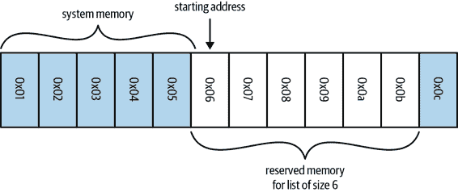
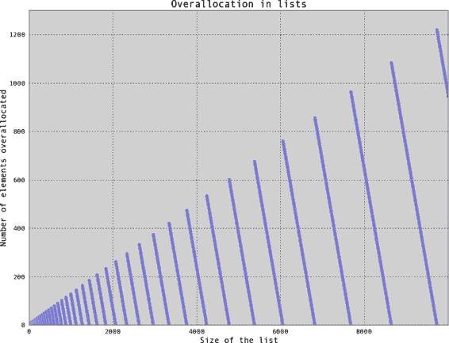
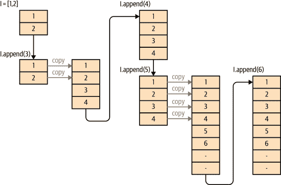

# 第三章\. 列表和元组

在编写高效程序时，了解所使用数据结构的保证是非常重要的事情。实际上，编写高性能程序的一个重要部分是了解你要向你的数据提出什么问题，并选择一个能够快速回答这些问题的数据结构。在本章中，我们将讨论列表和元组能够快速回答的问题类型及其实现方式。

列表和元组属于一类称为*数组*的数据结构。数组是一种带有某种内在顺序的扁平数据列表。通常在这类数据结构中，元素的相对顺序与元素本身一样重要！此外，对于这种*先验*的顺序知识非常有价值：通过知道数组中数据的特定位置，我们可以在`O(1)`的时间复杂度内检索它！¹ 同时，有许多实现数组的方法，每种解决方案都有其自身的有用特性和保证。这就是为什么在 Python 中我们有两种类型的数组：列表和元组。*列表*是动态数组，允许我们修改和调整存储的数据，而*元组*是静态数组，其内容是固定且不可变的。

让我们详细解释一下前面的声明。计算机系统内存可以被视为一系列编号的桶，每个桶可以容纳一个数字。Python 通过*引用*的方式存储数据在这些桶中，这意味着数字本身只是指向或引用我们实际关心的数据。因此，这些桶可以存储我们想要的任何类型的数据（与`numpy`数组不同，后者具有静态类型，只能存储该类型的数据）²。

当我们想要创建一个数组（因此是一个列表或元组），我们首先必须分配一块系统内存（其中这块区域的每个部分将被用作一个整数大小的指向实际数据的指针）。这涉及到向系统内核请求使用`N` *连续* 的桶。图 3-1 展示了大小为 6 的数组（在本例中是列表）的系统内存布局示例。

###### 注意

在 Python 中，列表还存储其大小，因此在分配了六个块中，只有五个可用——第零个元素是长度。



###### 图 3-1\. 大小为 6 的数组系统内存布局示例

为了查找列表中的任何特定元素，我们只需知道我们想要的元素及我们的数据从哪个桶开始。因为所有的数据将占用相同的空间（一个“桶”，或者更具体地说，一个整数大小的指向实际数据的指针），我们不需要知道正在存储的数据类型来进行这个计算。

###### 提示

如果你知道你的列表有`N`个元素并且它们在内存中的起始位置，你将如何找到列表中的任意元素？

例如，如果我们需要检索数组中的第零个元素，我们只需转到我们序列中的第一个桶`M`，并读取其中的值。另一方面，如果我们需要数组中的第五个元素，我们将转到位置`M + 5`处的桶，并读取其内容。通常，如果我们要从数组中检索第`i`个元素，我们会去到桶`M + i`。因此，通过将数据存储在连续的桶中，并了解数据的排序方式，我们可以在一步（或`O(1)`）内定位我们的数据，无论数组有多大（示例 3-1）。

##### 示例 3-1\. 不同大小列表中查找的时间

```py
>>> %%timeit l = list(range(10))
 ...: l[5]
 ...:
30.1 ns ± 0.996 ns per loop (mean ± std. dev. of 7 runs, 10000000 loops each)

>>> %%timeit l = list(range(10_000_000))
 ...: l[100_000]
 ...:
28.9 ns ± 0.894 ns per loop (mean ± std. dev. of 7 runs, 10000000 loops each)
```

如果我们得到一个未知顺序的数组，并想检索特定的元素怎么办？如果已知排序，我们可以简单地查找该特定值。然而，在这种情况下，我们必须进行一个`search`操作。解决这个问题的最基本方法称为*线性搜索*，在这种方法中，我们遍历数组中的每个元素，并检查它是否是我们想要的值，就像在示例 3-2 中看到的那样。

##### 示例 3-2\. 对列表进行线性搜索

```py
def linear_search(needle, array):
    for i, item in enumerate(array):
        if item == needle:
            return i
    return -1
```

此算法的最坏情况性能为`O(n)`。当我们搜索不在数组中的内容时，就会发生这种情况。为了知道我们正在搜索的元素不在数组中，我们必须先将其与每个其他元素进行比较。最终，我们将达到最后的`return -1`语句。事实上，这个算法正是`list.index()`使用的算法。

要提高速度的唯一方法是对内存中数据的布局或我们持有的数据桶的排列有一些其他理解。例如，哈希表（“字典和集合的工作原理？”），这是支持第四章的基本数据结构，通过增加额外的开销来解决这个问题，在插入/检索时强制执行严格而特殊的项目排序，从而以`O(1)`的时间复杂度解决了这个问题。或者，如果您的数据已排序，使得每个项目都比其左侧（或右侧）的邻居大（或小），则可以使用专门的搜索算法，将查找时间降至`O(log n)`。这看起来可能是从我们之前看到的常数时间查找中迈出的不可能步骤，但有时这是最佳选择（特别是因为搜索算法更灵活，允许您以创造性的方式定义搜索）。

# 更高效的搜索

正如前面提到的，如果我们首先对数据进行排序，使得所有位于特定项左侧的元素比该项小（或大），我们可以获得更好的搜索性能。比较是通过对象的`__eq__`和`__lt__`魔术函数进行的，如果使用自定义对象，则可以用户定义。

###### 注意

如果一个自定义对象没有定义`__eq__`和`__lt__`方法，它将只能与相同类型的对象进行比较，并且比较将使用实例在内存中的位置来进行。如果定义了这两个魔法函数，你可以使用标准库中的`functools.total_ordering`装饰器自动定义所有其他排序函数，尽管会略微降低性能。

两个必需的要素是排序算法和搜索算法。Python 列表具有内置的排序算法，使用的是 Tim 排序。在最佳情况下，Tim 排序可以在`O(n)`时间内对列表进行排序（在最坏情况下是`O(n log n)`）。它通过利用多种类型的排序算法和使用启发式算法来猜测在给定数据情况下哪种算法表现最佳（更具体地说，它混合了插入排序和归并排序算法），从而实现了这种性能。

一旦列表被排序，我们可以使用二分查找（示例 3-3）找到我们想要的元素，其平均情况下的复杂度为`O(log n)`。它通过首先查看列表的中间元素并将其值与所需值进行比较来实现。如果中间点的值小于我们想要的值，我们考虑列表的右半部分，并继续以这种方式对列表进行二分，直到找到值或者知道该值不会出现在排序的列表中。因此，我们不需要读取列表中的所有值，就像对于线性搜索是必要的那样；相反，我们只需要读取它们的一个小子集。

##### 示例 3-3\. 通过排序列表进行高效搜索——二分查找

```py
def binary_search(needle, haystack):
    imin, imax = 0, len(haystack)
    while True:
        if imin > imax:
            return -1
        midpoint = (imin + imax) // 2
        if haystack[midpoint] > needle:
            imax = midpoint
        elif haystack[midpoint] < needle:
            imin = midpoint+1
        else:
            return midpoint
```

这种方法使我们能够在不使用字典这种可能笨重的解决方案的情况下，在列表中查找元素。当操作的数据列表本身就是有序的时候，这一点尤其显著。在列表上执行二分查找以查找对象比将数据转换为字典，然后在字典上进行查找更有效率。尽管字典查找只需`O(1)`时间，但将数据转换为字典需要`O(n)`时间（而且字典不能有重复的键可能是不可取的）。另一方面，二分查找将花费`O(log n)`时间。

另外，Python 标准库中的`bisect`模块通过提供简单的方法将元素添加到列表中并保持其排序，以及使用高度优化的二分查找来查找元素，大大简化了这个过程。它通过提供将元素添加到正确排序位置的替代函数来实现这一点。由于列表始终保持排序，我们可以轻松找到我们正在寻找的元素（可以在[bisect 模块的文档](https://oreil.ly/5ZSb7)中找到示例）。此外，我们还可以使用`bisect`快速找到与我们寻找的内容最接近的元素（见示例 3-4）。这对比较两个类似但不完全相同的数据集非常有用。

##### 示例 3-4\. 使用`bisect`模块在列表中查找接近的值

```py
import bisect
import random

def find_closest(haystack, needle):
    # bisect.bisect_left will return the first value in the haystack
    # that is greater than the needle
    i = bisect.bisect_left(haystack, needle)
    if i == len(haystack):
        return i - 1
    elif haystack[i] == needle:
        return i
    elif i > 0:
        j = i - 1
        # since we know the value is larger than needle (and vice versa for the
        # value at j), we don't need to use absolute values here
        if haystack[i] - needle > needle - haystack[j]:
            return j
    return i

important_numbers = []
for i in range(10):
    new_number = random.randint(0, 1000)
    bisect.insort(important_numbers, new_number)

# important_numbers will already be in order because we inserted new elements
# with bisect.insort
print(important_numbers)
# > [14, 265, 496, 661, 683, 734, 881, 892, 973, 992]

closest_index = find_closest(important_numbers, -250)
print(f"Closest value to -250: {important_numbers[closest_index]}")
# > Closest value to -250: 14

closest_index = find_closest(important_numbers, 500)
print(f"Closest value to 500: {important_numbers[closest_index]}")
# > Closest value to 500: 496

closest_index = find_closest(important_numbers, 1100)
print(f"Closest value to 1100: {important_numbers[closest_index]}")
# > Closest value to 1100: 992
```

总的来说，这触及了编写高效代码的基本规则：选择正确的数据结构并坚持使用它！尽管对于特定操作可能存在更高效的数据结构，但转换到这些数据结构的成本可能会抵消任何效率提升。

# 列表与元组的比较

如果列表和元组都使用相同的底层数据结构，它们之间有什么区别？总结来说，主要区别如下：

+   列表是*动态*数组；它们是可变的，并允许调整大小（更改保存的元素数量）。

+   元组是*静态*数组；它们是不可变的，创建后其中的数据不能更改。

+   元组由 Python 运行时缓存，这意味着每次使用时我们无需与内核通信来保留内存。

这些区别揭示了两者之间的哲学差异：元组用于描述一个不变物体的多个属性，而列表可用于存储关于完全不同对象的数据集合。例如，电话号码的各部分非常适合元组：它们不会改变，如果改变了，就代表一个新对象或不同的电话号码。同样地，多项式的系数适合元组，因为不同的系数代表不同的多项式。另一方面，正在阅读本书的人的姓名更适合列表：数据内容和大小都在不断变化，但始终代表相同的概念。

需要注意的是，列表和元组都可以接受混合类型的数据。正如你将看到的，这可能会引入相当大的开销，并减少一些潜在的优化。如果我们强制所有数据都是相同类型的，则可以消除这种开销。在第六章中，我们将讨论通过使用`numpy`来减少内存使用和计算开销。此外，像标准库模块`array`这样的工具可以减少其他非数值情况下的这些开销。这暗示了我们将在后续章节中接触的性能编程的一个重要点：通用代码比专门设计用来解决特定问题的代码要慢得多。

此外，与列表相比不可变的元组使其成为轻量级数据结构。这意味着在存储元组时，内存开销不大，并且对它们的操作非常简单。而对于列表，正如你将学到的那样，它们的可变性是以需要更多的内存来存储它们以及在使用它们时需要更多计算的代价换来的。

## 动态数组列表

一旦创建了列表，我们可以自由地根据需要更改其内容：

```py
>>> numbers = [5, 8, 1, 3, 2, 6]
>>> numbers[2] = 2 * numbers[0]  
>>> numbers
[5, 8, 10, 3, 2, 6]
```


如前所述，这个操作的时间复杂度为`O(1)`，因为我们可以立即找到存储在零到第二个元素中的数据。

另外，我们可以向列表中追加新数据并增大其大小：

```py
>>> len(numbers)
6
>>> numbers.append(42)
>>> numbers
[5, 8, 10, 3, 2, 6, 42]
>>> len(numbers)
7
```

这是可能的，因为动态数组支持`resize`操作来增加数组的容量。当首次向大小为`N`的列表追加时，Python 必须创建一个足够大以容纳原始`N`个项目及额外追加的一个项目的新列表。但是，实际上分配了`M > N`个项目，以提供未来追加的额外空间。然后将旧列表中的数据复制到新列表中，并销毁旧列表。

这种策略的哲学是一个追加操作可能是许多追加操作的开端，并且通过请求额外的空间，我们可以减少必须进行的分配次数，从而减少所需的总内存复制次数。这是非常重要的，因为内存复制可能非常昂贵，特别是当列表大小开始增长时。图 3-2 展示了 Python 3.7 中这种过度分配的情况。规定这种增长的公式见例 3-5。³



###### 图 3-2\. 显示了使用`append`创建包含 8000 个元素的列表时，Python 分配了大约 8600 个元素的空间，多分配了 600 个元素！

##### 例 3-5\. Python 3.7 中的列表分配方程

```py
M = (N >> 3) + (3 if N < 9 else 6)
```

| **N** | 0 | 1-4 | 5-8 | 9-16 | 17-25 | 26-35 | 36-46 | … | 991-1120 |
| --- | --- | --- | --- | --- | --- | --- | --- | --- | --- |
| **M** | 0 | 4 | 8 | 16 | 25 | 35 | 46 | … | 1120 |

随着我们添加数据，我们利用额外的空间并增加列表的有效大小 `N`。因此，随着添加新数据，`N` 增长，直到 `N == M`。在这一点上，没有额外的空间来插入新数据，我们必须创建一个 *新* 列表，其中包含更多的额外空间。这个新列表具有由 示例 3-5 中的方程给出的额外的头部空间，并且我们将旧数据复制到新空间中。

这一系列事件在 图 3-3 中以可视化方式展示。该图跟随在 示例 3-6 中对列表 `l` 执行的各种操作。



###### 图 3-3\. 列表在多次追加时如何发生变异的示例

##### 示例 3-6\. 调整列表大小

```py
l = [1, 2]
for i in range(3, 7):
    l.append(i)
```

###### 注

这种额外的分配发生在第一次 `append`。当列表直接创建时，如前面的示例，只分配了所需数量的元素。

虽然分配的额外头部空间量通常相当小，但它可能会累积起来。在 示例 3-7 中，我们可以看到即使对于 100,000 个元素，通过使用追加构建列表与使用列表理解相比，我们的内存使用量也增加了 2.7 倍：

##### 示例 3-7\. 追加与列表理解的内存和时间后果

```py
>>> %memit [i*i for i in range(100_000)]
peak memory: 70.50 MiB, increment: 3.02 MiB

>>> %%memit l = []
... for i in range(100_000):
...     l.append(i * 2)
...
peak memory: 67.47 MiB, increment: 8.17 MiB

>>> %timeit [i*i for i in range(100_000)]
7.99 ms ± 219 µs per loop (mean ± std. dev. of 7 runs, 100 loops each)

>>> %%timeit l = []
... for i in range(100_000):
...     l.append(i * 2)
...
12.2 ms ± 184 µs per loop (mean ± std. dev. of 7 runs, 100 loops each)
```

总体运行时间也较慢，因为必须运行额外的 Python 语句以及重新分配内存的成本。当您维护许多小列表或保留特别大的列表时，这种影响尤为明显。假设我们存储了 1,000,000 个包含 10 个元素的列表，我们会假定正在使用 10,000,000 个元素的内存。然而，实际上，如果使用 `append` 运算符来构建列表，最多可能会分配 16,000,000 个元素。同样，对于包含 100,000,000 个元素的大列表，我们实际上分配了 112,500,007 个元素！

## 元组作为静态数组

元组是固定的且不可变的。这意味着一旦创建了元组，与列表不同，它就不能被修改或调整大小：

```py
>>> t = (1, 2, 3, 4)
>>> t[0] = 5
Traceback (most recent call last):
  File "<stdin>", line 1, in <module>
TypeError: 'tuple' object does not support item assignment
```

然而，尽管它们不支持调整大小，我们可以将两个元组连接在一起并形成一个新的元组。该操作类似于列表上的 `resize` 操作，但我们不会为结果元组分配任何额外的空间：

```py
>>> t1 = (1, 2, 3, 4)
>>> t2 = (5, 6, 7, 8)
>>> t1 + t2
(1, 2, 3, 4, 5, 6, 7, 8)
```

如果我们将其视为对列表的 `append` 操作进行比较，我们会发现它的执行速度为 `O(n)`，而不是列表的 `O(1)` 速度。这是因为每次添加元素时，我们都必须分配和复制元组，而不是只有当列表的额外头部空间用完时才复制。因此，没有类似于 `append` 的就地操作；添加两个元组始终返回一个新的元组，该元组位于内存中的新位置。

不为重新调整大小存储额外的空间有利于节省资源。用任何`append`操作创建的大小为 100,000,000 的列表实际上使用了 112,500,007 个元素的内存空间，而持有相同数据的元组只会精确地使用 100,000,000 个元素的内存空间。这使得元组轻量且在数据变为静态时更可取。

此外，即使我们创建一个*没有*`append`（因此没有由`append`操作引入的额外预留空间）的列表，它在内存中仍然比持有相同数据的元组大。这是因为列表必须跟踪关于它们当前状态的更多信息，以便高效地调整大小。虽然这些额外信息非常小（相当于一个额外的元素），但如果有数百万个列表在使用，这些信息会累积起来。

元组静态特性的另一个好处是 Python 在后台进行的资源缓存。Python 具有垃圾回收功能，这意味着当变量不再使用时，Python 会释放该变量使用的内存，并将其归还给操作系统供其他应用程序（或其他变量）使用。然而，对于大小为 1–20 的元组，当它们不再使用时，空间并不会立即归还给系统：每个大小的元组最多保存 20,000 个以供将来使用。这意味着当将来需要一个这种大小的新元组时，我们不需要与操作系统通信来找到一个内存区域来放置数据，因为我们已经有了一定的空闲内存储备。然而，这也意味着 Python 进程会有一些额外的内存开销。

虽然这可能看起来是一个小优点，但这是元组的奇妙之处之一：它们可以很容易快速地创建，因为它们可以避免与操作系统的通信，而这可能会让你的程序付出相当多的时间成本。示例 3-8 表明，实例化一个列表可能比实例化一个元组慢 5.1 倍——如果在快速循环中执行此操作，这些时间成本可能会迅速累积！

##### 示例 3-8\. 列表与元组的实例化时间对比

```py
>>> %timeit l = [0, 1, 2, 3, 4, 5, 6, 7, 8, 9]
95 ns ± 1.87 ns per loop (mean ± std. dev. of 7 runs, 10000000 loops each)

>>> %timeit t = (0, 1, 2, 3, 4, 5, 6, 7, 8, 9)
12.5 ns ± 0.199 ns per loop (mean ± std. dev. of 7 runs, 100000000 loops each)
```

# 总结

列表和元组是在数据本身已经有内在顺序时使用的快速且低开销的对象。这种内在顺序使得你可以在这些结构中避开搜索问题：如果顺序事先已知，查找是`O(1)`，避免了昂贵的`O(n)`线性搜索。虽然列表可以调整大小，但你必须小心理解过度分配量，以确保数据集仍然可以适应内存。另一方面，元组可以快速创建，而且没有列表的额外开销，代价是不可修改性。在“Python 列表足够好吗？”中，我们讨论了如何预先分配列表以减轻对 Python 列表频繁附加的一些负担，并查看了其他可以帮助解决这些问题的优化方法。

在下一章中，我们将讨论字典的计算性质，它解决了无序数据的搜索/查找问题，但代价是额外开销。

¹ `O(1)`使用*大 O 符号*来表示算法的效率。关于这个主题的良好介绍可以在[Sarah Chima 的这篇*dev.to*文章](https://oreil.ly/qKUwZ)或者*Thomas H. Cormen*等人的《算法导论》（MIT 出版社）的介绍章节中找到。

² 在 64 位计算机上，拥有 12 KB 的内存可以给你 725 个桶，而拥有 52 GB 的内存可以给你 3,250,000,000 个桶！

³ 负责这种过度分配的代码可以在 Python 源代码中的[Objects/listobject.c:list_resize](https://bit.ly/3bFR5hd)中看到。
