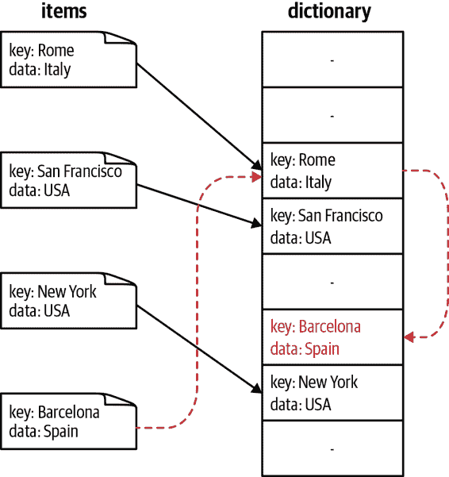

# 第四章：字典和集合

当数据没有内在顺序（除了插入顺序）但具有可用于引用数据的唯一对象时（引用对象通常是字符串，但可以是任何可散列类型），字典和集合是理想的数据结构。这个引用对象称为*键*，而数据是*值*。字典和集合几乎是相同的，唯一的区别在于集合不包含实际的值：集合只是唯一键的集合。正如其名称所示，集合非常适合执行集合操作。

###### 注意

*可散列*类型是指同时实现了`__hash__`魔术函数和`__eq__`或`__cmp__`的类型。Python 中所有原生类型已经实现了这些方法，任何用户类都有默认值。更多详情请参见“哈希函数和熵”。

在前一章中，我们看到在没有内在顺序的列表/元组（通过搜索操作）上，我们最多只能达到`O(log n)`的查找时间。然而，字典和集合基于任意索引可以实现`O(1)`的查找时间。此外，与列表/元组类似，字典和集合的插入时间也是`O(1)`。¹ 正如我们将在“字典和集合的工作原理”中看到的，这种速度是通过使用开放地址哈希表作为底层数据结构实现的。

然而，使用字典和集合是有代价的。首先，它们通常在内存中占用更大的空间。此外，虽然插入/查找的复杂度是`O(1)`，但实际速度很大程度上取决于正在使用的哈希函数的评估速度。如果哈希函数评估速度慢，那么字典或集合上的任何操作都会变得很慢。

让我们来看一个例子。假设我们想为电话簿中的每个人存储联系信息。我们希望以一种简单的方式存储这些信息，以便将来可以简单地回答“John Doe 的电话号码是多少？”这样的问题。使用列表，我们将电话号码和姓名按顺序存储，并扫描整个列表以找到所需的电话号码，如示例 4-1 所示。

##### 示例 4-1：使用列表进行电话簿查找

```py
def find_phonenumber(phonebook, name):
    for n, p in phonebook:
        if n == name:
            return p
    return None

phonebook = [
    ("John Doe", "555-555-5555"),
    ("Albert Einstein", "212-555-5555"),
]
print(f"John Doe's phone number is {find_phonenumber(phonebook, 'John Doe')}")
```

###### 注意

我们也可以通过对列表进行排序并使用`bisect`模块（来自示例 3-4）来实现`O(log n)`的性能。

然而，使用字典，我们可以简单地将“索引”作为姓名，将“值”作为电话号码，如示例 4-2 所示。这使得我们可以简单地查找我们需要的值，并直接引用它，而不必读取数据集中的每个值。

##### 示例 4-2：使用字典进行电话簿查找

```py
phonebook = {
    "John Doe": "555-555-5555",
    "Albert Einstein" : "212-555-5555",
}
print(f"John Doe's phone number is {phonebook['John Doe']}")
```

对于大型电话簿，字典的`O(1)`查找与线性搜索列表的`O(n)`（或者最好情况下，使用二分模块的`O(log n)`复杂度）之间的差异是非常显著的。

###### 提示

创建一个脚本，用于比较列表-`bisect`方法和字典在电话簿中查找数字的性能。随着电话簿大小的增长，时间如何扩展？

另一方面，如果我们想回答“我的电话簿中有多少个独特的名字？”，我们可以利用集合的威力。回想一下，集合就是一组*独特*的键的集合——这正是我们希望在数据中实施的属性。这与基于列表的方法形成鲜明对比，后者需要通过将所有名字与其他所有名字进行比较来单独执行此属性。示例 4-3 进行了说明。

##### 示例 4-3\. 使用列表和集合查找唯一名字

```py
def list_unique_names(phonebook):
    unique_names = []
    for name, phonenumber in phonebook: 
        first_name, last_name = name.split(" ", 1)
        for unique in unique_names: 
            if unique == first_name:
                break
        else:
            unique_names.append(first_name)
    return len(unique_names)

def set_unique_names(phonebook):
    unique_names = set()
    for name, phonenumber in phonebook: 
        first_name, last_name = name.split(" ", 1)
        unique_names.add(first_name) 
    return len(unique_names)

phonebook = [
    ("John Doe", "555-555-5555"),
    ("Albert Einstein", "212-555-5555"),
    ("John Murphey", "202-555-5555"),
    ("Albert Rutherford", "647-555-5555"),
    ("Guido van Rossum", "301-555-5555"),
]

print("Number of unique names from set method:", set_unique_names(phonebook))
print("Number of unique names from list method:", list_unique_names(phonebook))

```

, 

我们必须检查电话簿中的所有条目，因此此循环的成本为`O(n)`。


在这里，我们必须检查当前名字是否已经存在于我们已经看到的所有唯一名字中。如果是一个新的唯一名字，我们就将其添加到我们的唯一名字列表中。然后我们继续通过列表，对电话簿中的每个项目执行此步骤。


对于集合方法，我们不需要遍历已经见过的所有唯一名字，而是可以简单地将当前名字添加到我们的唯一名字集合中。因为集合保证它们包含的键的唯一性，如果您尝试添加已经在集合中的项，该项就不会被添加。此外，此操作的成本为`O(1)`。

列表算法的内部循环遍历`unique_names`，其开始为空，并在最坏的情况下（所有名字都是唯一的情况下）增长到与`phonebook`大小相同。这可以被看作是在一个不断增长的列表上执行每个名字的线性搜索。因此，完整算法的表现为`O(n²)`。

另一方面，集合算法没有内部循环；`set.add`操作是一个`O(1)`的过程，无论电话簿有多大，它都会在固定数量的操作内完成（这其中有一些小的注意事项，我们在讨论字典和集合的实现时会涉及到）。因此，这个算法的复杂性的唯一非常数贡献是对电话簿的循环遍历，使得这个算法的表现为`O(n)`。

当使用具有 10,000 个条目和 7,412 个独特名字的`phonebook`来计时这两种算法时，我们可以看到`O(n)`和`O(n²)`之间的巨大差异：

```py
>>> %timeit list_unique_names(large_phonebook)
1.13 s ± 26.8 ms per loop (mean ± std. dev. of 7 runs, 1 loop each)

>>> %timeit set_unique_names(large_phonebook)
4.48 ms ± 177 µs per loop (mean ± std. dev. of 7 runs, 100 loops each)
```

换句话说，集合算法使我们获得了 252 倍的加速！此外，随着`phonebook`的大小增长，速度增益也会增加（当`phonebook`有 100,000 条条目和 15,574 个独特的名字时，我们获得了 557 倍的加速）。

# 字典和集合是如何工作的？

字典和集合使用*哈希表*实现其 `O(1)` 的查找和插入。这种效率是通过非常巧妙地使用哈希函数将任意键（例如字符串或对象）转换为列表的索引来实现的。哈希函数和列表稍后可以用于立即确定任何特定数据的位置，而无需搜索。通过将数据的键转换为可以像列表索引一样使用的东西，我们可以获得与列表相同的性能。此外，我们不必通过数字索引来引用数据，这本身就意味着数据的某种排序，而是可以通过这个任意键来引用它。

## 插入和检索

要从头开始创建哈希表，我们首先需要一些分配的内存，类似于我们为数组所做的。对于数组，如果我们要插入数据，我们只需找到最小的未使用存储桶并在那里插入我们的数据（如果需要，进行调整大小）。对于哈希表，我们必须首先确定在这个连续的内存块中数据的位置。

插入新数据的位置取决于我们要插入的数据的两个属性：键的哈希值以及值与其他对象的比较。这是因为在插入数据时，首先对键进行哈希处理并进行掩码操作，使其变成数组中的有效索引。² 掩码确保哈希值（可以是任何整数）适应于分配的存储桶数量。因此，如果我们分配了 8 个存储块而我们的哈希值是 `28975`，我们会考虑索引为 `28975 & 0b111 = 7` 的存储桶。但是，如果我们的字典已经增长到需要 512 个存储块，掩码则变为 `0b111111111`（在这种情况下，我们将考虑索引为 `28975 & 0b11111111` 的存储桶）。

现在我们必须检查这个存储桶是否已经被使用。如果为空，我们可以将键和值插入到这个内存块中。我们存储键以确保在查找时获取正确的值。如果已经被使用并且存储桶的值等于我们希望插入的值（使用 `cmp` 内置函数进行比较），则键/值对已经存在于哈希表中，我们可以直接返回。然而，如果值不匹配，我们必须找一个新的位置来存放数据。

作为额外的优化，Python 首先将键/值数据追加到标准数组中，然后仅在哈希表中存储这个数组的*索引*。这样可以减少内存使用量，达到 30%至 95%的减少。³ 此外，这使我们保留了一个关于新项添加到字典中顺序的记录（自 Python 3.7 起，所有字典都有此保证）。

要找到新的索引，我们使用一个简单的线性函数计算它，这称为*探测*方法。Python 的探测机制从原始哈希的高阶位添加贡献（回想一下，对于长度为 8 的表，我们仅考虑了初始索引的哈希的最后三位，通过使用掩码值 `mask = 0b111 = bin(8 - 1)`）。使用这些高阶位为每个哈希提供了不同的下一个可能哈希序列，有助于避免未来的碰撞。

选择生成新索引的算法时有很大的自由度；但是，很重要的是方案必须访问表中的每个可能索引，以便均匀分布数据。数据在哈希表中的分布均匀程度称为*负载因子*，与哈希函数的熵有关。示例 4-4 中的伪代码展示了在 CPython 3.7 中使用的哈希索引计算。这也展示了有关哈希表的一个有趣事实：它们大部分的存储空间是空的！

##### 示例 4-4\. 字典查找序列

```py
def index_sequence(key, mask=0b111, PERTURB_SHIFT=5):
    perturb = hash(key) 
    i = perturb & mask
    yield i
    while True:
        perturb >>= PERTURB_SHIFT
        i = (i * 5 + perturb + 1) & mask
        yield i
```


`hash` 返回一个整数，而在实际的 CPython 代码中使用的是无符号整数。因此，这段伪代码并不能完全复制 CPython 中的行为；但是，它是一个很好的近似。

这种探测方法是*线性探测*的一种修改版。在线性探测中，我们简单地生成值 `i = (i * 5 + perturb + 1) & mask`，其中 `i` 被初始化为键的哈希值的。⁴ 需要注意的一点是，线性探测仅处理哈希的最后几位，并且忽略其余部分（即对于包含八个元素的字典，我们仅查看最后三位，此时掩码为 `0x111`）。这意味着，如果对两个项目进行哈希处理得到相同的最后三位二进制数，不仅会发生碰撞，而且探测索引的序列也将相同。Python 使用的扰动方案将开始考虑来自项目哈希更多位以解决此问题。

当我们在特定键上执行查找时，也会执行类似的过程：给定键被转换为一个索引，然后检查该索引。如果该索引中的键匹配（回想一下，在执行插入操作时，我们还存储了原始键），那么我们可以返回该值。如果不匹配，我们将使用相同的方案创建新的索引，直到我们找到数据或者遇到一个空桶。如果遇到空桶，我们可以得出结论，表中不存在该数据。

图 4-1 展示了向哈希表添加数据的过程。在这里，我们选择创建一个哈希函数，简单地使用输入的第一个字母。我们通过使用 Python 的`ord`函数获取输入的第一个字母的整数表示来实现这一点（请回想哈希函数必须返回整数）。正如我们将在“哈希函数和熵”中看到的，Python 为其大多数类型提供了哈希函数，因此通常您不必自己提供哈希函数，除非在极端情况下。



###### 图 4-1\. 插入带有冲突的哈希表的结果

插入关键字`Barcelona`引发了冲突，并使用示例 4-4 中的方案计算了一个新索引。此字典也可以使用示例 4-5 中的代码在 Python 中创建。

##### 示例 4-5\. 自定义哈希函数

```py
class City(str):
    def __hash__(self):
        return ord(self[0])

# We create a dictionary where we assign arbitrary values to cities
data =  {
    City("Rome"): 'Italy',
    City("San Francisco"): 'USA',
    City("New York"): 'USA',
    City("Barcelona"): 'Spain',
}
```

在这种情况下，`Barcelona`和`Rome`导致了哈希冲突（图 4-1 显示了这种插入的结果）。这是因为，对于一个具有四个元素的字典，我们的掩码值为`0b111`。因此，`Barcelona`和`Rome`将尝试使用相同的索引：

```py
hash("Barcelona") = ord("B") & 0b111
                  = 66 & 0b111
                  = 0b1000010 & 0b111
                  = 0b010 = 2

hash("Rome") = ord("R") & 0b111
             = 82 & 0b111
             = 0b1010010 & 0b111
             = 0b010 = 2
```

## 删除

当从哈希表中删除一个值时，我们不能简单地向内存的那个桶写入`NULL`。这是因为我们在探测哈希冲突时使用了`NULL`作为哨兵值。因此，我们必须写入一个特殊值，表示该桶为空，但在解决哈希冲突时仍可能存在后续值。因此，如果从字典中删除了“Rome”，那么对“Barcelona”的后续查找首先将看到曾经是“Rome”位置的哨兵值，而不是停止，并继续检查`index_sequence`给出的下一个索引。这些空槽可以在将来写入，并在调整哈希表大小时移除。

## 调整大小

当更多条目插入哈希表时，表本身必须调整大小以容纳它们。可以证明，只有不超过三分之二满的表在保持最佳空间节省的同时仍具有预期碰撞数的良好界限。因此，当表达到这一关键点时，它会被扩展。为此，分配一个更大的表（即，内存中保留更多桶），调整掩码以适应新表，并重新将旧表的所有元素重新插入新表中。这需要重新计算索引，因为更改的掩码会改变结果索引。因此，调整大小大的哈希表可能非常昂贵！但是，由于只有在表太小时才执行此调整操作，而不是在每次插入时执行，因此插入的摊销成本仍为`O(1)`。⁵

默认情况下，字典或集合的最小大小为 8（即使您只存储三个值，Python 也将分配八个元素），如果字典超过三分之二的容量，它将按 3 倍调整大小。因此，一旦第六个项目被插入到原始空字典中，它将调整大小以容纳 18 个元素。在这一点上，一旦第 13 个元素被插入对象中，它将调整大小为 39，然后 81，依此类推，始终以 3 倍增加大小（我们将解释如何计算字典大小在“哈希函数和熵”）。这给出了以下可能的大小：

```py
8; 18; 39; 81; 165; 333; 669; 1,341; 2,685; 5,373; 10,749; 21,501; 43,005; ...
```

需要注意的是，调整大小可能使哈希表变大*或者*变小。也就是说，如果哈希表中删除了足够多的元素，表的大小可以缩小。但是，*调整大小只会在插入时发生*。

## 哈希函数和熵

在 Python 中，对象通常是可哈希的，因为它们已经具有与它们相关联的内置`__hash__`和`__cmp__`函数。对于数值类型（`int`和`float`），哈希基于它们表示的数字的位值。元组和字符串的哈希值基于它们的内容。另一方面，列表不支持哈希化，因为它们的值可以改变。由于列表的值可以改变，表示列表的哈希也可能改变，这将改变哈希表中该键的相对位置。⁶

用户定义的类也有默认的哈希和比较函数。默认的`__hash__`函数简单地返回对象由内置`id`函数给出的内存位置。类似地，`__cmp__`运算符比较对象的内存位置的数值。

一般来说，这是可以接受的，因为类的两个实例通常是不同的，不应在哈希表中发生碰撞。但是，在某些情况下，我们希望使用`set`或`dict`对象来消除项目之间的歧义。考虑以下类定义：

```py
class Point(object):
    def __init__(self, x, y):
        self.x, self.y = x, y
```

如果我们使用相同的`x`和`y`值实例化多个`Point`对象，它们将在内存中都是独立的对象，因此具有不同的内存位置，这将使它们具有不同的哈希值。这意味着将它们全部放入一个`set`中会导致它们都有独立的条目：

```py
>>> p1 = Point(1,1)
>>> p2 = Point(1,1)
>>> set([p1, p2])
set([<__main__.Point at 0x1099bfc90>, <__main__.Point at 0x1099bfbd0>])
>>> Point(1,1) in set([p1, p2])
False
```

我们可以通过形成一个基于对象实际内容而不是内存中对象位置的自定义哈希函数来解决这个问题。哈希函数可以是任何函数，只要对于同一对象始终给出相同的结果（还有关于哈希函数熵的考虑，我们稍后会讨论）。重新定义`Point`类如下将产生我们期望的结果：

```py
class Point(object):
    def __init__(self, x, y):
        self.x, self.y = x, y

    def __hash__(self):
        return hash((self.x, self.y))

    def __eq__(self, other):
        return self.x == other.x and self.y == other.y
```

这使我们能够创建一个由`Point`对象的属性而不是实例化对象的内存地址索引的集合或字典的条目：

```py
>>> p1 = Point(1,1)
>>> p2 = Point(1,1)
>>> set([p1, p2])
set([<__main__.Point at 0x109b95910>])
>>> Point(1, 1) in set([p1, p2])
True
```

正如我们讨论哈希碰撞时所提到的，一个自定义选择的哈希函数应该小心地均匀分布哈希值，以避免碰撞。有许多碰撞会降低哈希表的性能：如果大多数键都发生碰撞，我们需要不断地“探测”其他值，实际上是遍历字典的一个可能很大的部分以找到所需的键。在最坏的情况下，当字典中的所有键都发生碰撞时，字典中查找的性能是`O(n)`，因此与我们搜索列表时的性能相同。

如果我们知道我们要在字典中存储 5,000 个值，并且我们需要为我们希望用作键的对象创建一个哈希函数，我们必须意识到该字典将存储在大小为 16,384⁷ 的哈希表中，因此我们的哈希的最后 14 位被用来创建索引（对于这个大小的哈希表，掩码是`bin(16_384 - 1) = 0b11111111111111`）。

“我的哈希函数分布得有多好”这个想法被称为哈希函数的*熵*。熵的定义为

<math display="block" alttext="upper S equals minus sigma-summation Underscript i Endscripts p left-parenthesis i right-parenthesis dot log left-parenthesis p left-parenthesis i right-parenthesis right-parenthesis"><mrow><mi>S</mi> <mo>=</mo> <mo>–</mo> <munder><mo>∑</mo> <mi>i</mi></munder> <mi>p</mi> <mrow><mo>(</mo> <mi>i</mi> <mo>)</mo></mrow> <mo>·</mo> <mo form="prefix">log</mo> <mfenced separators="" open="(" close=")"><mi>p</mi> <mo>(</mo> <mi>i</mi> <mo>)</mo></mfenced></mrow></math>

这里`p(i)`是哈希函数给出哈希值`i`的概率。当每个哈希值被选择的概率相等时，它被最大化。最大化熵的哈希函数被称为*理想*哈希函数，因为它保证了最小数量的碰撞。

对于一个无限大的字典，用于整数的哈希函数是理想的。这是因为整数的哈希值就是整数本身！对于一个无限大的字典，掩码值是无限的，因此我们考虑哈希值中的所有位。因此，给定任意两个数字，我们可以保证它们的哈希值不会相同。

然而，如果我们将这个字典设为有限的，我们就不能再有这个保证了。例如，对于一个有四个元素的字典，我们使用的掩码是`0b111`。因此数字`5`的哈希值是`5 & 0b111 = 5`，而`501`的哈希值是`501 & 0b111 = 5`，它们的条目会发生碰撞。

###### 注意

要找到一个具有任意元素数`N`的字典的掩码，我们首先找到该字典必须拥有的最小桶数，以使其仍然是三分之二满（`N * (2 / 3 + 1)`）。然后我们找到能容纳这么多元素的最小字典大小（8；32；128；512；2,048；等等），并找到保存这个数量所需的位数。例如，如果`N=1039`，那么我们必须至少有 1,731 个桶，这意味着我们需要一个有 2,048 个桶的字典。因此掩码是`bin(2048 - 1) = 0b11111111111`。

使用有限字典时，没有单一的最佳哈希函数可用。然而，提前知道将使用的值范围和字典的大小有助于做出良好的选择。例如，如果我们将所有两个小写字母的 676 种组合存储为字典中的键（*aa*, *ab*, *ac*等），那么一个良好的哈希函数将是示例 4-6 中显示的那种。

##### 示例 4-6\. 最佳的两字母哈希函数

```py
def twoletter_hash(key):
    offset = ord('a')
    k1, k2 = key
    return (ord(k2) - offset) + 26 * (ord(k1) - offset)
```

这对任何两个小写字母组合都不会发生哈希碰撞，考虑到`0b1111111111`掩码（一个包含 676 个值的字典将存储在长度为 2048 的哈希表中，其掩码为`bin(2048 - 1) = 0b11111111111`）。

示例 4-7 非常明确地展示了为用户定义的类使用不良哈希函数的后果——在这里，使用不良哈希函数的代价（事实上，这是可能的最差的哈希函数！）是查找减慢了 41.8 倍。

##### 示例 4-7\. 良好和不良哈希函数之间的时间差异

```py
import string
import timeit

class BadHash(str):
    def __hash__(self):
        return 42

class GoodHash(str):
    def __hash__(self):
        """
 This is a slightly optimized version of twoletter_hash
 """
        return ord(self[1]) + 26 * ord(self[0]) - 2619

baddict = set()
gooddict = set()
for i in string.ascii_lowercase:
    for j in string.ascii_lowercase:
        key = i + j
        baddict.add(BadHash(key))
        gooddict.add(GoodHash(key))

badtime = timeit.repeat(
    "key in baddict",
    setup = "from __main__ import baddict, BadHash; key = BadHash('zz')",
    repeat = 3,
    number = 1_000_000,
)
goodtime = timeit.repeat(
    "key in gooddict",
    setup = "from __main__ import gooddict, GoodHash; key = GoodHash('zz')",
    repeat = 3,
    number = 1_000_000,
)

print(f"Min lookup time for baddict: {min(badtime)}")
print(f"Min lookup time for gooddict: {min(goodtime)}")

# Results:
#   Min lookup time for baddict: 17.719061855008476
#   Min lookup time for gooddict: 0.42408075400453527
```

# 字典和命名空间

在字典上进行查找速度很快；然而，不必要地这样做会减慢您的代码，就像任何多余的行一样。一个显现这种情况的地方是 Python 的命名空间管理，在这里大量使用字典来进行查找。

每当在 Python 中调用变量、函数或模块时，都有一个层次结构确定它查找这些对象的位置。首先，Python 查找`locals()`数组，该数组包含所有局部变量的条目。Python 努力使局部变量查找快速化，这是链中唯一不需要字典查找的部分。如果在那里找不到，就会搜索`globals()`字典。最后，如果对象在那里找不到，就会搜索`__builtin__`对象。需要注意的是，虽然`locals()`和`globals()`显式是字典，而`__builtin__`在技术上是模块对象，但当在`__builtin__`中搜索特定属性时，我们只是在它的`locals()`映射中进行字典查找（这对所有模块对象和类对象都适用！）。

为了使这更清晰，让我们看一个简单的例子，调用在不同范围内定义的函数（示例 4-8）。我们可以使用`dis`模块（示例 4-9）来解开函数，以更好地理解这些命名空间查找是如何进行的（参见“使用 dis 模块来检查 CPython 字节码”）。

##### 示例 4-8\. 命名空间查找

```py
import math
from math import sin

def test1(x):
    """
 >>> %timeit test1(123_456)
 162 µs ± 3.82 µs per loop (mean ± std. dev. of 7 runs, 10000 loops each)
 """
    res = 1
    for _ in range(1000):
        res += math.sin(x)
    return res

def test2(x):
    """
 >>> %timeit test2(123_456)
 124 µs ± 6.77 µs per loop (mean ± std. dev. of 7 runs, 10000 loops each)
 """
    res = 1
    for _ in range(1000):
        res += sin(x)
    return res

def test3(x, sin=math.sin):
    """
 >>> %timeit test3(123_456)
 105 µs ± 3.35 µs per loop (mean ± std. dev. of 7 runs, 10000 loops each)
 """
    res = 1
    for _ in range(1000):
        res += sin(x)
    return res
```

##### 示例 4-9\. 命名空间查找拆解

```py
>>> dis.dis(test1)
    ...cut..
             20 LOAD_GLOBAL              1 (math)
             22 LOAD_METHOD              2 (sin)
             24 LOAD_FAST                0 (x)
             26 CALL_METHOD              1
    ...cut..

>>> dis.dis(test2)
    ...cut...
             20 LOAD_GLOBAL              1 (sin)
             22 LOAD_FAST                0 (x)
             24 CALL_FUNCTION            1
    ...cut...

>>> dis.dis(test3)
    ...cut...
             20 LOAD_FAST                1 (sin)
             22 LOAD_FAST                0 (x)
             24 CALL_FUNCTION            1
    ...cut...
```

第一个函数，`test1`，通过显式查看数学库进行 `sin` 的调用。这也可以从生成的字节码中看出：首先必须加载对 `math` 模块的引用，然后我们对此模块进行属性查找，直到最终获得对 `sin` 函数的引用。这通过两次字典查找完成：一次是找到 `math` 模块，另一次是在模块中找到 `sin` 函数。

另一方面，`test2`从 `math` 模块显式导入 `sin` 函数，然后函数直接在全局命名空间中可访问。这意味着我们可以避免对 `math` 模块和随后的属性查找。然而，我们仍然必须在全局命名空间中找到 `sin` 函数。这是另一个理由明确指定从模块导入哪些函数。这种做法不仅使代码更易读，因为读者知道确切需要从外部源中获取哪些功能，而且简化了特定函数实现的更改，并且通常加快了代码！

最后，`test3`将 `sin` 函数定义为关键字参数，其默认值是对 `math` 模块内 `sin` 函数的引用。虽然我们仍然需要在模块内查找对此函数的引用，但这只在首次定义 `test3` 函数时需要。之后，对 `sin` 函数的引用将作为默认关键字参数的形式存储在函数定义中的局部变量中。如前所述，局部变量无需进行字典查找即可找到；它们存储在一个非常紧凑的数组中，具有非常快的查找时间。因此，查找函数是非常快的！

虽然这些效果是 Python 命名空间管理方式的有趣结果，但`test3`显然不是“Pythonic”。幸运的是，只有在大量调用时（例如在非常快的循环的最内部块中，比如 Julia 集的示例中），这些额外的字典查找才会开始降低性能。考虑到这一点，一个更可读的解决方案是在循环开始前用全局引用设置一个局部变量。我们仍然需要在每次调用函数时做一次全局查找，但在循环中对该函数的所有调用将变得更快。这表明，即使是代码中微小的减速也可能在代码被执行数百万次时被放大。即使字典查找本身可能只需要几百纳秒，如果我们在这个查找上进行数百万次的循环，这些纳秒很快就会累加起来。

###### 注意

有关微基准测试的消息：在示例 4-8 中，我们添加了额外的工作量，包括`for`循环和对`res`变量的修改，这可能看起来令人困惑。最初，这些函数中每个都只有相关的`return sin(x)`行，没有其他内容。因此，我们也得到了纳秒级运行时间和毫无意义的结果！

当我们在每个函数内部增加更大的工作负载时，就像通过循环和对`res`变量的修改完成的那样，我们开始看到了我们预期的结果。通过在函数内部增加更大的工作负载，我们可以更加确定我们不是在测量基准/计时过程中的开销。一般来说，当你运行基准测试并且在纳秒级别上有时间差异时，重要的是停下来思考一秒钟，思考你正在运行的实验是否有效，或者你是否在测量噪声或由仪器测量造成的无关时间。

# 总结

字典和集合提供了一种绝佳的方式来存储可以通过键索引的数据。通过哈希函数使用这个键的方式，可以极大地影响数据结构的性能。此外，了解字典的工作原理不仅可以帮助你更好地组织数据，还可以帮助你组织代码，因为字典是 Python 内部功能的一个固有部分。

在下一章中，我们将探讨生成器，这些生成器允许我们为代码提供数据，并且可以更好地控制顺序，而无需预先将完整数据集存储在内存中。这使我们能够避开在使用 Python 内置数据结构时可能遇到的许多障碍。

¹ 正如我们将在“哈希函数和熵”中讨论的那样，字典和集合非常依赖它们的哈希函数。如果特定数据类型的哈希函数不是`O(1)`，那么包含该类型的任何字典或集合将不再具有`O(1)`的保证。

² *掩码*是一种二进制数，用于截断数字的值。因此，`0b1111101 & 0b111 = 0b101 = 5`代表了`0b111`掩码操作`0b1111101`数的操作。这个操作也可以理解为取一个数字的最低有效位的某些位数。

³ 导致这一改进的讨论可以在[*https://oreil.ly/Pq7Lm*](https://oreil.ly/Pq7Lm)找到。

⁴ 数值`5`来自于线性同余生成器（LCG）的特性，该生成器用于生成随机数。

⁵ 摊还分析关注的是算法的平均复杂度。这意味着一些插入操作可能会更昂贵，但平均而言，插入操作的复杂度是`O(1)`。

⁶ 关于这个的更多信息可以在[*https://oreil.ly/g4I5-*](https://oreil.ly/g4I5-)找到。

⁷ 5000 个数值需要一个至少有 8,333 个桶的字典。能容纳这么多元素的第一个可用尺寸是 16,384。
