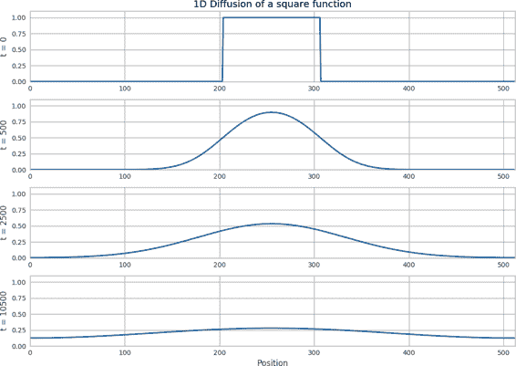
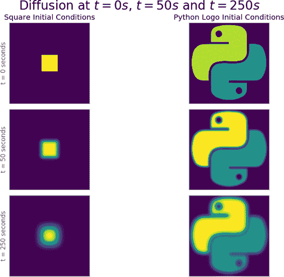
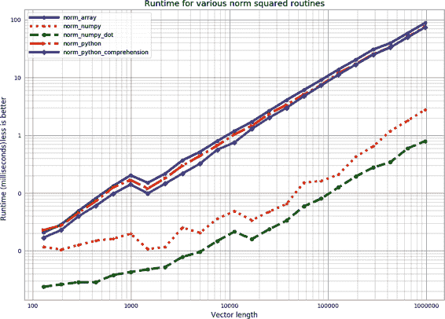
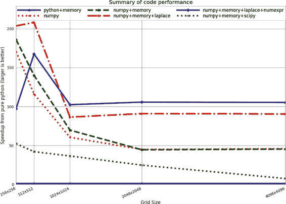
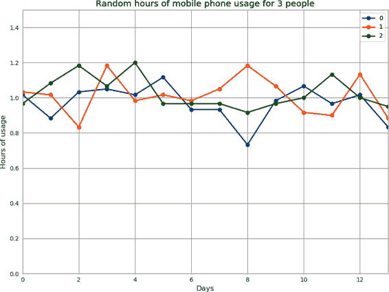
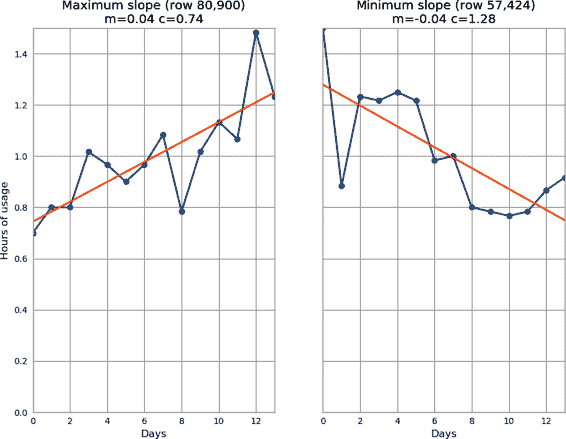

# 第六章：矩阵与向量计算

无论您在计算机上尝试解决什么问题，都会在某个时候遇到向量计算。向量计算是计算机如何工作以及如何在硅级别上加快程序运行时速度的核心内容——计算机唯一能做的就是对数字进行操作，而同时进行多个这样的计算会加快程序的运行。

在本章中，我们试图通过专注于一个相对简单的数学问题——解扩散方程来揭示这个问题的一些复杂性，并理解发生在 CPU 级别的情况。通过理解不同的 Python 代码如何影响 CPU 以及如何有效地探测这些内容，我们可以学会如何理解其他问题。

我们将首先介绍问题并使用纯 Python 提出一个快速解决方案。在识别出一些内存问题并尝试使用纯 Python 修复它们之后，我们将介绍`numpy`并识别它如何以及为什么加快我们的代码。然后，我们将开始进行一些算法变更，并专门优化我们的代码以解决手头的问题。通过去除我们正在使用的库的一些通用性，我们将再次能够获得更多的速度优势。接下来，我们引入一些额外的模块，将有助于在实地中促进这种过程，并探讨在优化之前进行性能分析的警示故事。

最后，我们将介绍 Pandas 库，该库基于`numpy`，通过将同类数据的列存储在异构类型的表中来构建。Pandas 已经超越了使用纯`numpy`类型，并且现在可以将其自己的缺失数据感知类型与`numpy`数据类型混合使用。虽然 Pandas 在科学开发人员和数据科学家中非常流行，但有关如何使其运行更快的误解很多；我们解决了其中一些问题，并为编写高性能和可支持的分析代码提供了建议。

# 问题介绍

为了探索本章中的矩阵和向量计算，我们将反复使用液体扩散的示例。扩散是将流体移动并尝试使其均匀混合的机制之一。

###### 注意

本节旨在深入理解本章将要解决的方程式。您不一定需要严格理解本节即可继续学习本章的其余内容。如果您希望跳过本节，请至少查看示例 6-1 和 6-2 中的算法以了解我们将要优化的代码。

另一方面，如果您阅读了本节并希望获得更多解释，请阅读 William Press 等人编著的《*Numerical Recipes*》第 3 版的第十七章（剑桥大学出版社）。

在本节中，我们将探讨扩散方程背后的数学原理。这可能看起来很复杂，但不要担心！我们将快速简化它，以使其更易理解。此外，需要注意的是，虽然在阅读本章时对我们要解决的最终方程有基本的理解会有所帮助，但这并非完全必要；后续章节主要将重点放在代码的各种形式化上，而不是方程。然而，理解方程将有助于您对优化代码的方法产生直观的认识。这在一般情况下是正确的——理解代码背后的动机和算法的复杂性将为您提供有关优化方法的更深入的洞察。

扩散的一个简单例子是水中的染料：如果你把几滴染料放到室温水中，染料将慢慢扩散直到完全与水混合。由于我们没有搅拌水，也没有足够的温度来产生对流电流，扩散将是混合两种液体的主要过程。在数值上解这些方程时，我们选择初始条件的外观，并能够将初始条件向前演化到以后的时间以查看其外观（见图 6-2）。

尽管如此，对于我们的目的来说，关于扩散最重要的事情是它的公式化。作为一维（1D）偏微分方程陈述，扩散方程的形式如下：

<math display="block"><mrow><mfrac><mi>∂</mi> <mrow><mi>∂</mi><mi>t</mi></mrow></mfrac> <mi>u</mi> <mrow><mo>(</mo> <mi>x</mi> <mo>,</mo> <mi>t</mi> <mo>)</mo></mrow> <mo>=</mo> <mi>D</mi> <mo>·</mo> <mfrac><msup><mi>∂</mi> <mn>2</mn></msup> <mrow><mi>∂</mi><msup><mi>x</mi> <mn>2</mn></msup></mrow></mfrac> <mi>u</mi> <mrow><mo>(</mo> <mi>x</mi> <mo>,</mo> <mi>t</mi> <mo>)</mo></mrow></mrow></math>

在这个公式化中，`u`是表示我们正在扩散的量的向量。例如，我们可以有一个向量，其中在只有水的地方值为`0`，只有染料的地方值为`1`（以及在混合处的值）。一般来说，这将是一个表示实际区域或流体体积的二维或三维矩阵。这样，我们可以将`u`作为一个表示玻璃杯中流体的三维矩阵，并且不仅仅沿着`x`方向进行二阶导数计算，而是在所有轴上进行。此外，`D`是表示我们正在模拟的流体的属性的物理值。较大的`D`值表示一种可以很容易扩散的流体。为简单起见，我们将在我们的代码中将`D = 1`，但仍然将其包含在计算中。

###### 注意

扩散方程也称为*热传导方程*。在这种情况下，`u`代表了一个区域的温度，而`D`描述了材料导热的好坏程度。解方程告诉我们热量是如何传递的。因此，我们可能不是在解释几滴染料在水中扩散的过程，而是在解释 CPU 产生的热量如何传递到散热器中。

我们要做的是取扩散方程，该方程在空间和时间上是连续的，并使用离散的体积和离散的时间进行近似。我们将使用欧拉方法来实现这一点。*欧拉方法*简单地取导数，并将其写成一个差值，如下所示：

<math display="block"><mrow><mfrac><mi>∂</mi> <mrow><mi>∂</mi><mi>t</mi></mrow></mfrac> <mi>u</mi> <mrow><mo>(</mo> <mi>x</mi> <mo>,</mo> <mi>t</mi> <mo>)</mo></mrow> <mo>≈</mo> <mfrac><mrow><mi>u</mi><mo>(</mo><mi>x</mi><mo>,</mo><mi>t</mi><mo>+</mo><mi>d</mi><mi>t</mi><mo>)</mo><mo>–</mo><mi>u</mi><mo>(</mo><mi>x</mi><mo>,</mo><mi>t</mi><mo>)</mo></mrow> <mrow><mi>d</mi><mi>t</mi></mrow></mfrac></mrow></math>

其中`dt`现在是一个固定的数字。这个固定的数字代表我们希望解决这个方程的时间步长，或者说时间上的分辨率。可以将其视为我们试图制作的电影的帧率。随着帧率的提高（或`dt`的减小），我们能够得到更清晰的图片。事实上，随着`dt`接近零，欧拉逼近变得精确（然而，请注意，这种精确性只能在理论上实现，因为计算机上只有有限的精度，数值误差将很快主导任何结果）。因此，我们可以重新编写这个方程，以便找出`u(x, t + dt)`是多少，给定`u(x,t)`。这对我们意味着我们可以从某个初始状态开始（`u(x,0)`，表示我们向其中加入一滴染料的水杯）并通过我们已经概述的机制来“演化”该初始状态，并查看在未来时刻（`u(x,dt)`）它将会是什么样子。这种问题类型称为*初值问题*或*柯西问题*。对`x`的导数使用有限差分逼近进行类似的技巧，我们得到最终方程：

<math display="block"><mrow><mi>u</mi> <mrow><mo>(</mo> <mi>x</mi> <mo>,</mo> <mi>t</mi> <mo>+</mo> <mi>d</mi> <mi>t</mi> <mo>)</mo></mrow> <mo>=</mo> <mi>u</mi> <mrow><mo>(</mo> <mi>x</mi> <mo>,</mo> <mi>t</mi> <mo>)</mo></mrow> <mo>+</mo> <mi>d</mi> <mi>t</mi> <mo>*</mo> <mi>D</mi> <mo>*</mo> <mfrac><mrow><mi>u</mi><mo>(</mo><mi>x</mi><mo>+</mo><mi>d</mi><mi>x</mi><mo>,</mo><mi>t</mi><mo>)</mo><mo>+</mo><mi>u</mi><mo>(</mo><mi>x</mi><mo>–</mo><mi>d</mi><mi>x</mi><mo>,</mo><mi>t</mi><mo>)</mo><mo>–</mo><mn>2</mn><mo>·</mo><mi>u</mi><mo>(</mo><mi>x</mi><mo>,</mo><mi>t</mi><mo>)</mo></mrow> <mrow><mi>d</mi><msup><mi>x</mi> <mn>2</mn></msup></mrow></mfrac></mrow></math>

在这里，类似于`dt`表示帧率，`dx`表示图像的分辨率——`dx`越小，矩阵中每个单元格表示的区域就越小。为简单起见，我们将设置`D = 1`和`dx = 1`。这两个值在进行正确的物理模拟时变得非常重要；然而，由于我们解决扩散方程是为了说明的目的，它们对我们来说并不重要。

使用这个方程，我们可以解决几乎任何扩散问题。然而，对于这个方程有一些考虑。首先，我们之前说过，在`u`中的空间索引（即`x`参数）将被表示为矩阵的索引。当我们尝试找到`x - dx`处的值时，当`x`位于矩阵的开头时会发生什么？这个问题称为*边界条件*。您可以有固定的边界条件，即“超出我的矩阵范围的任何值都将被设置为*0*”（或任何其他值）。或者，您可以有周期性的边界条件，即值会循环。也就是说，如果矩阵的一个维度长度为`N`，那么该维度上索引为`-1`的值与`N - 1`处的值相同，索引为`N`处的值与索引为`0`处的值相同。（换句话说，如果您试图访问索引为`i`处的值，您将得到索引为`(i%N)`处的值。）

另一个考虑因素是我们将如何存储`u`的多个时间分量。我们可以为每个计算时间点都有一个矩阵。至少，看起来我们需要两个矩阵：一个用于流体的当前状态，另一个用于流体的下一个状态。正如我们将看到的，对于这个特定问题，性能考虑非常重要。

那么在实践中解决这个问题是什么样子呢？示例 6-1 包含了一些伪代码，说明我们如何使用我们的方程来解决问题。

##### 示例 6-1\. 一维扩散的伪代码

```py
# Create the initial conditions
u = vector of length N
for i in range(N):
    u = 0 if there is water, 1 if there is dye

# Evolve the initial conditions
D = 1
t = 0
dt = 0.0001
while True:
    print(f"Current time is: {t}")
    unew = vector of size N

    # Update step for every cell
    for i in range(N):
        unew[i] = u[i] + D * dt * (u[(i+1)%N] + u[(i-1)%N] - 2 * u[i])
    # Move the updated solution into u
    u = unew

    visualize(u)
```

此代码将以水中染料的初始条件作为输入，并告诉我们在未来每 0.0001 秒间隔下系统的样子。结果可以在图 6-1 中看到，我们将我们非常浓缩的染料滴（由顶帽函数表示）演化到未来。我们可以看到，远处的染料变得混合均匀，到达了染料的各处浓度相似的状态。



###### 图 6-1\. 一维扩散示例

对于本章的目的，我们将解决前述方程的二维版本。这意味着我们将不再在一个向量上操作（或者换句话说，一个带有一个索引的矩阵），而是在一个二维矩阵上操作。方程（以及随后的代码）的唯一变化是我们现在还必须在`y`方向上进行第二次导数。这简单地意味着我们之前处理的原始方程变成了以下形式：

<math display="block"><mrow><mfrac><mi>∂</mi> <mrow><mi>∂</mi><mi>t</mi></mrow></mfrac> <mi>u</mi> <mrow><mo>(</mo> <mi>x</mi> <mo>,</mo> <mi>y</mi> <mo>,</mo> <mi>t</mi> <mo>)</mo></mrow> <mo>=</mo> <mi>D</mi> <mo>·</mo> <mfenced separators="" open="(" close=")"><mfrac><msup><mi>∂</mi> <mn>2</mn></msup> <mrow><mi>∂</mi><msup><mi>x</mi> <mn>2</mn></msup></mrow></mfrac> <mi>u</mi> <mrow><mo>(</mo> <mi>x</mi> <mo>,</mo> <mi>y</mi> <mo>,</mo> <mi>t</mi> <mo>)</mo></mrow> <mo>+</mo> <mfrac><msup><mi>∂</mi> <mn>2</mn></msup> <mrow><mi>∂</mi><msup><mi>y</mi> <mn>2</mn></msup></mrow></mfrac> <mi>u</mi> <mrow><mo>(</mo> <mi>x</mi> <mo>,</mo> <mi>y</mi> <mo>,</mo> <mi>t</mi> <mo>)</mo></mrow></mfenced></mrow></math>

这个二维数值扩散方程可以通过示例 6-2 中的伪代码转化为实际操作，使用我们之前使用的相同方法。

##### 示例 6-2\. 计算二维扩散的算法

```py
for i in range(N):
    for j in range(M):
        unew[i][j] = u[i][j] + dt * (
            (u[(i + 1) % N][j] + u[(i - 1) % N][j] - 2 * u[i][j]) + # d² u / dx²
            (u[i][(j + 1) % M] + u[i][(j - 1) % M] - 2 * u[i][j])   # d² u / dy²
        )
```

现在我们可以将所有这些内容结合起来，编写完整的 Python 二维扩散代码，这将作为本章其余部分基准的基础。尽管代码看起来更复杂，但结果与一维扩散的结果相似（如图 6-2 中所示）。

如果您想在本节中的相关主题上进行额外阅读，请查看[扩散方程的维基百科页面](http://bit.ly/diffusion_eq)和《复杂系统的数值方法》的第七章[S. V. Gurevich](http://bit.ly/Gurevich)。



###### 图 6-2\. 两组初始条件下的二维扩散示例

# Python 列表足够好吗？

让我们从示例 6-1 中拿出我们的伪代码，并将其形式化，以便更好地分析其运行时性能。第一步是编写接受矩阵并返回其演化状态的演化函数。这在示例 6-3 中展示出来。

##### 示例 6-3\. 纯 Python 2D 扩散

```py
grid_shape = (640, 640)

def evolve(grid, dt, D=1.0):
    xmax, ymax = grid_shape
    new_grid = [[0.0] * ymax for x in range(xmax)]
    for i in range(xmax):
        for j in range(ymax):
            grid_xx = (
                grid[(i + 1) % xmax][j] + grid[(i - 1) % xmax][j] - 2.0 * grid[i][j]
            )
            grid_yy = (
                grid[i][(j + 1) % ymax] + grid[i][(j - 1) % ymax] - 2.0 * grid[i][j]
            )
            new_grid[i][j] = grid[i][j] + D * (grid_xx + grid_yy) * dt
    return new_grid
```

###### 注意

与预先分配 `new_grid` 列表不同，我们可以通过在 `for` 循环中使用 `append` 逐步构建它。虽然这比我们编写的方法明显更快，但我们得出的结论仍然适用。我们选择这种方法是因为它更具说明性。

全局变量 `grid_shape` 表示我们将模拟的区域大小；正如 “问题介绍” 中所述，我们使用周期边界条件（这就是为什么在索引中使用模运算）。要使用此代码，我们必须初始化一个网格并对其调用 `evolve`。示例 6-4 中的代码是一个非常通用的初始化过程，在本章中将被多次重复使用（由于它只需运行一次，所以不会分析其性能特征，而与需要重复调用的 `evolve` 函数相对）。

##### 示例 6-4\. 纯 Python 2D 扩散初始化

```py
def run_experiment(num_iterations):
    # Setting up initial conditions 
    xmax, ymax = grid_shape
    grid = [[0.0] * ymax for x in range(xmax)]

    # These initial conditions are simulating a drop of dye in the middle of our
    # simulated region
    block_low = int(grid_shape[0] * 0.4)
    block_high = int(grid_shape[0] * 0.5)
    for i in range(block_low, block_high):
        for j in range(block_low, block_high):
            grid[i][j] = 0.005

    # Evolve the initial conditions
    start = time.time()
    for i in range(num_iterations):
        grid = evolve(grid, 0.1)
    return time.time() - start
```


此处使用的初始条件与 图 6-2 中的正方形示例相同。

`dt` 和网格元素的值选择足够小，使算法稳定。详见[*Numerical Recipes*](https://oreil.ly/O8Seo)以深入了解算法的收敛特性。

## 分配过多的问题

通过在纯 Python 进化函数上使用 `line_profiler`，我们可以开始分析可能导致运行时间较慢的原因。查看示例 6-5 中的分析输出，我们发现函数中大部分时间用于导数计算和网格更新。¹ 这正是我们想要的，因为这是一个纯 CPU 限制的问题 —— 任何未用于解决此问题的时间都是显而易见的优化对象。

##### 示例 6-5\. 纯 Python 2D 扩散分析

```py
$ kernprof -lv diffusion_python.py
Wrote profile results to diffusion_python.py.lprof
Timer unit: 1e-06 s

Total time: 787.161 s
File: diffusion_python.py
Function: evolve at line 12

Line #      Hits         Time  Per Hit   % Time  Line Contents
==============================================================
    12                                           @profile
    13                                           def evolve(grid, dt, D=1.0):
    14       500        843.0      1.7      0.0      xmax, ymax = grid_shape  
    15       500   24764794.0  49529.6      3.1      new_grid = [0.0 for x in ...
    16    320500     208683.0      0.7      0.0      for i in range(xmax):  ![2
    17 205120000  128928913.0      0.6     16.4          for j in range(ymax):
    18 204800000  222422192.0      1.1     28.3              grid_xx = ...
    19 204800000  228660607.0      1.1     29.0              grid_yy = ...
    20 204800000  182174957.0      0.9     23.1              new_grid[i][j] = ...
    21       500        331.0      0.7      0.0      return new_grid  
```


每次击中此语句所需的时间很长，因为必须从本地命名空间检索 `grid_shape`（有关更多信息，请参见 “字典和命名空间”）。


此行与 320,500 次击中相关联，因为我们操作的网格具有 `xmax = 640`，并且我们运行该函数 500 次。计算公式为 `(640 + 1) * 500`，其中额外的一次评估来自循环的终止。


此行与 500 次击中相关联，这告诉我们该函数已在 500 次运行中进行了分析。

看到第 15 行的 `Per Hit` 和 `% Time` 字段的巨大差异真是有趣，这是我们为新网格分配内存的地方。这种差异的原因在于，虽然这行代码本身运行相当慢（`Per Hit` 字段显示每次运行需要 0.0495 秒，比循环内的所有其他行都慢），但它并不像其他循环内的行那样频繁调用。如果我们减少网格的大小并增加迭代次数（即减少循环的迭代次数，但增加调用函数的次数），我们会看到这行代码的 `% Time` 增加，并迅速主导运行时间。

这是一种浪费，因为 `new_grid` 的属性不会改变 —— 无论我们发送什么值到 `evolve`，`new_grid` 列表的形状和大小以及包含的值始终是相同的。一个简单的优化方法是只分配这个列表一次，然后简单地重用它。这样，我们只需要运行这段代码一次，不管网格的大小或迭代次数如何。这种优化类似于将重复的代码移出快速循环外：

```py
from math import sin

def loop_slow(num_iterations):
    """
    >>> %timeit loop_slow(int(1e4))
    1.68 ms ± 61.3 µs per loop (mean ± std. dev. of 7 runs, 1000 loops each)
    """
    result = 0
    for i in range(num_iterations):
        result += i * sin(num_iterations)  
    return result

def loop_fast(num_iterations):
    """
    >>> %timeit loop_fast(int(1e4))
    551 µs ± 23.5 µs per loop (mean ± std. dev. of 7 runs, 1000 loops each)
    """
    result = 0
    factor = sin(num_iterations)
    for i in range(num_iterations):
        result += i
    return result * factor
```


`sin(num_iterations)` 的值在整个循环过程中都没有改变，因此每次重新计算它都没有意义。

我们可以对我们的扩散代码做类似的转换，如 示例 6-6 所示。在这种情况下，我们希望在 示例 6-4 中实例化 `new_grid` 并将其发送到我们的 `evolve` 函数中。该函数将像以前一样读取 `grid` 列表并写入 `new_grid` 列表。然后我们可以简单地交换 `new_grid` 和 `grid`，然后再继续。

##### 示例 6-6\. 减少内存分配后的纯 Python 2D 扩散

```py
def evolve(grid, dt, out, D=1.0):
    xmax, ymax = grid_shape
    for i in range(xmax):
        for j in range(ymax):
            grid_xx = (
                grid[(i + 1) % xmax][j] + grid[(i - 1) % xmax][j] - 2.0 * grid[i][j]
            )
            grid_yy = (
                grid[i][(j + 1) % ymax] + grid[i][(j - 1) % ymax] - 2.0 * grid[i][j]
            )
            out[i][j] = grid[i][j] + D * (grid_xx + grid_yy) * dt

def run_experiment(num_iterations):
    # Setting up initial conditions
    xmax, ymax = grid_shape
    next_grid = [[0.0] * ymax for x in range(xmax)]
    grid = [[0.0] * ymax for x in range(xmax)]

    block_low = int(grid_shape[0] * 0.4)
    block_high = int(grid_shape[0] * 0.5)
    for i in range(block_low, block_high):
        for j in range(block_low, block_high):
            grid[i][j] = 0.005

    start = time.time()
    for i in range(num_iterations):
        # evolve modifies grid and next_grid in-place
        evolve(grid, 0.1, next_grid)
        grid, next_grid = next_grid, grid
    return time.time() - start
```

我们可以从修改后的代码行剖析中看到，在 示例 6-7 的版本中，这个小改动使我们的速度提高了 31.25%。这使我们得出一个类似于在我们讨论列表的 `append` 操作时得出的结论（参见 “列表作为动态数组”）：内存分配并不便宜。每次我们请求内存来存储变量或列表时，Python 必须花费一些时间与操作系统通信，以便分配新的空间，然后我们必须迭代新分配的空间来初始化它的一些值。

在可能的情况下，重用已分配的空间将提高性能。但在实现这些更改时要小心。虽然速度提升可能很大，但您应该始终进行剖析，以确保实现了您想要的结果，并且没有简单地污染了您的代码库。

##### 示例 6-7\. 减少分配后 Python 扩散的行剖析

```py
$ `kernprof` `-``lv` `diffusion_python_memory``.``py`
Wrote profile results to diffusion_python_memory.py.lprof
Timer unit: 1e-06 s

Total time: 541.138 s
File: diffusion_python_memory.py
Function: evolve at line 12

Line #      Hits         Time  Per Hit   % Time  Line Contents
==============================================================
    12                                           @profile
    13                                           def evolve(grid, dt, out, D=1.0):
    14       500        503.0      1.0      0.0      xmax, ymax = grid_shape
    15    320500     131498.0      0.4      0.0      for i in range(xmax):
    16 205120000   81105090.0      0.4     15.0          for j in range(ymax):
    17 204800000  166271837.0      0.8     30.7              grid_xx = ...
    18 204800000  169216352.0      0.8     31.3              grid_yy = ...
    19 204800000  124412452.0      0.6     23.0              out[i][j] = ...

```

# 内存碎片化

我们在示例 6-6 中编写的 Python 代码仍然存在一个问题，这是使用 Python 进行这些向量化操作的核心问题：Python 不原生支持向量化。这有两个原因：Python 列表存储指向实际数据的指针，并且 Python 字节码不针对向量化进行优化，因此`for`循环无法预测何时使用向量化会有益处。

Python 列表存储*指针*的事实意味着，与其实际持有我们关心的数据，列表存储了可以找到该数据的位置。对于大多数用途来说，这是好的，因为它允许我们在列表中存储任何类型的数据。然而，当涉及到向量和矩阵操作时，这是性能下降的一个源头。

这种性能下降是因为每次我们想要从`grid`矩阵中获取一个元素时，我们必须进行多次查找。例如，执行`grid[5][2]`需要我们首先在列表`grid`上进行索引`5`的查找。这将返回存储在该位置的数据的指针。然后我们需要在这个返回的对象上再次进行列表查找，获取索引`2`处的元素。一旦我们有了这个引用，我们就知道了存储实际数据的位置。

###### 提示

与其创建一个列表的网格（`grid[x][y]`），你如何创建一个由元组索引的网格（`grid[(x, y)]`）？这会如何影响代码的性能？

对于这种查找的开销并不大，大多数情况下可以忽略不计。然而，如果我们想要的数据位于内存中的一个连续块中，我们可以一次性移动*所有*数据，而不是每个元素需要两次操作。这是数据碎片化的一个主要问题之一：当数据碎片化时，你必须逐个移动每个片段，而不是移动整个块。这意味着你会引起更多的内存传输开销，并迫使 CPU 等待数据传输完成。我们将通过`perf`看到，这在查看`cache-misses`时是多么重要。

当 CPU 需要时将正确的数据传递给 CPU 这个问题与*冯·诺伊曼瓶颈*有关。这指的是现代计算机使用的分层存储器架构导致的内存和 CPU 之间存在的有限带宽。如果我们能够无限快地移动数据，我们就不需要任何缓存，因为 CPU 可以立即检索所需的任何数据。这将是一个不存在瓶颈的状态。

由于我们无法无限快地移动数据，我们必须预取来自 RAM 的数据，并将其存储在更小但更快的 CPU 缓存中，这样，希望当 CPU 需要某个数据时，它会位于可以快速读取的位置。虽然这是一种极为理想化的架构视角，我们仍然可以看到其中的一些问题 —— 我们如何知道未来会需要哪些数据？CPU 通过称为*分支预测*和*流水线*的机制来有效地处理这些问题，这些机制尝试预测下一条指令，并在当前指令的同时将相关的内存部分加载到缓存中。然而，减少瓶颈影响的最佳方法是聪明地分配内存和计算数据。

探测内存移动到 CPU 的效果可能非常困难；然而，在 Linux 中，`perf` 工具可以用来深入了解 CPU 处理正在运行的程序的方式。³ 例如，我们可以在纯 Python 代码的例子 6-6 上运行 `perf`，看看 CPU 如何高效地运行我们的代码。

结果显示在例子 6-8 中。请注意，此示例和后续 `perf` 示例中的输出已被截断以适应页面的边界。移除的数据包括每个测量的差异，显示了值在多次基准测试中变化的程度。这对于查看测量值在程序的实际性能特性与其他系统属性（例如，使用系统资源的其他运行中程序）之间的依赖性有用。

##### 例子 6-8\. 性能计数器用于纯 Python 2D 扩散，减少内存分配（网格大小：640 × 640，500 次迭代）

```py
$ perf stat -e cycles,instructions,\
    cache-references,cache-misses,branches,branch-misses,task-clock,faults,\
    minor-faults,cs,migrations python diffusion_python_memory.py

 Performance counter stats for 'python diffusion_python_memory.py':

   415,864,974,126      cycles                    #    2.889 GHz
 1,210,522,769,388      instructions              #    2.91  insn per cycle
       656,345,027      cache-references          #    4.560 M/sec
       349,562,390      cache-misses              #   53.259 % of all cache refs
   251,537,944,600      branches                  # 1747.583 M/sec
     1,970,031,461      branch-misses             #    0.78% of all branches
     143934.730837      task-clock (msec)         #    1.000 CPUs utilized
            12,791      faults                    #    0.089 K/sec
            12,791      minor-faults              #    0.089 K/sec
               117      cs                        #    0.001 K/sec
                 6      migrations                #    0.000 K/sec

     143.935522122 seconds time elapsed
```

## 理解性能

让我们花一点时间理解 `perf` 给我们的各种性能指标及其与我们的代码的关系。`task-clock` 指标告诉我们任务花费了多少时钟周期。这与总运行时间不同，因为如果我们的程序运行了一秒钟，但使用了两个 CPU，那么 `task-clock` 将是 `2000`（`task-clock` 通常以毫秒为单位）。方便的是，`perf` 为我们进行了计算，并告诉我们在这个指标旁边，使用了多少个 CPU（它说“XXXX CPUs utilized”）。即使在使用两个 CPU 时，这个数字也不会完全是 `2`，因为进程有时依赖其他子系统来执行指令（例如，当分配内存时）。

另一方面，`instructions` 告诉我们代码发出了多少 CPU 指令，而 `cycles` 则告诉我们运行所有这些指令所需的 CPU 周期数。这两个数字的差异显示了我们的代码向量化和流水线化的效果如何。通过流水线化，CPU 能够在执行当前操作的同时获取和准备下一个操作。

`cs`（代表“上下文切换”）和 `CPU-migrations` 告诉我们程序如何在等待内核操作完成（例如 I/O）、让其他应用程序运行或将执行移动到另一个 CPU 核心时被暂停。当发生 `context-switch` 时，程序的执行被暂停，另一个程序被允许运行。这是一个*非常*耗时的任务，我们希望尽可能减少这种情况的发生，但是我们不能完全控制它何时发生。内核决定何时允许程序被切换出去；然而，我们可以做些事情来防止内核切换*我们*的程序。一般来说，内核在程序进行 I/O 操作（如从内存、磁盘或网络读取数据）时暂停程序。正如你将在后面的章节中看到的那样，我们可以使用异步程序来确保我们的程序即使在等待 I/O 时也能继续使用 CPU，这样我们可以在不被上下文切换的情况下继续运行。此外，我们可以设置程序的 `nice` 值，以提高程序的优先级并阻止内核对其进行上下文切换。⁴ 类似地，`CPU-migrations` 发生在程序被暂停并在不同的 CPU 上恢复执行时，目的是让所有 CPU 具有相同的利用率水平。这可以看作是一个特别糟糕的上下文切换，因为不仅我们的程序暂时停止了，而且我们还丢失了在 L1 缓存中的任何数据（回想每个 CPU 都有自己的 L1 缓存）。

`page-fault`（或简称`fault`）是现代 Unix 内存分配方案的一部分。当分配内存时，内核并不做太多工作，只是给程序一个内存的引用。然而，当内存首次被使用时，操作系统会抛出一个轻微的页面错误中断，暂停正在运行的程序，并适当地分配内存。这被称为*惰性分配系统*。虽然这种方法优于先前的内存分配系统，但是轻微的页面错误是非常昂贵的操作，因为大部分操作都是在你运行的程序的范围之外完成的。还有一个主要页面错误，当程序请求尚未读取的设备数据（磁盘、网络等）时发生。这些操作更加昂贵：它们不仅会中断您的程序，还会涉及从存放数据的任何设备中读取。这种页面错误通常不会影响 CPU 密集型工作；然而，它将成为任何进行磁盘或网络读/写的程序的痛点。⁵

一旦我们将数据加载到内存并引用它，数据将通过各个存储层（L1/L2/L3 存储器—参见“通信层”进行讨论）传输。每当我们引用已存在于缓存中的数据时，`cache-references`指标就会增加。如果我们在缓存中没有这些数据并且需要从 RAM 中获取，这被称为`cache-miss`。如果我们读取的是最近读取过的数据（该数据仍然存在于缓存中）或者是靠近最近读取过的数据的数据（数据会以块的形式从 RAM 中发送到缓存），我们就不会遇到缓存失效。缓存失效可能是 CPU 密集型工作中减慢速度的原因之一，因为我们需要等待从 RAM 获取数据，并且会中断执行流水线的流动（稍后详细讨论）。因此，顺序遍历数组会产生许多`cache-references`但不会有太多的`cache-misses`，因为如果我们读取第`i`个元素，第`i + 1`个元素已经在缓存中。然而，如果我们随机读取数组或者内存中的数据布局不佳，每次读取都需要访问不可能已经存在于缓存中的数据。本章后面将讨论如何通过优化内存中数据的布局来减少这种影响。

`branch`是代码中执行流程发生变化的时间。想象一个`if...then`语句-根据条件的结果，我们将执行代码的一个部分或另一个部分。这本质上是代码执行中的一个分支-程序中的下一条指令可能是两种情况之一。为了优化这一点，特别是关于流水线，CPU 尝试猜测分支将采取的方向并预加载相关指令。当这种预测不正确时，我们将得到一个`branch-miss`。分支未命中可能会非常令人困惑，并且可能会导致许多奇怪的效果（例如，一些循环在排序列表上运行的速度会比在未排序列表上快得多，仅仅是因为分支未命中较少）。

`perf`可以跟踪的指标还有很多，其中许多非常特定于你运行代码的 CPU。您可以运行`perf list`以获取系统当前支持的指标列表。例如，在本书的上一版中，我们在一台机器上运行，该机器还支持`stalled-cycles-frontend`和`stalled-cycles-backend`，它们告诉我们我们的程序等待前端或后端管道填充的周期数。这可能是由于缓存未命中、错误的分支预测或资源冲突而发生的。管道的前端负责从内存中获取下一条指令并将其解码为有效操作，而后端负责实际运行操作。这些指标可以帮助调整代码的性能，以适应特定 CPU 的优化和架构选择；但是，除非您总是在相同的芯片组上运行，否则过度担心它们可能过多。

###### 小贴士

如果您想要更深入地了解各种性能指标在 CPU 级别上的情况，请查看 Gurpur M. Prabhu 的出色的[“计算机体系结构教程。”](http://bit.ly/ca_tutorial) 它处理非常低级别的问题，这将让您对在运行代码时底层发生的情况有很好的理解。

## 使用 perf 的输出进行决策

考虑到所有这些因素，在示例 6-8 中的性能指标告诉我们，当运行我们的代码时，CPU 必须引用 L1/L2 缓存 656,345,027 次。在这些引用中，349,562,390（或 53.3％）是在那时不在内存中的数据的请求，必须检索。此外，我们还可以看到在每个 CPU 周期中，我们平均能执行 2.91 条指令，这告诉我们通过流水线化、乱序执行和超线程（或任何其他允许您在每个时钟周期运行多个指令的 CPU 功能）获得的总速度提升。

碎片化会增加到 CPU 的内存传输次数。另外，由于在请求计算时 CPU 缓存中没有准备好多个数据片段，因此无法对计算进行向量化。如“通信层”中所解释的，计算向量化（或让 CPU 同时进行多个计算）只能在 CPU 缓存中填充所有相关数据时才能发生。由于总线只能移动连续的内存块，这只有在网格数据在 RAM 中顺序存储时才可能。由于列表存储数据的指针而不是实际数据，网格中的实际值分散在内存中，无法一次性复制。

我们可以通过使用`array`模块而不是列表来缓解这个问题。这些对象在内存中顺序存储数据，因此`array`的切片实际上表示内存中的连续范围。然而，这并不能完全解决问题——现在我们的数据在内存中顺序存储了，但 Python 仍然不知道如何对我们的循环进行向量化。我们希望的是，任何对我们数组逐个元素进行算术运算的循环都能处理数据块，但正如前面提到的，Python 中没有这样的字节码优化（部分原因是语言极其动态的特性）。

###### 注意

为什么我们希望存储在内存中的数据自动给我们向量化？如果我们看一下 CPU 正在运行的原始机器代码，向量化操作（如两个数组相乘）使用 CPU 的不同部分和不同指令。要使 Python 使用这些特殊指令，我们必须使用一个专门用于使用它们的模块。我们很快将看到`numpy`如何让我们访问这些专门的指令。

此外，由于实现细节的原因，在创建必须迭代的数据列表时，使用`array`类型实际上比简单创建`list`更*慢*。这是因为`array`对象存储其所存储数字的非常低级别的表示形式，这在返回给用户之前必须转换为 Python 兼容版本。每次索引`array`类型都会产生额外的开销。这个实现决策使得`array`对象在数学上不太适用，而更适合在内存中更有效地存储固定类型数据。

## 进入 numpy

为了解决我们使用`perf`找到的碎片化问题，我们必须找到一个能够高效矢量化操作的软件包。幸运的是，`numpy`具有我们需要的所有功能——它将数据存储在内存的连续块中，并支持对其数据进行矢量化操作。因此，我们在`numpy`数组上进行的任何算术运算都是按块进行的，而无需我们显式地循环遍历每个元素。[⁷]

```py
from array import array
import numpy

def norm_square_list(vector):
    """
    >>> vector = list(range(1_000_000))
    >>> %timeit norm_square_list(vector)
    85.5 ms ± 1.65 ms per loop (mean ± std. dev. of 7 runs, 10 loops each)
    """
    norm = 0
    for v in vector:
        norm += v * v
    return norm

def norm_square_list_comprehension(vector):
    """
    >>> vector = list(range(1_000_000))
    >>> %timeit norm_square_list_comprehension(vector)
    80.3 ms ± 1.37 ms per loop (mean ± std. dev. of 7 runs, 10 loops each)
    """
    return sum([v * v for v in vector])

def norm_square_array(vector):
    """
    >>> vector_array = array('l', range(1_000_000))
    >>> %timeit norm_square_array(vector_array)
    101 ms ± 4.69 ms per loop (mean ± std. dev. of 7 runs, 10 loops each)
    """
    norm = 0
    for v in vector:
        norm += v * v
    return norm

def norm_square_numpy(vector):
    """
    >>> vector_np = numpy.arange(1_000_000)
    >>> %timeit norm_square_numpy(vector_np)
    3.22 ms ± 136 µs per loop (mean ± std. dev. of 7 runs, 100 loops each)
    """
    return numpy.sum(vector * vector)  

def norm_square_numpy_dot(vector):
    """
    >>> vector_np = numpy.arange(1_000_000)
    >>> %timeit norm_square_numpy_dot(vector_np)
    960 µs ± 41.1 µs per loop (mean ± std. dev. of 7 runs, 1000 loops each)
    """
    return numpy.dot(vector, vector)  
```


这创建了对`vector`的两个隐含循环，一个用于执行乘法，另一个用于执行求和。这些循环类似于`norm_square_list_comprehension`中的循环，但是它们使用了`numpy`优化的数值代码来执行。


这是使用矢量化的`numpy.dot`操作来执行向量范数的首选方法。提供了效率较低的`norm_square_numpy`代码供参考。

更简单的`numpy`代码比`norm_square_list`快 89 倍，比“优化”的 Python 列表推导式快 83.65 倍。纯 Python 循环方法和列表推导式方法之间的速度差异显示了在 Python 代码中隐含更多计算胜过显式执行计算的好处。通过使用 Python 已经构建好的机制进行计算，我们获得了 Python 基于的本机 C 代码的速度。这也部分解释了为什么我们在`numpy`代码中有如此 drasti 的速度提升：我们没有使用通用列表结构，而是使用了一个精心调整和专门构建的用于处理数字数组的对象。

除了更轻量级和专业化的机器之外，`numpy`对象还为我们提供了内存局部性和矢量化操作，在处理数值计算时非常重要。CPU 的速度非常快，而且通常只需更快地将数据提供给它即可快速优化代码。使用我们之前查看过的`perf`工具运行每个函数表明，`array`和纯 Python 函数需要约 10¹²条指令，而`numpy`版本需要约 10⁹条指令。此外，`array`和纯 Python 版本的缓存缺失率约为 53%，而`numpy`的缺失率约为 20%。

在我们的`norm_square_numpy`代码中，当执行`vector * vector`时，`numpy`会隐含地处理一个循环。这个隐含的循环与我们在其他示例中显式编写的循环相同：遍历`vector`中的所有项，将每个项乘以自身。但是，由于我们告诉`numpy`来做这件事，而不是在 Python 代码中显式写出来，`numpy`可以利用 CPU 启用的所有向量化优化。此外，`numpy`数组以低级数值类型在内存中顺序表示，这使它们具有与`array`模块中的`array`对象相同的空间要求。

作为额外的奖励，我们可以将问题重新表述为一个点积，`numpy`支持这种操作。这给了我们一个单一的操作来计算我们想要的值，而不是首先计算两个向量的乘积，然后对它们求和。正如您在图 6-3 中看到的那样，这个操作`norm_numpy_dot`在性能上远远优于其他所有操作——这要归功于函数的专门化，以及因为我们不需要像在`norm_numpy`中那样存储`vector * vector`的中间值。



###### 图 6-3\. 不同长度向量的各种范数平方例程的运行时间

# 将 numpy 应用于扩散问题

根据我们对`numpy`的了解，我们可以轻松地使我们的纯 Python 代码向量化。我们必须引入的唯一新功能是`numpy`的`roll`函数。这个函数做的事情与我们的模数索引技巧相同，但它是针对整个`numpy`数组的。从本质上讲，它向量化了这种重新索引：

```py
>>> import numpy as np
>>> np.roll([1,2,3,4], 1)
array([4, 1, 2, 3])

>>> np.roll([[1,2,3],[4,5,6]], 1, axis=1)
array([[3, 1, 2],
 [6, 4, 5]])
```

`roll`函数创建一个新的`numpy`数组，这既有利也有弊。不利之处在于，我们需要花时间来分配新空间，然后填充适当的数据。另一方面，一旦我们创建了这个新的滚动数组，我们就能够快速对其进行向量化操作，而不会受到来自 CPU 缓存的缓存未命中的影响。这可以极大地影响我们必须在网格上执行的实际计算的速度。本章后面我们将对此进行改写，以便在不断分配更多内存的情况下获得相同的好处。

借助这个额外的函数，我们可以使用更简单、向量化的`numpy`数组重写示例 6-6 中的 Python 扩散代码。示例 6-9 展示了我们最初的`numpy`扩散代码。

##### 示例 6-9\. 初始的`numpy`扩散

```py
from numpy import (zeros, roll)

grid_shape = (640, 640)

def laplacian(grid):
    return (
        roll(grid, +1, 0) +
        roll(grid, -1, 0) +
        roll(grid, +1, 1) +
        roll(grid, -1, 1) -
        4 * grid
    )

def evolve(grid, dt, D=1):
    return grid + dt * D * laplacian(grid)

def run_experiment(num_iterations):
    grid = zeros(grid_shape)

    block_low = int(grid_shape[0] * 0.4)
    block_high = int(grid_shape[0] * 0.5)
    grid[block_low:block_high, block_low:block_high] = 0.005

    start = time.time()
    for i in range(num_iterations):
        grid = evolve(grid, 0.1)
    return time.time() - start
```

立即可以看到这段代码要简短得多。这有时是性能良好的一个很好的指标：我们在 Python 解释器外部完成了大部分重活，希望在专门为性能和解决特定问题而构建的模块内完成（但是，这始终需要测试！）。这里的一个假设是 `numpy` 使用更好的内存管理来更快地为 CPU 提供所需的数据。然而，由于是否发生这种情况取决于 `numpy` 的实际实现，让我们分析我们的代码以查看我们的假设是否正确。示例 6-10 展示了结果。

##### 示例 6-10\. `numpy` 二维扩散的性能计数器（网格大小：640 × 640，500 次迭代）

```py
$ perf stat -e cycles,instructions,\
    cache-references,cache-misses,branches,branch-misses,task-clock,faults,\
    minor-faults,cs,migrations python diffusion_numpy.py

 Performance counter stats for 'python diffusion_numpy.py':

     8,432,416,866      cycles                    #    2.886 GHz
     7,114,758,602      instructions              #    0.84  insn per cycle
     1,040,831,469      cache-references          #  356.176 M/sec
       216,490,683      cache-misses              #   20.800 % of all cache refs
     1,252,928,847      branches                  #  428.756 M/sec
         8,174,531      branch-misses             #    0.65% of all branches
       2922.239426      task-clock (msec)         #    1.285 CPUs utilized
           403,282      faults                    #    0.138 M/sec
           403,282      minor-faults              #    0.138 M/sec
                96      cs                        #    0.033 K/sec
                 5      migrations                #    0.002 K/sec

       2.274377105 seconds time elapsed
```

这表明对 `numpy` 的简单更改使我们的纯 Python 实现在减少内存分配的情况下加速了 63.3 倍（示例 6-8）。这是如何实现的呢？

首先，我们可以归功于 `numpy` 提供的矢量化功能。虽然 `numpy` 版本似乎每个周期运行的指令更少，但每个指令的工作量更大。换句话说，一个矢量化的指令可以将数组中的四个（或更多）数字相乘，而不是需要四个独立的乘法指令。总体而言，这导致解决同一问题所需的总指令数量更少。

几个其他因素导致 `numpy` 版本需要较少的绝对指令数来解决扩散问题。其中一个因素与在纯 Python 版本中运行时可用的完整 Python API 有关，但不一定适用于 `numpy` 版本，例如，纯 Python 网格可以在纯 Python 中追加，但不能在 `numpy` 中。即使我们没有显式使用这个（或其他）功能，提供可以使用的系统仍然存在开销。由于 `numpy` 可以假设存储的数据始终是数字，因此所有关于数组的操作都可以进行优化。在我们讨论 Cython（参见 “Cython”）时，我们将继续删除必要的功能以换取性能，甚至可以删除列表边界检查以加快列表查找速度。

通常，指令的数量并不一定与性能相关——指令较少的程序可能没有有效地发出它们，或者它们可能是缓慢的指令。然而，我们看到，除了减少指令的数量外，`numpy`版本还减少了一项重大的低效率：缓存未命中（20.8%的缓存未命中，而不是 53.3%）。如“内存碎片化”中所解释的那样，缓存未命中会减慢计算，因为 CPU 必须等待数据从较慢的内存中检索，而不是在其缓存中立即可用数据。事实上，内存碎片化在性能中占主导地位，以至于如果我们在`numpy`中禁用矢量化但保持其他一切不变，⁸与纯 Python 版本（例子 6-11）相比，我们仍然看到了相当大的速度提升。

##### 例子 6-11\. `numpy` 2D 扩散的性能计数器，没有矢量化（网格大小：640 × 640，500 次迭代）

```py
$ perf stat -e cycles,instructions,\
    cache-references,cache-misses,branches,branch-misses,task-clock,faults,\
    minor-faults,cs,migrations python diffusion_numpy.py

 Performance counter stats for 'python diffusion_numpy.py':

    50,086,999,350      cycles                    #    2.888 GHz
    53,611,608,977      instructions              #    1.07  insn per cycle
     1,131,742,674      cache-references          #   65.266 M/sec
       322,483,897      cache-misses              #   28.494 % of all cache refs
     4,001,923,035      branches                  #  230.785 M/sec
         6,211,101      branch-misses             #    0.16% of all branches
      17340.464580      task-clock (msec)         #    1.000 CPUs utilized
           403,193      faults                    #    0.023 M/sec
           403,193      minor-faults              #    0.023 M/sec
                74      cs                        #    0.004 K/sec
                 6      migrations                #    0.000 K/sec

      17.339656586 seconds time elapsed
```

这表明，当引入`numpy`时我们速度提升了 63.3 倍的主要因素不是矢量化指令集，而是内存局部性和减少的内存碎片化。事实上，我们可以从前面的实验中看到，矢量化仅占 63.3 倍速度提升的约 13%。⁹

这一认识到内存问题是减慢我们代码速度的主要因素并不令人过于震惊。计算机非常精确地设计来执行我们请求的计算，如乘法和加法。瓶颈在于快速将这些数字传递给 CPU，以便它能够尽可能快地执行计算。

## 内存分配和原地操作

为了优化内存主导的影响，让我们尝试使用与我们在例子 6-6 中使用的相同方法来减少我们在`numpy`代码中的分配次数。分配远不及我们之前讨论的缓存未命中糟糕。不仅仅是在 RAM 中找到正确的数据而不是在缓存中找到时，分配还必须向操作系统请求一个可用的数据块然后进行保留。与简单地填充缓存不同，向操作系统发出请求会产生相当多的开销——尽管填充缓存未命中是在主板上优化的硬件例行程序，但分配内存需要与另一个进程——内核进行通信才能完成。

为了消除示例 6-9 中的分配，我们将在代码开头预分配一些临时空间，然后仅使用原位操作。原位操作（如`+=`、`*=`等）重复使用其中一个输入作为输出。这意味着我们不需要分配空间来存储计算结果。

为了明确显示这一点，我们将看看当对其执行操作时`numpy`数组的`id`如何变化（示例 6-12）。由于`id`指示了引用的内存段，因此`id`是跟踪`numpy`数组的良好方法。如果两个`numpy`数组具有相同的`id`，则它们引用相同的内存段。¹⁰

##### 示例 6-12\. 原位操作减少内存分配

```py
>>> import numpy as np
>>> array1 = np.random.random((10,10))
>>> array2 = np.random.random((10,10))
>>> id(array1)
140199765947424 
>>> array1 += array2
>>> id(array1)
140199765947424 
>>> array1 = array1 + array2
>>> id(array1)
140199765969792 
```

, 

这两个`id`是相同的，因为我们在执行原位操作。这意味着`array1`的内存地址并未改变；我们只是改变了其中包含的数据。


在这里，内存地址已经改变。执行`array1 + array2`时，会分配一个新的内存地址，并将计算结果填充进去。然而，这样做有其好处，即在需要保留原始数据时（即`array3 = array1 + array2`允许您继续使用`array1`和`array2`），而原位操作会破坏部分原始数据。

此外，我们可以看到非原位操作的预期减速。在示例 6-13 中，我们看到对于 100 × 100 元素的数组，使用原位操作可获得 27%的加速。随着数组的增长，这个差距将会更大，因为内存分配变得更加紧张。然而，重要的是要注意，这种效果仅在数组大小大于 CPU 缓存时发生！当数组较小且两个输入和输出都可以适应缓存时，离开原位操作更快，因为它可以从矢量化中获益。

##### 示例 6-13\. 原位和离开原位操作的运行时差异

```py
>>> import numpy as np

>>> %%timeit array1, array2 = np.random.random((2, 100, 100))   
... array1 = array1 + array2
6.45 µs ± 53.3 ns per loop (mean ± std. dev. of 7 runs, 100000 loops each) 
>>> %%timeit array1, array2 = np.random.random((2, 100, 100))  
... array1 += array2
5.06 µs ± 78.7 ns per loop (mean ± std. dev. of 7 runs, 100000 loops each) 
>>> %%timeit array1, array2 = np.random.random((2, 5, 5))  
... array1 = array1 + array2
518 ns ± 4.88 ns per loop (mean ± std. dev. of 7 runs, 1000000 loops each) 
>>> %%timeit array1, array2 = np.random.random((2, 5, 5))  
... array1 += array2
1.18 µs ± 6 ns per loop (mean ± std. dev. of 7 runs, 1000000 loops each)
```


由于这些数组过大无法适应 CPU 缓存，原位操作速度更快，因为分配较少且缓存未命中较少。


这些数组很容易适应缓存，我们看到离开原位操作更快。


请注意，我们使用`%%timeit`而不是`%timeit`，这使我们能够指定用于设置实验的代码，而不会计时。

缺点是，虽然将我们的代码从 示例 6-9 重写为使用原地操作并不是很复杂，但这确实使得结果代码有些难以阅读。在 示例 6-14 中，我们可以看到这种重构的结果。我们实例化了 `grid` 和 `next_grid` 向量，并且不断地将它们彼此交换。`grid` 是我们对系统当前信息的了解，而在运行 `evolve` 后，`next_grid` 包含了更新后的信息。

##### 示例 6-14\. 使大多数 `numpy` 操作原地执行

```py
def laplacian(grid, out):
    np.copyto(out, grid)
    out *= -4
    out += np.roll(grid, +1, 0)
    out += np.roll(grid, -1, 0)
    out += np.roll(grid, +1, 1)
    out += np.roll(grid, -1, 1)

def evolve(grid, dt, out, D=1):
    laplacian(grid, out)
    out *= D * dt
    out += grid

def run_experiment(num_iterations):
    next_grid = np.zeros(grid_shape)
    grid = np.zeros(grid_shape)

    block_low = int(grid_shape[0] * 0.4)
    block_high = int(grid_shape[0] * 0.5)
    grid[block_low:block_high, block_low:block_high] = 0.005

    start = time.time()
    for i in range(num_iterations):
        evolve(grid, 0.1, next_grid)
        grid, next_grid = next_grid, grid  
    return time.time() - start
```


由于 `evolve` 的输出存储在输出向量 `next_grid` 中，我们必须交换这两个变量，以便在循环的下一次迭代中，`grid` 具有最新的信息。这种交换操作非常便宜，因为只改变了对数据的引用，而不是数据本身。

###### 警告

需要记住的是，由于我们希望每个操作都是原地执行，每当进行向量操作时，我们必须将其放在自己的一行上。这可能使得像 `A = A * B + C` 这样简单的操作变得非常复杂。由于 Python 强调可读性，我们应确保我们所做的更改能够提供足够的速度优势来证明其合理性。

从示例 6-15 和 6-10 中比较性能指标，我们看到消除了不必要的分配后，代码的运行速度提高了 30.9%。这种加速部分来自缓存未命中数量的减少，但主要来自于小故障的减少。这是通过减少代码中需要的内存分配次数来实现的，通过重复使用已分配的空间。

程序访问内存中新分配的空间时会导致小故障。由于内存地址由内核延迟分配，当你首次访问新分配的数据时，内核会暂停你的执行，确保所需空间存在并为程序创建引用。这额外的机制运行起来非常昂贵，并且可能大幅减慢程序运行速度。除了需要运行的额外操作外，我们还会失去缓存中的任何状态以及进行指令流水线处理的可能性。本质上，我们不得不放弃正在进行的所有事情，包括所有相关的优化，以便去分配一些内存。

##### 示例 6-15\. 使用原地内存操作的 `numpy` 性能指标（网格大小：640 × 640，500 次迭代）

```py
$ perf stat -e cycles,instructions,\
    cache-references,cache-misses,branches,branch-misses,task-clock,faults,\
    minor-faults,cs,migrations python diffusion_numpy_memory.py

 Performance counter stats for 'python diffusion_numpy_memory.py':

     6,880,906,446      cycles                    #    2.886 GHz
     5,848,134,537      instructions              #    0.85  insn per cycle
     1,077,550,720      cache-references          #  452.000 M/sec
       217,974,413      cache-misses              #   20.229 % of all cache refs
     1,028,769,315      branches                  #  431.538 M/sec
         7,492,245      branch-misses             #    0.73% of all branches
       2383.962679      task-clock (msec)         #    1.373 CPUs utilized
            13,521      faults                    #    0.006 M/sec
            13,521      minor-faults              #    0.006 M/sec
               100      cs                        #    0.042 K/sec
                 8      migrations                #    0.003 K/sec

       1.736322099 seconds time elapsed

```

## 选择性优化：找出需要修复的问题

查看来自 示例 6-14 的代码，我们似乎已经解决了大部分问题：通过使用 `numpy` 减少了 CPU 负担，并减少了解决问题所需的分配次数。然而，还有更多的调查工作需要完成。如果我们对该代码进行行剖析（示例 6-16），我们会发现大部分工作都是在 `laplacian` 函数内完成的。事实上，`evolve` 运行所花费的时间中有 84% 是在 `laplacian` 函数内消耗的。

##### 示例 6-16\. 行剖析显示 `laplacian` 占用了太多时间。

```py
Wrote profile results to diffusion_numpy_memory.py.lprof
Timer unit: 1e-06 s

Total time: 1.58502 s
File: diffusion_numpy_memory.py
Function: evolve at line 21

Line #      Hits         Time  Per Hit   % Time  Line Contents
==============================================================
    21                                           @profile
    22                                           def evolve(grid, dt, out, D=1):
    23       500    1327910.0   2655.8     83.8      laplacian(grid, out)
    24       500     100733.0    201.5      6.4      out *= D * dt
    25       500     156377.0    312.8      9.9      out += grid
```

`laplacian` 如此缓慢可能有许多原因。然而，有两个主要的高级问题需要考虑。首先，看起来对 `np.roll` 的调用正在分配新向量（我们可以通过查看函数的文档来验证这一点）。这意味着尽管我们在之前的重构中删除了七次内存分配，但仍然有四次未解决的分配问题。此外，`np.roll` 是一个非常通用的函数，其中有很多代码处理特殊情况。由于我们确切知道想要做什么（仅将数据的第一列移动到每个维度中的最后），我们可以重写此函数以消除大部分的多余代码。我们甚至可以将 `np.roll` 的逻辑与滚动数据时发生的添加操作合并，以创建一个非常专门的 `roll_add` 函数，以最少的分配次数和最少的额外逻辑来完成我们想要的操作。

示例 6-17 展示了此重构的样子。我们只需创建新的 `roll_add` 函数并让 `laplacian` 使用它即可。由于 `numpy` 支持花式索引，实现这样一个函数只是不搞乱索引的问题。然而，正如前面所述，虽然这段代码可能性能更好，但可读性大大降低。

###### 警告

注意，为函数编写了信息丰富的文档字符串，并进行了完整的测试工作。当你走类似这样的路线时，保持代码的可读性是很重要的，这些步骤对确保你的代码始终按照预期工作，并让未来的程序员能够修改你的代码并了解事物的作用和不工作时都有很大帮助。

##### 示例 6-17\. 创建我们自己的 `roll` 函数

```py
import numpy as np

def roll_add(rollee, shift, axis, out):
    """
 Given a matrix, a rollee, and an output matrix, out, this function will
 perform the calculation:

 >>> out += np.roll(rollee, shift, axis=axis)

 This is done with the following assumptions:
 * rollee is 2D
 * shift will only ever be +1 or -1
 * axis will only ever be 0 or 1 (also implied by the first assumption)

 Using these assumptions, we are able to speed up this function by avoiding
 extra machinery that numpy uses to generalize the roll function and also
 by making this operation intrinsically in-place.
 """
    if shift == 1 and axis == 0:
        out[1:, :] += rollee[:-1, :]
        out[0, :] += rollee[-1, :]
    elif shift == -1 and axis == 0:
        out[:-1, :] += rollee[1:, :]
        out[-1, :] += rollee[0, :]
    elif shift == 1 and axis == 1:
        out[:, 1:] += rollee[:, :-1]
        out[:, 0] += rollee[:, -1]
    elif shift == -1 and axis == 1:
        out[:, :-1] += rollee[:, 1:]
        out[:, -1] += rollee[:, 0]

def test_roll_add():
    rollee = np.asarray([[1, 2], [3, 4]])
    for shift in (-1, +1):
        for axis in (0, 1):
            out = np.asarray([[6, 3], [9, 2]])
            expected_result = np.roll(rollee, shift, axis=axis) + out
            roll_add(rollee, shift, axis, out)
            assert np.all(expected_result == out)

def laplacian(grid, out):
    np.copyto(out, grid)
    out *= -4
    roll_add(grid, +1, 0, out)
    roll_add(grid, -1, 0, out)
    roll_add(grid, +1, 1, out)
    roll_add(grid, -1, 1, out)
```

如果我们查看这个重写的性能计数器在 示例 6-18 中，我们可以看到，虽然比 示例 6-14 快 22%，但大多数计数器几乎都相同。主要的区别再次在于 `cache-misses`，下降了 7 倍。这一变化似乎还影响了将指令传输到 CPU 的吞吐量，将每周期的指令数从 0.85 增加到 0.99（增加了 14%）。同样，故障减少了 12.85%。这似乎是首先在原地进行滚动以及减少 `numpy` 机制所需的结果，以执行所有所需的计算。不再需要计算机在每次操作时重新填充缓存。这种消除 `numpy` 和一般 Python 中不必要机制的主题将继续在 “Cython” 中。

##### 示例 6-18\. `numpy` 使用原地内存操作和自定义 `laplacian` 函数的性能指标（网格大小：640 × 640，500 次迭代）

```py
$ perf stat -e cycles,instructions,\
    cache-references,cache-misses,branches,branch-misses,task-clock,faults,\
    minor-faults,cs,migrations python diffusion_numpy_memory2.py

 Performance counter stats for 'python diffusion_numpy_memory2.py':

     5,971,464,515      cycles                    #    2.888 GHz
     5,893,131,049      instructions              #    0.99  insn per cycle
     1,001,582,133      cache-references          #  484.398 M/sec
        30,840,612      cache-misses              #    3.079 % of all cache refs
     1,038,649,694      branches                  #  502.325 M/sec
         7,562,009      branch-misses             #    0.73% of all branches
       2067.685884      task-clock (msec)         #    1.456 CPUs utilized
            11,981      faults                    #    0.006 M/sec
            11,981      minor-faults              #    0.006 M/sec
                95      cs                        #    0.046 K/sec
                 3      migrations                #    0.001 K/sec

       1.419869071 seconds time elapsed

```

# numexpr：使原地操作更快速更便捷

`numpy` 对向量操作的优化的一个缺点是，它仅一次处理一个操作。也就是说，当我们使用 `numpy` 向量执行操作 `A * B + C` 时，首先完成整个 `A * B` 操作，然后将数据存储在临时向量中；然后将这个新向量与 `C` 相加。示例 6-14 中的扩散代码的原地版本明确展示了这一点。

然而，许多模块都可以帮助实现这一点。 `numexpr` 是一个可以将整个向量表达式编译成非常高效的代码的模块，优化以减少缓存未命中和临时空间的使用。此外，这些表达式可以利用多个 CPU 核心（详见第九章了解更多信息），并利用您的 CPU 可能支持的专用指令，以获得更大的加速效果。它甚至支持 OpenMP，可以在您的机器上并行执行操作。

改用 `numexpr` 很容易：所需的只是将表达式重写为带有本地变量引用的字符串。这些表达式在后台编译（并缓存，以便对相同表达式的调用不会再次付出编译成本），并使用优化代码运行。示例 6-19 展示了将 `evolve` 函数改用 `numexpr` 的简易程度。在这种情况下，我们选择使用 `evaluate` 函数的 `out` 参数，以便 `numexpr` 不会分配新的向量来存储计算结果。

##### 示例 6-19\. 使用`numexpr`进一步优化大矩阵操作

```py
from numexpr import evaluate

def evolve(grid, dt, next_grid, D=1):
    laplacian(grid, next_grid)
    evaluate("next_grid * D * dt + grid", out=next_grid)
```

`numexpr`的一个重要特性是考虑 CPU 缓存。它特别移动数据，以便各种 CPU 缓存具有正确的数据，以最小化缓存未命中。当我们在更新后的代码上运行`perf`（示例 6-20）时，我们看到了加速。然而，如果我们看一下 256 × 256 的较小网格的性能，则会看到速度下降（参见表 6-2）。这是为什么呢？

##### 示例 6-20\. 用于`numpy`的性能指标与原地内存操作，自定义`laplacian`函数和`numexpr`（网格大小：640 × 640，500 次迭代）

```py
$ perf stat -e cycles,instructions,\
    cache-references,cache-misses,branches,branch-misses,task-clock,faults,\
    minor-faults,cs,migrations python diffusion_numpy_memory2_numexpr.py

 Performance counter stats for 'python diffusion_numpy_memory2_numexpr.py':

     8,856,947,179      cycles                    #    2.872 GHz
     9,354,357,453      instructions              #    1.06  insn per cycle
     1,077,518,384      cache-references          #  349.423 M/sec
        59,407,830      cache-misses              #    5.513 % of all cache refs
     1,018,525,317      branches                  #  330.292 M/sec
        11,941,430      branch-misses             #    1.17% of all branches
       3083.709890      task-clock (msec)         #    1.991 CPUs utilized
            15,820      faults                    #    0.005 M/sec
            15,820      minor-faults              #    0.005 M/sec
             8,671      cs                        #    0.003 M/sec
             2,096      migrations                #    0.680 K/sec

       1.548924090 seconds time elapsed

```

我们在程序中引入`numexpr`的大部分额外机制涉及缓存考虑。当我们的网格大小较小且所有计算所需的数据都适合缓存时，这些额外机制只会增加更多不利于性能的指令。此外，编译我们以字符串编码的向量操作会增加很大的开销。当程序的总运行时间较短时，这种开销可能非常明显。然而，随着网格大小的增加，我们应该期望看到`numexpr`比原生`numpy`更好地利用我们的缓存。此外，`numexpr`利用多个核心进行计算，并尝试饱和每个核心的缓存。当网格大小较小时，管理多个核心的额外开销会超过任何可能的速度增加。

我们运行代码的特定计算机具有 8,192 KB 的缓存（Intel Core i7-7820HQ）。因为我们正在操作两个数组，一个用于输入，一个用于输出，所以我们可以轻松地计算填充我们缓存的网格大小。我们总共可以存储的网格元素数量为 8,192 KB / 64 位 = 1,024,000。由于我们有两个网格，所以这个数字分为两个对象（因此每个对象最多可以有 1,024,000 / 2 = 512,000 个元素）。最后，对这个数字取平方根会给出使用这么多网格元素的网格大小。总的来说，这意味着大约两个大小为 715 × 715 的二维数组会填满缓存（ <math alttext="StartRoot 8192 upper K upper B slash 64 b i t slash 2 EndRoot equals 715.5"><mrow><msqrt><mrow><mn>8192</mn> <mi>K</mi> <mi>B</mi> <mo>/</mo> <mn>64</mn> <mi>b</mi> <mi>i</mi> <mi>t</mi> <mo>/</mo> <mn>2</mn></mrow></msqrt> <mo>=</mo> <mn>715</mn> <mo>.</mo> <mn>5</mn></mrow></math>）。然而，在实际操作中，我们并不能自己填满缓存（其他程序将填满部分缓存），所以实际上我们可能可以容纳两个 640 × 640 的数组。查看表 6-1 和 6-2，我们可以看到，当网格大小从 512 × 512 跳至 1,024 × 1,024 时，`numexpr`代码开始优于纯`numpy`。

# 一个警示故事：验证“优化”（scipy）

从本章中需要记住的重要一点是我们对每一个优化采取的方法：对代码进行分析以了解正在发生的情况，提出可能的解决方案来修复慢速部分，然后再次分析以确保修复确实有效。尽管这听起来很简单，但情况可能很快变得复杂，正如我们在考虑网格大小时看到的 `numexpr` 性能如何依赖于。

当然，我们提出的解决方案并不总是按预期工作。在编写本章代码时，我们发现 `laplacian` 函数是最慢的例程，并假设 `scipy` 的例程会快得多。这种想法来自于 Laplacian 在图像分析中是常见操作，可能有非常优化的库来加速调用。`scipy` 有一个图像子模块，所以我们一定会有所收获！

实现非常简单（示例 6-21），并且几乎不需要思考如何实现周期性边界条件（或者如 `scipy` 所称的“wrap”条件）。

##### 示例 6-21\. 使用 `scipy` 的 `laplace` 过滤器

```py
from scipy.ndimage.filters import laplace

def laplacian(grid, out):
    laplace(grid, out, mode="wrap")
```

实施的简易性非常重要，在我们考虑性能之前，这种方法确实赢得了一些好评。然而，一旦我们对 `scipy` 代码进行了基准测试（示例 6-22），我们有了一个领悟：与其基于的代码相比，这种方法并没有提供实质性的加速效果（参见示例 6-14）。事实上，随着网格大小的增加，这种方法的性能开始变差（请查看本章末尾的图 6-4）。

##### 示例 6-22\. 使用 `scipy` 的 `laplace` 函数进行扩散性能指标测试（网格大小：640 × 640，500 次迭代）

```py
$ perf stat -e cycles,instructions,\
    cache-references,cache-misses,branches,branch-misses,task-clock,faults,\
    minor-faults,cs,migrations python diffusion_scipy.py

 Performance counter stats for 'python diffusion_scipy.py':

    10,051,801,725      cycles                    #    2.886 GHz
    16,536,981,020      instructions              #    1.65  insn per cycle
     1,554,557,564      cache-references          #  446.405 M/sec
       126,627,735      cache-misses              #    8.146 % of all cache refs
     2,673,416,633      branches                  #  767.696 M/sec
         9,626,762      branch-misses             #    0.36% of all branches
       3482.391211      task-clock (msec)         #    1.228 CPUs utilized
            14,013      faults                    #    0.004 M/sec
            14,013      minor-faults              #    0.004 M/sec
                95      cs                        #    0.027 K/sec
                 5      migrations                #    0.001 K/sec

       2.835263796 seconds time elapsed

```

比较 `scipy` 版本代码与我们自定义的 `laplacian` 函数的性能指标（示例 6-18），我们可以开始得出一些线索，了解为什么从这次重写中没有得到预期的加速效果。

最引人注目的指标是 `instructions`。这表明 `scipy` 代码要求 CPU 执行的工作量是我们自定义 `laplacian` 代码的两倍以上。尽管这些指令在数值上更优化（正如我们从更高的 `insn per cycle` 计数中可以看出来，这个数值表示 CPU 在一个时钟周期内可以执行多少指令），额外的优化并没有因为增加的指令数量而胜出。

这在一定程度上可能是因为 `scipy` 代码编写得非常普遍，因此它可以处理各种带有不同边界条件的输入（这需要额外的代码和更多指令）。实际上，我们可以通过 `scipy` 代码所需的高分支数看到这一点。当代码有许多分支时，意味着我们基于条件运行命令（例如在 `if` 语句中有代码）。问题在于，在检查条件之前，我们不知道是否可以评估表达式，因此无法进行向量化或流水线处理。分支预测机制可以帮助解决这个问题，但并不完美。这更多地说明了专门代码速度的重要性：如果你不需要不断检查需要执行的操作，而是知道手头的具体问题，那么你可以更有效地解决它。

# 矩阵优化的教训

回顾我们的优化过程，我们似乎走了两条主要路线：减少将数据传输到 CPU 的时间和减少 CPU 需要执行的工作量。表格 6-1 和 6-2 比较了我们在各种数据集大小下，相对于原始纯 Python 实现，通过各种优化努力达到的结果。

图 6-4 显示了所有这些方法相互比较的图形化展示。我们可以看到三个性能带，分别对应这两种方法：底部的带显示了通过我们的第一个内存分配减少尝试对我们的纯 Python 实现所做的小改进；中间带显示了当我们使用 `numpy` 进一步减少分配时发生的情况；而上带则说明了通过减少我们的处理过程所做工作来实现的结果。

表格 6-1\. 各种网格大小和 `evolve` 函数的 500 次迭代的所有方案的总运行时间

| 方法 | 256 x 256 | 512 x 512 | 1024 x 1024 | 2048 x 2048 | 4096 x 4096 |
| --- | --- | --- | --- | --- | --- |
| Python | 2.40s | 10.43s | 41.75s | 168.82s | 679.16s |
| Python + 内存 | 2.26s | 9.76s | 38.85s | 157.25s | 632.76s |
| numpy | 0.01s | 0.09s | 0.69s | 3.77s | 14.83s |
| numpy + 内存 | 0.01s | 0.07s | 0.60s | 3.80s | 14.97s |
| numpy + 内存 + 拉普拉斯 | 0.01s | 0.05s | 0.48s | 1.86s | 7.50s |
| numpy + 内存 + 拉普拉斯 + numexpr | 0.02s | 0.06s | 0.41s | 1.60s | 6.45s |
| numpy + 内存 + scipy | 0.05s | 0.25s | 1.15s | 6.83s | 91.43s |

表 6-2\. 对纯 Python（示例 6-3）的加速比，所有方案和各种网格大小在 `evolve` 函数的 500 次迭代中进行比较

| 方法 | 256 x 256 | 512 x 512 | 1024 x 1024 | 2048 x 2048 | 4096 x 4096 |
| --- | --- | --- | --- | --- | --- |
| Python | 1.00x | 1.00x | 1.00x | 1.00x | 1.00x |
| Python + memory | 1.06x | 1.07x | 1.07x | 1.07x | 1.07x |
| numpy | 170.59x | 116.16x | 60.49x | 44.80x | 45.80x |
| numpy + memory | 185.97x | 140.10x | 69.67x | 44.43x | 45.36x |
| numpy + memory + laplacian | 203.66x | 208.15x | 86.41x | 90.91x | 90.53x |
| numpy + memory + laplacian + numexpr | 97.41x | 167.49x | 102.38x | 105.69x | 105.25x |
| numpy + memory + scipy | 52.27x | 42.00x | 36.44x | 24.70x | 7.43x |

从中可以得到一个重要教训，那就是你应该始终处理代码在初始化期间必须完成的任何管理事务。这可能包括分配内存，或从文件中读取配置，甚至预先计算将在程序生命周期中需要的值。这有两个重要原因。首先，通过一次性地执行这些任务，你减少了这些任务必须完成的总次数，并且你知道未来将能够在不太多的惩罚的情况下使用这些资源。其次，你不会打断程序的流程；这使其能够更有效地进行流水线处理，并保持缓存中充满更相关的数据。

你还学到了更多关于数据局部性的重要性，以及将数据简单传输到 CPU 的重要性。CPU 缓存可能非常复杂，通常最好让设计用于优化它们的各种机制来处理这个问题。然而，理解正在发生的事情，并尽可能优化内存处理方式，可以产生重大影响。例如，通过理解缓存的工作原理，我们能够理解，无论网格大小如何，在 图 6-4 中导致性能下降的饱和加速度可能是由于我们的网格填满了 L3 缓存。当这种情况发生时，我们停止从层次化内存方法中受益，以解决冯·诺依曼瓶颈。



###### 图 6-4\. 本章尝试方法的速度提升总结

另一个重要的教训涉及使用外部库。Python 以其易用性和可读性而闻名，使您能够快速编写和调试代码。然而，调整性能以适应外部库是至关重要的。这些外部库可以非常快，因为它们可以用较低级别语言编写，但由于它们与 Python 接口，您仍然可以快速编写使用它们的代码。

最后，我们学到了在运行实验之前对所有内容进行基准测试并形成性能假设的重要性。通过在运行基准测试之前形成假设，我们能够制定条件来告诉我们优化是否真正起作用。这个改变能够加快运行时间吗？它减少了分配的数量吗？缓存未命中的数量是否更少？优化有时候可以成为一种艺术，因为计算系统的复杂性非常庞大，通过定量探索实际发生的事情可以极大地帮助。

最后一点关于优化的内容是必须非常小心确保您所做的优化可以推广到不同的计算机（您所做的假设和基准测试的结果可能取决于您正在运行的计算机的体系结构，以及您使用的模块是如何编译的等等）。此外，在进行这些优化时，考虑其他开发人员以及更改将如何影响代码的可读性非常重要。例如，我们意识到我们在 示例 6-17 中实施的解决方案可能存在模糊性，因此需要确保代码被充分记录和测试，以帮助我们团队内部以及其他人。

然而，有时候，您的数值算法也需要相当多的数据整理和操作，而不仅仅是明确的数学操作。在这些情况下，Pandas 是一个非常流行的解决方案，它有其自身的性能特征。我们现在将深入研究 Pandas 并了解如何更好地使用它来编写高性能的数值代码。

# Pandas

*Pandas* 是科学 Python 生态系统中处理表格数据的事实标准工具。它能轻松处理类似 Excel 的异构数据类型表格，称为 DataFrames，并且对时间序列操作有强大支持。自 2008 年以来，公共接口和内部机制都有了很大的发展，公共论坛上关于“快速解决问题的方法”存在很多争议信息。在本节中，我们将纠正关于 Pandas 常见用例的一些误解。

我们将审查 Pandas 的内部模型，找出如何在 DataFrame 上高效应用函数，看看为什么重复连接到 DataFrame 是构建结果的一个不良方式，并探讨处理字符串的更快方法。

## Pandas 内部模型

Pandas 使用内存中的二维表格数据结构 —— 如果你想象一个 Excel 表格，那么你已经有了一个很好的初始心理模型。最初，Pandas 主要专注于 NumPy 的 `dtype` 对象，如每列的有符号和无符号数字。随着库的发展，它扩展到超出 NumPy 类型，现在可以处理 Python 字符串和扩展类型（包括可空的 `Int64` 对象 —— 注意大写的 “I” —— 和 IP 地址）。

DataFrame 上的操作适用于列中的所有单元格（或者如果使用 `axis=1` 参数，则适用于行中的所有单元格），所有操作都是急切执行的，并且不支持查询计划。对列的操作通常会生成临时中间数组，这些数组会消耗 RAM。一般建议是，当您操作您的 DataFrame 时，预期的临时内存使用量应为当前使用量的三到五倍。通常情况下，假设您有足够的 RAM 用于临时结果，Pandas 对小于 10 GB 大小的数据集效果很好。

操作可以是单线程的，可能受制于 Python 的全局解释器锁（GIL）。随着内部实现的改进，越来越多的情况下，GIL 可以自动禁用，从而实现并行操作。我们将探讨使用 Dask 进行并行化的方法，在《使用 Dask 进行并行 Pandas 操作》中。

幕后，相同 `dtype` 的列被 `BlockManager` 分组在一起。这个隐藏的机制部件旨在加快对相同数据类型列的行操作。这是使 Pandas 代码库复杂但使高级用户界面操作更快的许多隐藏技术细节之一。¹¹

在单个公共块的数据子集上执行操作通常会生成一个视图，而在跨不同 `dtype` 块的行切片可能会导致复制，这可能会较慢。一个后果是，虽然数字列直接引用它们的 NumPy 数据，但字符串列引用一个 Python 字符串列表，并且这些单独的字符串在内存中分散 —— 这可能会导致数字和字符串操作的速度差异出乎意料。

幕后，Pandas 使用了 NumPy 数据类型和其自身的扩展数据类型的混合。来自 NumPy 的示例包括 `int8`（1 字节）、`int64`（8 字节 — 注意小写的 “i”）、`float16`（2 字节）、`float64`（8 字节）和 `bool`（1 字节）。Pandas 提供的附加类型包括 `categorical` 和 `datetimetz`。外观上，它们看起来工作方式类似，但在 Pandas 代码库的幕后，它们会引起大量特定于类型的 Pandas 代码和重复。

###### 注意

虽然 Pandas 最初只使用`numpy`数据类型，但它已经发展出了自己的一套额外的 Pandas 数据类型，可以理解缺失数据（NaN）的行为，具有三值逻辑。你必须区分`numpy`的`int64`（不支持 NaN）和 Pandas 的`Int64`，后者在幕后使用两列数据来处理整数和 NaN 的掩码位。需要注意的是，`numpy`的`float64`天生支持 NaN。

使用 NumPy 数据类型的一个副作用是，虽然`float`具有 NaN（缺失值）状态，但对于`int`和`bool`对象并非如此。如果在 Pandas 的`int`或`bool`系列中引入 NaN 值，该系列将被提升为`float`。将`int`类型提升为`float`可能会降低可以在相同位数表示的数值精度，最小的`float`是`float16`，它的字节数是`bool`的两倍。

可空的`Int64`（注意大写的“I”）是 Pandas 0.24 版本中作为扩展类型引入的。在内部，它使用 NumPy 的`int64`和第二个布尔数组作为 NaN 掩码。对于`Int32`和`Int8`也有等价的类型。截至 Pandas 1.0 版本，还引入了等效的可空布尔值（使用`dtype`为`boolean`，而不是`numpy`的`bool`，它不支持 NaN）。引入了`StringDType`，可能在未来提供比标准 Python `str`更高的性能和更少的内存使用，后者存储在`object` `dtype`列中。

## 对许多数据行应用函数

在 Pandas 中，对数据行应用函数是非常常见的。有多种方法可供选择，使用循环的 Python 惯用方法通常是最慢的。我们将通过一个基于真实挑战的示例来展示解决此问题的不同方法，并最终思考速度与可维护性之间的权衡。

*普通最小二乘法*（OLS）是数据科学中拟合数据线性的基本方法。它解决了`m * x + c`方程中的斜率和截距，根据给定的数据。当试图理解数据趋势时，这非常有用：它通常是增加还是减少？

我们工作中使用的一个示例是为一家电信公司的研究项目，我们希望分析一组潜在用户行为信号（例如市场营销活动、人口统计学和地理行为）。公司记录了每个人每天在手机上花费的小时数，并且问题是：这个人的使用是增加还是减少，以及这种变化随时间的推移如何？

要解决这个问题的一种方法是将公司多年来数百万用户的大数据集分成较小的数据窗口（例如，每个窗口代表多年数据中的 14 天）。对于每个窗口，我们通过 OLS 建模用户的使用情况，并记录他们的使用是否增加或减少。

最后，我们为每个用户列出了一个序列，显示出在给定的 14 天期间内，他们的使用情况通常是增加还是减少。然而，要达到这一点，我们必须大量运行 OLS！

对于一百万用户和两年的数据，我们可能有 730 个窗口，¹² 因此总共有 730,000,000 次 OLS 调用！为了实际解决这个问题，我们的 OLS 实现应该是相当精调的。

为了了解各种 OLS 实现的性能，我们将生成一些较小但代表性的合成数据，以便给我们提供对更大数据集预期的良好指示。我们将为 100,000 行生成数据，每行代表一个合成用户，每行包含 14 列，“每天使用小时数”，作为连续变量。

我们将从泊松分布（`lambda==60`，单位为分钟）中抽取，并除以 60 得到模拟的使用小时数作为连续值。对于这个实验来说，随机数据的真实性并不重要；使用具有最小值为 0 的分布是方便的，因为这代表了真实世界的最小值。您可以在示例 6-23 中看到一个样本。

##### 示例 6-23。我们数据的片段

```py
         0         1         2  ...       12        13
0  1.016667  0.883333  1.033333 ...  1.016667  0.833333
1  1.033333  1.016667  0.833333 ...  1.133333  0.883333
2  0.966667  1.083333  1.183333 ...  1.000000  0.950000
```

在图 6-5 中，我们看到了三行 14 天的合成数据。



###### 图 6-5。前三个模拟用户的合成数据，显示了 14 天的手机使用情况

生成 100,000 行数据的奖励是，仅仅因为随机变化，某些行将表现出“计数增加”，而某些行将表现出“计数减少”。请注意，我们的合成数据中没有这背后的信号，因为这些点是独立绘制的；仅仅因为我们生成了许多数据行，我们将看到我们计算的线的最终斜率存在差异。

这很方便，因为我们可以识别出“增长最多”和“下降最多”的线，并将它们绘制出来，以验证我们是否正在识别出希望在真实世界问题中导出的信号。图 6-6 展示了我们两条随机轨迹的最大和最小斜率（`m`）。



###### 图 6-6。我们随机生成的数据集中“增长最多”和“下降最多”的使用情况

我们将从 scikit-learn 的`LinearRegression`估算器开始计算每个`m`。虽然这种方法是正确的，但我们将在接下来的部分看到，与另一种方法相比，它会产生意外的开销。

### 我们应该使用哪种 OLS 实现？

示例 6-24 展示了我们想尝试的三种实现。我们将评估 scikit-learn 实现与直接使用 NumPy 的线性代数实现。这两种方法最终执行相同的工作，并计算每个 Pandas 行的目标数据的斜率(`m`)和截距(`c`)，给定一个增加的`x`范围（值为[0, 1, ..., 13]）。

对于许多机器学习从业者来说，scikit-learn 将是默认选择，而线性代数解决方案可能会受到来自其他学科背景人员的青睐。

##### 示例 6-24. 使用 NumPy 和 scikit-learn 解决普通最小二乘法

```py
def ols_sklearn(row):
    """Solve OLS using scikit-learn's LinearRegression"""
    est = LinearRegression()
    X = np.arange(row.shape[0]).reshape(-1, 1) # shape (14, 1)
    # note that the intercept is built inside LinearRegression
    est.fit(X, row.values)
    m = est.coef_[0] # note c is in est.intercept_
    return m

def ols_lstsq(row):
    """Solve OLS using numpy.linalg.lstsq"""
    # build X values for [0, 13]
    X = np.arange(row.shape[0]) # shape (14,)
    ones = np.ones(row.shape[0]) # constant used to build intercept
    A = np.vstack((X, ones)).T # shape(14, 2)
    # lstsq returns the coefficient and intercept as the first result
    # followed by the residuals and other items
    m, c = np.linalg.lstsq(A, row.values, rcond=-1)[0]
    return m

def ols_lstsq_raw(row):
    """Variant of `ols_lstsq` where row is a numpy array (not a Series)"""
    X = np.arange(row.shape[0])
    ones = np.ones(row.shape[0])
    A = np.vstack((X, ones)).T
    m, c = np.linalg.lstsq(A, row, rcond=-1)[0]
    return m
```

令人惊讶的是，如果我们使用`timeit`模块对`ols_sklearn`进行 10000 次调用，在相同的数据上，执行时间至少为 0.483 微秒，而在相同数据上，`ols_lstsq`只需 0.182 微秒。流行的 scikit-learn 解决方案花费的时间超过了简洁的 NumPy 变体的两倍！

基于来自“使用`line_profiler`进行逐行测量”的分析，我们可以使用对象接口（而不是命令行或 Jupyter 魔术界面）来了解 scikit-learn 实现较慢的原因。在示例 6-25 中，我们告诉`LineProfiler`分析`est.fit`（这是我们的`LinearRegression`估计器上的 scikit-learn `fit`方法），然后根据之前使用的 DataFrame 调用`run`方法。

我们看到了一些意外情况。`fit`的最后一行调用了与我们在`ols_lstsq`中调用的相同的`linalg.lstsq`，那么是什么导致我们的速度变慢？`LineProfiler`显示 scikit-learn 在调用另外两个昂贵的方法，即`check_X_y`和`_preprocess_data`。

这两种方法都旨在帮助我们避免犯错——确实，您的作者 Ian 已多次因将不合适的数据（如形状错误的数组或包含 NaN 的数组）传递给 scikit-learn 估计器而受到拯救。这种检查的结果是需要更多时间——更多的安全性导致运行速度变慢！我们在开发者时间（和理智）与执行时间之间进行权衡。

##### 示例 6-25. 探索 scikit-learn 的`LinearRegression.fit`调用

```py
...
lp = LineProfiler(est.fit)
print("Run on a single row")
lp.run("est.fit(X, row.values)")
lp.print_stats()

Line #   % Time  Line Contents
==============================
   438               def fit(self, X, y, sample_weight=None):
...
   462      0.3          X, y = check_X_y(X, y,
                                          accept_sparse=['csr', 'csc', 'coo'],
   463     35.0                           y_numeric=True, multi_output=True)
...
   468      0.3          X, y, X_offset, y_offset, X_scale = \
                                 self._preprocess_data(
   469      0.3                       X, y,
                                      fit_intercept=self.fit_intercept,
                                      normalize=self.normalize,
   470      0.2                       copy=self.copy_X,
                                      sample_weight=sample_weight,
   471     29.3                       return_mean=True)
...
   502                       self.coef_, self._residues,
                                      self.rank_, self.singular_ = \
   503     29.2                  linalg.lstsq(X, y)
```

在幕后，这两种方法都在执行各种检查，包括以下内容：

+   检查适当的稀疏 NumPy 数组（尽管在此示例中我们使用的是密集数组）

+   将输入数组的偏移量设置为 0 的平均值，以改善比我们使用的更宽的数据范围的数值稳定性

+   检查我们提供了一个 2D 的 X 数组

+   检查我们不提供 NaN 或 Inf 值

+   检查我们提供的数据数组不为空

通常，我们更倾向于启用所有这些检查——它们帮助我们避免痛苦的调试过程，这会降低开发者的生产力。如果我们知道我们的数据对于所选算法是正确的形式，这些检查将会增加负担。你需要决定，当这些方法的安全性影响整体生产力时。

作为一般规则——在这种情况下，留在更安全的实现方式（例如 scikit-learn），*除非*你确信你的数据是正确的形式，并且你正在优化性能。我们追求更高的性能，因此我们将继续使用 `ols_lstsq` 方法。

### 将 lstsq 应用到我们的数据行

我们将从许多来自其他编程语言的 Python 开发人员常用的方法开始。这 *不是* Python 的习惯用法，也不是 Pandas 中常见或高效的方法。它的优点是非常易于理解。在 示例 6-26 中，我们将迭代 DataFrame 的索引从行 0 到行 99,999；在每次迭代中，我们将使用 `iloc` 检索一行，然后计算该行的 OLS。

计算对于以下每种方法都是常见的——不同的是我们如何遍历行。这种方法需要 18.6 秒；它是我们评估选项中最慢的方法（慢了 3 倍）。

在幕后，每次解引用都是昂贵的——`iloc` 通过使用新的 `row_idx` 很多工作来获取行，然后将其转换为新的 Series 对象，返回并赋值给 `row`。

##### 示例 6-26\. 我们最糟糕的实现方式——逐行计数和抓取，使用 `iloc`

```py
ms = []
for row_idx in range(df.shape[0]):
    row = df.iloc[row_idx]
    m = ols_lstsq(row)
    ms.append(m)
results = pd.Series(ms)
```

接下来，我们将采用更符合 Python 习惯的方法：在 示例 6-27 中，我们使用 `iterrows` 迭代行，这看起来类似于我们如何使用 `for` 循环迭代 Python 可迭代对象（例如 `list` 或 `set`）。这种方法看起来合理，而且稍快——花费 12.4 秒。

这更高效，因为我们不必进行如此多的查找——`iterrows` 可以沿着行行走，而不进行大量的顺序查找。`row` 仍然在每次循环迭代中作为新的 Series 创建。

##### 示例 6-27\. `iterrows` 用于更高效和“Python 式”的行操作

```py
ms = []
for row_idx, row in df.iterrows():
    m = ols_lstsq(row)
    ms.append(m)
results = pd.Series(ms)
```

示例 6-28 跳过了大量的 Pandas 机制，因此避免了大量的开销。`apply` 直接将函数 `ols_lstsq` 传递给新的数据行（再次，在幕后为每行构造了新的 Series），而不创建 Python 中间引用。这需要 6.8 秒——这是一个显著的改进，并且代码更简洁易读！

##### 示例 6-28\. `apply` 用于习惯性的 Pandas 函数应用

```py
ms = df.apply(ols_lstsq, axis=1)
results = pd.Series(ms)
```

我们在 示例 6-29 中的最终变体使用了相同的 `apply` 调用，加上额外的 `raw=True` 参数。使用 `raw=True` 可以阻止中间 Series 对象的创建。由于我们没有 Series 对象，我们必须使用我们的第三个 OLS 函数 `ols_lstsq_raw`；这个变体直接访问底层的 NumPy 数组。

避免创建和解除引用中间的 Series 对象，我们将执行时间再次减少，降至 5.3 秒。

##### 示例 6-29\. 使用 `raw=True` 避免中间 Series 对象的创建

```py
ms = df.apply(ols_lstsq_raw, axis=1, raw=True)
results = pd.Series(ms)
```

使用 `raw=True` 选项使我们有选择地使用 Numba（“Numba 为 Pandas 编译 NumPy”）或 Cython 进行编译，因为它消除了编译 Pandas 层的复杂性，这些层目前不受支持。

我们将在 表 6-3 中总结对于单个窗口的 14 列模拟数据的 100,000 行数据的执行时间。新的 Pandas 用户经常在更喜欢使用 `apply` 时使用 `iloc` 和 `iterrows`（或类似的 `itertuples`）。

通过进行分析并考虑我们可能需要对 1,000,000 行数据进行 OLS 分析，最多达到 730 个数据窗口，我们可以看到，第一次朴素的方法结合 `iloc` 和 `ols_sklearn` 可能会花费 10（我们更大的数据集系数）* 730 * 18 秒 * 2（我们相对于 `ols_lstsq` 的减速系数）== 73 小时。

如果我们使用 `ols_lstsq_raw` 和我们最快的方法，相同的计算可能需要 10 * 730 * 5.3 秒 == 10 小时。对于一个可能代表一套类似操作的任务来说，这是一个显著的节省。如果我们编译并在多个核心上运行，我们将看到更快的解决方案。

表 6-3\. 使用不同的 Pandas 逐行方法与 `lstsq` 的成本

| 方法 | 时间（秒） |
| --- | --- |
| iloc | 18.6 |
| iterrows | 12.4 |
| 应用 | 6.8 |
| 应用 raw=True | 5.3 |

早些时候，我们发现 scikit-learn 方法会在执行时间上增加显着的开销，因为它通过一系列检查来覆盖我们的数据。我们可以去掉这个安全网，但这可能会增加开发人员调试时间的成本。你的作者强烈建议你考虑向你的代码添加单元测试，以验证是否使用了一个众所周知且调试良好的方法来测试你选择的任何优化方法。如果你添加了一个单元测试来比较 scikit-learn 的 `LinearRegression` 方法和 `ols_lstsq`，你将为自己和其他同事提供一个关于为什么对一个看似标准的问题开发一个不太明显的解决方案的未来提示。

在进行了实验后，你可能还会得出一个结论，即经过充分测试的 scikit-learn 方法对于你的应用来说已经足够快了，而且你更乐意使用其他开发人员熟悉的库。这可能是一个非常明智的结论。

在“使用 Dask 进行并行 Pandas”的稍后部分，我们将通过使用 Dask 和 Swifter 将 Pandas 操作跨多个核心进行分组的数据。在“用于 Pandas 的 Numba 编译”中，我们研究了编译`apply`的`raw=True`变体，以实现数量级的加速。编译和并行化可以结合起来，实现显著的最终加速，将我们预期的运行时间从大约 10 小时降低到只有 30 分钟。

## 从部分结果构建数据框架和系列，而不是简单地连接它们。

在示例 6-26 中，您可能会想知道为什么我们要建立一个部分结果列表，然后将其转换为系列，而不是逐步建立系列。我们先前的方法需要建立一个列表（具有内存开销），然后为系列建立*第二*结构，使我们在内存中有两个对象。这将我们带到使用 Pandas 和 NumPy 时的另一个常见错误。

通常情况下，您应该避免在 Pandas 中重复调用`concat`（以及在 NumPy 中的等效`concatenate`）。在示例 6-30 中，我们看到与前述解决方案类似的解决方案，但没有中间的`ms`列表。此解决方案花费了 56 秒，而使用列表的解决方案则为 18.6 秒！

##### 示例 6-30\. 每次连接都会带来显著的开销——要避免这种情况！

```py
results = None
for row_idx in range(df.shape[0]):
    row = df.iloc[row_idx]
    m = ols_lstsq(row)
    if results is None:
        results = pd.Series([m])
    else:
        results = pd.concat((results, pd.Series([m])))
```

每次连接都会创建一个全新的*新*系列对象，存储在内存的新部分，比前一个项目多一行。此外，我们必须为每个迭代的新`m`创建一个临时系列对象。我们强烈建议先建立中间结果列表，然后从此列表构建系列或数据框架，而不是连接到现有对象。

## 有多种（可能还有更快的）完成工作的方法。

由于 Pandas 的演变，通常有几种解决同一任务的方法，其中一些方法比其他方法更耗费资源。让我们拿 OLS 数据框架并将一个列转换为字符串；然后我们将计时一些字符串操作。对于包含名称、产品标识符或代码的基于字符串的列，通常需要预处理数据，将其转换为可以分析的内容。

假设我们需要找到某列中数字 9 的位置（如果存在）。尽管此操作没有真正的目的，但它与检查标识符序列中是否存在带代码的符号或检查名称中的尊称非常相似。通常情况下，对于这些操作，我们将使用`strip`去除多余的空格，`lower`和`replace`来规范化字符串，并使用`find`来定位感兴趣的内容。

在 示例 6-31 中，我们首先构建了一个名为 `0_as_str` 的新 Series，它是将第零个随机数序列转换为可打印的字符串形式。然后我们将运行两种字符串操作的变体——两者都将移除开头的数字和小数点，然后使用 Python 的 `find` 方法来查找第一个 `9`，如果不存在则返回 -1。

##### 示例 6-31\. `str` Series 操作与字符串处理中的 `apply` 方法的比较

```py
In [10]: df['0_as_str'] = df[0].apply(lambda v: str(v))
Out[10]:
              0            0_as_str
0      1.016667  1.0166666666666666
1      1.033333  1.0333333333333334
2      0.966667  0.9666666666666667
...

def find_9(s):
    """Return -1 if '9' not found else its location at position >= 0"""
    return s.split('.')[1].find('9')

In [11]: df['0_as_str'].str.split('.', expand=True)[1].str.find('9')
Out[11]:
0       -1
1       -1
2        0

In [12]: %timeit df['0_as_str'].str.split('.', expand=True)[1].str.find('9')
Out[12]: 183 ms ± 4.62 ms per loop (mean ± std. dev. of 7 runs, 10 loops each)

In [13]: %timeit df['0_as_str'].apply(find_9)
Out[13]: 51 ms ± 987 µs per loop (mean ± std. dev. of 7 runs, 10 loops each)
```

单行方法使用 Pandas 的 `str` 操作来访问 Python 的字符串方法，应用于 Series。对于 `split` 操作，我们将返回的结果扩展为两列（第一列包含前导数字，第二列包含小数点后的所有内容），然后选择第二列。然后我们应用 `find` 来定位数字 9。第二种方法使用 `apply` 和函数 `find_9`，其读起来像是常规的 Python 字符串处理函数。

我们可以使用 `%timeit` 来检查运行时间——这显示出两种方法之间存在 3.5 倍的速度差异，尽管它们都产生相同的结果！在前一种单行情况下，Pandas 必须创建几个新的中间 Series 对象，这增加了开销；在 `find_9` 情况下，所有字符串处理工作都是逐行进行，而不创建新的中间 Pandas 对象。

`apply` 方法的进一步好处是我们可以并行化此操作（请参阅 “使用 Dask 和 Swifter 进行并行 Pandas” 作为示例），并且我们可以编写一个单元测试来简洁地确认 `find_9` 执行的操作，这将有助于可读性和维护性。

## 有效使用 Pandas 的建议

安装可选的依赖项 `numexpr` 和 `bottleneck` 可以提高性能。这些不会默认安装，并且如果缺少它们，你将得不到提示。`bottleneck` 在代码库中很少使用；然而，`numexpr` 在使用 `exec` 时，在某些情况下会显著加快速度。你可以通过在环境中导入 `import bottleneck` 和 `import numexpr` 来测试它们的存在。

不要将代码写得太简洁；记住要使代码易于阅读和调试，以帮助你的未来自己。虽然“方法链”风格得到支持，但我们建议不要在序列中链接太多行的 Pandas 操作。通常在调试时很难找出哪一行有问题，然后你不得不拆分这些行——最好是最多只链接几个操作来简化维护。

避免做比必要更多的工作：最好是在计算剩余行之前过滤您的数据，而不是在计算后过滤。一般来说，为了高性能，我们希望机器尽可能少地进行计算；如果您能够过滤或遮蔽掉数据的部分，那么您可能会胜出。如果您从 SQL 源获取数据，然后在 Pandas 中进行连接或过滤，您可能希望首先在 SQL 层面进行过滤，以避免将不必要的数据拉入 Pandas。如果您正在调查数据质量，则可能不希望在最初就这样做，因为对您拥有的各种数据类型进行简化视图可能更有益。

随着 DataFrames 的演变，请检查它们的模式；使用像`bulwark`这样的工具，可以在运行时保证模式的符合，并在检查代码时视觉确认您的预期得到满足。在生成新结果时继续重命名您的列，以便您的 DataFrame 内容对您有意义；有时`groupby`和其他操作会给出愚蠢的默认名称，这可能会在以后造成困惑。使用`.drop()`删除不再需要的列以减少臃肿和内存使用。

对于包含低基数字符串的大 Series（例如“yes”和“no”，或“type_a”、“type_b”和“type_c”），尝试将 Series 转换为分类`dtype`，使用`df['series_of_strings'].astype('category')`；您可能会发现像`value_counts`和`groupby`这样的操作运行得更快，而且 Series 可能会消耗更少的 RAM。

同样地，你可能想要将 8 字节的`float64`和`int64`列转换为更小的数据类型——也许是 2 字节的`float16`或者 1 字节的`int8`，如果你需要更小的范围以进一步节省 RAM。

在演变 DataFrames 并生成新副本时，请记住可以使用`del`关键字删除早期的引用并从内存中清除，如果它们很大且浪费空间。您也可以使用 Pandas 的`drop`方法删除未使用的列。

如果您在准备数据进行处理时操作大型 DataFrames，可能最好是在函数或单独的脚本中执行这些操作一次，然后使用`to_pickle`将准备好的版本持久化到磁盘上。之后您可以在准备好的 DataFrame 上进行后续工作，而无需每次都处理它。

避免使用`inplace=True`操作符——逐步删除库中的原位操作。

最后，请始终为任何处理代码添加单元测试，因为代码很快就会变得更复杂且更难调试。在开始开发测试时就可以保证您的代码符合预期，并帮助您避免稍后出现的愚蠢错误，这些错误会消耗开发人员的调试时间。

加速 Pandas 的现有工具包括[Modin](https://pypi.org/project/modin)和专注于 GPU 的[cuDF](https://pypi.org/project/cudf)。Modin 和 cuDF 采用不同的方法来并行化在类似于 Pandas DataFrame 的对象上的常见数据操作。

我们也想对新的[Vaex 库](https://github.com/vaexio/vaex)表示敬意。Vaex 专为处理超出 RAM 范围的大型数据集而设计，通过惰性评估保留了与 Pandas 类似的接口。此外，Vaex 提供了大量内置的可视化函数。一个设计目标是尽可能多地利用 CPU，尽可能提供并行性。

Vaex 专注于处理更大的数据集和字符串密集型操作；作者已经重写了许多字符串操作，避免使用标准的 Python 函数，而是使用更快的 Vaex 的`C++`实现。请注意，Vaex 不能保证与 Pandas 完全相同的工作方式，因此可能会在不同行为的边缘情况下找到问题——无论如何，如果您尝试使用 Pandas 和 Vaex 处理相同的数据，请通过单元测试来确保代码的可靠性。

# 总结

在下一章中，我们将讨论如何创建自己的外部模块，以便更好地解决特定问题并提高效率。这使我们能够遵循快速原型制作程序的方法——首先用慢速代码解决问题，然后识别慢的元素，最后找到使这些元素更快的方法。通过频繁进行性能分析并仅优化*已知*慢的代码部分，我们可以节省时间，同时使程序尽可能快地运行。

¹ 这是来自示例 6-3 的代码，经过截断以适应页面边距。请记住，`kernprof`要求函数在进行性能分析时必须使用`@profile`进行装饰（参见“使用 line_profiler 进行逐行测量”）。

² 在示例 6-7 中分析的代码是来自示例 6-6 的代码，经过截断以适应页面边距。

³ 在 macOS 上，您可以使用 Google 的[`gperftools`](https://oreil.ly/MCCVv)和提供的`Instruments`应用程序获得类似的度量。对于 Windows，我们听说 Visual Studio Profiler 工作效果很好；但是我们没有使用经验。

⁴ 可以通过使用`nice`实用程序来运行 Python 进程来实现（`nice -n –20 python` `program.py`）。将 nice 值设为-20 将确保尽可能少地执行代码。

⁵ 可以在[*https://oreil.ly/12Beq*](https://oreil.ly/12Beq)找到对各种故障的良好调查。

⁶ 这种效果在这个[Stack Overflow 回答](https://stackoverflow.com/a/11227902)中有很好的解释。

⁷ 要深入了解`numpy`在各种问题上的应用，请查看 Nicolas P. Rougier 的[*From Python to Numpy*](https://oreil.ly/KHdg_)。

⁸ 我们通过在`numpy`中使用`-fno-tree-vectorize`标志来实现这一点。对于这个实验，我们使用以下命令构建了`numpy` 1.17.3：`$ OPT='-fno-tree-vectorize' FOPT='-fno-tree-vectorize' BLAS=None LAPACK=None ATLAS=None python setup.py build`。

⁹ 这取决于使用的 CPU。

¹⁰ 这并不严格正确，因为两个`numpy`数组可以引用内存的同一部分，但使用不同的步幅信息以不同的方式表示相同的数据。这两个`numpy`数组将具有不同的`id`。`numpy`数组的`id`结构有许多微妙之处，超出了本讨论的范围。

¹¹ 查看 DataQuest 的博文[“教程：在 Python 中使用 Pandas 处理大数据集”](https://oreil.ly/frZrr)获取更多详细信息。

¹² 如果我们要使用滑动窗口，可能可以应用像`statsmodels`中的`RollingOLS`这样优化过的滚动窗口函数。
