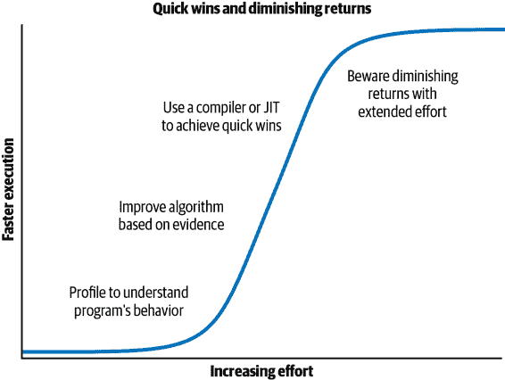
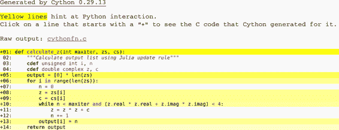

# 第七章：编译为 C

使代码运行更快的最简单方法是减少工作量。假设您已经选择了良好的算法并减少了处理的数据量，那么减少执行指令数的最简单方法就是将代码编译为机器码。

Python 为此提供了多种选项，包括像 Cython 这样的纯 C 编译方法；基于 LLVM 的编译通过 Numba；以及包含内置即时编译器（JIT）的替代虚拟机 PyPy。在决定采取哪种路径时，您需要平衡代码适应性和团队速度的需求。

每个工具都会向您的工具链添加新的依赖项，而 Cython 要求您使用一种新的语言类型（Python 和 C 的混合），这意味着您需要掌握一种新技能。Cython 的新语言可能会降低团队的速度，因为没有 C 知识的团队成员可能会在支持此代码时遇到困难；但实际上，这可能只是一个小问题，因为您只会在精心选择的代码小区域中使用 Cython。

值得注意的是，在您的代码上执行 CPU 和内存分析可能会让您开始考虑可以应用的更高级别算法优化。这些算法更改（例如避免计算的附加逻辑或缓存以避免重新计算）可以帮助您避免在代码中执行不必要的工作，而 Python 的表达能力有助于发现这些算法机会。Radim Řehůřek 在“使用 RadimRehurek.com（2014 年）使深度学习飞起来”的领域经验中讨论了 Python 实现如何击败纯 C 实现。

在本章中，我们将回顾以下内容：

+   Cython，最常用于编译为 C 的工具，涵盖了`numpy`和普通 Python 代码（需要一些 C 语言知识）

+   Numba，专门针对`numpy`代码的新编译器

+   PyPy，用于非`numpy`代码的稳定即时编译器，是普通 Python 可执行文件的替代品

本章稍后我们将探讨外部函数接口，允许将 C 代码编译为 Python 扩展模块。Python 的本地 API 与`ctypes`或者来自 PyPy 作者的`cffi`一起使用，以及 Fortran 到 Python 转换器`f2py`。

# 可能实现什么样的速度提升？

如果您的问题可以采用编译方法，很可能会实现一个数量级或更大的性能提升。在这里，我们将探讨在单个核心上实现一到两个数量级加速以及通过 OpenMP 使用多核的各种方法。

经编译后，Python 代码通常运行更快的是数学代码，其中包含许多重复相同操作的循环。在这些循环内部，您可能会创建许多临时对象。

调用外部库的代码（例如正则表达式、字符串操作和调用数据库库）在编译后不太可能加速。受 I/O 限制的程序也不太可能显示显著的加速。

类似地，如果你的 Python 代码专注于调用向量化的`numpy`例程，那么在编译后可能不会运行得更快——只有在被编译的代码主要是 Python（也许主要是循环）时才会更快。我们在第六章中讨论了`numpy`操作；编译并不真正有帮助，因为中间对象并不多。

总体来说，编译后的代码很少会比手工编写的 C 例程运行得更快，但也不太可能运行得更慢。可能由你的 Python 生成的 C 代码会像手写的 C 例程一样快，除非 C 程序员特别了解如何调整 C 代码以适应目标机器的架构。

对于以数学为重点的代码，手写的 Fortran 例程可能会比等效的 C 例程更快，但这可能需要专家级别的知识。总体来说，编译后的结果（可能使用 Cython）将与大多数程序员所需的手写 C 代码结果非常接近。

在分析和优化算法时，请记住图 7-1 中的图表。通过分析你的代码，你可以更明智地选择算法级别的优化。之后，与编译器的一些集中工作应该可以带来额外的加速。可能会继续微调算法，但不要奇怪看到你的大量工作带来越来越小的改进。要知道额外的努力何时不再有用。



###### 图 7-1\. 一些分析和编译工作会带来很多收益，但持续的努力往往会带来越来越少的回报

如果你处理的是没有`numpy`的 Python 代码和“电池内置”库，那么 Cython 和 PyPy 是你的主要选择。如果你使用`numpy`，那么 Cython 和 Numba 是正确的选择。这些工具都支持 Python 3.6 及以上版本。

以下一些示例需要一些对 C 编译器和 C 代码的了解。如果你缺乏这方面的知识，你应该学习一些 C，并在深入研究之前编译一个可工作的 C 程序。

# JIT 与 AOT 编译器

我们将要讨论的工具大致分为两类：提前编译的工具（AOT，例如 Cython）和即时编译的工具（JIT，例如 Numba、PyPy）。

通过 AOT 编译，你会创建一个针对你的机器专门优化的静态库。如果你下载`numpy`、`scipy`或 scikit-learn，它将使用 Cython 在你的机器上编译库的部分（或者你将使用像 Continuum 的 Anaconda 这样的发行版预编译的库）。通过预先编译，你将拥有一个可立即用于解决问题的库。

通过 JIT 编译，你无需做太多（或者干脆不做）前期工作；你让编译器在使用时编译代码的恰当部分。这意味着你会遇到“冷启动”问题——如果你的程序的大部分内容可以编译而目前没有编译，那么当你开始运行代码时，它将运行非常缓慢，因为它在编译代码。如果每次运行脚本时都发生这种情况，而你运行脚本的次数很多，这个成本就会变得很大。PyPy 就遭受这个问题，所以你可能不想将其用于频繁运行但是运行时间较短的脚本。

目前的情况表明，预先编译可以为我们带来最佳的速度提升，但通常这需要较多的手动工作。即时编译提供了一些令人印象深刻的速度提升，而几乎不需要手动干预，但它也可能遇到刚刚描述的问题。在选择适合你问题的正确技术时，你必须考虑这些权衡。

# 为什么类型信息可以帮助代码运行更快？

Python 是动态类型的——一个变量可以引用任何类型的对象，并且任何代码行都可以改变所引用对象的类型。这使得虚拟机很难优化代码在机器码级别的执行方式，因为它不知道将来的操作将使用哪种基本数据类型。使代码保持通用性会使其运行速度变慢。

在下面的示例中，`v`要么是一个浮点数，要么是表示`complex`数的一对浮点数。这两种情况可能在同一循环的不同时间点发生，或者在相关的串行代码段中发生：

```py
v = -1.0
print(type(v), abs(v))
```

```py
<class 'float'> 1.0
```

```py
v = 1-1j
print(type(v), abs(v))
```

```py
<class 'complex'> 1.4142135623730951
```

`abs`函数的工作方式取决于底层数据类型。对整数或浮点数使用`abs`会将负值变为正值。对复数使用`abs`则涉及对平方和的平方根：

<math alttext="left-bracket dollar-sign a b s left-parenthesis c right-parenthesis equals StartRoot c period r e a l squared plus c period i m a g squared EndRoot dollar-sign right-bracket"><mrow><mi>a</mi> <mi>b</mi> <mi>s</mi> <mrow><mo>(</mo> <mi>c</mi> <mo>)</mo></mrow> <mo>=</mo> <msqrt><mrow><mi>c</mi> <mo>.</mo> <mi>r</mi> <mi>e</mi> <mi>a</mi> <msup><mi>l</mi> <mn>2</mn></msup> <mo>+</mo> <mi>c</mi> <mo>.</mo> <mi>i</mi> <mi>m</mi> <mi>a</mi> <msup><mi>g</mi> <mn>2</mn></msup></mrow></msqrt></mrow></math>

`complex`示例的机器码涉及更多的指令，运行时间更长。在对一个变量调用`abs`之前，Python 首先必须查找变量的类型，然后决定调用哪个版本的函数——当你进行大量重复调用时，这种开销会累积起来。

在 Python 内部，每个基本对象，比如整数，都会被包装在一个更高级的 Python 对象中（例如，整数的高级对象是`int`）。更高级的对象具有额外的函数，如用于存储的`__hash__`和用于打印的`__str__`。

在一个受 CPU 限制的代码段中，变量的类型通常不会改变。这为我们提供了进行静态编译和更快代码执行的机会。

如果我们只想要大量的中间数学运算，我们不需要更高级的函数，也许我们也不需要引用计数的机制。我们可以降到机器代码级别，使用机器代码和字节快速计算，而不是操作更高级别的 Python 对象，这涉及更大的开销。为此，我们提前确定对象的类型，以便我们可以生成正确的 C 代码。

# 使用 C 编译器

在接下来的例子中，我们将使用来自 GNU C 编译器工具集的`gcc`和`g++`。如果您正确配置您的环境，您可以使用其他编译器（例如，Intel 的`icc`或 Microsoft 的`cl`）。Cython 使用`gcc`。

`gcc` 对大多数平台来说都是一个非常好的选择；它得到了很好的支持并且相当先进。通过使用调优的编译器（例如，Intel 的`icc`在 Intel 设备上可能会比`gcc`产生更快的代码），通常可以挤出更多性能，但代价是您必须获得更多的领域知识，并学习如何调整替代编译器的标志。

C 和 C++ 经常用于静态编译，而不是像 Fortran 这样的其他语言，因为它们普及并且支持广泛的库。编译器和转换器（例如 Cython）可以研究注释的代码，以确定是否可以应用静态优化步骤（如内联函数和展开循环）。

对中间抽象语法树的积极分析（由 Numba 和 PyPy 执行）提供了结合 Python 表达方式的知识的机会，以通知底层编译器如何最好地利用已见到的模式。

# 重新审视朱利亚集合示例

回顾第二章中我们对朱利亚集合生成器进行了性能分析。该代码使用整数和复数生成输出图像。图像的计算受到 CPU 的限制。

代码中的主要成本是计算`output`列表的 CPU 限制的内部循环。该列表可以绘制为一个方形像素数组，其中每个值表示生成该像素的成本。

内部函数的代码在示例 7-1 中显示。

##### 示例 7-1\. 回顾朱利亚函数的 CPU 限制代码

```py
def calculate_z_serial_purepython(maxiter, zs, cs):
    """Calculate output list using Julia update rule"""
    output = [0] * len(zs)
    for i in range(len(zs)):
        n = 0
        z = zs[i]
        c = cs[i]
        while n < maxiter and abs(z) < 2:
            z = z * z + c
            n += 1
        output[i] = n
    return output
```

在 Ian 的笔记本电脑上，使用纯 Python 实现在 CPython 3.7 上运行时，对 1,000 × 1,000 网格进行朱利亚集合计算，`maxiter=300`大约需要 8 秒。

# Cython

[Cython](http://cython.org) 是一个编译器，将带有类型注解的 Python 转换为编译的扩展模块。类型注解类似于 C 语言。可以使用`import`将此扩展作为常规 Python 模块导入。入门简单，但随着复杂性和优化水平的增加，需要逐步攀登学习曲线。对 Ian 而言，这是将计算密集型函数转换为更快代码的首选工具，因为它被广泛使用、成熟，并且支持 OpenMP。

借助 OpenMP 标准，可以将并行问题转换为在单台机器上多个 CPU 上运行的多进程感知模块。线程对你的 Python 代码是隐藏的；它们通过生成的 C 代码操作。

Cython（2007 年发布）是 Pyrex（2002 年发布）的一个分支，扩展了超出 Pyrex 初始目标的能力。使用 Cython 的库包括 SciPy、scikit-learn、lxml 和 ZeroMQ。

可以通过*setup.py*脚本使用 Cython 编译模块。也可以通过 IPython 中的“magic”命令交互使用。通常，开发人员会为类型进行注解，尽管某些自动注解也是可能的。

## 使用 Cython 编译纯 Python 版本

开始编写编译扩展模块的简便方法涉及三个文件。以我们的朱利亚集为例，它们如下所示：

+   调用 Python 代码（我们之前的朱利亚代码的主体）

+   要在新的*.pyx*文件中编译的函数

+   包含调用 Cython 制作扩展模块的指令的*setup.py*

使用这种方法，调用*setup.py*脚本使用 Cython 将*.pyx*文件编译为编译模块。在类 Unix 系统上，编译后的模块可能是*.so*文件；在 Windows 上，应该是*.pyd*（类似 DLL 的 Python 库）。

对于朱利亚示例，我们将使用以下内容：

+   *julia1.py*用于构建输入列表和调用计算函数

+   *cythonfn.pyx*，其中包含我们可以注释的 CPU-bound 函数

+   *setup.py*，其中包含构建说明

运行*setup.py*的结果是一个可以导入的模块。在我们的*julia1.py*脚本中，在 Example 7-2 中，我们只需要对`import`新模块和调用我们的函数做一些微小的更改。

##### 示例 7-2\. 将新编译的模块导入我们的主要代码

```py
...
import cythonfn  # as defined in setup.py
...
def calc_pure_python(desired_width, max_iterations):
    # ...
    start_time = time.time()
    output = cythonfn.calculate_z(max_iterations, zs, cs)
    end_time = time.time()
    secs = end_time - start_time
    print(f"Took {secs:0.2f} seconds")
...
```

在 Example 7-3 中，我们将从纯 Python 版本开始，没有类型注解。

##### 示例 7-3\. Cython 的 setup.py 中未修改的纯 Python 代码（从.py 重命名为 pyx）

```py
# cythonfn.pyx
def calculate_z(maxiter, zs, cs):
    """Calculate output list using Julia update rule"""
    output = [0] * len(zs)
    for i in range(len(zs)):
        n = 0
        z = zs[i]
        c = cs[i]
        while n < maxiter and abs(z) < 2:
            z = z * z + c
            n += 1
        output[i] = n
    return output
```

在 Example 7-4 中显示的*setup.py*脚本很简短；它定义了如何将*cythonfn.pyx*转换为*calculate.so*。

##### 示例 7-4\. setup.py，将 cythonfn.pyx 转换为 Cython 编译的 C 代码

```py
from distutils.core import setup
from Cython.Build import cythonize

setup(ext_modules=cythonize("cythonfn.pyx",
                            compiler_directives={"language_level": "3"}))
```

当我们在示例 7-5 中使用`build_ext`参数运行*setup.py*脚本时，Cython 将查找*cythonfn.pyx*并构建*cythonfn[…].so*。这里`language_level`被硬编码为`3`以强制支持 Python 3.*x*。

###### 注意

请记住，这是一个手动步骤 —— 如果您更新了*.pyx*或*setup.py*并忘记重新运行构建命令，则不会有更新的*.so*模块可供导入。如果您不确定是否已编译代码，请检查*.so*文件的时间戳。如有疑问，请删除生成的 C 文件和*.so*文件，然后重新构建它们。

##### 示例 7-5\. 运行 setup.py 构建新的编译模块

```py
$ python setup.py build_ext --inplace
Compiling cythonfn.pyx because it changed.
[1/1] Cythonizing cythonfn.pyx
running build_ext
building 'cythonfn' extension
gcc -pthread -B /home/ian/miniconda3/envs/high_performance_python_book_2e/...
gcc -pthread -shared -B /home/ian/miniconda3/envs/high_performance_python_...

```

`--inplace`参数告诉 Cython 将编译的模块构建到当前目录而不是单独的*build*目录中。构建完成后，我们将得到中间文件*cythonfn.c*，这相当难以阅读，以及*cythonfn[…].so*。

现在运行*julia1.py*代码时，导入了编译的模块，并且在 Ian 的笔记本电脑上计算出朱利叶集耗时 4.7 秒，而不是通常的 8.3 秒。这是非常小的努力带来的有用改进。

# pyximport

通过`pyximport`引入了一个简化的构建系统。如果您的代码具有简单的设置且不需要第三方模块，您可能完全可以不使用*setup.py*。

通过在示例 7-6 中看到的方式导入`pyximport`并调用`install`，任何随后导入的*.pyx*文件都将自动编译。此*.pyx*文件可以包含注释，或者在本例中，它可以是未注释的代码。结果运行时间仍为 4.7 秒，唯一的区别是我们没有编写*setup.py*文件。

##### 示例 7-6\. 使用`pyximport`替换 setup.py

```py
import pyximport
pyximport.install(language_level=3)
import cythonfn
# followed by the usual code
```

## 用于分析代码块的 Cython 注解

前面的示例显示，我们可以快速构建一个编译模块。对于紧密的循环和数学运算，这通常会导致速度提升。显然，我们不应该盲目优化 —— 我们需要知道哪些代码行花费了大量时间，以便决定在哪里集中精力。

Cython 具有一个注解选项，可以输出一个 HTML 文件，我们可以在浏览器中查看。我们使用命令`cython -a cythonfn.pyx`，并生成输出文件*cythonfn.html*。在浏览器中查看，它看起来像图 7-2。在[Cython 文档](http://bit.ly/cythonize)中也提供了类似的图像。


###### 图 7-2\. 未注释函数的彩色 Cython 输出

每行都可以双击展开，显示生成的 C 代码。更多的黄色表示“更多的调用进入 Python 虚拟机”，而更多的白色表示“更多的非 Python C 代码”。目标是尽可能减少黄色行，并尽可能增加白色行。

尽管“更多黄线”意味着更多调用进入虚拟机，这并不一定会导致你的代码运行变慢。每次调用进入虚拟机都是有成本的，但这些调用的成本只有在发生在大循环内部时才会显著。在大循环之外的调用（例如，在函数开始时用于创建`output`的行）相对于内部计算循环的成本来说并不昂贵。不要浪费时间在不会导致减速的行上。

在我们的例子中，回调到 Python 虚拟机次数最多的行（“最黄色的”）是第 4 和第 8 行。根据我们以前的分析工作，我们知道第 8 行可能被调用超过 3000 万次，因此这是一个需要重点关注的绝佳候选项。

第 9、10 和 11 行几乎同样是黄色的，并且我们也知道它们位于紧密的内部循环中。总体而言，它们将负责这个函数的大部分执行时间，因此我们需要首先关注这些行。如果需要回顾一下在这一部分中花费了多少时间，请参阅“使用 line_profiler 进行逐行测量”。

第 6 和 7 行的黄色较少，因为它们只被调用了 100 万次，它们对最终速度的影响将会小得多，因此我们稍后可以专注于它们。事实上，由于它们是`list`对象，除了您将在“Cython 和 numpy”中看到的，用`numpy`数组替换`list`对象将带来小的速度优势外，我们实际上无法加速它们的访问。

为了更好地理解黄色区域，您可以展开每一行。在图 7-3 中，我们可以看到为了创建`output`列表，我们迭代了`zs`的长度，构建了新的 Python 对象，这些对象由 Python 虚拟机进行引用计数。尽管这些调用很昂贵，但它们实际上不会影响此函数的执行时间。

要改善函数的执行时间，我们需要开始声明涉及昂贵内部循环的对象类型。这些循环可以减少相对昂贵的回调到 Python 虚拟机，从而节省时间。

总的来说，可能消耗最多 CPU 时间的是这些行：

+   在紧密的内部循环中

+   解引用`list`、`array`或`np.array`的项目

+   执行数学运算


###### 图 7-3\. Python 代码背后的 C 代码

###### 提示

如果您不知道哪些行被执行频率最高，使用性能分析工具——`line_profiler`，详见“使用 line_profiler 进行逐行测量”，将是最合适的选择。您将了解哪些行被执行得最频繁，以及哪些行在 Python 虚拟机内部花费最多，因此您将清楚地知道需要专注于哪些行来获得最佳的速度增益。

## 添加一些类型注解

图 7-2 显示我们函数的几乎每一行都在回调到 Python 虚拟机。我们所有的数值工作也在回调到 Python，因为我们使用了更高级别的 Python 对象。我们需要将这些转换为本地 C 对象，然后，在进行数值编码后，需要将结果转换回 Python 对象。

在 示例 7-7 中，我们看到如何使用 `cdef` 语法添加一些原始类型。

###### 注意

需要注意的是，这些类型只有 Cython 能理解，*而不是* Python。Cython 使用这些类型将 Python 代码转换为 C 对象，这些对象不需要回调到 Python 栈；这意味着操作速度更快，但失去了灵活性和开发速度。

我们添加的类型如下：

+   `int` 表示带符号整数

+   `unsigned int` 表示只能为正数的整数

+   `double complex` 表示双精度复数

`cdef` 关键字允许我们在函数体内声明变量。这些必须在函数顶部声明，因为这是 C 语言规范的要求。

##### 示例 7-7\. 添加原始 C 类型，通过在 C 中执行更多工作而不是通过 Python 虚拟机运行，来使我们的编译函数开始运行更快

```py
def calculate_z(int maxiter, zs, cs):
    """Calculate output list using Julia update rule"""
    cdef unsigned int i, n
    cdef double complex z, c
    output = [0] * len(zs)
    for i in range(len(zs)):
        n = 0
        z = zs[i]
        c = cs[i]
        while n < maxiter and abs(z) < 2:
            z = z * z + c
            n += 1
        output[i] = n
    return output
```

###### 注意

在添加 Cython 注释时，你正在向 *.pyx* 文件添加非 Python 代码。这意味着你失去了在解释器中开发 Python 的交互性。对于那些熟悉在 C 中编码的人，我们回到了代码-编译-运行-调试的循环中。

你可能会想知道是否可以为我们传入的列表添加类型注释。我们可以使用 `list` 关键字，但对于这个示例没有实际效果。`list` 对象仍然需要在 Python 级别进行询问以获取其内容，这是非常慢的。

在给一些原始对象分配类型的行为反映在 图 7-4 的注释输出中。关键是，第 11 和 12 行——我们最频繁调用的两行——现在已经从黄色变成白色，表明它们不再回调到 Python 虚拟机。相比于之前的版本，我们可以预期有很大的加速。


###### 图 7-4\. 我们的第一个类型注释

编译后，这个版本完成所需的时间为 0.49 秒。仅对函数进行少量更改后，我们的运行速度比原始 Python 版本快了 15 倍。

需要注意的是，我们之所以获得速度提升的原因是因为更多频繁执行的操作被推送到了 C 级别——在这种情况下，对 `z` 和 `n` 的更新。这意味着 C 编译器可以优化较低级别函数在表示这些变量的字节上操作的方式，而不调用相对较慢的 Python 虚拟机。

正如本章早前所述，复数的 `abs` 涉及计算实部和虚部平方和的平方根。在我们的测试中，我们希望查看结果的平方根是否小于 2。与其计算平方根，我们可以将比较式的另一边平方，将 `< 2` 转换为 `< 4`。这样避免了最后计算 `abs` 函数时需要计算平方根。

本质上，我们从以下内容开始

<math display="block"><mrow><msqrt><mrow><mi>c</mi> <mo>.</mo> <mi>r</mi> <mi>e</mi> <mi>a</mi> <msup><mi>l</mi> <mn>2</mn></msup> <mo>+</mo> <mi>c</mi> <mo>.</mo> <mi>i</mi> <mi>m</mi> <mi>a</mi> <msup><mi>g</mi> <mn>2</mn></msup></mrow></msqrt> <mo><</mo> <msqrt><mn>4</mn></msqrt></mrow></math>

我们已经简化了操作为

<math display="block"><mrow><mi>c</mi> <mo>.</mo> <mi>r</mi> <mi>e</mi> <mi>a</mi> <msup><mi>l</mi> <mn>2</mn></msup> <mo>+</mo> <mi>c</mi> <mo>.</mo> <mi>i</mi> <mi>m</mi> <mi>a</mi> <msup><mi>g</mi> <mn>2</mn></msup> <mo><</mo> <mn>4</mn></mrow></math>

如果我们在以下代码中保留了 `sqrt` 操作，仍然会看到执行速度的提升。优化代码的一个秘诀是尽量减少其工作量。通过考虑函数的最终目的而消除一个相对昂贵的操作，使得 C 编译器可以专注于其擅长的部分，而不是试图推测程序员的最终需求。

编写等效但更专业化的代码来解决相同的问题被称为*强度降低*。您牺牲了更差的灵活性（可能还有更差的可读性），换取更快的执行速度。

这种数学展开导致 示例 7-8，其中我们用一行简化的数学公式替换了相对昂贵的 `abs` 函数。

##### 示例 7-8\. 通过 Cython 扩展 `abs` 函数

```py
def calculate_z(int maxiter, zs, cs):
    """Calculate output list using Julia update rule"""
    cdef unsigned int i, n
    cdef double complex z, c
    output = [0] * len(zs)
    for i in range(len(zs)):
        n = 0
        z = zs[i]
        c = cs[i]
        while n < maxiter and (z.real * z.real + z.imag * z.imag) < 4:
            z = z * z + c
            n += 1
        output[i] = n
    return output
```

通过对代码进行注释，我们看到第 10 行的 `while`（图 7-5）变得更加黄色——看起来它可能在做更多的工作而不是更少。目前不清楚我们将获得多少速度增益，但我们知道这一行被调用了超过 3000 万次，因此我们预计会有很大的改进。

这个改变产生了显著效果——通过减少内部循环中 Python 调用的数量，大大降低了函数的计算时间。这个新版本仅需 0.19 秒完成，比原始版本快了惊人的 40 倍。无论如何，看到什么就取经验，但*测量*来测试您所有的更改！



###### 图 7-5\. 扩展数学运算以获取最终优势

###### 注意

Cython 支持多种编译到 C 的方法，其中一些比这里描述的全类型注释方法更简单。如果您希望更轻松地开始使用 Cython，应该先熟悉 [纯 Python 模式](https://oreil.ly/5y9_a)，并查看 `pyximport`，以便为同事们引入 Cython 提供便利。

对于这段代码的最后可能改进，我们可以禁用列表中每个解引用的边界检查。边界检查的目标是确保程序不会访问超出分配数组的数据——在 C 语言中，不小心访问数组边界之外的内存会导致意外结果（很可能是段错误！）。

默认情况下，Cython 会保护开发人员免受意外超出列表限制的影响。这种保护会消耗一点 CPU 时间，但它发生在我们函数的外循环中，因此总体上不会占用太多时间。通常情况下，禁用边界检查是安全的，除非您正在执行自己的数组地址计算，否则您必须小心保持在列表的边界内。

Cython 有一组可以用各种方式表示的标志。最简单的方法是将它们作为单行注释添加到*.pyx*文件的开头。也可以使用装饰器或编译时标志来更改这些设置。要禁用边界检查，我们在*.pyx*文件的开头的注释中添加了一个 Cython 的指令：

```py
#cython: boundscheck=False
def calculate_z(int maxiter, zs, cs):
```

如上所述，禁用边界检查只会节省一点时间，因为它发生在外循环中，而不是内循环中，后者更昂贵。对于这个例子，它不会再节省我们任何时间。

###### 提示

如果您的 CPU 绑定代码处于频繁解引用项的循环中，请尝试禁用边界检查和包裹检查。

# Cython 和 numpy

`list`对象（有关背景，请参阅第三章）对每个解引用都有开销，因为它们引用的对象可能出现在内存中的任何位置。相比之下，`array`对象在连续的 RAM 块中存储原始类型，这样可以更快地寻址。

Python 有`array`模块，为基本的原始类型（包括整数、浮点数、字符和 Unicode 字符串）提供了 1D 存储。NumPy 的`numpy.array`模块允许多维存储和更广泛的原始类型，包括复数。

当以可预测的方式遍历`array`对象时，可以指示编译器避免要求 Python 计算适当的地址，而是直接通过移动到其内存地址中的下一个原始项目来处理序列。由于数据是按照连续块布局的，因此通过使用偏移量来计算 C 中下一个项目的地址要比要求 CPython 计算相同结果要容易得多，后者需要缓慢调用回虚拟机。

请注意，如果您运行以下`numpy`版本*没有*任何 Cython 注释（也就是说，如果您只是将其作为普通的 Python 脚本运行），它将花费大约 21 秒的时间来运行——远远超过普通的 Python`list`版本，后者大约需要 8 秒。这种减速是因为在`numpy`列表中解引用单个元素的开销——即使对于初学者来说，这可能感觉像处理操作的直观方式，但`numpy`从未设计用于这种方式。通过编译代码，我们可以消除这种开销。

Cython 有两种特殊的语法形式。 旧版本的 Cython 有一个用于`numpy`数组的特殊访问类型，但是最近引入了通过`memoryview`来实现通用缓冲区接口协议——这允许对实现了缓冲区接口的任何对象进行相同的低级访问，包括`numpy`数组和 Python 数组。

缓冲区接口的另一个优点是，内存块可以轻松地与其他 C 库共享，无需将它们从 Python 对象转换为另一种形式。

示例 7-9 中的代码块看起来有点像原始实现，只是我们添加了`memoryview`注释。 函数的第二个参数是`double complex[:] zs`，这意味着我们使用缓冲区协议指定了一个双精度`complex`对象，该协议使用`[]`指定，其中包含由单冒号`:`指定的一维数据块。

##### 示例 7-9\. Julia 计算函数的`numpy`版本添加了注释

```py
# cythonfn.pyx
import numpy as np
cimport numpy as np

def calculate_z(int maxiter, double complex[:] zs, double complex[:] cs):
    """Calculate output list using Julia update rule"""
    cdef unsigned int i, n
    cdef double complex z, c
    cdef int[:] output = np.empty(len(zs), dtype=np.int32)
    for i in range(len(zs)):
        n = 0
        z = zs[i]
        c = cs[i]
        while n < maxiter and (z.real * z.real + z.imag * z.imag) < 4:
            z = z * z + c
            n += 1
        output[i] = n
    return output
```

除了使用缓冲区注释语法指定输入参数之外，我们还使用`empty`为`output`变量添加了注释，通过`empty`将其分配给 1D `numpy`数组。 调用`empty`将分配一块内存块，但不会使用合理的值初始化内存，因此它可能包含任何内容。 我们将在内部循环中重写此数组的内容，因此我们不需要使用默认值重新分配它。 这比使用默认值分配和设置数组内容略快。

我们还通过使用更快、更明确的数学版本扩展了对`abs`的调用。 这个版本运行时间为 0.18 秒——比示例 7-8 中纯 Python Julia 示例的原始 Cython 版本稍快一些。 纯 Python 版本在每次解引用 Python `complex`对象时都会有一些开销，但这些解引用发生在外部循环中，因此不会占用太多执行时间。 在外部循环之后，我们制作了这些变量的本机版本，它们以“C 速度”运行。 对于这个`numpy`示例和以前的纯 Python 示例的内部循环都在相同的数据上执行相同的工作，因此时间差异由外部循环解引用和创建`output`数组所解释。

供参考，如果我们使用前面的代码但不扩展`abs`数学，则 Cython 化结果需要 0.49 秒。 这个结果使它与早期等效的纯 Python 版本的运行时间相同。

## 在一台计算机上使用 OpenMP 并行化解决方案

作为这个版本代码演变的最后一步，让我们来看看使用 OpenMP C++扩展并行化我们的尴尬并行问题。 如果您的问题符合这种模式，您可以快速利用计算机中的多个核心。

开放多处理（OpenMP 是一个明确定义的跨平台 API，支持 C、C++ 和 Fortran 的并行执行和内存共享。它内置于大多数现代 C 编译器中，如果 C 代码编写得当，那么并行化将在编译器级别发生，因此对于开发者来说工作量相对较小，通过 Cython 实现。

使用 Cython，可以通过使用`prange`（并行范围）操作符，并将`-fopenmp`编译器指令添加到*setup.py*来添加 OpenMP。在`prange`循环中进行的工作可以并行执行，因为我们禁用了（GIL）。GIL 保护对 Python 对象的访问，防止多个线程或进程同时访问同一内存，这可能导致数据损坏。通过手动禁用 GIL，我们断言我们不会破坏自己的内存。在执行此操作时要小心，并尽可能保持代码简单，以避免细微的 bug。

支持`prange`的代码修改版本在示例 7-10 中展示。`with nogil:`指定禁用 GIL 的代码块；在此块内，我们使用`prange`来启用 OpenMP 并行`for`循环，独立计算每个`i`。

###### 警告

当禁用全局解释器锁（GIL）时，我们必须*不*操作常规的 Python 对象（如列表）；我们只能操作原始对象和支持`memoryview`接口的对象。如果我们并行操作普通的 Python 对象，那么我们将不得不解决 GIL 故意避免的相关内存管理问题。Cython 并不阻止我们操纵 Python 对象，但如果你这样做，只会带来痛苦和混乱！

##### 示例 7-10\. 添加`prange`以启用使用 OpenMP 进行并行化

```py
# cythonfn.pyx
from cython.parallel import prange
import numpy as np
cimport numpy as np

def calculate_z(int maxiter, double complex[:] zs, double complex[:] cs):
    """Calculate output list using Julia update rule"""
    cdef unsigned int i, length
    cdef double complex z, c
    cdef int[:] output = np.empty(len(zs), dtype=np.int32)
    length = len(zs)
    with nogil:
        for i in prange(length, schedule="guided"):
            z = zs[i]
            c = cs[i]
            output[i] = 0
            while output[i] < maxiter and (z.real * z.real + z.imag * z.imag) < 4:
                z = z * z + c
                output[i] += 1
    return output
```

要编译*cythonfn.pyx*，我们必须修改*setup.py*脚本，如示例 7-11 所示。我们告诉它在编译期间使用`-fopenmp`作为参数通知 C 编译器启用 OpenMP，并链接 OpenMP 库。

##### 示例 7-11\. 为 Cython 的 setup.py 添加 OpenMP 编译器和链接器标志

```py
#setup.py
from distutils.core import setup
from distutils.extension import Extension
import numpy as np

ext_modules = [Extension("cythonfn",
                         ["cythonfn.pyx"],
                         extra_compile_args=['-fopenmp'],
                         extra_link_args=['-fopenmp'])]

from Cython.Build import cythonize
setup(ext_modules=cythonize(ext_modules,
                            compiler_directives={"language_level": "3"},),
      include_dirs=[np.get_include()])
```

使用 Cython 的`prange`，我们可以选择不同的调度方法。使用`static`，工作负载均匀分布在可用的 CPU 上。我们的某些计算区域时间昂贵，而某些则便宜。如果我们请求 Cython 使用`static`在 CPU 上均匀调度工作块，则某些区域的结果将比其他区域更快完成，并且这些线程将会空闲。

`dynamic`和`guided`调度选项都试图通过在运行时动态分配更小的工作块来缓解这个问题，以便在工作负载计算时间变化时更均匀地分配 CPU。正确的选择取决于工作负载的性质。

引入 OpenMP 并使用 `schedule="guided"`，我们将执行时间降至约 0.05 秒——`guided` 调度将动态分配工作，因此更少的线程将等待新的工作。

对于这个示例，我们也可以通过使用 `#cython: boundscheck=False` 禁用边界检查，但这不会改善我们的运行时间。

# Numba

[Numba](http://numba.pydata.org) 是 Continuum Analytics 推出的一个即时编译器，专门用于处理 `numpy` 代码，它通过 LLVM 编译器在运行时编译代码（*不*是像我们之前的示例中使用 `g++` 或 `gcc++` 那样预先编译）。它不需要预编译过程，因此当您针对新代码运行它时，它会为您的硬件编译每个带有注释的函数。美妙之处在于，您只需提供一个装饰器告诉它应该关注哪些函数，然后让 Numba 接管。它旨在运行所有标准的 `numpy` 代码。

自本书第一版以来，Numba 已经迅速发展。现在它非常稳定，因此如果你使用 `numpy` 数组并且有非向量化的代码，需要迭代多个项目，Numba 应该能为你带来快速而无痛的优势。Numba 不绑定外部的 `C` 库（Cython 可以做到），但它可以自动为 GPU 生成代码（Cython 不能做到）。

使用 Numba 的一个缺点是工具链——它使用 LLVM，而 LLVM 有许多依赖项。我们建议您使用 Continuum 的 Anaconda 发行版，因为它提供了所有内容；否则，在新环境中安装 Numba 可能会非常耗时。

示例 7-12 展示了将 `@jit` 装饰器添加到我们核心 Julia 函数的过程。这就是所需的全部操作；导入 `numba` 意味着 LLVM 机制在执行时会在后台编译这个函数。

##### 示例 7-12\. 将`@jit`装饰器应用于一个函数

```py
from numba import jit
...
@jit()
def calculate_z_serial_purepython(maxiter, zs, cs, output):
```

如果去除 `@jit` 装饰器，这只是在 Python 3.7 中运行的 Julia 演示的 `numpy` 版本，需要 21 秒。添加 `@jit` 装饰器将执行时间降至 0.75 秒。这与我们使用 Cython 实现的结果非常接近，但不需要所有的注释工作。

如果我们在同一个 Python 会话中第二次运行相同的函数，它的运行速度会更快，仅为 0.47 秒——如果参数类型相同，则无需在第二次通过编译目标函数，因此整体执行速度更快。在第二次运行时，Numba 的结果与我们之前获得的使用 `numpy` 的 Cython 结果相当（所以它和 Cython 一样快，几乎没有额外工作！）。PyPy 有相同的预热要求。

如果您想了解 Numba 提供的另一个视角，请参阅 “Numba”，其中核心开发者 Valentin Haenel 谈到了 `@jit` 装饰器，查看原始 Python 源代码，并进一步探讨了并行选项以及纯 Python 编译互操作性的 `typed List` 和 `typed Dict`。

就像 Cython 一样，我们可以使用`prange`添加 OpenMP 并行化支持。示例 7-13 扩展了装饰器以要求`nopython`和`parallel`。`nopython`说明如果 Numba 无法编译所有代码，将会失败。没有这个参数，Numba 可能会悄悄地回退到一个较慢的 Python 模式；你的代码会运行正确，但是不会看到任何加速效果。添加`parallel`可以启用对`prange`的支持。这个版本将一般的运行时间从 0.47 秒降低到 0.06 秒。目前 Numba 不支持 OpenMP 调度选项（而且使用 Cython，`guided`调度器在这个问题上运行稍快），但我们预计未来版本将会增加支持。

##### 示例 7-13\. 使用`prange`添加并行化

```py
@jit(nopython=False, parallel=True)
def calculate_z(maxiter, zs, cs, output):
    """Calculate output list using Julia update rule"""
    for i in prange(len(zs)):
        n = 0
        z = zs[i]
        c = cs[i]
        while n < maxiter and (z.real*z.real + z.imag*z.imag) < 4:
            z = z * z + c
            n += 1
        output[i] = n
```

在使用 Numba 进行调试时，有用的是注意你可以要求 Numba 显示函数调用的中间表示和类型。在示例 7-14 中，我们可以看到`calculate_z`接受一个`int64`和三个`array`类型。

##### 示例 7-14\. 调试推断类型

```py
print(calculate_z.inspect_types())
# calculate_z (int64, array(complex128, 1d, C),
               array(complex128, 1d, C), array(int32, 1d, C))
```

示例 7-15 展示了从调用`inspect_types()`得到的持续输出，其中每行编译代码都增加了类型信息。如果你发现无法使`nopython=True`工作，这个输出非常宝贵；在这里，你可以发现 Numba 无法识别你的代码的地方。

##### 示例 7-15\. 查看来自 Numba 的中间表示

```py
...
def calculate_z(maxiter, zs, cs, output):

    # --- LINE 14 ---

    """Calculate output list using Julia update rule"""

    # --- LINE 15 ---
    #   maxiter = arg(0, name=maxiter)  :: int64
    #   zs = arg(1, name=zs)  :: array(complex128, 1d, C)
    #   cs = arg(2, name=cs)  :: array(complex128, 1d, C)
    #   output = arg(3, name=output)  :: array(int32, 1d, C)
    #   jump 2
    # label 2
    #   $2.1 = global(range: <class 'range'>)  :: Function(<class 'range'>)
...
```

Numba 是一个强大的即时编译器，现在正在成熟。不要期望一次成功的魔术——你可能需要审视生成的代码来弄清楚如何使你的代码在`nopython`模式下编译。一旦解决了这个问题，你可能会看到不错的收获。你最好的方法是将当前的代码分解成小的（<10 行）和离散的函数，并逐个解决它们。不要试图将一个大函数抛到 Numba 中；如果你只有小而离散的代码块需要逐个审查，你可以更快地调试这个过程。

## 使用 Numba 为 Pandas 编译 NumPy

在“Pandas”中，我们讨论了使用普通最小二乘法解决 Pandas DataFrame 中 10 万行数据的斜率计算任务。通过使用 Numba，我们可以将该方法的速度提高一个数量级。

我们可以取出之前使用的`ols_lstsq_raw`函数，并像示例 7-16 中所示装饰为`numba.jit`，生成一个编译版本。请注意`nopython=True`参数——这将强制 Numba 在传入不理解的数据类型时引发异常，否则它会悄悄地回退到纯 Python 模式。如果我们传入 Pandas Series，我们不希望它运行正确但速度慢；我们希望得到通知，表明我们传入了错误的数据。在这个版本中，Numba 只能编译 NumPy 数据类型，不能编译像 Series 这样的 Pandas 类型。

##### 示例 7-16\. 在 Pandas DataFrame 上使用`numpy`解决普通最小二乘法

```py
def ols_lstsq_raw(row):
    """Variant of `ols_lstsq` where row is a numpy array (not a Series)"""
    X = np.arange(row.shape[0])
    ones = np.ones(row.shape[0])
    A = np.vstack((X, ones)).T
    m, c = np.linalg.lstsq(A, row, rcond=-1)[0]
    return m

# generate a Numba compiled variant
ols_lstsq_raw_values_numba = jit(ols_lstsq_raw, nopython=True)

results = df.apply(ols_lstsq_raw_values_numba, axis=1, raw=True)
```

第一次调用此函数时，我们会得到预期的短延迟，因为函数正在编译；处理 10 万行需要 2.3 秒，包括编译时间。后续调用处理 10 万行非常快——未编译的`ols_lstsq_raw`每 10 万行需要 5.3 秒，而使用 Numba 后只需要 0.58 秒。这几乎是十倍的加速！

# PyPy

[PyPy](http://pypy.org)是 Python 语言的另一种实现，包含一个追踪即时编译器；它与 Python 3.5+兼容。通常，它落后于最新的 Python 版本；在撰写第二版时，Python 3.7 是标准版本，而 PyPy 支持最多到 Python 3.6。

PyPy 是 CPython 的即插即用替代品，并提供所有内置模块。该项目包括 RPython 翻译工具链，用于构建 PyPy（也可以用于构建其他解释器）。PyPy 中的 JIT 编译器非常有效，几乎不需要或不需要您付出任何努力就可以看到很好的速度提升。查看“PyPy 用于成功的 Web 和数据处理系统（2014 年）”了解一个大型 PyPy 部署成功故事。

PyPy 在不修改的情况下运行我们的纯 Python Julia 演示。使用 CPython 需要 8 秒，而使用 PyPy 只需要 0.9 秒。这意味着 PyPy 实现了与示例 7-8 中的 Cython 示例非常接近的结果，而*毫无努力*——这非常令人印象深刻！正如我们在 Numba 讨论中观察到的那样，如果计算在*同一个会话*中再次运行，则第二次及后续运行比第一次运行更快，因为它们已经编译过了。

通过扩展数学并去除对`abs`的调用，PyPy 运行时降至 0.2 秒。这相当于使用纯 Python 和`numpy`的 Cython 版本，而无需任何工作！请注意，这个结果只在没有使用`numpy`与 PyPy 时才成立。

PyPy 支持所有内置模块的事实很有趣——这意味着`multiprocessing`在 CPython 中的运行方式也可以在 PyPy 中使用。如果您遇到可以使用内置模块并且可以使用`multiprocessing`并行运行的问题，那么您可以期望所有可能希望获得的速度增益都将可用。

PyPy 的速度随时间而演变。[*speed.pypy.org*](http://speed.pypy.org/)上较旧的图表会让您了解 PyPy 的成熟度。这些速度测试反映了各种用例，而不仅仅是数学运算。显然，PyPy 提供比 CPython 更快的体验。


###### 图 7-6\. 每个新版本的 PyPy 都提供了速度改进。

## 垃圾回收差异

PyPy 使用不同类型的垃圾收集器比 CPython，这可能会导致代码的一些不明显的行为变化。而 CPython 使用引用计数，PyPy 使用了一种修改后的标记-清除方法，可能会在很长时间后清理未使用的对象。两者都是 Python 规范的正确实现；你只需要意识到在切换时可能需要进行代码修改。

在 CPython 中看到的一些编码方法依赖于引用计数器的行为，特别是在没有显式文件关闭的情况下打开并写入文件时的文件刷新。使用 PyPy 相同的代码将运行，但对文件的更新可能会在下次垃圾收集器运行时稍后刷新到磁盘上。在 PyPy 和 Python 中都有效的另一种形式是使用`with`来打开并自动关闭文件的上下文管理器。PyPy 网站上的[Differences Between PyPy and CPython page](http://bit.ly/PyPy_CPy_diff)列出了详细信息。

## 运行 PyPy 和安装模块

如果您从未运行过另一种 Python 解释器，则可以从一个简短的示例中受益。假设您已经下载并解压了 PyPy，现在将有一个包含*bin*目录的文件夹结构。按照 Example 7-17 中显示的方式运行它以启动 PyPy。

##### 示例 7-17. 运行 PyPy 以查看它是否实现了 Python 3.6

```py
...
$ pypy3
Python 3.6.1 (784b254d6699, Apr 14 2019, 10:22:42)
[PyPy 7.1.1-beta0 with GCC 6.2.0 20160901] on linux
Type "help", "copyright", "credits", or "license" for more information.
And now for something completely different
...
```

请注意，PyPy 7.1 作为 Python 3.6 运行。现在我们需要设置`pip`，并且我们想要安装 IPython。在 Example 7-18 中显示的步骤与您可能在没有现有分发或包管理器的帮助下安装`pip`时使用的 CPython 相同。请注意，当运行 IPython 时，我们得到与在前面示例中运行`pypy3`时看到的相同的构建号。

您可以看到 IPython 与 CPython 一样运行 PyPy，并使用`%run`语法在 IPython 中执行 Julia 脚本以获得 0.2 秒的运行时间。

##### 示例 7-18. 为 PyPy 安装`pip`以安装第三方模块，如 IPython

```py
...
$ pypy3 -m ensurepip
Collecting setuptools
Collecting pip
Installing collected packages: setuptools, pip
Successfully installed pip-9.0.1 setuptools-28.8.0

$ pip3 install ipython
Collecting ipython

$ ipython
Python 3.6.1 (784b254d6699, Apr 14 2019, 10:22:42)
Type 'copyright', 'credits', or 'license' for more information
IPython 7.8.0 -- An enhanced Interactive Python. Type '?' for help.

In [1]: %run julia1_nopil_expanded_math.py
Length of x: 1000
Total elements: 1000000
calculate_z_serial_purepython took 0.2143106460571289 seconds
Length of x: 1000
Total elements: 1000000
calculate_z_serial_purepython took 0.1965022087097168 seconds
...
```

请注意，PyPy 支持像`numpy`这样需要 C 绑定的项目，通过 CPython 扩展兼容层[`cpyext`](http://bit.ly/PyPy_compatibility)，但这会增加 4-6 倍的开销，通常使`numpy`变得太慢。如果你的代码大部分是纯 Python，并且只有少量调用`numpy`，你仍然可能会看到明显的整体收益。如果你的代码，像 Julia 示例一样，对`numpy`进行了多次调用，那么它将运行得明显慢。这里使用`numpy`数组的 Julia 基准运行速度比使用 CPython 运行时慢 6 倍。

如果您需要其他软件包，它们应该能够安装，多亏了 `cpyext` 兼容模块，这基本上是 PyPy 版本的 `python.h`。它处理 PyPy 和 CPython 不同的内存管理需求；然而，每个管理调用的成本为 4-6×，因此 `numpy` 的速度优势可能会被这些开销抵消。一个名为 `HPy`（以前称为 `PyHandle`）的新项目旨在通过提供更高级的对象句柄来消除这些开销，该句柄不与 CPython 的实现绑定，并且可以与 Cython 等其他项目共享。

如果您想了解 PyPy 的性能特征，请查看 `vmprof` 轻量级抽样分析器。它是线程安全的，并支持基于 Web 的用户界面。

PyPy 的另一个缺点是它可能使用大量内存。每个发布版在这方面都更好，但实际上可能比 CPython 使用更多内存。尽管如此，内存是相当便宜的，因此有意将其用于性能提升是有意义的。有些用户在使用 PyPy 时还报告了更低的内存使用情况。如果这对您很重要，请根据代表性数据进行实验。

# 速度改进摘要

总结之前的结果，在 Table 7-1 中我们看到，对于纯 Python 数学代码样本，PyPy 大约比不经过代码更改的 CPython 快 9 倍，如果简化 `abs` 行，它甚至更快。在这两种情况下，Cython 都比 PyPy 运行得更快，但需要有注释的代码，这会增加开发和支持的工作量。

Table 7-1\. Julia（无 `numpy`）结果

|   | 速度 |
| --- | --- |
| CPython | 8.00 秒 |
| Cython | 0.49 秒 |
| Cython 在扩展数学上 | 0.19 秒 |
| PyPy | 0.90 秒 |
| PyPy 在扩展数学上 | 0.20 秒 |

使用 `numpy` 的 Julia 求解器可以探索 OpenMP。在 Table 7-2 中，我们可以看到，无论是 Cython 还是 Numba，在扩展数学运算中都比非 `numpy` 版本运行得更快。当我们加入 OpenMP 时，无论是 Cython 还是 Numba 都可以进一步提高速度，而额外编码的工作量非常少。

Table 7-2\. Julia（使用 `numpy` 和扩展数学运算）结果

|  | 速度 |
| --- | --- |
| CPython | 21.00 秒 |
| Cython | 0.18 秒 |
| Cython 和 OpenMP “guided” | 0.05 秒 |
| Numba（第二次及后续运行） | 0.17 秒 |
| Numba 和 OpenMP | 0.06 秒 |

对于纯 Python 代码来说，PyPy 是显而易见的首选。对于 `numpy` 代码来说，Numba 是一个很好的首选。

# 何时使用每种技术

如果您正在处理数字项目，那么这些技术都可能对您有用。Table 7-3 总结了主要选项。

Table 7-3\. 编译器选项

|  | Cython | Numba | PyPy |
| --- | --- | --- | --- |
| 成熟 | Y | Y | Y |
| 广泛使用 | Y | – | – |
| `numpy` 支持 | Y | Y | Y |
| 不会破坏现有代码 | – | Y | Y |
| 需要 C 知识 | Y | – | – |
| 支持 OpenMP | Y | Y | – |

Numba 可能会为您带来快速的收获，付出的努力很少，但它也有一些限制，可能会导致它在您的代码上表现不佳。它也是一个相对年轻的项目。

Cython 可能为最广泛的问题集提供了最佳结果，但它确实需要更多的投入，并且由于将 Python 与 C 注释混合，存在额外的“支持税”。

如果您不使用`numpy`或其他难以移植的 C 扩展，PyPy 是一个强有力的选择。

如果您部署生产工具，您可能希望坚持使用已知的工具 —— Cython 应该是您的主要选择，并且您可能想查看 “Making Deep Learning Fly with RadimRehurek.com (2014)”。PyPy 在生产环境中也被使用（参见 “PyPy for Successful Web and Data Processing Systems (2014)”）。

如果您处理轻量级数值需求，请注意 Cython 的缓冲区接口接受`array.array`矩阵 —— 这是一种向 Cython 传递数据块进行快速数值处理的简便方法，而不必将`numpy`作为项目依赖添加进来。

总体而言，Numba 正在成熟，是一个有前途的项目，而 Cython 已经非常成熟。PyPy 现在被认为相当成熟，应该绝对被评估为长时间运行的进程。

在由 Ian 主持的班级中，一个能干的学生实现了 Julia 算法的 C 版本，并且失望地发现它比他的 Cython 版本执行得更慢。事实证明，他在 64 位机器上使用 32 位浮点数 —— 这比 64 位机器上的 64 位双精度浮点数运行更慢。尽管这位学生是一位优秀的 C 程序员，但他不知道这可能导致速度成本。他改变了他的代码，尽管这个手工编写的 C 版本比自动生成的 Cython 版本短得多，但速度大致相同。编写原始的 C 版本、比较其速度以及找出如何修复它的过程比一开始就使用 Cython 花费了更长的时间。

这只是一个轶事；我们并不认为 Cython 会生成最佳代码，而且有能力的 C 程序员可能会找出如何使他们的代码比 Cython 生成的版本运行更快的方法。值得注意的是，手写的 C 比转换的 Python 更快这一假设并不安全。您必须始终进行基准测试并根据证据做出决策。C 编译器在将代码转换为相当高效的机器代码方面非常出色，而 Python 在让您用易于理解的语言表达问题方面也非常出色 —— 合理地结合这两种力量。

## 其他即将推出的项目

[PyData 编译器页面](http://compilers.pydata.org) 列出了一组高性能和编译器工具。

[Pythran](https://oreil.ly/Zi4r5)是一个面向使用`numpy`的科学家的 AOT 编译器。通过少量的注解，它可以将 Python 数值代码编译成更快的二进制代码——它的加速效果与`Cython`非常相似，但工作量要少得多。除了其他功能外，它总是释放 GIL 并且可以使用 SIMD 指令和 OpenMP。像 Numba 一样，它不支持类。如果你在 Numpy 中有紧密的局部循环，Pythran 绝对值得评估。相关的 FluidPython 项目旨在使 Pythran 编写更加简单，并提供 JIT 能力。

[Transonic](https://oreil.ly/tT4Sf)试图通过一个接口将 Cython、Pythran、Numba 以及可能的其他编译器整合在一起，以便快速评估多个编译器，而无需重写代码。

[ShedSkin](https://oreil.ly/BePH-)是一个面向非科学纯 Python 代码的 AOT 编译器。它不支持`numpy`，但如果你的代码是纯 Python 的，ShedSkin 可以产生类似于 PyPy（不使用`numpy`）的加速效果。它支持 Python 2.7，并部分支持 Python 3.*x*。

[PyCUDA](https://oreil.ly/Lg4H3)和[PyOpenCL](https://oreil.ly/8e3OA)为 Python 提供了 CUDA 和 OpenCL 的绑定，可以直接访问 GPU。这两个库已经非常成熟，并支持 Python 3.4+。

[Nuitka](https://oreil.ly/dLPEw)是一个 Python 编译器，旨在成为传统 CPython 解释器的替代品，并支持创建编译后的可执行文件。它支持完整的 Python 3.7，尽管在我们的测试中，它对我们的纯 Python 数值测试并没有显著的速度提升。

我们的社区拥有多种编译选项，这是一种幸运。尽管它们都有各自的权衡，但它们也提供了强大的功能，使得复杂的项目能够充分利用 CPU 和多核架构的全部性能。

# 图形处理单元（GPU）

图形处理单元（GPU）因其加速算术密集型计算工作负载的能力而变得非常流行。最初设计用于处理 3D 图形的重型线性代数需求，GPU 特别适合解决易于并行化的问题。

有趣的是，如果仅看时钟速度，GPU 本身比大多数 CPU 要慢。这可能看起来有些反直觉，但正如我们在“计算单元”中讨论的那样，时钟速度只是硬件计算能力的一个衡量标准。GPU 在大规模并行任务方面表现出色，因为它们拥有惊人数量的计算核心。一般来说，CPU 通常有大约 12 个核心，而现代 GPU 有数千个核心。例如，在用于运行本节基准测试的机器上，AMD Ryzen 7 1700 CPU 每个核心运行速度为 3.2 GHz，而 NVIDIA RTX 2080 TI GPU 有 4,352 个核心，每个核心运行速度为 1.35 GHz。¹

这种令人难以置信的并行计算能力可以显著加快许多数值任务的速度。然而，在这些设备上编程可能非常困难。由于并行性的增加，需要考虑数据的局部性，并且这可能是速度提升的决定性因素。有许多工具可以在 Python 中编写本地 GPU 代码（也称为`kernels`），例如[CuPy](https://cupy.chainer.org)。然而，现代深度学习算法的需求已经推动了易于使用和直观的 GPU 新接口。

在易于使用的 GPU 数学库方面，TensorFlow 和 PyTorch 是两个领先者。我们将专注于 PyTorch，因为它易于使用且速度快。²

## 动态图：PyTorch

[PyTorch](https://pytorch.org)是一个静态计算图张量库，特别适合用户，并且对于任何熟悉`numpy`的人来说，它具有非常直观的 API。此外，由于它是一个张量库，它具有与`numpy`相同的所有功能，还可以通过其静态计算图创建函数，并通过称为`autograd`的机制计算这些函数的导数。

###### 注意

由于它与我们的讨论无关，PyTorch 的`autograd`功能被省略。然而，这个模块非常了不起，可以对由 PyTorch 操作组成的任意函数进行求导。它可以在任意值处实时进行，并且可以非常简单高效地完成。尽管这对你的工作可能也不相关，但我们建议学习`autograd`和自动微分，因为这确实是数值计算中的一个令人难以置信的进步。

通过*静态计算图*，我们指的是在 PyTorch 对象上执行操作时，会创建程序的动态定义，在执行时会在后台编译为 GPU 代码（就像从“JIT Versus AOT Compilers”中的 JIT 一样）。由于它是动态的，Python 代码的更改会自动反映在 GPU 代码的更改中，无需显式编译步骤。这极大地帮助了调试和交互性，与 TensorFlow 等静态图库相比。

在静态图中，如 TensorFlow，我们首先设置我们的计算，然后编译它。从那时起，我们的计算被固定在石头上，只能通过重新编译整个过程来进行更改。使用 PyTorch 的动态图，我们可以有条件地更改我们的计算图或者逐步构建它。这允许我们在代码中进行有条件的调试，或者在 IPython 的交互会话中与 GPU 进行互动。在处理复杂的基于 GPU 的工作负载时，灵活控制 GPU 的能力是一个完全改变游戏规则的因素。

作为库易用性和速度的示例，在示例 7-19 中，我们将 示例 6-9 的 `numpy` 代码改用 PyTorch 在 GPU 上运行。

##### 示例 7-19\. PyTorch 2D 扩散

```py
import torch
from torch import (roll, zeros)  

grid_shape = (640, 640)

def laplacian(grid):
    return (
        roll(grid, +1, 0)
        + roll(grid, -1, 0)
        + roll(grid, +1, 1)
        + roll(grid, -1, 1)
        - 4 * grid
    )

def evolve(grid, dt, D=1):
    return grid + dt * D * laplacian(grid)

def run_experiment(num_iterations):
    grid = zeros(grid_shape)

    block_low = int(grid_shape[0] * 0.4)
    block_high = int(grid_shape[0] * 0.5)
    grid[block_low:block_high, block_low:block_high] = 0.005

    grid = grid.cuda()  
    for i in range(num_iterations):
        grid = evolve(grid, 0.1)
    return grid
```

, 

唯一需要的更改。

大部分工作都是在修改后的导入中完成的，我们将 `numpy` 更改为 `torch`。实际上，如果我们只想在 CPU 上运行优化后的代码，我们可以到此为止。³ 要使用 GPU，我们只需要将数据移动到 GPU 上，然后 `torch` 将自动将我们对该数据的所有计算编译成 GPU 代码。

如我们在图 7-7 中所见，这个小的代码改变给了我们惊人的加速。⁴ 对于一个 512 × 512 的网格，我们获得了 5.3× 的加速，对于一个 4,096 × 4,096 的网格，我们获得了 102× 的加速！有趣的是，GPU 代码似乎不像 `numpy` 代码那样受网格大小增加的影响。


###### 图 7-7\. PyTorch 对 `numpy` 性能的比较

这种加速是扩散问题可并行化程度的结果。正如我们之前所说，我们使用的 GPU 具有 4,362 个独立的计算核心。似乎一旦扩散问题被并行化，这些 GPU 核心中没有一个被充分利用。

###### 警告

在测试 GPU 代码性能时，设置环境标志 `CUDA_LAUNCH_BLOCKING=1` 是很重要的。默认情况下，GPU 操作是异步运行的，允许更多操作被流水线化在一起，从而最大限度地减少 GPU 的总利用率并增加并行性。当启用异步行为时，我们可以保证只有在数据复制到另一个设备或发出 `torch.cuda.synchronize()` 命令时，计算才会完成。通过启用上述环境变量，我们可以确保计算在发出时完成，并且我们确实在测量计算时间。

## 基本 GPU 分析

验证我们使用 GPU 的具体利用率的一种方法是使用 `nvidia-smi` 命令来检查 GPU 的资源利用情况。我们最感兴趣的两个值是功率使用和 GPU 利用率：

```py
$ nvidia-smi
+-----------------------------------------------------------------------------+
| NVIDIA-SMI 440.44       Driver Version: 440.44       CUDA Version: 10.2     |
|-------------------------------+----------------------+----------------------+
| GPU  Name        Persistence-M| Bus-Id        Disp.A | Volatile Uncorr. ECC |
| Fan  Temp  Perf  Pwr:Usage/Cap|         Memory-Usage | GPU-Util  Compute M. |
|===============================+======================+======================|
|   0  GeForce RTX 208...  Off  | 00000000:06:00.0 Off |                  N/A |
| 30%   58C    P2    96W / 260W |   1200MiB / 11018MiB |     95%      Default |
+-------------------------------+----------------------+----------------------+

+-----------------------------------------------------------------------------+
| Processes:                                                       GPU Memory |
|  GPU       PID   Type   Process name                             Usage      |
|=============================================================================|
|    0     26329      C   .../.pyenv/versions/3.7.2/bin/python        1189MiB |
+-----------------------------------------------------------------------------+
```

GPU 利用率，在这里是 95%，是一个稍微误标的字段。它告诉我们在过去一秒钟内至少运行了一个核函数的百分比。因此，它并没有告诉我们我们使用了 GPU 的总计算能力的百分比，而是告诉我们有多少时间是*非*空闲的。这是一个在调试内存传输问题和确保 CPU 提供足够工作给 GPU 时非常有用的测量。

另一方面，功耗是评估 GPU 计算能力使用情况的良好代理。作为经验法则，GPU 消耗的功率越大，当前执行的计算量就越大。如果 GPU 正在等待 CPU 的数据或仅使用了一半的可用核心，那么从最大值减少功耗。

另一个有用的工具是 [`gpustat`](https://oreil.ly/3Sa1r)。该项目通过比 `nvidia-smi` 更友好的界面提供了对 NVIDIA 许多统计数据的良好视图。

为了帮助理解您的 PyTorch 代码中具体导致减速的原因，该项目提供了一个特殊的性能分析工具。使用 `python -m torch.utils.bottleneck` 运行您的代码将显示 CPU 和 GPU 运行时统计信息，帮助您识别可能的优化部分。

## GPU 的性能考虑

由于 GPU 是计算机上完全辅助的硬件部件，与 CPU 相比，其具有自己的体系结构，因此需要考虑许多特定于 GPU 的性能因素。

对于 GPU 来说，最大的速度考虑因素是从系统内存到 GPU 内存的数据传输时间。当我们使用 `tensor.to(*DEVICE*)` 时，我们触发了一个数据传输，可能需要一些时间，具体取决于 GPU 总线的速度和传输的数据量。

其他操作可能会触发传输。特别是，`tensor.items()` 和 `tensor.tolist()` 在引入用于调试目的时经常引发问题。实际上，运行 `tensor.numpy()` 将 PyTorch 张量转换为 `numpy` 数组，这需要明确地从 GPU 复制数据，以确保您了解可能的惩罚。

例如，让我们在我们扩散代码的求解器循环中添加一个 `grid.cpu()` 调用：

```py
    grid = grid.to(device)
    for i in range(num_iterations):
        grid = evolve(grid, 0.1)
        grid.cpu()
```

为了确保我们进行公平比较，我们还将在控制代码中添加 `torch.cuda.synchronize()`，以便我们仅仅测试从 CPU 复制数据的时间。除了通过触发从 GPU 到系统内存的数据传输来减慢您的代码之外，您的代码还会因为 GPU 将暂停本应在后台继续执行的代码而减慢。

这次对于 2,048 × 2,048 网格的代码修改使我们的代码减慢了 2.54×！尽管我们的 GPU 宣传的带宽为 616.0 GB/s，但这种额外开销会迅速累积起来。此外，还有其他与内存拷贝相关的开销。首先，我们正在为我们的代码执行的任何潜在流水线创建一个硬性停止。然后，因为我们不再进行流水线操作，我们在 GPU 上的数据必须全部同步出各个 CUDA 核的内存。最后，需要准备系统内存空间以接收来自 GPU 的新数据。

尽管这似乎是对我们的代码做了一个荒谬的补充，但这种情况经常发生。事实上，当涉及深度学习时，导致 PyTorch 代码运行变慢的最大因素之一是将训练数据从主机复制到 GPU 上。通常情况下，训练数据简直太大，无法完全放入 GPU 中，因此进行这些频繁的数据传输是不可避免的惩罚。

有方法可以减轻从 CPU 到 GPU 数据传输中的开销。首先，内存区域可以标记为`pinned`。这可以通过调用`Tensor.pin_memory()`方法来完成，该方法返回一个将 CPU 张量复制到内存的“页锁定”区域的副本。这个页锁定区域可以更快地复制到 GPU，并且可以异步复制，以避免干扰 GPU 正在进行的任何计算。在训练深度学习模型时，数据加载通常使用`DataLoader`类完成，该类方便地具有一个`pin_memory`参数，可以自动为所有训练数据执行此操作。⁵

使用“基本 GPU 性能分析”中提到的工具来对代码进行性能分析是最重要的一步。当您的代码大部分时间花在数据传输上时，您会看到低功耗、较小的 GPU 利用率（如`nvidia-smi`报告）、大部分时间花在`to`函数中（如`bottleneck`报告）。理想情况下，您将使用 GPU 可以支持的最大功率，并且利用率达到 100%。即使需要大量数据传输，比如训练大量图片的深度学习模型，这也是可能的！

###### 注意

GPU 并不擅长同时运行多个任务。在启动需要大量使用 GPU 的任务时，请确保没有其他任务在使用 GPU，可以通过运行`nvidia-smi`来查看。然而，如果您正在运行图形环境，您可能别无选择，必须让您的桌面和 GPU 代码同时使用 GPU。

## 何时使用 GPU

我们已经看到 GPU 可以非常快速；然而，内存考虑因素可能对运行时产生严重影响。这似乎表明，如果您的任务主要需要线性代数和矩阵操作（如乘法、加法和傅里叶变换），那么 GPU 是一个非常好的工具。特别是如果计算可以在 GPU 上连续一段时间进行，然后再复制回系统内存。

作为需要大量分支的任务的示例，我们可以想象每一步计算都需要前一步结果的代码。如果我们比较使用 PyTorch 与使用 NumPy 运行 示例 7-20，我们会发现对于包含的示例，NumPy 一直更快（速度快 98%！）。这是合乎逻辑的，考虑到 GPU 的架构。虽然 GPU 可以同时运行更多任务，但每个任务在 GPU 上运行比在 CPU 上慢得多。这个示例任务一次只能运行一个计算，因此拥有多个计算核心并不会帮助；最好只有一个非常快速的核心。

##### 示例 7-20\. 高度分支任务

```py
import torch

def task(A, target):
    """
 Given an int array of length N with values from (0, N] and a target value,
 iterates through the array, using the current value to find the next array
 item to look at, until we have seen a total value of at least `target`.
 Returns how many iterations until the value was reached.
 """
    result = 0
    i = 0
    N = 0
    while result < target:
        r = A[i]
        result += r
        i = A[i]
        N += 1
    return N

if __name__ == "__main__":
    N = 1000

    A_py = (torch.rand(N) * N).type(torch.int).to('cuda:0')
    A_np = A_py.cpu().numpy()

    task(A_py, 500)
    task(A_np, 500)
```

另外，由于 GPU 的有限内存，它不是需要处理极大量数据、对数据进行多次条件操作或更改数据的好工具。大多数用于计算任务的 GPU 具有约 12 GB 的内存，这对“大量数据”是一个显著限制。然而，随着技术的进步，GPU 内存的大小增加，因此希望这种限制在未来变得不那么严重。

评估是否使用 GPU 的一般步骤如下：

1.  确保问题的内存使用适合于 GPU（在 “使用 memory_profiler 诊断内存使用” 中，我们探索了内存使用的分析）。

1.  评估算法是否需要大量分支条件而不是矢量化操作。作为经验法则，`numpy` 函数通常非常适合矢量化，因此如果您的算法可以用 `numpy` 调用编写，您的代码可能会很好地矢量化！在运行 `perf` 时，您还可以检查 `branches` 的结果（如 “理解 perf” 中所述）。

1.  评估需要在 GPU 和 CPU 之间移动多少数据。这里可以问一些问题：“在需要绘制/保存结果之前我可以做多少计算？”和“是否有时我的代码将不得不复制数据以运行一个我知道不兼容 GPU 的库？”

1.  确保 PyTorch 支持您想要执行的操作！PyTorch 实现了大部分 `numpy` API，因此这不应该是问题。在大多数情况下，API 甚至是相同的，因此您根本不需要更改代码。但是，在某些情况下，PyTorch 可能不支持某些操作（例如处理复数）或 API 稍有不同（例如生成随机数）。

考虑这四点将有助于确保 GPU 方法是值得的。关于 GPU 何时比 CPU 更好没有硬性规则，但这些问题将帮助您获得一些直觉。然而，PyTorch 还使得将代码转换为使用 GPU 几乎无痛，因此即使只是评估 GPU 的性能，进入门槛也很低。

# 外部函数接口

有时自动解决方案并不尽如人意，您需要自己编写定制的 C 或 Fortran 代码。这可能是因为编译方法没有找到一些潜在的优化，或者因为您想利用 Python 中不可用的库或语言功能。在所有这些情况下，您都需要使用外部函数接口，这使您可以访问用另一种语言编写和编译的代码。

在本章的其余部分，我们将尝试使用外部库以与我们在 第六章 中所做的方式相同来解决二维扩散方程。[⁶]（ch07.xhtml#idm46122415229448）此库的代码，如 示例 7-21 所示，可能代表您已安装的库或您编写的代码。我们将要研究的方法是将代码的小部分移到另一种语言中以进行非常有针对性的基于语言的优化的好方法。

##### 示例 7-21\. 解决二维扩散问题的样例 C 代码

```py
void evolve(double in[][512], double out[][512], double D, double dt) {
    int i, j;
    double laplacian;
    for (i=1; i<511; i++) {
        for (j=1; j<511; j++) {
            laplacian = in[i+1][j] + in[i-1][j] + in[i][j+1] + in[i][j-1] \
                        - 4 * in[i][j];
            out[i][j] = in[i][j] + D * dt * laplacian;
        }
    }
}
```

###### 注意

为了简化示例代码，我们将网格大小固定为 512 × 512。要接受任意大小的网格，您必须将 `in` 和 `out` 参数作为双指针传入，并包含用于网格实际大小的函数参数。

要使用此代码，我们必须将其编译成创建 *.so* 文件的共享模块。我们可以使用 `gcc`（或任何其他 C 编译器）按照以下步骤执行此操作：

```py
$ gcc -O3 -std=gnu11 -c diffusion.c
$ gcc -shared -o diffusion.so diffusion.o
```

我们可以将这个最终的共享库文件放在任何对我们的 Python 代码可访问的地方，但标准的 *nix 组织会将共享库存储在 */usr/lib* 和 */usr/local/lib* 中。

## ctypes

在 CPython 中最基本的外部函数接口是通过 `ctypes` 模块实现的。[⁷]（ch07.xhtml#idm46122415064632）这个模块的基本特性有时会相当具有抑制性——您需要负责做所有事情，而且确保一切井井有条可能需要相当长的时间。我们的 `ctypes` 扩散代码中体现了这种额外的复杂性，如 示例 7-22 所示。

##### 示例 7-22\. `ctypes` 二维扩散代码

```py
import ctypes

grid_shape = (512, 512)
_diffusion = ctypes.CDLL("diffusion.so")  

# Create references to the C types that we will need to simplify future code
TYPE_INT = ctypes.c_int
TYPE_DOUBLE = ctypes.c_double
TYPE_DOUBLE_SS = ctypes.POINTER(ctypes.POINTER(ctypes.c_double))

# Initialize the signature of the evolve function to:
# void evolve(int, int, double**, double**, double, double)
_diffusion.evolve.argtypes = [TYPE_DOUBLE_SS, TYPE_DOUBLE_SS, TYPE_DOUBLE,
                              TYPE_DOUBLE]
_diffusion.evolve.restype = None

def evolve(grid, out, dt, D=1.0):
    # First we convert the Python types into the relevant C types
    assert grid.shape == (512, 512)
    cdt = TYPE_DOUBLE(dt)
    cD = TYPE_DOUBLE(D)
    pointer_grid = grid.ctypes.data_as(TYPE_DOUBLE_SS)  
    pointer_out = out.ctypes.data_as(TYPE_DOUBLE_SS)

    # Now we can call the function
    _diffusion.evolve(pointer_grid, pointer_out, cD, cdt)  
```


这与导入 `diffusion.so` 库类似。要么这个文件位于标准系统路径中的一个，要么我们可以输入一个绝对路径。


`grid` 和 `out` 都是 `numpy` 数组。


最终，我们已经准备好了所有必要的设置，并可以直接调用 C 函数。

我们首先要做的是“导入”我们的共享库。这通过 `ctypes.CDLL` 调用完成。在此行中，我们可以指定 Python 可访问的任何共享库（例如，`ctypes-opencv` 模块加载 `libcv.so` 库）。从中，我们得到一个 `_diffusion` 对象，其中包含共享库包含的所有成员。在这个示例中，`diffusion.so` 只包含一个名为 `evolve` 的函数，现在作为 `_diffusion` 对象的一个属性对我们可用。如果 `diffusion.so` 包含许多函数和属性，我们可以通过 `_diffusion` 对象访问它们所有。

然而，尽管 `_diffusion` 对象内部有 `evolve` 函数可用，Python 并不知道如何使用它。C 是静态类型的，函数具有非常具体的签名。要正确使用 `evolve` 函数，我们必须明确设置输入参数类型和返回类型。在与 Python 接口同时开发库或处理快速变化的库时，这可能变得非常繁琐。此外，由于 `ctypes` 无法检查您是否提供了正确的类型，如果出错，您的代码可能会悄无声息地失败或导致段错误！

此外，除了设置函数对象的参数和返回类型之外，我们还需要转换我们希望与之一起使用的任何数据（这称为*类型转换*）。我们发送给函数的每个参数都必须仔细转换为本地的 C 类型。有时这可能会变得非常棘手，因为 Python 对其变量类型非常宽松。例如，如果我们有 `num1 = 1e5`，我们必须知道这是一个 Python 的 `float`，因此我们应该使用 `ctype.c_float`。另一方面，对于 `num2 = 1e300`，我们必须使用 `ctype.c_double`，因为它会超出标准 C 的 `float` 范围。

话虽如此，`numpy` 提供了 `.ctypes` 属性，使其数组与 `ctypes` 易于兼容。如果 `numpy` 没有提供这种功能，我们将不得不初始化一个正确类型的 `ctypes` 数组，然后找到我们原始数据的位置，让新的 `ctypes` 对象指向它。

###### 警告

除非您将要转换为 `ctype` 对象的对象实现了缓冲区（如 `array` 模块、`numpy` 数组、`io.StringIO` 等），否则您的数据将被复制到新对象中。在将 `int` 转换为 `float` 时，这对代码的性能影响不大。但是，如果您要转换一个非常长的 Python 列表，这可能会带来相当大的性能损失！在这些情况下，使用 `array` 模块或 `numpy` 数组，甚至使用 `struct` 模块构建自己的缓冲对象，将有所帮助。然而，这会影响代码的可读性，因为这些对象通常比其原生 Python 对应物不够灵活。

如果你需要向库发送一个复杂的数据结构，内存管理就会变得更加复杂。例如，如果你的库期望一个表示空间中点的 C `struct`，具有 `x` 和 `y` 属性，你需要定义如下内容：

```py
from ctypes import Structure

class cPoint(Structure):
    _fields_ = ("x", c_int), ("y", c_int)
```

在这一点上，你可以通过初始化一个 `cPoint` 对象（即 `point = cPoint(10, 5)`）来开始创建 C 兼容的对象。这并不是一件很麻烦的工作，但可能会变得乏味，并导致一些脆弱的代码。如果发布了一个略微更改了结构的库的新版本会发生什么？这将使您的代码非常难以维护，并且通常会导致代码停滞，开发人员决定永远不升级正在使用的底层库。

因此，如果你已经对 C 语言有了很好的理解，并且希望能够调整接口的每个方面，使用 `ctypes` 模块是一个很好的选择。它具有很好的可移植性，因为它是标准库的一部分，如果你的任务很简单，它提供了简单的解决方案。只需小心，因为 `ctypes` 解决方案（以及类似的低级解决方案）的复杂性很快就会变得难以管理。

## cffi

虽然意识到 `ctypes` 有时可能使用起来相当麻烦，`cffi` 尝试简化程序员使用的许多标准操作。它通过具有内部 C 解析器来理解函数和结构定义来实现这一点。

因此，我们可以简单地编写定义我们希望使用的库结构的 C 代码，然后 `cffi` 将为我们完成所有繁重的工作：它导入模块，并确保我们向结果函数指定了正确的类型。事实上，如果库的源代码是可用的，这项工作几乎可以是微不足道的，因为头文件（以 *.h 结尾的文件）将包含我们需要的所有相关定义。⁸ 示例 7-23 展示了二维扩散代码的 `cffi` 版本。

##### 示例 7-23\. `cffi` 二维扩散代码

```py
from cffi import FFI, verifier

grid_shape = (512, 512)

ffi = FFI()
ffi.cdef(
    "void evolve(double **in, double **out, double D, double dt);"  
)
lib = ffi.dlopen("../diffusion.so")

def evolve(grid, dt, out, D=1.0):
    pointer_grid = ffi.cast("double**", grid.ctypes.data)  
    pointer_out = ffi.cast("double**", out.ctypes.data)
    lib.evolve(pointer_grid, pointer_out, D, dt)
```


通常可以从你正在使用的库的手册或查看库的头文件获取这些定义的内容。


尽管我们仍然需要为了与我们的 C 模块一起使用而强制转换非本地的 Python 对象，但是对于有 C 经验的人来说，语法是非常熟悉的。

在前述代码中，我们可以将`cffi`的初始化视为两步操作。首先，我们创建一个`FFI`对象，并提供所有需要的全局 C 声明。这可能包括数据类型和函数签名。这些签名并不一定包含任何代码；它们只需要定义代码的外观。然后，我们可以使用`dlopen`导入包含函数实际实现的共享库。这意味着我们可以告诉`FFI`关于`evolve`函数的函数签名，然后加载两种不同的实现并将它们存储在不同的对象中（这对于调试和性能分析非常棒！）。

除了轻松导入共享的 C 库之外，`cffi`还允许您编写 C 代码，并使用`verify`函数动态编译它。这有许多即时的好处，例如，您可以轻松地将代码的小部分重写为 C 代码，而无需调用单独的 C 库大机制。或者，如果您希望使用某个库，但需要一些 C 语言粘合代码以使接口完美工作，您可以将其内联到您的`cffi`代码中，如示例 7-24 所示，使一切都集中在一个位置。此外，由于代码是动态编译的，您可以为每个需要编译的代码块指定编译指令。然而，请注意，每次运行`verify`函数以执行编译时都会有一次性的惩罚。

##### 示例 7-24. `cffi`与内联 2D 扩散代码

```py
ffi = FFI()
ffi.cdef(
    "void evolve(double **in, double **out, double D, double dt);"
)
lib = ffi.verify(
    r"""
void evolve(double in[][512], double out[][512], double D, double dt) {
    int i, j;
    double laplacian;
    for (i=1; i<511; i++) {
        for (j=1; j<511; j++) {
            laplacian = in[i+1][j] + in[i-1][j] + in[i][j+1] + in[i][j-1] \
                        - 4 * in[i][j];
            out[i][j] = in[i][j] + D * dt * laplacian;
        }
    }
}
""",
    extra_compile_args=["-O3"],  
)
```


由于我们是即时编译此代码，我们还可以提供相关的编译标志。

`verify`功能的另一个好处是它与复杂的`cdef`语句很好地配合。例如，如果我们正在使用一个具有复杂结构的库，但只想使用其中的一部分，我们可以使用部分结构定义。为此，在`ffi.cdef`中的结构定义中添加`...`，并在稍后的`verify`中包含相关的头文件。

例如，假设我们正在使用一个包含结构如下的头文件`complicated.h`的库：

```py
struct Point {
    double x;
    double y;
    bool isActive;
    char *id;
    int num_times_visited;
}
```

如果我们只关心`x`和`y`属性，我们可以编写一些简单的`cffi`代码，只关注这些值：

```py
from cffi import FFI

ffi = FFI()
ffi.cdef(r"""
 struct Point {
 double x;
 double y;
 ...;
 };
 struct Point do_calculation();
""")
lib = ffi.verify(r"""
 #include <complicated.h>
""")
```

然后，我们可以运行来自`complicated.h`库的`do_calculation`函数，并返回一个具有可访问的`x`和`y`属性的`Point`对象。这对于可移植性来说是令人惊讶的，因为只要它们都具有`x`和`y`属性，此代码将在具有不同`Point`实现或`complicated.h`新版本的系统上正常运行。

所有这些细节使得`cffi`在你使用 Python 处理 C 代码时成为一个了不起的工具。它比`ctypes`简单得多，同时在直接使用外部函数接口时提供了同样精细的控制能力。

## f2py

对于许多科学应用程序，Fortran 仍然是金标准。虽然它作为通用语言的日子已经过去，但它仍然有许多细节使得向量操作易于编写且非常快速。此外，许多性能数学库都是用 Fortran 编写的（如[LAPACK](https://oreil.ly/WwULF)、[BLAS](https://oreil.ly/9-pR7)等），这些库在诸如 SciPy 等库中至关重要，能够在性能 Python 代码中使用它们可能非常关键。

对于这种情况，[`f2py`](https://oreil.ly/h5cwN) 提供了一种非常简单的方法将 Fortran 代码导入 Python。由于 Fortran 中类型的显式性，这个模块可以如此简单。因为类型可以轻松解析和理解，`f2py`可以轻松地生成一个 CPython 模块，使用 C 中的原生外部函数支持来使用 Fortran 代码。这意味着当您使用`f2py`时，实际上是在自动生成一个懂得如何使用 Fortran 代码的 C 模块！因此，在使用`f2py`时，`ctypes`和`cffi`解决方案中存在的许多困惑根本不存在。

在示例 7-25 中，我们可以看到一些简单的`f2py`兼容代码，用于解决扩散方程问题。事实上，所有本地的 Fortran 代码都是`f2py`兼容的；然而，函数参数的注解（以`!f2py`开头的语句）简化了生成的 Python 模块，并提供了一个更易于使用的接口。这些注解隐式地告诉`f2py`我们是否打算将一个参数仅作为输出或输入，或者是我们希望在原地修改或完全隐藏的内容。隐藏类型特别适用于向量的大小：虽然 Fortran 可能需要显式指定这些数字，但我们的 Python 代码已经具备了这些信息。当我们将类型设置为“隐藏”时，`f2py`可以自动为我们填充这些值，在最终的 Python 接口中将它们隐藏起来。

##### 示例 7-25\. 使用`f2py`注解的 Fortran 2D 扩散代码

```py
SUBROUTINE evolve(grid, next_grid, D, dt, N, M)
    !f2py threadsafe
    !f2py intent(in) grid
    !f2py intent(inplace) next_grid
    !f2py intent(in) D
    !f2py intent(in) dt
    !f2py intent(hide) N
    !f2py intent(hide) M
    INTEGER :: N, M
    DOUBLE PRECISION, DIMENSION(N,M) :: grid, next_grid
    DOUBLE PRECISION, DIMENSION(N-2, M-2) :: laplacian
    DOUBLE PRECISION :: D, dt

    laplacian = grid(3:N, 2:M-1) + grid(1:N-2, 2:M-1) + &
                grid(2:N-1, 3:M) + grid(2:N-1, 1:M-2) - 4 * grid(2:N-1, 2:M-1)
    next_grid(2:N-1, 2:M-1) = grid(2:N-1, 2:M-1) + D * dt * laplacian
END SUBROUTINE evolve
```

要将代码构建为 Python 模块，运行以下命令：

```py
$ f2py -c -m diffusion --fcompiler=gfortran --opt='-O3' diffusion.f90
```

###### 提示

我们在前面的`f2py`调用中特别使用了`gfortran`。确保它已安装在您的系统上，或者您更改对应的参数以使用您已安装的 Fortran 编译器。

这将创建一个库文件，固定到您的 Python 版本和操作系统上（在我们的案例中是*diffusion.cpython-37m-x86_64-linux-gnu.so*），可以直接导入到 Python 中使用。

如果我们在交互式环境中使用生成的模块进行测试，我们可以看到`f2py`给我们带来的便利，这要归功于我们的注解和它解析 Fortran 代码的能力。

```py
>>> import diffusion

>>> diffusion?
Type:        module
String form: <module 'diffusion' from '[..]cpython-37m-x86_64-linux-gnu.so'>
File:        [..cut..]/diffusion.cpython-37m-x86_64-linux-gnu.so
Docstring:
This module 'diffusion' is auto-generated with f2py (version:2).
Functions:
  evolve(grid,scratch,d,dt)
.

>>> diffusion.evolve?
Call signature: diffusion.evolve(*args, **kwargs)
Type:           fortran
String form:    <fortran object>
Docstring:
evolve(grid,scratch,d,dt)

Wrapper for ``evolve``.

Parameters
grid : input rank-2 array('d') with bounds (n,m)
scratch :  rank-2 array('d') with bounds (n,m)
d : input float
dt : input float
```

该代码显示了`f2py`生成结果的自动文档化，并且接口非常简化。例如，我们不需要提取向量的大小，`f2py`已经找出如何自动找到这些信息，并且只是在生成的接口中隐藏了它。事实上，生成的`evolve`函数在其签名上看起来与我们在示例 6-14 中编写的纯 Python 版本完全相同。

我们唯一需要注意的是`numpy`数组在内存中的排序。由于大部分与`numpy`和 Python 相关的代码源自 C，我们始终使用 C 约定来排序内存中的数据（称为*行主序排序*）。Fortran 使用不同的约定（*列主序排序*），我们必须确保我们的向量遵循这种排序。这些排序简单地说明了对于 2D 数组，列或行在内存中是连续的。⁹ 幸运的是，这意味着我们在声明向量时可以简单地指定`order='F'`参数给`numpy`。

###### 注意

排序上的差异基本上改变了在多维数组上进行迭代时的外部循环。在 Python 和 C 中，如果您将一个数组定义为`array[X][Y]`，您的外部循环将是在`X`上，内部循环将是在`Y`上。在 Fortran 中，您的外部循环将是在`Y`上，内部循环将是在`X`上。如果您使用错误的循环顺序，您最多会因为增加`cache-misses`（参见“内存碎片化”）而遭受严重的性能惩罚，最坏情况下可能访问错误的数据！

这导致了以下代码用于调用我们的 Fortran 子例程。这段代码看起来与我们在示例 6-14 中使用的完全相同，除了从`f2py`派生的库导入和我们数据的显式 Fortran 顺序之外：

```py
from diffusion import evolve

def run_experiment(num_iterations):
    scratch = np.zeros(grid_shape, dtype=np.double, order="F")  
    grid = np.zeros(grid_shape, dtype=np.double, order="F")

    initialize_grid(grid)

    for i in range(num_iterations):
        evolve(grid, scratch, 1.0, 0.1)
        grid, scratch = scratch, grid
```


Fortran 在内存中以不同的顺序排序数字，因此我们必须记住设置我们的`numpy`数组以使用该标准。

## CPython 模块

最后，我们总是可以直接到达 CPython API 级别并编写一个 CPython 模块。这要求我们以与 CPython 开发的方式编写代码，并处理我们的代码与 CPython 实现之间的所有交互。

这种方法的优点在于它的移植性非常强，取决于 Python 版本。我们不需要任何外部模块或库，只需一个 C 编译器和 Python！然而，这并不一定能很好地适应 Python 的新版本。例如，为 Python 2.7 编写的 CPython 模块无法与 Python 3 一起使用，反之亦然。

###### 注意

实际上，Python 3 的推出中很多的减速问题都源于进行这种更改的困难。创建 CPython 模块时，你与实际的 Python 实现紧密耦合，语言的大规模变更（比如从 2.7 到 3 的变更）需要对你的模块进行大规模修改。

这种便携性虽然带来了很大的成本，但你需要负责 Python 代码与模块之间的每一个接口细节。这会导致即使是最简单的任务也要编写数十行代码。例如，为了与 示例 7-21 中的扩散库进行接口交互，我们必须编写 28 行代码，仅仅是为了读取函数的参数并解析它们（示例 7-26）。当然，这确实意味着你能够非常精细地控制正在发生的事情。这甚至可以到达手动更改 Python 垃圾收集的引用计数的程度（这在创建处理本地 Python 类型的 CPython 模块时可能会带来很多痛苦）。因此，由于这个原因，最终生成的代码往往比其他接口方法稍微快一点。

###### 警告

总而言之，这种方法应该被作为最后的选择。虽然编写 CPython 模块确实很有信息量，但生成的代码不如其他潜在方法那样可重用或可维护。在模块中进行微小的更改通常可能需要完全重新设计它。实际上，我们包括了模块代码和必需的 *setup.py* 来编译它（示例 7-27）作为一个警示故事。

##### 示例 7-26\. 用于 2D 扩散库接口的 CPython 模块

```py
// python_interface.c
// - cpython module interface for diffusion.c

#define NPY_NO_DEPRECATED_API    NPY_1_7_API_VERSION

#include <Python.h>
#include <numpy/arrayobject.h>
#include "diffusion.h"

/* Docstrings */
static char module_docstring[] =
   "Provides optimized method to solve the diffusion equation";
static char cdiffusion_evolve_docstring[] =
   "Evolve a 2D grid using the diffusion equation";

PyArrayObject *py_evolve(PyObject *, PyObject *);

/* Module specification */
static PyMethodDef module_methods[] =
{
   /* { method name , C function              , argument types , docstring       } */
   { "evolve", (PyCFunction)py_evolve, METH_VARARGS, cdiffusion_evolve_docstring },
   { NULL,     NULL,                              0, NULL                        }
};

static struct PyModuleDef cdiffusionmodule =
{
   PyModuleDef_HEAD_INIT,
   "cdiffusion",      /* name of module */
   module_docstring,  /* module documentation, may be NULL */
   -1,                /* size of per-interpreter state of the module,
 * or -1 if the module keeps state in global variables. */
   module_methods
};

PyArrayObject *py_evolve(PyObject *self, PyObject *args)
{
   PyArrayObject *data;
   PyArrayObject *next_grid;
   double         dt, D = 1.0;

   /* The "evolve" function will have the signature:
 *     evolve(data, next_grid, dt, D=1)
 */
   if (!PyArg_ParseTuple(args, "OOd|d", &data, &next_grid, &dt, &D))
   {
      PyErr_SetString(PyExc_RuntimeError, "Invalid arguments");
      return(NULL);
   }

   /* Make sure that the numpy arrays are contiguous in memory */
   if (!PyArray_Check(data) || !PyArray_ISCONTIGUOUS(data))
   {
      PyErr_SetString(PyExc_RuntimeError, "data is not a contiguous array.");
      return(NULL);
   }
   if (!PyArray_Check(next_grid) || !PyArray_ISCONTIGUOUS(next_grid))
   {
      PyErr_SetString(PyExc_RuntimeError, "next_grid is not a contiguous array.");
      return(NULL);
   }

   /* Make sure that grid and next_grid are of the same type and have the same
 * dimensions
 */
   if (PyArray_TYPE(data) != PyArray_TYPE(next_grid))
   {
      PyErr_SetString(PyExc_RuntimeError,
                      "next_grid and data should have same type.");
      return(NULL);
   }
   if (PyArray_NDIM(data) != 2)
   {
      PyErr_SetString(PyExc_RuntimeError, "data should be two dimensional");
      return(NULL);
   }
   if (PyArray_NDIM(next_grid) != 2)
   {
      PyErr_SetString(PyExc_RuntimeError, "next_grid should be two dimensional");
      return(NULL);
   }
   if ((PyArray_DIM(data, 0) != PyArray_DIM(next_grid, 0)) ||
       (PyArray_DIM(data, 1) != PyArray_DIM(next_grid, 1)))
   {
      PyErr_SetString(PyExc_RuntimeError,
                      "data and next_grid must have the same dimensions");
      return(NULL);
   }

   evolve(
      PyArray_DATA(data),
      PyArray_DATA(next_grid),
      D,
      dt
      );

   Py_XINCREF(next_grid);
   return(next_grid);
}

/* Initialize the module */
PyMODINIT_FUNC
PyInit_cdiffusion(void)
{
   PyObject *m;

   m = PyModule_Create(&cdiffusionmodule);
   if (m == NULL)
   {
      return(NULL);
   }

   /* Load `numpy` functionality. */
   import_array();

   return(m);
}
```

要构建这段代码，我们需要创建一个 *setup.py* 脚本，使用 `distutils` 模块来确保构建的代码与 Python 兼容（示例 7-27）。除了标准的 `distutils` 模块外，`numpy` 还提供了自己的模块来帮助将 `numpy` 整合到你的 CPython 模块中。

##### 示例 7-27\. CPython 模块扩散接口的设置文件

```py
"""
setup.py for cpython diffusion module.  The extension can be built by running

 $ python setup.py build_ext --inplace

which will create the __cdiffusion.so__ file, which can be directly imported into
Python.
"""

from distutils.core import setup, Extension
import numpy.distutils.misc_util

__version__ = "0.1"

cdiffusion = Extension(
    'cdiffusion',
    sources = ['cdiffusion/cdiffusion.c', 'cdiffusion/python_interface.c'],
    extra_compile_args = ["-O3", "-std=c11", "-Wall", "-p", "-pg", ],
    extra_link_args = ["-lc"],
)

setup (
    name = 'diffusion',
    version = __version__,
    ext_modules = [cdiffusion,],
    packages = ["diffusion", ],
    include_dirs = numpy.distutils.misc_util.get_numpy_include_dirs(),
)
```

由此产生的结果是一个 *cdiffusion.so* 文件，可以直接从 Python 中导入并且非常容易使用。由于我们完全控制了生成函数的签名以及我们的 C 代码如何与库交互，我们能够（通过一些艰苦的工作）创建一个易于使用的模块：

```py
from cdiffusion import evolve

def run_experiment(num_iterations):
    next_grid = np.zeros(grid_shape, dtype=np.double)
    grid = np.zeros(grid_shape, dtype=np.double)

    # ... standard initialization ...

    for i in range(num_iterations):
        evolve(grid, next_grid, 1.0, 0.1)
        grid, next_grid = next_grid, grid
```

# 总结

本章介绍的各种策略允许您根据需要专门化您的代码，以减少 CPU 必须执行的指令数，并提高程序的效率。有时可以通过算法实现，尽管通常必须手动完成（参见“JIT Versus AOT Compilers”）。此外，有时候必须使用这些方法仅仅是为了使用已经用其他语言编写的库。无论出于何种动机，Python 都使我们能够在某些问题上享受其他语言可以提供的加速效果，同时在需要时保持冗长和灵活性。

我们还研究了如何利用 GPU 使用特定目的的硬件比单独使用 CPU 解决问题更快。这些设备非常专业化，其性能考虑与传统的高性能编程有很大不同。然而，我们已经看到像 PyTorch 这样的新库使评估 GPU 比以往任何时候都更简单。

但需要注意的是，这些优化仅用于优化计算指令的效率。如果您的 I/O 限制进程与计算限制问题耦合在一起，仅仅编译代码可能不会提供任何合理的加速效果。对于这些问题，我们必须重新思考我们的解决方案，并可能使用并行处理来同时运行不同的任务。

¹ RTX 2080 TI 还包括 544 个张量核心，专门用于帮助特别适用于深度学习的数学运算。

² 要比较 TensorFlow 和 PyTorch 的性能，请参见[*https://oreil.ly/8NOJW*](https://oreil.ly/8NOJW)和[*https://oreil.ly/4BKM5*](https://oreil.ly/4BKM5)。

³ PyTorch 在 CPU 上的性能并不是非常出色，除非你从源代码安装。从源代码安装时，会使用优化的线性代数库，以提供与 NumPy 相媲美的速度。

⁴ 与任何 JIT 一样，第一次调用函数时，将需要编译代码的开销。在示例 7-19 中，我们多次对函数进行剖析，并忽略第一次，以便仅测量运行时速度。

⁵ `DataLoader`对象还支持多个工作线程的运行。如果数据从磁盘加载，建议使用多个工作线程以最小化 I/O 时间。

⁶ 为简单起见，我们不会实现边界条件。

⁷ 这与 CPython 相关。其他版本的 Python 可能有它们自己的`ctypes`版本，其工作方式可能有所不同。

⁸ 在 Unix 系统中，系统库的头文件可以在*/usr/include*找到。

⁹ 更多信息，请参阅[维基百科页面](http://bit.ly/row-major_order)，了解行主序和列主序的排序。
