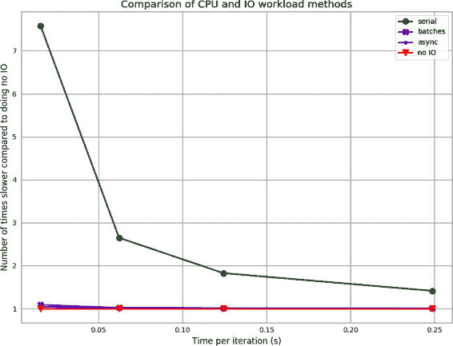

# 第八章 异步 I/O

到目前为止，我们已经集中精力通过增加程序在给定时间内完成的计算周期数来加速代码。然而，在大数据时代，将相关数据传递给您的代码可能成为瓶颈，而不是代码本身。当这种情况发生时，你的程序被称为*I/O 绑定*；换句话说，速度受到输入/输出效率的限制。

I/O 可以对程序的流程造成相当大的负担。每当你的代码从文件中读取或向网络套接字写入时，它都必须暂停联系内核，请求实际执行读取操作，然后等待其完成。这是因为实际的读取操作不是由你的程序完成的，而是由内核完成的，因为内核负责管理与硬件的任何交互。这个额外的层次可能看起来并不像世界末日一样糟糕，尤其是当你意识到类似的操作每次分配内存时也会发生；然而，如果我们回顾一下图 1-3，我们会发现我们执行的大多数 I/O 操作都是在比 CPU 慢几个数量级的设备上进行的。因此，即使与内核的通信很快，我们也将花费相当长的时间等待内核从设备获取结果并将其返回给我们。

例如，在写入网络套接字所需的时间内，通常需要约 1 毫秒，我们可以在一台 2.4 GHz 计算机上完成 2,400,000 条指令。最糟糕的是，我们的程序在这 1 毫秒时间内大部分时间都被暂停了——我们的执行被暂停，然后我们等待一个信号表明写入操作已完成。这段时间在暂停状态中度过称为*I/O 等待*。

异步 I/O 帮助我们利用这段浪费的时间，允许我们在 I/O 等待状态时执行其他操作。例如，在图 8-1 中，我们看到一个程序的示例，必须运行三个任务，其中所有任务都有 I/O 等待期。如果我们串行运行它们，我们将遭受三次 I/O 等待的惩罚。然而，如果我们并行运行这些任务，我们可以通过在此期间运行另一个任务来实际隐藏等待时间。重要的是要注意，所有这些仍然发生在单个线程上，并且仍然一次只使用一个 CPU！

这种方式的实现是因为当程序处于 I/O 等待时，内核只是等待我们请求的设备（硬盘、网络适配器、GPU 等）发出信号，表示请求的数据已经准备好。我们可以创建一个机制（即事件循环）来分派数据请求，继续执行计算操作，并在数据准备好读取时得到通知，而不是等待。这与多进程/多线程（第 9 章）范式形成了鲜明对比，后者启动新进程以进行 I/O 等待，但利用现代 CPU 的多任务性质允许主进程继续。然而，这两种机制通常同时使用，其中我们启动多个进程，每个进程在异步 I/O 方面都很有效，以充分利用计算机的资源。

###### 注意

由于并发程序在单线程上运行，通常比标准多线程程序更容易编写和管理。所有并发函数共享同一个内存空间，因此在它们之间共享数据的方式与您预期的正常方式相同。然而，您仍然需要注意竞态条件，因为不能确定代码的哪些行在何时运行。

通过以事件驱动的方式对程序建模，我们能够利用 I/O 等待，在单线程上执行比以往更多的操作。


###### 图 8-1\. 串行和并发程序的比较

# 异步编程简介

通常，当程序进入 I/O 等待时，执行会暂停，以便内核执行与 I/O 请求相关的低级操作（这称为*上下文切换*），直到 I/O 操作完成。上下文切换是一种相当重的操作。它要求我们保存程序的状态（丢失 CPU 级别的任何缓存），并放弃使用 CPU。稍后，当我们被允许再次运行时，我们必须花时间在主板上重新初始化我们的程序，并准备恢复（当然，所有这些都是在幕后进行的）。

与并发相比，我们通常会有一个*事件循环*在运行，负责管理程序中需要运行的内容以及运行的时间。本质上，事件循环就是一系列需要运行的函数。列表顶部的函数被运行，然后是下一个，以此类推。示例 8-1 展示了一个简单的事件循环示例。

##### 示例 8-1\. 玩具事件循环

```py
from queue import Queue
from functools import partial

eventloop = None

class EventLoop(Queue):
    def start(self):
        while True:
            function = self.get()
            function()

def do_hello():
    global eventloop
    print("Hello")
    eventloop.put(do_world)

def do_world():
    global eventloop
    print("world")
    eventloop.put(do_hello)

if __name__ == "__main__":
    eventloop = EventLoop()
    eventloop.put(do_hello)
    eventloop.start()
```

这可能看起来不是一个很大的改变；然而，当我们将事件循环与异步（async）I/O 操作结合使用时，可以在执行 I/O 任务时获得显著的性能提升。在这个例子中，调用 `eventloop.put(do_world)` 大致相当于对 `do_world` 函数进行异步调用。这个操作被称为`非阻塞`，意味着它会立即返回，但保证稍后某个时刻调用 `do_world`。类似地，如果这是一个带有异步功能的网络写入，它将立即返回，即使写入尚未完成。当写入完成时，一个事件触发，这样我们的程序就知道了。

将这两个概念结合起来，我们可以编写一个程序，当请求 I/O 操作时，运行其他函数，同时等待原始 I/O 操作完成。这本质上允许我们在本来会处于 I/O 等待状态时仍然进行有意义的计算。

###### 注意

切换从一个函数到另一个函数确实是有成本的。内核必须花费时间在内存中设置要调用的函数，并且我们的缓存状态不会那么可预测。正是因为这个原因，并发在程序有大量 I/O 等待时提供了最佳结果——与通过利用 I/O 等待时间获得的收益相比，切换的成本可能要少得多。

通常，使用事件循环进行编程可以采用两种形式：回调或期约。在回调范式中，函数被调用并带有一个通常称为*回调*的参数。函数不返回其值，而是调用回调函数并传递该值。这样设置了一长串被调用的函数链，每个函数都得到前一个函数链中的结果（这些链有时被称为“回调地狱”）。示例 8-2 是回调范式的一个简单示例。

##### 示例 8-2\. 使用回调的示例

```py
from functools import partial
from some_database_library import save_results_to_db

def save_value(value, callback):
    print(f"Saving {value} to database")
    save_result_to_db(result, callback)  

def print_response(db_response):
    print("Response from database: {db_response}")

if __name__ == "__main__":
    eventloop.put(partial(save_value, "Hello World", print_response))
```


`save_result_to_db` 是一个异步函数；它将立即返回，并允许其他代码运行。然而，一旦数据准备好，将调用 `print_response`。

在 Python 3.4 之前，回调范式非常流行。然而，`asyncio`标准库模块和 PEP 492 使期约机制成为 Python 的本地特性。通过创建处理异步 I/O 的标准 API 以及新的`await`和`async`关键字，定义了异步函数和等待结果的方式。

在这种范式中，异步函数返回一个 `Future` 对象，这是一个未来结果的承诺。因此，如果我们希望在某个时刻获取结果，我们必须等待由这种类型的异步函数返回的未来完成并填充我们期望的值（通过对其进行 `await` 或运行显式等待值的函数）。然而，这也意味着结果可以在调用者的上下文中可用，而在回调范式中，结果仅在回调函数中可用。在等待 `Future` 对象填充我们请求的数据时，我们可以进行其他计算。如果将这与生成器的概念相结合——可以暂停并稍后恢复执行的函数——我们可以编写看起来非常接近串行代码形式的异步代码：

```py
from some_async_database_library import save_results_to_db

async def save_value(value):
    print(f"Saving {value} to database")
    db_response = await save_result_to_db(result) 
    print("Response from database: {db_response}")

if __name__ == "__main__":
    eventloop.put(
        partial(save_value, "Hello World", print)
    )
```


在这种情况下，`save_result_to_db` 返回一个 `Future` 类型。通过 `await` 它，我们确保 `save_value` 在值准备好之前暂停，然后恢复并完成其操作。

重要的是要意识到，由 `save_result_to_db` 返回的 `Future` 对象保持了未来结果的承诺，并不持有结果本身或调用任何 `save_result_to_db` 代码。事实上，如果我们简单地执行 `db_response_future = save_result_to_db(result)`，该语句会立即完成，并且我们可以对 `Future` 对象执行其他操作。例如，我们可以收集一个未来对象的列表，并同时等待它们的完成。

# async/await 是如何工作的？

一个 `async` 函数（使用 `async def` 定义）称为协程。在 Python 中，协程的实现与生成器具有相同的哲学。这很方便，因为生成器已经有了暂停执行和稍后恢复的机制。使用这种范式，`await` 语句在功能上类似于 `yield` 语句；当前函数的执行在运行其他代码时暂停。一旦 `await` 或 `yield` 解析出数据，函数就会恢复执行。因此，在前面的例子中，我们的 `save_result_to_db` 将返回一个 `Future` 对象，而 `await` 语句会暂停函数，直到 `Future` 包含一个结果。事件循环负责安排在 `Future` 准备好返回结果后恢复 `save_value` 的执行。

对于基于 Python 2.7 实现的基于未来的并发，当我们尝试将协程用作实际函数时，事情可能会变得有些奇怪。请记住，生成器无法返回值，因此库以各种方式处理此问题。在 Python 3.4 中引入了新的机制，以便轻松创建协程并使它们仍然返回值。然而，许多自 Python 2.7 以来存在的异步库具有处理这种尴尬转换的遗留代码（特别是 `tornado` 的 `gen` 模块）。

在运行并发代码时，意识到我们依赖于事件循环是至关重要的。一般来说，这导致大多数完全并发的代码的主要代码入口主要是设置和启动事件循环。然而，这假设整个程序都是并发的。在其他情况下，程序内部会创建一组 futures，然后简单地启动一个临时事件循环来管理现有的 futures，然后事件循环退出，代码可以正常恢复。这通常使用`asyncio.loop`模块中的`loop.run_until_complete(coro)`或`loop.run_forever()`方法来完成。然而，`asyncio`还提供了一个便利函数（`asyncio.run(coro)`）来简化这个过程。

本章中，我们将分析一个从具有内置延迟的 HTTP 服务器获取数据的网络爬虫。这代表了在处理 I/O 时通常会发生的响应时间延迟。我们首先会创建一个串行爬虫，查看这个问题的简单 Python 解决方案。然后，我们将通过迭代`gevent`和`torando`逐步构建出一个完整的`aiohttp`解决方案。最后，我们将探讨如何将异步 I/O 任务与 CPU 任务结合起来，以有效地隐藏任何花费在 I/O 上的时间。

###### 注意

我们实现的 Web 服务器可以同时支持多个连接。对于大多数需要进行 I/O 操作的服务来说，这通常是真实的情况——大多数数据库可以支持同时进行多个请求，大多数 Web 服务器支持 10,000 个以上的同时连接。然而，当与无法处理多个连接的服务进行交互时，我们的性能将始终与串行情况相同。

## 串行爬虫

在我们的并发实验控制中，我们将编写一个串行网络爬虫，接收一个 URL 列表，获取页面内容并计算总长度。我们将使用一个自定义的 HTTP 服务器，它接收两个参数，`name`和`delay`。`delay`字段告诉服务器在响应之前暂停的时间长度（以毫秒为单位）。`name`字段用于记录日志。

通过控制`delay`参数，我们可以模拟服务器响应查询的时间。在现实世界中，这可能对应于一个响应缓慢的 Web 服务器、繁重的数据库调用，或者任何执行时间长的 I/O 调用。对于串行情况，这会导致程序在 I/O 等待中耗费更多时间，但在后面的并发示例中，这将提供一个机会来利用 I/O 等待时间来执行其他任务。

在示例 8-3 中，我们选择使用`requests`模块执行 HTTP 调用。我们之所以选择这个模块，是因为它的简单性。我们在本节中通常使用 HTTP，因为它是 I/O 的一个简单示例，可以轻松执行。一般来说，可以用任何 I/O 替换对 HTTP 库的任何调用。

##### 示例 8-3\. 串行 HTTP 抓取器

```py
import random
import string

import requests

def generate_urls(base_url, num_urls):
    """
 We add random characters to the end of the URL to break any caching
 mechanisms in the requests library or the server
 """
    for i in range(num_urls):
        yield base_url + "".join(random.sample(string.ascii_lowercase, 10))

def run_experiment(base_url, num_iter=1000):
    response_size = 0
    for url in generate_urls(base_url, num_iter):
        response = requests.get(url)
        response_size += len(response.text)
    return response_size

if __name__ == "__main__":
    import time

    delay = 100
    num_iter = 1000
    base_url = f"http://127.0.0.1:8080/add?name=serial&delay={delay}&"

    start = time.time()
    result = run_experiment(base_url, num_iter)
    end = time.time()
    print(f"Result: {result}, Time: {end - start}")
```

运行此代码时，一个有趣的度量标准是查看每个请求在 HTTP 服务器中的开始和结束时间。这告诉我们我们的代码在 I/O 等待期间的效率有多高——因为我们的任务是发起 HTTP 请求并汇总返回的字符数，我们应该能够在等待其他请求完成时发起更多的 HTTP 请求并处理任何响应。

我们可以在 图 8-2 中看到，正如预期的那样，我们的请求没有交错。我们一次只执行一个请求，并在移动到下一个请求之前等待前一个请求完成。实际上，串行进程的总运行时间在这种情况下是完全合理的。由于每个请求都需要 0.1 秒（因为我们的 `delay` 参数），而我们要执行 500 个请求，我们预计运行时间大约为 50 秒。


###### 图 8-2\. 示例 8-3 请求时间

## Gevent

最简单的异步库之一是 `gevent`。它遵循异步函数返回未来任务的范例，这意味着您的代码中的大部分逻辑可以保持不变。此外，`gevent` 修补了标准 I/O 函数以支持异步，因此大多数情况下，您可以简单地使用标准 I/O 包并从异步行为中受益。

Gevent 提供了两种机制来实现异步编程——如前所述，它通过异步 I/O 函数修补了标准库，并且它有一个 `Greenlets` 对象可用于并发执行。*Greenlet* 是一种协程类型，可以看作是线程（请参阅 第 9 章 中有关线程的讨论）；然而，所有的 Greenlet 都在同一个物理线程上运行。我们有一个事件循环在单个 CPU 上，在 I/O 等待期间能够在它们之间切换。大部分时间，`gevent` 试图通过使用 `wait` 函数尽可能透明地处理事件循环。`wait` 函数将启动一个事件循环，并运行它直到所有的 Greenlet 完成为止。因此，大部分 `gevent` 代码将会串行运行；然后在某个时刻，您会设置许多 Greenlet 来执行并发任务，并使用 `wait` 函数启动事件循环。在 `wait` 函数执行期间，您排队的所有并发任务都将运行直到完成（或某些停止条件），然后您的代码将恢复为串行。

未来任务是通过 `gevent.spawn` 创建的，该函数接受一个函数及其参数，并启动一个负责运行该函数的绿色线程（greenlet）。绿色线程可以被视为一个未来任务，因为一旦我们指定的函数完成，其值将包含在绿色线程的 `value` 字段中。

这种对 Python 标准模块的修补可能会使控制正在进行的细微变化变得更加困难。例如，在进行异步 I/O 时，我们要确保不要同时打开太多文件或连接。如果这样做，我们可能会使远程服务器过载，或者通过不得不在太多操作之间进行上下文切换来减慢我们的进程。

为了手动限制打开文件的数量，我们使用信号量一次只允许 100 个绿色线程进行 HTTP 请求。信号量通过确保只有一定数量的协程可以同时进入上下文块来工作。因此，我们立即启动所有需要获取 URL 的绿色线程；但是每次只有 100 个线程可以进行 HTTP 调用。信号量是各种并行代码流中经常使用的一种锁定机制类型。通过基于各种规则限制代码的执行顺序，锁定可以帮助您确保程序的各个组件不会互相干扰。

现在，我们已经设置好了所有的未来并且放入了一个锁机制来控制绿色线程的流程，我们可以使用`gevent.iwait`函数等待，该函数将获取一个准备好的项目序列并迭代它们。相反，我们也可以使用`gevent.wait`，它将阻塞程序的执行，直到所有请求都完成。

我们费力地使用信号量来分组我们的请求，而不是一次性发送它们，因为过载事件循环可能会导致性能下降（对于所有异步编程都是如此）。此外，我们与之通信的服务器将限制同时响应的并发请求数量。

通过实验（见图 8-3](#conn_num_concurrent_requests))，我们通常看到一次大约 100 个开放连接对于约 50 毫秒响应时间的请求是最佳的。如果我们使用更少的连接，我们仍然会在 I/O 等待期间浪费时间。而使用更多连接时，我们在事件循环中频繁切换上下文，并给程序增加了不必要的开销。我们可以看到，对于 50 毫秒请求，400 个并发请求的情况下，这种效果就显现出来了。话虽如此，这个 100 的值取决于许多因素——计算机运行代码的机器、事件循环的实现、远程主机的属性、远程服务器的预期响应时间等。我们建议在做出选择之前进行一些实验。


###### 图 8-3\. 对不同数量的并发请求进行实验，针对不同的请求时间。

在示例 8-4，我们通过使用信号量来实现`gevent`爬虫，以确保一次只有 100 个请求。

##### 示例 8-4\. `gevent` HTTP 爬虫

```py
import random
import string
import urllib.error
import urllib.parse
import urllib.request
from contextlib import closing

import gevent
from gevent import monkey
from gevent.lock import Semaphore

monkey.patch_socket()

def generate_urls(base_url, num_urls):
    for i in range(num_urls):
        yield base_url + "".join(random.sample(string.ascii_lowercase, 10))

def download(url, semaphore):
    with semaphore:  
        with closing(urllib.request.urlopen(url)) as data:
            return data.read()

def chunked_requests(urls, chunk_size=100):
    """
    Given an iterable of urls, this function will yield back the contents of the
    URLs. The requests will be batched up in "chunk_size" batches using a
    semaphore
    """
    semaphore = Semaphore(chunk_size)  
    requests = [gevent.spawn(download, u, semaphore) for u in urls]  
    for response in gevent.iwait(requests):
        yield response

def run_experiment(base_url, num_iter=1000):
    urls = generate_urls(base_url, num_iter)
    response_futures = chunked_requests(urls, 100)  
    response_size = sum(len(r.value) for r in response_futures)
    return response_size

if __name__ == "__main__":
    import time

    delay = 100
    num_iter = 1000
    base_url = f"http://127.0.0.1:8080/add?name=gevent&delay={delay}&"

    start = time.time()
    result = run_experiment(base_url, num_iter)
    end = time.time()
    print(f"Result: {result}, Time: {end - start}")
```


在这里，我们生成一个信号量，允许`chunk_size`个下载同时进行。


通过使用信号量作为上下文管理器，我们确保一次只能运行`chunk_size`个绿色线程。


我们可以排队尽可能多的绿色线程，知道没有一个会在我们用`wait`或`iwait`启动事件循环之前运行。


`response_futures`现在持有已完成的期货生成器，所有这些期货都在`.value`属性中包含了我们需要的数据。

一个重要的事情需要注意的是，我们使用了`gevent`来使我们的 I/O 请求异步化，但在 I/O 等待期间我们不进行任何非 I/O 计算。然而，在图 8-4 中，我们可以看到我们得到的大幅加速（见表 8-1）。通过在等待前一个请求完成时发起更多请求，我们能够实现 90 倍的加速！我们可以明确地看到在代表请求的堆叠水平线上一次性发出请求，之前的请求完成之前。这与串行爬虫的情况形成鲜明对比（参见图 8-2），在那里一条线仅在前一条线结束时开始。

此外，我们可以在图 8-4 中看到更多有趣的效果，反映在`gevent`请求时间线的形状上。例如，在大约第 100 次请求时，我们看到了一个暂停，此时没有启动新的请求。这是因为这是第一次我们的信号量被触发，并且我们能够在任何之前的请求完成之前锁定信号量。此后，信号量进入平衡状态：在另一个请求完成时刚好锁定和解锁它。


###### Figure 8-4\. `gevent`爬虫的请求时间——红线标示第 100 次请求，我们可以看到后续请求之前的暂停。

## 龙卷风

另一个经常在 Python 中用于异步 I/O 的包是`tornado`，最初由 Facebook 开发，主要用于 HTTP 客户端和服务器。该框架自 Python 3.5 引入`async/await`以来就存在，并最初使用回调系统组织异步调用。然而，最近，项目的维护者选择采用协程，并在`asyncio`模块的架构中起到了重要作用。

目前，`tornado` 可以通过使用 `async`/`await` 语法（这是 Python 中的标准）或使用 Python 的 `tornado.gen` 模块来使用。这个模块作为 Python 中原生协程的前身提供。它通过提供一个装饰器将方法转换为协程（即，获得与使用 `async def` 定义函数相同结果的方法）以及各种实用工具来管理协程的运行时来实现。当前，只有在您打算支持早于 3.5 版本的 Python 时，才需要使用这种装饰器方法。¹

###### 提示

使用 `tornado` 时，请确保已安装 `pycurl`。它是 tornado 的可选后端，但性能更好，特别是在 DNS 请求方面，优于默认后端。

在 示例 8-5 中，我们实现了与 `gevent` 相同的网络爬虫，但是我们使用了 `tornado` 的 I/O 循环（它的版本是事件循环）和 HTTP 客户端。这使我们不必批量处理请求和处理代码的其他更底层的方面。

##### 示例 8-5。`tornado` HTTP 爬虫

```py
import asyncio
import random
import string
from functools import partial

from tornado.httpclient import AsyncHTTPClient

AsyncHTTPClient.configure(
    "tornado.curl_httpclient.CurlAsyncHTTPClient",
    max_clients=100  
)

def generate_urls(base_url, num_urls):
    for i in range(num_urls):
        yield base_url + "".join(random.sample(string.ascii_lowercase, 10))

async def run_experiment(base_url, num_iter=1000):
    http_client = AsyncHTTPClient()
    urls = generate_urls(base_url, num_iter)
    response_sum = 0
    tasks = [http_client.fetch(url) for url in urls]  
    for task in asyncio.as_completed(tasks):  
        response = await task  
        response_sum += len(response.body)
    return response_sum

if __name__ == "__main__":
    import time

    delay = 100
    num_iter = 1000
    run_func = partial(
        run_experiment,
        f"http://127.0.0.1:8080/add?name=tornado&delay={delay}&",
        num_iter,
    )

    start = time.time()
    result = asyncio.run(run_func)  
    end = time.time()
    print(f"Result: {result}, Time: {end - start}")
```


我们可以配置我们的 HTTP 客户端，并选择我们希望使用的后端库以及我们希望将多少个请求一起批处理。Tornado 默认最多同时进行 10 个并发请求。


我们生成许多 `Future` 对象来排队获取 URL 内容的任务。


这将运行在 `tasks` 列表中排队的所有协程，并在它们完成时将它们作为结果返回。


由于协程已经完成，因此此处的 `await` 语句立即返回最早完成的任务的结果。


`ioloop.run_sync` 将启动 `IOLoop`，并在指定函数的运行时段内持续运行。另一方面，`ioloop.start()` 启动一个必须手动终止的 `IOLoop`。

在 示例 8-5 中的 `tornado` 代码与 示例 8-4 中的 `gevent` 代码之间的一个重要区别是事件循环的运行方式。对于 `gevent`，事件循环仅在 `iwait` 函数运行时才会运行。另一方面，在 `tornado` 中，事件循环始终运行，并控制程序的完整执行流程，而不仅仅是异步 I/O 部分。

这使得 `tornado` 成为大多数 I/O 密集型应用和大多数（如果不是全部）应用都应该是异步的理想选择。这是 `tornado` 最为人所知的地方，作为一款高性能的 Web 服务器。事实上，Micha 在许多情况下都是用 `tornado` 支持的数据库和数据结构来进行大量 I/O。²

另一方面，由于 `gevent` 对整个程序没有任何要求，因此它是主要用于基于 CPU 的问题的理想解决方案，有时涉及大量 I/O，例如对数据集进行大量计算，然后必须将结果发送回数据库进行存储。由于大多数数据库都具有简单的 HTTP API，因此甚至可以使用 `grequests` 进行简化。

另一个有趣的区别在于 `gevent` 和 `tornado` 在内部更改请求调用图的方式。将 图 8-5 与 图 8-4 进行比较。对于 `gevent` 的调用图，我们看到一个非常均匀的调用图，即当信号量中的插槽打开时，新请求会立即发出。另一方面，tornado 的调用图则非常起伏不定。这意味着限制打开连接数的内部机制未能及时响应请求完成。调用图中那些看起来比平时更细或更粗的区域表示事件循环未能有效地执行其工作的时段——即我们要么未充分利用资源，要么过度利用资源。

###### 注意

对于所有使用 `asyncio` 运行事件循环的库，我们实际上可以更改正在使用的后端库。例如，[`uvloop`](https://oreil.ly/Qvgq6) 项目提供了一个替换 `asyncio` 事件循环的即插即用解决方案，声称大幅提升速度。这些速度提升主要在服务器端可见；在本章概述的客户端示例中，它们只提供了小幅性能提升。然而，由于只需额外两行代码即可使用此事件循环，几乎没有理由不使用它！

我们可以开始理解这种减速的原因，考虑到我们一遍又一遍地学到的教训：通用代码之所以有用，是因为它能很好地解决所有问题，但没有完美解决任何一个单独的问题。当处理大型 Web 应用程序或代码库中可能在许多不同位置进行 HTTP 请求时，限制一百个正在进行的连接的机制非常有用。一种简单的配置保证总体上我们不会打开超过定义的连接数。然而，在我们的情况下，我们可以从处理方式非常具体的好处中受益（就像我们在 `gevent` 示例中所做的那样）。


###### 图 8-5\. 示例 8-5 的 HTTP 请求时间的时间轴

## aiohttp

针对使用异步功能处理重型 IO 系统的普及，Python 3.4+引入了对旧的`asyncio`标准库模块的改进。然而，这个模块当时相当低级，提供了所有用于第三方库创建易于使用的异步库的底层机制。`aiohttp`作为第一个完全基于新`asyncio`库构建的流行库应运而生。它提供 HTTP 客户端和服务器功能，并使用与熟悉`tornado`的人类似的 API。整个项目[`aio-libs`](https://oreil.ly/c0dgk)提供了广泛用途的原生异步库。在示例 8-6 中，我们展示了如何使用`aiohttp`实现`asyncio`爬虫。

##### 示例 8-6\. `asyncio` HTTP 爬虫

```py
import asyncio
import random
import string

import aiohttp

def generate_urls(base_url, num_urls):
    for i in range(num_urls):
        yield base_url + "".join(random.sample(string.ascii_lowercase, 10))

def chunked_http_client(num_chunks):
    """
    Returns a function that can fetch from a URL, ensuring that only
    "num_chunks" of simultaneous connects are made.
    """
    semaphore = asyncio.Semaphore(num_chunks)  

    async def http_get(url, client_session):  
        nonlocal semaphore
        async with semaphore:
            async with client_session.request("GET", url) as response:
                return await response.content.read()

    return http_get

async def run_experiment(base_url, num_iter=1000):
    urls = generate_urls(base_url, num_iter)
    http_client = chunked_http_client(100)
    responses_sum = 0
    async with aiohttp.ClientSession() as client_session:
        tasks = [http_client(url, client_session) for url in urls]  
        for future in asyncio.as_completed(tasks):  
            data = await future
            responses_sum += len(data)
    return responses_sum

if __name__ == "__main__":
    import time

    loop = asyncio.get_event_loop()
    delay = 100
    num_iter = 1000

    start = time.time()
    result = loop.run_until_complete(
        run_experiment(
            f"http://127.0.0.1:8080/add?name=asyncio&delay={delay}&", num_iter
        )
    )
    end = time.time()
    print(f"Result: {result}, Time: {end - start}")
```


与`gevent`示例中一样，我们必须使用信号量来限制请求的数量。


我们返回一个新的协程，将异步下载文件并尊重信号量的锁定。


函数`http_client`返回 futures。为了跟踪进度，我们将 futures 保存到列表中。


与`gevent`一样，我们可以等待 futures 变为就绪并对其进行迭代。

对这段代码的一个直接反应是`async with`、`async def`和`await`调用的数量。在`http_get`的定义中，我们使用异步上下文管理器以并发友好的方式访问共享资源。也就是说，通过使用`async with`，我们允许其他协程在等待获取我们请求的资源时运行。因此，可以更有效地共享诸如开放的信号量插槽或已经打开的连接到我们主机的东西，比我们在使用`tornado`时经历的更有效。

实际上，图 8-6 中的调用图显示了与图 8-4 中的`gevent`类似的平滑过渡。此外，总体上，`asyncio`的代码运行速度略快于`gevent`（1.10 秒对比 1.14 秒—参见表 8-1），尽管每个请求的时间稍长。这只能通过信号量暂停的协程或等待 HTTP 客户端的更快恢复来解释。


###### 图 8-6\. 示例 8-6 的 HTTP 请求的年表

这段代码示例还展示了使用`aiohttp`和使用`tornado`之间的巨大区别，因为使用`aiohttp`时，我们对事件循环以及我们正在进行的请求的各种微妙之处有很大的控制。例如，我们手动获取客户端会话，负责缓存打开的连接，以及手动从连接中读取。如果我们愿意，我们可以改变连接缓存的时间或者决定仅向服务器写入而不读取其响应。

尽管对于这样一个简单的示例来说，这种控制可能有点过度，但在实际应用中，我们可以使用它来真正调整我们应用程序的性能。任务可以轻松地添加到事件循环中而无需等待其响应，并且我们可以轻松地为任务添加超时，使其运行时间受限；我们甚至可以添加在任务完成时自动触发的函数。这使我们能够创建复杂的运行时模式，以最优化地利用通过能够在 I/O 等待期间运行代码而获得的时间。特别是，当我们运行一个 Web 服务时（例如，一个可能需要为每个请求执行计算任务的 API），这种控制可以使我们编写“防御性”代码，知道如何在新请求到达时将运行时间让步给其他任务。我们将在 “完全异步” 中更多地讨论这个方面。

表 8-1\. 爬虫的总运行时间比较

|  | 序号 | gevent | tornado | aiohttp |
| --- | --- | --- | --- | --- |
| 运行时间（秒） | 102.684 | 1.142 | 1.171 | 1.101 |

# 共享 CPU-I/O 负载

为了使前述示例更具体化，我们将创建另一个玩具问题，在这个问题中，我们有一个需要频繁与数据库通信以保存结果的 CPU 绑定问题。CPU 负载可以是任何东西；在这种情况下，我们正在使用较大和较大的工作负载因子对随机字符串进行`bcrypt`哈希以增加 CPU 绑定工作的量（请参见表 8-2 以了解“难度”参数如何影响运行时间）。这个问题代表了任何需要程序进行大量计算，并且这些计算的结果必须存储到数据库中的问题，可能会导致严重的 I/O 惩罚。我们对数据库的唯一限制如下：

+   它有一个 HTTP API，因此我们可以使用早期示例中的代码。³

+   响应时间在 100 毫秒的数量级上。

+   数据库可以同时满足许多请求。⁴

这个“数据库”的响应时间被选择得比通常要高，以夸大问题的转折点，即执行 CPU 任务中的一个所需的时间长于执行 I/O 任务中的一个。对于只用于存储简单值的数据库，响应时间大于 10 毫秒应被认为是慢的！

表 8-2\. 计算单个哈希的时间

| 难度参数 | 8 | 10 | 11 | 12 |
| --- | --- | --- | --- | --- |
| 每次迭代秒数 | 0.0156 | 0.0623 | 0.1244 | 0.2487 |

## 串行

我们从一些简单的代码开始，计算字符串的 `bcrypt` 哈希，并在计算结果时每次向数据库的 HTTP API 发送请求：

```py
import random
import string

import bcrypt
import requests

def do_task(difficulty):
    """
    Hash a random 10 character string using bcrypt with a specified difficulty
    rating.
    """
    passwd = ("".join(random.sample(string.ascii_lowercase, 10))  
                .encode("utf8"))
    salt = bcrypt.gensalt(difficulty)  
    result = bcrypt.hashpw(passwd, salt)
    return result.decode("utf8")

def save_result_serial(result):
    url = f"http://127.0.0.1:8080/add"
    response = requests.post(url, data=result)
    return response.json()

def calculate_task_serial(num_iter, task_difficulty):
    for i in range(num_iter):
        result = do_task(task_difficulty)
        save_number_serial(result)
```


我们生成一个随机的 10 字符字节数组。


`difficulty` 参数设置了生成密码的难度，通过增加哈希算法的 CPU 和内存需求来实现。

正如我们的串行示例中一样（示例 8-3），每个数据库保存的请求时间（100 毫秒）不会叠加，我们必须为每个结果支付这个惩罚。因此，以 8 的任务难度进行六百次迭代需要 71 秒。然而，由于我们串行请求的方式，我们至少要花费 40 秒在 I/O 上！我们程序运行时的 56% 时间都在做 I/O，并且仅仅是在“I/O 等待”时，而它本可以做一些其他事情！

当然，随着 CPU 问题所需时间越来越长，做这种串行 I/O 的相对减速也会减少。这只是因为在每个任务后都暂停 100 毫秒的成本，相比于完成这个计算所需的长时间来说微不足道（正如我们在 图 8-7 中所见）。这一事实突显了在考虑进行哪些优化之前了解工作负载的重要性。如果您有一个需要几小时的 CPU 任务和仅需要几秒钟的 I/O 任务，那么加速 I/O 任务所带来的巨大提速可能并不会达到您所期望的效果！


###### 图 8-7\. 串行代码与无 I/O 的 CPU 任务比较

## 批处理结果

而不是立即转向完全的异步解决方案，让我们尝试一个中间解决方案。如果我们不需要立即知道数据库中的结果，我们可以批量处理结果，并以小的异步突发方式将它们发送到数据库。为此，我们创建一个 `AsyncBatcher` 对象，负责将结果排队，以便在没有 CPU 任务的 I/O 等待期间发送它们。在这段时间内，我们可以发出许多并发请求，而不是逐个发出它们：

```py
import asyncio
import aiohttp

class AsyncBatcher(object):
    def __init__(self, batch_size):
        self.batch_size = batch_size
        self.batch = []
        self.client_session = None
        self.url = f"http://127.0.0.1:8080/add"

    def __enter__(self):
        return self

    def __exit__(self, *args, **kwargs):
        self.flush()

    def save(self, result):
        self.batch.append(result)
        if len(self.batch) == self.batch_size:
            self.flush()

    def flush(self):
        """
        Synchronous flush function which starts an IOLoop for the purposes of
        running our async flushing function
        """
        loop = asyncio.get_event_loop()
        loop.run_until_complete(self.__aflush())  

    async def __aflush(self):  
        async with aiohttp.ClientSession() as session:
            tasks = [self.fetch(result, session) for result in self.batch]
            for task in asyncio.as_completed(tasks):
                await task
        self.batch.clear()

    async def fetch(self, result, session):
        async with session.post(self.url, data=result) as response:
            return await response.json()
```


我们能够启动一个事件循环来运行单个异步函数。事件循环将一直运行，直到异步函数完成，然后代码将恢复正常运行。


该函数与 示例 8-6 几乎相同。

现在我们几乎可以和以前做法一样继续。主要区别在于我们将结果添加到我们的`AsyncBatcher`中，并让它负责何时发送请求。请注意，我们选择将此对象作为上下文管理器，以便一旦我们完成批处理，最终的`flush()`将被调用。如果我们没有这样做，可能会出现一些结果仍在排队等待触发刷新的情况：

```py
def calculate_task_batch(num_iter, task_difficulty):
    with AsyncBatcher(100) as batcher: 
        for i in range(num_iter):
            result = do_task(i, task_difficulty)
            batcher.save(result)
```


我们选择以 100 个请求为一批处理的原因，类似于图 8-3 中所示的情况。

通过这一变更，我们将难度为 8 的运行时间缩短到了 10.21 秒。这代表了 6.95 倍的加速，而我们几乎没有做什么额外的工作。在像实时数据管道这样的受限环境中，这种额外的速度可能意味着系统能否跟得上需求的差异，并且这种情况下可能需要一个队列；在第十章中会学习到这些内容。

要理解此批处理方法的时间计时，请考虑可能影响批处理方法时间的变量。如果我们的数据库吞吐量无限（即，我们可以同时发送无限数量的请求而没有惩罚），我们可以利用我们的`AsyncBatcher`满时执行刷新时只有 100 毫秒的惩罚。在这种情况下，我们可以在计算完成时一次性将所有请求保存到数据库并执行它们，从而获得最佳性能。

然而，在现实世界中，我们的数据库有最大的吞吐量限制，限制了它们可以处理的并发请求数量。在这种情况下，我们的服务器每秒限制在 100 个请求，这意味着我们必须每 100 个结果刷新我们的批处理器，并在那时进行 100 毫秒的惩罚。这是因为批处理器仍然会暂停程序的执行，就像串行代码一样；但在这个暂停的时间内，它执行了许多请求而不是只有一个。

如果我们试图将所有结果保存到最后然后一次性发出它们，服务器一次只会处理一百个，而且我们会因为同时发出所有这些请求而额外增加开销，这会导致数据库超载，可能会导致各种不可预测的减速。

另一方面，如果我们的服务器吞吐量非常差，一次只能处理一个请求，我们可能还是会串行运行我们的代码！即使我们将我们的批处理保持在每批 100 个结果，当我们实际去发起请求时，每次只会有一个请求被响应，有效地使我们所做的任何批处理无效。

这种批处理结果的机制，也被称为*流水线处理*，在试图降低 I/O 任务负担时非常有帮助（如图 8-8 所示）。它在异步 I/O 速度和编写串行程序的便利性之间提供了很好的折衷方案。然而，确定一次性流水线处理多少内容非常依赖于具体情况，并且需要一些性能分析和调整才能获得最佳性能。


###### 图 8-8\. 批处理请求与不进行任何 I/O 的比较

## 完全异步

在某些情况下，我们可能需要实现一个完全异步的解决方案。如果 CPU 任务是较大的 I/O 绑定程序的一部分，例如 HTTP 服务器，则可能会发生这种情况。想象一下，你有一个 API 服务，对于其中一些端点的响应，必须执行繁重的计算任务。我们仍然希望 API 能够处理并发请求，并在其任务中表现良好，但我们也希望 CPU 任务能够快速运行。

在示例 8-7 中实现此解决方案的代码与示例 8-6 的代码非常相似。

##### 示例 8-7\. 异步 CPU 负载

```py
def save_result_aiohttp(client_session):
    sem = asyncio.Semaphore(100)

    async def saver(result):
        nonlocal sem, client_session
        url = f"http://127.0.0.1:8080/add"
        async with sem:
            async with client_session.post(url, data=result) as response:
                return await response.json()

    return saver

async def calculate_task_aiohttp(num_iter, task_difficulty):
    tasks = []
    async with aiohttp.ClientSession() as client_session:
        saver = save_result_aiohttp(client_session)
        for i in range(num_iter):
            result = do_task(i, task_difficulty)
            task = asyncio.create_task(saver(result))  
            tasks.append(task)
            await asyncio.sleep(0)  
        await asyncio.wait(tasks)  
```


我们不会立即`await`数据库保存，而是使用`asyncio.create_task`将其排入事件循环，并跟踪它，以确保任务在函数结束前已完成。


这可能是函数中最重要的一行。在这里，我们暂停主函数，以便事件循环处理任何未完成的任务。如果没有这个，我们排队的任务将直到函数结束才会运行。


在这里，我们等待任何尚未完成的任务。如果我们在`for`循环中没有执行`asyncio.sleep`，那么所有的保存操作将在这里发生！

在我们讨论此代码的性能特征之前，我们应该先谈谈`asyncio.sleep(0)`语句的重要性。让函数睡眠零秒可能看起来很奇怪，但这是一种将函数推迟到事件循环并允许其他任务运行的方法。在异步代码中，每次运行`await`语句时都会发生这种推迟。由于我们通常不会在 CPU 绑定的代码中`await`，所以强制进行这种推迟非常重要，否则在 CPU 绑定的代码完成之前不会运行任何其他任务。在这种情况下，如果没有睡眠语句，所有的 HTTP 请求将会暂停，直到`asyncio.wait`语句，然后所有的请求将会立即发出，这绝对不是我们想要的！

有了这种控制权，我们可以选择最佳时间推迟回到事件循环。在这样做时有很多考虑因素。由于程序的运行状态在推迟时发生变化，我们不希望在计算过程中进行推迟，可能会改变我们的 CPU 缓存。此外，推迟到事件循环会产生额外的开销，所以我们不希望太频繁地这样做。然而，在我们忙于 CPU 任务时，我们无法执行任何 I/O 任务。因此，如果我们的整个应用程序是一个 API，那么在 CPU 时间内不能处理任何请求！

我们的一般经验法则是尝试在期望每 50 到 100 毫秒迭代一次的任何循环中发出`asyncio.sleep(0)`。有些应用程序使用`time.perf_counter`，允许 CPU 任务在强制休眠之前具有特定的运行时间。对于这种情况，由于我们可以控制 CPU 和 I/O 任务的数量，我们只需确保休眠之间的时间与待处理的 I/O 任务完成所需的时间相符即可。

完全异步解决方案的一个主要性能优势是，在执行 CPU 工作的同时，我们可以执行所有的 I/O 操作，有效地隐藏它们不计入总运行时间（正如我们从图 8-9 中重叠的线条中可以看到的）。虽然由于事件循环的开销成本，它永远不会完全隐藏，但我们可以非常接近。事实上，对于难度为 8 的 600 次迭代，我们的代码运行速度比串行代码快 7.3 倍，并且执行其总 I/O 工作负载比批处理代码快 2 倍（而且这种优势随着迭代次数的增加而增加，因为批处理代码每次需要暂停 CPU 任务来刷新批次时都会浪费时间）。


###### 图 8-9\. 使用`aiohttp`解决方案进行 25 个难度为 8 的 CPU 任务的调用图—红线代表工作在 CPU 任务上的时间，蓝线代表发送结果到服务器的时间。

在调用时间线中，我们可以真正看到发生了什么。我们所做的是标记了难度为 8 的 25 个 CPU 任务的每个 CPU 和 I/O 任务的开始和结束。前几个 I/O 任务是最慢的，花费了一些时间来建立与我们服务器的初始连接。由于我们使用`aiohttp`的`ClientSession`，这些连接被缓存，后续对同一服务器的所有连接都要快得多。

此后，如果我们只关注蓝线，它们似乎在 CPU 任务之间非常规律地发生，几乎没有暂停。事实上，我们在任务之间并没有看到来自 HTTP 请求的 100 毫秒延迟。相反，我们看到 HTTP 请求在每个 CPU 任务的末尾快速发出，并在另一个 CPU 任务的末尾被标记为完成。

不过，我们确实看到每个单独的 I/O 任务所需的时间比服务器的 100 毫秒响应时间长。这种较长的等待时间是由我们的 `asyncio.sleep(0)` 语句的频率决定的（因为每个 CPU 任务有一个 `await`，而每个 I/O 任务有三个），以及事件循环决定下一个任务的方式。对于 I/O 任务来说，这种额外的等待时间是可以接受的，因为它不会中断手头的 CPU 任务。事实上，在运行结束时，我们可以看到 I/O 运行时间缩短，直到最后一个 I/O 任务运行。这最后的蓝线是由 `asyncio.wait` 语句触发的，并且因为它是唯一剩下的任务，且永远不需要切换到其他任务，所以运行非常快速。

在图 8-10 和 8-11 中，我们可以看到这些变化如何影响不同工作负载下我们代码的运行时间总结。异步代码在串行代码上的加速效果显著，尽管我们离原始 CPU 问题的速度还有一段距离。要完全解决这个问题，我们需要使用诸如 `multiprocessing` 这样的模块，以便有一个完全独立的进程来处理我们程序的 I/O 负担，而不会减慢 CPU 部分的问题。



###### 图 8-10\. 串行 I/O、批量异步 I/O、完全异步 I/O 和完全禁用 I/O 之间的处理时间差异


###### 图 8-11\. 批量异步、完全异步 I/O 和禁用 I/O 之间的处理时间差异

# 结语

在解决实际和生产系统中的问题时，通常需要与外部源通信。这个外部源可以是运行在另一台服务器上的数据库，另一个工作计算机，或者是提供必须处理的原始数据的数据服务。在这种情况下，你的问题很快可能会成为 I/O 绑定，这意味着大部分运行时间都受输入/输出处理的影响。

并发通过允许您将计算与可能的多个 I/O 操作交错，有助于处理 I/O 绑定的问题。这使您能够利用 I/O 和 CPU 操作之间的基本差异，以加快总体运行时间。

正如我们所看到的，`gevent` 提供了最高级别的异步 I/O 接口。另一方面，`tornado` 和 `aiohttp` 允许完全控制异步 I/O 堆栈。除了各种抽象级别外，每个库还使用不同的范式来表示其语法。然而，`asyncio`是异步解决方案的绑定胶水，并提供了控制它们所有的基本机制。

我们还看到了如何将 CPU 和 I/O 任务合并在一起，以及如何考虑每个任务的各种性能特征，以便提出解决问题的好方法。虽然立即转向完全异步代码可能很吸引人，但有时中间解决方案几乎可以达到同样的效果，而不需要太多的工程负担。

在下一章中，我们将把这种从 I/O 绑定问题中交错计算的概念应用到 CPU 绑定问题上。有了这种新能力，我们不仅可以同时执行多个 I/O 操作，还可以执行许多计算操作。这种能力将使我们能够开始制作完全可扩展的程序，通过简单地添加更多的计算资源，每个资源都可以处理问题的一部分，从而实现更快的速度。

¹ 我们确信你没有这样做！

² 例如，[`fuggetaboutit`](http://bit.ly/fuggetaboutit) 是一种特殊类型的概率数据结构（参见“概率数据结构”），它使用`tornado IOLoop`来安排基于时间的任务。

³ 这不是必需的；它只是为了简化我们的代码。

⁴ 这对于所有分布式数据库和其他流行的数据库（例如 Postgres，MongoDB 等）都是正确的。
