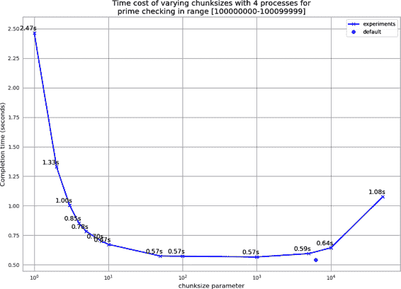

# 第九章：多进程模块

CPython 默认不使用多个 CPU。这部分是因为 Python 是在单核时代设计的，部分原因是并行化实际上可能相当难以高效实现。Python 给了我们实现的工具，但是让我们自己做选择。看到你的多核机器在长时间运行的进程中只使用一个 CPU 真是痛苦，所以在本章中，我们将回顾一些同时使用所有机器核心的方法。

###### 注意

我们刚提到了*CPython*——这是我们所有人都使用的常见实现。Python 语言本身并不阻止其在多核系统上的使用。CPython 的实现不能有效地利用多核，但是未来的实现可能不受此限制。

我们生活在一个多核世界——笔记本电脑通常有 4 个核心，而 32 核心的桌面配置也是常见的。如果你的工作可以分解为在多个 CPU 上运行，而且不需要太多的工程工作，那么这是一个明智的方向值得考虑。

当 Python 用于在一组 CPU 上并行化问题时，你可以期待*最多*达到*n*倍的加速，其中*n*为核心数。如果你有一台四核机器，并且可以将所有四个核心用于任务，那么运行时间可能只有原始运行时间的四分之一。你不太可能看到超过 4 倍的加速；实际上，你可能会看到 3 到 4 倍的提升。

每增加一个进程都会增加通信开销并减少可用 RAM，所以你很少能获得完全*n*倍的加速。取决于你正在解决的问题，通信开销甚至可能非常大，以至于可以看到非常显著的减速。这些问题通常是任何并行编程的复杂性所在，通常需要算法的改变。这就是为什么并行编程通常被认为是一门艺术。

如果你对[Amdahl's law](https://oreil.ly/GC2CK)不熟悉，值得进行一些背景阅读。该定律表明，如果你的代码只有一小部分可以并行化，那么无论你投入多少 CPU，整体速度提升都不会太大。即使你的运行时间的大部分可以并行化，也有一个有限数量的 CPU 可以有效地用于使整个过程在到达收益递减点之前更快地运行。

`multiprocessing`模块允许您使用基于进程和线程的并行处理，在队列中共享工作并在进程之间共享数据。它主要专注于单机多核并行性（在多机并行性方面有更好的选择）。非常常见的用法是将任务并行化到一组进程中，用于处理 CPU 密集型问题。您也可以使用 OpenMP 来并行化 I/O 密集型问题，但正如我们在第八章中所看到的，这方面有更好的工具（例如 Python 3 中的新`asyncio`模块和`tornado`）。

###### 注意

OpenMP 是一个面向多核的低级接口——您可能会想集中精力在它上面，而不是`multiprocessing`。我们在第七章中使用 Cython 引入了它，但在本章中我们没有涉及。`multiprocessing`在更高的层面上工作，共享 Python 数据结构，而 OpenMP 在您编译为 C 后使用 C 原始对象（例如整数和浮点数）工作。仅当您正在编译代码时才使用它是有意义的；如果您不编译代码（例如，如果您使用高效的`numpy`代码并且希望在许多核心上运行），那么坚持使用`multiprocessing`可能是正确的方法。

要并行化您的任务，您必须以与编写串行进程的正常方式有所不同的方式思考。您还必须接受调试并行化任务更加困难—通常情况下，这可能会非常令人沮丧。我们建议保持并行性尽可能简单（即使您并没有从计算机中挤出最后一滴性能），这样可以保持您的开发速度。

并行系统中一个特别困难的话题是共享状态——感觉应该很容易，但会带来很多开销，并且很难正确实现。有许多使用情况，每种情况都有不同的权衡，所以绝对没有一个适合所有人的解决方案。在“使用进程间通信验证质数”中，我们将关注共享状态并考虑同步成本。避免共享状态将使您的生活变得更加轻松。

实际上，几乎完全可以通过要共享的状态量来分析算法在并行环境中的性能表现。例如，如果我们可以有多个 Python 进程同时解决相同的问题而不互相通信（这种情况称为*尴尬并行*），那么随着我们添加越来越多的 Python 进程，将不会产生太大的惩罚。

另一方面，如果每个进程都需要与其他每个 Python 进程通信，通信开销将会逐渐压倒处理并减慢速度。这意味着随着我们添加越来越多的 Python 进程，我们实际上可能会降低整体性能。

因此，有时候必须进行一些反直觉的算法更改，以有效地并行解决问题。例如，在并行解决扩散方程(第六章)时，每个进程实际上都会做一些另一个进程也在做的冗余工作。这种冗余减少了所需的通信量，并加快了整体计算速度！

以下是`multiprocessing`模块的一些典型用途：

+   使用`Process`或`Pool`对象对 CPU 密集型任务进行并行化处理

+   使用（奇怪命名的）`dummy`模块在`Pool`中使用线程并行化 I/O 密集型任务

+   通过`Queue`共享序列化工作

+   在并行化的工作者之间共享状态，包括字节、基本数据类型、字典和列表

如果你来自一个使用线程进行 CPU 绑定任务的语言（例如 C++或 Java），你应该知道，虽然 Python 中的线程是操作系统本地的（它们不是模拟的——它们是真实的操作系统线程），但它们受到 GIL 的限制，因此一次只有一个线程可以与 Python 对象交互。

通过使用进程，我们可以并行地运行多个 Python 解释器，每个解释器都有一个私有的内存空间，有自己的 GIL，并且每个解释器都是连续运行的（因此没有 GIL 之间的竞争）。这是在 Python 中加速 CPU 密集型任务的最简单方法。如果我们需要共享状态，我们需要增加一些通信开销；我们将在“使用进程间通信验证质数”中探讨这个问题。

如果你使用`numpy`数组，你可能会想知道是否可以创建一个更大的数组（例如，一个大型的二维矩阵），并让进程并行地处理数组的段。你可以，但是通过反复试验发现是很困难的，因此在“使用多进程共享 numpy 数据”中，我们将通过在四个 CPU 之间共享一个 25 GB 的`numpy`数组来解决这个问题。与其发送数据的部分副本（这样至少会将 RAM 中所需的工作大小翻倍，并创建大量的通信开销），我们将数组的底层字节在进程之间共享。这是在一台机器上在本地工作者之间共享一个大型数组的理想方法。

在本章中，我们还介绍了[Joblib](https://oreil.ly/RqQXD)库——这建立在`multiprocessing`库的基础上，并提供了改进的跨平台兼容性，一个简单的用于并行化的 API，以及方便的缓存结果的持久性。Joblib 专为科学使用而设计，我们建议你去了解一下。

###### 注意

在这里，我们讨论*nix-based（本章是使用 Ubuntu 编写的；代码应该在 Mac 上不变）机器上的`multiprocessing`。自 Python 3.4 以来，出现在 Windows 上的怪癖已经被处理。Joblib 比`multiprocessing`具有更强的跨平台支持，我们建议您在使用`multiprocessing`之前先查看它。

在本章中，我们将硬编码进程的数量（`NUM_PROCESSES=4`）以匹配 Ian 笔记本电脑上的四个物理核心。默认情况下，`multiprocessing`将使用它能够看到的尽可能多的核心（机器呈现出八个——四个 CPU 和四个超线程）。通常情况下，除非你专门管理你的资源，否则你应该避免硬编码要创建的进程数量。

# 对`multiprocessing`模块的概述

`multiprocessing`模块提供了一个低级别的接口，用于进程和基于线程的并行处理。它的主要组件如下：

`Process`

当前进程的分叉副本；这将创建一个新的进程标识符，并在操作系统中作为独立的子进程运行任务。您可以启动并查询`Process`的状态，并为其提供一个`target`方法来运行。

`Pool`

将`Process`或`threading.Thread`API 包装为一个方便的工作池，共享一块工作并返回聚合结果。

`Queue`

允许多个生产者和消费者的 FIFO 队列。

`Pipe`

一个单向或双向通信通道，用于两个进程之间的通信。

`Manager`

一个高级管理接口，用于在进程之间共享 Python 对象。

`ctypes`

允许在进程分叉后共享原始数据类型（例如整数、浮点数和字节）。

同步原语

用于在进程之间同步控制流的锁和信号量。

###### 注意

在 Python 3.2 中，通过[PEP 3148](http://bit.ly/concurrent_add)引入了`concurrent.futures`模块；这提供了`multiprocessing`的核心行为，接口更简单，基于 Java 的`java.util.concurrent`。它作为一个[回退到早期 Python 版本的扩展](https://oreil.ly/G9e5e)可用。我们期望`multiprocessing`在 CPU 密集型工作中继续被偏爱，并且如果`concurrent.futures`在 I/O 绑定任务中变得更受欢迎，我们也不会感到惊讶。

在本章的其余部分，我们将介绍一系列示例，展示使用`multiprocessing`模块的常见方法。

我们将使用一组进程或线程的`Pool`，使用普通 Python 和`numpy`以蒙特卡洛方法估算圆周率。这是一个简单的问题，复杂性易于理解，因此可以很容易地并行化；我们还可以看到使用线程与`numpy`时的意外结果。接下来，我们将使用相同的`Pool`方法搜索质数；我们将调查搜索质数的不可预测复杂性，并查看如何有效（以及无效！）地分割工作负载以最佳利用我们的计算资源。我们将通过切换到队列来完成质数搜索，在那里我们使用`Process`对象代替`Pool`并使用一系列工作和毒丸来控制工作者的生命周期。

接下来，我们将处理进程间通信（IPC），以验证一小组可能的质数。通过将每个数字的工作负载跨多个 CPU 分割，我们使用 IPC 提前结束搜索，如果发现因子，以便显著超过单 CPU 搜索进程的速度。我们将涵盖共享 Python 对象、操作系统原语和 Redis 服务器，以调查每种方法的复杂性和能力折衷。

我们可以在四个 CPU 上共享一个 25 GB 的`numpy`数组，以分割大型工作负载，*无需*复制数据。如果您有具有可并行操作的大型数组，这种技术应该能显著加快速度，因为您需要在 RAM 中分配更少的空间并复制更少的数据。最后，我们将看看如何在进程之间同步访问文件和变量（作为`Value`）而不会损坏数据，以说明如何正确锁定共享状态。

###### 注意

PyPy（在第七章中讨论）完全支持`multiprocessing`库，尽管在撰写本文时的`numpy`示例尚未完全支持。如果您仅使用 CPython 代码（没有 C 扩展或更复杂的库）进行并行处理，PyPy 可能是一个快速的胜利。

# 使用蒙特卡洛方法估算π

我们可以通过向单位圆表示的“飞镖板”投掷数千次想象中的飞镖来估算π。落入圆边缘内的飞镖数量与落入圆外的数量之间的关系将允许我们近似π的值。

这是一个理想的首个问题，因为我们可以将总工作负载均匀分配到多个进程中，每个进程在单独的 CPU 上运行。由于每个进程的工作负载相等，因此它们将同时结束，因此我们可以在增加新的 CPU 和超线程时探索可用的加速效果。

在图 9-1 中，我们向单位正方形投掷了 10,000 个飞镖，其中一部分落入了绘制的单位圆的四分之一中。这个估计相当不准确——10,000 次飞镖投掷不能可靠地给出三位小数的结果。如果您运行您自己的代码，您会看到每次运行这个估计在 3.0 到 3.2 之间变化。

要确保前三位小数的准确性，我们需要生成 10,000,000 次随机飞镖投掷。¹ 这是非常低效的（估算π的更好方法存在），但用来演示使用`multiprocessing`进行并行化的好处非常方便。

使用蒙特卡洛方法，我们使用[毕达哥拉斯定理](https://oreil.ly/toFkX)来测试一个飞镖是否落入我们的圆内：

<math alttext="dollar-sign x squared plus y squared less-than-or-equal-to 1 squared equals 1 dollar-sign"><mrow><mrow><msup><mi>x</mi> <mn>2</mn></msup> <mo>+</mo> <msup><mi>y</mi> <mn>2</mn></msup></mrow> <mo>≤</mo> <msup><mn>1</mn> <mn>2</mn></msup> <mo>=</mo> <mn>1</mn></mrow></math>

###### 图 9-1\. 使用蒙特卡洛方法估算π

我们将在示例 9-1 中查看一个循环版本。我们将实现一个普通的 Python 版本和稍后的`numpy`版本，并使用线程和进程来并行化解决方案。

# 使用进程和线程估算π

在本节中，我们将从一个普通的 Python 实现开始，这样更容易理解，使用循环中的浮点对象。我们将通过进程并行化，以利用所有可用的 CPU，并且在使用更多 CPU 时可视化机器的状态。

## 使用 Python 对象

Python 实现易于跟踪，但每个 Python 浮点对象都需要被管理、引用和依次同步，这带来了一些额外开销。这种开销减慢了我们的运行时，但却为我们赢得了思考时间，因为实现起来非常快速。通过并行化这个版本，我们可以在几乎不增加额外工作的情况下获得额外的加速。

图 9-2 展示了 Python 示例的三种实现方式：

+   不使用 `multiprocessing`（称为“串行”）——在主进程中使用一个 `for` 循环

+   使用线程

+   使用进程


###### 图 9-2\. 串行工作，使用线程和进程

当我们使用多个线程或进程时，我们要求 Python 计算相同数量的飞镖投掷，并在工作人员之间均匀分配工作。如果我们希望使用我们的 Python 实现总共 1 亿次飞镖投掷，并且使用两个工作者，我们将要求两个线程或两个进程生成每个工作者 5000 万次飞镖投掷。

使用一个线程大约需要 71 秒，使用更多线程时没有加速。通过使用两个或更多进程，我们使运行时*更短*。不使用进程或线程的成本（串行实现）与使用一个进程的成本相同。

通过使用进程，在 Ian 的笔记本上使用两个或四个核心时，我们获得线性加速。对于八个工作者的情况，我们使用了英特尔的超线程技术——笔记本只有四个物理核心，因此在运行八个进程时，速度几乎没有变化。

示例 9-1 展示了我们 pi 估算器的 Python 版本。如果我们使用线程，每个指令都受 GIL 限制，因此尽管每个线程可以在不同的 CPU 上运行，但只有在没有其他线程运行时才会执行。进程版本不受此限制，因为每个分叉进程都有一个作为单个线程运行的私有 Python 解释器——没有 GIL 竞争，因为没有共享对象。我们使用 Python 的内置随机数生成器，但请参阅“并行系统中的随机数”以了解并行化随机数序列的危险注意事项。

##### 示例 9-1\. 在 Python 中使用循环估算 pi

```py
def estimate_nbr_points_in_quarter_circle(nbr_estimates):
    """Monte Carlo estimate of the number of points in a
 quarter circle using pure Python"""
    print(f"Executing estimate_nbr_points_in_quarter_circle \
 with {nbr_estimates:,} on pid {os.getpid()}")
    nbr_trials_in_quarter_unit_circle = 0
    for step in range(int(nbr_estimates)):
        x = random.uniform(0, 1)
        y = random.uniform(0, 1)
        is_in_unit_circle = x * x + y * y <= 1.0
        nbr_trials_in_quarter_unit_circle += is_in_unit_circle

    return nbr_trials_in_quarter_unit_circle
```

示例 9-2 显示了`__main__`块。请注意，在启动计时器之前，我们构建了`Pool`。生成线程相对即时；生成进程涉及分叉，这需要测量时间的一部分。我们在图 9-2 中忽略了这个开销，因为这个成本将是整体执行时间的一小部分。

##### 示例 9-2\. 使用循环估计圆周率的主要代码

```py
from multiprocessing import Pool
...

if __name__ == "__main__":
    nbr_samples_in_total = 1e8
    nbr_parallel_blocks = 4
    pool = Pool(processes=nbr_parallel_blocks)
    nbr_samples_per_worker = nbr_samples_in_total / nbr_parallel_blocks
    print("Making {:,} samples per {} worker".format(nbr_samples_per_worker,
                                                     nbr_parallel_blocks))
    nbr_trials_per_process = [nbr_samples_per_worker] * nbr_parallel_blocks
    t1 = time.time()
    nbr_in_quarter_unit_circles = pool.map(estimate_nbr_points_in_quarter_circle,
                                           nbr_trials_per_process)
    pi_estimate = sum(nbr_in_quarter_unit_circles) * 4 / float(nbr_samples_in_total)
    print("Estimated pi", pi_estimate)
    print("Delta:", time.time() - t1)
```

我们创建一个包含`nbr_estimates`除以工作程序数的列表。这个新参数将发送给每个工作程序。执行后，我们将收到相同数量的结果；我们将这些结果相加以估计单位圆中的飞镖数。

我们从`multiprocessing`中导入基于进程的`Pool`。我们也可以使用`from multiprocessing.dummy import Pool`来获取一个线程化版本。 “dummy”名称相当误导（我们承认我们不理解为什么它以这种方式命名）；它只是一个围绕`threading`模块的轻量级包装，以呈现与基于进程的`Pool`相同的接口。

###### 警告

我们创建的每个进程都会从系统中消耗一些 RAM。您可以预期使用标准库的分叉进程将占用大约 10-20 MB 的 RAM；如果您使用许多库和大量数据，则可能每个分叉副本将占用数百兆字节。在具有 RAM 约束的系统上，这可能是一个重大问题 - 如果 RAM 用完，系统将回到使用磁盘的交换空间，那么任何并行化优势都将因缓慢的 RAM 回写到磁盘而大量丧失！

下图绘制了 Ian 笔记本电脑的四个物理核心及其四个关联的超线程的平均 CPU 利用率（每个超线程在物理核心中的未使用硅上运行）。这些图表收集的数据*包括*第一个 Python 进程的启动时间和启动子进程的成本。CPU 采样器记录笔记本电脑的整个状态，而不仅仅是此任务使用的 CPU 时间。

请注意，以下图表是使用比图 9-2 慢一些的采样率创建的，因此整体运行时间略长。

在图 9-3 中，使用一个进程在`Pool`（以及父进程）中的执行行为显示出一些开销，在创建`Pool`时首几秒钟内，然后在整个运行过程中保持接近 100%的 CPU 利用率。使用一个进程，我们有效地利用了一个核心。


###### 图 9-3\. 使用 Python 对象和一个进程估计圆周率

接下来，我们将添加第二个进程，相当于说`Pool(processes=2)`。如你在图 9-4 中所见，添加第二个进程将执行时间大致减半至 37 秒，并且两个 CPU 完全被占用。这是我们能期待的最佳结果——我们已经高效地利用了所有新的计算资源，而且没有因通信、分页到磁盘或与竞争使用相同 CPU 的其他进程的争用等开销而损失速度。


###### 图 9-4\. 使用 Python 对象和两个进程估算 Pi

图 9-5 显示了在使用所有四个物理 CPU 时的结果——现在我们正在使用这台笔记本电脑的全部原始计算能力。执行时间大约是单进程版本的四分之一，为 19 秒。


###### 图 9-5\. 使用 Python 对象和四个进程估算 Pi

通过切换到八个进程，如图 9-6 所示，与四进程版本相比，我们不能实现更大的速度提升。这是因为四个超线程只能从 CPU 上的备用硅中挤出一点额外的处理能力，而四个 CPU 已经达到最大利用率。


###### 图 9-6\. 使用 Python 对象和八个进程估算 Pi，但额外收益微乎其微

这些图表显示，我们在每个步骤中都有效地利用了更多的可用 CPU 资源，并且超线程资源是一个糟糕的补充。在使用超线程时最大的问题是 CPython 使用了大量 RAM——超线程对缓存不友好，因此每个芯片上的备用资源利用非常低效。正如我们将在下一节看到的，`numpy`更好地利用了这些资源。

###### 注意

根据我们的经验，如果有足够的备用计算资源，超线程可以提供高达 30%的性能增益*如果*有浮点和整数算术的混合而不仅仅是我们这里的浮点操作。通过混合资源需求，超线程可以同时调度更多 CPU 硅工作。一般来说，我们将超线程视为额外的奖励而不是需要优化的资源，因为添加更多 CPU 可能比调整代码（增加支持开销）更经济。

现在我们将切换到一个进程中使用线程，而不是多个进程。

图 9-7 显示了在同一个代码中运行相同的代码的结果，我们用线程代替进程。尽管使用了多个 CPU，但它们轻度共享负载。如果每个线程都在没有 GIL 的情况下运行，那么我们将在四个 CPU 上看到 100%的 CPU 利用率。相反，每个 CPU 都被部分利用（因为有 GIL）。


###### 图 9-7\. 使用 Python 对象和四个线程估算 Pi

## 用 Joblib 替换 multiprocessing

Joblib 是`multiprocessing`的改进版本，支持轻量级流水线处理，专注于简化并行计算和透明的基于磁盘的缓存结果。它专注于科学计算中的 NumPy 数组。如果您正在使用纯 Python 编写，无论是否使用 NumPy，来处理可以简单并行化的循环，它可能会为您带来快速成功。

+   使用 Python 纯代码时，无论是否使用 NumPy，都可以处理可以使人尴尬的并行化循环。

+   调用昂贵的没有副作用的函数，其中输出可以在会话之间缓存到磁盘

+   能够在进程之间共享 NumPy 数据，但不知道如何操作（并且您尚未阅读过“使用多进程共享 NumPy 数据”）。

Joblib 基于 Loky 库构建（它本身是 Python `concurrent.futures` 的改进），并使用`cloudpickle`来实现在交互作用域中定义函数的序列化。这解决了使用内置`multiprocessing`库时遇到的几个常见问题。

对于并行计算，我们需要`Parallel`类和`delayed`装饰器。`Parallel`类设置了一个进程池，类似于我们在前一节中使用的`multiprocessing`的`pool`。`delayed`装饰器包装了我们的目标函数，使其可以通过迭代器应用于实例化的`Parallel`对象。

语法有点令人困惑——看看示例 9-3。调用写在一行上；这包括我们的目标函数`estimate_nbr_points_in_quarter_circle`和迭代器`(delayed(...)(nbr_samples_per_worker) for sample_idx in range(nbr_parallel_blocks))`。让我们来分解一下这个过程。

##### 示例 9-3\. 使用 Joblib 并行化估算 Pi

```py
...
from joblib import Parallel, delayed

if __name__ == "__main__":
    ...
    nbr_in_quarter_unit_circles = Parallel(n_jobs=nbr_parallel_blocks, verbose=1) \
          (delayed(estimate_nbr_points_in_quarter_circle)(nbr_samples_per_worker) \
           for sample_idx in range(nbr_parallel_blocks))
    ...
```

`Parallel`是一个类；我们可以设置参数，如`n_jobs`来指定将运行多少进程，以及像`verbose`这样的可选参数来获取调试信息。其他参数可以设置超时时间，选择线程或进程之间切换，更改后端（这可以帮助加速某些极端情况），并配置内存映射。

`Parallel`具有一个可调用方法`__call__`，接受一个可迭代对象。我们在以下圆括号中提供了可迭代对象`(... for sample_idx in range(...))`。该可调用对象迭代每个`delayed(estimate_nbr_points_in_quarter_circle)`函数，批处理这些函数的参数执行（在本例中为`nbr_samples_per_worker`）。Ian 发现逐步构建并行调用非常有帮助，从一个没有参数的函数开始，根据需要逐步构建参数。这样可以更容易地诊断错误步骤。

`nbr_in_quarter_unit_circles`将是一个包含每次调用正例计数的列表，如前所述。示例 9-4 显示了八个并行块的控制台输出；每个进程 ID（PID）都是全新创建的，并且在输出末尾打印了进度条的摘要。总共需要 19 秒，与我们在前一节中创建自己的`Pool`时相同的时间。

###### 提示

避免传递大结构；将大型 Pickle 对象传递给每个进程可能会很昂贵。Ian 曾经有过一个预先构建的 Pandas DataFrame 字典对象的情况；通过`Pickle`模块对其进行序列化的成本抵消了并行化带来的收益，而串行版本实际上总体上运行得更快。在这种情况下的解决方案是使用 Python 的内置[`shelve`模块](https://oreil.ly/e9dJs)构建 DataFrame 缓存，并将字典存储到文件中。每次调用目标函数时，使用`shelve`加载单个 DataFrame；几乎不需要传递任何东西给函数，然后`Joblib`的并行化效益变得明显。

##### 示例 9-4\. `Joblib`调用的输出

```py
Making 12,500,000 samples per 8 worker
[Parallel(n_jobs=8)]: Using backend LokyBackend with 8 concurrent workers.
Executing estimate_nbr_points_in_quarter_circle with 12,500,000 on pid 10313
Executing estimate_nbr_points_in_quarter_circle with 12,500,000 on pid 10315
Executing estimate_nbr_points_in_quarter_circle with 12,500,000 on pid 10311
Executing estimate_nbr_points_in_quarter_circle with 12,500,000 on pid 10316
Executing estimate_nbr_points_in_quarter_circle with 12,500,000 on pid 10312
Executing estimate_nbr_points_in_quarter_circle with 12,500,000 on pid 10314
Executing estimate_nbr_points_in_quarter_circle with 12,500,000 on pid 10317
Executing estimate_nbr_points_in_quarter_circle with 12,500,000 on pid 10318
[Parallel(n_jobs=8)]: Done   2 out of   8 | elapsed:   18.9s remaining:   56.6s
[Parallel(n_jobs=8)]: Done   8 out of   8 | elapsed:   19.3s finished
Estimated pi 3.14157744
Delta: 19.32842755317688
```

###### 提示

为了简化调试，我们可以设置`n_jobs=1`，并且并行化代码被禁用。您不必进一步修改代码，可以在函数中放置一个`breakpoint()`调用以便轻松调试。

### 函数调用结果的智能缓存

Joblib 中一个有用的功能是`Memory`缓存；这是一个基于输入参数将函数结果缓存到磁盘缓存的装饰器。此缓存在 Python 会话之间持久存在，因此如果关闭计算机然后第二天运行相同的代码，将使用缓存的结果。

对于我们的π估计，这提出了一个小问题。我们不会向`estimate_nbr_points_in_quarter_circle`传递唯一的参数；对于每次调用，我们都会传递`nbr_estimates`，因此调用签名相同，但我们寻求的是不同的结果。

在这种情况下，一旦第一次调用完成（大约需要 19 秒），任何使用相同参数的后续调用都将获得缓存的结果。这意味着如果我们第二次运行代码，它将立即完成，但每次调用只使用八个样本结果中的一个作为结果——这显然破坏了我们的蒙特卡洛抽样！如果最后一个完成的进程导致在四分之一圆中有`9815738`个点，则函数调用的缓存将始终回答这个结果。重复调用八次将生成`[9815738, 9815738, 9815738, 9815738, 9815738, 9815738, 9815738, 9815738]`，而不是八个唯一的估计值。

示例 9-5 中的解决方案是传入第二个参数`idx`，它接受 0 到`nbr_parallel_blocks-1`之间的值。这些唯一参数的组合将允许缓存存储每个正计数，因此在第二次运行时，我们得到与第一次运行相同的结果，但无需等待。

这是通过`Memory`配置的，它需要一个用于持久化函数结果的文件夹。这种持久性在 Python 会话之间保持；如果更改被调用的函数或清空缓存文件夹中的文件，则会刷新它。

请注意，此刷新仅适用于已装饰函数的更改（在本例中为`estimate_nbr_points_in_quarter_circle_with_idx`），而不适用于从该函数内部调用的任何子函数。

##### 示例 9-5\. 使用 Joblib 缓存结果

```py
...
from joblib import Memory

memory = Memory("./joblib_cache", verbose=0)

@memory.cache
def estimate_nbr_points_in_quarter_circle_with_idx(nbr_estimates, idx):
    print(f"Executing estimate_nbr_points_in_quarter_circle with \
 {nbr_estimates} on sample {idx} on pid {os.getpid()}")
    ...

if __name__ == "__main__":
    ...
    nbr_in_quarter_unit_circles = Parallel(n_jobs=nbr_parallel_blocks) \
       (delayed(
	    estimate_nbr_points_in_quarter_circle_with_idx) \
        (nbr_samples_per_worker, idx) for idx in range(nbr_parallel_blocks))
    ...
```

在示例 9-6 中，我们可以看到，第一次调用花费了 19 秒，而第二次调用仅花费了几分之一秒，并且估算的π值相同。在这次运行中，估计值为`[9817605, 9821064, 9818420, 9817571, 9817688, 9819788, 9816377, 9816478]`。

##### 示例 9-6\. 由于缓存结果，代码的零成本第二次调用

```py
$ python pi_lists_parallel_joblib_cache.py
Making 12,500,000 samples per 8 worker
Executing estimate_nbr_points_in_... with 12500000 on sample 0 on pid 10672
Executing estimate_nbr_points_in_... with 12500000 on sample 1 on pid 10676
Executing estimate_nbr_points_in_... with 12500000 on sample 2 on pid 10677
Executing estimate_nbr_points_in_... with 12500000 on sample 3 on pid 10678
Executing estimate_nbr_points_in_... with 12500000 on sample 4 on pid 10679
Executing estimate_nbr_points_in_... with 12500000 on sample 5 on pid 10674
Executing estimate_nbr_points_in_... with 12500000 on sample 6 on pid 10673
Executing estimate_nbr_points_in_... with 12500000 on sample 7 on pid 10675
Estimated pi 3.14179964
Delta: 19.28862953186035

$ python %run pi_lists_parallel_joblib_cache.py
Making 12,500,000 samples per 8 worker
Estimated pi 3.14179964
Delta: 0.02478170394897461
```

Joblib 用一个简单（尽管有点难以阅读）的接口包装了许多`multiprocessing`功能。Ian 已经开始使用 Joblib 来替代`multiprocessing`，他建议你也试试。

## 并行系统中的随机数

生成良好的随机数序列是一个棘手的问题，如果尝试自行实现很容易出错。在并行中快速获得良好的序列更难——突然间，您必须担心是否会在并行进程中获得重复或相关的序列。

我们在示例 9-1 中使用了 Python 内置的随机数生成器，在下一节中的示例 9-7 中，我们将使用`numpy`的随机数生成器。在这两种情况下，随机数生成器都在其分叉进程中进行了种子化。对于 Python 的`random`示例，种子化由`multiprocessing`内部处理——如果在分叉时看到`random`存在于命名空间中，它将强制调用以在每个新进程中种子化生成器。

###### 提示

在并行化函数调用时设置 numpy 种子。在接下来的 `numpy` 示例中，我们必须显式设置随机数种子。如果您忘记使用 `numpy` 设置随机数序列的种子，每个分叉进程将生成相同的随机数序列 —— 它看起来会按照您期望的方式工作，但在背后每个并行进程将以相同的结果演化！

如果您关心并行进程中使用的随机数质量，请务必研究这个话题。*可能* `numpy` 和 Python 的随机数生成器已经足够好，但如果重要的结果依赖于随机序列的质量（例如医疗或金融系统），那么您必须深入了解这个领域。

在 Python 3 中，使用 [Mersenne Twister 算法](https://oreil.ly/yNINO) —— 它具有长周期，因此序列在很长时间内不会重复。它经过了大量测试，因为它也被其他语言使用，并且是线程安全的。但可能不适合用于加密目的。

## 使用 numpy

在本节中，我们转而使用 `numpy`。我们的投镖问题非常适合 `numpy` 的向量化操作——我们的估算比之前的 Python 示例快 25 倍。

`numpy` 比纯 Python 解决同样问题更快的主要原因是，`numpy` 在连续的 RAM 块中以非常低的级别创建和操作相同的对象类型，而不是创建许多需要单独管理和寻址的更高级别的 Python 对象。

由于 `numpy` 更加友好于缓存，当使用四个超线程时我们也会得到轻微的速度提升。在纯 Python 版本中，我们没有得到这个好处，因为较大的 Python 对象未能有效利用缓存。

在 图 9-8 中，我们看到三种情况：

+   不使用 `multiprocessing`（名为“串行”）

+   使用线程

+   使用进程

串行和单工作者版本的执行速度相同——使用 `numpy` 时没有使用线程的额外开销（并且只有一个工作者时也没有收益）。

当使用多个进程时，我们看到每个额外 CPU 的经典 100% 利用率。结果与图 9-3、9-4、9-5 和 9-6 中显示的情况相似，但使用 `numpy` 的代码速度要快得多。

有趣的是，线程版本随着线程数的增加运行得*更快*。正如在 [SciPy wiki](https://oreil.ly/XXKNo) 上讨论的那样，通过在全局解释器锁之外工作，`numpy` 可以实现一定程度的额外加速。


###### 图 9-8\. 使用 numpy 串行工作、使用线程和使用进程

使用进程给我们带来可预测的加速，就像在纯 Python 示例中一样。第二个 CPU 会将速度提高一倍，而使用四个 CPU 会将速度提高四倍。

示例 9-7 展示了我们代码的向量化形式。请注意，当调用此函数时，随机数生成器会被种子化。对于多线程版本，这不是必要的，因为每个线程共享同一个随机数生成器，并且它们是串行访问的。对于进程版本，由于每个新进程都是一个分支，所有分叉版本都将共享*相同的状态*。这意味着每个版本中的随机数调用将返回相同的序列！

###### 提示

记得使用`numpy`为每个进程调用`seed()`来确保每个分叉进程生成唯一的随机数序列，因为随机源用于为每次调用设置种子。回顾一下“并行系统中的随机数”中有关并行随机数序列危险的注意事项。

##### 示例 9-7\. 使用 `numpy` 估算 π

```py
def estimate_nbr_points_in_quarter_circle(nbr_samples):
    """Estimate pi using vectorized numpy arrays"""
    np.random.seed() # remember to set the seed per process
    xs = np.random.uniform(0, 1, nbr_samples)
    ys = np.random.uniform(0, 1, nbr_samples)
    estimate_inside_quarter_unit_circle = (xs * xs + ys * ys) <= 1
    nbr_trials_in_quarter_unit_circle = np.sum(estimate_inside_quarter_unit_circle)
    return nbr_trials_in_quarter_unit_circle
```

简短的代码分析表明，在此计算机上，使用多个线程执行时，对`random`的调用速度稍慢，而对`(xs * xs + ys * ys) <= 1`的调用可以很好地并行化。对随机数生成器的调用受制于 GIL，因为内部状态变量是一个 Python 对象。

理解这个过程是基本但可靠的：

1.  注释掉所有`numpy`行，并使用串行版本在*无*线程下运行。运行多次，并在`__main__`中使用`time.time()`记录执行时间。

1.  在添加一行返回代码（我们首先添加了`xs = np.random.uniform(...)`）并运行多次，再次记录完成时间。

1.  添加下一行代码（现在添加`ys = ...`），再次运行，并记录完成时间。

1.  重复，包括`nbr_trials_in_quarter_unit_circle = np.sum(...)`行。

1.  再次重复此过程，但这次使用四个线程。逐行重复。

1.  比较无线程和四个线程在每个步骤的运行时差异。

因为我们正在并行运行代码，所以使用`line_profiler`或`cProfile`等工具变得更加困难。记录原始运行时间并观察使用不同配置时的行为差异需要耐心，但可以提供可靠的证据来得出结论。

###### 注意

如果你想了解`uniform`调用的串行行为，请查看[`numpy`源码](https://oreil.ly/HxHQD)中的`mtrand`代码，并跟随在*mtrand.pyx*中的`def uniform`调用。如果你以前没有查看过`numpy`源代码，这是一个有用的练习。

在构建`numpy`时使用的库对于某些并行化机会非常重要。取决于构建`numpy`时使用的底层库（例如是否包含了英特尔数学核心库或 OpenBLAS 等），您将看到不同的加速行为。

您可以使用`numpy.show_config()`检查您的`numpy`配置。如果您对可能性感到好奇，Stack Overflow 上有一些[示例时间](http://bit.ly/BLAS_benchmarking)。只有一些`numpy`调用会从外部库的并行化中受益。

# 寻找素数

接下来，我们将测试大范围内的素数。这与估算π的问题不同，因为工作量取决于您在数字范围中的位置，每个单独数字的检查具有不可预测的复杂性。我们可以创建一个串行程序来检查素数性质，然后将可能的因子集传递给每个进程进行检查。这个问题是令人尴尬地并行的，这意味着没有需要共享的状态。

`multiprocessing` 模块使得控制工作负载变得容易，因此我们将调查如何调整工作队列以使用（和滥用！）我们的计算资源，并探索一种更有效地利用我们资源的简单方法。这意味着我们将关注*负载平衡*，试图将我们变化复杂度的任务有效地分配给我们固定的资源集。

我们将使用一个与本书中稍有不同的算法（见“理想化计算与 Python 虚拟机”）；如果我们有一个偶数，它会提前退出——见示例 9-8。

##### 示例 9-8\. 使用 Python 查找素数

```py
def check_prime(n):
    if n % 2 == 0:
        return False
    for i in range(3, int(math.sqrt(n)) + 1, 2):
        if n % i == 0:
            return False
    return True
```

用这种方法测试素数时，我们能看到工作负载的多大变化？图 9-9 显示了检查素数的时间成本随可能是素数的`n`从`10,000`增加到`1,000,000`而增加。

大多数数字都不是素数；它们用一个点表示。有些检查起来很便宜，而其他则需要检查许多因子。素数用一个`x`表示，并形成浓密的黑带；检查它们是最昂贵的。随着`n`的增加，检查一个数字的时间成本增加，因为要检查的可能因子范围随着`n`的平方根增加。素数序列是不可预测的，因此我们无法确定一系列数字的预期成本（我们可以估计，但无法确定其复杂性）。

对于图表，我们对每个`n`进行了两百次测试，并选择最快的结果来消除结果的抖动。如果我们只取一个结果，由于其他进程的系统负载，计时会出现广泛变化；通过多次读数并保留最快的结果，我们可以看到预期的最佳情况计时。


###### 图 9-9\. 随着`n`的增加，检查素数所需的时间

当我们将工作分配给一个进程池时，我们可以指定每个工作人员处理多少工作。我们可以均匀分配所有工作并争取一次通过，或者我们可以制作许多工作块并在 CPU 空闲时将它们传递出去。这由`chunksize`参数控制。更大的工作块意味着更少的通信开销，而更小的工作块意味着更多地控制资源分配方式。

对于我们的素数查找器，一个单独的工作是由`check_prime`检查的数字`n`。`chunksize`为`10`意味着每个进程处理一个包含 10 个整数的列表，一次处理一个列表。

在 图 9-10 中，我们可以看到从`1`（每个作业是单独的工作）到`64`（每个作业是包含 64 个数字的列表）变化`chunksize`的效果。尽管有许多微小的作业给了我们最大的灵活性，但也带来了最大的通信开销。四个 CPU 将被有效利用，但是通信管道会成为瓶颈，因为每个作业和结果都通过这个单一通道传递。如果我们将`chunksize`加倍到`2`，我们的任务完成速度将加快一倍，因为通信管道上的竞争减少了。我们可能天真地假设通过增加`chunksize`，我们将继续改善执行时间。然而，正如你在图中看到的，我们最终会遇到收益递减的点。


###### 图 9-10\. 选择合理的`chunksize`值

我们可以继续增加`chunksize`，直到我们开始看到行为恶化。在 图 9-11 中，我们扩展了`chunksize`范围，使它们不仅小而且巨大。在较大的端点上，最坏的结果显示为 1.08 秒，我们要求`chunksize`为`50000`——这意味着我们的 100,000 个项目被分成两个工作块，使得两个 CPU 在整个通过过程中空闲。使用`chunksize`为`10000`项，我们正在创建十个工作块；这意味着四个工作块将在并行中运行两次，然后是剩下的两个工作块。这在第三轮工作中使得两个 CPU 空闲，这是资源使用的低效方式。

在这种情况下的最佳解决方案是将总作业数除以 CPU 数量。这是`multiprocessing`的默认行为，显示为图中的“default”蓝点。

作为一般规则，默认行为是明智的；只有当您预计真正获益时才调整它，并且一定要针对默认行为确认您的假设。

与蒙特卡罗π问题不同，我们的素数测试计算具有不同的复杂性——有时一个工作很快退出（检测到偶数），有时数字很大且是素数（这需要更长时间来检查）。



###### 图 9-11\. 选择合理的`chunksize`值（续）

如果我们随机化我们的工作序列会发生什么？对于这个问题，我们挤出了 2% 的性能增益，正如您在图 9-12 中所看到的。通过随机化，我们减少了最后一个作业花费更长时间的可能性，使除一个 CPU 外的所有 CPU 都保持活跃。

正如我们之前使用`chunksize`为`10000`的示例所示，将工作量与可用资源数量不匹配会导致效率低下。在那种情况下，我们创建了三轮工作：前两轮使用了资源的 100%，而最后一轮仅使用了 50%。


###### 图 9-12\. 随机化工作序列

图 9-13 展示了当我们将工作块的数量与处理器数量不匹配时出现的奇特效果。不匹配会导致可用资源利用不足。当只创建一个工作块时，总运行时间最慢：这样会使得三个处理器未被利用。两个工作块会使得两个 CPU 未被利用，依此类推；只有当我们有四个工作块时，我们才能充分利用所有资源。但是如果我们添加第五个工作块，我们又会浪费资源 —— 四个 CPU 将处理它们的工作块，然后一个 CPU 将用于计算第五个工作块。

随着工作块数量的增加，我们看到效率的不足减少 —— 在 29 和 32 个工作块之间的运行时间差约为 0.03 秒。一般规则是为了有效利用资源，如果您的工作具有不同的运行时间，则制作大量小型工作。


###### 图 9-13\. 选择不合适的工作块数量的危险

以下是一些有效使用`multiprocessing`处理尴尬并行问题的策略：

+   将你的工作分成独立的工作单元。

+   如果您的工作人员需要不同的时间量，请考虑随机化工作序列（另一个例子是处理不同大小的文件）。

+   对工作队列进行排序，以便最慢的工作先进行，可能是一个同样有效的策略。

+   除非您已验证调整的原因，否则请使用默认的`chunksize`。

+   将工作数量与物理 CPU 数量对齐。（再次强调，默认的`chunksize`会为您处理这个问题，尽管它默认使用超线程，这可能不会提供额外的增益。）

注意，默认情况下，`multiprocessing`将超线程视为额外的 CPU。这意味着在 Ian 的笔记本电脑上，它会分配八个进程，但只有四个进程会以 100% 的速度运行。额外的四个进程可能会占用宝贵的内存，而几乎没有提供额外的速度增益。

使用`Pool`，我们可以将预定义的工作块提前分配给可用的 CPU。然而，如果我们有动态工作负载，特别是随时间到达的工作负载，则这种方法帮助较少。对于这种类型的工作负载，我们可能需要使用下一节介绍的`Queue`。

## 工作队列

`multiprocessing.Queue`对象提供给我们非持久化队列，可以在进程之间发送任何可 pickle 的 Python 对象。它们带来一些额外开销，因为每个对象必须被 pickled 以便发送，然后在消费者端进行反序列化（还伴随一些锁操作）。在接下来的示例中，我们将看到这种成本是不可忽视的。然而，如果您的工作进程处理的是较大的作业，通信开销可能是可以接受的。

使用队列进行工作相当容易。在本示例中，我们将通过消费候选数列表来检查素数，并将确认的质数发布回`definite_primes_queue`。我们将以单进程、双进程、四进程和八进程运行此示例，并确认后三种方法的时间比仅运行检查相同范围的单个进程更长。

`Queue`为我们提供了使用本地 Python 对象进行大量进程间通信的能力。如果您传递的对象具有大量状态，这可能非常有用。然而，由于`Queue`缺乏持久性，您可能不希望将其用于可能需要在面对故障时保持鲁棒性的作业（例如，如果断电或硬盘损坏）。

示例 9-9 展示了`check_prime`函数。我们已经熟悉基本的素数测试。我们在一个无限循环中运行，在`possible_primes_queue.get()`上阻塞（等待直到有可用的工作），以消费队列中的项目。由于`Queue`对象负责同步访问，因此一次只能有一个进程获取项目。如果队列中没有工作，`.get()`将阻塞，直到有任务可用。当找到质数时，它们会被`put`回`definite_primes_queue`，供父进程消费。

##### 示例 9-9。使用两个队列进行进程间通信（IPC）

```py
FLAG_ALL_DONE = b"WORK_FINISHED"
FLAG_WORKER_FINISHED_PROCESSING = b"WORKER_FINISHED_PROCESSING"

def check_prime(possible_primes_queue, definite_primes_queue):
    while True:
        n = possible_primes_queue.get()
        if n == FLAG_ALL_DONE:
            # flag that our results have all been pushed to the results queue
            definite_primes_queue.put(FLAG_WORKER_FINISHED_PROCESSING)
            break
        else:
            if n % 2 == 0:
                continue
            for i in range(3, int(math.sqrt(n)) + 1, 2):
                if n % i == 0:
                    break
            else:
                definite_primes_queue.put(n)
```

我们定义了两个标志：一个由父进程作为毒丸喂入，指示没有更多工作可用，另一个由工作进程确认它已看到毒丸并关闭自身。第一个毒丸也被称为[*sentinel*](https://oreil.ly/mfR2s)，因为它保证了处理循环的终止。

处理工作队列和远程工作者时，使用这些标志记录毒丸的发送并检查子进程在合理时间窗口内发送的响应可以很有帮助，表明它们正在关闭。我们在这里不处理这个过程，但是添加一些时间记录是代码的一个相当简单的补充。接收这些标志的情况可以在调试期间记录或打印。

`Queue` 对象是在 示例 9-10 中由 `Manager` 创建的。我们将使用构建 `Process` 对象列表的熟悉过程，每个对象都包含一个分叉的进程。这两个队列作为参数发送，并且 `multiprocessing` 处理它们的同步。启动了新进程后，我们将一系列作业交给 `possible_primes_queue`，并以每个进程一个毒丸结束。作业将以 FIFO 顺序消耗，最后留下毒丸。在 `check_prime` 中，我们使用阻塞的 `.get()`，因为新进程必须等待队列中出现工作。由于我们使用标志，我们可以添加一些工作，处理结果，然后通过稍后添加毒丸迭代添加更多工作，并通过稍后添加毒丸来标志工作人员的生命结束。

##### 示例 9-10\. 为 IPC 构建两个队列

```py
if __name__ == "__main__":
    parser = argparse.ArgumentParser(description="Project description")
    parser.add_argument(
        "nbr_workers", type=int, help="Number of workers e.g. 1, 2, 4, 8"
    )
    args = parser.parse_args()
    primes = []

    manager = multiprocessing.Manager()
    possible_primes_queue = manager.Queue()
    definite_primes_queue = manager.Queue()

    pool = Pool(processes=args.nbr_workers)
    processes = []
    for _ in range(args.nbr_workers):
        p = multiprocessing.Process(
            target=check_prime, args=(possible_primes_queue,
                                      definite_primes_queue)
        )
        processes.append(p)
        p.start()

    t1 = time.time()
    number_range = range(100_000_000, 101_000_000)

    # add jobs to the inbound work queue
    for possible_prime in number_range:
        possible_primes_queue.put(possible_prime)

    # add poison pills to stop the remote workers
    for n in range(args.nbr_workers):
        possible_primes_queue.put(FLAG_ALL_DONE)
```

要消费结果，我们在 示例 9-11 中启动另一个无限循环，并在 `definite_primes_queue` 上使用阻塞的 `.get()`。如果找到 `finished-processing` 标志，则计算已经信号退出的进程数。如果没有，则表示有一个新的质数，我们将其添加到 `primes` 列表中。当所有进程都已经信号退出时，我们退出无限循环。

##### 示例 9-11\. 使用两个队列进行 IPC

```py
    processors_indicating_they_have_finished = 0
    while True:
        new_result = definite_primes_queue.get()  # block while waiting for results
        if new_result == FLAG_WORKER_FINISHED_PROCESSING:
            processors_indicating_they_have_finished += 1
            if processors_indicating_they_have_finished == args.nbr_workers:
                break
        else:
            primes.append(new_result)
    assert processors_indicating_they_have_finished == args.nbr_workers

    print("Took:", time.time() - t1)
    print(len(primes), primes[:10], primes[-10:])
```

使用 `Queue` 存在相当大的开销，这是由于 pickling 和同步造成的。正如您在 图 9-14 中所见，使用 `Queue` 的单进程解决方案明显快于使用两个或更多进程。在本例中的原因是因为我们的工作负载非常轻——通信成本主导了此任务的整体时间。使用 `Queue`，两个进程完成这个示例比一个进程稍快，而四个和八个进程则都较慢。


###### 图 9-14\. 使用队列对象的成本

如果您的任务完成时间较长（至少占据几分之一秒），但通信量很少，则使用 `Queue` 方法可能是正确的选择。您需要验证通信成本是否足够使用此方法。

您可能会想知道如果我们移除作业队列的多余一半（所有偶数——在 `check_prime` 中这些会被非常快速地拒绝），会发生什么。减少输入队列的大小会减少每种情况下的执行时间，但仍然无法超过单进程非 `Queue` 示例！这有助于说明通信成本在此问题中是主导因素。

### 异步向队列添加作业

通过在主进程中添加一个`Thread`，我们可以将作业异步地放入`possible_primes_queue`中。在示例 9-12 中，我们定义了一个`feed_new_jobs`函数：它执行与我们之前在`__main__`中设置的作业设置例程相同的工作，但是它在一个单独的线程中执行。

##### 示例 9-12\. 异步作业供给函数

```py
def feed_new_jobs(number_range, possible_primes_queue, nbr_poison_pills):
    for possible_prime in number_range:
        possible_primes_queue.put(possible_prime)
    # add poison pills to stop the remote workers
    for n in range(nbr_poison_pills):
        possible_primes_queue.put(FLAG_ALL_DONE)
```

现在，在示例 9-13 中，我们的`__main__`将使用`possible_primes_queue`设置`Thread`，然后继续到结果收集阶段*之前*发出任何工作。异步作业供给器可以从外部源（例如数据库或 I/O 限制通信）消耗工作，而`__main__`线程则处理每个处理过的结果。这意味着输入序列和输出序列不需要预先创建；它们都可以即时处理。

##### 示例 9-13\. 使用线程设置异步作业供给器

```py
if __name__ == "__main__":
    primes = []
    manager = multiprocessing.Manager()
    possible_primes_queue = manager.Queue()

    ...

    import threading
    thrd = threading.Thread(target=feed_new_jobs,
                            args=(number_range,
                                  possible_primes_queue,
                                  NBR_PROCESSES))
    thrd.start()

    # deal with the results
```

如果你想要稳健的异步系统，几乎可以肯定要使用`asyncio`或者像`tornado`这样的外部库。关于这些方法的全面讨论，请查看第 8 章。我们在这里看到的例子可以帮助你入门，但实际上它们对于非常简单的系统和教育而言更有用，而不是用于生产系统。

要*非常注意*异步系统需要特别耐心——在调试时你可能会抓狂。我们建议如下操作：

+   应用“保持简单愚蠢”原则

+   如果可能，应避免使用异步自包含系统（如我们的示例），因为它们会变得越来越复杂并很快难以维护

+   使用像`gevent`这样的成熟库（在上一章中描述），这些库为处理某些问题集提供了经过验证的方法

此外，我们强烈建议使用提供队列状态外部可见性的外部队列系统（例如，在“NSQ 用于稳健的生产集群”中讨论的 NSQ、ZeroMQ 或 Celery）。这需要更多的思考，但可能会因提高调试效率和生产系统的更好可见性而节省您的时间。

###### 提示

考虑使用任务图形以增强韧性。需要长时间运行队列的数据科学任务通常通过在无环图中指定工作流来有效服务。两个强大的库是[Airflow](https://airflow.apache.org)和[Luigi](https://oreil.ly/rBfGh)。这些在工业环境中广泛使用，支持任意任务链接、在线监控和灵活扩展。

# 使用进程间通信验证质数

质数是除了它们自己和 1 之外没有其他因子的数字。可以说最常见的因子是 2（每个偶数都不可能是质数）。之后，低质数（例如 3、5、7）成为较大的非质数（例如 9、15 和 21）的常见因子。

假设我们有一个大数，并被要求验证它是否是质数。我们可能会有一个大量的因子空间需要搜索。图 9-15 显示了非质数的每个因子在 10,000,000 以内的频率。低因子比高因子更有可能出现，但没有可预测的模式。


###### 图 9-15\. 非质数因子的频率

让我们定义一个新问题——假设我们有一个*小*数字集，我们的任务是有效地使用 CPU 资源来逐个确定每个数字是否是质数。可能我们只有一个大数需要测试。现在不再有必要使用一个 CPU 来进行检查；我们希望跨多个 CPU 协调工作。

对于这一部分，我们将查看一些更大的数字，一个有 15 位数，四个有 18 位数：

+   小非质数：112,272,535,095,295

+   大非质数 1：100,109,100,129,100,369

+   大非质数 2：100,109,100,129,101,027

+   质数 1：100,109,100,129,100,151

+   质数 2：100,109,100,129,162,907

通过使用一个较小的非质数和一些较大的非质数，我们得以验证我们选择的处理过程不仅更快地检查质数，而且在检查非质数时也不会变慢。我们假设我们不知道被给定的数字的大小或类型，因此我们希望对所有用例都获得尽可能快的结果。

###### 注意

如果您拥有这本书的旧版，您可能会惊讶地发现，使用 CPython 3.7 的这些运行时间*稍慢*于上一版中在较慢的笔记本电脑上运行的 CPython 2.7 的运行时间。这里的代码是一个特例，Python 3.*x*目前比 CPython 2.7 慢。这段代码依赖于整数操作；CPython 2.7 混合使用系统整数和“long”整数（可以存储任意大小的数字，但速度较慢）。CPython 3.*x*对所有操作只使用“long”整数。这个实现已经经过优化，但在某些情况下仍然比旧的（和更复杂的）实现慢。

我们从不必担心正在使用的“种类”整数，并且在 CPython 3.7 中，我们因此会稍微降低速度。这是一个微型基准测试，几乎不可能影响您自己的代码，因为 CPython 3.*x*在许多其他方面都比 CPython 2.*x*更快。我们的建议是不要担心这个问题，除非您大部分执行时间都依赖于整数操作——在这种情况下，我们强烈建议您查看 PyPy，它不会受到这种减速的影响。

合作是有代价的——同步数据和检查共享数据的成本可能会非常高。我们将在这里讨论几种可以用于任务协调的不同方法。

注意，我们在这里*不*涵盖有些专业的消息传递接口（MPI）；我们关注的是一些内置的模块和 Redis（非常常见）。如果你想使用 MPI，我们假设你已经知道你在做什么。[MPI4PY 项目](http://bit.ly/MPI4PY_proj)可能是一个很好的起点。当许多进程协作时，如果你想控制延迟，无论是一台还是多台机器，它是一种理想的技术。

在以下运行中，每个测试重复进行 20 次，并取最小时间以显示可能的最快速度。在这些示例中，我们使用各种技术来共享一个标志（通常为 1 字节）。我们可以使用像`Lock`这样的基本对象，但是这样只能共享 1 位状态。我们选择向您展示如何共享原始类型，以便进行更多表达式状态共享（即使对于此示例我们不需要更多表达式状态）。

我们必须强调，共享状态往往会使事情变得*复杂*——你很容易陷入另一种令人头疼的状态。要小心，并尽量保持事情尽可能简单。也许更有效的资源使用效果会被开发人员在其他挑战上的时间所超越。

首先我们将讨论结果，然后我们将详细阅读代码。

图 9-16 展示了尝试使用进程间通信更快地测试素性的初步方法。基准是串行版本，它不使用任何进程间通信；我们尝试加速代码的每一次尝试至少比这个版本更快。


###### 图 9-16\. 用于验证素性的 IPC 较慢的方法

Less Naive Pool 版本具有可预测的（并且良好的）速度。它足够好，非常难以超越。在寻找高速解决方案时不要忽视显而易见的东西——有时一个愚蠢但足够好的解决方案就是你需要的。

Less Naive Pool 解决方案的方法是将我们要测试的数按可能的因子范围均匀分配给可用的 CPU，然后将工作分配给每个 CPU。如果任何 CPU 找到因子，它将提前退出，但它不会传达这一事实；其他 CPU 将继续处理它们范围内的工作。这意味着对于一个 18 位数（我们的四个较大示例），无论它是素数还是非素数，搜索时间都是相同的。

当测试大量因子以确定素性时，Redis 和`Manager`解决方案由于通信开销而较慢。它们使用共享标志来指示是否已找到因子并且搜索应该停止。

Redis 让您不仅可以与其他 Python 进程共享状态，还可以与其他工具和其他计算机共享状态，甚至可以通过 Web 浏览器界面公开该状态（这对于远程监视可能很有用）。`Manager` 是 `multiprocessing` 的一部分；它提供了一组高级同步的 Python 对象（包括原语、`list` 和 `dict`）。

对于更大的非素数情况，尽管检查共享标志会产生一些成本，但这个成本在早期发现因子并发出信号的搜索时间节省中微不足道。

对于素数情况，无法提前退出，因为不会找到任何因子，所以检查共享标志的成本将成为主导成本。

###### 提示

一点思考往往就足够了。在这里，我们探讨了各种基于 IPC 的解决方案，以使素数验证任务更快。就“打字分钟”与“收益增加”而言，第一步——引入天真的并行处理——为我们带来了最大的收益，而付出的努力却最小。后续的收益需要进行大量额外的实验。始终考虑最终运行时间，特别是对于临时任务。有时，让一个循环运行整个周末来完成一个临时任务比优化代码以更快地运行更容易。

图 9-17 显示，通过一些努力，我们可以获得一个明显更快的结果。较不天真的 Pool 结果仍然是我们的基准线，但 `RawValue` 和 MMap（内存映射）的结果比以前的 Redis 和 `Manager` 结果快得多。真正的魔法来自于采取最快的解决方案，并执行一些不那么明显的代码操作，使得几乎最佳的 MMap 解决方案比 Less Naive Pool 解决方案在非素数情况下更快，并且在素数情况下几乎一样快。

在接下来的章节中，我们将通过各种方式来使用 Python 中的 IPC 来解决我们的协同搜索问题。我们希望您能看到 IPC 虽然相当容易，但通常会带来一些成本。


###### 图 9-17\. 使用 IPC 进行验证素数的更快方法

## 串行解决方案

我们将从之前使用过的相同的串行因子检查代码开始，如 示例 9-14 中再次显示的那样。正如之前注意到的那样，对于任何具有较大因子的非素数，我们可以更有效地并行搜索因子空间。但是，串行扫描将为我们提供一个明智的基准线。

##### 示例 9-14\. 串行验证

```py
def check_prime(n):
    if n % 2 == 0:
        return False
    from_i = 3
    to_i = math.sqrt(n) + 1
    for i in range(from_i, int(to_i), 2):
        if n % i == 0:
            return False
    return True
```

## Naive Pool 解决方案

Naive Pool 解决方案使用了一个 `multiprocessing.Pool`，类似于我们在 “寻找素数” 和 “使用进程和线程估算π” 中看到的，有四个 forked 进程。我们有一个要测试素数性的数字，我们将可能的因子范围分成了四个子范围的元组，并将这些发送到 `Pool` 中。

在示例 9-15 中，我们使用了一个新方法`create_range.create`（我们不会展示它——它相当无聊），它将工作空间分割成大小相等的区域。`ranges_to_check` 中的每个项目是一对下限和上限，用于搜索之间。对于第一个 18 位数的非质数（100,109,100,129,100,369），使用四个进程，我们将得到因子范围 `ranges_to_check == [(3, 79_100_057), (79_100_057, 158_200_111), (158_200_111, 237_300_165), (237_300_165, 316_400_222)]`（其中 316,400,222 是 100,109,100,129,100,369 的平方根加 1）。在`__main__`中，我们首先建立一个`Pool`；然后`check_prime`通过`map`方法将`ranges_to_check`拆分为每个可能的质数`n`。如果结果为`False`，则找到了一个因子，这不是一个质数。

##### 示例 9-15\. 幼稚池解决方案

```py
def check_prime(n, pool, nbr_processes):
    from_i = 3
    to_i = int(math.sqrt(n)) + 1
    ranges_to_check = create_range.create(from_i, to_i, nbr_processes)
    ranges_to_check = zip(len(ranges_to_check) * [n], ranges_to_check)
    assert len(ranges_to_check) == nbr_processes
    results = pool.map(check_prime_in_range, ranges_to_check)
    if False in results:
        return False
    return True

if __name__ == "__main__":
    NBR_PROCESSES = 4
    pool = Pool(processes=NBR_PROCESSES)
    ...
```

我们修改了前面示例 9-16 中的`check_prime`，以获取要检查范围的下限和上限。传递完整的可能因子列表没有意义，因此通过传递仅定义我们范围的两个数字，我们节省了时间和内存。

##### 示例 9-16\. `check_prime_in_range`

```py
def check_prime_in_range(n_from_i_to_i):
    (n, (from_i, to_i)) = n_from_i_to_i
    if n % 2 == 0:
        return False
    assert from_i % 2 != 0
    for i in range(from_i, int(to_i), 2):
        if n % i == 0:
            return False
    return True
```

对于“小非质数”情况，通过`Pool`验证的时间为 0.1 秒，远远长于串行解决方案中的原始 0.000002 秒。尽管有一个更差的结果，整体结果是全面加速。也许我们可以接受一个较慢的结果不是问题——但如果我们可能有很多小非质数需要检查呢？事实证明我们可以避免这种减速；接下来我们将看到更为成熟的池解决方案。

## 更为成熟的池解决方案

先前的解决方案在验证较小的非质数时效率低下。对于任何较小（少于 18 位数）的非质数，由于发送分区工作的开销和不知道是否会找到一个非常小的因子（这是更有可能的因子），它可能比串行方法更慢。如果找到一个小因子，该过程仍然必须等待其他更大因子的搜索完成。

我们可以开始在进程之间发信号，表明已找到一个小因子，但由于这种情况非常频繁，这将增加大量的通信开销。示例 9-17 中提出的解决方案是一种更加实用的方法——快速执行串行检查以查找可能的小因子，如果没有找到，则启动并行搜索。在启动相对更昂贵的并行操作之前进行串行预检查是避免一些并行计算成本的常见方法。

##### 示例 9-17\. 改进小非质数情况下的幼稚池解决方案

```py
def check_prime(n, pool, nbr_processes):
    # cheaply check high-probability set of possible factors
    from_i = 3
    to_i = 21
    if not check_prime_in_range((n, (from_i, to_i))):
        return False

    # continue to check for larger factors in parallel
    from_i = to_i
    to_i = int(math.sqrt(n)) + 1
    ranges_to_check = create_range.create(from_i, to_i, nbr_processes)
    ranges_to_check = zip(len(ranges_to_check) * [n], ranges_to_check)
    assert len(ranges_to_check) == nbr_processes
    results = pool.map(check_prime_in_range, ranges_to_check)
    if False in results:
        return False
    return True
```

对于我们的每个测试数字，这种解决方案的速度要么相等，要么优于原始串行搜索。这是我们的新基准。

重要的是，这种 `Pool` 方法为素数检查提供了一个最佳案例。如果我们有一个素数，就没有办法提前退出；我们必须在退出之前手动检查所有可能的因子。

检查这些因素没有更快的方法：任何增加复杂性的方法都会有更多的指令，因此检查所有因素的情况将导致执行最多的指令。参见 “使用 mmap 作为标志” 中涵盖的各种 `mmap` 解决方案，讨论如何尽可能接近当前用于素数的结果。

## 使用 `Manager.Value` 作为标志

`multiprocessing.Manager()` 允许我们在进程之间共享更高级别的 Python 对象作为托管共享对象；较低级别的对象被包装在代理对象中。包装和安全性会增加速度成本，但也提供了极大的灵活性。可以共享较低级别的对象（例如整数和浮点数）以及列表和字典。

在 示例 9-18 中，我们创建了一个 `Manager`，然后创建了一个 1 字节（字符）的 `manager.Value(b"c", FLAG_CLEAR)` 标志。如果需要共享字符串或数字，可以创建任何 `ctypes` 原语（与 `array.array` 原语相同）。

注意 `FLAG_CLEAR` 和 `FLAG_SET` 被分配了一个字节（`b'0'` 和 `b'1'`）。我们选择使用前缀 `b` 来显式说明（如果不加 `b`，可能会根据您的环境和 Python 版本默认为 Unicode 或字符串对象）。

现在我们可以在所有进程中传播一个因子已被发现的标志，因此可以提前结束搜索。难点在于平衡读取标志的成本与可能的速度节省。由于标志是同步的，我们不希望过于频繁地检查它 —— 这会增加更多的开销。

##### 示例 9-18\. 将 `Manager.Value` 对象作为标志传递

```py
SERIAL_CHECK_CUTOFF = 21
CHECK_EVERY = 1000
FLAG_CLEAR = b'0'
FLAG_SET = b'1'
print("CHECK_EVERY", CHECK_EVERY)

if __name__ == "__main__":
    NBR_PROCESSES = 4
    manager = multiprocessing.Manager()
    value = manager.Value(b'c', FLAG_CLEAR)  # 1-byte character
    ...
```

`check_prime_in_range` 现在将意识到共享的标志，并且该例程将检查是否有其他进程发现了素数。即使我们尚未开始并行搜索，我们必须像 示例 9-19 中所示那样在开始串行检查之前清除标志。完成串行检查后，如果我们没有找到因子，我们知道标志必须仍然为假。

##### 示例 9-19\. 使用 `Manager.Value` 清除标志

```py
def check_prime(n, pool, nbr_processes, value):
    # cheaply check high-probability set of possible factors
    from_i = 3
    to_i = SERIAL_CHECK_CUTOFF
    value.value = FLAG_CLEAR
    if not check_prime_in_range((n, (from_i, to_i), value)):
        return False

    from_i = to_i
    ...
```

我们应该多频繁地检查共享标志？每次检查都有成本，因为我们将更多指令添加到紧密的内部循环中，并且检查需要对共享变量进行锁定，这会增加更多成本。我们选择的解决方案是每一千次迭代检查一次标志。每次检查时，我们都会查看`value.value`是否已设置为`FLAG_SET`，如果是，我们会退出搜索。如果在搜索中进程找到一个因子，则会将`value.value = FLAG_SET`并退出（参见 示例 9-20）。

##### 示例 9-20\. 传递一个`Manager.Value`对象作为标志

```py
def check_prime_in_range(n_from_i_to_i):
    (n, (from_i, to_i), value) = n_from_i_to_i
    if n % 2 == 0:
        return False
    assert from_i % 2 != 0
    check_every = CHECK_EVERY
    for i in range(from_i, int(to_i), 2):
        check_every -= 1
        if not check_every:
            if value.value == FLAG_SET:
                return False
            check_every = CHECK_EVERY

        if n % i == 0:
            value.value = FLAG_SET
            return False
    return True
```

这段代码中的千次迭代检查是使用`check_every`本地计数器执行的。事实证明，尽管可读性强，但速度不佳。在本节结束时，我们将用一种可读性较差但显著更快的方法来替换它。

您可能会对我们检查共享标志的总次数感到好奇。对于两个大质数的情况，使用四个进程我们检查了 316,405 次标志（在所有后续示例中我们都会检查这么多次）。由于每次检查都因锁定而带来开销，这种成本真的会累积起来。

## 使用 Redis 作为标志

*Redis* 是一个键/值内存存储引擎。它提供了自己的锁定机制，每个操作都是原子的，因此我们无需担心从 Python（或任何其他接口语言）内部使用锁。

通过使用 Redis，我们使数据存储与语言无关—任何具有与 Redis 接口的语言或工具都可以以兼容的方式共享数据。您可以轻松在 Python、Ruby、C++和 PHP 之间共享数据。您可以在本地机器上或通过网络共享数据；要共享到其他机器，您只需更改 Redis 默认仅在`localhost`上共享的设置。

Redis 允许您存储以下内容：

+   字符串的列表

+   字符串的集合

+   字符串的排序集合

+   字符串的哈希

Redis 将所有数据存储在 RAM 中，并进行快照到磁盘（可选使用日志记录），并支持主/从复制到一组实例的集群。Redis 的一个可能应用是将其用于在集群中分享工作负载，其中其他机器读取和写入状态，而 Redis 充当快速的集中式数据存储库。

我们可以像以前使用 Python 标志一样读取和写入文本字符串（Redis 中的所有值都是字符串）。我们创建一个`StrictRedis`接口作为全局对象，它与外部 Redis 服务器通信。我们可以在`check_prime_in_range`内部创建一个新连接，但这样做会更慢，并且可能耗尽可用的有限 Redis 句柄数量。

我们使用类似字典的访问方式与 Redis 服务器通信。我们可以使用`rds[SOME_KEY] = SOME_VALUE`设置一个值，并使用`rds[SOME_KEY]`读取字符串返回。

示例 9-21 与之前的`Manager`示例非常相似——我们使用 Redis 替代了本地的`Manager`。它具有类似的访问成本。需要注意的是，Redis 支持其他（更复杂的）数据结构；它是一个强大的存储引擎，我们仅在此示例中使用它来共享一个标志。我们鼓励您熟悉其特性。

##### 示例 9-21\. 使用外部 Redis 服务器作为我们的标志

```py
FLAG_NAME = b'redis_primes_flag'
FLAG_CLEAR = b'0'
FLAG_SET = b'1'

rds = redis.StrictRedis()

def check_prime_in_range(n_from_i_to_i):
    (n, (from_i, to_i)) = n_from_i_to_i
    if n % 2 == 0:
        return False
    assert from_i % 2 != 0
    check_every = CHECK_EVERY
    for i in range(from_i, int(to_i), 2):
        check_every -= 1
        if not check_every:
            flag = rds[FLAG_NAME]
            if flag == FLAG_SET:
                return False
            check_every = CHECK_EVERY

        if n % i == 0:
            rds[FLAG_NAME] = FLAG_SET
            return False
    return True

def check_prime(n, pool, nbr_processes):
    # cheaply check high-probability set of possible factors
    from_i = 3
    to_i = SERIAL_CHECK_CUTOFF
    rds[FLAG_NAME] = FLAG_CLEAR
    if not check_prime_in_range((n, (from_i, to_i))):
        return False

    ...
    if False in results:
        return False
    return True
```

要确认数据存储在这些 Python 实例之外，我们可以像在示例 9-22 中那样，在命令行上调用`redis-cli`，并获取存储在键`redis_primes_flag`中的值。您会注意到返回的项是一个字符串（而不是整数）。从 Redis 返回的所有值都是字符串，因此如果您想在 Python 中操作它们，您需要先将它们转换为适当的数据类型。

##### 示例 9-22\. `redis-cli`

```py
$ redis-cli
redis 127.0.0.1:6379> GET "redis_primes_flag"
"0"
```

支持将 Redis 用于数据共享的一个强有力的论点是它存在于 Python 世界之外——您团队中不熟悉 Python 的开发人员也能理解它，并且存在许多针对它的工具。在阅读代码时，他们可以查看其状态，了解发生了什么（尽管不一定运行和调试）。从团队效率的角度来看，尽管使用 Redis 会增加沟通成本，但这可能对您来说是一个巨大的胜利。尽管 Redis 是项目中的额外依赖，但需要注意的是它是一个非常常见的部署工具，经过了良好的调试和理解。考虑将其作为增强您武器库的强大工具。

Redis 有许多配置选项。默认情况下，它使用 TCP 接口（这就是我们正在使用的），尽管基准文档指出套接字可能更快。它还指出，虽然 TCP/IP 允许您在不同类型的操作系统之间共享数据网络，但其他配置选项可能更快（但也可能限制您的通信选项）：

> 当服务器和客户端基准程序在同一台计算机上运行时，可以同时使用 TCP/IP 回环和 Unix 域套接字。这取决于平台，但 Unix 域套接字在 Linux 上可以实现大约比 TCP/IP 回环高出 50%的吞吐量。redis-benchmark 的默认行为是使用 TCP/IP 回环。与 TCP/IP 回环相比，Unix 域套接字的性能优势在大量使用流水线时倾向于减少（即长流水线）。
> 
> [Redis 文档](http://redis.io/topics/benchmarks)

Redis 在工业界广泛使用，成熟且信任。如果您对这个工具不熟悉，我们强烈建议您了解一下；它在您的高性能工具包中占据一席之地。

## 使用 RawValue 作为标志

`multiprocessing.RawValue` 是围绕 `ctypes` 字节块的薄包装。它缺乏同步原语，因此在我们寻找在进程之间设置标志位的最快方法时，几乎不会有阻碍。它几乎和下面的 `mmap` 示例一样快（它只慢了一点，因为多了几条指令）。

同样地，我们可以使用任何 `ctypes` 原始类型；还有一个 `RawArray` 选项用于共享一组原始对象（它们的行为类似于 `array.array`）。`RawValue` 避免了任何锁定——使用起来更快，但你不能获得原子操作。

通常情况下，如果避免了 Python 在 IPC 期间提供的同步，你可能会遇到麻烦（再次回到那种让你抓狂的情况）。*但是*，在这个问题中，如果一个或多个进程同时设置标志位并不重要——标志位只会单向切换，并且每次读取时，只是用来判断是否可以终止搜索。

因为我们在并行搜索过程中从未重置标志位的状态，所以我们不需要同步。请注意，这可能不适用于你的问题。如果你避免同步，请确保你是出于正确的原因这样做。

如果你想做类似更新共享计数器的事情，请查看 `Value` 的文档，并使用带有 `value.get_lock()` 的上下文管理器，因为 `Value` 上的隐式锁定不允许原子操作。

这个示例看起来与之前的 `Manager` 示例非常相似。唯一的区别是在 示例 9-23 中，我们将 `RawValue` 创建为一个字符（字节）的标志位。

##### 示例 9-23\. 创建和传递 `RawValue`

```py
if __name__ == "__main__":
    NBR_PROCESSES = 4
    value = multiprocessing.RawValue('b', FLAG_CLEAR)  # 1-byte character
    pool = Pool(processes=NBR_PROCESSES)
    ...
```

在 `multiprocessing` 中，使用受控和原始值的灵活性是数据共享清洁设计的一个优点。

## 使用 mmap 作为标志位

最后，我们来讨论最快的字节共享方式。示例 9-24 展示了使用 `mmap` 模块的内存映射（共享内存）解决方案。共享内存块中的字节不同步，并且带有非常少的开销。它们的行为类似于文件——在这种情况下，它们是一个带有文件接口的内存块。我们必须 `seek` 到某个位置，然后顺序读取或写入。通常情况下，`mmap` 用于在较大文件中创建一个短视图（内存映射），但在我们的情况下，作为第一个参数而不是指定文件号，我们传递 `-1` 表示我们想要一个匿名内存块。我们还可以指定我们是想要只读或只写访问（我们两者都要，这是默认值）。

##### 示例 9-24\. 使用 `mmap` 进行共享内存标志

```py
sh_mem = mmap.mmap(-1, 1)  # memory map 1 byte as a flag

def check_prime_in_range(n_from_i_to_i):
    (n, (from_i, to_i)) = n_from_i_to_i
    if n % 2 == 0:
        return False
    assert from_i % 2 != 0
    check_every = CHECK_EVERY
    for i in range(from_i, int(to_i), 2):
        check_every -= 1
        if not check_every:
            sh_mem.seek(0)
            flag = sh_mem.read_byte()
            if flag == FLAG_SET:
                return False
            check_every = CHECK_EVERY

        if n % i == 0:
            sh_mem.seek(0)
            sh_mem.write_byte(FLAG_SET)
            return False
    return True

def check_prime(n, pool, nbr_processes):
    # cheaply check high-probability set of possible factors
    from_i = 3
    to_i = SERIAL_CHECK_CUTOFF
    sh_mem.seek(0)
    sh_mem.write_byte(FLAG_CLEAR)
    if not check_prime_in_range((n, (from_i, to_i))):
        return False

    ...
    if False in results:
        return False
    return True
```

`mmap`支持多种方法，可用于在其表示的文件中移动（包括`find`、`readline`和`write`）。我们正在以最基本的方式使用它 —— 每次读取或写入前，我们都会`seek`到内存块的开头，并且由于我们只共享 1 字节，所以我们使用`read_byte`和`write_byte`以明确方式。

没有 Python 锁定的开销，也没有数据的解释；我们直接与操作系统处理字节，因此这是我们最快的通信方法。

## 使用 mmap 作为旗帜的再现

尽管先前的`mmap`结果在整体上表现最佳，但我们不禁要考虑是否能够回到最昂贵的素数案例的天真池结果。目标是接受内部循环没有早期退出，并尽量减少任何不必要的成本。

本节提出了一个稍微复杂的解决方案。虽然我们看到了基于其他基于标志的方法的相同变化，但这个`mmap`结果仍然是最快的。

在我们之前的示例中，我们使用了`CHECK_EVERY`。这意味着我们有`check_next`本地变量来跟踪、递减和在布尔测试中使用 — 每个操作都会在每次迭代中增加一点额外的时间。在验证大素数的情况下，这种额外的管理开销发生了超过 300,000 次。

第一个优化，在示例 9-25 中展示，是意识到我们可以用一个预先查看的值替换递减的计数器，然后我们只需要在内循环中进行布尔比较。这样就可以去掉一个递减操作，因为 Python 的解释风格，这样做相当慢。这种优化在 CPython 3.7 中有效，但不太可能在更智能的编译器（如 PyPy 或 Cython）中带来任何好处。在检查我们的一个大素数时，这一步节省了 0.1 秒。

##### 示例 9-25\. 开始优化我们昂贵逻辑

```py
def check_prime_in_range(n_from_i_to_i):
    (n, (from_i, to_i)) = n_from_i_to_i
    if n % 2 == 0:
        return False
    assert from_i % 2 != 0
    check_next = from_i + CHECK_EVERY
    for i in range(from_i, int(to_i), 2):
        if check_next == i:
            sh_mem.seek(0)
            flag = sh_mem.read_byte()
            if flag == FLAG_SET:
                return False
            check_next += CHECK_EVERY

        if n % i == 0:
            sh_mem.seek(0)
            sh_mem.write_byte(FLAG_SET)
            return False
    return True
```

我们还可以完全替换计数器表示的逻辑，如示例 9-26 所示，将我们的循环展开为两个阶段的过程。首先，外循环按步长覆盖预期范围，但在`CHECK_EVERY`上。其次，一个新的内循环替换了`check_every`逻辑 —— 它检查因子的本地范围，然后完成。这等同于`if not check_every:`测试。我们紧随其后的是先前的`sh_mem`逻辑，以检查早期退出标志。

##### 示例 9-26\. 优化我们昂贵逻辑的方法

```py
def check_prime_in_range(n_from_i_to_i):
    (n, (from_i, to_i)) = n_from_i_to_i
    if n % 2 == 0:
        return False
    assert from_i % 2 != 0
    for outer_counter in range(from_i, int(to_i), CHECK_EVERY):
        upper_bound = min(int(to_i), outer_counter + CHECK_EVERY)
        for i in range(outer_counter, upper_bound, 2):
            if n % i == 0:
                sh_mem.seek(0)
                sh_mem.write_byte(FLAG_SET)
                return False
        sh_mem.seek(0)
        flag = sh_mem.read_byte()
        if flag == FLAG_SET:
            return False
    return True
```

速度影响是显著的。即使是我们的非素数案例也进一步改进，但更重要的是，我们的素数检查案例几乎与较不天真的池版本一样快（现在只慢了 0.1 秒）。考虑到我们在进程间通信中做了大量额外的工作，这是一个有趣的结果。请注意，这只适用于 CPython，并且在编译器中运行时不太可能带来任何收益。

在书的最后一版中，我们通过一个最终示例进一步展示了循环展开和全局对象的局部引用，以牺牲可读性换取了更高的性能。在 Python 3 中，这个例子稍微慢了一点，所以我们将其删除了。我们对此感到高兴——为了得到最高性能的示例，不需要跳过太多障碍，前面的代码更可能在团队中得到正确支持，而不是进行特定于实现的代码更改。

###### 提示

这些示例在 PyPy 中运行得非常好，比在 CPython 中快大约七倍。有时候，更好的解决方案是调查其他运行时，而不是在 CPython 的兔子洞里跳来跳去。

# 使用多处理共享 numpy 数据

当处理大型 `numpy` 数组时，你可能会想知道是否可以在进程之间共享数据以进行读写访问，而无需复制。虽然有点棘手，但是这是可能的。我们要感谢 Stack Overflow 用户 *pv*，他的灵感激发了这个演示。²

###### 警告

不要使用此方法来重新创建 BLAS、MKL、Accelerate 和 ATLAS 的行为。这些库在它们的基本操作中都支持多线程，并且它们可能比你创建的任何新例程更经过充分调试。它们可能需要一些配置来启用多线程支持，但在你投入时间（和在调试中浪费的时间！）编写自己的代码之前，最好看看这些库是否可以为你提供免费的加速。

在进程之间共享大型矩阵有几个好处：

+   只有一个副本意味着没有浪费的 RAM。

+   没有浪费时间复制大块 RAM。

+   你可以在进程之间共享部分结果。

回想起在“使用 numpy”中使用 `numpy` 估算 pi 的演示，我们遇到的问题是随机数生成是一个串行进程。在这里，我们可以想象分叉进程，它们共享一个大数组，每个进程使用不同的种子随机数生成器填充数组的一部分，从而比单进程更快地生成一个大的随机块。

为了验证这一点，我们修改了即将展示的演示，创建了一个大型随机矩阵（10,000 × 320,000 元素）作为串行进程，并将矩阵分成四段，在并行调用 `random`（在这两种情况下，每次一行）。串行进程花费了 53 秒，而并行版本只花了 29 秒。请参考“并行系统中的随机数”了解一些并行随机数生成的潜在风险。

在本节的其余部分，我们将使用一个简化的演示来说明这一点，同时保持易于验证。

在 图 9-18 中，您可以看到 Ian 笔记本电脑上 `htop` 的输出。显示父进程（PID 27628）的四个子进程，这五个进程共享一个 10,000 × 320,000 元素的 `numpy` 双精度数组。这个数组的一个副本占用了 25.6 GB，而笔记本只有 32 GB 内存 —— 您可以在 `htop` 中看到，进程仪表显示 `Mem` 读数最大为 31.1 GB RAM。


###### 图 9-18\. `htop` 显示 RAM 和交换使用情况

要理解这个演示，我们首先会浏览控制台输出，然后查看代码。在 示例 9-27 中，我们启动父进程：它分配了一个大小为 25.6 GB 的双精度数组，尺寸为 10,000 × 320,000，用值零填充。这 10,000 行将作为索引传递给工作函数，工作函数将依次操作每个 320,000 项的列。分配完数组后，我们将它填充为生命、宇宙和一切的答案 (`42`！)。我们可以在工作函数中测试，我们收到的是修改后的数组，而不是填充为 0 的版本，以确认此代码的行为是否符合预期。

##### 示例 9-27\. 设置共享数组

```py
$ python np_shared.py
Created shared array with 25,600,000,000 nbytes
Shared array id is 139636238840896 in PID 27628
Starting with an array of 0 values:
[[ 0\.  0\.  0\. ...,  0\.  0\.  0.]
 ...,
 [ 0\.  0\.  0\. ...,  0\.  0\.  0.]]

Original array filled with value 42:
[[ 42\.  42\.  42\. ...,  42\.  42\.  42.]
 ...,
 [ 42\.  42\.  42\. ...,  42\.  42\.  42.]]
Press a key to start workers using multiprocessing...
```

在 示例 9-28 中，我们启动了四个进程来处理这个共享数组。没有复制数组；每个进程都在查看相同的大内存块，并且每个进程有一组不同的索引来操作。每隔几千行，工作进程输出当前索引和其 PID，以便我们观察其行为。工作进程的工作是微不足道的 —— 它将检查当前元素是否仍设置为默认值（这样我们就知道没有其他进程已经修改它），然后将该值覆盖为当前 PID。一旦工作进程完成，我们返回到父进程并再次打印数组。这次，我们看到它填满了 PID，而不是 `42`。

##### 示例 9-28\. 在共享数组上运行 `worker_fn`

```py
 worker_fn: with idx 0
  id of local_nparray_in_process is 139636238840896 in PID 27751
 worker_fn: with idx 2000
  id of local_nparray_in_process is 139636238840896 in PID 27754
 worker_fn: with idx 1000
  id of local_nparray_in_process is 139636238840896 in PID 27752
 worker_fn: with idx 4000
  id of local_nparray_in_process is 139636238840896 in PID 27753
 ...
 worker_fn: with idx 8000
  id of local_nparray_in_process is 139636238840896 in PID 27752

The default value has been overwritten with worker_fn's result:
[[27751\. 27751\. 27751\. ... 27751\. 27751\. 27751.]
 ...
 [27751\. 27751\. 27751\. ... 27751\. 27751\. 27751.]]
```

最后，在 示例 9-29 中，我们使用 `Counter` 来确认数组中每个 PID 的频率。由于工作被均匀分配，我们期望看到四个 PID 各自表示相等次数。在我们的 32 亿元素数组中，我们看到四组 8 亿次 PID。表格输出使用 [PrettyTable](https://oreil.ly/tXL3a) 呈现。

##### 示例 9-29\. 验证共享数组的结果

```py
Verification - extracting unique values from 3,200,000,000 items
in the numpy array (this might be slow)...
Unique values in main_nparray:
+---------+-----------+
|   PID   |   Count   |
+---------+-----------+
| 27751.0 | 800000000 |
| 27752.0 | 800000000 |
| 27753.0 | 800000000 |
| 27754.0 | 800000000 |
+---------+-----------+
Press a key to exit...
```

完成后，程序退出，数组被删除。

我们可以通过使用 `ps` 和 `pmap` 在 Linux 下查看每个进程的详细信息。示例 9-30 显示了调用 `ps` 的结果。分解这个命令行：

+   `ps` 告诉我们关于进程的信息。

+   `-A` 列出所有进程。

+   `-o pid,size,vsize,cmd` 输出 PID、大小信息和命令名称。

+   `grep`用于过滤所有其他结果，仅保留演示的行。

父进程（PID 27628）及其四个分叉子进程显示在输出中。结果类似于我们在`htop`中看到的。我们可以使用`pmap`查看每个进程的内存映射，并使用`-x`请求扩展输出。我们使用`grep`筛选标记为共享的内存块的模式`s-`。在父进程和子进程中，我们看到一个共享的 25,000,000 KB（25.6 GB）块。

##### 示例 9-30。使用 `pmap` 和 `ps` 来调查操作系统对进程的视图

```py
$ ps -A -o pid,size,vsize,cmd | grep np_shared
27628 279676 25539428 python np_shared.py
27751 279148 25342688 python np_shared.py
27752 279148 25342688 python np_shared.py
27753 279148 25342688 python np_shared.py
27754 279148 25342688 python np_shared.py

ian@ian-Latitude-E6420 $ pmap -x 27628 | grep s-
Address           Kbytes     RSS   Dirty Mode   Mapping
00007ef9a2853000 25000000 25000000 2584636 rw-s- pym-27628-npfjsxl6 (deleted)
...
ian@ian-Latitude-E6420 $ pmap -x 27751 | grep s-
Address           Kbytes     RSS   Dirty Mode   Mapping
00007ef9a2853000 25000000 6250104 1562508 rw-s- pym-27628-npfjsxl6 (deleted)
...
```

我们将使用 `multiprocessing.Array` 来分配一个共享的内存块作为一个 1D 数组，然后从这个对象实例化一个 `numpy` 数组并将其重塑为一个 2D 数组。现在我们有一个可以在进程之间共享并像普通 `numpy` 数组一样访问的 `numpy` 包装的内存块。`numpy` 不管理 RAM；`multiprocessing.Array` 在管理它。

在 示例 9-31 中，您可以看到每个分叉进程都可以访问全局的`main_nparray`。虽然分叉的进程拥有`numpy`对象的副本，但对象访问的底层字节存储为共享内存。我们的`worker_fn`将使用当前进程标识符覆盖选择的行（通过`idx`）。

##### 示例 9-31。使用 `multiprocessing` 共享 `numpy` 数组的 `worker_fn`

```py
import os
import multiprocessing
from collections import Counter
import ctypes
import numpy as np
from prettytable import PrettyTable

SIZE_A, SIZE_B = 10_000, 320_000  # 24GB

def worker_fn(idx):
    """Do some work on the shared np array on row idx"""
    # confirm that no other process has modified this value already
    assert main_nparray[idx, 0] == DEFAULT_VALUE
    # inside the subprocess print the PID and ID of the array
    # to check we don't have a copy
    if idx % 1000 == 0:
        print(" {}: with idx {}\n id of local_nparray_in_process is {} in PID {}"\
            .format(worker_fn.__name__, idx, id(main_nparray), os.getpid()))
    # we can do any work on the array; here we set every item in this row to
    # have the value of the process ID for this process
    main_nparray[idx, :] = os.getpid()
```

在我们的 `__main__` 中 示例 9-32，我们将通过三个主要阶段来进行工作：

1.  构建一个共享的 `multiprocessing.Array` 并将其转换为一个 `numpy` 数组。

1.  将默认值设置到数组中，并生成四个进程以并行处理数组。

1.  在进程返回后验证数组的内容。

通常，您会设置一个`numpy`数组并在单个进程中处理它，可能会执行类似于`arr = np.array((100, 5), dtype=np.float_)`的操作。在单个进程中这样做没问题，但是您无法将这些数据跨进程进行读写共享。

制作共享字节块的技巧之一是创建`multiprocessing.Array`。默认情况下，`Array` 被包装在一个锁中以防止并发编辑，但我们不需要这个锁，因为我们将小心处理我们的访问模式。为了清楚地向其他团队成员传达这一点，明确设置`lock=False`是值得的。

如果不设置 `lock=False`，您将得到一个对象而不是字节的引用，您需要调用 `.get_obj()` 来获取字节。通过调用 `.get_obj()`，您绕过了锁，因此在一开始明确这一点是非常重要的。

接下来，我们将这一块可共享的字节块使用 `frombuffer` 包装成一个 `numpy` 数组。`dtype` 是可选的，但由于我们传递的是字节，显式指定类型总是明智的。我们使用 `reshape` 来将字节地址化为二维数组。默认情况下，数组的值被设置为 `0`。示例 9-32 显示了我们的 `__main__` 完整内容。

##### 示例 9-32\. `__main__` 用于设置 `numpy` 数组以供共享

```py
if __name__ == '__main__':
    DEFAULT_VALUE = 42
    NBR_OF_PROCESSES = 4

    # create a block of bytes, reshape into a local numpy array
    NBR_ITEMS_IN_ARRAY = SIZE_A * SIZE_B
    shared_array_base = multiprocessing.Array(ctypes.c_double,
                                              NBR_ITEMS_IN_ARRAY, lock=False)
    main_nparray = np.frombuffer(shared_array_base, dtype=ctypes.c_double)
    main_nparray = main_nparray.reshape(SIZE_A, SIZE_B)
    # assert no copy was made
    assert main_nparray.base.base is shared_array_base
    print("Created shared array with {:,} nbytes".format(main_nparray.nbytes))
    print("Shared array id is {} in PID {}".format(id(main_nparray), os.getpid()))
    print("Starting with an array of 0 values:")
    print(main_nparray)
    print()
```

为了确认我们的进程是否在我们开始时的同一块数据上运行，我们将每个项目设置为一个新的 `DEFAULT_VALUE`（我们再次使用 `42`，生命、宇宙和一切的答案）。您可以在 示例 9-33 的顶部看到。接下来，我们构建了一个进程池（这里是四个进程），然后通过调用 `map` 发送批次的行索引。

##### 示例 9-33\. 使用 `multiprocessing` 共享 `numpy` 数组的 `__main__`

```py
    # Modify the data via our local numpy array
    main_nparray.fill(DEFAULT_VALUE)
    print("Original array filled with value {}:".format(DEFAULT_VALUE))
    print(main_nparray)

    input("Press a key to start workers using multiprocessing...")
    print()

    # create a pool of processes that will share the memory block
    # of the global numpy array, share the reference to the underlying
    # block of data so we can build a numpy array wrapper in the new processes
    pool = multiprocessing.Pool(processes=NBR_OF_PROCESSES)
    # perform a map where each row index is passed as a parameter to the
    # worker_fn
    pool.map(worker_fn, range(SIZE_A))
```

当并行处理完成后，我们返回到父进程验证结果（示例 9-34）。验证步骤通过数组的展平视图来执行（请注意，视图*不会*进行复制；它只是在二维数组上创建一个一维可迭代视图），计算每个进程 ID 的频率。最后，我们执行一些 `assert` 检查以确保得到预期的计数。

##### 示例 9-34\. 用于验证共享结果的 `__main__`

```py
    print("Verification - extracting unique values from {:,} items\n in the numpy \
 array (this might be slow)...".format(NBR_ITEMS_IN_ARRAY))
    # main_nparray.flat iterates over the contents of the array, it doesn't
    # make a copy
    counter = Counter(main_nparray.flat)
    print("Unique values in main_nparray:")
    tbl = PrettyTable(["PID", "Count"])
    for pid, count in list(counter.items()):
        tbl.add_row([pid, count])
    print(tbl)

    total_items_set_in_array = sum(counter.values())

    # check that we have set every item in the array away from DEFAULT_VALUE
    assert DEFAULT_VALUE not in list(counter.keys())
    # check that we have accounted for every item in the array
    assert total_items_set_in_array == NBR_ITEMS_IN_ARRAY
    # check that we have NBR_OF_PROCESSES of unique keys to confirm that every
    # process did some of the work
    assert len(counter) == NBR_OF_PROCESSES

    input("Press a key to exit...")
```

刚刚我们创建了一个字节的一维数组，将其转换为二维数组，共享该数组给四个进程，并允许它们同时处理同一块内存区域。这个技巧将帮助您在许多核心上实现并行化。不过要注意并发访问*相同*的数据点——如果想避免同步问题，就必须使用 `multiprocessing` 中的锁，但这会减慢您的代码执行速度。

# 同步文件和变量访问

在接下来的示例中，我们将看到多个进程共享和操作状态——在这种情况下，四个进程递增一个共享计数器一定次数。如果没有同步过程，计数将不正确。如果您要以一致的方式共享数据，您总是需要一种同步读写数据的方法，否则会出现错误。

通常，同步方法特定于您使用的操作系统，并且通常特定于您使用的语言。在这里，我们使用 Python 库来进行基于文件的同步，并在 Python 进程之间共享整数对象。

## 文件锁定

在本节中，文件读写将是数据共享中最慢的例子。

您可以在 示例 9-35 中看到我们的第一个 `work` 函数。该函数迭代一个本地计数器。在每次迭代中，它打开一个文件并读取现有值，将其增加一，然后将新值写入旧值所在的位置。在第一次迭代中，文件将为空或不存在，因此它将捕获异常并假定该值应为零。

###### 提示

这里给出的示例是简化的—在实践中，更安全的做法是使用上下文管理器打开文件，例如 `with open(*filename*, "r") as f:`。如果上下文中引发异常，文件 `f` 将被正确关闭。

##### 示例 9-35\. 没有锁定的 `work` 函数

```py
def work(filename, max_count):
    for n in range(max_count):
        f = open(filename, "r")
        try:
            nbr = int(f.read())
        except ValueError as err:
            print("File is empty, starting to count from 0, error: " + str(err))
            nbr = 0
        f = open(filename, "w")
        f.write(str(nbr + 1) + '\n')
        f.close()
```

让我们使用一个进程运行这个示例。您可以在 示例 9-36 中看到输出。`work` 被调用一千次，预期的是它能正确计数而不丢失任何数据。在第一次读取时，它看到一个空文件。这导致了 `int()` 的 `invalid literal for int()` 错误（因为在空字符串上调用了 `int()`）。这个错误只会发生一次；之后我们总是有一个有效的值来读取并转换为整数。

##### 示例 9-36\. 在没有锁定并且使用一个进程的文件计数的时间安排

```py
$ python ex1_nolock1.py
Starting 1 process(es) to count to 1000
File is empty, starting to count from 0,
error: invalid literal for int() with base 10: ''
Expecting to see a count of 1000
count.txt contains:
1000
```

现在我们将使用四个并发进程运行相同的 `work` 函数。我们没有任何锁定代码，因此我们预计会得到一些奇怪的结果。

###### 提示

在您查看以下代码之前，请思考当两个进程同时从同一文件读取或写入时，您可以期望看到什么 *两种* 类型的错误？考虑代码的两个主要状态（每个进程的执行开始和每个进程的正常运行状态）。

看一下 示例 9-37 以查看问题。首先，当每个进程启动时，文件为空，因此每个进程都试图从零开始计数。其次，当一个进程写入时，另一个进程可以读取部分写入的结果，无法解析。这会导致异常，并且将回写一个零。这反过来导致我们的计数器不断被重置！您能看到两个并发进程写入了 `\n` 和两个值到同一个打开的文件，导致第三个进程读取到一个无效的条目吗？

##### 示例 9-37\. 在没有锁定并且使用四个进程的文件计数的时间安排

```py
$ python ex1_nolock4.py
Starting 4 process(es) to count to 4000
File is empty, starting to count from 0,
error: invalid literal for int() with base 10: ''
*# many errors like these*
File is empty, starting to count from 0,
error: invalid literal for int() with base 10: ''
Expecting to see a count of 4000
count.txt contains:
112

$ python -m timeit -s "import ex1_nolock4" "ex1_nolock4.run_workers()"
2 loops, best of 5: 158 msec per loop
```

示例 9-38 展示了调用带有四个进程的 `work` 的 `multiprocessing` 代码。请注意，我们不是使用 `map`，而是在建立 `Process` 对象的列表。虽然在此处我们没有使用这个功能，但 `Process` 对象使我们能够审视每个 `Process` 的状态。我们鼓励您 [阅读文档](https://oreil.ly/B4_G7) 了解为什么您可能希望使用 `Process`。

##### 示例 9-38\. `run_workers` 设置四个进程

```py
import multiprocessing
import os

...
MAX_COUNT_PER_PROCESS = 1000
FILENAME = "count.txt"
...

def run_workers():
    NBR_PROCESSES = 4
    total_expected_count = NBR_PROCESSES * MAX_COUNT_PER_PROCESS
    print("Starting {} process(es) to count to {}".format(NBR_PROCESSES,

														                                            total_expected_count))
    # reset counter
    f = open(FILENAME, "w")
    f.close()

    processes = []
    for process_nbr in range(NBR_PROCESSES):
        p = multiprocessing.Process(target=work, args=(FILENAME,

													                                          MAX_COUNT_PER_PROCESS))
        p.start()
        processes.append(p)

    for p in processes:
        p.join()

    print("Expecting to see a count of {}".format(total_expected_count))
    print("{} contains:".format(FILENAME))
    os.system('more ' + FILENAME)

if __name__ == "__main__":
    run_workers()
```

使用[`fasteners`模块](https://oreil.ly/n8ZlV)，我们可以引入一种同步方法，这样一次只有一个进程可以写入，其他进程则各自等待它们的轮次。因此整个过程运行速度较慢，但不会出错。您可以在示例 9-39 中看到正确的输出。请注意，锁定机制特定于 Python，因此查看此文件的其他进程将*不会*关心此文件的“锁定”性质。

##### 示例 9-39\. 带锁和四个进程的文件计数时间

```py
$ python ex1_lock.py
Starting 4 process(es) to count to 4000
File is empty, starting to count from 0,
error: invalid literal for int() with base 10: ''
Expecting to see a count of 4000
count.txt contains:
4000
$ python -m timeit -s "import ex1_lock" "ex1_lock.run_workers()"
10 loops, best of 3: 401 msec per loop
```

使用`fasteners`在示例 9-40 中加入了一行代码，使用`@fasteners.interprocess_locked`装饰器；文件名可以是任何东西，但最好与您想要锁定的文件名称相似，这样在命令行中进行调试会更容易。请注意，我们没有必要更改内部函数；装饰器在每次调用时获取锁，并且在进入`work`之前会等待能够获取锁。

##### 示例 9-40\. 带锁的`work`函数

```py
@fasteners.interprocess_locked('/tmp/tmp_lock')
def work(filename, max_count):
    for n in range(max_count):
        f = open(filename, "r")
        try:
            nbr = int(f.read())
        except ValueError as err:
            print("File is empty, starting to count from 0, error: " + str(err))
            nbr = 0
        f = open(filename, "w")
        f.write(str(nbr + 1) + '\n')
        f.close()
```

## 锁定一个值

`multiprocessing`模块为在进程之间共享 Python 对象提供了几种选项。我们可以使用低通信开销共享原始对象，还可以使用`Manager`共享更高级的 Python 对象（例如字典和列表），但请注意同步成本会显著减慢数据共享的速度。

在这里，我们将使用一个[`multiprocessing.Value`对象](https://oreil.ly/nGKnY)来在进程之间共享整数。虽然`Value`有一个锁，但锁并不完全符合您的期望——它防止同时读取或写入，但*不*提供原子增量。示例 9-41 说明了这一点。您可以看到我们最终得到了一个不正确的计数；这与我们之前查看的基于文件的未同步示例类似。

##### 示例 9-41\. 无锁导致计数不正确

```py
$ python ex2_nolock.py
Expecting to see a count of 4000
We have counted to 2340
$ python -m timeit -s "import ex2_nolock" "ex2_nolock.run_workers()"
20 loops, best of 5: 9.97 msec per loop
```

数据未损坏，但我们错过了一些更新。如果您从一个进程向`Value`写入并在其他进程中消耗（但不修改）该`Value`，这种方法可能适合。

共享`Value`的代码显示在示例 9-42 中。我们必须指定数据类型和初始化值——使用`Value("i", 0)`，我们请求一个带有默认值`0`的有符号整数。这作为常规参数传递给我们的`Process`对象，后者在幕后负责在进程之间共享同一块字节。要访问`Value`持有的原始对象，我们使用`.value`。请注意，我们要求原地添加——我们期望这是一个原子操作，但`Value`不支持这一点，因此我们的最终计数低于预期。

##### 示例 9-42\. 没有`Lock`的计数代码

```py
import multiprocessing

def work(value, max_count):
    for n in range(max_count):
        value.value += 1

def run_workers():
...
    value = multiprocessing.Value('i', 0)
    for process_nbr in range(NBR_PROCESSES):
        p = multiprocessing.Process(target=work, args=(value, MAX_COUNT_PER_PROCESS))
        p.start()
        processes.append(p)
...
```

你可以在示例 9-43 中看到使用`multiprocessing.Lock`的正确同步计数。

##### 示例 9-43\. 使用`Lock`同步对`Value`的写入

```py
*`# lock on the update, but this isn't atomic`*
$ `python` `ex2_lock``.``py`
Expecting to see a count of 4000
We have counted to 4000
$ `python` `-``m` `timeit` `-``s` `"``import ex2_lock``"` `"``ex2_lock.run_workers()``"`
20 loops, best of 5: 19.3 msec per loop
```

在示例 9-44 中，我们使用了上下文管理器(`with Lock`)来获取锁定。

##### 示例 9-44\. 使用上下文管理器获取`Lock`

```py
import multiprocessing

def work(value, max_count, lock):
    for n in range(max_count):
        with lock:
            value.value += 1

def run_workers():
...
    processes = []
    lock = multiprocessing.Lock()
    value = multiprocessing.Value('i', 0)
    for process_nbr in range(NBR_PROCESSES):
        p = multiprocessing.Process(target=work,
                                    args=(value, MAX_COUNT_PER_PROCESS, lock))
        p.start()
        processes.append(p)
...
```

如果我们避免使用上下文管理器，直接用`acquire`和`release`包装我们的增量，我们可以稍微快一点，但与使用上下文管理器相比，代码可读性较差。我们建议坚持使用上下文管理器以提高可读性。示例 9-45 中的片段显示了如何`acquire`和`release` `Lock`对象。

##### 示例 9-45\. 内联锁定而不使用上下文管理器

```py
lock.acquire()
value.value += 1
lock.release()
```

由于`Lock`无法提供我们所需的粒度级别，它提供的基本锁定会不必要地浪费一些时间。我们可以将`Value`替换为[`RawValue`](https://oreil.ly/MYjtB)，如示例 9-46 中所示，并实现渐进式加速。如果你对查看这种更改背后的字节码感兴趣，请阅读[Eli Bendersky 的博客文章](http://bit.ly/shared_counter)。

##### 示例 9-46\. 显示更快`RawValue`和`Lock`方法的控制台输出

```py
*`# RawValue has no lock on it`*
$ `python` `ex2_lock_rawvalue``.``py`
Expecting to see a count of 4000
We have counted to 4000
$ `python` `-``m` `timeit` `-``s` `"``import ex2_lock_rawvalue``"` `"``ex2_lock_rawvalue.run_workers()``"`
50 loops, best of 5: 9.49 msec per loop
```

要使用`RawValue`，只需将其替换为`Value`，如示例 9-47 所示。

##### 示例 9-47\. 使用`RawValue`整数的示例

```py
...
def run_workers():
...
    lock = multiprocessing.Lock()
    value = multiprocessing.RawValue('i', 0)
    for process_nbr in range(NBR_PROCESSES):
        p = multiprocessing.Process(target=work,
                                    args=(value, MAX_COUNT_PER_PROCESS, lock))
        p.start()
        processes.append(p)
```

如果我们共享的是原始对象数组，则可以使用`RawArray`代替`multiprocessing.Array`。

我们已经看过了在单台机器上将工作分配给多个进程的各种方式，以及在这些进程之间共享标志和同步数据共享的方法。但请记住，数据共享可能会带来麻烦—尽量避免。让一台机器处理所有状态共享的边缘情况是困难的；当你第一次必须调试多个进程的交互时，你会意识到为什么公认的智慧是尽可能避免这种情况。

考虑编写运行速度稍慢但更容易被团队理解的代码。使用像 Redis 这样的外部工具来共享状态，可以使系统在运行时由**开发人员之外的其他人**检查—这是一种强大的方式，可以使你的团队了解并掌控并行系统的运行情况。

一定要记住，经过调整的高性能 Python 代码不太可能被团队中较新手的成员理解—他们要么会对此感到恐惧，要么会破坏它。为了保持团队的速度，避免这个问题（并接受速度上的牺牲）。

# 总结

在本章中，我们涵盖了很多内容。首先，我们看了两个尴尬的并行问题，一个具有可预测的复杂性，另一个具有不可预测的复杂性。当我们讨论聚类时，我们将在多台机器上再次使用这些示例。

接下来，我们看了看`multiprocessing`中的`Queue`支持及其开销。总的来说，我们建议使用外部队列库，以便队列的状态更透明。最好使用易于阅读的作业格式，以便易于调试，而不是使用 pickled 数据。

IPC 讨论应该让您了解到使用 IPC 有效地有多困难，以及仅仅使用天真的并行解决方案（没有 IPC）可能是有道理的。购买一台更快的具有更多核心的计算机可能比尝试使用 IPC 来利用现有机器更为务实。

在并行情况下共享`numpy`矩阵而不复制对于只有少数一些问题非常重要，但在关键时刻，它将真正重要。这需要写入一些额外的代码，并需要一些合理性检查，以确保在进程之间确实没有复制数据。

最后，我们讨论了使用文件和内存锁来避免数据损坏的问题——这是一个难以察觉和难以追踪错误的来源，本节向您展示了一些强大且轻量级的解决方案。

在下一章中，我们将讨论使用 Python 进行聚类。通过使用集群，我们可以摆脱单机并行性，并利用一组机器上的 CPU。这引入了一种新的调试痛苦的世界——不仅您的代码可能存在错误，而且其他机器也可能存在错误（无论是由于错误的配置还是由于硬件故障）。我们将展示如何使用 Parallel Python 模块并如何在 IPython 中运行研究代码，以在 IPython 集群中并行化 pi 估算演示。

¹ 参见[Brett Foster 的 PowerPoint 演示](https://oreil.ly/DdIuv)，讲解如何使用蒙特卡洛方法估算 pi。

² 请参阅 [Stack Overflow 主题](http://bit.ly/Python_multiprocessing)。
