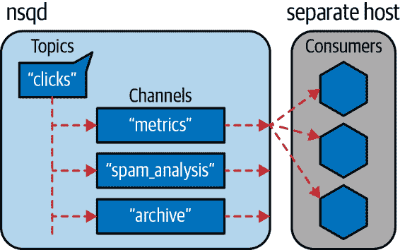
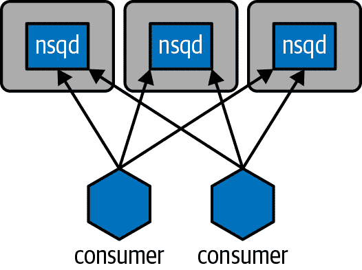

# 第十章：集群和作业队列

*集群*通常被认为是一组共同工作以解决共同任务的计算机的集合。从外部看，它可以被视为一个更大的单一系统。

在上世纪九十年代，使用本地区域网络上的廉价个人电脑集群进行集群处理的概念，即被称为[贝奥武夫集群](https://oreil.ly/2aNvw)，变得流行起来。后来，[Google](https://oreil.ly/V83g1)通过在自己的数据中心使用廉价个人电脑集群，特别是用于运行 MapReduce 任务，进一步推动了这一实践。在另一个极端，[TOP500 项目](https://oreil.ly/rHOQO)每年排名最强大的计算机系统；这些系统通常采用集群设计，而最快的机器都使用 Linux。

Amazon Web Services（AWS）通常用于在云中构建工程生产集群以及为机器学习等短期任务构建按需集群。通过 AWS，您可以租用从微型到大型机器，拥有 10 个 CPU 和高达 768 GB 的 RAM，每小时租金为 1 到 15 美元。可以额外支付租用多个 GPU。如果您想要探索 AWS 或其他提供商在计算密集或内存密集任务上的临时集群，可以查看“使用 IPython 并行支持研究”和 ElastiCluster 包。

不同的计算任务在集群中需要不同的配置、大小和功能。我们将在本章中定义一些常见场景。

在您转移到集群解决方案之前，请确保您已经完成了以下工作：

+   分析您的系统，以了解瓶颈

+   利用像 Numba 和 Cython 这样的编译器解决方案

+   利用单台机器上的多个核心（可能是一台具有多个核心的大型机器），使用 Joblib 或`multiprocessing`

+   利用技术来减少 RAM 使用

将系统保持在一台机器上可以让您的生活更加轻松（即使这台“一台机器”是一台配置非常强大、内存和 CPU 都很多的计算机）。如果您确实需要大量的 CPU 或者能够并行处理数据从磁盘读取的能力，或者您有高可靠性和快速响应的生产需求，请迁移到一个集群。大多数研究场景不需要弹性或可扩展性，并且仅限于少数人，因此通常最简单的解决方案是最明智的选择。

留在一个*大*机器上的好处是像 Dask 这样的工具可以快速并行化您的 Pandas 或纯 Python 代码，而无需网络复杂性。Dask 还可以控制一组机器以并行化处理 Pandas、NumPy 和纯 Python 问题。Swifter 通过在 Dask 上共享负载，自动并行化一些多核单机案例。我们稍后在本章介绍 Dask 和 Swifter 两者。

# 集群的好处

集群最明显的好处是您可以轻松扩展计算需求 — 如果您需要处理更多数据或更快地获得答案，只需添加更多机器（或*节点*）。

通过添加机器，您还可以提高可靠性。每台机器的组件有一定的故障可能性，但是通过良好的设计，多个组件的故障不会停止集群的运行。

集群还用于创建动态扩展的系统。一个常见的用例是将一组处理网络请求或相关数据的服务器集群化（例如，调整用户照片大小、转码视频或转录语音），并在一天中某些时间段内随着需求增加而激活更多的服务器。

动态扩展是处理非均匀使用模式的一种非常经济高效的方式，只要机器激活时间足够快以应对需求变化的速度。

###### 提示

考虑建立集群的投入与回报。虽然集群的并行化增益可能会令人心动，但请考虑与构建和维护集群相关的成本。它们非常适合生产环境中长时间运行的流程或明确定义且经常重复的研发任务。对于变量和短期的研发任务，它们则不那么吸引人。

集群的一个微妙的好处是，集群可以在地理上分开但仍然集中控制。如果一个地理区域遭受故障（例如洪水或停电），另一个集群可以继续工作，也许会增加更多处理单元来处理需求。集群还允许您运行异构软件环境（例如不同版本的操作系统和处理软件），这可能会提高整个系统的鲁棒性——但请注意，这绝对是一个高级话题！

# 集群的缺点

迁移到集群解决方案需要改变思维方式。这是从串行代码到并行代码所需的思维变革的进化，就像我们在第九章中介绍的那样。突然间，你不得不考虑当你有多台机器时会发生什么——你有机器之间的延迟，你需要知道你的其他机器是否在工作，并且你需要保持所有机器运行相同版本的软件。系统管理可能是你面临的最大挑战。

此外，通常你必须深思熟虑正在实施的算法，以及一旦所有这些额外的运动部分可能需要保持同步时会发生什么。这种额外的规划可能会带来沉重的心理负担；它很可能会让你分心，一旦系统变得足够大，你可能需要增加一个专门的工程师到你的团队中。

###### 注意

在本书中，我们尝试专注于有效使用一台计算机，因为我们认为只处理一台计算机比处理集合更容易（尽管我们承认玩集群可能会更有趣——直到它出问题为止）。如果您可以垂直扩展（购买更多的 RAM 或更多的 CPU），则值得调查这种方法是否优于集群。当然，您的处理需求可能超出了垂直扩展的可能性，或者集群的稳健性可能比拥有单一机器更重要。然而，如果您是一个单独的人在处理这个任务，也要记住运行一个集群将会占用您的一些时间。

当设计集群解决方案时，您需要记住每台机器的配置可能不同（每台机器的负载和本地数据都不同）。您如何将所有正确的数据传送到正在处理作业的机器上？将作业和数据移动涉及的延迟是否会成为问题？您的作业是否需要相互通信部分结果？如果一个进程失败或者一台机器故障，或者一些硬件在多个作业运行时自行清除，会发生什么情况？如果您不考虑这些问题，可能会引入故障。

您还应考虑到故障*可以被接受*的可能性。例如，当您运行基于内容的网络服务时，可能不需要 99.999%的可靠性——如果偶尔作业失败（例如，图片无法及时调整大小）并要求用户重新加载页面，那是每个人都已经习惯了的事情。这可能不是您想要给用户的解决方案，但通常接受一点失败可以显著降低工程和管理成本。另一方面，如果高频交易系统出现故障，糟糕的股市交易成本可能是可观的！

维护固定基础设施可能会变得昂贵。购买机器相对便宜，但它们有一个令人头痛的毛病——自动软件升级可能会出现故障，网络卡故障，磁盘写入错误，电源供应器可能提供干扰数据的尖峰电源，宇宙射线可能会在 RAM 模块中翻转位。您拥有的计算机越多，处理这些问题所需的时间就会越多。迟早您会想要引入一个能够处理这些问题的系统工程师，所以预算中要再增加$100,000。使用基于云的集群可以减少许多这些问题（成本更高，但无需处理硬件维护），一些云服务提供商还提供[按需市场定价](http://bit.ly/spot-instances)，用于获取便宜但临时的计算资源。

随着时间的推移，有机生长的集群中存在的一个阴险问题是，如果一切都关闭了，可能没有人记录如何安全地重新启动它。如果没有记录的重新启动计划，你应该假设在最糟糕的时候将不得不编写一个（我们的一位作者曾在圣诞前夕处理这种问题 —— 这可不是你想要的圣诞礼物！）。此时，你还将了解系统中每个部分启动需要多长时间 —— 每个集群部分可能需要几分钟来启动和处理作业，因此如果有 10 个部分依次操作，整个系统从冷启动到运行可能需要一个小时。其结果是你可能有一个小时的积压数据。那么你是否有必要的容量及时处理这些积压数据呢？

懈怠的行为可能导致昂贵的错误，复杂和难以预料的行为可能导致意外和昂贵的后果。让我们看看两个高调的集群故障，并学习其中的教训。

## 通过糟糕的集群升级策略导致的 462 亿美元华尔街损失

2012 年，高频交易公司 Knight Capital 在集群软件升级期间引入错误后，损失了 4.62 亿美元。软件下达了比客户要求的更多的股票订单。

在交易软件中，一个旧的标志被重新用于新的功能。升级已经在八台实时机器中的七台上推出，但第八台机器使用旧代码处理标志，导致交易错误。证券交易委员会（SEC）指出，Knight Capital 没有让第二位技术人员审查该升级，实际上也没有建立审查此类升级的流程。

这个根本性错误似乎有两个原因。第一个原因是软件开发过程没有移除一个已过时的特性，因此陈旧的代码仍然存在。第二个原因是没有设置手动审查流程来确认升级是否成功完成。

技术债务会增加一笔成本，最终必须付清 —— 最好在无压力的时候花时间清除债务。无论是构建还是重构代码，始终使用单元测试。在系统升级过程中缺乏书面检查清单和第二双眼睛，可能会导致昂贵的失败。飞行员在起飞前要按照清单逐项检查是有原因的：这意味着无论之前做过多少次，都不会漏掉重要步骤！

## Skype 全球 24 小时服务中断

Skype 在 2010 年经历了[24 小时全球范围内的故障](http://bit.ly/Skype_outage)。在幕后，Skype 由对等网络支持。系统的某一部分（用于处理离线即时消息）过载导致 Windows 客户端的响应延迟；某些版本的 Windows 客户端未能正确处理延迟响应而崩溃。总体而言，大约 40%的活跃客户端崩溃，包括 25%的公共超级节点。超级节点对网络中的数据路由至关重要。

路由的 25%离线（它后来恢复了，但速度很慢），整个网络处于极大的压力之下。崩溃的 Windows 客户端节点也在重新启动并尝试重新加入网络，给已经过载的系统增加了新的流量。如果超级节点承受过多负载，它们会采取后退程序，因此它们开始响应波浪式流量而关闭。

Skype 在整整 24 小时内大部分时间都无法使用。恢复过程首先涉及设置数百个新的“超级节点”，配置以处理增加的流量，然后继续设置数千个节点。在接下来的几天里，网络逐渐恢复正常。

这一事件给 Skype 带来了很多尴尬；显然，它也改变了焦点，几天内主要集中在损害控制上。客户被迫寻找语音通话的替代解决方案，这可能成为竞争对手的市场优势。

鉴于网络的复杂性和失败的升级，这次故障很可能难以预测和计划。网络上没有所有节点失败的原因是软件的不同版本和不同平台——拥有异构网络而不是同构系统有可靠性的好处。

# 常见的集群设计

常见的做法是从一个局域的临时集群开始，使用相对等价的机器。你可能会想知道是否可以将旧计算机添加到临时网络中，但通常旧的 CPU 消耗大量电力并且运行非常慢，因此与一台新的高规格机器相比，它们贡献的远不如你希望的那么多。办公室内的集群需要有人来维护。在[Amazon 的 EC2](http://aws.amazon.com/ec2)或[Microsoft 的 Azure](http://azure.microsoft.com/en-us)，或者由学术机构运行的集群，硬件支持交给了服务提供商的团队。

如果你已经理解了处理需求，设计一个定制集群可能是明智的选择——也许使用 InfiniBand 高速互联代替千兆以太网，或者使用支持你的读写或容错要求的特定配置 RAID 驱动器。你可能希望在一些机器上结合 CPU 和 GPU，或者只是默认使用 CPU。

您可能需要一个像*SETI@home*和*Folding@home*项目使用的大规模分散处理集群，通过[伯克利开放网络计算基础设施（BOINC）系统](https://oreil.ly/jNCA9)共享集中协调系统，但计算节点以临时方式加入和退出项目。

在硬件设计之上，您可以运行不同的软件架构。工作队列是最常见且最容易理解的。通常，作业被放入队列并由处理器消耗。处理的结果可能会进入另一个队列进行进一步处理，或者作为最终结果使用（例如，添加到数据库中）。消息传递系统略有不同——消息被放入消息总线，然后被其他机器消耗。消息可能会超时并被删除，并且可能会被多个机器消耗。在更复杂的系统中，进程通过进程间通信相互交流——这可以被认为是专家级别的配置，因为有很多方法可以设置得很糟糕，这将导致您失去理智。只有当您确实知道需要它时，才可以选择使用 IPC 路线。

# 如何启动一个集群解决方案

启动集群系统的最简单方法是从一个机器开始，该机器将同时运行作业服务器和作业处理器（每个 CPU 只有一个作业处理器）。如果您的任务是 CPU 绑定的，请为每个 CPU 运行一个作业处理器；如果任务是 I/O 绑定的，请为每个 CPU 运行多个作业处理器。如果它们受 RAM 限制，请小心不要用完 RAM。让您的单机解决方案使用一个处理器运行，并逐步增加更多处理器。通过不可预测的方式使您的代码失败（例如，在您的代码中执行`1/0`，在您的工作进程上使用`kill -9 <pid>`，从插座上拔下电源插头，使整个机器死机），以检查您的系统是否健壮。

显然，您需要进行比这更严格的测试——一个充满编码错误和人为异常的单元测试套件很好。Ian 喜欢引入意外事件，例如让一个处理器运行一组作业，同时一个外部进程正在系统地终止重要进程，并确认所有这些进程都能被使用的监控进程干净地重新启动。

一旦您有一个正在运行的作业处理器，添加第二个。检查您是否没有使用太多 RAM。您处理作业的速度是否比以前快两倍？

现在引入第二台机器，该新机器上只有一个作业处理器，并且协调机器上没有作业处理器。它处理作业的速度是否与您在协调机器上有处理器时一样快？如果不是，为什么？延迟是否是问题？您是否有不同的配置？也许您有不同的机器硬件，如 CPU、RAM 和缓存大小？

现在再添加另外九台计算机，并测试看看你是否比以前处理作业快 10 倍。如果没有，为什么？是不是现在出现了网络冲突，导致整体处理速度变慢？

为了在机器启动时可靠地启动集群的组件，我们倾向于使用`cron`任务，[Circus](https://oreil.ly/MCUOQ)，或者[`supervisord`](http://supervisord.org)。Circus 和`supervisord`都是基于 Python 并且已经存在多年。`cron`虽然老旧，但如果你只是启动像监控进程这样的脚本，它非常可靠，可以根据需要启动子进程。

一旦你拥有一个可靠的集群，你可能想引入像 Netflix 的[Chaos Monkey](https://oreil.ly/sL5nG)这样的随机杀手工具，它故意杀死系统的一部分来测试其弹性。你的进程和硬件最终会失败，了解你可能至少能够幸存你预测可能发生的错误，这不会伤害。

# 在使用集群时避免痛苦的方法

在伊恩经历的一个特别痛苦的经历中，集群系统中一系列队列停顿了。后续队列未被消费，因此它们堆积起来。一些机器的 RAM 用尽，导致它们的进程死亡。先前的队列正在处理，但无法将结果传递给下一个队列，因此它们崩溃了。最终，第一个队列被填充但未被消费，因此它崩溃了。之后，我们为供应商的数据付费，最终被丢弃。你必须勾勒一些注意事项，考虑你的集群可能会死亡的各种方式，以及发生时会发生什么（不是*如果*）。你会丢失数据（这是一个问题吗）？你会有一个太痛苦无法处理的大后台任务吗？

拥有一个易于调试的系统*可能*比拥有一个更快的系统更重要。工程时间和停机成本*可能*是你最大的开支（如果你在运行导弹防御程序，这就不是真的，但对于初创公司来说可能是真的）。与其通过使用低级压缩的二进制协议来节省几个字节，不如在传递消息时考虑使用 JSON 中的人类可读文本。这确实会增加发送和解码消息的开销，但当核心计算机着火后，你留下的部分数据库能够快速阅读重要消息时，你会庆幸能够迅速将系统恢复在线。

确保在时间和金钱上廉价地部署系统更新——无论是操作系统更新还是软件的新版本。每当集群中的任何变化发生时，如果处于分裂状态，系统就有可能以奇怪的方式响应。确保使用像[Fabric](http://www.fabfile.org)，[Salt](https://oreil.ly/esyVt)，[Chef](http://www.getchef.com)或[Puppet](http://puppetlabs.com)这样的部署系统，或者像 Debian 的*.deb*，RedHat 的*.rpm*，或[Amazon Machine Image](https://oreil.ly/5eLt4)这样的系统映像。能够强大地部署一个更新并升级整个集群（并报告任何发现的问题）大大减轻了在困难时期的压力。

积极的报告很有用。每天给某人发送一封电子邮件，详细说明集群的性能。如果这封电子邮件没有送达，那是某事发生的有用线索。你可能还希望有其他更快通知你的早期警报系统；[Pingdom](https://www.pingdom.com)和[Server Density](https://www.serverdensity.com)在这方面尤为有用。一个反应于事件缺失的“死人开关”（例如，[Dead Man’s Switch](http://www.deadmansswitch.net)）是另一个有用的备份。

向团队报告集群健康情况非常有用。这可能是一个 Web 应用程序内的管理页面，或者一个单独的报告。[Ganglia](http://ganglia.sourceforge.net)在这方面非常棒。Ian 看到过一个类似*星际迷航* LCARS 界面的界面在办公室的一个备用 PC 上运行，当检测到问题时会播放“红色警报”声音——这对引起整个办公室的注意特别有效。我们甚至看到 Arduinos 驱动像老式锅炉压力表这样的模拟仪器（当指针移动时发出漂亮的声音！）显示系统负载。这种报告非常重要，以便每个人都明白“正常”和“可能会毁了我们周五晚上”的区别。

# 两种聚类解决方案

在本节中，我们介绍 IPython Parallel 和 NSQ。

IPython 集群在一台具有多个核心的机器上易于使用。由于许多研究人员将 IPython 作为他们的 shell 或通过 Jupyter Notebooks 工作，自然也会用它来进行并行作业控制。构建一个集群需要一些系统管理知识。使用 IPython Parallel 的一个巨大优势是，你可以像使用本地集群一样轻松地使用远程集群（例如亚马逊的 AWS 和 EC2）。

NSQ 是一个成熟的队列系统。它具有持久性（因此如果机器死机，作业可以由另一台机器继续进行）和强大的可伸缩机制。随着这种更强大的功能，对系统管理和工程技能的需求稍微增加。然而，NSQ 在其简单性和易用性方面表现出色。虽然存在许多排队系统（如流行的[Kafka](https://kafka.apache.org)），但没有一个像 NSQ 那样具有如此低的准入门槛。

## 使用 IPython Parallel 支持研究

IPython 集群支持通过 [IPython 并行](https://oreil.ly/SAV5i) 项目实现。IPython 成为本地和远程处理引擎的接口，数据可以在引擎之间传递，作业可以推送到远程机器。远程调试是可能的，消息传递接口（MPI）也是可选支持的。这种相同的 ZeroMQ 通信机制支持 Jupyter Notebook 接口。

这对于研究环境非常有用——您可以将作业推送到本地集群中的机器，如果有问题，可以进行交互式调试，将数据推送到机器上，并收集结果，所有这些都是交互式的。请注意，PyPy 运行 IPython 和 IPython 并行。结合起来可能非常强大（如果您不使用 `numpy`）。

在幕后，ZeroMQ 被用作消息中间件——请注意，ZeroMQ 的设计不提供安全性。如果您在本地网络上构建一个集群，可以避免 SSH 认证。如果您需要安全性，SSH 完全支持，但它使配置变得有点复杂——从一个本地可信网络开始，并随着学习每个组件的工作方式而逐步构建。

该项目分为四个组件。*引擎*是 IPython 内核的扩展；它是一个同步的 Python 解释器，用于运行你的代码。您将运行一组引擎以启用并行计算。*控制器*提供了一个与引擎的接口；它负责工作分配并提供了一个*直接*接口和一个*负载平衡*接口，该接口提供了一个工作调度器。*中心*跟踪引擎、调度器和客户端。*调度器*隐藏了引擎的同步性质并提供了一个异步接口。

在笔记本电脑上，我们使用 `ipcluster start -n 4` 启动了四个引擎。在 示例 10-1 中，我们启动了 IPython 并检查本地 `Client` 是否能够看到我们的四个本地引擎。我们可以使用 `c[:]` 来访问所有四个引擎，并且我们将一个函数应用到每个引擎上——`apply_sync` 接受一个可调用对象，因此我们提供了一个不带参数的`lambda`，它将返回一个字符串。我们的四个本地引擎中的每一个都会运行这些函数，返回相同的结果。

##### 示例 10-1\. 测试我们是否能够在 IPython 中看到本地引擎

```py
In [1]: import ipyparallel as ipp

In [2]: c = ipp.Client()

In [3]: print(c.ids)
[0, 1, 2, 3]

In [4]: c[:].apply_sync(lambda: "Hello High Performance Pythonistas!")
Out[4]:
['Hello High Performance Pythonistas!',
 'Hello High Performance Pythonistas!',
 'Hello High Performance Pythonistas!',
 'Hello High Performance Pythonistas!']
```

我们构建的引擎现在处于空状态。如果我们在本地导入模块，它们不会被导入到远程引擎中。

一种干净的方式来进行本地和远程导入是使用 `sync_imports` 上下文管理器。在 示例 10-2 中，我们将在本地 IPython 和四个连接的引擎上都`import os`，然后再次在这四个引擎上调用`apply_sync`来获取它们的 PID。

如果我们没有进行远程导入，我们将会得到一个 `NameError`，因为远程引擎不会知道 `os` 模块。我们也可以使用 `execute` 在引擎上远程运行任何 Python 命令。

##### 示例 10-2\. 将模块导入到我们的远程引擎中

```py
In [5]: dview=c[:]  # this is a direct view (not a load-balanced view)

In [6]: with dview.sync_imports():
   ....:     import os
   ....:
importing os on engine(s)

In [7]: dview.apply_sync(lambda:os.getpid())
Out[7]: [16158, 16159, 16160, 16163]

In [8]: dview.execute("import sys")  # another way to execute commands remotely
```

您将希望将数据推送到引擎。在 示例 10-3 中展示的 `push` 命令允许您发送一个字典项，这些项会添加到每个引擎的全局命名空间中。有一个对应的 `pull` 命令用于检索项目：您给它键，它会返回每个引擎对应的值。

##### 示例 10-3\. 将共享数据推送到引擎

```py
In [9]: dview.push({'shared_data':[50, 100]})
Out[9]: <AsyncResult: _push>

In [10]: dview.apply_sync(lambda:len(shared_data))
Out[10]: [2, 2, 2, 2]
```

在 示例 10-4 中，我们使用这四个引擎来估算圆周率。这次我们使用 `@require` 装饰器在引擎中导入 `random` 模块。我们使用直接视图将工作发送到引擎；这会阻塞直到所有结果返回。然后我们像 示例 9-1 中那样估算圆周率。

##### 示例 10-4\. 使用我们的本地集群估算圆周率

```py
import time
import ipyparallel as ipp
from ipyparallel import require

@require('random')
def estimate_nbr_points_in_quarter_circle(nbr_estimates):
    ...
    return nbr_trials_in_quarter_unit_circle

if __name__ == "__main__":
    c = ipp.Client()
    nbr_engines = len(c.ids)
    print("We're using {} engines".format(nbr_engines))
    nbr_samples_in_total = 1e8
    nbr_parallel_blocks = 4

    dview = c[:]

    nbr_samples_per_worker = nbr_samples_in_total / nbr_parallel_blocks
    t1 = time.time()
    nbr_in_quarter_unit_circles = \

	     dview.apply_sync(estimate_nbr_points_in_quarter_circle,
                         nbr_samples_per_worker)
    print("Estimates made:", nbr_in_quarter_unit_circles)

    nbr_jobs = len(nbr_in_quarter_unit_circles)
    pi_estimate = sum(nbr_in_quarter_unit_circles) * 4 / nbr_samples_in_total
    print("Estimated pi", pi_estimate)
    print("Delta:", time.time() - t1)
```

在 示例 10-5 中，我们在我们的四个本地引擎上运行这个。如同 图 9-5 中所示，这在笔记本电脑上大约需要 20 秒。

##### 示例 10-5\. 在 IPython 中使用我们的本地集群估算圆周率

```py
In [1]: %run pi_ipython_cluster.py
We're using 4 engines
Estimates made: [19636752, 19634225, 19635101, 19638841]
Estimated pi 3.14179676
Delta: 20.68650197982788
```

IPython Parallel 提供的远不止这里展示的功能。当然，还支持异步作业和在更大输入范围上的映射。支持 MPI，可以提供高效的数据共享。在 “用 Joblib 替换多处理” 中介绍的 Joblib 库可以与 IPython Parallel 一起作为后端使用，以及 Dask（我们在 “使用 Dask 进行并行 Pandas” 中介绍）。

IPython Parallel 的一个特别强大的功能是允许您使用更大的集群环境，包括超级计算机和云服务，如亚马逊的 EC2\. [ElastiCluster 项目](https://elasticluster.readthedocs.io) 支持常见的并行环境，如 IPython，以及包括 AWS、Azure 和 OpenStack 在内的部署目标。

## 使用 Dask 进行并行 Pandas

Dask 的目标是提供一套从笔记本上的单个核心到多核机器再到集群中数千个核心的并行化解决方案。把它想象成“Apache Spark 的精简版”。如果您不需要 Apache Spark 的所有功能（包括复制写入和多机故障转移），并且不想支持第二个计算和存储环境，那么 Dask 可能提供您所需要的并行化和大于内存解决方案。

为了延迟评估多种计算场景，包括纯 Python、科学 Python 和使用小、中、大数据集的机器学习，构建了一个任务图：

Bag

`bag` 可以对非结构化和半结构化数据进行并行计算，包括文本文件、JSON 或用户定义的对象。支持对通用 Python 对象进行 `map`、`filter` 和 `groupby` 操作，包括列表和集合。

数组

`array` 能够进行分布式和大于 RAM 的 `numpy` 操作。支持许多常见操作，包括一些线性代数函数。不支持跨核心效率低下的操作（例如排序和许多线性代数操作）。使用线程，因为 NumPy 具有良好的线程支持，所以在并行化操作期间无需复制数据。

分布式数据框

`dataframe` 能够进行分布式和大于 RAM 的 `Pandas` 操作；在幕后，Pandas 用于表示使用其索引分区的部分数据框。操作使用 `.compute()` 惰性计算，并且在其他方面与其 Pandas 对应物非常相似。支持的函数包括 `groupby-aggregate`、`groupby-apply`、`value_counts`、`drop_duplicates` 和 `merge`。默认情况下使用线程，但由于 Pandas 比 NumPy 更受 GIL 限制，您可能需要查看进程或分布式调度器选项。

Delayed

`delayed` 扩展了我们在 “Replacing multiprocessing with Joblib” 中介绍的与 Joblib 类似的思想，以惰性方式并行化任意 Python 函数链。`visualize()` 函数将绘制任务图来帮助诊断问题。

Futures

`Client` 接口支持即时执行和任务演变，与 `delayed` 不同，后者是惰性的，不允许像添加或销毁任务这样的操作。`Future` 接口包括 `Queue` 和 `Lock`，以支持任务协作。

Dask-ML

提供了类似于 scikit-learn 的接口以进行可扩展的机器学习。Dask-ML 为一些 scikit-learn 算法提供了集群支持，并且使用 Dask 重新实现了一些算法（例如 `linear_model` 集）以便在大数据上进行学习。它缩小了与 Apache Spark 分布式机器学习工具包之间的差距。还提供了支持 XGBoost 和 TensorFlow 在 Dask 集群中使用的功能。

对于 Pandas 用户，Dask 可以帮助解决两个用例：大于 RAM 的数据集和多核并行化的需求。

如果你的数据集比 Pandas 能够装入 RAM 的还要大，Dask 可以将数据集按行分割成一组分区数据框，称为 *分布式数据框*。这些数据框按其索引分割；可以在每个分区上执行一部分操作。例如，如果你有一组多 GB 的 CSV 文件，并且想要在所有文件上计算 `value_counts`，Dask 将在每个数据框（每个文件一个）上执行部分 `value_counts`，然后将结果合并为单一的计数集。

第二个用例是利用笔记本电脑上的多个核心（以及同样容易地在集群中使用）；我们将在这里研究这个用例。回想一下，在 Example 6-24 中，我们用不同的方法计算了数据框中值行的线斜率。让我们使用两种最快的方法，并使用 Dask 进行并行化。

###### 提示

您可以使用 Dask（以及下一节讨论的 Swifter）并行化任何无副作用的函数，通常在`apply`调用中使用。Ian 已经为大型 DataFrame 中的数字计算和计算文本列的多个文本度量执行了此操作。

使用 Dask 时，我们必须指定要从 DataFrame 中创建的*分区*数量；一个经验法则是至少使用与核心数相同的分区，以便每个核心都可以被使用。在 Example 10-6 中，我们请求了八个分区。我们使用`dd.from_pandas`将常规的 Pandas DataFrame 转换为一个 Dask 分布式 DataFrame，分为八个大小相等的部分。

我们在分布式 DataFrame 上调用熟悉的`ddf.apply`，指定我们的函数`ols_lstsq`和通过`meta`参数指定的可选的预期返回类型。Dask 要求我们使用`compute()`调用指定计算应该何时应用；在这里，我们指定使用`processes`而不是默认的`threads`来将工作分布到多个核心上，避免 Python 的 GIL。

##### Example 10-6\. 使用 Dask 在多个核心上计算线斜率

```py
import dask.dataframe as dd

N_PARTITIONS = 8
ddf = dd.from_pandas(df, npartitions=N_PARTITIONS, sort=False)
SCHEDULER = "processes"

results = ddf.apply(ols_lstsq, axis=1, meta=(None, 'float64',)). \
              compute(scheduler=SCHEDULER)
```

在 Ian 的笔记本电脑上，使用相同的八个分区（在四个核心和四个超线程的条件下）运行`ols_lstsq_raw`，从之前单线程的`apply`结果的 6.8 秒提高到 1.5 秒，速度几乎提升了 5 倍。

##### Example 10-7\. 使用 Dask 在多个核心上计算线斜率

```py
results = ddf.apply(ols_lstsq_raw, axis=1, meta=(None, 'float64',), raw=True). \
              compute(scheduler=SCHEDULER)
```

使用相同的八个分区运行`ols_lstsq_raw`，将我们从之前使用`raw=True`单线程`apply`结果的 5.3 秒提高到 1.2 秒，速度几乎提升了 5 倍。

如果我们还使用从“Numba to Compile NumPy for Pandas”中编译的 Numba 函数并使用`raw=True`，我们的运行时间从 0.58 秒降低到 0.3 秒，进一步提速了 2 倍。使用 Numba 在 Pandas DataFrame 上使用 NumPy 数组编译的函数非常适合与 Dask 配合使用，而且付出的努力很少。

### 在 Dask 上使用 Swifter 进行并行应用

[Swifter](https://oreil.ly/1SOcL)基于 Dask 提供了三个并行选项，只需简单的调用—`apply`、`resample`和`rolling`。在幕后，它会对 DataFrame 的子样本进行采样，并尝试向量化函数调用。如果成功，Swifter 将应用它；如果成功但速度慢，Swifter 将使用 Dask 在多个核心上运行它。

由于 Swifter 使用启发式方法确定如何运行您的代码，因此它可能比根本不使用它运行得慢，但尝试的“成本”仅为一行努力。评估它是非常值得的。

Swifter 根据 Dask 决定使用多少个核心以及对其评估进行采样的行数；因此，在 Example 10-8 中，我们看到对`df.swifter...apply()`的调用看起来就像对`df.apply`的常规调用。在这种情况下，我们已禁用进度条；在使用优秀的`tqdm`库的 Jupyter Notebook 中，进度条可以正常工作。

##### 示例 10-8\. 使用 Dask 使用多核计算线斜率

```py
import swifter

results = df.swifter.progress_bar(False).apply(ols_lstsq_raw, axis=1, raw=True)
```

使用 `ols_lstsq_raw` 和没有分区选择的 Swifter，将我们之前的单线程结果从 5.3 秒降低到 1.6 秒。对于这个特定的函数和数据集，这并不像我们刚刚看过的稍长的 Dask 解决方案那样快，但它确实只用了一行代码就提供了 3 倍的加速。对于不同的函数和数据集，你将会看到不同的结果；进行实验看看是否可以获得非常容易的成功。

### 用于大于 RAM 的 DataFrame 的 Vaex

[Vaex](https://vaex.io) 是一个令人感兴趣的新库，提供了类似于 Pandas DataFrame 的结构，内置支持大于 RAM 的计算。它将 Pandas 和 Dask 的功能整合到一个单独的包中。

Vaex 使用惰性计算来按需计算列结果；它将仅计算用户需要的行子集。例如，如果你要求在两列之间的十亿行上进行求和，并且你只要求结果的*样本*，Vaex 将仅触及那个样本的数据，不会计算所有未被抽样行的总和。对于交互式工作和基于可视化的探索，这可能非常高效。

Pandas 对字符串的支持来自于 CPython；它受到 GIL 的限制，并且字符串对象是散布在内存中的较大对象，不支持矢量化操作。Vaex 使用自己的自定义字符串库，这使得基于字符串的操作速度显著提高，并具有类似 Pandas 的界面。

如果你正在处理字符串密集的 DataFrame 或大于 RAM 的数据集，Vaex 是一个显而易见的评估选择。如果你通常在 DataFrame 的子集上工作，隐式的惰性评估可能会使你的工作流程比将 Dask 添加到 Pandas DataFrame 更简单。

# 用于稳健生产聚类的 NSQ

在生产环境中，你将需要比我们到目前为止谈论过的其他解决方案更健壮的解决方案。这是因为在集群的日常运行过程中，节点可能变得不可用，代码可能崩溃，网络可能中断，或者其他可能发生的成千上万的问题可能发生。问题在于，所有先前的系统都有一个发出命令的计算机，以及一定数量的读取命令并执行它们的计算机。相反，我们希望有一个可以通过消息总线进行多个参与者通信的系统——这将允许我们有任意数量且不断变化的消息创建者和消费者。

一个解决这些问题的简单方法是[NSQ](https://github.com/nsqio/nsq)，一个高性能的分布式消息平台。尽管它是用 GO 语言编写的，但完全是数据格式和语言无关的。因此，有许多语言的库，并且进入 NSQ 的基本接口是一个只需能够进行 HTTP 调用的 REST API。此外，我们可以以任何格式发送消息：JSON，Pickle，`msgpack`等等。然而最重要的是，它提供了关于消息传递的基本保证，并且所有这些都是使用两种简单的设计模式完成的：队列和发布/订阅。

###### 注意

我们选择 NSQ 来讨论，因为它易于使用并且通常表现良好。对于我们的目的而言，最重要的是，它清楚地突显了在考虑在集群中排队和传递消息时必须考虑的因素。然而，其他解决方案如 ZeroMQ，Amazon 的 SQS，Celery，甚至 Redis 可能更适合您的应用程序。

## 队列

*队列* 是一种消息的缓冲区。每当您想将消息发送到处理管道的另一部分时，您将其发送到队列中，并且它将在那里等待，直到有可用的工作进程。当生产和消费之间存在不平衡时，队列在分布式处理中最为有用。当出现这种不平衡时，我们可以简单地通过增加更多的数据消费者来进行水平扩展，直到消息的生产速率和消费速率相等。此外，如果负责消费消息的计算机出现故障，则消息不会丢失，而是简单地排队，直到有消费者可用，从而为我们提供消息传递的保证。

例如，假设我们希望每当用户在我们的网站上对新项目进行评分时处理新的推荐。如果没有队列，"rate"操作将直接调用"recalculate-recommendations"操作，而不管处理推荐的服务器有多忙。如果突然间有成千上万的用户决定对某物品进行评分，我们的推荐服务器可能会被请求淹没，它们可能会开始超时，丢失消息，并且通常变得无响应！

另一方面，有了队列，推荐服务器在准备好时会请求更多的任务。新的"rate"操作会将新任务放入队列中，当推荐服务器准备好执行更多工作时，它将从队列中获取任务并处理它。在这种设置中，如果比正常情况下更多的用户开始对项目进行评分，我们的队列会填满并充当推荐服务器的缓冲区——它们的工作负载不会受影响，它们仍然可以处理消息，直到队列为空。

这种方式的一个潜在问题是，如果一个队列被工作完全压倒，它将会存储大量消息。NSQ 通过具有多个存储后端来解决这个问题 —— 当消息不多时，它们存储在内存中，随着更多消息的到来，消息被放置到磁盘上。

###### 注意

一般来说，在处理排队系统时，最好尝试使下游系统（例如上面示例中的推荐系统）在正常工作负载下处于 60%的容量。这是在为问题分配过多资源和确保服务器有足够的额外能力以处理超出正常工作量的情况之间的一个很好的折衷方案。

## 发布/订阅

另一方面，*发布/订阅*（简称*发布者/订阅者*）描述了谁会接收到什么消息。数据发布者可以从特定主题推送数据，数据订阅者可以订阅不同的数据源。每当发布者发布一条信息时，它被发送给所有订阅者 —— 每个订阅者都会得到原始信息的相同副本。你可以把它想象成报纸：很多人可以订阅同一份报纸，每当新版报纸出来时，每个订阅者都会得到相同的副本。此外，报纸的生产者不需要知道它的报纸被发送给了所有订阅者。因此，发布者和订阅者在系统中是解耦的，这使得我们的系统在网络变化时仍然可以保持更加健壮的生产状态。

此外，NSQ 还引入了*数据消费者*的概念；也就是说，可以将多个进程连接到同一个数据订阅中。每当新的数据出现时，每个订阅者都会收到数据的一份副本；然而，每个订阅的消费者只会看到这些数据中的一部分。在报纸的类比中，可以将其想象为同一户中有多个人在读同一份报纸。出版者会将一份报纸送到这户人家，因为这户只有一个订阅，那么谁先看到就可以阅读该数据。每个订阅的消费者在看到消息时会进行相同的处理；然而，它们可能位于多台计算机上，从而为整个池增加了更多的处理能力。

我们可以在图 10-1 中看到这种发布/订阅/消费者范式的描绘。如果在“clicks”主题上发布了新消息，所有订阅者（或者在 NSQ 术语中，*通道* —例如，“metrics”，“spam_analysis”，和“archive”）将会收到一份副本。每个订阅者由一个或多个消费者组成，代表实际处理消息的进程。在“metrics”订阅者的情况下，只有一个消费者会看到新消息。接下来的消息将传递给另一个消费者，依此类推。



###### 图 10-1\. NSQ 的发布/订阅式拓扑结构

将消息分散到可能的大量消费者之间的好处在于自动负载均衡。如果一个消息需要很长时间来处理，那么该消费者在完成之前不会向 NSQ 发出已准备好接收更多消息的信号，因此其他消费者将获得未来大部分的消息（直到原始消费者再次准备好处理）。此外，它允许现有的消费者断开连接（无论是自愿还是由于故障），并允许新的消费者连接到集群，同时仍然在特定订阅组内保持处理能力。例如，如果我们发现“指标”需要相当长的时间来处理，并且通常无法满足需求，我们可以简单地为该订阅组的消费者池添加更多进程，从而为我们提供更多的处理能力。另一方面，如果我们看到大多数进程处于空闲状态（即，没有收到任何消息），我们可以轻松地从此订阅池中删除消费者。

还需注意的是，任何东西都可以发布数据。消费者不仅仅需要是消费者，它可以从一个主题消费数据，然后将其发布到另一个主题。实际上，这种链条在涉及分布式计算范式时是一个重要的工作流程。消费者将从一个数据主题中读取数据，以某种方式转换数据，然后将数据发布到其他消费者可以进一步转换的新主题上。通过这种方式，不同的主题代表不同的数据，订阅组代表对数据的不同转换，而消费者则是实际转换个别消息的工作者。

此外，该系统提供了令人难以置信的冗余性。每个消费者连接的可能有许多 `nsqd` 进程，并且可能有许多消费者连接到特定的订阅。这样，即使出现多台机器消失，也不会存在单点故障，您的系统将是健壮的。我们可以在图 10-2 中看到，即使图中的计算机之一宕机，系统仍能够交付和处理消息。此外，由于 NSQ 在关闭时将待处理消息保存到磁盘上，除非硬件丢失是灾难性的，否则您的数据很可能仍然完好无损并得到交付。最后，如果消费者在回复特定消息之前关闭，NSQ 将将该消息重新发送给另一个消费者。这意味着即使消费者被关闭，我们也知道所有主题中的所有消息至少会被响应一次。¹



###### 图 10-2\. NSQ 连接拓扑

## 分布式素数计算

使用 NSQ 的代码通常是异步的（详见 Chapter 8 进行完整的解释），尽管并不一定必须是。² 在下面的例子中，我们将创建一个工作池，从一个名为 *numbers* 的主题中读取消息，这些消息只是简单的包含数字的 JSON。消费者将读取此主题，查找这些数字是否为质数，然后根据数字是否为质数将其写入另一个主题。这将给我们带来两个新主题，*prime* 和 *non_prime*，其他消费者可以连接到这些主题以进行更多计算。³

###### 注意

`pynsq`（最后发布于 2018 年 11 月 11 日）依赖于一个非常过时的 `tornado` 版本（4.5.3，于 2018 年 1 月 6 日发布）。这是 Docker 的一个很好的使用案例（在 “Docker” 中讨论）。

如前所述，像这样进行 CPU 绑定工作有很多好处。首先，我们拥有所有健壮性的保证，这对这个项目可能有用，也可能没用。然而更重要的是，我们获得了自动负载平衡。这意味着，如果一个消费者得到一个需要很长时间来处理的数字，其他消费者会填补空缺。

我们创建一个消费者，通过指定主题和订阅组来创建一个 `nsq.Reader` 对象（如在 Example 10-9 的最后部分可以看到）。我们还必须指定运行中的 `nsqd` 实例的位置（或者 `nsqlookupd` 实例，在本节中我们不会深入讨论）。此外，我们还必须指定一个 *handler*，这只是一个用于处理从主题接收到的每条消息的函数。为了创建一个生产者，我们创建一个 `nsq.Writer` 对象，并指定一个或多个要写入的 `nsqd` 实例的位置。这使我们能够通过指定主题名称和消息来写入到 `nsq`。

##### 示例 10-9\. 使用 NSQ 进行分布式质数计算

```py
import json
from functools import partial
from math import sqrt

import nsq

def is_prime(number):
    if number % 2 == 0:
        return False
    for i in range(3, int(sqrt(number)) + 1, 2):
        if number % i == 0:
            return False
    return True

def write_message(topic, data, writer):
    response = writer.pub(topic, data)
    if isinstance(response, nsq.Error):
        print("Error with Message: {}: {}".format(data, response))
        return write_message(data, writer)
    else:
        print("Published Message: ", data)

def calculate_prime(message, writer):
    data = json.loads(message.body)

    prime = is_prime(data["number"])
    data["prime"] = prime
    if prime:
        topic = "prime"
    else:
        topic = "non_prime"

    output_message = json.dumps(data).encode("utf8")
    write_message(topic, output_message, writer)
    message.finish()  

if __name__ == "__main__":
    writer = nsq.Writer(["127.0.0.1:4150"])
    handler = partial(calculate_prime, writer=writer)
    reader = nsq.Reader(
        message_handler=handler,
        nsqd_tcp_addresses=["127.0.0.1:4150"],
        topic="numbers",
        channel="worker_group_a",
    )
    nsq.run()
```


当我们处理完一条消息时，我们必须通知 NSQ。这将确保在失败时消息不会重新传递给另一个读者。

###### 注意

我们可以通过在消息接收后在消息处理程序中启用 `message.enable_async()` 来异步处理消息。但是请注意，NSQ 使用较旧的回调机制与 `tornado` 的 IOLoop（在 `tornado` 中讨论）。

要设置 NSQ 生态系统，在我们的本地机器上启动一个 `nsqd` 实例：⁵

```py
$ nsqd
[nsqd] 2020/01/25 13:36:39.333097 INFO: nsqd v1.2.0 (built w/go1.12.9)
[nsqd] 2020/01/25 13:36:39.333141 INFO: ID: 235
[nsqd] 2020/01/25 13:36:39.333352 INFO: NSQ: persisting topic/channel metadata
                                             to nsqd.dat
[nsqd] 2020/01/25 13:36:39.340583 INFO: TCP: listening on [::]:4150
[nsqd] 2020/01/25 13:36:39.340630 INFO: HTTP: listening on [::]:4151
```

现在我们可以启动尽可能多的 Python 代码实例（Example 10-9）。事实上，我们可以让这些实例在其他计算机上运行，只要 `nsqd_tcp_address` 在 `nsq.Reader` 实例化中的引用仍然有效。这些消费者将连接到 `nsqd` 并等待在 *numbers* 主题上发布的消息。

数据可以通过多种方式发布到*numbers*主题。我们将使用命令行工具来完成这个任务，因为了解如何操作系统对于正确处理它至关重要。我们可以简单地使用 HTTP 接口将消息发布到主题：

```py
$ for i in `seq 10000`
> do
>   echo {\"number\": $i} | curl -d@- "http://127.0.0.1:4151/pub?topic=numbers"
> done
```

当此命令开始运行时，我们正在向*numbers*主题中发布包含不同数字的消息。与此同时，我们所有的生产者将开始输出状态消息，指示它们已经看到并处理了消息。此外，这些数字正在发布到*prime*或*non_prime*主题中的一个。这使我们能够有其他数据消费者连接到这些主题中的任何一个来获取原始数据的过滤子集。例如，只需要质数的应用程序可以简单地连接到*prime*主题，并不断地获得其计算所需的新质数。我们可以使用`nsqd`的`stats`HTTP 端点来查看我们的计算状态：

```py
$ curl "http://127.0.0.1:4151/stats"
nsqd v1.2.0 (built w/go1.12.9)
start_time 2020-01-25T14:16:35Z
uptime 26.087839544s

Health: OK

Memory:
   heap_objects                 25973
   heap_idle_bytes              61399040
   heap_in_use_bytes            4661248
   heap_released_bytes          0
   gc_pause_usec_100            43
   gc_pause_usec_99             43
   gc_pause_usec_95             43
   next_gc_bytes                4194304
   gc_total_runs                6

Topics:
   [non_prime      ] depth: 902   be-depth: 0     msgs: 902      e2e%:

   [numbers        ] depth: 0     be-depth: 0     msgs: 3009     e2e%:
      [worker_group_a           ] depth: 1926  be-depth: 0     inflt: 1
                                  def: 0    re-q: 0     timeout: 0
                                  msgs: 3009     e2e%:
        [V2 electron             ] state: 3 inflt: 1    rdy: 1    fin: 1082
                                   re-q: 0    msgs: 1083     connected: 15s

   [prime          ] depth: 180   be-depth: 0     msgs: 180      e2e%:

Producers:
   [V2 electron             ] msgs: 1082     connected: 15s
      [prime          ] msgs: 180
      [non_prime      ] msgs: 902

```

我们可以看到*numbers*主题有一个订阅组，*worker_group_a*，有一个消费者。此外，订阅组有一个很大的深度，有 1,926 条消息，这意味着我们正在将消息放入 NSQ 的速度比我们处理它们的速度快。这将提示我们增加更多的消费者，以便我们有更多的处理能力来处理更多的消息。此外，我们可以看到此特定消费者已连接了 15 秒，已处理了 1,083 条消息，并且当前有 1 条消息正在传输中。此状态端点为调试您的 NSQ 设置提供了相当多的信息！最后，我们看到*prime*和*non_prime*主题，它们没有订阅者或消费者。这意味着消息将被存储，直到有订阅者请求数据为止。

###### 注意

在生产系统中，您可以使用更强大的工具`nsqadmin`，它提供了一个具有非常详细的所有主题/订阅者和消费者概览的 Web 界面。此外，它允许您轻松地暂停和删除订阅者和主题。

要实际看到消息，我们将为*prime*（或*non_prime*）主题创建一个新的消费者，简单地将结果存档到文件或数据库中。或者，我们可以使用`nsq_tail`工具来窥探数据并查看其内容：

```py
$ nsq_tail --topic prime -n 5 --nsqd-tcp-address=127.0.0.1:4150
2020/01/25 14:34:17 Adding consumer for topic: prime
2020/01/25 14:34:17 INF    1 [prime/tail574169#ephemeral] (127.0.0.1:4150)
                    connecting to nsqd
{"number": 1, "prime": true}
{"number": 3, "prime": true}
{"number": 5, "prime": true}
{"number": 7, "prime": true}
{"number": 11, "prime": true}
```

# 其他要注意的集群工具

使用队列的作业处理系统自计算机科学行业开始就存在，当时计算机速度非常慢，需要处理大量作业。因此，有许多队列库，其中许多可以在集群配置中使用。我们强烈建议您选择一个成熟的库，并有一个活跃的社区支持它，并支持您需要的相同功能集而不包含太多其他功能。

库拥有的功能越多，你就会发现越多的方法来误配置它，并浪费时间进行调试。在处理集群解决方案时，简单性 *通常* 是正确的目标。以下是一些常用的集群解决方案：

+   [ZeroMQ](https://zeromq.org) 是一个低级别且高效的消息传递库，可以在节点之间发送消息。它原生支持发布/订阅范式，并且可以通过多种传输方式进行通信（TCP、UDP、WebSocket 等）。它相当底层，不提供太多有用的抽象，这可能会使其使用有些困难。尽管如此，它在 Jupyter、Auth0、Spotify 等许多地方都有使用！

+   [Celery](http://www.celeryproject.org)（BSD 许可证）是一个广泛使用的异步任务队列，采用分布式消息架构，用 Python 编写。它支持 Python、PyPy 和 Jython。通常情况下，它使用 RabbitMQ 作为消息代理，但也支持 Redis、MongoDB 和其他存储系统。它经常用于 Web 开发项目中。Andrew Godwin 在 “Lanyrd.com 上的任务队列 (2014)” 中讨论了 Celery。

+   [Airflow](https://airflow.apache.org) 和 [Luigi](https://github.com/spotify/luigi) 使用有向无环图将依赖任务链接成可靠运行的序列，配备监控和报告服务。它们在数据科学任务中被广泛应用于工业界，我们建议在自定义解决方案之前先进行审查。

+   [   [亚马逊简单队列服务 (SQS)](http://aws.amazon.com/sqs) 是集成到 AWS 中的作业处理系统。作业消费者和生产者可以位于 AWS 内部，也可以是外部的，因此 SQS 容易上手，并支持轻松迁移到云端。许多语言都有对应的库支持。

# Docker

[Docker](https://docker.com) 是 Python 生态系统中的一个重要工具。然而，它解决的问题在处理大型团队或集群时尤为重要。特别是 Docker 有助于创建可复制的环境来运行代码，在其中共享/控制运行时环境，轻松地在团队成员之间共享可运行代码，并根据资源需求将代码部署到节点集群中。

## Docker 的性能

有一个关于 Docker 的常见误解，即它会大幅降低其运行应用程序的性能。虽然在某些情况下这可能是正确的，但通常并非如此。此外，大多数性能降低几乎总是可以通过一些简单的配置更改来消除。

就 CPU 和内存访问而言，Docker（以及所有其他基于容器的解决方案）*不会*导致任何性能降级。这是因为 Docker 简单地在主机操作系统中创建一个特殊的命名空间，代码可以在其中正常运行，尽管受到与其他运行程序不同的约束。基本上，Docker 代码以与计算机上的每个其他程序相同的方式访问 CPU 和内存；然而，它可以有一组单独的配置值来微调资源限制。⁶

这是因为 Docker 是操作系统级虚拟化的一个实例，而不是像 VMware 或 VirtualBox 这样的硬件虚拟化。在硬件虚拟化中，软件运行在“虚拟”硬件上，访问所有资源都会引入开销。另一方面，操作系统虚拟化使用本地硬件，但在“虚拟”操作系统上运行。由于 `cgroups` Linux 功能，这种“虚拟”操作系统可以紧密耦合到正在运行的操作系统中，这使得几乎没有开销地运行成为可能。

###### 警告

`cgroups` 是 Linux 内核中的一个特定功能。因此，这里讨论的性能影响仅限于 Linux 系统。事实上，要在 macOS 或 Windows 上运行 Docker，我们首先必须在硬件虚拟化环境中运行 Linux 内核。Docker Machine 是一个帮助简化此过程的应用程序，它使用 VirtualBox 来完成这一过程。因此，在 Linux 系统上运行时，由硬件虚拟化部分引起的性能开销将大大减少。

例如，我们可以创建一个简单的 Docker 容器来运行来自示例 6-17 的二维扩散代码。作为基准，我们可以在主机系统的 Python 上运行代码以获取基准：

```py
$ python diffusion_numpy_memory2.py
Runtime for 100 iterations with grid size (256, 256): 1.4418s
```

要创建我们的 Docker 容器，我们必须创建一个包含 Python 文件 *diffusion_numpy_memory2.py*、一个用于依赖关系的 `pip` 要求文件和一个 *Dockerfile* 的目录，如示例 10-10 所示。

##### 示例 10-10\. 简单的 Docker 容器

```py
$ ls
diffusion_numpy_memory2.py
Dockerfile
requirements.txt

$ cat requirements.txt
numpy>=1.18.0

$ cat Dockerfile
FROM python:3.7

WORKDIR /usr/src/app
COPY requirements.txt .
RUN pip install --no-cache-dir -r requirements.txt

COPY . .
CMD python ./diffusion_numpy_memory2.py
```

*Dockerfile* 从指定我们希望用作基础的容器开始。这些基础容器可以是各种基于 Linux 的操作系统或更高级别的服务。Python 基金会为所有主要 Python 版本提供[官方容器](https://hub.docker.com/_/python)，这使得选择要使用的 Python 版本非常简单。接下来，我们定义我们的工作目录的位置（选择 `/usr/src/app` 是任意的），将我们的要求文件复制到其中，并开始设置我们的环境，就像我们在本地机器上使用 `RUN` 命令一样。

在正常设置开发环境和在 Docker 上设置环境之间的一个主要区别是`COPY`命令。它们将文件从本地目录复制到容器中。例如，*requirements.txt* 文件被复制到容器中，以便在`pip install`命令时使用。最后，在*Dockerfile*的末尾，我们将当前目录中的所有文件复制到容器中，并告诉 Docker 在容器启动时运行`python ./diffusion_numpy_memory2.py`。

###### 注意

在 示例 10-10 的*Dockerfile*中，初学者经常会想知道为什么我们首先只复制需求文件，然后再将整个目录复制到容器中。在构建容器时，Docker 会尝试缓存构建过程的每一步。为了确定缓存是否仍然有效，检查复制来回的文件的内容。通过首先只复制需求文件，然后再移动其余目录，如果需求文件未发生变化，则只需运行一次`pip install`。如果仅 Python 源代码发生了更改，新构建将使用缓存的构建步骤，并直接跳过第二个`COPY`命令。

现在我们已经准备好构建和运行容器了，可以为其命名和打标签。容器名称通常采用`*<username>*/*<project-name>*`的格式，⁷而可选的标签通常是描述当前代码版本的描述性标签，或者简单地是标签`latest`（这是默认的，如果未指定标签将自动应用）。为了帮助版本管理，通常的约定是始终将最新构建标记为`latest`（当进行新构建时将被覆盖），以及一个描述性标签，以便将来可以轻松找到这个版本：

```py
$ docker build -t high_performance/diffusion2d:numpy-memory2 \
               -t high_performance/diffusion2d:latest .
Sending build context to Docker daemon  5.632kB
Step 1/6 : FROM python:3.7
 ---> 3624d01978a1
Step 2/6 : WORKDIR /usr/src/app
 ---> Running in 04efc02f2ddf
Removing intermediate container 04efc02f2ddf
 ---> 9110a0496749
Step 3/6 : COPY requirements.txt ./
 ---> 45f9ecf91f74
Step 4/6 : RUN pip install --no-cache-dir -r requirements.txt
 ---> Running in 8505623a9fa6
Collecting numpy>=1.18.0 (from -r requirements.txt (line 1))
  Downloading https://.../numpy-1.18.0-cp37-cp37m-manylinux1_x86_64.whl (20.1MB)
Installing collected packages: numpy
Successfully installed numpy-1.18.0
You are using pip version 18.1, however version 19.3.1 is available.
You should consider upgrading via the 'pip install --upgrade pip' command.
Removing intermediate container 8505623a9fa6
 ---> 5abc2df1116f
Step 5/6 : COPY . .
 ---> 52727a6e9715
Step 6/6 : CMD python ./diffusion_numpy_memory2.py
 ---> Running in c1e885b926b3
Removing intermediate container c1e885b926b3
 ---> 892a33754f1d
Successfully built 892a33754f1d
Successfully tagged high_performance/diffusion2d:numpy-memory2
Successfully tagged high_performance/diffusion2d:latest

$ docker run high_performance/diffusion2d:numpy-memory2
Runtime for 100 iterations with grid size (256, 256): 1.4493s
```

我们可以看到，在任务主要依赖于 CPU/内存时，Docker 的核心并不比在主机上运行慢。然而，与任何事物一样，没有免费的午餐，有时 Docker 的性能会受到影响。尽管优化 Docker 容器的全面讨论超出了本书的范围，但在为高性能代码创建 Docker 容器时，我们提供以下考虑事项清单：

+   当你将过多数据复制到 Docker 容器中，甚至是在 Docker 构建过程中同一个目录下的数据过多时，都要小心。如果`docker build`命令的第一行所标识的`build context`过大，性能可能会受到影响（通过 *.dockerignore* 文件可以解决这个问题）。

+   Docker 使用各种文件系统技巧在彼此之上层叠文件系统。这有助于构建缓存，但与主机文件系统交互可能会比较慢。当需要快速访问数据时，请使用主机级挂载，并考虑使用设置为只读的`volumes`，选择适合你基础设施的卷驱动程序。

+   Docker 为所有容器创建了一个虚拟网络，使大多数服务保持在网关后面，这对于隐匿大部分服务非常有用，但也增加了轻微的网络开销。对于大多数用例，这种开销可以忽略不计，但可以通过更改网络驱动程序来减轻。

+   使用特殊的 Docker 运行时驱动程序可以访问 GPU 和其他主机级设备。例如，`nvidia-docker` 允许 Docker 环境轻松使用连接的 NVIDIA GPU。通常，设备可以通过 `--device` 运行时标志提供。

像往常一样，重要的是对你的 Docker 容器进行性能分析，以了解存在的问题及其在效率方面的简单解决方案。`docker stats` 命令提供了一个良好的高层视图，帮助理解容器当前的运行时性能。

## Docker 的优势

到目前为止，似乎 Docker 只是在性能方面增加了一系列新的问题。然而，运行时环境的可重现性和可靠性远远超过了任何额外复杂性。

在本地，可以访问我们之前运行的所有 Docker 容器，这使我们可以快速重新运行和重新测试我们代码的先前版本，而不必担心运行时环境的更改，比如依赖项和系统包（示例 10-11 显示了我们可以使用简单的 `docker_run` 命令运行的容器列表）。这使得持续测试性能回归变得非常容易，否则这将是难以复现的。

##### 示例 10-11\. Docker 标签以跟踪先前的运行时环境

```py
$ docker images -a
REPOSITORY                        TAG                 IMAGE ID
highperformance/diffusion2d       latest              ceabe8b555ab
highperformance/diffusion2d       numpy-memory2       ceabe8b555ab
highperformance/diffusion2d       numpy-memory1       66523a1a107d
highperformance/diffusion2d       python-memory       46381a8db9bd
highperformance/diffusion2d       python              4cac9773ca5e
```

使用[容器注册表](https://oreil.ly/BaJhI)带来了许多额外好处，它允许使用简单的 `docker` `pull` 和 `docker` `push` 命令存储和共享 Docker 镜像，类似于 `git` 的方式。这使我们可以将所有容器放在公共可用的位置，允许团队成员拉取变更或新版本，并立即运行代码。

###### 注

这本书是使用 Docker 容器共享的一个很好的例子，用于标准化运行时环境。为了将这本书从其编写的标记语言 `asciidoc` 转换为 PDF，我们之间共享了一个 Docker 容器，这样我们可以可靠且可重复地构建书籍工件。这种标准化节省了我们无数小时，在第一版中我们会遇到一个构建问题，而另一个人却无法复制或帮助调试。

运行 `docker pull highperformance/diffusion2d:latest` 要比克隆存储库并执行可能必需的所有相关设置容易得多。对于研究代码来说，这一点尤为真实，因为可能存在一些非常脆弱的系统依赖性。将所有内容放入一个可以轻松拉取的 Docker 容器中意味着可以跳过所有这些设置步骤，并且可以轻松运行代码。因此，代码可以更轻松地共享，编码团队可以更有效地协同工作。

最后，结合 [`kubernetes`](https://kubernetes.io) 和其他类似的技术，将您的代码 Docker 化有助于确保其能够使用所需的资源进行运行。Kubernetes 允许您创建一个节点集群，每个节点都标记有其可能具备的资源，并在节点上协调运行容器。它会确保正确数量的实例在运行，而由于 Docker 虚拟化的作用，代码将在您保存它时相同的环境中运行。在使用集群时，最大的问题之一是确保集群节点具有与您工作站相同的运行环境，使用 Docker 虚拟化完全解决了这个问题。⁸

# 总结

在本书中，我们已经了解了性能分析来理解代码中的缓慢部分，使用 `numpy` 进行编译并加快代码运行速度，以及多进程和多计算机的各种方法。此外，我们还调查了容器虚拟化来管理代码环境并帮助集群部署。在倒数第二章中，我们将探讨通过不同的数据结构和概率方法减少内存使用的方法。这些课程可以帮助您将所有数据保存在一台计算机上，避免运行集群的需要。

¹ 在 AWS 工作时，我们可以将我们的 `nsqd` 进程运行在预留实例上，而我们的消费者则在一组竞价实例上运行，这样做有很大的优势。

² 这种异步性来自于 NSQ 的发送消息给消费者的推送式协议。这使得我们的代码可以在后台进行异步读取 NSQ 连接，并在发现消息时唤醒。

³ 这种数据分析的链接被称为*流水线处理*，可以有效地对同一组数据执行多种类型的分析。

⁴ 您还可以通过 HTTP 调用手动发布消息；但是，这个 `nsq.Writer` 对象简化了大部分的错误处理。

⁵ 例如，我们可以将 NSQ 直接安装到系统上，通过将提供的二进制文件解压缩到我们的 `PATH` 环境变量中。或者，您可以使用 Docker，在“Docker”中讨论的方式来轻松运行最新版本。

⁶ 这种微调可以用来调整进程可以访问的内存量，或者可以使用的 CPU 核心数量，甚至可以控制 CPU 使用量的大小。

⁷ 当将构建的容器推送到存储库时，容器名称中的`*username*`部分非常有用。

⁸ 一个很棒的入门教程，可以在[*https://oreil.ly/l9jXD*](https://oreil.ly/l9jXD)找到。
