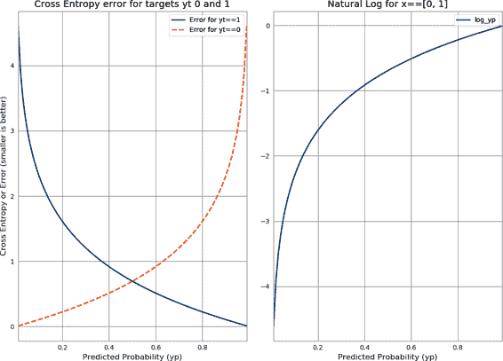
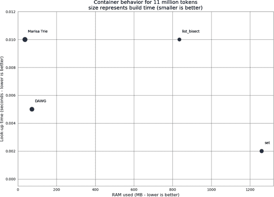
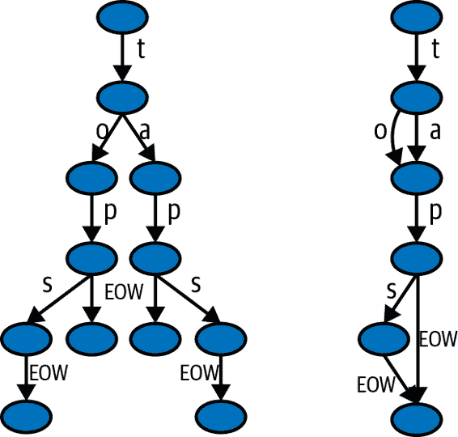
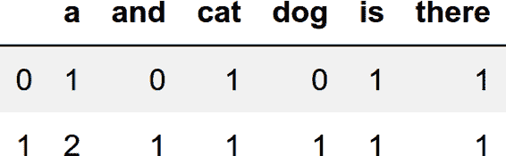
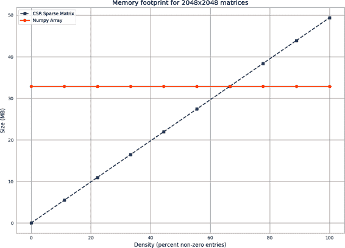
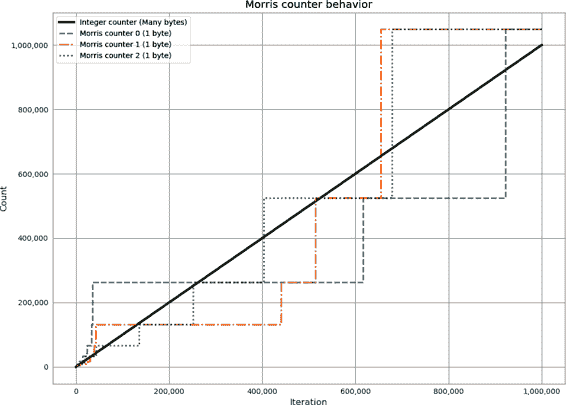
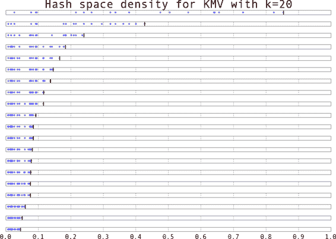
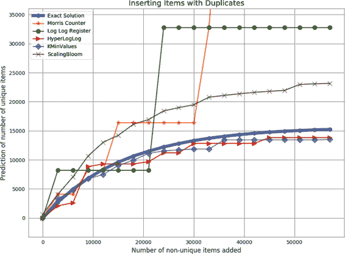
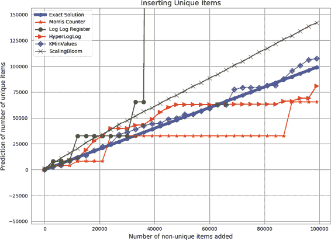

# 第十一章：使用更少的 RAM

我们很少考虑我们使用了多少 RAM，直到我们用尽它。如果在扩展代码时用尽了 RAM，它可能会成为一个突如其来的阻碍。将更多内容适应到机器的 RAM 中意味着需要管理的机器更少，而且它为你规划更大项目的容量提供了一条途径。知道 RAM 被耗尽的原因，并考虑更有效地使用这种稀缺资源的方法，将有助于你处理扩展问题。我们将使用 Memory Profiler 和 IPython 内存使用工具来测量实际的 RAM 使用量，以及一些内省对象的工具，试图猜测它们使用了多少 RAM。

节省 RAM 的另一种方法是使用利用数据特性进行压缩的容器。在这一章中，我们将研究一种 trie（有序树数据结构）和一个有向无环图（DAWG），它们可以将一个 1.2GB 的字符串集合压缩到只有 30MB，而性能几乎没有变化。第三种方法是为准确性交换存储空间。为此，我们将研究近似计数和近似集合成员资格，它们比其精确对应物使用的 RAM 少得多。

关于 RAM 使用的一个考虑是“数据具有质量”的概念。它越多，移动速度就越慢。如果你在使用 RAM 时节俭，你的数据可能会被更快地消耗掉，因为它会更快地在总线上移动，并且更多的数据将适应受限的缓存中。如果你需要将它存储在离线存储器中（例如，硬盘或远程数据集群），它将以更慢的速度传输到你的机器上。尽量选择适当的数据结构，以便所有数据都能适应一个机器。我们将使用 NumExpr 来使用比更直接的方法少得多的数据移动效率地进行 NumPy 和 Pandas 计算，这将节省我们时间，并使一些更大的计算在固定 RAM 量中变得可行。

计算 Python 对象使用的 RAM 量是令人惊讶地棘手。我们并不一定知道对象在幕后是如何表示的，如果我们向操作系统询问已使用的字节计数，它会告诉我们关于分配给进程的总量。在这两种情况下，我们都无法准确地看到每个单独的 Python 对象如何增加到总量中。

由于一些对象和库不会报告它们的完整内部分配字节数（或者它们包装的外部库根本不会报告它们的分配情况），这必须是一个最佳猜测的情况。本章探讨的方法可以帮助我们决定如何以更少的 RAM 总体上使用最佳的方式来表示我们的数据。

我们还将看几种在 scikit-learn 中存储字符串和数据结构中的计数的损失方法。这有点像 JPEG 压缩图像——我们会失去一些信息（并且无法撤消操作以恢复它），但作为结果我们获得了很大的压缩。通过对字符串使用哈希，我们在 scikit-learn 中为自然语言处理任务压缩了时间和内存使用，并且可以用很少的 RAM 计算大量事件。

# 原始数据类型的对象成本高昂

像 `list` 这样的容器通常用于存储数百或数千个项。一旦存储大量数据，RAM 的使用就成为一个问题。

一个包含 1 亿项的 `list` 大约消耗 760 MB RAM，*如果这些项是相同对象*。如果我们存储 1 亿个*不同*的项（例如唯一的整数），我们可以期望使用几 GB 的 RAM！每个唯一对象都有内存成本。

在 示例 11-1 中，我们将许多 `0` 整数存储在一个 `list` 中。如果您将 1 亿个对象的引用存储在列表中（无论这个对象的一个实例有多大），您仍然期望看到大约 760 MB 的内存成本，因为 `list` 存储的是对对象的引用（而不是副本）。参考 “使用 memory_profiler 诊断内存使用情况” 来了解如何使用 `memory_profiler`；在这里，我们通过 `%load_ext memory_profiler` 将其加载为 IPython 中的新魔术函数。

##### 示例 11-1\. 测量列表中 1 亿个相同整数的内存使用情况

```py
In [1]: %load_ext memory_profiler  # load the %memit magic function
In [2]: %memit [0] * int(1e8)
peak memory: 806.33 MiB, increment: 762.77 MiB
```

对于我们的下一个示例，我们将从一个新的 shell 开始。正如在 示例 11-2 中第一次调用 `memit` 的结果显示的那样，一个新的 IPython shell 大约消耗 40 MB RAM。接下来，我们可以创建一个临时的包含 1 亿个*唯一*数字的列表。总共，这大约消耗了 3.8 GB。

###### 警告

内存可以在运行进程中缓存，因此在使用 `memit` 进行分析时，退出并重新启动 Python shell 总是更安全的选择。

`memit` 命令完成后，临时列表被释放。最后一次调用 `memit` 显示内存使用量降至之前的水平。

##### 示例 11-2\. 测量列表中 1 亿个不同整数的内存使用情况

```py
# we use a new IPython shell so we have a clean memory
In [1]: %load_ext memory_profiler
In [2]: %memit # show how much RAM this process is consuming right now
peak memory: 43.39 MiB, increment: 0.11 MiB
In [3]: %memit [n for n in range(int(1e8))]
peak memory: 3850.29 MiB, increment: 3806.59 MiB
In [4]: %memit
peak memory: 44.79 MiB, increment: 0.00 MiB
```

后续在 示例 11-3 中执行 `memit` 来创建第二个 1 亿项目列表，内存消耗约为 3.8 GB。

##### 示例 11-3\. 再次测量列表中 1 亿个不同整数的内存使用情况

```py
In [5]: %memit [n for n in range(int(1e8))]
peak memory: 3855.78 MiB, increment: 3810.96 MiB
```

接下来，我们将看到可以使用 `array` 模块更便宜地存储 1 亿个整数。

## `array` 模块以便宜的方式存储许多原始对象

`array` 模块高效地存储诸如整数、浮点数和字符等基本类型，但*不*包括复数或类。它创建一个连续的 RAM 块来保存底层数据。

在示例 11-4 中，我们分配了 1 亿个整数（每个 8 字节）到一个连续的内存块中。总计，该过程消耗约 760 MB。这种方法与之前的唯一整数列表方法之间的差异为`3100MB - 760MB == 2.3GB`。这在 RAM 上是巨大的节省。

##### 示例 11-4\. 使用 760 MB RAM 构建一个包含 1 亿个整数的数组

```py
In [1]: %load_ext memory_profiler
In [2]: import array
In [3]: %memit array.array('l', range(int(1e8)))
peak memory: 837.88 MiB, increment: 761.39 MiB
In [4]: arr = array.array('l')
In [5]: arr.itemsize
Out[5]: 8
```

注意`array`中的唯一数字不是 Python 对象；它们是`array`中的字节。如果我们对它们进行解引用，将构造一个新的 Python `int`对象。如果你要对它们进行计算，则不会有整体节省，但如果你要将数组传递给外部进程或仅使用部分数据，与使用整数列表相比，RAM 的节省将是显著的。

###### 注意

如果你正在使用 Cython 处理大型数组或矩阵，并且不希望依赖于`numpy`，请注意，你可以将数据存储在一个`array`中，并将其传递给 Cython 进行处理，而无需额外的内存开销。

`array`模块与有限的数据类型一起工作，具有不同的精度（参见示例 11-5）。选择你所需的最小精度，这样你只分配所需的 RAM，而不是更多。请注意，字节大小是依赖于平台的——这里的大小是针对 32 位平台的（它指定了*最小*大小），而我们在 64 位笔记本电脑上运行示例。

##### 示例 11-5\. `array`模块提供的基本类型

```py
In [5]: array.array? # IPython magic, similar to help(array)
Init signature: array.array(self, /, *args, **kwargs)
Docstring:
array(typecode [, initializer]) -> array

Return a new array whose items are restricted by typecode, and
initialized from the optional initializer value, which must be a list,
string, or iterable over elements of the appropriate type.

Arrays represent basic values and behave very much like lists, except
the type of objects stored in them is constrained. The type is specified
at object creation time by using a type code, which is a single character.
The following type codes are defined:

    Type code   C Type             Minimum size in bytes
    'b'         signed integer     1
    'B'         unsigned integer   1
    'u'         Unicode character  2 (see note)
    'h'         signed integer     2
    'H'         unsigned integer   2
    'i'         signed integer     2
    'I'         unsigned integer   2
    'l'         signed integer     4
    'L'         unsigned integer   4
    'q'         signed integer     8 (see note)
    'Q'         unsigned integer   8 (see note)
    'f'         floating point     4
    'd'         floating point     8
```

NumPy 拥有可以容纳更广泛数据类型的数组——你可以更好地控制每个项的字节数，可以使用复数和`datetime`对象。`complex128`对象每个项占用 16 字节：每个项是一对 8 字节浮点数。你无法在 Python 数组中存储`complex`对象，但在`numpy`中可以免费使用它们。如果你需要重新熟悉`numpy`，请回顾第六章。

在示例 11-6 中，你可以看到`numpy`数组的另一个特性；你可以查询项目数、每个原始的大小以及底层 RAM 块的总存储。请注意，这不包括 Python 对象的开销（通常来说，与存储在数组中的数据相比，这是微不足道的）。

###### 提示

要小心使用零进行惰性分配。在以下示例中，对`zeros`的调用“零”成本的 RAM，而对`ones`的调用成本为 1.5 GB。这两个调用最终都会消耗 1.5 GB，但是对`zeros`的调用仅在使用后才分配 RAM，因此成本稍后才会显现。

##### 示例 11-6\. 在`numpy`数组中存储更复杂的类型

```py
In [1]: %load_ext memory_profiler
In [2]: import numpy as np
# NOTE that zeros have lazy allocation so misreport the memory used!
In [3]: %memit arr=np.zeros(int(1e8), np.complex128)
peak memory: 58.37 MiB, increment: 0.00 MiB
In [4]: %memit arr=np.ones(int(1e8), np.complex128)
peak memory: 1584.41 MiB, increment: 1525.89 MiB
In [5]: f"{arr.size:,}"
Out[5]: '100,000,000'
In [6]: f"{arr.nbytes:,}"
Out[6]: '1,600,000,000'
In [7]: arr.nbytes/arr.size
Out[7]: 16.0
In [8]: arr.itemsize
Out[8]: 16
```

使用普通的`list`来存储许多数字在 RAM 中比使用`array`对象要低效得多。需要进行更多的内存分配，每次分配都需要时间；还会对较大的对象进行计算，这些对象将不太适合缓存，并且总体上使用的 RAM 更多，因此其他程序可用的 RAM 更少。

然而，如果你在 Python 中对`array`的内容进行任何操作，原语很可能会被转换为临时对象，从而抵消其效益。在与其他进程通信时，将它们用作数据存储的一个很好的用例是`array`。

如果你在做大量数值计算，那么`numpy`数组几乎肯定是更好的选择，因为你可以获得更多的数据类型选项和许多专门的快速函数。如果你希望项目依赖较少，可能会选择避免使用`numpy`，尽管 Cython 与`array`和`numpy`数组同样有效；Numba 仅与`numpy`数组配合使用。

Python 还提供了一些其他工具来理解内存使用，我们将在以下部分中看到。

## 使用 NumPy 和 NumExpr 节省 RAM

在 NumPy 中（这也会在 Pandas 背后发生）的大型向量化表达式可能会在复杂操作期间创建中间大型数组。这些操作通常是看不见的，只有在发生内存不足错误时才会引起注意。这些计算也可能很慢，因为大型向量不会很好地利用缓存——缓存可能是兆字节或更小，而数百兆字节或几十亿字节的大型向量数据将阻止缓存的有效使用。NumExpr 是一个既加速又减少中间操作大小的工具；我们在“numexpr：使原地操作更快更容易”中介绍了它。

我们之前在“使用 memory_profiler 诊断内存使用”中介绍过 Memory Profiler。在这里，我们通过[IPython 内存使用工具](https://oreil.ly/i9Vc3)进一步扩展，它会报告 IPython shell 或 Jupyter Notebook 中逐行的内存变化。让我们看看如何使用这些工具来检查 NumExpr 是否更有效地生成结果。

###### 提示

使用 Pandas 时，请记得安装可选的 NumExpr。如果在 Pandas 中安装了 NumExpr，调用`eval`会更快，但请注意，Pandas 不会告诉您如果*未*安装 NumExpr。

我们将使用交叉熵公式来计算机器学习分类挑战的误差。*交叉熵*（或*对数损失*）是分类挑战的常见度量标准；它对大误差的惩罚要比小误差显著。在训练和预测阶段，需要为机器学习问题中的每一行打分：

<math alttext="minus l o g upper P left-parenthesis y t vertical-bar y p right-parenthesis equals minus left-parenthesis y t l o g left-parenthesis y p right-parenthesis plus left-parenthesis 1 minus y t right-parenthesis l o g left-parenthesis 1 minus y p right-parenthesis right-parenthesis" display="block"><mrow><mo>-</mo> <mi>l</mi> <mi>o</mi> <mi>g</mi> <mi>P</mi> <mo>(</mo> <mi>y</mi> <mi>t</mi> <mo>|</mo> <mi>y</mi> <mi>p</mi> <mo>)</mo> <mo>=</mo> <mo>-</mo> <mo>(</mo> <mi>y</mi> <mi>t</mi> <mi>l</mi> <mi>o</mi> <mi>g</mi> <mo>(</mo> <mi>y</mi> <mi>p</mi> <mo>)</mo> <mo>+</mo> <mo>(</mo> <mn>1</mn> <mo>-</mo> <mi>y</mi> <mi>t</mi> <mo>)</mo> <mi>l</mi> <mi>o</mi> <mi>g</mi> <mo>(</mo> <mn>1</mn> <mo>-</mo> <mi>y</mi> <mi>p</mi> <mo>)</mo> <mo>)</mo></mrow></math>

我们将在这里使用范围为[0, 1]的随机数来模拟类似于 scikit-learn 或 TensorFlow 等包的机器学习系统的结果。图 11-1 展示了右侧范围为[0, 1]的自然对数，左侧展示了计算交叉熵的结果，当目标值为 0 或 1 时。

如果目标`yt`为 1，则公式的前半部分生效，而后半部分为零。如果目标为 0，则公式的后半部分生效，而第一部分为零。这个结果是针对需要评分的每一行数据计算的，并且通常需要进行多次机器学习算法的迭代。



###### 图 11-1\. `yt`（“真实值”）的交叉熵，其取值为 0 和 1

在示例 11-7 中，我们生成了 2 亿个位于[0, 1]范围内的随机数作为`yp`。`yt`是期望的真值 —— 在这种情况下是由 1 组成的数组。在实际应用中，`yp`由机器学习算法生成，而`yt`则是由机器学习研究人员提供的混合了 0 和 1 的目标真值。

##### 示例 11-7\. 大型 NumPy 数组临时变量的隐藏成本

```py
In [1]: import ipython_memory_usage.ipython_memory_usage as imu; import numpy as np
In [2]: %ipython_memory_usage_start
Out[2]: 'memory profile enabled'
In [3]: nbr_items = 200_000_000
In [4]: yp = np.random.uniform(low=0.0000001, size=nbr_items)
In [4] used 1526.0508 MiB RAM in 2.18s, peaked 0.00 MiB above current,
       total RAM usage 1610.05 MiB
In [5]: yt = np.ones(shape=nbr_items)
In [5] used 1525.8516 MiB RAM in 0.44s, peaked 0.00 MiB above current,
       total RAM usage 3135.90 MiB

In [6]: answer = -(yt * np.log(yp) + ((1-yt) * (np.log(1-yp))))
In [6] used 1525.8594 MiB RAM in 18.63s, peaked 4565.70 MiB above current,
       total RAM usage 4661.76 MiB

In [7]: del answer
In [7] used -1525.8242 MiB RAM in 0.11s, peaked 0.00 MiB above current,
       total RAM usage 3135.93 MiB
```

`yp`和`yt`都各自占用了 1.5 GB 内存，使得总内存使用量略高于 3.1 GB。`answer`向量与输入具有相同的维度，因此额外增加了 1.5 GB。请注意，计算在当前 RAM 使用量上峰值达到了 4.5 GB，因此虽然我们最终得到了 4.6 GB 的结果，但在计算过程中分配了超过 9 GB 的内存。交叉熵计算创建了几个临时变量（特别是`1 – yt`、`np.log(1 – yp)`及其乘积）。如果你使用的是 8 GB 的机器，由于内存耗尽的原因，可能无法计算出这个结果。

在示例 11-8，我们看到相同的表达式作为字符串放置在`numexpr.evaluate`内部。它在当前使用量之上峰值为 0 GB —— 在这种情况下不需要任何额外的 RAM。值得注意的是，它还计算得更快：之前直接向量计算在`In[6]`中花费了 18 秒，而在这里使用 NumExpr 进行相同计算只需要 2.6 秒。

NumExpr 将长向量分解为更短、友好缓存的块，并依次处理每个块，因此可以以友好缓存的方式计算本地块的结果。这解释了不需要额外 RAM 的需求以及增加的速度。

##### 示例 11-8\. NumExpr 将向量化计算分解为高效利用缓存的块

```py
In [8]: import numexpr
In [8] used 0.0430 MiB RAM in 0.12s, peaked 0.00 MiB above current,
       total RAM usage 3135.95 MiB
In [9]: answer = numexpr.evaluate("-(yt * log(yp) + ((1-yt) * (log(1-yp))))")
In [9] used 1525.8281 MiB RAM in 2.67s, peaked 0.00 MiB above current,
       total RAM usage 4661.78 MiB
```

我们可以在 Pandas 中看到类似的好处，示例 11-9 中。我们构造一个与前面示例相同的 DataFrame，并使用 `df.eval` 调用 NumExpr。Pandas 机制必须为 NumExpr 解包 DataFrame，并且总体使用更多 RAM；在幕后，NumExpr 仍以一种缓存友好的方式计算结果。请注意，在这里，NumExpr 除了 Pandas 外还安装了。

##### 示例 11-9\. Pandas 的 `eval` 如果可用将使用 NumExpr

```py
In [2] df = pd.DataFrame({'yp': np.random.uniform(low=0.0000001, size=nbr_items),
       'yt': np.ones(nbr_items)})
In [3]: answer_eval = df.eval("-(yt * log(yp) + ((1-yt) * (log(1-yp))))")
In [3] used 3052.1953 MiB RAM in 5.26s, peaked 3045.77 MiB above current,
       total RAM usage 6185.45 MiB
```

与前面的示例对比，示例 11-10 中没有安装 NumExpr。调用 `df.eval` 回退到 Python 解释器——结果相同，但执行时间为 34 秒（之前为 5.2 秒），内存使用峰值更高。您可以使用 `import numexpr` 测试是否安装了 NumExpr——如果失败，您将需要安装它。

##### 示例 11-10\. 注意，没有安装 NumExpr 的 Pandas 将对 `eval` 进行缓慢和昂贵的调用！

```py
In [2] df = pd.DataFrame({'yp': np.random.uniform(low=0.0000001, size=nbr_items),
       'yt': np.ones(nbr_items)})
In [3]: answer_eval = df.eval("-(yt * log(yp) + ((1-yt) * (log(1-yp))))")
In [3] used 3052.5625 MiB RAM in 34.88s, peaked 7620.15 MiB above current,
       total RAM usage 6185.24 MiB
```

在大数组上进行复杂的向量操作将更快地运行，如果可以使用 NumExpr 的话。Pandas 不会警告您未安装 NumExpr，因此建议在设置中添加它，如果您使用 `eval`。IPython Memory Usage 工具将帮助您诊断您的大数组消耗了多少 RAM；这可以帮助您在当前机器上更多地放入 RAM，以免您不得不开始分割数据并引入更大的工程工作。

# 理解集合中使用的 RAM

你可能想知道是否可以询问 Python 每个对象使用的 RAM。Python 的 `sys.getsizeof(obj)` 调用将告诉我们关于对象内存使用的*一些*信息（大多数但不是所有对象都提供此信息）。如果你以前没见过它，要注意它不会为容器给出你期望的答案！

让我们首先看一些基本类型。在 Python 中，`int` 是一个大小可变的对象，大小任意，当用 0 初始化时，基本对象在 Python 3.7 中的成本是 24 字节。随着数值变大，会添加更多字节：

```py
In [1]: sys.getsizeof(0)
Out[1]: 24
In [2]: sys.getsizeof(1)
Out[2]: 28
In [3]: sys.getsizeof((2**30)-1)
Out[3]: 28
In [4]: sys.getsizeof((2**30))
Out[4]: 32
```

在幕后，每次数到前一个限制之上的数字大小时，会增加 4 字节的集合。这仅影响内存使用；外部看不到任何差异。

我们可以对字节字符串执行相同的检查。空字节序列占用 33 字节，每个额外字符增加 1 字节的成本：

```py
In [5]: sys.getsizeof(b"")
Out[5]: 33
In [6]: sys.getsizeof(b"a")
Out[6]: 34
In [7]: sys.getsizeof(b"ab")
Out[7]: 35
In [8]: sys.getsizeof(b"abc")
Out[8]: 36
```

当我们使用列表时，我们会看到不同的行为。`getsizeof` 并不计算列表内容的成本，只计算列表本身的成本。空列表占用 64 字节，在 64 位笔记本上，列表中的每个项目另外占用 8 字节：

```py
# goes up in 8-byte steps rather than the 24+ we might expect!
In [9]: sys.getsizeof([])
Out[9]: 64
In [10]: sys.getsizeof([1])
Out[10]: 72
In [11]: sys.getsizeof([1, 2])
Out[11]: 80
```

如果我们使用字节字符串，我们会看到比 `getsizeof` 报告的成本要大得多：

```py
In [12]: sys.getsizeof([b""])
Out[12]: 72
In [13]: sys.getsizeof([b"abcdefghijklm"])
Out[13]: 72
In [14]: sys.getsizeof([b"a", b"b"])
Out[14]: 80
```

`getsizeof`仅报告了部分成本，通常只报告父对象的成本。正如前面所述，它也并非总是实现的，因此其实用性有限。

在[`pympler`](https://oreil.ly/HGCj5)中，更好的工具是`asizeof`。它将遍历容器的层次结构，并对找到的每个对象的大小进行最佳猜测，将大小添加到总数中。请注意，它运行速度较慢。

除了依赖猜测和假设外，`asizeof`也无法计算幕后分配的内存（例如，包装 C 库的模块可能不会报告 C 库中分配的字节）。最好将其用作指南。我们更喜欢使用`memit`，因为它能准确地计算所涉及机器的内存使用量。

我们可以检查它对大列表的估计——这里我们将使用 1000 万个整数：

```py
In [1]: from pympler.asizeof import asizeof
In [2]: asizeof([x for x in range(int(1e7))])
Out[2]: 401528048
In [3]: %memit [x for x in range(int(1e7))]
peak memory: 401.91 MiB, increment: 326.77 MiB
```

我们可以通过使用`memit`来验证这一估算，看看这个过程是如何增长的。两个报告都是大致的——`memit`在执行语句时获取操作系统报告的 RAM 使用快照，而`asizeof`则询问对象的大小（可能报告不准确）。我们可以得出结论，一个包含 1000 万个整数的列表大约需要 320 到 400 MB 的 RAM。

通常情况下，`asizeof`过程比使用`memit`慢，但在分析小对象时，`asizeof`可能很有用。对于实际应用程序而言，`memit`可能更有用，因为它测量了进程的实际内存使用情况，而不是推测。

# 字节与 Unicode

Python 3.*x* 相对于 Python 2.*x* 的（许多！）优势之一是默认使用 Unicode。以前，我们有单字节字符串和多字节 Unicode 对象混合，这在数据导入和导出过程中可能会带来麻烦。在 Python 3.*x*中，所有字符串默认都是 Unicode，如果需要操作字节，则必须显式创建字节序列。

Python 3.7 中的 Unicode 对象比 Python 2.*x*中的 RAM 使用效率更高。在 Example 11-11 中，我们可以看到一个包含 1 亿字符序列，一部分作为字节集合，一部分作为 Unicode 对象。对于常见字符，Unicode 变体（假设系统的默认编码是 UTF 8）成本相同——这些常见字符使用单字节实现。

##### 示例 11-11。在 Python 3.x 中，Unicode 对象可以和字节一样便宜。

```py
In [1]: %load_ext memory_profiler
In [2]: type(b"b")
Out[2]: bytes
In [3]: %memit b"a" * int(1e8)
peak memory: 121.55 MiB, increment: 78.17 MiB
In [4]: type("u")
Out[4]: str
In [5]: %memit "u" * int(1e8)
peak memory: 122.43 MiB, increment: 78.49 MiB
In [6]: %memit "Σ" * int(1e8)
peak memory: 316.40 MiB, increment: 176.17 MiB
```

Sigma 字符（Σ）更昂贵——在 UTF 8 中表示为 2 字节。我们通过[PEP 393](https://oreil.ly/_wNrP)从 Python 3.3 中获得了灵活的 Unicode 表示。它通过观察字符串中字符的范围，并在可能的情况下使用更少的字节来表示低序字符来工作。

Unicode 对象的 UTF-8 编码每个 ASCII 字符使用 1 个字节，对于不经常见到的字符使用更多字节。如果您对 Unicode 编码与 Unicode 对象不确定，请观看[Net Batchelder 的“Pragmatic Unicode, or, How Do I Stop The Pain?”](https://oreil.ly/udL3A)。

# 高效地在 RAM 中存储大量文本

文本的一个常见问题是它占用大量的 RAM——但如果我们想要测试我们以前是否看到过字符串或计算它们的频率，将它们存储在 RAM 中比从磁盘中分页更方便。简单地存储字符串是昂贵的，但 tries 和有向无环单词图（DAWG）可以用于压缩它们的表示，并仍然允许快速操作。

这些更先进的算法可以节省大量 RAM，这意味着您可能不需要扩展到更多的服务器。对于生产系统来说，这样的节省是巨大的。在本节中，我们将探讨如何使用 trie 将占用 1.2 GB 的字符串`set`压缩到 30 MB，性能几乎没有变化。

例如，我们将使用从维基百科的部分转储构建的文本集。这个集合包含了来自英文维基百科的 1100 万个唯一令牌，占据了磁盘上的 120 MB。

令牌按照它们原始文章中的空白分隔开来；它们长度不固定，包含 Unicode 字符和数字。它们看起来像这样：

```py
faddishness
'melanesians'
Kharálampos
PizzaInACup™
url="http://en.wikipedia.org/wiki?curid=363886"
VIIIa),
Superbagnères.
```

我们将使用这个文本样本来测试我们可以多快地构建一个包含每个唯一单词实例的数据结构，然后我们将看看我们可以多快地查询一个已知的单词（我们将使用不常见的“Zwiebel”，出自画家 Alfred Zwiebel）。这让我们可以问：“我们以前见过 Zwiebel 吗？”令牌查找是一个常见的问题，能够快速地执行这些操作非常重要。

###### 注意

当您在自己的问题上尝试这些容器时，请注意您可能会看到不同的行为。每个容器以不同的方式构建其内部结构；传递不同类型的令牌可能会影响结构的构建时间，而令牌的不同长度会影响查询时间。请始终以一种系统的方式进行测试。

## 在 1100 万个令牌上尝试这些方法

Figure 11-2 展示了存储在一些容器中的 1100 万个令牌文本文件（120 MB 原始数据）。x 轴显示了每个容器的 RAM 使用情况，y 轴跟踪查询时间，并且每个点的大小与构建结构所花费的时间成比例（更大表示花费的时间更长）。

如图所示，`set`和`list`示例使用了大量 RAM；`list`示例既大又*慢*！对于这个数据集来说，Marisa trie 示例在内存使用效率上是最高的，而 DAWG 运行速度是 RAM 使用量相对较小的两倍。



###### 图 11-2\. DAWG 和 tries 与内置容器的比较

图中没有显示使用未排序方法的`列表`的查找时间，我们将很快介绍，因为它太耗时了。请注意，您必须使用各种容器测试您的问题——每种容器都提供不同的权衡，如构建时间和 API 灵活性。

接下来，我们将建立一个过程来测试每个容器的行为。

### 列表

让我们从最简单的方法开始。我们将我们的标记加载到一个`列表`中，然后使用`O(n)`线性搜索进行查询。你不能在我们已经提到的大例子上这样做——搜索时间太长了——所以我们将用一个小得多的例子（50 万标记）来演示这种技术。

在以下每个示例中，我们使用一个生成器`text_example.readers`，它从输入文件中一次提取一个 Unicode 标记。这意味着读取过程只使用了极少量的 RAM：

```py
print("RAM at start {:0.1f}MiB".format(memory_profiler.memory_usage()[0]))
t1 = time.time()
words = [w for w in text_example.readers]
print("Loading {} words".format(len(words)))
t2 = time.time()
print("RAM after creating list {:0.1f}MiB, took {:0.1f}s" \
      .format(memory_profiler.memory_usage()[0], t2 - t1))
```

我们对能够多快地查询这个`列表`很感兴趣。理想情况下，我们希望找到一个可以存储我们的文本并允许我们进行查询和修改而没有惩罚的容器。为了查询它，我们使用`timeit`多次查找一个已知的单词：

```py
assert 'Zwiebel' in words
time_cost = sum(timeit.repeat(stmt="'Zwiebel' in words",
                              setup="from __main__ import words",
                              number=1,
                              repeat=10000))
print("Summed time to look up word {:0.4f}s".format(time_cost))
```

我们的测试脚本报告显示，将原始的 5 MB 文件存储为一个列表大约使用了 34 MB，聚合查找时间为 53 秒：

```py
$ python text_example_list.py
RAM at start 36.6MiB
Loading 499056 words
RAM after creating list 70.9MiB, took 1.0s
Summed time to look up word 53.5657s
```

显然，将文本存储在未排序的`列表`中是一个糟糕的主意；`O(n)`的查找时间代价高昂，内存使用也是如此。这是所有世界中最糟糕的情况！如果我们在以下更大的数据集上尝试这种方法，我们期望的聚合查找时间将是 25 分钟，而不是我们讨论的方法的一小部分秒数。

我们可以通过对`列表`进行排序并使用[`bisect`模块](https://oreil.ly/Uk6ry)进行二分查找来改善查找时间；这为未来的查询提供了一个合理的下限。在 示例 11-12 中，我们测量了对`列表`进行`排序`所需的时间。在这里，我们转向更大的 1100 万标记集。

##### 示例 11-12\. 对`排序`操作计时，为使用`bisect`做准备

```py
    print("RAM at start {:0.1f}MiB".format(memory_profiler.memory_usage()[0]))
    t1 = time.time()
    words = [w for w in text_example.readers]
    print("Loading {} words".format(len(words)))
    t2 = time.time()
    print("RAM after creating list {:0.1f}MiB, took {:0.1f}s" \
          .format(memory_profiler.memory_usage()[0], t2 - t1))
    print("The list contains {} words".format(len(words)))
    words.sort()
    t3 = time.time()
    print("Sorting list took {:0.1f}s".format(t3 - t2))
```

接下来，我们进行与之前相同的查找，但增加了使用`bisect`的`index`方法：

```py
import bisect
...
def index(a, x):
    'Locate the leftmost value exactly equal to x'
    i = bisect.bisect_left(a, x)
    if i != len(a) and a[i] == x:
        return i
    raise ValueError
...
    time_cost = sum(timeit.repeat(stmt="index(words, 'Zwiebel')",
                                  setup="from __main__ import words, index",
                                  number=1,
                                  repeat=10000))
```

在 示例 11-13 中，我们看到 RAM 使用量比以前大得多，因为我们加载了更多的数据。排序需要额外的 0.6 秒，累积查找时间为 0.01 秒。

##### 示例 11-13\. 在排序`列表`上使用`bisect`的时间

```py
$ python text_example_list_bisect.py 
RAM at start 36.6MiB
Loading 11595290 words
RAM after creating list 871.9MiB, took 20.6s
The list contains 11595290 words
Sorting list took 0.6s
Summed time to look up word 0.0109s

```

现在，我们对字符串查找定时有了一个合理的基线：RAM 使用必须优于 871 MB，并且总查找时间应优于 0.01 秒。

### 集合

使用内置的`set`似乎是解决我们任务的最明显方式。在示例 11-14 中，`set`使用哈希结构存储每个字符串（如果需要复习，请参阅第四章）。检查成员资格很快，但每个字符串必须单独存储，这在 RAM 上很昂贵。

##### 示例 11-14\. 使用`set`存储数据

```py
    words_set = set(text_example.readers)
```

如我们在示例 11-15 中所见，`set`比`list`使用更多的 RAM，额外多了 250 MB；然而，它提供了非常快的查找时间，而无需额外的`index`函数或中间排序操作。

##### 示例 11-15\. 运行`set`示例

```py
$ python text_example_set.py
RAM at start 36.6MiB
RAM after creating set 1295.3MiB, took 24.0s
The set contains 11595290 words
Summed time to look up word 0.0023s

```

如果 RAM 不是问题，这可能是最明智的第一种方法。

现在我们已经丢失了原始数据的*顺序*。如果这对您很重要，请注意，您可以将字符串存储为字典中的键，每个值都是与原始读取顺序相关联的索引。这样，您可以询问字典是否存在该键及其索引。

### 更有效的树结构

让我们介绍一组算法，它们更有效地使用 RAM 来表示我们的字符串。

图 11-3 来自[维基共享资源](http://commons.wikimedia.org)，展示了“tap”、“taps”、“top”和“tops”四个单词在 trie 和 DAWG 之间的表示差异。¹使用`list`或`set`，每个单词都将存储为单独的字符串。DAWG 和 trie 都共享字符串的部分，因此使用的 RAM 更少。

这些之间的主要区别在于 trie 仅共享公共前缀，而 DAWG 共享公共前缀和后缀。在具有许多常见单词前缀和后缀的语言（如英语）中，这可以节省大量重复。

精确的内存行为将取决于您数据的结构。通常，由于字符串从开头到结尾有多条路径，DAWG 不能为键分配值，但这里显示的版本可以接受值映射。Trie 也可以接受值映射。某些结构必须在开始时进行构建，而其他结构可以随时更新。

这些结构的一个重要优势是它们提供了*公共前缀搜索*；也就是说，您可以请求所有具有您提供的前缀的单词。对于我们的四个单词列表，搜索“ta”将得到“tap”和“taps”的结果。此外，由于这些是通过图结构发现的，检索这些结果非常快速。例如，如果您处理的是 DNA，使用 trie 来压缩数百万个短字符串可以有效减少 RAM 使用量。



###### 图 11-3\. Trie 和 DAWG 结构（图片由[Chkno](https://oreil.ly/w71ZI) [CC BY-SA 3.0]提供）

在接下来的章节中，我们将更详细地了解 DAWG、trie 及其用法。

### 有向无环字图

[有向无环字图](https://oreil.ly/4KfVO)（MIT 许可证）尝试高效表示共享公共前缀和后缀的字符串。

请注意，在撰写本文时，GitHub 上的一个[开放的 Pull Request](https://oreil.ly/6T5le)需要应用才能使此 DAWG 与 Python 3.7 配合工作。

在示例 11-16 中，您可以看到一个非常简单的 DAWG 设置。对于此实现，构建后的 DAWG 无法修改；它读取一个迭代器来构建自身一次。缺乏构建后更新可能会成为您用例的破坏者。如果是这样，您可能需要考虑改用 trie。DAWG 支持丰富的查询，包括前缀查找；它还允许持久性，并支持存储整数索引作为值以及字节和记录值。

##### 示例 11-16\. 使用 DAWG 存储数据

```py
import dawg
...
    words_dawg = dawg.DAWG(text_example.readers)
```

正如您在示例 11-17 中所见，对于相同的字符串集合，在*构建*阶段使用的 RAM 比之前的`set`示例少得多。更相似的输入文本将导致更强的压缩。

##### 示例 11-17\. 运行 DAWG 示例

```py
$ python text_example_dawg.py
RAM at start 38.1MiB
RAM after creating dawg 200.8MiB, took 31.6s
Summed time to look up word 0.0044s

```

更重要的是，如果我们将 DAWG 持久化到磁盘，如示例 11-18 所示，然后将其加载回到一个新的 Python 实例中，我们将看到 RAM 使用量显著减少——磁盘文件和加载后的内存使用量都是 70 MB；与我们之前构建的 1.2 GB `set` 变体相比，这是显著的节省！

##### 示例 11-18\. 加载之前构建并保存的 DAWG 更节省内存

```py
$ python text_example_dawg_load_only.py
RAM at start 38.4MiB
RAM after load 109.0MiB
Summed time to look up word 0.0051s

```

鉴于您通常只需创建一次 DAWG，然后多次加载，您在将结构持久化到磁盘后将受益于重复的构建成本。

### Marisa trie

[Marisa trie](https://oreil.ly/tDvVQ)（双许可 LGPL 和 BSD）是一个静态的[trie](https://oreil.ly/suBhE)，使用 Cython 绑定到外部库。因为它是静态的，所以在构建后无法修改。与 DAWG 类似，它支持将整数索引作为值存储，以及字节值和记录值。

一个关键字可以用来查找一个值，反之亦然。可以高效地找到所有共享相同前缀的键。trie 的内容可以持久化。示例 11-19 说明了使用 Marisa trie 存储我们的示例数据。

##### 示例 11-19\. 使用 Marisa trie 存储数据

```py
import marisa_trie
...
    words_trie = marisa_trie.Trie(text_example.readers)
```

在示例 11-20 中，我们可以看到查找时间比 DAWG 提供的要慢。

##### 示例 11-20\. 运行 Marisa trie 示例

```py
$ python text_example_trie.py
RAM at start 38.3MiB
RAM after creating trie 419.9MiB, took 35.1s
The trie contains 11595290 words
Summed time to look up word 0.0148s

```

字典树在这个数据集上进一步节省了内存。虽然查找速度稍慢（在示例 11-21 中），但是在下面的代码片段中，如果我们将字典树保存到磁盘，然后重新加载到一个新进程中，磁盘和 RAM 使用量大约为 30 MB；这比 DAWG 实现的效果好一倍。

##### 示例 11-21\. 加载先前会话中构建和保存的字典树更节省 RAM

```py
$ python text_example_trie_load_only.py
RAM at start 38.5MiB
RAM after loading trie from disk 76.7MiB, took 0.0s
The trie contains 11595290 words
Summed time to look up word 0.0092s

```

在构建后的存储大小和查找时间之间的权衡需要针对您的应用程序进行调查。您可能会发现其中一种“效果足够好”，因此可以避免基准测试其他选项，而是直接继续下一个挑战。在这种情况下，我们建议 Marisa 字典树是您的首选；它在 GitHub 上的星数比 DAWG 多。

### 在生产系统中使用字典树（和 DAWG）

字典树和 DAWG 数据结构提供了很多好处，但在采用它们之前，你仍然需要根据自己的问题进行基准测试，而不是盲目地采用。

字典树（trie）和 DAWG 虽然不那么出名，但它们在生产系统中能提供显著的好处。我们在“Smesh 的大规模社交媒体分析（2014 年）”中有一个令人印象深刻的成功案例。Jamie Matthews 在 DabApps（一家位于英国的 Python 软件公司）也有一个关于在客户系统中使用字典树来实现更高效、更便宜部署的案例：

> 在 DabApps，我们经常试图通过将复杂的技术架构问题分解为小型、自包含的组件来解决，通常使用 HTTP 在网络上进行通信。这种方法（称为*面向服务*或*微服务*架构）有各种好处，包括可以在多个项目之间重用或共享单个组件的功能。
> 
> 我们在面向消费者的客户项目中经常需要处理的任务之一是邮政编码地理编码。这个任务是将完整的英国邮政编码（例如：BN1 1AG）转换为经纬度坐标对，以便应用程序执行地理空间计算，比如距离测量。
> 
> 在其最基本的形式下，地理编码数据库是字符串之间的简单映射，概念上可以表示为字典。字典的键是邮政编码，以规范化形式存储（例如 BN11AG），值是坐标的表示（我们使用了地理哈希编码，但为简单起见，可以想象为逗号分隔的对，如 50.822921,-0.142871）。
> 
> 英国大约有 170 万个邮政编码。如前所述，将整个数据集朴素地加载到 Python 字典中需要几百兆字节的内存。使用 Python 的本机 Pickle 格式将这些数据结构持久化到磁盘需要大量的存储空间，这是不可接受的。我们知道我们可以做得更好。
> 
> 我们尝试了几种不同的内存和磁盘存储及序列化格式，包括将数据存储在外部数据库如 Redis 和 LevelDB 中，并压缩键/值对。最终，我们想到了使用 trie 树的想法。Trie 树在内存中表示大量字符串非常高效，并且可用的开源库（我们选择了“marisa-trie”）使它们非常简单易用。
> 
> 结果应用程序，包括使用 Flask 框架构建的微小 Web API，仅使用 30MB 内存来表示整个英国邮政编码数据库，并且可以轻松处理大量的邮政编码查询请求。代码简洁；服务非常轻量级且无痛地可以在免费托管平台如 Heroku 上部署和运行，不依赖外部数据库或其他依赖。我们的实现是开源的，可在[*https://github.com/j4mie/postcodeserver*](https://github.com/j4mie/postcodeserver)获取。
> 
> Jamie Matthews，DabApps.com（英国）的技术总监

DAWG 和 trie 是强大的数据结构，可以帮助您节省 RAM 和时间，但需要在准备阶段额外付出一些努力。这些数据结构对许多开发者来说可能不太熟悉，因此考虑将此代码分离到一个与其余代码相对隔离的模块中，以简化维护。

# 使用 Scikit-Learn 的 FeatureHasher 进行更多文本建模

Scikit-learn 是 Python 最知名的机器学习框架，对基于文本的自然语言处理（NLP）挑战有着出色的支持。在这里，我们将会看到如何将来自 Usenet 档案的公共帖子分类到 20 个预定类别中；这与清理电子邮件收件箱中的二类垃圾分类过程类似。

文本处理的一个困难在于分析中的词汇量迅速爆炸。英语使用许多名词（例如人名、地名、医学术语和宗教术语）和动词（“-ing”结尾的“doing words”，例如“running,” “taking,” “making,” 和 “talking”），以及它们的各种变形（将动词“talk”转变为“talked,” “talking,” “talks”）。此外，标点符号和大写字母为词语的表示增添了额外的细微差别。

一种强大而简单的文本分类技术是将原始文本分解为*n-grams*，通常是 unigrams（一元组）、bigrams（二元组）和 trigrams（三元组）（也称为 1-gram、2-gram 和 3-gram）。例如，“there is a cat and a dog”这样的句子可以转换为 unigrams（“there,” “is,” “a,” 等等）、bigrams（“there is,” “is a,” “a cat,” 等等）和 trigrams（“there is a,” “is a cat,” “a cat and,” …）。

这个句子有 7 个一元词项，6 个二元词项和 5 个三元词项；总计这个句子可以通过一个包含 6 个唯一一元词项（因为术语 “a” 被使用了两次）、6 个唯一二元词项和 5 个唯一三元词项的词汇表以这种形式表示，总共有 17 个描述性项。如你所见，用于表示句子的 n-gram 词汇表会快速增长；有些术语非常常见，而有些则非常罕见。

有控制词汇表爆炸的技术，例如消除停用词（删除最常见且通常无信息的词项，如 “a”、“the” 和 “of”）、将所有内容转换为小写，并忽略较少频繁的类型的词项（例如标点符号、数字和括号）。如果你从事自然语言处理，你很快就会接触到这些方法。

# 介绍 `DictVectorizer` 和 `FeatureHasher`

在我们看 Usenet 分类任务之前，让我们看一下两个帮助处理 NLP 挑战的 scikit-learn 特征处理工具。首先是 `DictVectorizer`，它接受一个词汇表及其频率的字典，并将其转换为一个宽度可变的稀疏矩阵（我们将在 “SciPy's Sparse Matrices” 中讨论稀疏矩阵）。第二个是 `FeatureHasher`，它将相同的词汇表及其频率转换为固定宽度的稀疏矩阵。

示例 11-22 展示了两个句子：“there is a cat” 和 “there is a cat and a dog”，这两个句子之间共享了词项，“a” 在其中一个句子中使用了两次。在调用 `fit` 时，`DictVectorizer` 获得了这些句子；第一次遍历时，它构建了一个内部 `vocabulary_` 单词列表，第二次遍历时，它构建了一个稀疏矩阵，包含每个词项及其计数的引用。

进行两次遍历比 `FeatureHasher` 的一次遍历需要更长时间，并且构建词汇表会额外消耗内存。构建词汇表通常是一个串行过程；通过避免这一阶段，特征哈希可以潜在地并行操作以获得额外的速度。

##### 示例 11-22\. 使用 `DictVectorizer` 进行无损文本表示

```py
In [2]: from sklearn.feature_extraction import DictVectorizer
   ...:
   ...: dv = DictVectorizer()
   ...: # frequency counts for ["there is a cat", "there is a cat and a dog"]
   ...: token_dict = [{'there': 1, 'is': 1, 'a': 1, 'cat': 1},
   ...:               {'there': 1, 'is': 1, 'a': 2, 'cat': 1, 'and': 1, 'dog': 1}]

In [3]: dv.fit(token_dict)
   ...:
   ...: print("Vocabulary:")
   ...: pprint(dv.vocabulary_)

Vocabulary:
{'a': 0, 'and': 1, 'cat': 2, 'dog': 3, 'is': 4, 'there': 5}

In [4]: X = dv.transform(token_dict)
```

为了使输出更加清晰，请参阅矩阵 `X` 在 图 11-4 中的 Pandas DataFrame 视图，其中列被设置为词汇表。注意，这里我们已经制作了一个*密集*的矩阵表示——我们有 2 行和 6 列，每个 12 个单元格都包含一个数字。在稀疏形式中，我们仅存储存在的 10 个计数，对于缺失的 2 个项目我们不存储任何内容。对于较大的语料库，密集表示所需的存储空间，大部分是 0，很快变得难以承受。对于自然语言处理来说，稀疏表示是标准的。



###### 图 11-4\. `DictVectorizer` 转换输出显示在 Pandas DataFrame 中

`DictVectorizer` 的一个特点是我们可以给它一个矩阵，并且反向进行处理。在 示例 11-23 中，我们使用词汇表来恢复原始的频率表示。请注意，这并*不*恢复原始句子；在第一个示例中，有多种解释单词顺序的方式（“there is a cat” 和 “a cat is there” 都是有效的解释）。如果我们使用了二元组，我们会开始引入对单词顺序的约束。

##### 示例 11-23\. 将矩阵 `X` 的输出反向转换为原始字典表示

```py
In [5]: print("Reversing the transform:")
   ...: pprint(dv.inverse_transform(X))

Reversing the transform:
[{'a': 1, 'cat': 1, 'is': 1, 'there': 1},
 {'a': 2, 'and': 1, 'cat': 1, 'dog': 1, 'is': 1, 'there': 1}]
```

`FeatureHasher` 接受相同的输入并生成类似的输出，但有一个关键的区别：它不存储词汇表，而是使用散列算法将标记频率分配到列中。

我们已经在 “字典和集合是如何工作的？” 中看过哈希函数。哈希将唯一项（在本例中是文本标记）转换为一个数字，其中多个唯一项可能映射到相同的哈希值，这时我们会发生冲突。良好的哈希函数会导致很少的冲突。如果我们将许多唯一项哈希到一个较小的表示中，冲突是不可避免的。哈希函数的一个特点是它不容易反向操作，因此我们无法将哈希值转换回原始标记。

在 示例 11-24 中，我们要求一个固定宽度为 10 列的矩阵——默认情况下是一个包含 100 万个元素的固定宽度矩阵，但我们将在这里使用一个小矩阵来展示一个冲突。对于许多应用程序来说，默认的 100 万元素宽度是一个合理的默认值。

哈希过程使用了快速的 MurmurHash3 算法，它将每个标记转换为一个数字；然后将其转换为我们指定的范围内。较大的范围有较少的冲突；像我们的 10 的范围将会有许多冲突。由于每个标记必须映射到仅有的 10 列之一，如果我们添加了许多句子，我们将会得到许多冲突。

输出 `X` 具有 2 行和 10 列；每个标记映射到一列，并且我们不能立即知道哪一列代表每个单词，因为哈希函数是单向的，所以我们无法将输出映射回输入。在这种情况下，我们可以推断，使用 `extra_token_dict`，标记 `there` 和 `is` 都映射到列 8，因此在列 8 中我们得到九个 0 和一个计数为 2。

##### 示例 11-24\. 使用一个包含 10 列的 `FeatureHasher` 来展示哈希冲突

```py
In [6]: from sklearn.feature_extraction import FeatureHasher
   ...:
   ...: fh = FeatureHasher(n_features=10, alternate_sign=False)
   ...: fh.fit(token_dict)
   ...: X = fh.transform(token_dict)
   ...: pprint(X.toarray().astype(np.int_))
   ...:
array([[1, 0, 0, 0, 0, 0, 0, 2, 0, 1],
       [2, 0, 0, 1, 0, 1, 0, 2, 0, 1]])

In [7]: extra_token_dict = [{'there': 1, 'is': 1}, ]
   ...: X = fh.transform(extra_token_dict)
   ...: print(X.toarray().astype(np.int_))
   ...:
[[0 0 0 0 0 0 0 2 0 0]]
```

尽管存在冲突的发生，通常在这种表示中保留了足够的信号（假设使用了默认列数），以便与 `DictVectorizer` 相比，`FeatureHasher` 能够获得类似的优质机器学习结果。

## 在一个真实问题上比较 DictVectorizer 和 FeatureHasher

如果我们使用完整的 20 个新闻组数据集，我们有 20 个类别，大约 18,000 封电子邮件分布在这些类别中。虽然某些类别如“sci.med”相对独特，但其他类别如“comp.os.ms-windows.misc”和“comp.windows.x”将包含共享相似术语的电子邮件。机器学习任务是为测试集中的每个项目正确识别出 20 个选项中的正确新闻组。测试集大约有 4,000 封电子邮件；用于学习术语到匹配类别映射的训练集大约有 14,000 封电子邮件。

请注意，本示例*不*涉及一些现实训练挑战的必要性。我们未剥离新闻组元数据，这些元数据可能会用于这一挑战的过度拟合；与仅从电子邮件文本泛化不同，某些外部元数据人为地提高了分数。我们已随机打乱了电子邮件。在这里，我们不试图获得单一优秀的机器学习结果；而是演示了一个损失哈希表示可以等效于一个非损失且更占内存的变体。

在示例 11-25 中，我们采用 18,846 份文档，并使用`DictVectorizer`和`FeatureHasher`分别基于单字、双字和三字组建立训练和测试集表示。对于训练集，`DictVectorizer`的稀疏数组形状为`(14,134, 4,335,793)`，我们的 14,134 封电子邮件使用了 4 百万个标记。构建词汇表和转换训练数据耗时 42 秒。

与此形成对比的是`FeatureHasher`，它具有固定的 100 万元素宽度的哈希表示，转换耗时 21 秒。请注意，在这两种情况下，稀疏矩阵存储了大约 980 万个非零项，因此它们存储了类似数量的信息。由于冲突，哈希版本存储了大约 10,000 个较少的项。

如果我们使用了一个密集矩阵，我们将有 14 万行和 1 千万列，每个单元格为 8 字节——远超过当前任何一台机器的典型可用内存。只有这个矩阵的微小部分是非零的。稀疏矩阵避免了这种内存消耗。

##### 示例 11-25\. 在一个真实的机器学习问题上比较`DictVectorizer`和`FeatureHasher`

```py
Loading 20 newsgroups training data
18846 documents - 35.855MB

DictVectorizer on frequency dicts
DictVectorizer has shape (14134, 4335793) with 78,872,376 bytes
 and 9,859,047 non-zero items in 42.15 seconds
Vocabulary has 4,335,793 tokens
LogisticRegression score 0.89 in 1179.33 seconds

FeatureHasher on frequency dicts
FeatureHasher has shape (14134, 1048576) with 78,787,936 bytes
 and 9,848,492 non-zero items in 21.59 seconds
LogisticRegression score 0.89 in 903.35 seconds
```

关键是，在`DictVectorizer`上使用的`LogisticRegression`分类器，与使用`FeatureHasher`的 100 万列相比，训练时间长了 30%。两者都显示了 0.89 的得分，因此对于这一挑战，结果基本上是等效的。

使用 `FeatureHasher`，我们在测试集上达到了相同的分数，更快地构建了训练矩阵，避免了构建和存储词汇表，训练速度也比常见的 `DictVectorizer` 方法快。但作为交换，我们失去了将散列表示转换回原始特征以进行调试和解释的能力，而且由于我们经常希望能够诊断*为什么*做出决策，这可能是一个过于昂贵的交易。

# SciPy 的稀疏矩阵

在 “介绍 DictVectorizer 和 FeatureHasher” 中，我们使用 `DictVectorizer` 创建了一个大特征表示，它在后台使用稀疏矩阵。这些稀疏矩阵也可以用于一般计算，并且在处理稀疏数据时非常有用。

*稀疏矩阵* 是大多数矩阵元素为 0 的矩阵。对于这类矩阵，有许多方法可以编码非零值，然后简单地说“所有其他值都是零”。除了这些内存节省外，许多算法还有处理稀疏矩阵的特殊方法，提供额外的计算优势：

```py
>>> from scipy import sparse
>>> A_sparse = sparse.random(2048, 2048, 0.05).tocsr()
>>> A_sparse
<2048x2048 sparse matrix of type '<class 'numpy.float64'>'
        with 209715 stored elements in Compressed Sparse Row format>
>>> %timeit A_sparse * A_sparse
150 ms ± 1.71 ms per loop (mean ± std. dev. of 7 runs, 10 loops each)
>>> A_dense = A_sparse.todense()
>>> type(A_dense)
numpy.matrix
>>> %timeit A_dense * A_dense
571 ms ± 14.5 ms per loop (mean ± std. dev. of 7 runs, 1 loop each)
```

这种最简单的实现是在 SciPy 的 `COO` 矩阵中，对于每个非零元素，我们存储该值以及该值的位置。这意味着对于每个非零值，我们总共存储三个数字。只要我们的矩阵至少有 66% 的零条目，我们就可以减少用于表示数据的内存量，这与标准的 `numpy` 数组相比是一种节省。然而，`COO` 矩阵通常仅用于构造稀疏矩阵而不是进行实际计算（对于这一点，更喜欢使用 CSR/CSC）。

我们可以看到在 图 11-5 中，对于低密度，稀疏矩阵比其密集对应物速度快得多。此外，它们还使用更少的内存。


###### 图 11-5\. 稀疏与密集矩阵乘法

在 图 11-6 中，密集矩阵始终使用 32.7 MB 内存（2048 × 2048 × 64 位）。然而，20% 密度的稀疏矩阵仅使用 10 MB，节省了 70%！随着稀疏矩阵密度的增加，由于向量化和更好的缓存性能带来的好处，`numpy` 的速度迅速超越了。



###### 图 11-6\. 稀疏与密集内存足迹

这种极端的内存使用减少部分是速度提升如此明显的原因之一。除了仅对非零元素执行乘法运算（从而减少所需的操作次数）外，我们还不需要为保存结果分配如此大量的空间。这就是稀疏数组加速的推拉之道——在失去高效缓存和向量化的同时，还不必做与矩阵零值相关的大量计算。

稀疏矩阵特别擅长的一种操作是余弦相似度。事实上，在创建`DictVectorizer`时，如我们在“介绍 DictVectorizer 和 FeatureHasher”中所做的那样，通常使用余弦相似度来查看两段文本的相似度。总体而言，对于这些项目对项目的比较（其中特定矩阵元素的值与另一个矩阵元素进行比较），稀疏矩阵表现非常出色。由于调用`numpy`的方式无论我们使用普通矩阵还是稀疏矩阵都是相同的，我们可以在不改变算法代码的情况下对使用稀疏矩阵的好处进行基准测试。

虽然这很令人印象深刻，但也存在严重的限制。稀疏矩阵的支持程度相当有限，除非你运行特殊的稀疏算法或者仅进行基本操作，否则在支持方面可能会遇到障碍。此外，SciPy 的`sparse`模块提供了多种稀疏矩阵的实现，每种都有不同的优缺点。理解哪种是最佳选择，并在何时使用它需要一些专业知识，并经常会导致冲突的需求。因此，稀疏矩阵可能不是你经常使用的工具，但当它们是正确的工具时，它们是无价的。

# 使用较少内存的技巧

一般而言，如果可以避免将其放入 RAM 中，请避免。加载的每一项都会消耗你的 RAM。例如，你可能可以只加载部分数据，例如使用[内存映射文件](https://oreil.ly/l7ekl)；或者，你可以使用生成器仅加载需要进行部分计算的数据部分，而不是一次性加载所有数据。

如果你正在处理数值数据，几乎可以肯定地说你会想要切换到使用`numpy`数组——该包提供了许多直接在底层基本对象上运行的快速算法。与使用数字列表相比，RAM 的节省可能非常巨大，时间的节省同样令人惊讶。此外，如果处理的是非常稀疏的数组，使用 SciPy 的稀疏数组功能可以节省大量内存，尽管与普通的`numpy`数组相比功能集合有所减少。

如果您正在处理字符串，请使用`str`而不是`bytes`，除非您有充分理由在字节级别工作。手动处理各种文本编码非常麻烦，而 UTF-8（或其他 Unicode 格式）倾向于解决这些问题。如果您在静态结构中存储许多 Unicode 对象，您可能想研究我们刚讨论过的 DAWG 和 trie 结构。

如果您正在处理大量的位串，请研究`numpy`和[`bitarray`](https://oreil.ly/Oz4-2)包；两者都具有有效的位打包表示。您还可以通过查看 Redis 来受益于有效存储位模式。

PyPy 项目正在尝试更高效的同质数据结构表示，因此在 PyPy 中，长列表的同一种原始类型（例如整数）可能比 CPython 中的等效结构成本低得多。[MicroPython](http://micropython.org)项目对于任何与嵌入式系统一起工作的人都很有趣：这个内存占用极小的 Python 实现正在争取实现 Python 3 兼容性。

几乎可以肯定，当您试图优化 RAM 使用时，您知道您必须进行基准测试，并且在进行算法更改之前建立一个单元测试套件将会非常有益。

在回顾了压缩字符串和高效存储数字的方法之后，我们现在将探讨为存储空间而牺牲精度的方法。

# 概率数据结构

概率数据结构允许您在精度上做出牺牲以极大减少内存使用。此外，您可以对它们执行的操作数量远远少于`set`或 trie。例如，使用单个 2.56 KB 的 HyperLogLog++结构，您可以计算约 7,900,000,000 个项目的唯一项数，误差为 1.625%。

这意味着，如果我们试图统计汽车的唯一车牌号码数量，而我们的 HyperLogLog++ 计数器显示有 654,192,028 个，我们可以确信实际数字在 643,561,407 和 664,822,648 之间。此外，如果这种精度不够，您可以简单地向结构添加更多内存，它将表现得更好。给它 40.96 KB 的资源将把误差从 1.625%降低到 0.4%。然而，将这些数据存储在一个`set`中将需要 3.925 GB，即使假设没有任何额外开销！

另一方面，HyperLogLog++ 结构只能计数一组`set`的车牌并与另一个`set`合并。例如，我们可以为每个州创建一个结构，找出每个州中有多少个独特的车牌，然后将它们全部合并以获得整个国家的计数。如果我们拿到一个车牌号，我们无法非常准确地告诉您我们之前是否见过它，也无法给您一些我们已经见过的车牌的样本。

当你花时间理解问题并需要将某些内容投入生产以回答大量数据中的一小部分问题时，概率性数据结构非常棒。每种结构可以以不同的精度回答不同的问题，因此找到适合的结构只是理解你需求的问题。

###### 警告

这一部分大部分内容深入探讨了许多流行的概率性数据结构的动力机制。这是有用的，因为一旦你理解了这些机制，你可以在设计算法时使用它们的部分。如果你刚开始接触概率性数据结构，可能先看一下实际例子（“实际例子”）再深入了解内部机制会更有帮助。

几乎在所有情况下，概率性数据结构的工作方式是找到数据的替代表示，这种表示更紧凑并包含回答特定问题所需的相关信息。这可以被看作是一种有损压缩，我们可能会丢失一些数据的特定方面，但保留必要的组成部分。由于我们允许丢失对于特定问题集并不必要的数据，这种有损压缩比我们之前看到的基于 tries 的无损压缩效率要高得多。正是因为这个原因，选择将要使用的概率性数据结构非常重要——你希望选择一个能够保留适合你使用情况的正确信息的结构！

在我们深入讨论之前，需要明确的是这里所有的“误差率”都是以*标准差*为定义。这个术语来自于描述高斯分布，并且说明了函数围绕中心值的分布有多广。当标准差增大时，远离中心点的数值也会增多。概率性数据结构的误差率被这样框定，因为它们周围的所有分析都是概率性的。因此，例如，当我们说 HyperLogLog++算法的误差率为<math alttext="e r r equals StartFraction 1.04 Over StartRoot m EndRoot EndFraction"><mrow><mi>e</mi> <mi>r</mi> <mi>r</mi> <mo>=</mo> <mfrac><mrow><mn>1</mn><mo>.</mo><mn>04</mn></mrow> <msqrt><mi>m</mi></msqrt></mfrac></mrow></math>时，我们的意思是有 68%的时间误差小于*err*，95%的时间误差小于 2 × *err*，99.7%的时间误差小于 3 × *err*。²

## 使用一个字节的莫里斯计数器进行非常粗略的计数

我们将介绍概率计数的主题，其中包括最早的概率计数器之一，即 Morris 计数器（由 NSA 和贝尔实验室的 Robert Morris 设计）。应用场景包括在受限 RAM 环境中计数数百万个对象（例如嵌入式计算机）、理解大数据流以及解决人工智能中的问题，如图像和语音识别。

Morris 计数器跟踪一个指数，并将被计数的状态建模为 <math alttext="2 Superscript e x p o n e n t"><msup><mn>2</mn> <mrow><mi>e</mi><mi>x</mi><mi>p</mi><mi>o</mi><mi>n</mi><mi>e</mi><mi>n</mi><mi>t</mi></mrow></msup></math>（而不是正确的计数）—它提供一个 *数量级* 的估计。此估计是使用概率规则更新的。

我们从指数设置为 0 开始。如果我们请求计数器的 *值*，我们将得到 `pow(2,*exponent*)=1`（敏锐的读者会注意到这与实际值相差一步，我们确实说过这是一个 *近似* 计数器！）。如果我们要求计数器自增，它将生成一个随机数（使用均匀分布），并且会测试 `random.uniform(0, 1) <= 1/pow(2,*exponent*)`，这个测试总是成立（`pow(2,0) == 1`）。计数器自增，指数设为 1。

第二次请求计数器自增时，它会测试 `random.uniform(0, 1) <= 1/pow(2,1)` 是否成立。这个测试有 50%的概率会通过。如果测试通过，则指数会增加。否则，在这次自增请求中指数不会增加。

表 11-1 展示了每个初始指数下增加发生的可能性。

表 11-1\. Morris 计数器详细信息

| 指数 | pow(2,*exponent*) | P(*increment*) |
| --- | --- | --- |
| 0 | 1 | 1 |
| 1 | 2 | 0.5 |
| 2 | 4 | 0.25 |
| 3 | 8 | 0.125 |
| 4 | 16 | 0.0625 |
| … | … | … |
| 254 | 2.894802e+76 | 3.454467e-77 |

我们大约能计数的最大值，当我们使用单个无符号字节作为指数时，是 `math.pow(2,255) == 5e76`。随着计数增加，与实际计数的相对误差将会很大，但是相对于需要使用的 32 个无符号字节，内存节省是巨大的。示例 11-26 展示了 Morris 计数器的简单实现。

##### 示例 11-26\. 简单的 Morris 计数器实现

```py
"""Approximate Morris counter supporting many counters"""
import math
import random
import array

SMALLEST_UNSIGNED_INTEGER = 'B' # unsigned char, typically 1 byte

class MorrisCounter(object):
    """Approximate counter, stores exponent and counts approximately 2^exponent

 https://en.wikipedia.org/wiki/Approximate_counting_algorithm"""
    def __init__(self, type_code=SMALLEST_UNSIGNED_INTEGER, nbr_counters=1):
        self.exponents = array.array(type_code, [0] * nbr_counters)

    def __len__(self):
        return len(self.exponents)

    def add_counter(self):
        """Add a new zeroed counter"""
        self.exponents.append(0)

    def get(self, counter=0):
        """Calculate approximate value represented by counter"""
        return math.pow(2, self.exponents[counter])

    def add(self, counter=0):
        """Probabilistically add 1 to counter"""
        value = self.get(counter)
        probability = 1.0 / value
        if random.uniform(0, 1) < probability:
            self.exponents[counter] += 1

if __name__ == "__main__":
    mc = MorrisCounter()
    print("MorrisCounter has {} counters".format(len(mc)))
    for n in range(10):
        print("Iteration %d, MorrisCounter has: %d" % (n, mc.get()))
        mc.add()

    for n in range(990):
        mc.add()
    print("Iteration 1000, MorrisCounter has: %d" % (mc.get()))
```

使用这个实现，我们可以在 示例 11-27 中看到，第一次请求增加计数器成功，第二次也成功，但第三次失败了。³

##### 示例 11-27\. Morris 计数器库示例

```py
>>> mc = MorrisCounter()
>>> mc.get()
1.0

>>> mc.add()
>>> mc.get()
2.0

>>> mc.add()
>>> mc.get()
4.0

>>> mc.add()
>>> mc.get()
4.0
```

在图 11-7 中，粗黑线显示了每次迭代中正常整数的增加。在 64 位计算机上，这是一个 8 字节的整数。三个 1 字节的 Morris 计数器的演变显示为虚线；y 轴显示它们的值，这大致代表了每次迭代的真实计数。展示三个计数器是为了让你了解它们不同的轨迹和整体趋势；这三个计数器完全独立于彼此。



###### 图 11-7\. 三个 1 字节的 Morris 计数器与一个 8 字节的整数对比

这个图表可以让你对使用 Morris 计数器时可能遇到的误差有所了解。关于误差行为的更多详细信息可以在[在线](http://bit.ly/Morris_error)获取。

## K-最小值

在 Morris 计数器中，我们失去了关于插入的任何信息。也就是说，计数器的内部状态无论我们是执行`.add("micha")`还是`.add("ian")`都是相同的。这些额外的信息是有用的，如果正确使用，可以帮助我们的计数器仅计算唯一的项。这样，调用`.add("micha")`数千次只会增加计数器一次。

要实现这种行为，我们将利用哈希函数的特性（参见“哈希函数和熵”以获取哈希函数的更深入讨论）。我们希望利用的主要属性是哈希函数接受输入并*均匀地*分布它。例如，假设我们有一个哈希函数，它接受一个字符串并输出一个在 0 到 1 之间的数字。对于函数是均匀的意味着当我们输入一个字符串时，得到 0.5 的值和得到 0.2 或任何其他值的概率是相等的。这也意味着，如果我们输入许多字符串值，我们期望这些值相对均匀地分布。请记住，这是一个概率论的论点：这些值不会总是均匀分布，但如果我们有许多字符串并多次尝试这个实验，它们会趋向于均匀分布。

假设我们取了 100 个项并存储了这些值的哈希（哈希值为 0 到 1 的数字）。知道间隔是均匀的意味着，不是说，“我们有 100 个项”，而是说，“每个项之间的距离是 0.01”。这就是 K-Minimum Values 算法最终发挥作用的地方⁴——如果我们保留了我们见过的 `k` 个最小的唯一哈希值，我们可以近似推断出哈希值之间的总体间隔，并推断出总项数。在 图 11-8 中，我们可以看到 K-Minimum Values 结构（也称为 KMV）在添加更多项时的状态。起初，由于我们没有很多哈希值，我们保留的最大哈希值相当大。随着我们添加更多的哈希值，我们保留的 `k` 个哈希值中的最大值变得越来越小。使用这种方法，我们可以获得 <math alttext="upper O left-parenthesis StartRoot StartFraction 2 Over pi left-parenthesis k minus 2 right-parenthesis EndFraction EndRoot right-parenthesis"><mrow><mi>O</mi> <mo>(</mo> <msqrt><mfrac><mn>2</mn> <mrow><mi>π</mi><mo>(</mo><mi>k</mi><mo>-</mo><mn>2</mn><mo>)</mo></mrow></mfrac></msqrt> <mo>)</mo></mrow></math> 的错误率。

当 `k` 越大时，我们能更好地考虑我们使用的哈希函数对于特定输入和不幸的哈希值并非完全均匀的影响。一个不幸的哈希值的例子是对 `['A', 'B', 'C']` 进行哈希后得到 `[0.01, 0.02, 0.03]`。如果我们开始哈希更多的值，它们聚集在一起的可能性就越来越小。

此外，由于我们只保留了最小的*唯一*哈希值，数据结构仅考虑唯一的输入。我们可以轻松看到这一点，因为如果我们处于仅存储最小的三个哈希值的状态，并且当前 `[0.1, 0.2, 0.3]` 是最小的哈希值，那么如果我们添加一个哈希值为 `0.4` 的项，我们的状态也不会改变。同样地，如果我们添加更多哈希值为 `0.3` 的项，我们的状态也不会改变。这是一种称为*幂等性*的属性；这意味着如果我们在这个结构上多次进行相同的操作，使用相同的输入，状态不会改变。这与例如在 `list` 上的 `append` 不同，后者总是会改变其值。这种幂等性的概念延续到本节中所有的数据结构，除了 Morris 计数器。

示例 11-28 展示了一个非常基本的 K-Minimum Values 实现。值得注意的是我们使用了 `sortedset`，它像集合一样只能包含唯一的项。这种唯一性使得我们的 `KMinValues` 结构自动具有幂等性。要看到这一点，请跟随代码：当同一项被多次添加时，`data` 属性不会改变。



###### 图 11-8\. 随着更多元素添加到 KMV 结构中存储的值

##### 示例 11-28\. 简单的`KMinValues`实现

```py
import mmh3
from blist import sortedset

class KMinValues:
    def __init__(self, num_hashes):
        self.num_hashes = num_hashes
        self.data = sortedset()

    def add(self, item):
        item_hash = mmh3.hash(item)
        self.data.add(item_hash)
        if len(self.data) > self.num_hashes:
            self.data.pop()

    def __len__(self):
        if len(self.data) <= 2:
            return 0
        length = (self.num_hashes - 1) * (2 ** 32 - 1) /
                 (self.data[-2] + 2 ** 31 - 1)
        return int(length)
```

使用 Python 包[`countmemaybe`](https://oreil.ly/YF6uO)中的`KMinValues`实现（示例 11-29），我们可以开始看到这种数据结构的实用性。这个实现与示例 11-28 中的实现非常相似，但它完全实现了其他集合操作，如并集和交集。还要注意，“size”和“cardinality”可以互换使用（“cardinality”这个词来自集合理论，在概率数据结构的分析中更常用）。在这里，我们可以看到，即使对于一个相对较小的`k`值，我们也可以存储 50,000 个项目，并计算许多集合操作的基数，误差相对较低。

##### 示例 11-29\. `countmemaybe` `KMinValues`实现

```py
>>> from countmemaybe import KMinValues

>>> kmv1 = KMinValues(k=1024)

>>> kmv2 = KMinValues(k=1024)

>>> for i in range(0,50000): 
    kmv1.add(str(i))
   ...:

>>> for i in range(25000, 75000): 
    kmv2.add(str(i))
   ...:

>>> print(len(kmv1))
50416

>>> print(len(kmv2))
52439

>>> print(kmv1.cardinality_intersection(kmv2))
25900.2862992

>>> print(kmv1.cardinality_union(kmv2))
75346.2874158
```


我们将 50,000 个元素放入`kmv1`中。


`kmv2`也获得了 50,000 个元素，其中 25,000 个也在`kmv1`中。

###### 注意

对于这种类型的算法，哈希函数的选择可能会对估计的质量产生重大影响。这两种实现都使用了[`mmh3`](https://pypi.org/project/mmh3)，这是`murmurhash3`的 Python 实现，具有良好的哈希字符串属性。但是，如果对于您的特定数据集更方便，也可以使用不同的哈希函数。

## 布隆过滤器

有时，我们需要能够执行其他类型的集合操作，为此我们需要引入新类型的概率数据结构。*布隆过滤器*就是为了回答我们是否以前见过某个项目的问题而创建的。⁵

布隆过滤器通过具有多个哈希值来表示一个值的方式工作，如果以后看到具有相同整数集合的东西，我们可以合理地认为它是相同的值。

为了以一种有效利用可用资源的方式来实现这一点，我们将整数隐式编码为列表的索引。这可以看作是一个初始设置为`False`的`bool`值列表。如果我们被要求添加具有哈希值`[10, 4, 7]`的对象，我们将列表的第十、第四和第七个索引设置为`True`。将来，如果我们被问及之前是否见过特定项，我们只需找到其哈希值并检查`bool`列表中对应的位置是否都设置为`True`。

这种方法既不会产生误报，又可以控制误判率。如果布隆过滤器表示我们以前没有看到某个项目，我们可以百分之百确定我们确实没有看到过这个项目。另一方面，如果布隆过滤器表示我们*曾经*看到过某个项目，实际上有可能我们并没有，我们只是看到了一个错误的结果。这种错误结果来自哈希冲突的事实，有时两个对象的哈希值可能相同，即使对象本身并不相同。然而，在实践中，布隆过滤器的误差率通常低于 0.5%，因此这种误差是可以接受的。

###### 注意

我们可以简单地通过两个相互独立的哈希函数来模拟任意多个哈希函数。这种方法称为*双重哈希*。

```py
def multi_hash(key, num_hashes):
    hash1, hash2 = hashfunction(key)
    for i in range(num_hashes):
        yield (hash1 + i * hash2) % (2³² - 1)
```

取模操作确保生成的哈希值为 32 位（对于 64 位哈希函数，我们会取模`2⁶⁴ - 1`）。

布尔列表的确切长度和每个项目所需的哈希值数量将根据我们需要的容量和误差率进行固定。通过一些相当简单的统计论证，⁶ 我们得出理想值如下：

<math display="block" alttext="n u m normal bar b i t s equals minus c a p a c i t y dot StartFraction l o g left-parenthesis e r r o r right-parenthesis Over l o g left-parenthesis 2 right-parenthesis squared EndFraction"><mrow><mi>n</mi> <mi>u</mi> <mi>m</mi> <mo>_</mo> <mi>b</mi> <mi>i</mi> <mi>t</mi> <mi>s</mi> <mo>=</mo> <mo>–</mo> <mi>c</mi> <mi>a</mi> <mi>p</mi> <mi>a</mi> <mi>c</mi> <mi>i</mi> <mi>t</mi> <mi>y</mi> <mo>×</mo> <mfrac><mrow><mi>l</mi><mi>o</mi><mi>g</mi><mo>(</mo><mi>e</mi><mi>r</mi><mi>r</mi><mi>o</mi><mi>r</mi><mo>)</mo></mrow> <mrow><mi>l</mi><mi>o</mi><mi>g</mi><msup><mrow><mo>(</mo><mn>2</mn><mo>)</mo></mrow> <mn>2</mn></msup></mrow></mfrac></mrow></math><math display="block" alttext="n u m normal bar h a s h e s equals n u m normal bar b i t s dot StartFraction l o g left-parenthesis 2 right-parenthesis Over c a p a c i t y EndFraction"><mrow><mi>n</mi> <mi>u</mi> <mi>m</mi> <mo>_</mo> <mi>h</mi> <mi>a</mi> <mi>s</mi> <mi>h</mi> <mi>e</mi> <mi>s</mi> <mo>=</mo> <mi>n</mi> <mi>u</mi> <mi>m</mi> <mo>_</mo> <mi>b</mi> <mi>i</mi> <mi>t</mi> <mi>s</mi> <mo>×</mo> <mfrac><mrow><mi>l</mi><mi>o</mi><mi>g</mi><mo>(</mo><mn>2</mn><mo>)</mo></mrow> <mrow><mi>c</mi><mi>a</mi><mi>p</mi><mi>a</mi><mi>c</mi><mi>i</mi><mi>t</mi><mi>y</mi></mrow></mfrac></mrow></math>

如果我们希望以 0.05%的误报率（即我们声称曾经见过一个对象，实际上却没有的情况）存储 50,000 个对象（无论这些对象本身有多大），则需要 791,015 位的存储空间和 11 个哈希函数。

为了进一步提高我们在内存使用方面的效率，我们可以使用单个位来表示`bool`值（本地`bool`实际上占据 4 位）。我们可以通过使用`bitarray`模块轻松实现这一点。示例 11-30 展示了一个简单的 Bloom 过滤器实现。

##### 示例 11-30。简单的 Bloom 过滤器实现

```py
import math

import bitarray
import mmh3

class BloomFilter:
    def __init__(self, capacity, error=0.005):
        """
 Initialize a Bloom filter with given capacity and false positive rate
 """
        self.capacity = capacity
        self.error = error
        self.num_bits = int((-capacity * math.log(error)) // math.log(2) ** 2 + 1)
        self.num_hashes = int((self.num_bits * math.log(2)) // capacity + 1)
        self.data = bitarray.bitarray(self.num_bits)

    def _indexes(self, key):
        h1, h2 = mmh3.hash64(key)
        for i in range(self.num_hashes):
            yield (h1 + i * h2) % self.num_bits

    def add(self, key):
        for index in self._indexes(key):
            self.data[index] = True

    def __contains__(self, key):
        return all(self.data[index] for index in self._indexes(key))

    def __len__(self):
        bit_off_num = self.data.count(True)
        bit_off_percent = 1.0 - bit_off_num / self.num_bits
        length = -1.0 * self.num_bits * math.log(bit_off_percent) / self.num_hashes
        return int(length)

    @staticmethod
    def union(bloom_a, bloom_b):
        assert bloom_a.capacity == bloom_b.capacity, "Capacities must be equal"
        assert bloom_a.error == bloom_b.error, "Error rates must be equal"

        bloom_union = BloomFilter(bloom_a.capacity, bloom_a.error)
        bloom_union.data = bloom_a.data | bloom_b.data
        return bloom_union
```

如果我们插入的项目比 Bloom 过滤器的容量指定的要多会发生什么？在极端情况下，`bool`列表中的所有项目都将设置为`True`，在这种情况下，我们说我们已经见过每个项目。这意味着 Bloom 过滤器对其初始容量设置非常敏感，如果我们正在处理一个大小未知的数据集（例如数据流），这可能会非常令人恼火。

处理这个问题的一种方法是使用一种称为*可伸缩*的 Bloom 过滤器的变体。⁷ 它们通过将多个 Bloom 过滤器链接在一起，这些过滤器的错误率以特定的方式变化。⁸ 通过这样做，我们可以保证整体的错误率，并在需要更多容量时添加一个新的 Bloom 过滤器。要检查我们以前是否见过一个项目，我们需要遍历所有的子 Bloom，直到我们找到该对象或者我们用尽了列表。这种结构的一个示例实现可以在示例 11-31 中看到，我们在基础功能中使用了之前的 Bloom 过滤器实现，并有一个计数器来简化知道何时添加新的 Bloom。

##### 示例 11-31。简单的 Bloom 过滤器实现

```py
from bloomfilter import BloomFilter

class ScalingBloomFilter:
    def __init__(self, capacity, error=0.005, max_fill=0.8,
                 error_tightening_ratio=0.5):
        self.capacity = capacity
        self.base_error = error
        self.max_fill = max_fill
        self.items_until_scale = int(capacity * max_fill)
        self.error_tightening_ratio = error_tightening_ratio
        self.bloom_filters = []
        self.current_bloom = None
        self._add_bloom()

    def _add_bloom(self):
        new_error = self.base_error * self.error_tightening_ratio ** len(
            self.bloom_filters
        )
        new_bloom = BloomFilter(self.capacity, new_error)
        self.bloom_filters.append(new_bloom)
        self.current_bloom = new_bloom
        return new_bloom

    def add(self, key):
        if key in self:
            return True
        self.current_bloom.add(key)
        self.items_until_scale -= 1
        if self.items_until_scale == 0:
            bloom_size = len(self.current_bloom)
            bloom_max_capacity = int(self.current_bloom.capacity * self.max_fill)

            # We may have been adding many duplicate values into the Bloom, so
            # we need to check if we actually need to scale or if we still have
            # space
            if bloom_size >= bloom_max_capacity:
                self._add_bloom()
                self.items_until_scale = bloom_max_capacity
            else:
                self.items_until_scale = int(bloom_max_capacity - bloom_size)
        return False

    def __contains__(self, key):
        return any(key in bloom for bloom in self.bloom_filters)

    def __len__(self):
        return int(sum(len(bloom) for bloom in self.bloom_filters))
```

处理这个问题的另一种方法是使用一种称为*定时 Bloom 过滤器*的方法。这种变体允许元素从数据结构中过期，从而为更多元素释放空间。这对处理流非常方便，因为我们可以让元素在一个小时后过期，并且将容量设置得足够大，以处理每小时所见到的数据量。这样使用 Bloom 过滤器会给我们一个对过去一小时发生了什么的良好视图。

使用这种数据结构会感觉很像使用`set`对象。在以下交互中，我们使用可伸缩的 Bloom 过滤器添加了几个对象，测试我们以前是否见过它们，然后尝试实验性地找出误报率：

```py
>>> bloom = BloomFilter(100)

>>> for i in range(50):
   ....:     bloom.add(str(i))
   ....:

>>> "20" in bloom
True

>>> "25" in bloom
True

>>> "51" in bloom
False

>>> num_false_positives = 0

>>> num_true_negatives = 0

>>> # None of the following numbers should be in the Bloom.
>>> # If one is found in the Bloom, it is a false positive.
>>> for i in range(51,10000):
   ....:     if str(i) in bloom:
   ....:         num_false_positives += 1
   ....:     else:
   ....:         num_true_negatives += 1
   ....:

>>> num_false_positives
54

>>> num_true_negatives
9895

>>> false_positive_rate = num_false_positives / float(10000 - 51)

>>> false_positive_rate
0.005427681173987335

>>> bloom.error
0.005
```

我们还可以使用 Bloom 过滤器对多个项目集进行并集操作：

```py
>>> bloom_a = BloomFilter(200)

>>> bloom_b = BloomFilter(200)

>>> for i in range(50):
   ...:     bloom_a.add(str(i))
   ...:

>>> for i in range(25,75):
   ...:     bloom_b.add(str(i))
   ...:

>>> bloom = BloomFilter.union(bloom_a, bloom_b)

>>> "51" in bloom_a 
Out[9]: False

>>> "24" in bloom_b 
Out[10]: False

>>> "55" in bloom 
Out[11]: True

>>> "25" in bloom
Out[12]: True
```


值`51`不在`bloom_a`中。


类似地，值`24`不在`bloom_b`中。


然而，`bloom`对象包含了`bloom_a`和`bloom_b`中的所有对象！

一个注意事项是，只能对两个容量和误差率相同的布隆过滤器执行并集。此外，最终布隆过滤器的使用容量可以高达将两个并集成它的布隆过滤器的使用容量之和。这意味着你可以从两个稍微超过一半满的布隆过滤器开始，并将它们联合起来，得到一个超过容量且不可靠的新布隆过滤器！

###### 注意

[布谷鸟过滤器](https://oreil.ly/oD6UM)是一种现代布隆过滤器类似的数据结构，提供了与布隆过滤器类似的功能，并且具有更好的对象删除功能。此外，大多数情况下，布谷鸟过滤器的开销更低，导致比布隆过滤器更好的空间效率。当需要跟踪固定数量的对象时，它通常是一个更好的选择。然而，当其负载限制达到并且没有数据结构自动缩放选项时（就像我们看到的缩放布隆过滤器），其性能会急剧下降。

在内存高效方式中进行快速集合包含的工作是数据库研究中非常重要和活跃的部分。布谷鸟过滤器、[布隆曼过滤器](https://arxiv.org/abs/0807.0928)、[XOR 过滤器](https://arxiv.org/abs/1912.08258)等不断被发布。然而，对于大多数应用程序，最好还是坚持使用众所周知、得到良好支持的布隆过滤器。

## LogLog 计数器

[LogLog 类型计数器](http://bit.ly/LL-type_counters)基于以下认识：哈希函数的每个比特也可以被视为随机的。也就是说，哈希的第一个比特为`1`的概率为 50%，前两个比特为`01`的概率为 25%，前三个比特为`001`的概率为 12.5%。通过了解这些概率，并保留具有最多`0`的哈希（即最不可能的哈希值），我们可以估算出到目前为止我们见过多少项。

这种方法的一个很好的类比是抛硬币。想象一下我们想抛硬币 32 次并每次都得到正面。数字 32 来自于我们使用 32 位哈希函数的事实。如果我们抛一次硬币得到反面，我们会记录数字`0`，因为我们最好的尝试没有一次得到正面。由于我们知道这个硬币翻转背后的概率，我们也可以告诉你我们最长的系列是`0`，你可以估算我们已经尝试了这个实验`2⁰ = 1`次。如果我们继续抛硬币并在得到反面之前得到 10 次正面，那么我们会记录数字`10`。使用相同的逻辑，你可以估算我们尝试了`2¹⁰ = 1024`次实验。使用这个系统，我们能够计数的最高数字将是我们考虑的最大抛硬币次数（32 次抛硬币的情况下是`2³² = 4,294,967,296`）。

要用 LogLog 类型计数器来编码这个逻辑，我们取输入的哈希值的二进制表示，看看第一个 `1` 之前有多少个 `0`。可以将哈希值视为一系列 32 次硬币翻转，其中 `0` 表示正面，`1` 表示反面（即 `000010101101` 意味着在第一个反面前我们翻了四次正面，而 `010101101` 意味着在第一个反面前我们翻了一次正面）。这给我们一个概念，即在达到这个哈希值之前发生了多少次尝试。这个系统背后的数学几乎等同于 Morris 计数器，但有一个主要的例外：我们通过查看实际输入来获取“随机”值，而不是使用随机数生成器。这意味着如果我们持续向 LogLog 计数器添加相同的值，其内部状态不会改变。Example 11-32 展示了 LogLog 计数器的简单实现。

##### 示例 11-32\. LogLog 寄存器的简单实现

```py
import mmh3

def trailing_zeros(number):
    """
 Returns the index of the first bit set to 1 from the right side of a 32-bit
 integer
 >>> trailing_zeros(0)
 32
 >>> trailing_zeros(0b1000)
 3
 >>> trailing_zeros(0b10000000)
 7
 """
    if not number:
        return 32
    index = 0
    while (number >> index) & 1 == 0:
        index += 1
    return index

class LogLogRegister:
    counter = 0
    def add(self, item):
        item_hash = mmh3.hash(str(item))
        return self._add(item_hash)

    def _add(self, item_hash):
        bit_index = trailing_zeros(item_hash)
        if bit_index > self.counter:
            self.counter = bit_index

    def __len__(self):
        return 2**self.counter
```

这种方法的最大缺点是，我们可能会得到一个在一开始就增加计数器的哈希值，从而扭曲我们的估计。这类似于第一次尝试就翻了 32 次反面。为了解决这个问题，我们应该让多人同时翻硬币并结合他们的结果。大数定律告诉我们，随着我们增加越来越多的翻转器，总体统计数据受单个翻转器的异常样本影响越少。我们组合结果的确切方式是 LogLog 类型方法（经典 LogLog、SuperLogLog、HyperLogLog、HyperLogLog++ 等）之间差异的根源。

我们可以通过取哈希值的前几位来实现这种“多次翻转”方法，并使用它来指定哪一个翻转器具有特定的结果。如果我们取哈希的前 4 位，这意味着我们有 `2⁴ = 16` 个翻转器。由于我们用前 4 位进行选择，剩下的 28 位（每个翻转器对应 28 次独立的硬币翻转）意味着每个计数器只能计数到 `2²⁸ = 268,435,456`。此外，还有一个常数（alpha），它取决于翻转器的数量，用于归一化估计。⁹ 所有这些组合在一起给了我们一个具有 <math alttext="1.05 slash StartRoot m EndRoot"><mrow><mn>1</mn> <mo>.</mo> <mn>05</mn> <mo>/</mo> <msqrt><mi>m</mi></msqrt></mrow></math> 精度的算法，其中 *m* 是使用的寄存器（或翻转器）的数量。Example 11-33 展示了 LogLog 算法的简单实现。

##### 示例 11-33\. LogLog 的简单实现

```py
import mmh3

from llregister import LLRegister

class LL:
    def __init__(self, p):
        self.p = p
        self.num_registers = 2 ** p
        self.registers = [LLRegister() for i in range(int(2 ** p))]
        self.alpha = 0.7213 / (1.0 + 1.079 / self.num_registers)

    def add(self, item):
        item_hash = mmh3.hash(str(item))
        register_index = item_hash & (self.num_registers - 1)
        register_hash = item_hash >> self.p
        self.registers[register_index]._add(register_hash)

    def __len__(self):
        register_sum = sum(h.counter for h in self.registers)
        length = (self.num_registers * self.alpha *
                  2 ** (register_sum / self.num_registers))
        return int(length)
```

除了使用哈希值作为指示符来去重类似项之外，这个算法还有一个可调参数，用于调节您愿意做的精度与存储折衷之间的平衡。

在 `__len__` 方法中，我们对所有单独的 LogLog 寄存器的估计进行了平均。然而，这并不是组合数据的最有效方式！这是因为我们可能会得到一些不幸的哈希值，使得一个特定的寄存器数值急剧上升，而其他寄存器仍然保持较低数值。因此，我们只能实现 <math alttext="upper O left-parenthesis StartFraction 1.30 Over StartRoot m EndRoot EndFraction right-parenthesis"><mrow><mi>O</mi> <mo>(</mo> <mfrac><mrow><mn>1</mn><mo>.</mo><mn>30</mn></mrow> <msqrt><mi>m</mi></msqrt></mfrac> <mo>)</mo></mrow></math> 的错误率，其中 *m* 是使用的寄存器数量。

SuperLogLog 被设计为解决这个问题。¹⁰ 使用这种算法时，仅使用寄存器中最低的 70% 进行尺寸估算，并且它们的值受限于一个限制规则给出的最大值。这种添加将错误率降低到 <math alttext="upper O left-parenthesis StartFraction 1.05 Over StartRoot m EndRoot EndFraction right-parenthesis"><mrow><mi>O</mi> <mo>(</mo> <mfrac><mrow><mn>1</mn><mo>.</mo><mn>05</mn></mrow> <msqrt><mi>m</mi></msqrt></mfrac> <mo>)</mo></mrow></math> 。这是反直觉的，因为通过忽略信息，我们得到了更好的估计！

最后，HyperLogLog 在 2007 年问世，并为我们带来了进一步的准确性提升。¹¹ 它通过改变个体寄存器的平均方法来实现这一点：不再仅仅是平均，而是使用了一个球形平均方案，还考虑了结构可能处于的不同边缘情况。这使得我们达到了当前最佳的 <math alttext="upper O left-parenthesis StartFraction 1.04 Over StartRoot m EndRoot EndFraction right-parenthesis"><mrow><mi>O</mi> <mo>(</mo> <mfrac><mrow><mn>1</mn><mo>.</mo><mn>04</mn></mrow> <msqrt><mi>m</mi></msqrt></mfrac> <mo>)</mo></mrow></math> 错误率。此外，这种公式还移除了超级 LogLog 中必需的排序操作。当你尝试高速插入项目时，这可以极大地提升数据结构的性能。示例 11-34 展示了 HyperLogLog 的基本实现。

##### 示例 11-34\. HyperLogLog 的简单实现

```py
import math

from ll import LL

class HyperLogLog(LL):
    def __len__(self):
        indicator = sum(2 ** -m.counter for m in self.registers)
        E = self.alpha * (self.num_registers ** 2) / indicator

        if E <= 5.0 / 2.0 * self.num_registers:
            V = sum(1 for m in self.registers if m.counter == 0)
            if V != 0:
                Estar = (self.num_registers *
                         math.log(self.num_registers / (1.0 * V), 2))

            else:
                Estar = E
        else:
            if E <= 2 ** 32 / 30.0:
                Estar = E
            else:
                Estar = -2 ** 32 * math.log(1 - E / 2 ** 32, 2)
        return int(Estar)

if __name__ == "__main__":
    import mmh3

    hll = HyperLogLog(8)
    for i in range(100000):
        hll.add(mmh3.hash(str(i)))
    print(len(hll))
```

唯一进一步提高准确性的方法是使用 HyperLogLog++ 算法，它在数据结构相对空时增加了准确性。当插入更多项目时，此方案会恢复到标准 HyperLogLog。这实际上非常有用，因为 LogLog 类型计数器的统计需要大量数据才能准确——使用一种允许在较少项目时提高准确性的方案极大地改进了这种方法的可用性。通过具有更小但更精确的 HyperLogLog 结构来实现额外的准确性，稍后可以将其转换为最初请求的较大结构。此外，大小估计中使用了一些经验推导的常数以消除偏差。

## 现实世界示例

为了更好地理解数据结构，我们首先创建了一个具有许多唯一键的数据集，然后创建了一个带有重复条目的数据集。图表 11-9 和 11-10 展示了当我们将这些键输入到刚刚查看的数据结构中并定期查询“有多少个唯一条目？”时的结果。我们可以看到，包含更多状态变量的数据结构（如 HyperLogLog 和 `KMinValues`）表现更好，因为它们更稳健地处理了不良统计。另一方面，如果出现一个不幸的随机数或哈希值，Morris 计数器和单个 LogLog 寄存器很快就会有非常高的误差率。然而，对于大多数算法来说，我们知道状态变量的数量与误差保证直接相关，这是有道理的。



###### 图表 11-9\. 使用多个概率数据结构近似计算重复数据的数量。为此，我们生成了 60,000 个具有许多重复项的项目，并将它们插入到各种概率数据结构中。图表展示了这些数据结构在处理过程中唯一项目数量的预测。

仅看性能最佳的概率数据结构（这些可能是你真正会用到的），我们可以总结它们的实用性及其大致的内存使用情况（参见表 11-2）。我们可以看到内存使用量因关心的问题而有巨大变化。这简单地突显了使用概率数据结构时，你必须首先考虑对数据集真正需要回答的问题。同时要注意，只有布隆过滤器的大小依赖于元素数量。HyperLogLog 和 `KMinValues` 结构的大小仅依赖于误差率。

作为另一个更为现实的测试，我们选择使用从维基百科文本派生的数据集。我们运行了一个非常简单的脚本，以提取所有文章中长度为五个或更多字符的单词令牌，并将它们存储在一个以换行符分隔的文件中。然后的问题是，“有多少个唯一的令牌？”结果可以在表 11-3 中看到。

表 11-2。主要概率数据结构及其上可用的集合操作对比

|  | 大小 | 联合^(a) | 交集 | 包含 | 大小^(b) |
| --- | --- | --- | --- | --- | --- |
| HyperLogLog | 是（ <math alttext="upper O left-parenthesis StartFraction 1.04 Over StartRoot m EndRoot EndFraction right-parenthesis"><mrow><mi>O</mi> <mo>(</mo> <mfrac><mrow><mn>1</mn><mo>.</mo><mn>04</mn></mrow> <msqrt><mi>m</mi></msqrt></mfrac> <mo>)</mo></mrow></math> ） | 是 | 否^(c) | 否 | 2.704 MB |
| KMinValues | 是（ <math alttext="upper O left-parenthesis StartRoot StartFraction 2 Over pi left-parenthesis m minus 2 right-parenthesis EndFraction EndRoot right-parenthesis"><mrow><mi>O</mi> <mo>(</mo> <msqrt><mfrac><mn>2</mn> <mrow><mi>π</mi><mo>(</mo><mi>m</mi><mo>-</mo><mn>2</mn><mo>)</mo></mrow></mfrac></msqrt> <mo>)</mo></mrow></math> ） | 是 | 是 | 否 | 20.372 MB |
| 布隆过滤器 | 是（ <math alttext="upper O left-parenthesis StartFraction 0.78 Over StartRoot m EndRoot EndFraction right-parenthesis"><mrow><mi>O</mi> <mo>(</mo> <mfrac><mrow><mn>0</mn><mo>.</mo><mn>78</mn></mrow> <msqrt><mi>m</mi></msqrt></mfrac> <mo>)</mo></mrow></math> ） | 是 | 否^(c) | 是 | 197.8 MB |
| ^(a) 联合操作在不增加错误率的情况下进行。^(b) 数据结构的大小，具有 0.05%的错误率，1 亿个唯一元素，并使用 64 位哈希函数。^(c) 这些操作*可以*完成，但在精度上会受到相当大的惩罚。 |

这个实验的主要收获是，如果您能够专门优化您的代码，您可以获得惊人的速度和内存增益。这在整本书中都是真实的：当我们在“选择性优化：找到需要修复的问题”中专门优化我们的代码时，我们同样能够获得速度提升。



###### 图 11-10。使用多种概率数据结构的唯一数据近似计数。为此，我们将数字 1 到 100,000 插入到数据结构中。图中显示了在过程中唯一项目数量的结构预测。

概率数据结构是一种算法方式，可以专门化您的代码。我们仅存储需要的数据，以便以给定的误差界限回答特定问题。通过只处理给定信息的子集，我们不仅可以将内存占用量大大减小，而且还可以更快地执行大多数操作。

表 11-3\. Wikipedia 中唯一单词数量的大小估计

|  | 元素 | 相对误差 | 处理时间^(a) | 结构大小^(b) |
| --- | --- | --- | --- | --- |
| 莫里斯计数器^(c) | 1,073,741,824 | 6.52% | 751s | 5 位 |
| LogLog 寄存器 | 1,048,576 | 78.84% | 1,690s | 5 位 |
| LogLog | 4,522,232 | 8.76% | 2,112s | 5 位 |
| HyperLogLog | 4,983,171 | –0.54% | 2,907s | 40 KB |
| KMinValues | 4,912,818 | 0.88% | 3,503s | 256 KB |
| Scaling Bloom | 4,949,358 | 0.14% | 10,392s | 11,509 KB |
| 真实值 | 4,956,262 | 0.00% | ----- | 49,558 KB^(d) |
| ^(a) 处理时间已经调整，以排除从磁盘读取数据集的时间。我们还使用了早期提供的简单实现进行测试。^(b) 结构大小是基于数据量的理论值，因为使用的实现并没有经过优化。^(c) 由于莫里斯计数器不会对输入进行去重，因此给出的大小和相对误差是针对总值的。^(d) 数据集仅考虑唯一令牌时为 49,558 KB，或者包括所有令牌时为 8.742 GB。 |

因此，无论您是否使用概率数据结构，您都应该始终牢记您将要对数据进行何种问题，以及如何最有效地存储该数据以便提出这些专门的问题。这可能涉及使用一种特定类型的列表而不是另一种，使用一种特定类型的数据库索引而不是另一种，或者甚至使用概率数据结构来丢弃除相关数据之外的所有数据！

¹ 这个例子摘自维基百科上关于[确定性无环有限状态自动机](https://oreil.ly/M_pYe)（DAFSA）的文章。DAFSA 是 DAWG 的另一个名称。附带的图片来自维基媒体共享资源。

² 这些数字来自于高斯分布的 68-95-99.7 法则。更多信息可以在 [Wikipedia 条目](http://bit.ly/Gaussian) 中找到。

³ 一个更完整的实现使用一个 `array` 字节来创建多个计数器，可以在 [*https://github.com/ianozsvald/morris_counter*](https://github.com/ianozsvald/morris_counter) 上找到。

⁴ Kevin Beyer 等人在《Proceedings of the 2007 ACM SIGMOD International Conference on Management of Data》中提到，“On Synopses for Distinct-Value Estimation under Multiset Operations”（纽约：ACM，2007），199–210，[*https://doi.org/10.1145/1247480.1247504*](https://doi.org/10.1145/1247480.1247504)。

⁵ Burton H. Bloom 在《Communications of the ACM》13 卷 7 期（1970 年）的文章中提到，“Space/Time Trade-Offs in Hash Coding with Allowable Errors”，422–26，[*http://doi.org/10.1145/362686.362692*](http://doi.org/10.1145/362686.362692)。

⁶ [Bloom filters 的 Wikipedia 页面](http://bit.ly/Bloom_filter)中对 Bloom 过滤器的性质有一个非常简单的证明。

⁷ Paolo Sérgio Almeida 等人在《Information Processing Letters》101 卷 6 期（2007 年）的文章中提到，“Scalable Bloom Filters”，255–61，[*https://doi.org/10.1016/j.ipl.2006.10.007*](https://doi.org/10.1016/j.ipl.2006.10.007)。

⁸ 错误值实际上像几何级数一样递减。这样，当你取所有错误率的乘积时，它接近所需的错误率。

⁹ 关于基本的 LogLog 和 SuperLogLog 算法的完整描述可参考[*http://bit.ly/algorithm_desc*](http://bit.ly/algorithm_desc)。

¹⁰ Marianne Durand 和 Philippe Flajolet 在《Algorithms—ESA 2003》中提到，“LogLog Counting of Large Cardinalities”，由 Giuseppe Di Battista 和 Uri Zwick 编辑，卷 2832（柏林，海德堡：施普林格，2003），605–17，[*https://doi.org/10.1007/978-3-540-39658-1_55*](https://doi.org/10.1007/978-3-540-39658-1_55)。

¹¹ Philippe Flajolet 等人在《AOFA ’07: Proceedings of the 2007 International Conference on Analysis of Algorithms》中提到，“HyperLogLog: The Analysis of a Near-Optimal Cardinality Estimation Algorithm”（AOFA，2007），127–46。
