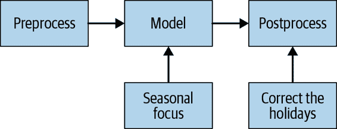

# 第十二章：现场经验教训

在本章中，我们收集了一些成功公司的故事，这些公司在高数据量和速度关键的情况下使用 Python。这些故事由每个组织中具有多年经验的关键人员撰写；他们不仅分享了他们的技术选择，还分享了一些宝贵的经验。我们为您带来了来自领域内其他专家的四个新故事。我们还保留了本书第一版的“现场经验教训”，其标题标有“(2014)”。

# 用 Feature-engine 简化特征工程流程

Soledad Galli (trainindata.com)

Train in Data 是一个由经验丰富的数据科学家和人工智能软件工程师领导的教育项目。我们帮助专业人士提高编码和数据科学技能，并采用机器学习最佳实践。我们开设先进的机器学习和人工智能软件工程的在线课程，并开发开源库，如 [Feature-engine](https://feature-engine.readthedocs.io)，以简化机器学习解决方案的交付过程。

## 机器学习的特征工程

机器学习模型接收大量输入变量并输出预测结果。在金融和保险领域，我们建立模型来预测诸如贷款偿还的可能性、申请欺诈的概率，以及事故后车辆应当修理还是更换的可能性。我们收集的数据几乎从不适合直接用于训练机器学习模型或返回预测结果。相反，我们在将数据馈送给机器学习算法之前会对变量进行广泛的转换。我们将变量转换的集合称为*特征工程*。

特征工程包括缺失数据的填充、分类变量的编码、数值变量的转换或离散化、将特征放置在相同的尺度上、将特征组合成新变量、从日期中提取信息、汇总交易数据，以及从时间序列、文本甚至图像中提取特征。每个特征工程步骤都有许多技术，您的选择将取决于变量的特征和您打算使用的算法。因此，当特征工程师在组织中构建和使用机器学习时，我们不再谈论单一的机器学习模型，而是谈论机器学习流水线，其中流水线的一大部分专注于特征工程和数据转换。

## 部署特征工程流水线的艰难任务

许多特征工程转换从数据中学习参数。我曾见过一些组织使用硬编码参数的配置文件。这些文件限制了灵活性，且难以维护（每次重新训练模型时，都需要用新的参数重新编写配置文件）。要创建性能高效的特征工程流水线，最好开发算法来自动学习和存储这些参数，而且还可以保存和加载，理想情况下作为一个对象。

在 Train in Data，我们在研究环境中开发机器学习流水线，并将其部署到生产环境中。这些流水线应该是可重复的。可重复性是准确复制一个机器学习模型的能力，这样，给定相同的数据作为输入，两个模型都会返回相同的输出。在研究和生产环境中利用相同的代码可以通过最小化需要重新编写的代码量，最大化可重复性来平滑地部署机器学习流水线。

特征工程转换需要进行测试。对每个特征工程过程进行单元测试，以确保算法返回所需的结果。在生产中进行广泛的代码重构以添加单元测试和集成测试非常耗时，并提供了引入错误的新机会，或者在研究阶段由于缺乏测试而引入的错误。为了最小化生产中的代码重构，最好在研究阶段开发工程算法时引入单元测试。

各项目中使用相同的特征工程转换。为了避免在拥有许多数据科学家的团队中经常发生的同一技术的不同代码实现，并增强团队绩效，加快模型开发速度，以及平滑模型操作化，我们希望重用先前构建和测试过的代码。最好的方法是创建内部包。创建包可能看起来很耗时，因为它涉及构建测试和文档。但从长远来看，这是更有效的，因为它允许我们逐步增强代码并添加新功能，同时重用已经开发和测试过的代码和功能。包开发可以通过版本控制来跟踪，甚至可以作为开源与社区共享，提升开发人员和组织的知名度。

## 利用开源 Python 库的力量

使用已建立的开源项目或彻底开发的内部库非常重要，原因如下：

+   经过良好开发的项目往往有详尽的文档，因此清楚每段代码的目的是什么。

+   已建立的开源包经过测试，以防止引入错误，确保转换达到预期的结果，并最大程度地实现可重复性。

+   成熟的项目已被社区广泛采纳和认可，这使您放心代码质量。

+   您可以在研究和生产环境中使用相同的包，最小化部署过程中的代码重构。

+   包被明确版本化，因此您可以部署您在开发管道时使用的版本，以确保可重现性，而新版本则持续添加功能。

+   开源包可以共享，因此不同的组织可以共同构建工具。

+   虽然开源包由一组经验丰富的开发者维护，但社区也可以贡献，提供新的想法和功能，从而提升包和代码的质量。

+   使用一个成熟的开源库减轻了我们编码的负担，提高了团队的表现、可重现性和协作能力，同时缩短了模型研究和部署的时间表。

像[scikit-learn](https://oreil.ly/j-4ob)，[Category encoders](https://oreil.ly/DtSL7)，和[Featuretools](https://oreil.ly/DOB7V)这样的开源 Python 库提供了特征工程的功能。为了扩展现有的功能并平滑创建和部署机器学习管道，我创建了开源 Python 包[Feature-engine](https://oreil.ly/CZrSB)，提供了一系列详尽的特征工程过程，并支持不同转换实施到不同的特征空间。

## 特征工程平滑了特征工程管道的构建和部署。

特征工程算法需要自动从数据中学习参数，返回一个有利于在研究和生产环境中使用的数据格式，并包含详尽的变换，以促进在项目中的采纳。Feature-engine 的构思和设计就是为了满足所有这些要求。Feature-engine 的转换器—即实施特征工程转换的类—从数据中学习并存储参数。Feature-engine 的转换器返回适合于数据分析和可视化的 Pandas 数据框架，这在研究阶段非常有用。Feature-engine 支持在单个对象中创建和存储整个端到端的工程管道，使部署更加容易。为了促进在项目中的采纳，它包含了详尽的特征转换列表。

Feature-engine 包括许多处理缺失数据、编码分类变量、转换和离散化数值变量以及移除或屏蔽异常值的过程。每个转换器可以自动学习，或者明确指定它应该修改的变量组。因此，转换器可以接收整个数据框架，但仅会改变所选变量组，无需额外的转换器或手动操作来切片数据框架然后重新连接它们。

Feature-engine 的转换器使用 scikit-learn 的 fit/transform 方法，并扩展其功能以包括其他工程技术。 Fit/transform 功能使 Feature-engine 的转换器可以在 scikit-learn 管道中使用。 因此，使用 Feature-engine，我们可以将整个机器学习管道存储为一个单一对象，该对象可以保存和检索或放置在内存中进行实时评分。

## 协助新开源包的采纳

无论一个开源包有多好，如果没有人知道它的存在或者社区不能轻松理解如何使用它，它都不会成功。 制作一个成功的开源包意味着制作性能良好，经过充分测试，良好文档和有用的代码—然后让社区知道它的存在，鼓励用户采用并建议新功能，并吸引开发者社区增加更多功能，改进文档和提高代码质量来提高其性能。 对于包开发者来说，这意味着我们需要考虑开发代码的时间，设计和执行共享策略。 以下是我和其他包开发者的一些有效策略。

我们可以利用成熟的开源功能的力量来促进社区的采用。 Scikit-learn 是 Python 中机器学习的参考库。 因此，在新包中采用 scikit-learn 的 fit/transform 功能可以使社区轻松快速地采用。 使用该实现的用户对使用该包的学习曲线较短。 一些利用 fit/transform 的包包括[Keras](https://keras.io)，Category encoders（也许是最著名的），当然还有 Feature-engine。

用户希望了解如何使用和分享该包，因此在代码存储库中包含声明这些条件的许可证。 用户还需要代码功能的说明和示例。 在代码文件的文档字符串中包含关于功能的信息和使用示例是一个良好的开始，但这还不足够。 广泛使用的包包括附加文档（可以使用 ReStructuredText 文件生成），其中包括代码功能的描述，使用示例和返回的输出，安装指南，包可用的渠道（PyPI，conda），如何入门，变更日志等。 良好的文档应该使用户能够在不阅读源代码的情况下使用库。 机器学习可视化库[Yellowbrick](https://oreil.ly/j96lT)的文档是一个很好的例子。 我也已经在 Feature-engine 中采用了这一做法。

如何提高软件包的可见性？我们如何接触潜在用户？开设在线课程可以帮助您接触更多人群，特别是在知名的在线学习平台上。此外，在[Read the Docs](https://readthedocs.org)上发布文档，创建 YouTube 教程，参加 meetup 和会议等活动都能增加可见度。在像 Stack Overflow、Stack Exchange 和 Quora 这样的成熟用户网络中，介绍软件包的功能并回答相关问题也很有帮助。Featuretools 和 Yellowbrick 的开发者已经利用了这些网络的力量。创建专用的 Stack Overflow 问题列表可以让用户提问，并显示软件包正在积极维护中。

## 开发、维护和鼓励对开源库的贡献

要使软件包成功且具有相关性，需要一个活跃的开发者社区。开发者社区由一个或者最好是一组专注的开发者或维护者组成，他们将关注整体功能、文档和发展方向。一个活跃的社区允许并欢迎额外的临时贡献者。

在开发软件包时需要考虑的一件事是代码的可维护性。代码越简单和短小，维护起来就越容易，这样吸引贡献者和维护者的可能性就越大。为了简化开发和维护工作，Feature-engine 利用了 scikit-learn 基础转换器的强大功能。Scikit-learn 提供了一个 API 和一堆基础类，开发者可以在此基础上构建新的转换器。此外，scikit-learn 的 API 提供了许多测试，以确保包与包之间的兼容性，以及转换器提供了预期功能。通过使用这些功能，Feature-engine 的开发者和维护者可以专注于特征工程功能，而基础代码的维护则由更大的 scikit-learn 社区负责。当然，这也有一个权衡。如果 scikit-learn 改变了其基础功能，我们需要更新我们的库以确保与最新版本兼容。其他使用 scikit-learn API 的开源软件包包括 Yellowbrick 和 Category encoders。

为了鼓励开发者合作，[NumFOCUS](https://numfocus.org) 建议制定行为准则，并鼓励包容和多样性。项目需要开放，通常意味着代码应该是公开托管的，并且有指导新贡献者了解项目开发和讨论的指南，如邮件列表或 Slack 频道。虽然一些开源 Python 库有自己的行为准则，其他如 Yellowbrick 和 Feature-engine 则遵循 [Python Community Code of Conduct](https://oreil.ly/8k4Tc)。许多开源项目，包括 Feature-engine，在 GitHub 上公开托管。贡献指南列出了新贡献者可以帮助的方式，例如修复错误、添加新功能或增强文档。贡献指南还告知新开发者贡献周期、如何分叉存储库、如何在贡献分支上工作、代码审查周期如何工作以及如何发起 Pull Request。

合作可以通过提升代码质量或功能，添加新功能以及改进文档，提升库的质量和性能。贡献可以简单到报告文档中的拼写错误，报告未返回预期结果的代码，或请求新功能。在开源库上合作也有助于提升合作者的知名度，同时让他们接触新的工程和编码实践，提高他们的技能。

许多开发者和数据科学家认为他们需要成为顶尖开发者才能为开源项目做贡献。我曾经也这样认为，这让我不敢贡献或请求功能——尽管作为用户，我清楚地知道哪些功能是可用的，哪些是缺失的。这远非事实。任何用户都可以为库做贡献。而包维护者喜欢贡献。

对于 Feature-engine 的有用贡献包括简单的事情，比如在 *.gitignore* 中添加一行，通过 LinkedIn 发送消息提醒我文档中的拼写错误，提交 PR 以纠正拼写错误本身，突出显示由较新版本的 scikit-learn 引起的警告问题，请求新功能或扩展单元测试的电池。

如果你想贡献但没有经验，查看包仓库中的问题是很有用的。问题是一系列对代码有优先级的修改列表。它们被标记为“代码增强”，“新功能”，“错误修复”或“文档”。首先，最好处理标记为“good first issue”或“good for new contributors”的问题；这些问题往往是较小的代码更改，可以让你熟悉贡献周期。然后你可以着手更复杂的代码修改。通过解决一个简单的问题，你将学到很多关于软件开发，Git 和代码审查周期的知识。

Feature-engine 目前是一个功能简单的小型包，代码实现直接。它易于导航，并且依赖较少，因此是贡献到开源项目的良好起点。如果您想开始，请与我联系。我将非常乐意听到您的消息。祝您好运！

# 高性能数据科学团队

Linda Uruchurtu（Fiit）

数据科学团队与其他技术团队不同，因为他们的工作范围取决于他们所处的位置和他们解决的问题类型。然而，无论团队负责回答“为什么”和“如何”的问题，还是仅仅交付完全操作的机器学习服务，为了成功交付，他们需要确保利益相关者满意。

这可能是具有挑战性的。大多数数据科学项目都存在一定程度的不确定性，而且由于利益相关者的类型不同，“满意”可能意味着不同的事情。有些利益相关者可能只关心最终交付物，而其他人可能关心副作用或通用接口。此外，有些人可能不具备技术背景，对项目的具体细节理解有限。在这里，我将分享一些我学到的在项目执行和交付方式上产生差异的经验教训。

## 需要多长时间？

这可能是数据科学团队领导经常被问到的问题。想象一下：管理层要求项目经理（PM）或负责交付的人解决一个特定的问题。项目经理去找团队，向他们展示这些信息，并要求他们计划一个解决方案。接着来自项目经理或其他利益相关者的问题：需要多长时间？

首先，团队应该提出问题，以更好地定义他们解决方案的范围。这些问题可能包括以下内容：

+   为什么这是一个问题？

+   解决此问题的影响是什么？

+   “完成”的定义是什么？

+   什么是满足定义的最小版本解决方案？

+   是否有办法在早期验证解决方案？

注意，“需要多长时间？”不在这个列表上。

策略应该是双管齐下的。首先，设定一个限时的期间来提出这些问题并提出一个或多个解决方案。一旦达成一致的解决方案，项目经理应该向利益相关者解释，团队可以在计划了解决方案工作后提供一个时间表。

## 发现与规划

团队有一定的时间来提出解决方案。接下来呢？他们需要提出假设，进行探索性工作和快速原型设计，依次保留或放弃潜在的解决方案。

根据所选择的解决方案，其他团队可能成为利益相关者。开发团队可能会有来自其持有的 API 的需求，或者它们可能成为服务的消费者；产品、运营、客户服务和其他团队可能会使用可视化和报告。项目经理的团队应该与这些团队讨论他们的想法。

一旦此过程完成，团队通常能够确定每个选项所带来的不确定性和/或风险有多少。项目经理现在可以评估哪个选项更可取。

一旦选择了一个选项，项目经理可以为里程碑和交付定义一个时间表。这里提出的有用点是：

+   交付物是否可以合理地审查和测试？

+   如果工作依赖于其他团队，能否安排工作以避免引入延迟？

+   团队能否从中间里程碑中提供价值？

+   是否有办法减少项目中存在显著不确定性部分的风险？

根据计划导出的任务可以进行规模化和时间分配，以提供时间估计。留出额外的时间是个好主意：有些人喜欢将他们认为需要的时间翻倍或翻三倍！

一些任务经常被低估和简化，包括数据收集和数据集构建，测试和验证。为模型构建获取良好的数据通常比起初看起来更复杂和昂贵。一种选择可能是从小数据集开始进行原型设计，并推迟进一步的收集工作。测试也是基础，既用于正确性又用于可重复性。输入是否符合预期？处理管道是否引入错误？输出是否正确？单元测试和集成测试应成为每个努力的一部分。最后，验证很重要，特别是在现实世界中。确保为所有这些任务考虑现实的估计。

一旦完成了这些步骤，团队不仅对“时间”问题有了答案，还有了一个每个人都能用来理解正在进行的工作的里程碑计划。

## 管理期望和交付

在交付之前可能需要的时间会受到许多问题的影响。注意以下几点以确保管理团队的期望：

范围蔓延

范围蔓延是工作范围微妙的移动，以便期望比最初计划的工作更多。配对和审查可以帮助减轻这种情况。

低估非技术任务

讨论、用户研究、文档编写和许多其他任务往往会被那些不熟悉它们的人低估。

可用性

团队成员的安排和可用性也可能会引入延迟。

数据质量问题

确保工作数据集可用并发现偏见来源，数据质量可能会引入复杂性，甚至使工作无效。

可选方案

当出现意外困难时，考虑其他方法可能是有道理的。然而，沉没成本可能会阻止团队想要提出这一点，这可能会延迟工作，并且有可能给人一种团队不知所措的印象。

缺乏测试

数据输入的突然变化或数据管道中的错误可能会使假设无效。从一开始就有良好的测试覆盖率将提高团队的速度，并在最后产生回报。

测试或验证困难

如果没有足够的时间进行测试和验证假设，计划可能会延迟。假设变更也可能导致测试计划的更改。

使用每周的完善和计划会议来发现问题，并讨论是否需要添加或移除任务。这将为项目经理提供足够的信息来更新最终的利益相关者。优先级也应该以相同的频率进行。如果有机会提前完成某些任务，应该抓住这些机会。

中间交付成果，特别是如果它们在项目范围之外提供价值，将不断证明工作的正当性。这对团队和利益相关者都是有利的，可以保持关注和士气，并让利益相关者感受到进展。持续重新绘制游戏计划、审查和调整迭代过程将确保团队有清晰的方向感和工作自由，同时提供足够的信息和价值，以保持利益相关者继续支持项目。

要在处理新项目时表现出色，你的数据科学团队主要应集中精力降低数据不确定性和业务需求不确定性的风险，通过交付轻量化的最小可行产品（MVP）解决方案（比如脚本和 Python 笔记本）。最初构想的 MVP 可能实际上比首个概念更精简或不同，根据随后的发现或业务需求变化。只有经过验证后，你才应继续推进到可投入生产的版本。

发现和规划过程至关重要，迭代思维同样重要。记住发现阶段始终在进行中，外部事件将始终影响计划。

# Numba

Valentin Haenel ([*http://haenel.co*](http://haenel.co))

*Numba* 是一个针对数值计算的 Python 的开源 JIT（即时编译）函数编译器。最初在 2012 年由 Continuum Analytics（现在的 Anaconda Inc）创建，它已经发展成为一个成熟的开源项目，在 GitHub 上拥有大量和多样化的贡献者。其主要用例是加速数值和/或科学 Python 代码。主要的入口点是装饰器——`@jit`装饰器，用于注释特定的函数，理想情况下是应用程序的瓶颈，这些函数将被即时编译，这意味着函数将在第一次或初始执行时编译。所有后续具有相同参数类型的执行将使用函数的编译变体，这应该比原始函数更快。

Numba 不仅可以编译 Python，还能识别 NumPy，并处理使用 NumPy 的代码。在底层，Numba 依赖于著名的[LLVM 项目](https://llvm.org)，这是一组模块化和可重用的编译器及工具链技术。此外，Numba 并非完整的 Python 编译器。它只能编译 Python 和 NumPy 的子集，尽管这个子集足够大，可以在广泛的应用中发挥作用。更多信息，请参阅[文档](https://numba.pydata.org)。

## 一个简单的例子

作为一个简单的例子，让我们使用 Numba 来加速一个 Python 实现的古老算法，用于找出所有不超过给定最大值(*N*)的素数：厄拉托斯特尼筛法。它的工作原理如下：

+   首先，初始化一个长度为*N*的布尔数组，所有值都为 true。

+   然后从第一个素数 2 开始，划掉（将布尔列表中相应位置设置为 false）所有不超过*N*的数字的倍数。

+   继续处理下一个尚未划掉的数字，即 3，在这种情况下再次划掉所有它的倍数。

+   继续处理数字并划掉它们的倍数，直到达到*N*。

+   当你达到*N*时，所有未被划掉的数字就是*N*以内的素数集合。

一个相对高效的 Python 实现可能看起来像这样：

```py
import numpy as np
from numba import jit

@jit(nopython=True)  # simply add the jit decorator
def primes(N=100000):
    numbers = np.ones(N, dtype=np.uint8)  # initialize the boolean array
    for i in range(2, N):
        if numbers[i] == 0:  # has previously been crossed off
            continue
        else:  # it is a prime, cross off all multiples
            x = i + i
            while x < N:
                numbers[x] = 0
                x += i
    # return all primes, as indicated by all boolean positions that are one
    return np.nonzero(numbers)[0][2:]
```

将此放入名为*sieve.py*的文件中后，您可以使用`%timeit`魔法来对代码进行微基准测试：

```py
In [1]: from sieve import primes

In [2]: primes()  # run it once to make sure it is compiled
Out[2]: array([    2,     3,     5, ..., 99971, 99989, 99991])

In [3]: %timeit primes.py_func()  # 'py_func' contains
                                  # the original Python implementation
145 ms ± 1.86 ms per loop (mean ± std. dev. of 7 runs, 10 loops each)

In [4]: %timeit primes()  # this benchmarks the Numba compiled version
340 µs ± 3.98 µs per loop (mean ± std. dev. of 7 runs, 1000 loops each)
```

这使速度提高了大约四百倍；实际效果可能有所不同。尽管如此，这里有一些值得注意的事项：

+   编译发生在函数级别。

+   简单地添加装饰器`@jit`就足以指示 Numba 编译函数。不需要对函数源代码进行其他修改，例如变量的类型注解。

+   Numba 识别 NumPy，因此此实现中的所有 NumPy 调用都得到支持，并且可以成功编译。

+   原始的、纯 Python 函数在编译函数中作为`py_func`属性可用。

这里有一个更快但不够教育的算法版本，其实现留给感兴趣的读者。

## 最佳实践和建议

对于 Numba 最重要的建议之一是尽可能使用 nopython 模式。要激活此模式，只需在`@jit`装饰器中使用`nopython=True`选项，就像素数示例中所示的那样。或者，您可以使用`@njit`装饰器别名，通过`from numba import njit`访问。在 nopython 模式下，Numba 尝试进行大量优化，可以显著提高性能。但是，此模式非常严格；为了成功编译，Numba 需要能够推断函数内所有变量的类型。

你也可以通过 `@jit(forceobj=True)` 使用对象模式。在这种模式下，Numba 变得非常宽容，可以编译的内容非常有限，这将显著地对性能产生负面影响。为了充分利用 Numba 的潜力，你应该真正使用 nopython 模式。

如果你不能决定是否要使用对象模式，可以选择使用对象模式块。当只有你的代码中的一小部分需要在对象模式下执行时，这将非常方便：例如，如果你有一个长时间运行的循环，并且希望使用字符串格式化来打印程序的当前进度。例如：

```py
from numba import njit, objmode

@njit()
def foo():
    for i in range(1000000):
        # do compute
        if i % 100000 == 0:
            with objmode:  # to escape to object-mode
                           # using 'format' is permissible here
                print("epoch: {}".format(i))

foo()
```

注意你使用的变量类型。Numba 非常适用于 NumPy 数组和其他数据类型的 NumPy 视图。因此，如果可以的话，应该将 NumPy 数组作为首选数据结构。元组、字符串、枚举和简单的标量类型如整数、浮点数和布尔值也得到了合理的支持。全局变量对于常量是可以的，但是将其余数据作为函数参数传递。Python 列表和字典不幸地支持得不太好。这在很大程度上源于它们可能是类型异构的：特定的 Python 列表可能包含不同类型的项；例如，整数、浮点数和字符串。这对 Numba 来说是个问题，因为它需要容器只包含单一类型的项才能编译它。然而，这两种数据结构可能是 Python 语言中最常用的特性之一，甚至是程序员最早学习的内容之一。

要弥补这个缺点，Numba 支持所谓的类型化容器：`typed-list` 和 `typed-dict`。这些是 Python 列表和字典的同类型变体。这意味着它们只能包含单一类型的项：例如，只包含整数值的 `typed-list`。除了这个限制，它们的行为与其 Python 对应物基本相同，并支持大部分相同的 API。此外，它们可以在常规 Python 代码中或在 Numba 编译的函数中使用，并且可以传递给和从 Numba 编译的函数中返回。这些功能来自于 `numba.typed` 子模块。这里是一个 `typed-list` 的简单示例：

```py
from numba import njit
from numba.typed import List

@njit
def foo(x):
    """ Copy x, append 11 to the result. """
    result = x.copy()
    result.append(11)
    return result

a = List() # Create a new typed-list
for i in (2, 3, 5, 7):
    # Add the content to the typed-list,
    # the type is inferred from the first item added.
    a.append(i)
b = foo(a) # make the call, append 11; this list will go to eleven
```

尽管 Python 有其局限性，但你可以重新思考它们，并理解在使用 Numba 时哪些可以安全地忽略。有两个具体的例子值得一提：调用函数和 `for` 循环。Numba 在底层 LLVM 库中启用了称为 *内联* 的技术，以优化调用函数的开销。这意味着在编译过程中，任何可进行内联的函数调用都将被替换为等效于被调用函数的代码块。因此，将一个大函数分解为几个或多个小函数以增强可读性和可理解性，几乎不会对性能产生影响。

Python 的一个主要批评是其`for`循环速度较慢。许多人建议在试图改善 Python 程序性能时使用替代构造：列表推导或甚至 NumPy 数组。Numba 不受此限制，并且在 Numba 编译函数中使用`for`循环是可以的。观察：

```py
from numba import njit

@njit
def numpy_func(a):
    # uses Numba's implementation of NumPy's sum, will also be fast in
    # Python
    return a.sum()

@njit
def for_loop(a):
    # uses a simple for-loop over the array
    acc = 0
    for i in a:
        acc += i
    return acc
```

现在我们可以对上述代码进行基准测试了：

```py
In [1]: ... # import the above functions

In [2]: import numpy as np

In [3]: a = np.arange(1000000, dtype=np.int64)

In [4]: numpy_func(a)  # sanity check and compile
Out[4]: 499999500000

In [5]: for_loop(a)  # sanity check and compile
Out[5]: 499999500000

In [6]: %timeit numpy_func(a)  # Compiled version of the NumPy func
174 µs ± 3.05 µs per loop (mean ± std. dev. of 7 runs, 10000 loops each)

In [7]: %timeit for_loop(a)    # Compiled version of the for-loop
186 µs ± 7.59 µs per loop (mean ± std. dev. of 7 runs, 1000 loops each)

In [8]: %timeit numpy_func.py_func(a)  # Pure NumPy func
336 µs ± 6.72 µs per loop (mean ± std. dev. of 7 runs, 1000 loops each)

In [9]: %timeit for_loop.py_func(a)    # Pure Python for-loop
156 ms ± 3.07 ms per loop (mean ± std. dev. of 7 runs, 10 loops each)
```

正如您所见，两个 Numba 编译的变体具有非常相似的性能特征，而纯 Python 的`for`循环实现比其编译版本慢得多（慢了 800 倍）。

如果您现在正在考虑将您的 NumPy 数组表达式重写为`for`循环，请不要这样做！正如前面的例子所示，Numba 完全支持 NumPy 数组及其相关函数。事实上，Numba 还有一个额外的优化技术，称为*循环融合*。Numba 主要在数组表达式操作上执行这种技术。例如：

```py
from numba import njit

@njit
def loop_fused(a, b):
    return a * b - 4.1 * a > 2.5 * b

In [1]: ... # import the example

In [2]: import numpy as np

In [3]: a, b = np.arange(1e6), np.arange(1e6)

In [4]: loop_fused(a, b)  # compile the function
Out[4]: array([False, False, False, ...,  True,  True,  True])

In [5]: %timeit loop_fused(a, b)
643 µs ± 18 µs per loop (mean ± std. dev. of 7 runs, 1000 loops each)

In [6]: %timeit loop_fused.py_func(a, b)
5.2 ms ± 205 µs per loop (mean ± std. dev. of 7 runs, 100 loops each)
```

正如您所见，Numba 编译版本比纯 NumPy 版本快 8 倍。到底发生了什么？没有 Numba，数组表达式将导致多个`for`循环和所谓的临时内存。泛泛地说，对于表达式中的每个算术操作，都必须执行一次数组的`for`循环，并且每次的结果必须存储在内存中的临时数组中。循环融合的作用是将各种算术操作的循环合并成一个单独的循环，从而减少总体内存查找次数和计算结果所需的总内存。实际上，循环融合的变体可能看起来像这样：

```py
import numpy as np
from numba import njit

@njit
def manual_loop_fused(a, b):
    N = len(a)
    result = np.empty(N, dtype=np.bool_)
    for i in range(N):
        a_i, b_i = a[i], b[i]
        result[i] = a_i * b_i - 4.1 * a_i > 2.5 * b_i
    return result
```

运行此代码将显示类似于循环融合示例的性能特征：

```py
In [1]: %timeit manual_loop_fused(a, b)
636 µs ± 49.1 µs per loop (mean ± std. dev. of 7 runs, 1000 loops each)
```

最后，我建议最初专注于串行执行，但要牢记并行执行的可能性。不要从一开始就假设只有并行版本才能达到目标性能特征。相反，专注于首先开发清晰的串行实现。并行化使得所有事情更难推理，并且在调试问题时可能会成为困难的源头。如果您对结果满意，仍然想调查并行化您的代码，Numba 确实带有`parallel=True`选项用于`@jit`装饰器以及相应的并行范围，`prange`结构，使得创建并行循环更容易。

## 获取帮助

截至 2020 年初，Numba 的两个主要推荐沟通渠道是[GitHub 问题跟踪器](https://oreil.ly/hXGfE)和[Gitter 聊天室](https://oreil.ly/8YGl1)；这是活动发生的地方。还有一个邮件列表和一个 Twitter 账户，但这些活动较少，主要用于宣布新发布和其他重要项目新闻。

# 优化与思考

Vincent D. Warmerdam，GoDataDriven 的高级人员（[*http://koaning.io*](http://koaning.io)）

这是一个团队解决错误问题的故事。我们在优化效率的同时忽略了效果。我希望这个故事能成为其他人的警示。这个故事实际上发生了，但我已经改变了部分内容，并且为了保持匿名性保留了细节。

我曾为一家面临常见物流问题的客户提供咨询：他们想预测将会抵达他们仓库的卡车数量。这是一个很好的商业案例。如果我们知道车辆的数量，我们就能知道需要多大的工作人员来处理当天的工作量。

规划部门多年来一直在尝试解决这个问题（使用 Excel）。他们对算法能否改善事物持怀疑态度。我们的工作是探索机器学习是否能在这里提供帮助。

从一开始就显而易见这是一个困难的时间序列问题：

+   由于仓库是国际运营的，我们需要记住许多（真的很多！）假期。假期的影响可能取决于一周中的某一天，因为仓库周末不开放。某些假期意味着需求会增加，而其他假期意味着仓库关闭（有时会导致三天的周末）。

+   季节性变化并不罕见。

+   供应商经常进入和退出市场。

+   由于市场不断变化，季节性模式始终在变化。

+   有许多仓库，虽然它们位于不同的建筑物中，但有理由相信抵达不同仓库的卡车数量是相关的。

图 12-1 中的图示了算法计算季节效应和长期趋势的过程。只要没有假期，我们的方法就可以运行。规划部门警告我们这一点；假期是难点。在花费了大量时间收集相关特征之后，我们最终建立了一个主要专注于尝试应对假期的系统。



###### 图 12-1\. 季节效应和长期趋势

所以我们进行了迭代，进行了更多的特征工程，并设计了算法。我们到了需要为每个仓库计算一个时间序列模型的程度，这个模型将通过每个假期每天的启发式模型进行后处理。假期在周末前会引起不同的变化，而在周末后的假期则会引起另一种变化。可以想象，当你想要进行网格搜索时，这个计算变得非常昂贵，正如在 图 12-2 中所示。


###### 图 12-2\. 许多变体消耗了大量计算时间

我们必须准确估算许多影响因素，包括过去测量数据的衰减、季节效应的平滑程度、正则化参数以及如何处理不同仓库之间的相关性。

预测未来几个月的需要并不是一件容易的事情。另一个困难是成本函数：它是离散的。规划部门并不关心（甚至不欣赏）均方误差，他们只关心预测误差超过 100 辆卡车的天数。

除了统计问题，您可以想象模型还引发了性能问题。为了避免这种情况，我们限制使用更简单的机器学习模型。通过这样做，我们大大提高了迭代速度，这使我们能够专注于特征工程。几周后，我们得到了一个可以展示的版本。尽管如此，除了假期之外，我们仍然制作了一个表现良好的模型。

模型进入了概念验证阶段；它表现得相当不错，但并没有比当前规划团队的方法显著更好。这个模型很有用，因为它允许规划部门反思模型的意见，但没有人愿意让模型自动化规划。

然后发生了。这是我与客户的最后一周，就在同事接替我的前一刻。我和一位分析师在咖啡角闲聊，讨论我需要他提供数据的另一个项目。我们开始审查数据库中可用的表格。最后，他告诉我一个“卡车”表（如图 12-3 所示）。

我：“‘卡车’表？里面有什么？” 分析师：“哦，它包含所有卡车的订单。” 我：“供应商从仓库购买它们？” 分析师：“不，实际上是租赁的。他们通常在返回填充货物的几天前租赁它们三到五天。” 我：“所有的供应商都是这样操作的？” 分析师：“差不多。”


###### 图 12-3. 卡车包含了这个挑战至关重要的主要信息！

我发现了所有问题中最显著的性能问题：我们解决的是错误的问题。这不是一个机器学习问题，而是一个 SQL 问题。租用的卡车数量是公司将派出多少辆卡车的一个强有力的代理。他们不需要一个机器学习模型。我们可以预测未来几天租用的卡车数量，除以一个卡车能容纳的卡车数量，从而得出一个合理的预测。如果我们早些意识到这一点，我们就不需要为一个巨大的网格搜索优化代码了，因为根本没有这种需要。

将业务案例转化为不反映现实的分析问题相对直接。任何可以防止这种情况发生的措施都将产生你无法想象的最显著的性能优势。

# Adaptive Lab 的社交媒体分析（2014）

Ben Jackson ([adaptivelab.com](http://www.adaptivelab.com/))

Adaptive Lab 是一家位于伦敦科技城区域 Shoreditch 的产品开发和创新公司。我们采用精益、用户中心的产品设计和交付方法，与从初创公司到大型企业的广泛合作伙伴共同合作。

YouGov 是一家全球市场研究公司，其宣称的目标是提供持续、准确的数据和洞察力，了解全球人们的思想和行为，而我们正是为其实现了这一目标。Adaptive Lab 设计了一种 passively 监听社交媒体上实时讨论并获取用户对各种主题感受的方法。我们构建了一个可扩展的系统，能够捕获大量流数据，实时处理、长期存储，并通过强大、可过滤的界面实时展示。该系统基于 Python 构建。

## Python 在 Adaptive Lab 的应用

Python 是我们的核心技术之一。我们在性能关键的应用程序中使用它，并在与具备内部 Python 技能的客户合作时也同样如此，以便他们能够内部化我们为他们提供的工作。

Python 非常适合于小型、独立的长期运行守护进程，也同样适合灵活、功能丰富的 Web 框架，如 Django 和 Pyramid。Python 社区蓬勃发展，这意味着有大量的开源工具库可供使用，让我们能够快速、自信地构建项目，专注于创新和解决用户问题。

在所有项目中，Adaptive Lab 重复使用几个基于 Python 构建的工具，这些工具可以以与语言无关的方式使用。例如，我们使用 SaltStack 进行服务器配置和 Mozilla 的 Circus 管理长期运行的进程。当一个工具是开源的，并且使用我们熟悉的语言编写时，如果我们遇到任何问题，我们可以自行解决，并将解决方案推广，从而造福社区。

## SoMA 的设计

我们的社交媒体分析（SoMA）工具需要处理大量社交媒体数据，并实时存储和检索大量信息。在研究了各种数据存储和搜索引擎后，我们选择了 Elasticsearch 作为我们的实时文档存储。正如其名，它具有高可扩展性，同时易于使用，能够提供统计响应和搜索功能，非常适合我们的应用场景。Elasticsearch 本身基于 Java 构建，但像现代系统中设计良好的任何组件一样，它具有良好的 API，并且有 Python 库和教程支持。

我们设计的系统使用 Celery 在 Redis 中的队列，快速将大量数据流交给任意数量的服务器进行独立处理和索引。整个复杂系统的每个组件都设计为小型、简单且能够独立工作。每个组件专注于一个任务，例如分析对话的情感或为索引到 Elasticsearch 准备文档。其中一些配置为使用 Mozilla 的 Circus 作为守护进程运行，它保持所有进程运行并允许根据单个服务器的需要进行扩展或缩减。

SaltStack 用于定义和配置复杂的集群，并处理所有库、语言、数据库和文档存储的设置。我们还使用了 Fabric，这是一个用于在命令行上运行任意任务的 Python 工具。在代码中定义服务器有很多好处：完全与生产环境一致；配置的版本控制；所有内容都在一个地方。它还作为集群设置和依赖项的文档。

## 我们的开发方法论

我们的目标是尽可能简化新加入项目的新人快速投入添加代码和自信部署的过程。我们使用 Vagrant 在本地构建系统的复杂性，放在一个完全与生产环境一致的虚拟机中。一个简单的 `vagrant up` 就是新人启动所需的所有依赖项的全部。

我们以敏捷方式工作，共同规划，讨论架构决策，并就任务估算达成共识。对于 SoMA，我们决定每个迭代都包括至少几个被视为技术债务修正的任务。还包括为系统编写文档的任务（我们最终建立了一个维基，用于存放这个不断扩展的项目的所有知识）。团队成员在每个任务之后互相审查代码，进行合理性检查、提供反馈，并理解即将添加到系统中的新代码。

一个良好的测试套件有助于增强信心，确保任何更改不会导致现有功能失败。在像 SoMA 这样由许多组件组成的系统中，集成测试至关重要。一个分级环境提供了测试新代码性能的方式；特别是在 SoMA 中，只有通过针对生产环境中看到的大数据集进行测试，才能发现问题并加以解决，因此通常需要在一个单独的环境中复制该数据量。亚马逊的弹性计算云（EC2）为我们提供了这种灵活性。

## 维护 SoMA

SoMA 系统持续运行，每天消耗的信息量不断增加。我们必须考虑数据流高峰、网络问题以及任何第三方服务提供商可能存在的问题。因此，为了简化操作，SoMA 被设计成可以自我修复。借助 Circus，崩溃的进程将重新启动并从上次停止的地方继续任务。任务将排队等待进程消耗，系统在恢复期间有足够的时间堆积任务。

我们使用 Server Density 来监控多台 SoMA 服务器。设置非常简单，但功能强大。一旦可能发生问题，指定工程师可以通过手机即时接收推送消息，以便及时反应，确保问题不会扩大。使用 Server Density，还可以非常轻松地用 Python 编写自定义插件，例如设置 Elasticsearch 行为的即时警报。

## 同行工程师的建议

最重要的是，您和您的团队需要确信和放心，即将部署到实时环境中的内容将完美无缺地运行。为了达到这一点，您必须向后推进，花时间处理系统的所有组件，这些组件将让您感到放心。简化并确保部署无误；使用分段环境测试具有真实数据的性能；确保您拥有一个覆盖率高的良好且稳固的测试套件；实施将新代码整合到系统中的流程；并确保尽早解决技术债务。您加固技术基础并改进流程的越多，您的团队在工程问题上找到正确解决方案的成功和满意程度就越高。

如果没有坚实的代码和生态系统基础，但业务要求您立即上线，这只会导致问题软件。您有责任推迟时间，逐步改进代码、测试和操作，以便顺利完成上线工作。

# 让深度学习飞起来（2014）

Radim Řehůřek（[*radimrehurek.com*](http://www.radimrehurek.com)）

当 Ian 要求我在这本书上写关于 Python 和优化的“现场经验”时，我立刻想到：“告诉他们如何比 Google 的 C 原版更快地编写 Python 移植版！”这是一个鼓舞人心的故事，讲述了如何使一个机器学习算法，Google 深度学习的招牌案例，比朴素的 Python 实现快 12,000 倍。任何人都可以写出糟糕的代码，然后大肆宣扬巨大的加速。但优化后的 Python 移植版本，令人惊讶地运行速度几乎是 Google 团队原始代码的四倍快！也就是说，比 Google 团队编写的不透明、严密优化的 C 代码快了四倍。

但在得出“机器级”优化经验之前，先谈一些关于“人类级”优化的通用建议。

## 黄金时机

我经营一家专注于机器学习的小型咨询公司，我和我的同事帮助公司理清数据分析的混乱世界，以赚钱或节省成本（或两者兼有）。我们帮助客户设计和构建用于数据处理的奇妙系统，特别是文本数据。

客户群体涵盖了从大型跨国公司到新兴初创企业，尽管每个项目都不同且需要不同的技术堆栈，但插入客户现有的数据流和管道时，Python 显然是首选。不是向信徒宣教，但 Python 的务实开发理念、其可塑性以及丰富的库生态使其成为理想的选择。

首先，关于有效的几点看法：“实地”经验告诉我们：

沟通，沟通，沟通

这一点显而易见，但值得重复。在决定方法之前，先在更高（商业）层面上了解客户的问题。坐下来讨论他们认为自己需要什么（基于他们对可能发生的事情部分了解和/或在联系你之前通过谷歌搜索到的信息），直到清楚他们真正需要什么，摆脱多余的东西和成见。同意在之前验证解决方案的方法。我喜欢将这个过程形象化为一条漫长曲折的道路：确保起点正确（问题定义、可用数据源），终点正确（评估、解决方案优先级），中间的路径就自然而然地展开。

保持对有前景的技术保持警惕

一种新兴技术，被合理理解且稳健，正在逐渐流行，但在行业中仍相对较为陌生，能为客户（或你自己）带来巨大价值。例如，几年前，Elasticsearch 是一个鲜为人知且有些粗糙的开源项目。但我认为它的方法可靠（建立在 Apache Lucene 之上，提供复制、集群分片等功能），并建议客户使用。我们随后构建了以 Elasticsearch 为核心的搜索系统，与考虑的替代方案（大型商业数据库）相比，为客户节省了大量的授权、开发和维护成本。更重要的是，使用这种新的、灵活且强大的技术为产品赋予了巨大的竞争优势。如今，Elasticsearch 已进入企业市场，不再具有竞争优势—每个人都知道它并使用它。抓住时机，达到我所说的“黄金时机”，最大化价值/成本比。

KISS（保持简单，愚蠢！）

这是另一个不需要考虑的问题。最好的代码是你不必编写和维护的代码。从简单开始，并在必要时改进和迭代。我更喜欢遵循 Unix 哲学的工具，“做一件事，并做好它”。大型编程框架可能很诱人，几乎包含了一切，并且整洁地组合在一起。但不可避免地，迟早会需要一些大型框架没有考虑到的东西，然后即使是看似简单的修改（在概念上）也会在程序上演变成噩梦。大型项目及其包罗万象的 API 往往会因自身臃肿而崩溃。使用模块化的、专注的工具，并尽可能使用小而简单的 API 之间的接口。除非性能要求不允许，否则请优先选择可以简单视觉检查的文本格式。

使用数据管道中的手动健全性检查

当优化数据处理系统时，很容易陷入“二进制思维”模式，使用紧凑的管道、高效的二进制数据格式和压缩的 I/O。随着数据在系统中通过，未经检查（除了可能的类型），它仍然是看不见的，直到出现明显问题。然后开始调试。我建议在代码中的各个内部处理点上撒些简单的日志消息，显示数据在不同内部点的样子，这是一种良好的实践——什么都不花哨，只是类似 Unix 的`head`命令，选择和可视化几个数据点。这不仅有助于前面提到的调试，而且在一切看似顺利的情况下，以人类可读的格式查看数据时，常常会有“啊哈！”的时刻。奇怪的标记化！他们承诺输入始终以 latin1 编码！图像文件泄漏到期望和解析文本文件的管道中！这些通常是超出自动类型检查或固定单元测试所能提供的洞察，暗示着超出组件边界的问题。现实世界的数据是混乱的。早点捕捉即使不会导致异常或显著错误的事情，也是个好主意。在冗长方面保持谨慎。

谨慎地应对时尚潮流

仅仅因为客户一直听说 X 并说他们也必须要 X，并不意味着他们真的需要。这可能是一个市场问题而不是技术问题，因此要小心分辨二者，并相应地交付。X 随着时间的推移会发生变化，随着炒作浪潮的来来去去；最近的价值会是 X = 大数据。

行了，足够商业化了——这是我如何让 Python 中的*word2vec*比 C 运行得更快的方法。

## 优化的教训

[*word2vec*](https://oreil.ly/SclZ0) 是一种深度学习算法，允许检测相似的词语和短语。在文本分析和搜索引擎优化（SEO）中有着有趣的应用，并且附有 Google 光辉的品牌名称，吸引了初创公司和企业纷纷利用这一新工具。

不幸的是，唯一可用的代码是由 Google 自己生成的，这是一个用 C 语言编写的开源 Linux 命令行工具。这是一个经过优化但相当难以使用的实现。我决定将*word2vec*移植到 Python 的主要原因是为了能够将*word2vec*扩展到其他平台，使其更易于集成和扩展以供客户使用。

这里不涉及细节，但*word2vec*需要一个训练阶段，使用大量输入数据来生成一个有用的相似性模型。例如，谷歌的人员在他们的 GoogleNews 数据集上运行了*word2vec*，大约训练了 1000 亿字。显然，这种规模的数据集不适合 RAM，因此必须采取一种内存高效的方法。

我撰写了一个机器学习库，[`gensim`](https://oreil.ly/6SYgs)，正好解决这种内存优化问题：数据集不再是微不足道的（“微不足道”是指完全适合 RAM 的任何东西），但也不大到需要 PB 级 MapReduce 计算机集群。这种“TB”级问题适用于令人惊讶地大部分真实案例，*word2vec*也包括在内。

细节在我的博客中有描述，但这里有一些优化的要点：

流式处理数据，注意内存使用

让您的输入逐个数据点访问和处理，以获得小而恒定的内存占用。流式数据点（在*word2vec*中为句子）可以在内部分组成更大的批次以提高性能（例如一次处理 100 个句子），但高级别的流式 API 证明是一个强大且灵活的抽象。Python 语言非常自然和优雅地支持这种模式，借助其内置的生成器——这是一个真正美丽的问题技术匹配。除非您知道数据始终保持较小，或者您不介意以后自己重新实现生产版本，否则应避免依赖于将所有内容加载到 RAM 的算法和工具。

充分利用 Python 丰富的生态系统

我从一个可读性强、干净的*numpy*端口开始。`numpy`在本书的第六章中有详细介绍，但简要提醒一下，它是一个了不起的库，是 Python 科学社区的基石，也是 Python 中数字计算的事实标准。利用`numpy`强大的数组接口、内存访问模式以及包装的 BLAS 例程进行超快速的常见向量操作，可以编写简洁、干净和快速的代码——这种代码比天真的 Python 代码快上数百倍。通常在这一点上我会收工，但是“数百倍快”仍然比谷歌优化的 C 版本慢 20 倍，因此我继续努力。

分析和编译热点代码

*word2vec* 是一个典型的高性能计算应用程序，其中一个内部循环中几行代码占整个训练运行时间的 90%。在这里，我用外部 Python 库 Cython 重写了一个单核心例程（大约 20 行代码），作为粘合剂。虽然从技术上讲它很出色，但我认为概念上 Cython 并不是一个特别方便的工具——它基本上就像学习另一种语言，一个不直观的 Python、`numpy` 和 C 的混合体，有它自己的注意事项和特殊性。但在 Python 的 JIT 技术成熟之前，Cython 可能是我们的最佳选择。通过 Cython 编译的热点，Python *word2vec* 的性能现在与原始 C 代码相当。从一个干净的 `numpy` 版本开始的额外优势是，通过与较慢但正确的版本进行比较，我们可以获得免费的正确性测试。

了解你的 BLAS

`numpy` 的一个巧妙特性是它在内部包装了基本线性代数子程序（BLAS），如果可用的话。这些是由处理器供应商（Intel、AMD 等）直接优化的低级例程，使用汇编、Fortran 或 C 设计，旨在从特定处理器架构中挤出最大性能。例如，调用 axpy BLAS 例程计算 `vector_y += scalar * vector_x` 比一个等效的显式 `for` 循环产生的代码快得多。将 *word2vec* 训练表达为 BLAS 操作导致另外 4 倍速度提升，超过了 C *word2vec* 的性能。胜利！公平地说，C 代码也可以链接到 BLAS，所以这并不是 Python 本质上的某种固有优势。`numpy` 只是让这类事情显现并且易于利用。

并行化和多核

`gensim` 包含了几种算法的分布式集群实现。对于 *word2vec*，我选择在单台机器上进行多线程处理，因为其训练算法的精细化特性。使用线程还允许我们避免 Python 的 multiprocessing 带来的 fork-without-exec POSIX 问题，特别是与某些 BLAS 库结合使用时。因为我们的核心例程已经在 Cython 中，我们可以释放 Python 的 GIL（全局解释器锁；参见“使用 OpenMP 在一台机器上并行化解决方案”），通常情况下对于 CPU 密集型任务来说，多线程是无用的。加速：在四核机器上再次提升 3 倍。

静态内存分配

在这一点上，我们每秒处理数以万计的句子。训练速度非常快，以至于甚至像创建一个新的 `numpy` 数组（为每个流式句子调用 `malloc`）这样的小事情也会拖慢我们的速度。解决方案：预先分配一个静态的“工作”内存并在代码中传递，像 Fortran 一样。让我眼泪汪汪。这里的教训是尽可能将尽可能多的簿记和应用逻辑保持在干净的 Python 代码中，并使优化的热点保持简洁高效。

问题特定优化

原始的 C 实现包含特定的微优化，比如将数组对齐到特定的内存边界或将某些函数预先计算到内存查找表中。这是对过去的怀旧，但是在今天复杂的 CPU 指令流水线、内存高速缓存层次结构和协处理器中，这样的优化已经不再是明显的赢家。仔细的分析表明，有几个百分点的改进，可能并不值得额外的代码复杂性。教训：使用注解和分析工具突出显示优化不佳的地方。利用您的领域知识引入算法近似，以在精度和性能之间进行权衡（或反之）。但千万不要凭信仰；尽量使用真实的生产数据进行分析。

## 结论

在适当的地方进行优化。根据我的经验，从来没有足够的沟通来完全确定问题范围、优先级和与客户业务目标的联系——即“人为级别”的优化。确保您解决的是一个重要问题，而不是为了“极客”的事情而迷失方向。当您卷起袖子时，确保它是值得的！

# 在 Lyst.com 上进行大规模生产机器学习（2014 年）

Sebastjan Trepca（[lyst.com](http://www.lyst.com)）

自从网站创建以来，Python 和 Django 一直是 Lyst 的核心。随着内部项目的发展，一些 Python 组件已被其他工具和语言替换，以适应系统日益成熟的需求。

## 集群设计

集群在 Amazon EC2 上运行。总共有大约 100 台机器，其中包括最近的 C3 实例，其 CPU 性能良好。

Redis 用于使用 PyRes 进行排队和存储元数据。主要数据格式为 JSON，以便人类理解。

Elasticsearch 和 PyES 用于索引所有产品。Elasticsearch 集群在七台机器上存储了 6000 万个文档。已调查 Solr，但由于其缺乏实时更新功能而被排除在外。

## 在快速发展的初创公司中的代码演进

最好编写可以快速实现的代码，以便测试业务理念，而不是花费很长时间试图在第一次尝试中编写“完美的代码”。如果代码有用，它可以重构；如果代码背后的理念不好，删除它并移除一个功能是很廉价的。这可能会导致一个复杂的代码库，其中传递了许多对象，但只要团队有时间重构对业务有用的代码，这是可以接受的。

在 Lyst 中大量使用文档字符串——尝试使用外部 Sphinx 文档系统，但因为只需阅读代码而放弃了。维基用于记录流程和更大的系统。我们还开始创建非常小的服务，而不是将所有内容都放入一个代码库。

## 构建推荐引擎

最初推荐引擎是用 Python 编写的，使用 `numpy` 和 `scipy` 进行计算。随后，推荐器的性能关键部分使用 Cython 加速。核心矩阵因子分解操作完全使用 Cython 编写，速度提升一个数量级。这主要是由于在 Python 中能够编写高性能的 `numpy` 数组循环，这在纯 Python 中非常慢，并且在向量化时性能表现不佳，因为它需要对 `numpy` 数组进行内存复制。罪魁祸首是 `numpy` 的花式索引，它总是会对被切片的数组进行数据复制：如果不需要或不打算进行数据复制，Cython 循环将会快得多。

随着时间的推移，系统的在线组件（负责在请求时计算推荐）已经集成到我们的搜索组件 Elasticsearch 中。在这个过程中，它们被转换为 Java，以便与 Elasticsearch 完全集成。这样做的主要原因不是性能，而是将推荐器与搜索引擎的全部功能结合起来，更容易地应用业务规则来提供推荐。Java 组件本身非常简单，主要实现了高效的稀疏向量内积。更复杂的离线组件仍然使用 Python 编写，使用了 Python 科学栈的标准组件（主要是 Python 和 Cython）。

根据我们的经验，Python 不仅仅是原型设计语言：诸如 `numpy`、Cython 和 `weave`（最近还有 Numba）等工具的可用性，使我们能够在代码的性能关键部分实现非常好的性能，同时保持 Python 的清晰和表达力，在低级别优化可能适得其反的情况下尤为如此。

## 报告和监控

Graphite 用于报告。目前，部署后可以通过肉眼看到性能回归。这使得可以轻松地深入详细的事件报告，或者放大以查看站点行为的高级报告，根据需要添加和删除事件。

在内部，正在设计一个更大的基础设施用于性能测试。它将包括代表性数据和用例，以适当地测试站点的新版本构建。

还将使用一个暂存站点，让少数真实访问者看到最新版本的部署——如果发现错误或性能回归，将只会影响少数访问者，并且可以快速撤销该版本。这将大大减少错误部署的成本和问题。

Sentry 用于记录和诊断 Python 的堆栈跟踪。

Jenkins 用于带有内存数据库配置的持续集成（CI）。这使得可以并行测试，以便快速发现开发者的任何错误。

## 一些建议

拥有好的工具跟踪你所构建内容的有效性非常重要，并且在开始阶段要非常务实。创业公司经常变化，工程也在演进：你从一个超级探索阶段开始，一直建立原型并删除代码，直到找到金矿，然后你开始深入，改进代码、性能等。在那之前，一切都是关于快速迭代和良好的监控/分析。我想这是被反复重复的标准建议，但我认为许多人并不真正理解它的重要性。

我认为现在技术并不那么重要，所以使用能解决问题的任何技术即可。不过，我会再三考虑迁移到像 App Engine 或 Heroku 这样的托管环境。

# 在 Smesh 进行的大规模社交媒体分析（2014）

Alex Kelly（[*sme.sh*](http://www.sme.sh)）

在 Smesh，我们制作软件，从网络上各种 API 摄取数据；过滤、处理和聚合数据；然后使用这些数据为多样的客户构建定制的应用程序。例如，我们为 Beamly 的第二屏电视应用提供推文过滤和流服务技术，为移动网络 EE 运行品牌和活动监控平台，并为 Google 运行多个 Adwords 数据分析项目。

为此，我们运行各种流媒体和轮询服务，频繁地从 Twitter、Facebook、YouTube 等服务中获取内容，并每天处理数百万条推文。

## Python 在 Smesh 的角色

我们广泛使用 Python——我们的平台和服务的大部分都是用它构建的。可用的各种库、工具和框架使我们能够在大多数工作中使用它。

这种多样性使我们能够（希望能够）为工作选择合适的工具。例如，我们使用 Django、Flask 和 Pyramid 创建了应用程序。每种工具都有其独特的优点，我们可以根据手头任务选择适合的工具。我们使用 Celery 处理任务；使用 Boto 与 AWS 交互；以及 PyMongo、MongoEngine、redis-py、Psycopg 等满足所有数据需求。清单还在继续。

## 平台

我们的主要平台由一个中心 Python 模块组成，提供数据输入、过滤、聚合和处理的钩子，以及各种其他核心功能。项目特定的代码从核心导入功能，然后实现更具体的数据处理和视图逻辑，因为每个应用程序都有不同的需求。

到目前为止，这种方式对我们运作得很好，并且允许我们构建相当复杂的应用程序，从各种来源摄取和处理数据，减少了大量的重复工作。不过，这并非没有缺点——每个应用程序都依赖于一个共同的核心模块，更新该模块的代码并保持使用它的所有应用程序的更新是一项重大任务。

我们目前正在进行一个项目，重新设计核心软件，并朝着更多的面向服务的架构 (SoA) 方法迈进。看起来，找到进行这种架构变更的合适时机是大多数软件团队在平台发展中面临的挑战之一。构建组件作为单独服务存在开销，并且通常只有通过开发的初步迭代获取构建每个服务所需的深层领域特定知识时，这种架构开销才会成为解决实际问题的障碍。希望我们选择了一个明智的时机来重新审视我们的架构选择，推动事物向前发展。时间将会告诉我们结果。

## 高性能实时字符串匹配

我们从 Twitter Streaming API 大量获取数据。当我们流式传入推文时，我们会将输入字符串与一组关键词进行匹配，以便知道每条推文与我们正在追踪的哪些术语相关联。当输入速率较低或关键词集较小时，并不是问题，但是每秒处理数百条推文，同时匹配数百甚至数千个可能的关键词，开始变得棘手起来。

更棘手的是，我们不仅对推文中的关键词字符串是否存在感兴趣，而是对单词边界、行的起始和结束，以及可选的在字符串前缀使用 # 和 @ 字符进行更复杂的模式匹配感兴趣。封装这些匹配知识的最有效方式是使用正则表达式。然而，每秒在数百条推文上运行成千上万个正则表达式模式是计算密集的。此前，我们必须在一组机器的集群上运行许多工作节点，以确保能够实时可靠地执行匹配。

了解这一点是系统中的一个主要性能瓶颈，我们尝试了多种方法来改善匹配系统的性能：简化正则表达式、运行足够的进程以确保我们充分利用服务器上的所有核心、确保所有的正则表达式模式都得到正确编译和缓存、在 PyPy 而不是 CPython 下运行匹配任务等。这些方法每种都带来了一点性能提升，但显然这种方法只能节约少量处理时间。我们希望获得数量级的加速，而不是小幅度改善。

很明显，我们需要在进行模式匹配之前，缩小问题空间，而不是试图提高每次匹配的性能。因此，我们需要减少要处理的推文数，或者减少需要对推文进行匹配的正则表达式模式数量。丢弃传入的推文并不是一个选择——那是我们感兴趣的数据。因此，我们着手寻找一种方法，以减少我们需要将传入推文与之比较的模式数量，以进行匹配。

我们开始研究各种字典树结构，以更高效地进行字符串集之间的模式匹配，并了解到了 Aho-Corasick 字符串匹配算法。对于我们的使用场景来说，它非常理想。用于构建字典树的词典必须是静态的——在确定自动机后不能向字典树添加新成员——但对我们来说，这不是问题，因为关键词集合在 Twitter 会话期间是静态的。当我们改变正在跟踪的术语时，我们必须断开并重新连接 API，这样我们可以同时重建 Aho-Corasick 字典树。

使用 Aho-Corasick 对输入字符串进行处理可以同时找到所有可能的匹配项，逐个字符地遍历输入字符串，并在字典树的下一级找到匹配的节点（或者没有找到）。因此，我们可以非常快速地找到推文中可能存在的关键词。尽管我们仍然不确定，因为 Aho-Corasick 的纯字符串匹配不能应用任何复杂逻辑，这些逻辑通常包含在正则表达式模式中，但我们可以将 Aho-Corasick 匹配视为预过滤器。不存在于字符串中的关键词不可能匹配，因此我们只需基于文本中出现的关键词处理少量正则表达式模式，而不是对每个输入都评估数百或数千个正则表达式模式。

通过减少我们尝试匹配每条传入推文的模式数量，仅保留少量模式，我们已经成功实现了所期望的加速效果。根据字典树的复杂性和输入推文的平均长度不同，我们的关键词匹配系统现在比原始的简单实现快了 10 到 100 倍。

如果你经常进行正则表达式处理或其他模式匹配工作，我强烈建议你详细了解不同变体的前缀和后缀字典树，这可能会帮助你找到解决问题的极快速度的解决方案。

## 报告、监控、调试和部署

我们管理多个运行我们的 Python 软件和支持其所有基础设施的系统。保持一切运行无中断可能会有些棘手。以下是我们在这个过程中学到的几个经验教训。

能够实时和历史上看到系统内部发生的情况真的非常强大，无论是在你自己的软件内部还是其运行的基础设施上。我们使用 **Graphite** 与 `collectd` 以及 `statsd` 来绘制系统状态的漂亮图表。这为我们提供了一种发现趋势和回顾性地分析问题以找出根本原因的方法。我们还没有开始实施，但 Etsy 的 **Skyline** 看起来也是一个很好的工具，用来在你有更多指标需要跟踪时发现意外情况。另一个有用的工具是 **Sentry**，一个非常棒的事件日志系统，用于跟踪一组机器上发生的异常。

无论你使用什么来进行部署，部署都可能是痛苦的。我们曾经使用过 **Puppet**，**Ansible** 和 **Salt**。它们各有优缺点，但没有一个能够魔法般地解决复杂的部署问题。

为了保持某些系统的高可用性，我们在全球多个地理位置分布的基础设施集群上运行多个实例，将一个系统设为活动实例，其他系统作为热备份，并通过低 TTL（Time-to-Live）值的 DNS 更新来进行切换。显然，这并不总是简单的，特别是在数据一致性方面有严格的约束时。幸运的是，我们并没有受到太大的影响，使得这种方法相对来说还是相当简单的。这也为我们提供了一个相对安全的部署策略，更新一个备用集群并在晋升该集群为活动实例并更新其他集群之前进行测试。

与其他人一样，我们对使用 [Docker](http://www.docker.com) 能够实现的可能性感到非常兴奋。也和几乎所有人一样，我们仍然处于摸索阶段，试图弄清楚如何将其融入我们的部署流程中。然而，能够以轻量且可重现的方式快速部署我们的软件，包括所有二进制依赖项和系统库，似乎就在不远的将来。

在服务器级别，有一大堆例行公事能够让生活更轻松。**Monit** 对于帮助你监控事物非常有用。**Upstart** 和 `supervisord` 则使得运行服务变得更加轻松。如果你没有使用完整的 **Graphite**/**collectd** 设置，**Munin** 对于一些快速简易的系统级图形显示也是非常有用的。而 **Corosync**/**Pacemaker** 则可以成为在集群节点上运行服务的良好解决方案（例如，当你有一堆需要在某处但不是每处运行的服务时）。

我尽量不只是列出流行词汇，而是指向我们每天都在使用的软件，这些软件确实在我们能有效部署和运行系统的效率上起到了巨大的作用。如果你已经听说过它们了，我相信你一定还有许多其他有用的建议要分享，所以请给我发封信指点一二。如果还没有，那就去了解一下吧——希望其中一些对你同样有用。

# 成功的 Web 和数据处理系统使用 PyPy（2014）

Marko Tasic（[*https://github.com/mtasic85*](https://github.com/mtasic85)）

早期我在 PyPy 上有很好的经验，所以我选择在适用的地方都使用它。我使用它从小型玩具项目到中型项目。我第一次使用它的项目是一个协议实现；我们实现的协议是 Modbus 和 DNP3。后来，我用它来实现一个压缩算法，每个人都对它的速度感到惊讶。我记得，我在生产中使用的第一个版本是 PyPy 1.2，自带 JIT。到了 1.4 版本，我们确信它是我们所有项目的未来，因为修复了许多错误，速度也越来越快。我们惊讶地发现，仅仅升级 PyPy 到下一个版本，简单的案例就能快 2-3 倍。

我将在这里解释两个分开但深度相关的项目，它们共享 90%的相同代码，但为了使解释易于理解，我将把它们都称为“该项目”。

该项目是创建一个系统，收集报纸、杂志和博客，如有必要进行光学字符识别（OCR），对它们进行分类、翻译、应用情感分析、分析文档结构，并为以后的搜索对它们进行索引。用户可以在任何可用语言中搜索关键字，并检索有关索引文档的信息。搜索是跨语言的，所以用户可以用英语写作并获得法语的结果。此外，用户还将收到来自文档页面的被强调的文章和关键字，以及有关所占空间和刊登价格的信息。一个更高级的用例是报告生成，用户可以查看结果的表格视图，详细了解任何特定公司在受监控的报纸、杂志和博客上的广告支出情况。除了广告，它还可以“猜测”一篇文章是付费还是客观的，并确定其语调。

## 先决条件

显然，PyPy 是我们最喜欢的 Python 实现。对于数据库，我们使用了 Cassandra 和 Elasticsearch。缓存服务器使用了 Redis。我们使用 Celery 作为分布式任务队列（工作者），对于其代理，我们使用了 RabbitMQ。结果保存在 Redis 后端。后来，Celery 更多地使用 Redis 作为代理和后端。OCR 引擎使用的是 Tesseract。语言翻译引擎和服务器使用的是 Moses。我们使用 Scrapy 来爬取网站。对于整个系统的分布式锁定，我们使用了 ZooKeeper 服务器，但最初使用了 Redis。Web 应用程序基于出色的 Flask Web 框架及其许多扩展，例如 Flask-Login、Flask-Principal 等。Flask 应用程序由 Gunicorn 和 Tornado 在每个 Web 服务器上托管，nginx 被用作 Web 服务器的反向代理服务器。其余的代码由我们编写，是纯 Python 代码，运行在 PyPy 之上。

整个项目托管在内部 OpenStack 私有云上，并根据需求执行 100 到 1,000 个 ArchLinux 实例，这些需求可以动态地随时更改。整个系统每 6 到 12 个月消耗高达 200 TB 的存储空间，具体取决于上述需求。除了 OCR 和翻译外，所有处理都由我们的 Python 代码完成。

## 数据库

我们开发了一个 Python 包，统一了 Cassandra、Elasticsearch 和 Redis 的模型类。它是一个简单的对象关系映射器（ORM），将所有内容映射到字典或字典列表中，以便从数据库中检索多个记录时使用。

由于 Cassandra 1.2 不支持对索引进行复杂查询，我们通过类似于连接的查询来支持它们。但是，对小数据集（高达 4 GB）进行复杂查询是允许的，因为其中大部分必须在内存中处理。PyPy 运行在 CPython 无法加载数据到内存的情况下，这要归功于它对同质列表应用的策略，使它们在内存中更加紧凑。PyPy 的另一个好处是，它的即时编译在数据操作或分析发生的循环中起作用。我们编写代码的方式是，类型在循环内部保持静态，因为 JIT 编译的代码在这里特别有效。

Elasticsearch 用于文档的索引和快速搜索。在查询复杂性方面非常灵活，因此我们在使用过程中没有遇到任何重大问题。我们遇到的一个问题与更新文档有关；它并不适用于快速变化的文档，因此我们不得不将该部分迁移到 Cassandra。另一个限制与数据库实例上所需的 facets 和内存有关，但这可以通过使用更多的较小查询，然后在 Celery workers 中手动处理数据来解决。在 PyPy 和用于与 Elasticsearch 服务器池交互的 PyES 库之间没有出现重大问题。

## Web 应用程序

正如我们之前提到的，我们使用 Flask 框架及其第三方扩展。最初我们在 Django 中启动了一切，但由于需求的迅速变化，我们转向了 Flask。这并不意味着 Flask 比 Django 更好；只是对于我们来说，在 Flask 中更容易遵循代码，因为它的项目布局非常灵活。Gunicorn 用作 Web 服务器网关接口（WSGI）HTTP 服务器，其 I/O 循环由 Tornado 执行。这使我们可以每个 Web 服务器拥有最多一百个并发连接。这比预期的要低，因为许多用户查询可能需要很长时间——在用户请求中进行了大量分析，并在用户交互中返回数据。

最初，Web 应用程序依赖于 Python Imaging Library（PIL）进行文章和单词高亮显示。我们在 PIL 库和 PyPy 之间遇到了问题，因为当时与 PIL 相关的许多内存泄漏。然后我们切换到了 Pillow，它的维护更加频繁。最终，我们编写了一个通过 subprocess 模块与 GraphicsMagick 交互的库。

PyPy 运行良好，结果与 CPython 可比。这是因为通常 Web 应用程序受 I/O 限制。但是，随着 PyPy 中 STM 的发展，我们希望不久的将来能在多核实例级别上实现可扩展的事件处理。

## OCR 和翻译

我们为 Tesseract 和 Moses 编写了纯 Python 库，因为我们在 CPython API 依赖扩展方面遇到了问题。PyPy 使用 CPyExt 对 CPython API 有良好的支持，但我们希望更加控制底层发生的事情。因此，我们制定了一个与 PyPy 兼容的解决方案，其代码略快于 CPython。之所以没有更快，是因为大部分处理发生在 Tesseract 和 Moses 的 C/C++ 代码中。我们只能加速输出处理和构建文档的 Python 结构。在这个阶段，PyPy 的兼容性没有重大问题。

## 任务分配和工作人员

Celery 赋予了我们在后台运行多个任务的能力。典型任务包括 OCR、翻译、分析等。我们完全可以使用 Hadoop 进行 MapReduce，但我们选择了 Celery，因为我们知道项目需求可能经常变化。

我们大约有 20 名工作者，每名工作者都有 10 至 20 个函数。几乎所有函数都有循环或多重嵌套循环。我们关心类型保持静态，以便 JIT 编译器可以发挥其作用。最终结果是比 CPython 快 2 到 5 倍。我们没有获得更好的加速是因为我们的循环相对较小，介于 20,000 到 100,000 次迭代之间。在一些需要在单词级别进行分析的情况下，我们有超过 1 百万次迭代，这是我们获得超过 10 倍加速的地方。

## 结论

PyPy 是每个依赖于可读性和可维护性的大型源代码速度执行的纯 Python 项目的绝佳选择。我们发现 PyPy 也非常稳定。我们所有的程序都长时间运行，数据结构内部都是静态和/或同质类型，因此 JIT 可以发挥其作用。当我们在 CPython 上测试整个系统时，结果并不令我们惊讶：PyPy 比 CPython 快了大约 2 倍。在我们客户眼中，这意味着以同样价格获得了 2 倍的性能提升。除了 PyPy 到目前为止带给我们的所有好处外，我们希望它的软件事务内存（STM）实现能为我们带来 Python 代码的可扩展并行执行。

# Lanyrd.com 的任务队列（2014 年）

Andrew Godwin

Lanyrd 是一个用于社交发现会议的网站——我们的用户登录，我们利用他们在社交网络中的朋友关系图，以及其他指标如他们的行业或地理位置，来推荐相关的会议。

站点的主要工作是将这些原始数据浓缩为我们可以向用户展示的内容——基本上是会议的排名列表。我们必须离线完成这项工作，因为我们每隔几天刷新推荐会议列表，并且因为我们正在访问通常很慢的外部 API。我们还使用 Celery 任务队列处理其他需要很长时间的任务，比如为用户提供的链接获取缩略图和发送电子邮件。每天队列中通常有超过 100,000 个任务，有时甚至更多。

## Python 在 Lanyrd 的角色

Lanyrd 从一开始就使用 Python 和 Django 构建，几乎每个部分都是用 Python 编写的——包括网站本身、离线处理、统计分析工具、移动后端服务器以及部署系统。这是一种非常多才多艺且成熟的语言，非常适合快速编写，主要得益于其丰富的库和易于阅读简洁的语法，这使得更新和重构变得容易，初始编写也很轻松。

Celery 任务队列在我们早期（非常早期）需要任务队列时已经是一个成熟的项目，而且 Lanyrd 的其余部分已经是 Python，所以它非常合适。随着我们的增长，有必要改变它的后端队列（最终选择了 Redis），但它通常扩展得非常好。

作为初创企业，我们不得不在前进中留下一些已知的技术债务——这是你必须做的事情，只要你知道自己的问题在哪里，以及何时可能会出现，这并不一定是件坏事。Python 在这方面的灵活性非常棒；它通常鼓励组件的松耦合，这意味着通常可以轻松地发布一个“足够好”的实现，然后稍后轻松地重构为更好的实现。

所有关键部分，比如支付代码，都有完整的单元测试覆盖，但对于站点的其他部分和任务队列流程（尤其是与显示相关的代码），事情往往进展得太快，以至于单元测试不值得（它们会太脆弱）。因此，我们采用了非常敏捷的方法，并且拥有两分钟的部署时间和出色的错误跟踪；如果有 bug 进入生产环境，我们通常可以在五分钟内修复并部署。

## 提高任务队列的性能

任务队列的主要问题是吞吐量。如果积压，网站仍然可以工作，但开始出现神秘的过时问题——列表不更新，页面内容错误，电子邮件几个小时内未发送。

幸运的是，任务队列还鼓励设计非常可扩展的架构；只要我们的中央消息服务器（在我们的情况下是 Redis）能够处理作业请求和响应的消息开销，实际处理过程中可以启动任意数量的工作守护程序来处理负载。

## 报告、监控、调试和部署

我们有监控来跟踪我们的队列长度，如果队列开始变长，我们就会部署另一台带有更多工作守护程序的服务器。Celery 让这一切变得非常简单。我们的部署系统有钩子，可以根据需要增加单个服务器上的工作线程数（如果 CPU 利用率不理想），并且可以在 30 分钟内轻松将新服务器转换为 Celery 工作节点。这不像网站响应时间突然下降一样——如果你的任务队列突然出现负载高峰，你有时间实施修复措施，通常情况下问题会自行平稳过渡，只要你留有足够的备用容量。

## 向同行开发者的建议

我的主要建议是尽早将尽可能多的任务放入任务队列（或类似的松耦合架构）中。这需要一些初始的工程努力，但随着业务的增长，原本只需半秒钟的操作可能会增长到半分钟，你会庆幸它们没有阻塞你的主渲染线程。一旦达到这一点，确保密切关注平均队列延迟（任务从提交到完成所需的时间），并确保在负载增加时有一些备用容量。

最后，请注意为不同优先级的任务设置多个任务队列是有意义的。发送电子邮件并非很高优先级；人们习惯于等待几分钟才能收到电子邮件。然而，如果在后台渲染缩略图并显示加载指示器的同时，你希望该任务具有较高的优先级，否则会影响用户体验。你不希望你的 100,000 人邮件群发延迟整个站点的所有缩略图生成 20 分钟！
