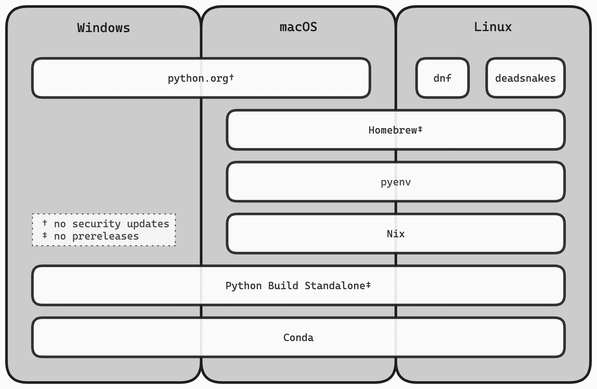

# 第一章 安装 Python

如果您已经拿起这本书，很可能您的机器上已经安装了 Python。大多数常见操作系统都提供`python3`命令。这可能是系统本身使用的解释器；在 Windows 和 macOS 上，它是一个占位符，当您第一次调用它时为您安装 Python。

如果将 Python 安装到新机器上如此简单，为什么要专门开辟一整章来讨论？答案是，长期开发中安装 Python 可能是一个复杂的问题，而且存在多种原因：

+   通常您需要在同一台机器上安装多个版本的 Python。（如果您想知道为什么，我们很快会讨论到。）

+   在常见平台上安装 Python 有几种不同的方法，每种方法都有独特的优势、权衡和有时候的陷阱。

+   Python 是一个不断发展的目标：您需要保持现有安装与最新的维护版本同步，发布新功能版本时添加安装，移除不再支持的版本。您甚至可能需要测试下一个 Python 的预发行版本。

+   您可能希望您的代码能在多个平台上运行。虽然 Python 可以轻松编写可移植程序，但设置开发环境需要一些对每个平台特殊特性的熟悉。

+   您可能希望使用 Python 的另一种替代实现来运行您的代码。¹

在本章中，我将向您展示如何在一些主要操作系统上以可持续的方式安装多个 Python 版本，以及如何保持您的小蛇农场状态良好。

###### 小贴士

即使您只在一个平台上开发，我也建议您了解如何在其他操作系统上使用 Python。这很有趣，而且熟悉其他平台可以让您为软件的贡献者和用户提供更好的体验。

# 支持多个 Python 版本

Python 程序经常同时针对多个语言版本和标准库版本。这可能会让人感到惊讶。为什么不用最新的 Python 运行您的代码？毕竟，这可以让您的程序立即受益于新的语言功能和库改进。

事实证明，运行时环境通常会带有多个旧版本的 Python。² 即使您对部署环境有严格的控制，您可能也希望养成对多个版本进行测试的习惯。当您的生产环境中信赖的 Python 出现安全通告时，最好不要从那天开始将代码移植到新版本。

出于这些原因，通常会支持 Python 的当前版本和过去的版本，直到官方的终止支持日期，并在开发者机器上并排设置这些版本的安装。每年都会推出新的功能版本，并且支持延续五年，这使得您可以测试五个活跃支持的版本（参见 图 1-1）。如果听起来很费力，别担心：Python 生态系统提供了使这一切变得轻松的工具。

# 定位 Python 解释器

如果您的系统上有多个 Python 解释器，如何选择正确的 Python 解释器？让我们看一个具体的例子。当您在命令行中键入 `python3` 时，Shell 会从左到右搜索 `PATH` 环境变量中的目录，并调用第一个名为 `python3` 的可执行文件。在 macOS 和 Linux 上，还提供了命名为 `python3.12`、`python3.11` 等命令，让您可以区分不同的功能版本。

###### 注意

在 Windows 上，基于 `PATH` 的解释器发现不那么重要，因为 Python 的安装可以通过 Windows 注册表找到（参见 “Python Launcher for Windows”）。Windows 安装程序只提供了一个未版本化的 `python.exe` 可执行文件。

图 1-2 显示了一台 macOS 机器上安装了多个 Python 版本。从底部开始，第一个解释器位于 */usr/bin/python3*，是苹果的命令行工具的一部分（Python 3.9）。接下来，在 */opt/homebrew/bin* 目录下，有几个来自 Homebrew 分发的解释器；这里的 `python3` 是其主要解释器（Python 3.11）。Homebrew 的解释器之后是来自 *python.org* 的预发布版本（Python 3.13）。最顶部条目包含了当前发布版本（本文写作时为 Python 3.12），同样来自 Homebrew。


###### 图 1-2\. 一台安装了多个 Python 的开发系统。搜索路径显示为一堆目录；位于顶部的命令会遮盖掉下面的命令。

搜索路径中目录的顺序很重要，因为较早的条目优先于或者“遮盖”后面的条目。在 图 1-2 中，`python3` 指的是当前稳定版本（Python 3.12）。如果省略了顶部条目，`python3` 将指向预发布版本（Python 3.13）。如果省略了前两个条目，它将指向 Homebrew 的默认解释器，该解释器仍然是之前的稳定版本（Python 3.11）。

在 `PATH` 上定位 Python 解释器是常见的错误来源。有些安装会覆盖共享目录中（例如 */usr/local/bin*）的 `python3` 命令。其他安装则将 `python3` 放置在不同的目录，并修改 `PATH` 以使其优先，覆盖先前安装的版本。为了解决这些问题，本书使用了 Unix 上的 Python Launcher（参见 “Python Launcher for Unix”）。然而，了解 `PATH` 变量的工作原理将有助于避免在 Windows、macOS 和 Linux 上出现 Python 发现问题。

在 Unix-like 系统上，`PATH` 变量的常见默认值是 `/usr/local/bin:/usr/bin:/bin`，通常与一些依赖于操作系统的位置结合使用。你可以使用许多 shell 的 `export` 内建来修改这个变量。下面是如何在 Bash shell 中添加 */usr/local/opt/python* 中的 Python 安装：

```py
export PATH="/usr/local/opt/python/bin:$PATH"
```

你添加的是 *bin* 子目录而不是安装根目录，因为这些系统上通常是解释器的正常位置。我们将在 第二章 中更详细地看一下 Python 安装的布局。另外，你将目录添加到 `PATH` 变量的前面。我马上会解释为什么这通常是你想要的。

上述行也适用于 Zsh，在 macOS 上是默认的 shell。尽管如此，Zsh 有一种更符合习惯的方式来操作搜索路径：

```py
typeset -U path 
path=(/usr/local/opt/python/bin $path) 
```


这指示 shell 从搜索路径中删除重复的条目。


Shell 会保持 `path` 数组与 `PATH` 变量同步。

Fish shell 提供了一个函数，用于将条目唯一和持久地添加到搜索路径：

```py
fish_add_path /usr/local/opt/python/bin
```

每次启动 shell 会话时手动设置搜索路径将会很繁琐。相反，你可以将上述命令放置在你的 *shell profile* 中——这是一个位于你的主目录中，在启动时由 shell 读取的文件。Table 1-1 展示了一些常见的启动文件。

Table 1-1\. 一些常见 shell 的启动文件

| Shell | 启动文件 |
| --- | --- |
| Bash | *.bash_profile*（Debian 和 Ubuntu：*.profile*） |
| Zsh | *.zshrc* |
| Fish | *.config/fish/fish.config* |

为什么将新目录添加到 `PATH` 变量的前面很重要？在干净的 macOS 或 Linux 安装中，`python3` 命令通常指向旧版本的 Python。作为 Python 开发者，你的默认解释器应该是最新稳定版本的 Python。将条目添加到 `PATH` 可以让你控制当 shell 遇到类似 `python3` 这样的模糊命令时选择哪个 Python 安装。你可以确保 `python3` 指向最新稳定版本的 Python，而每个 `python3.x` 则指向 3.x 系列的最新 bugfix 或安全发布版本。

###### Tip

除非您的系统已经配备了经过精心筛选和最新的解释器选择，否则应该将 Python 安装添加到`PATH`环境变量中，并确保最新稳定版本位于最前面。

# 在 Windows 上安装 Python

Python 核心团队在 Python 网站的[Windows 下载](https://www.python.org/downloads/windows)部分提供了官方二进制安装程序。找到您希望支持的每个 Python 版本的最新发布版本，并下载每个版本的 64 位 Windows 安装程序。

###### 注意

根据您的领域和目标环境，您可能更喜欢使用 Windows 子系统来进行 Python 开发。在这种情况下，请参考“在 Linux 上安装 Python”部分。

通常情况下，应该很少需要定制安装—除非有一个例外：当安装最新的稳定版本（仅限于这种情况下），请在安装程序对话框的第一页启用将 Python 添加到您的`PATH`环境变量选项。这样可以确保您的默认`python`命令使用一个众所周知且最新的 Python 版本。

*python.org*的安装程序是在 Windows 上设置多版本 Python 环境的高效方式，原因如下：

+   它们会在 Windows 注册表中注册每个 Python 安装，使开发工具能够轻松发现系统上的解释器（参见“Windows 的 Python 启动器”）。

+   它们不会像 Python 的重新分发版本那样存在一些缺点，例如落后于官方发布或受到下游修改的影响。

+   它们不要求您构建 Python 解释器，这除了需要宝贵时间外，还涉及在系统上设置 Python 的构建依赖关系。

二进制安装程序仅提供了每个 Python 版本的最后一个 bugfix 发布版本，这通常在初始发布后大约 18 个月内完成。与此相反，较旧版本的安全更新仅作为源分发提供。如果您不想从源代码构建 Python，⁴ 您可以使用出色的[Python 独立构建](https://github.com/indygreg/python-build-standalone)，这是一组自包含、高度可移植的 Python 发行版。

当您使用*python.org*的二进制安装程序时，保持 Python 安装的最新状态取决于您。新版本的发布将在多个位置公告，包括[Python 博客](https://blog.python.org/)和[Python 论坛](https://discuss.python.org/tags/c/committers/5/release)。如果您安装了已经存在于系统上的 Python 版本的 bugfix 发布版本，它将替换现有安装。这将保留项目和开发工具，并应该是一个无缝的体验。

安装新版本的 Python 功能时，需注意以下额外步骤：

+   启用选项以将新的 Python 添加到`PATH`环境变量。

+   从`PATH`中删除先前的 Python 版本。您可以使用 Windows 的*系统设置*工具编辑您账户的环境变量。

+   您可能还希望重新安装一些开发工具，以确保其在最新的 Python 版本上运行。

最终，某个 Python 版本将达到其生命周期的终点，您可能希望卸载它以释放资源。您可以使用*已安装应用程序*工具来删除现有安装。在已安装软件列表中，选择其条目的*卸载*操作。请注意，删除 Python 版本将会破坏仍在使用它的项目和工具，因此您应先将这些项目升级到更新的 Python 版本。

# Windows 的 Python 启动器

在 Windows 上进行 Python 开发是特殊的，因为工具可以通过 Windows 注册表定位 Python 安装位置。Windows 的 Python 启动器利用这一点提供系统上解释器的单一入口点。它是每个*python.org*发布版本附带的实用程序，并与 Python 文件扩展名相关联，允许您从 Windows 文件资源管理器启动脚本。

双击运行应用程序非常方便，但当您从命令行提示符调用 Python 启动器时，它将发挥其最大的功能。打开 Powershell 窗口并运行`py`命令以启动交互会话：

```py
> py
Python 3.12.2 (tags/v3.12.2:6abddd9, Feb  6 2024, 21:26:36) [...] on win32
Type "help", "copyright", "credits" or "license" for more information.
>>>
```

默认情况下，Python 启动器选择系统上安装的最新版本。值得注意的是，这可能与系统上*最近安装*的版本不同。这是好事—​您不希望在安装较旧版本的错误修复版本时默认 Python 发生变化。

如果您想启动特定版本的解释器，可以将特性版本作为命令行选项传递：

```py
> py -3.11
Python 3.11.8 (tags/v3.11.8:db85d51, Feb  6 2024, 22:03:32) [...] on win32
Type "help", "copyright", "credits" or "license" for more information.
>>>
```

`py`的任何剩余参数都将转发给所选的解释器。让我们看看如何显示系统上两个解释器的版本：

```py
> py -V
Python 3.12.2

> py -3.11 -V
Python 3.11.8
```

使用相同的机制，您可以在特定解释器上运行脚本：

```py
> py -3.11 path\to\script.py
```

###### 注意

出于历史原因，`py`还检查脚本的第一行，看是否指定了版本。规范形式是`#!/usr/bin/env python3`，对应于`py -3`，适用于所有主要平台。

正如您所见，Python 启动器默认选择系统上最新的版本。有一个例外：如果处于*虚拟环境*中，`py`将默认使用虚拟环境中的解释器。⁵

当您安装 Python 的预发布版本时，Python 启动器将使用它作为默认解释器，而不是当前发布的版本—​毕竟，这是系统上最新的版本。在这种情况下，您应通过设置`PY_PYTHON`和`PY_PYTHON3`环境变量来覆盖默认设置为当前版本：

```py
> setx PY_PYTHON 3.12
> setx PY_PYTHON3 3.12
```

重新启动控制台以使设置生效。不要忘记一旦从预发布版本升级到最终版本后删除这些变量。

结束我们对 Python 启动器的简短介绍，请使用命令`py --list`列举系统上的解释器：

```py
> py --list
 -V:3.13          Python 3.13 (64-bit)
 -V:3.12 *        Python 3.12 (64-bit)
 -V:3.11          Python 3.11 (64-bit)
 -V:3.10          Python 3.10 (64-bit)
 -V:3.9           Python 3.9 (64-bit)
 -V:3.8           Python 3.8 (64-bit)
```

在此清单中，星号标记了 Python 的默认版本。

###### 提示

即使您自己始终使用 Python 启动器，仍应保持您的`PATH`更新。一些第三方工具直接运行`python.exe`命令 — 您不希望它们使用过时的 Python 版本或回退到 Microsoft Store 的替代品。

# 在 macOS 上安装 Python

您可以通过几种方式在 macOS 上安装 Python。在本节中，我将看看 Homebrew 包管理器和官方*python.org*安装程序。两者都提供 Python 的多版本二进制发行版。一些在 Linux 上常见的安装方法 — 例如 Pyenv — 也适用于 macOS。Conda 包管理器甚至支持 Windows、macOS 和 Linux。我将在后面的章节中讨论它们。

## Homebrew Python

Homebrew 是 macOS 和 Linux 的第三方软件包管理器。它提供一个*覆盖发行*，这是一个安装在现有操作系统之上的开源软件集合。安装包管理器非常简单；请参阅[官方网站](https://brew.sh/)获取说明。

Homebrew 为每个维护的特性版本的 Python 发布包。使用`brew`命令行界面来管理它们：

`brew install python@3.*x*`

安装新的 Python 版本。

`brew upgrade python@3.*x*`

将 Python 版本升级到维护版本。

`brew uninstall python@3.*x*`

卸载 Python 版本。

###### 注意

每当您在本节看到类似`python3.*x*`或`python@3.*x*`的名称时，请用实际特性版本替换`3.*x*`。例如，对于 Python 3.12，请使用`python3.12`和`python@3.12`。

您可能会发现已安装某些 Python 版本，这是其他依赖它们的 Homebrew 包安装的结果。尽管如此，重要的是您显式安装每个版本。当您运行`brew autoremove`清理资源时，自动安装的包可能会被删除。

Homebrew 在您的`PATH`上放置了每个版本的`python3.*x*`命令，以及其主要 Python 包的`python3`命令 — 可能是当前或以前的稳定发布版。您应该覆盖此设置以确保`python3`指向最新版本。首先，查询包管理器的安装根目录（这取决于平台）：

```py
$ brew --prefix python@3.12
/opt/homebrew/opt/python@3.12
```

接下来，在您的`PATH`中添加此安装的*bin*目录。以下是在 Bash shell 上工作的示例：

```py
export PATH="/opt/homebrew/opt/python@3.12/bin:$PATH"
```

Homebrew 在官方*python.org*安装程序上有一些优势：

+   您可以使用命令行来安装、升级和卸载 Python 版本。

+   Homebrew 包含旧版本的安全更新 — 相比之下，*python.org*安装程序仅提供最后的 bugfix 发布版。

+   Homebrew Python 与分发的其余部分紧密集成。特别是，软件包管理器可以满足 Python 的依赖项如 OpenSSL。这使得在需要时可以独立升级它们。

另一方面，Homebrew Python 也有一些限制：

+   Homebrew 不提供即将发布的 Python 版本的预发布包。

+   包通常会滞后于官方发布几天或几周。它们也包含一些下游修改，尽管这些修改是相当合理的。例如，Homebrew 将图形用户界面（GUI）相关的模块与主 Python 包分开。

+   除非它们也作为 Homebrew 包提供，否则你无法系统范围内安装和卸载 Python 包。 （参见 “虚拟环境” 为什么你不应该系统范围内安装开发包。）

默认情况下，Homebrew 会自动将 Python 升级到维护版本。这种行为曾引发一些争议，因为它会破坏安装在先前版本上的虚拟环境。⁶ 但截至本文撰写时—​Homebrew Python 完全安全用于 Python 开发。

###### 提示

就我个人而言，我推荐在 macOS 上使用 Homebrew 管理 Python—​它与系统的其余部分集成良好，并且易于保持更新。使用 *python.org* 的安装程序来测试你的代码与预发布版本的兼容性，Homebrew 并不提供这些预发布版本。

## [python.org 安装程序](https://www.python.org/downloads/macos/)

核心 Python 团队在 Python 网站的 [macOS 下载](https://www.python.org/downloads/macos/) 部分提供官方二进制安装程序。下载你希望安装的版本的 64 位 *universal2* 安装程序。解释器的 *universal2* 二进制版本可以在 Apple Silicon 和 Intel 芯片上原生运行。⁷

对于多版本开发，我建议使用自定义安装—​在安装程序对话框中找到 *自定义* 按钮。在可安装组件的结果列表中，禁用 *Unix 命令行工具* 和 *Shell 档案更新程序*。这两个选项旨在将解释器和其他一些命令添加到你的 `PATH` 中。⁸ 相反，手动编辑你的 shell 档案。在 `PATH` 前面加上目录 */Library/Frameworks/Python.framework/Versions/3.x/bin*，将 `3.*x*` 替换为实际的特性版本。确保当前稳定版本位于 `PATH` 的最前面。

###### 注意

安装 Python 版本后，请在 */Applications/Python 3.x/* 文件夹中运行 *Install Certificates* 命令。此命令安装 Mozilla 的策划根证书集，用于从 Python 建立安全的互联网连接。

当你安装一个已经存在于系统中的 Python 版本的 bug 修复版本时，它将替换现有的安装。你可以通过移除以下两个目录来卸载一个 Python 版本：

+   */Library/Frameworks/Python.framework/Versions/3.x/*

+   */Applications/Python 3.x/*

# 在 Linux 上安装 Python

Python 核心团队不为 Linux 提供二进制安装程序。通常，在 Linux 发行版上安装软件的首选方法是使用官方包管理器。然而，在开发 Python 时，这并不绝对正确——以下是一些重要的注意事项：

+   Linux 发行版中的系统 Python 可能相当旧，而且并非所有发行版的主要包存储库都包含替代 Python 版本。

+   Linux 发行版对应用程序和库的打包方式有强制性规定。例如，Debian 的 Python 政策要求标准的`ensurepip`模块必须在单独的包中提供；因此，在默认的 Debian 系统上无法创建虚拟环境（通常通过安装`python3-full`包解决）。

+   Linux 发行版中的主要 Python 包作为需要 Python 解释器的其他包的基础。这些包可能包括系统的关键部分，例如 Fedora 的包管理器 DNF。因此，发行版会采取保障措施来保护系统的完整性；例如，大多数发行版阻止使用 pip 在系统范围内安装或卸载包。

在接下来的章节中，我将讨论在两个主要的 Linux 发行版 Fedora 和 Ubuntu 上安装 Python。之后，我将介绍一些不使用官方包管理器的通用安装方法：Homebrew、Nix、Pyenv 和 Conda。我还会向您介绍 Python Launcher for Unix，这是一个第三方软件包，旨在将`py`实用程序引入 Linux、macOS 和类似系统。

## Fedora Linux

Fedora 是一个由 Red Hat 主要赞助的开源 Linux 发行版，是 Red Hat Enterprise Linux (RHEL)的上游来源。它旨在保持与上游项目的紧密联系，并采用快速发布周期以促进创新。Fedora 以其出色的 Python 支持而闻名，Red Hat 雇用了几位 Python 核心开发者。

Python 预装在 Fedora 上，您可以使用 DNF 安装额外的 Python 版本：

`sudo dnf install python3.*x*`

安装一个新的 Python 版本。

`sudo dnf upgrade python3.*x*`

将 Python 版本升级到一个维护版本。

`sudo dnf remove python3.*x*`

卸载 Python 版本。

Fedora 为 CPython（Python 的参考实现）的所有活跃特性版本和预发行版提供包，还有像 PyPy 这样的替代实现的包。一种便捷的方法是一次性安装所有这些包，即安装`tox`包：

```py
$ sudo dnf install tox
```

如果你在想，tox 是一个测试自动化工具，可以轻松地针对多个 Python 版本运行测试套件；它的 Fedora 包会引入大多数可用的解释器作为推荐的依赖项。Tox 也是 Nox 的精神祖先，Nox 是第八章的主题。

## Ubuntu Linux

Ubuntu 是一个基于 Debian 的流行 Linux 发行版，由 Canonical Ltd. 赞助。Ubuntu 主要仓库中只提供一个 Python 版本；其他 Python 版本，包括预发布版本，由个人软件包存档（PPA）提供。PPA 是在由 Canonical 运行的软件协作平台 Launchpad 上维护的社区软件仓库。

在 Ubuntu 系统上的第一步应该是添加 `deadsnakes` PPA：

```py
$ sudo apt update && sudo apt install software-properties-common
$ sudo add-apt-repository ppa:deadsnakes/ppa && sudo apt update
```

现在你可以使用 APT 包管理器安装 Python 版本：

`sudo apt install python3.*x*-full`

安装一个新的 Python 版本。

`sudo apt upgrade python3.*x*-full`

将 Python 版本升级到维护版本。

`sudo apt remove python3.*x*-full`

卸载 Python 版本。

###### 提示

在 Debian 和 Ubuntu 上安装 Python 时，请记住始终包含 `-full` 后缀。`python3.*x*-full` 包会拉取整个标准库和最新的根证书。特别是，它们确保你可以创建虚拟环境。

## 其他 Linux 发行版

如果你的 Linux 发行版没有打包多个 Python 版本，你该怎么办？传统的答案是“自行编译 Python”。这可能看起来吓人，但我们会看到，在当今日子里编译 Python 已经变得非常简单，详情请见“使用 Pyenv 安装 Python”。然而，事实证明，从源代码构建并不是你唯一的选择。几个跨平台包管理器提供了 Python 的二进制包；实际上，你已经看到其中之一了。

Homebrew 发行版（参见“Homebrew Python”）也适用于 Linux 和 macOS，并且大部分上述内容同样适用于 Linux。两个平台之间的主要区别在于安装根目录：Linux 上的 Homebrew 默认安装在 */home/linuxbrew/.linuxbrew* 而不是 */opt/homebrew*。在将 Homebrew 的 Python 安装添加到你的 `PATH` 时请记住这一点。

安装 Python 的一个流行的跨平台方法是 Anaconda 发行版，专为科学计算而设计，支持 Windows、macOS 和 Linux。本章末尾将专门介绍 Anaconda（参见“从 Anaconda 安装 Python”）。

# Python 的 Unix 版本启动器

[Python 的 Unix 版本启动器](https://python-launcher.app/)是官方 `py` 实用程序的 Linux 和 macOS 版本，以及支持 Rust 编程语言的任何其他操作系统的端口。它的主要优点是提供了一个统一的、跨平台的启动 Python 的方式，在未指定版本时具有明确定义的默认值：系统上的最新解释器。

`py` 命令是一种方便的便携式方法，用于启动解释器，避免了直接调用 Python 的一些问题（参见“定位 Python 解释器”）。因此，在本书中我将一直使用它。你可以使用多种包管理器安装 `python-launcher` 包，包括 Homebrew、DNF 和 Cargo。

Unix 上的 Python 启动器通过扫描 `PATH` 环境变量来发现解释器，寻找 `python*x*.*y*` 命令。否则，它的工作方式与其 Windows 对应项类似（见 “Windows 上的 Python 启动器”）。如果仅输入 `py`，将启动最新的 Python 版本，但你也可以请求特定版本——例如，`py -3.12` 等同于运行 `python3.12`。

下面是使用 macOS 系统的示例会话，来自 图 1-2。（编写本文时，Python 3.13 是预发行版本，所以我通过设置 `PY_PYTHON` 和 `PY_PYTHON3` 为 `3.12` 更改了默认解释器。）

```py
$ py -V
3.12.1
$ py -3.11 -V
3.11.7
$ py --list
 3.13 │ /Library/Frameworks/Python.framework/Versions/3.13/bin/python3.13
 3.12 │ /opt/homebrew/bin/python3.12
 3.11 │ /opt/homebrew/bin/python3.11
 3.10 │ /opt/homebrew/bin/python3.10
```

如果虚拟环境处于活动状态，`py` 将默认使用该环境中的解释器，而不是系统范围内的解释器（参见 “虚拟环境”）。在 Python 启动器的 Unix 版本中，有一条特殊规则使得与虚拟环境的工作更加方便：如果当前目录（或其父目录之一）包含标准名称为 *.venv* 的虚拟环境，则无需显式激活它。

您可以通过将其导入名称传递给 `-m` 解释器选项来运行许多第三方工具。假设您已在多个 Python 版本上安装了 pytest（一个测试框架）。使用 `py -m pytest` 可以确定应该使用哪个解释器来运行该工具。相比之下，裸露的 `pytest` 使用在您的 `PATH` 中首次出现的命令。

如果你使用 `py` 调用 Python 脚本，但未指定版本，则 `py` 将检查脚本的第一行是否有 *shebang*——指定脚本解释器的行。在这里保持规范的形式：`#!/usr/bin/env python3`。*入口点脚本* 是将脚本链接到特定解释器的更可持续的方法，因为包安装程序可以在安装期间生成正确的解释器路径（见 “入口点脚本”）。

###### 警告

为了与 Windows 版本兼容，Python 启动器仅使用 shebang 中的 Python 版本，而不使用完整的解释器路径。因此，你可能得到的解释器与直接调用脚本而不带 `py` 不同。

# 使用 Pyenv 安装 Python

Pyenv 是 macOS 和 Linux 的 Python 版本管理器。它包括一个构建工具——也可以作为一个独立的程序命名为 `python-build`——它在你的主目录中下载、构建和安装 Python 版本。Pyenv 允许您在全局、每个项目目录或每个 shell 会话中激活和取消激活这些安装。

###### 注意

在本节中，您将使用 Pyenv 作为构建工具。如果您有兴趣将 Pyenv 用作版本管理器，请参阅[官方文档](https://github.com/pyenv/pyenv#readme)了解其他设置步骤。我将讨论“使用 Pyenv 管理 Python 版本”中的一些权衡考虑。

在 macOS 和 Linux 上安装 Pyenv 的最佳方式是使用 Homebrew：

```py
$ brew install pyenv
```

从 Homebrew 安装 Pyenv 的一个巨大好处是您还将获得 Python 的构建依赖项。如果您使用不同的安装方法，请查看[Pyenv wiki](https://github.com/pyenv/pyenv/wiki)以获取关于如何设置您的构建环境的特定于平台的说明。

使用以下命令显示可用的 Python 版本：

```py
$ pyenv install --list
```

解释器列表令人印象深刻。它不仅涵盖了 Python 的所有活跃功能版本，还包括预发布版本、未发布的开发版本、过去 20 年中发布的几乎每个点版本以及丰富的替代实现，如 PyPy、GraalPy、MicroPython、Jython、IronPython 和 Stackless Python。

您可以通过将它们传递给`pyenv install`来构建和安装任何这些版本：

```py
$ pyenv install 3.*x*.*y*
```

当作为纯构建工具使用 Pyenv 时（就像我们在这里做的那样），您需要手动将每个安装添加到`PATH`中。您可以使用命令`pyenv prefix 3.*x*.*y*`找到其位置，并在其后附加*/bin*。以下是 Bash shell 的示例：

```py
export PATH="$HOME/.pyenv/versions/3.x.y/bin:$PATH"
```

使用 Pyenv 安装维护版本并不会隐式升级相同功能版本上的现有虚拟环境和开发工具，因此您需要使用新版本重新创建这些环境。

当您不再需要某个安装时，可以像这样删除它：

```py
$ pyenv uninstall 3.*x*.*y*
```

默认情况下，Pyenv 在构建解释器时不启用基于配置文件的优化（PGO）或链接时优化（LTO）。根据[Python 性能基准套件](https://pyperformance.readthedocs.io/)，这些优化可以显著加快 CPU 密集型 Python 程序的速度，速度提升在 10%至 20%之间。您可以通过设置`PYTHON_CONFIGURE_OPTS`环境变量来启用它们：

```py
$ export PYTHON_CONFIGURE_OPTS='--enable-optimizations --with-lto'
```

与大多数 macOS 安装程序不同，Pyenv 默认使用 POSIX 安装布局，而不是这个平台上典型的框架构建。如果您在 macOS 上，建议您为了一致性启用框架构建。您可以通过将配置选项`--enable-framework`添加到上述列表中来执行此操作。

# 从 Anaconda 安装 Python

[Anaconda](https://www.anaconda.com/download)是由 Anaconda Inc.维护的科学计算开源软件发行版。其核心是[Conda](https://conda.io/projects/conda/)，一个适用于 Windows、macOS 和 Linux 的跨平台包管理器。Conda 包可以包含用任何语言编写的软件，如 C、C++、Python、R 或 Fortran。

在本节中，您将使用 Conda 安装 Python。Conda 不会在系统上全局安装软件包。每个 Python 安装都包含在一个 Conda 环境中，并与系统的其余部分隔离开来。典型的 Conda 环境围绕特定项目的依赖项展开，比如一组用于机器学习或数据科学的库，其中 Python 仅是其中之一。

在您可以创建 Conda 环境之前，您需要引导一个包含 Conda 本身的基础环境。有几种方法可以做到这一点：您可以安装完整的 Anaconda 发行版，或者只使用 Miniconda 安装程序安装 Conda 和几个核心包。Anaconda 和 Miniconda 都会从*defaults*通道下载包，这可能需要商业许可证进行企业使用。

Miniforge 是第三种选择—​它类似于 Miniconda，但从社区维护的*conda-forge*通道安装软件包。您可以从[GitHub](https://github.com/conda-forge/miniforge)获取 Miniforge 的官方安装程序，或者在 macOS 和 Linux 上使用 Homebrew 安装它：

```py
$ brew install miniforge
```

当您激活或取消激活环境时，Conda 需要 shell 集成来更新搜索路径和 shell 提示。如果您从 Homebrew 安装了 Miniforge，请使用`conda init`命令更新您的 shell 配置文件，并指定您的 shell 名称。例如：

```py
$ conda init bash
```

默认情况下，shell 初始化代码会在每个会话中自动激活基础环境。如果您还使用未由 Conda 管理的 Python 安装，可能需要禁用此行为：

```py
$ conda config --set auto_activate_base false
```

Windows 安装程序不会全局激活基础环境。您可以通过 Windows 开始菜单中的 Miniforge Prompt 与 Conda 进行交互。

恭喜！您现在在系统上安装了一个可工作的 Conda！让我们使用 Conda 创建一个带有特定 Python 版本的环境：

```py
$ conda create --name=*name* python=3.*x*
```

在您可以使用这个 Python 安装之前，您需要激活环境：

```py
$ conda activate *name*
```

将 Python 升级到新版本非常简单：

```py
$ conda update python
```

此命令将在活动的 Conda 环境中运行。Conda 的优点在于它不会将 Python 升级到环境中尚不支持的版本。

当您在环境中完成工作时，请像这样取消激活它：

```py
$ conda deactivate
```

Conda 不会在系统范围内安装 Python；相反，每个 Python 安装都是一个隔离的 Conda 环境的一部分。Conda 对环境有一个全面的视角：Python 只是项目的一个依赖项，与系统库、第三方 Python 包甚至其他语言生态系统的软件包并列。

# [一种全新的世界：使用 Hatch 和 Rye 安装](https://rye-up.com/) Brave New World: Installing with Hatch and Rye

在我写这本书的时候，Python 项目管理者[Rye](https://rye-up.com/)和[Hatch](https://hatch.pypa.io/)增加了对所有主要平台上 Python 解释器安装的支持。两者都使用来自[Python Standalone Builds](https://github.com/indygreg/python-build-standalone)集合以及[PyPy](https://www.pypy.org/)项目的解释器。

Rye 和 Hatch 都作为独立的可执行文件分发—​换句话说，您可以轻松地将它们安装到尚未安装 Python 的系统上。请参考它们的官方文档获取详细的安装说明。

Hatch 允许您使用单个命令安装与您平台兼容的所有 CPython 和 PyPy 解释器：

```py
$ hatch python install all
```

这条命令还会将安装目录添加到你的`PATH`。¹⁰ 使用`--update`选项重新运行命令以升级解释器到更新版本。Hatch 根据特性版本组织解释器，因此补丁发布会覆盖现有安装。

Rye 将解释器获取到*~/.rye/py*目录中。通常情况下，当您同步项目的依赖项时，此过程在幕后进行。但也可以作为专用命令使用：

```py
$ rye fetch 3.12
$ rye fetch 3.11.8
$ rye fetch pypy@3.10
```

第二个示例将解释器放置在*~/.rye/py/cpython@3.11.8/bin*（Linux 和 macOS）。你可以使用选项`--target-path=*<dir>*`将其安装到其他目录。这会将解释器放置在 Windows 上的`*<dir>*`和 Linux、macOS 上的`*<dir>*/bin`。在项目外工作时，Rye 不会将解释器添加到你的`PATH`中。

# 安装程序概览

图示 1-3 提供了 Windows、Linux 和 macOS 的主要 Python 安装方法概览。



###### 图 1-3\. Windows、Linux 和 macOS 的 Python 安装程序

这里提供了一些具体情况下如何选择安装程序的指导：

+   通常情况下，使用 Hatch 安装 Python 独立构建版本。

+   对于科学计算，我建议使用 Conda 替代。

+   如果你在 Windows 或 macOS 上，请从 python.org 获取预发行版本。如果你在 Linux 上，则使用 pyenv 从源代码构建它们。

+   在 Fedora Linux 上，始终使用 DNF。

+   在 Ubuntu Linux 上，始终使用 APT 与 deadsnakes PPA。

如果需要 Python 的可重现构建，请在 macOS 和 Linux 上选择 Nix。

# 摘要

在本章中，您学会了如何在 Windows、macOS 和 Linux 上管理 Python 安装。使用 Python 启动器选择安装在系统上的解释器。此外，审核您的搜索路径以确保您具有明确定义的`python`和`python3`命令。

下一章详细介绍了 Python 安装：其内容、结构及您的代码与之交互的方式。您还将了解到它的轻量级兄弟虚拟环境以及围绕其发展的工具。

¹ 虽然 CPython 是 Python 的参考实现，但还有许多其他选择：如面向性能的分支，例如 PyPy 和 Cinder，重新实现如 RustPython 和 MicroPython，以及到其他平台的移植，如 WebAssembly、Java 和 .NET。

² 截至 2024 年初的写作时间，Debian Linux 的长期支持版本提供了 Python 2.7.16 和 3.7.3 的修订版本，这两个版本发布已有半个世纪之久。（Debian 的“测试”发行版，广泛用于开发，提供了当前版本的 Python。）

³ 从 Python 3.13 开始，将提供两年的 bug 修复版本支持。

⁴ [Stack Overflow](https://stackoverflow.com/a/72209207/1355754) 提供了一个构建 Windows 安装程序的逐步指南。

⁵ “虚拟环境”详细介绍了虚拟环境。目前，你可以将虚拟环境视为完整 Python 安装的浅拷贝，它允许你安装一套独立的第三方包。

⁶ Justin Mayer: [“Homebrew Python 不适合你”，](https://justinmayer.com/posts/homebrew-python-is-not-for-you/) 2021 年 2 月 3 日。

⁷ 如果你有一台搭载 Apple Silicon 的 Mac，但必须运行基于 Intel 处理器的程序，你会很高兴知道*python.org*的安装程序也提供了一个使用`x86_64`指令集的`python3-intel64`二进制文件。由于苹果的 Rosetta 翻译环境，你可以在 Apple Silicon 上运行它。

⁸ *Unix 命令行工具*选项会在*/usr/local/bin*目录中放置符号链接，这可能会与 Homebrew 安装的软件包和其他*python.org*版本产生冲突。*符号链接*是一种特殊类型的文件，类似于 Windows 中的快捷方式，它指向另一个文件。

⁹ 基于历史原因，框架构建使用不同的路径来存储*每用户站点目录*，即如果在非虚拟环境中以非管理员权限调用 pip 安装包时的位置。这种不同的安装布局可能会阻止你导入先前安装的包。

¹⁰ 在未来的版本中，Hatch 还将在 Windows 注册表中添加解释器，使你可以使用 Python 启动器使用它们。
