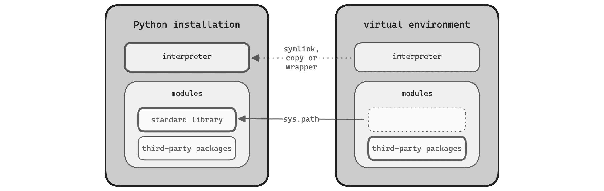

# 第二章\. Python 环境

在核心层面，每个 Python 安装都包括两部分：一个解释器和模块。模块又来自标准库和第三方包（如果您已安装）。这些组成了执行 Python 程序所需的基本组件：一个*Python 环境*（见图 2-1](#figure_environment)）。

Python 安装并非唯一的 Python 环境。*虚拟环境*是简化的环境，与完整安装共享解释器和标准库。您可以在特定项目或应用程序中使用它们来安装第三方包，同时保持系统环境干净。

###### 注意

本书将*Python 环境*作为一个总称，包括系统范围的安装和虚拟环境。请注意，有些人仅将该术语用于特定项目的环境，如虚拟环境或 Conda 环境。



###### 图 2-1\. Python 环境由解释器和模块组成。虚拟环境与其父环境共享解释器和标准库。

管理环境是 Python 开发的重要方面。您需要确保您的代码在用户的系统上正常运行，特别是在支持的语言版本之间，可能还涉及到重要第三方包的主要版本。Python 环境只能包含每个第三方包的单个版本——如果两个项目需要不同版本的同一包，则不能并存。这就是为什么将每个 Python 应用程序和每个项目都安装在专用虚拟环境中被视为良好实践的原因。

在本章中，您将深入了解 Python 环境的概念及其工作原理。本章分为三部分：

+   第一部分介绍了三种 Python 环境——Python 安装、每个用户环境和虚拟环境——以及两个基本工具：Python 包安装程序 pip 和标准 `venv` 模块。

+   第二部分介绍了两个现代工具，可以更高效地管理环境：pipx，一个用于 Python 应用程序的安装器，以及 uv，一个用 Rust 编写的 Python 打包工具的替代品。

+   本章的最后一部分深入探讨了 Python 导入模块的方式和位置——如果您对此过程感到好奇，可以跳过。

###### 注意

本章使用 Python Launcher 来调用解释器（参见 “Windows 下的 Python Launcher” 和 “Unix 下的 Python Launcher”）。如果您没有安装它，请在运行示例时用 `py` 替换 `python3`。

# Python 环境之旅

每个 Python 程序都在“内部”运行于一个 Python 环境中：环境中的解释器执行程序的代码，并且`import`语句从环境中加载模块。通过启动其解释器来选择环境。

Python 提供了两种在解释器上运行程序的机制。您可以将一个 Python 脚本作为参数传递：

```py
$ py hello.py
```

或者，您可以通过`-m`选项传递一个模块，前提是解释器可以导入该模块：

```py
$ py -m hello
```

大多数情况下，解释器从环境中导入*hello.py* —— 但为了本示例的目的，将其放置在当前目录中也可以。

另外，许多 Python 应用程序在您的`PATH`中安装了一个入口脚本（参见“入口脚本”）。这个机制允许您在不指定解释器的情况下启动应用程序。入口脚本始终使用安装它们的环境中的解释器：

```py
$ hello
```

这种方法很方便，但也有一个缺点：如果您在多个环境中安装了该程序，则`PATH`中的第一个环境“胜出”。在这种情况下，`py -m hello`形式为您提供更多的控制。

“解释器决定环境。” 如上所述，这条规则适用于导入模块时。它也适用于互补情况：当您将一个包安装到一个环境中时。Python 包安装程序 Pip 默认将包安装到自己的环境中。换句话说，您通过在该环境中运行 pip 来选择包的目标环境。

因此，使用`-m`形式安装包的规范方式是：

```py
$ py -m pip install *<package>*
```

或者，您可以使用其`--python`选项为 pip 提供虚拟环境或解释器：

```py
$ pip --python=*<env>* install *<package>*
```

第二种方法的优点是不需要在每个环境中都安装 pip。

## Python 安装

本节带您了解 Python 安装的情况。随时跟随您自己系统上的操作。表 2-1 显示了最常见的位置——将 3.*x* 和 3*x* 替换为 Python 特性版本，如 `3.12` 和 `312`。

表 2-1\. Python 安装位置

| 平台 | Python 安装位置 |
| --- | --- |
| Windows（单用户） | *%LocalAppData%\Programs\Python\Python3x* |
| Windows（多用户） | *%ProgramFiles%\Python3x* |
| macOS（Homebrew） | */opt/homebrew/Frameworks/Python.framework/Versions/3.x*^(a) |
| macOS（python.org） | */Library/Frameworks/Python.framework/Versions/3.x* |
| Linux（通用） | */usr/local* |
| Linux（包管理器） | */usr* |
| ^(a) macOS Intel 上的 Homebrew 使用 */usr/local* 而不是 */opt/homebrew*。 |

安装可能会与系统其余部分干净地分离，但并非一定如此。在 Linux 上，安装通常放在*/usr*或*/usr/local*等共享位置，其文件分布在整个文件系统中。相比之下，Windows 系统将所有文件保存在一个单一位置。在 macOS 上，框架构建同样是自包含的，尽管分布也可能在传统的 Unix 位置安装符号链接。

在接下来的章节中，你将更深入地了解 Python 安装的核心部分——解释器和模块，以及其他一些组件，比如入口脚本和共享库。

Python 安装布局在不同系统上可能差异很大。好消息是，你很少需要关心——Python 解释器知道它的环境。供参考的是，Table 2-2 提供了主要平台上安装布局的基准。所有路径均相对于安装根目录。

表 2-2\. Python 安装布局

| 文件 | Windows | Linux 和 macOS | 注释 |
| --- | --- | --- | --- |
| 解释器 | *python.exe* | *bin/python3.x* |  |
| 标准库 | *Lib*和*DLLs* | *lib/python3.x* | 在 Windows 上，扩展模块位于*DLLs*下。Fedora 将标准库放在*lib64*而非*lib*下。 |
| 第三方包 | *Lib\site-packages* | *lib/python3.x/site-packages* | Debian 和 Ubuntu 将包放置在*dist-packages*下。Fedora 将扩展模块放在*lib64*而非*lib*下。 |
| 入口脚本 | *Scripts* | *bin* |  |

### 解释器

运行 Python 程序的可执行文件在 Windows 上名为*python.exe*，位于完整安装的根目录下¹。在 Linux 和 macOS 上，解释器名为*python3.x*，存储在*bin*目录中，同时还有一个*python3*的符号链接。

Python 解释器将环境与三个要素联系起来：

+   特定版本的 Python 语言

+   Python 的特定实现

+   特定版本的解释器构建

实现可能是[CPython](https://github.com/python/cpython)，即 Python 的参考实现，但也可能是多种备选实现之一——比如[PyPy](https://www.pypy.org/)，一个快速的解释器，支持即时编译，用 Python 编写，或者[GraalPy](https://www.graalvm.org/python/)，一个高性能的实现，支持 Java 互操作性，使用 GraalVM 开发工具包。

构建过程中，CPU 架构可能会有所不同——例如，32 位与 64 位，或者 Intel 与 Apple Silicon——以及它们的构建配置，这些配置会影响编译时的优化或安装布局。

### Python 模块

模块是通过`import`语句加载的 Python 对象的容器。它们通常组织在*Lib*（Windows）或*lib/python3.x*（Linux 和 macOS）下，具体的平台相关变化不尽相同。第三方包被放置在名为*site-packages*的子目录中。

模块以各种形式存在。如果您使用过 Python，您可能已经使用了大多数形式。让我们来看看不同的类型：

简单模块

在最简单的情况下，*module*是一个包含 Python 源代码的单个文件。语句`import string`执行*string.py*中的代码，并将结果绑定到本地范围中的名称`string`。

包

带有*__init__.py*文件的目录称为*packages*，它们允许您在层次结构中组织模块。语句`import email.message`加载`email`包中的`message`模块。

命名空间包

没有*__init__.py*但包含模块的目录称为*namespace packages*。您可以使用它们来在共同的命名空间中组织模块，例如公司名称（比如`acme.unicycle`和`acme.rocketsled`）。与常规包不同，您可以单独分发命名空间包中的每个模块。

扩展模块

扩展模块，例如`math`模块，包含从低级语言如 C 编译而来的本机代码。它们是共享库²，具有特殊的入口点，使您可以从 Python 中将它们作为模块导入。人们出于性能原因编写它们，或者将现有的 C 库作为 Python 模块提供。它们在 Windows 上以*.pyd*结尾，在 macOS 上以*.dylib*结尾，在 Linux 上以*.so*结尾。

内置模块

标准库中的一些模块，如`sys`和`builtins`模块，已编译到解释器中。变量`sys.builtin_module_names`列出了所有这些模块。

冻结模块

一些标准库中的模块是用 Python 编写的，但其字节码嵌入在解释器中。最初，只有`importlib`的核心部分得到了这种处理。Python 的最新版本会在解释器启动期间冻结每个导入的模块，例如`os`和`io`。

###### 注意

在 Python 世界中，术语*package*具有一些歧义。它既指模块，也指用于分发模块的工件，也称为*distributions*。除非另有说明，本书将*package*用作*distribution*的同义词。

*Bytecode*是 Python 代码的中间表示，它是平台无关的，并且经过优化以实现快速执行。当解释器首次加载纯 Python 模块时，它将其编译为字节码。字节码模块被缓存在环境中的*.pyc*文件中，位于*__pycache__*目录下。

### 入口点脚本

一个*入口点脚本*是一个可执行文件，在*Scripts*（Windows）或*bin*（Linux 和 macOS）中，其单一目的是启动 Python 应用程序，通过导入具有其入口点函数的模块并调用该函数来实现。

此机制有两个关键优点。首先，您可以通过运行一个简单的命令（例如 `pydoc3`）在 shell 中启动应用程序。³ 第二，入口脚本使用其环境中的解释器和模块，避免因 Python 版本错误或缺少第三方包而导致的意外。

类似 pip 这样的包安装程序可以为它们安装的第三方包生成入口脚本。包的作者只需指定脚本应调用的函数即可。这是为 Python 应用程序提供可执行文件的一种方便方法（参见 “入口脚本”）。

各平台在直接执行入口脚本的方式上有所不同。在 Linux 和 macOS 上，它们是具有 *执行* 权限的常规 Python 文件，例如 示例 2-3 中所示的那个。Windows 将 Python 代码嵌入到 Portable Executable（PE）格式的二进制文件中，通常称为 *.exe* 文件。该二进制文件启动解释器并执行嵌入的代码。

##### 示例 2-3\. Linux 安装中的入口脚本 `pydoc3`

```py
#!/usr/local/bin/python3.12 
import pydoc 
if __name__ == "__main__": 
    pydoc.cli() 
```


从当前环境请求解释器。


加载包含指定入口点函数的模块。


检查脚本是否未从另一个模块导入。


最后，调用入口点函数启动程序。

###### 注意

`#!` 行在类 Unix 操作系统上被称为 *shebang*。当您运行脚本时，程序加载器使用该行来定位并启动解释器。*程序加载器* 是操作系统的一部分，用于将程序加载到主存中。

### 其他组件

除了解释器、模块和脚本之外，Python 环境还可以包含一些额外的组件：

共享库

Python 环境有时会包含一些不是扩展模块的共享库，如 Windows 上的 *.dll*、macOS 上的 *.dylib* 和 Linux 上的 *.so*。第三方包可能会捆绑它们使用的共享库，因此您无需单独安装它们。Python 安装可能还会捆绑共享库，例如标准的 `ssl` 模块使用 OpenSSL，这是一个用于安全通信的开源库。

头文件

Python 安装包含用于 *Python/C API* 的头文件，这是一个用于编写扩展模块或将 Python 嵌入到较大应用程序中作为组件的应用程序编程接口。它们位于 *Include*（Windows）或 *include/python3.x*（Linux 和 macOS）下。

静态数据

Python 安装还在各个位置包含各种静态数据。这包括配置文件、文档以及与第三方包一起提供的任何资源文件。

Tcl/Tk

默认情况下，Python 安装还包括 *Tcl/Tk*，用于使用 Tcl 编写的图形用户界面（GUI）的工具包。 标准的 `tkinter` 模块允许您从 Python 使用此工具包。

## 用户环境

*用户环境* 允许您为单个用户安装第三方软件包。 它相对于系统范围内安装软件包有两个主要优点：您无需管理权限即可安装软件包，而且您不会影响多用户系统上的其他用户。

用户环境位于 Linux 和 macOS 的主目录中，而在 Windows 的应用数据目录中（参见 表 2-3）。 它包含每个 Python 版本的 *site-packages* 目录。 入口点脚本在 Python 版本之间共享，但在 macOS 上，整个用户环境安装保存在特定于版本的目录下。⁴

表 2-3\. 每个用户目录的位置

| 平台 | 第三方软件包 | 入口点脚本 |
| --- | --- | --- |
| Windows | *%AppData%\Python\Python3x\site-packages* | *%AppData%\Python\Scripts* |
| macOS | *~/Library/Python/3.x/lib/python/site-packages* | *~/Library/Python/3.x/bin* |
| Linux | *~/.local/lib/python3.x/site-packages*^(a) | *~/.local/bin* |
| ^(a) Fedora 将扩展模块放在 *lib64* 下。 |

使用 `py -m pip install --user *<package>*` 将软件包安装到用户环境中。 如果在虚拟环境之外调用 `pip`，并且 pip 发现它无法写入到系统范围的安装位置，它也会默认使用此位置。 如果用户环境尚不存在，则 pip 会为您创建它。

###### 提示

默认情况下，用户脚本目录可能不在 `PATH` 中。 如果将应用程序安装到用户环境中，请记住编辑您的 shell 配置文件以更新搜索路径。 当 Pip 检测到此情况时，它会发出友好的提醒。

用户环境有一个重要缺点：按设计，它们与全局环境不隔离。 如果全局环境中没有被用户环境中同名模块遮蔽，您仍然可以导入全局范围的站点软件包。 用户环境中的应用程序也不彼此隔离—​特别是，它们不能依赖于另一个软件包的不兼容版本。 即使系统范围内的应用程序也可以从用户环境导入模块。

还有另一个缺点：如果 Python 安装标记为 *externally managed*（例如，如果使用发行版的软件包管理器安装了 Python），则无法将软件包安装到用户环境中。

在 “使用 Pipx 安装应用程序” 中，我将介绍 pipx，它允许您在隔离的环境中安装应用程序。 它使用用户脚本目录将应用程序放到您的搜索路径上，但在幕后依赖于虚拟环境。

## 虚拟环境

当您在一个使用第三方包的 Python 项目上工作时，通常不建议将这些包安装到系统范围或每个用户环境中。首先，这样会污染全局命名空间。在隔离和可重现环境中运行测试和调试项目会变得更加容易。其次，如果两个项目依赖于相同包的冲突版本，单个环境甚至都不是一个选项。第三，正如前一节提到的，您不能将包安装到标记为*externally managed*的环境中。⁵

虚拟环境的发明是为了解决这些问题。它们与系统范围的安装以及彼此之间隔离。在底层，虚拟环境是一个轻量级的 Python 环境，用于存储第三方包，并将大部分其他功能委托给完整安装。虚拟环境中的包仅对环境中的解释器可见。

使用命令`py -m venv *<directory>*`创建虚拟环境。最后一个参数是您希望环境存在的位置—​它的根目录—​通常命名为*.venv*。

虚拟环境的目录树看起来非常像 Python 安装，只是缺少一些文件，尤其是整个标准库。Table 2-4 显示了虚拟环境中的标准位置。

表 2-4\. 虚拟环境的布局

| 文件 | Windows | Linux 和 macOS |
| --- | --- | --- |
| 解释器 | *Scripts* | *bin* |
| 入口点脚本 | *Scripts* | *bin* |
| 第三方包 | *Lib\site-packages* | *lib/python3.x/site-packages*^(a) |
| 环境配置 | *pyvenv.cfg* | *pyvenv.cfg* |
| ^(a) Fedora 将第三方扩展模块放置在*lib64*而不是*lib*下。 |

虚拟环境有自己的`python`命令，该命令位于入口点脚本旁边。在 Linux 和 macOS 上，该命令是到您用于创建环境的解释器的符号链接。在 Windows 上，它是一个小的包装可执行文件，启动父解释器。⁶

### 安装包

虚拟环境包括 pip 作为将包安装到其中的手段。⁷ 让我们创建一个虚拟环境，安装`httpx`（一个 HTTP 客户端库），并启动一个交互式会话。在 Windows 上，输入以下命令。

```py
> py -m venv .venv
> .venv\Scripts\python -m pip install httpx
> .venv\Scripts\python
```

在 Linux 和 macOS 上，输入以下命令。如果环境使用已知名称*.venv*，则无需详细说明解释器的路径。Unix 的 Python Launcher 会默认选择其解释器。

```py
$ py -m venv .venv
$ py -m pip install httpx
$ py
```

在交互式会话中，使用`httpx.get`执行对 Web 主机的`GET`请求：

```py
>>> import httpx
>>> httpx.get("https://example.com/")
<Response [200 OK]>
```

虚拟环境附带了 Python 发布时当前的 pip 版本。当你使用旧版 Python 时，这可能会成为问题。使用选项`--upgrade-deps`创建环境，以确保从 Python Package Index 获取最新的 pip 发布。

你也可以使用选项`--without-pip`创建没有 pip 的虚拟环境，并使用外部安装程序安装包。如果全局安装了 pip，可以通过其`--python`选项传递目标环境，像这样：

```py
$ pip --python=.venv install httpx
```

如果你习惯直接调用`pip`，很容易在 Python 安装或每个用户的环境中意外安装一个包。如果你的 Python 安装未标记为外部管理，你甚至可能都不会注意到。幸运的是，你可以配置 pip，在安装包时总是要求使用虚拟环境：

```py
$ pip config set global.require-virtualenv true
```

### 激活脚本

虚拟环境附带了在*bin*或*Scripts*目录中的*激活脚本*——这些脚本使得从命令行更方便地使用虚拟环境，并为多种支持的 shell 和命令解释器提供了支持。以下是 Windows 的示例，这次使用激活脚本：

```py
> py -m venv .venv
> .venv\Scripts\activate
(.venv) > py -m pip install httpx
(.venv) > py
```

激活脚本为你的 shell 会话带来了三个特性：

+   它们将脚本目录前置到`PATH`变量中。这使你可以在不用路径前缀的情况下调用`python`、`pip`和入口点脚本。

+   它们将`VIRTUAL_ENV`环境变量设置为虚拟环境的位置。像 Python Launcher 这样的工具使用该变量来检测环境是否处于激活状态。

+   默认情况下，它们更新你的 shell 提示符，以提供可视化参考，显示哪个环境处于活动状态（如果有的话）。

###### 小贴士

创建环境时，可以使用选项`--prompt`提供自定义提示符。特殊值`.`表示当前目录；在项目仓库内时尤其有用。

在 macOS 和 Linux 上，你需要*源*激活脚本，以使其影响当前的 shell 会话。以下是 Bash 和类似的 shell 的示例：

```py
$ source .venv/bin/activate
```

环境还附带了一些其他 shell 的激活脚本。例如，如果你使用 Fish shell，可以源激活提供的*activate.fish*脚本。

在 Windows 上，你可以直接调用激活脚本。PowerShell 有一个*Activate.ps1*脚本，*cmd.exe* 有一个*activate.bat*脚本。你无需提供文件扩展名；每个 shell 都会选择适合自己的脚本。

```py
> .venv\Scripts\activate
```

在 Windows 上的 PowerShell 默认情况下不允许执行脚本，但是你可以将执行策略更改为更适合开发的选项：`RemoteSigned` 策略允许在本地计算机上编写的或由受信任发布者签名的脚本。在 Windows 服务器上，该策略已经是默认值。你只需要执行一次这个操作——设置将存储在注册表中。

```py
> Set-ExecutionPolicy -ExecutionPolicy RemoteSigned -Scope CurrentUser
```

激活脚本提供了一个 `deactivate` 命令，用于恢复对 shell 环境的更改。它通常作为一个 shell 函数实现，在 Windows、macOS 和 Linux 上的工作方式相同。

```py
$ deactivate
```

### 一探究竟

Python 如何知道要从虚拟环境而不是 Python 安装中导入第三方包，比如 `httpx` 这样的第三方包？由于虚拟环境与 Python 安装共享解释器，因此位置不能硬编码在解释器二进制文件中。相反，Python 查看你用来启动解释器的 `python` 命令的位置。如果其父目录包含 *pyvenv.cfg* 文件，Python 将其视为虚拟环境的 *地标*，并从 *site-packages* 目录下导入第三方模块。

解释了如何从虚拟环境导入第三方模块，但是 Python 如何找到标准库的模块呢？毕竟它们既没有被复制也没有被链接到虚拟环境中。答案再次在 *pyvenv.cfg* 文件中：当你创建一个虚拟环境时，解释器会记录自己的位置，并将其位置记录在此文件的 `home` 键下。如果后来它发现自己在一个虚拟环境中，它会相对于那个 `home` 目录寻找标准库。

###### 注意

*pyvenv.cfg* 的名称是 `pyvenv` 脚本的遗留物，该脚本曾经随 Python 一起提供。使用 `py -m venv` 格式使得清楚知道你用来创建虚拟环境的解释器——因此环境本身将使用哪个解释器。

虚拟环境虽然可以访问系统范围环境中的标准库，但与第三方模块隔离开来。（虽然不推荐，你可以在创建环境时使用 `--system-site-packages` 选项来给予环境访问这些模块的权限。）

pip 如何知道安装包的位置？简短的答案是 pip 会询问它正在运行的解释器，并且解释器会根据自己的路径推断出位置——就像当你导入一个模块时一样。这就是为什么最好使用 `py -m pip` 习语来显式地运行 pip。如果直接调用 `pip`，系统将搜索你的 `PATH`，可能会找到来自不同环境的入口脚本。

# 使用 Pipx 安装应用程序

在 “虚拟环境” 中，你看到为什么将项目安装在单独的虚拟环境中是有道理的：与系统范围和每用户环境不同，虚拟环境将你的项目隔离开来，避免依赖冲突。

当您安装第三方 Python 应用程序时，相同的推理也适用——比如，像 Black 这样的代码格式化器或像 Hatch 这样的包管理器。应用程序往往依赖于比库更多的软件包，并且它们对其依赖项的版本可能非常挑剔。

不幸的是，为每个应用程序管理和激活单独的虚拟环境非常繁琐和令人困惑——并且限制您一次只能使用一个应用程序。如果我们能将应用程序限制在虚拟环境中并仍然能够全局使用它们，那将是非常好的事情。

这正是[pipx](https://pypa.github.io/pipx/)的功能，它利用了一个简单的思路使其成为可能：从其虚拟环境复制或创建符号链接到应用程序的入口脚本，并将其复制到搜索路径上的目录中。入口脚本包含环境解释器的完整路径，因此您可以将它们复制到任何位置，它们仍然可以正常工作。

## Pipx 简介

让我简要介绍一下这是如何工作的——下面的命令适用于 Linux 或 macOS。首先，您创建一个用于应用程序入口脚本的共享目录，并将其添加到您的`PATH`环境变量中：

```py
$ mkdir -p ~/.local/bin
$ export PATH="$HOME/.local/bin:$PATH"
```

接下来，您在专用虚拟环境中安装一个应用程序——我选择了 Black 代码格式化器作为示例：

```py
$ py -m venv black
$ black/bin/python -m pip install black
```

最后，将入口脚本复制到您在第一步创建的目录中——这将是环境的 *bin* 目录中名为`black`的脚本：

```py
$ cp black/bin/black ~/.local/bin
```

现在，即使虚拟环境未激活，您也可以调用`black`：

```py
$ black --version
black, 24.2.0 (compiled: yes)
Python (CPython) 3.12.2
```

在这个简单的思路之上，pipx 项目构建了一个跨平台的 Python 应用程序包管理器，具有出色的开发者体验。

###### 提示

如果有一个单独的 Python 应用程序应该安装在开发机器上，那可能就是 pipx。它让您可以方便地安装、运行和管理所有其他 Python 应用程序，避免了麻烦。

## 安装 Pipx

如果您的系统包管理器作为软件包分发 pipx，我建议使用它作为首选的安装方法，因为它更可能提供良好的集成。

```py
$ apt install pipx
$ brew install pipx
$ dnf install pipx
```

作为安装后的步骤，更新您的`PATH`环境变量以包含共享脚本目录，使用`ensurepath`子命令。（如果在运行上述命令时修改了您的`PATH`变量，请先打开一个新的终端。）

```py
$ pipx ensurepath
```

在 Windows 上，如果您的系统包管理器不分发 pipx，我建议将 pipx 安装到每个用户的环境中，像这样：

```py
$ py -m pip install --user pipx
$ py -m pipx ensurepath
```

第二步还将`pipx`命令本身放置在您的搜索路径上。

如果您尚未为 pipx 启用 shell 自动完成，请按照您的 shell 的说明操作，您可以使用以下命令打印这些说明：

```py
$ pipx completions
```

## 使用 Pipx 管理应用程序

在您的系统上安装了 pipx 后，您可以使用它从 Python 包索引（PyPI）安装和管理应用程序。例如，这是如何使用 pipx 安装 Black 的方法：

```py
$ pipx install black
```

你也可以使用 pipx 来将应用程序升级到新版本、重新安装它，或从系统中卸载它：

```py
$ pipx upgrade black
$ pipx reinstall black
$ pipx uninstall black
```

作为一个软件包管理器，pipx 跟踪其安装的应用程序，并允许你在所有应用程序上执行批量操作。这对于保持开发工具更新到最新版本并在新版本的 Python 上重新安装它们特别有用。

```py
$ pipx upgrade-all
$ pipx reinstall-all
$ pipx uninstall-all
```

你也可以列出之前安装过的应用程序：

```py
$ pipx list
```

一些应用程序支持插件，扩展其功能。这些插件必须安装在与应用程序相同的环境中。例如，打包管理器 Hatch 和 Poetry 都带有插件系统。以下是如何安装 Hatch 及其从版本控制系统获取包版本的插件（参见“项目版本的单一来源”）的方法：

```py
$ pipx install hatch
$ pipx inject hatch hatch-vcs

```

## 使用 Pipx 运行应用程序

上述命令提供了管理全局开发工具的所有基本操作，但它更进一步。大多数情况下，你只想使用最新版本的开发工具。你不希望负责保持工具更新、在新的 Python 版本上重新安装它们，或者在不再需要时将其删除。Pipx 允许你直接从 PyPI 运行应用程序，无需显式安装步骤。让我们使用经典的 Cowsay 应用程序来试试：

```py
$ pipx run cowsay moo
  ___
| moo |
  ===
   \
    \
      ^__^
      (oo)\_______
      (__)\       )\/\
          ||----w |
          ||     ||

```

在幕后，pipx 在一个临时虚拟环境中安装 Cowsay，并使用你提供的参数运行它。它会保留环境一段时间⁹，因此你不会在每次运行时重新安装应用程序。使用`--no-cache`选项强制 pipx 创建新环境并重新安装最新版本。

你可能已经注意到在`run`命令中有一个隐含的假设：即 PyPI 包必须与其提供的命令具有相同的名称。这似乎是一个合理的期望——但如果一个 Python 包提供了多个命令呢？例如，pip-tools 包（参见“使用 pip-tools 和 uv 编译依赖关系”）提供了命令`pip-compile`和`pip-sync`。

如果你发现自己处于这种情况，请使用`--spec`选项提供 PyPI 名称，如下所示：

```py
$ pipx run --spec pip-tools pip-sync
```

###### 提示

使用`pipx run *<app>*`作为从 PyPI 安装和运行开发工具的默认方法。如果需要对应用程序环境进行更多控制，例如需要安装插件，则使用`pipx install *<app>*`。（将`*<app>*`替换为应用程序的名称。）

## 配置 Pipx

默认情况下，pipx 将应用程序安装在其自身运行的相同 Python 版本上。这可能不是最新的稳定版本，特别是如果您使用 APT 等系统包管理器安装了 pipx。如果是这种情况，我建议将环境变量`PIPX_DEFAULT_PYTHON`设置为最新的稳定 Python 版本。您使用 pipx 运行的许多开发工具都会创建自己的虚拟环境；例如，virtualenv、Nox、tox、Poetry 和 Hatch 都会这样做。通过默认确保所有下游环境使用最新的 Python 版本，这是值得的。

```py
$ export PIPX_DEFAULT_PYTHON=python3.12 # Linux and macOS
> setx PIPX_DEFAULT_PYTHON python3.12   # Windows

```

在底层，pipx 使用 pip 作为包安装程序。这意味着您为 pip 设置的任何配置也适用于 pipx。一个常见的用例是从私有索引而不是 PyPI 安装 Python 包，例如公司范围的包存储库。

您可以使用`pip config`持久地设置您首选的包索引的 URL：

```py
$ pip config set global.index-url https://example.com
```

或者，您可以仅为当前 shell 会话设置包索引。大多数 pip 选项也可作为环境变量使用：

```py
$ export PIP_INDEX_URL=https://example.com
```

两种方法都会导致 pipx 从指定的索引安装应用程序。

# 使用 uv 管理环境

工具`uv`是 Rust 编程语言编写的核心 Python 打包工具的替代品。它在单个静态二进制文件中不依赖于任何依赖项，相比其替代的 Python 工具，性能提升数量级。虽然其`uv venv`和`uv pip`子命令旨在与 virtualenv 和 pip 兼容，但 uv 也积极接受不断发展的最佳实践，例如默认情况下在虚拟环境中运行。

使用 pipx 安装 uv：

```py
$ pipx install uv
```

默认情况下，uv 使用众所周知的名称*.venv*创建虚拟环境（您可以将另一个位置作为参数传递）：

```py
$ uv venv
```

使用`--python`选项指定虚拟环境的解释器，其规范如`3.12`或`python3.12`；也可以使用解释器的完整路径。uv 通过扫描您的`PATH`发现可用的解释器。在 Windows 上，它还会检查`py --list-paths`的输出。如果不指定解释器，则 uv 在 Linux 和 macOS 上默认为`python3`，在 Windows 上默认为`python.exe`。

###### 注意

尽管其名称为`uv venv`模拟了 Python 工具 virtualenv，而不是内置的`venv`模块。Virtualenv 在系统上使用任何 Python 解释器创建环境。它将解释器发现与积极缓存结合起来，使其快速且无瑕疵。

默认情况下，uv 将包安装到当前目录或其父目录中名为*.venv*的环境中（使用与 Unix 上 Python 启动器相同的逻辑）：

```py
$ uv pip install httpx
```

您可以通过激活它将包安装到另一个环境中—​这适用于虚拟环境（`VIRTUAL_ENV`）和 Conda 环境（`CONDA_PREFIX`）。如果既没有活动环境也没有*.venv*目录，则 uv 将以错误退出。它永远不会从全局环境安装或卸载包，除非您使用`--system`选项明确要求它这样做。

虽然 uv 的初始开发主要专注于为标准 Python 工具提供替代品，但其最终目标是成为长期以来 Python 一直缺少的统一打包工具——具有 Rust 开发者喜爱 Cargo 的开发者体验。即使在这个早期阶段，uv 也能够通过具有良好默认设置的统一和流畅的功能集提供统一和流畅的工作流程。而且它速度非常快。

# 查找 Python 模块

Python 环境首先由 Python 解释器和 Python 模块组成。因此，有两种机制在将 Python 程序链接到环境中起到关键作用：解释器发现和模块导入。

*解释器发现* 是定位 Python 解释器以执行程序的过程。你已经看到了定位解释器的最重要方法：

+   入口点脚本直接在其环境中引用解释器，使用 shebang 或包装可执行文件（详见 “入口点脚本”）。

+   Shell 通过在 `PATH` 中搜索目录来定位解释器，例如 `python`、`python3` 或 `python3.x` 命令（详见 “定位 Python 解释器”）。

+   Python 启动器通过 Windows 注册表、`PATH`（在 Linux 和 macOS 上）、以及 `VIRTUAL_ENV` 变量来定位解释器（详见 “Python 启动器（Windows）” 和 “Python 启动器（Unix）”）。

+   当你激活一个虚拟环境时，激活脚本会将其解释器和入口点脚本放置在 `PATH` 上。它还为 Python 启动器和其他工具设置 `VIRTUAL_ENV` 变量（详见 “虚拟环境”）。

本节深入探讨了将程序链接到环境的另一种机制：*模块导入*，即为程序定位和加载 Python 模块的过程。

###### 提示

简言之，就像 Shell 在 `PATH` 中搜索可执行文件一样，Python 在 `sys.path` 中搜索模块。这个变量包含 Python 可以加载模块的位置列表，通常是本地文件系统上的目录。

`import` 语句背后的机制存放在标准库的 `importlib` 中（详见 “使用 importlib 检查模块和包”）。解释器将 `import` 语句的每次使用都转换为对 `importlib` 中的 `__import__` 函数的调用。`importlib` 模块还暴露了一个 `import_module` 函数，允许你在运行时导入只有名称已知的模块。

将导入系统放入标准库允许你从 Python 内部检查和定制导入机制。例如，导入系统支持直接从目录和 zip 归档文件加载模块。但是`sys.path`上的条目可以是任何东西——比如，一个 URL 或一个数据库查询——只要你在`sys.path_hooks`中注册一个函数，它知道如何从这些路径条目中找到并加载模块。

## 模块对象

当你导入一个模块时，导入系统返回一个*module object*，这是一个`types.ModuleType`类型的对象。被导入模块定义的任何全局变量都成为模块对象的属性。这使得你可以从导入代码中使用点符号（`module.var`）访问模块变量。

在内部，模块变量存储在模块对象的`__dict__`属性的字典中。（这是存储任何 Python 对象属性的标准机制。）当导入系统加载模块时，它创建一个模块对象，并使用`__dict__`作为全局命名空间执行模块的代码。稍微简化一下，它像这样调用内置的`exec`函数：

```py
exec(code, module.__dict__)
```

此外，模块对象还有一些特殊的属性。例如，`__name__`属性保存模块的完全限定名称，如`email.message`。`__spec__`模块保存*module spec*，我稍后会讨论。包还有一个`__path__`属性，其中包含搜索子模块的位置。

###### 注意

最常见的情况是，包的`__path__`属性包含一个条目：包含其*__init__.py*文件的目录。另一方面，命名空间包可以分布在多个目录中。

## 模块缓存

当你首次导入一个模块时，导入系统将模块对象存储在`sys.modules`字典中，使用其完全限定名称作为键。后续的导入直接从`sys.modules`返回模块对象。这种机制带来了许多好处：

性能

导入是昂贵的，因为导入系统从磁盘加载大多数模块。导入一个模块还涉及执行其代码，这可能会进一步增加启动时间。`sys.modules`字典作为一个缓存以加快速度。

幂等性

导入模块可能会产生副作用，例如在执行模块级语句时。将模块缓存在`sys.modules`中确保这些副作用只发生一次。导入系统还使用锁来确保多个线程可以安全地导入相同的模块。

递归

模块可能会出现递归导入自身的情况。一个常见的情况是*circular imports*，即模块`a`导入模块`b`，而`b`又导入`a`。导入系统通过在执行前将模块添加到`sys.modules`中来支持此功能。当`b`导入`a`时，导入系统从`sys.modules`字典中返回（部分初始化的）模块`a`，从而防止无限循环。

## 模块规格

在概念上，Python 导入模块分为两个步骤：*查找*和*加载*。首先，给定模块的完全限定名称，导入系统会定位模块并生成模块规范（`importlib.machinery.ModuleSpec`）。其次，导入系统从模块规范创建一个模块对象并执行模块的代码。

模块规范是这两个步骤之间的链接。*模块规范*包含有关模块的元数据，例如其名称和位置，以及适当的加载器用于该模块（表 2-5）。您还可以直接从模块对象上的特殊属性访问大多数元数据。

表 2-5. 模块规范和模块对象的属性

| 规范属性 | 模块属性 | 描述 |
| --- | --- | --- |
| `name` | `__name__` | 模块的完全限定名称。 |
| `loader` | `__loader__` | 一个知道如何执行模块代码的加载器对象。 |
| `origin` | `__file__` | 模块的位置。 |
| `submodule_search_locations` | `__path__` | 如果模块是一个包，那么在哪里搜索子模块。 |
| `cached` | `__cached__` | 模块的编译字节码的位置。 |
| `parent` | `__package__` | 包含包的完全限定名称。 |

模块的`__file__`属性通常包含 Python 模块的文件名。在特殊情况下，它是一个固定的字符串，例如内置模块的`"builtin"`，或者对于命名空间包（没有单一位置）是`None`。

## 查找器和加载器

导入系统使用两种类型的对象查找和加载模块。*查找器*（`importlib.abc.MetaPathFinder`）负责根据其完全限定名称查找模块。成功时，它们的`find_spec`方法返回一个带有加载器的模块规范；否则，它返回`None`。*加载器*（`importlib.abc.Loader`）是具有`exec_module`函数的对象，该函数加载并执行模块的代码。该函数接受一个模块对象，并在执行模块时将其用作命名空间。查找器和加载器可以是相同的对象，然后称为*导入器*。

查找器注册在`sys.meta_path`变量中，导入系统依次尝试每个查找器。当一个查找器返回了带有加载器的模块规范时，导入系统将创建并初始化一个模块对象，然后将其传递给加载器执行。

默认情况下，`sys.meta_path`变量包含三个查找器，用于处理不同类型的模块（参见“Python 模块”）：

+   对于内置模块，使用`importlib.machinery.BuiltinImporter`

+   对于冻结模块，使用`importlib.machinery.FrozenImporter`

+   使用`importlib.machinery.PathFinder`在`sys.path`上搜索模块

`PathFinder` 是导入机制的中央枢纽。它负责所有未嵌入到解释器中的模块，并搜索 `sys.path` 来定位它。¹⁰ 路径查找器使用称为*路径条目查找器*（`importlib.abc.PathEntryFinder`）的第二级查找器对象，每个对象在 `sys.path` 的特定位置下查找模块。标准库提供了两种类型的路径条目查找器，注册在 `sys.path_hooks` 下：

+   `zipimport.zipimporter` 用于从 zip 存档中导入模块

+   `importlib.machinery.FileFinder` 用于从目录导入模块

通常，模块存储在文件系统上的目录中，因此 `PathFinder` 将其工作委托给 `FileFinder`。后者扫描目录以查找模块，并根据其文件扩展名确定适当的加载器。有三种类型的加载器用于不同类型的模块：

+   `importlib.machinery.SourceFileLoader` 用于纯 Python 模块

+   `importlib.machinery.SourcelessFileLoader` 用于字节码模块

+   `importlib.machinery.ExtensionFileLoader` 用于二进制扩展模块

Zip 导入器的工作原理类似，但不支持扩展模块，因为当前操作系统不允许从 zip 存档中加载动态库。

## 模块路径

当程序无法找到特定模块或导入模块的错误版本时，查看 `sys.path`，即模块路径，可能会有所帮助。但首先， `sys.path` 上的条目来自哪里？让我们解开一些模块路径的奥秘。

当解释器启动时，它通过两个步骤构建模块路径。首先，它使用一些内置逻辑构建初始模块路径。最重要的是，此初始路径包括标准库。其次，解释器从标准库导入 `site` 模块。 `site` 模块扩展模块路径以包括当前环境中的站点包。

在本节中，我们将查看解释器如何使用标准库构建初始模块路径。下一节解释了 `site` 模块如何附加包含站点包的目录。

###### 注意

您可以在 CPython 源代码的 *Modules/getpath.py* 中找到构建 `sys.path` 的内置逻辑。尽管外表如此，但这并不是普通模块。在构建 Python 时，其代码被冻结为字节码并嵌入到可执行文件中。

初始模块路径上的位置可分为三类，并按以下顺序出现：

1.  当前目录或包含 Python 脚本的目录（如果有）

1.  `PYTHONPATH` 环境变量中的位置（如果已设置）

1.  标准库的位置

让我们更详细地看一下每个。

### 当前目录或包含脚本的目录

`sys.path` 上的第一项可以是以下任何一种：

+   如果您运行了 `py *<script>*`，则是脚本所在的目录

+   如果您运行了 `py -m *<module>*`，则是当前目录

+   否则，空字符串，也表示当前目录

传统上，这种机制长期以来一直是构建应用程序的便捷方式：只需将主入口脚本和所有应用程序模块放在同一个目录中。在开发过程中，从该目录启动解释器进行交互式调试，你的导入仍然有效。

不幸的是，将工作目录放在 `sys.path` 上非常不安全，因为攻击者（或者你误操作）可以通过将 Python 文件放置在受害者目录中来覆盖标准库。为了避免这种情况，在 Python 3.11 开始，你可以使用 `-P` 解释器选项或 `PYTHONSAFEPATH` 环境变量来从 `sys.path` 中省略当前目录。如果你使用脚本调用解释器，此选项还会省略脚本所在的目录。

将应用程序安装到虚拟环境中比将其模块放在当前目录中更安全且更灵活。这需要对应用程序进行打包，这是第三章的主题。

### PYTHONPATH 变量

`PYTHONPATH` 环境变量提供了另一种在 `sys.path` 上标准库之前添加位置的方式。它使用与 `PATH` 变量相同的语法。出于与当前工作目录相同的原因，避免使用此机制，而改用虚拟环境。

### 标准库

表 2-6 显示了初始模块路径上的其余条目，这些条目专用于标准库。位置以安装路径为前缀，并且在某些平台上可能有细微差别。值得注意的是，Fedora 将标准库放在 *lib64* 而不是 *lib* 下。

表 2-6\. `sys.path` 上的标准库

| Windows | Linux 和 macOS | 描述 |
| --- | --- | --- |
| *python3x.zip* | *lib/python3x.zip* | 为了紧凑性，标准库可以安装为 zip 存档。即使存档不存在（通常不会存在），此条目也会存在。 |
| *Lib* | *lib/python3.x* | 纯 Python 模块 |
| *DLLs* | *lib/python3.x/lib-dynload* | 二进制扩展模块 |

标准库的位置没有硬编码在解释器中（参见“虚拟环境”）。相反，Python 在寻找自己可执行文件的路径上查找标志性文件，并使用它们来定位当前环境 (`sys.prefix`) 和 Python 安装 (`sys.base_prefix`)。这样的标志性文件之一是 *pyvenv.cfg*，它标记了一个虚拟环境并通过 `home` 键指向其父安装。另一个标志性文件是包含标准 `os` 模块的 *os.py* 文件：Python 使用 *os.py* 来发现虚拟环境外的前缀，并定位标准库本身。

## 站点包

解释器在初始化过程中的早期构建初始 `sys.path` 使用一个相当固定的过程。相比之下，`sys.path` 上的其余位置，称为站点软件包，高度可定制并由名为 `site` 的 Python 模块负责。

`site` 模块在文件系统上存在时添加以下路径条目：

用户站点软件包

此目录保存来自每个用户环境的第三方软件包。它位于取决于操作系统的固定位置（参见“每个用户环境”）。在 Fedora 和一些其他系统上，有两个路径条目：分别用于纯 Python 模块和扩展模块。

站点软件包

此目录保存来自当前环境的第三方软件包，该环境可以是虚拟环境或系统范围的安装。在 Fedora 和一些其他系统上，纯 Python 模块和扩展模块位于不同的目录中。许多 Linux 系统还将分发拥有的站点软件包与本地站点软件包分开，分别放在 */usr* 和 */usr/local* 下。

通常情况下，站点软件包位于名为 *site-packages* 的标准库的子目录中。如果 `site` 模块在解释器路径上找到 *pyvenv.cfg* 文件，则它使用与系统安装中相同的相对路径，但是从该文件标记的虚拟环境开始。`site` 模块还修改 `sys.prefix` 以指向虚拟环境。

`site` 模块提供了一些用于定制的钩子：

*.pth* 文件

在站点软件包目录中，任何具有 *.pth* 扩展名的文件都可以列出用于 `sys.path` 的额外目录，每行一个目录。这类似于 `PYTHONPATH` 的工作方式，但是这些目录中的模块永远不会覆盖标准库。此外，*.pth* 文件还可以直接导入模块——`site` 模块会执行以 `import` 开头的任何行作为 Python 代码。第三方软件包可以提供 *.pth* 文件以配置环境中的 `sys.path`。一些打包工具在后台使用 *.pth* 文件来实现可编辑安装。可编辑安装会将项目的源目录放置在 `sys.path` 中，使代码更改立即在环境内可见。

`sitecustomize` 模块

在设置 `sys.path` 如上所述之后，`site` 模块会尝试导入 `sitecustomize` 模块，通常位于 *site-packages* 目录中。这提供了一个钩子，允许系统管理员在解释器启动时运行站点特定的自定义。

`usercustomize` 模块

如果存在每个用户环境，则`site`模块还会尝试导入`usercustomize`模块，通常位于用户*site-packages*目录中。你可以使用这个模块在解释器启动时运行用户特定的自定义。与`PYTHONSTARTUP`环境变量相比，后者允许你指定一个 Python 脚本在交互会话之前运行，位于同一命名空间内。

如果你将`site`模块作为命令运行，它会打印出你当前的模块路径，以及一些关于每个用户环境的信息：

```py
$ py -m site
sys.path = [
    '/home/user',
    '/usr/local/lib/python312.zip',
    '/usr/local/lib/python3.12',
    '/usr/local/lib/python3.12/lib-dynload',
    '/home/user/.local/lib/python3.12/site-packages',
    '/usr/local/lib/python3.12/site-packages',
]
USER_BASE: '/home/user/.local' (exists)
USER_SITE: '/home/user/.local/lib/python3.12/site-packages' (exists)
ENABLE_USER_SITE: True

```

## 回到基础知识

如果你读到这里，模块路径可能看起来有点—*复杂*？

这里有一个对 Python 如何定位模块的良好、坚实的直觉：解释器在`sys.path`上搜索模块的目录—​首先是包含标准库模块的目录，然后是带有第三方包的*site-packages*目录。虚拟环境中的解释器使用该环境的*site-packages*目录。

正如你在本节中所看到的，事实远比那个简单的故事复杂。但我有好消息告诉你：Python 可以让你*实现*这个故事。`-P`解释器选项省略了包含你的脚本的目录（或者如果你用`py -m *<module>*`运行程序，则省略当前目录）在模块路径中。`-I`解释器选项省略了每个用户环境在模块路径中的位置，以及任何使用`PYTHONPATH`设置的目录。如果你想要更可预测的模块路径，运行 Python 程序时同时使用这两个选项。

如果你使用`-I`和`-P`选项重新运行`site`模块，模块路径将被缩减为仅包括标准库和站点包：

```py
$ py -IPm site
sys.path = [
    '/usr/local/lib/python312.zip',
    '/usr/local/lib/python3.12',
    '/usr/local/lib/python3.12/lib-dynload',
    '/usr/local/lib/python3.12/site-packages',
]
USER_BASE: '/home/user/.local' (exists)
USER_SITE: '/home/user/.local/lib/python3.12/site-packages' (exists)
ENABLE_USER_SITE: False

```

当前目录不再出现在模块路径上，每个用户的站点包也消失了，即使该目录在此系统上存在。

# 摘要

在本章中，你已经了解了 Python 环境是什么，如何找到它们以及它们内部的样子。在核心，Python 环境由 Python 解释器和 Python 模块组成，以及运行 Python 应用程序的入口点脚本。环境与特定版本的 Python 语言相关联。

有三种类型的 Python 环境。 *Python 安装*是完整的、独立的环境，包括解释器和完整的标准库。 *每个用户环境* 是安装的附属环境，你可以在其中为单个用户安装模块和脚本。 *虚拟环境*是轻量级的环境，用于项目特定模块和入口点脚本，它们通过一个*pyvenv.cfg*文件引用其父环境。它们带有一个解释器，通常是父解释器的符号链接或小包装器，并带有用于 shell 集成的激活脚本。你可以使用命令`py -m venv`创建一个虚拟环境。

使用 pipx 安装 Python 应用程序，使它们在全局可用，同时将它们保留在单独的虚拟环境中。你可以使用类似 `pipx run black` 的单个命令安装和运行应用程序。设置 `PIPX_DEFAULT_PYTHON` 变量以确保 pipx 在当前 Python 版本上安装工具。

Uv 是一个极其快速的 virtualenv 和 pip 的替代品，并且具有更好的默认设置。使用 `uv venv` 创建虚拟环境，以及 `uv pip` 安装包到其中。这两个命令默认使用 *.venv* 目录，就像 Unix 上的 `py` 工具一样。`--python` 选项允许你选择环境的 Python 版本。

在本章的最后部分，你已经了解了 Python 在导入模块时如何使用 `sys.path` 定位模块，以及解释器启动期间如何构建模块路径。你还学习了模块导入在幕后的工作原理，使用查找器和加载器以及模块缓存。解释器发现和模块导入是将 Python 程序与运行时环境链接起来的关键机制。

¹ 还有一个 *pythonw.exe* 可执行文件，用于运行没有控制台窗口的程序，比如 GUI 应用程序。

² *共享库* 是一个具有可执行代码的文件，多个程序可以在运行时使用。操作系统只在内存中保留代码的单一副本。

³ Windows 安装不包括 `pydoc` 的入口脚本 —— 可以使用 `py -m pydoc` 来启动它。

⁴ 在 2008 年成为标准之前，macOS 框架构建在用户安装方面具有先驱性。

⁵ 这是一件好事：在你的包管理器背后安装和卸载 Python 包会带来真正破坏系统的风险。

⁶ 你可以通过 `--symlinks` 选项强制在 Windows 上使用符号链接 —— 但是不建议这样做。这些在 Windows 上的工作方式有微妙的差异。例如，文件资源管理器在启动 Python 之前解析符号链接，这会阻止解释器检测到虚拟环境。

⁷ 在 Python 3.12 之前，`venv` 模块还预先安装了 `setuptools`，以满足不声明它为构建依赖项的旧版包的需求。

⁸ 在内部，pip 查询 `sysconfig` 模块以获得适当的 *安装方案* —— Python 环境布局。该模块使用 Python 的构建配置和解释器在文件系统中的位置构建安装方案。

⁹ 在撰写本文时的 2024 年，pipx 会缓存临时环境 14 天。

¹⁰ 对于位于包内的模块，包的 `__path__` 属性代替了 `sys.path`。
