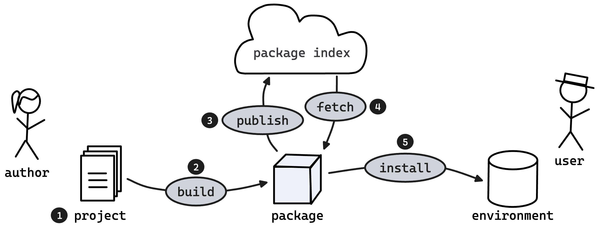
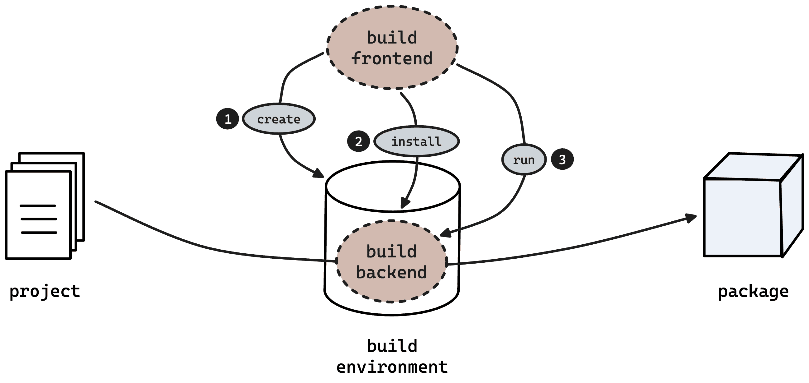
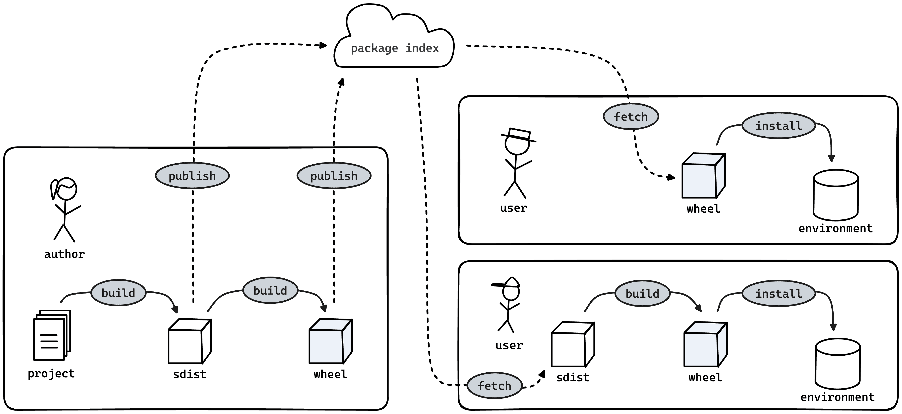

# 第三章：Python 包

在本章中，你将学习如何为分发打包你的 Python 项目。*包* 是一个单一文件，包含了你的代码的归档及描述它的元数据，比如项目名称和版本。

###### 注意

Python 社区使用 *包* 这个词来表示两个不同的概念。*导入包* 是包含其他模块的模块。*分发包* 则是用于分发 Python 软件的归档文件，它们是本章的主题。

你可以使用像 pip 这样的包安装程序将一个包安装到 Python 环境中。你也可以将它上传到一个包仓库，以使他人受益。Python 软件基金会（PSF）运营着一个称为 [Python Package Index](https://pypi.org/)（PyPI）的包仓库。如果你的包在 PyPI 上，任何人都可以通过将其项目名称传递给 `pip install` 来安装它。

打包你的项目使其易于与他人共享，但还有另一个好处。当你安装你的包时，它成为 Python 环境中的一等公民：

+   解释器从环境中导入你的模块，而不是从文件系统中的任意目录导入，这样可能会根据你如何调用 Python 而有所不同，也可能会无法正常工作。

+   安装程序使用包元数据来确保环境符合包的先决条件，例如最低的 Python 版本以及它依赖的任何第三方包。

+   安装程序可以生成入口点脚本，以确保你的代码始终在环境中的解释器上运行。与手写的 Python 脚本相比，后者可能在错误的 Python 版本上运行，或者没有所需的第三方包，或者无法导入自己的模块。

在本章中，我将解释如何打包你的 Python 项目，并介绍一些帮助进行打包任务的工具。本章分为三部分：

+   在第一部分中，我将讨论 Python 包的生命周期。我还将介绍一个示例应用程序，你将在本书中使用它。我会问：为什么你要打包你的代码？

+   在第二部分中，我将介绍 Python 的包配置文件 *pyproject.toml*，以及用于处理包的工具：`build`、`hatchling` 和 Twine。工具 pip、uv 和 pipx 也会再次出现。最后，我将介绍 Rye，一个将这些打包工具整合到统一工作流程中的项目管理器。在此过程中，你将了解构建前端和后端、wheels 和 sdists、可编辑安装和 *src* 布局。

+   在第三部分中，我将详细讨论项目元数据——在 *pyproject.toml* 中定义和描述你的包的各种字段，以及如何高效利用它们。

# 包的生命周期

图 3-1 展示了一个包的典型生命周期。



###### 图 3-1\. 包的生命周期：作者将项目构建成包并将其上传到包索引，然后用户将包下载并安装到环境中。


一切都始于一个*项目*：应用程序、库或其他软件的源代码。


作为作者，您的第一步是从项目构建一个包。该包是一个可安装的工件，包含项目此时点的快照，由唯一的名称和版本标识。


接下来，您将包发布到知名的存储库，如 PyPI。


用户现在可以通过指定其名称和版本获取您的包。


最后，用户将您的包安装到他们的环境中。

您可以直接将刚构建的包安装到环境中，而无需先将其上传到包存储库—例如，当您在测试包或您是其唯一用户时。

在实际应用中，工具通常将获取和安装、构建和安装，甚至构建和发布组合为单个命令。

# 一个示例应用程序

许多应用程序最初是小型的临时脚本。示例 3-1 从维基百科获取随机文章，并在控制台中显示其标题和摘要。该脚本限制于标准库，因此可在任何 Python 3 环境中运行。

##### 示例 3-1\. 显示从随机维基百科文章中提取的内容

```py
import json
import textwrap
import urllib.request

API_URL = "https://en.wikipedia.org/api/rest_v1/page/random/summary" 

def main():
    with urllib.request.urlopen(API_URL) as response: 
        data = json.load(response) 

    print(data["title"], end="\n\n") 
    print(textwrap.fill(data["extract"])) 

if __name__ == "__main__":
    main()
```


`API_URL`常量指向英文维基百科的 REST API，更具体地说是其 `/page/random/summary` 端点。


`urllib.request.urlopen`调用发送 HTTP GET 请求到维基百科 API。`with`语句确保连接在块结束时关闭。


响应体以 JSON 格式包含资源数据。方便地，响应是一个类似文件的对象，所以`json`模块可以像从磁盘加载文件一样加载它。


`title`和`extract`键分别包含维基百科页面的标题和简短的纯文本摘录。`textwrap.fill`函数用于将文本包装，使每行最多 70 个字符长。

将此脚本存储在名为*random_wikipedia_article.py*的文件中并运行它。以下是一个示例运行：

```py
> py -m random_wikipedia_article
Jägersbleeker Teich

The Jägersbleeker Teich in the Harz Mountains of central Germany
is a storage pond near the town of Clausthal-Zellerfeld in the
county of Goslar in Lower Saxony. It is one of the Upper Harz Ponds
that were created for the mining industry.

```

# 为什么需要打包？

分享像 示例 3-1 这样的脚本不需要打包。你可以在博客或托管的仓库上发布它，或通过电子邮件或聊天发送给朋友。Python 的普及性，其标准库的“电池包含”方法，以及作为解释语言的特性使这一切成为可能。

与世界共享模块的便利性曾是 Python 在早期被广泛采用的一个优势。Python 编程语言早于语言特定的包仓库的出现——PyPI 在十多年后才出现。¹

分发未打包的自包含模块似乎一开始是个好主意：你可以保持项目没有打包的杂物。它们不需要单独的工件，也不需要像构建那样的中间步骤或专用工具。但使用模块作为分发单元也有限制：

由多个模块组成的项目

当你的项目超出单个文件脚本时，你应该将其拆分开来，但是为用户安装一堆文件很麻烦。打包能让你将所有东西都保持在一个单一文件中进行分发。

具有第三方依赖项的项目

Python 拥有丰富的第三方包生态系统，因此你站在巨人的肩膀上。但你的用户不应该担心安装每个所需包的正确版本。打包能让你声明对其他包的依赖关系，安装程序会自动满足这些依赖。

查找项目

那个有用模块的仓库网址是什么？还是说在某个博客上？如果你在 PyPI 上发布一个包，你的用户只需知道其名称即可安装最新版本。在企业环境中情况类似，开发者的机器配置为使用公司范围的包仓库。

安装项目

大多数情况下，下载并双击脚本是行不通的。你不应该需要将模块放在神秘的目录中，并执行特殊操作来确保你的脚本在正确的解释器上执行。打包让用户可以用单一命令在可移植和安全的方式下安装你的项目。

更新项目

用户需要确定项目是否为最新版本，并在需要时升级到最新版本。作为作者，你需要一种方法让用户从新功能、错误修复和改进中受益。包仓库让你发布项目的一系列版本（开发快照的一个子集）。

在正确环境中运行项目

不要让程序在支持的 Python 版本上运行成为偶然，也不要忽视所需的第三方包。包安装程序会检查和在可能的情况下满足你的先决条件。它们还确保你的代码在预期的环境中运行。

二进制扩展

用 C 或 Rust 等编译语言编写的 Python 模块需要构建步骤。打包允许您分发常见平台的预构建二进制文件。此外，它允许您发布源代码存档作为备用；安装程序在最终用户的计算机上运行构建步骤。

元数据

您可以在模块内嵌入元数据，使用诸如 `__author__`、`__version__` 或 `__license__` 等属性。但是工具必须执行模块才能读取这些属性。包含静态元数据的包可以在不运行 Python 的情况下供任何工具读取。

正如您所见，打包解决了许多问题，但有什么开销呢？简而言之，您只需将名为 *pyproject.toml* 的声明文件放入项目中—​这是一个指定项目元数据及其构建系统的标准文件。作为回报，您获得了用于构建、发布和安装包的命令。

总之，Python 包带来了许多优势：

+   您可以轻松安装和升级它们

+   您可以将它们发布到包存储库中

+   它们可以依赖于其他包

+   它们在满足其要求的环境中运行

+   它们可以包含多个模块

+   它们可以包含预构建的二进制扩展

+   它们可以包含带有自动构建步骤的源分发

+   它们附带描述包的元数据

# pyproject.toml 文件

示例 3-2 展示了如何使用最少的元数据—​项目名称和版本—​以及一个入口脚本来打包 示例 3-1 中的脚本。项目和脚本使用连字符 (`random-wikipedia-article`)，而模块使用下划线 (`random_wikipedia_article`)。将模块和 *pyproject.toml* 文件并排放在空目录中。

##### 示例 3-2\. 一个最小的 pyproject.toml 文件

```py
[project]
name = "random-wikipedia-article"
version = "0.1"

[project.scripts]
random-wikipedia-article = "random_wikipedia_article:main"

[build-system]
requires = ["hatchling"]
build-backend = "hatchling.build"
```

###### 提示

PyPI 项目共享单一命名空间—​它们的名称不由用户或拥有项目的组织所限定。选择一个唯一的名称，比如 `random-wikipedia-article-{your-name}`，并相应地重命名 Python 模块。

在顶层，*pyproject.toml* 文件可以包含最多三个部分—​或者 *表*，正如 TOML 标准所称：

`[project]`

`project` 表包含项目元数据。`name` 和 `version` 字段是必需的。对于真实项目，您应该提供额外的信息，比如描述、许可证和所需的 Python 版本（参见 “项目元数据”）。`scripts` 部分声明入口脚本的名称以及它应该调用的函数。

`[build-system]`

`build-system` 表指定了如何为项目构建包（参见 “使用 build 构建包”）—特别是您的项目使用的构建工具。我在这里选择了 `hatchling`，它随 [Hatch](https://hatch.pypa.io/) 一起提供，这是一个现代且符合标准的 Python 项目管理器。

`[tool]`

`tool`表存储了项目使用的每个工具的配置。例如，Ruff 代码检查器从`[tool.ruff]`表中读取其配置，而类型检查器 mypy 使用`[tool.mypy]`。

# 使用 build 构建包

让我们使用`build`为你的新项目创建一个包，这是一个由 Python 包管理局（PyPA）维护的专用构建前端。PyPA 是一组志愿者，负责维护 Python 打包中使用的一组核心软件项目。

###### 注

*构建前端*是一个为 Python 包编排构建过程的应用程序。构建前端不知道如何从源代码树中组装打包工件。实际构建的工具称为*构建后端*。

打开一个终端，切换到项目目录，并使用 pipx 调用`build`：

```py
$ pipx run build
* Creating venv isolated environment...
* Installing packages in isolated environment... (hatchling)
* Getting build dependencies for sdist...
* Building sdist...
* Building wheel from sdist
* Creating venv isolated environment...
* Installing packages in isolated environment... (hatchling)
* Getting build dependencies for wheel...
* Building wheel...
Successfully built random_wikipedia_article-0.1.tar.gz
 and random_wikipedia_article-0.1-py2.py3-none-any.whl
```

默认情况下，`build`为项目创建两种类型的包，即源分发包（sdist）和轮子（wheel）（参见“轮子和源分发包”）。你可以在项目的*dist*目录中找到这些文件。

如上输出所示，`build`将实际工作委派给了`hatchling`，你在示例 3-2 中指定的构建后端。构建前端使用`build-system`表来确定项目的构建后端（见表 3-1）。

表 3-1\. `build-system`表

| 字段 | 类型 | 描述 |
| --- | --- | --- |
| `requires` | 字符串数组 | 构建项目所需的包的列表 |
| `build-backend` | 字符串 | 构建后端的导入名称，格式为`package.module:object` |
| `build-path` | 字符串 | 用于导入构建后端所需的`sys.path`条目（可选） |

图 3-2 展示了构建前端和构建后端如何协作构建一个包。



###### 图 3-2\. 构建前端和构建后端


构建前端创建了一个虚拟环境，*构建环境*。


构建前端安装了列在`requires`下的包：构建后端本身以及可选的后端插件。这些包称为*构建依赖项*。


构建前端通过两个步骤触发实际的包构建。首先，它导入了在`build-backend`中声明的模块或对象。其次，它调用了用于创建包和相关任务的众所周知的函数，称为*构建钩子*。

下面是构建前端在为项目构建轮子时执行的命令的简化版本：²

```py
$ py -m venv buildenv
$ buildenv/bin/python -m pip install hatchling
$ buildenv/bin/python
>>> import hatchling.build as backend
>>> backend.get_requires_for_build_wheel()
[]  # no additional build dependencies requested
>>> backend.build_wheel("dist")
'random_wikipedia_article-0.1-py2.py3-none-any.whl'

```

###### 注

一些构建前端允许你在当前环境中构建。如果禁用构建隔离，前端仅检查构建依赖项。如果已安装它们，则不同包的构建和运行时依赖项可能会冲突。

为什么将构建前端与构建后端分开？这意味着工具可以触发包构建，而无需了解构建过程的复杂性。例如，包安装器如 pip 和 uv 可以在从源代码目录安装时即时构建包（参见 “从源码安装项目”）。

在构建前端和构建后端之间标准化合同，极大地增加了包装生态系统的多样性和创新。构建前端包括 `build`、pip 和 uv，不考虑后端的 Python 项目管理器 Rye、Hatch 以及 [PDM](https://pdm-project.org/latest/)，以及诸如 [tox](https://tox.wiki/en/4.14.2/) 等测试自动化工具。构建后端包括随项目管理器一起提供的 Flit、Hatch、PDM 和 [Poetry](https://python-poetry.org/)，传统的构建后端 [setuptools](https://setuptools.pypa.io/)，以及像 [Maturin](https://www.maturin.rs/) 这样的用 Rust 编写的 Python 模块构建后端，以及 [Sphinx Theme Builder](https://sphinx-theme-builder.readthedocs.io/)，用于 Sphinx 文档主题的构建后端（见 Table 3-2）。

表 3-2\. 构建后端

| 项目 | `requires`^(a) | `build-backend` |
| --- | --- | --- |
| Flit | `flit-core` | `flit_core.buildapi` |
| 孵化 | `hatchling` | `hatchling.build` |
| Maturin | `maturin` | `maturin` |
| PDM | `pdm-backend` | `pdm.backend` |
| Poetry | `poetry-core` | `poetry.core.masonry.api` |
| Setuptools | `setuptools` | `setuptools.build_meta` |
| Sphinx Theme Builder | `sphinx-theme-builder` | `sphinx_theme_builder` |
| ^(a) 请参阅每个工具的官方文档，了解推荐的版本范围 |

# 使用 Twine 上传包

是时候发布你的包了。在这一节中，你将使用[TestPyPI](https://test.pypi.org)，这是 Python 包索引的一个单独实例，用于测试和实验。只需省略下面的`--repository`和`--index-url`选项，即可使用真实的 PyPI。

首先，在 TestPyPI 的首页使用链接注册一个账户。其次，从你的账户页面创建一个 API 令牌，并将令牌复制到你首选的密码管理器中。现在，你可以使用 Twine（官方的 PyPI 上传工具）上传 *dist* 中的包。

```py
$ pipx run twine upload --repository=testpypi dist/*
Uploading distributions to https://test.pypi.org/legacy/
Enter your API token: *********
Uploading random_wikipedia_article-0.1-py2.py3-none-any.whl
Uploading random_wikipedia_article-0.1.tar.gz

View at:
https://test.pypi.org/project/random-wikipedia-article/0.1/
```

恭喜，你已经发布了你的第一个 Python 包！让我们从 TestPyPI 安装这个包：

```py
$ pipx install --index-url=https://test.pypi.org/simple random-wikipedia-article
  installed package random-wikipedia-article 0.1, installed using Python 3.12.2
  These apps are now globally available
    - random-wikipedia-article
done!

```

现在，你可以在任何地方调用你的应用程序：

```py
$ random-wikipedia-article
```

# 从源码安装项目

如果您为项目分发软件包，将这些软件包在本地安装以进行开发和测试是一个好主意。对已安装的软件包运行测试，而不是源代码，意味着您正在测试您的项目，就像您的用户看到的那样。如果您正在开发服务，这将有助于使开发、暂存和生产尽可能相似。

您*可以*使用 `build` 构建一个轮子，并将其安装到虚拟环境中：

```py
$ pipx run build
$ uv venv
$ uv pip install dist/*.whl
```

不过，还有一种快捷方式。pip 和 uv 都可以直接从源目录（例如 `.` 代表当前目录）安装您的项目。在幕后，它们使用项目的构建后端创建一个轮子进行安装——它们就像 `build` 一样是构建前端：

```py
$ uv venv
$ uv pip install .
```

如果您的项目带有入口点脚本，您也可以使用 pipx 安装它：

```py
$ pipx install .
  installed package random-wikipedia-article 0.1, installed using Python 3.10.8
  These apps are now globally available
    - random-wikipedia-article
```

## 可编辑安装

在开发过程中，立即在环境中看到代码更改反映出来，而无需反复安装项目，这样可以节省时间。您可以直接从源树导入模块，但这样做会丧失打包项目的所有好处。

*可编辑安装*实现了最佳效果，通过以特殊方式安装您的软件包，将导入重定向到源树（参见“站点包”）。您可以将这种机制视为 Python 软件包的一种“热重载”。`--editable`选项（`-e`）与 uv、pip 和 pipx 一起工作：

```py
$ uv pip install --editable .
$ py -m pip install --editable .
$ pipx install --editable .

```

一旦您以这种方式安装了软件包，您就不需要重新安装它以查看源代码的更改——只有在编辑 *pyproject.toml* 以更改项目元数据或添加第三方依赖项时才需要重新安装。

可编辑安装是模仿 setuptools 中的*开发模式*功能建立的，如果您已经足够长时间了解它。但与 `setup.py develop` 不同，它们依赖于任何构建后端都可以提供的标准构建钩子。

# 项目布局

将 *pyproject.toml* 放在单个文件模块旁边是一种非常简单的方法。不幸的是，这种项目布局带来了一个严重的问题，正如您将在本节中看到的那样。让我们从项目中破坏一些东西开始：

```py
def main():
    raise Exception("Boom!")
```

在发布软件包之前，使用本地构建的轮子进行最后的冒烟测试：

```py
$ pipx run build
$ uv venv
$ uv pip install dist/*.whl
$ py -m random_wikipedia_article
Exception: Boom!

```

找到的错误是修复的错误。删除有问题的行之后，验证程序是否按预期工作：

```py
$ py -m random_wikipedia_article
Cystiscus viaderi

Cystiscus viaderi is a species of very small sea snail, a marine
gastropod mollusk or micromollusk in the family Cystiscidae.
```

一切都很好，是时候发布一个版本了！首先，将您的修复和新版本的 Git 标签推送到您的代码存储库。接下来，使用 Twine 将轮子上传到 PyPI：

```py
$ pipx run twine upload dist/*
```

但是，天哪——您从未重建过轮子。这个错误现在已经在一个公共版本中！怎么可能发生这种情况？

使用 `py -m` 运行您的应用程序可以防止意外地从另一个安装运行入口点脚本（并且它有不需要在 macOS 和 Linux 上有活动环境的优点）。但它也会将当前目录添加到 `sys.path` 的前面（参见 “Site Packages”）。一直以来，您一直在源树中测试模块，而不是您打算发布的 wheel！

您可以设置 `PYTHONSAFEPATH` 环境变量，并且永远不再考虑此事——这是 `py -P` 的别名，并省略模块路径中的当前目录。但这将使您的贡献者不被冷落——以及当您在另一台机器上工作时。

取而代之的是，将您的模块移出顶级目录，以免人们误导入它。按照惯例，Python 源树放入 *src* 目录中——这就是为什么在 Python 社区中这种安排被称为 *src 布局*。

此时，将单文件模块转换为导入包也是有意义的。通过将 *random_wikipedia_article.py* 文件替换为一个 *random_wikipedia_article* 目录，其中包含一个 *__init__.py* 模块。

将您的代码放入导入包中基本上等同于将其放入单文件模块中——但有一个区别：您不能使用 `py -m random_wikipedia_article` 运行应用程序，除非您还将特殊的 *__main__.py* 模块添加到包中（参见 Example 3-3）。

##### 示例 3-3\. *__main__.py* 模块

```py
from random_wikipedia_article import main

main()
```

*__main__.py* 模块替代了 *__init__.py* 中的 `if __name__ == "__main__"` 块。从模块中删除该块。

这将给您留下一个经典的初始项目结构：

```py
random-wikipedia-article
├── pyproject.toml
└── src
    └── random_wikipedia_article
        ├── __init__.py
        └── __main__.py
```

导入包使得项目更容易扩展：您可以将代码移到单独的模块中并从那里导入。例如，您可以将与 Wikipedia API 交互的代码提取到一个名为 `fetch` 的函数中。接下来，您可以将该函数移动到包中的 *fetch.py* 模块中。以下是从 *__init__.py* 导入该函数的方法：

```py
from random_wikipedia_article.fetch import fetch
```

最终，*__init__.py* 将只包含您公共 API 的 `import` 语句。

# 使用 Rye 管理包

许多现代编程语言都配备了一个工具来构建、打包和执行其他开发任务。您可能想知道 Python 社区是如何最终拥有如此多的分离职责的打包工具的。

答案与 Python 项目的性质和历史有关：Python 是一个由成千上万志愿者驱动的分散式开源项目，历史跨越三十多年的有机增长。这使得单一的打包工具难以满足所有需求并牢固确立。³

Python 的优势在于其丰富的生态系统—​和互操作标准促进了这种多样性。作为 Python 开发人员，你可以选择那些良好协同的小型单一目的工具。这种方法符合“做一件事，并做好”的 Unix 哲学。

但 Unix 的方法不再是你唯一的选择。*Python 项目管理器*提供了一个更集成的工作流程。其中首要的是 Poetry（见第五章），它设定了重新发明 Python 打包的目标，并倡导了静态元数据和跨平台锁定文件等概念。

[Rye](https://rye-up.com/)是一个用 Rust 编写的 Python 项目管理器，选择了一条不同的道路。它在这本书中已经看到（也即将看到）的广泛使用的单一目的工具之上提供了统一的开发体验。由 Armin Ronacher 作为私人项目开始，并于 2023 年首次向公众发布，现在由 Astral 管理，Astral 是 Ruff 和 uv 背后的公司。

请参阅 Rye 的官方文档以获取安装说明。

使用 `rye init` 初始化新项目是你使用 Rye 的第一步。如果没有传递项目名称，Rye 将使用当前目录的名称。使用 `--script` 选项包含入口点脚本：

```py
$ rye init random-wikipedia-article --script
```

Rye 在 *random-wikipedia-article* 中初始化了一个 Git 存储库，并用一个 *pyproject.toml* 文件，一个 *src* 目录中的导入包 `random_wikipedia_article`，一个包含项目描述的 *README.md*，一个包含默认 Python 版本的 *.python-version* 文件，以及一个位于 *.venv* 中的虚拟环境来填充它。Rye 支持各种构建后端，其中 `hatchling` 是默认选择。

```py
random-wikipedia-article
├── .git
├── .gitignore
├── .python-version
├── .venv
├── README.md
├── pyproject.toml
└── src
    └── random_wikipedia_article
        ├── __init__.py
        └── __main__.py
```

Rye 的许多命令是前端工具，这些工具已成为 Python 世界中事实上的标准，或者有望在未来成为标准。`rye build`命令使用`build`创建包，`rye publish`命令使用 Twine 上传包，`rye sync`命令使用 uv 执行可编辑安装：

```py
$ rye build
$ rye publish --repository testpypi --repository-url https://test.pypi.org/legacy/
$ rye sync
```

`rye sync`其实功能远不止于此。 Rye 使用 Python Standalone Builds 项目管理私有 Python 安装（参见“全新世界：使用 Hatch 和 Rye 安装”），`rye sync`在首次使用时获取每个 Python 版本。该命令还为项目依赖项生成锁定文件，并将环境与该文件同步（参见第四章）。

# Wheels 和 Sdists

在“使用 build 构建包”中，`build` 为您的项目创建了两个包：

+   *random_wikipedia_article-0.1.tar.gz*

+   *random_wikipedia_article-0.1-py2.py3-none-any.whl*

这些工件被称为*wheel*和*sdist*。Wheels 是带有*.whl*扩展名的 ZIP 归档文件，它们是*构建分发*——大多数情况下，安装程序会将它们原封不动地解压到环境中。相比之下，sdist 是*源分发*：它们是包含打包元数据的源代码压缩归档文件。需要额外的构建步骤来生成可安装的 wheel。

###### 小贴士

Python 包的名称“wheel”是对奶酪轮的引用。PyPI 最初以*奶酪商店*而闻名，这是源自蒙提·派森有关没有奶酪的奶酪商店的小品。如今，PyPI 每天提供超过一 PB 的软件包。

对于像 Python 这样的解释语言，源分发和构建分发之间的区别可能显得有些奇怪。但是你也可以使用编译语言编写 Python 模块。在这种情况下，当某个平台上没有预构建的 wheel 可用时，源分发提供了一个有用的备选方案。

作为包的作者，您应该为您的发布构建和发布 sdist 和 wheels。这样一来，用户可以选择：如果他们的环境兼容（对于纯 Python 包始终如此），他们可以获取并安装 wheel——或者他们可以获取 sdist 并在本地构建 wheel（参见图 3-3）。



###### 图 3-3\. Wheels 和 sdists

对于包的使用者来说，sdist 有几个注意事项。首先，构建步骤涉及任意代码执行，这可能是一个安全问题⁴。其次，安装 wheels 比安装 sdist 要快得多，特别是对于基于传统*setup.py*的包来说。最后，如果用户系统上缺少所需的构建工具链，他们可能会遇到扩展模块的构建错误。

通常，纯 Python 包在给定版本发布时会有一个单独的 sdist 和一个单独的 wheel。另一方面，二进制扩展模块通常会针对一系列平台和环境提供 wheels。

###### 小贴士

如果您是扩展模块的作者，请查看`cibuildwheel`项目：它可以自动在多个平台上构建和测试 wheels，并支持 GitHub Actions 和其他各种持续集成（CI）系统。

## 核心元数据

如果您感兴趣，可以使用`unzip`实用程序解压缩 wheel，以查看安装程序放置在*site-packages*目录中的文件。请在 Linux 或 macOS 的 Shell 中执行以下命令——最好在空目录中执行。如果您使用 Windows，可以使用 Windows 子系统来进行操作。

```py
$ py -m pip download attrs
$ unzip *.whl
$ ls -1
attr
attrs
attrs-23.2.0.dist-info
attrs-23.2.0-py3-none-any.whl

$ head -n4 attrs-23.2.0.dist-info/METADATA
Metadata-Version: 2.1
Name: attrs
Version: 23.2.0
Summary: Classes Without Boilerplate

```

除了导入的包（在此案例中命名为 `attr` 和 `attrs`），wheel 包含一个 *.dist-info* 目录，其中包含管理文件。该目录中的 *METADATA* 文件包含包的核心元数据，一组标准化的属性，用于安装程序和其他打包工具的好处。您可以使用标准库在运行时访问已安装包的核心元数据：

```py
$ uv pip install attrs
$ py
>>> from importlib.metadata import metadata
>>> metadata("attrs")["Version"]
23.2.0
>>> metadata("attrs")["Summary"]
Classes Without Boilerplate

```

在下一节中，您将看到如何在您自己的包中嵌入核心元数据，使用 *pyproject.toml* 中的 `project` 表。

###### 注意

核心元数据标准比 *pyproject.toml* 提前多年。大多数项目元数据字段对应于核心元数据字段，但它们的名称和语法略有不同。作为包作者，您可以安全地忽略此翻译，专注于项目元数据。

# 项目元数据

根据你在 *pyproject.toml* 的 `project` 表中指定的内容，构建后端会输出核心元数据字段。表格 3-3 提供了 `project` 表中可用字段的概述。

表格 3-3\. `project` 表

| 字段 | 类型 | 描述 |
| --- | --- | --- |
| `name` | 字符串 | 项目名称 |
| `version` | 字符串 | 项目的版本 |
| `description` | 字符串 | 项目的简要描述 |
| `keywords` | 字符串数组 | 项目的关键词列表 |
| `readme` | 字符串或表 | 项目详细描述的文件 |
| `license` | 表 | 管理该项目使用的许可证 |
| `authors` | 表的数组 | 作者列表 |
| `maintainers` | 表的数组 | 维护者列表 |
| `classifiers` | 字符串数组 | 描述项目的分类器列表 |
| `urls` | 字符串表 | 项目的网址 |
| `dependencies` | 字符串数组 | 所需的第三方包列表 |
| `optional-dependencies` | 表的数组的字符串 | 可选第三方包的命名列表（*extras*） |
| `scripts` | 字符串表 | 入口点脚本 |
| `gui-scripts` | 字符串表 | 提供图形用户界面的入口点脚本 |
| `entry-points` | 表的表的字符串 | 入口点组 |
| `requires-python` | 字符串 | 该项目所需的 Python 版本 |
| `dynamic` | 字符串数组 | 动态字段列表 |

每个包必需的两个关键字段是 `project.name` 和 `project.version`。项目名称唯一标识项目本身。项目版本标识一个*发布*—项目在其生命周期中的已发布快照。除名称和版本外，还可以提供一些可选字段，例如作者和许可证，描述项目的简短文本，或项目使用的第三方包（见 示例 3-4）。

##### 示例 3-4\. 带有项目元数据的 pyproject.toml 文件

```py
[project]
name = "random-wikipedia-article"
version = "0.1"
description = "Display extracts from random Wikipedia articles"
keywords = ["wikipedia"]
readme = "README.md"  # only if your project has a README.md file
license = { text = "MIT" }
authors = [{ name = "Your Name", email = "you@example.com" }]
classifiers = ["Topic :: Games/Entertainment :: Fortune Cookies"]
urls = { Homepage = "https://yourname.dev/projects/random-wikipedia-article" }
requires-python = ">=3.8"
dependencies = ["httpx>=0.27.0", "rich>=13.7.1"]
```

在接下来的章节中，我将更仔细地研究各种项目元数据字段。

## 项目命名

`project.name` 字段包含您项目的官方名称。

```py
[project]
name = "random-wikipedia-article"
```

用户通过指定此名称来使用 pip 安装项目。此字段还确定了项目在 PyPI 上的 URL。您可以使用任何 ASCII 字母或数字来命名您的项目，其中可以插入句点、下划线和连字符。打包工具会将项目名称标准化以便比较：所有字母都转换为小写，并且标点符号连续运行被替换为一个单破折号（或者在包文件名的情况下替换为下划线）。例如，`Awesome.Package`、`awesome_package` 和 `awesome-package` 都指代同一个项目。

项目名称与*导入名称*不同，导入名称是用户指定用于导入您的代码的名称。导入名称必须是有效的 Python 标识符，因此不能有连字符或句点，并且不能以数字开头。它们区分大小写，并且可以包含任何 Unicode 字母或数字。作为一个经验法则，您应该对每个分发包使用单个导入包，并且两者使用相同的名称（或直接翻译，如 `random-wikipedia-article` 和 `random_wikipedia_article`）。

## 项目版本管理

`project.version` 字段存储您在发布发布时的项目版本。

```py
[project]
version = "0.1"
```

Python 社区对版本号有一个规范，以确保自动化工具可以做出有意义的决策，比如选择项目的最新发布版。在核心，版本是一个点分隔的数字序列。这些数字可以是零，并且可以省略尾随零：`1`、`1.0` 和 `1.0.0` 都指代同一个版本。此外，您还可以附加某些类型的后缀到一个版本（参见 表 3-4）。最常见的后缀用于标识预发布版本：`1.0.0a2` 是第二个 alpha 发布版，`1.0.0b3` 是第三个 beta 发布版，`1.0.0rc1` 是第一个候选发布版。这些版本都在下一个版本之前，所有这些版本都在最终发布版之前：`1.0.0`。Python 版本还可以使用额外的组件以及备用拼写；请参阅 [PEP 440](https://peps.python.org/pep-0440/) 获取完整的规范。

表格 3-4\. 版本标识符

| 发布类型 | 描述 | 示例 |
| --- | --- | --- |
| 最终发布 | 稳定的、公开的快照（默认） | `1.0.0`、`2017.5.25` |
| 预发布 | 支持测试的最终发布的预览 | `1.0.0a1`、`1.0.0b1`、`1.0.0rc1` |
| 开发版本发布 | 像夜间构建一样的常规内部快照 | `1.0.0.dev1` |
| 后发布 | 修正代码之外的次要错误 | `1.0.0.post1` |

Python 版本规范故意宽松。两个广泛采用的跨语言标准附加了版本号的额外含义：[语义化版本](https://semver.org) 使用 `major.minor.patch` 方案，其中 `patch` 指代 bug 修复版本，`minor` 指代兼容性特性发布，而 `major` 指代带有破坏性变更的发布。[日历版本](https://calver.org) 使用各种形式的基于日期的版本，如 `year.month.day`、`year.month.sequence` 或 `year.quarter.sequence`。

## 动态字段

*pyproject.toml* 标准鼓励项目静态定义其元数据，而不是依赖于构建后端在打包期间计算字段。静态元数据有利于打包生态系统，因为它使得字段对其他工具可访问。它还减少了认知负担：构建后端使用相同的配置格式，并以直观透明的方式填充字段。

但有时让构建后端动态填充字段也很有用。例如，接下来的部分展示了如何从 Python 模块或 Git 标签派生包版本，而不是在 *pyproject.toml* 中重复它。

因此，项目元数据标准通过 *动态字段* 提供了一种逃生通道：如果项目在 `dynamic` 键下列出其名称，则允许使用后端特定的机制动态计算字段。

```py
[project]
dynamic = ["version", "readme"]
```

### 单一来源项目版本

许多项目在 Python 模块的顶部声明其版本，如下所示：

```py
__version__ = "0.2"
```

在几个位置更新频繁更改的项目是繁琐且容易出错的。因此，一些构建后端允许您从代码中提取版本号，而不是在 `project.version` 中重复它。此机制特定于您的构建后端，因此您需要在 `tool` 表中配置它。示例 3-5 演示了 Hatch 如何运作。

##### 示例 3-5\. 从 Python 模块派生项目版本

```py
[project]
name = "random-wikipedia-article"
dynamic = ["version"] 

[tool.hatch.version]
path = "random_wikipedia_article.py" 

[build-system]
requires = ["hatchling"]
build-backend = "hatchling.build"
```


将版本字段标记为动态。


告诉 Hatch 在哪里查找 `__version__` 属性。

您也可以通过另一种方式避免重复：在 *pyproject.toml* 中静态声明版本，并在运行时从安装的元数据中读取，如示例 3-6 所示。

##### 示例 3-6\. 从安装的元数据中读取版本

```py
from importlib.metadata import version

__version__ = version("random-wikipedia-article")
```

但是，不要在所有项目中都添加此样板代码。在程序启动期间不应执行环境中的元数据查找。第三方库如 `click` 会按需执行元数据查找——例如，当用户指定类似 `--version` 的命令行选项时。您可以通过为模块提供 `__getattr__` 函数按需读取版本（示例 3-7）⁵。

##### 示例 3-7\. 按需从安装的元数据中读取版本

```py
def __getattr__(name):
    if name != "__version__":
        msg = f"module {__name__} has no attribute {name}"
        raise AttributeError(msg)

    from importlib.metadata import version

    return version("random-wikipedia-article")
```

遗憾的是，您仍未真正实现版本的单一来源。最有可能，您还会使用类似 `git tag v1.0.0` 的命令在版本控制系统（VCS）中标记发布（如果没有，请务必——如果发布存在错误，版本标签可帮助您找到引入该错误的提交）。

幸运的是，许多构建后端都带有从 Git、Mercurial 和类似系统中提取版本号的插件。这种技术由 `setuptools-scm` 插件首创。对于 Hatch，您可以使用 `hatch-vcs` 插件，它是 `setuptools-scm` 的包装器（示例 3-8）。

##### 示例 3-8\. 从版本控制系统中派生项目版本

```py
[project]
name = "random-wikipedia-article"
dynamic = ["version"]

[tool.hatch.version]
source = "vcs"

[build-system]
requires = ["hatchling", "hatch-vcs"]
build-backend = "hatchling.build"
```

如果您从存储库构建此项目并检出了标签 `v1.0.0`，Hatch 将使用版本 `1.0.0` 的元数据。如果您检出了未标记的提交，则 Hatch 将生成类似 `0.1.dev1+g6b80314` 的开发版本。⁶ 换句话说，您可以在包构建期间从 Git 读取项目版本，并在运行时从包元数据读取。

## 入口点脚本

*入口点脚本* 是小型可执行文件，它们从其环境启动解释器，导入一个模块并调用一个函数（参见 “入口点脚本”）。安装程序如 pip 在安装包时会动态生成它们。

`project.scripts` 表允许您声明入口点脚本。将脚本名称指定为键，并指定应调用的模块和函数为值，使用格式 `*package*.*module*:*function*`。

```py
[project.scripts]
random-wikipedia-article = "random_wikipedia_article:main"
```

此声明允许用户使用其给定名称调用程序：

```py
$ random-wikipedia-article
```

`project.gui-scripts` 表使用与 `project.scripts` 表相同的格式——如果您的应用程序具有图形用户界面（GUI），请使用此表。

```py
[project.gui-scripts]
random-wikipedia-article-gui = "random_wikipedia_article:gui_main"
```

## 入口点

*入口点脚本* 是更一般机制 *入口点* 的特例。入口点允许您在包中注册一个 Python 对象，公开一个名称。Python 环境附带一个入口点注册表，任何包都可以查询此注册表以发现和导入模块，使用标准库中的函数 `importlib.metadata.entry_points`。应用程序通常使用此机制来支持第三方插件。

`project.entry-points`表格包含这些通用入口点。它们使用与入口点脚本相同的语法，但分组在被称为*入口点组*的子表中。如果你想为另一个应用程序编写一个插件，你可以在其指定的入口点组中注册一个模块或对象。

```py
[project.entry-points.some_application]
my-plugin = "my_plugin"
```

你还可以使用点号表示法注册子模块，以及模块内的对象，使用格式 `*module*:*object*`：

```py
[project.entry-points.some_application]
my-plugin = "my_plugin.submodule:plugin"
```

让我们通过一个示例来看看它是如何工作的。随机的维基百科文章看起来像是有趣的小幸运饼干，但它们也可以作为*测试固件*⁷，用于维基百科查看器和类似应用程序的开发者。让我们把这个应用程序转变成 pytest 测试框架的一个插件。（如果你还没有使用过 pytest，不用担心；我会在第六章中深入讲解测试。）

Pytest 允许第三方插件通过测试固件和其他功能来扩展其功能。它定义了一个名为`pytest11`的入口点组，用于这些插件。你可以通过在这个组中注册一个模块来为 pytest 提供插件。让我们也把 pytest 添加到项目依赖中。

```py
[project]
dependencies = ["pytest"]

[project.entry-points.pytest11]
random-wikipedia-article = "random_wikipedia_article"
```

为简单起见，我选择了主函数所在的顶级模块，在示例 3-1 中展示。接下来，扩展 pytest，添加一个测试固件，返回一个随机的维基百科文章，如示例 3-9 所示。

##### 示例 3-9\. 使用随机维基百科文章的测试固件

```py
import json
import urllib.request

import pytest

API_URL = "https://en.wikipedia.org/api/rest_v1/page/random/summary"

@pytest.fixture
def random_wikipedia_article():
    with urllib.request.urlopen(API_URL) as response:
        return json.load(response)
```

维基百科查看器的开发者现在可以在 pytest 旁边安装你的插件了。测试函数通过将其作为函数参数引用来使用你的测试固件（参见示例 3-10）。Pytest 识别出函数参数是一个测试固件，并调用带有固件返回值的测试函数。

##### 示例 3-10\. 使用随机文章固件的测试函数

```py
# test_wikipedia_viewer.py
def test_wikipedia_viewer(random_wikipedia_article):
    print(random_wikipedia_article["extract"]) 
    assert False 
```


一个真正的测试会运行查看器而不是`print()`。


让测试失败以便我们能够看到完整的输出。

你可以在项目目录中的活动虚拟环境中自己尝试这个：

```py
$ py -m pip install .
$ py -m pytest test_wikipedia_viewer.py
============================= test session starts ==============================
platform darwin -- Python 3.12.2, pytest-8.1.1, pluggy-1.4.0
rootdir: ...
plugins: random-wikipedia-article-0.1
collected 1 item

test_wikipedia_viewer.py F                                               [100%]

=================================== FAILURES ===================================
____________________________ test_wikipedia_viewer _____________________________

    def test_wikipedia_viewer(random_wikipedia_article):
        print(random_wikipedia_article["extract"])
>       assert False
E       assert False

test_wikipedia_viewer.py:4: AssertionError
----------------------------- Captured stdout call -----------------------------
Halgerda stricklandi is a species of sea slug, a dorid nudibranch, a shell-less
marine gastropod mollusk in the family Discodorididae.
=========================== short test summary info ============================
FAILED test_wikipedia_viewer.py::test_wikipedia_viewer - assert False
============================== 1 failed in 1.10s ===============================

```

## 作者和维护者

`project.authors`和`project.maintainers`字段包含项目的作者和维护者列表。这些列表中的每个条目都是一个带有`name`和`email`键的表格—​你可以指定这些键中的任一个或两者都指定。

```py
[project]
authors = [{ name = "Your Name", email = "you@example.com" }]
maintainers = [
  { name = "Alice", email = "alice@example.com" },
  { name = "Bob", email = "bob@example.com" },
]
```

对字段的含义有些开放于解释。如果你开始一个新项目，我建议在`authors`中包括你自己，并省略`maintainers`字段。长期的开源项目通常在`authors`下列出原始作者，而负责项目持续维护的人员则出现在`maintainers`下。

## 描述和 README

`project.description` 字段包含一个短描述作为字符串。此字段将作为您在 PyPI 上项目页面的副标题出现。一些打包工具在显示可读性描述的紧凑包列表时也使用此字段。

```py
[project]
description = "Display extracts from random Wikipedia articles"
```

`project.readme` 字段通常是一个字符串，包含项目长描述文件的相对路径。通常的选择是用于 Markdown 格式的 *README.md* 和用于 reStructuredText 格式的 *README.rst*。此文件的内容将出现在 PyPI 上的项目页面上。

```py
[project]
readme = "README.md"
```

您还可以指定带有 `file` 和 `content-type` 键的表格，而不是字符串。

```py
[project]
readme = { file = "README", content-type = "text/plain" }
```

您甚至可以使用 `text` 键将长描述嵌入到 *pyproject.toml* 文件中。

```py
[project.readme]
content-type = "text/markdown"
text = """
# random-wikipedia-article

Display extracts from random Wikipedia articles
"""
```

编写良好的 README 并非易事—通常，项目描述会出现在不同的地方，例如 PyPI、类似 GitHub 的仓库托管服务，以及像 [Read the Docs](https://readthedocs.org) 这样的官方文档服务内部。如果需要更多灵活性，您可以声明字段是动态的，并使用像 `hatch-fancy-pypi-readme` 这样的插件从多个片段组装项目描述。

## 关键词和分类器

`project.keywords` 字段包含一个字符串列表，供人们在 PyPI 上搜索您的项目使用。

```py
[project]
keywords = ["wikipedia"]
```

`project.classifiers` 字段包含一个分类器列表，以标准化方式对项目进行分类。

```py
[project]
classifiers = [
    "Development Status :: 3 - Alpha",
    "Environment :: Console",
    "Topic :: Games/Entertainment :: Fortune Cookies",
]
```

PyPI 维护 Python 项目的 [官方注册表](https://pypi.org/classifiers)。它们被称为 *Trove classifiers*，由双冒号分隔的分层组织标签组成（见 表 3-5）。Trove 项目由 Eric S. Raymond 发起，是一个早期设计的开源软件存储库。

表 3-5\. Trove 分类器

| 分类器组 | 描述 | 示例 |
| --- | --- | --- |
| 开发状态 | 此版本的成熟度 | `Development Status :: 5 - Production/Stable` |
| 环境 | 项目运行的环境 | `Environment :: No Input/Output (Daemon)` |
| 操作系统 | 项目支持的操作系统 | `Operating System :: OS Independent` |
| 框架 | 项目使用的任何框架 | `Framework :: Flask` |
| 受众 | 项目服务的用户类型 | `Intended Audience :: Developers` |
| 许可证 | 项目分发的许可证 | `License :: OSI Approved :: MIT License` |
| 自然语言 | 项目支持的自然语言 | `Natural Language :: English` |
| 编程语言 | 项目所用的编程语言 | `Programming Language :: Python :: 3.12` |
| 主题 | 与项目相关的各种主题 | `Topic :: Utilities` |

分类器完全是可选的。我建议指明开发状态和支持的操作系统，这些信息在其他元数据字段中没有涵盖。如果你想包含更多分类器，请提供每个分类器组中的一个。

## 项目 URL

`project.urls` 表格允许你将用户指向项目主页、源代码、文档、问题跟踪器和类似项目相关的 URL。你在 PyPI 上的项目页面使用提供的键作为每个链接的显示文本。它还为许多常见名称和 URL 显示适当的图标。

```py
[project.urls]
Homepage = "https://yourname.dev/projects/random-wikipedia-article"
Source = "https://github.com/yourname/random-wikipedia-article"
Issues = "https://github.com/yourname/random-wikipedia-article/issues"
Documentation = "https://readthedocs.io/random-wikipedia-article"
```

## 许可证

`project.license` 字段是一个表格，你可以在 `text` 键下指定项目的许可证，或者通过 `file` 键引用文件。你可能还希望添加相应的 Trove 分类器来说明许可证。

```py
[project]
license = { text = "MIT" }
classifiers = ["License :: OSI Approved :: MIT License"]
```

我建议使用 `text` 键，并使用类似“MIT”或“Apache-2.0”的 [SPDX 许可证标识符](https://spdx.org/licenses/)。软件包数据交换 (SPDX) 是 Linux 基金会支持的开放标准，用于传达软件物料清单信息，包括许可证。

###### 注意

截至本文撰写时，正在讨论一项 Python 增强提案 (PEP)，该提案将 `license` 字段更改为使用 SPDX 语法的字符串，并添加一个 `license-files` 键用于包内分发的许可证文件：[PEP 639](https://peps.python.org/pep-0639/)。

如果不确定要为项目选择哪种开源许可证，[choosealicense.com](https://choosealicense.com/) 提供了一些有用的指导。对于专有项目，通常会指定“proprietary”。你还可以添加特殊的分类器 `Private :: Do Not Upload`，以防止意外上传到 PyPI。

```py
[project]
license = { text = "proprietary" }
classifiers = [
    "License :: Other/Proprietary License",
    "Private :: Do Not Upload",
]
```

## 所需 Python 版本

使用 `project.requires-python` 字段来指定你的项目支持的 Python 版本。⁸

```py
[project]
requires-python = ">=3.8"
```

大多数情况下，人们将最低 Python 版本指定为下限，使用格式为 `>=3.x` 的字符串。此字段的语法更通用，并遵循项目依赖的 *版本规范* 相同的规则（参见 第四章）。

Nox 和 tox 等工具使得在多个 Python 版本上运行检查变得更加容易，帮助你确保字段反映现实情况。作为基准，我建议要求最旧的仍然接收安全更新的 Python 版本。你可以在 [Python 开发者指南](https://devguide.python.org/versions/) 上找到所有当前和过去 Python 版本的生命周期终止日期。

关于 Python 版本更加严格的主要原因有三点。首先，你的代码可能依赖于较新的语言特性——例如，Python 3.10 引入了结构模式匹配。其次，你的代码可能依赖于标准库中的更新特性——请查看官方文档中关于“在 3.x 版本中变更”的说明。第三，可能依赖于对 Python 版本要求更为严格的第三方包。

一些包声明 Python 版本的上限，例如`>=3.8,<4`。虽然不建议这种做法，但是依赖此类包可能会迫使您为自己的包声明相同的上限。依赖解决器无法在环境中降级 Python 版本；它们要么失败，要么更糟，降级包到带有更宽松 Python 约束的旧版本。未来的 Python 4 不太可能引入像人们从 Python 2 转向 3 时那样的重大更改。

###### 警告

除非您*确信*您的包与任何更高版本不兼容，否则不要为所需的 Python 版本指定上限。上限会在发布新版本时在生态系统中引起混乱。

## 依赖和可选依赖

剩余的两个字段，`project.dependencies`和`project.optional-dependencies`，列出了项目依赖的任何第三方包。您将在下一章节更详细地查看这些字段以及依赖关系。

# 概要

打包允许您发布 Python 项目的版本，使用源分发（*sdists*）和构建分发（*wheels*）。这些构件包含您的 Python 模块以及项目元数据，以一种用户可以轻松安装到其环境中的归档格式。标准的*pyproject.toml*文件定义了 Python 项目的构建系统以及项目元数据。构建前端工具如`build`、pip 和 uv 使用构建系统信息在隔离环境中安装和运行构建后端。构建后端从源代码树中组装 sdist 和 wheel，并嵌入项目元数据。您可以使用类似 Twine 的工具将包上传到 Python 包索引（PyPI）或私有仓库。Python 项目管理器 Rye 在这些工具之上提供了更集成的工作流程。

¹ 即使是备受尊敬的综合 Perl 存档网络（CPAN），也不存在于 1991 年 2 月，当时 Guido van Rossum 在 Usenet 上发布了 Python 的第一个版本。

² 默认情况下，`build`工具从 sdist 而不是源代码树构建 wheel，以确保 sdist 有效。构建后端可以使用`get_requires_for_build_wheel`和`get_requires_for_build_sdist`构建钩子请求额外的构建依赖。

³ Python 的打包生态系统也是*康威定律*的一个很好的演示。1967 年，Melvin Conway——一位美国计算机科学家，也因开发协程概念而闻名——观察到组织会设计其通信结构的系统副本。

⁴ 特别是考虑到*错字滥用*——即攻击者上传一个名字类似于流行包的恶意包——以及*依赖混淆攻击*——即公共服务器上的恶意包使用与私有公司仓库中包名相同的情况。

⁵ 这个巧妙的技巧来自我的审阅者 Hynek Schlawack。

⁶ 如果您好奇的话，`+g6b80314` 后缀是*本地版本标识符*，指代下游更改，本例中使用了 `git describe` 命令的输出。

⁷ *测试固件* 可以设置您需要对代码运行重复测试的对象。

⁸ 您还可以为每个支持的 Python 版本添加 Trove 分类器。某些后端会为您填充分类器——例如，Poetry 对 Python 版本和项目许可证可以直接进行此操作。
