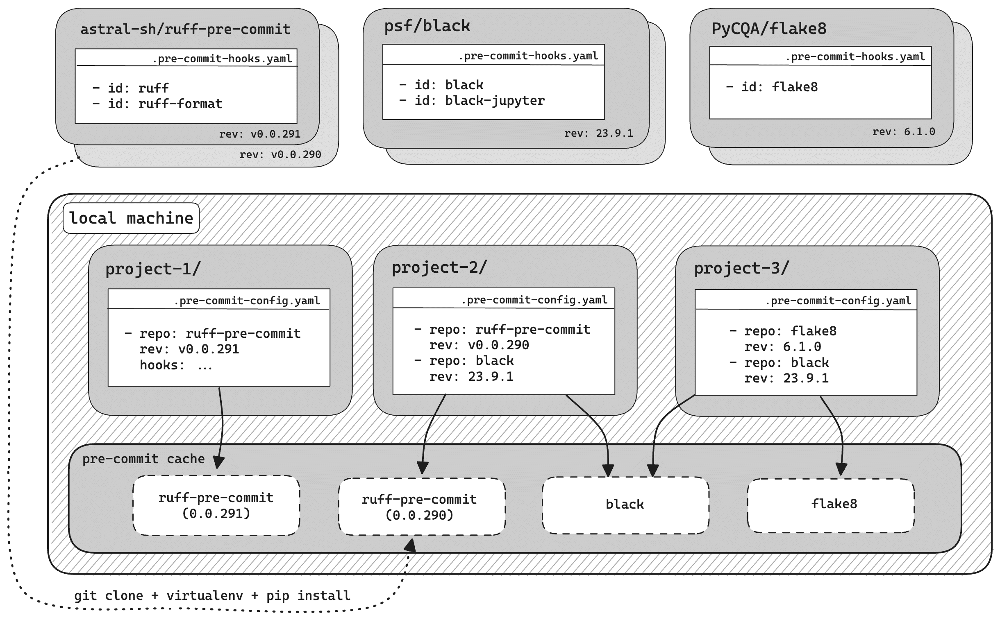
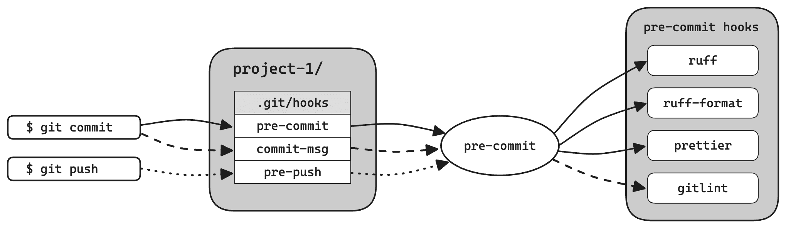
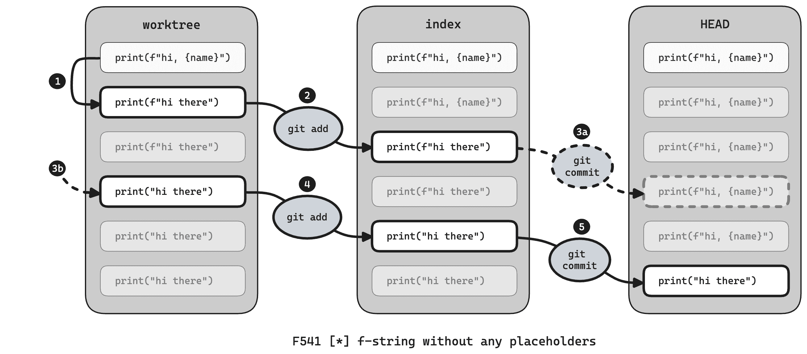

# 第九章：使用 Ruff 和 pre-commit 进行代码检查

1978 年，贝尔实验室的研究员 Stephen C. Johnson 编写了一个程序，可以检测 C 代码中的许多错误和模糊之处。他将该程序命名为您从洗衣机中取出毛衣时的绒毛：Lint。它成为一系列 *linters* 的第一个，这些程序分析源代码并指出问题构造。

Linters 不会 *运行* 程序来发现问题；它们读取并分析源代码。这个过程被称为 *静态分析*，与 *运行时*（或 *动态*）*分析* 相对。这使得 linters 既快速又安全 —— 你不必担心副作用，比如对生产系统的请求。静态检查可以很智能，也相当完整 —— 你不必命中边缘情况的正确组合来挖掘潜在的 bug。

###### 注意

静态分析很强大，但你仍然应该为你的程序编写测试。静态检查使用推断，而测试使用观察。Linters 验证一组有限的通用代码属性，而测试可以验证程序是否满足其要求。

Linters 在强制执行可读和一致的风格方面也表现出色，它们更倾向于惯用和现代构造，而不是晦涩和已弃用的语法。组织多年来一直采用风格指南，比如 [PEP 8](https://peps.python.org/pep-0008/) 中的建议或 [Google Style Guide for Python](https://google.github.io/styleguide/pyguide.html)。Linters 可以作为 *可执行* 风格指南：通过自动标记违规构造，它们使代码审查专注于更改的含义，而不是风格上的琐碎细节。

本章分为三部分：

+   第一部分介绍了 Ruff linter，这是 Python linters 的 Rust 实现，它可以自动修复检测到的许多问题。

+   第二部分描述了 pre-commit，一个与 Git 集成的代码检查框架。

+   第三部分介绍了 Ruff 代码格式化程序，这是 Black 代码风格的 Rust 实现。

但首先，让我们看看 linters 帮你解决的典型问题。

# 检查基础知识

linters 标记的结构可能不是绝对不合法的。更多情况下，它们只是触发了你的直觉，感觉可能有问题。考虑一下 Example 9-1 中的 Python 代码。

##### Example 9-1。你能发现问题吗？

```py
import subprocess

def run(command, args=[], force=False):
    if force:
        args.insert(0, "--force")
    subprocess.run([command, *args])
```

如果你以前没有遇到过这个 bug，你可能会惊讶地发现这个函数有时会在不应该的时候传递`--force`给命令：

```py
>>> subprocess.run = print  # print commands instead of running them
>>> run("myscript.py", force=True)
['myscript.py', '--force']
>>> run("myscript.py")
['myscript.py', '--force']

```

这个 bug 被称为*可变参数默认值*。Python 在定义函数时计算参数默认值，而不是在调用函数时。换句话说，你的两次调用都使用了相同的列表作为`args`的默认值。第一次调用附加了项目`"--force"`，所以这个项目也传递给了第二次调用。

代码审查工具可以检测到这样的陷阱，提醒您并甚至为您修复它们。让我们在这个函数上使用一个名为 Ruff 的代码审查工具——在本章中，您会听到更多关于它的内容。目前，只需注意其错误消息，该消息标识了错误：¹

```py
$ pipx run ruff check --extend-select B
bad.py:3:23: B006 Do not use mutable data structures for argument defaults
Found 1 error.
No fixes available (1 hidden fix can be enabled with the `--unsafe-fixes` option)

```

# Ruff 代码审查工具

Ruff 是一个采用 Rust 编程语言编写的极快的开源 Python 代码审查工具和代码格式化程序。Ruff 的代码审查工具重新实现了数十个 Python 代码审查工具——包括许多 Flake8 插件、Pylint、Pyupgrade、Bandit、Isort 等等。

Astral 公司，Ruff 的背后，还创建了 Python 打包工具 uv（见 “使用 uv 管理环境”），他们还承担了 Rye 的管理工作，这是一个 Python 项目管理器（见 “使用 Rye 管理软件包”）。所有这些工具都是用 Rust 实现的。

###### 提示

如果您使用 Rye 管理项目，则可以在命令 `rye lint` 和 `rye fmt` 下使用 Ruff 代码审查工具和代码格式化程序，分别。

使用 pipx 全局安装 Ruff：

```py
$ pipx install ruff
```

但等等——pipx 怎么会安装 Rust 程序呢？Ruff 二进制程序作为一个 wheel 文件在 PyPI 上可用，所以像您我这样的 Python 爱好者可以用老 pip 和 pipx 安装它。您甚至可以用 `py -m ruff` 运行它。

让我们再看一个使用 Ruff 的例子。考虑对 HTTP 标头进行的这次重构，将列表替换为字典：

##### 示例 9-2\. 将 HTTP 标头列表转换为字典

```py
headers = [f"User-Agent: {USER_AGENT}"] # version 1
headers = {f"User-Agent": USER_AGENT}   # version 2
```

当您重构 f-strings 时，很容易在移除占位符后留下 `f` 前缀。Ruff 会标记没有占位符的 f-strings——它们很吵闹，会让读者困惑，也可能有人忘记包含占位符。

运行命令 `ruff check`——Ruff 代码审查工具的前端。没有参数，该命令会审查当前目录下的每个 Python 文件，除非它在 *.gitignore* 文件中列出：

```py
$ ruff check
example.py:2:12: F541 [*] f-string without any placeholders
Found 1 error.
[*] 1 fixable with the `--fix` option.

```

图 9-1 详细介绍了 Ruff 的诊断消息。

![图中显示了 Ruff 的一个示例警告并标识了其各部分。第一部分是位置 'example.py:1:7:'，由文件名、行和列组成。第二部分是规则代码 'F541'，由代码审查工具前缀 'F' 和数字代码 '541' 组成，表示该代码审查工具的特定规则。第三部分是符号 '[*]'，通知您可以使用修复功能。第四部分也是最后一部分是概要 'f-string 没有任何占位符'。](assets/hmpt_0901.png)

###### 图 9-1\. Ruff 的诊断消息

Ruff 会告诉你违规出现的位置——文件、行和行偏移——并简要说明出了什么问题：*f-string 没有任何占位符*。在位置和概要之间夹杂着两个有趣的部分：一个字母数字代码（`F541`）标识了代码审查工具规则，而符号 `[*]` 表示 Ruff 可以自动修复该问题。

如果您对收到的警告感到困惑，可以使用命令 `ruff rule` 要求 Ruff 解释它：

```py
$ ruff rule F541
f-string-missing-placeholders (F541)

Derived from the Pyflakes linter.

Fix is always available.

What it does
Checks for f-strings that do not contain any placeholder expressions.

Why is this bad?
f-strings are a convenient way to format strings, but they are not
necessary if there are no placeholder expressions to format. In this
...
```

规则代码以一个或多个字母开头，后跟三个或更多数字。前缀标识特定的代码检查工具，例如 `F541` 中的 `F` 表示 Pyflakes 检查工具。Ruff 重新实现了许多 Python 代码质量工具，截至目前，它内置了超过 50 个插件，这些插件模仿了现有工具。你可以使用命令 `ruff linter` 查看可用的检查工具：

```py
$ ruff linter
   F Pyflakes
 E/W pycodestyle
 C90 mccabe
   I isort
   N pep8-naming
   D pydocstyle
  UP pyupgrade
... (50+ more lines)
```

你可以在 *pyproject.toml* 文件中为项目激活检查工具和单独的规则。设置 `tool.ruff.lint.select` 可以启用任何代码以给定前缀开头的规则。Ruff 默认启用了一些基本的全面检查，来自 Pyflakes 和 Pycodestyle：

```py
[tool.ruff.lint]
select = ["E4", "E7", "E9", "F"]
```

## Pyflakes 和 Pycodestyle

Pyflakes (`F`) 标记几乎肯定是错误的结构，比如未使用的导入或前面看到的无意义的 f-字符串。它避免了任何风格问题。Pycodestyle（其规则使用前缀 `E` 和 `W`）检测违反 PEP 8 的情况，这是由 Python 的发明者 Guido van Rossum、Barry Warsaw 和 Alyssa Coghlan 原创的风格指南。

Ruff 默认只启用 Pycodestyle 的部分功能，因为代码格式化工具已经替代了其中的许多检查。然而，PEP 8 提出了超出纯代码格式化的风格建议。你是否认同 `x is not None` 比 `not x is None` 更自然？默认规则能够检测和修复许多这类问题，使得代码更易读和理解。

###### 提示

如果你没有使用特定的代码格式化工具，考虑启用整个 `E` 和 `W` 块。它们的自动修复有助于确保最小的 PEP 8 符合性。它们类似于 Autopep8 格式化器（参见 “代码格式化方法：Autopep8”）。³

## 奇幻检查工具及其去向

Ruff 包含太多规则，无法在本书中详细描述，而且还在不断添加新规则。如何找到适合项目的好规则？试试它们吧！根据项目的需要，你可以启用单个规则 (`"B006"`)，规则组 (`"E4"`)，整个插件 (`"B"`)，甚至同时启用所有现有插件 (`"ALL"`)。

###### 警告

保留特殊代码 `ALL` 用于实验：它将在您升级 Ruff 时隐式启用新的检查工具。注意：某些插件需要配置才能产生有用的结果，而某些规则可能与其他规则冲突。⁴

除了 `select`，Ruff 还有一个 `extend-select` 指令，可以选择额外的规则集（参见 “检查基础知识”）。通常建议使用 `select` 指令，因为它保持配置的自包含性和明确性：

```py
[tool.ruff.lint]
select = ["E", "W", "F", "B006"]
```

如果你不确定从哪里开始，表 9-1 描述了一些内置插件，可以尝试使用。

表 9-1\. 十二个广泛使用的 Ruff 插件

| 前缀 | 名称 | 描述 |
| --- | --- | --- |
| `RUF` | Ruff 特定规则 | Ruff 本地的一系列检查项 |
| `I` | `isort` | 对导入语句进行分组和排序 |
| `UP` | `pyupgrade` | 使用与目标 Python 版本兼容的现代语言特性 |
| `SIM` | `flake8-simplify` | 使用惯用结构简化代码 |
| `FURB` | `refurb` | 使用惯用结构使优秀代码更加完善 |
| `PIE` | `flake8-pie` | 一系列杂项检查项 |
| `PERF` | `Perflint` | 避免性能反模式 |
| `C4` | `flake8-comprehensions` | 使用 `list`、`set` 和 `dict` 推导式 |
| `B` | `flake8-bugbear` | 消除可能的错误和设计问题 |
| `PL` | `Pylint` | 来自所有 Python 代码检查工具之母的大量规则集合 |
| `D` | `pydocstyle` | 要求函数、类和模块的文档字符串格式良好 |
| `S` | `flake8-bandit` | 检测潜在的安全漏洞 |

在将传统项目接入 Ruff 时，首要任务是决定哪些代码检查工具提供了最有用的反馈。在此阶段，单独的诊断可能会非常压倒性。使用 `--statistics` 选项可以放大视角：

```py
$ ruff check --statistics --select ALL
123	I001   	[*] Import block is un-sorted or un-formatted
 45	ARG001 	[ ] Unused function argument: `bindings`
 39	UP007  	[*] Use `X | Y` for type annotations
 32	TRY003 	[ ] Avoid specifying long messages outside the exception class
 28	SIM117 	[ ] Use a single `with` statement with multiple contexts
 23	SLF001 	[ ] Private member accessed: `_blob`
 17	FBT001 	[ ] Boolean-typed positional argument in function definition
 10	PLR0913	[ ] Too many arguments in function definition (6 > 5)
...

```

此时，你有两个选择。首先，如果某个代码检查工具的输出特别嘈杂，可以使用 `--ignore` 选项隐藏它。例如，如果尚未准备好添加类型注解和文档字符串，可以使用 `--ignore ANN,D` 排除 `flake8-annotations` 和 `pydocstyle`。其次，如果发现某个代码检查工具有有趣的发现，可以在 *pyproject.toml* 中永久启用它并修复其警告。反复进行此过程。

###### 小贴士

为了在所有项目中推行相同的一组代码检查工具及其配置，并优先选择默认配置而非定制配置。这样可以使整个组织的代码库更加一致和易于访问。

## 禁用规则和警告

`select` 设置非常灵活，但纯粹是增量的：它允许你选择那些代码以特定前缀开头的规则。`ignore` 设置则让你可以微调，反向操作：禁用单独的规则和规则组。和 `select` 一样，它通过前缀匹配规则代码。

当你需要大部分而非全部的代码检查规则，或者逐步采用代码检查工具时，减法方法非常实用。`pydocstyle` 插件 (`D`) 检查每个模块、类和函数是否具有格式良好的文档字符串。你的项目可能已经接近目标，只剩下模块文档字符串 (`D100`) 未达标。在完全接入项目之前，使用 `ignore` 设置禁用所有关于缺少模块文档字符串的警告：

```py
[tool.ruff.lint]
select = ["D", "E", "F"]
ignore = ["D100"]  # Don't require module docstrings for now.
```

`per-file-ignore` 设置允许您在代码库的一部分禁用规则。另一个例子是：`bandit` 插件 (`S`) 具有丰富的检查清单，可帮助您检测代码中的安全漏洞。它的规则 `S101` 标记了每个使用 `assert` 关键字的地方。⁵ 但是在 pytest 中，您仍然需要 `assert` 来表达预期（参见 第六章）。如果您的测试套件位于 *tests* 目录中，可以像这样为其文件禁用 `S101`：

```py
[tool.ruff.lint.per-file-ignores]
"tests/*" = ["S101"]  # Tests can use assertions.
```

禁用规则应该是最后的选择。通常最好通过为有问题的行添加特殊注释来抑制单个警告。这种注释的形式是 `# noqa:`，后面跟着一个或多个规则代码。

###### 警告

在您的 `noqa` 注释中始终包含规则代码。一般的 `noqa` 注释可能会隐藏无关的问题。标记违规行也会使它们在您准备修复时更易于查找。使用 `pygrep-hooks` linter 的规则 `PGH004` 要求规则代码。

`noqa` 系统允许您消除虚假阳性以及您选择在此时不优先考虑的合法警告。例如，MD5 消息摘要算法通常被认为是不安全的，Bandit 的 `S324` 标记了其使用。但是，如果您的代码与需要您计算 MD5 哈希的旧系统交互，您可能别无选择。使用 `noqa` 注释来禁用此警告：

```py
md5 = hashlib.md5(text.encode()).hexdigest()  # noqa: S324
```

Bandit 的检查通常会标记出值得仔细审查的结构，但并不打算彻底禁止它们。其想法是您将逐个审查有问题的行，并在确定特定使用无害时抑制警告。

启用一个规则并抑制 *所有* 其警告可能是合理的。这样可以只在您触及代码区域时才执行规则—​即，只有当您触及代码区域时才执行。Ruff 支持此工作流程，其 `--add-noqa` 选项会为所有有问题的行代表您插入 `noqa` 注释：

```py
$ ruff check --add-noqa
```

就像每个注释一样，`noqa` 注释可能会过时—​例如，重构可能会无意中修复被抑制的警告。过时的 `noqa` 注释会产生噪音，并在试图消除 linter 违规时产生摩擦。幸运的是，Ruff 处于优越的位置来修复这个问题。其规则 `RUF100` 可自动移除不再适用的 `noqa` 注释。

## 使用 Nox 进行自动化

如果没有纠正措施，大型项目的代码质量会随时间而下降。作为自动化的强制检查，linting 有助于抵消自然熵的影响。Nox（参见 第八章）是一个自动化框架，可以作为强制检查的一部分运行 linters。

这是一个 Nox 会话，它在当前目录中的每个 Python 文件上运行 Ruff：

```py
@nox.session
def lint(session):
    session.install("ruff")
    session.run("ruff", "check")
```

Nox 在这里是一个合理的选择，但是在 linting 方面，有一个更方便和强大的选择：pre-commit，一个具有 Git 集成的跨语言 linter 框架。

# [预提交框架](https://wiki.example.org/pre-commit_framework)

Pre-commit 是一个工具和框架，允许你将第三方 linter 添加到项目中，并带有最少的样板文件。各种语言的 linter 都有为 pre-commit 准备的即用集成，称为 *hooks*。你可以从命令行显式运行这些 hooks，或者在本地仓库中配置以在提交更改时运行它们（以及其他一些事件）。

使用 pipx 全局安装 pre-commit：

```py
$ pipx install pre-commit
```

## 初识 pre-commit

让我们为你的项目添加一个 Ruff 的 pre-commit 钩子。在顶级目录创建一个名为 *.pre-commit-config.yaml* 的文件，内容如 示例 9-3 所示。你会在支持 pre-commit 的大多数 linter 的公共文档中找到类似这样的短 YAML 片段。

##### 示例 9-3\. 一个包含 Ruff 钩子的 *.pre-commit-config.yaml* 文件

```py
repos:
  - repo: https://github.com/astral-sh/ruff-pre-commit
    rev: v0.3.4
    hooks:
      - id: ruff
```

作者通过 Git 仓库分发他们的 pre-commit 钩子。在 *.pre-commit-config.yaml* 文件中，你需要为每个想要使用的仓库指定 URL、修订版本和钩子。URL 可以是 Git 可以克隆的任何位置。修订版本通常是指向 linter 最新发布版本的 Git tag。一个仓库可以有多个钩子—例如，Ruff 提供了 `ruff` 和 `ruff-format` 钩子用于其 linter 和代码格式化器。

Pre-commit 与 Git 密切相关，你必须在 Git 仓库内部调用它。我们将通过使用带有 `--all-files` 选项的命令 `pre-commit run` 来为仓库中的每个文件建立基准进行 linting：

```py
$ pre-commit run --all-files
[INFO] Initializing environment for https://github.com/astral-sh/ruff-pre-commit.
[INFO] Installing environment for https://github.com/astral-sh/ruff-pre-commit.
[INFO] Once installed this environment will be reused.
[INFO] This may take a few minutes...
ruff.....................................................................Passed

```

当你第一次运行一个钩子时，pre-commit 会克隆钩子仓库并将 linter 安装到隔离环境中。这可能需要一些时间，但你不必经常这样做：pre-commit 在多个项目中缓存 linter 环境。

## 靠近钩子

如果你想知道 pre-commit 钩子在幕后是如何工作的，可以看一下 Ruff 的 [hook repository](https://github.com/astral-sh/ruff-pre-commit)。仓库中的 *.pre-commit-hooks.yaml* 文件定义了这些 hooks。示例 9-4 展示了文件中的一个摘录。

##### 示例 9-4\. 来自 Ruff 的 .pre-commit-hooks.yaml 文件的摘录

```py
- id: ruff
  name: ruff
  language: python
  entry: ruff check --force-exclude
  args: []
  types_or: [python, pyi]
```

每个钩子都有一个唯一的标识符和一个友好的名称（`id` 和 `name`）。与 pre-commit 交互时，请通过其唯一标识符引用钩子。它们的名称只出现在来自该工具的控制台消息中。

钩子定义告诉 pre-commit 如何安装和运行 linter，通过指定其实现语言（`language`）和其命令及命令行参数（`entry` 和 `args`）。Ruff 钩子是一个 Python 包，因此它将 Python 指定为语言。`--force-exclude` 选项确保你可以排除 linting 的文件。它告诉 Ruff 即使 pre-commit 明确传递了排除的源文件，也要遵循其 `exclude` 设置。

###### 提示

您可以在*.pre-commit-config.yaml*文件中覆盖`args`键，以向钩子传递自定义命令行选项。相比之下，`entry`键中的命令行参数是强制性的——您无法覆盖它们。

最后，该钩子声明了 linter 理解的文件类型（`types_or`）。`python`文件类型匹配具有*.py*或相关扩展名的文件以及带有 Python shebang 的可执行脚本。`pyi`文件类型是指带有类型注解的存根文件（参见“使用 Python 包分发类型”）。

对于 Python 钩子，pre-commit 在其缓存目录中创建一个虚拟环境。它通过在钩子存储库中运行类似于`pip install .`的命令来安装钩子。当运行钩子时，pre-commit 会激活虚拟环境并使用任何选定的源文件调用命令。

图 9-2 展示了一个开发者机器，上面有三个使用 pre-commit 钩子的 Python 项目。pre-commit 会将钩子存储库克隆到其缓存目录并将钩子安装到隔离环境中。钩子存储库在*.pre-commit-hooks.yaml*文件中定义钩子，而项目在*.pre-commit-config.yaml*文件中引用这些钩子。



###### 图 9-2。三个项目使用了 Ruff、Black 和 Flake8 的 pre-commit 钩子。

## 自动修复

现代的 linter 可以通过直接修改违规的源文件来修复许多违规。具有自动修复功能的 linter 在几乎零成本的情况下消除了整个类别的错误和代码异味⁶。像代码格式化工具一样，它们在软件开发中引起了范式转变，使您可以专注于更高级别的问题，而不会牺牲代码质量。

根据约定，大多数 pre-commit 钩子默认启用自动修复。由于 Git 的存在，它们可以相对安全地应用修复，而不会不可逆地覆盖您的工作。尽管如此，如果您早早地提交并频繁地提交，它们的效果会更好。

###### 警告

自动修复带来了巨大的好处，但它们假设了一些基本的 Git 卫生习惯：不要在您的存储库中堆积未提交的更改（或在 linting 之前将它们存储）。在某些情况下，pre-commit 会保存和恢复您的本地修改，但并非所有情况都是如此。

让我们试试这个。当 Ruff 检测到可变参数默认值时，表示您可以启用一个“隐藏”的修复（Ruff 要求您选择修复，因为人们可能依赖于可变默认值，例如用于缓存）。首先，在*pyproject.toml*中启用 linter 规则和修复：

```py
[tool.ruff.lint]
extend-select = ["B006"]
extend-safe-fixes = ["B006"]
```

Ruff 的 pre-commit 钩子要求你选择 `--fix` 选项，就像 示例 9-5 中展示的那样。选项 `--show-fixes` 和 `--exit-non-zero-on-fix` 确保所有违规将在终端显示，并导致非零退出状态，即使 Ruff 能够修复它们。

##### 示例 9-5\. 启用 Ruff 钩子的自动修复功能

```py
repos:
  - repo: https://github.com/astral-sh/ruff-pre-commit
    rev: v0.3.4
    hooks:
      - id: ruff
        args: ["--fix", "--show-fixes", "--exit-non-zero-on-fix"]
```

将 示例 9-1 保存到名为 *bad.py* 的文件中，提交该文件，并运行 pre-commit：

```py
$ pre-commit run --all-files
ruff.....................................................................Failed
- hook id: ruff
- exit code: 1
- files were modified by this hook

Fixed 1 error:
- bad.py:
    1 × B006 (mutable-argument-default)

Found 1 error (1 fixed, 0 remaining).

```

如果你检查修改后的文件，你会看到 Ruff 已经用 `None` 替换了参数默认值。空列表现在分配给函数内部，使得每次调用都有自己的 `args` 实例。

```py
def run(command, args=None, force=False):
    if args is None:
        args = []
    if force:
        args.insert(0, "--force")
    subprocess.run([command, *args])
```

你可以运行 `git diff` 来查看应用于代码的更改，而不是检查修改后的文件。或者，你可以告诉 pre-commit 立即显示修复的差异，使用选项 `--show-diff-on-fail`。

## 从 Nox 运行 pre-commit

Pre-commit 为许多语言的 linters 提供了生产就绪的集成。光是因为这个原因，我建议使用 pre-commit 而不是 Nox 运行 linters。（如果你还需要说服，请看下一节，它会为使用 pre-commit 提供另一个令人信服的理由。）

尽管如此，你仍然应该为 pre-commit 本身包含一个 Nox 会话。这可以确保你可以通过单个命令 `nox` 运行项目的所有检查。示例 9-6 展示了如何定义该会话。如果你的 *noxfile.py* 设置了 `nox.options.sessions`，请将该会话添加到该列表中。

##### 示例 9-6\. 使用 pre-commit 进行 lint 的 Nox 会话

```py
nox.options.sessions = ["tests", "lint"]

@nox.session
def lint(session):
    options = ["--all-files", "--show-diff-on-fail"]
    session.install("pre-commit")
    session.run("pre-commit", "run", *options, *session.posargs)
```

默认情况下，pre-commit 会运行你为项目配置的所有钩子。你可以通过将它们作为额外的命令行参数传递来运行特定的钩子。这在解决特定 linter 的问题时非常方便。借助 `session.posargs`（参见 “Session Arguments”），在 Nox 中也同样适用：

```py
$ nox --session=lint -- ruff

```

对于所有在项目上工作的人来说，包括 linters 在内的检查和任务具有单一的入口点，可以极大地减少摩擦。但你不应该止步于此。Pre-commit 的设计目标是在每次提交时从 Git 触发。下一节将解释如何设置项目，以便在提交更改时进行 lint（以及为什么这样做是很好的）。

## 从 Git 运行 pre-commit

在每次提交时运行 linters 是一个改变游戏规则的操作，原因有三：

+   你消除了手动调用检查的开销和干扰。Linters 在后台运行，只有在发现违规时才会提醒你。

+   你尽早进行检查。一般来说，越早发现问题，修复成本就越低。（对于因风格细微差异导致的 CI 失败，告别吧。）

+   它速度很快：你只需要对提交阶段的文件进行 lint，而不是整个代码库。⁷

设置 Git 在每次提交时调用 pre-commit 的方法是在项目内运行以下命令：

```py
$ pre-commit install
pre-commit installed at .git/hooks/pre-commit

```

这个命令将一个简短的包装脚本安装到 *.git/hooks* 目录中，将控制权转移给预提交（见 图 9-3）。*.git/hooks* 目录中的程序被称为 *Git 钩子*。当你运行`git commit`时，Git 调用 *pre-commit* Git 钩子。这个钩子又调用预提交，其中运行了 Ruff 和你拥有的任何其他预提交钩子。



###### 图 9-3\. Git 钩子和预提交钩子

Git 钩子允许你在 Git 执行的预定义点触发动作。例如，*pre-commit* 和 *post-commit* Git 钩子在 Git 创建提交之前和之后运行。你可能已经猜到预提交默认安装了哪些 Git 钩子——但它也支持其他 Git 钩子，如果你需要的话。

图 9-4 描述了带有预提交的典型工作流程。左边是你项目中正在编辑的文件（*工作树*）；中间代表下一个提交的暂存区（*索引*）；右边是当前提交（`HEAD`）。



###### 图 9-4\. 带有预提交的工作流程

最初，这三个区域是同步的。假设你从 f-string 中移除了占位符，但忘记从字符串字面量中移除`f`前缀（在 图 9-4 中标记为 *1*）。你使用`git add` *(2)* 阶段性地提交你的编辑，并运行`git commit`来创建一个提交 *(3a)*。在你的编辑器弹出提交消息之前，Git 将控制权转移给预提交。Ruff 迅速捕捉到你的错误，并在你的工作树中修复了字符串字面量 *(3b)*。

此时，所有三个区域具有不同的内容。你的工作树包含了带有 Ruff 修复的修改，暂存区包含了没有修复的修改，而`HEAD`仍然指向修改之前的提交。这允许你通过使用`git diff`来比较工作树和暂存区来审计修复。如果你对所看到的结果满意，你可以使用`git add` *(4)* 将修复加入暂存区，并使用`git commit` *(5)* 重新尝试提交。

通过自动修复，这个工作流程将最小化 lint 工具的干扰，并重新运行提交。但有时候，你可能根本不想被 lint 工具打扰——例如，你可能想记录一些正在进行中的工作。Git 和预提交为你提供了两个选项，以便你的提交能够通过顽固的 lint 工具。首先，你可以完全跳过 Git 钩子，使用`--no-verify`或`-n`选项：

```py
$ git commit -n
```

或者，你可以使用`SKIP`环境变量跳过特定的预提交钩子（如果需要跳过多个钩子，也可以使用逗号分隔的列表）：

```py
$ SKIP=ruff git commit
```

Git 钩子控制哪些更改进入您的本地存储库，但它们是自愿的 — 不会替换 CI 检查作为共享存储库中默认分支的门卫。如果您已在 CI 中运行 Nox，则示例 9-6 中的会话会处理此问题。

跳过钩子对于假阳性或者当您想部署关键修复时并没有帮助：您的强制检查仍会在 CI 中失败。在这些情况下，您需要建议代码检查器忽略特定违规行为（见“禁用规则和警告”）。

# Ruff 格式化程序

几个月来，Ruff 在`ruff check`命令背后重新实现了大量 Python 代码检查器，并在 Python 社区中广泛采用。一年多一点后，Ruff 获得了`ruff format`命令[⁸]。Ruff 格式化程序在 Rust 中重新实现了 Python 代码格式化的事实标准 Black。它为 Ruff 在 Python 领域中成为集成和高性能工具链的又一个构建块提供了支持。

但让我们从头开始。

## 代码格式化方法：Autopep8

考虑以下这段 Python 代码的珍珠：

```py
def create_frobnicator_factory(the_factory_name,
                                  interval_in_secs=100,  dbg=False,
                                use_singleton=None,frobnicate_factor=4.5):
  if dbg:print('creating frobnication factory '+the_factory_name+"...")
  if(use_singleton):   return _frob_sngltn      #we're done
  return FrobnicationFactory( the_factory_name,

    intrvl = interval_in_secs             ,f=frobnicate_factor     )
```

该函数展示了各种格式问题，例如不一致的对齐、缺少或过多的空白以及单行`if`结构。其中一些显然影响可读性。另一些，例如两空格缩进，偏离了 PEP 8 中编码的广泛接受做法。

处理此类风格问题的最小方法是 Autopep8，这是自动代码检查和修复的早期先驱，并仍在使用中。建立在 Pycodestyle 的基础上，它在保留代码布局的同时手术性地纠正违规行为。

让我们用默认设置运行 Autopep8 代码示例：

```py
$ pipx run autopep8 example.py
```

这是由 Autopep8 格式化的函数：

```py
def create_frobnicator_factory(the_factory_name,
                               interval_in_secs=100,  dbg=False,
                               use_singleton=None, frobnicate_factor=4.5):
    if dbg:
        print('creating frobnication factory '+the_factory_name+"...")
    if (use_singleton):
        return _frob_sngltn  # we're done
    return FrobnicationFactory(the_factory_name,

                               intrvl=interval_in_secs, f=frobnicate_factor)
```

您可能会发现这样更容易阅读。无论好坏，Autopep8 没有触及其他一些可疑的风格选择，例如`return`语句中的流浪空行和不一致的引号字符。Autopep8 使用 Pycodestyle 来检测问题，在这里没有投诉。

###### 提示

与大多数代码格式化程序不同，Autopep8 允许您通过传递`--select`和适当的规则代码来应用选定的修复。例如，您可以运行`autopep8 --select=E111`来强制使用四空格缩进。

## 代码格式化方法：YAPF

2015 年由 Google 开发，YAPF 格式化程序从`clang-format`借用其设计和复杂的格式化算法。YAPF 的名称代表“Yet Another Python Formatter”[⁹]。YAPF 根据丰富的配置选项重新格式化代码库。

运行方式如下：

```py
$ pipx run yapf example.py
```

这是 YAPF 代码的版本，使用默认设置：

```py
def create_frobnicator_factory(the_factory_name,
                               interval_in_secs=100,
                               dbg=False,
                               use_singleton=None,
                               frobnicate_factor=4.5):
    if dbg: print('creating frobnication factory ' + the_factory_name + "...")
    if (use_singleton): return _frob_sngltn  #we're done
    return FrobnicationFactory(the_factory_name,
                               intrvl=interval_in_secs,
                               f=frobnicate_factor)
```

YAPF 的格式规则覆盖的范围比 Autopep8 更广泛——例如，它以一致的方式排列函数参数并移除伪空行。只要与你的配置兼容，YAPF 就会尊重现有的格式选择。例如，它不会分割单行的 `if` 语句或删除 `if` 条件周围的括号。

## 一个不妥协的代码格式化工具。

在 2018 年，一个名为 Black 的新代码格式化工具进入了舞台。它的核心原则是：最小可配置性！

让我们在代码示例中尝试一下 Black：

```py
$ pipx run black example.py
```

Black 对函数的格式化如下所示：

```py
def create_frobnicator_factory(
    the_factory_name,
    interval_in_secs=100,
    dbg=False,
    use_singleton=None,
    frobnicate_factor=4.5,
):
    if dbg:
        print("creating frobnication factory " + the_factory_name + "...")
    if use_singleton:
        return _frob_sngltn  # we're done
    return FrobnicationFactory(
        the_factory_name, intrvl=interval_in_secs, f=frobnicate_factor
    )
```

Black 不像 Autopep8 那样修复个别的风格问题，也不像 YAPF 那样强制你的风格偏好。相反，Black 将源代码简化为一个规范形式，使用确定性算法——大多数情况下不考虑现有的格式。从某种意义上说，Black 使代码风格“消失”。这种归一化大大减少了使用 Python 代码时的认知负担。

Black 促进了 Python 生态系统中普遍的可读性。代码阅读的频率远高于编写——透明的风格有助于此。与此同时，Black 也使得代码更易“书写”。当你贡献于他人的代码时，无需遵循定制和手动的代码风格。即使在独立项目中，Black 也能提升你的生产力：如果你配置编辑器在保存时重排格式，编码时可以将击键减少到最小。

Black 席卷了 Python 世界，一个接一个项目决定“黑化”他们的源文件。

## Black 的代码风格。

一旦你使用了一段时间，Black 的代码风格就会变得无形。不可避免地，一些选择引起了争议，甚至分岐。要理解其格式化规则，有助于查看 Black 旨在以可预测和可重复的方式生成可读和一致的源代码的目标。

例如，采用双引号作为字符串文字的默认值。根据 PEP 257 和 PEP 8 的风格建议，文档字符串和带撇号的英文文本已经要求使用双引号。因此，选择双引号而不是单引号会导致更一致的风格。

有时候，Black 在函数的参数后放置一个孤立的 `):`。这被昵称为“悲伤的脸”，清晰地划分了函数签名和函数体，而无需使参数缩进超出标准的四个空格。这种布局也将参数列表视为其他的括号结构，例如元组、列表和集合字面量。

Black 还将行限制在 88 个字符以内（这是它少数可配置的设置之一）。这种横向眼动与垂直滚动之间的权衡是基于数据驱动的方法，在 Meta 的数百万行 Python 代码上进行了测试。

Black 的另一个目标是避免*合并冲突*，当对同一代码区域的并发更改无法在不人工干预的情况下合并时。尾逗号—​在序列的最后一项后面放置逗号—​正是为此目的而设计：它允许您在最后一项之前和之后插入而无冲突。

###### 注意

减少编辑之间的依赖有助于不同的人在同一段代码上工作。但这也让您可以将驱动式修复或重构分离或重新排序，并在提交更改进行代码审查之前撤销尝试性提交。

如上所述，Black 算法是确定性的，现有的布局几乎不会影响它。一个“变黑”的文件看起来就像是直接从 AST 生成的。¹¹ 然而实际情况并非如此。首先，AST 不包括注释，因为它们不影响程序执行。

除了注释，Black 还从格式化的源代码中获取一些线索。一个例子是将函数体分成逻辑分区的空行。然而，影响 Black 输出最强大的方式可能是*神奇的尾逗号*：如果序列包含尾逗号，Black 会将其元素拆分成多行，即使它们可以在单行上放得下。

Black 提供了一个逃生通道，让您可以禁用代码区域的格式化（示例 9-7）。

##### 示例 9-7\. 禁用代码区域的格式化

```py
@pytest.mark.parametrize(
    ("value", "expected"),
    # fmt: off
    [
        ("first test value",       "61df19525cf97aa3855b5aeb1b2bcb89"),
        ("another test value",     "5768979c48c30998c46fb21a91a5b266"),
        ("and here's another one", "e766977069039d83f01b4e3544a6a54c"),
    ]
    # fmt: on
)
def test_frobnicate(value, expected):
    assert expected == frobnicate(value)
```

对于程序数据，如具有正确对齐列的大表格，手动格式化可能很有用。

## 使用 Ruff 格式化代码

代码格式化程序可以批处理处理数百万行代码，或者在触发编辑器或繁忙 CI 服务器上运行时快速连续运行。从一开始，Black 的明确目标是快速的—​它通过`mypyc`生成的本地代码二进制轮速度快。虽然 Black 速度快，但 Ruff 格式化程序通过其高效的 Rust 实现进一步提高了性能三十倍。

Ruff 的目标是与 Black 代码风格完全兼容。与 Black 不同，Ruff 允许您选择使用单引号和使用制表符进行缩进。但无论如何，我建议坚持采用 Black 广泛采纳的风格。

在没有参数运行时，`ruff format`处理当前目录下的任何 Python 文件。不要手动调用 Ruff，而是将其添加到您的 pre-commit 钩子中，如示例 9-8 所示。

##### 示例 9-8\. 作为 linter 和代码格式化程序从 pre-commit 运行 Ruff

```py
repos:
  - repo: https://github.com/astral-sh/ruff-pre-commit
    rev: v0.3.4
    hooks:
      - id: ruff
        args: ["--fix", "--show-fixes", "--exit-non-zero-on-fix"]
      - id: ruff-format
```

代码格式化程序的 pre-commit 钩子最后运行。这为它提供了重新格式化任何由 linters 自动修复的机会。

# 摘要

在本章中，您已经了解了如何通过使用 linter 和代码格式化工具来提高和保护项目中的代码质量。Ruff 是许多 Python 代码质量工具的高效重写，包括 Flake8 和 Black。虽然可以手动运行 Ruff 和其他工具，但是您应该自动化此过程并将其作为 CI 中的强制性检查。最佳选项之一是 pre-commit，它是一个具有 Git 集成的跨语言 linter 框架。从 Nox 会话中调用 pre-commit，以保持您的一套检查的单一入口点。

¹ `B` 短代码激活了由 `flake8-bugbear` 开创的一组检查，这是 Flake8 linter 的一个插件。

² Charlie Marsh: [“Python tooling could be much, much faster”](https://notes.crmarsh.com/python-tooling-could-be-much-much-faster)，2022 年 8 月 30 日。

³ 在撰写本文时，您还需要启用 Ruff 的预览模式。将 `tool.ruff.lint.preview` 设置为 `true`。

⁴ 我的审阅员 Hynek 不同意。他将项目设置为 `ALL` 并取消了对他不适用的规则。“否则，您会错过新规则。如果更新后出现问题，您可以采取行动。”

⁵ 断言有什么问题吗？没有，但是 Python 在优化运行时会跳过它们，使用 `-O` 命令行参数可以实现这一点——这是加速生产环境的常用方式。因此，不要使用 `assert` 来验证不受信任的输入！

⁶ Kent Beck 和 Martin Fowler 将 *code smells* 描述为“代码中的某些结构，暗示——有时候，大声呼喊——需要重构的可能性。” Martin Fowler: *Refactoring: Improving the Design of Existing Code*，第二版，波士顿：Addison-Wesley，2019 年。

⁷ 从 Git 运行 pre-commit 是运行带有自动修复功能的 linter 的最安全方式：Pre-commit 保存并恢复了您未暂存的任何更改，并在修复冲突时撤销这些修复。

⁸ Charlie Marsh: [“The Ruff Formatter”](https://astral.sh/blog/the-ruff-formatter)，2023 年 10 月 24 日。

⁹ Lint 的作者 Stephen C. Johnson 也通过在 1970 年代早期在贝尔实验室编写 Yacc（Yet Another Compiler-Compiler）来建立了这个臭名昭著的命名约定。

¹⁰ [“AST before and after formatting,”](https://black.readthedocs.io/en/stable/the_black_code_style/current_style.html#labels-ast-changes) *Black documentation*，上次访问时间：2024 年 3 月 22 日。

¹¹ 您可以使用标准 `ast` 模块检查源文件的 AST，使用 `py -m ast example.py`。
