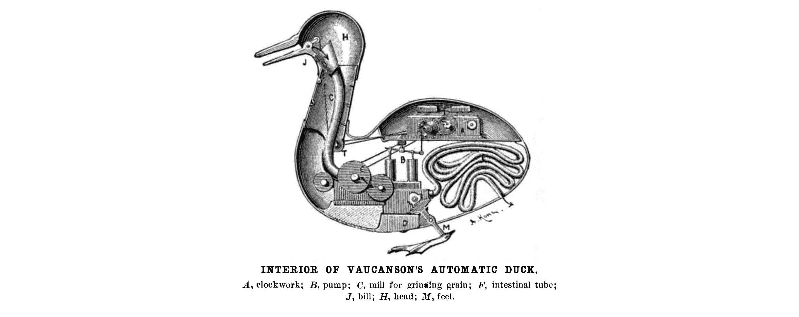

# 第十章：使用类型来保证安全和检查

类型是什么？作为一个初步的近似，让我们说变量的*类型*指定了你可以分配给它的值的种类——例如整数或字符串列表。当吉多·范·罗苏姆创建 Python 时，大多数流行的编程语言在类型方面分为两大派别：静态类型和动态类型。

*静态类型*语言，如 C++，要求您提前声明变量的类型（除非编译器足够智能以自动推断）。作为交换，编译器确保变量只能存储兼容的值。这消除了整个类别的错误。它还能进行优化：编译器知道变量需要多少空间来存储它的值。

*动态类型*语言打破了这种范式：它们允许您将任何值赋给任何变量。像 Javascript 和 Perl 这样的脚本语言甚至隐式转换值——比如，从字符串到数字。这极大地加快了编写代码的过程。它还给了您更多的自由度来射击自己的脚。

Python 是一种动态类型语言，但它选择了两大派别之间的中间路线。让我们用一个例子来演示它的方法：

```py
import math

number = input("Enter a number: ")
number = float(number)
result = math.sqrt(number)

print(f"The square root of {number} is {result}.")
```

在 Python 中，变量只是一个值的名称。变量没有类型——*值*有。程序首先将相同的名称`number`与类型为`str`的值关联起来，然后与类型为`float`的值关联起来。但与 Perl 和类似语言不同，Python 永远不会在您背后转换值，热切地期待您的愿望：

```py
>>> math.sqrt("1.21")
Traceback (most recent call last):
  File "<stdin>", line 1, in <module>
TypeError: must be real number, not str

```

Python 并不像一些同行那样宽容，但请考虑此类型检查的两个限制。首先，在运行有问题的代码之前，您不会看到`TypeError`。其次，Python 解释器不会引发错误——库函数显式检查是否传递了除整数或浮点数之外的东西。

大多数 Python 函数根本不检查它们的参数类型。相反，它们只是调用它们期望其参数提供的操作。从本质上讲，Python 对象的类型并不重要，只要其行为正确。这种方法受到路易十五时期沃克松的机械鸭子的启发，被称为*鸭子类型*：“如果它看起来像鸭子，叫起来像鸭子，那么它就是鸭子。”



举个例子，考虑并行代码中的*join*操作。此操作允许您等待直到一些后台工作完成，“加入”控制线程，如此类推。示例 10-1 定义了一个鸭子类型的函数，依次在多个任务上调用`join`。

##### 示例 10-1。鸭子类型的实现

```py
def join_all(joinables):
    for task in joinables:
        task.join()
```

可以使用`threading`或`multiprocessing`模块中的`Thread`或`Process`——或者任何具有正确签名的`join`方法的其他对象。 (不能用于字符串，因为`str.join`需要一个字符串可迭代对象作为参数。) 鸭子类型意味着这些类不需要共同的基类来实现重用。这些类型只需要一个正确签名的`join`方法。

鸭子类型很棒，因为函数及其调用者可以相对独立地演变——这是一种称为*松耦合*的属性。没有鸭子类型，函数参数必须实现明确规定其行为的显式接口。Python 为您免费提供了松耦合：只要它满足预期的行为，您可以传递任何东西。

不幸的是，这种自由性可能使一些函数难以理解。

如果你曾经不得不阅读整个代码库以了解其中几行代码的目的，你就知道我说的是什么：孤立地理解一个 Python 函数有时是不可能的。有时，唯一解释正在发生的事情的方法是查看其调用者、它们的调用者等等 (示例 10-2)。

##### 示例 10-2\. 一个晦涩的函数

```py
def _send(objects, sender):
    """send them with the sender..."""
    for obj in objects[0].get_all():
        if p := obj.get_parent():
            sender.run(p)
        elif obj is not None and obj._next is not None:
            _send_next_object(obj._next, sender)
```

写出函数的参数和返回类型——它的类型签名——显著减少了理解函数所需的上下文量。传统上，人们通过在文档字符串中列出类型来做到这一点。不幸的是，文档字符串经常缺失、不完整或不正确。更重要的是，并没有一个正式的语言来精确和可验证地描述类型。没有工具来强制执行类型签名，它们几乎等同于一厢情愿的想法。

虽然在几百行代码的代码库中这种问题可能有点恼人，但当您处理数百万行代码时，它很快会变成一种存在威胁。像 Google、Meta、Microsoft 和 Dropbox 这样的公司在 2010 年代赞助了静态类型检查器的开发。*静态类型检查器*是一种工具，它在不运行程序的情况下验证程序的类型安全性。换句话说，它检查程序是否在不支持这些操作的值上执行操作。

在某种程度上，类型检查器可以自动推断函数或变量的类型，使用一种称为*类型推断*的过程。当程序员能够在他们的代码中显式指定类型时，它们变得更加强大。由于上世纪中期的基础工作，特别是由 Jukka Lehtosalo 及其合作者的工作，¹ Python 语言获得了一种在源代码中表达函数和变量类型的方式，称为*类型注解* (示例 10-3)。

##### 示例 10-3\. 带有类型注解的函数

```py
def format_lines(lines: list[str], indent: int = 0) -> str:
    prefix = " " * indent
    return "\n".join(f"{prefix}{line}" for line in lines)
```

类型注解已成为丰富的开发工具和库生态系统的基础。

单独看，类型注解主要不会影响程序的运行时行为。解释器不会检查赋值是否与注释的类型兼容；它只是将注释存储在包含模块、类或函数的特殊`__annotations__`属性中。虽然这会在运行时产生一些小的开销，但这意味着您可以在运行时检查类型注解，从而进行一些有趣的操作——比如说，根据传输到网络的值构建您的域对象，而无需任何样板文件。

类型注解的最重要用途之一是在运行时不会发生：静态类型检查器（如 mypy）使用它们来验证代码的正确性，而不必运行代码。

# 类型注解的利与弊

您不必自己使用类型注解也能从中受益。类型注解已经为标准库和许多 PyPI 包提供。静态类型检查器可以在您使用模块不正确时警告您，包括当库中的重大更改导致您的代码不再与该库一起正常工作时——而类型检查器可以在运行代码之前警告您。

编辑器和 IDE 利用类型注解为您提供更好的编码体验，包括自动完成、工具提示和类浏览器。您还可以在运行时检查类型注解，解锁诸如数据验证和序列化等强大功能。

如果您在自己的代码中使用类型注解，您将获得更多好处。首先，您也是自己函数、类和模块的用户——因此，以上所有的好处也适用，例如自动完成和类型检查。此外，您会发现更容易理解您的代码、在不引入微妙错误的情况下重构它，并构建清晰的软件架构。作为库的作者，类型注解允许您指定用户可以依赖的接口契约，而您则可以自由演化实现。

即使在它们引入十年后，类型注解仍然不乏争议——这或许是可以理解的，考虑到 Python 自豪地作为动态类型语言的立场。在现有代码中添加类型与将单元测试引入不考虑测试的代码库面临相似的挑战。正如您可能需要重构以增强可测试性一样，您可能需要重构以增强“可类型化性”——用更简单、更可预测的类型替换深度嵌套的原始类型和高度动态的对象。您很可能会发现这是值得努力的。

另一个挑战是 Python 类型语言的快速演变。如今，Python 类型注解受到 Typing Council 的管辖，该组织维护着类型语言的单一、持续更新的规范。² 未来几年内，预计这一规范将会经历更大的变化。虽然带类型的 Python 代码需要适应这一演变，但类型语言对 Python 的向后兼容政策没有例外。

在本章中，你将学习如何使用静态类型检查器 mypy 和运行时类型检查器 Typeguard 来验证你的 Python 程序的类型安全性。你还将看到如何通过运行时检查类型注解来极大地增强程序的功能。但首先，让我们来看看在过去十年内在 Python 中演变的类型语言。

# Python 类型语言的简要介绍

###### 提示

在此节中的一个类型检查器 playground 中尝试一些小例子：

+   [mypy Playground](https://mypy-play.net/)

+   [pyright Playground](https://pyright-play.net/)

+   [pyre Playground](https://pyre-check.org/play)

## 变量注解

在程序运行过程中，你可以使用类型注解为变量指定可能分配的值的类型。此类类型注解的语法由变量名、冒号和类型组成：

```py
answer: int = 42
```

除了像`bool`、`int`、`float`、`str`或`bytes`这样的简单内置类型外，你还可以在类型注解中使用标准的容器类型，例如`list`、`tuple`、`set`或`dict`。例如，以下是如何初始化一个用于存储从文件中读取的行的列表变量的示例：

```py
lines: list[str] = []
```

虽然前面的例子有些多余，但这个例子提供了实际价值：没有类型注解，类型检查器无法推断你想要将字符串存储在列表中。

内置容器是*泛型类型*的示例——即接受一个或多个参数的类型。以下是将字符串映射到整数的字典示例。`dict`的两个参数分别指定键和值的类型：

```py
fruits: dict[str, int] = {
    "banana": 3,
    "apple": 2,
    "orange": 1,
}
```

元组有些特别，因为它们有两种形式。元组可以是固定数量类型的组合，例如字符串和整数对：

```py
pair: tuple[str, int] = ("banana", 3)
```

另一个示例涉及在三维空间中保存坐标的情况：

```py
coordinates: tuple[float, float, float] = (4.5, 0.1, 3.2)
```

另一种元组的常见用途是作为不可变的任意长度序列。为此，类型语言允许你为相同类型的零个或多个项目编写省略号。例如，以下是一个可以保存任意数量整数的元组（包括一个也没有）：

```py
numbers: tuple[int, ...] = (1, 2, 3, 4, 5)
```

你在自己的 Python 代码中定义的任何类也是一种类型：

```py
class Parrot:
    pass

class NorwegianBlue(Parrot):
    pass

parrot: Parrot = NorwegianBlue()
```

## 子类型关系

赋值语句两边的类型不一定相同。在上面的示例中，你将`NorwegianBlue`值分配给`Parrot`变量。这是有效的，因为挪威蓝是鹦鹉的一种——或者从技术上讲，因为`NorwegianBlue`是`Parrot`的子类。

总的来说，Python 类型语言要求变量赋值右侧的类型是左侧类型的*子类型*。一个典型的子类型关系例子是子类与其基类的关系，比如`NorwegianBlue`和`Parrot`。

然而，子类型是一个比子类更一般的概念。例如，整数元组（如上面的`numbers`）是对象元组的一个子类型。下一节介绍的联合类型是另一个例子。

###### 小贴士

类型规则还允许在右侧类型与左侧类型*一致*时进行赋值。这使你可以将`int`赋给`float`，即使`int`不是`float`的派生类。`Any`类型与任何其他类型都一致（参见“逐步类型化”）。

## 联合类型

使用管道操作符（`|`）可以组合两种类型来构造*联合类型*，这种类型的值可以是其组成类型的任意值。例如，你可以将其用于用户 ID，其值可以是数字或字符串：

```py
user_id: int | str = "nobody"  # or 65534
```

联合类型的一个最重要的用途是处理“可选”值，其中缺失的值用`None`来编码。以下是一个例子，从*README*中读取描述，前提是文件存在：

```py
description: str | None = None

if readme.exists():
    description = readme.read_text()
```

联合类型是子类型关系的另一个例子：联合中涉及的每种类型都是联合的子类型。例如，`str`和`None`分别是联合类型`str | None`的子类型。

在上面讨论内置类型时，我跳过了`None`。严格来说，`None`是一个值，不是一个类型。`None`的类型称为`NoneType`，可以从标准`types`模块中获取。为了方便起见，Python 允许你在注释中使用`None`来指代这种类型。

托尼·霍尔（Tony Hoare），一位对许多编程语言做出基础性贡献的英国计算机科学家，因其发明的空引用或`None`而被称为“十亿美元的错误”，因为自 1965 年在`ALGOL`中引入以来它们导致的 bug 数量。如果你曾经看到系统因为访问一个实际上为`None`的对象属性而崩溃，可能会同意他的看法。 （如果你尝试访问一个实际上为`None`的对象属性时，Python 会引发此错误。）

```py
AttributeError: 'NoneType' object has no attribute '...'
```

好消息是类型检查器可以在你使用可能为`None`的变量时发出警告。这可以大大减少生产系统中崩溃的风险。

如何告诉类型检查器你对`description`的使用是正确的？一般来说，你应该检查变量不是`None`。类型检查器会注意到这一点并允许你使用该变量：

```py
if description is not None:
    for line in description.splitlines():
        print(f" {line}")
```

存在几种 *类型缩小* 的方法，这就是这种技术的称呼。我不会在这里详细讨论它们。作为经验法则，控制流仅在值具有正确类型时才会到达所在行——并且类型检查器必须能够从源代码推断出这一事实。例如，你还可以使用 `assert` 关键字与内置函数如 `isinstance`：

```py
assert isinstance(description, str)
for line in description.splitlines():
    ...
```

如果你已经 *知道* 值具有正确的类型，你可以使用 `typing` 模块的 `cast` 函数来帮助类型检查器：

```py
description_str = cast(str, description)
for line in description_str.splitlines():
    ...
```

在运行时，`cast` 函数只是返回其第二个参数。与 `isinstance` 不同，它可以处理任意类型的注解。

## 渐进式类型化

在 Python 中，每种类型最终都派生自 `object`。这对于用户定义的类和原始类型都是如此，即使对于诸如 `int` 或 `None` 这样的类型也是如此。换句话说，`object` 是 Python 中的 *通用超类型*——你可以将任何东西都赋给此类型的变量。

这听起来可能很强大，但实际上并非如此。在行为方面，`object` 是所有 Python 值的最小公共分母，所以在类型检查器的视角下，你几乎无法使用它：

```py
number: object = 2
print(number + number)  # error: Unsupported left operand type for +
```

在 Python 中还有一种类型，像 `object` 一样，可以容纳任何值。它称为 `Any`（理由显而易见），并且可以从标准的 `typing` 模块中获取。就行为而言，`Any` 是 `object` 的完全对立面。你可以对 `Any` 类型的值执行任何操作，概念上来说，它表现为所有可能类型的交集。`Any` 充当了一个逃生口，让你可以选择在某段代码中不进行类型检查：

```py
from typing import Any

number: Any = NorwegianBlue()
print(number + number)  # valid, but crashes at runtime!
```

在第一个例子中，`object` 类型导致了一个假阳性：代码在运行时有效，但类型检查器会拒绝它。在第二个例子中，`Any` 类型导致了一个假阴性：代码在运行时崩溃，但类型检查器不会标记它。

###### 警告

当你在类型化的 Python 代码中工作时，要注意 `Any`。它可以在相当大的程度上禁用类型检查。例如，如果你访问 `Any` 值的属性或调用操作，你最终会得到更多的 `Any` 值。

`Any` 类型是 Python 的法宝，它允许你将类型检查限制在代码库的部分区域内，正式称为 *渐进式类型化*。在变量赋值和函数调用中，`Any` 与任何其他类型保持一致，而每种类型也与它保持一致。

渐进式类型化之所以有价值，至少有几个原因。首先，Python 在两十年间不存在类型注解，而且 Python 的管理机构没有意图要强制类型注解。因此，有类型和无类型的 Python 将在可预见的未来共存。其次，Python 的优势部分来自于其在需要时能够高度动态化——例如，Python 让动态组装甚至修改类变得容易。在某些情况下，对这种高度动态代码应用严格的类型可能很困难（甚至根本不可能）。³

## 函数注解

正如你可能从 [示例 10-3](https://example.org/example_typing_simple) 中记得的那样，函数参数的类型注解看起来与变量的注解非常相似。而返回类型则使用右箭头而不是冒号—毕竟，冒号已经在 Python 中引入了函数体。例如，这里是一个类型注解的函数用于添加两个数字：

```py
def add(a: int, b: int) -> int:
    return a + b
```

Python 函数如果不包含`return`语句，则隐式返回`None`。你可能期望在这种情况下返回类型注解是可选的。但事实并非如此！作为一般准则，总是在注解函数时指定返回类型：

```py
def greet(name: str) -> None:
    print(f"Hello, {name}")
```

类型检查器假定没有返回类型的函数返回`Any`。同样，没有注解的函数参数默认为`Any`。这有效地禁用了对函数的类型检查—在一个大量未类型化的 Python 代码的世界中，这正是你想要的行为。

让我们来看一个稍微复杂的函数签名：

```py
import subprocess
from typing import Any

def run(*args: str, check: bool = True, **kwargs: Any) -> None:
    subprocess.run(args, check=check, **kwargs)
```

具有默认参数的参数，例如`check`，使用类似变量赋值的语法。`*args`参数持有位置参数的元组—每个参数必须是`str`。`**kwargs`参数持有关键字参数的字典—使用`Any`意味着关键字参数不限于任何特定类型。

在 Python 中，你可以在函数内部使用`yield`来定义一个*生成器*，它是一个可以在`for`循环中产生一系列值的对象。生成器支持一些超出迭代的行为；当仅用于迭代时，它们被称为*迭代器*。以下是如何写出它们的类型：

```py
from collections.abc import Iterator

def fibonacci() -> Iterator[int]:
    a, b = 0, 1
    while True:
        yield a
        a, b = b, a + b
```

函数在 Python 中是一等公民。你可以将函数赋给一个变量或传递给另一个函数—例如用于注册回调。因此，Python 允许你在函数定义外表达函数的类型。`Callable`是一个泛型类型，接受两个参数—参数类型的列表和返回类型：

```py
from collections.abc import Callable

Serve = Callable[[Article], str]
```

## 注解类

变量和函数注解的规则也适用于类定义的上下文中，它们描述了实例变量和方法。在方法中，可以省略对`self`参数的注解。类型检查器可以从在`__init__`方法中的赋值推断出实例变量。

```py
class Swallow:
    def __init__(self, velocity: float) -> None:
        self.velocity = velocity
```

标准的`dataclasses`模块会从任何用`@dataclass`装饰的类的类型注解生成规范的方法定义：

```py
from dataclasses import dataclass

@dataclass
class Swallow:
    velocity: float
```

dataclass 风格的定义不仅比手写的更简洁，还赋予了类额外的运行时行为—比如能够根据其属性比较实例的相等性，或者对它们进行排序。

当你为类进行注解时，前向引用问题经常会出现。考虑一个二维点，带有一个计算其与另一点欧几里德距离的方法：

```py
import math
from dataclasses import dataclass

@dataclass
class Point:
    x: float
    y: float

    def distance(self, other: Point) -> float:
        dx = self.x - other.x
        dy = self.y - other.y
        return math.sqrt(dx*dx + dy*dy)
```

尽管类型检查器对此定义感到满意，但是当你在 Python 解释器中运行时，代码会引发异常：⁴

```py
NameError: name 'Point' is not defined. Did you mean: 'print'?
```

Python 不允许你在方法定义中使用`Point`，因为你还没有完成类的定义，该名称尚不存在。有几种方法可以解决这种情况。首先，你可以将前向引用写为字符串，以避免`NameError`，这种技术称为*字符串化*注解。

```py
@dataclass
class Point:
    def distance(self, other: "Point") -> float:
        ...
```

第二，你可以通过`annotations`未来引入隐式字符串化当前模块中的所有注解：

```py
from __future__ import annotations

@dataclass
class Point:
    def distance(self, other: Point) -> float:
        ...
```

第三种方法不适用于所有前向引用，但在这里适用。你可以使用特殊的`Self`类型来引用当前类：

```py
from typing import Self

@dataclass
class Point:
    def distance(self, other: Self) -> float:
        ...
```

在这第三个版本中与之前的版本相比要注意语义上的差异。如果你从`Point`类派生出一个`SparklyPoint`类，`Self`将指代派生类而不是基类。换句话说，你无法计算闪光点到普通点的距离。

## 类型别名

你可以使用`type`关键字为类型引入一个别名：⁵

```py
type UserID = int | str
```

当类型变得笨重时，这种技术对于使你的代码自我描述和保持可读性非常有用。类型别名还允许你定义否则无法表达的类型。考虑一个本质上递归的数据类型，如 JSON 对象：

```py
type JSON = None | bool | int | float | str | list[JSON] | dict[str, JSON]
```

递归类型别名是前向引用的另一个示例。如果你的 Python 版本尚未支持`type`关键字，你需要在右侧将`JSON`替换为`"JSON"`，以避免`NameError`。

## 泛型

正如你在本节开头看到的那样，像`list`这样的内置容器是泛型类型。你还可以自己定义泛型函数和类，这非常简单。考虑一个返回字符串列表中第一个项目的函数：

```py
def first(values: list[str]) -> str:
    for value in values:
        return value
    raise ValueError("empty list")
```

没有理由将元素类型限制为字符串：逻辑不依赖于此。让我们将函数泛化到所有类型。首先，用占位符`T`替换`str`。其次，通过在函数名后方括号中声明占位符作为*类型变量*。 （`T`只是一种约定，你可以使用任何名称。）此外，没有理由将函数限制为列表，因为它适用于任何你可以在`for`循环中迭代的类型，换句话说，任何*可迭代*对象。

```py
from collections.abc import Iterable

def firstT -> T:
    for value in values:
        return value
    raise ValueError("no values")
```

这是你在代码中如何使用泛型函数的方式：

```py
fruit: str = first(["banana", "orange", "apple"])
number: int = first({1, 2, 3})
```

你可以在泛型函数的注解中省略`fruit`和`number`的变量注释，类型检查器会从泛型函数的注解中推断它们。

###### 注意

Python 3.12+和 Pyright 类型检查器支持使用`[T]`语法的泛型。如果出现错误，请省略`first`的`[T]`后缀，并使用`typing`模块中的`TypeVar`：

```py
T = TypeVar("T")
```

## 协议

来自示例 10-1 的 `join_all` 函数可以与线程、进程或其他任何可以加入的对象一起工作。鸭子类型使得您的函数简单且可重用。但是如何验证函数与其调用者之间的隐式契约呢？

*协议* 消除了鸭子类型和类型注解之间的差距。协议描述了对象的行为，而无需对象从其继承。它看起来有些像 *抽象基类* —— 一个不实现任何方法的基类：

```py
from typing import Protocol

class Joinable(Protocol):
    def join(self) -> None:
        ...
```

`Joinable` 协议要求对象具有一个不接受参数且返回 `None` 的 `join` 方法。 `join_all` 函数可以使用该协议来指定其支持的对象：

```py
def join_all(joinables: Iterable[Joinable]) -> None:
    for task in joinables:
        task.join()
```

令人惊讶的是，尽管标准库类型如 `Thread` 或 `Process` 并不了解您的 `Joinable` 协议，但此代码片段仍然能够正常工作 —— 这是松耦合的一个典型例子。

这种技术被称为 *结构子类型化*：`Thread` 和 `Process` 的内部结构使它们成为 `Joinable` 的子类型。相比之下，*名义子类型化* 要求您明确地从超类型派生子类型。

## 与旧版 Python 的兼容性

上述描述基于撰写本文时的最新 Python 发行版，即 Python 3.12。表 10-1 列出了在旧版 Python 中尚不可用的 typing 特性及其在这些版本中的替代方案。

Table 10-1\. Typing 特性的可用性

| 特性 | 示例 | 可用性 | 替代方案 |
| --- | --- | --- | --- |
| 标准集合中的泛型 | `list[str]` | Python 3.9 | `typing.List` |
| 联合操作符 | `str &#124; int` | Python 3.10 | `typing.Union` |
| 自类型 | `Self` | Python 3.11 | `typing_extensions.Self` |
| `type` 关键字 | `type UserID = ...` | Python 3.12 | `typing.TypeAlias`（Python 3.10） |
| 类型参数语法 | `def firstT` | Python 3.12 | `typing.TypeVar` |

`typing-extensions` 库为许多在旧版 Python 中不可用的特性提供了后向兼容，参见“使用 Nox 自动化 mypy”。

这就是我们对 Python typing 语言的简要介绍。虽然 Python 的类型检查还有很多内容，但我希望本概述已经教会您足够的知识，让您能够深入探索类型检查的激动人心世界。

# 使用 mypy 进行静态类型检查

Mypy 是广泛使用的 Python 静态类型检查器。静态类型检查器利用类型注解和类型推断来在程序运行之前检测错误。Mypy 是在 PEP 484 中将类型系统规范化时的原始参考实现。这并不意味着 mypy 总是第一个实现 typing 语言新特性的类型检查器 —— 例如，`type` 关键字首次在 Pyright 中实现。然而，它确实是一个很好的默认选择，typing 社区的核心成员参与了其开发。

## mypy 的第一步

将 mypy 添加到项目的开发依赖项中，例如通过添加一个`typing`额外：

```py
[project.optional-dependencies]
typing = ["mypy>=1.9.0"]
```

您现在可以在项目环境中安装 mypy：

```py
$ uv pip install -e ".[typing]"
```

如果您使用 Poetry，请使用`poetry add`将 mypy 添加到项目中：

```py
$ poetry add --group=typing "mypy>=1.9.0"
```

最后，在项目的*src*目录上运行 mypy：

```py
$ py -m mypy src
Success: no issues found in 2 source files

```

让我们使用带有类型相关错误的代码进行类型检查。考虑以下程序，它将`None`传递给期望字符串的函数：

```py
import textwrap

data = {"title": "Gegenes nostrodamus"}

summary = data.get("extract")
summary = textwrap.fill(summary)
```

如果您在此代码上运行 mypy，则它将忠实地报告在调用`textwrap.fill`时，参数不保证是一个字符串：

```py
$ py -m mypy example.py
example.py:5: error: Argument 1 to "fill" has incompatible type "str | None";
  expected "str"  [arg-type]
Found 1 error in 1 file (checked 1 source file)

```

## 重新访问维基百科示例

让我们从示例 6-3 重新审视维基百科 API 客户端。在一个虚构的场景中，通过了广泛的审查法规。根据您所连接的国家，维基百科 API 可能会省略文章摘要。

当发生这种情况时，您可以存储一个空字符串。但让我们遵循原则：一个空摘要并不等同于没有摘要。当响应省略该字段时，让我们存储`None`。

作为第一步，将`summary`默认更改为`None`，而不是空字符串。使用联合类型来表明该字段可以容纳`None`而不是字符串。

```py
@dataclass
class Article:
    title: str = ""
    summary: str | None = None
```

在下面的几行中，`show`函数重新格式化摘要，以确保每行不超过 72 个字符：

```py
def show(article, file):
    summary = textwrap.fill(article.summary)
    file.write(f"{article.title}\n\n{summary}\n")
```

据推测，mypy 会对这个错误提出异议，就像之前一样。但是，当你在文件上运行它时，一切都很顺利。你能猜到为什么吗？

```py
$ py -m mypy src
Success: no issues found in 2 source files

```

Mypy 不会对调用抱怨，因为`article`参数没有类型注释。它认为`article`是`Any`，因此表达式`article.summary`也变成了`Any`。（`Any`是具有传染性的。）就 mypy 而言，该表达式可以同时是`str`、`None`和一只粉色大象。这是渐进类型在起作用，也是为什么您应该警惕在代码中使用`Any`类型和缺少注释的原因。

您可以通过将参数注释为`article: Article`来帮助 mypy 检测错误。实际上尝试修复错误，考虑如何处理真实程序中的摘要为`None`的情况。以下是一种解决方法：

```py
def show(article: Article, file):
    if article.summary is not None:
        summary = textwrap.fill(article.summary)
    else:
        summary = "[CENSORED]"
    file.write(f"{article.title}\n\n{summary}\n")
```

## 严格模式

如果不对函数进行类型注释，则 mypy 默认将参数和返回值视为`Any`，将其视为渐进类型的一部分。在*pyproject.toml*中打开严格模式以退出这种宽松的默认设置：

```py
[tool.mypy]
strict = true
```

`strict`设置更改了十多个更精细的设置的默认值。如果您再次在模块上运行 mypy，您会注意到类型检查器对您的代码变得更加主观。在严格模式下，定义和调用未注释函数将导致错误。⁶

```py
$ py -m mypy src
__init__.py:16: error: Function is missing a type annotation
__init__.py:22: error: Function is missing a type annotation
__init__.py:30: error: Function is missing a return type annotation
__init__.py:30: note: Use "-> None" if function does not return a value
__init__.py:31: error: Call to untyped function "fetch" in typed context
__init__.py:32: error: Call to untyped function "show" in typed context
__main__.py:3: error: Call to untyped function "main" in typed context
Found 6 errors in 2 files (checked 2 source files)

```

示例 10-4 展示了带有类型注释的模块，并介绍了两个你还没有见过的概念。首先，`Final`注释将`API_URL`标记为常量——一个你不能再给它赋值的变量。其次，`TextIO`类型是一个文件样对象，用于读取和写入字符串（`str`），比如标准输出流。除此之外，类型注释应该看起来相当熟悉。

##### 示例 10-4\. 具有类型注释的维基百科 API 客户端

```py
import json
import sys
import textwrap
import urllib.request
from dataclasses import dataclass
from typing import Final, TextIO

API_URL: Final = "https://en.wikipedia.org/api/rest_v1/page/random/summary"

@dataclass
class Article:
    title: str = ""
    summary: str = ""

def fetch(url: str) -> Article:
    with urllib.request.urlopen(url) as response:
        data = json.load(response)
    return Article(data["title"], data["extract"])

def show(article: Article, file: TextIO) -> None:
    summary = textwrap.fill(article.summary)
    file.write(f"{article.title}\n\n{summary}\n")

def main() -> None:
    article = fetch(API_URL)
    show(article, sys.stdout)
```

我建议对于任何新的 Python 项目都使用严格模式，因为这样在你编写代码时注释代码会更容易。严格检查给了你更多对程序正确性的信心，因为类型错误不太可能被 `Any` 掩盖。

###### 提示

我在 *pyproject.toml* 中的另一个喜欢的 mypy 设置是 `pretty` 标志。它显示源代码片段并指示错误发生的位置：

```py
[tool.mypy]
pretty = true
```

当你在现有的 Python 代码库中添加类型时，让 mypy 的严格模式成为你的北极星。Mypy 给了你一系列更精细和更粗粒度的方式来在你还没有准备好修复类型错误时放松类型检查。

你的第一道防线是形式为 `# type: ignore` 的特殊注释。始终在方括号中跟随错误代码。例如，这是来自 mypy 输出的一行，其中包含了错误代码：

```py
__main__.py:3: error: Call to untyped function "main" in typed context
  [no-untyped-call]

```

你可以允许这个特定调用一个未标注类型的函数，如下所示：

```py
main()  # type: ignore[no-untyped-call]
```

如果你有一个包含大量未标注调用的模块，你可以使用以下在你的 *pyproject.toml* 中的段落来忽略整个模块的错误：

```py
[tool.mypy."<module>"] 
allow_untyped_calls = true
```


用 `<module>` 替换具有未标注调用的模块。如果模块名包含任何点，请使用双引号。

你也可以全局忽略一个错误，就像这样：

```py
[tool.mypy]
allow_untyped_calls = true
```

你甚至可以为给定模块禁用所有类型错误：

```py
[tool.mypy."<module>"]
ignore_errors = true
```

## 使用 Nox 自动化 mypy

在本书中，你已经使用 Nox 自动化了项目的检查。Nox 会话允许你和其他贡献者在本地开发期间轻松重复地运行检查，就像它们在持续集成（CI）服务器上运行的方式一样。

示例 10-5 展示了一个使用 mypy 对你的项目进行类型检查的 Nox 会话：

##### 示例 10-5\. 使用 mypy 进行类型检查的 Nox 会话

```py
import nox

@nox.session(python=["3.12", "3.11", "3.10"])
def mypy(session: nox.Session) -> None:
    session.install(".[typing]")
    session.run("mypy", "src")
```

就像你在所有支持的 Python 版本上运行测试套件一样，你还应该在每个 Python 版本上对你的项目进行类型检查。这种做法相当有效，可以确保你的项目与这些版本兼容，即使你的测试套件没有运行那个你忘记了向后兼容性的代码路径。

###### 注意

你也可以使用 mypy 的 `--python-version` 选项传递目标版本。然而，安装项目在每个版本上确保了 mypy 检查你的项目是否与正确的依赖关系匹配。这些在所有 Python 版本上可能不一样。

不可避免地，在对多个版本进行类型检查时，你会遇到以下情况：运行时代码或类型注解在所有版本上都无法正常工作。例如，Python 3.9 已弃用`typing.Iterable`，推荐使用`collections.abc.Iterable`。根据 Python 版本进行条件导入，如下所示。静态类型检查器识别你代码中的 Python 版本检查，并基于当前版本的相关代码进行类型检查。

```py
import sys

if sys.version_info >= (3, 9):
    from collections.abc import Iterable
else:
    from typing import Iterable
```

另一个难点：在支持的 Python 版本范围的低端尚未提供的类型特性。幸运的是，这些通常在名为`typing-extensions`的第三方库中提供了后续版本。例如，Python 3.11 添加了有用的`Self`注解，表示当前封闭类。如果你支持比这更旧的版本，将`typing-extensions`添加到你的依赖项中，并从那里导入`Self`：

```py
import sys

if sys.version_info >= (3, 11):
    from typing import Self
else:
    from typing_extensions import Self
```

## 使用 Python 包分发类型

你可能会想为什么示例 10-5 中的 Nox 会将项目安装到 mypy 的虚拟环境中。静态类型检查器本质上操作源代码；它不运行你的代码。那么除了类型检查器本身，为什么还要安装其他东西呢？

要理解这一点的重要性，请考虑示例 6-5 和示例 6-14 中维基百科项目的版本，你在那里使用了 Rich 和`httpx`实现了`show`和`fetch`函数。类型检查器如何验证你对特定版本的第三方包的使用？

Rich 和`httpx`实际上都已经完全类型注解。它们在源文件旁边包含了一个名为*py.typed*的空标记文件。当你将这些包安装到虚拟环境时，标记文件使得静态类型检查器能够找到它们的类型。

许多 Python 包使用*py.typed*标记内联分发其类型。然而，存在其他类型分发机制。当 mypy 无法导入包的类型时，了解它们非常有用。

例如，`factory-boy`库尚未提供类型支持——你需要从 PyPI 安装名为`types-factory-boy`的存根包。⁷ *存根包*是一个 Python 包，其中包含类型存根，这是一种特殊的 Python 源文件，后缀为*.pyi*，仅包含类型注解而没有可执行代码。

如果你彻底不走运，或者你的依赖库根本没有类型支持，可以在*pyproject.toml*中禁用 mypy 错误，像这样：

```py
[tool.mypy.<package>] 
ignore_missing_imports = true
```


用导入包的名称替换`<package>`。

###### 注意

Python 标准库不包含类型注解。类型检查器为标准库类型提供了第三方包`typeshed`，因此你不必担心提供它们。

## 类型检查测试

将你的测试视为任何其他代码一样对待。对你的测试进行类型检查有助于你在使用项目、pytest 或测试库时发现错误。

###### 提示

在你的测试套件上运行 mypy 也会对你的项目的公共 API 进行类型检查。当你无法为每个支持的 Python 版本完全类型化实现代码时，这可能是一个很好的后备方案。

示例 10-6 扩展了 Nox 会话以对你的测试套件进行类型检查。安装你的测试依赖项，以便 mypy 可以访问 pytest 和其他库的类型信息。

##### 示例 10-6\. 使用 mypy 进行类型检查的 Nox 会话

```py
nox.options.sessions = ["tests", "lint", "mypy"]

@nox.session(python=["3.12", "3.11", "3.10"])
def mypy(session: nox.Session) -> None:
    session.install(".[typing,tests]")
    session.run("mypy", "src", "tests")
```

测试套件从环境中导入你的包。因此，类型检查器期望你的包分发类型信息。在导入包中添加一个空的 *py.test* 标记文件，紧挨着 `__init__` 和 `__main__` 模块（参见“使用 Python 包分发类型”）。

对测试套件进行类型检查没有任何特别之处。最新版本的 pytest 配备了高质量的类型注释。当你的测试使用 pytest 的内置 fixture 之一时，这些注释很有帮助。许多测试函数没有参数，并返回 `None`。以下是一个稍微复杂的示例，使用一个 fixture 和来自第六章的测试：

```py
import io
import pytest
from random_wikipedia_article import Article, show

@pytest.fixture
def file() -> io.StringIO:
    return io.StringIO()

def test_final_newline(article: Article, file: io.StringIO) -> None:
    show(article, file)
    assert file.getvalue().endswith("\n")
```

最后，让我们沉迷于一种自我指涉的状态，并对 *noxfile.py* (示例 10-7) 进行类型检查。你将需要 `nox` 包来验证你对 Nox 的使用。我在这里使用了一个小技巧：当会话运行时，已经有一个安装了 Nox 的合适环境——你就在其中！而不是创建另一个带有 Nox 的环境，请使用其 `--python-executable` 选项指向现有的环境。

##### 示例 10-7\. 使用 mypy 对 *noxfile.py* 进行类型检查

```py
import sys

@nox.session(python=["3.12", "3.11", "3.10"])
def mypy(session: nox.Session) -> None:
    session.install(".[typing,tests]")
    session.run("mypy", "src", "tests")
    session.run("mypy", f"--python-executable={sys.executable}", "noxfile.py")
```

# 在运行时检查类型注释

不同于 TypeScript，在那里静态类型仅在编译期间可用，Python 类型注释也可以在运行时使用。运行时检查类型注释是强大功能的基础，并且围绕其使用已经形成了第三方库的生态系统。

解释器将类型注释存储在封闭函数、类或模块的名为 `__annotations__` 的特殊属性中。然而，不要直接访问这个属性——将其视为 Python 的内部工具。Python 故意不会屏蔽该属性，但提供了一个易于正确使用的高级接口：函数 `inspect.get_annotations()`。

让我们检查来自示例 10-4 的`Article`类的类型注释：

```py
>>> import inspect
>>> inspect.get_annotations(Article)
{'title': <class 'str'>, 'summary': <class 'str'>}

```

回想一下，`fetch` 函数以这种方式实例化类：

```py
return Article(data["title"], data["extract"])
```

如果你可以实例化一个 `Article`，它必须有一个标准的 `__init__` 方法来初始化其属性。（你可以通过在交互式会话中访问它来确信这一事实。）这个方法来自哪里？

Python 之禅⁸说：“特例并不足以打破规则。”数据类也不例外：它们只是普通的 Python 类，没有任何秘密配方。鉴于该类没有定义方法本身，它的唯一可能来源是`@dataclass`类装饰器。事实上，该装饰器会根据你的类型注释动态合成`__init__`方法以及几个其他方法！当然，不要只听我的话。在这一节中，你将编写自己的迷你`@dataclass`装饰器。

###### 警告

不要在生产中使用这个！使用标准的`dataclasses`模块，或者更好的是`attrs`库。Attrs 是一个积极维护的、具有更好性能、干净 API 和附加功能的行业强度实现，它直接启发了`dataclasses`。

## 编写 @dataclass 装饰器

首先，成为一个好的类型公民，并考虑`@dataclass`装饰器的签名。一个类装饰器接受一个类并返回它，通常在某种方式上转换它，比如通过添加一个方法。在 Python 中，类是可以传递和操纵的对象。

输入语言允许你通过写`type[str]`来引用`str`类。你可以把它读作“字符串的类型”。（在这里不能单独使用`str`。在类型注释中，`str`仅仅是指一个具体的字符串。）一个类装饰器应该适用于任何类对象，虽然——它应该是泛化的。因此，你将使用一个类型变量而不是像`str`这样的实际类：⁹

```py
def dataclassT -> type[T]:
    ...
```

类型检查器需要多一点东西才能正确理解你的`@dataclass`装饰器：它们需要知道你正在向类中添加哪些方法，以及它们可以在从类实例化的对象上期望哪些实例变量。传统上，你必须编写一个类型检查器插件来将这些知识注入到工具中。如今，标准库中的`@dataclass_transform`标记允许你告知类型检查器该类展示了类似数据类的行为。

```py
from typing import dataclass_transform

@dataclass_transform()
def dataclassT -> type[T]:
    ...
```

函数签名的问题解决了，现在让我们考虑如何实现这个装饰器。你可以将其分解为两个步骤。首先，你需要组装一个包含数据类上类型注释的`__init__`方法的源代码字符串。其次，你可以使用 Python 内置的`exec`函数在运行中评估该源代码。

你可能已经在你的职业生涯中写过几个`__init__`方法——它们纯粹是样板文件。对于`Article`类，该方法看起来像这样：

```py
def __init__(self, title: str, summary: str) -> None:
    self.title = title
    self.summary = summary
```

让我们来解决第一步：从注释中组装源代码（Example 10-8）。此时不要太过担心参数类型——只需使用每个参数类型的`__name__`属性，在许多情况下都会有效。

##### 示例 10-8。

```py
def build_dataclass_initT -> str: 
    annotations = inspect.get_annotations(cls) 

    args: list[str] = ["self"] 
    body: list[str] = []

    for name, type in annotations.items():
        args.append(f"{name}: {type.__name__}")
        body.append(f" self.{name} = {name}")

    return "def __init__({}) -> None:\n{}".format(
        ', '.join(args),
        '\n'.join(body),
    )
```


在签名中使用类型变量`T`使其对任何类都通用。


将类的注释作为名称和类型的字典检索出来。


变量注释仅对`body`是必需的。大多数类型检查器不会推断`body`包含字符串，因为此时它是一个空列表。我为对称性注释了这两个变量。

现在，您可以将源代码传递给内置的`exec`。除了源代码外，此函数还接受全局和局部变量的字典。

检索全局变量的经典方法是使用`globals()`内置函数。但是，您需要在定义类的模块的上下文中评估源代码，而不是在装饰器的上下文中。Python 将该模块的名称存储在类的`__module__`属性中，因此您可以在`sys.modules`中查找模块对象，并从其`__dict__`属性中检索变量（参见“模块缓存”）：

```py
globals = sys.modules[cls.__module__].__dict__
```

对于局部变量，可以传递一个空字典—这是`exec`将方法定义放置的地方。唯一需要做的就是将方法从局部字典复制到类对象中，并返回类。例 10-9 展示了整个装饰器。

##### 示例 10-9\. 您自己的`@dataclass`装饰器

```py
@dataclass_transform()
def dataclassT -> type[T]:
    sourcecode = build_dataclass_init(cls)

    globals = sys.modules[cls.__module__].__dict__ 
    locals = {}
    exec(sourcecode, globals, locals) 

    cls.__init__ = locals["__init__"] 
    return cls
```


从定义类的模块中检索全局变量。


这就是魔法发生的地方：让解释器即时编译生成的代码。


Et voilà—类现在有了一个`__init__`方法。

## 运行时类型检查

除了生成类的样板外，您还可以在运行时处理类型。一个重要的例子是运行时类型检查。为了看到这种技术有多有用，让我们再次看一下`fetch`函数：

```py
def fetch(url: str) -> Article:
    with urllib.request.urlopen(url) as response:
        data = json.load(response)
    return Article(data["title"], data["extract"])
```

如果您仔细观察，您可能会注意到`fetch`不是类型安全的。没有任何保证维基百科 API 将返回预期形状的 JSON 负载。您可能会反对说，维基百科的[OpenAPI 规范](https://en.wikipedia.org/api/rest_v1/)准确告诉我们可以从端点期望什么数据形状。但是，不要基于对外部系统的假设来制定静态类型—除非您愿意在程序由于错误或 API 更改而中断这些假设时崩溃。

正如您可能已经猜到的那样，mypy 对此问题静默通过，因为`json.load`返回`Any`。我们如何使函数类型安全？首先，让我们用您在“类型别名”中定义的`JSON`类型替换`Any`：

```py
def fetch(url: str) -> Article:
    with urllib.request.urlopen(url) as response:
        data: JSON = json.load(response)
    return Article(data["title"], data["extract"])
```

我们还没有修复 bug，但至少 mypy 现在为我们提供了诊断信息（编辑以简洁化）：

```py
$ py -m mypy src
error: Value of type "..." is not indexable
error: No overload variant of "__getitem__" matches argument type "str"
error: Argument 1 to "Article" has incompatible type "..."; expected "str"
error: Invalid index type "str" for "JSON"; expected type "..."
error: Argument 2 to "Article" has incompatible type "..."; expected "str"
Found 5 errors in 1 file (checked 1 source file)

```

Mypy 的诊断归结为函数中的两个单独问题。首先，代码索引 `data` 时没有验证它是否是字典。其次，它将结果传递给 `Article` 而没有确保它们是字符串。

现在让我们检查一下 `data` 的类型——它必须是一个带有 `title` 和 `extract` 键的字典。您可以使用结构化模式匹配来简洁地表达这一点：

```py
def fetch(url: str) -> Article:
    with urllib.request.urlopen(url) as response:
        data: JSON = json.load(response)

    match data:
        case {"title": str(title), "extract": str(extract)}:
            return Article(title, extract)

    raise ValueError("invalid response")
```

由于类型缩小，运行时类型检查也满足了 mypy——在某种程度上，它架起了运行时和静态类型检查的桥梁。如果您想看到运行时类型检查的实际效果，可以使用来自第六章的测试工具，并修改 HTTP 服务器以返回意外响应，如 `null` 或 `"teapot"`。

## 使用 `cattrs` 进行序列化和反序列化

现在该函数是类型安全的了，但我们能做得比这更好吗？验证代码复制了 `Article` 类的结构——您不应该需要再次声明其字段的类型。如果您的应用程序必须验证多个输入，模板代码可能会影响可读性和可维护性。只使用原始类型注释即可从 JSON 对象中组装文章，这应该是可能的——而且确实如此。

`cattrs` 库为诸如数据类和 attrs 之类的类型注释类提供了灵活和类型安全的序列化和反序列化。它非常简单易用——您只需将 JSON 对象和预期类型传递给其 `structure` 函数，就可以得到组装好的对象。¹⁰ 还有一个 `destructure` 函数，用于将对象转换为原始类型以进行序列化。

在维基百科示例的最后迭代中，将 `cattrs` 添加到您的依赖项中：

```py
[project]
dependencies = ["cattrs>=23.2.3"]
```

用下面的三行代码替换 `fetch` 函数（尚未运行此代码，我们稍后将达到最终版本）：

```py
import cattrs

def fetch(url: str) -> Article:
    with urllib.request.urlopen(url) as response:
        data: JSON = json.load(response)
    return cattrs.structure(data, Article)
```

现在，`Article` 对象的反序列化完全由其类型注释决定。除了清晰简洁外，这个版本的代码还是类型安全的，这要归功于 `cattrs` 中的内部运行时检查。

但是，您仍然需要解决一个复杂的问题。`summary` 属性与其对应的 JSON 字段 `extract` 的名称不匹配。幸运的是，`cattrs` 具有足够的灵活性，可以让您创建一个自定义转换器，在运行时即时重命名字段：

```py
import cattrs.gen

converter = cattrs.Converter()
converter.register_structure_hook(
    cattrs.gen.make_dict_structure_fn(
        Article,
        converter,
        summary=override(rename="extract"),
    )
)
```

最后，在 `fetch` 函数中使用自定义转换器：

```py
def fetch(url: str) -> Article:
    with urllib.request.urlopen(url) as response:
        data: JSON = json.load(response)
    return converter.structure(data, Article)
```

从软件架构的角度来看，`cattrs` 库相比其他流行的数据验证库有其优势。它将序列化和反序列化与您的*模型*（即应用程序核心的类，表达其问题域并提供所有业务逻辑）分离开来。将领域模型与数据层解耦为您提供了架构上的灵活性，并改善了代码的可测试性。¹¹

`cattrs` 方法也有其实际优势。如果需要的话，你可以以不同的方式序列化相同的对象。它不会侵入——不会向你的对象添加方法。它适用于各种类型：数据类、attrs-类、命名元组、类型字典，甚至是像 `tuple[str, int]` 这样的普通类型注解。

# 使用 Typeguard 进行运行时类型检查

你是否觉得原始 `fetch` 函数的类型不安全令人不安？在一个短脚本中很容易发现这个问题。但是在一个大型代码库中如何找到类似的问题以避免它们造成问题？毕竟，你以严格模式运行了 mypy，但它保持沉默。

静态类型检查器不会捕捉到每一个与类型相关的错误。在这种情况下，逐步类型化模糊了问题——具体来说，`json.load` 返回 `Any`。真实世界的代码存在许多类似的情况。你无法控制的库可能有过于宽容的类型注解——或者根本没有。你的持久化层可能会从磁盘加载损坏的对象。也许 mypy 本来会捕捉到这个问题，但你却在该模块中禁止了类型错误。

Typeguard 是一个第三方库和 pytest 插件，用于运行时类型检查。在静态类型检查器无法捕捉到的情况下，它可以成为验证代码类型安全的宝贵工具，比如：

动态代码

Python 代码可以是高度动态的，这迫使类型注解变得宽容。你对代码的假设可能与运行时实际得到的具体类型不一致。

外部系统

大多数真实世界的代码最终会跨越到外部系统的边界，比如一个 web 服务、数据库或文件系统。你从这些系统接收到的数据可能不是你期望的格式。它的格式也可能会在一天之内意外地改变。

第三方库

你的一些 Python 依赖项可能没有类型注解，或者它们的类型注解可能不完整或过于宽容。

将 Typeguard 添加到你的依赖项中的 *pyproject.toml* 文件：

```py
[project]
dependencies = ["typeguard>=4.1.5"]
```

Typeguard 提供了一个名为 `check_type` 的函数，你可以将其视为任意类型注解的 `isinstance`。这些注解可能非常简单——比如，一个浮点数列表：

```py
from typeguard import check_type

numbers = check_type(data, list[float])
```

这些检查也可以更加复杂。例如，你可以使用 `TypedDict` 结构来指定从某些外部服务获取的 JSON 对象的精确形状，比如你期望找到的键以及它们关联值应该具有的类型：

```py
from typing import Any, TypedDict

class Person(TypedDict):
    name: str
    age: int

    @classmethod
    def check(cls, data: Any) -> Person:
        return check_type(data, Person)
```

以下是你可以使用它的方式：

```py
>>> Person.check({"name": "Alice", "age": 12})
{'name': 'Alice', 'age': 12}
>>> Person.check({"name": "Carol"})
typeguard.TypeCheckError: dict is missing required key(s): "age"

```

Typeguard 还提供了一个名为 `@typechecked` 的装饰器。当作为函数装饰器使用时，它会使函数被检查其参数和返回值的类型。当作为类装饰器使用时，它会以这种方式检查每个方法。例如，你可以将此装饰器应用于从 JSON 文件中读取 `Person` 记录的函数：

```py
@typechecked
def load_people(path: Path) -> list[Person]:
    with path.open() as io:
        return json.load(io)
```

默认情况下，Typeguard 仅检查集合中的第一个项以减少运行时开销。您可以在全局配置对象中更改此策略以检查所有项:¹³

```py
import typeguard

typeguard.config.collection_check_strategy = CollectionCheckStrategy.ALL_ITEMS
```

最后，Typeguard 带有一个导入钩子，在导入时为模块中的所有函数和方法提供仪表化。虽然您可以显式使用导入钩子，但其最大的用例可能是在运行测试套件时将 Typeguard 作为 pytest 插件启用。让我们添加一个 Nox 会话，用于带有运行时类型检查的测试套件：

##### 示例 10-10\. 使用 Typeguard 进行运行时类型检查的 Nox 会话

```py
package = "random_wikipedia_article"

@nox.session
def typeguard(session: nox.Session) -> None:
    session.install(".[tests]", "typeguard")
    session.run("pytest", f"--typeguard-packages={package}")
```

将 Typeguard 作为 pytest 插件运行，可以帮助您在大型代码库中找出类型安全性问题，前提是它具有良好的测试覆盖率。如果没有良好的测试覆盖率，请考虑在生产环境中为单个函数或模块启用运行时类型检查。在此要小心：注意类型检查可能出现的误报，并测量它们的运行时开销。

# 概要

类型注解允许您在源代码中指定变量和函数的类型。您可以使用内置类型和用户定义的类，以及许多更高级别的构造，例如联合类型、渐进式类型化中的`Any`、泛型和协议。字符串化的注解和`Self`对处理前向引用非常有用。`type`关键字允许您引入类型别名。

类似 mypy 这样的静态类型检查器利用类型注解和类型推断来验证程序的类型安全性，而无需运行程序。Mypy 通过将未注释的代码默认为`Any`来促进渐进式类型化。您应该尽可能启用严格模式以进行更彻底的检查。使用 Nox 会话作为自动化的一部分来运行 mypy 作为您的强制性检查之一。

类型注解在运行时可供检查。它们是强大功能的基础，例如使用`dataclasses`或`attrs`库生成类，并且借助`cattrs`库实现自动序列化和反序列化。运行时类型检查器 Typeguard 允许您在运行时检查函数参数和返回值的类型。您可以将其作为 pytest 插件启用，并在运行测试套件时使用。

有一种普遍的观点认为类型注解适用于巨型科技公司的庞大代码库，而对于合理规模的项目，更不用说昨天下午匆忙拼凑的快速脚本。我不同意。类型注解使您的程序更易于理解、调试和维护，无论其规模有多大或有多少人参与开发。

尝试为您编写的任何 Python 代码使用类型。如果可能的话，最好配置您的编辑器在后台运行类型检查器（如果编辑器没有开箱即用的类型支持）。如果您觉得类型会妨碍您，考虑使用渐进式类型；但同时也要考虑是否有更简单的方法来编写代码，从而免费获取类型安全性。如果您的项目有任何强制性检查，类型检查应该是其中的一部分。

随着这一章的结束，本书也告一段落。

在整本书中，您使用 Nox 自动化了项目的检查和任务。Nox 会话允许您和其他贡献者在本地开发期间早期和重复地运行检查，就像它们在 CI 服务器上运行一样。以下是您定义的 Nox 会话列表供参考：

+   构建软件包（示例 8-2)

+   在多个 Python 版本上运行测试（示例 8-5)

+   运行带代码覆盖率的测试（示例 8-9)

+   在子进程中测量覆盖率（示例 8-11)

+   生成覆盖率报告（示例 8-8)

+   使用 uv 锁定依赖项（示例 8-14)

+   使用 Poetry 安装依赖项（示例 8-19)

+   使用 pre-commit 进行代码风格检查（示例 9-6)

+   使用 mypy 进行静态类型检查（示例 10-7)

+   使用 Typeguard 进行运行时类型检查（示例 10-10)

这种方法背后有一种基本的哲学理念，被称为“左移”。考虑软件开发生命周期，从左到右的时间轴—​从编写一行代码到在生产环境中运行程序。 （如果您是敏捷思维的，把时间轴想象成一个圆圈，从生产中获取的反馈再回流到计划和本地开发中。）

发现软件缺陷越早，修复成本越低。在最好的情况下，您在编辑器中发现问题—​它们的成本几乎为零。在最坏的情况下，您会将错误提交到生产环境。在开始追踪代码中的问题之前，您可能需要回滚错误的部署并控制其影响。因此，尽可能将所有检查向那个想象中的时间轴的左侧移动。

（在时间轴的右侧也要运行检查。针对生产环境的端到端测试对于增强系统按预期运行的信心非常有价值。）

CI 中的强制性检查是主要的守门员：它们决定哪些代码变更进入主分支并运行到生产环境。但不要等待 CI。尽早在本地运行检查。使用 Nox 和 pre-commit 自动化检查有助于实现此目标。

同样，请将 linters 和类型检查器与您的编辑器集成！然而，人们尚未就所有人都应该使用的单一编辑器达成一致。像 Nox 这样的工具为您的团队本地开发提供了共同的基线。

自动化还极大地降低了项目维护成本。贡献者只需运行单个命令，例如`nox`，作为强制检查的入口。其他任务，如刷新锁文件或生成文档，同样只需要简单的命令。通过编码每个过程，您消除了人为错误，并为持续改进奠定了基础。

感谢您阅读本书！尽管书籍到此结束，您在现代 Python 开发工具的不断变化中的旅程仍在继续。希望本书的教训仍然有效和有帮助，因为 Python 继续自我革新。

¹ Jukka Lehtosalo, [“我们在 Python 4 百万行代码中的类型检查之旅,”](https://dropbox.tech/application/our-journey-to-type-checking-4-million-lines-of-python) 2019 年 9 月 5 日。

² [“Python 类型系统规范.”](https://typing.readthedocs.io/en/latest/spec/index.html) 最后访问时间：2024 年 1 月 22 日。

³ Tin Tvrtković: [“Python 如今是两种语言，这实际上很棒,”](https://threeofwands.com/python-is-two-languages-now-and-thats-actually-great/) 2023 年 2 月 27 日。

⁴ 在未来的 Python 版本中，这将直接可用。参见 Larry Hastings: [“PEP 649 – 使用描述符延迟评估注释,”](https://peps.python.org/pep-0649/) 2021 年 1 月 11 日。

⁵ 如果您看到“PEP 695 类型别名尚未支持”的错误消息，请暂时省略`type`关键字。类型检查器仍将此赋值解释为类型别名。如果希望更明确，您可以从 Python 3.10 开始使用`typing.TypeAlias`注解。

⁶ 为简洁起见，我已从 mypy 输出中删除了错误代码和前导目录。

⁷ 我写作时，预期的`factory-boy`即将内联发布类型。

⁸ Tim Peters: [“PEP 20 – Python 之禅,”](https://peps.python.org/pep-0387/) 2004 年 8 月 19 日。

⁹ 我写作时，mypy 还未支持 PEP 695 类型变量。如果遇到 mypy 错误，请在 Pyright 游乐场中检查代码类型，或使用旧版`TypeVar`语法。

¹⁰ 实际上，`cattrs`库与格式无关，因此无论您是从 JSON、YAML、TOML 还是其他数据格式读取原始对象，都不会有影响。

¹¹ 如果你对这个主题感兴趣，绝对应该阅读 [*Python 架构模式*](https://learning.oreilly.com/library/view/architecture-patterns-with/9781492052197/)，作者是哈里·佩西瓦尔和鲍勃·格雷戈里（塞巴斯托波尔：O’Reilly，2020）。

¹² 这看起来可能没那么有用。 `TypedDict` 类必须列出每个字段，即使你只使用其中的一个子集。

¹³ 如果你直接调用 `check_type`，你需要显式传递 `collection_check_strategy` 参数。

# 关于作者

**克劳迪奥·约洛维奇**是 Cloudflare 的高级软件工程师，拥有近 20 年的 Python 和 C++行业经验，并且是 Python 社区中的开源维护者。他是《超现代 Python》博客和项目模板的作者，以及 Python 测试自动化工具 Nox 的共同维护者。在前世中，克劳迪奥曾是法学学者和从斯堪的纳维亚到西非巡演的音乐家。欢迎在 Mastodon 上与他联系：@cjolowicz@fosstodon.org

# 版权信息

《超现代 Python 工具链》封面上的动物是秘鲁剪尾鸟（*Thaumastura cora*），它是蜂鸟族（*Mellisugini*）中的一员。

大多数蜂鸟族中的雄鸟都有特化的尾羽，常用于求偶展示时制造声音。正如本书封面所示，秘鲁剪尾鸟的雄性确实拥有非常长的黑白分叉尾羽。雄性和雌性的上部羽毛呈发光的绿色，而雄性的喉部羽毛则呈亮紫色至品红色。

秘鲁剪尾鸟是最小的蜂鸟之一，有人认为它是所有南美蜂鸟中体重最轻的。剪尾鸟栖息在秘鲁干旱的沿海灌木地带，以及农田、花园和果园中，寻找开花植物采集花蜜。它们的种群正在向智利扩展，个体也曾在厄瓜多尔被发现。

由于其稳定的种群数量，秘鲁剪尾鸟被 IUCN 评定为从保护角度来看是最不受关注的物种。O’Reilly 封面上的许多动物都濒临灭绝；它们对世界至关重要。

封面插图由卡伦·蒙哥马利绘制，基于伍德斯的古线刻画。系列设计由伊迪·弗里德曼、埃莉·沃尔克豪森和卡伦·蒙哥马利完成。封面字体为 Gilroy Semibold 和 Guardian Sans。正文字体为 Adobe Minion Pro；标题字体为 Adobe Myriad Condensed；代码字体为道尔顿·马格的 Ubuntu Mono。
