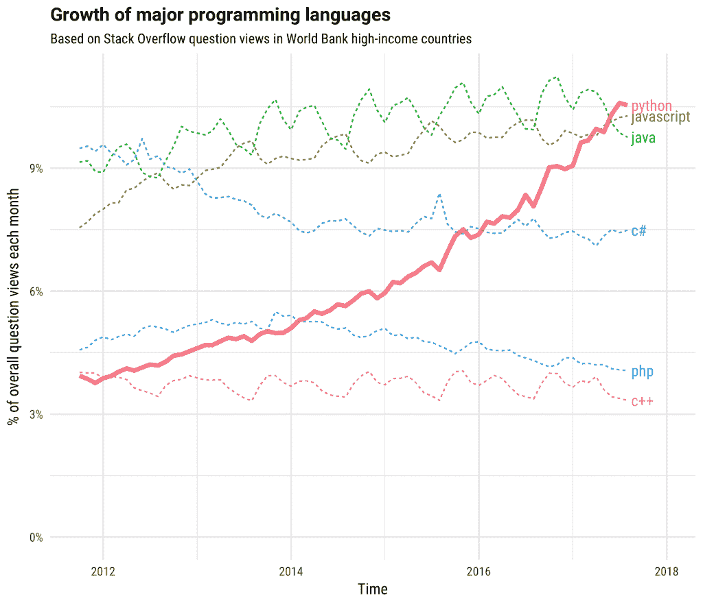

# 第一章：Python 的一点味道

> 只有丑陋的语言才会流行。Python 是唯一的例外。
> 
> 唐纳德·克努斯

# 谜

让我们从两个迷你谜题及其解决方案开始。你认为以下两行文字是什么意思？

```py
(Row 1): (RS) K18,ssk,k1,turn work.
(Row 2): (WS) Sl 1 pwise,p5,p2tog,p1,turn.
```

它看起来很技术化，像某种计算机程序。实际上，它是一个*编织图案*；具体来说，是一个描述如何转弯袜子的脚后跟的片段，就像图 1-1 中的那只袜子一样。


###### 图 1-1\. 针织袜子

这对我来说一点都不合理，就像数独对我的猫一样，但我的妻子完全理解。如果你是一个编织者，你也会的。

让我们尝试另一个神秘的文本，发现在一张索引卡上。你会立即理解它的目的，尽管你可能不知道它的最终产品：

```py
  1/2 c. butter or margarine
  1/2 c. cream
  2 1/2 c. flour
  1 t. salt
  1 T. sugar
  4 c. riced potatoes (cold)

Be sure all ingredients are cold before adding flour.
Mix all ingredients.
Knead thoroughly.
Form into 20 balls.  Store cold until the next step.
For each ball:
  Spread flour on cloth.
  Roll ball into a circle with a grooved rolling pin.
  Fry on griddle until brown spots appear.
  Turn over and fry other side.
```

即使你不会做饭，你可能也认出了它是一个*食谱*¹：一份食物配料列表，后面是制作指南。但它制作的是什么？这是*lefse*，一种类似于玉米饼的挪威美食（见图 1-2）。涂上一些黄油和果酱或你喜欢的任何东西，卷起来，享受吧。


###### 图 1-2\. Lefse

编织图案和食谱共享一些特征：

+   一种常规的*词汇*，包括单词、缩写和符号。有些可能很熟悉，其他的可能令人困惑。

+   关于可以说什么和在哪里说的*语法*规则。

+   需要按顺序执行的*操作序列*。

+   有时，会重复执行一些操作（一个*循环*），比如油煎每片 lefse 的方法。

+   有时，参考另一个操作序列（在计算机术语中，是一个*函数*）。在食谱中，你可能需要参考另一个关于土豆泥的食谱。

+   假设你对*上下文*有所了解。这个配方假设你知道水是什么，以及如何把它煮沸。这个编织图案假设你能够编织和针织而不经常刺伤自己。

+   一些要使用、创建或修改的*数据*——土豆和纱线。

+   用于处理数据的*工具*——锅、搅拌机、烤箱、编织棒。

+   一个预期的*结果*。在我们的例子中，是给你的脚和你的胃的东西。只是别把它们搞混了。

无论你如何称呼它们——成语、行话、小语言——你都会在各处看到它们的例子。这些行话为懂它的人节省了时间，而对我们其他人则使事情变得神秘。试着解密一篇关于桥牌的报纸专栏，如果你不玩这个游戏，或者解释一篇科学论文，如果你不是科学家（甚至如果你是，但在不同领域）。

# 小程序

你会在计算机程序中看到所有这些想法，它们本身就像小语言，专门为人类告诉计算机要做什么而设计。我用编织图案和食谱来说明编程并不神秘。这在很大程度上取决于学习正确的词汇和规则。

现在，如果单词和规则不多，并且你不需要一次学习太多东西，这会帮助很多。我们的大脑一次只能记住那么多东西。

让我们最终看一个真正的计算机程序（示例 1-1）。你觉得这个程序做什么？

##### 示例 1-1\. countdown.py

```py
for countdown in 5, 4, 3, 2, 1, "hey!":
    print(countdown)
```

如果你猜测这是一个 Python 程序，它打印以下行

```py
5
4
3
2
1
hey!
```

那么你就知道 Python 比食谱或编织图案更容易学习。而且你可以在舒适和安全的桌子旁练习编写 Python 程序，远离热水和尖锐的棍子的危险。

Python 程序有一些特殊的单词和符号——`for`、`in`、`print`、逗号、冒号、括号等等，这些是语言*语法*（规则）的重要部分。好消息是，Python 具有更好的语法，而且需要记住的东西比大多数计算机语言少。它似乎更自然——几乎像一个食谱。

示例 1-2 是另一个微小的 Python 程序；它从一个 Python *列表* 中选择一个哈利波特法术并打印它。

##### 示例 1-2\. spells.py

```py
spells = [
    "Riddikulus!",
    "Wingardium Leviosa!",
    "Avada Kedavra!",
    "Expecto Patronum!",
    "Nox!",
    "Lumos!",
    ]
print(spells[3])
```

个体法术是 Python *字符串*（文本字符序列，用引号括起来）。它们由逗号分隔，并且放在由方括号（`[`和`]`）定义的 Python *列表*中。单词`spells`是一个*变量*，给列表命名，这样我们就可以对其进行操作。在这种情况下，程序会打印第四个法术：

```py
Expecto Patronum!
```

为什么我们说`3`，如果我们想要第四个？Python 列表（如`spells`）是从列表开始的值的序列，通过它们从列表开始的*偏移量*来访问。第一个值在偏移量`0`处，第四个值在偏移量`3`处。

###### 注意

人们从 1 开始计数，所以从 0 开始计数可能看起来很奇怪。以偏移量而不是位置来思考有助于理解。是的，这是计算机程序有时与普通语言用法不同的示例。

列表在 Python 中是非常常见的*数据结构*，并且第七章展示了如何使用它们。

示例 1-3 中的程序打印了一个 Three Stooges 的引用，但是通过说它的人而不是在列表中的位置来引用。

##### 示例 1-3\. quotes.py

```py
quotes = {
    "Moe": "A wise guy, huh?",
    "Larry": "Ow!",
    "Curly": "Nyuk nyuk!",
    }
stooge = "Curly"
print(stooge, "says:", quotes[stooge])
```

如果你运行这个小程序，它会打印以下内容：

```py
Curly says: Nyuk nyuk!
```

`quotes`是一个变量，它命名了一个 Python *字典*——一组唯一的*键*（在这个示例中是三个小丑的名字）和相关的*值*（这里是这些小丑的著名说法）。使用字典，你可以通过名称存储和查找东西，这通常是列表的有用替代方法。

`spells`示例使用方括号（`[`和`]`）创建了一个 Python 列表，而`quotes`示例使用花括号（`{`和`}`，与 Curly 无关）创建了一个 Python 字典。此外，冒号（`:`）用于将字典中的每个键与其值关联起来。你可以在第八章中读到更多关于字典的内容。

希望这不会让你一下子记住太多语法规则。在接下来的几章中，你将逐步了解更多这些小规则。

# 更大的程序

现在，让我们完全不同的内容：示例 1-4 展示了一个执行更复杂任务的 Python 程序。暂时不要期望能理解程序的工作原理；这正是本书的目的！它的目的是让你了解典型的非平凡 Python 程序的外观和感觉。如果你懂其他编程语言，可以评估一下 Python 的差异。即使还不了解 Python，你能在阅读程序解释之前大致猜到每行代码的作用吗？你已经见过 Python 列表和字典的示例，这里还包含了更多功能。

在本书早期版本中，示例程序连接到 YouTube 网站并获取其最受欢迎视频的信息，如“查理咬我的手指”。这个功能在第二版印刷后不久停止工作。那时，Google 停止支持此服务，导致标志性的示例程序无法继续运行。我们的新 示例 1-4 前往另一个网站，这个网站应该能持续更长时间——位于 [互联网档案馆](http://archive.org) 的 *Wayback Machine*，这是一个免费服务，保存了二十年来数十亿个网页（以及电影、电视节目、音乐、游戏和其他数字文物）。你将在 第 18 章 中看到更多这样的 *网络 API* 示例。

程序会要求你输入一个 URL 和一个日期。然后，它询问 Wayback Machine 是否在那个日期左右保存了该网站的副本。如果找到了，它将把信息返回给 Python 程序，打印出 URL 并在你的网络浏览器中显示。这个例子展示了 Python 如何处理各种任务：获取你输入的内容、通过互联网与网站进行通信、获取一些内容、从中提取一个 URL，并说服你的网络浏览器显示该 URL。

如果我们得到一个充满 HTML 格式文本的普通网页，我们需要弄清如何显示它，这是一项需要交给网络浏览器处理的大量工作。我们也可以尝试提取我们想要的部分（详见 第 18 章 关于 *网页抓取* 的更多细节）。无论选择哪种方式，都会增加工作量和程序的复杂度。相反，Wayback Machine 返回的数据是 *JSON* 格式。JSON（JavaScript 对象表示法）是一种人类可读的文本格式，描述了其中数据的类型、值和顺序。它是另一种小语言，已成为不同计算机语言和系统之间交换数据的流行方式。你将在 第 12 章 进一步了解 JSON。

Python 程序可以将 JSON 文本转换为 Python *数据结构* —— 就像你自己编写程序创建它们一样。我们的小程序只选择了一部分（来自 Internet Archive 网站的旧页面的 URL）。再次说明，这是一个完整的 Python 程序，你可以自己运行。我们只包含了少量的错误检查，只是为了保持示例的简洁。行号不是程序的一部分；它们包含在内，以帮助你跟随我们在程序后提供的描述。

##### 示例 1-4\. archive.py

```py
1 import webbrowser
2 import json
3 from urllib.request import urlopen
4 
5 print("Let's find an old website.")
6 site = input("Type a website URL: ")
7 era = input("Type a year, month, and day, like 20150613: ")
8 url = "http://archive.org/wayback/available?url=%s&timestamp=%s" % (site, era)
9 response = urlopen(url)
10 contents = response.read()
11 text = contents.decode("utf-8")
12 data = json.loads(text)
13 try:
14     old_site = data["archived_snapshots"]["closest"]["url"]
15     print("Found this copy: ", old_site)
16     print("It should appear in your browser now.")
17     webbrowser.open(old_site)
18 except:
19     print("Sorry, no luck finding", site)
```

这个小 Python 程序在几行中做了很多事情，而且相当易读。你现在还不知道所有这些术语，但在接下来的几章中你会了解到。以下是每一行正在发生的事情：

1.  *导入*（使这个程序可用）来自 Python *标准库*模块名为`webbrowser`的所有代码。

1.  导入 Python 标准库模块`json`的所有代码。

1.  仅从标准库模块`urllib.request`中导入`urlopen` *函数*。

1.  一个空行，因为我们不想感到拥挤。

1.  将一些初始文本打印到您的显示器上。

1.  打印一个关于 URL 的问题，读取你输入的内容，并保存在一个名为`site`的程序 *变量* 中。

1.  打印另一个问题，这次读取年、月和日，并将其保存在名为`era`的变量中。

1.  构造一个名为`url`的字符串变量，以使 Wayback Machine 查找您输入的站点和日期的副本。

1.  连接到该 URL 的 Web 服务器并请求特定的*Web 服务*。

1.  获取响应数据并将其分配给变量`contents`。

1.  *解码* `contents`为 JSON 格式的文本字符串，并将其分配给变量`text`。

1.  将`text`转换为`data` —— Python 数据结构。

1.  错误检查：`try`运行接下来的四行，如果任何一个失败，则运行程序的最后一行（在`except`之后）。

1.  如果我们找到了这个站点和日期的匹配项，则从一个三级 Python *字典*中提取其值。注意，这一行和接下来的两行是缩进的。这就是 Python 如何知道它们属于前面的`try`行。

1.  打印我们找到的 URL。

1.  打印下一行执行后会发生什么。

1.  在你的浏览器中显示我们找到的 URL。

1.  如果前面的四行有任何失败，Python 跳到这里。

1.  如果失败了，打印一条消息和我们正在查找的站点。这是缩进的，因为它只能在前面的`except`行运行时运行。

当我在终端窗口中运行这个命令时，我输入了一个站点 URL 和一个日期，并得到了这段文本输出：

```py
$ python archive.py
Let's find an old website.
Type a website URL: lolcats.com
Type a year, month, and day, like 20150613: 20151022
Found this copy: http://web.archive.org/web/20151102055938/http://www.lolcats.com/
It should appear in your browser now.
```

并且图 1-3 显示了在我的浏览器中显示的内容。


###### 图 1-3\. 来自 Wayback Machine

在前面的示例中，我们使用了 Python 的一些*标准库*模块（安装 Python 时包含的程序），但它们并非神圣不可侵犯。Python 还拥有大量优秀的第三方软件。示例 1-5 是一个重写，使用名为`requests`的外部 Python 软件包访问 Internet Archive 网站。

##### 示例 1-5\. archive2.py

```py
1 import webbrowser
2 import requests
3 
4 print("Let's find an old website.")
5 site = input("Type a website URL: ")
6 era = input("Type a year, month, and day, like 20150613: ")
7 url = "http://archive.org/wayback/available?url=%s&timestamp=%s" % (site, era)
8 response = requests.get(url)
9 data = response.json()
10 try:
11     old_site = data["archived_snapshots"]["closest"]["url"]
12     print("Found this copy: ", old_site)
13     print("It should appear in your browser now.")
14     webbrowser.open(old_site)
15 except:
16     print("Sorry, no luck finding", site)
```

新版本更短，我猜对大多数人来说更易读。您将在 第十八章 中详细了解`requests`，以及在 第十一章 中了解 Python 的外部编写软件。

# Python 在现实世界中

那么，学习 Python 是否值得时间和精力？Python 自 1991 年以来就存在（比 Java 老，比 C 新），一直稳居最受欢迎的五大计算机语言之列。人们受雇编写 Python 程序——比如您每天使用的严肃内容，如 Google、YouTube、Instagram、Netflix 和 Hulu。我在许多领域的生产应用中都使用了它。Python 以其高效率而著称，适合快节奏的组织。

您会发现 Python 存在于许多计算环境中，包括以下几种：

+   监视器或终端窗口中的命令行

+   包括 Web 在内的图形用户界面（GUI）

+   Web 的客户端和服务器端

+   支持大型流行站点的后端服务器

+   *云*（由第三方管理的服务器）

+   移动设备

+   嵌入式设备

Python 程序从一次性*脚本*（比如本章中到目前为止看到的那些）到百万行系统都有。

[2018 年 Python 开发者调查](https://oreil.ly/8vK7y) 提供了有关 Python 在计算世界中当前地位的数据和图表。

我们将看到它在网站、系统管理和数据处理中的应用。在最后的章节中，我们将看到 Python 在艺术、科学和商业中的具体用途。

# Python 与来自 X 星球的语言相比

Python 与其他语言相比如何？在何时何地选择一种而不是另一种？在本节中，我展示了其他语言的代码示例，这样您就可以看到竞争情况。如果您没有使用过这些语言，您不*需要*理解它们。（当您看到最后的 Python 示例时，您可能会因为没有必要与其他语言一起工作而感到宽慰。）

每个程序都应打印一个数字，并对语言做简要介绍。

如果您使用终端或终端窗口，那么读取您输入的内容并运行它并显示结果的程序称为*shell*程序。Windows 的 shell 称为[`cmd`](https://en.wikipedia.org/wiki/Cmd.exe)，它运行带有后缀`.bat`的*批处理*文件。Linux 和其他类 Unix 系统（包括 macOS）有许多 shell 程序。最流行的称为[`bash`](https://www.gnu.org/software/bash)或`sh`。Shell 具有简单的功能，如简单逻辑和将通配符符号如`*`扩展为文件名。您可以将命令保存在称为*shell 脚本*的文件中，以后运行它们。这些可能是您作为程序员遇到的第一个程序。问题在于 shell 脚本在超过几百行后不容易扩展，并且比其他语言慢得多。下一段显示了一个小的 shell 程序：

```py
#!/bin/sh
language=0
echo "Language $language: I am the shell. So there."
```

如果您将这段代码保存为`test.sh`并用`sh test.sh`运行它，您会在显示器上看到以下内容：

```py
Language 0: I am the shell. So there.
```

旧有的[C](https://oreil.ly/7QKsf)和[C++](https://oreil.ly/iOJPN)是相当底层的语言，当速度最重要时使用。您的操作系统及其许多程序（包括计算机上的`python`程序）可能是用 C 或 C++编写的。

这两种语言更难学习和维护。您需要注意许多细节，如*内存管理*，这可能导致程序崩溃和难以诊断的问题。这是一个小的 C 程序：

```py
#include <stdio.h>
int main(int argc, char *argv[]) {
    int language = 1;
    printf("Language %d: I am C! See? Si!\n", language);
    return 0;
}
```

C++具有 C 家族的特征，但也发展了一些独特的功能：

```py
#include <iostream>
using namespace std;
int main() {
    int language = 2;
    cout << "Language " << language << \
       ": I am C++!  Pay no attention to my little brother!" << \
       endl;
    return(0);
}
```

[Java](https://www.java.com)和[C#](https://oreil.ly/1wo5A)是 C 和 C++的继任者，避免了它们前辈的一些问题——特别是内存管理问题——但有时会显得有些冗长。接下来的示例展示了一些 Java：

```py
public class Anecdote {
    public static void main (String[] args) {
        int language = 3;
        System.out.format("Language %d: I am Java! So there!\n", language);
    }
}
```

如果您还没有用过这些语言编写程序，您可能会想知道：所有那些*东西*是什么？我们只想打印一行简单的代码。一些语言带有大量的语法装备。您将在第二章中了解更多信息。

C、C++和 Java 是*静态语言*的示例。它们要求您在使用变量之前指定一些低级细节，如数据类型。附录 A 显示了像整数这样的数据类型在计算机中有特定数量的位，并且只能执行整数操作。相比之下，*动态语言*（也称为*脚本语言*）在使用变量之前不强制您声明变量类型。

多年来，通用的动态语言是[Perl](http://www.perl.org)。Perl 非常强大，拥有广泛的库。然而，它的语法可能有些笨拙，在过去几年中似乎失去了向 Python 和 Ruby 的势头。这个例子向您展示了 Perl 的一个名言：

```py
my $language = 4;
print "Language $language: I am Perl, the camel of languages.\n";
```

[Ruby](http://www.ruby-lang.org)是一种较新的语言。它从 Perl 借鉴了一些，主要因为*Ruby on Rails*，一个 Web 开发框架而流行。它在很多和 Python 相同的领域中使用，选择其中之一可能归结为品味或者您特定应用程序的可用库。这是一个 Ruby 片段：

```py
language = 5
puts "Language #{language}: I am Ruby, ready and aglow."
```

[PHP](http://www.php.net)，如下例所示，非常流行于 Web 开发，因为它方便地结合了 HTML 和代码。然而，PHP 语言本身有一些陷阱，并且在 Web 之外的通用语言中并不流行。这是它的样子：

```py
<?PHP
$language = 6;
echo "Language $language: I am PHP, a language and palindrome.\n";
?>
```

[Go](https://golang.org)（或者*Golang*，如果你想要在 Google 中搜索）是一种近来的语言，试图在高效和友好之间找到平衡：

```py
package main

import "fmt"

func main() {
  language := 7
  fmt.Printf("Language %d: Hey, ho, let's Go!\n", language)
}
```

另一种现代的 C 和 C++的替代品是[Rust](https://doc.rust-lang.org)：

```py
fn main() {
    println!("Language {}: Rust here!", 8)
```

还剩下谁？哦对了，[Python](https://python.org)：

```py
language = 9
print(f"Language {language}: I am Python. What's for supper?")
```

# 为什么选择 Python？

其中一个原因，虽然不一定是最重要的，是它的流行度。通过各种指标来看，Python 是：

+   作为最快增长的主要编程语言，正如你在图 1-4 中看到的那样。

+   2019 年 6 月的[TIOBE 指数](https://www.tiobe.com/tiobe-index)的编辑们说：“本月 Python 在 TIOBE 指数中再次达到了历史新高的 8.5%。如果 Python 能保持这样的增长速度，它可能在 3 到 4 年内取代 C 和 Java，成为世界上最流行的编程语言。”

+   2018 年的年度编程语言（TIOBE），并且在[IEEE Spectrum](https://oreil.ly/saRgb)和[PyPL](http://pypl.github.io/PYPL.html)中排名靠前。

+   在顶级[美国学院](http://bit.ly/popular-py)中，最流行的初级计算机科学课程语言。

+   法国高中的官方教学语言。



###### 图 1-4\. Python 在主要编程语言增长中处于领先地位

近年来，在数据科学和机器学习领域变得极其流行。如果你想在一个有趣的领域找到一份高薪的编程工作，Python 现在是一个不错的选择。而且，如果你在招聘，有越来越多经验丰富的 Python 开发人员。

但是*为什么*它如此流行？编程语言并不是非常有吸引力。有哪些潜在原因呢？

Python 是一种优秀的通用高级语言。其设计使得它非常*可读*，这比听起来更重要。每个计算机程序只写一次，但要被多次阅读和修订，通常由多人完成。可读性高使得它更容易学习和记忆；因此，更*可写*。与其他流行的语言相比，Python 具有渐进的学习曲线，使您更快进入生产状态，但它又有深度，您可以随着经验的积累探索。

Python 相对简洁的语法使你能够写出比静态语言中等价程序更小的程序。研究表明，无论使用何种语言，程序员每天产生的代码行数大致相同，因此，减半代码行数就会使你的生产力翻倍，就这么简单。Python 是许多公司的“不那么秘密武器”，这些公司认为这很重要。

当然，Python 是免费的，无论是像啤酒（价格）还是言论（自由）。用 Python 写任何你想要的东西，在任何地方都可以自由使用。没有人能读懂你的 Python 程序然后说，“你写的这个小程序不错啊，要是出了什么问题就太可惜了。”

Python 几乎可以在任何地方运行，并且“电池已包括”——其标准库中包含大量有用的软件。本书介绍了许多标准库和有用的第三方 Python 代码示例。

但是，也许使用 Python 的最好理由是一个意外的理由：人们通常*享受*使用它进行编程，而不是把它看作是必要的恶来完成工作。它不会妨碍你。一个常见的说法是它“符合你的思维方式”。通常，开发人员会说，在需要使用其他语言时，他们会错过一些 Python 的设计。这将 Python 与其大多数同行区分开来。

# 为什么选择 Python？

Python 并不是适合每种情况的最佳语言。

Python 并非默认安装在所有地方。附录 B 向您展示如何在计算机上安装 Python（如果您尚未安装）。

对于大多数应用来说，Python 的速度已经足够快，但对于一些要求更高的应用来说可能还不够快。如果你的程序大部分时间都在计算东西（技术术语是*CPU-bound*），那么用 C、C++、C#、Java、Rust 或 Go 写的程序通常会比 Python 等效程序运行得更快。但并非总是如此！

这里有一些解决方案：

+   有时在 Python 中，一个更好的*算法*（逐步解决方案）胜过 C 中的一个低效算法。Python 更快的开发速度让你有更多时间尝试不同的解决方案。

+   在许多应用程序中（特别是 Web 应用程序），程序在等待来自网络上某个服务器的响应时会无所事事。CPU（中央处理单元，计算机的*芯片*，负责所有计算）几乎没有参与；因此，静态和动态程序的端到端时间会非常接近。

+   标准 Python 解释器是用 C 编写的，可以通过 C 代码进行扩展。我在第十九章中稍作讨论。

+   Python 解释器变得越来越快。Java 在早期非常慢，进行了大量的研究和资金投入来加快速度。Python 不归任何公司所有，因此其改进更为渐进。在“PyPy”中，我谈到了*PyPy*项目及其影响。

+   你可能有一个非常苛刻的应用程序，无论你做什么，Python 都无法满足你的需求。通常的替代方案是 C、C++ 和 Java。[Go](http://golang.org)（感觉像 Python，但性能像 C）或 Rust 也值得一试。

# Python 2 与 Python 3

一个中等大小的复杂性是 Python 有两个版本。Python 2 已经存在很长时间，预装在 Linux 和 Apple 计算机上。它是一种优秀的语言，但没有十全十美。在计算机语言中，像许多其他领域一样，有些错误是表面的，容易修复，而其他则很难。难以修复的问题是*不兼容*的：用这些问题编写的新程序将无法在旧的 Python 系统上工作，而在修复之前编写的旧程序将无法在新系统上工作。

Python 的创始人（[Guido van Rossum](https://www.python.org/~guido)）和其他人决定将难以修复的问题一起打包，并在 2008 年作为 Python 3 引入。Python 2 是过去，Python 3 是未来。Python 2 的最终版本是 2.7，它将在一段时间内存在，但这是终点；不会有 Python 2.8。Python 2 的语言支持终止日期是 2020 年 1 月。安全和其他修复将不再进行，许多知名的 Python 软件包将在那时放弃对 Python 2 的支持。操作系统很快将放弃 Python 2 或将 Python 3 设为默认版本。流行的 Python 软件向 Python 3 的转换是逐步进行的，但现在我们已经远远超过了临界点。所有新的开发将使用 Python 3。

本书关注的是 Python 3。它几乎与 Python 2 相同。最明显的变化是在 Python 3 中`print`是一个函数，因此你需要用括号将其参数括起来。最重要的变化是对*Unicode*字符的处理，这在第十二章中有详细介绍。我会在其他重要的不同点出现时指出它们。

# 安装 Python

为了不使本章混乱，你可以在附录 B 中找到关于如何安装 Python 3 的详细信息。如果你没有 Python 3，或者不确定，去那里看看你需要为你的计算机做什么。是的，这有点麻烦（具体来说，是右前部的麻烦），但你只需做一次。

# 运行 Python

安装了 Python 3 的工作副本后，你可以用它来运行本书中的 Python 程序以及你自己的 Python 代码。你到底如何运行 Python 程序？主要有两种方式：

+   Python 的内置*交互解释器*（也称为*shell*）是尝试小型程序的简便方法。你逐行输入命令并立即看到结果。由于输入和显示紧密耦合，你可以更快地进行实验。我将使用交互解释器演示语言特性，你也可以在自己的 Python 环境中输入相同的命令。

+   对于其他所有内容，将你的 Python 程序存储在文本文件中，通常使用*.py*扩展名，并通过输入`python`后跟这些文件名来运行它们。

让我们现在尝试这两种方法。

## 使用交互式解释器

本书中的大多数代码示例使用内置的交互式解释器。当你输入与示例中相同的命令并获得相同的结果时，你就知道你走在正确的道路上了。

你可以通过在计算机上输入主 Python 程序的名称来启动解释器：它应该是`python`、`python3`或类似的名称。在本书的其余部分，我们假设它称为`python`；如果你的命名不同，请在代码示例中看到`python`时输入那个名称。

交互式解释器几乎与 Python 文件的工作方式完全相同，只有一个例外：当你输入有值的东西时，交互式解释器会自动为你打印其值。这不是 Python 语言的一部分，只是解释器的一个特性，可以帮助你省去每次都输入`print()`的麻烦。例如，如果你在解释器中输入数字`27`，它将被回显到你的终端（如果你在文件中有一行`27`，Python 不会感到沮丧，但当你运行程序时不会看到任何打印输出）：

```py
$ python
Python 3.7.2 (v3.7.2:9a3ffc0492, Dec 24 2018, 02:44:43)
[Clang 6.0 (clang-600.0.57)] on darwin
Type "help", "copyright", "credits" or "license" for more information.
>>> 27
27
```

###### 注意

在上一个示例中，`$`是一个样本系统*提示符*，用于在终端窗口中输入类似`python`的命令。我们在本书的代码示例中使用它，尽管你的提示符可能不同。

顺便说一句，在解释器中随时使用`print()`也可以打印输出：

```py
>>> print(27)
27
```

如果你在交互式解释器中尝试了这些示例，并看到了相同的结果，那么你刚刚运行了一些真实（虽然很小）的 Python 代码。在接下来的几章中，你将从一行代码逐步过渡到更长的 Python 程序。

## 使用 Python 文件

如果你将`27`单独放在一个文件中并通过 Python 运行它，它会运行，但不会打印任何东西。在正常的非交互式 Python 程序中，你需要调用`print`函数来打印输出：

```py
print(27)
```

让我们创建一个 Python 程序文件并运行它：

1.  打开你的文本编辑器。

1.  输入`print(27)`这一行，就像这里显示的一样。

1.  将此保存为名为*test.py*的文件。确保将其保存为纯文本而不是 RTF 或 Word 等“丰富”格式。你不需要为 Python 程序文件使用*.py*后缀，但这有助于你记住它们的类型。

1.  如果你使用的是 GUI——几乎所有人都是——打开一个终端窗口。²

1.  通过输入以下内容来运行你的程序：

```py
$ python test.py
```

你应该看到一行输出：

```py
27
```

成功了吗？如果是这样，恭喜你运行了你的第一个独立 Python 程序。

## 下一步是什么？

你将向一个真实的 Python 系统输入命令，它们需要遵循合法的 Python 语法。与一次性倾泻语法规则不同，我们将在接下来的几章中逐步介绍它们。

开发 Python 程序的基本方法是使用纯文本编辑器和终端窗口。我在本书中使用纯文本显示，有时显示交互式终端会话，有时显示 Python 文件片段。你应该知道还有许多优秀的 *集成开发环境*（IDE）适用于 Python。这些可能具有带有高级文本编辑和帮助显示的 GUI。你可以在第十九章中了解其中一些的详细信息。

# 你的禅意时刻

每种计算机语言都有自己的风格。在前言中，我提到过表达自己的 *Pythonic* 方法通常会有。Python 中嵌入了一点自由诗，简洁地表达了 Python 的哲学（据我所知，Python 是唯一一个包含这样一个彩蛋的语言）。只需在交互式解释器中键入 `import this`，然后在需要这个禅意时按下回车键：

```py
>>> import this
The Zen of Python, by Tim Peters

Beautiful is better than ugly.
Explicit is better than implicit.
Simple is better than complex.
Complex is better than complicated.
Flat is better than nested.
Sparse is better than dense.
Readability counts.
Special cases aren't special enough to break the rules.
Although practicality beats purity.
Errors should never pass silently.
Unless explicitly silenced.
In the face of ambiguity, refuse the temptation to guess.
There should be one--and preferably only one--obvious way to do it.
Although that way may not be obvious at first unless you're Dutch.
Now is better than never.
Although never is often better than *right* now.
If the implementation is hard to explain, it's a bad idea.
If the implementation is easy to explain, it may be a good idea.
Namespaces are one honking great idea--let's do more of those!
```

我会在整本书中举例说明这些情感。

# 即将发生的事情

下一章将讨论 Python 的数据类型和变量。这将为接下来的章节做准备，这些章节将详细介绍 Python 的数据类型和代码结构。

# 要做的事情

本章是 Python 语言的介绍——它的功能、外观以及它在计算世界中的位置。在每章末尾，我建议一些迷你项目，帮助你记住你刚刚阅读的内容，并为即将到来的内容做好准备。

1.1 如果你的计算机上还没有安装 Python 3，请立即安装。阅读附录 B 获取有关你的计算机系统的详细信息。

1.2 启动 Python 3 交互式解释器。同样的详情请参阅附录 B。它应该打印几行关于自身的信息，然后是一行以 `>>>` 开头的单行。这就是你输入 Python 命令的提示。

1.3 与解释器玩一会儿。像使用计算器一样使用它，键入 `8 * 9`。按回车键查看结果。Python 应该打印 `72`。

1.4 输入数字 `47`，然后按回车键。下一行是否打印出 `47`？

1.5 现在，键入 `print(47)`，然后按 Enter 键。这也在下一行为你打印出 `47` 吗？

¹ 通常只在食谱书和舒适的推理小说中找到。

² 如果你不确定这意味着什么，请参阅附录 B 获取不同操作系统的详细信息。
