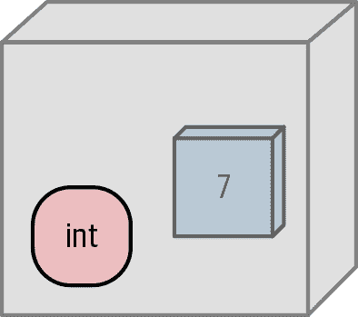
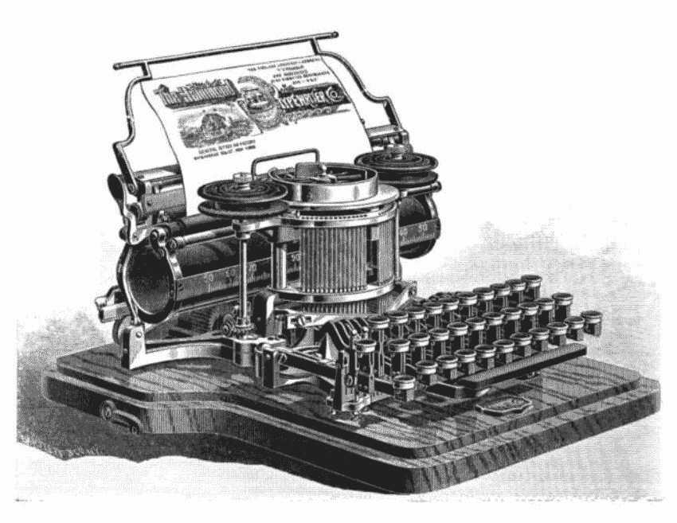
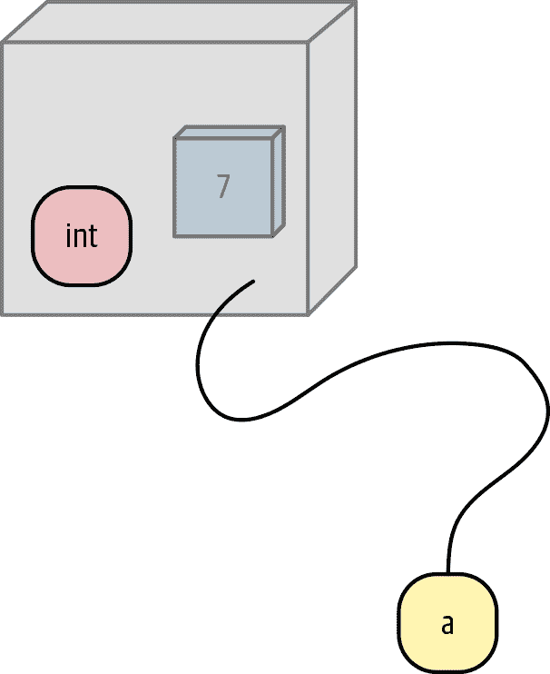
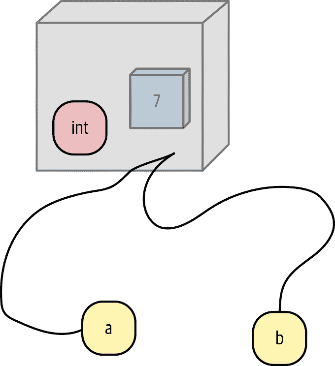

# 第二章\. 数据：类型、值、变量和名称

> 选一个好名字胜过大财。
> 
> 箴言 22:1

在计算机底层，一切都只是一串*比特*（见附录 A）。计算的一个洞察是，我们可以按任意方式解释这些比特——作为不同大小和类型的数据（数字、文本字符），甚至是计算机代码本身。我们使用 Python 来定义这些比特的块，以及在 CPU 中的输入输出。

我们从 Python 的数据*类型*和它们可以包含的*值*开始。然后我们看如何将数据表示为*字面值*和*变量*。

# Python 数据是对象。

你可以将计算机的内存视为一系列长长的货架。每个货架上的插槽宽度为一个字节（八比特），编号从 0（第一个）到末尾。现代计算机具有数十亿字节的内存（吉字节），因此这些货架将填满一个巨大的虚构仓库。

你的操作系统为 Python 程序提供对计算机内存的一些访问权限。该内存用于程序本身的代码以及它使用的数据。操作系统确保程序无法读取或写入其他内存位置而不通过某种方式获得权限。

程序跟踪它们的比特位于何处（内存位置），以及它们是什么类型（数据类型）。对于计算机来说，一切都只是比特。同样的比特模式可能表示整数 `65` 或文本字符 `A`。

不同类型可能使用不同数量的比特。当你听说“64 位机器”时，这意味着整数使用 64 比特（8 字节）。

有些语言在内存中直接取出和拨弄这些原始值，并跟踪它们的大小和类型。Python 不直接处理这些原始数据值，而是将每个数据值包装在内存中作为一个*对象*——布尔值、整数、浮点数、字符串，甚至大型数据结构、函数和程序。关于如何在 Python 中定义自己的对象，有一个完整的章节（第十章）。但现在，我们只是讨论处理基本内置数据类型的对象。

使用内存货架的类比，你可以把对象想象成变量大小的盒子，占据这些货架上的空间，如图 2-1 所示。Python 制作这些对象盒子，将它们放在货架上的空位上，并在它们不再使用时移除它们。



###### 图 2-1\. 一个对象就像一个盒子；这个是一个值为`7`的整数。

在 Python 中，对象是一个包含至少以下内容的数据块：

+   定义对象能做什么的*type*（见下一节）。

+   一个独特的*id*，以区别于其他对象。

+   与其类型一致的*value*。

+   *reference count* 跟踪这个对象被使用的频率。

它的*标识*就像它在架子上的位置，一个唯一的标识符。它的*类型*就像盒子上的工厂印记，说明它能做什么。如果一个 Python 对象是整数，它的类型是 `int`，并且可以（除了其他事情，你将在第 3 章中看到）加到另一个 `int` 上。如果我们把盒子想象成由透明塑料制成，我们可以看到里面的*值*。在不久的几节中，当我们谈论变量和名称时，你将学到*引用计数*的用法。

# 类型

表 2-1 展示了 Python 中的基本数据类型。第二列（类型）包含该类型的 Python 名称。第三列（可变？）指示值在创建后是否可以更改，这在下一节中有更详细的解释。示例显示了该类型的一个或多个字面示例。最后一列（章节）指向本书中详细讲述该类型的章节。

表 2-1\. Python 的基本数据类型

| 名称 | 类型 | 可变？ | 示例 | 章节 |
| --- | --- | --- | --- | --- |
| 布尔值 | `bool` | 否 | `True`, `False` | 第 3 章 |
| 整数 | `int` | 否 | `47`, `25000`, `25_000` | 第 3 章 |
| 浮点数 | `float` | 否 | `3.14`, `2.7e5` | 第 3 章 |
| 复数 | `complex` | 否 | `3j`, `5 + 9j` | 第 22 章 |
| 文本字符串 | `str` | 否 | `'alas'`, `"alack"`, `'''a verse attack'''` | 第 5 章 |
| 列表 | `list` | 是 | `['Winken', 'Blinken', 'Nod']` | 第 7 章 |
| 元组 | `tuple` | 否 | `(2, 4, 8)` | 第 7 章 |
| 字节 | `bytes` | 否 | `b'ab\xff'` | 第 12 章 |
| 字节数组 | `bytearray` | 是 | `bytearray(...)` | 第 12 章 |
| 集合 | `set` | 是 | `set([3, 5, 7])` | 第 8 章 |
| 冻结集合 | `frozenset` | 否 | `frozenset(['Elsa', 'Otto'])` | 第 8 章 |
| 字典 | `dict` | 是 | `{'game': 'bingo', 'dog': 'dingo', 'drummer': 'Ringo'}` | 第 8 章 |

在这些基本数据类型的章节后，您将看到如何在第 10 章中创建新类型。

# 可变性

> 无物能长存，唯变性永恒。
> 
> Percy Shelley

类型还决定了盒子中包含的数据*值*是否可以更改（*可变*）或是常量（*不可变*）。把一个不可变对象想象成一个密封的盒子，但有透明的侧面，就像图 2-1；你可以看到值，但不能改变它。按同样的类比，可变对象就像有盖子的盒子：不仅可以看到里面的值，还可以改变它；但是，你不能改变它的类型。

Python 是*强类型*的，这意味着对象的类型即使其值是可变的，也不会改变（图 2-2）。



###### 图 2-2\. *强类型*并不意味着要更用力按键

# 字面值

有两种方法在 Python 中指定数据值：

+   *字面*

+   *变量*

在接下来的章节中，你将看到如何为不同的数据类型指定字面值的详细信息——整数是一串数字，浮点数包含小数点，文本字符串被引号包围，等等。但是，在本章的其余部分，为了避免手指起茧，我们的示例将仅使用短小的十进制整数和一两个 Python 列表。十进制整数就像数学中的整数一样：从`0`到`9`的一串数字。还有一些额外的整数细节（例如符号和非十进制基数），我们将在第三章中讨论。

# 变量

现在，我们来到了计算语言的一个关键概念。

Python，像大多数计算机语言一样，允许您定义*变量*——即计算机内存中值的名称，您希望在程序中使用。

Python 变量名有一些规则：

+   它们只能包含以下这些字符：

    +   小写字母（`a`到`z`）

    +   大写字母（`A`到`Z`）

    +   数字（`0`到`9`）

    +   下划线（`_`）

+   它们是*区分大小写的*：`thing`、`Thing` 和 `THING` 是不同的名称。

+   它们必须以字母或下划线开头，不能以数字开头。

+   以下划线开头的名称被特殊对待（你可以在第九章中阅读有关此处的内容）。

+   它们不能是 Python 的*保留词*（也称为*关键字*）之一。

保留词¹有：

```py
False      await      else       import     pass
None       break      except     in         raise
True       class      finally    is         return
and        continue   for        lambda     try
as         def        from       nonlocal   while
assert     del        global     not        with
async      elif       if         or         yield
```

在 Python 程序中，您可以找到保留词与

```py
>>> help("keywords")
```

或：

```py
>>> import keyword
>>> keyword.kwlist
```

以下是有效的名称：

+   `a`

+   `a1`

+   `a_b_c___95`

+   `_abc`

+   `_1a`

然而，这些名称是无效的：

+   `1`

+   `1a`

+   `1_`

+   `name!`

+   `another-name`

# 分配

在 Python 中，您使用 `=` 来*分配*一个值给一个变量。

###### 注意

我们都在小学算术中学到了 `=` 的意思是*等于*。那么为什么许多计算机语言，包括 Python，使用 `=` 进行赋值？一个原因是标准键盘缺乏逻辑的替代品，如左箭头键，并且 `=` 似乎不会太令人困惑。另外，在计算机程序中，您使用分配的频率比测试相等要高得多。

程序*不*像代数。当您在学校学习数学时，您看到了这样的方程式：

```py
y = x + 12
```

您可以通过“插入”一个值来解决方程式中的等式。如果您给 `x` 赋值 `5`，`5 + 12` 就是 `17`，所以 `y` 的值将是 `17`。为 `x` 插入 `6` 以获得 `y` 的 `18`，依此类推。

计算机程序行看起来可能像方程式，但它们的含义是不同的。在 Python 和其他计算机语言中，`x` 和 `y` 是*变量*。Python 知道像 `12` 或 `5` 这样的裸数字是字面整数。因此，这里有一个小小的 Python 程序模仿这个方程式，打印出 `y` 的结果值：

```py
>>> x = 5
>>> y = x + 12
>>> y
17
```

这是数学和程序之间的重大区别：在数学中，`=`表示两边的*相等*，但在程序中表示*赋值*：*将右边的值赋给左边的变量*。

在程序中，右侧的每一部分都需要有一个值（这称为*初始化*）。右侧可以是字面值，或者已经被赋值的变量，或者它们的组合。Python 知道`5`和`12`是字面整数。第一行将整数值`5`赋给变量`x`。现在我们可以在下一行中使用变量`x`。当 Python 读取`y = x + 12`时，它执行以下操作：

+   看到中间的`=`号

+   知道这是一个任务。

+   计算右侧（获取由`x`引用的对象的值并将其添加到`12`）

+   将结果分配给左侧变量`y`

然后在交互解释器中输入变量`y`的名称将打印其新值。

如果您在程序中以`y = x + 12`开头，Python 会生成一个*异常*（一个错误），因为变量`x`还没有值：

```py
>>> y = x + 12
Traceback (most recent call last):
  File "<stdin>", line 1, in <module>
NameError: name 'x' is not defined
```

您将在第九章中详细了解异常。在计算机术语中，我们会说这个`x`是*未初始化*的。

在代数中，您可以反向工作，并将一个值分配给`y`来计算`x`。要在 Python 中做到这一点，您需要在赋值给左侧的`x`之前获取右侧的字面值和初始化变量。

```py
>>> y = 5
>>> x = 12 - y
>>> x
7
```

# 变量是名称，不是位置

现在是时候提一个关于 Python 变量的关键点了：*变量只是名称*。这与许多其他计算机语言不同，这是 Python 特别要知道的一点，特别是当我们涉及到像列表这样的*可变*对象时。赋值*不会复制*一个值；它只是*将一个名称*绑定到包含数据的对象上。名称是对事物的*引用*，而不是事物本身。将名称想象成一个标签，附在计算机内存中的对象框上 (图 2-3)。



###### 图 2-3. 名称指向对象（变量`a`指向一个值为`7`的整数对象）

在其他语言中，变量本身有一个类型，并绑定到一个内存位置。您可以更改该位置的值，但它必须是相同的类型。这就是*静态*语言要求您声明变量类型的原因。Python 不需要，因为一个名称可以引用任何东西，我们通过“跟随字符串”到数据对象本身来获取值和类型。这节省了时间，但也有一些缺点：

+   可能会拼错一个变量并且得到一个异常，因为它并不引用任何东西，而且 Python 并不像静态语言那样自动检查。第十九章展示了提前检查变量以避免这种情况的方法。

+   Python 的原始速度比像 C 这样的语言慢。它让计算机做更多的工作，这样你就不必亲自去做。

在交互解释器中尝试这个（在图 2-4 中可视化）：

1.  如前所述，将值`7`分配给名称`a`。这创建了一个包含整数值`7`的对象框。

1.  打印`a`的值。

1.  将`a`分配给`b`，使`b`也指向包含`7`的对象盒子。

1.  打印变量`b`的值：

    ```py
    >>> a = 7
    >>> print(a)
    7
    >>> b = a
    >>> print(b)
    7
    ```



###### 图 2-4\. 复制一个名称（现在变量`b`也指向相同的整数对象）

在 Python 中，如果您想知道任何东西的类型（变量或字面值），可以使用``type(*`thing`*)``。 `type()`是 Python 的内置函数之一。如果要检查变量是否指向特定类型的对象，请使用``isinstance(*`type`*)``：

```py
>>> type(7)
<class 'int'>
>>> type(7) == int
True
>>> isinstance(7, int)
True
```

###### 注意

当我提到函数时，我会在其后加上括号（`()`），以强调它是一个函数而不是变量名或其他东西。

让我们试试更多的字面值（`58`，`99.9`，`'abc'`）和变量（`a`，`b`）：

```py
>>> a = 7
>>> b = a
>>> type(a)
<class 'int'>
>>> type(b)
<class 'int'>
>>> type(58)
<class 'int'>
>>> type(99.9)
<class 'float'>
>>> type('abc')
<class 'str'>
```

*类*是对象的定义；第十章详细介绍了类。在 Python 中，“类”和“类型”几乎意味着相同的事情。

正如您所见，当您在 Python 中使用变量时，它会查找它所引用的对象。在幕后，Python 正在忙碌地创建临时对象，这些对象将在一两行后被丢弃。

让我们重复一个早期的例子：

```py
>>> y = 5
>>> x = 12 - y
>>> x
7
```

在这段代码片段中，Python 执行了以下操作：

+   创建一个值为`5`的整数对象

+   使变量`y`指向该`5`对象

+   增加了值为`5`的对象的引用计数

+   创建另一个值为`12`的整数对象

+   从`y`指向的对象的值（`5`）中减去具有该值的（匿名）对象中的`12`的值

+   将此值（`7`）分配给新的（到目前为止未命名的）整数对象

+   让变量`x`指向这个新对象

+   增加了`x`指向的这个新对象的引用计数

+   查找`x`指向的对象的值（`7`）并打印它

当对象的引用计数达到零时，没有名称指向它，因此它不需要保留。 Python 有一个名为*垃圾收集器*的迷人工具，可以重新使用不再需要的内存。想象有人在那些内存架子后面，拉取过时的盒子进行回收利用。

在这种情况下，我们不再需要具有值`5`，`12`或`7`的对象，也不需要变量`x`和`y`。 Python 垃圾收集器可以选择将它们送往对象天堂²，或者出于性能原因保留一些，因为小整数通常被广泛使用。

# 分配给多个名称

您可以同时将值分配给多个变量名：

```py
>>> two = deux = zwei = 2
>>> two
2
>>> deux
2
>>> zwei
2
```

# 重新分配名称

因为名称指向对象，所以更改分配给名称的值只是使名称指向新对象。旧对象的引用计数将减少，新对象的引用计数将增加。

# 复制

正如您在图 2-4 中看到的，将现有变量`a`赋值给名为`b`的新变量只是使`b`指向与`a`相同的对象。如果您选择任一`a`或`b`标签并跟随它们的字符串，您将到达同一个对象。

如果对象是不可变的（比如整数），其值不能被更改，因此这两个名称本质上是只读的。试试这个：

```py
>>> x = 5
>>> x
5
>>> y = x
>>> y
5
>>> x = 29
>>> x
29
>>> y
5
```

当我们将 `x` 分配给 `y` 时，这使得名称 `y` 指向 `x` 也指向的值为 `5` 的整数对象。更改 `x` 使其指向值为 `29` 的新整数对象。它没有更改 `y` 所指向的仍然是 `5` 的那个对象。

但如果两个名称都指向一个*可变*对象，则可以通过任一名称更改对象的值，并在使用任一名称时看到更改后的值。如果你一开始不知道这一点，可能会感到惊讶。

*列表*是一个可变的值数组，第七章详细介绍了它们。在本例中，`a`和`b`分别指向具有三个整数成员的列表：

```py
>>> a = [2, 4, 6]
>>> b = a
>>> a
[2, 4, 6]
>>> b
[2, 4, 6]
```

这些列表成员（`a[0]`、`a[1]` 和 `a[2]`）本身就像名称，指向具有值 `2`、`4` 和 `6` 的整数对象。列表对象按顺序保留其成员。

现在通过名称 `a` 更改第一个列表元素，并看到 `b` 也已更改：

```py
>>> a[0] = 99
>>> a
[99, 4, 6]
>>> b
[99, 4, 6]
```

当更改第一个列表元素时，它不再指向值为 `2` 的对象，而是指向值为 `99` 的新对象。列表仍然是 `list` 类型，但其值（列表元素及其顺序）是可变的。

# 选择好的变量名称

> 他说了真实的事情，但用了错误的名字来称呼它们。
> 
> 伊丽莎白·巴雷特·勃朗宁

选择好变量名称是多么重要啊。在迄今为止的许多代码示例中，我一直在使用像 `a` 和 `x` 这样的临时名称。在实际程序中，你将同时跟踪更多的变量，并且需要在简洁性和清晰性之间取得平衡。例如，键入 `num_loons` 要比 `number``_of_loons` 或 `gaviidae_inventory` 快，但比 `n` 更具解释性。

# 即将发生

数字！它们像你期望的那样令人兴奋。嗯，也许没有那么糟糕。³ 你将看到如何将 Python 用作计算器，以及一只猫如何创立了数字系统。

# 要做的事情

2.1 将整数值 `99` 分配给变量 `prince`，并打印它。

2.2 值 `5` 的类型是什么？

2.3 值 `2.0` 的类型是什么？

2.4 表达式 `5 + 2.0` 的类型是什么？

¹ `async` 和 `await` 是 Python 3.7 中的新功能。

² 或者是不合格对象之岛。

³ `8` 看起来像一个雪人！
