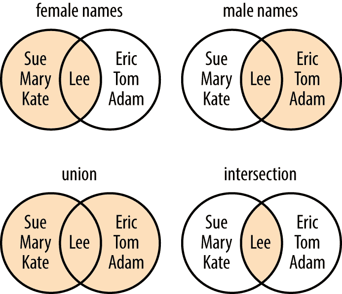

# 第八章。字典和集合

> 如果字典中的单词拼错了，我们怎么知道呢？
> 
> 史蒂文·赖特

# 字典

*字典* 类似于列表，但条目的顺序无关紧要，也不是通过像 0 或 1 这样的偏移来选择。而是为每个 *值* 指定一个唯一的 *key* 来关联。这个键通常是一个字符串，但实际上可以是 Python 的任何不可变类型：布尔值、整数、浮点数、元组、字符串和其他在后面章节中会看到的类型。字典是可变的，因此可以添加、删除和更改它们的键值元素。如果您曾经使用过只支持数组或列表的语言，您会喜欢字典的。

###### 注意

在其他语言中，字典可能被称为 *关联数组*、*哈希* 或 *哈希映射*。在 Python 中，字典也被称为 *dict*，以节省音节并让十几岁的男孩窃笑。

## 使用 {} 创建

要创建字典，您需要在逗号分隔的 *`key`* `:` *`value`* 对之间放置花括号 (`{}`)。最简单的字典是一个完全不包含任何键或值的空字典：

```py
>>> empty_dict = {}
>>> empty_dict
{}
```

让我们从安布罗斯·彼尔斯的 *魔鬼的词典* 中摘取一些引文，制作一个小字典：

```py
>>> bierce = {
...     "day": "A period of twenty-four hours, mostly misspent",
...     "positive": "Mistaken at the top of one's voice",
...     "misfortune": "The kind of fortune that never misses",
...     }
>>>
```

在交互解释器中输入字典的名称将打印其键和值：

```py
>>> bierce
{'day': 'A period of twenty-four hours, mostly misspent',
'positive': "Mistaken at the top of one's voice",
'misfortune': 'The kind of fortune that never misses'}
```

###### 注意

在 Python 中，如果列表、元组或字典的最后一项后面留有逗号是可以的。当您在花括号中键入键和值时，就像在前面的例子中所做的那样，不需要缩进。这只是为了提高可读性。

## 使用 dict() 创建

有些人不喜欢输入那么多花括号和引号。您也可以通过将命名参数和值传递给 `dict()` 函数来创建字典。

传统的方式：

```py
>>> acme_customer = {'first': 'Wile', 'middle': 'E', 'last': 'Coyote'}
>>> acme_customer
{'first': 'Wile', 'middle': 'E', 'last': 'Coyote'}
```

使用 `dict()`：

```py
>>> acme_customer = dict(first="Wile", middle="E", last="Coyote")
>>> acme_customer
{'first': 'Wile', 'middle': 'E', 'last': 'Coyote'}
```

第二种方式的一个限制是参数名必须是合法的变量名（不能有空格，不能是保留字）：

```py
>>> x = dict(name="Elmer", def="hunter")
  File "<stdin>", line 1
    x = dict(name="Elmer", def="hunter")
                             ^
SyntaxError: invalid syntax
```

## 使用 dict() 转换

您也可以使用 `dict()` 函数将包含两个值的序列转换为字典。有时您可能会遇到这样的键值序列，例如 “锶，90，碳，14。”¹ 每个序列的第一项用作键，第二项用作值。

首先，这里是使用 `lol`（一个包含两项列表的列表）的一个小例子：

```py
>>> lol = [ ['a', 'b'], ['c', 'd'], ['e', 'f'] ]
>>> dict(lol)
{'a': 'b', 'c': 'd', 'e': 'f'}
```

我们可以使用包含两项序列的任何序列。以下是其他示例。

一个包含两项元组的列表：

```py
>>> lot = [ ('a', 'b'), ('c', 'd'), ('e', 'f') ]
>>> dict(lot)
{'a': 'b', 'c': 'd', 'e': 'f'}
```

一个包含两项列表的元组：

```py
>>> tol = ( ['a', 'b'], ['c', 'd'], ['e', 'f'] )
>>> dict(tol)
{'a': 'b', 'c': 'd', 'e': 'f'}
```

一个包含两个字符字符串的列表：

```py
>>> los = [ 'ab', 'cd', 'ef' ]
>>> dict(los)
{'a': 'b', 'c': 'd', 'e': 'f'}
```

一个包含两个字符字符串的元组：

```py
>>> tos = ( 'ab', 'cd', 'ef' )
>>> dict(tos)
{'a': 'b', 'c': 'd', 'e': 'f'}
```

章节 “使用 zip() 迭代多个序列” 介绍了 `zip()` 函数，它使得创建这些两项序列变得容易。

## 添加或更改一个项目由 [ *key* ]

向字典中添加项很简单。只需通过其键引用该项并赋予一个值。如果键已存在于字典中，现有值将被新值替换。如果键是新的，则将其添加到字典中并赋予其值。与列表不同，你不必担心 Python 在分配时抛出超出范围的索引异常。

让我们创建一个蒙提·派森大部分成员的字典，使用他们的姓作为键，名作为值：

```py
>>> pythons = {
...     'Chapman': 'Graham',
...     'Cleese': 'John',
...     'Idle': 'Eric',
...     'Jones': 'Terry',
...     'Palin': 'Michael',
...     }
>>> pythons
{'Chapman': 'Graham', 'Cleese': 'John', 'Idle': 'Eric',
'Jones': 'Terry', 'Palin': 'Michael'}
```

我们遗漏了一个成员：出生在美国的那个，特里·吉列姆。这里有一个匿名程序员试图添加他的尝试，但是他搞砸了名字的第一个字：

```py
>>> pythons['Gilliam'] = 'Gerry'
>>> pythons
{'Chapman': 'Graham', 'Cleese': 'John', 'Idle': 'Eric',
'Jones': 'Terry', 'Palin': 'Michael', 'Gilliam': 'Gerry'}
```

这里有另一位程序员编写的修复代码，他在多个方面都符合 Python 风格：

```py
>>> pythons['Gilliam'] = 'Terry'
>>> pythons
{'Chapman': 'Graham', 'Cleese': 'John', 'Idle': 'Eric',
'Jones': 'Terry', 'Palin': 'Michael', 'Gilliam': 'Terry'}
```

通过使用相同的键（`'Gilliam'`），我们用`'Terry'`替换了原始值`'Gerry'`。

记住字典键必须是*唯一*的。这就是为什么我们在这里使用姓氏而不是名字作为键——蒙提·派森的两个成员都有名字 `'Terry'`！如果你使用一个键多次，最后一个值会覆盖之前的值：

```py
>>> some_pythons = {
...     'Graham': 'Chapman',
...     'John': 'Cleese',
...     'Eric': 'Idle',
...     'Terry': 'Gilliam',
...     'Michael': 'Palin',
...     'Terry': 'Jones',
...     }
>>> some_pythons
{'Graham': 'Chapman', 'John': 'Cleese', 'Eric': 'Idle',
'Terry': 'Jones', 'Michael': 'Palin'}
```

我们首先将值`'Gilliam'`分配给键`'Terry'`，然后将其替换为值`'Jones'`。

## 通过[key]或者使用 get()获取项

这是字典的最常见用法。你指定字典和键以获取对应的值：使用前面部分的`some_pythons`：

```py
>>> some_pythons['John']
'Cleese'
```

如果字典中不存在该键，则会引发异常：

```py
>>> some_pythons['Groucho']
Traceback (most recent call last):
  File "<stdin>", line 1, in <module>
KeyError: 'Groucho'
```

有两种很好的方法可以避免这种情况。第一种是在开始时使用`in`来测试键，就像你在上一节看到的那样：

```py
>>> 'Groucho' in some_pythons
False
```

第二种方法是使用特殊的字典`get()`函数。你提供字典、键和一个可选值。如果键存在，你将得到其值：

```py
>>> some_pythons.get('John')
'Cleese'
```

否则，你将得到可选的值（如果你指定了的话）：

```py
>>> some_pythons.get('Groucho', 'Not a Python')
'Not a Python'
```

否则，你将得到`None`（在交互式解释器中显示为空）：

```py
>>> some_pythons.get('Groucho')
>>>
```

## 使用 keys()获取所有的键

你可以使用`keys()`来获取字典中的所有键。我们将在接下来的几个示例中使用一个不同的样本字典：

```py
>>> signals = {'green': 'go', 'yellow': 'go faster', 'red': 'smile for the camera'}
>>> signals.keys()
dict_keys(['green', 'yellow', 'red'])
```

###### 注意

在 Python 2 中，`keys()`仅返回一个列表。而 Python 3 返回`dict_keys()`，它是键的可迭代视图。这在处理大型字典时很方便，因为它不会使用时间和内存来创建和存储一个可能不会使用的列表。但通常你确实*需要*一个列表。在 Python 3 中，你需要调用`list()`将`dict_keys`对象转换为列表。

```py
>>> list( signals.keys() )
['green', 'yellow', 'red']
```

在 Python 3 中，你还需要使用`list()`函数将`values()`和`items()`的结果转换为普通的 Python 列表。我在这些例子中使用了这个。

## 使用 values()获取所有的值

要获取字典中的所有值，使用 values()：

```py
>>> list( signals.values() )
['go', 'go faster', 'smile for the camera']
```

## 使用 items()获取所有的键-值对

当你想从字典中获取所有的键-值对时，使用`items()`函数：

```py
>>> list( signals.items() )
[('green', 'go'), ('yellow', 'go faster'), ('red', 'smile for the camera')]
```

每个键和值都作为元组返回，例如`('green', 'go')`。

## 使用 len()获取长度

计算你的键值对数：

```py
>>> len(signals)
3
```

## 使用{**a, **b}合并字典

从 Python 3.5 开始，有一种新的方法可以合并字典，使用`**`魔法，这在第九章中有着非常不同的用途：

```py
>>> first = {'a': 'agony', 'b': 'bliss'}
>>> second = {'b': 'bagels', 'c': 'candy'}
>>> {**first, **second}
{'a': 'agony', 'b': 'bagels', 'c': 'candy'}
```

实际上，您可以传递多于两个字典：

```py
>>> third = {'d': 'donuts'}
>>> {**first, **third, **second}
{'a': 'agony', 'b': 'bagels', 'd': 'donuts', 'c': 'candy'}
```

这些是*浅*复制。 如果您希望得到键和值的完整副本，并且与它们的原始字典没有关联，请参阅`deepcopy()`的讨论（“使用 deepcopy()复制一切”）。

## 使用 update()合并字典

您可以使用`update()`函数将一个字典的键和值复制到另一个字典中。

让我们定义包含所有成员的`pythons`字典：

```py
>>> pythons = {
...     'Chapman': 'Graham',
...     'Cleese': 'John',
...     'Gilliam': 'Terry',
...     'Idle': 'Eric',
...     'Jones': 'Terry',
...     'Palin': 'Michael',
...     }
>>> pythons
{'Chapman': 'Graham', 'Cleese': 'John', 'Gilliam': 'Terry',
'Idle': 'Eric', 'Jones': 'Terry', 'Palin': 'Michael'}
```

我们还有一个名为`others`的其他幽默人物字典：

```py
>>> others = { 'Marx': 'Groucho', 'Howard': 'Moe' }
```

现在，又来了另一个匿名程序员，他决定将`others`的成员作为蒙提·派森的成员：

```py
>>> pythons.update(others)
>>> pythons
{'Chapman': 'Graham', 'Cleese': 'John', 'Gilliam': 'Terry',
'Idle': 'Eric', 'Jones': 'Terry', 'Palin': 'Michael',
'Marx': 'Groucho', 'Howard': 'Moe'}
```

如果第二个字典与它要合并的字典具有相同的键，会发生什么？ 第二个字典的值将覆盖第一个字典的值：

```py
>>> first = {'a': 1, 'b': 2}
>>> second = {'b': 'platypus'}
>>> first.update(second)
>>> first
{'a': 1, 'b': 'platypus'}
```

## 使用 del 按键删除项目

先前来自我们的匿名程序员的`pythons.update(others)`代码在技术上是正确的，但事实上是错误的。 虽然`others`的成员风趣而著名，但并非蒙提·派森的成员。 让我们撤销最后两次添加：

```py
>>> del pythons['Marx']
>>> pythons
{'Chapman': 'Graham', 'Cleese': 'John', 'Gilliam': 'Terry',
'Idle': 'Eric', 'Jones': 'Terry', 'Palin': 'Michael',
'Howard': 'Moe'}
>>> del pythons['Howard']
>>> pythons
{'Chapman': 'Graham', 'Cleese': 'John', 'Gilliam': 'Terry',
'Idle': 'Eric', 'Jones': 'Terry', 'Palin': 'Michael'}
```

## 使用 pop()按键获取项目并删除它

这结合了`get()`和`del`。 如果给`pop()`传递一个键，并且它存在于字典中，则返回匹配的值并删除键值对。 如果不存在，则会引发异常：

```py
>>> len(pythons)
6
>>> pythons.pop('Palin')
'Michael'
>>> len(pythons)
5
>>> pythons.pop('Palin')
Traceback (most recent call last):
  File "<stdin>", line 1, in <module>
KeyError: 'Palin'
```

但是，如果给`pop()`传递第二个默认参数（与`get()`一样），一切都会很好，字典不会更改：

```py
>>> pythons.pop('First', 'Hugo')
'Hugo'
>>> len(pythons)
5
```

## 使用 clear()删除所有项目

要从字典中删除所有键和值，请使用`clear()`或只需重新分配一个空字典（`{}`）给名称：

```py
>>> pythons.clear()
>>> pythons
{}
>>> pythons = {}
>>> pythons
{}
```

## 使用 in 测试键是否存在

如果您想知道字典中是否存在某个键，请使用`in`。 让我们再次重新定义`pythons`字典，这次省略一个或两个名称：

```py
>>> pythons = {'Chapman': 'Graham', 'Cleese': 'John',
... 'Jones': 'Terry', 'Palin': 'Michael', 'Idle': 'Eric'}
```

现在让我们看看里面有谁：

```py
>>> 'Chapman' in pythons
True
>>> 'Palin' in pythons
True
```

这次我们记得添加特里·吉列姆了吗？

```py
>>> 'Gilliam' in pythons
False
```

唉。

## 使用=分配

与列表一样，如果您对字典进行更改，则将反映在引用它的所有名称中：

```py
>>> signals = {'green': 'go',
... 'yellow': 'go faster',
... 'red': 'smile for the camera'}
>>> save_signals = signals
>>> signals['blue'] = 'confuse everyone'
>>> save_signals
{'green': 'go',
'yellow': 'go faster',
'red': 'smile for the camera',
'blue': 'confuse everyone'}
```

## 使用 copy()复制

要实际从一个字典复制键和值到另一个字典，并避免这种情况，您可以使用`copy()`：

```py
>>> signals = {'green': 'go',
... 'yellow': 'go faster',
... 'red': 'smile for the camera'}
>>> original_signals = signals.copy()
>>> signals['blue'] = 'confuse everyone'
>>> signals
{'green': 'go',
'yellow': 'go faster',
'red': 'smile for the camera',
'blue': 'confuse everyone'}
>>> original_signals
{'green': 'go',
'yellow': 'go faster',
'red': 'smile for the camera'}
>>>
```

这是一个*浅*复制，并且在字典值是不可变的情况下有效。 如果不是，您需要`deepcopy()`。

## 使用 deepcopy()复制一切

假设前面示例中`red`的值是一个列表而不是一个单独的字符串：

```py
>>> signals = {'green': 'go',
... 'yellow': 'go faster',
... 'red': ['stop', 'smile']}
>>> signals_copy = signals.copy()
>>> signals
{'green': 'go',
'yellow': 'go faster',
'red': ['stop', 'smile']}
>>> signals_copy
{'green': 'go',
'yellow': 'go faster',
'red': ['stop', 'smile']}
>>>
```

让我们更改`red`列表中的一个值：

```py
>>> signals['red'][1] = 'sweat'
>>> signals
{'green': 'go',
'yellow': 'go faster',
'red': ['stop', 'sweat']}
>>> signals_copy
{'green': 'go',
'yellow': 'go faster',
'red': ['stop', 'sweat']}
```

您将获得按名称更改的通常行为。 `copy()`方法直接复制了值，这意味着`signal_copy`对于`'red'`得到了与`signals`相同的列表值。

解决方案是`deepcopy()`：

```py
>>> import copy
>>> signals = {'green': 'go',
... 'yellow': 'go faster',
... 'red': ['stop', 'smile']}
>>> signals_copy = copy.deepcopy(signals)
>>> signals
{'green': 'go',
'yellow': 'go faster',
'red': ['stop', 'smile']}
>>> signals_copy
{'green': 'go',
'yellow':'go faster',
'red': ['stop', 'smile']}
>>> signals['red'][1] = 'sweat'
>>> signals
{'green': 'go',
'yellow': 'go faster',
red': ['stop', 'sweat']}
>>> signals_copy
{'green': 'go',
'yellow': 'go faster',
red': ['stop', 'smile']}
```

## 比较字典

与上一章的列表和元组一样，字典可以使用简单的比较运算符`==`和`!=`进行比较：

```py
>>> a = {1:1, 2:2, 3:3}
>>> b = {3:3, 1:1, 2:2}
>>> a == b
True
```

其他运算符不起作用：

```py
>>> a = {1:1, 2:2, 3:3}
>>> b = {3:3, 1:1, 2:2}
>>> a <= b
Traceback (most recent call last):
  File "<stdin>", line 1, in <module>
TypeError: '<=' not supported between instances of 'dict' and 'dict'
```

Python 逐一比较键和值。它们最初创建的顺序无关紧要。在这个例子中，`a`和`b`是相等的，除了键`1`在`a`中具有列表值`[1, 2]`，而在`b`中具有列表值`[1, 1]`：

```py
>>> a = {1: [1, 2], 2: [1], 3:[1]}
>>> b = {1: [1, 1], 2: [1], 3:[1]}
>>> a == b
False
```

## 使用`for`和`in`进行迭代

遍历字典（或其`keys()`函数）会返回键。在这个例子中，键是桌游 Clue（在北美以外称为 Cluedo）中的卡片类型：

```py
>>> accusation = {'room': 'ballroom', 'weapon': 'lead pipe',
...               'person': 'Col. Mustard'}
>>> for card in accusation:  #  or, for card in accusation.keys():
...     print(card)
...
room
weapon
person
```

要迭代值而不是键，可以使用字典的`values()`函数：

```py
>>> for value in accusation.values():
...     print(value)
...
ballroom
lead pipe
Col. Mustard
```

要返回键和值作为元组，可以使用`items()`函数：

```py
>>> for item in accusation.items():
...     print(item)
...
('room', 'ballroom')
('weapon', 'lead pipe')
('person', 'Col. Mustard')
```

可以一步到位地将元组分配给元组。对于由`items()`返回的每个元组，将第一个值（键）分配给`card`，第二个值（值）分配给`contents`：

```py
>>> for card, contents in accusation.items():
...     print('Card', card, 'has the contents', contents)
...
Card weapon has the contents lead pipe
Card person has the contents Col. Mustard
Card room has the contents ballroom
```

## 字典推导

为了不被那些资产阶级列表所抛弃，字典也有推导。最简单的形式看起来很熟悉：

```py
{*`key_expression`* : *`value_expression`* for *`expression`* in *`iterable`*}
```

```py
>>> word = 'letters'
>>> letter_counts = {letter: word.count(letter) for letter in word}
>>> letter_counts
{'l': 1, 'e': 2, 't': 2, 'r': 1, 's': 1}
```

我们正在循环遍历字符串`'letters'`中的每个字母，并计算该字母出现的次数。两次使用`word.count(letter)`是浪费时间的，因为我们必须两次计算所有`e`和所有`t`。但是当我们第二次计算`e`时，我们不会有任何损害，因为我们只是替换已经存在的字典条目；对于计算`t`的情况也是如此。因此，以下方式可能会更符合 Python 的风格：

```py
>>> word = 'letters'
>>> letter_counts = {letter: word.count(letter) for letter in set(word)}
>>> letter_counts
{'t': 2, 'l': 1, 'e': 2, 'r': 1, 's': 1}
```

与前面的例子不同，字典的键的顺序不同，因为对`set(word)`进行迭代会以不同的顺序返回字母，而迭代字符串`word`则以不同的顺序返回。

与列表推导类似，字典推导也可以有`if`测试和多个`for`子句：

```py
{*`key_expression`* : *`value_expression`* for *`expression`* in *`iterable`* if *`condition`*}
```

```py
>>> vowels = 'aeiou'
>>> word = 'onomatopoeia'
>>> vowel_counts = {letter: word.count(letter) for letter in set(word)
 if letter in vowels}
>>> vowel_counts
{'e': 1, 'i': 1, 'o': 4, 'a': 2}
```

查看[PEP-274](https://oreil.ly/6udkb)以获取更多字典推导的例子。

# 集合

*集合*类似于一个字典，它的值被丢弃，只留下键。与字典一样，每个键必须是唯一的。当你只想知道某个东西是否存在时，可以使用集合，而不需要其他信息。它是一组键的袋子。如果你想将一些信息附加到键上作为值，请使用字典。

在某些过去的时代和某些地方，集合理论是与基本数学一起教授的内容。如果你的学校跳过了它（或者你当时在看窗外），图 8-1 展示了集合并和交的概念。

假设你对有一些共同键的两个集合取并集。因为集合必须仅包含每个项的一个副本，两个集合的并集将只包含每个键的一个副本。*空*集合是一个没有元素的集合。在图 8-1 中，空集合的一个例子是以`X`开头的女性名字。



###### 图 8-1\. 集合的常见操作

## 使用`set()`创建集合

要创建一个集合，可以使用`set()`函数或将一个或多个逗号分隔的值放在花括号中，如下所示：

```py
>>> empty_set = set()
>>> empty_set
set()
>>> even_numbers = {0, 2, 4, 6, 8}
>>> even_numbers
{0, 2, 4, 6, 8}
>>> odd_numbers = {1, 3, 5, 7, 9}
>>> odd_numbers
{1, 3, 5, 7, 9}
```

集合是无序的。

###### 注意

因为 `[]` 创建一个空列表，你可能期望 `{}` 创建一个空集合。相反，`{}` 创建一个空字典。这也是为什么解释器将空集合打印为 `set()` 而不是 `{}`。为什么？字典在 Python 中先出现，并且拿下了花括号的所有权。拥有是法律的九分之一。²

## 使用 `set()` 进行转换：

你可以从列表、字符串、元组或字典创建一个集合，丢弃任何重复的值。

首先，让我们看看一个字符串中某些字母出现多次的情况：

```py
>>> set( 'letters' )
{'l', 'r', 's', 't', 'e'}
```

注意集合只包含一个 `'e'` 或 `'t'`，即使 `'letters'` 包含两个每个。

现在，让我们从列表创建一个集合：

```py
>>> set( ['Dasher', 'Dancer', 'Prancer', 'Mason-Dixon'] )
{'Dancer', 'Dasher', 'Mason-Dixon', 'Prancer'}
```

这次，从元组创建一个集合：

```py
>>> set( ('Ummagumma', 'Echoes', 'Atom Heart Mother') )
{'Ummagumma', 'Atom Heart Mother', 'Echoes'}
```

当你给 `set()` 一个字典时，它只使用键：

```py
>>> set( {'apple': 'red', 'orange': 'orange', 'cherry': 'red'} )
{'cherry', 'orange', 'apple'}
```

## 使用 len() 获取长度：

让我们数一数我们的驯鹿：

```py
>>> reindeer = set( ['Dasher', 'Dancer', 'Prancer', 'Mason-Dixon'] )
>>> len(reindeer)
4
```

## 使用 `add()` 添加一个项目：

使用集合的 `add()` 方法将另一个项目添加到集合中：

```py
>>> s = set((1,2,3))
>>> s
{1, 2, 3}
>>> s.add(4)
>>> s
{1, 2, 3, 4}
```

## 使用 remove() 删除一个项目：

你可以通过值从集合中删除一个值：

```py
>>> s = set((1,2,3))
>>> s.remove(3)
>>> s
{1, 2}
```

## 使用 for 和 in 进行迭代：

像字典一样，你可以遍历集合中的所有项目：

```py
>>> furniture = set(('sofa', 'ottoman', 'table'))
>>> for piece in furniture:
...     print(piece)
...
ottoman
table
sofa
```

## 使用 in 测试一个值：

这是集合的最常见用法。我们将创建一个名为 `drinks` 的字典。每个键是混合饮料的名称，相应的值是该饮料成分的集合：

```py
>>> drinks = {
...     'martini': {'vodka', 'vermouth'},
...     'black russian': {'vodka', 'kahlua'},
...     'white russian': {'cream', 'kahlua', 'vodka'},
...     'manhattan': {'rye', 'vermouth', 'bitters'},
...     'screwdriver': {'orange juice', 'vodka'}
...     }
```

即使两者都用花括号（`{` 和 `}`）括起来，一个集合只是一堆值，而字典包含 *键* ：*值* 对。

哪些饮料含有伏特加？

```py
>>> for name, contents in drinks.items():
...     if 'vodka' in contents:
...         print(name)
...
screwdriver
martini
black russian
white russian
```

我们想要一些伏特加，但我们对乳糖不耐受，并且认为苦艾酒味道像煤油：

```py
>>> for name, contents in drinks.items():
...     if 'vodka' in contents and not ('vermouth' in contents or
...         'cream' in contents):
...         print(name)
...
screwdriver
black russian
```

我们将在下一节中简要重写这段话。

## 组合和操作符

如果你想要检查集合值的组合怎么办？假设你想要找到任何含有橙汁或苦艾酒的饮料？让我们使用 *集合交集操作符*，即 `&`：

```py
>>> for name, contents in drinks.items():
...     if contents & {'vermouth', 'orange juice'}:
...         print(name)
...
screwdriver
martini
manhattan
```

`&` 操作符的结果是一个集合，其中包含与比较的两个列表中都出现的所有项。如果这些成分都不在 `contents` 中，则 `&` 返回一个空集合，被视为 `False`。

现在，让我们重新写前一节的示例，在这个示例中，我们想要伏特加，但不要奶油和苦艾酒：

```py
>>> for name, contents in drinks.items():
...     if 'vodka' in contents and not contents & {'vermouth', 'cream'}:
...         print(name)
...
screwdriver
black russian
```

让我们把这两种饮料的成分集合保存在变量中，以节省我们娇贵的手指在接下来的示例中的打字：

```py
>>> bruss = drinks['black russian']
>>> wruss = drinks['white russian']
```

下面是所有集合操作符的示例。有些有特殊的标点符号，有些有特殊的功能，还有些两者兼有。让我们使用测试集合 `a`（包含 `1` 和 `2`）和 `b`（包含 `2` 和 `3`）：

```py
>>> a = {1, 2}
>>> b = {2, 3}
```

正如你之前看到的，使用特殊标点符号 `&` 获取 *交集*（两个集合共同的成员）。集合 `intersection()` 函数也是如此。

```py
>>> a & b
{2}
>>> a.intersection(b)
{2}
```

此代码片段使用我们保存的饮料变量：

```py
>>> bruss & wruss
{'kahlua', 'vodka'}
```

在这个例子中，使用特殊标点符号 `&` 获取 *并集*（两个集合的成员）或集合 `union()` 函数。

```py
>>> a | b
{1, 2, 3}
>>> a.union(b)
{1, 2, 3}
```

这是酒精版本：

```py
>>> bruss | wruss
{'cream', 'kahlua', 'vodka'}
```

*差集*（第一个集合的成员但不是第二个集合的成员）可以通过使用字符`-`或`difference()`函数获得：

```py
>>> a - b
{1}
>>> a.difference(b)
{1}
```

```py
>>> bruss - wruss
set()
>>> wruss - bruss
{'cream'}
```

到目前为止，最常见的集合操作是并集、交集和差集。我在接下来的示例中包括了其他操作，但你可能永远不会用到它们。

*异或*（一个集合中的项目或另一个，但不是两者都有）使用`^`或`symmetric_difference()`：

```py
>>> a ^ b
{1, 3}
>>> a.symmetric_difference(b)
{1, 3}
```

这找到我们两种俄罗斯饮料中独特的成分：

```py
>>> bruss ^ wruss
{'cream'}
```

你可以通过使用`<=`或`issubset()`来检查一个集合是否是另一个的*子集*（第一个集合的所有成员也在第二个集合中）：

```py
>>> a <= b
False
>>> a.issubset(b)
False
```

给黑俄罗斯加奶油会变成白俄罗斯，所以`wruss`是`bruss`的超集：

```py
>>> bruss <= wruss
True
```

任何集合都是其自身的子集吗？是的。³

```py
>>> a <= a
True
>>> a.issubset(a)
True
```

要成为一个*真子集*，第二个集合需要包含第一个集合的所有成员及更多。通过使用`<`，如下例所示：

```py
>>> a < b
False
>>> a < a
False
```

```py
>>> bruss < wruss
True
```

*超集*是子集的反义词（第二个集合的所有成员也是第一个集合的成员）。这使用`>=`或`issuperset()`：

```py
>>> a >= b
False
>>> a.issuperset(b)
False
```

```py
>>> wruss >= bruss
True
```

任何集合都是其自身的超集：

```py
>>> a >= a
True
>>> a.issuperset(a)
True
```

最后，你可以通过使用`>`来找到一个*真子集*（第一个集合包含第二个集合的所有成员，且更多）如下所示：

```py
>>> a > b
False
```

```py
>>> wruss > bruss
True
```

你不能是你自己的真超集：

```py
>>> a > a
False
```

## 集合推导式

没有人想被忽略，所以即使是集合也有推导式。最简单的版本看起来像你刚刚看到的列表和字典推导式：

`{` *`expression`* `for` *`expression`* `in` *`iterable`* `}`

它还可以具有可选的条件测试：

`{` *`expression`* `for` *`expression`* `in` *`iterable`* `if` *`condition`* `}`

```py
>>> a_set = {number for number in range(1,6) if number % 3 == 1}
>>> a_set
{1, 4}
```

## 使用`frozenset()`创建不可变集合

如果你想创建一个不能被更改的集合，可以使用`frozenset()`函数和任何可迭代参数：

```py
>>> frozenset([3, 2, 1])
frozenset({1, 2, 3})
>>> frozenset(set([2, 1, 3]))
frozenset({1, 2, 3})
>>> frozenset({3, 1, 2})
frozenset({1, 2, 3})
>>> frozenset( (2, 3, 1) )
frozenset({1, 2, 3})
```

它真的冻结了吗？

```py
>>> fs = frozenset([3, 2, 1])
>>> fs
frozenset({1, 2, 3})
>>> fs.add(4)
Traceback (most recent call last):
  File "<stdin>", line 1, in <module>
AttributeError: 'frozenset' object has no attribute 'add'
```

是的，非常冷。

# 到目前为止的数据结构

回顾一下，你可以*创建*：

+   通过使用方括号(`[]`)创建列表

+   通过逗号和可选括号创建元组

+   通过使用花括号(`{}`)创建字典或集合

除了集合，你可以通过使用方括号访问单个元素。对于列表和元组，方括号中的值是整数偏移量。对于字典，它是一个键。对于这三个，结果是一个值。对于集合，要么有，要么没有；没有索引或键：

```py
>>> marx_list = ['Groucho', 'Chico', 'Harpo']
>>> marx_tuple = ('Groucho', 'Chico', 'Harpo')
>>> marx_dict = {'Groucho': 'banjo', 'Chico': 'piano', 'Harpo': 'harp'}
>>> marx_set = {'Groucho', 'Chico', 'Harpo'}
>>> marx_list[2]
'Harpo'
>>> marx_tuple[2]
'Harpo'
>>> marx_dict['Harpo']
'harp'
>>> 'Harpo' in marx_list
True
>>> 'Harpo' in marx_tuple
True
>>> 'Harpo' in marx_dict
True
>>> 'Harpo' in marx_set
True
```

# 创建更大的数据结构

我们从简单的布尔值、数字和字符串逐步进阶到列表、元组、集合和字典。你可以将这些内置数据结构组合成更大、更复杂的结构。让我们从三个不同的列表开始：

```py
>>> marxes = ['Groucho', 'Chico', 'Harpo']
>>> pythons = ['Chapman', 'Cleese', 'Gilliam', 'Jones', 'Palin']
>>> stooges = ['Moe', 'Curly', 'Larry']
```

我们可以创建一个包含每个列表作为元素的元组：

```py
>>> tuple_of_lists = marxes, pythons, stooges
>>> tuple_of_lists
(['Groucho', 'Chico', 'Harpo'],
['Chapman', 'Cleese', 'Gilliam', 'Jones', 'Palin'],
['Moe', 'Curly', 'Larry'])
```

我们可以创建一个包含这三个列表的列表：

```py
>>> list_of_lists = [marxes, pythons, stooges]
>>> list_of_lists
[['Groucho', 'Chico', 'Harpo'],
['Chapman', 'Cleese', 'Gilliam', 'Jones', 'Palin'],
['Moe', 'Curly', 'Larry']]
```

最后，让我们创建一个字典的列表。在这个例子中，让我们使用喜剧组的名字作为键，成员列表作为值：

```py
>>> dict_of_lists = {'Marxes': marxes, 'Pythons': pythons, 'Stooges': stooges}
>> dict_of_lists
{'Marxes': ['Groucho', 'Chico', 'Harpo'],
'Pythons': ['Chapman', 'Cleese', 'Gilliam', 'Jones', 'Palin'],
'Stooges': ['Moe', 'Curly', 'Larry']}
```

你的唯一限制是数据类型本身的限制。例如，字典键必须是不可变的，因此列表、字典或集合不能作为另一个字典的键。但元组可以。例如，你可以通过 GPS 坐标（纬度、经度和高度；请参见 第二十一章 获取更多映射示例）来索引感兴趣的站点：

```py
>>> houses = {
 (44.79, -93.14, 285): 'My House',
 (38.89, -77.03, 13): 'The White House'
 }
```

# 即将发生

回到代码结构。你将学习如何将代码包装在 *函数* 中，以及在出现 *异常* 时如何处理。

# 要做的事情

8.1 制作一个英语到法语的字典 `e2f` 并打印出来。以下是你的起始词汇：`dog` 是 `chien`，`cat` 是 `chat`，`walrus` 是 `morse`。

8.2 使用你的三词字典 `e2f`，打印法语单词 `walrus` 的英文对应词。

8.3 使用 `e2f` 创建一个法语到英语的字典 `f2e`。使用 `items` 方法。

8.4 打印法语单词 `chien` 的英文对应词。

8.5 打印从 `e2f` 中得到的英语单词集合。

8.6 制作一个名为 `life` 的多级字典。使用以下字符串作为最顶层键：`'animals'`、`'plants'` 和 `'other'`。使 `'animals'` 键参考另一个具有键 `'cats'`、`'octopi'` 和 `'emus'` 的字典。使 `'cats'` 键参考一个包含值 `'Henri'`、`'Grumpy'` 和 `'Lucy'` 的字符串列表。使所有其他键参考空字典。

8.7 打印 `life` 的顶层键。

8.8 打印 `life['animals']` 的键。

8.9 打印 `life['animals']['cats']` 的值。

8.10 使用字典推导来创建字典 `squares`。使用 `range(10)` 返回键，并使用每个键的平方作为其值。

8.11 使用集合推导来创建集合 `odd`，其中包含 `range(10)` 中的奇数。

8.12 使用生成器推导来返回字符串 `'Got '` 和 `range(10)` 中的数字。通过使用 `for` 循环进行迭代。

8.13 使用 `zip()` 从键元组 `('optimist', 'pessimist', 'troll')` 和值元组 `('The glass is half full', 'The glass is half empty', 'How did you get a glass?')` 创建一个字典。

8.14 使用 `zip()` 创建一个名为 `movies` 的字典，将以下列表配对：`titles = ['Creature of Habit', 'Crewel Fate', 'Sharks On a Plane']` 和 `plots = ['A nun turns into a monster', 'A haunted yarn shop', 'Check your exits']`

¹ 同时，Strontium-Carbon 游戏的最终得分。

² 根据律师和驱魔师的说法。

³ 尽管，借用格劳乔·马尔克斯的话，“我不想加入那种会接受我作为成员的俱乐部。”
