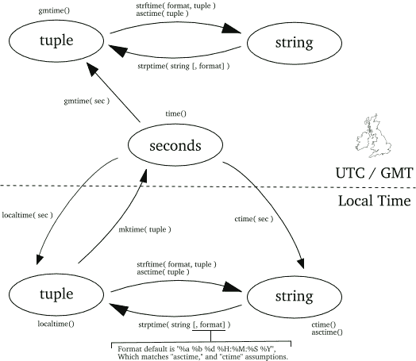

# 第十三章：日历和钟表

> “一！”在钟楼塔上的钟敲响，
> 
> 前不久不过六十分钟前
> 
> 十二点的钟声响起。
> 
> Frederick B. Needham，《钟的轮回》
> 
> 我有日历但我从未准时过。
> 
> 玛丽莲·梦露

程序员花费了令人惊讶的精力处理日期和时间。让我们谈谈他们遇到的一些问题，然后介绍一些最佳实践和技巧，使情况稍微不那么混乱。

日期可以用多种方式表示——实际上太多了。即使在使用罗马日历的英语中，你也会看到简单日期的许多变体：

+   July 21 1987

+   21 Jul 1987

+   21/7/1987

+   7/21/1987

在其他问题中，日期表示可能会产生歧义。在前面的示例中，很容易确定 7 是月份，21 是月中的日期，因为月份不会达到 21 日。但是 `1/6/2012` 是指 1 月 6 日还是 6 月 1 日呢？

月份名称在罗马日历中在不同的语言中会有所变化。甚至年份和月份在其他文化中的定义也可能有所不同。

时间也有它们自己的烦恼来源，特别是由于时区和夏令时。如果你看一下时区地图，这些区域遵循的是政治和历史边界，而不是每 15 度（360 度 / 24）经度上的清晰分界线。并且各国在一年中开始和结束夏令时的日期也不同。南半球国家在北半球朋友结束夏令时时，他们自己的时钟也在前进，反之亦然。

Python 的标准库包括许多日期和时间模块，包括：`datetime`、`time`、`calendar`、`dateutil` 等。它们有些重叠，并且有些令人困惑。

# 闰年

闰年是时间的一个特殊问题。你可能知道每四年是一个闰年（夏季奥运会和美国总统选举）。你还知道每 100 年不是闰年，但每 400 年是吗？下面是测试各年份是否为闰年的代码：

```py
>>> import calendar
>>> calendar.isleap(1900)
False
>>> calendar.isleap(1996)
True
>>> calendar.isleap(1999)
False
>>> calendar.isleap(2000)
True
>>> calendar.isleap(2002)
False
>>> calendar.isleap(2004)
True
```

对于好奇的人：

+   一年有 365.242196 天（绕太阳一周后，地球大约从其轴上旋转四分之一）

+   每四年增加一天。现在平均一年有 365.242196 - 0.25 = 364.992196 天

+   每 100 年减少一天。现在平均一年有 364.992196 + 0.01 = 365.002196 天

+   每 400 年增加一天。现在平均一年有 365.002196 - 0.0025 = 364.999696 天

暂且这样吧！我们不会谈论[闰秒](https://oreil.ly/aJ32N)。

# datetime 模块

标准的 `datetime` 模块处理（这应该不会让你感到惊讶）日期和时间。它定义了四个主要的对象类，每个类都有许多方法：

+   `date` 用于年、月和日

+   `time` 用于小时、分钟、秒和小数

+   `datetime` 用于日期和时间的组合

+   `timedelta` 用于日期和/或时间间隔

你可以通过指定年、月和日来创建一个 `date` 对象。这些值随后可作为属性使用：

```py
>>> from datetime import date
>>> halloween = date(2019, 10, 31)
>>> halloween
datetime.date(2019, 10, 31)
>>> halloween.day
31
>>> halloween.month
10
>>> halloween.year
2019
```

您可以使用其 `isoformat()` 方法打印一个 `date`：

```py
>>> halloween.isoformat()
'2019-10-31'
```

`iso` 指的是 ISO 8601，这是一个国际标准，用于表示日期和时间。它从最一般的（年）到最具体的（日）进行排序。因此，它也正确排序：按年、月、日排序。我通常选择这种格式来表示程序中的日期，并用于按日期保存数据的文件名。下一节描述了更复杂的 `strptime()` 和 `strftime()` 方法，用于解析和格式化日期。

此示例使用 `today()` 方法生成今天的日期：

```py
>>> from datetime import date
>>> now = date.today()
>>> now
datetime.date(2019, 4, 5)
```

这个示例利用了一个 `timedelta` 对象，将一些时间间隔添加到一个 `date` 中：

```py
>>> from datetime import timedelta
>>> one_day = timedelta(days=1)
>>> tomorrow = now + one_day
>>> tomorrow
datetime.date(2019, 4, 6)
>>> now + 17*one_day
datetime.date(2019, 4, 22)
>>> yesterday = now - one_day
>>> yesterday
datetime.date(2019, 4, 4)
```

`date` 的范围是从 `date.min`（年=1，月=1，日=1）到 `date.max`（年=9999，月=12，日=31）。因此，您不能将其用于历史或天文计算。

`datetime` 模块的 `time` 对象用于表示一天中的时间：

```py
>>> from datetime import time
>>> noon = time(12, 0, 0)
>>> noon
datetime.time(12, 0)
>>> noon.hour
12
>>> noon.minute
0
>>> noon.second
0
>>> noon.microsecond
0
```

参数从最大的时间单位（小时）到最小的（微秒）进行。如果您没有提供所有参数，`time` 将假定其余的都是零。顺便说一句，仅因为您可以存储和检索微秒，并不意味着您可以精确到微秒从计算机检索时间。次秒测量的准确性取决于硬件和操作系统中的许多因素。

`datetime` 对象包含日期和时间。您可以直接创建一个，例如接下来的一个，用于 2019 年 1 月 2 日凌晨 3 点 04 分，加上 5 秒和 6 微秒：

```py
>>> from datetime import datetime
>>> some_day = datetime(2019, 1, 2, 3, 4, 5, 6)
>>> some_day
datetime.datetime(2019, 1, 2, 3, 4, 5, 6)
```

`datetime` 对象还有一个 `isoformat()` 方法：

```py
>>> some_day.isoformat()
'2019-01-02T03:04:05.000006'
```

那个中间的 `T` 分隔了日期和时间部分。

`datetime` 有一个 `now()` 方法返回当前日期和时间：

```py
>>> from datetime import datetime
>>> now = datetime.now()
>>> now
datetime.datetime(2019, 4, 5, 19, 53, 7, 580562)
>>> now.year
2019
>>> now.month
4
>>> now.day
5
>>> now.hour
19
>>> now.minute
53
>>> now.second
7
>>> now.microsecond
580562
```

您可以将 `date` 对象和 `time` 对象组合成 `datetime`：

```py
>>> from datetime import datetime, time, date
>>> noon = time(12)
>>> this_day = date.today()
>>> noon_today = datetime.combine(this_day, noon)
>>> noon_today
datetime.datetime(2019, 4, 5, 12, 0)
```

您可以使用 `date()` 和 `time()` 方法从 `datetime` 中提取 `date` 和 `time`：

```py
>>> noon_today.date()
datetime.date(2019, 4, 5)
>>> noon_today.time()
datetime.time(12, 0)
```

# 使用时间模块

令人困惑的是，Python 有一个带有 `time` 对象的 `datetime` 模块，以及一个单独的 `time` 模块。此外，`time` 模块有一个名为——等待它——`time()` 的函数。

表示绝对时间的一种方法是计算自某个起始点以来的秒数。*Unix 时间* 使用自 1970 年 1 月 1 日午夜以来的秒数。这个值通常称为 *时代*，通常是在系统之间交换日期和时间的最简单方法。

`time` 模块的 `time()` 函数返回当前时间的时代值：

```py
>>> import time
>>> now = time.time()
>>> now
1554512132.778233
```

自 1970 年元旦以来已经过去了超过十亿秒。时间都去哪了？

您可以通过使用 `ctime()` 将时代值转换为字符串：

```py
>>> time.ctime(now)
'Fri Apr  5 19:55:32 2019'
```

在下一节中，您将看到如何生成更吸引人的日期和时间格式。

epoch 值是与不同系统交换日期和时间的有用的最小公分母，如 JavaScript。然而，有时候你需要实际的天数、小时等，`time` 提供了 `struct_time` 对象。`localtime()` 提供系统时区的时间，而 `gmtime()` 提供 UTC 的时间：

```py
>>> time.localtime(now)
time.struct_time(tm_year=2019, tm_mon=4, tm_mday=5, tm_hour=19,
tm_min=55, tm_sec=32, tm_wday=4, tm_yday=95, tm_isdst=1)
>>> time.gmtime(now)
time.struct_time(tm_year=2019, tm_mon=4, tm_mday=6, tm_hour=0,
tm_min=55, tm_sec=32, tm_wday=5, tm_yday=96, tm_isdst=0)
```

我的 `19:55`（中部时区，夏令时）在 UTC 的下一天的 `00:55`（以前称为 *格林威治时间* 或 *Zulu 时间*）。如果省略 `localtime()` 或 `gmtime()` 的参数，它们将使用当前时间。

`struct_time` 中的一些 `tm_...` 值可能有些模糊，因此请查看 表 13-1 获取更多详细信息。

表格 13-1\. `struct_time` 的值

| 索引 | 名称 | 意义 | 值 |
| --- | --- | --- | --- |
| 0 | `tm_year` | 年份 | `0000` 到 `9999` |
| 1 | `tm_mon` | 月份 | `1` 到 `12` |
| 2 | `tm_mday` | 月份的某一天 | `1` 到 `31` |
| 3 | `tm_hour` | 小时 | `0` 到 `23` |
| 4 | `tm_min` | 分钟 | `0` 到 `59` |
| 5 | `tm_sec` | 秒 | `0` 到 `61` |
| 6 | `tm_wday` | 星期几 | `0`（周一）到 `6`（周日） |
| 7 | `tm_yday` | 年内天数 | `1` 到 `366` |
| 8 | `tm_isdst` | 夏令时？ | `0` = 否，`1` = 是，`-1` = 不明 |

如果你不想输入所有 `tm_...` 的名称，`struct_time` 也像一个命名元组一样（见 “命名元组”），所以你可以使用前面表格中的索引：

```py
>>> import time
>>> now = time.localtime()
>>> now
time.struct_time(tm_year=2019, tm_mon=6, tm_mday=23, tm_hour=12,
tm_min=12, tm_sec=24, tm_wday=6, tm_yday=174, tm_isdst=1)
>>> now[0]
2019
print(list(now[x] for x in range(9)))
[2019, 6, 23, 12, 12, 24, 6, 174, 1]
```

`mktime()` 则反过来，将 `struct_time` 对象转换为 epoch 秒数：

```py
>>> tm = time.localtime(now)
>>> time.mktime(tm)
1554512132.0
```

这与我们之前的 `now()` 的 epoch 值不完全匹配，因为 `struct_time` 对象仅保留到秒。

###### 注意

一些建议：在可能的情况下，*使用协调世界时 (UTC)* 而不是时区。UTC 是一个绝对时间，独立于时区。如果你有一个服务器，*将其时间设置为 UTC*；不要使用本地时间。

更多建议：*尽量避免使用夏令时*。如果可以避免使用夏令时，一个时期的一个小时会消失（“提前”），而在另一个时期会出现两次（“倒退”）。出于某种原因，许多组织在计算机系统中使用本地时间和夏令时，但每年两次都会被那个神秘的小时弄得迷惑不解。

# 读写日期和时间

`isoformat()` 并不是写入日期和时间的唯一方式。你已经在 `time` 模块中看到了 `ctime()` 函数，你可以用它来将 epoch 转换为字符串：

```py
>>> import time
>>> now = time.time()
>>> time.ctime(now)
'Fri Apr  5 19:58:23 2019'
```

你还可以通过使用 `strftime()` 将日期和时间转换为字符串。这作为 `datetime`、`date` 和 `time` 对象的一个方法提供，也作为 `time` 模块的一个函数提供。`strftime()` 使用格式字符串来指定输出，你可以在 表 13-2 中看到。

表格 13-2\. `strftime()` 的输出格式说明符

| 格式字符串 | 日期/时间单元 | 范围 |
| --- | --- | --- |
| `%Y` | 年份 | `1900`-… |
| `%m` | 月份 | `01`-`12` |
| `%B` | 月份名称 | `January`, … |
| `%b` | 月份缩写 | `Jan`, … |
| `%d` | 日期 | `01`-`31` |
| `%A` | 星期名称 | `Sunday`, … |
| `a` | 缩写星期 | `Sun`, … |
| `%H` | 小时（24 小时制） | `00`-`23` |
| `%I` | 小时（12 小时制） | `01`-`12` |
| `%p` | 上午/下午 | `AM`, `PM` |
| `%M` | 分钟 | `00`-`59` |
| `%S` | 秒 | `00`-`59` |

数字在左侧补零。

这是由`time`模块提供的`strftime()`函数。它将`struct_time`对象转换为字符串。我们首先定义格式字符串`fmt`，稍后再次使用它：

```py
>>> import time
>>> fmt = "It's %A, %B %d, %Y, local time %I:%M:%S%p"
>>> t = time.localtime()
>>> t
time.struct_time(tm_year=2019, tm_mon=3, tm_mday=13, tm_hour=15,
tm_min=23, tm_sec=46, tm_wday=2, tm_yday=72, tm_isdst=1)
>>> time.strftime(fmt, t)
"It's Wednesday, March 13, 2019, local time 03:23:46PM"
```

如果我们尝试使用`date`对象，只有日期部分会生效，时间默认为午夜：

```py
>>> from datetime import date
>>> some_day = date(2019, 7, 4)
>>> fmt = "It's %A, %B %d, %Y, local time %I:%M:%S%p"
>>> some_day.strftime(fmt)
"It's Thursday, July 04, 2019, local time 12:00:00AM"
```

对于`time`对象，只有时间部分会被转换：

```py
>>> from datetime import time
>>> fmt = "It's %A, %B %d, %Y, local time %I:%M:%S%p"
>>> some_time = time(10, 35)
>>> some_time.strftime(fmt)
"It's Monday, January 01, 1900, local time 10:35:00AM"
```

您不会想使用`time`对象的日部分，因为它们没有意义。

要反向转换并将字符串转换为日期或时间，请使用具有相同格式字符串的`strptime()`。没有正则表达式模式匹配；字符串的非格式部分（没有`%`）需要完全匹配。让我们指定一个与*年*-*月*-*日*匹配的格式，例如`2019-01-29`。如果要解析的日期字符串中有空格而不是破折号会发生什么？

```py
>>> import time
>>> fmt = "%Y-%m-%d"
>>> time.strptime("2019 01 29", fmt)
Traceback (most recent call last):
 File "<stdin>",
 line 1, in <module>
 File "/Library/Frameworks/Python.framework/Versions/3.7/lib/python3.7/_strptime.py",
 line 571, in _strptime_time
 tt = _strptime(data_string, format)[0]
 File "/Library/Frameworks/Python.framework/Versions/3.7/lib/python3.7/_strptime.py",
 line 359, in _strptime(data_string, format))
ValueError: time data '2019 01 29' does not match format '%Y-%m-%d
```

如果我们给`strptime()`输入一些破折号，它会开心吗？

```py
>>> import time
>>> fmt = "%Y-%m-%d"
>>> time.strptime("2019-01-29", fmt)
time.struct_time(tm_year=2019, tm_mon=1, tm_mday=29, tm_hour=0,
tm_min=0, tm_sec=0, tm_wday=1, tm_yday=29, tm_isdst=-1)
```

或者修复`fmt`字符串以匹配日期字符串：

```py
>>> import time
>>> fmt = "%Y %m %d"
>>> time.strptime("2019 01 29", fmt)
time.struct_time(tm_year=2019, tm_mon=1, tm_mday=29, tm_hour=0,
tm_min=0, tm_sec=0, tm_wday=1, tm_yday=29, tm_isdst=-1)
```

即使字符串似乎与其格式匹配，如果值超出范围，将引发异常（文件名因空间而被截断）：

```py
>>> time.strptime("2019-13-29", fmt)
Traceback (most recent call last):
 File "<stdin>",
 line 1, in <module>
 File ".../3.7/lib/python3.7/_strptime.py",
 line 571, in _strptime_time
 tt = _strptime(data_string, format)[0]
 File ".../3.7/lib/python3.7/_strptime.py",
 line 359, in _strptime(data_string, format))
ValueError: time data '2019-13-29' does not match format '%Y-%m-%d
```

名称特定于您的*locale*——操作系统的国际化设置。如果您需要打印不同的月份和日期名称，请通过使用`setlocale()`来更改您的 locale；它的第一个参数是用于日期和时间的`locale.LC_TIME`，第二个参数是一个字符串，结合语言和国家缩写。让我们邀请一些国际朋友参加万圣节聚会。我们将用美国英语、法语、德语、西班牙语和冰岛语（冰岛人真的有精灵）打印月份、日期和星期几：

```py
>>> import locale
>>> from datetime import date
>>> halloween = date(2019, 10, 31)
>>> for lang_country in ['en_us', 'fr_fr', 'de_de', 'es_es', 'is_is',]:
...     locale.setlocale(locale.LC_TIME, lang_country)
...     halloween.strftime('%A, %B %d')
...
'en_us'
'Thursday, October 31'
'fr_fr'
'Jeudi, octobre 31'
'de_de'
'Donnerstag, Oktober 31'
'es_es'
'jueves, octubre 31'
'is_is'
'fimmtudagur, október 31'
>>>
```

您从哪里找到这些`lang_country`的魔法值？这有点奇怪，但您可以尝试这样做以获取所有这些值（有几百个）：

```py
>>> import locale
>>> names = locale.locale_alias.keys()
```

从`names`中，让我们获取看起来可以与`setlocale()`一起使用的区域设置名称，例如我们在前面示例中使用的那些——两个字符的[语言代码](http://bit.ly/iso-639-1)，后面跟着下划线和两个字符的[国家代码](http://bit.ly/iso-3166-1)：

```py
>>> good_names = [name for name in names if \
len(name) == 5 and name[2] == '_']
```

前五个长什么样？

```py
>>> good_names[:5]
['sr_cs', 'de_at', 'nl_nl', 'es_ni', 'sp_yu']
```

因此，如果您想要所有的德语语言区域设置，请尝试这样做：

```py
>>> de = [name for name in good_names if name.startswith('de')]
>>> de
['de_at', 'de_de', 'de_ch', 'de_lu', 'de_be']
```

###### 注意

如果运行`set_locale()`并出现错误

```py
locale.Error: unsupported locale setting
```

该 locale 不受您的操作系统支持。您需要弄清楚您的操作系统需要添加什么。即使 Python 告诉您（使用`locale.locale_alias.keys()`）这是一个好的 locale，我在使用`cy_gb`（威尔士语，英国）locale 时在 macOS 上遇到过此错误，即使它之前接受了`is_is`（冰岛语）的情况也是如此。

# 所有的转换

图 13-1（来自 Python [wiki](https://oreil.ly/C_39k)）总结了所有标准 Python 时间转换。



###### 图 13-1\. 日期和时间转换

# 替代模块

如果你觉得标准库模块混乱，或者缺少你想要的特定转换，那么有许多第三方替代方案。以下是其中几个：

[`arrow`](https://arrow.readthedocs.io)

将许多日期和时间函数与简单的 API 结合起来。

[`dateutil`](http://labix.org/python-dateutil)

几乎可以解析任何日期格式，并且良好处理相对日期和时间。

[`iso8601`](https://pypi.python.org/pypi/iso8601)

填补了 ISO8601 格式在标准库中的空白。

[`fleming`](https://github.com/ambitioninc/fleming)

许多时区功能。

[`maya`](https://github.com/kennethreitz/maya)

直观的日期、时间和间隔接口。

[`dateinfer`](https://github.com/jeffreystarr/dateinfer)

从日期/时间字符串中猜测正确的格式字符串。

# 即将到来

文件和目录也需要关爱。

# 要做的事情

13.1 将当前日期作为字符串写入文本文件 *today.txt*。

13.2 将文本文件 *today.txt* 读入字符串 `today_string` 中。

13.3 解析来自 `today_string` 的日期。

13.4 创建你的生日的日期对象。

13.5 你的生日是星期几？

13.6 你将（或者已经）十千天岁时是哪天？

¹ 大约是 Unix 诞生的起点，忽略那些烦人的闰秒。
