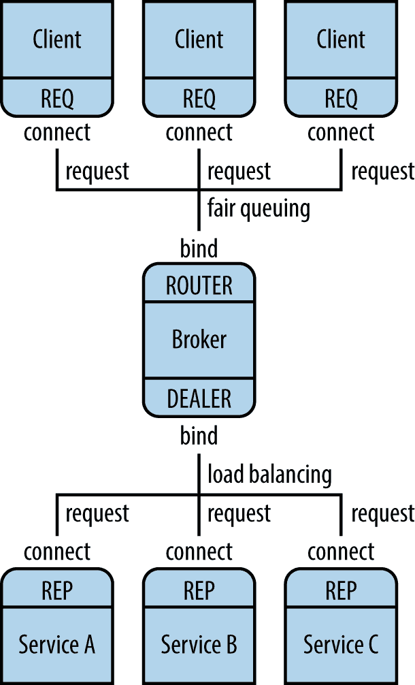

# 第十七章：空间中的数据：网络

> 时间是自然使一切都不同时发生的方式。空间则是防止一切同时发生于我身上的东西。
> 
> [关于时间的引语](http://bit.ly/wiki-time)

在 第十五章 中，您了解了 *并发性*：如何同时做多件事情。现在我们将尝试在多个地方做事情：*分布式计算* 或 *网络*。有许多充分的理由来挑战时间和空间：

性能

您的目标是保持快速组件繁忙，而不是等待慢组件。

鲁棒性

数量越多越安全，因此您希望复制任务以解决硬件和软件故障。

简洁性

最佳实践是将复杂的任务分解成许多更容易创建、理解和修复的小任务。

可伸缩性

增加服务器以处理负载，减少以节省成本。

在本章中，我们从网络基元向更高级别的概念发展。让我们从 TCP/IP 和套接字开始。

# TCP/IP

互联网基于关于如何建立连接、交换数据、终止连接、处理超时等规则。这些被称为 *协议*，它们按层次排列。层次的目的是允许创新和以不同方式做事情的替代方式；只要您在处理上层和下层约定时遵循惯例，您可以在任何一层上做任何您想做的事情。

最低层次管理诸如电信号等方面；每个更高的层次都建立在下面的层次之上。中间差不多是 IP（Internet Protocol）层，它指定网络位置的寻址方式以及*数据包*（数据块）的流动方式。在其上一层，有两个协议描述如何在位置之间传递字节：

UDP（用户数据报协议）

这用于短期交流。*数据报* 是一种以单次传送为单位的微小消息，就像明信片上的便签。

TCP（传输控制协议）

这个协议用于持久连接。它发送字节*流*，确保它们按顺序到达且不重复。

UDP 消息不会收到确认，因此你永远不确定它们是否到达目的地。如果你想通过 UDP 讲笑话：

```py
Here's a UDP joke. Get it?
```

TCP 在发送方和接收方之间建立秘密握手以确保良好的连接。一个 TCP 笑话会以这样开始：

```py
Do you want to hear a TCP joke?
Yes, I want to hear a TCP joke.
Okay, I'll tell you a TCP joke.
Okay, I'll hear a TCP joke.
Okay, I'll send you a TCP joke now.
Okay, I'll receive the TCP joke now.
... (and so on)
```

您的本地机器始终具有 IP 地址 `127.0.0.1` 和名称 `localhost`。您可能会看到这被称为 *环回接口*。如果连接到互联网，您的机器还将有一个 *公共* IP。如果您只是使用家用计算机，则它位于诸如电缆调制解调器或路由器等设备之后。您可以在同一台机器上的进程之间运行互联网协议。

我们与之交互的大多数互联网——网页、数据库服务器等——都是基于 TCP 协议运行在 IP 协议之上的；简称 TCP/IP。让我们先看一些基本的互联网服务。之后，我们探索通用的网络模式。

## 套接字

如果你想知道事情是如何工作的，一直到底层，这一部分是为你准备的。

网络编程的最底层使用了一个*socket*，从 C 语言和 Unix 操作系统中借用而来。套接字级别的编码很繁琐。使用像 ZeroMQ 这样的东西会更有趣，但看到底层是很有用的。例如，当发生网络错误时，关于套接字的消息经常出现。

让我们编写一个非常简单的客户端-服务器交换，一次使用 UDP，一次使用 TCP。在 UDP 示例中，客户端将字符串发送到服务器的 UDP 数据报中，服务器返回一个包含字符串的数据包。服务器需要在特定地址和端口上监听，就像一个邮局和一个邮箱一样。客户端需要知道这两个值以便发送消息并接收任何回复。

在以下客户端和服务器代码中，`address`是一个元组（*地址*，*端口*）。`address`是一个字符串，可以是名称或*IP 地址*。当你的程序只是在同一台机器上相互交流时，你可以使用名称`'localhost'`或等效的地址字符串`'127.0.0.1'`。

首先，让我们从一个进程向另一个进程发送一些数据，并将一些数据返回给发送者。第一个程序是客户端，第二个是服务器。在每个程序中，我们打印时间并打开一个套接字。服务器将监听其套接字的连接，客户端将写入其套接字，该套接字将向服务器传输一条消息。

示例 17-1 呈现了第一个程序，*udp_server.py*。

##### 示例 17-1。udp_server.py

```py
from datetime import datetime
import socket

server_address = ('localhost', 6789)
max_size = 4096

print('Starting the server at', datetime.now())
print('Waiting for a client to call.')
server = socket.socket(socket.AF_INET, socket.SOCK_DGRAM)
server.bind(server_address)

data, client = server.recvfrom(max_size)

print('At', datetime.now(), client, 'said', data)
server.sendto(b'Are you talking to me?', client)
server.close()
```

服务器必须通过从`socket`包导入的两种方法来设置网络。第一个方法，`socket.socket`，创建一个套接字，第二个方法，`bind`，*绑定*到它（监听到达该 IP 地址和端口的任何数据）。`AF_INET`表示我们将创建一个 IP 套接字。（还有另一种类型的*Unix 域套接字*，但这些仅在本地机器上工作。）`SOCK_DGRAM`表示我们将发送和接收数据报，换句话说，我们将使用 UDP。

此时，服务器坐在那里等待数据报的到来（`recvfrom`）。当数据报到达时，服务器将唤醒并获取数据以及关于客户端的信息。`client`变量包含了到达客户端所需的地址和端口组合。服务器最后通过发送回复并关闭连接来结束。

让我们看一下*udp_client.py*（示例 17-2）。

##### 示例 17-2。udp_client.py

```py
import socket
from datetime import datetime

server_address = ('localhost', 6789)
max_size = 4096

print('Starting the client at', datetime.now())
client = socket.socket(socket.AF_INET, socket.SOCK_DGRAM)
client.sendto(b'Hey!', server_address)
data, server = client.recvfrom(max_size)
print('At', datetime.now(), server, 'said', data)
client.close()
```

客户端有大部分与服务器相同的方法（除了`bind()`）。客户端先发送再接收，而服务器先接收。

首先，在它自己的窗口中启动服务器。它将打印问候语，然后静静地等待，直到客户端发送一些数据：

```py
$ python udp_server.py
Starting the server at 2014-02-05 21:17:41.945649
Waiting for a client to call.
```

接下来，在另一个窗口中启动客户端。它将打印问候语，向服务器发送数据（字节值为`'Hey'`），打印回复，然后退出：

```py
$ python udp_client.py
Starting the client at 2014-02-05 21:24:56.509682
At 2014-02-05 21:24:56.518670 ('127.0.0.1', 6789) said b'Are you talking to me?'
```

最后，服务器将打印接收到的消息，并退出：

```py
At 2014-02-05 21:24:56.518473 ('127.0.0.1', 56267) said b'Hey!'
```

客户端需要知道服务器的地址和端口号，但不需要为自己指定端口号。系统会自动分配端口号——在这种情况下是 `56267`。

###### 注意

UDP 以单个数据块发送数据。它不保证传递。如果通过 UDP 发送多个消息，它们可能无序到达，或者根本不到达。UDP 快速、轻便、无连接且不可靠。UDP 在需要快速推送数据包并且可以偶尔容忍丢失数据包的情况下非常有用，比如 VoIP（互联网电话）。

这让我们来谈谈 TCP（传输控制协议）。TCP 用于更长时间的连接，比如 Web。TCP 按照发送顺序传递数据。如果出现任何问题，它会尝试重新发送。这使得 TCP 比 UDP 稍慢，但通常在需要所有数据包按正确顺序到达时更可靠。

###### 注意

Web 协议 HTTP 的前两个版本基于 TCP，但 HTTP/3 基于一个称为 [QUIC](https://oreil.ly/Y3Jym) 的协议，QUIC 本身使用 UDP。因此，在 UDP 和 TCP 之间选择可能涉及许多因素。

让我们使用 TCP 从客户端到服务器再返回射击几个数据包。

*tcp_client.py* 的行为类似于之前的 UDP 客户端，只向服务器发送一个字符串，但套接字调用中有小差异，示例 17-3 中有所说明。

##### 示例 17-3\. tcp_client.py

```py
import socket
from datetime import datetime

address = ('localhost', 6789)
max_size = 1000

print('Starting the client at', datetime.now())
client = socket.socket(socket.AF_INET, socket.SOCK_STREAM)
client.connect(address)
client.sendall(b'Hey!')
data = client.recv(max_size)
print('At', datetime.now(), 'someone replied', data)
client.close()
```

我们已经用 `SOCK_STREAM` 替换了 `SOCK_DGRAM` 以获取流协议 TCP。我们还添加了一个 `connect()` 调用来建立流。我们在 UDP 中不需要这样做，因为每个数据报都是独立的，存在于广阔而不受控制的互联网上。

正如示例 17-4 所示，*tcp_server.py* 与其 UDP 表兄弟也有所不同。

##### 示例 17-4\. tcp_server.py

```py
from datetime import datetime
import socket

address = ('localhost', 6789)
max_size = 1000

print('Starting the server at', datetime.now())
print('Waiting for a client to call.')
server = socket.socket(socket.AF_INET, socket.SOCK_STREAM)
server.bind(address)
server.listen(5)

client, addr = server.accept()
data = client.recv(max_size)

print('At', datetime.now(), client, 'said', data)
client.sendall(b'Are you talking to me?')
client.close()
server.close()
```

`server.listen(5)` 被配置为在拒绝新连接之前排队最多五个客户端连接。`server.accept()` 获取到达的第一个可用消息。

`client.recv(1000)` 设置了最大可接受消息长度为 1,000 字节。

就像之前一样，先启动服务器，然后启动客户端，看看有趣的事情发生了。首先是服务器：

```py
$ python tcp_server.py
Starting the server at 2014-02-06 22:45:13.306971
Waiting for a client to call.
At 2014-02-06 22:45:16.048865 <socket.socket object, fd=6, family=2, type=1,
    proto=0> said b'Hey!'
```

现在，启动客户端。它会将消息发送到服务器，接收响应，然后退出：

```py
$ python tcp_client.py
Starting the client at 2014-02-06 22:45:16.038642
At 2014-02-06 22:45:16.049078 someone replied b'Are you talking to me?'
```

服务器收集消息，打印消息，响应消息，然后退出：

```py
At 2014-02-06 22:45:16.048865 <socket.socket object, fd=6, family=2, type=1,
    proto=0> said b'Hey!'
```

注意到 TCP 服务器调用了 `client.sendall()` 来响应，而之前的 UDP 服务器调用了 `client.sendto()`。TCP 在多次套接字调用中维护客户端-服务器连接，并记住客户端的 IP 地址。

这看起来还不错，但如果你尝试写更复杂的内容，你会看到套接字在低层真正的操作方式：

+   UDP 发送消息，但其大小受限且不能保证到达目的地。

+   TCP 发送字节流，而不是消息。你不知道系统在每次调用中会发送或接收多少字节。

+   要使用 TCP 交换整个消息，您需要一些额外的信息来从其段重新组装完整消息：固定的消息大小（字节），或完整消息的大小，或一些分隔字符。

+   因为消息是字节而不是 Unicode 文本字符串，所以您需要使用 Python 的`bytes`类型。有关更多信息，请参阅第十二章。

在这一切之后，如果你对套接字编程感兴趣，请查看 Python 套接字编程[HOWTO](http://bit.ly/socket-howto)获取更多详细信息。

## Scapy

有时候你需要深入网络流并观察数据字节的传递。您可能需要调试 Web API 或追踪某些安全问题。`scapy`库和程序提供了一个领域特定语言，用于在 Python 中创建和检查数据包，这比编写和调试等效的 C 程序要容易得多。

标准安装使用`pip install scapy`。[文档](https://scapy.readthedocs.io)非常详尽。如果您使用`tcpdump`或`wireshark`等工具来调查 TCP 问题，您应该查看`scapy`。最后，请不要将`scapy`与`scrapy`混淆，后者在“爬取和抓取”中有介绍。

## Netcat

另一个测试网络和端口的工具是[Netcat](https://oreil.ly/K37H2)，通常缩写为`nc`。这里有一个连接到谷歌网站的 HTTP 示例，并请求其主页的一些基本信息：

```py
$ $ nc www.google.com 80
HEAD / HTTP/1.1

HTTP/1.1 200 OK
Date: Sat, 27 Jul 2019 21:04:02 GMT
...

```

在下一章中，有一个示例使用“使用 telnet 进行测试”来做同样的事情。

# 网络模式

您可以从一些基本模式构建网络应用程序：

+   最常见的模式是*请求*-*回复*，也称为*请求*-*响应*或*客户端*-*服务器*。这种模式是同步的：客户端等待服务器响应。在本书中您已经看到了许多请求-响应的例子。您的 Web 浏览器也是一个客户端，向 Web 服务器发送 HTTP 请求，后者返回一个响应。

+   另一种常见模式是*推送*或*扇出*：您将数据发送到进程池中的任何可用工作进程。一个例子是负载均衡器后面的 Web 服务器。

+   推送的反义是*拉取*或*扇入*：您从一个或多个来源接受数据。一个例子是一个日志记录器，它从多个进程接收文本消息并将它们写入单个日志文件。

+   一种模式类似于广播电台或电视广播：*发布*-*订阅*，或*pub*-*sub*。使用此模式，发布者发送数据。在简单的发布-订阅系统中，所有订阅者都会收到一份副本。更常见的是，订阅者可以指示他们仅对某些类型的数据感兴趣（通常称为*主题*），发布者将仅发送这些数据。因此，与推送模式不同，可能会有多个订阅者收到给定数据。如果没有主题的订阅者，则数据将被忽略。

让我们展示一些请求-响应的例子，稍后再展示一些发布-订阅的例子。

# 请求-响应模式

这是最熟悉的模式。您可以从适当的服务器请求 DNS、Web 或电子邮件数据，它们会回复，或告诉您是否有问题。

我刚刚向你展示了如何使用 UDP 或 TCP 进行一些基本的请求，但在套接字级别上构建网络应用程序很难。让我们看看 ZeroMQ 是否可以帮助解决这个问题。

## ZeroMQ

ZeroMQ 是一个库，不是一个服务器。有时被描述为*增强版套接字*，ZeroMQ 套接字执行的是您预期普通套接字能够执行的操作：

+   交换整个消息

+   重试连接

+   缓冲数据以在发件人和接收者之间的时间不匹配时保护它们

[在线指南](http://zguide.zeromq.org)写得很好，富有幽默感，并且它提供了我见过的最佳网络模式描述。印刷版（*ZeroMQ: Messaging for Many Applications*，作者 Pieter Hintjens，出版商是 O'Reilly，上面有一条大鱼）有着良好的代码质量，但不是反过来。印刷指南中的所有示例都是用 C 语言编写的，但在线版本可以让您为每个代码示例选择多种语言，Python 的[示例也可以查看](http://bit.ly/zeromq-py)。在本章中，我将向您展示一些基本的请求-回复 ZeroMQ 示例。

ZeroMQ 就像一个乐高积木套件，我们都知道您可以从几个乐高形状构建出各种惊人的东西。在这种情况下，您从几种套接字类型和模式构建网络。以下列出的基本“乐高积木”是 ZeroMQ 套接字类型，出于某种巧合，它们看起来像我们已经讨论过的网络模式：

+   REQ（同步请求）

+   REP（同步回复）

+   DEALER（异步请求）

+   ROUTER（异步回复）

+   PUB（发布）

+   SUB（订阅）

+   PUSH（扇出）

+   PULL（汇聚）

要自己尝试这些内容，您需要通过输入以下命令安装 Python ZeroMQ 库：

```py
$ pip install pyzmq
```

最简单的模式是一个单一的请求-回复对。这是同步的：一个套接字发送请求，然后另一个套接字回复。首先是回复（服务器）的代码，*zmq_server.py*，如示例 17-5 所示。

##### 示例 17-5\. zmq_server.py

```py
import zmq

host = '127.0.0.1'
port = 6789
context = zmq.Context()
server = context.socket(zmq.REP)
server.bind("tcp://%s:%s" % (host, port))
while True:
    #  Wait for next request from client
    request_bytes = server.recv()
    request_str = request_bytes.decode('utf-8')
    print("That voice in my head says: %s" % request_str)
    reply_str = "Stop saying: %s" % request_str
    reply_bytes = bytes(reply_str, 'utf-8')
    server.send(reply_bytes)
```

我们创建一个`Context`对象：这是一个维护状态的 ZeroMQ 对象。然后，我们创建一个类型为`REP`（代表回复）的 ZeroMQ`socket`。我们调用`bind()`方法使其监听特定的 IP 地址和端口。请注意，它们以字符串形式指定，如`'tcp://localhost:6789'`，而不是像普通套接字示例中的元组。

此示例保持接收来自发送方的请求并发送响应。消息可能非常长，但 ZeroMQ 会处理这些细节。

示例 17-6 展示了相应请求（客户端）的代码，*zmq_client.py*。其类型为`REQ`（代表请求），并调用了`connect()`而不是`bind()`。

##### 示例 17-6\. zmq_client.py

```py
import zmq

host = '127.0.0.1'
port = 6789
context = zmq.Context()
client = context.socket(zmq.REQ)
client.connect("tcp://%s:%s" % (host, port))
for num in range(1, 6):
    request_str = "message #%s" % num
    request_bytes = request_str.encode('utf-8')
    client.send(request_bytes)
    reply_bytes = client.recv()
    reply_str = reply_bytes.decode('utf-8')
    print("Sent %s, received %s" % (request_str, reply_str))
```

现在是时候启动它们了。与普通套接字示例的一个有趣区别是，你可以按任意顺序启动服务器和客户端。请在一个窗口后台启动服务器：

```py
$ python zmq_server.py &
```

在同一窗口中启动客户端：

```py
$ python zmq_client.py
```

你会看到客户端和服务器交替输出的这些行：

```py
That voice in my head says 'message #1'
Sent 'message #1', received 'Stop saying message #1'
That voice in my head says 'message #2'
Sent 'message #2', received 'Stop saying message #2'
That voice in my head says 'message #3'
Sent 'message #3', received 'Stop saying message #3'
That voice in my head says 'message #4'
Sent 'message #4', received 'Stop saying message #4'
That voice in my head says 'message #5'
Sent 'message #5', received 'Stop saying message #5'
```

我们的客户端在发送其第五条消息后结束，但我们没有告诉服务器退出，所以它仍然在等待另一条消息。如果您再次运行客户端，它将打印相同的五行，服务器也会打印它的五行。如果您不终止 *zmq_server.py* 进程并尝试运行另一个，Python 将投诉地址已经在使用中。

```py
$ python zmq_server.py
```

```py
[2] 356
Traceback (most recent call last):
  File "zmq_server.py", line 7, in <module>
    server.bind("tcp://%s:%s" % (host, port))
  File "socket.pyx", line 444, in zmq.backend.cython.socket.Socket.bind
      (zmq/backend/cython/socket.c:4076)
  File "checkrc.pxd", line 21, in zmq.backend.cython.checkrc._check_rc
      (zmq/backend/cython/socket.c:6032)
zmq.error.ZMQError: Address already in use
```

消息需要以字节字符串形式发送，因此我们以 UTF-8 格式对示例的文本字符串进行了编码。您可以发送任何类型的消息，只要将其转换为 `bytes`。我们使用简单的文本字符串作为消息的源，因此 `encode()` 和 `decode()` 足以进行字节字符串的转换。如果您的消息具有其他数据类型，可以使用像 [MessagePack](http://msgpack.org) 这样的库。

即使这种基本的 REQ-REP 模式也允许一些花式通信模式，因为任意数量的 REQ clients 可以 `connect()` 到单个 `REP` server。服务器一次处理一个请求，同步地，但不会丢弃同时到达的其他请求。ZeroMQ 缓冲消息，直到它们能够通过，这是它名字中 Q 的来源。Q 代表队列，M 代表消息，而 Zero 意味着不需要任何代理。

虽然 ZeroMQ 不强制使用任何中央代理（中介），但可以在需要时构建它们。例如，使用 DEALER 和 ROUTER sockets 异步连接多个源和/或目的地。

多个 REQ sockets 连接到单个 ROUTER，后者将每个请求传递给 DEALER，然后再联系连接到它的任何 REP sockets（Figure 17-1）。这类似于一堆浏览器联系位于 web 服务器群前面的代理服务器。它允许您根据需要添加多个客户端和服务器。

REQ sockets 只连接到 ROUTER socket；DEALER 则连接到它后面的多个 REP sockets。ZeroMQ 处理繁琐的细节，确保请求负载平衡，并且确保回复返回到正确的地方。

另一个网络模式称为*ventilator*，使用 PUSH sockets 分发异步任务，并使用 PULL sockets 收集结果。

ZeroMQ 的最后一个显著特点是，通过在创建时改变套接字的连接类型，它可以进行*上下*的扩展：

+   `tcp` 是在一台或多台机器上进程之间的通信方式。

+   `ipc` 是在同一台机器上进程之间的通信方式。

+   `inproc` 是单个进程内线程之间的通信方式。

最后一个，`inproc`，是一种在不使用锁的情况下在线程之间传递数据的方式，也是在“Threads”中 `threading` 示例的替代方式。



###### 图 17-1\. 使用经纪人连接多个客户端和服务

使用了 ZeroMQ 后，您可能不再想编写原始套接字代码。

## 其他消息传递工具

ZeroMQ 绝对不是 Python 支持的唯一消息传递库。消息传递是网络中最流行的概念之一，而 Python 与其他语言保持同步：

+   Apache 项目，我们在“Apache”中看到其 Web 服务器，还维护 [ActiveMQ](https://activemq.apache.org) 项目，包括使用简单文本 [STOMP](https://oreil.ly/a3h_M) 协议的几个 Python 接口。

+   [RabbitMQ](http://www.rabbitmq.com) 也很受欢迎，它有有用的在线 Python [教程](http://bit.ly/rabbitmq-tut)。

+   [NATS](http://www.nats.io) 是一个快速的消息系统，使用 Go 编写。

# 发布-订阅模式

发布-订阅不是队列，而是广播。一个或多个进程发布消息。每个订阅进程指示它想接收哪些类型的消息。每条消息的副本都发送给与其类型匹配的每个订阅者。因此，给定消息可能会被处理一次，多次或根本不处理。就像一个孤独的无线电操作员一样，每个发布者只是广播，并不知道谁在听。

## Redis

在第十六章中，您已经看过 Redis，主要作为数据结构服务器，但它也包含发布-订阅系统。发布者通过主题和值发送消息，订阅者指定它们想要接收的主题。

示例 17-7 包含一个发布者，*redis_pub.py*。

##### 示例 17-7\. redis_pub.py

```py
import redis
import random

conn = redis.Redis()
cats = ['siamese', 'persian', 'maine coon', 'norwegian forest']
hats = ['stovepipe', 'bowler', 'tam-o-shanter', 'fedora']
for msg in range(10):
    cat = random.choice(cats)
    hat = random.choice(hats)
    print('Publish: %s wears a %s' % (cat, hat))
    conn.publish(cat, hat)
```

每个主题都是一种猫的品种，伴随的消息是一种帽子的类型。

示例 17-8 展示了一个单一的订阅者，*redis_sub.py*。

##### 示例 17-8\. redis_sub.py

```py
import redis
conn = redis.Redis()

topics = ['maine coon', 'persian']
sub = conn.pubsub()
sub.subscribe(topics)
for msg in sub.listen():
    if msg['type'] == 'message':
        cat = msg['channel']
        hat = msg['data']
        print('Subscribe: %s wears a %s' % (cat, hat))
```

此订阅者希望接收所有 `'maine coon'` 和 `'persian'` 类型的消息，而不是其他类型。`listen()` 方法返回一个字典。如果其类型是 `'message'`，则它是由发布者发送并符合我们的标准。 `'channel'` 键是主题（猫），`'data'` 键包含消息（帽子）。

如果您先启动发布者而没有人在监听，就像一位哑剧艺术家在森林中倒下（他会发出声音吗？），所以先启动订阅者：

```py
$ python redis_sub.py
```

接下来启动发布者。它会发送 10 条消息然后退出：

```py
$ python redis_pub.py
Publish: maine coon wears a stovepipe
Publish: norwegian forest wears a stovepipe
Publish: norwegian forest wears a tam-o-shanter
Publish: maine coon wears a bowler
Publish: siamese wears a stovepipe
Publish: norwegian forest wears a tam-o-shanter
Publish: maine coon wears a bowler
Publish: persian wears a bowler
Publish: norwegian forest wears a bowler
Publish: maine coon wears a stovepipe
```

订阅者只关心两种类型的猫：

```py
$ python redis_sub.py
Subscribe: maine coon wears a stovepipe
Subscribe: maine coon wears a bowler
Subscribe: maine coon wears a bowler
Subscribe: persian wears a bowler
Subscribe: maine coon wears a stovepipe
```

我们没有告诉订阅者退出，所以它仍在等待消息。如果重新启动发布者，订阅者将抓取更多消息并打印它们。

您可以拥有任意数量的订阅者（和发布者）。如果没有消息的订阅者，消息会从 Redis 服务器中消失。但是，如果有订阅者，消息会一直留在服务器中，直到所有订阅者都检索到它们。

## ZeroMQ

ZeroMQ 没有中央服务器，因此每个发布者都向所有订阅者写入。发布者 *zmq_pub.py* 提供在示例 17-9。

##### 示例 17-9\. zmq_pub.py

```py
import zmq
import random
import time
host = '*'
port = 6789
ctx = zmq.Context()
pub = ctx.socket(zmq.PUB)
pub.bind('tcp://%s:%s' % (host, port))
cats = ['siamese', 'persian', 'maine coon', 'norwegian forest']
hats = ['stovepipe', 'bowler', 'tam-o-shanter', 'fedora']
time.sleep(1)
for msg in range(10):
    cat = random.choice(cats)
    cat_bytes = cat.encode('utf-8')
    hat = random.choice(hats)
    hat_bytes = hat.encode('utf-8')
    print('Publish: %s wears a %s' % (cat, hat))
    pub.send_multipart([cat_bytes, hat_bytes])
```

请注意，此代码如何使用 UTF-8 编码来处理主题和值字符串。

订阅者的文件名为 *zmq_sub.py*（例 17-10）。

##### 例 17-10\. zmq_sub.py

```py
import zmq
host = '127.0.0.1'
port = 6789
ctx = zmq.Context()
sub = ctx.socket(zmq.SUB)
sub.connect('tcp://%s:%s' % (host, port))
topics = ['maine coon', 'persian']
for topic in topics:
    sub.setsockopt(zmq.SUBSCRIBE, topic.encode('utf-8'))
while True:
    cat_bytes, hat_bytes = sub.recv_multipart()
    cat = cat_bytes.decode('utf-8')
    hat = hat_bytes.decode('utf-8')
    print('Subscribe: %s wears a %s' % (cat, hat))
```

在此代码中，我们订阅了两个不同的字节值：`topics` 中的两个字符串，编码为 UTF-8。

###### 注意

看起来有点反向，但如果您想订阅 *所有* 主题，则需要订阅空字节字符串 `b''`；如果不这样做，您将一无所获。

请注意，在发布者中我们称之为 `send_multipart()`，而在订阅者中称之为 `recv_multipart()`。这使我们能够发送多部分消息并将第一部分用作主题。我们也可以将主题和消息作为单个字符串或字节字符串发送，但将它们分开看起来更清晰。

启动订阅者：

```py
$ python zmq_sub.py
```

启动发布者。它立即发送 10 条消息然后退出：

```py
$ python zmq_pub.py
Publish: norwegian forest wears a stovepipe
Publish: siamese wears a bowler
Publish: persian wears a stovepipe
Publish: norwegian forest wears a fedora
Publish: maine coon wears a tam-o-shanter
Publish: maine coon wears a stovepipe
Publish: persian wears a stovepipe
Publish: norwegian forest wears a fedora
Publish: norwegian forest wears a bowler
Publish: maine coon wears a bowler
```

订阅者打印其请求和接收的内容：

```py
Subscribe: persian wears a stovepipe
Subscribe: maine coon wears a tam-o-shanter
Subscribe: maine coon wears a stovepipe
Subscribe: persian wears a stovepipe
Subscribe: maine coon wears a bowler
```

## 其他 Pub-Sub 工具

您可能希望探索一些其他 Python 发布-订阅链接：

+   RabbitMQ 是一个著名的消息代理，`pika` 是其 Python API。参见 [pika 文档](http://pika.readthedocs.org) 和 [发布-订阅教程](http://bit.ly/pub-sub-tut)。

+   转到 [PyPi](https://pypi.python.org) 搜索窗口，并键入 `pubsub` 以查找类似 [`pypubsub`](http://pubsub.sourceforge.net) 的 Python 包。

+   [PubSubHubbub](https://code.google.com/p/pubsubhubbub) 允许订阅者向发布者注册回调。

+   [NATS](https://nats.io) 是一个快速、开源的消息系统，支持发布-订阅、请求-响应和排队。

# 互联网服务

Python 拥有广泛的网络工具集。在接下来的几节中，我们将探讨如何自动化一些最流行的互联网服务。官方、全面的 [文档](http://bit.ly/py-internet) 在线可用。

## 域名系统

计算机具有如 `85.2.101.94` 这样的数字 IP 地址，但我们更容易记住名称而不是数字。域名系统（DNS）是一个关键的互联网服务，通过分布式数据库将 IP 地址与名称相互转换。每当您在使用 Web 浏览器时突然看到“looking up host”这样的消息时，您可能已经失去了互联网连接，而您的第一个线索是 DNS 失败。

一些 DNS 功能可以在低级别的 `socket` 模块中找到。`gethostbyname()` 返回域名的 IP 地址，而扩展版的 `gethostbyname_ex()` 返回名称、备用名称列表和地址列表：

```py
>>> import socket
>>> socket.gethostbyname('www.crappytaxidermy.com')
'66.6.44.4'
>>> socket.gethostbyname_ex('www.crappytaxidermy.com')
('crappytaxidermy.com', ['www.crappytaxidermy.com'], ['66.6.44.4'])
```

`getaddrinfo()` 方法查找 IP 地址，但它还返回足够的信息以创建一个连接到该地址的套接字：

```py
>>> socket.getaddrinfo('www.crappytaxidermy.com', 80)
[(2, 2, 17, '', ('66.6.44.4', 80)),
(2, 1, 6, '', ('66.6.44.4', 80))]
```

前面的调用返回了两个元组：第一个用于 UDP，第二个用于 TCP（`2, 1, 6` 中的 `6` 是 TCP 的值）。

您可以仅请求 TCP 或 UDP 信息：

```py
>>> socket.getaddrinfo('www.crappytaxidermy.com', 80, socket.AF_INET,
socket.SOCK_STREAM)
[(2, 1, 6, '', ('66.6.44.4', 80))]
```

一些 [TCP 和 UDP 端口号](http://bit.ly/tcp-udp-ports) 由 IANA 保留，并与服务名称相关联。例如，HTTP 被命名为 `http` 并分配给 TCP 端口 80。

这些函数在服务名称和端口号之间进行转换：

```py
>>> import socket
>>> socket.getservbyname('http')
80
>>> socket.getservbyport(80)
'http'
```

## Python 电子邮件模块

标准库包含以下电子邮件模块：

+   [`smtplib`](https://oreil.ly/_kF6V) 用于通过简单邮件传输协议 (SMTP) 发送电子邮件消息

+   [`email`](https://oreil.ly/WVGbE) 用于创建和解析电子邮件消息

+   [`poplib`](https://oreil.ly/xiJT7) 用于通过邮局协议 3 (POP3) 读取电子邮件

+   [`imaplib`](https://oreil.ly/wengo) 用于通过互联网消息访问协议 (IMAP) 读取电子邮件

如果你想编写自己的 Python SMTP 服务器，请尝试[`smtpd`](https://oreil.ly/JkLsD)，或者新的异步版本[`aiosmtpd`](https://aiosmtpd.readthedocs.io)。

## 其他协议

使用标准的[`ftplib` 模块](http://bit.ly/py-ftplib)，你可以通过文件传输协议 (FTP) 传输字节。尽管这是一个老协议，FTP 仍然表现非常好。

你在本书的多个地方看到了这些模块，但也尝试一下标准库支持的[互联网协议](http://bit.ly/py-internet)的文档。

# Web 服务和 API

信息提供者总是有网站，但这些网站面向的是人类眼睛，而不是自动化。如果数据仅在网站上发布，任何想要访问和结构化数据的人都需要编写爬虫（如“爬取和解析”中所示），并在页面格式更改时重新编写。这通常很乏味。相比之下，如果一个网站提供其数据的 API，数据就可以直接提供给客户端程序。API 的更改频率比网页布局低，因此客户端重写较少。一个快速、清晰的数据管道也使得构建未曾预见但有用的组合更加容易。

在许多方面，最简单的 API 是一个 Web 接口，但提供的数据是结构化格式，如 JSON 或 XML，而不是纯文本或 HTML。API 可能很简单，也可能是完整的 RESTful API（在“Web API 和 REST”中定义），但它为这些不安静的字节提供了另一个出口。

在本书的开头，你看到了一个 Web API 查询互联网档案馆以获取旧网站的副本。

API 尤其适用于挖掘像 Twitter、Facebook 和 LinkedIn 这样的知名社交媒体网站。所有这些网站都提供免费使用的 API，但需要注册并获取一个密钥（一个长生成的文本字符串，有时也称为*令牌*）以在连接时使用。密钥使得网站能够确定谁在访问其数据。它还可以作为限制请求流量到服务器的一种方式。

这里有一些有趣的服务 API：

+   [纽约时报](http://developer.nytimes.com)

+   [Twitter](https://python-twitter.readthedocs.io)

+   [Facebook](https://developers.facebook.com/tools)

+   [Weather Underground](http://www.wunderground.com/weather/api)

+   [漫威漫画](http://developer.marvel.com)

你可以在第二十一章看到地图 API 的示例，以及在第二十二章看到其他内容。

# 数据序列化

如你在 第十六章 中看到的，像 XML、JSON 和 YAML 这样的格式是存储结构化文本数据的方式。网络应用程序需要与其他程序交换数据。在内存中和“在传输线上”之间的数据转换称为 *序列化* 或 *编组*。JSON 是一种流行的序列化格式，特别适用于 Web RESTful 系统，但它不能直接表示所有 Python 数据类型。另外，作为文本格式，它往往比某些二进制序列化方法更冗长。让我们看看一些你可能会遇到的方法。

## 使用 pickle 进行序列化

Python 提供了 `pickle` 模块来保存和恢复任何对象到一个特殊的二进制格式。

还记得 JSON 在遇到 `datetime` 对象时变得混乱吗？对于 `pickle` 来说不是问题：

```py
>>> import pickle
>>> import datetime
>>> now1 = datetime.datetime.utcnow()
>>> pickled = pickle.dumps(now1)
>>> now2 = pickle.loads(pickled)
>>> now1
datetime.datetime(2014, 6, 22, 23, 24, 19, 195722)
>>> now2
datetime.datetime(2014, 6, 22, 23, 24, 19, 195722)
```

`pickle` 也可以处理你自己定义的类和对象。让我们定义一个叫做 `Tiny` 的小类，在被当作字符串处理时返回字符串 `'tiny'`：

```py
>>> import pickle
>>> class Tiny():
...     def __str__(self):
...        return 'tiny'
...
>>> obj1 = Tiny()
>>> obj1
<__main__.Tiny object at 0x10076ed10>
>>> str(obj1)
'tiny'
>>> pickled = pickle.dumps(obj1)
>>> pickled
b'\x80\x03c__main__\nTiny\nq\x00)\x81q\x01.'
>>> obj2 = pickle.loads(pickled)
>>> obj2
<__main__.Tiny object at 0x10076e550>
>>> str(obj2)
'tiny'
```

`pickled` 是从对象 `obj1` 制作的 pickled 二进制字符串。我们将其转换回对象 `obj2` 来复制 `obj1`。使用 `dump()` 将 pickle 到文件，使用 `load()` 从文件中反序列化。

`multiprocessing` 模块使用 `pickle` 在进程之间交换数据。

如果 `pickle` 无法序列化你的数据格式，一个更新的第三方包叫做 [`dill`](https://pypi.org/project/dill) 可能会有所帮助。

###### 注意

因为 `pickle` 可以创建 Python 对象，所以同样适用于之前讨论过的安全警告。公共服务公告：不要反序列化你不信任的内容。

## 其他序列化格式

这些二进制数据交换格式通常比 XML 或 JSON 更紧凑且更快：

+   [MsgPack](http://msgpack.org)

+   [Protocol Buffers](https://code.google.com/p/protobuf)

+   [Avro](http://avro.apache.org/docs/current)

+   [Thrift](http://thrift.apache.org)

+   [Lima](https://lima.readthedocs.io)

+   [`Serialize`](https://pypi.org/project/Serialize) 是一个 Python 前端，支持 JSON、YAML、pickle 和 MsgPack 等其他格式。

+   [各种 Python 序列化包的基准](https://oreil.ly/S3ESH)。

因为它们是二进制的，所以无法通过文本编辑器轻松编辑。

一些第三方包可以互相转换对象和基本的 Python 数据类型（允许进一步转换为/从 JSON 等格式），并提供以下的 *验证*：

+   数据类型

+   值范围

+   必需与可选数据

这些包括：

+   [Marshmallow](https://marshmallow.readthedocs.io/en/3.0)

+   [Pydantic](https://pydantic-docs.helpmanual.io)——使用类型提示，因此至少需要 Python 3.6。

+   [TypeSystem](https://www.encode.io/typesystem)

这些通常与 Web 服务器一起使用，以确保通过 HTTP 传输的字节最终进入正确的数据结构以供进一步处理。

# 远程过程调用

远程过程调用（RPC）看起来像是普通的函数，但是在网络上的远程机器上执行。与在 URL 或请求体中编码参数并调用 RESTful API 不同，您在自己的机器上调用 RPC 函数。你的本地机器：

+   将你的函数参数序列化为字节。

+   将编码的字节发送到远程机器。

远程机器：

+   接收编码的请求字节。

+   将字节反序列化回数据结构。

+   找到并调用具有解码数据的服务函数。

+   对函数结果进行编码。

+   将编码的字节发送回调用者。

最后，启动一切的本地机器：

+   解码字节以返回值。

RPC 是一种流行的技术，人们已经用许多方式实现了它。在服务器端，您启动一个服务器程序，将其连接到某些字节传输和编码/解码方法，定义一些服务函数，然后点亮您的*RPC 已开放营业*标志。客户端连接到服务器并通过 RPC 调用其中一个函数。

## XML RPC

标准库包括一个使用 XML 作为交换格式的 RPC 实现：`xmlrpc`。您在服务器上定义和注册函数，客户端调用它们就像它们被导入一样。首先，让我们探索文件*xmlrpc_server.py*，如示例 17-11 所示。

##### 示例 17-11\. xmlrpc_server.py

```py
from xmlrpc.server import SimpleXMLRPCServer

def double(num):
    return num * 2

server = SimpleXMLRPCServer(("localhost", 6789))
server.register_function(double, "double")
server.serve_forever()
```

我们在服务器上提供的函数称为`double()`。它期望一个数字作为参数，并返回该数字乘以 2 的值。服务器在地址和端口上启动。我们需要*注册*函数以使其通过 RPC 对客户端可用。最后，开始服务并继续。

现在——你猜对了——*xmlrpc_client.py*，自豪地呈现在示例 17-12 中。

##### 示例 17-12\. xmlrpc_client.py

```py
import xmlrpc.client

proxy = xmlrpc.client.ServerProxy("http://localhost:6789/")
num = 7
result = proxy.double(num)
print("Double %s is %s" % (num, result))
```

客户端通过使用`ServerProxy()`连接到服务器。然后，它调用函数`proxy.double()`。这是从哪里来的？它是由服务器动态创建的。RPC 机制神奇地将此函数名连接到对远程服务器的调用中。

试一试——启动服务器，然后运行客户端：

```py
$ python xmlrpc_server.py
```

再次运行客户端：

```py
$ python xmlrpc_client.py
Double 7 is 14
```

然后服务器打印如下内容：

```py
127.0.0.1 - - [13/Feb/2014 20:16:23] "POST / HTTP/1.1" 200 -
```

流行的传输方法包括 HTTP 和 ZeroMQ。

## JSON RPC

JSON-RPC（版本[1.0](https://oreil.ly/OklKa)和[2.0](https://oreil.ly/4CS0r)）类似于 XML-RPC，但使用 JSON。有许多 Python JSON-RPC 库，但我找到的最简单的一个分为两部分：[客户端](https://oreil.ly/8npxf)和[服务器端](https://oreil.ly/P_uDr)。

安装这两者都很熟悉：`pip install jsonrpcserver`和`pip install jsonrpclient`。

这些库提供了许多写[客户端](https://oreil.ly/fd412)和[服务器](https://oreil.ly/SINeg)的替代方法。在示例 17-13 和示例 17-14 中，我使用了这个库的内置服务器，它使用端口 5000，是最简单的。

首先，服务器端。

##### 示例 17-13\. jsonrpc_server.py

```py
from jsonrpcserver import method, serve

@method
def double(num):
    return num * 2

if __name__ == "__main__":
    serve()
```

其次，客户端。

##### 示例 17-14\. jsonrpc_client.py

```py
from jsonrpcclient import request

num = 7
response = request("http://localhost:5000", "double", num=num)
print("Double", num, "is", response.data.result)
```

与本章中的大多数客户端-服务器示例一样，首先启动服务器（在其自己的终端窗口中，或者使用后面的`&`将其放入后台），然后运行客户端：

```py
$ python jsonrpc_server.py &
[1] 10621
$ python jsonrpc_client.py
127.0.0.1 - - [23/Jun/2019 15:39:24] "POST / HTTP/1.1" 200 -
Double 7 is 14
```

如果将服务器放入后台，请在完成后将其关闭。

## MessagePack RPC

编码库 MessagePack 有自己的[Python RPC 实现](http://bit.ly/msgpack-rpc)。以下是如何安装它：

```py
$ pip install msgpack-rpc-python
```

这也会安装`tornado`，这是一个 Python 基于事件的 Web 服务器，该库将其用作传输。和往常一样，首先启动服务器（*msgpack_server.py*）（示例 17-15）。

##### 示例 17-15\. msgpack_server.py

```py
from msgpackrpc import Server, Address

class Services():
    def double(self, num):
        return num * 2

server = Server(Services())
server.listen(Address("localhost", 6789))
server.start()
```

`Services`类将其方法公开为 RPC 服务。继续启动客户端，*msgpack_client.py*（示例 17-16）。

##### 示例 17-16\. msgpack_client.py

```py
from msgpackrpc import Client, Address

client = Client(Address("localhost", 6789))
num = 8
result =  client.call('double', num)
print("Double %s is %s" % (num, result))
```

要运行这些，请按照通常的步骤-在单独的终端窗口中启动服务器和客户端¹，并观察结果：

```py
$ python msgpack_server.py
```

```py
$ python msgpack_client.py
Double 8 is 16
```

## Zerorpc

由 Docker 的开发人员（当时被称为 dotCloud）编写，[zerorpc](http://www.zerorpc.io)使用 ZeroMQ 和 MsgPack 连接客户端和服务器。它会将函数神奇地公开为 RPC 端点。

输入`pip install zerorpc`来安装它。示例 17-17 和示例 17-18 中的示例代码显示了一个请求-回复客户端和服务器。

##### 示例 17-17\. zerorpc_server.py

```py
import zerorpc

class RPC():
    def double(self, num):
        return 2 * num

server = zerorpc.Server(RPC())
server.bind("tcp://0.0.0.0:4242")
server.run()
```

##### 示例 17-18\. zerorpc_client.py

```py
import zerorpc

client = zerorpc.Client()
client.connect("tcp://127.0.0.1:4242")
num = 7
result = client.double(num)
print("Double", num, "is", result)
```

客户端调用`client.double()`，即使在其中没有定义：

```py
$ python zerorpc_server &
[1] 55172
$ python zerorpc_client.py
Double 7 is 14
```

该网站有许多其他[示例](https://github.com/0rpc/zerorpc-python)。

## gRPC

谷歌创建了[gRPC](https://grpc.io)，作为一种便捷快速定义和连接服务的方式。它将数据编码为[协议缓冲区](https://oreil.ly/UINlc)。

安装 Python 部分：

```py
$ pip install grpcio
$ pip install grpcio-tools
```

Python 客户端[文档](https://grpc.io/docs/quickstart/python)非常详细，所以这里我只是简要概述。你可能也喜欢这个单独的[教程](https://oreil.ly/awnxO)。

要使用 gRPC，你需要编写一个 *.proto* 文件来定义一个`service`及其`rpc`方法。

一个`rpc`方法类似于一个函数定义（描述其参数和返回类型），并且可以指定以下其中一种网络模式：

+   请求-响应（同步或异步）

+   请求-流式响应

+   流式请求-响应（同步或异步）

+   流式请求-流式响应

单个响应可以是阻塞或异步的。流式响应会被迭代。

接下来，你将运行`grpc_tools.protoc`程序为客户端和服务器创建 Python 代码。gRPC 处理序列化和网络通信；你将应用特定的代码添加到客户端和服务器存根中。

gRPC 是 Web REST API 的顶级替代方案。它似乎比 REST 更适合服务间通信，而 REST 可能更适合公共 API。

## Twirp

[Twirp](https://oreil.ly/buf4x) 类似于 gRPC，但声称更简单。你可以像使用 gRPC 一样定义一个`.proto`文件，twirp 可以生成处理客户端和服务器端的 Python 代码。

# 远程管理工具

+   [`Salt`](http://www.saltstack.com) 是用 Python 编写的。它起初是一种实现远程执行的方法，但发展成为一个完整的系统管理平台。基于 ZeroMQ 而不是 SSH，它可以扩展到数千台服务器。

+   [`Puppet`](http://puppetlabs.com) 和 [`Chef`](http://www.getchef.com/chef) 非常流行，并与 Ruby 密切相关。

+   [`Ansible`](http://www.ansible.com/home) 软件包，像 Salt 一样是用 Python 编写的，也是类似的。它可以免费下载和使用，但支持和一些附加软件包需要商业许可证。它默认使用 SSH，不需要在要管理的机器上安装任何特殊软件。

`Salt` 和 `Ansible` 都是 `Fabric` 的功能超集，处理初始配置、部署和远程执行。

# 大数据

随着谷歌和其他互联网公司的发展，他们发现传统的计算解决方案无法满足需求。对单台机器有效的软件，甚至只是几十台机器，无法跟上数千台机器。

数据库和文件的磁盘存储涉及太多*寻址*，这需要磁盘头的机械移动。（想象一下黑胶唱片，以及将唱针手动从一条曲目移动到另一条曲目所需的时间。再想想当你把它掉得太重时发出的尖叫声，更不用说唱片所有者发出的声音了。）但你可以更快地*流*传统磁盘的连续片段。

开发人员发现，将数据分布式地分析在许多网络化的机器上比在单个机器上更快。他们可以使用听起来简单但实际上在处理海量分布式数据时效果更好的算法。其中之一是 MapReduce，它将计算分布在许多机器上，然后收集结果。这类似于使用队列。

## Hadoop

谷歌在一篇[论文](https://oreil.ly/cla0d)中公布了其 MapReduce 的结果后，雅虎推出了一个名为*Hadoop*的开源基于 Java 的软件包（以主要程序员儿子的毛绒大象玩具命名）。

短语*大数据*适用于这里。通常它只是指“数据太大，无法放在我的机器上”：超过磁盘、内存、CPU 时间或以上所有的数据。对一些组织来说，如果问题中提到了*大数据*，答案总是 Hadoop。Hadoop 在机器之间复制数据，通过*map*（分散）和*reduce*（聚集）程序运行数据，并在每一步将结果保存在磁盘上。

这个批处理过程可能很慢。一个更快的方法叫做*Hadoop streaming*，类似于 Unix 管道，通过程序流式传输数据，而不需要在每一步都写入磁盘。你可以用任何语言编写 Hadoop 流式处理程序，包括 Python。

许多 Python 模块已经为 Hadoop 编写，并且一些在博文[“Python 框架指南”](http://bit.ly/py-hadoop)中有所讨论。以流媒体音乐而闻名的 Spotify，开源了其 Hadoop 流处理的 Python 组件[Luigi](https://github.com/spotify/luigi)。

## Spark

一位名为[Spark](http://bit.ly/about-spark)的竞争对手被设计成比 Hadoop 快 10 到 100 倍。它可以读取和处理任何 Hadoop 数据源和格式。Spark 包括 Python 等语言的 API。你可以在网上找到[安装](http://bit.ly/dl-spark)文档。

## Disco

另一个替代 Hadoop 的选择是[Disco](http://discoproject.org)，它使用 Python 进行 MapReduce 处理，并使用 Erlang 进行通信。不幸的是，你不能用`pip`安装它；请参阅[文档](http://bit.ly/get-disco)。

## Dask

[Dask](https://dask.org)类似于 Spark，尽管它是用 Python 编写的，并且主要与 NumPy、Pandas 和 scikit-learn 等科学 Python 包一起使用。它可以将任务分散到千台机器的集群中。

要获取 Dask 及其所有额外的帮助程序：

```py
$ pip install dask[complete]
```

参见第二十二章，了解*并行编程*的相关示例，其中大型结构化计算分布在许多机器之间。

# Clouds

> 我真的不了解云。
> 
> Joni Mitchell

不久以前，你会购买自己的服务器，将它们安装在数据中心的机架上，并在其上安装各种软件层：操作系统、设备驱动程序、文件系统、数据库、Web 服务器、电子邮件服务器、名称服务器、负载均衡器、监视器等等。任何最初的新奇感都会随着你试图保持多个系统的运行和响应而消失。而且你会持续担心安全问题。

许多托管服务提供了为你管理服务器的服务，但你仍然租用物理设备，并且必须始终支付峰值负载配置的费用。

随着个体机器的增多，故障不再是偶发的：它们非常普遍。你需要横向扩展服务并冗余存储数据。不能假设网络像单一机器一样运行。根据 Peter Deutsch，分布式计算的八个谬误如下：

+   网络是可靠的。

+   延迟是零。

+   带宽是无限的。

+   网络是安全的。

+   拓扑结构不会改变。

+   只有一个管理员。

+   运输成本为零。

+   网络是同质的。

你可以尝试构建这些复杂的分布式系统，但这是一项艰巨的工作，需要不同的工具集。借用一个类比，当你有一小群服务器时，你对待它们像宠物一样——给它们起名字，了解它们的个性，并在需要时照顾它们。但在规模化时，你更像对待牲畜一样对待服务器：它们看起来一样，有编号，有问题就直接更换。

而不是自己搭建，您可以在*云*中租用服务器。通过采用这种模式，维护工作成为了别人的问题，您可以专注于您的服务、博客或者任何您想向世界展示的内容。使用 Web 仪表板和 API，您可以快速轻松地启动具有所需配置的服务器——它们*弹性*。您可以监视它们的状态，并在某些指标超过给定阈值时收到警报。云目前是一个非常热门的话题，企业在云组件上的支出激增。

大型云供应商包括：

+   亚马逊 (AWS)

+   谷歌

+   Microsoft Azure

## 亚马逊网络服务

当亚马逊从数百台服务器增长到数千台、数百万台时，开发人员遇到了所有分布式系统的可怕问题。大约在 2002 年某一天，CEO 杰夫·贝佐斯向亚马逊员工宣布，今后所有数据和功能都必须仅通过网络服务接口公开——而不是文件、数据库或本地函数调用。他们必须设计这些接口，就像它们是向公众提供的一样。备忘录以一句激励人心的话结束：“任何不这样做的人都会被解雇。”

没有什么奇怪的，开发人员开始行动，并随着时间的推移构建了一个庞大的面向服务的架构。他们借鉴或创新了许多解决方案，发展成为[亚马逊网络服务 (AWS)](http://aws.amazon.com)，目前主导市场。官方的 Python AWS 库是 `boto3`：

+   [文档](https://oreil.ly/y2Baz)

+   [SDK](https://aws.amazon.com/sdk-for-python) 页面

使用以下命令安装：

```py
$ pip install boto3
```

您可以使用 `boto3` 作为 AWS 的基于 Web 的管理页面的替代品。

## 谷歌云

谷歌在内部大量使用 Python，并雇佣了一些著名的 Python 开发者（甚至包括 Guido van Rossum 自己）。从其[主页](https://cloud.google.com)和[Python](https://cloud.google.com/python)页面，您可以找到其许多服务的详细信息。

## Microsoft Azure

Microsoft 在其云服务提供中赶上了亚马逊和谷歌，[Azure](https://azure.microsoft.com)。查看[Python on Azure](https://oreil.ly/Yo6Nz)以了解如何开发和部署 Python 应用程序。

## OpenStack

[OpenStack](https://www.openstack.org) 是一个 Python 服务和 REST API 的开源框架。许多服务类似于商业云中的服务。

# Docker

随着一个简单的标准化集装箱彻底改变了国际贸易。仅仅几年前，Docker 将*容器*这个名字和类比应用于使用一些鲜为人知的 Linux 特性的*虚拟化*方法。容器比虚拟机轻得多，比 Python 的虚拟环境重一点。它们允许您将应用程序与同一台机器上的其他应用程序分开打包，只共享操作系统内核。

若要安装 Docker 的 Python 客户端[库](https://pypi.org/project/docker)：

```py
$ pip install docker
```

## Kubernetes

容器在计算领域迅速流行开来。最终，人们需要管理多个容器的方法，并希望自动化一些在大型分布式系统中通常需要的手动步骤：

+   故障转移

+   负载均衡

+   扩展和收缩

看起来 [Kubernetes](https://kubernetes.io) 在这个新领域的*容器编排*中处于领先地位。

要安装 Python 客户端 [库](https://github.com/kubernetes-client/python)：

```py
$ pip install kubernetes
```

# 即将到来

正如电视上所说，我们的下一个嘉宾无需介绍。了解为什么 Python 是驯服网络的最佳语言之一。

# 要做的事情

17.1 使用一个普通的 `socket` 来实现一个当前时间服务。当客户端向服务器发送字符串 *time* 时，返回当前日期和时间作为 ISO 字符串。

17.2 使用 ZeroMQ 的 REQ 和 REP sockets 来做同样的事情。

17.3 尝试使用 XMLRPC 来做同样的事情。

17.4 你可能看过经典的《我爱 Lucy》电视剧集，讲述了 Lucy 和 Ethel 在巧克力工厂工作的故事。由于给她们加工的传送带开始以越来越快的速度运转，二人落后了。编写一个模拟，将不同类型的巧克力推送到一个 Redis 列表中，Lucy 是一个执行阻塞弹出此列表的客户端。她需要 0.5 秒来处理一块巧克力。打印 Lucy 收到的每块巧克力的时间和类型，以及剩下需要处理的数量。

17.5 使用 ZeroMQ 逐字发布来自练习 12.4 的诗歌（来自 示例 12-1），一次一个字。编写一个 ZeroMQ 消费者，打印每个以元音开头的单词，以及打印每个包含五个字母的单词。忽略标点符号字符。

¹ 或使用最后的 `&` 将服务器放在后台。
