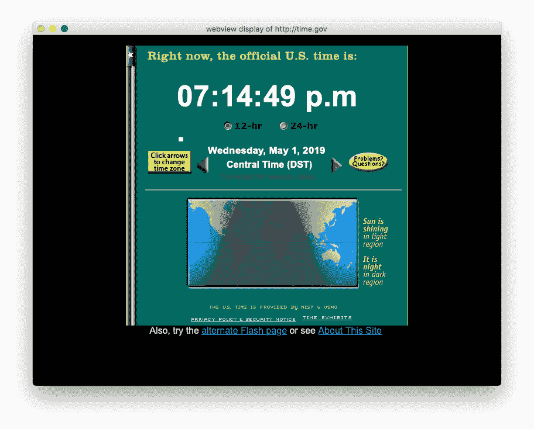

# 第十八章。解开网络的秘密

> 哦，我们编织的网……
> 
> 沃尔特·斯科特，《马尔米翁》

横跨法国和瑞士边境的是 CERN——一个粒子物理研究所，多次粉碎原子，以确保。

所有这些粉碎产生了大量数据。1989 年，英国科学家蒂姆·伯纳斯-李在 CERN 内部首次提出了一个提议，帮助在那里和研究界传播信息。他称之为*万维网*，并将其设计简化为三个简单的想法：

HTTP（超文本传输协议）

一种用于网络客户端和服务器交换请求和响应的协议。

HTML（超文本标记语言）

结果的演示格式。

URL（统一资源定位符）

表示服务器和该服务器上的*资源*的唯一方式。

在其最简单的用法中，Web 客户端（我认为伯纳斯-李是第一个使用术语*浏览器*的人）通过 HTTP 连接到 Web 服务器，请求 URL，并接收 HTML。

所有这一切都建立在来自*互联网*的网络基础之上，当时互联网是非商业化的，并且仅为少数大学和研究组织所知。

他在一台 NeXT¹电脑上写了第一款网页浏览器和服务器。1993 年，当伊利诺伊大学的一群学生发布了适用于 Windows、Macintosh 和 Unix 系统的 Mosaic 网页浏览器和 NCSA *httpd*服务器时，网络意识真正扩展开来。那个夏天我下载了 Mosaic 并开始建站时，我完全没有想到网络和互联网很快会成为日常生活的一部分。当时互联网²仍然正式非商业化；全球约有 500 台已知的网络服务器（[详见](http://home.web.cern.ch/about/birth-web)）。到 1994 年底，网络服务器数量已增长到 10,000 台。互联网开放商业化，Mosaic 的作者们创立了 Netscape 公司，开发商业化的网络软件。Netscape 随着早期互联网狂热而上市，网络的爆炸性增长从未停止。

几乎每种计算机语言都被用来编写网络客户端和服务器。动态语言 Perl、PHP 和 Ruby 尤为流行。在本章中，我展示了为何 Python 是各个层次上进行网络工作的特别优秀语言：

+   客户端，用于访问远程站点

+   服务器，为网站和 Web API 提供数据

+   Web API 和服务，以其他方式交换数据，而不仅仅是可视化的网页

顺便说一句，我们将在本章末尾的练习中构建一个实际的交互式网站。

# 网络客户端

互联网的低级网络管道被称为传输控制协议/因特网协议，或更常见的 TCP/IP（“TCP/IP”详细介绍了这一点）。它在计算机之间传输字节，但不关心这些字节的含义。这是高级*协议*的工作——专门用于特定目的的语法定义。HTTP 是网络数据交换的标准协议。

Web 是一个客户端-服务器系统。客户端向服务器发送一个*请求*：它通过 HTTP 打开 TCP/IP 连接，发送 URL 和其他信息，并接收一个*响应*。

响应的格式也由 HTTP 定义。它包括请求的状态，以及（如果请求成功）响应的数据和格式。

最著名的 Web 客户端是 Web *浏览器*。它可以以多种方式发出 HTTP 请求。您可以通过在位置栏中键入 URL 或单击 Web 页面中的链接手动发出请求。返回的数据通常用于显示网站——HTML 文档、JavaScript 文件、CSS 文件和图像——但它可以是任何类型的数据，不仅仅是用于显示的数据。

HTTP 的一个重要特点是它是*无状态*的。您建立的每个 HTTP 连接都是彼此独立的。这简化了基本的 Web 操作，但也使其他操作变得复杂。这里只是一些挑战的样本：

缓存

不变的远程内容应该由 Web 客户端保存并使用，以避免再次从服务器下载。

会话

购物网站应该记住您购物车的内容。

认证

需要您的用户名和密码的网站在您登录时应该记住它们。

解决无状态性的方法包括*cookies*，服务器向客户端发送足够的特定信息，以便在客户端将 cookie 发送回来时能够唯一识别它。

## 使用 telnet 进行测试

HTTP 是基于文本的协议，因此您实际上可以自己输入以进行 Web 测试。古老的`telnet`程序允许您连接到任何运行服务的服务器和端口，并向任何正在运行的服务输入命令。对于与其他机器的安全（加密）连接，它已被`ssh`取代。

让我们询问每个人最喜欢的测试网站，Google，关于其主页的一些基本信息。输入以下内容：

```py
$ telnet www.google.com 80
```

如果在 80 端口上有一个 Web 服务器（这是未加密的`http`通常运行的地方；加密的`https`使用 443 端口）在*google.com*上（我认为这是一个安全的赌注），`telnet`将打印一些令人放心的信息，然后显示一个最终的空行，这是您输入其他内容的信号：

```py
Trying 74.125.225.177...
Connected to www.google.com.
Escape character is '^]'.
```

现在，键入一个实际的 HTTP 命令，让`telnet`发送给 Google Web 服务器。最常见的 HTTP 命令（当您在浏览器的位置栏中键入 URL 时使用的命令）是`GET`。这会检索指定资源的内容，例如 HTML 文件，并将其返回给客户端。对于我们的第一个测试，我们将使用 HTTP 命令`HEAD`，它只是检索资源的一些基本信息*关于*资源：

```py
HEAD / HTTP/1.1
```

添加额外的换行符以发送空行，以便远程服务器知道您已经完成并希望得到响应。该 `HEAD /` 发送 HTTP `HEAD` *动词*（命令）以获取关于首页（`/`）的信息。您将收到类似以下内容的响应（我使用...裁剪了一些长行，以防止其超出书籍）：

```py
HTTP/1.1 200 OK
Date: Mon, 10 Jun 2019 16:12:13 GMT
Expires: -1
Cache-Control: private, max-age=0
Content-Type: text/html; charset=ISO-8859-1
P3P: CP="This is not a P3P policy! See g.co/p3phelp for more info."
Server: gws
X-XSS-Protection: 0
X-Frame-Options: SAMEORIGIN
Set-Cookie: 1P_JAR=...; expires=... GMT; path=/; domain=.google.com
Set-Cookie: NID=...; expires=... GMT; path=/; domain=.google.com; HttpOnly
Transfer-Encoding: chunked
Accept-Ranges: none
Vary: Accept-Encoding
```

这些是 HTTP 响应头及其值。像 `Date` 和 `Content-Type` 这样的头是必需的。其他头，如 `Set-Cookie`，用于跟踪您在多次访问中的活动（我们稍后在本章讨论*状态管理*）。当您发出 HTTP `HEAD` 请求时，您只会收到头信息。如果您使用了 HTTP `GET` 或 `POST` 命令，您还将从首页收到数据（其中包含 HTML、CSS、JavaScript 和 Google 决定加入首页的其他内容）。

我不想让你陷在 `telnet` 中。要关闭 `telnet`，请键入以下内容：

```py
q
```

## 使用 curl 进行测试

使用 `telnet` 简单，但是这是一个完全手动的过程。[`curl`](https://curl.haxx.se) 程序可能是最流行的命令行 Web 客户端。其文档包括书籍[*Everything Curl*](https://curl.haxx.se/book.html)，提供 HTML、PDF 和电子书格式。[一张表](https://oreil.ly/dLR8b)比较了 `curl` 与类似工具。[下载](https://curl.haxx.se/download.html)页面包含了所有主要平台和许多不太常见的平台。

使用 `curl` 的最简单方式执行隐式 `GET`（此处截断了输出）：

```py
$ curl http://www.example.com
<!doctype html>
<html>
<head>
    <title>Example Domain</title>
    ...

```

这使用 `HEAD`：

```py
$ curl --head http://www.example.com
HTTP/1.1 200 OK
Content-Encoding: gzip
Accept-Ranges: bytes
Cache-Control: max-age=604800
Content-Type: text/html; charset=UTF-8
Date: Sun, 05 May 2019 16:14:30 GMT
Etag: "1541025663"
Expires: Sun, 12 May 2019 16:14:30 GMT
Last-Modified: Fri, 09 Aug 2013 23:54:35 GMT
Server: ECS (agb/52B1)
X-Cache: HIT
Content-Length: 606
```

如果要传递参数，您可以在命令行或数据文件中包含它们。在这些示例中，我使用以下内容：

+   *url* 适用于任何网站

+   `data.txt` 是一个文本数据文件，内容如下：`a=1&b=2`

+   `data.json` 作为 JSON 数据文件，其内容为：`{"a":1, "b": 2}`

+   `a=1&b=2` 作为两个数据参数

使用默认的（*form-encoded*）参数：

```py
$ curl -X POST -d "a=1&b=2" *url*
$ curl -X POST -d "@data.txt" *url*
```

对于 JSON 编码的参数：

```py
$ curl -X POST -d "{'a':1,'b':2}" -H "Content-Type: application/json" *url*
$ curl -X POST -d "@data.json" *url*
```

## 使用 httpie 进行测试

比 curl 更 Pythonic 的选择是[`httpie`](https://httpie.org)。

```py
$ pip install httpie
```

要进行与上述 `curl` 方法类似的表单编码 POST，请使用 `-f` 作为 `--form` 的同义词：

```py
$ http -f POST *url* a=1 b=2
$ http POST -f *url* < data.txt
```

默认编码是 JSON：

```py
$ http POST *url* a=1 b=2
$ http POST *url* < data.json
```

`httpie` 还处理 HTTP 头部、cookie、文件上传、身份验证、重定向、SSL 等等。如往常一样，请参阅[文档](https://httpie.org/doc)

## 使用 httpbin 进行测试

您可以针对网站[`httpbin`](https://httpbin.org)测试您的 Web 查询，或者在本地 Docker 映像中下载并运行该站点：

```py
$ docker run -p 80:80 kennethreitz/httpbin
```

## Python 的标准 Web 库

在 Python 2 中，Web 客户端和服务器模块有点分散。Python 3 的目标之一是将这些模块打包成两个*包*（请记住来自第十一章的定义，包只是包含模块文件的目录）：

+   `http` 管理所有客户端-服务器 HTTP 细节：

    +   `client` 处理客户端相关工作

    +   `server` 帮助你编写 Python Web 服务器

    +   `cookies` 和 `cookiejar` 管理 cookie，用于在访问站点时保存数据

+   `urllib` 基于 `http` 运行：

    +   `request` 处理客户端请求

    +   `response`处理服务器响应

    +   `parse`解析 URL 的各个部分

###### 注意

如果你试图编写同时兼容 Python 2 和 Python 3 的代码，请记住`urllib`在这两个版本之间有很大的变化。查看更好的替代方案，请参考“超越标准库：requests”。

让我们使用标准库从网站获取一些内容。以下示例中的 URL 返回来自测试网站的信息：

```py
>>> import urllib.request as ur
>>>
>>> url = 'http://www.example.com/'
>>> conn = ur.urlopen(url)
```

这段小小的 Python 代码打开了一个到远程 Web 服务器`www.example.com`的 TCP/IP 连接，发送了一个 HTTP 请求，并接收到了一个 HTTP 响应。响应中包含的不仅仅是页面数据。在[官方文档](http://bit.ly/httpresponse-docs)中，我们发现`conn`是一个具有多个方法和属性的`HTTPResponse`对象。响应的一个重要部分是 HTTP *状态码*：

```py
>>> print(conn.status)
200
```

`200`表示一切顺利。HTTP 状态码分为五个范围，根据其第一个（百位）数字进行分组：

1xx（信息）

服务器已接收请求，但有一些额外的信息要传递给客户端。

2xx（成功）

成功；除了 200 之外的所有成功代码都携带额外的细节。

3xx（重定向）

资源已移动，所以响应将新的 URL 返回给客户端。

4xx（客户端错误）

客户端出现了一些问题，比如众所周知的 404（未找到）。418（*我是茶壶*）是愚人节玩笑。

5xx（服务器错误）

500 是通用的“哎呀”错误；如果 Web 服务器和后端应用程序服务器之间存在断开连接，则可能会看到 502（坏网关）。

要获取网页的实际数据内容，请使用`conn`变量的`read()`方法。这将返回一个`bytes`值。让我们获取数据并打印前 50 个字节：

```py
>>> data = conn.read()
>>> print(data[:50])
```

```py
b'<!doctype html>\n<html>\n<head>\n    <title>Example D'
```

我们可以将这些字节转换为字符串，并打印其前 50 个字符：

```py
>>> str_data = data.decode('utf8')
>>> print(str_data[:50])
<!doctype html>
<html>
<head>
    <title>Example D
>>>
```

其余是更多的 HTML 和 CSS。

纯粹出于好奇，我们收到了哪些 HTTP 头部回复？

```py
>>> for key, value in conn.getheaders():
...     print(key, value)
...
```

```py
Cache-Control max-age=604800
Content-Type text/html; charset=UTF-8
Date Sun, 05 May 2019 03:09:26 GMT
Etag "1541025663+ident"
Expires Sun, 12 May 2019 03:09:26 GMT
Last-Modified Fri, 09 Aug 2013 23:54:35 GMT
Server ECS (agb/5296)
Vary Accept-Encoding
X-Cache HIT
Content-Length 1270
Connection close
```

还记得之前的`telnet`示例吗？现在，我们的 Python 库正在解析所有这些 HTTP 响应头，并将它们以字典形式提供。`Date`和`Server`似乎很直观；其他一些可能不那么直观。了解 HTTP 具有一组标准头部，如`Content-Type`和许多可选头部，这是很有帮助的。

## 超越标准库：requests

在第一章的开头，有一个程序通过使用标准库`urllib.request`和`json`访问了 Wayback Machine API。接下来是一个使用第三方模块`requests`的版本。`requests`版本更简短，更易于理解。

对于大多数情况，我认为使用`requests`进行 Web 客户端开发更容易。你可以浏览[文档](https://oreil.ly/zF8cy)（非常好），了解所有细节。我将在本节中展示`requests`的基础知识，并在整本书中用它来处理 Web 客户端任务。

首先，安装`requests`库：

```py
$ pip install requests
```

现在，让我们用 `requests` 重新执行我们的 example.com 查询：

```py
>>> import requests
>>> resp = requests.get('http://example.com')
>>> resp
<Response [200]>
>>> resp.status_code
200
>>> resp.text[:50]
'<!doctype html>\n<html>\n<head>\n    <title>Example D'
```

要显示一个 JSON 查询，这是一个本章末尾出现的程序的最小版本。你提供一个字符串，它使用互联网档案馆搜索 API 来搜索那里保存的数十亿多媒体项目的标题。请注意，在 示例 18-1 中显示的 `requests.get()` 调用中，你只需要传递一个 `params` 字典，`requests` 将处理所有的查询构造和字符转义。

##### 示例 18-1\. ia.py

```py
import json
import sys

import requests

def search(title):
     url = "http://archive.org/advancedsearch.php"
     params = {"q": f"title:({title})",
               "output": "json",
               "fields": "identifier,title",
               "rows": 50,
               "page": 1,}
     resp = requests.get(url, params=params)
     return resp.json()

if __name__ == "__main__":
     title = sys.argv[1]
     data = search(title)
     docs = data["response"]["docs"]
     print(f"Found {len(docs)} items, showing first 10")
     print("identifier\ttitle")
     for row in docs[:10]:
         print(row["identifier"], row["title"], sep="\t")
```

他们关于食人魔物品的库存如何？

```py
$ python ia.py wendigo
Found 24 items, showing first 10
identifier  title
cd_wendigo_penny-sparrow  Wendigo
Wendigo1  Wendigo 1
wendigo_ag_librivox The Wendigo
thewendigo10897gut  The Wendigo
isbn_9780843944792  Wendigo mountain ; Death camp
jamendo-060508  Wendigo - Audio Leash
fav-lady_wendigo  lady_wendigo Favorites
011bFearTheWendigo  011b Fear The Wendigo
CharmedChats112 Episode 112 - The Wendigo
jamendo-076964  Wendigo - Tomame o Dejame>
```

第一列（*标识符*）可以用来实际查看存档网站上的项目。你将在本章末尾看到如何做到这一点。

# Web 服务器

Web 开发人员发现 Python 是编写 Web 服务器和服务器端程序的优秀语言。这导致了许多基于 Python 的 Web *框架* 的出现，以至于在它们中间和做选择时可能很难导航——更不用说决定哪些应该写进一本书了。

一个 Web 框架提供了一些功能，你可以用它来构建网站，所以它不仅仅是一个简单的 Web（HTTP）服务器。你会看到一些功能，比如路由（将 URL 映射到服务器功能）、模板（包含动态内容的 HTML）、调试等等。

我不打算在这里涵盖所有的框架，只介绍那些我发现相对简单易用且适合真实网站的。我还会展示如何用 Python 运行网站的动态部分以及用传统 Web 服务器运行其他部分。

## 最简单的 Python Web 服务器

你可以通过输入一行 Python 来运行一个简单的 Web 服务器：

```py
$ python -m http.server
```

这实现了一个简单的 Python HTTP 服务器。如果没有问题，它将打印初始状态消息：

```py
Serving HTTP on 0.0.0.0 port 8000 ...
```

那个 `0.0.0.0` 意味着 *任何 TCP 地址*，所以 Web 客户端无论服务器有什么地址都可以访问它。有关 TCP 和其他网络底层细节，你可以在第十七章中进一步阅读。

现在，你可以请求文件，路径相对于你当前的目录，它们将被返回。如果在你的 Web 浏览器中输入 `http://localhost:8000`，你应该能看到那里的目录列表，并且服务器将打印类似这样的访问日志行：

```py
127.0.0.1 - - [20/Feb/2013 22:02:37] "GET / HTTP/1.1" 200 -
```

`localhost` 和 `127.0.0.1` 是 *你的本地计算机* 的 TCP 同义词，所以这在无论你是否连接互联网时都能工作。你可以这样解释这一行：

+   `127.0.0.1` 是客户端的 IP 地址

+   第一个 `-` 是远程用户名（如果有的话）

+   第二个 `-` 是登录用户名（如果需要的话）

+   `[20/Feb/2013 22:02:37]` 是访问的日期和时间

+   `"GET / HTTP/1.1"` 是发送给 Web 服务器的命令：

    +   HTTP 方法（`GET`）

    +   所请求的资源（`/`，顶层）

    +   HTTP 版本（`HTTP/1.1`）

+   最后的 `200` 是 Web 服务器返回的 HTTP 状态码

点击任何文件。如果你的浏览器能够识别格式（HTML、PNG、GIF、JPEG 等），它应该会显示它，并且服务器将记录该请求。例如，如果你的当前目录中有 *oreilly.png* 文件，请求 *[*http://localhost:8000/oreilly.png*](http://localhost:8000/oreilly.png)* 应该返回 图 20-2 中那个怪异家伙的图像，并且日志应该显示类似于这样的内容：

```py
127.0.0.1 - - [20/Feb/2013 22:03:48] "GET /oreilly.png HTTP/1.1" 200 -
```

如果你的电脑相同目录下还有其他文件，它们应该显示在你的显示器上，你可以点击任何一个来下载。如果你的浏览器配置了显示该文件的格式，你会在屏幕上看到结果；否则，你的浏览器会询问你是否要下载并保存该文件。

默认使用的端口号是 8000，但你可以指定其他端口号：

```py
$ python -m http.server 9999
```

你应该看到这个：

```py
Serving HTTP on 0.0.0.0 port 9999 ...
```

这个仅支持 Python 的服务器最适合进行快速测试。你可以通过结束其进程来停止它；在大多数终端中，按 Ctrl+C。

你不应该将这个基本服务器用于繁忙的生产网站。传统的 Web 服务器如 Apache 和 NGINX 对于提供静态文件要快得多。此外，这个简单的服务器无法处理动态内容，而更复杂的服务器可以通过接受参数来实现这一点。

## Web 服务器网关接口（WSGI）

很快，只提供简单文件的吸引力就消失了，我们需要一个能够动态运行程序的 Web 服务器。在 Web 的早期，*通用网关接口*（CGI）是为客户端执行 Web 服务器运行外部程序并返回结果设计的。CGI 也处理通过服务器从客户端获取输入参数传递到外部程序。然而，这些程序会为 *每个* 客户端访问重新启动。这种方式不能很好地扩展，因为即使是小型程序也有可观的启动时间。

为了避免这种启动延迟，人们开始将语言解释器合并到 Web 服务器中。Apache 在其 `mod_php` 模块中运行 PHP，Perl 在 `mod_perl` 中，Python 在 `mod_python` 中。然后，这些动态语言中的代码可以在长时间运行的 Apache 进程中执行，而不是在外部程序中执行。

另一种方法是在单独的长期运行程序中运行动态语言，并让它与 Web 服务器通信。FastCGI 和 SCGI 就是其中的例子。

Python Web 开发通过定义 *Web 服务器网关接口*（WSGI）迈出了一大步，这是 Python Web 应用程序与 Web 服务器之间的通用 API。本章剩余部分介绍的所有 Python Web 框架和 Web 服务器都使用 WSGI。通常情况下你不需要知道 WSGI 如何工作（其实它并不复杂），但了解一些底层组成部分的名称有助于你的理解。这是一个 *同步* 连接，一步接着一步。

## ASGI

迄今为止，在几个地方，我已经提到 Python 正在引入像`async`、`await`和`asyncio`这样的*异步*语言特性。ASGI（异步服务器网关接口）是 WSGI 的一个对应项，它使用这些新特性。在附录 C 中，您将看到更多讨论，并且会有使用 ASGI 的新 Web 框架示例。

## Apache

[apache](http://httpd.apache.org) Web 服务器最好的 WSGI 模块是[mod_wsgi](https://code.google.com/p/modwsgi)。这可以在 Apache 进程内或与 Apache 通信的独立进程中运行 Python 代码。

如果您的系统是 Linux 或 macOS，您应该已经有`apache`。对于 Windows，您需要安装[apache](http://bit.ly/apache-http)。

最后，安装您喜欢的基于 WSGI 的 Python Web 框架。我们在这里尝试`bottle`。几乎所有的工作都涉及配置 Apache，这可能是一门黑暗的艺术。

创建如示例 18-2 所示的测试文件，并将其保存为*/var/www/test/home.wsgi*。

##### 示例 18-2\. home.wsgi

```py
import bottle

application = bottle.default_app()

@bottle.route('/')
def home():
    return "apache and wsgi, sitting in a tree"
```

这次不要调用`run()`，因为它会启动内置的 Python Web 服务器。我们需要将变量`application`赋值，因为这是`mod_wsgi`用来连接 Web 服务器和 Python 代码的地方。

如果`apache`和其`mod_wsgi`模块正常工作，我们只需将它们连接到我们的 Python 脚本即可。我们希望在定义此`apache`服务器默认网站的文件中添加一行，但找到该文件本身就是一个任务。它可能是*/etc/apache2/httpd.conf*，也可能是*/etc/apache2/sites-available/default*，或者是某人宠物蝾螈的拉丁名。

现在假设您已经理解了`apache`并找到了那个文件。在管理默认网站的<VirtualHost>部分内添加此行：

```py
    WSGIScriptAlias / /var/www/test/home.wsgi
```

那一节可能看起来像这样：

```py
<VirtualHost *:80>
    DocumentRoot /var/www

    WSGIScriptAlias / /var/www/test/home.wsgi

    <Directory /var/www/test>
    Order allow,deny
    Allow from all
    </Directory>
</VirtualHost>
```

启动`apache`，或者如果它已经运行，则重新启动以使用这个新配置。然后，如果您浏览到[*http://localhost/*](http://localhost/)，您应该会看到：

```py
apache and wsgi, sitting in a tree
```

这将在*嵌入模式*下运行`mod_wsgi`，作为`apache`本身的一部分。

您也可以将其以*守护程序模式*运行，作为一个或多个与`apache`分开的进程。为此，请在您的`apache`配置文件中添加两行新的指令行：

```py
WSGIDaemonProcess *domain-name* user=*user-name* group=*group-name* threads=25
WSGIProcessGroup *domain-name*
```

在上述示例中，*`user-name`*和*`group-name`*是操作系统用户和组名，*`domain-name`*是您的互联网域名。一个最小的`apache`配置可能如下所示：

```py
<VirtualHost *:80>
    DocumentRoot /var/www

    WSGIScriptAlias / /var/www/test/home.wsgi

    WSGIDaemonProcess mydomain.com user=myuser group=mygroup threads=25
    WSGIProcessGroup mydomain.com

    <Directory /var/www/test>
    Order allow,deny
    Allow from all
    </Directory>
</VirtualHost>
```

## NGINX

[NGINX](http://nginx.org) Web 服务器没有内置的 Python 模块。相反，它是一个前端，用于连接到诸如 uWSGI 或 gUnicorn 之类的独立 WSGI 服务器。它们共同构成了一个非常快速和可配置的 Python Web 开发平台。

您可以从其[网站](http://wiki.nginx.org/Install)安装`nginx`。有关使用 NGINX 和 WSGI 服务器设置 Flask 的示例，请参阅[此处](https://oreil.ly/7FTPa)。

## 其他 Python Web 服务器

以下是一些独立的基于 Python 的 WSGI 服务器，类似于 `apache` 或 `nginx`，使用多进程和/或线程（见“并发”）处理并发请求：

+   [`uwsgi`](http://projects.unbit.it/uwsgi)

+   [`cherrypy`](http://www.cherrypy.org)

+   [`pylons`](http://www.pylonsproject.org)

这里有一些*基于事件*的服务器，它们使用单一进程但避免在任何单个请求上阻塞：

+   [`tornado`](http://www.tornadoweb.org)

+   [`gevent`](http://gevent.org)

+   [`gunicorn`](http://gunicorn.org)

在关于第十五章中关于*并发*的讨论中，我还有更多要说的。

# Web 服务器框架

Web 服务器处理 HTTP 和 WSGI 的细节，但是你使用 Web *框架*来实际编写驱动站点的 Python 代码。因此，让我们先谈谈框架，然后再回到实际使用它们的网站服务的替代方法。

如果你想用 Python 写一个网站，有许多（有人说太多）Python Web 框架。Web 框架至少处理客户端请求和服务器响应。大多数主要的 Web 框架包括以下任务：

+   HTTP 协议处理

+   认证（*authn*，或者你是谁？）

+   认证（*authz*，或者你可以做什么？）

+   建立一个会话

+   获取参数

+   验证参数（必需/可选、类型、范围）

+   处理 HTTP 动词

+   路由（函数/类）

+   提供静态文件（HTML、JS、CSS、图像）

+   提供动态数据（数据库、服务）

+   返回值和 HTTP 状态

可选功能包括：

+   后端模板

+   数据库连接、ORMs

+   速率限制

+   异步任务

在接下来的章节中，我们将为两个框架（`bottle` 和 `flask`）编写示例代码。这些是*同步*的。稍后，我将讨论特别是用于数据库支持网站的替代方案。你可以找到一个 Python 框架来支持你可以想到的任何网站。

## Bottle

Bottle 由单个 Python 文件组成，因此非常容易尝试，并且稍后易于部署。Bottle 不是标准 Python 的一部分，因此要安装它，请键入以下命令：

```py
$ pip install bottle
```

这里是一个将运行一个测试 Web 服务器并在你的浏览器访问 URL [*http://localhost:9999/*](http://localhost:9999/) 时返回一行文本的代码。将其保存为 *bottle1.py*（示例 18-3）。

##### 示例 18-3\. bottle1.py

```py
from bottle import route, run

@route('/')
def home():
  return "It isn't fancy, but it's my home page"

run(host='localhost', port=9999)
```

Bottle 使用 `route` 装饰器将 URL 关联到以下函数；在这种情况下，`/`（主页）由 `home()` 函数处理。通过键入以下命令使 Python 运行此服务器脚本：

```py
$ python bottle1.py
```

当你访问[*http://localhost:9999/*](http://localhost:9999/)时，你应该在你的浏览器上看到这个：

```py
It isn't fancy, but it's my home page
```

`run()` 函数执行 `bottle` 内置的 Python 测试 Web 服务器。对于 `bottle` 程序，你不需要使用它，但在初始开发和测试时很有用。

现在，不再在代码中创建主页文本，让我们创建一个名为 *index.html* 的单独 HTML 文件，其中包含这行文本：

```py
My <b>new</b> and <i>improved</i> home page!!!
```

使`bottle`在请求主页时返回此文件的内容。将此脚本保存为*bottle2.py*(示例 18-4)。

##### 示例 18-4\. bottle2.py

```py
from bottle import route, run, static_file

@route('/')
def main():
    return static_file('index.html', root='.')

run(host='localhost', port=9999)
```

在调用`static_file()`时，我们想要的是`root`所指示的目录中的文件`index.html`（在本例中，为 `'.'`，即当前目录）。如果你之前的服务器示例代码仍在运行，请停止它。现在，运行新的服务器：

```py
$ python bottle2.py
```

当你请求浏览器获取*http:/localhost:9999/*时，你应该看到这个：

```py
My `new` and *`improved`* home page!!!
```

让我们最后添加一个示例，展示如何向 URL 传递参数并使用它们。当然，这将是*bottle3.py*，你可以在示例 18-5 中看到它。

##### 示例 18-5\. bottle3.py

```py
from bottle import route, run, static_file

@route('/')
def home():
    return static_file('index.html', root='.')

@route('/echo/<thing>')
def echo(thing):
    return "Say hello to my little friend: %s!" % thing

run(host='localhost', port=9999)
```

我们有一个名为`echo()`的新函数，并希望在 URL 中传递一个字符串参数。这就是前面示例中的`@route('/echo/<thing>')`一行所做的事情。路由中的`<thing>`意味着在`/echo/`之后的 URL 中的任何内容都将被分配给字符串参数`thing`，然后传递给`echo`函数。要查看发生了什么，请停止旧服务器（如果仍在运行）然后使用新代码启动它：

```py
$ python bottle3.py
```

然后，在你的网络浏览器中访问*[*http://localhost:9999/echo/Mothra*](http://localhost:9999/echo/Mothra)*。你应该看到以下内容：

```py
Say hello to my little friend: Mothra!
```

现在，让*bottle3.py*运行一分钟，这样我们可以尝试其他东西。你一直通过在浏览器中输入 URL 并查看显示的页面来验证这些示例是否有效。你也可以使用诸如`requests`之类的客户端库来为你完成工作。将此保存为*bottle_test.py*(示例 18-6)。

##### 示例 18-6\. bottle_test.py

```py
import requests

resp = requests.get('http://localhost:9999/echo/Mothra')
if resp.status_code == 200 and \
  resp.text == 'Say hello to my little friend: Mothra!':
    print('It worked! That almost never happens!')
else:
    print('Argh, got this:', resp.text)
```

太棒了！现在，运行它：

```py
$ python bottle_test.py
```

你应该在终端上看到这个：

```py
It worked! That almost never happens!
```

这是一个*单元测试*的小例子。第十九章详细介绍了为什么测试很重要以及如何在 Python 中编写测试。

Bottle 还有更多功能，这里没有展示出来。特别是，你可以在调用`run()`时添加这些参数：

+   `debug=True`如果出现 HTTP 错误，则会创建一个调试页面；

+   `reloader=True`如果更改任何 Python 代码，它会在浏览器中重新加载页面。

这在[开发者网站](http://bottlepy.org/docs/dev)上有详细文档。

## Flask

Bottle 是一个不错的初始 Web 框架。如果你需要更多功能，可以尝试 Flask。它于 2010 年愚人节笑话开始，但是热烈的反响鼓励了作者阿尔明·罗纳赫将其制作成一个真正的框架。他将结果命名为 Flask，这是对 Bottle 的一种文字游戏。

Flask 的使用方法与 Bottle 差不多，但它支持许多在专业 Web 开发中有用的扩展，比如 Facebook 认证和数据库集成。它是我个人在 Python Web 框架中的首选，因为它在易用性和丰富功能集之间取得了平衡。

`flask`包含`werkzeug` WSGI 库和`jinja2`模板库。你可以从终端安装它：

```py
$ pip install flask
```

让我们在 Flask 中复制最终的 Bottle 示例代码。不过，在此之前，我们需要做一些更改：

+   Flask 的默认静态文件目录主目录是`static`，那里的文件 URL 也以`/static`开头。我们将文件夹更改为'.'（当前目录），URL 前缀更改为''（空），以便将 URL`/`映射到文件*index.html*。

+   在`run()`函数中，设置`debug=True`还会激活自动重新加载器；`bottle`为调试和重新加载使用了单独的参数。

将此文件保存为*flask1.py*（示例 18-7）。

##### 示例 18-7\. flask1.py

```py
from flask import Flask

app = Flask(__name__, static_folder='.', static_url_path='')

@app.route('/')
def home():
    return app.send_static_file('index.html')

@app.route('/echo/<thing>')
def echo(thing):
    return "Say hello to my little friend: %s" % thing

app.run(port=9999, debug=True)
```

然后，在终端或窗口中运行服务器：

```py
$ python flask1.py
```

通过将此网址输入浏览器中来测试主页：

```py
http://localhost:9999/
```

您应该看到以下内容（就像对`bottle`一样）：

```py
My `new` and *`improved`* home page!!!
```

尝试`/echo`端点：

```py
http://localhost:9999/echo/Godzilla
```

您应该看到这个：

```py
Say hello to my little friend: Godzilla
```

当调用`run`时将`debug`设置为`True`还有另一个好处。如果服务器代码出现异常，Flask 将返回一个格式特殊的页面，其中包含有关发生了什么错误以及在哪里的有用详细信息。更好的是，您可以输入一些命令来查看服务器程序中变量的值。

###### 警告

不要在生产 Web 服务器中设置`debug = True`。这会向潜在入侵者暴露关于您服务器的过多信息。

到目前为止，Flask 示例只是复制了我们在 Bottle 中所做的事情。Flask 可以做到 Bottle 不能做到的是什么？Flask 包含`jinja2`，一个更广泛的模板系统。这里是如何将`jinja2`和 Flask 结合使用的一个小例子。

创建一个名为`templates`的目录，并在其中创建一个名为*flask2.html*的文件（示例 18-8）。

##### 示例 18-8\. flask2.html

```py
<html>
<head>
<title>Flask2 Example</title>
</head>
<body>
Say hello to my little friend: {{ thing }}
</body>
</html>
```

接下来，我们编写服务器代码来获取此模板，填充我们传递给它的*thing*的值，并将其呈现为 HTML（我在这里省略了`home()`函数以节省空间）。将其保存为*flask2.py*（示例 18-9）。

##### 示例 18-9\. flask2.py

```py
from flask import Flask, render_template

app = Flask(__name__)

@app.route('/echo/<thing>')
def echo(thing):
    return render_template('flask2.html', thing=thing)

app.run(port=9999, debug=True)
```

那个`thing = thing`参数意味着将一个名为`thing`的变量传递给模板，其值为字符串`thing`。

确保*flask1.py*没有在运行，并启动*flask2.py*：

```py
$ python flask2.py
```

现在，输入此网址：

```py
http://localhost:9999/echo/Gamera
```

您应该看到以下内容：

```py
Say hello to my little friend: Gamera
```

让我们修改我们的模板，并将其保存在*templates*目录中，文件名为*flask3.html*：

```py
<html>
<head>
<title>Flask3 Example</title>
</head>
<body>
Say hello to my little friend: {{ thing }}.
Alas, it just destroyed {{ place }}!
</body>
</html>
```

您可以通过多种方式将第二个参数传递给`echo`网址。

### 作为 URL 路径的一部分传递一个参数

使用此方法，您只需扩展 URL 本身。将示例 18-10 中显示的代码保存为*flask3a.py*。

##### 示例 18-10\. flask3a.py

```py
from flask import Flask, render_template

app = Flask(__name__)

@app.route('/echo/<thing>/<place>')
def echo(thing, place):
    return render_template('flask3.html', thing=thing, place=place)

app.run(port=9999, debug=True)
```

通常情况下，如果之前的测试服务器脚本仍在运行，请先停止它，然后尝试这个新的：

```py
$ python flask3a.py
```

URL 将如下所示：

```py
http://localhost:9999/echo/Rodan/McKeesport
```

而且您应该看到以下内容：

```py
Say hello to my little friend: Rodan. Alas, it just destroyed McKeesport!
```

或者，您可以按照示例 18-11 中显示的方式将参数作为`GET`参数提供；将其保存为*flask3b.py*。

##### 示例 18-11\. flask3b.py

```py
from flask import Flask, render_template, request

app = Flask(__name__)

@app.route('/echo/')
def echo():
    thing = request.args.get('thing')
    place = request.args.get('place')
    return render_template('flask3.html', thing=thing, place=place)

app.run(port=9999, debug=True)
```

运行新的服务器脚本：

```py
$ python flask3b.py
```

这一次，使用此网址：

```py
http://localhost:9999/echo?thing=Gorgo&place=Wilmerding
```

您应该得到与这里看到的相同的结果：

```py
Say hello to my little friend: Gorgo. Alas, it just destroyed Wilmerding!
```

当使用`GET`命令访问 URL 时，任何参数都以``&*`key1`*=*`val1`*&*`key2`*=*`val2`*&...``的形式传递。

你还可以使用字典 `**` 运算符将多个参数从单个字典传递到模板（称为 *flask3c.py*），如 示例 18-12 所示。

##### 示例 18-12\. flask3c.py

```py
from flask import Flask, render_template, request

app = Flask(__name__)

@app.route('/echo/')
def echo():
    kwargs = {}
    kwargs['thing'] = request.args.get('thing')
    kwargs['place'] = request.args.get('place')
    return render_template('flask3.html', **kwargs)

app.run(port=9999, debug=True)
```

`**kwargs` 就像 `thing=thing, place=place`。如果有很多输入参数，这样可以节省一些输入。

`jinja2` 模板语言比这个做的更多。如果你用过 PHP 编程，你会看到很多相似之处。

## Django

[`Django`](https://www.djangoproject.com) 是一个非常流行的 Python web 框架，特别适用于大型网站。有很多理由值得学习它，包括 Python 工作广告中对 `django` 经验的频繁需求。它包括 ORM 代码（我们在 “对象关系映射器（ORM）” 中讨论了 ORM）来为典型数据库的 *CRUD* 功能（创建、替换、更新、删除）自动生成网页，我们在 第十六章 中看过。它还包括一些自动管理页面，但这些页面设计用于程序员内部使用，而不是公共网页使用。如果你喜欢其他 ORM，比如 SQLAlchemy 或直接 SQL 查询，你也不必使用 `Django` 的 ORM。

## 其他框架

你可以通过查看这个 [在线表格](http://bit.ly/web-frames) 来比较这些框架：

+   [`fastapi`](https://fastapi.tiangelo.com) 处理同步（WSGI）和异步（ASGI）调用，使用类型提示，生成测试页面，文档齐全。推荐使用。

+   [`web2py`](http://www.web2py.com) 覆盖了与 `django` 类似的大部分领域，但风格不同。

+   [`pyramid`](https://trypyramid.com) 从早期的 `pylons` 项目发展而来，与 `django` 在范围上类似。

+   [`turbogears`](http://turbogears.org) 支持 ORM、多个数据库和多个模板语言。

+   [`wheezy.web`](http://pythonhosted.org/wheezy.web) 是一个性能优化的较新框架。它在最近的测试中比其他框架都要 [快](http://bit.ly/wheezyweb)。

+   [`molten`](https://moltenframework.com) 也使用类型提示，但仅支持 WSGI。

+   [`apistar`](https://docs.apistar.com) 类似于 fastapi，但更像是 API 验证工具而不是 web 框架。

+   [`masonite`](https://docs.masoniteproject.com) 是 Python 版本的 Ruby on Rails 或 PHP 的 Laravel。

# 数据库框架

在计算中，网络和数据库就像花生酱和果冻一样，一个地方会找到另一个地方。在现实生活中的 Python 应用程序中，你可能需要为关系数据库提供网页界面（网站和/或 API）。

你可以用以下方法构建自己的：

+   像 Bottle 或 Flask 这样的 web 框架

+   一个数据库包，比如 db-api 或 SQLAlchemy

+   数据库驱动，比如 pymysql

相反，你可以使用像这些之一的 web/数据库包：

+   [connexion](https://connexion.readthedocs.io)

+   [datasette](https://datasette.readthedocs.io)

+   [sandman2](https://github.com/jeffknupp/sandman2)

+   [flask-restless](https://flask-restless.readthedocs.io)

或者，你可以使用一个具有内置数据库支持的框架，比如 Django。

你的数据库可能不是关系型的。如果你的数据模式差异显著——不同行之间的列差异较大——考虑使用一个*无模式*数据库可能会更有价值，比如第十六章中讨论的某些*NoSQL*数据库。我曾在一个网站工作过，最初将其数据存储在一个 NoSQL 数据库中，然后切换到关系型数据库，再到另一个关系型数据库，然后再到另一个不同的 NoSQL 数据库，最后又回到一个关系型数据库。

# Web Services and Automation

我们刚刚看了传统的网络客户端和服务器应用程序，消费和生成 HTML 页面。然而，网络已经被证明是将应用程序和数据粘合在一起的强大方式，支持比 HTML 更多格式的数据。

## webbrowser

让我们开始一个小小的惊喜。在终端窗口中启动一个 Python 会话，并输入以下内容：

```py
>>> import antigravity
```

这会秘密调用标准库的 `webbrowser` 模块，并将你的浏览器导向一个启发性的 Python 链接。³

你可以直接使用这个模块。这个程序会在你的浏览器中加载主 Python 网站的页面：

```py
>>> import webbrowser
>>> url = 'http://www.python.org/'
>>> webbrowser.open(url)
True
```

这会在一个新窗口中打开：

```py
>>> webbrowser.open_new(url)
True
```

这会在一个新标签页中打开，如果你的浏览器支持标签页的话：

```py
>>> webbrowser.open_new_tab('http://www.python.org/')
True
```

`webbrowser` 让你的浏览器做所有的工作。

## webview

`webview` 与 `webbrowser` 不同，它在自己的窗口中显示页面，使用您计算机的本地图形用户界面。要在 Linux 或 macOS 上安装：

```py
$ pip install pywebview[qt]
```

对于 Windows：

```py
$ pip install pywebview[cef]
```

如果你遇到问题，请查看安装[说明](https://oreil.ly/NiYD7)。

这是一个示例，我访问了美国政府官方当前时间的网站：

```py
>>> import webview
>>> url = input("URL? ")
URL? http://time.gov
>>> webview.create_window(f"webview display of {url}", url)
```

图 18-1 显示了我得到的结果。



###### 图 18-1\. `webview` 显示窗口

要停止程序，请关闭显示窗口。

# Web API 和 REST

数据通常仅在网页中可用。如果你想要访问这些数据，就需要通过网络浏览器访问页面并读取它。如果网站的作者自你上次访问以来进行了任何更改，数据的位置和样式可能已经改变。

你可以通过网络*应用程序编程接口*（API）提供数据，而不是发布网页。客户端通过向 URL 发送请求并获取包含状态和数据的响应来访问你的服务。数据不是 HTML 页面，而是更易于程序消费的格式，比如 JSON 或 XML（关于这些格式的更多信息请参考第十六章）。

*表述性状态转移*（REST）由罗伊·菲尔丁在他的博士论文中定义。许多产品声称拥有*REST 接口*或*RESTful 接口*。实际上，这通常意味着它们拥有一个*Web 接口*——用于访问 Web 服务的 URL 定义。

一个*RESTful*服务以特定方式使用 HTTP *动词*：

+   `HEAD` 获取资源的信息，但不获取其数据。

+   `GET` 从服务器检索资源的数据。这是你的浏览器使用的标准方法。`GET` 不应该用于创建、更改或删除数据。

+   `POST` 创建一个新的资源。

+   `PUT` 替换现有资源，如果不存在则创建。

+   `PATCH` 部分更新资源。

+   `DELETE` 删除。广告里面的真相！

一个 RESTful 客户端也可以通过使用 HTTP 请求头从服务器请求一个或多个内容类型。例如，具有 REST 接口的复杂服务可能更喜欢其输入和输出为 JSON 字符串。

# 爬取和抓取

有时，你可能只想要一点信息——电影评分、股价或产品可用性，但你需要的信息只在由广告和无关内容环绕的 HTML 页面中。

你可以通过以下步骤手动提取你要查找的信息：

1.  将 URL 输入到你的浏览器中。

1.  等待远程页面加载。

1.  在显示的页面中查找你想要的信息。

1.  把它写在某个地方。

1.  可能要重复处理相关的网址。

然而，自动化一些或所有这些步骤会更加令人满足。自动网络抓取器称为*爬虫*或*蜘蛛*。⁴ 在从远程 Web 服务器检索内容后，*抓取器*会解析它以在海量信息中找到所需的信息。

## Scrapy

如果你需要一个强大的联合爬虫*和*抓取器，[Scrapy](http://scrapy.org)值得下载：

```py
$ pip install scrapy
```

这将安装模块和一个独立的命令行`scrapy`程序。

Scrapy 是一个框架，不仅仅是一个模块，比如`BeautifulSoup`。它功能更强大，但设置更复杂。想了解更多关于 Scrapy 的信息，请阅读[“Scrapy 简介”](https://oreil.ly/8IYoe)和[教程](https://oreil.ly/4H_AW)。

## BeautifulSoup

如果你已经从网站获得了 HTML 数据，只想从中提取数据，[`BeautifulSoup`](https://oreil.ly/c43mV)是一个不错的选择。HTML 解析比听起来要难。这是因为公共网页上的大部分 HTML 在技术上都是无效的：未闭合的标签，不正确的嵌套以及其他复杂情况。如果你试图通过使用正则表达式（在“文本字符串：正则表达式”中讨论）编写自己的 HTML 解析器，很快就会遇到这些混乱。

要安装`BeautifulSoup`，输入以下命令（不要忘记最后的`4`，否则`pip`会尝试安装旧版本并且可能失败）：

```py
$ pip install beautifulsoup4
```

现在，让我们用它来获取网页上的所有链接。HTML `a` 元素表示一个链接，`href` 是表示链接目标的属性。在例子 18-13 中，我们将定义函数`get_links()`来完成这项繁重的工作，并且一个主程序来获取一个或多个 URL 作为命令行参数。

##### 例子 18-13\. links.py

```py
def get_links(url):
    import requests
    from bs4 import BeautifulSoup as soup
    result = requests.get(url)
    page = result.text
    doc = soup(page)
    links = [element.get('href') for element in doc.find_all('a')]
    return links

if __name__ == '__main__':
    import sys
    for url in sys.argv[1:]:
        print('Links in', url)
        for num, link in enumerate(get_links(url), start=1):
            print(num, link)
        print()
```

我把这个程序保存为*links.py*，然后运行这个命令：

```py
$ python links.py http://boingboing.net
```

这是它打印的前几行：

```py
Links in http://boingboing.net/
1 http://boingboing.net/suggest.html
2 http://boingboing.net/category/feature/
3 http://boingboing.net/category/review/
4 http://boingboing.net/category/podcasts
5 http://boingboing.net/category/video/
6 http://bbs.boingboing.net/
7 javascript:void(0)
8 http://shop.boingboing.net/
9 http://boingboing.net/about
10 http://boingboing.net/contact
```

## Requests-HTML

Kenneth Reitz，流行的 Web 客户端包`requests`的作者，已经编写了一个名为[requests-html](http://html.python-requests.org)的新抓取库（适用于 Python 3.6 及更新版本）。

它获取一个页面并处理其元素，因此你可以查找例如其所有链接或任何 HTML 元素的所有内容或属性。

它具有干净的设计，类似于`requests`和其他同一作者的包。总体而言，它可能比`beautifulsoup`或 Scrapy 更容易使用。

# 让我们看电影

让我们构建一个完整的程序。

它使用 Internet Archive 的 API 搜索视频。⁵ 这是为数不多允许匿名访问*且*在本书印刷后仍应存在的 API 之一。

###### 注意

大多数网络 API 要求你首先获取一个*API 密钥*，并在每次访问该 API 时提供它。为什么？这是公地悲剧：匿名访问的免费资源经常被过度使用或滥用。这就是为什么我们不能有好东西。

在示例 18-14 中显示的以下程序执行以下操作：

+   提示你输入电影或视频标题的一部分

+   在 Internet Archive 搜索它

+   返回标识符、名称和描述的列表

+   列出它们并要求你选择其中一个

+   在你的 Web 浏览器中显示该视频

将此保存为*iamovies.py*。

`search()`函数使用`requests`访问 URL，获取结果并将其转换为 JSON。其他函数处理其他所有事务。你会看到列表推导、字符串切片和你在之前章节中看到的其他内容。（行号不是源代码的一部分；它们将用于练习中定位代码片段。）

##### 示例 18-14\. iamovies.py

```py
1 """Find a video at the Internet Archive
2 by a partial title match and display it."""
3 
4 import sys
5 import webbrowser
6 import requests
7 
8 def search(title):
9     """Return a list of 3-item tuples (identifier,
10        title, description) about videos
11        whose titles partially match :title."""
12     search_url = "https://archive.org/advancedsearch.php"
13     params = {
14         "q": "title:({}) AND mediatype:(movies)".format(title),
15         "fl": "identifier,title,description",
16         "output": "json",
17         "rows": 10,
18         "page": 1,
19         }
20     resp = requests.get(search_url, params=params)
21     data = resp.json()
22     docs = [(doc["identifier"], doc["title"], doc["description"])
23             for doc in data["response"]["docs"]]
24     return docs
25 
26 def choose(docs):
27     """Print line number, title and truncated description for
28        each tuple in :docs. Get the user to pick a line
29        number. If it's valid, return the first item in the
30        chosen tuple (the "identifier"). Otherwise, return None."""
31     last = len(docs) - 1
32     for num, doc in enumerate(docs):
33         print(f"{num}: ({doc[1]}) {doc[2][:30]}...")
34     index = input(f"Which would you like to see (0 to {last})? ")
35     try:
36         return docs[int(index)][0]
37     except:
38         return None
39 
40 def display(identifier):
41     """Display the Archive video with :identifier in the browser"""
42     details_url = "https://archive.org/details/{}".format(identifier)
43     print("Loading", details_url)
44     webbrowser.open(details_url)
45 
46 def main(title):
47     """Find any movies that match :title.
48        Get the user's choice and display it in the browser."""
49     identifiers = search(title)
50     if identifiers:
51         identifier = choose(identifiers)
52         if identifier:
53             display(identifier)
54         else:
55             print("Nothing selected")
56     else:
57         print("Nothing found for", title)
58 
59 if __name__ == "__main__":
60     main(sys.argv[1])
```

这是我运行此程序并搜索**`eegah`**时得到的结果：⁶

```py
$ python iamovies.py eegah
0: (Eegah) From IMDb : While driving thro...
1: (Eegah) This film has fallen into the ...
2: (Eegah) A caveman is discovered out in...
3: (Eegah (1962)) While driving through the dese...
4: (It's "Eegah" - Part 2) Wait till you see how this end...
5: (EEGAH trailer) The infamous modern-day cavema...
6: (It's "Eegah" - Part 1) Count Gore De Vol shares some ...
7: (Midnight Movie show: eegah) Arch Hall Jr...
Which would you like to see (0 to 7)? 2
Loading https://archive.org/details/Eegah
```

它在我的浏览器中显示了页面，准备运行（图 18-2）。


###### 图 18-2\. 电影搜索结果

# 即将发生的事情

下一章是一个非常实用的章节，涵盖现代 Python 开发的方方面面。学习如何成为一个眼明手快、持有 Python 会员卡的 Pythonista。

# 要做的事情

18.1 如果你还没有安装`flask`，请立即安装。这也会安装`werkzeug`、`jinja2`和可能的其他包。

18.2 使用 Flask 的调试/重新加载开发 Web 服务器构建一个骨架网站。确保服务器在默认端口`5000`上为主机名`localhost`启动。如果你的计算机已经在使用端口 5000 进行其他操作，请使用其他端口号。

18.3 添加一个`home()`函数来处理对主页的请求。设置它返回字符串`It's alive!`。

18.4 创建一个名为*home.html*的 Jinja2 模板文件，内容如下：

```py
<html>
<head>
<title>It's alive!</title>
<body>
I'm of course referring to {{thing}}, which is {{height}} feet tall and {{color}}.
</body>
</html>
```

18.5 修改你的服务器的`home()`函数，使用*home.html*模板。为其提供三个`GET`参数：`thing`、`height`和`color`。

¹ 史蒂夫·乔布斯在被迫离开苹果期间创立的一家公司。

² 让我们在这里揭穿一个*僵尸谎言*。参议员（后来是副总统）阿尔·戈尔倡导了大力推动早期互联网发展的两党立法和合作，包括为编写 Mosaic 的团队提供资金。他从未声称自己“发明了互联网”；这个短语是在 2000 年他开始竞选总统时由政治对手错误地归因给他的。

³ 如果出现某种原因没有看到它，请访问[xkcd](http://xkcd.com/353)。

⁴ 对恐蜘蛛症患者来说，这些术语可能不吸引人。

⁵ 如果你还记得，在我们在第一章中看到的主要示例程序中，我使用了另一个档案 API。

⁶ 由理查德·基尔饰演穴居人，这是他在邦德电影中扮演钢牙前的多年。
