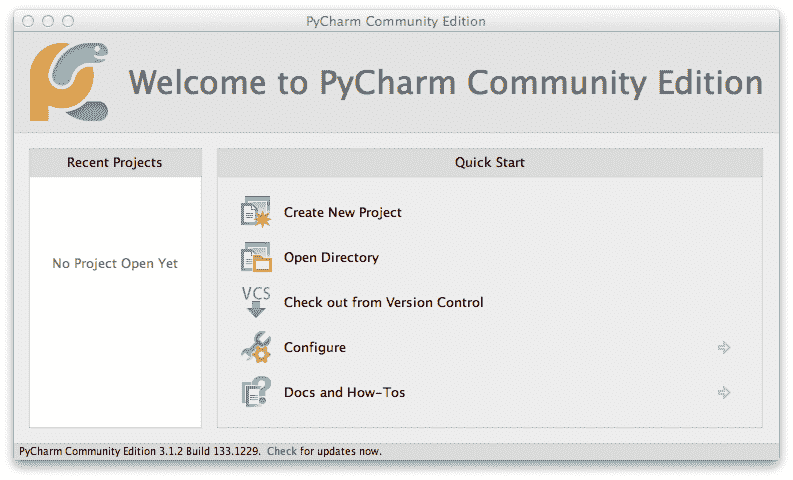

# 第十九章. 成为 Pythonista

> 一直想回到过去试试和年轻时的自己斗智斗勇？软件开发就是你的职业选择！
> 
> [Elliot Loh](http://bit.ly/loh-tweet)

本章专注于 Python 开发的艺术和科学，提供“最佳实践”建议。吸收它们，你也能成为一名 Pythonista。

# 关于编程

首先，根据个人经验谈一些关于编程的注意事项。

我最初的职业路径是科学，我自学编程来分析和展示实验数据。我曾以为计算机编程会像我对会计的印象一样——精确但乏味。我惊讶地发现我很喜欢它。其中一部分乐趣来自逻辑方面——像解谜题一样——但部分也来自创造性。你必须正确地编写程序才能得到正确的结果，但你有自由按照自己的方式编写。这是左右脑思维的一种不寻常的平衡。

在我迷失在编程职业的道路后，我也发现这个领域有很多不同的小众，有着截然不同的任务和人群。你可以深入研究计算机图形学、操作系统、商业应用甚至科学领域。

如果你是一名程序员，你可能也有类似的经历。如果不是，你可以尝试一点编程，看看它是否适合你的个性，或者至少能帮助你完成一些任务。正如我在这本书的早期可能提到的那样，数学技能并不是那么重要。似乎最重要的是逻辑思维能力，语言天赋也有所帮助。最后，耐心也很重要，特别是当你在代码中追踪一个难以捉摸的 bug 时。

# 查找 Python 代码

当你需要开发一些代码时，最快的解决方案是从允许的来源“借”一些代码。

Python [标准库](http://docs.python.org/3/library)非常广泛、深入且大部分清晰。深入其中，寻找那些珍珠吧。

就像各种体育名人堂一样，一个模块要进入标准库需要时间。新的包不断出现在外面，本书中我突出了一些新功能或者更好的旧功能。Python 被宣传为“内置电池”，但你可能需要一种新型电池。

那么，在标准库之外，你应该去哪里寻找好的 Python 代码？

首先要查找的地方是[Python Package Index (PyPI)](https://pypi.org)。这个网站之前被称为蒙提·派森小品《奶酪商店》（*Cheese Shop*），我写作时这个网站上不断更新着 Python 的包——超过 113,000 个。当你使用 `pip`（见下一节）时，它会搜索 PyPI。主 PyPI 页面显示了最近添加的包。你还可以通过在 PyPI 主页中间的搜索框中输入内容进行直接搜索。例如，`genealogy` 返回 21 个匹配项，`movies` 返回 528 个。

另一个流行的存储库是 GitHub。查看当前哪些 Python 包正在[流行](https://github.com/trending?l=python)。

[热门 Python 示例](http://bit.ly/popular-recipes)拥有超过四千个短的 Python 程序，涵盖各个主题。

# 安装包

有许多安装 Python 包的方法：

+   如果可以的话，请使用`pip`。这是目前最常见的方法。你可以使用`pip`安装大多数你可能遇到的 Python 包。

+   使用`pipenv`，它结合了`pip`和`virtualenv`

+   有时，你可以使用操作系统的包管理器。

+   如果你经常从事科学工作并想使用 Anaconda Python 发行版，请使用`conda`。有关详情，请参阅“安装 Anaconda”。

+   从源码安装。

如果你对同一领域的几个包感兴趣，你可以找到一个已经包含它们的 Python 发行版。例如，在第二十二章中，你可以尝试一些数字和科学程序，这些程序单独安装会很繁琐，但在 Anaconda 等发行版中已经包含在内。

## 使用 pip

Python 包装存在一些限制。一个早期的安装工具叫做`easy_install`已经被一个叫做`pip`的工具取代，但它们都没有被包含在标准的 Python 安装中。如果你应该使用`pip`来安装东西，那你从哪里获取`pip`？从 Python 3.4 开始，`pip`最终将包含在 Python 的其他部分中，以避免这种存在危机。如果你正在使用较早版本的 Python 3 并且没有`pip`，你可以从[*http://www.pip-installer.org*](http://www.pip-installer.org)获取它。

使用`pip`的最简单方法是使用以下命令安装最新版本的单个包：

```py
$ pip install flask
```

你将看到它正在做什么，这样你就不会认为它在闲着：下载、运行 *setup.py*、在你的磁盘上安装文件等细节。

你也可以要求`pip`安装特定版本：

```py
$ pip install flask==0.9.0
```

或者，一个最小版本（当你不能没有某个特定版本的功能时，这是很有用的）：

```py
$ pip install 'flask≥0.9.0'
```

在上面的示例中，那些单引号防止了`>`被 Shell 解释为将输出重定向到一个名为`=0.9.0`的文件。

如果你想安装多个 Python 包，你可以使用一个[requirements 文件](http://bit.ly/pip-require)。虽然它有许多选项，但最简单的用法是一个包的列表，每行一个，可选地带有特定或相对版本：

```py
$ pip -r requirements.txt
```

你的示例 *requirements.txt* 文件可能包含这样的内容：

```py
flask==0.9.0
django
psycopg2
```

更多示例：

+   安装最新版本：`pip install --upgrade *package*`

+   删除一个包：`pip uninstall *package*`

## 使用 virtualenv

安装第三方 Python 包的标准方式是使用`pip`和`virtual``env`。我将展示如何在“安装 virtualenv”中安装`virtualenv`。

*虚拟环境*只是一个包含 Python 解释器、像`pip`这样的其他程序和一些包的目录。你可以通过运行虚拟环境中`bin`目录下的`activate`脚本来*激活*它。这会设置环境变量`$PATH`，你的 shell 用它来查找程序。通过激活虚拟环境，你将其`bin`目录放在通常的目录如`/bin`、`/usr/bin`或`/usr/local/bin`之前。结果是，当你输入像`pip`或`python`这样的命令时，你的 shell 首先在虚拟环境中找到它们，而不是系统目录中的版本。

你不想将软件安装到这些系统目录中，因为：

+   你没有写入它们的权限。

+   即使可以，覆盖系统的标准程序（如`python`）可能会引起问题。

## 使用 pipenv

最近有一个叫做[pipenv](http://docs.pipenv.org)的包结合了我们的朋友`pip`和`virtualenv`。它还解决了在不同环境中（例如本地开发机器、测试和生产环境）使用`pip`时可能出现的依赖问题。

```py
$ pip install pipenv
```

[Python Packaging Authority](https://www.pypa.io)推荐使用它——一个致力于改进 Python 打包工作流程的工作组。这不同于定义核心 Python 本身的组织，所以`pipenv`不是标准库的一部分。

## 使用包管理器

Apple 的 macOS 包括第三方包管理器[homebrew](http://brew.sh)（`brew`）和[`ports`](http://www.macports.org)。它们有点像`pip`，但不限于 Python 包。

Linux 对于每个发行版有不同的管理器。最流行的是`apt-get`、`yum`、`dpkg`和`zypper`。

Windows 有 Windows Installer 和带有*.msi*后缀的包文件。如果你在 Windows 上安装 Python，可能是以 MSI 格式。

## 从源代码安装

有时，一个 Python 包是新的，或者作者还没有通过`pip`提供它。要构建这个包，通常需要执行以下步骤：

+   下载代码。

+   如果文件已经被归档或压缩，使用`zip`、`tar`或其他适当的工具来提取它们。

+   在包含*setup.py*文件的目录中运行`python setup.py install`。

###### 注意

一如既往，请注意你下载和安装的内容。在 Python 程序中隐藏恶意软件稍微困难些，因为它们是可读文本，但确实发生过。

# 集成开发环境

我在本书中的程序都用纯文本界面，但这并不意味着你需要在控制台或文本窗口中运行所有内容。有许多免费和商业的集成开发环境（IDE），它们是带有文本编辑器、调试器、库搜索等工具支持的图形界面。

## IDLE

[IDLE](http://bit.ly/py-idle)是唯一包含在标准发行版中的 Python IDE。它基于 tkinter，其 GUI 界面简单。

## PyCharm

[PyCharm](http://www.jetbrains.com/pycharm) 是一个具有许多功能的新型图形 IDE。社区版是免费的，你可以获得专业版的免费许可证，用于课堂或开源项目中。Figure 19-1 显示了它的初始显示。



###### 图 19-1\. PyCharm 的启动界面

## IPython

[iPython](http://ipython.org) 最初是一个增强的文本 Python IDE 终端，但随后演变成具有类似“笔记本”的图形界面。它集成了许多本书讨论的包，包括 Matplotlib 和 NumPy，并成为科学计算中的热门工具。

你可以使用 `pip install ipython` 安装基本的文本版本。当你启动它时，你会看到类似于这样的界面：

```py
$ ipython
Python 3.7.3 (v3.7.3:ef4ec6ed12, Mar 25 2019, 16:39:00)
Type 'copyright', 'credits' or 'license' for more information
IPython 7.3.0 -- An enhanced Interactive Python. Type '?' for help.

In [1]:

```

正如你所知，标准的 Python 解释器使用输入提示符 `>>>` 和 `...` 来指示何时何地应该输入代码。IPython 会将你输入的所有内容记录在一个名为 `In` 的列表中，将所有的输出记录在 `Out` 中。每个输入可能包含多行，因此，你可以按住 Shift 键并同时按 Enter 键来提交它。

这是一个单行示例：

```py
In [1]: print("Hello? World?")
Hello? World?

In [2]:
```

`In` 和 `Out` 是自动编号的列表，让你可以访问你输入的任何输入或收到的输出。

如果你在一个变量后面输入 `?`，IPython 将告诉你它的类型、值、创建该类型变量的方法以及一些解释：

```py
In [4]: answer = 42

In [5]: answer?
```

```py
Type:       int
String Form:42
Docstring:
int(x=0) -> integer
int(x, base=10) -> integer

Convert a number or string to an integer, or return 0 if no arguments
are given.  If x is a number, return x.__int__().  For floating point
numbers, this truncates towards zero.

If x is not a number or if base is given, then x must be a string,
bytes, or bytearray instance representing an integer literal in the
given base.  The literal can be preceded by '+' or '-' and be surrounded
by whitespace.  The base defaults to 10\.  Valid bases are 0 and 2-36.
Base 0 means to interpret the base from the string as an integer literal.
>>> int('0b100', base=0)
4
```

名称查找是像 IPython 这样的 IDE 的一个流行特性。如果你在一些字符后面立即按 Tab 键，IPython 将显示所有以这些字符开头的变量、关键字和函数。让我们定义一些变量，然后找出所有以字母 `f` 开头的内容：

```py
In [6]: fee = 1

In [7]: fie = 2

In [8]: fo = 3

In [9]: fum = 4

In [10]: f*tab*
%%file    fie       finally   fo        format    frozenset
fee       filter    float     for       from      fum
```

如果你输入 `fe`，然后按 Tab 键，它会展开为变量 `fee`，在这个程序中，它是以 `fe` 开头的唯一内容：

```py
In [11]: fee
Out[11]: 1
```

IPython 还有更多功能。看看它的 [教程](https://oreil.ly/PIvVK)，了解它的特性。

## Jupyter Notebook

[Jupyter](https://jupyter.org) 是 IPython 的一个进化。它的名称结合了数据科学和科学计算中流行的 Julia、Python 和 R 语言。Jupyter Notebooks 是一种现代的方式，可以用于开发和发布你的代码，并包含任何这些语言的文档。

如果你想在计算机上安装任何东西之前先玩一下，你可以首先在你的网络浏览器中 [试试](https://jupyter.org/try)。

要在本地安装 Jupyter Notebook，请输入 `pip install jupyter`。使用 `jupyter notebook` 命令来运行它。

## JupyterLab

JupyterLab 是 Jupyter Notebook 的下一代，并最终将取代它。和 Notebook 一样，你可以在浏览器中 [试用](https://jupyter.org/try) JupyterLab。你可以通过 `pip install jupyterlab` 在本地安装它，然后用 `jupyter lab` 运行它。

# 名称和文档

你不会记得自己写了什么。有时候，我看着自己最近写的代码，想知道它到底是从哪儿来的。这就是为什么文档化你的代码很有帮助。文档可以包括注释和文档字符串，但也可以包括对变量、函数、模块和类进行信息丰富的命名。不要过度追求，就像这个例子中一样：

```py
>>> # I'm going to assign 10 to the variable "num" here:
... num = 10
>>> # I hope that worked
... print(num)
10
>>> # Whew.
```

相反，说清楚*为什么*你给变量赋值`10`。指出为什么叫变量名为`num`。如果你正在写经典的华氏度到摄氏度转换器，你可能会命名变量来解释它们的作用，而不是一团神奇的代码。而且一点测试代码也不会有什么坏处（示例 19-1）。

##### 示例 19-1\. ftoc1.py

```py
def ftoc(f_temp):
    "Convert Fahrenheit temperature <f_temp> to Celsius and return it."
    f_boil_temp = 212.0
    f_freeze_temp = 32.0
    c_boil_temp = 100.0
    c_freeze_temp = 0.0
    f_range = f_boil_temp - f_freeze_temp
    c_range = c_boil_temp - c_freeze_temp
    f_c_ratio = c_range / f_range
    c_temp = (f_temp - f_freeze_temp) * f_c_ratio + c_freeze_temp
    return c_temp

if __name__ == '__main__':
    for f_temp in [-40.0, 0.0, 32.0, 100.0, 212.0]:
        c_temp = ftoc(f_temp)
        print('%f F => %f C' % (f_temp, c_temp))
```

让我们运行测试：

```py
$ python ftoc1.py
```

```py
-40.000000 F => -40.000000 C
0.000000 F => -17.777778 C
32.000000 F => 0.000000 C
100.000000 F => 37.777778 C
212.000000 F => 100.000000 C
```

我们可以做（至少）两个改进：

+   Python 没有常量，但 PEP8 样式表 [建议](http://bit.ly/pep-constant) 在命名变量时使用大写字母和下划线（例如 `ALL_CAPS`）。让我们在我们的示例中将那些看起来像常量的变量重命名。

+   因为我们基于常量值预计算值，让我们将它们移到模块的顶层。然后，它们将只在每次调用`ftoc()`函数时计算一次，而不是每次调用时都计算。

示例 19-2 展示了我们重做的结果。

##### 示例 19-2\. ftoc2.py

```py
F_BOIL_TEMP = 212.0
F_FREEZE_TEMP = 32.0
C_BOIL_TEMP = 100.0
C_FREEZE_TEMP = 0.0
F_RANGE = F_BOIL_TEMP - F_FREEZE_TEMP
C_RANGE = C_BOIL_TEMP - C_FREEZE_TEMP
F_C_RATIO = C_RANGE / F_RANGE

def ftoc(f_temp):
    "Convert Fahrenheit temperature <f_temp> to Celsius and return it."
    c_temp = (f_temp - F_FREEZE_TEMP) * F_C_RATIO + C_FREEZE_TEMP
    return c_temp

if __name__ == '__main__':
    for f_temp in [-40.0, 0.0, 32.0, 100.0, 212.0]:
        c_temp = ftoc(f_temp)
        print('%f F => %f C' % (f_temp, c_temp))
```

# 添加类型提示

静态语言要求您定义变量的类型，并且它们可以在编译时捕获一些错误。如您所知，Python 不会这样做，只有在运行代码时才会遇到错误。Python 变量是名称，只是引用实际对象。对象具有严格的类型，但名称可以随时指向任何对象。

然而，在实际代码中（无论是 Python 还是其他语言），名称往往指向特定的对象。至少在文档中，如果我们能够注释事物（变量、函数返回等）与我们期望它们引用的对象类型，则会有所帮助。然后，开发人员就不需要查看那么多代码来了解特定变量应该如何操作。

Python 3.x 添加了*类型提示*（或*类型注释*）来解决这个问题。这完全是可选的，并且不会强制变量的类型。它帮助那些习惯于静态语言的开发人员，其中变量类型*必须*声明。

一个将数字转换为字符串的函数的提示看起来是这样的：

```py
def num_to_str(num: int) -> str:
    return str(num)
```

这些只是提示，并不会改变 Python 的运行方式。它们的主要用途是用于文档，但人们正在找到更多用途。例如，[FastAPI](https://fastapi.tiangolo.com) web 框架使用提示生成带有实时表单用于测试的 web 文档。

# 测试

你可能已经知道了，但如果不知道的话：即使是微不足道的代码更改也可能会破坏你的程序。Python 缺乏静态语言的类型检查，这使得某些事情变得更容易，但也让不良结果通过了大门。测试是必不可少的。

测试 Python 程序的最简单方法是添加`print()`语句。Python 交互式解释器的 REPL（Read-Evaluate-Print Loop）允许您快速编辑和测试更改。但是，在生产代码中您不希望有`print()`语句，因此需要记住全部删除它们。

## 使用 pylint、pyflakes、flake8 或 pep8 进行检查

在创建实际测试程序之前的下一步是运行 Python 代码检查器。最流行的是[`pylint`](http://www.pylint.org)和[`pyflakes`](http://bit.ly/pyflakes)。您可以使用`pip`安装其中一个或两个：

```py
$ pip install pylint
$ pip install pyflakes
```

它们检查实际的代码错误（例如在给变量赋值之前引用它）和风格上的失误（代码版的搭配格格不入）。示例 19-3 是一个有错误和风格问题的相当无意义的程序。

##### 示例 19-3\. style1.py

```py
a = 1
b = 2
print(a)
print(b)
print(c)
```

这是`pylint`的初始输出：

```py
$ pylint style1.py
No config file found, using default configuration
************* Module style1
C:  1,0: Missing docstring
C:  1,0: Invalid name "a" for type constant
  (should match (([A-Z_][A-Z0-9_]*)|(__.*__))$)
C:  2,0: Invalid name "b" for type constant
  (should match (([A-Z_][A-Z0-9_]*)|(__.*__))$)
E:  5,6: Undefined variable 'c'
```

在“全局评估”下，我们的分数（10.0 是完美的）进一步下降了：

```py
Your code has been rated at -3.33/10
```

糟糕了。让我们先修复错误。那个以`E`开头的`pylint`输出行表示一个`Error`，因为我们在打印它之前没有给`c`赋值。查看 示例 19-4 看看我们如何修复它。

##### 示例 19-4\. style2.py

```py
a = 1
b = 2
c = 3
print(a)
print(b)
print(c)
```

```py
$ pylint style2.py
```

```py
No config file found, using default configuration
************* Module style2
C:  1,0: Missing docstring
C:  1,0: Invalid name "a" for type constant
  (should match (([A-Z_][A-Z0-9_]*)|(__.*__))$)
C:  2,0: Invalid name "b" for type constant
  (should match (([A-Z_][A-Z0-9_]*)|(__.*__))$)
C:  3,0: Invalid name "c" for type constant
  (should match (([A-Z_][A-Z0-9_]*)|(__.*__))$)
```

很好，不再有`E`行了。我们的分数也从-3.33 上升到了 4.29：

```py
Your code has been rated at 4.29/10
```

`pylint`希望有一个文档字符串（一个简短的文本，位于模块或函数顶部，描述代码），并认为像`a`、`b`和`c`这样的短变量名是俗气的。让我们让`pylint`更开心，并将 *style2.py* 改进为 *style3.py* (示例 19-5)。

##### 示例 19-5\. style3.py

```py
"Module docstring goes here"

def func():
    "Function docstring goes here. Hi, Mom!"
    first = 1
    second = 2
    third = 3
    print(first)
    print(second)
    print(third)

func()
```

```py
$ pylint style3.py
No config file found, using default configuration
```

嘿，没有抱怨。我们的分数呢？

```py
Your code has been rated at 10.00/10
```

大家都很高兴。

另一个风格检查器是[`pep8`](https://pypi.python.org/pypi/pep8)，您现在可能已经可以在睡觉时安装它了：

```py
$ pip install pep8
```

这对我们的风格改头换面有何建议？

```py
$ pep8 style3.py
style3.py:3:1: E302 expected 2 blank lines, found 1
```

要真正时尚，它建议我在初始模块文档字符串后添加一个空行。

## 使用 unittest 进行测试

我们已经验证我们不再侮辱代码之神的审美感，所以让我们转向测试您程序逻辑的实际测试。

在提交代码到任何源代码管理系统之前，先编写独立的测试程序是一个良好的实践。最初编写测试可能看起来很乏味，但它们确实能帮助您更快地发现问题，尤其是*回归*（破坏了曾经工作的东西）。痛苦的经验教会所有开发者，即使是他们发誓不可能影响其他任何东西的微小改变，实际上也会如此。看看写得好的 Python 包，它们总是包含一个测试套件。

标准库中不止一个测试包。让我们从 [`unittest`](https://oreil.ly/ImFmE) 开始。我们将编写一个将单词首字母大写的模块。我们的第一个版本仅使用标准字符串函数 `capitalize()`，结果如我们所见有些意外。将其保存为 *cap.py* (示例 19-6)。

##### 示例 19-6\. cap.py

```py
def just_do_it(text):
    return text.capitalize()
```

测试的基础是决定从特定输入中得到什么结果（这里，您希望输入的任何文本的大写版本），将输入提交给您正在测试的函数，然后检查它是否返回了预期的结果。预期的结果称为*断言*，因此在`unittest`中，您通过使用以`assert`开头的方法（例如在 Example 19-7 中显示的`assertEqual`方法）来检查结果。

将此测试脚本保存为*test_cap.py*。

##### Example 19-7\. test_cap.py

```py
import unittest
import cap

class TestCap(unittest.TestCase):

    def setUp(self):
        pass

    def tearDown(self):
        pass

    def test_one_word(self):
        text = 'duck'
        result = cap.just_do_it(text)
        self.assertEqual(result, 'Duck')

    def test_multiple_words(self):
        text = 'a veritable flock of ducks'
        result = cap.just_do_it(text)
        self.assertEqual(result, 'A Veritable Flock Of Ducks')

if __name__ == '__main__':
    unittest.main()
```

`setUp()`方法在每个测试方法之前调用，而`tearDown()`方法在每个测试方法之后调用。它们的目的是为测试分配和释放外部资源，例如数据库连接或某些测试数据。在这种情况下，我们的测试是独立的，甚至不需要定义`setUp()`和`tearDown()`，但留有空版本也无妨。在我们的测试核心是两个名为`test_one_word()`和`test_multiple_words()`的函数。每个函数都使用不同的输入运行我们定义的`just_do_it()`函数，并检查我们是否得到了预期的结果。好的，让我们运行它。这将调用我们的两个测试方法：

```py
$ python test_cap.py
```

```py
 F.
 ======================================================================
 FAIL: test_multiple_words (__main__.TestCap)
 ----------------------------------------------------------------------
 Traceback (most recent call last):
   File "test_cap.py", line 20, in test_multiple_words
  self.assertEqual(result, 'A Veritable Flock Of Ducks')
 AssertionError: 'A veritable flock of ducks' != 'A Veritable Flock Of Ducks'
 - A veritable flock of ducks
 ?   ^         ^     ^  ^
 + A Veritable Flock Of Ducks
 ?   ^         ^     ^  ^

 ----------------------------------------------------------------------
 Ran 2 tests in 0.001s

 FAILED (failures=1)
```

它喜欢第一个测试（`test_one_word`），但不喜欢第二个（`test_multiple_words`）。上箭头（`^`）显示了字符串实际上有所不同的地方。

多个单词有什么特别之处？阅读`string` [`capitalize`](https://oreil.ly/x1IV8)函数的文档提供了一个重要线索：它仅大写第一个单词的第一个字母。也许我们应该先读这个文档。

因此，我们需要另一个函数。在页面底部略微望去，我们找到了[`title()`](https://oreil.ly/CNKNl)。因此，让我们更改*cap.py*以使用`title()`而不是`capitalize()`（Example 19-8）。

##### Example 19-8\. cap.py, revised

```py
def just_do_it(text):
    return text.title()
```

重新运行测试，看看会发生什么：

```py
$ python test_cap.py
```

```py
 ..
 ----------------------------------------------------------------------
 Ran 2 tests in 0.000s

 OK
```

一切都很好。好吧，实际上并不是。我们需要在*test_cap.py*中至少再添加一个方法来测试（Example 19-9）。

##### Example 19-9\. test_cap.py, revised

```py
    def test_words_with_apostrophes(self):
        text = "I'm fresh out of ideas"
        result = cap.just_do_it(text)
        self.assertEqual(result, "I'm Fresh Out Of Ideas")
```

继续尝试一下：

```py
$ python test_cap.py
```

```py
 ..F
 ======================================================================
 FAIL: test_words_with_apostrophes (__main__.TestCap)
 ----------------------------------------------------------------------
 Traceback (most recent call last):
   File "test_cap.py", line 25, in test_words_with_apostrophes
     self.assertEqual(result, "I'm Fresh Out Of Ideas")
 AssertionError: "I'M Fresh Out Of Ideas" != "I'm Fresh Out Of Ideas"
 - I'M Fresh Out Of Ideas
 ?   ^
 + I'm Fresh Out Of Ideas
 ?   ^

 ----------------------------------------------------------------------
 Ran 3 tests in 0.001s

 FAILED (failures=1)
```

我们的函数将`I'm`中的`m`大写化了。快速查阅`title()`的文档后显示，它不能很好地处理撇号。我们*真的*应该先完整地阅读整个文本。

在`string`文档的底部还有另一个候选：一个名为`capwords()`的辅助函数。让我们在*cap.py*中使用它（Example 19-10）。

##### Example 19-10\. cap.py, re-revised

```py
def just_do_it(text):
    from string import capwords
    return capwords(text)
```

```py
$ python test_cap.py
```

```py
...
----------------------------------------------------------------------
Ran 3 tests in 0.004s

OK
```

终于，我们终于完成了！嗯，不对。我们还需要在*test_cap.py*中添加另一个测试（Example 19-11）。

##### Example 19-11\. test_cap.py, re-revised

```py
    def test_words_with_quotes(self):
        text = "\"You're despicable,\" said Daffy Duck"
        result = cap.just_do_it(text)
        self.assertEqual(result, "\"You're Despicable,\" Said Daffy Duck")
```

它工作了吗？

```py
$ python test_cap.py
```

```py
...F
======================================================================
FAIL: test_words_with_quotes (__main__.TestCap)
----------------------------------------------------------------------
Traceback (most recent call last):
  File "test_cap.py", line 30, in test_words_with_quotes
    self.assertEqual(result, "\"You're
    Despicable,\" Said Daffy Duck") AssertionError: '"you\'re Despicable,"
        Said Daffy Duck'
 != '"You\'re Despicable," Said Daffy Duck' - "you're Despicable,"
        Said Daffy Duck
?  ^ + "You're Despicable," Said Daffy Duck
?  ^
----------------------------------------------------------------------
Ran 4 tests in 0.004s

FAILED (failures=1)
```

看起来第一个双引号甚至搞混了我们到目前为止最喜欢的大写功能`capwords`。它尝试大写`"`，并小写了其余部分（`You're`）。我们还应该测试我们的大写器是否会保留字符串的其余部分。

以职业测试为生的人对于发现这些边缘情况有一种天赋，但开发人员在自己的代码中往往有盲点。

`unittest`提供了一组小而强大的断言，让你可以检查值，确认是否有你想要的类，确定是否引发了错误等等。

## 使用 doctest 进行测试

标准库中的第二个测试包是[`doctest`](http://bit.ly/py-doctest)。使用这个包，你可以在文档字符串内部编写测试，同时作为文档。它看起来像交互式解释器：字符`>>>`，然后是调用，然后是下一行的结果。你可以在交互式解释器中运行一些测试，然后将结果粘贴到你的测试文件中。让我们将我们旧的*cap.py*修改为*cap2.py*（去掉那个带引号的麻烦的最后一个测试），如示例 19-12 所示。

##### 示例 19-12\. cap2.py

```py
def just_do_it(text):
    """
 >>> just_do_it('duck')
 'Duck'
 >>> just_do_it('a veritable flock of ducks')
 'A Veritable Flock Of Ducks'
 >>> just_do_it("I'm fresh out of ideas")
 "I'm Fresh Out Of Ideas"
 """
    from string import capwords
    return capwords(text)

if __name__ == '__main__':
    import doctest
    doctest.testmod()
```

当你运行它时，如果所有测试都通过，它不会打印任何内容：

```py
$ python cap2.py
```

给它加上详细选项（`-v`），看看到底发生了什么：

```py
$ python cap2.py -v
```

```py
Trying:
    just_do_it('duck')
    Expecting:
    'Duck'
ok
Trying:
     just_do_it('a veritable flock of ducks')
Expecting:
     'A Veritable Flock Of Ducks'
ok
Trying:
     just_do_it("I'm fresh out of ideas")
Expecting:
     "I'm Fresh Out Of Ideas"
ok
1 items had no tests:
     __main__
1 items passed all tests:
    3 tests in __main__.just_do_it
3 tests in 2 items.
3 passed and 0 failed.
Test passed.
```

## 使用 nose 进行测试

第三方包叫做[`nose`](https://oreil.ly/gWK6r)是`unittest`的另一种选择。这里是安装它的命令：

```py
$ pip install nose
```

你不需要创建一个包含测试方法的类，就像我们在`unittest`中所做的那样。任何函数名中包含`test`的函数都会被运行。让我们修改我们`unittest`的最新版本，并保存为*test_cap_nose.py*（示例 19-13）。

##### 示例 19-13\. test_cap_nose.py

```py
import cap2
from nose.tools import eq_

def test_one_word():
    text = 'duck'
    result = cap.just_do_it(text)
    eq_(result, 'Duck')

def test_multiple_words():
    text = 'a veritable flock of ducks'
    result = cap.just_do_it(text)
    eq_(result, 'A Veritable Flock Of Ducks')

def test_words_with_apostrophes():
    text = "I'm fresh out of ideas"
    result = cap.just_do_it(text)
    eq_(result, "I'm Fresh Out Of Ideas")

def test_words_with_quotes():
    text = "\"You're despicable,\" said Daffy Duck"
    result = cap.just_do_it(text)
    eq_(result, "\"You're Despicable,\" Said Daffy Duck")
```

运行测试：

```py
$ nosetests test_cap_nose.py
```

```py
...F
======================================================================
FAIL: test_cap_nose.test_words_with_quotes
----------------------------------------------------------------------
Traceback (most recent call last):
  File "/Users/.../site-packages/nose/case.py", line 198, in runTest
    self.test(*self.arg)
  File "/Users/.../book/test_cap_nose.py", line 23, in test_words_with_quotes
    eq_(result, "\"You're Despicable,\" Said Daffy Duck")
AssertionError: '"you\'re Despicable," Said Daffy Duck'      !=
'"You\'re Despicable," Said Daffy Duck'
----------------------------------------------------------------------
Ran 4 tests in 0.005s

FAILED (failures=1)
```

这是我们在使用`unittest`进行测试时发现的同样的 bug；幸运的是，本章末尾有一个修复它的练习。

## 其他测试框架

由于某些原因，人们喜欢编写 Python 测试框架。如果你感兴趣，可以看看其他流行的一些：

+   [`tox`](http://tox.readthedocs.org)

+   [`py.test`](https://pytest.org)

+   [`green`](https://github.com/CleanCut/green)

## 持续集成

当你的团队每天输出大量代码时，自动化测试在变更到来时会很有帮助。你可以自动化源代码控制系统以在检入时对所有代码运行测试。这样，每个人都知道是否有人*破坏了构建*，然后提前吃午餐——或者找新工作。

这些都是庞大的系统，我这里不会详细讨论安装和使用细节。万一有一天你需要它们，你会知道在哪里找到它们：

[`buildbot`](http://buildbot.net)

这个源代码控制系统用 Python 编写，自动化了构建、测试和发布。

[`jenkins`](http://jenkins-ci.org)

这是用 Java 编写的，似乎是目前首选的 CI 工具。

[`travis-ci`](http://travis-ci.com)

这个自动化项目托管在 GitHub 上，并且对开源项目是免费的。

[`circleci`](https://circleci.com)

这个是商业的，但对于开源项目和私有项目是免费的。

# 调试 Python 代码

> 调试就像是一部侦探电影中你既是侦探又是凶手的情节。
> 
> 菲利普·福尔特斯
> 
> 每个人都知道调试比一开始编写程序要难两倍。所以如果你在编写时尽可能聪明，你将如何调试呢？
> 
> Brian Kernighan

先测试。你的测试越好，后面就需要修复的 bug 就越少。然而，bug 会发生，需要在稍后找到并修复。

当代码出错时，通常是因为你刚刚做的某事。因此，你通常会“自下而上”调试，从最近的更改开始。¹

但有时候原因在别处，可能是你信任并认为有效的某些东西。你会认为如果有问题是由很多人使用的东西引起的，现在应该已经有人注意到了。但事实并不总是如此。我遇到的最棘手的 bug，每一个都花了一周以上的时间来修复，都是由外部原因引起的。所以，在责怪镜子中的那个人之后，要质疑你的假设。这是一种“自上而下”的方法，而且需要更长的时间。

以下是一些调试技术，从快速且脏到更慢但通常同样脏的技术。

## 使用 print()

在 Python 中调试的最简单方法是打印字符串。一些有用的要打印的东西包括 `vars()`，它提取你的局部变量的值，包括函数参数：

```py
>>> def func(*args, **kwargs):
...     print(vars())
...
>>> func(1, 2, 3)
{'args': (1, 2, 3), 'kwargs': {}}
>>> func(['a', 'b', 'argh'])
{'args': (['a', 'b', 'argh'],), 'kwargs': {}}
```

通常值得打印的其他东西包括 `locals()` 和 `globals()`。

如果你的代码还包括普通的打印输出，你可以使用 `print(*stuff*, file=sys.stderr)` 将你的调试信息写入标准错误输出。

## 使用装饰器

正如你在“装饰器”中所读到的，装饰器可以在函数之前或之后调用代码，而不修改函数本身的代码。这意味着你可以在任何 Python 函数之前或之后使用装饰器来执行某些操作，而不仅仅是你编写的函数。让我们定义一个装饰器 `dump` 来打印任何函数在被调用时的输入参数和输出值（设计者知道装饰时经常需要装饰），如 示例 19-14 所示。

##### 示例 19-14\. dump.py

```py
def dump(func):
    "Print input arguments and output value(s)"
    def wrapped(*args, **kwargs):
        print("Function name:", func.__name__)
        print("Input arguments:", ' '.join(map(str, args)))
        print("Input keyword arguments:", kwargs.items())
        output = func(*args, **kwargs)
        print("Output:", output)
        return output
    return wrapped
```

现在是被装饰的函数。这是一个名为 `double()` 的函数，它期望数值参数，可以是命名的或未命名的，并将它们以列表形式返回，其中包含它们的值加倍（参见 示例 19-15）。

##### 示例 19-15\. test_dump.py

```py
from dump import dump

@dump
def double(*args, **kwargs):
    "Double every argument"
    output_list = [ 2 * arg for arg in args ]
    output_dict =  { k:2*v for k,v in kwargs.items() }
    return output_list, output_dict

if __name__ == '__main__':
    output = double(3, 5, first=100, next=98.6, last=-40)
```

花一点时间运行它：

```py
$ python test_dump.py
```

```py
Function name: double
Input arguments: 3 5
Input keyword arguments: dict_items([('first', 100), ('next', 98.6),
    ('last', -40)])
Output: ([6, 10], {'first': 200, 'next': 197.2, 'last': -80})
```

## 使用 pdb

这些技术有所帮助，但有时候没有真正调试器来得有效。大多数集成开发环境都包含了调试器，具有各种功能和用户界面。在这里，我描述了如何使用标准的 Python 调试器，[`pdb`](https://oreil.ly/IIN4y)。

###### 注意

如果你用 `-i` 标志运行你的程序，如果程序失败，Python 就会将你带入它的交互式解释器中。

这是一个依赖数据的 bug 的程序，这种 bug 特别难以找到。这是早期计算机的一个真正的 bug，它让程序员们困惑了很长时间。

我们将读取一个国家和其首都的文件，用逗号分隔，然后将它们写成 *capital*, *country* 的形式。在打印时，它们可能有错误的大写，所以我们也要修正。哦，这里可能会有额外的空格，你会想把它们去掉。最后，尽管程序读到文件末尾会更合理，但由于某种原因，我们的经理告诉我们遇到 `quit` 这个词时要停止（不区分大小写）。示例 19-16 展示了一个样本数据文件。

##### 示例 19-16\. cities.csv

```py
France, Paris
venuzuela,caracas
  LithuaniA,vilnius
     quit
```

让我们设计我们的 *算法*（解决问题的方法）。这是 *伪代码* ——它看起来像一个程序，但只是一种在转换为实际程序之前用普通语言解释逻辑的方法。程序员喜欢 Python 的一个原因是因为它 *看起来很像伪代码*，所以在转换为工作程序时工作量较少：

```py
for each line in the text file:
    read the line
    strip leading and trailing spaces
    if `quit` occurs in the lower-case copy of the line:
        stop
    else:
        split the country and capital by the comma character
        trim any leading and trailing spaces
        convert the country and capital to titlecase
        print the capital, a comma, and the country
```

我们需要从名称中去掉开头和结尾的空格，因为那是一个要求。同样对于与 `quit` 的小写比较和将城市和国家名称转换为首字母大写格式也是如此。既然如此，让我们拿出 *capitals.py*，它肯定能完美运行（示例 19-17）。

##### 示例 19-17\. capitals.py

```py
def process_cities(filename):
    with open(filename, 'rt') as file:
        for line in file:
            line = line.strip()
            if 'quit' in line.lower():
                return
            country, city = line.split(',')
            city = city.strip()
            country = country.strip()
            print(city.title(), country.title(), sep=',')

if __name__ == '__main__':
    import sys
    process_cities(sys.argv[1])
```

让我们尝试使用之前制作的样本数据文件。准备好了，开火：

```py
$ python capitals.py cities.csv
Paris,France
Caracas,Venuzuela
Vilnius,Lithuania
```

看起来很不错！它通过了一个测试，所以让我们把它投入到生产中，处理来自世界各地的首都和国家——直到它失败，但仅限于这个数据文件（示例 19-18）。

##### 示例 19-18\. cities2.csv

```py
argentina,buenos aires
bolivia,la paz
brazil,brasilia
chile,santiago
colombia,Bogotá
ecuador,quito
falkland islands,stanley
french guiana,cayenne
guyana,georgetown
paraguay,Asunción
peru,lima
suriname,paramaribo
uruguay,montevideo
venezuela,caracas
quit
```

程序在打印了数据文件中的 15 行中的 5 行后结束，如下所示：

```py
$ python capitals.py cities2.csv
Buenos Aires,Argentina
La Paz,Bolivia
Brazilia,Brazil
Santiago,Chile
Bogotá,Colombia
```

发生了什么？我们可以继续编辑 *capitals.py*，在可能的地方加入 `print()` 语句，但让我们看看调试器能否帮助我们。

要使用调试器，在命令行中导入 `pdb` 模块，输入 **`-m pdb`**，像这样：

```py
$ python -m pdb capitals.py cities2.csv
```

```py
> /Users/williamlubanovic/book/capitals.py(1)<module>()
-> def process_cities(filename):
(Pdb)
```

这将启动程序并将您放在第一行。如果您输入 **`c`**（*继续*），程序将运行直到正常结束或出现错误：

```py
(Pdb) c
```

```py
Buenos Aires,Argentina
La Paz,Bolivia
Brazilia,Brazil
Santiago,Chile
Bogotá,Colombia
The program finished and will be restarted
> /Users/williamlubanovic/book/capitals.py(1)<module>()
-> def process_cities(filename):
```

它完成了正常的运行，就像我们之前在调试器之外运行时一样。让我们再试一次，使用一些命令来缩小问题所在的范围。它似乎是一个逻辑错误，而不是语法问题或异常（这会打印错误消息）。

输入**`s`**（*step*）逐行步进 Python 代码。这将逐行执行所有 Python 代码：您的代码、标准库的代码以及您可能使用的任何其他模块。当您使用`s`时，还会进入函数并在其中逐步执行。输入**`n`**（*next*）逐行步进，但不会进入函数内部；当您到达函数时，单个`n`将导致整个函数执行并将您带到程序的下一行。因此，当您不确定问题所在时，请使用`s`；当您确信特定函数不是问题的原因时，尤其是如果它是一个长函数，请使用`n`。通常情况下，您会逐步执行自己的代码并跳过库代码，因为这些代码可能已经经过充分测试。让我们使用`s`从程序的开始步进到函数`process_cities()`：

```py
(Pdb) s
```

```py
> /Users/williamlubanovic/book/capitals.py(12)<module>()
 -> if __name__ == '__main__':</pre>
```

```py
(Pdb) s
```

```py
 > /Users/williamlubanovic/book/capitals.py(13)<module>()
 -> import sys
```

```py
(Pdb) s
```

```py
 > /Users/williamlubanovic/book/capitals.py(14)<module>()
 -> process_cities(sys.argv[1])
```

```py
(Pdb) s
```

```py
 --Call--
 > /Users/williamlubanovic/book/capitals.py(1)process_cities()
 -> def process_cities(filename):
```

```py
(Pdb) s
```

```py
 > /Users/williamlubanovic/book/capitals.py(2)process_cities()
 -> with open(filename, 'rt') as file:
```

输入**`l`**（*list*）以查看程序的下几行：

```py
(Pdb) l
```

```py
  1      def process_cities(filename):
  2  ->     with open(filename, 'rt') as file:
  3             for line in file:
  4                 line = line.strip()
  5                 if 'quit' in line.lower():
  6                     return
  7                 country, city = line.split(',')
  8                 city = city.strip()
  9                 country = country.strip()
 10                 print(city.title(), country.title(), sep=',')
 11
 (Pdb)
```

箭头（`->`）表示当前行。

我们可以继续使用`s`或`n`，希望找到一些东西，但让我们使用调试器的一个主要功能：*断点*。断点将在您指定的行停止执行。在我们的情况下，我们想知道为什么在`process_cities()`在读取所有输入行之前退出。第 3 行（`for line in file:`）将读取输入文件中的每一行，因此看起来很无辜。我们可以在函数返回所有数据之前的唯一其他地方是在第 6 行（`return`）。让我们在第 6 行设置一个断点：

```py
(Pdb) b 6
```

```py
Breakpoint 1 at /Users/williamlubanovic/book/capitals.py:6
```

接下来，让我们继续执行程序，直到它命中断点或正常读取所有输入行并完成：

```py
(Pdb) c
```

```py
 Buenos Aires,Argentina
 La Paz,Bolivia
 Brasilia,Brazil
 Santiago,Chile
 Bogotá,Colombia
 > /Users/williamlubanovic/book/capitals.py(6)process_cities()
 -> return
```

啊哈！它在我们的第 6 行断点处停下来了。这表明程序在读取哥伦比亚后的国家后想要早些返回。让我们打印`line`的值来查看我们刚刚读到的内容：

```py
(Pdb) p line
```

```py
'ecuador,quito'
```

有什么特别之处——哦，算了。

真的吗？我们经理从未预料到字符串`quit`会出现在正常数据中，因此将其用作*标记*（结束指示）值的想法真是愚蠢至极。你直接去那里告诉他这一点，而我在这里等着。

如果此时您仍然有工作，您可以使用普通的`b`命令查看所有断点：

```py
(Pdb) b
```

```py
Num Type         Disp Enb   Where
1   breakpoint   keep yes   at /Users/williamlubanovic/book/capitals.py:6
    breakpoint already hit 1 time
```

输入`l`将显示您的代码行、当前行（`->`）和任何断点（`B`）。普通的`l`将从您上次调用`l`的末尾开始列出，因此包括可选的起始行（这里，让我们从第`1`行开始）：

```py
(Pdb) l 1
```

```py
  1      def process_cities(filename):
  2         with open(filename, 'rt') as file:
  3             for line in file:
  4                 line = line.strip()
  5                 if 'quit' in line.lower():
  6 B->                 return
  7                 country, city = line.split(',')
  8                 city = city.strip()
  9                 country = country.strip()
 10                 print(city.title(), country.title(), sep=',')
 11
```

好了，如示例 19-19 所示，让我们修复`quit`测试以仅匹配完整行，而不是其他字符中间。

##### 示例 19-19\. capitals2.py

```py
def process_cities(filename):
    with open(filename, 'rt') as file:
        for line in file:
            line = line.strip()
            if 'quit' == line.lower():
                return
            country, city = line.split(',')
            city = city.strip()
            country = country.strip()
            print(city.title(), country.title(), sep=',')

if __name__ == '__main__':
    import sys
    process_cities(sys.argv[1])
```

再来，带点感情：

```py
$ python capitals2.py cities2.csv
```

```py
Buenos Aires,Argentina
La Paz,Bolivia
Brasilia,Brazil
Santiago,Chile
Bogotá,Colombia
Quito,Ecuador
Stanley,Falkland Islands
Cayenne,French Guiana
Georgetown,Guyana
Asunción,Paraguay
Lima,Peru
Paramaribo,Suriname
Montevideo,Uruguay
Caracas,Venezuela
```

这只是调试器的简要概述，足以展示它的功能及您在大部分时间内会使用的命令。

记住：多测试，少调试。

## 使用`breakpoint()`

在 Python 3.7 中，有一个名为 `breakpoint()` 的新内置函数。如果将其添加到您的代码中，调试器将自动启动并在每个位置暂停。如果没有这个函数，您将需要启动一个像 `pdb` 这样的调试器，并像您之前看到的那样手动设置断点。

默认调试器是您刚刚见过的（`pdb`），但可以通过设置环境变量 `PYTHONBREAKPOINT` 来更改。例如，您可以指定使用基于 Web 的远程调试器 [web-pdb](https://pypi.org/project/web-pdb)：

```py
$ export PYTHONBREAKPOINT='web_pdb.set_trace'
```

官方文档有点枯燥，但这里和那里都有很好的概述 [here](https://oreil.ly/9Q9MZ) 和 [there](https://oreil.ly/2LJKy)。

# 记录错误消息

在某些时候，您可能需要从使用 `print()` 语句转向日志消息。日志通常是累积消息的系统文件，通常会插入有用的信息，例如时间戳或运行程序的用户名称。通常日志会按日进行“轮换”（重命名）并进行压缩；通过这样做，它们不会填满您的磁盘并引发问题。当程序出现问题时，您可以查看适当的日志文件以了解发生了什么。异常的内容在日志中特别有用，因为它们显示了程序实际崩溃的行和原因。

标准的 Python 库模块是 [`logging`](http://bit.ly/py-logging)。我发现大多数对它的描述有点令人困惑。过了一会儿就会清楚些，但一开始确实看起来过于复杂。`logging` 模块包括这些概念：

+   您要保存到日志的*消息*

+   排名优先级*级别*及其匹配功能：`debug()`、`info()`、`warn()`、`error()` 和 `critical()`

+   一个或多个作为与模块的主要连接的*记录器*对象

+   将消息定向到您的终端、文件、数据库或其他位置的*处理程序*

+   生成输出的*格式化程序*

+   根据输入进行决策的*过滤器*

对于最简单的日志示例，只需导入模块并使用其中的一些函数：

```py
>>> import logging
>>> logging.debug("Looks like rain")
>>> logging.info("And hail")
>>> logging.warn("Did I hear thunder?")
WARNING:root:Did I hear thunder?
>>> logging.error("Was that lightning?")
ERROR:root:Was that lightning?
>>> logging.critical("Stop fencing and get inside!")
CRITICAL:root:Stop fencing and get inside!
```

您是否注意到 `debug()` 和 `info()` 没有执行任何操作，而其他两个在每条消息之前打印了*LEVEL*:`root`？到目前为止，它就像具有多重人格的 `print()` 语句，其中一些是敌对的。

但它很有用。您可以在日志文件中扫描特定*级别*的特定消息，比较时间戳以查看服务器崩溃前发生了什么等等。

大量查阅文档解答了第一个谜团（我们在一页或两页内到达第二个谜团）：默认优先级*级别*为 `WARNING`，并且在我们调用第一个函数（`logging.debug()`）时已经锁定。我们可以使用 `basicConfig()` 设置默认级别。`DEBUG` 是最低级别，因此启用它将使所有更高级别的消息都可以流经：

```py
>>> import logging
>>> logging.basicConfig(level=logging.DEBUG)
>>> logging.debug("It's raining again")
DEBUG:root:It's raining again
>>> logging.info("With hail the size of hailstones")
INFO:root:With hail the size of hailstones
```

我们在没有实际创建 *logger* 对象的情况下使用了默认的 `logging` 函数。每个日志记录器都有一个名称。让我们创建一个名为 `bunyan` 的日志记录器：

```py
>>> import logging
>>> logging.basicConfig(level='DEBUG')
>>> logger = logging.getLogger('bunyan')
>>> logger.debug('Timber!')
DEBUG:bunyan:Timber!
```

如果日志记录器名称包含任何点字符，它们会分隔成一个层次结构的日志记录器，每个可能具有不同的属性。这意味着命名为 `quark` 的日志记录器高于命名为 `quark.charmed` 的日志记录器。特殊的 *root logger* 处于顶层，称为 `''`。

到目前为止，我们只是打印了一些消息，这与 `print()` 没有太大的改进。我们使用 *handlers* 将消息定向到不同的位置。最常见的是 *log file*，下面是如何做的：

```py
>>> import logging
>>> logging.basicConfig(level='DEBUG', filename='blue_ox.log')
>>> logger = logging.getLogger('bunyan')
>>> logger.debug("Where's my axe?")
>>> logger.warn("I need my axe")
>>>
```

啊哈！现在屏幕上没有这些行了；它们都在名为 *blue_ox.log* 的文件中：

```py
DEBUG:bunyan:Where's my axe?
WARNING:bunyan:I need my axe
```

使用 `filename` 参数调用 `basicConfig()` 为您创建了一个 `FileHandler` 并使其对您的日志记录器可用。`logging` 模块至少包含 15 个处理程序，可将消息发送到诸如电子邮件和 Web 服务器以及屏幕和文件等位置。

最后，您可以控制所记录的消息的 *format*。在我们的第一个例子中，默认值给了我们类似于这样的东西：

```py
WARNING:root:Message...
```

如果您向 `basicConfig()` 提供了一个 `format` 字符串，您可以更改为自己喜欢的格式：

```py
>>> import logging
>>> fmt = '%(asctime)s %(levelname)s %(lineno)s %(message)s'
>>> logging.basicConfig(level='DEBUG', format=fmt)
>>> logger = logging.getLogger('bunyan')
>>> logger.error("Where's my other plaid shirt?")
2014-04-08 23:13:59,899 ERROR 1 Where's my other plaid shirt?
```

我们让日志记录器再次将输出发送到屏幕，但是更改了格式。

`logging` 模块在 `fmt` 格式字符串中识别多个变量名。我们使用了 `asctime`（日期和时间作为 ISO 8601 字符串）、`levelname`、`lineno`（行号）和消息本身。还有其他内置的变量，并且您可以提供自己的变量。

`logging` 的内容远远不止这个小概述所能提供的。您可以同时记录到多个位置，具有不同的优先级和格式。该包具有很大的灵活性，但有时会牺牲简单性。

# 优化

Python 通常足够快——直到它不快。在许多情况下，您可以通过使用更好的算法或数据结构来提高速度。关键在于知道在哪里做这些优化。即使是经验丰富的程序员也会出错得惊人。您需要像细心的被子裁缝一样，在裁剪之前进行测量。这也引出了 *timers*。

## 测量时间

`time()` 函数位于 `time` 模块中，返回当前的时间戳作为一个浮点数秒数。要快速计时某事物，可以获取当前时间，执行某些操作，获取新的时间，然后用新时间减去原始时间。我们将按照 Example 19-20 中的方式编写它，并命名为（当然是）*time1.py*。

##### Example 19-20\. time1.py

```py
from time import time

t1 = time()
num = 5
num *= 2
print(time() - t1)
```

在这个例子中，我们测量将值 `5` 赋给名称 `num` 并将其乘以 `2` 所需的时间。这并不是一个现实的基准测试，只是展示如何测量任意 Python 代码的示例。试着运行几次，看看它的变化：

```py
$ python time1.py
2.1457672119140625e-06
$ python time1.py
2.1457672119140625e-06
$ python time1.py
2.1457672119140625e-06
$ python time1.py
1.9073486328125e-06
$ python time1.py
3.0994415283203125e-06
```

那大约是两三百万分之一秒。让我们尝试一些更慢的东西，比如`sleep()`。² 如果我们睡一秒，我们的计时器应该需要超过一秒钟的微小时间。示例 19-21 展示了代码；将其保存为*time2.py*。

##### 示例 19-21\. time2.py

```py
from time import time, sleep

t1 = time()
sleep(1.0)
print(time() - t1)
```

让我们确定我们的结果，所以运行几次：

```py
$ python time2.py
1.000797986984253
$ python time2.py
1.0010130405426025
$ python time2.py
1.0010390281677246
```

如预期的那样，它大约需要一秒钟才能运行。如果没有，要么我们的计时器，要么`sleep()`应该感到尴尬。

有一种更方便的方法来测量像这样的代码片段：使用标准模块[`timeit`](http://bit.ly/py-timeit)。它有一个名为（你猜对了）`timeit()` 的函数，它将对你的测试*代码*进行*count*次运行并打印一些结果。语法是：``timeit.timeit(*`code`*``, ``number=*`count`*)``。

在本节的示例中，`code`需要放在引号中，这样在按下 Return 键后它不会被执行，但是会在`timeit()`内执行。（在下一节中，您将看到如何通过将其名称传递给`timeit()`来计时一个函数。）让我们只运行一次我们之前的示例并计时它。将此文件命名为*timeit1.py*（示例 19-22）。

##### 示例 19-22\. timeit1.py

```py
from timeit import timeit
print(timeit('num = 5; num *= 2', number=1))
```

运行几次：

```py
$ python timeit1.py
2.5600020308047533e-06
$ python timeit1.py
1.9020008039660752e-06
$ python timeit1.py
1.7380007193423808e-06
```

再次，这两行代码大约运行了两百万分之一秒。我们可以使用`timeit`模块的`repeat()`函数的`repeat`参数来运行更多的集合。将其保存为*timeit2.py*（示例 19-23）。

##### 示例 19-23\. timeit2.py

```py
from timeit import repeat
print(repeat('num = 5; num *= 2', number=1, repeat=3))
```

尝试运行它看看会发生什么：

```py
$ python timeit2.py
[1.691998477326706e-06, 4.070025170221925e-07, 2.4700057110749185e-07]
```

第一次运行花费了两百万分之一秒，第二次和第三次运行更快。为什么？原因可能有很多。首先，我们正在测试一小段代码，它的速度可能取决于计算机在这些瞬间正在做什么，Python 系统如何优化计算以及许多其他因素。

使用`timeit()`意味着将要测量的代码包装为字符串。如果您有多行代码怎么办？您可以传递一个三引号的多行字符串，但这可能很难阅读。

让我们定义一个懒惰的`snooze()`函数，偶尔打个盹，就像我们所有人偶尔做的那样。

首先，我们可以包装`snooze()`函数本身。我们需要包括参数`globals=globals()`（这有助于 Python 找到`snooze`）和`number=1`（仅运行一次；默认为 1000000，我们没有那么多时间）：

```py
>>> import time
>>> from timeit import timeit
>>>
>>> def snooze():
...     time.sleep(1)
...
>>> seconds = timeit('snooze()', globals=globals(), number=1)
>>> print("%.4f" % seconds)
1.0035
```

或者，我们可以使用一个装饰器：

```py
>>> import time
>>>
>>> def snooze():
...     time.sleep(1)
...
>>> def time_decorator(func):
...     def inner(*args, **kwargs):
...         t1 = time.time()
...         result = func(*args, **kwargs)
...         t2 = time.time()
...         print(f"{(t2-t1):.4f}")
...         return result
...     return inner
...
>>> @time_decorator
... def naptime():
...     snooze()
...
>>> naptime()
1.0015
```

另一种方法是使用上下文管理器：

```py
>>> import time
>>>
>>> def snooze():
...     time.sleep(1)
...
>>> class TimeContextManager:
...     def __enter__(self):
...         self.t1 = time.time()
...         return self
...     def __exit__(self, type, value, traceback):
...         t2 = time.time()
...         print(f"{(t2-self.t1):.4f}")
...
>>>
>>> with TimeContextManager():
...     snooze()
...
1.0019
```

`__exit()__` 方法需要三个我们在这里不使用的额外参数；我们可以使用 `*args` 来代替它们。

好的，我们已经看到了许多计时的方法。现在，让我们计时一些代码，以比较不同算法（程序逻辑）和数据结构（存储机制）的效率。

## 算法和数据结构

[Python 之禅](http://bit.ly/zen-py)提出*做一件事应该有一种——最好只有一种——显而易见的方法*。不幸的是，有时候这并不明显，你需要比较不同的选择。例如，使用`for`循环还是列表推导来构建列表更好？而*更好*的意思是什么？是更快，更容易理解，使用更少的内存，还是更符合 Python 风格？

在下一个练习中，我们以不同的方式构建列表，比较速度、可读性和 Python 风格。这是*time_lists.py*的例子(示例 19-24)。

##### 示例 19-24\. time_lists.py

```py
from timeit import timeit

def make_list_1():
    result = []
    for value in range(1000):
        result.append(value)
    return result

def make_list_2():
    result = [value for value in range(1000)]
    return result

print('make_list_1 takes', timeit(make_list_1, number=1000), 'seconds')
print('make_list_2 takes', timeit(make_list_2, number=1000), 'seconds')
```

在每个函数中，我们向列表添加 1,000 个项目，并调用每个函数 1,000 次。请注意，在这个测试中，我们将`timeit()`的第一个参数作为函数名而不是作为字符串代码来调用。让我们运行它：

```py
$ python time_lists.py
```

```py
make_list_1 takes 0.14117428699682932 seconds
make_list_2 takes 0.06174145900149597 seconds
```

列表推导至少比使用`append()`添加项到列表快两倍。总体上，列表推导比手动构建更快。

利用这些想法使你的代码更快。

## Cython、NumPy 和 C 扩展

如果你尽了最大努力仍然无法获得想要的性能，你还有更多的选择。

[Cython](http://cython.org)是 Python 和 C 的混合体，旨在通过一些性能注释将 Python 代码翻译成编译的 C 代码。这些注释相对较少，比如声明一些变量的类型、函数参数或函数返回类型。对于科学计算中的数值计算循环，添加这些提示将使它们快得多——高达一千倍。详见[Cython wiki](https://oreil.ly/MmW_v)获取文档和示例。

你可以在第二十二章中深入了解 NumPy。它是一个用 C 语言编写以提高速度的 Python 数学库。

Python 及其标准库的许多部分为了速度而用 C 编写，并包装在 Python 中供方便使用。这些挂钩可以用于你的应用程序。如果你了解 C 和 Python，并且真的想让你的代码快速运行，编写 C 扩展虽然更难，但改进可能是值得的。

## PyPy

当 Java 大约 20 年前首次出现时，它慢得像一只关节炎的雪纳瑞。然而，当它开始给 Sun 等公司带来真正的利润时，他们投入了数百万美元来优化 Java 解释器和底层的 Java 虚拟机（JVM），借鉴了 Smalltalk 和 LISP 等早期语言的技术。微软同样致力于优化其竞争对手 C#语言和.NET 虚拟机。

没有人拥有 Python，所以没有人努力使其更快。你可能正在使用标准的 Python 实现。它是用 C 语言编写的，通常称为 CPython（不同于 Cython）。

像 PHP、Perl 甚至 Java 一样，Python 并不会被编译成机器语言，而是被翻译成一个中间语言（如*字节码*或 p-码），然后在*虚拟机*中解释。

[PyPy](http://pypy.org)是一个新的 Python 解释器，应用了一些加速 Java 的技巧。其[基准测试](http://speed.pypy.org)显示，PyPy 在每个测试中都比 CPython 快——平均快六倍以上，在某些情况下甚至快 20 倍。它适用于 Python 2 和 3。你可以下载并使用它来替代 CPython。PyPy 在不断改进，甚至有可能取代 CPython。请查看网站上的最新发布说明，了解它是否适合您的需求。

## Numba

您可以使用[Numba](http://numba.pydata.org)来即时将您的 Python 代码编译成机器码并加速它。

使用通常的安装方法：

```py
$ pip install numba
```

让我们首先看一个普通的 Python 函数，计算斜边：

```py
>>> import math
>>> from timeit import timeit
>>> from numba import jit
>>>
>>> def hypot(a, b):
...     return math.sqrt(a**2 + b**2)
...
>>> timeit('hypot(5, 6)', globals=globals())
0.6349189280000189
>>> timeit('hypot(5, 6)', globals=globals())
0.6348589239999853
```

在首次调用后使用`@jit`装饰器加速调用。

```py
>>> @jit
... def hypot_jit(a, b):
...     return math.sqrt(a**2 + b**2)
...
>>> timeit('hypot_jit(5, 6)', globals=globals())
0.5396156099999985
>>> timeit('hypot_jit(5, 6)', globals=globals())
0.1534771130000081
```

使用`@jit(nopython=True)`可以避免普通 Python 解释器的开销：

```py
>>> @jit(nopython=True)
... def hypot_jit_nopy(a, b):
...     return math.sqrt(a**2 + b**2)
...
>>> timeit('hypot_jit_nopy(5, 6)', globals=globals())
0.18343535700000757
>>> timeit('hypot_jit_nopy(5, 6)', globals=globals())
0.15387067300002855
```

Numba 在 NumPy 和其他数学需求严格的包中特别有用。

# 源代码管理

当您处理一小组程序时，通常可以跟踪您的更改，直到您犯了一个愚蠢的错误并且破坏了几天的工作。源代码管理系统有助于保护您的代码免受像您这样的危险力量的侵害。如果您与一组开发人员合作，源代码管理就成为必需品。在 Python 生态中，最流行的开源世界中，Mercurial 和 Git 是最受欢迎的示例。它们都是*分布式*版本控制系统的例子，可以生成代码仓库的多个副本。早期的系统如 Subversion 在单一服务器上运行。

## Mercurial

[Mercurial](http://mercurial-scm.org)是用 Python 编写的。它相当容易学习，有一些子命令可以从 Mercurial 仓库下载代码，添加文件，提交更改，以及合并来自不同来源的更改。[bitbucket](https://bitbucket.org)和[其他网站](http://bit.ly/merc-host)提供免费或商业托管服务。

## Git

[Git](http://git-scm.com)最初是为 Linux 内核开发编写的，但现在在开源社区中普遍存在。它类似于 Mercurial，尽管有些人觉得它稍微难以掌握。[GitHub](http://github.com)是最大的 git 主机，拥有超过一百万个仓库，但也有[许多其他主机](http://bit.ly/githost-scm)。

本书中的独立程序示例可以在[GitHub](https://oreil.ly/U2Rmy)的公共 Git 仓库中找到。如果您的计算机上有`git`程序，可以使用以下命令下载这些程序：

```py
$ git clone https://github.com/madscheme/introducing-python
```

您也可以从 GitHub 页面下载代码：

+   单击“在桌面上克隆”以打开安装了的`git`的计算机版本。

+   单击“下载 ZIP”获取程序的压缩归档文件。

如果你没有`git`但想尝试一下，可以阅读[安装指南](http://bit.ly/git-install)。我在这里讨论的是命令行版本，但你可能对 GitHub 等网站感兴趣，它们提供额外的服务，在某些情况下可能更容易使用；`git`有许多功能，但并不总是直观的。

让我们试驾一下`git`。我们不会走得很远，但这次旅行将展示一些命令及其输出。

创建一个新的目录并切换到该目录：

```py
$ mkdir newdir
$ cd newdir
```

在当前目录*newdir*中创建一个本地的 Git 仓库：

```py
$ git init
```

```py
Initialized empty Git repository in /Users/williamlubanovic/newdir/.git/
```

在*newdir*中创建一个名为*test.py*的 Python 文件，如示例 19-25 所示，其内容如下。

##### 示例 19-25\. test.py

```py
print('Oops')
```

将文件添加到 Git 仓库中：

```py
$ git add test.py
```

你觉得怎么样，Git 先生？

```py
$ git status
```

```py
On branch master

Initial commit

Changes to be committed:
  (use "git rm --cached <file>..." to unstage)

    new file:   test.py
```

这意味着*test.py*是本地仓库的一部分，但其更改尚未提交。让我们来*提交*它：

```py
$ git commit -m "simple print program"
```

```py
 [master (root-commit) 52d60d7] my first commit
  1 file changed, 1 insertion(+)
  create mode 100644 test.py
```

那个`-m "my first commit"`是你的*提交消息*。如果你省略了这一点，`git`将弹出一个编辑器，引导你以这种方式输入消息。这成为该文件的`git`更改历史的一部分。

让我们看看我们当前的状态：

```py
$ git status
```

```py
 On branch master
 nothing to commit, working directory clean
```

好的，所有当前的更改已经提交。这意味着我们可以更改东西而不必担心丢失原始版本。现在调整一下*test.py*—将`Oops`改为`Ops!`并保存文件（示例 19-26）。

##### 示例 19-26\. test.py，修订版

```py
print('Ops!')
```

让我们来看看现在`git`的想法：

```py
$ git status
```

```py
On branch master
Changes not staged for commit:
  (use "git add <file>..." to update what will be committed)
  (use "git checkout -- <file>..." to discard changes in working directory)

    modified:   test.py

no changes added to commit (use "git add" and/or "git commit -a")
```

使用`git diff`查看自上次提交以来更改了哪些行：

```py
$ git diff
```

```py
diff --git a/test.py b/test.py
index 76b8c39..62782b2 100644
--- a/test.py
+++ b/test.py
@@ -1 +1 @@
-print('Oops')
+print('Ops!')
```

如果现在尝试提交这个更改，`git`会抱怨：

```py
$ git commit -m "change the print string"
```

```py
On branch master
Changes not staged for commit:
    modified:   test.py

no changes added to commit
```

那个`staged for commit`短语意味着你需要`add`这个文件，大致翻译过来就是*嘿，git，看这里*：

```py
$ git add test.py
```

你也可以键入`git add .`来添加当前目录中所有已更改的文件；当你实际上已经编辑了多个文件并希望确保检查所有更改时，这非常方便。现在我们可以提交更改：

```py
$ git commit -m "my first change"
```

```py
 [master e1e11ec] my first change
  1 file changed, 1 insertion(&plus;), 1 deletion(-)
```

如果你想要查看所有对*test.py*做过的可怕的事情（最近的在前），使用`git log`命令：

```py
$ git log test.py
```

```py
 commit e1e11ecf802ae1a78debe6193c552dcd15ca160a
 Author: William Lubanovic <bill@madscheme.com>
 Date:   Tue May 13 23:34:59 2014 -0500

     change the print string

 commit 52d60d76594a62299f6fd561b2446c8b1227cfe1
 Author: William Lubanovic <bill@madscheme.com>
 Date:   Tue May 13 23:26:14 2014 -0500

     simple print program
```

# 分发你的程序

你知道你的 Python 文件可以安装在文件和目录中，你知道可以使用`python`解释器运行 Python 程序文件。

较少人知道 Python 解释器还可以执行打包在 ZIP 文件中的 Python 代码。甚至更少人知道特殊的 ZIP 文件（称为[pex 文件](https://pex.readthedocs.io)）也可以使用。

# 克隆本书

你可以获取本书中所有程序的副本。访问[Git 仓库](https://oreil.ly/FbFAE)并按照说明将其复制到本地计算机。如果你有`git`，运行命令`git clone https://github.com/madscheme/introducing-python`在你的计算机上创建一个 Git 仓库。你也可以以 ZIP 格式下载这些文件。

# 如何进一步学习

这是一个简介。它几乎肯定对一些你不关心的事情说得太多，对一些你关心的事情说得不够。让我推荐一些我发现有用的 Python 资源。

## 书籍

我发现以下列表中的书籍特别有用。这些书籍从入门到高级，混合了 Python 2 和 3：

+   Barry, Paul. *Head First Python (2nd Edition)* O’Reilly, 2016.

+   Beazley, David M. *Python Essential Reference (5th Edition)*. Addison-Wesley, 2019.

+   Beazley, David M. and Brian K. Jones. *Python Cookbook (3rd Edition)*. O’Reilly, 2013.

+   Gorelick, Micha and Ian Ozsvald. *High Performance Python*. O’Reilly, 2014.

+   Maxwell, Aaron. *Powerful Python*. Powerful Python Press, 2017.

+   McKinney, Wes. *Python for Data Analysis: Data Wrangling with Pandas, NumPy, and IPython*. O’Reilly, 2012.

+   Ramalho, Luciano. *Fluent Python*. O’Reilly, 2015.

+   Reitz, Kenneth and Tanya Schlusser. *The Hitchhiker’s Guide to Python*. O’Reilly, 2016.

+   Slatkin, Brett. *Effective Python*. Addison-Wesley, 2015.

+   Summerfield, Mark. *Python in Practice: Create Better Programs Using Concurrency, Libraries, and Patterns*. Addison-Wesley, 2013.

当然，还有[更多](https://wiki.python.org/moin/PythonBooks)。

## 网站

这里有一些你可以找到有用教程的网站：

+   [Python for You and Me](https://pymbook.readthedocs.io) 是一本介绍书，有很好的 Windows 覆盖率

+   [Real Python](http://realpython.com) by various authors

+   [Learn Python the Hard Way](http://learnpythonthehardway.org/book) by Zed Shaw

+   [Dive into Python 3](https://oreil.ly/UJcGM) by Mark Pilgrim

+   [Mouse Vs. Python](http://www.blog.pythonlibrary.org) by Michael Driscoll

如果你对跟上 Python 世界发展感兴趣，可以查看这些新闻网站：

+   [comp.lang.python](http://bit.ly/comp-lang-python)

+   [comp.lang.python.announce](http://bit.ly/comp-lang-py-announce)

+   [r/python subreddit](http://www.reddit.com/r/python)

+   [Planet Python](http://planet.python.org/)

最后，这里是一些寻找和下载包的好网站：

+   [The Python Package Index](https://pypi.python.org/pypi)

+   [Awesome Python](https://awesome-python.com)

+   [Stack Overflow Python questions](https://oreil.ly/S1vEL)

+   [ActiveState Python recipes](http://code.activestate.com/recipes/langs/python)

+   [Python packages trending on GitHub](https://github.com/trending?l=python)

## Groups

计算机社区有各种各样的个性：热情洋溢、好争辩、沉闷、时髦、正式等等。Python 社区友好且文明。你可以根据地理位置找到基于 Python 的小组—[meetups](http://python.meetup.com) 和世界各地的本地用户组[LocalUserGroups](https://wiki.python.org/moin/LocalUserGroups)。其他群体是分布式的，基于共同的兴趣。例如，[PyLadies](http://www.pyladies.com) 是一个支持对 Python 和开源感兴趣的女性的网络。

## Conferences

在许多[会议](http://www.pycon.org)和[世界各地的研讨会](https://www.python.org/community/workshops)中，最大的年度活动分别在[北美](https://us.pycon.org)和[欧洲](https://europython.eu/en)举行。

## 获取 Python 工作

有用的搜索网站包括：

+   [Indeed](https://www.indeed.com)

+   [Stack Overflow](https://stackoverflow.com/jobs)

+   [ZipRecruiter](https://www.ziprecruiter.com/candidate/suggested-jobs)

+   [Simply Hired](https://www.simplyhired.com)

+   [CareerBuilder](https://www.careerbuilder.com)

+   [Google](https://www.google.com/search?q=jobs)

+   [领英](https://www.linkedin.com/jobs/search)

对于大多数这些网站，请在第一个框中键入`python`，在另一个框中输入您的位置。像这样的好地方包括像这个链接一样的 Craigslist，用于[西雅图](https://seattle.craigslist.org/search/jjj)。只需将`seattle`部分更改为`sfbay`、`boston`、`nyc`或其他 Craigslist 网站前缀以搜索这些地区。对于远程（远程工作或“在家工作”）Python 工作，特殊网站包括：

+   [Indeed](https://oreil.ly/pFQwb)

+   [Google](https://oreil.ly/LI529)

+   [领英](https://oreil.ly/nhV6s)

+   [Stack Overflow](https://oreil.ly/R23Tx)

+   [远程 Python](https://oreil.ly/bPW1I)

+   [我们远程办公](https://oreil.ly/9c3sC)

+   [ZipRecruiter](https://oreil.ly/ohwAY)

+   [Glassdoor](https://oreil.ly/tK5f5)

+   [远程工作岗位](https://oreil.ly/MkMeg)

+   [Working Nomads](https://oreil.ly/uHVE3)

+   [GitHub](https://oreil.ly/smmrZ)

# 即将到来

但是等等，还有更多！接下来的三章将介绍 Python 在艺术、商业和科学领域的应用。你会发现至少一个你想要探索的包。网络上充满了闪亮的物体。只有你能分辨出哪些是假的珠宝，哪些是银弹。即使你目前没有被狼人困扰，你可能也希望口袋里有些银弹。以防万一。

最后，我们有了那些让人烦恼的章节末尾练习的答案，Python 及其伙伴安装的详细信息，以及一些常常需要查找的备忘单。你的大脑几乎肯定更精通，但如果需要，它们在那里。

# 要做的事情

（Python 爱好者今天没有家庭作业。）

¹ 你作为侦探：“我知道我在里面！如果我不举手投降，我就要自己出来！”

² 许多计算机书籍在定时示例中使用 Fibonacci 数字计算，但我宁愿睡觉也不愿意计算 Fibonacci 数字。
