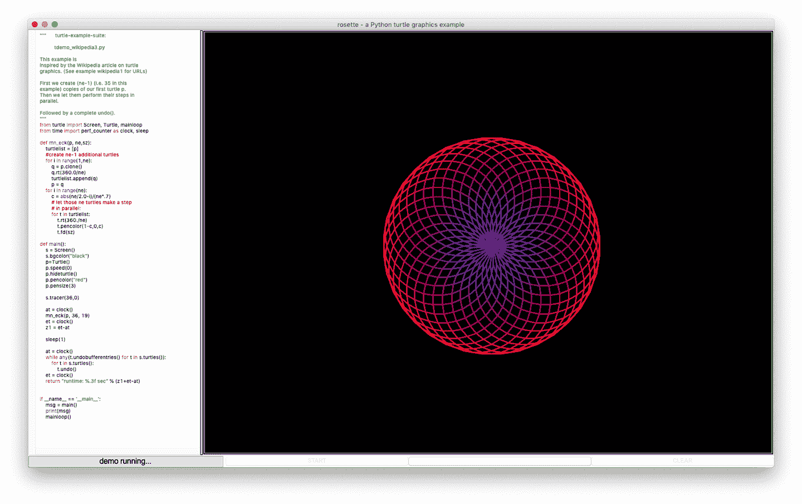
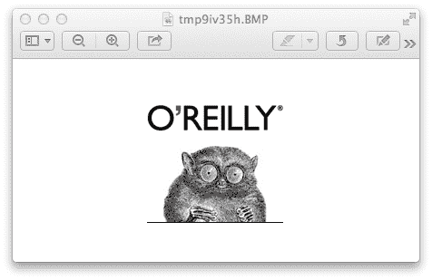
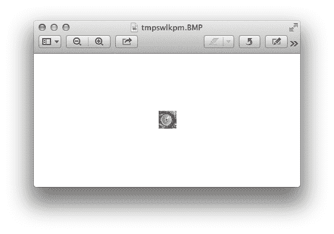
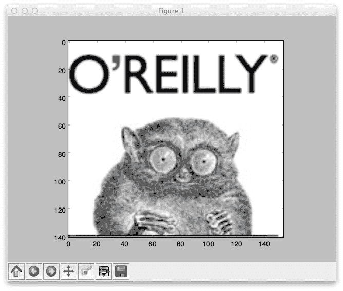
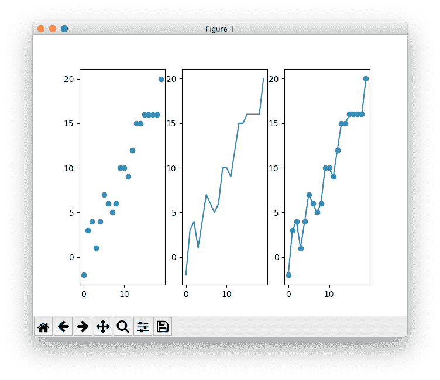
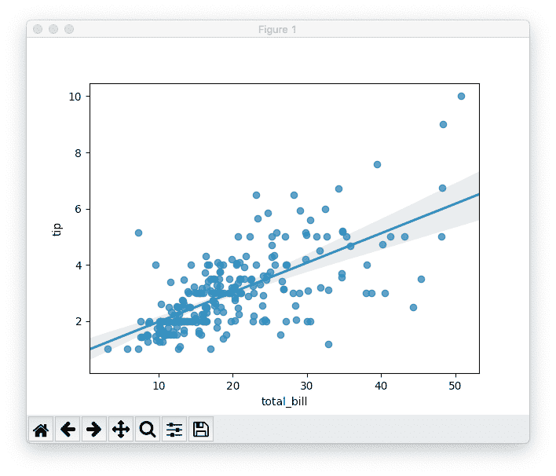

# 第二十章：Python 艺术

> 嗯，艺术就是艺术，不是吗？但另一方面，水还是水！东方是东方，西方是西方，如果你像炖苹果酱那样炖蔓越橘，它们的味道更像李子而不是大黄。
> 
> 格劳乔·马尔克斯

本章及接下来的两章讨论了将 Python 应用于一些常见的人类活动：艺术、商业和科学。如果你对这些领域感兴趣，你可能会得到一些有用的想法或者试图尝试一些新的东西。

# 2-D 图形

所有的计算机语言在一定程度上都应用于计算机图形。本章的许多重型平台都是用 C 或 C++ 编写的，以追求速度，但增加了 Python 库以提高生产力。让我们从查看一些 2-D 成像库开始。

## 标准库

仅标准库中有几个与图像相关的模块：

`imghdr`

检测一些图像文件的文件类型。

`colorsys`

在各种系统之间转换颜色：RGB、YIQ、HSV 和 HLS。

如果您将 O’Reilly 标志下载到名为 *oreilly.png* 的本地文件中，您可以运行以下命令：

```py
>>> import imghdr
>>> imghdr.what('oreilly.png')
'png'
```

另一个标准库是 [`turtle`](https://oreil.ly/b9vEz)——“乌龟图形”，有时用于教授年轻人编程。您可以使用此命令运行演示：

```py
$ python -m turtledemo
```

图 20-1 展示了其*玫瑰花*示例的屏幕截图。



###### 图 20-1\. 来自 turtledemo 的图片

要在 Python 中进行严肃的图形处理，我们需要获取一些第三方包。让我们看看有什么可用的。

## PIL 和 Pillow

多年来，尽管不在标准库中，[Python 图像库](http://bit.ly/py-image)（PIL）一直是 Python 最著名的 2-D 图像处理库。在像 `pip` 这样的安装程序出现之前，它的“友好分支”被称为 [Pillow](http://pillow.readthedocs.org)。Pillow 的图像代码与 PIL 兼容，并且其文档非常好，所以让我们在这里使用它。

安装很简单；只需输入以下命令：

```py
$ pip install Pillow
```

如果您已安装操作系统包如 `libjpeg`、`libfreetype` 和 `zlib`，它们将被 Pillow 检测并使用。有关详细信息，请参阅[安装页面](http://bit.ly/pillow-install)。

打开图像文件：

```py
>>> from PIL import Image
>>> img = Image.open('oreilly.png')
>>> img.format
'PNG'
>>> img.size
(154, 141)
>>> img.mode
'RGB'
```

尽管该包称为 `Pillow`，但为了与旧版 `PIL` 兼容，您将其导入为 `PIL`。

要使用 `Image` 对象的 `show()` 方法在屏幕上显示图像，您首先需要安装下一节中描述的 ImageMagick 包，然后尝试以下操作：

```py
>>> img.show()
```

图 20-2 中显示的图像将在另一个窗口中打开。（此屏幕截图是在 Mac 上捕获的，`show()` 函数使用了预览应用程序。您的窗口外观可能会有所不同。）



###### 图 20-2\. 使用 Python 图像库显示的图像

让我们在内存中裁剪图像，将结果保存为一个名为`img2`的新对象，并显示它。图像总是通过水平（x）值和垂直（y）值来测量，图像的一个角被称为*原点*，并且被任意地分配了一个 x 和 y 的值。在这个库中，原点（0, 0）位于图像的左上角，x 向右增加，y 向下增加。我们想要将左 x（55）、上 y（70）、右 x（85）和下 y（100）的值传递给`crop()`方法，因此传递一个按照这些顺序的元组：

```py
>>> crop = (55, 70, 85, 100)
>>> img2 = img.crop(crop)
>>> img2.show()
```

结果显示在图 20-3 中。



###### 图 20-3\. 裁剪后的图像

使用`save`方法保存图像文件。它接受一个文件名和一个可选的类型。如果文件名有后缀，库将使用该后缀确定类型。但是你也可以显式指定类型。要将我们裁剪后的图像保存为 GIF 文件，请执行以下操作：

```py
>>> img2.save('cropped.gif', 'GIF')
>>> img3 = Image.open('cropped.gif')
>>> img3.format
'GIF'
>>> img3.size
(30, 30)
```

作为我们最后的例子，让我们“改进”一下我们的小吉祥物。首先下载我们原始生物的副本，显示在图 20-4 中。


###### 图 20-4\. 可爱的原始生物

他有点粗糙的五点胡须，所以让我们获取一张图像来改善他的形象；参见图 20-5。


###### 图 20-5\. 外星技术

让我们结合起来，加上一些*alpha*通道的魔法，使重叠部分半透明，如示例 20-1 所示。

##### 示例 20-1\. ch20_critter.py

```py
from PIL import Image

critter = Image.open('ch20_critter.png')
stache = Image.open('ch20_stache.png')
stache.putalpha(100)
img = Image.new('RGBA', critter.size, (255, 255, 255, 0))
img.paste(critter, (0, 0))
img.paste(stache, (45, 90), mask=stache)
img.show()
```

图 20-6 展示了他的改头换面。


###### 图 20-6\. 我们新的、时髦的吉祥物

## ImageMagick

[ImageMagick](http://www.imagemagick.org)是一套用于转换、修改和显示 2D 位图图像的程序。已经存在超过 20 年。各种 Python 库已连接到 ImageMagick 的 C 库。最近支持 Python 3 的一个是[wand](http://docs.wand-py.org)。要安装它，请键入以下命令：

```py
$ pip install Wand
```

你可以使用`wand`做很多和 Pillow 一样的事情：

```py
>>> from wand.image import Image
>>> from wand.display import display
>>>
>>> img = Image(filename='oreilly.png')
>>> img.size
(154, 141)
>>> img.format
'PNG'
```

与 Pillow 类似，这将在屏幕上显示图像：

```py
>>> display(img)
```

`wand`包括旋转、缩放、文本和线条绘制、格式转换等功能，这些功能也可以在 Pillow 中找到。两者都有良好的 API 和文档。

# 3D 图形

一些基本的 Python 包括以下内容：

+   [VPython](https://vpython.org)有一些[示例](https://oreil.ly/J42t0)，可以在你的浏览器中运行。

+   [pi3d](https://pi3d.github.io)适用于树莓派、Windows、Linux 和 Android。

+   [Open3D](http://www.open3d.org/docs)是一个功能齐全的 3D 库。

# 3D 动画

观看几乎任何现代电影的长片尾部字幕，你会看到大量从事特效和动画制作的人。大多数大型工作室——如华特迪士尼动画、工业光魔、维塔数码、梦工厂和皮克斯——都雇佣具备 Python 经验的人员。搜索“python 动画工作”以了解当前的职位空缺。

一些 Python 3D 包括：

[Panda3D](http://www.panda3d.org)

它是开源的，免费使用，即使是商业应用也可以。您可以从 [Panda3D 网站](http://bit.ly/dl-panda) 下载版本。

[VPython](https://vpython.org)

配备了许多 [示例](https://oreil.ly/J42t0)。

[Blender](http://www.blender.org)

Blender 是一个免费的 3D 动画和游戏创作软件。当您 [下载](http://www.blender.org/download) 并安装它时，它会捆绑自带其自己的 Python 3 版本。

[Maya](https://oreil.ly/PhWn-)

这是一个商业的 3D 动画和图形系统。它还捆绑了一个版本的 Python，目前是 2.7。Chad Vernon 编写了一本免费下载的书籍，[*Python Scripting for Maya Artists*](http://bit.ly/py-maya)。如果您在网上搜索 Python 和 Maya，您会找到许多其他资源，包括视频，既有免费也有商业的。

[Houdini](https://www.sidefx.com)

Houdini 是商业软件，但您可以下载一个名为 Apprentice 的免费版本。与其他动画软件包一样，它配备了一个 [Python 绑定](https://oreil.ly/L4C7r)。

# 图形用户界面

名字中包含“graphic”，但图形用户界面（GUI）更注重用户界面：用于呈现数据的小部件、输入方式、菜单、按钮以及用来框架所有内容的窗口。

[GUI 编程](http://bit.ly/gui-program) wiki 页面和 [FAQ](http://bit.ly/gui-faq) 列出了许多由 Python 驱动的 GUI。让我们从唯一内置到标准库中的 GUI 开始：[Tkinter](https://wiki.python.org/moin/TkInter)。它很简单，但可以在所有平台上生成本地外观的窗口和小部件。

这里是一个微小的 Tkinter 程序，用于在窗口中显示我们喜爱的大眼睛吉祥物：

```py
>>> import tkinter
>>> from PIL import Image, ImageTk
>>>
>>> main = tkinter.Tk()
>>> img = Image.open('oreilly.png')
>>> tkimg = ImageTk.PhotoImage(img)
>>> tkinter.Label(main, image=tkimg).pack()
>>> main.mainloop()
```

请注意，它使用了来自 PIL/Pillow 的一些模块。如图 Figure 20-7 中所示，您应该能看到 O’Reilly 的标志。


###### Figure 20-7\. 使用 Tkinter 显示的图像

要关闭窗口，点击其关闭按钮或离开您的 Python 解释器。

您可以在[tkinter wiki](https://wiki.python.org/moin/TkInter)上了解更多关于 Tkinter 的信息。现在来看一下标准库中没有的 GUI：

[Qt](http://qt-project.org)

这是一个专业的 GUI 和应用程序工具包，大约 20 年前由挪威的 Trolltech 创立。它被用来构建应用程序，如 Google Earth、Maya 和 Skype。它还被用作 KDE 的基础，这是一个 Linux 桌面环境。有两个主要的 Python 库用于 Qt：[PySide](http://qt-project.org/wiki/PySide) 是免费的（LGPL 许可），而 [PyQt](http://bit.ly/pyqt-info) 可以通过 GPL 或商业许可获得。Qt 开发人员对这些 [差异](http://bit.ly/qt-diff) 有所了解。从 [PyPI](https://pypi.python.org/pypi/PySide) 或 [Qt](http://qt-project.org/wiki/Get-PySide) 下载 PySide 并阅读 [教程](http://qt-project.org/wiki/PySide_Tutorials)。您可以在 [免费在线下载 Qt](http://bit.ly/qt-dl)。

[GTK+](http://www.gtk.org)

GTK+ 是 Qt 的竞争对手，它也被用于创建许多应用程序，包括 GIMP 和 Linux 的 Gnome 桌面。Python 绑定是 [PyGTK](http://www.pygtk.org)。要下载代码，请转到 [PyGTK 站点](http://bit.ly/pygtk-dl)，您还可以阅读 [文档](http://bit.ly/py-gtk-docs)。

[WxPython](http://www.wxpython.org)

这是[WxWidgets](http://www.wxwidgets.org)的 Python 绑定。这是另一个庞大的包，可以在[在线](http://wxpython.org/download.php)免费下载。

[Kivy](http://kivy.org)

Kivy 是一个免费的现代化库，可跨平台（桌面：Windows、macOS、Linux；移动：Android、iOS）构建多媒体用户界面。它包括多点触控支持。您可以在 [Kivy 网站](http://kivy.org/#download) 上为所有平台下载。Kivy 包括应用程序开发 [教程](http://bit.ly/kivy-intro)。

[PySimpleGUI](https://pysimplegui.readthedocs.io)

使用一个库编写本机或基于 Web 的 GUI。PySimpleGUI 是本节提到的其他 GUI 的包装器，包括 Tk、Kivy 和 Qt。

网页

框架如 Qt 使用本机组件，但其他一些使用 Web。毕竟，Web 是一个通用的 GUI，它具有图形（SVG）、文本（HTML）甚至现在还有多媒体（在 HTML5 中）。您可以使用任何组合的前端（基于浏览器）和后端（Web 服务器）工具构建 Web 应用程序。*瘦客户端*让后端大部分工作。如果前端占主导地位，它就是*厚*、*胖*或*丰富*客户端；最后一个形容词听起来更加让人欣赏。双方通常通过 RESTful API、Ajax 和 JSON 进行通信。

# 绘图、图表和可视化

Python 已成为绘制、图表和数据可视化的主要解决方案。它在科学领域特别受欢迎，这在 第二十二章 中有所涉及。有用的概述和示例包括官方 Python [wiki](https://oreil.ly/Wdter) 和 [Python Graph Gallery](https://python-graph-gallery.com)。

让我们看看最受欢迎的一些库。在下一章中，您将再次看到其中一些，但用于创建地图。

## Matplotlib

[Matplotlib](http://matplotlib.org) 是一个二维绘图库，可以通过以下命令安装：

```py
$ pip install matplotlib
```

[gallery](http://matplotlib.org/gallery.html) 中的示例展示了 Matplotlib 的广泛性。

让我们首先尝试相同的图像显示应用程序（结果显示在 图 20-8 中），只是看看代码和演示的效果如何：

```py
import matplotlib.pyplot as plot
import matplotlib.image as image

img = image.imread('oreilly.png')
plot.imshow(img)
plot.show()
```



###### 图 20-8\. 使用 Matplotlib 显示的图像

Matplotlib 的真正强大之处在于绘图，这毕竟是它的中间名。让我们生成两个包含 20 个整数的列表，一个从 1 增加到 20，另一个与第一个类似，但偶尔会有轻微的波动（示例 20-2）。

##### 示例 20-2\. ch20_matplotlib.py

```py
import matplotlib.pyplot as plt
from random import randint

linear = list(range(1, 21))
wiggly = list(num + randint(-1, 1) for num in linear)

fig, plots = plt.subplots(nrows=1, ncols=3)

ticks = list(range(0, 21, 5))
for plot in plots:
    plot.set_xticks(ticks)
    plot.set_yticks(ticks)

plots[0].scatter(linear, wiggly)
plots[1].plot(linear, wiggly)
plots[2].plot(linear, wiggly, 'o-')

plt.show()
```

如果你运行这个程序，你会看到类似于图 20-9 所示的内容（不完全一样，因为`randint()`调用会使其有随机波动）。



###### 图 20-9\. 基本的 Matplotlib 散点图和线图

此示例显示了散点图、线图以及带数据标记的线图。所有样式和颜色都使用了 Matplotlib 的默认设置，但可以进行非常广泛的定制。详细信息请参阅 Matplotlib [站点](https://matplotlib.org)或类似的概述，如[Python 绘图与 Matplotlib 指南](https://oreil.ly/T_xdT)。

你可以在第 22 章中看到更多 Matplotlib；它与 NumPy 和其他科学应用有着紧密联系。

## Seaborn

[Seaborn](https://seaborn.pydata.org)是一个数据可视化库（参见图 20-10），构建在 Matplotlib 之上，并与 Pandas 连接紧密。通常的安装方法（`pip install seaborn`）可行。



###### 图 20-10\. 基本的 Seaborn 散点图和线性回归

示例 20-3 中的代码基于 Seaborn 的一个[示例](https://oreil.ly/eBFGi)；它访问了有关餐厅小费的测试数据，并绘制了小费与总账单金额的线性回归拟合线。

##### 示例 20-3\. ch20_seaborn.py

```py
import seaborn as sns
import matplotlib.pyplot as plt

tips = sns.load_dataset("tips")
sns.regplot(x="total_bill", y="tip", data=tips);

plt.show()
```

###### 注意

如果你用标准 Python 解释器运行上述代码，需要初始导入行（`import matplotlib.pyplot as plt`）和最后一行（`plt.show()`），如示例 20-3 所示，否则图形将无法显示。如果使用 Jupyter，则 Matplotlib 已内置，无需键入这些行。阅读 Python 映射工具的代码示例时请记住这一点。

和 Matplotlib 一样，Seaborn 在数据处理和显示方面有大量选项。

## Bokeh

在旧的 Web 时代，开发人员会在服务器上生成图形，并提供一些 URL 供 Web 浏览器访问。最近，JavaScript 已经获得了性能提升，并且像 D3 这样的客户端图形生成工具也在增多。前面一页或两页，我提到了使用 Python 作为图形和 GUI 的前端后端架构的可能性。一种名为[Bokeh](http://bokeh.pydata.org)的新工具结合了 Python（大数据集、易用性）和 JavaScript（交互性、较少的图形延迟）的优势。它强调快速可视化大数据集。

如果你已经安装了其前提条件（NumPy、Pandas 和 Redis），可以通过键入以下命令安装 Bokeh：

```py
$ pip install bokeh
```

（你可以在第 22 章看到 NumPy 和 Pandas 的实际应用。）

或者，你可以从 Bokeh [网站](https://oreil.ly/1Fy-L)一次性安装所有内容。虽然 Matplotlib 在服务器上运行，但 Bokeh 主要在浏览器中运行，并且可以利用客户端的最新进展。点击[画廊](https://oreil.ly/DWN-d)中的任何图像，可以查看交互式显示及其 Python 代码。

# 游戏

Python 是一个如此出色的游戏开发平台，以至于人们已经写了很多关于它的书籍：

+   [*用 Python 发明自己的电脑游戏*](http://inventwithpython.com) 作者 Al Sweigart

+   [*Python 游戏书*](http://thepythongamebook.com) 作者 Horst Jens（一本文档维基书）

在 [Python wiki](https://wiki.python.org/moin/PythonGames) 上有一般讨论，还有更多链接。

最著名的 Python 游戏平台可能是 [pygame](http://pygame.org)。你可以从 [Pygame 网站](http://pygame.org/download.shtml) 上为你的平台下载一个可执行安装程序，并逐行阅读一个“pummel the chimp”游戏的示例。

# 音频和音乐

> 我寻求衬线体
> 
> 但那不适合克劳德·德彪西。
> 
> 当之无愧的匿名者

关于声音、音乐和猫唱“Jingle Bells”，正如 Meatloaf 所说，三者中有二就不错了。

在印刷书籍中很难表现声音，因此这里有一些关于声音和音乐的最新链接到 Python 包，但 Google 上还有更多：

+   标准库 [音频](http://docs.python.org/3/library/mm.html) 模块

+   第三方 [音频](https://wiki.python.org/moin/Audio) 工具

+   几十种第三方 [音乐](https://wiki.python.org/moin/PythonInMusic) 应用程序：图形和命令行播放器、转换器、记谱、分析、播放列表、MIDI 等等

最后，如何获取一些在线音乐资源呢？你已经在本书中看到了访问互联网档案的代码示例。以下是链接到一些其音频档案的链接：

+   [音频录音](https://archive.org/details/audio) (>5 百万)

+   [现场音乐](https://archive.org/details/etree) (>200,000)

+   [现场 Grateful Dead 演出](https://archive.org/details/GratefulDead) (>13,000)

# 即将推出

忙碌！这是 Python 在商业中的应用。

# 待办事项

20.1 安装 `matplotlib`。绘制这些 (x, y) 对的散点图：`((0, 0), (3, 5), (6, 2), (9, 8), (14, 10))`。

20.2 绘制相同数据的折线图。

20.3 绘制一个带有标记的图（折线图）。
