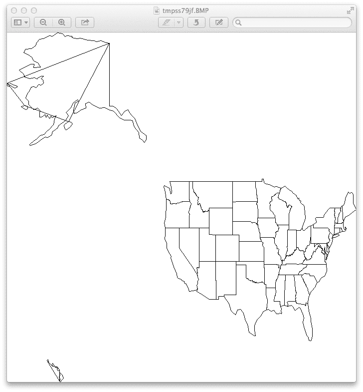
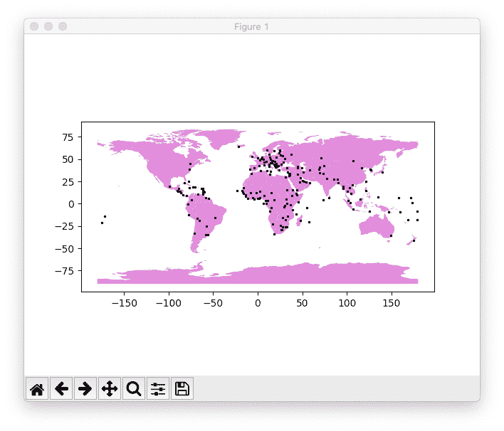

# 第二十一章：Py 在工作中

> “商务！”幽灵再次搓着双手叫道。“人类是我的事业……”
> 
> 查尔斯·狄更斯，《圣诞颂歌》

商人的制服是西装和领带。但是在他能*着手做生意*之前，他把夹克抛在椅子上，解开领带，卷起袖子，倒一些咖啡。与此同时，商务女士已经开始工作了。也许她是在喝拿铁。

在商业和政府中，我们使用了早期章节中的所有技术——数据库、网络、系统。Python 的高效率正在使其在[企业](http://bit.ly/py-enterprise)和[初创公司](http://bit.ly/py-startups)中越来越受欢迎。

多年来，组织一直在与不兼容的文件格式、复杂的网络协议、语言锁定以及普遍缺乏准确文档进行斗争。通过使用这些工具，他们可以创建更快、更便宜、更灵活的应用程序：

+   Python 等动态语言

+   Web 作为通用的图形用户界面

+   RESTful API 作为语言无关的服务接口

+   关系型数据库和 NoSQL 数据库

+   “大数据”和分析

+   云用于部署和资本节约

# Microsoft Office 套件

商业活动严重依赖于 Microsoft Office 应用程序和文件格式。虽然它们不是很出名，并且在某些情况下文档不完善，但是有一些 Python 库可以提供帮助。以下是一些处理 Microsoft Office 文档的库：

[docx](https://pypi.python.org/pypi/docx)

此库可以创建、读取和写入 Microsoft Office Word 2007 *.docx*文件。

[python-excel](http://www.python-excel.org)

这篇文章讨论了`xlrd`、`xlwt`和`xlutils`模块，通过 PDF 的[教程](http://bit.ly/py-excel)。Excel 也可以读取和写入逗号分隔值（CSV）文件，你可以使用标准的`csv`模块来处理它们。

[oletools](http://bit.ly/oletools)

此库从 Office 格式中提取数据。

[开放办公](http://openoffice.org) 是 Office 的开源替代品。它可以在 Linux、Unix、Windows 和 macOS 上运行，并且能够读取和写入 Office 文件格式。它还为自己安装了 Python 3 版本。你可以使用[PyUNO](https://oreil.ly/FASNB)库在[Python](https://oreil.ly/mLiCr)中编程 OpenOffice。

OpenOffice 曾由 Sun Microsystems 拥有，后来 Oracle 收购了 Sun，一些人担心其未来的可用性。作为结果，[LibreOffice](https://www.libreoffice.org)被分拆出来。[DocumentHacker](http://bit.ly/docu-hacker)描述了如何使用 Python UNO 库与 LibreOffice。

OpenOffice 和 LibreOffice 不得不对 Microsoft 文件格式进行逆向工程，这并不容易。[Universal Office Converter](http://dag.wiee.rs/home-made/unoconv)模块依赖于 OpenOffice 或 LibreOffice 中的 UNO 库。它可以转换许多文件格式：文档、电子表格、图形和演示文稿。

如果你有一个神秘的文件，[python-magic](https://github.com/ahupp/python-magic) 可以通过分析特定的字节序列来猜测其格式。

[python open document](http://appyframework.org/pod.html) 库允许您在模板内提供 Python 代码，以创建动态文档。

虽然不是微软格式，但 Adobe 的 PDF 在商业中非常常见。[ReportLab](http://www.reportlab.com/opensource) 提供了基于 Python 的 PDF 生成器的开源和商业版本。如果需要编辑 PDF，您可能会在 [StackOverflow](http://bit.ly/add-text-pdf) 找到一些帮助。

# 执行业务任务

你几乎可以找到任何 Python 模块。访问 [PyPI](https://pypi.python.org/pypi) 并在搜索框中输入内容。许多模块是各种服务的公共 API 的接口。你可能对一些与业务任务相关的示例感兴趣：

+   通过 [Fedex](https://github.com/gtaylor/python-fedex) 或 [UPS](https://github.com/openlabs/PyUPS) 进行发货。

+   使用 [stamps.com](https://github.com/jzempel/stamps) API 发送邮件。

+   阅读关于[*Python 用于商业智能*](http://bit.ly/py-biz)的讨论。

+   如果在 Anoka，Aeropress 空中出售，是客户活动还是捣蛋鬼？[Cubes](http://cubes.databrewery.org) 是一个在线分析处理（OLAP）Web 服务器和数据浏览器。

+   [OpenERP](https://www.openerp.com/) 是一个大型的商业企业资源规划（ERP）系统，用 Python 和 JavaScript 编写，拥有成千上万的附加模块。

# 处理商业数据

企业对数据有特别的喜爱。可悲的是，他们中的许多人想出了让数据更难使用的反常方法。

电子表格是一个很好的发明，随着时间的推移，企业变得对它们上瘾。许多非程序员因为称为*宏*而不是程序而被诱导进编程。但宇宙正在扩展，数据正在试图跟上。早期版本的 Excel 限制为 65,536 行，甚至更新版本在百万左右时也会崩溃。当一个组织的数据超过单台计算机的限制时，就像人数超过一百人一样突然需要新的层次、中介和沟通。

过多的数据程序不是由单个桌面上的数据大小引起的；相反，它们是企业中涌入的数据总和的结果。关系数据库可以处理数百万行而不会爆炸，但一次只能写入或更新那么多。一个普通的文本或二进制文件可能会增长到几个 GB 的大小，但如果你需要一次性处理它们，就需要足够的内存。传统的桌面软件并不为这一切设计。像 Google 和 Amazon 这样的公司不得不发明解决方案来处理如此多的数据规模。[Netflix](http://bit.ly/py-netflix) 就是一个建立在 Amazon AWS 云上的例子，使用 Python 来粘合 RESTful API、安全性、部署和数据库。

## 提取、转换和加载

数据冰山的水下部分包括首先获取数据的所有工作。如果你熟悉企业术语，常见术语是提取、转换、加载，或*ETL*。同义词如*数据整理*或*数据处理*给人一种驯服难以控制的野兽的印象，这可能是恰当的隐喻。这似乎现在应该是一个已解决的工程问题，但它仍然主要是一门艺术。我在第十二章中谈到了这个问题。我们在第二十二章中更广泛地讨论*数据科学*，因为这是大多数开发者花费大部分时间的地方。

如果你看过*绿野仙踪*，你可能记得（除了飞猴子以外）最后那部分——好女巫告诉多萝西她只需点击红宝石鞋子就能回到堪萨斯的一幕。即使在我年轻的时候我也想，“现在她告诉她了！”尽管事后我意识到如果她早点分享这个秘诀，电影会短得多。

但这不是一部电影；我们谈论的是商业世界，在这里，缩短任务时间是一件好事。所以，现在让我和你分享一些技巧。你在日常业务数据工作中需要的大多数工具都是你已经在这里读到的。这些包括高级数据结构，如字典和对象，成千上万的标准和第三方库，以及一个距离你只有一步之遥的专家社区。

如果你是一名为某个企业工作的计算机程序员，你的工作流程几乎总是包括以下步骤：

1.  从奇怪的文件格式或数据库中提取数据

1.  “清理”数据，这涵盖了很多领域，所有这些领域都布满了尖锐的物体

1.  转换日期、时间和字符集等内容

1.  实际上对数据进行操作

1.  将结果数据存储在文件或数据库中

1.  再次回到步骤 1；重复上述步骤

这里有一个例子：你想将数据从电子表格移动到数据库。你可以将电子表格保存为 CSV 格式，并使用第十六章中的 Python 库。或者，你可以寻找一个直接读取二进制电子表格格式的模块。你的手指知道如何在谷歌中输入`python excel`并找到网站，比如[Python 处理 Excel 文件](http://www.python-excel.org)。你可以使用`pip`安装其中一个包，并找到用于最后一部分任务的 Python 数据库驱动程序。我在同一章中提到了 SQLAlchemy 和直接的低级数据库驱动程序。现在你需要一些中间代码，这就是 Python 的数据结构和库可以节省你时间的地方。

让我们在这里尝试一个例子，然后我们再试试一个节省几个步骤的库。我们将读取一个 CSV 文件，根据另一个列中的唯一值聚合计数，并打印结果。如果我们在 SQL 中执行此操作，我们将使用 SELECT、JOIN 和 GROUP BY。

首先是文件*zoo.csv*，它有列来标识动物的类型、它咬过游客的次数、需要多少针线以及我们支付给游客的不让当地电视台报道的钱数：

```py
animal,bites,stitches,hush
bear,1,35,300
marmoset,1,2,250
bear,2,42,500
elk,1,30,100
weasel,4,7,50
duck,2,0,10
```

我们想知道哪种动物花费最多，因此我们按动物类型汇总了总的口油钱数。（让我们把咬伤和缝针的工作留给一个实习生。）我们使用来自“CSV”的`csv`模块和来自“使用 Counter()计数项目”的`Counter`。将此代码保存为*zoo_counts.py*：

```py
import csv
from collections import Counter

counts = Counter()
with open('zoo.csv', 'rt') as fin:
    cin = csv.reader(fin)
    for num, row in enumerate(cin):
        if num > 0:
            counts[row[0]] += int(row[-1])
for animal, hush in counts.items():
    print("%10s %10s" % (animal, hush))
```

我们跳过了第一行，因为它只包含列名。`counts`是一个`Counter`对象，并负责将每种动物的总和初始化为零。我们还对输出进行了一些格式化，使其右对齐。让我们试一试：

```py
$ python zoo_counts.py
      duck         10
       elk        100
      bear        800
    weasel         50
  marmoset        250
```

哈哈！是熊。他一直是我们的主要嫌疑人，现在我们有了数字。

接下来，让我们使用一个称为[Bubbles](http://bubbles.databrewery.org)的数据处理工具包来复制这个过程。您可以通过输入以下命令来安装它：

```py
$ pip install bubbles
```

它需要 SQLAlchemy；如果没有，可以通过`pip install sqlalchemy`来安装。这是测试程序（称为*bubbles1.py*），改编自[文档](http://bit.ly/py-bubbles)：

```py
import bubbles

p = bubbles.Pipeline()
p.source(bubbles.data_object('csv_source', 'zoo.csv', infer_fields=True))
p.aggregate('animal', 'hush')
p.pretty_print()
```

现在，关键时刻到了：

```py
$ python bubbles1.py
2014-03-11 19:46:36,806 DEBUG calling aggregate(rows)
2014-03-11 19:46:36,807 INFO called aggregate(rows)
2014-03-11 19:46:36,807 DEBUG calling pretty_print(records)
+--------+--------+------------+
|animal  |hush_sum|record_count|
+--------+--------+------------+
|duck    |      10|           1|
|weasel  |      50|           1|
|bear    |     800|           2|
|elk     |     100|           1|
|marmoset|     250|           1|
+--------+--------+------------+
2014-03-11 19:46:36,807 INFO called pretty_print(records)
```

如果您阅读了文档，就可以避免这些调试打印行，并可能改变表格的格式。

看两个例子，我们看到`bubbles`示例使用了单个函数调用（`aggregate`）来替代我们手动读取和计数 CSV 格式。根据您的需求，数据工具包可以节省大量工作。

在一个更现实的例子中，我们的动物园文件可能有数千行（这是一个危险的地方），包括诸如`bare`、数字中的逗号等拼写错误。关于实际数据问题的 Python 代码的好例子，我还推荐以下内容：

+   [*数据处理：使用 Java、Python 和更多解决日常问题*](http://bit.ly/data_crunching)—Greg Wilson（Pragmatic Bookshelf）。

+   [*自动化无聊的事情*](https://automatetheboringstuff.com)—Al Sweigart（无淀粉）。

数据清理工具可以节省大量时间，Python 有很多这样的工具。举个例子，[PETL](http://petl.readthedocs.org) 可以进行行和列的提取和重命名。其[相关工作](http://bit.ly/petl-related)页面列出了许多有用的模块和产品。第二十二章详细讨论了一些特别有用的数据工具：Pandas、NumPy 和 IPython。虽然它们目前在科学家中最为人知，但它们正在逐渐流行于金融和数据开发人员中。在 2012 年 Pydata 会议上，[AppData](http://bit.ly/py-big-data)讨论了这三个工具及其他 Python 工具如何每天处理 15TB 的数据。Python 能够处理非常大的现实世界数据负载。

您还可以回顾讨论的数据序列化和验证工具，如“数据序列化”。

## 数据验证

在清理数据时，您经常需要检查：

+   数据类型，如整数、浮点数或字符串

+   值的范围

+   正确的值，如有效的电话号码或电子邮件地址

+   Duplicates

+   缺失数据

在处理网络请求和响应时尤其常见。

特定数据类型的有用 Python 包括：

+   [`validate_email`](https://pypi.org/project/validate_email)

+   [`phonenumber`](https://pypi.org/project/phonenumbers)

一些有用的通用工具包括：

+   [`validators`](https://validators.readthedocs.io)

+   [`pydantic`](https://pydantic-docs.helpmanual.io)—适用于 Python 3.6 及以上；使用类型提示

+   [`marshmallow`](https://marshmallow.readthedocs.io/en/3.0) — 同时进行序列化和反序列化

+   [`cerberus`](http://docs.python-cerberus.org/en/stable)

+   [其他许多](https://libraries.io/search?keywords=validation&languages=Python)

## Additional Sources of Information

有时，您需要来自其他地方的数据。一些商业和政府数据源包括：

[data.gov](https://www.data.gov)

成千上万数据集和工具的入口。其 [APIs](https://www.data.gov/developers/apis) 建立在 [CKAN](http://ckan.org) 上，这是一个 Python 数据管理系统。

使用 Python 的开放政府

查看 [视频](http://bit.ly/opengov-py) 和 [幻灯片](http://goo.gl/8Yh3s)。

[python-sunlight](http://bit.ly/py-sun)

用于访问 [Sunlight APIs](http://sunlightfoundation.com/api) 的库。

[froide](https://froide.readthedocs.io)

一个基于 Django 的平台，用于管理信息自由请求。

[30 places to find open data on the web](http://blog.visual.ly/data-sources)

一些方便的链接。

# 开源 Python 商业包

[Odoo](https://www.odoo.com)

广泛的企业资源规划（ERP）平台

[Tryton](http://www.tryton.org)

另一个广泛的业务平台

[Oscar](http://oscarcommerce.com)

Django 的电子商务框架

[Grid Studio](https://gridstudio.io)

基于 Python 的电子表格，可在本地或云中运行

# Python 在金融中的应用

最近，金融行业对 Python 的兴趣日益增加。通过适应第二十二章的软件以及一些自己的软件，*量化分析师* 正在构建新一代金融工具：

[Quantitative economics](http://quant-econ.net)

一个经济建模工具，具有大量数学和 Python 代码

[Python for finance](http://www.python-for-finance.com)

以 Yves Hilpisch（Wiley）所著的书籍 *Derivatives Analytics with Python: Data Analytics, Models, Simulation, Calibration, and Hedging* 为特色

[Quantopian](https://www.quantopian.com)

一个互动网站，您可以在其中编写自己的 Python 代码，并针对历史股票数据运行它，以查看其表现如何

[PyAlgoTrade](http://gbeced.github.io/pyalgotrade)

另一个可以用于股票回测的工具，但需要在您自己的计算机上运行

[Quandl](http://www.quandl.com)

搜索数百万金融数据集

[Ultra-finance](https://code.google.com/p/ultra-finance)

实时股票收集库

[*Python for Finance*](http://bit.ly/python-finance)（O’Reilly）

Yves Hilpisch 撰写的一本带有 Python 示例的金融建模书籍。

# 业务数据安全

安全对于企业来说是一个特别关注的问题。有整本书专门讨论这个话题，因此我们在这里只提到了一些与 Python 相关的技巧。

+   “Scapy”讨论了`scapy`，一个用于数据包取证的基于 Python 的语言。它已被用来解释一些主要的网络攻击。

+   [Python 安全](http://www.pythonsecurity.org)网站讨论了安全主题，详细介绍了一些 Python 模块和备忘单。

+   TJ O’Connor（Syngress）撰写的书籍[*Violent Python*](http://bit.ly/violent-python)（副标题为*黑客、法医分析员、渗透测试人员和安全工程师的烹饪书*）是对 Python 和计算机安全的广泛审查。

# 地图

对许多企业来说，地图已经变得非常有价值。Python 非常擅长制作地图，因此我们将在这个领域多花一点时间。管理人员喜欢图形，如果你能为组织的网站快速制作一个漂亮的地图，那肯定是有好处的。

在 Web 的早期，我曾经访问过施乐的一个实验性地图制作网站。当像 Google Maps 这样的大型网站出现时，它们是一个启示（类似于“为什么我没想到那个并赚了几百万？”）。现在映射和*基于位置的服务*随处可见，特别是在移动设备中非常有用。

许多术语在这里重叠：映射、制图学、GIS（地理信息系统）、GPS（全球定位系统）、地理空间分析等等。在[地理空间 Python](http://bit.ly/geospatial-py)的博客上有一个“800 磅大猩猩”系统的图像—GDAL/OGR、GEOS 和 PROJ.4（投影）—及其周边系统，这些系统许多都有 Python 接口。让我们从一些最简单的格式开始讨论一些内容。

## 格式

映射世界有许多格式：矢量（线）、栅格（图像）、元数据（文字）以及各种组合。

Esri，一个地理系统的先驱，20 多年前发明了*shapefile*格式。一个 shapefile 实际上包含了多个文件，至少包括以下文件：

*.shp*

“shape”（矢量）信息

*.shx*

形状索引

*.dbf*

一个属性数据库

让我们为下一个示例获取一个 shapefile——访问 Natural Earth [1:110m Cultural Vectors 页面](http://bit.ly/cultural-vectors)。在“Admin 1 - States and Provinces”下，点击绿色的[download states and provinces](https://oreil.ly/7BR2o)方框以下载一个 zip 文件。下载完成后，解压缩它到你的计算机上，你应该看到以下生成的文件：

```py
ne_110m_admin_1_states_provinces_shp.README.html
ne_110m_admin_1_states_provinces_shp.sbn
ne_110m_admin_1_states_provinces_shp.VERSION.txt
ne_110m_admin_1_states_provinces_shp.sbx
ne_110m_admin_1_states_provinces_shp.dbf
ne_110m_admin_1_states_provinces_shp.shp
ne_110m_admin_1_states_provinces_shp.prj
ne_110m_admin_1_states_provinces_shp.shx
```

我们将在我们的示例中使用这些。

## 从 Shapefile 绘制地图

这一节是一个过于简化的演示，展示了如何读取和显示一个 shapefile。你会看到结果存在问题，你最好使用更高级的地图包，比如接下来介绍的那些。

你将需要这个库来读取一个 shapefile：

```py
$ pip install pyshp
```

现在是程序*map1.py*，我从 Geospatial Python [博客文章](http://bit.ly/raster-shape)修改而来：

```py
def display_shapefile(name, iwidth=500, iheight=500):
    import shapefile
    from PIL import Image, ImageDraw
    r = shapefile.Reader(name)
    mleft, mbottom, mright, mtop = r.bbox
    # map units
    mwidth = mright - mleft
    mheight = mtop - mbottom
    # scale map units to image units
    hscale = iwidth/mwidth
    vscale = iheight/mheight
    img = Image.new("RGB", (iwidth, iheight), "white")
    draw = ImageDraw.Draw(img)
    for shape in r.shapes():
        pixels = [
            (int(iwidth - ((mright - x) * hscale)), int((mtop - y) * vscale))
            for x, y in shape.points]
        if shape.shapeType == shapefile.POLYGON:
            draw.polygon(pixels, outline='black')
        elif shape.shapeType == shapefile.POLYLINE:
            draw.line(pixels, fill='black')
    img.show()

if __name__ == '__main__':
    import sys
    display_shapefile(sys.argv[1], 700, 700)
```

这段代码读取 shapefile 并迭代其各个形状。我只检查两种形状类型：多边形，将最后一个点连接到第一个点，和折线，不会连接。我的逻辑基于原始帖子和对`pyshp`文档的快速查阅，所以我不太确定它将如何工作。有时，我们只需开始并在发现问题时解决它们。

那么，让我们运行它。参数是 shapefile 文件的基本名称，没有任何扩展名：

```py
$ python map1.py ne_110m_admin_1_states_provinces_shp
```

你应该看到类似于图 21-1 的东西。

它画了一幅类似于美国的地图，但：

+   看起来像一只猫拖着毛线穿过阿拉斯加和夏威夷；这是一个*bug*。

+   这个国家被挤压了；我需要一个*投影*。

+   这幅图不好看；我需要更好的*样式*控制。



###### 图 21-1\. 初步地图

要解决第一点：我的逻辑中有问题，但我该怎么办？第十九章讨论了开发技巧，包括调试，但在这里我们可以考虑其他选择。我可以编写一些测试，并坚持直到解决这个问题，或者我可以尝试其他地图库。也许某种更高级别的东西会解决我的三个问题（偏离的线条，压缩的外观和原始的样式）。

就我所知，没有纯 Python 的基本地图包。幸运的是，有一些更高级的选择，所以让我们来看一看。

## Geopandas

[Geopandas](http://geopandas.org)将`matplotlib`，`pandas`和其他 Python 库集成到地理空间数据平台中。

基础包可以使用熟悉的`pip install geopandas`安装，但它依赖于其他包，如果你没有安装它们，也需要用`pip`安装：

+   `numpy`

+   `pandas`（版本 0.23.4 或更高）

+   `shapely`（GEOS 接口）

+   `fiona`（GDAL 接口）

+   `pyproj`（PROJ 接口）

+   `six`

Geopandas 可以读取 shapefile（包括上一节的文件），并便利地包含来自自然地球的两种数据：国家/大陆轮廓和国家首都。示例 21-1 是一个简单的演示，同时使用了这两者。

##### 示例 21-1\. geopandas.py

```py
import geopandas
import matplotlib.pyplot as plt

world_file = geopandas.datasets.get_path('naturalearth_lowres')
world = geopandas.read_file(world_file)
cities_file = geopandas.datasets.get_path('naturalearth_cities')
cities = geopandas.read_file(cities_file)
base = world.plot(color='orchid')
cities.plot(ax=base, color='black', markersize=2)
plt.show()
```

运行它，你应该看到显示在图 21-2 中的地图。



###### 图 21-2\. Geopandas 地图

对我来说，geopandas 目前看起来是地理数据管理和显示的最佳组合。但还有许多值得考虑的竞争对手，我们将在下一节中讨论。

## 其他地图包

这里是一些链接，指向其他 Python 地图软件；许多不能完全使用`pip`安装，但有些可以使用`conda`（特别适用于科学软件的替代 Python 包安装器）：

[pyshp](https://pypi.org/project/pyshp)

一个纯 Python shapefile 库，前面提到过 “从 shapefile 绘制地图”。

[kartograph](http://kartograph.org)

在服务器或客户端将 shapefile 渲染为 SVG 地图。

[shapely](https://shapely.readthedocs.io)

解答几何问题，比如“这个城镇中哪些建筑物在 50 年洪水轮廓线内？”

[basemap](http://matplotlib.org/basemap)

基于 `matplotlib`，绘制地图和数据叠加。不幸的是，它已被 Cartopy 废弃。

[cartopy](https://scitools.org.uk/cartopy/docs/latest)

成功的 Basemap，可以做一些 `geopandas` 做的事情。

[folium](https://python-visualization.github.io/folium)

与 leaflet.js 一起使用，被 `geopandas` 使用。

[plotly](https://plot.ly/python/maps)

另一个包含地图功能的绘图包。

[dash](https://dash.plot.ly)

使用 Plotly、Flask 和 JavaScript 创建交互式可视化，包括地图。

[fiona](https://github.com/Toblerity/Fiona)

封装了处理 shapefile 和其他矢量格式的 OGR 库。

[Open Street Map](https://oreil.ly/BJeha)

访问广阔的 [OpenStreetMap](https://www.openstreetmap.org) 世界地图。

[mapnik](http://mapnik.org)

一个具有 Python 绑定的 C++ 库，用于矢量（线）和栅格（图像）地图。

[Vincent](http://vincent.readthedocs.org)

转换为 Vega，一个 JavaScript 可视化工具；参见教程：[使用 pandas 和 vincent 在 Python 中绘制数据地图](https://oreil.ly/0TbTC)。

[Python for ArcGIS](http://bit.ly/py-arcgis)

链接到 Esri 商业 ArcGIS 产品的 Python 资源。

[使用 Python 处理地理空间数据](http://bit.ly/geos-py)

视频演示。

[想用 Python 制作地图](http://bit.ly/pythonmap)

使用 `pandas`, `matplotlib`, `shapely` 和其他 Python 模块创建历史牌匾位置的地图。

[*Python 地理空间开发*](http://bit.ly/py-geo-dev)（Packt 出版）

由 Eric Westra 编写的书籍，示例使用 `mapnik` 和其他工具。

[*学习 Python 地理空间分析*](http://bit.ly/learn-geo-py)（Packt 出版）

Joel Lawhead 的另一本书，回顾格式和库，具有地理空间算法。

[geomancer](https://github.com/thinkingmachines/geomancer)

地理空间工程，例如从点到最近的爱尔兰酒吧的距离。

如果你对地图感兴趣，可以尝试下载并安装其中一个软件包，看看你能做什么。或者，你可以避免安装软件，尝试连接到远程 Web 服务 API；第十八章 展示了如何连接到 Web 服务器并解码 JSON 响应。

## 应用和数据

我一直在谈论绘制地图，但是你可以用地图数据做很多其他事情。*地理编码* 可以在地址和地理坐标之间转换。有许多地理编码 [APIs](https://oreil.ly/Zqw0W)（参见 [ProgrammableWeb 的比较](http://bit.ly/free-geo-api)）和 Python 库：

+   [geopy](https://code.google.com/p/geopy)

+   [pygeocoder](https://pypi.python.org/pypi/pygeocoder)

+   [googlemaps](http://py-googlemaps.sourceforge.net)

如果你使用 Google 或其他来源注册 API 密钥，你可以访问其他服务，比如逐步旅行指南或本地搜索。

这里有几个地图数据的来源：

[美国人口普查局地图数据](http://www.census.gov/geo/maps-data)

美国人口普查局地图文件概述

[美国人口普查局的 TIGER 数据](http://www.census.gov/geo/maps-data/data/tiger.html)

大量的地理和人口统计地图数据

[开放街道地图潜在数据源](http://wiki.openstreetmap.org/wiki/Potential_Datasources)

全球资源

[自然地球数据](http://www.naturalearthdata.com)

三种比例尺下的矢量和栅格地图数据

我应该在这里提一下[数据科学工具包](http://www.datasciencetoolkit.org)。它包括免费的双向地理编码、坐标到政治边界和统计数据等功能。你也可以下载所有数据和软件作为虚拟机（VM），在自己的计算机上独立运行。

# 即将到来

我们参加了一场科学展，看到了所有的 Python 展品。

# 待办事项

21.1 安装`geopandas`并运行示例 21-1。尝试修改颜色和标记大小等内容。
