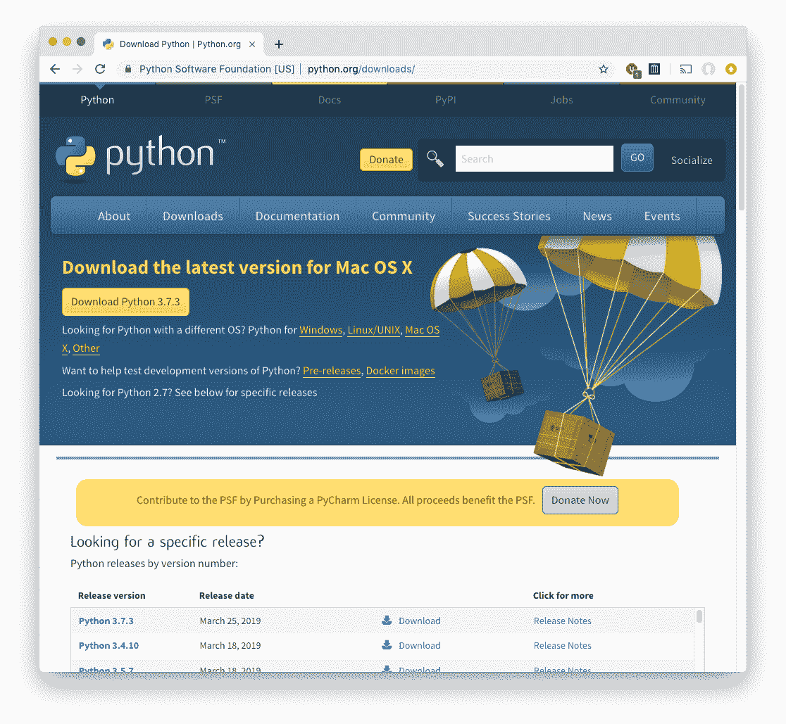
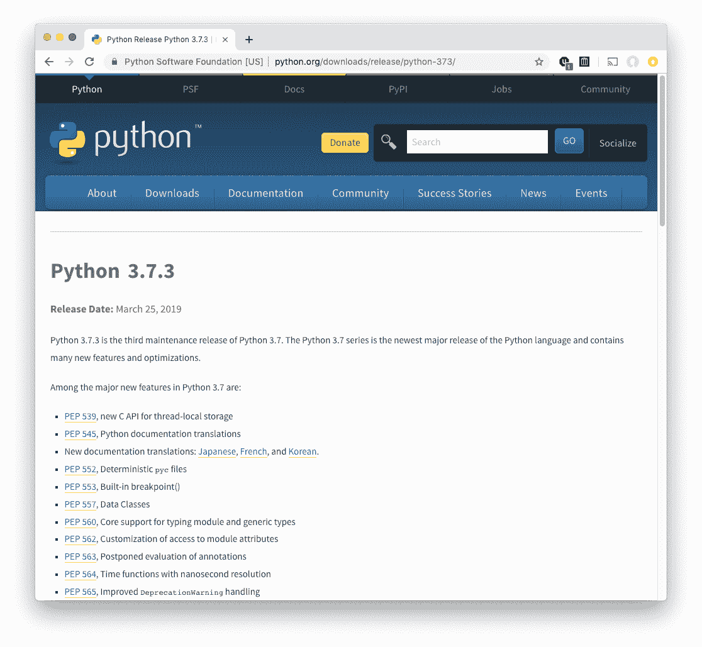
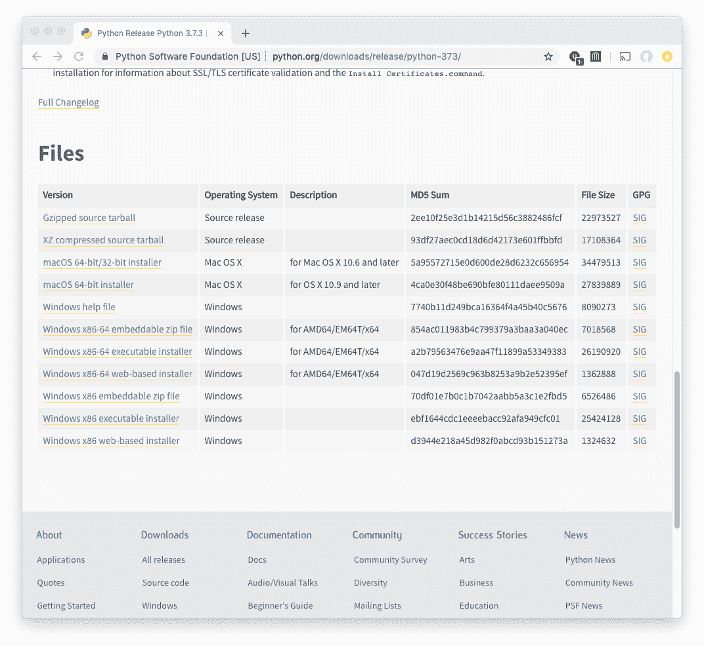
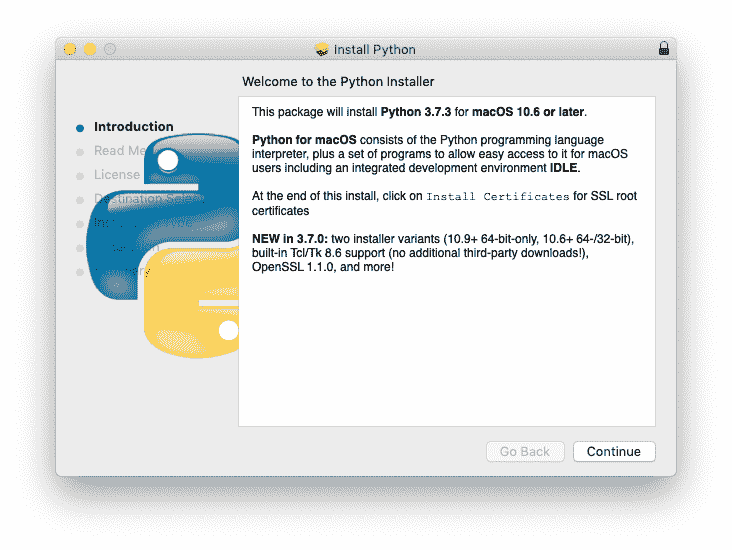
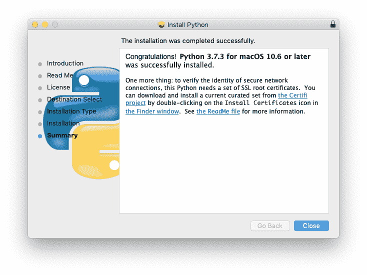

# 附录 B. 安装 Python 3

本书中大多数示例都是使用 Python 3.7 编写和测试的，这是当时最新的稳定版本。[Python 的新功能页面](https://docs.python.org/3/whatsnew)介绍了每个版本的新增内容。有许多 Python 的来源和安装方式。在本附录中，我描述了其中的一些方式：

+   标准安装会从*python.org*下载 Python，并添加辅助程序`pip`和`virtualenv`。

+   如果你的工作涉及科学领域，你可能更喜欢从 Anaconda 获取预装有许多科学包的 Python，并使用其包安装程序`conda`而不是`pip`。

Windows 根本没有安装 Python，而 macOS、Linux 和 Unix 则倾向于安装旧版本。在它们赶上之前，你可能需要自行安装 Python 3。

# 检查你的 Python 版本

在终端或终端窗口中输入`python -V`：

```py
$ python -V
Python 3.7.2
```

根据你的操作系统，如果没有安装 Python 或操作系统找不到它，你将会收到一些类似*command not found*的错误消息。

如果你已经安装了 Python 且是版本 2，你可能想要安装 Python 3 —— 可以是系统范围的，也可以只安装在虚拟环境中（见“使用 virtualenv”，或者“安装 virtualenv”）。在本附录中，我展示了如何在系统范围内安装 Python 3。

# 安装标准 Python

打开官方 Python[下载页面](https://www.python.org/downloads)。它会尝试猜测你的操作系统并显示适当的选择，但如果猜错了，你可以使用以下信息：

+   [Windows 的 Python 发布版本](https://www.python.org/downloads/windows)

+   [macOS 下的 Python 发布版本](https://www.python.org/downloads/mac-osx)

+   [Python 源代码发布版（Linux 和 Unix）](https://www.python.org/downloads/source)

你将看到一个类似于图 B-1 所示的页面。



###### B-1\. 示例下载页面

如果你点击黄色的 Download Python 3.7.3 按钮，它将为你的操作系统下载该版本。如果你想先了解一些关于它的信息，点击表格底部第一列中蓝色链接文字 Python 3.7.3，这会带你到一个类似于图 B-2 所示的信息页面。



###### B-2\. 下载详细页面

你需要向下滚动页面才能看到实际的下载链接（图 B-3）。



###### B-3\. 页面底部提供下载

## macOS

点击[macOS 64 位/32 位安装程序](https://oreil.ly/54lG8)链接来下载一个 Mac 的*.pkg*文件。双击打开它，你会看到一个介绍性的对话框（图 B-4）。



###### B-4\. Mac 安装对话框 1

点击继续。你将会通过一系列其他对话框。

当一切完成时，您应该看到 图 B-5 中显示的对话框。



###### 图 B-5\. Mac 安装对话框 9

Python 3 将安装为 */usr/local/bin/python3*，不会更改计算机上的任何现有 Python 2。

## Windows

Windows 从未包含 Python，但最近已经更容易安装。Windows 10 的 [2019 年 5 月更新](https://oreil.ly/G8Abf) 包括 *python.exe* 和 *python3.exe* 文件。这些不是 Python 解释器，而是指向 Microsoft Store 的新 [Python 3.7 页面](https://oreil.ly/Lky_h) 的链接。您可以使用此链接下载和安装 Python，方式与获取其他 Windows 软件相同。

或者您可以从官方 Python 网站下载并安装 Python：

+   [Windows x86 MSI 安装程序（32 位）](http://bit.ly/win-x86)

+   [Windows x86-64 MSI 安装程序（64 位）](http://bit.ly/win-x86-64)

要确定您的 Windows 版本是 32 位还是 64 位：

+   单击“开始”按钮。

+   右键单击“计算机”。

+   单击属性并查找位数值。

单击适当的安装程序（*.msi* 文件）。下载完成后，双击并按照安装程序的指示操作。

## Linux 或 Unix

Linux 和 Unix 用户可以选择压缩的源代码格式：

+   [XZ 压缩源代码压缩包](http://bit.ly/xz-tarball)

+   [Gzipped 源代码压缩包](http://bit.ly/gzip-tarball)

选择其中一个进行下载。通过使用 `tar xJ` (*.xz* 文件) 或 `tar xz` (*.tgz* 文件) 解压缩它，然后运行生成的 shell 脚本。

# 安装 pip 包管理器

除了标准 Python 安装外，对于 Python 开发，两个工具几乎是必不可少的：`pip` 和 `virtualenv`。

`pip` 包是安装非标准 Python 包的最流行方式。一个如此有用的工具没有成为标准 Python 的一部分，需要你自己下载和安装，实在令人恼火。正如我的一个朋友曾经说过的，这是一种残酷的入门仪式。好消息是，从 3.4 版本开始，`pip` 已经成为 Python 的标准部分。

如果您安装了 Python 3，但只有 Python 2 版本的 `pip`，那么在 Linux 或 macOS 上获取 Python 3 版本的方法如下：

```py
$ curl -O http://python-distribute.org/distribute_setup.py
$ sudo python3 distribute_setup.py
$ curl -O https://raw.github.com/pypa/pip/master/contrib/get-pip.py
$ sudo python3 get-pip.py
```

这将在您的 Python 3 安装的 `bin` 目录中安装 `pip-3.3`。然后，使用 `pip-3.3` 安装第三方 Python 包，而不是 Python 2 的 `pip`。

# 安装 virtualenv

经常与 `pip` 一起使用，`virtualenv` 程序是在指定目录（文件夹）中安装 Python 包的一种方式，以避免与任何现有系统 Python 包的交互。这使您可以使用任何您想要的 Python 工具，即使您没有更改现有安装的权限。

一些关于 `pip` 和 `virtualenv` 的好指南包括：

+   [Python 初学者的 Pip 和 Virtualenv 非神秘入门](http://bit.ly/jm-pip-vlenv)

+   [打包指南：Pip 的《银河系漫游指南》](http://bit.ly/hhgp-pip)

# 其他打包解决方案

你已经看到，Python 的打包技术各有千秋，没有一种方法适用于所有问题。[PyPA](https://www.pypa.io)（Python 打包管理权威组织）是一个志愿工作团队（并非官方 Python 开发核心组的一部分），旨在简化 Python 的打包过程。该团队编写了[Python 打包用户指南](https://packaging.python.org)，讨论了相关问题及其解决方案。

最流行的工具是 `pip` 和 `virtualenv`，我在本书中一直使用它们。如果它们对你来说不够用，或者你喜欢尝试新事物，这里还有一些替代方案：

+   [`pipenv`](https://pipenv.readthedocs.io) 结合了 `pip` 和 `virtualenv` 并添加了更多功能。还可以参考一些 [批评](https://oreil.ly/NQ3pH) 和相关的 [讨论](https://oreil.ly/psWa-)。

+   [`poetry`](https://poetry.eustace.io/) 是一个竞争对手，解决了 `pipenv` 的一些问题。

但是最流行的打包工具，尤其是在科学和数据密集型应用中，是 `conda`。你可以作为 Anaconda Python 发行版的一部分获得它，下面我将详细介绍，或者单独获取它（“安装 Anaconda 的包管理器 conda”）。

# 安装 Anaconda

[Anaconda](https://docs.anaconda.com/anaconda) 是一个以科学为重点的一体化发行版。最新版本 Anaconda3 包括 Python 3.7 及其标准库，以及用于数据科学的 R 语言。其他有用的库包括我们在本书中讨论过的：`beautifulsoup4`, `flask`, `ipython`, `matplotlib`, `nose`, `numpy`, `pandas`, `pillow`, `pip`, `scipy`, `tables`, `zmq` 等。它还有一个跨平台的安装程序称为 `conda`，我将在下一节介绍。

要安装 Anaconda3，请访问[下载页面](https://www.anaconda.com/distribution)获取 Python 3 版本。点击适合你平台的链接（版本号可能会有所变化，但你可以找到对应的版本）：

+   macOS 安装程序将所有内容安装到你主目录下的 *anaconda* 目录。

+   对于 Windows，在下载完成后，双击 *.exe* 文件。

+   对于 Linux，选择 32 位或 64 位版本。下载完成后，执行它（这是一个大型的 Shell 脚本）。

###### 注意

确保你下载的文件名以 *Anaconda3* 开头。如果只以 *Anaconda* 开头，那就是 Python 2 版本。

Anaconda 将所有内容安装在自己的目录下（在你的主目录下的 *anaconda* 目录）。这意味着它不会干扰你计算机上可能已安装的任何 Python 版本。同时也意味着你无需特殊权限（如 `admin` 或 `root` 账户）来安装它。

Anaconda 现在包含超过 1500 个开源包。访问 Anaconda [文档](https://docs.anaconda.com/anaconda/packages/pkg-docs) 页面，点击适合你平台和 Python 版本的链接。

安装完 Anaconda3 后，你可以输入命令 `conda list` 查看圣诞老人给你装了什么东西在你的电脑上。

## 安装 Anaconda 的包管理器 conda

Anaconda 的开发者们构建了 [`conda`](https://docs.conda.io) 来解决他们在使用 `pip` 和其他工具时遇到的问题。`pip` 是一个 Python 包管理器，但 `conda` 可以与任何软件和语言一起使用。`conda` 还避免了像 `virtualenv` 这样的工具，以避免安装互相冲突的问题。

如果你安装了 Anaconda 发行版，你已经拥有 `conda` 程序了。如果没有，你可以从 [miniconda](https://docs.conda.io/en/latest/miniconda.html) 页面获取 Python 3 和 `conda`。和 Anaconda 一样，确保你下载的文件以 `Miniconda3` 开头；如果只是以 `Miniconda` 开头，那就是 Python 2 版本。

`conda` 可以和 `pip` 一起工作。虽然它有自己的公共 [包仓库](https://anaconda.org/anaconda/repo)，但像 `conda search` 这样的命令也会搜索 [PyPi 仓库](http://pypi.python.org)。如果你在使用 `pip` 时遇到问题，`conda` 可能是一个不错的选择。
