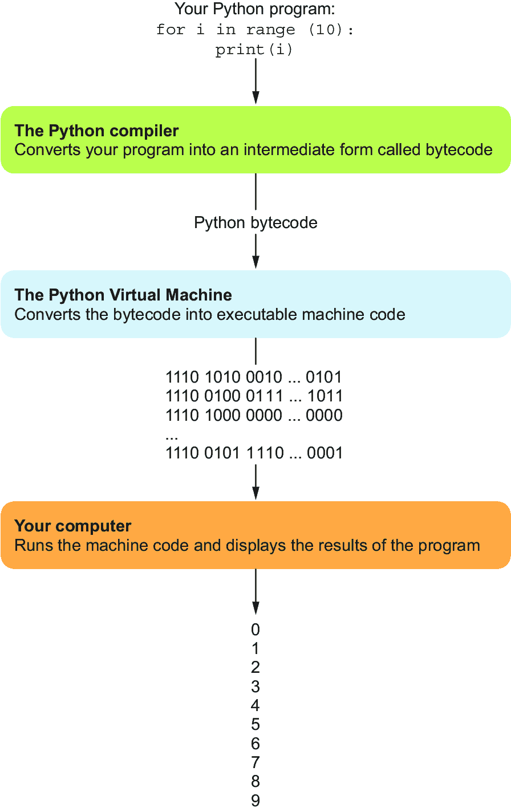
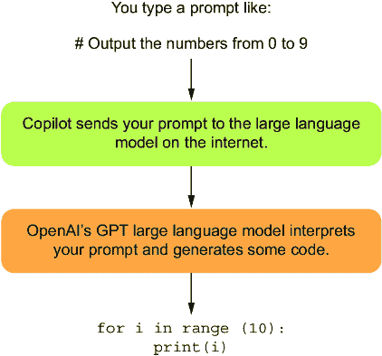

# 第一章：1 使用 GitHub Copilot 引入 AI 辅助编程

### 本章内容包括

+   AI 助手如何改变新程序员的学习方式

+   为什么编程永远不会像以前那样

+   AI 助手如 GitHub Copilot 是如何工作的

+   AI 辅助编程的潜在危险

计算机编程长期以来一直是经过特殊训练和具备高级技能的专业人士的领域。毕竟，你希望银行、手机、汽车等应用程序每次都能准确无误地运行！正如曾经需要占据整个房间的计算机、堆积如山的纸卡片和数英里的磁带已经被现代设备所取代，编程语言和工具也变得更加易于使用。而现在，像 ChatGPT 这样的人工智能（AI）工具使得几乎每个人都能接触到计算机编程。我们希望能帮助你打开这扇门！

学会编程，你就能够承担工作中的新任务，创造自己的计算机游戏，并让计算机为你在工作中服务。在本书中，我们将向你展示如何使用 ChatGPT 和 GitHub Copilot 编写自己的计算机程序。在此过程中，你还将学习 Python，这是一种最受欢迎的编程语言之一。

## 1.1 改善我们与计算机的对话方式

让我们从让计算机从 0 数到 9 开始。几十年前，一本关于编程的书可能会让你学习如何阅读和理解以下代码（基于[`mng.bz/EOdO`](https://mng.bz/EOdO)）：

```py
section .text 
global _start 
_start: 
    mov ecx, 10 
    mov eax, '0' 
    l1: 
    mov [num], eax 
    mov eax, 4 
    mov ebx, 1 
    push ecx 
    mov ecx, num 
    mov edx, 1 
    int 0x80 
    mov eax, [num] 
    inc eax 
    pop ecx 
    loop l1 
    mov eax, 1 
    int 0x80 
section .bss 
    num resb 1
```

我们很高兴不再用那种方式来编程了。那种怪物代码是使用汇编语言写的，这是一种低级编程语言。低级编程语言，正如你所见，并不是人类可以轻松读写的语言。它们是为计算机设计的，而不是为人类设计的。

没有人希望像那样写程序，但尤其在过去，有时这是必要的。程序员可以使用它来精确定义他们希望计算机执行的操作，直到每一条指令。为了从性能较弱的计算机中榨取每一分性能，确实需要这种控制级别。例如，1990 年代最具速度要求的计算机游戏，如《毁灭战士》和《雷神之锤》，就像前面的代码示例一样是用汇编语言编写的。如果没有汇编语言，根本不可能制作这些游戏。

### 1.1.1 让它稍微变得更简单

好的，我们继续。这里有一个更现代的计算机程序，它同样打印数字。

```py
for num in range(0, 9): 
     print(num)
```

这段代码使用的是 Python 语言，现代许多程序员都在使用它。与汇编语言这种低级语言不同，Python 被认为是一种高级语言，因为它更接近自然语言。即使你还不懂 Python 代码，你也许可以猜到这个程序试图做什么。第一行看起来是在处理从 0 到 9 的数字范围。第二行则是在打印某些东西。相信这段程序，就像那个汇编语言的怪物一样，应该是要打印出从 0 到 9 的数字。不幸的是，出了点问题，它打印的是 0 到 8 的数字。

尽管这段代码更接近英语，但它并不是英语。它是一种编程语言，就像汇编语言一样，有其特定的规则。正如前面的代码那样，误解这些规则的细节可能会导致程序出错。如果你感到好奇，误解的规则是 `range` 函数在第二个数字之前停止，因此它不包括数字 9。如果你想要从 0 打印到 9，你需要写 `range(0,10)`。

与计算机交流的终极目标是使用像英语这样的自然语言。过去 80 年，我们之所以用各种编程语言与计算机交流，并非因为我们愿意，而是因为我们不得不这样做。计算机的能力不足以应对像英语这样的语言的复杂性和特异性。我们的编程语言不断改进——例如从符号混乱的汇编语言到 Python——但它们仍然是计算机语言，而非自然语言。现在，这种情况正在发生变化。

### 1.1.2 使其变得更加容易

使用 AI 助手，我们现在可以用英语提出需求，然后让计算机代码根据我们的需求生成回应。为了得到一个正确的 Python 程序，打印出从 0 到 9 的数字，我们可以像这样用普通英语向我们的 AI 助手（Copilot）提问：

```py
# Output the numbers from 0 to 9
```

Copilot 可能会对这个提示生成如下内容：

```py
for i in range(10):
    print(i)
```

与我们之前展示的例子不同，这段 Python 代码实际上是有效的！

AI 编程助手可以帮助人们编写代码。在本书中，我们将学习如何使用 Copilot 为我们编写代码。我们用英语提需求，然后返回 Python 代码。

此外，我们将能够将 Copilot 作为我们工作流程的无缝一部分使用。没有像 Copilot 这样的工具，程序员通常会同时打开两个窗口：一个用来编写代码，另一个用来搜索如何编写代码。第二个窗口中包含 Google 搜索结果、Python 文档或程序员讨论如何编写代码以解决特定问题的论坛。他们经常将这些结果中的代码粘贴到他们的代码中，稍作调整以适应他们的上下文，尝试替代方案等等。这已经成为程序员的生活方式，但你可以想象这里的低效率。据估计，程序员高达 35% 的时间用于搜索代码[1]，而找到的大部分代码并不容易使用。Copilot 大大改善了这一体验，帮助我们编写代码。

## 1.2 关于技术

在本书中，我们将使用两种主要技术：Python 和 GitHub Copilot。Python 是我们将使用的编程语言，GitHub Copilot 是我们的 AI 助手，将帮助我们处理 Python 代码。

### 1.2.1 Python，你的编程语言

如前所述，Python 是一种编程语言，用于与计算机进行通信。人们使用它来编写各种有用的程序，如数据分析、游戏、交互式网站、可视化、文件组织应用程序、自动化例行任务等。

还有其他编程语言，如 Java、C++、Rust 等等。Copilot 也可以与这些语言一起使用，但在撰写本文时，它与 Python 的兼容性特别好。与许多其他语言（尤其是汇编语言）相比，Python 代码更容易编写。更重要的是，Python 容易*阅读*。毕竟，我们不会亲自编写 Python 代码——我们的 AI 助手会！

计算机不知道如何阅读和运行 Python 代码。计算机能理解的唯一东西叫做*机器代码*，它看起来比汇编代码更荒谬，因为它是汇编代码的二进制表示（没错，只是一堆 0 和 1！）。在幕后，你的计算机会在运行之前将你提供的任何 Python 代码转换为机器代码，如图 1.1 所示。



##### 图 1.1 你的 Python 程序在显示屏上输出之前会经历几个步骤。

因此，再也没有人在计算机的机器代码语言中从头开始编写代码了。程序员们都选择在特定时刻最方便的语言，并使用软件帮助他们编写、运行和调试（即修复）代码，这种软件称为集成开发环境（IDE）。在本书中，我们将使用 Visual Studio Code（VS Code）作为我们的 IDE，因为它与 GitHub Copilot 配合得非常好。

### 1.2.2 GitHub Copilot，你的 AI 助手

什么是 AI 助手？AI 助手是一种帮助你完成工作的 AI 代理。也许你家里有一个 Amazon Alexa 设备，或者有一部带 Siri 的 iPhone——它们就是 AI 助手。它们帮助你订购物品、了解天气，或者确认在 *哈利·波特* 电影中扮演贝拉特里克斯的女人确实也出演了 *搏击俱乐部*。AI 助手就是一个计算机程序，它能够回应人类的典型输入，如语音和文本，并给出类人的回答。

Copilot 是一个具有特定功能的 AI 助手：它将英语转换为计算机程序（以及更多内容，我们很快就会看到）。还有其他像 Copilot 这样的 AI 助手，包括 Amazon Q Developer、Tabnine 和 Ghostwriter。我们选择 Copilot 来作为本书的工具，基于它能够生成的代码质量、稳定性（它从未崩溃过！）以及我们个人的偏好。当你觉得自己舒适时，我们鼓励你也去尝试其他工具。

### 1.2.3 Copilot 如何在幕后工作——30 秒内了解

你可以将 Copilot 想象成你与编写的计算机程序之间的一层。你不需要直接编写 Python 代码，而是用语言描述你想要的程序——这叫做*提示*——然后 Copilot 会为你生成程序。

Copilot 背后的“大脑”是一个复杂的计算机程序，叫做*大型语言模型*（LLM）。LLM 存储了关于单词之间关系的信息，包括哪些单词在某些上下文中是合适的，并利用这些信息来预测最佳的单词序列，以回应提示。

想象一下，我们问你该在这个句子中填入下一个词：“The person opened the ________。”你可以填入很多词，比如“door”（门）、“box”（箱子）或“conversation”（对话），但也有很多词不适合放在这里，比如“the”（定冠词）、“it”（它）或“open”（开放）。LLM 会考虑当前单词的上下文来生成下一个词，它会一直这样做，直到完成任务。它的工作方式是*非确定性的*，这意味着它的决策有点随机，也就是说，如果你要求它填入这个词，有时它会给你“door”，有时它会给你“box”。这也意味着，如果你让 Copilot 给你代码，它每次给出的答案可能会不同。

此外，请注意我们并没有说 Copilot 理解它正在做什么。它只是利用当前的上下文来继续编写代码。请在整个学习过程中牢记这一点：只有我们知道生成的代码是否达到了我们的预期。它通常是有效的，但你仍然应该保持健康的怀疑态度。图 1.2 可以让你了解 Copilot 如何从提示到程序的转化过程。



##### 图 1.2 使用 Copilot 从提示到程序的转化

你可能会想，为什么 Copilot 为我们编写 Python 代码，而不是直接编写机器代码呢？难道 Python 现在已经是一个可有可无的中间步骤了吗？其实不是，原因在于 Copilot 会犯错。如果它犯的错误我们需要修复，那么用 Python 来修复比用机器代码要容易得多。

事实上，几乎没有人检查从 Python 生成的机器代码是否正确。这部分是因为 Python 语言规范的确定性。可以想象，在未来，Copilot 的对话会精确到不再需要检查 Python 代码，但我们离这个目标还很远。

## 1.3 Copilot 如何改变我们学习编程的方式

过去，学习编程的学员常常花费大部分时间来处理程序的语法和基本结构。当我们使用 *语**法* 这个词时，我们指的是在特定语言中有效的符号和单词。程序员需要从零开始编写程序的所有语法（一个字符一个字符地写，一行一行地写）。以前学习编程的人往往需要花费数周甚至数月的时间，才能写出最基本的程序。而现在，Copilot 可以立即编写这些相同的基本程序，并提供几乎总是语法和结构正确的代码。正如你将在本书的后续部分看到的，我们仍然需要验证这些代码是否正确，因为 Copilot 也会犯错。然而，我们不再需要从零开始编写代码。我们相信，Copilot 和类似工具标志着传统编程学习方式的结束。

作为一个有兴趣学习编程的人，你完全不需要再为语法、如何调用某个 Python 函数以及编写代码时需要的其他 Python 概念而挣扎，像过去那样。没错，我们会在本书中学习这些概念，但并不是为了让你通过从零开始编写 Copilot 容易生成的代码来展示你的理解。不是的，我们学习这些概念只是因为它们帮助我们解决有意义的问题，并能与 Copilot 进行有效的互动。相反，由于 AI 助手从根本上改变了学习编程所需的技能，你可以更快地学习如何编写更大、更有意义的软件。

## 1.4 Copilot 还能为我们做些什么？

正如我们所见，我们可以使用 Copilot 根据我们想要的内容的英文描述来编写 Python 代码。因此，我们可以说 Copilot 接收一个英文语法的描述，并返回一个 Python 语法的代码。这是一个巨大的进步，因为学习编程语法历来是新程序员的一大难关。我要使用什么样的括号——[, (, 还是 {——这里应该使用哪一个？这里需要缩进吗？我们应该以什么顺序编写这些内容：先写 x 再写 y，还是先写 y 再写 x？

这类问题不胜枚举，——说实话——这不是什么有趣的话题。当我们只想编写程序以实现某些功能时，谁会在乎这些呢？Copilot 可以帮助我们摆脱语法的繁琐。我们认为这是帮助更多人成功编写程序的重要一步，并期待有一天这种人工障碍完全消失。目前，我们仍然需要 Python 语法，但至少 Copilot 可以帮助我们处理它。

但这并不是 Copilot 唯一能做的事情。以下是一些相关的——而且同样重要的——任务，Copilot 可以帮助我们完成：

+   *解释代码*—当 Copilot 为我们生成 Python 代码时，我们需要判断这段代码是否做了我们想要的事情。正如我们之前所说，Copilot 会犯错误。虽然我们不打算教你 Python 工作的每一个细节（那是旧的编程模式），但我们会教你如何阅读 Python 代码，全面了解它的功能。我们还会使用 Copilot 中解释代码的功能，用英语向你解释代码。当你看完本书并理解我们的讲解后，Copilot 仍然可以帮助你理解它生成的下一段复杂代码。

+   *使代码更易理解*—写代码的方式有很多种，完成相同任务的方法也不止一个。有些方式比其他的更容易理解。你可以让 Copilot 重新组织你的代码，使其更易于操作。更易读的代码通常也更容易在需要时进行增强或修复。

+   *修复 bug*—*bug*是编写程序时出现的错误，可能导致程序执行错误的操作。有时，你的 Python 代码几乎能工作，或者几乎总是能工作，但在某些特定情况下却不行。如果你听过程序员的故事，你可能听过这样一个常见的情节：程序员花了好几个小时，最后才发现一个等号（=）符号导致程序失败。那绝对不是一个愉快的几个小时！在这种情况下，你可以尝试 Copilot 的功能，帮助自动查找并修复程序中的 bug。

+   *解释错误*—如果你的代码无法正常工作，你通常会从 Python 运行时环境中收到错误报告。这些错误有时可能相当晦涩，但 Copilot 可以帮助你解读这些错误，并指导你如何修复它们。

+   *寻找 Python 库*—Python 是一种成熟的语言，拥有许多可以帮助特定任务的模块（库），例如数据分析、编写游戏、处理不同的图像文件格式等等。与 Copilot 进行简短对话，通常能帮助你找到让工作更轻松的模块，并提供入门的示例代码。

## 1.5 使用 Copilot 时的风险与挑战

现在，我们都迫不及待地想让 Copilot 为我们编写代码，但我们还需要讨论使用 AI 助手时的潜在风险（有关这些问题的详细解释，请参见参考资料 [2] 和 [3]）：

+   *版权*—Copilot 是通过使用人类编写的代码来学习编程的。（你会听到人们在谈论像 Copilot 这样的 AI 工具时使用“训练”这个词。在这个上下文中，训练是学习的另一种说法。）更具体来说，它是通过数百万个包含开源代码的 GitHub 仓库进行训练的。一个担忧是 Copilot 会“窃取”这些代码并提供给我们。根据我们的经验，Copilot 并不常常建议大量他人的代码，但这种可能性确实存在。即使 Copilot 给出的代码是融合和转化了其他人代码的不同部分，仍然可能会存在许可问题。例如，Copilot 生成的代码归谁所有？目前对此问题没有共识。Copilot 团队正在添加一些功能来帮助解决这个问题；例如，Copilot 可以告诉你它生成的代码是否与已有的代码相似，以及该代码的许可证是什么[4]。独立学习和实验是很棒的，我们鼓励这样做——但如果你打算将这些代码用于家以外的目的，请小心。在这方面我们故意有些模糊，因为法律可能需要一些时间才能赶上这项新技术。在社会进行这些辩论时，最好保持谨慎。

+   *教育*—作为初级编程课程的讲师，我们亲眼见证了 Copilot 在我们过去给学生布置的作业中的表现。在一项研究[5]中，Copilot 被要求解决 166 个常见的初学者编程任务。它做得怎么样？在第一次尝试时，它解决了近 50% 的问题。如果给 Copilot 更多信息，这个数字上升到了 80%。鉴于像 Copilot 这样的工具，教育需要发生变化，讲师们目前正在讨论这些变化可能会是什么样子。在一些学校，学生被允许使用 Copilot 来帮助学习和完成作业。在其他学校，Copilot 在某些情况下（例如考试）或某些学生（如计算机科学专业学生）中不被允许使用。在许多学校，LLM 被允许作为学生的辅导员。在某些情况下，这些 LLM 辅导员只是像 Copilot 或 ChatGPT 这样的普通 LLM，但在其他情况下，LLM 界面已经被改变，以限制学生收到的回答类型。现在还为时过早去知道 LLM 将如何影响计算机教育，但像这样的趋势已经开始出现。

+   *代码质量*——我们需要小心，不要轻易相信 Copilot，特别是涉及敏感代码或需要保证安全性的代码。例如，为医疗设备编写的代码，或者处理敏感用户数据的代码，必须始终彻底理解。询问 Copilot 获取代码，惊叹于它生成的代码，并接受这些代码而不加审查是很有诱惑力的。但这些代码可能是完全错误的。在本书中，我们将使用一些不会大规模部署的代码，因此，虽然我们会专注于编写正确的代码，但我们不会担心将这些代码用于更广泛用途的影响。我们还将为你打下基础，使你能够独立判断代码是否正确。

+   *代码安全性*——与代码质量一样，使用 Copilot 生成的代码在安全性方面绝对没有保障。例如，如果我们正在处理用户数据，仅仅从 Copilot 获取代码是不够的。我们还需要进行安全审计，并拥有相关专业知识来确定代码的安全性。尽管如此，我们在本书中不会将 Copilot 的代码用于实际场景，因此我们不会过多关注安全问题。

+   *不是专家*——成为专家的标志之一是了解自己知道什么，同样重要的是知道自己不知道什么。专家通常能够清楚地表明他们对自己的回答有多有信心，如果他们的信心不足，他们会继续学习，直到知道自己知道。Copilot，甚至更广泛的 LLM，并没有做到这一点。你问它们一个问题，它们就回答，简单明了。如果有必要，它们会胡乱编造：它们会把一些真相与一些垃圾信息混合成一个听起来合理，但总体上没有意义的回答。例如，我们曾看到 LLM 为活着的人编造讣告，这毫无意义，但这些“讣告”确实包含了一些关于人们生活的真实元素。当被问及为什么算盘能比计算机更快地进行数学运算时，我们曾看到 LLM 给出了自信的回答——包括关于算盘是机械的，因此必然是最快的某些说法。现在，LLM 在这方面仍在进行改进，以便能够说：“抱歉，我不知道这个”，但我们还没有达到这个水平。它们不知道自己不知道，这意味着它们需要监督。

+   *偏见*——大型语言模型（LLMs）会再现它们所训练数据中存在的偏见。如果你让 Copilot 生成一个名字列表，它将主要生成英文名字。如果你要求生成图表，它可能会生成一个没有考虑到人类感知差异的图表。而且，如果你要求生成代码，它可能会生成一种风格，类似于某些特定群体编写代码的方式。（毕竟，计算机领域中较为普及的群体编写了世界上大部分的代码，而 Copilot 就是在这些代码的基础上训练的。）计算机科学和软件工程长期以来一直存在多样性缺失的问题。我们不能再进一步压制多样性，必须逆转这一趋势。我们需要让更多的人进入这个领域，并允许他们以自己的方式表达自己。目前，如何通过像 Copilot 这样的工具来处理这一问题仍在研究之中，这对编程的未来至关重要。然而，我们相信，Copilot 有潜力通过降低进入门槛来改善多样性。

## 1.6 我们需要的技能

如果 Copilot 可以编写我们的代码、解释它，并修复其中的错误，那我们就完成了吗？我们只需要告诉 Copilot 做什么，然后庆祝我们的卓越成就吗？

不，首先，Copilot 可能会犯错。它给出的代码可能在语法上是正确的，但有时并不会做我们希望它做的事情。我们需要保持警觉，及时发现 Copilot 的错误。其次，尽管程序员依赖的一些技能（例如，编写正确的语法）将变得不那么重要，但其他技能仍然至关重要。例如，你不能让 Copilot 完成一个巨大的任务，比如，“做一个视频游戏。哦，而且让它有趣。” Copilot 会失败。相反，我们需要将这样一个大任务分解成 Copilot 可以帮助完成的小任务。我们怎么才能把一个问题分解成这样？事实证明，这并不容易。人类在与像 Copilot 这样的工具进行对话时，需要培养这个关键技能，我们将在全书中教授这一技能。

其他技能，信不信由你，可能在 Copilot 中变得更加重要。测试代码一直是创建高质量代码中的一项关键任务。我们对测试人类编写的代码了解很多，因为我们知道在哪里寻找典型的问题。我们知道，人类在值的边界处经常会犯编程错误。例如，如果我们编写一个程序来乘两个数字，我们很可能在大多数情况下得出正确的结果，但如果其中一个值是 0 时，可能就会出错。那么 AI 编写的代码呢，20 行完美的代码可能隐藏着一行如此荒谬的代码，以至于我们可能根本没有预料到它会出现在这里？我们没有这方面的经验。我们需要比以往更加小心地进行测试。

我们还需要知道当代码错误时，如何修复错误。这个过程叫做*调试*，它仍然至关重要，尤其是当 Copilot 给出的是接近正确但尚未完全正确的代码时。

最后，一些必备技能是全新的。这里的主要技能叫做 *提示工程*，即如何告诉 Copilot 做什么。正如之前提到的，当我们要求 Copilot 编写代码时，我们使用提示来提出请求。虽然我们可以用英语写这个提示并要求我们想要的内容，但这还不够。如果我们希望 Copilot 做对的事，我们需要非常精准。而且，即使我们很精确，Copilot 仍然可能会做错事。在这种情况下，我们首先需要确认 Copilot 确实犯了错误。然后，我们可以尝试调整我们的描述，希望能将其引导到正确的方向。在我们的经验中，提示的看似微小的变化可能会对 Copilot 的输出产生巨大的影响。在本书中，我们将教你所有这些技能。

## 1.7 关于像 Copilot 这样的 AI 代码助手的社会担忧

目前社会上对像 Copilot 这样的 AI 代码助手存在不确定性。我们认为可以通过一些问题和我们目前的回答来结束这一章。或许你自己也在思考这些问题！我们的回答可能最终是荒谬的错误，但它们确实捕捉了我们作为两位教授和研究员的当前思考，我们已经将职业生涯奉献给了编程教学：

> *Q:* 现在有了 Copilot，技术和编程工作会减少吗？
> 
> *A:* 可能不会。我们预计改变的是这些工作的性质。例如，我们认为 Copilot 能够帮助完成许多通常与初级编程工作相关的任务。这并不意味着初级编程工作会消失，只是随着程序员能够利用越来越复杂的工具完成更多工作，这些工作会发生变化。
> 
> *Q:* Copilot 会扼杀人类的创造力吗？它会一直在重复和回收人类已经写过的相同代码，限制新思想的引入吗？
> 
> *A:* 我们怀疑不会。Copilot 帮助我们在更高的层次上工作，远离底层的机器代码、汇编代码或 Python 代码。计算机科学家用 *抽象* 这个术语来指代我们能够与计算机的低级细节脱离的程度。自计算机科学诞生以来，抽象一直在发生，而且我们似乎并没有因此受到影响。相反，它使我们能够忽略那些已经解决的问题，专注于解决越来越广泛的问题。实际上，正是更好的编程语言的出现促成了更好的软件——例如支持 Google 搜索、亚马逊购物车和 macOS 的软件——这些软件在我们只有汇编语言的时候是无法（也可能不可能）编写出来的！
> 
> *Q:* 我一直听说 ChatGPT。它是什么？和 Copilot 是一样的吗？
> 
> *A:* 它与 Copilot 不同，但却建立在相同的技术基础上。不过，与其专注于代码不同，ChatGPT 更专注于一般知识。因此，它已经渗透到比 Copilot 更广泛的任务中。例如，它可以回答问题、写文章，甚至在沃顿商学院的 MBA 考试上表现出色[6]。教育将因此需要改变：我们不能让人们通过 ChatGPT 轻易获得 MBA！我们花时间的有价值方式可能会改变。人类是否会继续写书，如果是的话，又会以何种方式写书？人们是否愿意阅读知道它们部分或全部由 AI 编写的书籍？这将在包括金融、医疗保健和出版等行业产生影响[7]。与此同时，现在存在着无限的炒作，因此很难分辨真实和虚构。这个问题被一个简单的事实加剧，即没有人知道长期来看会发生什么。罗伊·阿玛拉（被称为阿玛拉定律）提出过一句古谚：“我们往往高估了技术在短期内的影响，却低估了其长期的影响。” 因此，我们需要尽力关注讨论，以便适应变化。

在下一章中，我们将帮助您在您的计算机上开始使用 Copilot，这样您就可以开始编写软件了。

## 总结

+   Copilot 是一个 AI 助手，是一个帮助您完成工作的 AI 代理。

+   Copilot 改变了人类与计算机的互动方式，以及我们编写程序的方式。

+   Copilot 改变了我们需要精进的技能重点（不再注重语法，而更注重问题分解和测试）。

+   Copilot 是不确定性的；有时它会生成正确的代码，有时则不会。我们需要保持警惕。

+   有关代码版权、教育和职业培训方面的问题，以及 Copilot 结果中的偏见，仍需要解决。
