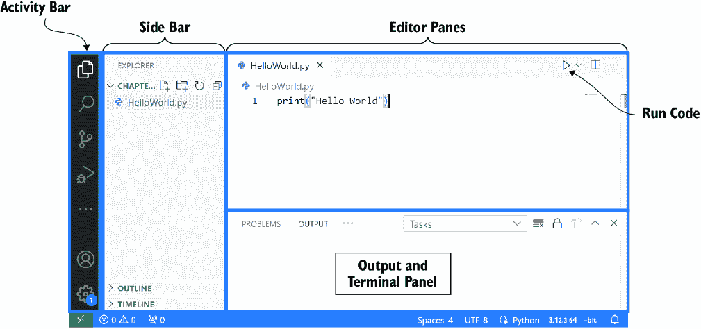
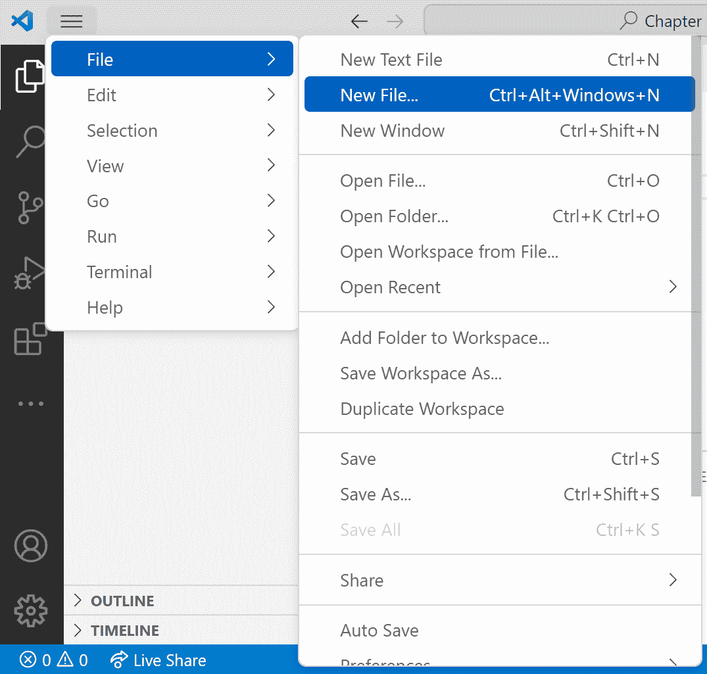
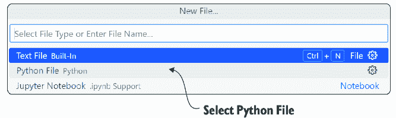
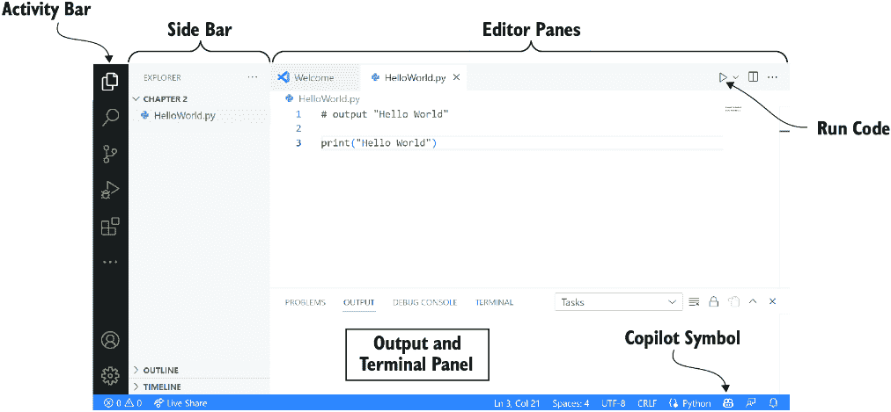
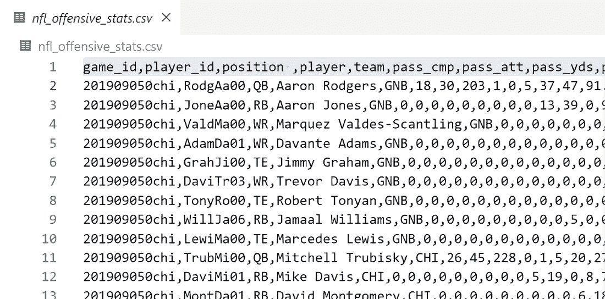

# 第二章：2 开始使用 Copilot

### 本章内容包括

+   在你的系统上设置 Python、Visual Studio Code 和 Copilot

+   介绍 Copilot 设计过程

+   理解 Copilot 在数据处理任务中的价值

我们希望你能够从一开始就自己创建软件。为此，我们将引导你在你的计算机上设置 Visual Studio Code (VS Code)、Python 和 Copilot，并让你熟悉如何与这些工具进行互动。设置好这些工具后，你将能够跟随我们的示例并开始自己创建软件。没有什么比实践更重要，我们相信你可以和我们一起学习，直到本书的最后。

一旦你设置好 Copilot，我们将通过一个有趣的示例来展示 Copilot 在解决标准任务中的强大功能。你将看到如何与 Copilot 互动，并且你将学会如何在不写任何实际代码的情况下编写软件。请记住，Copilot 并不完美，你需要能够阅读和理解一些 Python 代码才能获得你想要的结果，但它为你提供了一个巨大的起点。让我们开始创建你的第一个计算机程序吧。

## 2.1 设置你的计算机以开始学习

学习如何编写软件需要你不仅仅是阅读它，还要实际进行编写软件的任务。如果这本书是关于如何弹吉他，你会在不尝试弹吉他的情况下继续读下去吗？我们猜不会。阅读这本书而不跟着一起尝试，就像是看着马拉松选手完成比赛，然后想着自己也准备好去跑马拉松了。我们不再使用类比，但说真的，你需要先安装好软件并让它运行，然后我们才能继续。

现在我们最担心的是，我们刚刚触及到最常见的新手难点，甚至是那些渴望学习编程的人，往往都会在这一点上失败，而我们*真的*希望你能够成功。现在，你可能在想，“等一下，真的吗？我们才刚开始。” 是的，这正是关键所在。在 Leo 的热门 Coursera 课程中关于学习 Java 编程的部分，你能猜到大多数新学员什么时候退出吗？是课程末尾那个挑战性的作业，需要在全球实时绘制地震标记吗？不。实际上是那道热身作业，要求学员们设置他们的编程环境。因此，我们理解这可能是你面临的一个障碍。希望通过这次不那么微妙的提示，我们能帮助你实现购买本书时所设定的所有目标。所有的开始都从安装软件开始。

## 2.2 我们将使用的软件

为了轻松设置和使用 Copilot，我们将安装初学者和软件工程师都在使用的软件编辑工具。你将使用的工具有 Python、VS Code、GitHub 和 Copilot。当然，如果你已经安装了所有这些工具，可以跳到第 2.6.1 节。

### 2.2.1 Python

任何编程语言都可以用于本书的内容，但我们选择了 Python，因为它是世界上最流行的编程语言之一，也是我们大学入门课程中教授的语言。正如我们在第一章所说，与其他语言相比，Python 更易于阅读、更易于理解、也更易于编写。在本书中，Copilot 将主要生成代码，而不是你。但是，你需要阅读并理解 Copilot 生成的代码，Python 在这方面非常适合。

### 2.2.2 Visual Studio Code

你可以使用任何文本编辑器进行编程。然而，如果你想要一个良好的编程环境，可以在其中编写代码，轻松从 Copilot 获取建议并运行代码，那么 VS Code 是我们推荐的工具。VS Code 被初学者用来学习软件开发，并深受学生们的喜爱[2]。它在全球范围内也被专业软件工程师使用，这意味着你可以在完成本书后，继续使用这个环境进行工作和学习。为了让 VS Code 能够在本书中使用，你需要安装一些扩展，以便进行 Python 编程并使用 Copilot，但 VS Code 的一大优点是安装这些扩展非常简单。

### 2.2.3 GitHub 账户

GitHub 是一个业界标准工具，用于开发、维护和存储软件。然而，在本书中我们不会使用 GitHub。我们注册 GitHub 只是因为你需要一个账户来访问 Copilot。注册 GitHub 账户是免费的，但截至写作时，他们会对 Copilot 收费。如果你是学生，他们将免除这笔费用。如果你不是学生，截至写作时，你可以获得 30 天的免费试用。

你可能会问，为什么他们要收费提供这个服务，答案是有原因的。构建 GPT 模型的成本非常高（想象一下成千上万台计算机运行一年来构建模型），而 GitHub 通过提供来自模型的预测而产生费用（许多机器接收你的输入，将其通过模型处理，然后生成你的输出）。如果你还没有准备好长期使用 Copilot，你可以在注册后大约 25 天左右在日历上记下一个提醒，如果到时你没有使用 Copilot，就可以取消。如果你已经成功学会了如何使用 Copilot 编写软件，并且在工作或作为爱好时用它提高生产力，那么继续使用它是有意义的。

在本章中，我们将安装所有这些工具，但我们会分两部分进行。接下来的第一部分将帮助你设置好写代码和运行代码的环境，使你熟悉这个过程。第二部分将帮助你设置 Copilot，以便在编写代码的过程中为你提供帮助。

## 2.3 设置你的系统：第一部分

在本安装指南的第一部分，我们将安装 Python 和 VS Code。为了简化本节内容，我们仅列出你应该遵循的主要步骤。然而，在以下位置提供了更详细的说明：

+   VS Code 提供了一个关于如何开始编写 Python 代码的教程，网址是 [`mng.bz/znjQ`](https://mng.bz/znjQ)。

+   本书的网站 ([`mng.bz/0M46`](https://mng.bz/0M46)) 提供了详细的 PC 和 macOS 系统设置说明。由于这些工具的网址可能会在我们编写本书后发生变化，我们建议你将 GitHub 链接和本书网站结合使用。

+   在在线书籍论坛 ([`mng.bz/NBK1`](https://mng.bz/NBK1)) 中，你可以寻求帮助并查看常见问题的答案。

你需要完成的主要步骤如下：

1.  安装 Python：

    +   访问 [www.python.org/downloads/](http://www.python.org/downloads/)。

    +   下载并安装最新版本的 Python（截至写作时为 3.12.3）。

1.  安装 VS Code：

    +   访问 [`code.visualstudio.com/download`](https://code.visualstudio.com/download)，并选择适合你操作系统（如 Windows 或 Mac）的主下载版本。

    +   下载并安装最新版本的 VS Code。

1.  安装 VS Code 扩展：有关详细信息，请参见 [`mng.bz/9o01`](https://mng.bz/9o01)。

    +   *Python（由 Microsoft 提供）*—请按照 [`mng.bz/j0gP`](https://mng.bz/j0gP) 上的说明正确设置 Python 扩展（特别是选择正确的解释器）。

尽管这里的说明很简洁，但我们知道实际操作可能需要一些时间。如果你遇到任何问题，请参考之前提到的资源，获取更详细的设置说明。

## 2.4 在 Visual Studio Code 中使用 Python

现在你的系统已设置好，让我们熟悉一下图 2.1 中显示的 VS Code 界面（你可能需要点击左上方的资源管理器图标，才能看到相同的视图）。以下是图 2.1 中标识的区域：

+   *活动栏—*在最左侧是活动栏，我们可以在其中打开文件夹（也称为目录）或安装扩展（如前一节中安装 Python 扩展时所做的）。

+   *侧边栏—*侧边栏显示的是当前活动栏中打开的内容。在图 2.1 中，活动栏显示选择了资源管理器，因此侧边栏显示的是当前文件夹中的文件。

+   *编辑窗格—*这些是我们创建软件的主要区域。编辑窗格中的编辑器类似于任何其他文本编辑器，你可以使用剪贴板来写作、编辑、复制和粘贴文本。这个编辑器不同之处在于它专门为代码编写设计，因此在这窗口中编写的代码会特别合适。此时，我们将在该窗口中编写代码，但在本章后面，你主要将在此窗口中通过请求 Copilot 生成代码，然后测试这些代码。



##### 图 2.1 VS Code 界面 [3]

+   *输出和终端面板*——在这个界面区域，你将看到代码的输出或任何发生的错误，具体在以下标签页中：问题、输出、调试控制台和终端。我们主要使用问题标签页，在这里可以看到代码中的潜在错误，和终端标签页，在这里可以与 Python 互动并看到代码的输出。

VS Code 有多种不同的配色方案，你可以选择任何你喜欢的配色方案，因为功能是一样的。

### 2.4.1 设置你的工作文件夹

在 VS Code 左侧活动栏的顶部，你会找到资源管理器作为第一个图标。点击资源管理器后，你会看到一个“未打开文件夹”的消息。点击按钮打开一个文件夹，并选择你计算机上的一个文件夹（或者新建一个文件夹——我们喜欢将文件夹命名为 fun_with_Copilot）。打开这个文件夹后，你的工作空间将是你打开的文件夹，这意味着你应该将代码和任何数据文件（比如本章稍后会用到的文件）保存在这个文件夹中。

##### 文件未找到或文件缺失错误

如果你收到一个错误提示，说缺少某个文件，请不要灰心：这些错误是每个人都会犯的。当编写软件时，这种错误特别烦人。也许你只是没有把文件放到工作文件夹里——这种情况很常见——但你可以通过将文件复制或移动到正确的文件夹来轻松修复它。然而，有时你会看到文件确实在文件夹里，但当你在 VS Code 中运行代码时，Python 似乎找不到它。如果你遇到这种情况（我们在写书时也遇到过！），请确保在 VS Code 中使用资源管理器打开包含代码和所需文件的文件夹（如图 2.1 中侧边栏所示）。

### 2.4.2 检查你的设置是否正常工作

让我们检查一下是否已正确设置一切。为此，我们首先创建一个新文件来保存我们的程序。你可以通过点击文件 > 新建文件（图 2.2）来实现，然后选择 Python 文件（图 2.3）。



##### 图 2.2 如何在 VS Code 中创建新文件

创建文件后，我们会确保保存文件。点击文件 > 另存为，然后将文件命名为 first_program.py。接下来，在文本编辑器中，按下面的内容准确输入：

```py
print("Hello World")
```

你可能已经猜到，当我们运行这个程序时会发生什么。它应该会在屏幕上打印“Hello World”。让我们试试看！首先，你需要通过点击文件 > 保存来保存你的文件。



##### 图 2.3 选择 Python 文件，将新文件创建为 Python 文件。

警告  在运行代码之前，请确保保存你的文件！我们很不好意思地承认，我们曾花了很多时间修复那些正确但没有保存的代码。

要运行你的程序，请点击文本编辑器右上角的运行代码图标，如图 2.1 中所示。点击图标后，在底部的终端部分，你应该会看到如下内容：

```py
> & C:/Users/<YOUR_NAME>/AppData/Local/Programs/Python/Python312/python.exe 
↪ c:/Users/<YOUR_NAME>/Copilot/first_program.py
Hello World
```

从 > 开始的第一行是计算机运行你代码的命令，它的意思是用 Python 运行你的 first_program.py。第二行是运行命令后的输出，显示“Hello World”，这是我们希望看到的结果。

恭喜！你已经写出了你的第一个程序！现在我们知道你的编程环境已经设置正确了。接下来，让我们再写几个小程序，熟悉这个工作流程，然后再转到使用 Copilot 的工作流程。

## 2.5 编写并运行一些小程序

你刚刚完成了安装 Python 和 VS Code 并使其正常工作的主要步骤。在开始使用我们的 AI 助手 Copilot 之前，让我们再写几个小程序，让你熟悉如何输入和运行代码。

让我们从写一个简单的加法程序开始。先删除你写的打印 Hello World 的那行代码，然后用下面的代码替换它：

```py
a = 10
b = 20
print(a + b)
```

你认为那段代码会打印什么？它会打印 “a + b”，还是打印 30？运行一下看看吧。

计算机计算了 10 和 20 的和并打印出 30。是不是很棒？我们用计算机做了一些小计算。如果你改变了 `a` 或 `b` 的值，你认为会发生什么？可以自己尝试一下。

本书稍后会花更多时间讲解如何阅读代码的细节，但如果你感兴趣，下面是如何阅读那段代码：

```py
a = 10     #1
b = 20           #2
print(a + b)   #3
```

#1 创建一个名为 “a” 的变量，并赋值为 10

#2 创建一个名为 “b” 的变量，并赋值为 20

#3 将 “a” 和 “b” 相加，然后将结果打印到屏幕上

现在关键的一点是，你要习惯在编辑器面板中输入代码，并通过点击运行按钮来执行代码。

再做一个简单的示例。假设你想计算一个正方形的面积。回想一下我们的几何公式，边长为 *s* 的正方形的面积公式如下：

Area = *s *²

让我们从定义一个边长并打印面积开始：

```py
side = 5
area = side * side
print("Side length:", side, " Square area is:", area)
```

我们鼓励你输入并运行这段代码。运行时，你应该看到以下结果：

```py
Side length: 5 Square area is: 25
```

输入那段代码时遇到问题了吗？我们猜很多人都会遇到。如果你漏掉了一个引号、逗号或括号，运行代码时可能会出现类似这种不愉快的错误（这里，如果你漏掉了一个逗号）：

```py
File "c:\Users\Leo\Copilot\first_program.py", line 7
    print("Side length:" side, " Square area is:", area)
          ^^^^^^^^^^^^^^^^^^
SyntaxError: invalid syntax. Perhaps you forgot a comma?
```

在传统的编程学习方式中，你会花很多时间确保自己理解每个字符的写法，以使编程语言 Python 能够正确运行。我们再次强调好消息：有了像 Copilot 这样的 AI 助手，语法变得不再那么重要。让我们安装 Copilot，这样你就可以学习如何使用这个工具。

## 2.6 设置你的系统：第二部分

现在我们准备进入安装指南的第二部分。这里有一些新的步骤，超出了之前的内容。再次提醒，您可以参考以下资源以获取更多关于安装过程的详细信息：

+   请访问 GitHub 的文档：[`mng.bz/WVP1`](https://mng.bz/WVP1)。

+   本书的网站([`mng.bz/0M46`](https://mng.bz/0M46))提供了详细的 PC 和 macOS 系统设置说明。由于这些工具的网址可能在本书编写后发生变化，我们建议您结合使用 GitHub 链接和本书网站。

+   在在线书籍论坛([`mng.bz/NBK1`](https://mng.bz/NBK1))，您可以寻求帮助，并查看常见问题的答案。

本次安装的主要步骤如下：

1.  设置您的 GitHub 账户，并注册 Copilot：

    +   访问[`github.com/signup`](https://github.com/signup)，并注册一个 GitHub 账户。

    +   进入 GitHub 的设置，启用 Copilot。这时，您需要验证自己是学生，或者注册 30 天的免费试用（在编写本书时提供）。

1.  安装以下 VS Code 扩展（详情请见[`mng.bz/9o01`](https://mng.bz/9o01)）：

    +   *GitHub Copilot（由 GitHub 提供）*——在编写本书时，安装 GitHub Copilot 会自动安装 GitHub Copilot Chat。请检查 GitHub Copilot Chat（由 GitHub 提供）是否已安装，方法是查看已安装的扩展。如果没有安装，您需要安装该扩展。

我们知道这里的步骤较为简洁。如果您遇到任何问题，我们建议您参考前面提到的资源，获取更详细的安装说明。

### 2.6.1 检查 Copilot 是否正常工作

如果您的安装正确，您应该会在 VS Code 界面的右下角看到 Copilot 图标（如图 2.4 所示）。



##### 图 2.4 VS Code 界面与 Copilot 运行中的状态

让我们通过编辑 first_program.py 文件来检查 Copilot 是否正常工作。您可以删除当前的代码并重新开始，或者创建一个新的.py 文件，随您便。在文本编辑器中，输入以下内容：

```py
# output "Hello Copilot" to the screen
```

我们写的提示和代码将以**粗体**显示，以帮助区分我们写的内容与 Copilot 可能给出的代码和注释。行首的 # 符号很重要（你应该在输入的内容中包含它）。它表示你写的是注释（根据你在 VS Code 中使用的配色方案，可能与我们即将生成的代码颜色不同）。注释*不是*代码：计算机执行代码，而不执行注释。程序员使用注释来提供代码执行的人工可读摘要，以帮助其他软件工程师阅读代码。今天，注释的作用已扩展到提示 Copilot。在写完注释后（有时甚至在写注释时），Copilot 会尝试给我们提供建议。你可以把它看作是一个更复杂的自动完成，就像你在搜索引擎中输入“New York T”时，它会自动完成为“New York Times”。

要触发 Copilot 开始给我们提供代码（或更多注释），请按下行尾的 Enter 键，你将进入新的一行。稍等片刻，你应该会看到一些内容出现。在被接受之前，Copilot 的建议是浅灰色斜体。如果你还没有得到建议，可能需要按第二次 Enter 键来触发 Copilot 提供代码。以下是我们看到的情况：

```py
# output "Hello Copilot" to the screen
*`*print("Hello Copilot")*`*
```

如果你仍然没有看到 Copilot 的建议，试着按 Ctrl-Enter（按住 Ctrl 然后按 Enter）。按下 Ctrl-Enter 后，编辑器窗口右侧会出现一个新窗口，里面有名为 GitHub Copilot Suggestions 的程序。如果这个窗口没有出现，可能是你的设置出了问题，我们建议你访问书籍网站，仔细检查是否按照所有步骤正确操作，或者寻求帮助（或者请教他人）。

如果你看到了 Copilot 的建议，按 Tab 键接受 Copilot 的建议。这样做后，之前浅灰色斜体的建议应该变成标准字体：

```py
# output "Hello Copilot" to the screen       #1
print("Hello Copilot")     #2
```

#1 我们写的提示

#2 Copilot 生成的代码

如果你看到的代码与我们不同，那是因为我们之前提到过的原因：Copilot 是非确定性的，因此你看到的代码可能与我们不同。我们提到这一点是因为有时 Copilot 会在代码上犯一些小错误，并可能给出类似于这样的代码：

```py
print "Hello Copilot"
```

你可能认为这个细微的差别（`"Hello` `Copilot"` 周围没有圆括号）不重要，但其实它是有区别的。在 Python 3 之前，这是打印语句的正确语法，而 Python 3 引入后，语法变成了带圆括号的代码。因为我们正在运行 Python 3，代码必须有圆括号才能正常工作。你可能会问为什么 Copilot 会出错。问题在于 Copilot 在训练过程中使用了一些旧版本的 Python 代码。如果这让你感到恼火，我们表示理解。但这也是初学者在 Copilot 之前遇到的挫折之一。Copilot 提供的大部分建议在语法上是正确的。但如果你是一个初学者，从零开始编写代码，遗漏圆括号或某个地方漏掉冒号，可能会让你浪费大量时间。现在我们有了正确的代码，如下所示：

```py
# output "Hello Copilot" to the screen
print("Hello Copilot")
```

这与我们之前手动编写的“Hello World”代码类似。我们希望看到 Copilot 能生成这样的代码能让你感到鼓舞！

现在，让我们看看 Copilot 在上一节中计算正方形面积的示例中表现如何。继续输入以下代码和提示（再次以粗体显示）：

```py
side = 5
area = side * side
# Print the side length is *** and the area is ***
```

我们收到了 Copilot 的以下回应：

```py
print("The side length is", side, "and the area is", area)
```

注意 Copilot 如何良好地处理那段代码。对于人类，特别是初学编程的学习者，犯错很容易，但 Copilot 很少出错。我们希望 Copilot 给出了类似的回应。如果你想更熟悉界面，随时可以试着操作 Copilot 一段时间。

我们现在知道你的编程环境和 Copilot 已正确设置，因此可以开始更大的编程任务。但在开始之前，我们想先介绍一些与 Copilot 一起工作时常遇到的问题，并提供解决方案，以便你在处理下一个示例时能够使用这些提示。

## 2.7 解决常见的 Copilot 挑战

现在谈论 Copilot 的常见挑战可能显得有些早，但你在编写第一个程序时可能已经遇到了一些挑战。在接下来的示例和章节中，你肯定会遇到这些挑战，所以我们想提前给你提供这些信息。

在与 Copilot 合作的过程中，我们遇到了一些常见的挑战。随着 Copilot 的不断改进，这些挑战可能会减少，但在写作时它们仍然存在。尽管表 2.1 中列出的挑战不是你可能遇到的唯一问题，但我们希望通过我们的建议来解决这些常见挑战，帮助你快速上手。如果我们遗漏了什么，可以随时通过论坛联系我们，我们会在书籍网站上持续更新挑战清单。

##### 表 2.1 常见的 Copilot 使用挑战

| 挑战 | 描述 | 解决方法 |
| --- | --- | --- |

| 仅限注释  | 如果你使用注释符号（#）给 Copilot 一个提示，当你开始新的一行时，它会更倾向于给你更多的注释，而不是代码。例如：**`# 输出"Hello Copilot"到屏幕`**

`# 打印 "Hello world" 到屏幕`

我们曾看到 Copilot 生成一行又一行的注释，有时还会重复自己！当这种情况发生时，右侧栏中的补救措施 3（使用文档字符串）通常是最有效的。

| 1\. 在你的注释和 Copilot 的建议之间添加一个换行符（按 Enter 键），以帮助它从注释切换到代码。2\. 如果换行符不起作用，你可以输入一些代码字母（没有注释符号）。通常，提示中的关键字的几个字母就能起作用。例如：

`# 输出"Hello Copilot"到屏幕`

`pr`

几个关键字的字母通常会让 Copilot 给出代码建议。

3\. 切换使用#注释到像这样的文档字符串注释：

`"""`

`输出 "Hello Copilot" 到屏幕`

`"""`

4\. 使用 Ctrl-Enter 看看 Copilot 是否会给你提供代码而不是注释的建议。

|

| 错误代码  | 有时 Copilot 一开始就给出明显错误的代码。（在本书中你会学到如何识别错误的代码！）此外，有时 Copilot 似乎会陷入错误的路径。例如，它可能会尝试解决一个与你要求它解决的问题不同的问题。（特别是补救措施 3，可以帮助 Copilot 走上新的路径。）

| 本书的很多内容都在讲如何解决这个问题，但这里有一些快速的技巧来让 Copilot 帮助你：1\. 更改你的提示，看看能否更好地描述你需要的内容。

2\. 尝试使用 Ctrl-Enter 来查找 Copilot 给出的正确代码建议。

3\. 关闭 VS Code 程序，等待片刻后重新启动。这有助于清除 Copilot 缓存并获取新的建议。

4\. 尝试将问题分解成更小的步骤（详情见第七章）。

5\. 调试代码（见第八章）。

6\. 尝试向 ChatGPT 请求代码，并将其建议粘贴到 VS Code 中。另一个大型语言模型（LLM）有时能给出帮助另一个 LLM 走出困境的建议。

|

| Copilot 给出 `# YOUR CODE HERE`  | 我们曾经看到 Copilot 在提示后生成了这样的内容（或类似文本），它好像在告诉我们自己编写代码：`# YOUR CODE HERE`

| 我们认为这是因为我们要求 Copilot 解决一个过去曾经由教师给学生布置的任务。为什么？嗯，当我们编写作业时，作为教师的我们通常会先写一些代码，然后告诉学生编写其余的代码，方法是写 `# YOUR CODE HERE`

我们希望学生在这里编写代码。学生们往往会把这条注释留在他们的解决代码中，这意味着 Copilot 被训练认为这个注释是解决方案的重要部分（但其实不是）。通常，我们能够通过在 Copilot 提供的建议中找到合理的解决方案并按 Ctrl-Enter 解决，但如果不行，请查看“错误代码”的解决办法。

|

| 缺少模块  | Copilot 会给你代码，但它无法运行，因为缺少模块。 (*模块* 是可以添加到 Python 中以提供预构建功能的额外库。)  | 在 2.8.2 节中，查看“Python 模块”侧边栏以了解模块的描述，并参阅第五章了解如何使用模块。 |
| --- | --- | --- |

## 2.8 我们前进的道路

你已经看到 Copilot 可以为你生成代码。那么，我们可以直接让 Copilot 为我们解决任务吗？恐怕不行。我们仍然需要学习一些基本技能，才能有效地与 Copilot 合作，并设计对我们有意义的软件。

为了帮助你理解你需要学习的技能，并激发你对未来的期待，我们将提供一个更大的例子，代表你大约在本书阅读和实践的中途，能够独立完成的任务。

### 2.8.1 本书中我们如何与 Copilot 合作

我们将在后续章节中扩展这个工作流程，但核心要素将保持不变：

1.  使用注释（`#`）或文档字符串（`"""`）向 Copilot 写提示。

1.  让 Copilot 为你生成代码。

1.  通过阅读代码并进行测试，检查代码是否正确：

    +   如果有效，进入第 1 步，继续下一个你希望它完成的任务。

    +   如果它不起作用，删除 Copilot 中的代码，回到第 1 步，并修改提示（同时查看表 2.1 中提供的解决办法）。

### 2.8.2 展示 Copilot 在数据处理任务中的价值

对于这个更大的例子，我们希望你关注我们如何与工具互动以及我们需要的技能。我们不指望你在本书早期就理解代码。我们提供代码仅仅是为了让你看到 Copilot 给我们生成了什么，但你不需要在本章试图理解代码。

欢迎你和我们一起跟进这个例子，或仅仅阅读它。如果你卡住了，我们还没有给你足够的技能来继续，所以可以等到后面的章节再进行类似的练习。在本节其余部分，我们假设你只是在阅读。

我们希望从数据处理开始，因为这是你们中许多人可能在个人或职业生活中做过的事情。为了找到一个数据集，我们访问了一个很棒的网站——Kaggle [4]，这个网站提供了大量免费的数据集供使用。许多数据集包括一些重要数据，例如不同国家的健康统计信息、帮助追踪疾病传播的数据等。我们不会使用这些数据集，因为我们希望为我们的第一个程序选择一些更轻量的内容。因为我们俩都是美式足球迷，所以我们将使用国家橄榄球联盟（NFL）进攻统计数据库。这里是我们找到的数据集链接，如果你想自己查看，可以点击：[`mng.bz/86pw`](https://mng.bz/86pw)。该数据集包含了 2019 到 2022 年的 NFL 信息（见图 2.5）。



##### 图 2.5 nfl_offensive_stats.csv 数据集的前几列和行

#### 步骤 1：理解我们的数据集

nfl_offensive_stats.csv 文件是一个逗号分隔值（CSV）文本文件（参见图 2.5 中的文件部分）。这是存储数据的标准格式。它有一行头部，用来解释每一列的内容。我们（或计算机）知道列之间的边界是通过在单元格之间使用逗号。此外，请注意，每一行都位于自己的单独一行上。好消息是：Python 有许多工具可以读取 CSV 文件。

让我们从探索文件中存储了什么开始。要预览文件的内容，你可以在 Kaggle 网页的“详细信息”部分查看它，或者下载并在 VS Code 或类似 Microsoft Excel 的电子表格软件中打开它。现在不需要担心下载和使用这个文件，这是本书后续部分的内容。然而，如果你下载并打开它，下面是头行（顶部）的开始部分（如图 2.5 中所示）：

```py
game_id,player_id,position ,player,team,pass_cmp,pass_att,pass_yds,…
```

虽然有更多列，但这些已经足够完成我们的第一个任务了。我们想知道在这段时间内，哪位四分卫的表现最好。

#### 步骤 2：在这段时间内所有四分卫的表现如何？

如果你不关注美式足球，也没关系。你不需要了解这项运动就能跟得上。四分卫负责传球。我们首先看一下他们在这段时间内传了多少码数。我们只想和其他四分卫进行比较，因为他们是负责传球的球员。当然，跑卫每个赛季可能会传一次球，当他们这样做时通常会很有趣，但这不是他们的工作。为了只包括四分卫，我们需要告诉 Copilot 将结果限制为位置（第三列）为*QB*（四分卫的缩写）的球员。为了解决这个任务，我们创建了一个新的 Python 文件，名为 nfl_stats.py，并与 Copilot 进行了对话，代码可以在清单 2.1 中看到。

##### 清单 2.1 Copilot 分析顶级四分卫的代码

```py
"""                                                        #1
**open the csv file called "nfl_offensive_stats.csv" and** 
**read in the csv data from the file** 
**"""** 

# import the csv module      #2
import csv

# open the csv file
with open('nfl_offensive_stats.csv', 'r') as f:
    # read the csv data
    data = list(csv.reader(f))

**"""                                                        ** #3
**the 3rd column in data is player position, the fourth      ** #3
**column is the player, and the 8th column is the            ** #3
**passing yards. For each player whose position in           ** #3
**column 3 is "QB", determine the sum of yards from          ** #3
**column 8                                                   ** #3
**"""                                                        ** #3

# create a dictionary to hold the player name and passing yards
passing_yards = {}
# loop through the data
for row in data:
    # check if the player is a quarterback
    if row[2] == 'QB':
        # check if the player is already in the dictionary
        if row[3] in passing_yards:
            # add the passing yards to the existing value
            passing_yards[row[3]] += int(row[7])
        else:
            # add the player to the dictionary
            passing_yards[row[3]] = int(row[7])

**"""                                                 ** #4
**print the sum of the passing yards sorted by sum    ** #4
**of passing yards in descending order                ** #4
**"""                                                 ** #4
for player in sorted(passing_yards, key=passing_yards.get, reverse=True):
    print(player, passing_yards[player])
```

#1 我们的第一个读取数据的提示

#2 Copilot 的响应有时包括注释。从 Copilot 得到的注释不会是粗体的，而我们的提示是粗体的。

#3 我们的第二个提示用于分析数据

#4 我们的第三个提示用于打印结果

请注意，我们给了 Copilot 三个提示。第一个是处理输入数据，第二个是处理数据，第三个是输出响应。数据输入、数据处理和数据输出的循环在编程任务中非常常见。

如果你选择跟随我们并将这些提示提供给 Copilot，你可能会得到不同的代码。没关系，因为 Copilot 是非确定性的，它不会总是给出相同的结果。然而，如果它给出了不同的代码，我们还没有为你提供判断其是否正确的工具。因此，如果你想跟随我们的步骤，尽管使用我们的代码。

##### 提醒：Copilot 是非确定性的

如第一章和本章所述，Copilot 是非确定性的，所以 Copilot 给出的结果可能与你得到的不同。这将是本书接下来的挑战：如果你得到一个错误的结果，而我们得到了正确的结果，该怎么办？我们非常有信心 Copilot 会给你一个正确的答案，但如果你从 Copilot 那里得到一个*错误的答案*，请继续阅读本节内容，而不是在 VS Code 中与 Copilot 一起操作。我们一定会为你提供所有必要的工具来修复 Copilot 给出的错误代码，但这项技能将在本书的后续章节中教授，所以我们不希望你现在就卡住了。

看着 Copilot 的结果，我们不得不说这非常令人印象深刻。你现在不需要担心代码，但请注意，从头编写这段代码对于许多新手学习者来说会很困难。好消息是，任何人都可以使用这个强大的工具做比没有它时更多的事情。

#### 第 3 步：使用 Copilot 修改代码以排除一个球员

我们可以使用 Copilot 不仅生成新代码，还可以修改它。如果我们在数据集上运行列表 2.1 中的代码，以下是输出的前五行：

```py
Patrick Mahomes 16132
Tom Brady 15876
Aaron Rodgers 13852
Josh Allen 13758
Derek Carr 13271
```

如果你跟随足球，这些结果应该不会让你感到惊讶。为了看看 Copilot 如何适应我们的需求，让我们尝试做一个小改动。假设由于 Tom Brady 已经被公认为历史上最好的四分卫之一，你宁愿从这次比较中省略他。

要做这个改动，我们只需修改底部的提示。我们来到代码中如下所示的位置：

```py
"""
print the sum of the passing yards sorted by sum
of passing yards in descending order 
"""
for player in sorted(passing_yards, key=passing_yards.get, reverse=True):
    print(player, passing_yards[player])
```

我们删除了代码，只留下了注释，并在文档字符串中添加了另一行：

```py
"""
print the sum of the passing yards sorted by sum
of passing yards in descending order 
Do not include Tom Brady because he wins too much
"""
```

然后，Copilot 向我们建议了以下内容：

```py
for player in sorted(passing_yards, key=passing_yards.get, reverse=True):
    if player != "Tom Brady":                  #1
        print(player, passing_yards[player])
```

#1 排除 Tom Brady 的数据代码

那正是我们希望在代码中看到改变的地方。（谢谢你，汤姆·布雷迪，在这个例子中表现得很好。）在打印结果的时候，代码排除了汤姆·布雷迪的所有数据。当我们保存文件并再次运行时，前五行现在看起来是这样的：

```py
Patrick Mahomes 16132
Aaron Rodgers 13852
Josh Allen 13758
Derek Carr 13271
Matt Ryan 13015
```

#### 反思例子和我们需要使用 Copilot 编写代码的技能

虽然我们自己没有编写任何代码，但我们能够解决一个大型的实际任务。然而，你仍然需要学习一些基本的编程技能。在接下来的章节中，我们将通过解决各种任务来教给你这些技能。到第七章结束时，你将能够解决这类大型任务。我们希望你从这个例子中得到以下收获：

+   *Copilot 是一个强大的工具。* 我们自己没有编写任何代码，但我们能让 Copilot 生成需要执行一些初始数据分析所需的代码。如果你使用过电子表格，你可能会想到使用诸如 Microsoft Excel 等电子表格应用程序来做这件事，但很可能不会像编写这样的代码那样简单。即使你以前没有使用过电子表格，你也必须承认，通过编写基本的、人类可读的提示就能产生正确的代码和输出，这真是令人惊讶。

+   *将问题分解成小任务是很重要的。* 例如，我们尝试使用单个大提示（未显示）编写此代码，或者将其分解为较小的任务。我们发现，当给出一个大任务时，Copilot 更容易出错，而不是给出多个较小的任务。通常情况下，将问题分解为较小的任务显著增加了 Copilot 生成正确代码的可能性。你将看到在本书的其余部分如何将较大的问题分解为较小的任务，因为这是你需要的最重要的技能之一。事实上，即将到来的第三章将帮助你开始理解，什么样的任务被认为是适合交给 Copilot 的，第七章将完全专注于学习如何将较大的程序分解为较小的部分。

+   *我们仍然需要在某种程度上理解代码。* 几个原因证明了这一点。其中一个原因是，编写良好的提示需要基本的理解计算机知道什么，以及不知道什么。我们不能只是给 Copilot 一个提示：“告诉我汤姆·布雷迪的传球码数。” Copilot 可能无法确定数据存储在哪里，数据的格式，哪些列对应于球员和传球码数，或者汤姆·布雷迪是一名球员。我们不得不向 Copilot 详细解释这些细节才能成功。另一个原因与确定 Copilot 生成的代码是否合理有关。当我们两个人阅读 Copilot 的响应时，我们可以确定代码正在做什么，因为我们知道如何阅读代码。你需要在某种程度上能够做到这一点，这就是为什么第四章和第五章专门讲解阅读代码的原因。

+   *测试很重要。* 我们需要知道 Copilot 给我们的代码是否正确！当程序员谈论测试时，他们指的是确保代码在可能的意外情况下也能正常工作的实践。我们在这一部分没有花太多时间，除了使用一个数据集估算 Copilot 的答案是否合理，但一般来说，我们需要花更多时间进行测试，因为这是写代码过程中的关键部分。显然，代码中的错误可能会从令人尴尬（如果你告诉一个狂热的 NFL 球迷某个球员的传球码数错了）到危险（如果汽车中的软件表现不正确）再到代价高昂（如果企业根据错误的分析做决策）。当你学会如何阅读代码后，我们有亲身经验，即使代码看起来正确，也不一定是真的！为了解决这个问题，我们必须测试 Copilot 生成的每一段代码，确保它能完成应该做的事。你将在后续章节中，特别是第六章，学习如何严格测试 Copilot 的代码，该章专门讲解这一技能。

+   *Python 很强大。* 如果你没有注意到也没关系，但在清单 2.1 中，代码从 Python 的库中导入了一个模块（`import` `csv`）。Python 有许多内置工具（称为库），帮助人们完成任务。在这个例子中，它导入了一个库，使得读取和修改 CSV 文件变得更容易。我们将在后续章节中利用更多这些库。

##### Python 模块

Python 模块扩展了编程语言的功能。Python 中有许多模块，它们可以帮助你完成从数据分析到创建网站，再到编写视频游戏的各种任务。你可以通过代码中的`import`语句来识别何时使用 Python 模块。一些模块是 Python 内置的，但还有成千上万的模块不是内置的，如果你想使用它们，需要手动安装。第五章将向你展示如何使用模块。

在本章中，我们已经取得了很大进展！如果你已经完成了编程环境的设置，并开始使用 Copilot 写代码，你应该感到骄傲。你已经迈出了写软件的巨大一步！除了设置环境的细节之外，通过一起完成一个示例，你已经看到了我们前进的方向。

在本章的示例中，Copilot 给了我们想要的代码，而我们不需要更改提示词或调试代码来找出为什么它没有正常工作。这是展示使用 AI 助手编程的强大功能的一种好方式，但你会发现自己经常需要测试代码、修改提示词，有时还需要理解代码为什么错了。这就是 AI 助手编程的过程，你将在接下来的章节中学到更多。

## 总结

+   你安装了 Python 和 VS Code，并设置了 Copilot，这样你就可以跟着书一起工作，开始自己写代码了。

+   VS Code 界面包含了文件管理、代码编辑和运行代码的区域，这些区域将在整本书中使用。

+   提示是我们告诉 Copilot 生成代码的方式，当提示编写得当时，它可以成为一种高效的软件开发方式。

+   数据分析是一个常见的编程任务，使用 CSV 文件是存储供计算机处理的数据的常见方式。

+   Copilot 是一款强大的工具，在适当的人工监督下，能够生成复杂的代码。
