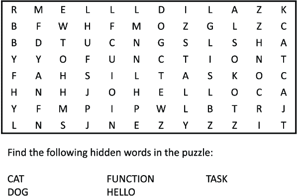
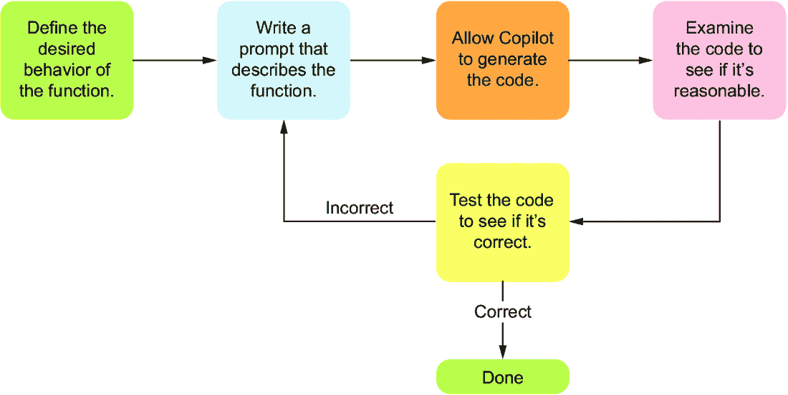
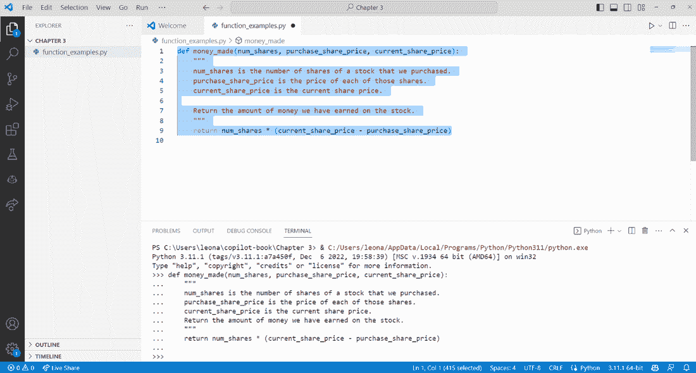
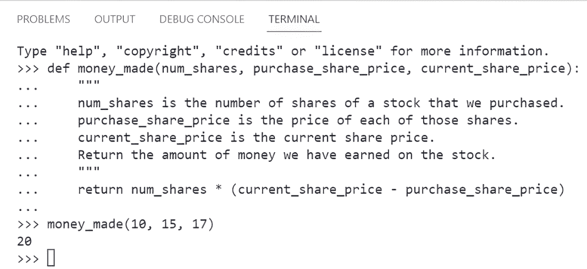
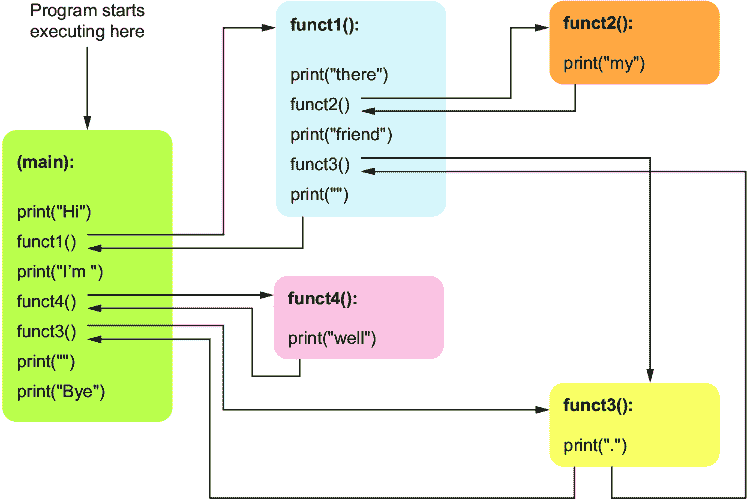

# 第三章：3 设计函数

### 本章内容包括

+   Python 中的函数及其在软件设计中的角色

+   与 Copilot 互动的标准工作流程

+   使用 Copilot 编写良好函数的示例

+   Copilot 可以解决的合理任务

编程新手面临的最大挑战之一就是如何知道给 Copilot 提供一个合理的任务，以便它能够找到一个好的解决方案。如果你给 Copilot 一个过于庞大的任务，它通常会以一种极为壮观的方式失败，这往往是非常难以修复的。那么，什么样的任务才是合理的呢？

这个问题对我们使用 Copilot 很重要，但远远超出了这个范畴。人类程序员同样也在与复杂性作斗争。如果经验丰富的软件工程师试图编写代码来解决一个过于复杂的问题，而没有将其拆解成更小、更易解决的子问题，他们通常也会遇到麻烦。人类的解决方案是使用一种叫做*函数*的东西，它的工作是执行一项任务。函数帮助我们组织代码，使其更容易理解并修复任何错误。关于如何编写合理的函数，通常有一些经验法则，特别是在代码行数方面，但从根本上说，这些规则试图确保编写的东西（1）执行一个单一的任务，（2）不至于复杂到难以正确实现。

对于那些通过传统方式学习编程的人来说，在接触函数之前，他们可能在写 5 到 10 行的代码时就已经为语法问题困扰。此时，他们通过经验自然地理解到，他们不应该在单一函数中写超过自己能测试和调试的代码。因为你正在学习与 Copilot 一起工作，而不是直接与语法打交道，所以本章的任务是教你有关函数的知识，以及什么样的任务在 Copilot 中被视为合理或不合理的单一函数任务。

为了帮助你更好地理解函数，本章将提供多个示例。这些示例使用了与 Copilot 互动的核心工作流程——具体来说，就是编写提示、接收 Copilot 提供的代码，并测试代码是否正确。在 Copilot 生成的函数中，你将开始看到核心编程工具，如循环、条件语句和列表等，这些内容将在接下来的两章中进一步扩展。

## 3.1 函数

在我们学习编写函数的细节之前，我们需要对函数在软件中的作用有一些基本的了解。函数是帮助完成更大任务的小任务，而这些大任务又帮助解决更复杂的任务，依此类推。你可能已经对将大任务拆解成小任务有了很多直觉。让我们通过一个示例将这一直觉具体化。

假设你在报纸上找到了一个字谜，并且想要解开它（请参见图 3.1 的示例谜题）。在这类谜题中，你需要找到字词列表中的每个单词。单词可以从左到右、从右到左、从上到下或从下到上查找。



##### 图 3.1 示例字谜

从高层次来看，你的任务是“找出字谜中的所有单词。”不幸的是，单独这样描述任务并没有帮助。它没有告诉我们需要采取哪些步骤来解决问题。

现在试着花几分钟时间解决这个问题。你是如何开始的？你如何将整体任务分解成更容易实现的小任务？

你可以做的一件事是说：“好吧，找出所有单词是一个大任务，但一个更小的任务就是先找到第一个单词（CAT）。让我先做这个！”这就是将一个大任务分解为更小任务的一个例子。为了完成整个难题，你可以对每个需要找到的单词重复执行这个较小的任务。

那么，我们如何找到一个单独的单词，比如 CAT 呢？即使是这个任务，也可以进一步分解，以便更容易完成。例如，我们可以将其分解为四个任务：从左到右查找 CAT，从右到左查找 CAT，从上到下查找 CAT，以及从下到上查找 CAT。我们不仅将任务变得越来越简单，而且还将工作组织成了逻辑性的部分。最重要的是，正如我们在本章中将看到的，正是这些更简单的任务的代码我们将要求 Copilot 编写，并最终组装成我们的完整程序。

将一个大问题分解成更小的任务被称为*问题分解*，这在软件设计中是一项非常重要的技能，以至于我们将第七章的内容专门讲解了这一点。目前，了解何时一个任务太大，无法让 Copilot 完成是至关重要的。让 Copilot 制作一个结合了 Wordscapes 和 Wordle 的新视频游戏根本行不通。然而，你可以让 Copilot 编写一个对解决更大问题至关重要的函数；例如，你可能需要一个函数来检查玩家提供的单词是否在有效单词列表中。Copilot 完全可以解决这个问题，这个函数也能帮助 Copilot 更接近解决更大问题。

### 3.1.1 函数的组成部分

*函数*这个名字的起源可以追溯到数学，在数学中，函数定义了基于输入的输出。例如，在高中数学中，你可能学过如何识别常见的函数写法如下：

f(*x*) = *x*²

这是一个函数，给定变量 *x* 的值并计算该值的平方。所以，我们可以说，当 *x* 等于 6 时，f(*x*) 就是 36。由于编程函数也有特定输入对应的预期输出，因此这个名字在编程中也很合适。

作为程序员，我们还喜欢把函数看作是一种承诺或合同。如果有一个叫做 `larger` 的函数，我们被告知它接受两个数字并返回其中较大的一个，那么当我们提供数字 2 和 5 时，我们相信它会返回 5。我们不需要知道这个函数是如何工作的，就像我们不需要知道汽车刹车的工作原理就能使用刹车踏板一样。踩下刹车踏板，汽车就会减速。给 `larger` 函数两个数字，它会返回两个数字中的较大者。

Python 中的每个函数都有一个*函数头*（也叫做*函数签名*），它是函数的第一行代码。由于函数头在代码中无处不在，我们需要能够读取和编写函数头。函数头描述了函数的名称及其输入。在某些其他编程语言中，函数头有时还会包括输出的信息，但在 Python 中，关于输出的内容需要在代码的其他地方寻找。

在第二章中，我们使用了#注释来告诉 Copilot 做什么。如果我们希望 Copilot 生成一个函数，仍然可以继续使用这种方法。例如，我们可以使用注释请求 Copilot 写一个函数，告诉我们两个数字中哪个更大：

```py
# write a function that returns the larger of two numbers
# input is two numbers
# output is the larger of the two numbers
def larger(num1, num2):          #1
    if num1 > num2:        #2
        return num1        #2
    else:                  #2
        return num2        #2
```

#1 这个函数头定义了一个名为“larger”的函数，它接受两个名为 num1 和 num2 的输入。

#2 函数体

和上一章中的代码一样，我们只是写了注释来提示 Copilot 给我们生成代码。函数头有三个主要部分：`def` 关键字，它告诉 Python 这是一个函数；函数的名称；以及函数的输入。行尾还有一个冒号——一定要包含它，否则代码将不是有效的 Python 代码。`def` 这个词表示正在创建（定义）一个函数。在 `def` 后面是函数的名称；这个名称应该尽可能地描述函数的行为。这个函数的名称是 `larger`。如果给函数起名很困难，因为它做了很多不同的事情，那通常意味着这个函数的任务过于庞大，不适合由一个函数来完成（稍后会详细讲解）。

在函数声明的括号中，你会看到参数。*参数*是你向函数提供其运行所需信息的方式。一个函数可以有任意数量的参数，有些函数甚至没有参数。这个函数有两个参数，分别叫做 `num1` 和 `num2`；这两个参数是因为函数需要知道它正在比较的两个数字。

一个函数只能有一个输出；在确定函数输出的内容时，关键字是*return*。紧随其后的`return`内容就是函数的输出。在这段代码中，`num1`或`num2`将被返回。函数不一定需要返回任何内容（例如，打印列表到屏幕的函数没有返回任何内容的必要），所以如果你没有看到`return`语句，这不一定是问题，因为函数可能在做其他事情（例如与用户交互）而不是返回某些东西。函数必须决定是返回某些东西还是不返回任何东西：它不能在某些情况下返回某些东西，而在其他情况下什么都不返回。

虽然我们让 Copilot 通过#注释生成了这个函数，但这种方法实际上对 Copilot 来说工作量很大。首先，它必须正确写出函数头部，包括确定需要多少个参数。然后，它必须确保函数的实际代码正确。在这个例子中，Copilot 还提供了函数的代码（也叫函数体）。

还有一种方法可以提示 Copilot 写出函数的代码，这可能帮助它更准确地生成代码，并且帮助我们更好地理解我们希望函数做什么。这种方法涉及写文档字符串，而我们将在本书的大部分内容中使用文档字符串来编写函数。

##### 文档字符串解释函数的行为

*文档字符串*是程序员用来描述 Python 函数的方式。它们位于函数头部之后，并以三个双引号开始和结束，如接下来的`larger`函数代码所示。

通过写出函数头部和文档字符串，你可以更容易地让 Copilot 生成正确的代码。在函数头部，你将决定函数的名称，并提供每个你希望函数使用的参数名称。写完函数头部后，你将提供文档字符串，告诉 Copilot 这个函数的作用。然后，像之前一样，Copilot 会生成函数的代码。因为我们提供了函数头部，它将能够从头部中学习，并且更不容易出错。这就是写同一个`larger`函数的另一种方法：

```py
def larger(num1, num2): 
 """ **#1
 **num1 and num2 are two numbers.** #1
 #1
 **Return the larger of the two numbers.** #1
 **"""** #1
    if num1 > num2: #1
        return num1
    else:
        return num2**
```

**#1 函数的文档字符串描述** **注意，我们写了函数头部和文档字符串，Copilot 提供了函数体。

### 3.1.2 使用函数

一旦我们有了一个函数，我们该怎么使用它呢？回想一下我们之前提到的 f(*x*) = *x*²的类比，我们如何给函数一个值 6 来作为*x*，使得它返回 36？让我们通过使用我们刚刚写的`larger`函数来看一下如何通过代码实现。

使用函数的方法是*调用*它。调用函数意味着在特定的参数值上调用函数。这些参数值称为实参。在 Python 中，每个值都有一个*类型*，我们需要小心地提供正确类型的值。例如，`larger`函数期望两个数字；如果我们提供不是数字的输入，它可能不会按预期工作。当我们调用函数时，它会运行其代码并返回结果。我们需要捕获这个结果，以便稍后使用；否则，它将丢失。要捕获结果，我们使用*变量*，它只是一个引用值的名称。

在这里，我们让 Copilot 调用函数，将结果存储在变量中，然后打印结果：

```py
# call the larger function with the values 3 and 5
# store the result in a variable called result
# then print result
result = larger(3, 5)      #1
print(result)
```

#1 调用`larger`函数，将 3 和 5 作为输入并存储结果

代码正确地调用了`larger`。注意，它在开括号后面放入了我们希望比较的两个值。当函数完成时，它返回一个值，我们将其赋给`result`。然后我们打印结果。如果你运行这个程序，你会看到输出为 5，因为 5 是我们要求比较的两个值中较大的一个。

如果你对这些细节不完全熟悉也没关系，但我们希望你能识别出何时正在调用一个函数，如下所示：

```py
larger(3, 5)
```

函数调用的一般格式是

```py
function_name(argument1, argument2, argument3,... )
```

因此，当你看到名字后面紧跟着的括号时，意味着有一个函数调用。像我们这里这样调用函数对我们的 Copilot 工作流非常重要，特别是在我们测试函数是否正常工作时。我们还需要调用函数来完成工作，因为函数在我们调用它们之前什么都不做。

## 3.2 与 Copilot 一起设计函数的循环

让我们介绍一下我们在接下来几章中将使用的工作流程。与 Copilot 一起设计函数涉及以下步骤的循环（见图 3.2）：

1.  确定函数的预期行为。

1.  编写一个尽可能清晰描述该函数的提示。

1.  允许 Copilot 生成代码。

1.  阅读代码，看看它是否合理。

1.  测试代码，看它是否正确：

    +   如果经过多次测试后代码正确，则继续进行。

    +   如果代码不正确，请转到步骤 2，编辑提示。



##### 图 3.2 与 Copilot 一起的通用编辑循环。假设你定义了一个合理的函数。

我们将在下一章学习如何进行第 4 步，但我们敢打赌你现在已经能够识别出代码明显错误的情况。例如，Copilot 可能只给你一些注释，要求你填写函数的主体。注释不做任何事情——它们不是代码——所以如果一大堆注释没有其他代码，这显然不是正确的做法。或者，Copilot 可能只写一行代码，如`return` `-1`，或者我们个人最喜欢的`Your` `code` `here`。Copilot 是从我们教授那里学到的，当我们给学生提供部分代码，并要求他们补全剩下的部分时，通常会加上“Your code here”。这些显然都是错误的，但在下一章中，我们将学习如何阅读代码，以便你能更快地发现更复杂的代码中的错误，并且，更重要的是，知道在哪里以及如何修复它。在后续的章节中，我们将继续扩展这个循环，包含有效的调试实践，同时不断练习如何改进提示。

## 3.3 使用 Copilot 创建优秀函数的示例

在本节中，我们将使用 Copilot 编写一系列函数。我们认为通过查看具体的示例，你将更好地理解函数的概念，我们将完全通过 Copilot 来编写这些代码，帮助你理解我们刚刚描述的函数设计循环。虽然我们在这一章的目标不是帮助你阅读代码，但我们会在解决方案中看到一些常见的编程特性（有时被称为*构造*），例如`if`语句和循环，我们会在看到它们时指出来。然后，在第四章中，我们会详细讲解如何阅读这些代码。

我们接下来要处理的很多函数彼此之间是没有关联的。例如，我们将从一个关于股票股价的函数开始，然后转到关于强密码的函数。通常，你不会把这些不相关的内容存储在同一个 Python 文件中。因为我们现在只是探讨一些好的函数示例，所以你可以把所有的函数都存储在同一个 Python 文件中，文件名可以是 function_ch3.py 或 function_practice.py。

### 3.3.1 Dan 的股票选择

Dan 是一个投资者，他购买了名为 AAAPL 的股票，每股价格为 15 美元，共买了 10 股。现在，每股的价格已经涨到 17 美元。Dan 想知道他在这只股票上赚了多少钱。

记住，我们希望将函数设计得尽可能通用。如果我们函数做的唯一事情就是计算这个特定的 AAAPL 情况，那它在一般情况下就不会很有用。当然，这对 Dan 现在有帮助，但当 AAAPL 的股价再次变化，或者当他对其他股票感兴趣时，这个函数就不再适用了。

这里有一个有用的一般函数，它需要三个参数，全部是数字。第一个参数是购买的股票数量，第二个参数是购买股票时的股价，第三个参数是当前的股价。我们称这个函数为 `money_made`，因为它将确定我们在股票上赚了多少钱或亏了多少钱。通常，你会将函数命名为一个动词或多个动词，描述函数正在做的事情。有了这些，我们就可以写出函数头了：

```py
def money_made(num_shares, purchase_share_price, current_share_price):
```

现在，我们需要一个文档字符串。在文档字符串中，我们需要通过使用每个参数的名称来解释它的作用。我们还需要包含函数应该执行的内容。加入文档字符串后，这就是我们提供给 Copilot 的完整提示：

```py
def money_made(num_shares, purchase_share_price, current_share_price):
 """
 num_shares is the number of shares of a stock that we purchased.
 purchase_share_price is the price of each of those shares.
 current_share_price is the current share price.

 Return the amount of money we have earned on the stock.
 """
```

在输入完提示后，转到下一行，按下 Tab 键。Copilot 会填写函数的代码。不要担心代码被缩进：函数的代码本应缩进，实际上，如果不缩进，那就是一个错误！这是我们从 Copilot 获得的内容：

```py
    return num_shares * (current_share_price - purchase_share_price)
```

这段代码看起来合理。在括号中，它计算当前价格与购买价格之间的差额（`-` 用于减法），然后将其乘以我们拥有的股票数量（`*` 用于乘法）。检查这样的代码是一个有用的技能，我们将在下一章深入学习它。另一个有用的技能是测试函数。

要测试 `money_made` 函数，我们通过不同的输入来调用它，并观察每种情况的输出。我们可以通过让 Copilot 调用函数，然后运行程序，就像我们对 `larger` 函数做的一样。然后我们可以让 Copilot 通过不同的输入来改变函数调用，然后我们再次运行程序，根据需要重复多次。然而，我们发现从交互式窗口中自己调用函数更容易、更方便。这样，我们可以根据需要多次调用函数，而无需经过 Copilot，并且无需在程序中加入我们最终会删除的内容。

要尝试这种交互式方法，选择/高亮显示函数的所有代码，然后按下 Shift-Enter（你也可以通过选择文本，右键点击并选择在 Python 窗口中运行选择/行来访问类似的交互式会话，但这里的指导是如果使用 Shift-Enter）。图 3.3 显示了如果你选择函数的文本并按下 Shift-Enter 时的样子。



##### 图 3.3 在 VS Code 中运行 Python 的交互式会话。注意 TERMINAL 标签底部的 >>>。

在结果窗口的底部，你将看到三个大于号 >>>。这叫做 *提示符*，你可以在这里输入 Python 代码。（这个提示符与我们与 Copilot 交互时使用的提示符无关。）它会立即显示你输入的代码的结果，既方便又快速。

要调用我们的 `money_made` 函数，我们需要提供三个参数，它们会从左到右分配给函数的参数。我们首先输入的会被分配给 `num_shares`，第二个输入会被分配给 `purchase_share_price`，第三个输入会被分配给 `current_share_price`。

来试试这个！在提示符下，键入以下内容并按回车（或 Shift+Enter）。不要键入 >>>，因为它已经存在；我们在书中一直使用它来清楚地标明我们正在输入的地方。图 3.4 显示了在 Python 提示符下运行该函数的示例：

```py
>>> money_made(10, 15, 17)
```

你将看到以下输出：

```py
20
```

`20` 正确吗？我们买了 10 股，每股涨了 2 美元（从 15 美元涨到 17 美元），所以我们确实赚了 20 美元。看起来没问题！



##### 图 3.4 从 VS Code 终端的 Python 提示符调用 `money_made` 函数

然而，我们的测试还没有完成。当测试一个函数时，你需要以多种方式进行测试，而不是只测试一次。所有的单一测试用例只能告诉你它在你提供的特定输入值下是否有效。我们尝试的测试用例越多，每个用例以不同的方式测试函数，我们就越有信心认为我们的函数是正确的。

如何以不同的方式测试这个函数？我们在寻找输入，它们在某种程度上属于不同的 *类别*。现在，一个不太好的测试是说：“如果我们的股票价格从 15 美元涨到 18 美元，而不是从 15 美元涨到 17 美元，结果会怎样？”这几乎与之前的测试相同，很可能它也会正常工作。

一个好主意是测试股票实际 *亏损* 的情况。我们期望在这种情况下得到一个负的回报值。看起来我们的函数在这个测试类别下也能正常工作。以下是我们的函数调用和返回的输出：

```py
>>> money_made(10, 17, 15)
-20
```

我们还能做哪些其他测试？有时候股票价格根本没有变化。我们期望在这种情况下返回 0。让我们验证一下：

```py
>>> money_made(10, 15, 15)  
0
```

看起来不错！测试是科学与艺术的结合。需要测试的内容有多少种类别？这两个调用真的是两个不同的类别吗？我们是否遗漏了某些类别？你会通过实践提高测试能力，我们将在第六章全面讨论测试。目前来看，我们的 `money_made` 函数似乎工作正常。

函数有可能在其代码中使用变量（而不仅仅是它的参数），我们现在想通过一个例子展示这种情况，以便你在看到 Copilot 这样做时能够理解。以下是我们 `money_made` 函数的等效写法：

```py
    price_difference = current_share_price - purchase_share_price
    return num_shares * price_difference
```

这段代码可能对你来说更容易理解：它首先计算出股价的差异，然后将差异乘以股票数量。我们鼓励你测试这个版本，帮助自己确信它仍然是正确的。

### 3.3.2 Leo 的密码

Leo 正在注册一个新的社交网络网站，叫做 ProgrammerBook。他想确保他的密码是强密码。

Leo 对强密码的定义开始得比较简单：如果密码不是*password*，也不是*qwerty*，那就算是强密码。当然，这些密码肯定很糟糕，但实际上，我们必须比这个定义做得更好，才能确保我们的密码足够强！一个有用的函数应该是接收一个提议的密码，并告诉我们它是否强大的那种。

与本章之前的函数不同，这里我们不再处理数字。参数是待检查的密码，属于文本类型。而返回值应该表示一个是/否的结果。我们需要新的类型！

Python 中的文本类型叫做*字符串*。由于我们可以用字符串存储任何文本，所以可能有成千上万种字符串。Python 中表示是/否结果的类型叫做*布尔值*（*Boolean*）或*bool*。一个布尔值只有两个值：`True`或`False`。

好的！我们准备好向 Copilot 发起提示了。对于返回布尔值（`True`/`False`）的函数，我们通常将函数命名为`has_x`、`is_x`，或者使用其他动词来表示真/假的结果：

```py
def is_strong_password(password):
 """
 A strong password is not the word 'password'
 and is not the word 'qwerty'.
 Return True if the password is a strong password, False if not.
 """
```

作为回应，以下是 Copilot 为我们写的内容：

```py
    return password != 'password' and password != 'qwerty'
```

看一下那段代码。`!=`运算符是“非等于”运算符，每个不被认为是强密码的字符串都被单引号括起来。每当我们需要指定一个特定的字符串值时，就会使用引号。我们将在下一章深入讨论如何阅读代码，但现在，希望这段代码大致能够理解：它看起来是在检查密码是否不是`password`，并且不是`qwerty`，这符合我们对强密码的定义。

现在让我们通过进行几个测试调用来确保这个函数确实有效。我们从测试那些不强的密码开始。对于这些密码，我们最好能返回`False`—而事实也是如此：

```py
>>> is_strong_password('password')        
False      

>>> is_strong_password('qwerty')          
False
```

好的！现在，让我们试试一个强密码。我们需要在这里看到`True`：

```py
>>> is_strong_password('N3w Y0rk J375')    
True
```

很棒！我们现在看到该函数有时返回`False`，有时返回`True`，所以至少它不总是返回`False`。让我们再试一次：

```py
>>> is_strong_password('Leo') 
True
```

好吧，严格来说，`True`是正确的，但是，哇，`Leo`是一个糟糕的密码。我们真的应该在强密码的定义上做得更好。让我们更改提示，给出一个更合理的强密码定义。以下是我们的下一个提示和 Copilot 给出的内容：

```py
def is_strong_password(password):
 """
 A strong password has at least one uppercase character,
 at least one number, and at least one special symbol.

 Return True if the password is a strong password, False if not.
 """
    return any(char.isupper() for char in password) and \
             any(char.isdigit() for char in password) and \
             any(not char.isalnum() for char in password)
```

那个`for` `char` `in` `password`反复出现，是 Python 考虑密码中每个字符的一种方式。它启用了一个叫做*循环*的功能，这是我们将在第五章学习的一个关键主题。

当然，也有可能你没有从 Copilot 得到和我们一样的代码。但根据我们得到的代码来看，第一部分是查找任何大写字母，第二部分是查找任何数字，第三部分是查找任何不是`isalnum`的字符。

也许`isalnum`的意思是“是字母数字”。那它包括特殊符号吗？如果包括，哪些符号呢？让我们测试一下这个函数，看看它的表现如何：

```py
>>> is_strong_password('Leo')
False

>>> is_strong_password('N3w Y0rk J37$')
True

>>> is_strong_password('N3w Y0rk J375')
True
```

哎呀！我们得到了第三个密码的错误答案。看起来很强，但其实不强，因为它缺少一个特殊符号。我们的函数返回了`True`，但那是错误的返回值：它应该返回`False`。

Copilot 给出的代码是错误的。也许你得到的代码没有问题，但我们没有那么幸运，重要的是我们知道如何识别（就像我们刚才做的那样）代码错误，然后修复它。现在不重要的是为什么它错了，但如果你对为什么我们的提示可能给出错误行为感到好奇，那是因为我们没有明确说明特殊字符的意思，而它给出的代码将空格也算作特殊字符。

目前，当我们开始排查错误代码时，我们有两个选择。一个选择是按 Ctrl-Enter，查看 Copilot 给出的其他建议。也许这些建议中的某一个与特殊符号有关，且看起来不同于那个没有成功的选项？

确实，在我们的电脑上，我们看到了这些选项，其中包括这个：

```py
    num_upper = 0
    num_num = 0
    num_special = 0
    for char in password:
        if char.isupper():
            num_upper += 1
        elif char.isnumeric():
            num_num += 1
        elif char in '!@#$%^&*':     #1
            num_special += 1
    if num_upper >= 1 and num_num >= 1 and num_special >= 1:
        return True
    else:
        return False
```

#1 特殊符号的具体选择

使用像`Leo`、`N3w`、`Y0rk`、`J375`以及`N3w`、`Y0rk`、`J375$`这样的字符串测试这个函数，你应该能看到该函数运行得很好。

我们的第二个选择是进行一些提示工程，也就是调整我们的提示来影响 Copilot 给出的结果。在我们最初的提示中，我们提到了特殊符号。回头看，这个表述有些模糊。我们可能是想说更具体的内容，比如标点符号。如果我们在提示中具体谈论标点符号，就会得到这样的与 Copilot 的互动：

```py
def is_strong_password(password):
 """
 A strong password has at least one uppercase character,
 at least one number, and at least one punctuation.

 Return True if the password is a strong password, False if not.
 """
    return any(char.isupper() for char in password) and \
           any(char.isdigit() for char in password) and \
           any(char in string.punctuation for char in password)
```

看起来不错！最后一行讲的是标点符号，这是令人期待的。让我们在这里测试一下：

```py
>>> is_strong_password('Leo')
False

>>> is_strong_password('N3w Y0rk J375')
 Traceback (most recent call last):
  File "<stdin>", line 1, in <module>
  File "ch2.py", line 44, in is_strong_password
    any(char in string.punctuation for char in password)
  File "ch2.py", line 44, in <genexpr>
    any(char in string.punctuation for char in password)
                ^^^^^^
NameError: name 'string' is not defined
```

看那个错误信息的底部，你会看到`'string'`没有定义。Copilot 想要使用一个叫做`string`的模块，但这是一个需要在使用之前导入的模块。这个“未定义”结果可能是由于各种类型的错误，比如找不到名称，通常罪魁祸首是一个尚未导入的模块。Python 有很多模块，但`string`模块是非常著名的。随着你在使用 Copilot 的过程中越来越多，你会学到哪些模块是常用的，这样你就知道该导入哪些模块。你也可以快速在网上搜索，问“string 是 Python 模块吗”，结果会确认它是一个模块。我们需要做的是导入这个模块。

请注意，这与第二章中 Copilot 为我们生成的代码类似。那时，Copilot 使用了 csv 模块，这是一个已经与 Python 一起安装的模块。string 模块同样是 Python 自带的；Copilot 只是忘记导入它。正如我们在第二章中讨论的，有些模块确实需要手动安装，但 string 模块不是其中之一。所以，我们不需要安装 string；我们只需导入它。

##### 导入模块

Python 提供了许多有用的模块。在第二章中，Copilot 使用了 csv 模块，使得处理逗号分隔值（CSV）文件变得更容易。但是，为了让 Python 代码利用某个模块，我们必须先导入该模块。你可能会问，为什么我们不能直接使用模块，而不需要导入它们，但如果没有导入模块，这将大大增加代码的复杂性以及 Python 在后台运行代码时需要做的工作。相反，Python 的模型是，如果你想使用某个模块，就必须导入它们，它们默认情况下并不包括在内。

让我们在代码顶部添加 `import` `string`：

```py
import string

def is_strong_password(password):
 """
 A strong password has at least one uppercase character,
 at least one number, and at least one punctuation.

 Return True if the password is a strong password, False if not.
 """
    return any(char.isupper() for char in password) and \
           any(char.isdigit() for char in password) and \
           any(char in string.punctuation for char in password)
```

现在我们状态良好：

```py
>>> is_strong_password('Leo')
False

>>> is_strong_password('N3w Y0rk J375')
False

>>> is_strong_password('N3w Y0rk J375$')
True
```

最后一个是 `True`。它是一个强密码，因为它添加了 `$` 符号。

我们希望你现在已经相信了测试的价值。有时候，新的程序员不会测试他们的代码。他们认为自己写的代码是正确的，因为它对他们来说是有意义的。新手和经验丰富的程序员之间一个有趣的区别是，新手通常认为自己的代码是正确的，而经验丰富的程序员则假设自己的代码是错的，直到经过彻底测试并证明没有问题为止。除此之外，我们还发现新手程序员有时不善于测试，因为得知代码是错误的令人沮丧。但现在发现错误比等到别人将你的代码用于重要应用时才发现要好得多。通过测试发现错误实际上是一件好事。

### 3.3.3 获取强密码

现在我们有了一个可以告诉我们密码是否强大的函数，让我们编写一个从用户处获取强密码的函数。它会一遍又一遍地要求输入密码，直到用户输入一个强密码。这种代码就是网站在告诉你“抱歉，你的密码太弱，请再试一次”时使用的那种代码。

这样的函数的头部应该是什么样的呢？嗯，它将会要求用户输入密码，但我们不会有密码参数。事实上，我们根本不需要任何参数，因为这个函数不需要任何信息来完成它的工作——它只需要提示用户，而用户会在键盘上输入密码。当函数完成其工作后，它将返回强密码，因此它将继续返回一个字符串作为输出。我们可以尝试这个提示：

```py
def get_strong_password():
 """
 Keep asking the user for a password until it’s a strong 
 password, and return that strong password.
 """
```

我们从 Copilot 得到以下代码作为结果：

```py
    password = input("Enter a strong password: ")
    while not is_strong_password(password):            #1
        password = input("Enter a strong password: ")
    return password
```

#1 它正在调用我们之前的 is_strong_password 函数！

`while`关键字创建了另一种类型的循环，这种循环会一直继续，直到输入的密码足够强大。Copilot 足够聪明，会调用我们之前的`is_strong_password`函数来判断什么算是强密码。正如你将在后续章节中看到的，像这样将函数作为构建块使用，正是大型程序构建的方式。你会经常注意到 Copilot 调用你之前的函数来解决后面的任务，就像我们在这里观察到的那样。

让我们来测试一下！选中我们两个密码函数的所有代码，并按下 Shift-Enter。然后，我们调用我们想要测试的函数。接着，尝试输入密码，并在每次输入后按 Enter。你会注意到它会一直要求输入，直到你最终提供一个强密码：

```py
>>> get_strong_password()
Enter a strong password: Leo
Enter a strong password: N3w Y0rk J375
Enter a strong password: N3w Y0rk J375$
'N3w Y0rk J375$'
```

注意，当我们最终提供一个强密码时，它就不再要求我们输入密码了。接着，我们会看到它返回的带引号的字符串，这正是我们的强密码。

### 3.3.4 拼字游戏计分

Dan 最喜欢的桌面游戏之一是拼字游戏（Scrabble）。你玩过吗？如果没有，你需要知道的是，你手中有一些字母牌，你的目标是用这些字母组成一个单词。你不必完全依赖你的字母牌来组成单词——你可以将这些字母连接到已有的字母上，从而创造更长的单词——但这里我们不讨论那个。对我们来说重要的是，不同的字母对应不同的分数。例如，*a*仅值 1 分，因为*a*是一个非常常见的字母。但*q*和*z*呢？这些字母每个都值 10 分，因为它们难以使用——或者我们可以说，用它们*令人费解*。嗯，这样更好。

计算一个单词的分数时，我们将每个字母的分数加起来。例如，*zap*的分数是 14。原因是*z*值 10，*a*值 1，*p*值 3。

Dan 想要一个函数，给定一个单词，告诉他这个单词值多少分。好吧，所以我们需要一个函数，它接受一个单词（也就是一个参数）。让我们尝试这个提示，其中我们列出了每个字母在官方拼字游戏规则中的分值：

```py
def num_points(word): 
 """ 
 Each letter is worth the following points: 
 a, e, i, o, u, l, n, s, t, r: 1 point 
 d, g: 2 points 
 b, c, m, p: 3 points 
 f, h, v, w, y: 4 points 
 k: 5 points 
 j, x: 8 points 
 q, z: 10 points 

 word is a word consisting of lowercase characters. 
 Return the sum of points for each letter in word. 
 """
```

对于这个函数，Copilot 不会仅通过按 Tab 键来填充整个函数体。Tab 键也用于缩进代码，在这里我们也需要这么做，Copilot 才会为我们展示代码。所以，我们需要按 Tab（有时按一次用于缩进，然后再按一次给 Copilot），等待代码出现，然后按 Tab 接受这段代码，再按 Enter 让更多代码显示出来，并重复这个过程。

##### 要让 Copilot 建议代码，可能需要按下 Tab 键或 Enter 键。

我们发现 Copilot 有时会在提供建议时暂停，直到你按下一个键来帮助提示它。正如表 2.1 中所提到的，如果你给它评论，Copilot 有时只想给你更多的评论作为建议。再按一次回车通常能触发它开始生成代码。其他时候，按 Tab 键会使它继续提供建议。如果 Copilot 没有为你生成代码，请参考表 2.1。

最后，做了几次之后，整个代码展开，我们得到如下结果：

```py
    points = 0
    for char in word:
        if char in "aeioulnstr":
            points += 1
        elif char in "dg":
            points += 2
        elif char in "bcmp":
            points += 3
        elif char in "fhvwy":
            points += 4
        elif char == "k":
            points += 5
        elif char in "jx":
            points += 8
        elif char in "qz":
            points += 10
    return points
```

请注意，这里已经列出了所有字母，并且每个类别的得分在下一行给出。我们将在下一章讨论这种整体的决策结构，但从高层次来看，它是逐个字符地遍历单词，对于每个字符，找出它是什么字母，并为该字母添加相应的分数。

让我们测试一下，确保我们的代码按预期执行。我们知道单词 *zap* 应该值 14 分，结果也确实是这样：

```py
>>> num_points('zap')
14
```

让我们再尝试几个。在每个例子中，手动计算一下你预期的答案是什么——这样，你就能知道代码是否做对了：

```py
>>> num_points('pack')
12

>>> num_points('quack') 
20
```

有很多方法可以编写正确的函数代码。如果你按 Ctrl-Enter 并查看 Copilot 的建议，你可能会看到不同类型的代码。这并不一定意味着某种类型是对的，其他的就是错的。例如，这是我们从其他 Copilot 建议中得到的`num_points`的另一种解法：

```py
    points = {'a': 1, 'e': 1, 'i': 1, 'o': 1, 'u': 1, 'l': 1, 
              'n': 1, 's': 1, 't': 1, 'r': 1,
              'd': 2, 'g': 2,
              'b': 3, 'c': 3, 'm': 3, 'p': 3,
              'f': 4, 'h': 4, 'v': 4, 'w': 4, 'y': 4,
              'k': 5,
              'j': 8, 'x': 8,
              'q': 10, 'z': 10}
    return sum(points[char] for char in word)
```

请注意，这里每个字母都列出了，并附上了其得分。这种包含字母和分数的结构叫做 *字典*，而你将在后面的章节中更深入地学习字典。目前要记住的是，Copilot 通常会有多种同样有效的方式来编写函数代码。在继续之前，尝试一下这个，并运行一些测试用例！

### 3.3.5 最佳单词

让我们继续以拼字游戏为主题。假设 Dan 现在可以构造出一堆单词，但他不知道哪个单词能获得最多的分数。他应该拼写 *zap*、*pack* 还是 *quack* 呢？如果我们有一个函数，能够接受一堆单词并告诉我们哪个是最好的，那就太好了。

在这样的函数中，我们应该有多少个参数呢？你最初的直觉可能是三个参数，每个参数对应我们选项中的三个单词。但这并不够灵活。毕竟，如果我们想要知道最佳的 5 个单词、10 个单词或 50 个单词的情况怎么办呢？我们希望我们的函数无论考虑多少个单词都能正常工作。

诀窍是使用一个带有一个（没错，就是一个！）参数的函数，这个参数是一个*单词列表*。就像数字、字符串和字典一样，`list`是 Python 支持的一种类型。它非常有用，因为它允许我们将任意多个值收集到一个地方。我们可以像这样提示 Copilot 来获得我们想要的函数：

```py
def best_word(word_list):
 """
 word_list is a list of words.

 Return the word worth the most points.
 """
```

那么，Copilot 如何知道每个单词的分数呢？好吧，它可以调用我们在上一节写的`num_points`函数！这是 Copilot 给出的代码：

```py
    best_word = ""
    best_points = 0
    for word in word_list:
        points = num_points(word)
        if points > best_points:
            best_word = word
            best_points = points
    return best_word
```

在测试时，我们需要小心正确调用这个函数。使用

```py
>>> best_word('zap', 'pack', 'quack')
```

是行不通的，因为那是传递了三个参数的值，而不是一个。正确的调用方法是将单词放入方括号中，像这样（我们将在下一章看到更多关于列表的内容）：

```py
>>> best_word(['zap', 'pack', 'quack'])  
'quack'
```

但是，像往常一样，你不应该仅仅满足于一个测试用例。这个函数也应该在其他有效但可能很奇怪的情况下工作，例如当我们列表中只有一个单词时：

```py
>>> best_word(['zap'])
'zap'
```

然而，我们不会在一个没有单词的列表上测试这个函数。在这种情况下，做什么才有意义呢？无论函数怎么做，若没有正确的行为，判定它是否正确就变得困难。

## 3.4 函数的好处

现在你已经看过了许多函数，我们希望你已经开始对软件中函数的使用有了些许了解。我们之前提到过，函数在问题分解中至关重要。除了问题分解之外，函数在软件中的价值还体现在许多其他方面，包括以下几点：

+   **认知负荷 —*你可能听说过认知负荷[1]。它是指大脑在任何给定时间内可以处理的有效信息量。如果给你四个随机单词并要求你重复，你可能可以做到。如果给你同样的任务，但是是 20 个单词，大多数人都会失败，因为这太多信息一下子无法处理。类似的，如果你曾经和家人一起自驾旅行，并试图优化旅行时间，同时还得考虑孩子们的休息、午餐、厕所休息、加油站、酒店位置等等，你可能会感觉头脑混乱，无法同时管理所有这些约束。那时你就超过了大脑的处理能力。程序员也面临同样的问题。如果他们试图在一次编写的代码中做太多事或解决过于复杂的问题，他们往往会遇到困难。函数的设计正是为了帮助程序员避免一次性做太多工作。*

**避免重复 —*程序员（而且我们认为，一般人类也是）对于不断重复解决相同问题并不感兴趣。如果我写了一个能够正确计算圆的面积的函数，那么我就不需要再写这段代码。那意味着，如果我的代码中有两个部分需要计算圆的面积，我就会写一个函数来计算圆的面积，然后在这两个地方调用这个函数。*** *提高* **测试 —*相比做多件事的代码，测试只做一件事的代码要容易得多。程序员使用多种测试技术，其中一个关键的技术叫做*单元测试*。每个函数都有输入并产生输出。例如，对于一个计算圆面积的函数，输入是圆的半径，输出是它的面积。单元测试会给函数一个输入，然后将该输入与期望的结果进行比较。对于圆面积的函数，我们可能会通过给它不同的输入（例如一些小的正数，一些大的正数，和 0）来测试它，并将函数的结果与我们知道的正确值进行比较。如果函数的结果与预期一致，我们就可以更有信心地认为代码是正确的。如果代码有错误，我们不需要检查太多的代码来找到并修复问题。但如果一个函数做多项任务，那么测试过程会变得更加复杂，因为你需要测试每项任务及其相互作用。*** **提高可靠性 —*当我们作为经验丰富的软件工程师写代码时，我们知道我们会犯错误。我们也知道 Copilot 会犯错误。如果你想象自己是一个很棒的程序员，并且你写的每行代码有 95%的概率是正确的，那么你认为你可以写多少行代码，直到至少有一行是错误的？答案是只有 14 行。我们认为每行 95%的正确率对于经验丰富的程序员来说可能已经是一个很高的标准，而且可能比 Copilot 产生的代码质量还要高。通过将任务保持在小范围内，每个任务可以在 12 到 20 行代码内解决，我们就能降低代码出错的可能性。如果结合之前提到的良好测试，我们可以更有信心地认为代码是正确的。最后，没有什么比代码中存在多个相互影响的错误更糟糕了，而随着你写的代码增多，出现多个错误的可能性也会增加。我们俩都曾经历过多小时的调试，因为我们的代码中有多个错误，而且我们因此变得更加善于频繁测试小段代码！*** **提高代码可读性 —*在本书中，我们主要使用 Copilot 从头开始写代码，但这并不是唯一的使用方式。如果你有一个较大的软件，且你或你的同事都在编辑和使用，Copilot 也可以帮助写这部分代码。无论代码大部分是由人类写的还是由 Copilot 写的，大家理解代码都是有利的。这样我们可以更容易地找到 bug，确定在我们想要添加新特性时应该修改哪些代码，并且高层次上了解哪些功能的实现容易，哪些则较难实现。将任务拆解成函数帮助我们理解代码的每一部分在做什么，这样我们就能更好地了解它们如何协同工作。这也有助于分配工作和责任，确保代码的正确性。*****

**这些好处对程序员来说非常重要。编程语言并非一开始就有函数。即使在函数出现之前，程序员也尽力利用其他特性来模拟函数。它们是一些丑陋的技巧（如果你感兴趣，可以搜索“goto 语句”），所有程序员都很高兴现在我们有了真正的函数。

你可能会问，“我明白这些优势对人类有什么影响，但它们对 Copilot 有什么影响？”通常来说，我们认为适用于人类的所有原则也适用于 Copilot，尽管有时原因不同。Copilot 可能没有认知负担，但当我们让它解决与人类之前做过的相似的问题时，它会表现得更好。因为人类编写函数来解决任务，Copilot 也会模仿这种方式，编写函数。一旦我们编写并测试了一个函数，无论是手动编写还是 Copilot 编写，我们都不想再写一遍它。了解如何测试你的程序是否正常工作，对人类编写的代码和 Copilot 生成的代码同样重要。Copilot 在生成代码时也很可能会犯错，所以我们希望能尽早发现这些错误，就像我们对待人工编写的代码一样。即使你只是在处理自己的代码，永远没有人会阅读它，你也常常需要在几年后回去编辑你写过的内容。我们亲自经历过这一过程，可以证明，让你的代码对未来的自己可读是非常重要的！

## 3.5 函数的作用

在编程中，函数有许多不同的作用。从高层次来看，程序是函数，它们（通常）会调用其他函数。关键是，所有程序，包括 Python 程序，都从一个函数开始（在 Java、C 和 C++ 等语言中，这个函数通常叫做 `main`）。Python 的 `main` 函数本质上是代码中第一个不在函数中的代码行。但是，如果每个程序都从一个函数开始，而试图用一个函数解决一个大问题是错误的，那怎么解决呢？其实，`main` 会调用其他函数，后者又会调用其他函数，如此循环。代码仍然会在每个函数内按顺序执行，所以它可能从 `main` 开始，然后进入另一个函数，依此类推。

举个例子，下面的代码就是我们写的，不是 Copilot 写的，因为没有人会想要写这种毫无实际用途的代码，除非是为了教学。这段代码只是为了演示函数调用的工作原理。

##### 示例 3.1 演示 Python 如何处理函数调用的代码

```py
def funct1():
    print("there")
    funct2()
    print("friend")
    funct3()
    print("")

def funct2():
    print("my")

def funct3():
    print(".")

def funct4():
    print("well")
print("Hi")      #1
funct1()
print("I'm")
funct4()
funct3()
print("")
print("Bye.")
```

#1 这是程序的开始部分。我们将把它称为“main”，就像其他编程语言中的主函数一样。

如果我们运行这个程序，输出结果将会是（我们稍后会解释原因）：

```py
Hi
there
my
friend
.

I'm
well
.

Bye.
```

在图 3.5 中，我们提供了一个示意图，展示了计算机如何执行清单 3.1 中的代码。我们故意提供了一个包含多个函数调用的示例，以便把我们刚学到的内容串联起来。再次强调，这*不是*实际的代码，它只是为了学习目的。让我们一起跟踪代码执行。你在跟随过程中可能会觉得参考图 3.5 比清单 3.1 更容易，但无论哪种方式都可以。



##### 图 3.5 我们示例中从清单 3.1 中的函数执行流程

程序将从 Python 代码中不是函数的第一行开始执行（`print("Hi")`）。尽管 Python 本身没有 `main` 函数，但为了方便解释，我们会把函数之后的代码块称为 `main`。代码会顺序执行，除非遇到命令指示它去执行其他地方的代码。所以，在执行完 `print("Hi")` 后，它会转到下一行，也就是对 `funct1` 的调用：`funct1()`。调用 `funct1` 会改变代码的执行位置，跳到该函数的开头，即以下语句：`print("there")`。`funct1` 的下一行代码调用 `funct2`，所以程序会执行 `funct2` 的第一行：`print("my")`。有趣的是当 `funct2` 执行完后会发生什么。由于没有更多的代码可以执行，它会自动将执行控制返回到 `funct1` 中 `funct2` 调用后的第一行（如果函数调用出现在其他语句的中间，那个语句会接着执行，但在这个示例中，每个函数调用都是单独的一行）。你可能会好奇，为什么它会回到 `funct2` 调用后的下一行，而不是回到 `funct2` 的调用处。问题在于，如果它回到 `funct2` 的调用处，程序就会陷入一直调用 `funct2` 的死循环。因此，函数始终会在调用之后返回到接下来的代码片段（在这个例子中是下一行）执行。

接着执行的下一行代码会打印 `friend`。接下来的那一行调用 `funct3`，打印一个句点（.），然后返回到调用它的地方。

所以，我们回到 `funct1`，在 `print("")` 这一行。打印一个空文本会导致换行。现在 `funct1` 执行完了，因此它将执行控制权返回到 `main` 中被调用后的下一行。我们猜到你已经大致理解了这个过程，现在让我们加快步伐：

+   `main` 接着打印 `I'm`，然后调用 `funct4`。

+   `funct4` 打印 `well`，然后返回到 `main`，接下来的一行代码调用 `funct3`。

+   `funct3` 打印一个句点（.），然后返回到 `main`。注意，`funct3` 被 `funct1` 和 `main` 都调用了，但这没问题，因为函数会记住如何返回到调用它们的函数。事实上，多个函数调用同一个函数是该函数可重用性强的标志。

+   当`funct3`返回到主函数时，它会打印`""`，这会开始一个新行，然后打印单词`Bye`。

这是一个长示例，但我们提供它是为了让你了解函数是如何执行的，以及程序是如何由定义和调用函数组成的。在你使用的任何软件中，想想它执行的具体任务：程序员可能为每个任务写了一个或多个函数。文本编辑器中将文本变为粗体的按钮可能会调用一个函数来改变文本的粗体样式。这个函数可能会改变编辑器内部对文本的理解（编辑器可能以不同于你所看到的格式存储文本），然后它可能会调用另一个函数来更新用户（你的）对文本的显示。

我们还想利用这个示例来讨论函数所扮演的不同角色。*辅助*函数是指通过简化其他函数的工作来完成任务的函数。从某种意义上来说，除了`main`函数之外的每个函数都是辅助函数。最好的辅助函数是那些执行某个其他任务的小而明确的部分，例如我们在第 3.3.2 节中介绍的`is_strong_password`函数，它作为`get_strong_password`函数的辅助函数，在第 3.3.3 节中有提到。

有些函数仅仅调用一堆其他函数，而没有做任何自己的工作。我们的示例中没有这样的函数。然而，如果你从`funct1`中删除了三条`print`语句，它就变成了这种类型的协调函数。其他函数可能会调用辅助函数，然后自己做一些工作。`funct1`是一个很好的例子，它调用了其他函数，但也做了一些自己的工作。

另一种类型的函数——我们称之为*叶子*函数——独立存在，不需要调用其他函数的帮助（除了可能是 Python 自带的函数）。为什么叫叶子？如果你把所有的函数调用想象成一棵大树，这些函数就是树的叶子，因为它们没有其他的调用。`funct2`、`funct3`和`funct4`都是我们示例中的叶子函数。本章我们主要关注叶子函数，但你会在这里以及后续章节中看到其他类型的函数的示例。

## 3.6 函数的合理任务是什么？

没有明确的规则来定义什么是一个好的函数，但我们可以分享一些直觉和建议。不过，不要误解——识别良好的函数是一项需要时间和实践的技能。为了帮助你，我们在第 3.3 节中提供了一些良好函数的示例。在这一节中，我们将概述我们的建议，并提供一些额外的好坏示例，帮助你培养这种直觉。

### 3.6.1 良好函数的特点

以下是我们认为有助于你理解什么是良好函数的指南：

+   *一个明确的* **任务执行—*叶子函数可能是像“计算一个球体的体积”、“找出列表中的最大数字”或“检查列表是否包含特定值”这样的功能。非叶子函数可以实现更广泛的目标，比如“更新游戏图形”或“收集并清理用户输入”。非叶子函数仍然应该有明确的目标，但它们的设计是基于会调用其他函数来实现目标的前提。*

**   **行为清晰定义 —*任务“在列表中找到最大的数字”定义明确。如果我给你一个数字列表并让你找出最大的数字，你知道该怎么做。相反，任务“找到列表中最好的单词”定义不清楚。你需要更多的信息：“最好的”单词是什么？是最长的，还是使用最少元音的，或者是与“Leo”或“Dan”没有任何相同字母的？你明白我的意思了；主观任务不适合计算机。相反，我们可以编写函数“在列表中找到字符最多的单词”，因为预期的结果是明确的。通常，程序员不能将函数的所有细节都写在函数名中，因此他们会在文档字符串中填充细节以澄清其用途。如果你发现自己不得不写超过几句话来描述函数的行为，那么这个任务可能对单个函数来说太复杂了。***   **代码行数简短 —*多年来，我们听到过关于函数长度的不同规则，这些规则受到不同公司风格指南的影响。我们听到的规则长度从 12 行到 20 行 Python 代码不等，作为最大行数。在这些规则中，行数被用作代码复杂性的代理，作为一个经验法则，这并不是一个坏的做法。作为程序员，我们自己也会对代码应用类似的规则，以确保复杂性不会失控。通过 Copilot，我们也可以将此作为指导。如果你请求 Copilot 给你一个函数，而它给你回了 50 行代码，那么这个函数名或任务可能就不太合适了。正如我们之前讨论的，很多行代码很可能本来就会有错误。***   **通用值优于特定用途 —*一个返回列表中大于 1 的值的个数的函数可能是程序中某部分的特定需求，但有一种方法可以让它变得更好。函数应该改写为返回列表中大于另一个参数的值的个数。新的函数将适用于你的使用案例（给第二个参数传 1）和任何其他值，而不仅仅是 1。我们努力让函数既简单又强大。这也是我们在第 3.3.1 节中编写函数以适用于任何股票，而不仅仅是 AAAPL 的原因。***   **清晰的输入和输出 —*你通常不希望有太多参数。但这并不意味着你不能有很多输入。一个单一的参数可以是一个项的列表，正如我们在第 3.3.5 节中的`best_word`函数。它的确意味着你希望找到方法将输入的数量保持到最小。你只能返回一个东西，但同样，你可以返回一个列表，这样你就不那么受限制了。但如果你发现自己在编写一个有时返回列表、有时返回单个值、有时什么都不返回的函数，那么这个函数可能就不好了。*****

**### 3.6.2 良好（和不良）叶函数的示例

下面是一些好的叶函数示例（左侧是函数，右侧描述了该函数的目标）：

+   *计算球体的体积 —*给定球体的半径，返回其体积。

+   *查找列表中的最大值 —*给定一个列表，返回最大值。

+   *检查列表是否包含特定值 —*给定一个列表和一个值，如果列表中包含该值，则返回 True，否则返回 False。

+   *打印跳棋游戏的状态 —*给定一个表示棋盘的二维列表，将棋盘以文本形式输出到屏幕上。

+   *在列表中插入一个值 —*给定一个列表、新的值以及插入位置，返回一个新的列表，其中新值被插入到指定位置。

下面是一些不好的叶函数示例，以及我们解释为什么它们不好：

+   *请求用户的税务信息并返回他们今年应缴的税额 —*也许在某些国家这并不算太麻烦，但考虑到税务规则的复杂性，在美国或加拿大，这几乎不可能是一个单独的函数！

+   *识别列表中的最大值并从列表中移除该值 —*这看起来不算太复杂，但实际上做了两件事。第一件是找出列表中的最大值，第二件是从列表中移除一个值。我们建议使用两个叶函数，一个用来找到最大值，另一个用来移除该值。但如果你的程序需要频繁执行这个任务，这也可以作为一个非叶函数。

+   （思考我们第二章的数据集。）*返回数据集中传球超过 4,000 码的四分卫名字 —*这个函数的具体性过强。毫无疑问，4,000 这个数字应该是一个参数。但更好的做法是创建一个函数，接收位置（四分卫、跑卫）、统计数据（传球码数、比赛场次）以及我们关心的阈值（4,000、8,000）作为参数。这个新函数比原来更强大，允许用户调用该函数来确定不仅仅是传球超过 4,000 码的四分卫的名字，还可以查询例如跑卫超过 12 次冲球达阵的名字。

+   *确定有史以来最好的电影 —*这个函数太模糊了。最佳电影按什么标准定义？应该考虑哪些电影？更好的版本可能是一个根据用户评分确定最高评分电影的函数，并且要求有至少一定数量的评分。这个函数很可能是一个大型程序的一部分，其中该函数将从一个电影数据库（比如 IMDB）获取数据，并且会有用户评分数量作为输入。该函数的输出将是评分最高且至少有指定数量评分的电影。

+   *玩《使命召唤》 —*这可能是《使命召唤》大型代码库中的`main`函数，但它显然不是一个叶函数。

总的来说，在本章中，您了解了 Python 中的函数以及如何利用 Copilot 来帮助编写函数。您还学习了良好函数的特点，以及确保您的函数解决 Copilot 能够良好处理的任务的重要性。

本书接下来的步骤都围绕着理解 Copilot 生成的代码是否正确，以及当它不正确时如何修复它。在下一章中，我们将从解释如何阅读 Copilot 生成的代码的基础知识开始，因为这为我们提供了对 Copilot 是否按我们预期的方式工作的第一个理智检查。然后，在后续章节中，我们将深入探讨如何仔细测试代码以及当代码错误时该怎么办。

## 3.7 练习

1.  审查以下函数描述，判断每个函数是否是叶函数。根据函数执行的任务复杂性以及是否可能需要调用额外的自定义函数，给出理由。

    1.  *抓取数据。* 给定一组 URL，从每个页面抓取数据，解析内容以提取特定信息，并将提取的数据保存到数据库中。

    1.  *处理客户订单。* 给定一个客户订单列表，通过检查库存、计算带有折扣和税费的总价、更新库存以及生成订单摘要来处理每个订单。

    1.  *找出列表中的最大数字。* 给定一个列表，返回其中的最大值。

    1.  *检查列表是否包含特定值。* 给定一个列表和一个值，如果列表包含该值，则返回 `True`，如果不包含，则返回 `False`。

    1.  *生成学生报告卡。* 给定学生及其成绩的列表，计算最终成绩、分配字母等级、确定班级排名，并为每个学生生成格式化的报告卡。

1.  审查本章中描述的使用 Copilot 设计函数的周期。这个周期包括从确定函数行为到测试生成代码的步骤。根据一般的编程实践，识别以下哪个步骤是*不*包括在描述的周期中的，但通常是软件开发过程的一部分：

    1.  通过运行单元测试验证生成代码的逻辑正确性

    1.  在 Copilot 生成代码后手动编辑函数的代码，以简化复杂逻辑

    1.  对生成的代码进行性能基准测试，以确保其效率

    1.  查阅文档或外部资源，以完善函数的提示

1.  根据提供的问题描述，为 Copilot 编写清晰简洁的提示，明确要完成的任务。确保您的提示包含所有必要的细节，例如预期输入、需要执行的处理步骤以及预期输出：

    1.  在一个宁静的小镇上，有一位谦逊的店主，他时不时地用折扣来让顾客们感到愉快。为了简化这一过程，他寻求创建一个神奇的公式。这个公式会根据商店里任何物品的原价和他希望提供的特别折扣，计算出顾客需要支付的最终价格。通过这两个信息，公式就能显示折扣后的价格，使得店主和顾客都能因为交易的简便而感到非常开心。

你能想到两三个输入示例来验证由 Copilot 根据你的提示生成的函数的正确性吗？包括一些场景，确保该函数正确处理不同类型的输入并计算出正确的输出。

1.  4. 回顾函数描述和提供的测试用例，计算包括税费和小费在内的餐费总额。根据场景和这种函数的典型要求，你能想到一些该函数无法正确处理的输入吗？解释为什么处理这些输入是必要的，以确保该函数在所有潜在用例中的可靠性和正确性。

    问题描述：创建一个函数，计算包括税费和小费在内的餐费总额。该函数应接受三个输入：餐费的基本价格、税率（百分比形式）和小费率（百分比形式）。该函数应计算并返回餐费的总额。

    测试用例：

    1.  *标准案例*—计算一顿 50 美元的餐费，加上 10%的税费和 15%的小费：

        +   输入：`base_price = 50`，`tax_rate = 10`，`tip_rate = 15`

        +   期望输出：62.50 美元（计算方式为 50 美元 + 5 美元税费 + 7.50 美元小费）

    1.  *零小费案例*—计算一顿 30 美元的餐费，加上 5%的税费，不加小费：

        +   输入：`base_price = 30`，`tax_rate = 5`，`tip_rate = 0`

        +   期望输出：31.50 美元（计算方式为 30 美元 + 1.50 美元税费 + 0 美元小费）

    1.  *高税和高小费案例*—计算一顿 100 美元的餐费，加上 20%的税费和 25%的小费：

        +   输入：`base_price = 100`，`tax_rate = 20`，`tip_rate = 25`

        +   期望输出：145 美元（计算方式为 100 美元 + 20 美元税费 + 25 美元小费）

1.  5. 回顾提供给 Copilot 的初始提示以及生成的 Python 函数。该代码并未满足要求，因为它仅能将华氏温度转换为摄氏温度，并且缺少根据用户指定的模式进行双向转换的能力。你会如何改进提示，以确保生成的代码符合问题描述的完整要求？

```py
*Prompt: Write a Python function to convert temperature between Fahrenheit and Celsius.*

def convert_temperature(temp):
    celsius = (temp - 32) * 5.0/9.0
    return celsius
```

## 摘要

+   问题分解是将一个大问题分解为更小的任务。

+   我们使用函数在程序中进行问题分解。

+   每个函数必须解决一个小的、明确的任务。

+   函数头或签名是函数的第一行代码。

+   参数用于向函数提供信息。

+   函数头部表示函数的名称及其参数的名称。

+   我们使用`return`将一个值从函数传递给其调用者。

+   文档字符串使用每个函数参数的名称来描述函数的目的。

+   要求 Copilot 编写一个函数时，我们提供函数头和文档字符串。

+   我们通过为函数的参数提供值（也称为参数）来调用它，从而使函数执行工作。

+   要测试一个函数是否正确，我们使用不同类型的输入来调用它。

+   变量是指向一个值的名称。

+   每个 Python 值都有一个类型，如数字、文本（字符串）、真假值（布尔值）或值的集合（列表或字典）。

+   提示工程涉及修改我们给 Copilot 的提示，以影响返回的代码。

+   我们需要确保导入代码中使用的任何模块（例如，string）。

+   函数减少了重复代码，便于测试我们的代码，并降低了出错的可能性。

+   单元测试涉及检查函数是否能在各种不同的输入下执行预期的操作。

+   辅助函数是一个小函数，旨在使编写更大函数变得更容易。

+   一个叶子函数不会调用其他函数来完成其工作。******
