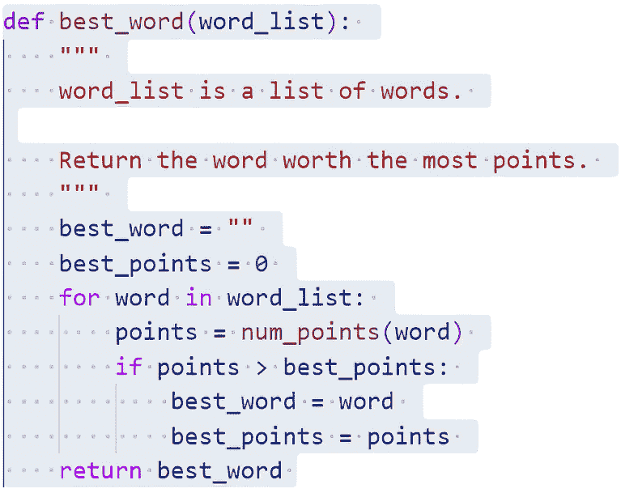
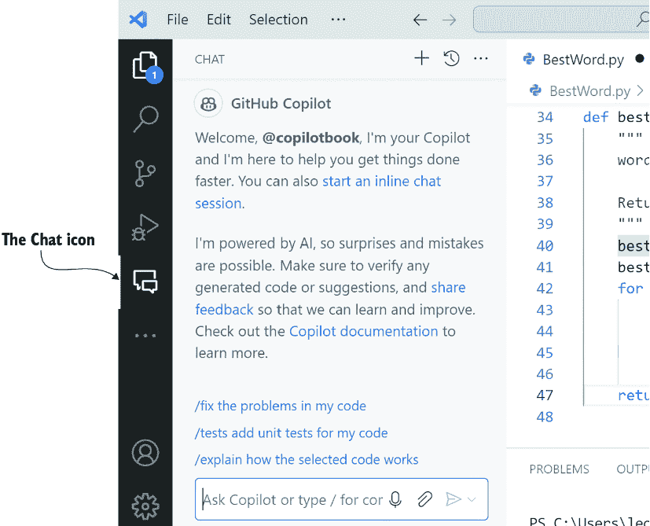
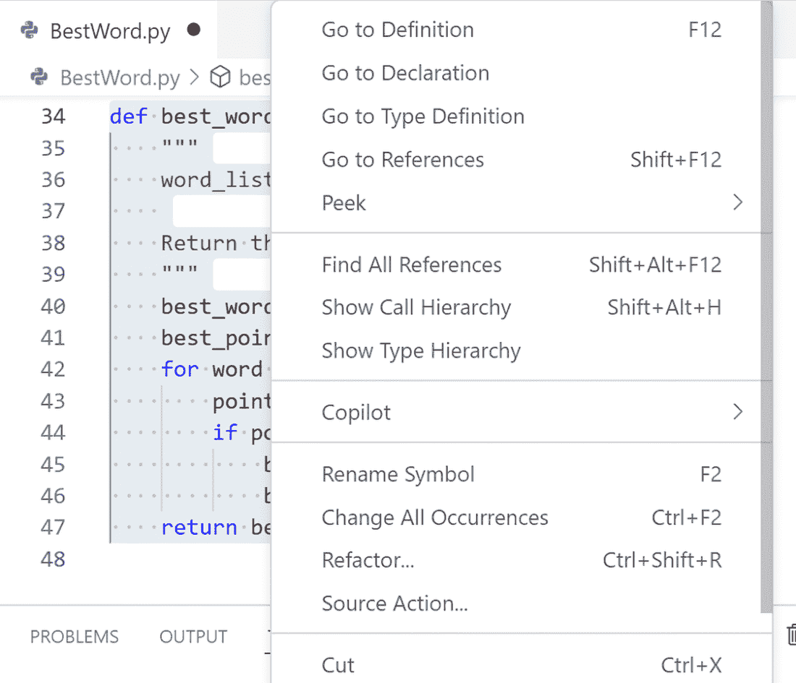
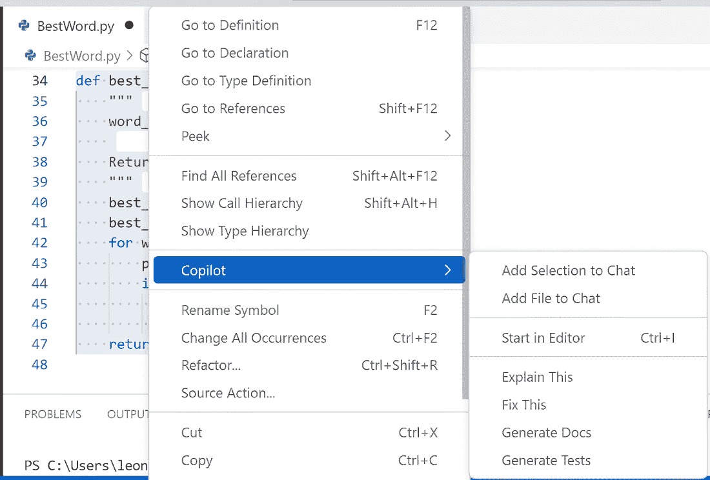
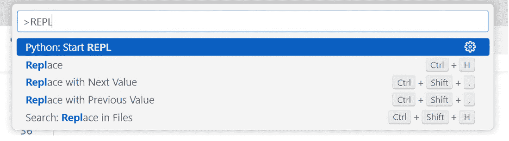
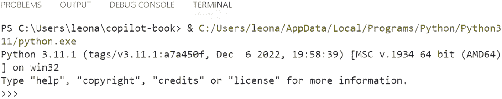
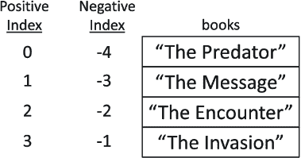

# 第四章：4 阅读 Python 代码：第一部分

### 本章内容包括

+   为什么知道如何阅读代码很重要

+   如何让 Copilot 解释代码

+   使用函数分解大问题

+   使用变量保存值

+   使用 if 语句进行决策

+   使用字符串存储和操作文本

+   使用列表收集和操作多个值

在第三章中，我们让 Copilot 为我们写了几个函数。它们的作用是什么？也许我们的 `money_made` 函数可以成为股票交易系统的一部分，`is_strong_password` 函数可以用在社交网络网站上，或者 `best_word` 函数可以用在某个拼字游戏 AI 中。总的来说，我们编写了一些有用的函数，它们可以成为更大程序的一部分。而且，我们几乎没有自己写很多代码，甚至没有理解这些代码到底在做什么。

然而，我们认为你需要从高层次理解代码的作用。因为这需要一些时间来学习，我们将这一讨论分成了两章。在这一章中，我们将解释为什么阅读代码很重要，并向你介绍 Copilot 的一个功能，帮助你理解代码。之后，我们将深入介绍你需要识别的 10 个编程特性，这些特性帮助你阅读 Copilot 生成的大部分基础代码。我们将在本章讲解前五个，剩下的五个将在下一章介绍。别担心：实际上你已经非正式地接触过这 10 个特性——我们只是要加深你对每个特性的理解。

## 4.1 为什么我们需要阅读代码

当我们谈论阅读代码时，我们指的是通过查看代码来理解它的作用。理解有两个层次，这两个层次都很重要。

第一个层次是能够逐行理解一个程序的功能。这通常需要跟踪代码执行时变量的值，以确定代码在每一步到底做了什么。这很有用，但并不是全部内容。它就像一步一步地跟着食谱做菜，却不知道食谱要做什么，或者这些食材是如何配合的。最后，你可能做出了一个蛋糕，但你可能不理解为什么蛋糕做得那么好，或者你怎么能自己编出这样一个食谱。你需要了解整个食谱为何有效。

那么，第二个层次就是：确定程序的整体目的。也就是说，你需要能够从每一行代码中抽身出来，从高层次理解程序在做什么。

在这两章结束时，我们希望你能够从这两个层面开始理解 Copilot 生成的代码。我们将从逐行理解代码开始，但在本章结束时和本书剩余部分，你将开始能够查看一小段代码并判断它的整体目的。

我们可以通过参考我们第三章的`best_word`函数来说明阅读代码的两个级别之间的区别，在以下列表中重新列出。

##### 列表 4.1 Scrabble 的`best_word`函数

```py
def best_word(word_list):
 """
 word_list is a list of words.

 Return the word worth the most points.
 """
    best_word = ""
    best_points = 0
    for word in word_list:
        points = num_points(word)
        if points > best_points:
            best_word = word
            best_points = points
    return best_word
```

该程序的*追踪描述*是对每行代码做的描述。例如，我们会说我们正在定义一个名为`best_word`的函数，该函数接受一个名为`word_list`的参数。我们有一个称为`best_word`的变量，它最初是一个没有字符的字符串，也就是空字符串。（不幸的是，函数和此变量都称为`best_word`，因为这使得引用其中一个或另一个变得更加棘手，但这是 Copilot 给我们的。）我们还有另一个名为`best_points`的变量，我们从`0`开始。然后，我们在`word_list`中的每个单词上都有一个`for`循环。在`for`循环内部，我们调用我们的`num_points`辅助函数，并将其返回值存储在 points 变量中，等等。（我们将在本章和下一章解释我们如何知道每行代码的作用。）

相比之下，*总体目的的描述*将类似于我们的文档字符串描述：“从单词列表中返回具有最高 Scrabble 点值的单词。”而不是参考每一行，此描述在高层次上解释了代码的目的，说明它作为一个整体的功能。

通过追踪和测试的结合实践，您将达到一个总体目标水平的理解，并希望您能在本书结束时以完整的荣耀达到那里。在追踪级别上的工作通常先于在总体目标级别上的工作能力[1]，因此在本章和下一章中，我们将重点关注追踪级别，通过理解每行代码的作用。我们希望您能够阅读代码的三个原因：

1.  *帮助确定代码是否正确* —— 在第三章中，我们练习了如何测试 Copilot 给出的代码。测试是确定代码是否正确的强大技能，我们将在整本书中继续使用它。但是许多程序员，包括我们两个，只有在代码看起来可能正确时才会测试。如果我们能通过检查确定代码是错误的，那么我们将不会浪费时间测试它：我们会尝试先修复代码。同样，我们希望您能够识别代码是否简单错误，而无需花时间进行测试。通过快速追踪或磨练您的总体目标技能来识别更多错误代码，您将节省更多测试损坏代码的时间。

1.  *为测试提供信息* — 逐行理解代码的作用本身就很有用，但它还能帮助你加速有效的测试能力。例如，在下一章中，你将学习到循环——它们可以让你的代码重复零次、一次、两次，或者根据需要重复任意次数。你可以将这些知识与已有的测试知识相结合，帮助你识别出需要测试的关键案例类别。

1.  *帮助你编写代码* — 我们知道，你希望 Copilot 为你编写所有代码！我们也希望如此。但不可避免地，总会有些代码是 Copilot 无法正确生成的，不管你做多少提示工程。或者，也许通过足够的提示工程，最终能让 Copilot 编写出正确的代码，但我们自己做可能更简单、更快捷。在编写本书时，我们俩尽量让 Copilot 编写尽可能多的代码。但由于我们对 Python 编程的了解，我们常常能够看到错误并直接修复，而不需要通过任何复杂的步骤让 Copilot 来修复。长期来看，我们希望你能有能力独立学习更多编程，而了解 Python 是我们为你从本书到其他资源搭建的一座桥梁。有研究表明，能够追踪并解释代码是能够编写代码的前提[1]。

在我们开始之前，我们需要明确我们追求的深度水平。我们不会教你每一行代码的每一个细节。这样做会让我们回到像 Copilot 这样的工具出现之前传统的编程教学方式。相反，通过 Copilot 工具和我们自己的解释的结合，我们将帮助你理解每一行代码的要点或整体目标。如果你以后打算编写大量程序，你需要的不止这些。我们力图找到“这段代码是魔法”与“我完全理解每行代码是如何工作的”之间的最佳平衡点。

## 4.2 请求 Copilot 解释代码

到目前为止，我们一直在使用 Copilot 为我们生成代码。这是它最著名的功能，但并不是唯一的功能。现在我们将向你展示它的另一个最棒的功能：解释 Python 代码的作用！

Copilot 扩展不断变化。我们在这里给出的具体步骤可能会有所不同，如果发生这种情况，我们鼓励你查阅更一般的 GitHub Copilot 文档。

要尝试 Explain 功能，你需要高亮显示一些代码，让 Copilot 为你描述它。我们用我们的 `best_word` 函数（清单 4.1）来试试。如果你还没有输入这段代码，请现在输入。



##### 图 4.1 编辑器中高亮显示的 `best_word` 函数代码

按照图 4.1 中那样高亮代码。之后，我们有几个选项。第一个选项是点击活动栏中的聊天图标（位于 VS Code 的左侧），或者按 Ctrl-Alt-I。这样将打开 Copilot Chat 界面，如图 4.2 所示。（还有其他聊天界面，包括你可以通过 Ctrl-Shift-I 打开的快速聊天——你可以使用任何一种聊天界面。）Copilot Chat 不仅能用自然语言回答你的问题，还能用代码块、可点击的按钮/链接来执行命令等。它还会建议你可能想要问的问题，当然，你也可以输入任何与代码相关的问题。



##### 图 4.2 VS Code 中的 Copilot Chat 界面

目前，我们将使用 Copilot Chat 来解释代码。在文本框中输入以下命令：

```py
/explain
```

如果 Copilot 询问，你需要选择 @workspace 选项。如果这个不适用，你也可以尝试以下命令：

```py
/explain how the selected code works
```

输入斜杠（/）是告诉 Copilot Chat 你正在指定一个命令（Copilot 文档称这些为斜杠命令），而不是使用自然语言。在这种情况下，我们要求 Copilot 对选中的文本执行`/explain`命令。

或者，你可以通过像图 4.1 中那样高亮函数中的代码，要求 Copilot 解释代码。然后，右键点击函数中的代码，你会看到图 4.3 中出现的菜单。



##### 图 4.3 右键点击选中的 `best_word` 函数时出现的菜单

在这个菜单中，点击 Copilot，你将看到图 4.4 中显示的选项列表。这些选项是与 Copilot 一起使用的更常见功能。



##### 图 4.4 你可以与 Copilot 一起使用的选项列表

最后的步骤是选择“解释此项”选项。Copilot Chat 窗口将打开（如图 4.2 中所示），并且你会得到代码的解释。像往常一样，Copilot 是非确定性的，因此你的结果可能与我们的不同。事实上，如果解释让你感到困惑，你可以尝试再次使用`/explain`命令，或者写下你自己的提示来获得不同的解释。作为教育工作者，这是梦想成真的开始，学习者可以根据需要请求尽可能多的解释，以便完全理解代码的工作原理。

##### Copilot 的解释可能是错误的

与 Copilot 生成的代码一样，Copilot 的解释也可能是错误的。你可能会想，“等等，如果一个工具能理解代码却也会出错，那它的价值在哪里？！”首先，我们同意，这确实可能让人感到沮丧。然而，根据我们的经验，Copilot 的解释足够准确，通常可以非常有帮助，尤其是在理解代码基础知识方面，例如我们在这两章中教授的内容。此外，当学习者对自己的代码感到困惑时，他们历史上通常会向朋友或网站询问代码，这同样可能导致错误。为了减少错误的可能性，一个有效的做法是多次询问 Copilot 解释，因为你不太可能在多次尝试中得到完全错误的答案。

这是我们第一次询问时，Copilot 给出的解释：

提供的 Python 代码定义了一个名为`best_word`的函数，该函数接受一个单词列表（`word_list`）作为参数。该函数的目的是从列表中确定并返回得分最高的单词。

函数首先初始化两个变量：`best_word`和`best_points`。`best_word`是一个空字符串，最终将保存得分值最高的单词，而`best_points`初始化为 0，将保存找到的最高得分值。

然后，函数进入一个循环，遍历`word_list`中的每个单词。对于每个单词，它通过调用`num_points`函数（在提供的代码中未显示）来计算该单词的得分值。`num_points`函数预计接受一个单词作为参数并返回其得分值。

如果当前单词的得分值大于当前的`best_points`，函数会将`best_word`更新为当前单词，并将`best_points`更新为当前单词的得分值。这样，函数始终跟踪得分值最高的单词。

在循环遍历完列表中的所有单词后，函数返回`best_word`，此时它应该是列表中得分值最高的单词。如果列表为空或所有单词的得分值为 0，函数将返回一个空字符串。

对我们来说，这是一个非常好的代码描述。它首先给出代码的整体解释，然后再逐行解释。然而，请注意，为了完全理解它，你需要了解重要的 Python 术语和特性。Copilot 的解释涉及到函数、参数、变量、字符串、循环、做决策（“如果得分值”）和返回等内容。如果你理解这些术语，那么这个解释会非常有用，但如果你不理解，那么帮助就会大打折扣。通过本章和下一章的学习，你将掌握解读 Copilot 典型解释所需的主要 Python 术语和特性。

##### 请求解释

通过 `/explain` 命令获得的解释类型可能无法满足你的需求。例如，假设你希望 Copilot 明确地逐行给出代码并解释每行的作用，以便你能更容易地将代码与其具体解释联系起来。你可以实现这一点！尝试以下提示：“再解释一次这段代码，但按行解释。给出每行代码及其功能解释。” 这样，我们得到了每行代码的详细分解，后面跟着它的解释。如果内置命令没有提供你想要的详细信息，我们鼓励你自行编写提示。

## 4.3 你需要了解的 10 大编程特性：第一部分

我们将为你带来一个关于你编程旅程中需要的 10 个 Python 特性的小小旋风之旅，从本章开始的前五个特性。Python 是一种交互式语言，这使得我们比其他语言更容易进行实验并观察效果。我们将在这里利用这一点，探索编程特性。这就是我们俩学 Python 的方式，也是成千上万程序员学习的方式。不要犹豫，尽管实验！首先，按下 Ctrl–Shift–P 并输入 `REPL`，然后选择 Python: Start REPL。这样应该会出现图 4.5 所示的情况。（REPL 代表读取-执行-打印-循环。之所以这么叫，是因为 Python 会读取你输入的内容，执行/运行它，再将结果打印回来，并不断循环这一过程。）



##### 图 4.5 从 VS Code 启动 REPL

这将让你回到与第三章相同的 Python 提示符（如图 4.6 所示），只是没有加载任何函数。



##### 图 4.6 在 VS Code 中运行的 REPL

然后，我们可以开始编写 Python 代码。例如，输入

```py
>>> 5 * 4
```

然后按 Enter。你会看到响应 `20`。我们在这里不花时间做简单的数学运算，但你与 Python 的交互方式完全一样：你输入一些代码，Python 给你反馈。现在，让我们跳入我们提到的 10 个 Python 特性中的前五个。

### 4.3.1 #1\. 函数

你在第三章已经学过了函数，所以我们只需总结一下我们学到的内容。你使用函数将一个大问题分解为更小的部分。回顾一下，我们在第三章编写的 `best_word` 函数是一个相当大的任务：它需要找出在单词列表中得分最高的单词。一个单词值多少分？啊哈——这是我们可以从这个函数中分离出来的一个子任务，我们在之前的 `num_points` 函数中做到了这一点。

我们设计一个函数来接受参数，每个参数代表函数需要完成工作所需的数据的一部分或一个集合。大多数函数在完成工作后，使用`return`将结果返回给调用它们的代码行。当我们调用函数时，我们传递值，称为参数，每个参数对应一个值，我们通常使用变量来存储返回值。

对于我们编写的每个程序，我们可能需要设计几个函数，但也有一些内置的 Python 函数可以免费使用。我们可以像调用自己的函数一样调用它们。例如，有一个内置的 `max` 函数，它接受一个或多个参数，并返回最大的那个：

```py
>>> max(5, 2, 8, 1)
8
```

还有`input`函数，我们在第三章的`get_strong_password`函数中使用了它。它接受一个参数，该参数作为提示显示给用户，然后返回用户在键盘上输入的内容：

```py
>>> name = input("What is your name? ")
What is your name? Dan
>>> name
'Dan'
```

如果`input`是接收键盘输入的函数，那么是否有一个`output`函数来将消息输出到屏幕上呢？当然有，不过它叫做`print`，而不是`output`：

```py
>>> print('Hello', name)
Hello Dan
```

### 4.3.2 #2\. 变量

变量是指向某个值的名称。在第三章中，我们使用变量来跟踪函数的`return`值。我们这里也用一个变量来保存用户的姓名。每当我们需要记住某个值以供以后使用时，就会使用变量。

要给变量赋值，我们使用 =（等号）符号，这叫做*赋值*符号。它会计算等号右边的值，并将结果赋给左边的变量：

```py
>>> age = 20 + 4      #1
>>> age
24
```

#1 等号右边的表达式被计算，即 20 + 4 被计算为 24。然后，变量 `age` 被赋值为 24。

##### 在 Python 中，= 符号与数学中的不同

在 Python 以及其他编程语言中，= 符号表示*赋值*。= 符号左边的变量将得到右边计算结果的值。这*不是*一个永久关系，因为变量的值可以被改变。对数学强的人来说，刚接触编程时可能会觉得困惑，但只需要记住，Python 中的 = 符号表示赋值，而不是相等。

我们可以在更大的上下文中使用变量，称为*表达式*。变量所指代的值会替代它的名称：

```py
>>> age + 3      #1
27
>>> age      #2
24
```

#1 `age` 仍然可用，并且其值为 24。24 + 3 被计算为 27。

#2 `age + 3` 的表达式不会改变 `age`，因为我们没有重新赋值给 `age`。

##### 变量在 Python 提示符中保持存在

我们在前一段代码中给`age`赋了值。为什么我们可以一直引用它呢？任何在 Python 提示符下编程时声明的变量都会保留，直到退出为止。这也是程序中变量的工作方式。只要你给变量赋值，它就可以使用。

但是注意，当我们说 `age` `+` `3` 时，变量 `age` 并没有变化！要改变它，我们需要另一个 `=` 赋值语句：

```py
>>> age = age + 5     #1
>>> age
29
```

#1 我们通过执行赋值操作（`=` 符号）改变了 age。

让我们看看更多改变变量引用方式的方法。我们将包含一些注释作为代码的说明：

```py
>>> age += 5      #1
>>> age
34
>>> age *= 2      #2
>>> age
68
```

#1 一种快捷的加法方式。age += 5 相当于 age = age + 5。

#2 一种快捷的乘以 2 的方式。age *= 2 相当于 age = age * 2\。

### 4.3.3 #3\. 条件语句

每当我们的程序需要做出决策时，我们就需要一个条件语句。例如，在第二章中，我们需要决定要在数据中包含哪些球员（我们只想要四分卫）。为此，我们使用了 `if` 语句。

还记得我们在第三章中的较大值函数吗？我们已经在下面的列表中重新编写了它。

##### 列表 4.2 用于确定两个值中较大值的函数

```py
def larger(num1, num2):
    if num1 > num2:     #1
        return num1           #2
    else:                    #3
        return num2     #4
```

#1 如果 num1 大于 num2，num1 &gt; num2 表达式将为 True；如果 num1 小于或等于 num2，则为 False。

#2 当 num1 大于 num2 时，这行代码会被执行。

#3 else 关键字必须与 if 关键字配对使用。当 if 不执行时（num1 &gt; num2 为 False），else 会执行。

#4 当 num1 不大于 num2 时，这行代码会被执行。

列表 4.2 中的 `if-else` 结构被称为 *条件语句*，它允许我们的程序做出决策。在这里，如果 `num1` 大于 `num2`，则返回 `num1`；否则，返回 `num2`。这就是它如何返回较大的那个！

在 `if` 后面，我们放置一个布尔条件（`num1` `>` `num2`）。布尔条件是一个表达式，它测试一个条件，结果要么为 `True`，要么为 `False`。如果为 `True`，则运行 `if` 下的代码；如果为 `False`，则运行 `else` 下的代码。我们通过使用比较符号来创建布尔表达式，例如 `>=` 表示大于或等于，`<` 表示小于，`>` 表示大于，`==` 表示等于，`!=` 表示不等于。注意，我们不仅对函数的代码进行缩进，而且对 `if` 和 `else` 部分的代码也进行缩进。缩进对于代码正常运行是必要的，因此值得注意（我们将在下一章进一步讨论缩进）。这就是 Python 知道哪些代码行属于函数，哪些代码行属于 `if` 或 `else` 的原因。

我们也可以在 Python 提示符下玩条件语句——我们不需要在函数内部编写代码。这是一个例子：

```py
>>> age = 40      #1
>>> if age < 40:        #2
...     print("Binging Friends")
... else:                         #3
...     print("What's binging?")
...
What's binging?
```

#1 我们将 40 赋值给 age。

#2 因为 age 为 40，这段代码在问是否 40 < 40\. 不是，所以跳过了 if 部分的代码。

#3 else 部分运行，因为 if 条件为 False。

你会注意到，当你在`if`语句内部输入时，提示符从`>>>`变成了`...`。提示符的变化让你知道你正在输入需要完成的代码。完成`else`代码后，按一次回车即可退出`...`提示符，回到`>>>`提示符。

我们将年龄变量设置为 40。因为`40` `<` `40`是`False`，所以`else`部分执行。让我们再试一次，这次让`if`部分执行：

```py
>>> age = 25             #1
>>> if age < 40:           #2
...     print("Binging Friends")
... else:                         #3
...     print("What's binging?")
...
Binging Friends
```

#1 我们将 25 赋给年龄。

#2 因为年龄是 25，所以这是在判断 25 < 40。是的，所以代码中的`if`部分会执行。

#3 `else`部分不执行（我们已经运行了`if`部分的代码）。

你可能会看到一些没有`else`部分的`if`语句，这也是可以的：`else`部分是可选的。在这种情况下，如果条件为`False`，那么`if`语句将不会做任何事情：

```py
>>> age = 25           #1
>>> if age == 30:            #2
...     print("You are exactly 30!")
...
```

#1 我们将 25 赋给年龄。

#2 == 用于测试两个值是否相等。

请注意，测试两个值是否相等的方式是使用两个等号（`==`），而不是一个等号。（我们已经知道一个等号用于赋值语句，将值赋给变量。）

如果有超过两个可能的结果该怎么办？例如，假设一个人的年龄决定了他们可能会狂看哪部电视剧，如表 4.1 所示。

##### 表 4.1 不同年龄段可能喜欢的电视节目

| 年龄 | 显示 |
| --- | --- |
| 30–39  | *Friends*  |
| 20–29  | *The Office*  |
| 10–19  | *Pretty Little Liars*  |
| 0–9  | *Chi's Sweet Home*  |

我们不能仅通过`if-else`捕捉所有这些结果，因此`elif`（即`else-if`的缩写）使我们能够捕捉更多可能的结果，如下代码所示。我们在此展示的代码不包含 Python 提示符（`>>>`和`...`），因为那样打字会太多：

```py
if age >= 30 and age <= 39:       #1
    print("Binging Friends")
elif age >= 20 and age <= 29:      #2
    print("Binging The Office")
elif age >= 10 and age <= 19:
    print("Binging Pretty Little Liars")
elif age >= 0 and age <= 9:
    print("Binging Chi's Sweet Home")
else: 
    print("What's binging?")     #3
```

#1 如果年龄大于或等于 30 且小于或等于 39 为真，则此条件为真；例如，如果年龄是 35。

#2 如果上述条件为假，则检查此条件。

#3 如果上述所有条件都为假，则执行此代码。

我们使用`and`来捕捉复杂的条件。例如，在第一行，我们希望年龄大于或等于 30 且小于或等于 39。Python 是从上到下执行的，当它找到一个条件为真时，它会运行对应的缩进代码。然后，它停止检查剩余的`elif`或`else`——所以如果两个条件恰好为真，只有第一个条件对应的代码会运行。

尝试用不同的`age`变量值进行实验，观察每种情况下正确的代码是否运行。实际上，如果我们真的要测试这段代码，我们可以使用`if`语句结构来大致确定我们要测试的值。关键在于测试值的边界。例如，我们肯定想要测试 30 和 39 岁，以确保我们正确捕捉到 30 到 39 岁的范围。同样，我们也应该测试 20、29、10、19、0、9，然后再测试一个大于 39 的值，以测试位于最底部的`else`语句。

如果你使用额外的`if`而不是`elif`，那么它们就变成了独立的`if`语句，而不是一个单独的`if`语句。这很重要，因为 Python 始终会单独检查每个独立的`if`语句，而不管之前的`if`语句发生了什么。

例如，让我们把代码中的`elif`改成`if`。这将给我们以下结果：

```py
if age >= 30 and age <= 39: 
    print("Binging Friends") 
if age >= 20 and age <= 29:                #1
    print("Binging The Office")   
if age >= 10 and age <= 19:               
    print("Binging Pretty Little Liars") 
if age >= 0 and age <= 9:                 
    print("Binging Chi's Sweet Home") 
else:                          #2
    print("What's binging?")
```

#1 这个条件总是会被检查。

#2 这个`else`与最近的`if`语句相关联。

假设你在这段代码上方写入`age` `=` `25`并运行它。你认为会发生什么？嗯，第二个`if`条件`age` `>=` `20` `and` `age` `<=` `29`是`True`，所以我们肯定会输出`Binging` `The` `Office`。但这并不是所有的结果！记住，因为我们在这里使用的是`if`，接下来的每一个条件都会被检查。（如果它们是`elif`，我们就完成了。）`age` `>=` `10` `and` `age` `<=` `19`是`False`，所以我们不会输出`Binging` `Pretty` `Little` `Liars`。

最后的`if`条件`age` `>=` `0` `and` `age` `<=` `9`也是`False`，所以我们不会输出`Binging` `Chi's` `Sweet` `Home`。但是这个`if`有一个`else`！所以，我们*会*输出`What's` `binging?` 我们并没有预期这样！我们只想在年龄至少为 40 的人群中输出`What's` `binging?`。这就是要说明，`if`和`elif`的行为是不同的，我们需要使用符合我们想要行为的那个（如果我们想让多个代码块可能运行，使用`if`；如果我们只想让一个代码块运行，使用`elif`）。

### 4.3.4 #4\. 字符串

正如我们在第三章中学到的，字符串是我们在想要存储文本时使用的类型。文本无处不在——像第二章中的统计数据、密码、书籍——因此字符串几乎出现在每个 Python 程序中。

我们使用引号来标识字符串的开始和结束。你会看到 Copilot 使用双引号或单引号。无论你使用哪种引号都没关系；只要确保字符串的开始和结束使用相同类型的引号。

字符串具有一组强大的方法。*方法*是与特定类型相关联的函数——在这个例子中是字符串。调用方法的方式与调用函数的方式有所不同。当你调用函数时，你将参数值放在括号内。对于方法，我们仍然将值放在括号内，但需要先放置调用该方法的值，在括号外面，并且后面加一个点。接下来我们将看到一个示例！

在第三章，Copilot 使用了一些字符串方法来实现`is_strong_password`。让我们在这里尝试使用这些方法，以更好地理解它们是如何工作的：

```py
>>> 'abc'.isupper()     #1
False                  
>>> 'Abc'.isupper()    
False                  
>>> 'ABC'.isupper()    
True                   
>>> 'abc'.isdigit()       #2
False                     #2
>>> '345bc'.isdigit()     #2
False                      #2
>>> '345'.isdigit()       #2
True                      #2

>>> 'abc6'.isalnum()        #3
True                         #3
>>> 'abc def'.isalnum()     #3
False                        #3
>>> 'abcdef#'.isalnum()     #3
False                       #3
```

#1 isupper 需要所有字符都是大写字母，才能返回 True。

#2 isdigit 需要所有字符都是数字，才能返回 True。

#3 isalnum 需要所有字符都是字母数字才能返回 True（空格不被视为字母数字）。

还有许多其他字符串方法。某些方法帮助你将字符串转换为小写或大写，其他方法帮助你搜索字符串，还有一些方法帮助你格式化字符串（例如，居中或右对齐）。

如果你不确定某个字符串方法的作用，Copilot 的解释功能通常会很有帮助。例如，这个函数做了什么：

```py
def clean_number(phone_number):
    phone_number = phone_number.replace('(', '')    #1
    phone_number = phone_number.replace(')', '')     #2
    phone_number = phone_number.replace('-', '')    #3
    return phone_number
```

#1 删除电话号码中的所有(字符

#2 删除电话号码中的所有)字符

#3 删除电话号码中的所有–字符

记住，我们可以让 Copilot 解释代码，就像我们在第 4.2 节演示的那样。以下是我们请求 Copilot 解释这段代码时得到的结果：

提供的 Python 代码定义了一个名为`clean_number`的函数。这个函数设计用于接受一个单一参数`phone_number`，它应该是一个表示电话号码的字符串。该函数的目的是从电话号码字符串中删除某些字符，特别是括号“(”和“)”，以及连字符“-”。

这个函数使用了`replace()`方法，这是 Python 内置的字符串方法。`replace()`方法将指定的子串替换为另一个指定的子串。它接受两个参数：第一个是需要被替换的子串，第二个是用来替换第一个子串的子串。

在这个函数中，`replace()`方法在`phone_number`上调用了三次。每次调用`replace()`都用于删除一种字符：首先是左括号“(”，然后是右括号“)”以及最后的连字符“-”。它通过将这些字符替换为空字符串""，有效地移除了它们。

完成所有替换后，函数返回清理后的`phone_number`。这将是一个字符串，包含电话号码的数字，没有任何括号或连字符。

这个函数在需要以一致且无字符的格式处理或存储电话号码的情况下可能会非常有用。例如，你可能希望在将电话号码存储到数据库时去除这些字符，或者在比较电话号码是否相等时进行去除。

这确认了这个函数的作用：移除电话号码字符串中的括号和连字符。并且它使用 `replace` 方法来实现这一点。

等一下——`replace`听起来像是我们在将某些字符替换为其他字符，而不是移除它们。那么，`replace`是如何帮助我们移除字符的呢？解释中说，“它通过将这些字符替换为空字符串 ""，从而有效地移除它们。”这是`replace`如何做到这一点的线索，但我们可能还想了解更多。因此，我们接着使用了提示“`replace`方法是如何利用空字符串来移除字符的？”并从 Copilot 得到了以下解释：

Python 中的`replace()`方法将调用的字符串中所有指定子字符串的出现替换为另一个指定子字符串。

在这种情况下，指定的子字符串是字符“(”、“)”和“-”。该方法调用在 `phone_number` 字符串上，并且 `replace()` 的第二个参数是一个空字符串""。

所以，发生的事情是，`phone_number` 中每个指定字符的出现都被替换为空字符串。这有效地从字符串中移除了该字符，因为用空字符串替换相当于将其删除。

这在 `clean_number` 函数中执行了三次，每次移除一个需要去掉的字符。所有三个字符移除后，清理过的 `phone_number` 被返回。

如果你想了解更多，你可以继续向 Copilot 提问或在 Python 提示符下进行测试。例如，你可以验证 `replace` 是否会移除所有的 `(`、`)` 和 `-` 字符，即使每种字符有多个。你还可以探索使用 `replace` 来实际替换字符（它的典型用法），而不是移除它们。这种探索也很有帮助，如果我们需要从 Copilot 可能提供的不正确信息中分辨出真相。这就是为什么我们需要自己掌握 Python 知识的基础！

你还经常会看到看似数学运算符的符号应用于字符串。它们和数学符号相同，但对字符串做的操作不同。`+` 运算符用于将两个字符串连接在一起，而 `*` 运算符用于将字符串重复特定次数。示例如下：

```py
>>> first = 'This is a '
>>> second = 'sentence.'
>>> sentence = first + second      #1
>>> print(sentence)
This is a sentence.
>>> print('-=' * 5)     #2
-=-=-=-=-=
```

#1 将第一个和第二个字符串合并，并将结果赋给句子

#2 将“-=”字符串重复五次

### 4.3.5 #5\. 列表

*当我们需要存储一系列字符时，例如密码或一个 Scrabble 单词，字符串是很好的选择。但有时我们需要存储许多单词或许多数字。为此，我们需要一个列表。在第三章中，我们为 `best_word` 函数使用了列表，因为该函数需要处理单个单词的列表。*

*而我们用引号来开始和结束一个字符串，我们用方括号来开始和结束一个列表。而且，和字符串一样，列表也有许多可用的方法。为了让你了解列表方法的种类及其功能，让我们来探索其中一些：*

```py
>>> books = ['The Invasion', 'The Encounter', 'The Message']     #1
>>> books
['The Invasion', 'The Encounter', 'The Message']
>>> books.append('The Predator')                                 #2
>>> books
['The Invasion', 'The Encounter', 'The Message', 'The Predator']
>>> books.reverse()                                               #3
>>> books
['The Predator', 'The Message', 'The Encounter', 'The Invasion']
```

#1 一个包含三个字符串值的列表

#2 在列表末尾添加一个新的字符串值

#3 反转列表（现在值的顺序是相反的）

许多 Python 类型，包括字符串和列表，允许你使用 *索引* 来处理特定的值。当你只想处理字符串或列表的一部分而不是整个内容时，你需要使用索引。索引就是一个数字，用来标识一个元素。索引从 0 开始，第一个元素的索引是 0（而不是 1！），第二个是 1，第三个是 2，以此类推。列表中的最后一个值的索引是列表长度减去 1。列表的长度可以通过使用 `len` 函数来确定。例如，如果我们做 `len(books)`，我们会得到一个值 `4`（所以有效的索引范围是从 0 到 3）。人们也经常使用负索引，这为索引每个值提供了另一种方式：最右边的值索引为 -1，左边的值索引为 -2，以此类推。图 4.7 展示了这个例子，既包括正索引也包括负索引。



##### 图 4.7 列表元素可以通过正索引或负索引进行访问。

让我们练习一下当前 books 列表上的索引操作：

```py
>>> books
['The Predator', 'The Message', 'The Encounter', 'The Invasion']
>>> books[0]        #1
'The Predator'
>>> books[1]
'The Message'
>>> books[2]
'The Encounter'
>>> books[3]
'The Invasion'
>>> books[4]                        #2
Traceback (most recent call last):
  File "<stdin>", line 1, in <module>
IndexError: list index out of range
>>> books[-1]                   #3
'The Invasion'
>>> books[-2]
'The Encounter'
```

#1 books[0] 对应第一个元素。

#2 错误，因为索引 3 是最后一本书！

#3 books[-1] 指的是列表中的最后一个元素。

还有一种方法可以从字符串或列表中提取多个值，而不仅仅是一个。这种方法叫做 *切片*。我们指定第一个值的索引，一个冒号，以及右边的索引，像这样：

```py
>>> books[1:3]             #1
['The Message', 'The Encounter']
```

#1 从索引 1 开始，到索引 2 结束（而不是 3！）

我们指定了 1:3，所以你可能会期待获得包括索引 3 的值。但第二个索引（冒号后面的那个）对应的值并不包括在内。这是违反直觉的，但它确实是正确的！

如果我们省略起始索引或结束索引，Python 会根据需要使用起始或结束：

```py
>>> books[:3]                                      #1
['The Predator', 'The Message', 'The Encounter']
>>> books[1:]                                      #2
['The Message', 'The Encounter', 'The Invasion']
```

#1 与使用 books[0:3] 相同

#2 与使用 books[1:4] 相同

我们也可以使用索引来更改列表中的特定值，例如：

```py
>>> books
['The Predator', 'The Message', 'The Encounter', 'The Invasion']
>>> books[0] = 'The Android'      #1
>>> books[0]
'The Android'
>>> books[1] = books[1].upper()      #2
>>> books[1]
'THE MESSAGE'
>>> books
['The Android', 'THE MESSAGE', 'The Encounter', 'The Invasion']
```

#1 将 books[0] 修改为引用字符串值“The Android”

#2 将 books[1] 修改为全部大写

然而，如果我们对字符串这样做，就会出错：

```py
>>> title = 'The Invasion'
>>> title[0]              #1
'T'
>>> title[1]
'h'
>>> title[-1]
'n'
>>> title[0] = 't'                   #2
Traceback (most recent call last):
  File "<stdin>", line 1, in <module>
TypeError: 'str' object does not support item assignment
```

#1 查找字符是可以正常工作的。

#2 但赋值操作不行！

字符串被认为是*不可变*的值，这意味着您不能改变它的字符。您只能创建一个全新的字符串。相比之下，列表被认为是*可变*的值，这意味着您可以改变它。如果您遇到类型不支持项赋值的错误，您可能是在尝试更改一个不能更改的值。

在本章中，我们向您介绍了 Python 中五个最常见的代码特性。在下一章，我们将继续介绍另外五个特性。我们还向您展示了如何使用 Copilot 解释工具来帮助您理解代码的作用，并提供了验证这些解释真实性的指导。表 4.2 总结了本章中涉及的特性。

##### 表 4.2 本章 Python 代码特性总结

| **代码元素** | 示例 | 简要说明 |
| --- | --- | --- |
| 函数  | `def larger(num1, num2)`  | 一种可以帮助我们管理代码复杂性的代码特性。函数接收输入，处理这些输入，并可能返回输出。  |
| 变量  | `age = 25`  | 一个可读的名称，指向存储的值。它可以通过 `=` 赋值语句进行赋值。  |
| 条件语句  | `if age < 18: print("Can't vote") else: print("Can vote")`  | 条件语句让代码能够做出决策。在 Python 中，我们有三个与条件语句相关的关键字：`if`、`elif` 和 `else`。  |
| 字符串  | `name = 'Dan'`  | 字符串存储一系列字符（文本）。有许多强大的方法可用于修改字符串。  |
| 列表  | `list = ['Leo', 'Dan']`  | 一个包含任何类型值的序列。修改列表有许多强大的方法。  |

## 4.4 练习

1.  回忆一下我们在清单 4.2（4.3.3 节）中看到的条件语句代码。这个程序的行为与原始代码有何不同？

```py
def larger(num1, num2):
    if num1 < num2:
        return num1
    else:
        return num2
```

1.  2\. 在以下代码中，如果 `age` 是 32，会打印什么？如果将每个 `if` 改成 `elif`（除了第一个），打印的内容会是什么？

```py
if age >= 30 and age <= 39:
    print("Binging Friends")
if age >= 25 and age <= 34:      
    print("Binging The Office")
if age >= 15 and age <= 24:
    print("Binging Pretty Little Liars")
if age >= 0 and age <= 14:
    print("Binging Chi's Sweet Home")
else:
    print("What's binging?")
```

1.  3\. 您会使用哪种 Python 数据类型来保存一个传感器的温度读数，该传感器每分钟记录一次数据？这种数据类型将存储什么？

1.  4\. 将以下 Python 代码块排列起来，创建一个计算提供的列表中所有偶数之和的程序。

```py
for number in numbers:
total += number
if number % 2 == 0: 
numbers = [1, 2, 3, 4, 5, 6, 7, 8, 9, 10] 
total = 0 
print(f"The sum of all even numbers is: {total}")
```

1.  5\. （回顾 4.3.1 节。）考虑以下 Python 函数调用 `min(input("Enter` `a` `number:` `"),` `input("Enter` `another` `number:` `"))`。在运行此代码之前，思考这行代码应该做什么，然后回答以下问题：

    1.  当运行这段代码时，您预期会发生什么？描述执行过程的每一步。

    1.  在这种情况下，Python 如何同时处理输入和 `min` 函数？

    1.  如果输入不是数字，而是数字形式的字符串（例如，`5` 或 `2`），Python 的行为会有什么变化（如果有的话）？

    1.  如果一个或两个输入不是数字，会发生什么结果？通过尝试不同的输入来测试您的假设。

1.  6. 在 4.3.2 节中，我们讨论了变量在 Python 中的持久性。变量的这一特性如何影响你编写代码的结构？想象一个场景，在程序的不同部分之间保持变量状态会带来什么好处。

1.  7. 我们要求 Copilot 解释以下代码是如何工作的：

```py
age = int(input("Enter your age: "))

if age < 13:
    print("You are a child.")
elif age < 20:
    print("You are a teenager.")
elif age < 60:
    print("You are an adult.")
else:
    print("You are a senior.")
```

Copilot 提供以下解释：

这段 Python 代码是一个简单的程序，询问用户的年龄，然后根据年龄范围打印出相应的消息。

代码的第一行使用`input()`函数提示用户输入年龄。`input()`函数读取输入的一行（通常来自用户的键盘），将其转换为字符串并返回该字符串。在此情况下，提示为“请输入你的年龄：”。返回的字符串随后使用`int()`函数转换为整数并存储在变量 age 中。

其余的代码是一些条件语句，检查年龄的值并打印相应的消息。`if`语句检查年龄是否小于 13，如果是，打印“你是一个孩子”。如果年龄不小于 13，程序会检查下一个条件，即`elif`（`else` `if`的简写）语句，检查年龄是否小于 20。如果是，打印“你是一个青少年”。如果年龄不小于 20，程序会继续检查下一个`elif`语句，检查年龄是否小于 60。如果是，打印“你是一个成年人”。

结果证明 Copilot 的解释是不完整的，因为它没有描述*所有输入*的情况。找出解释缺少的部分，并将你的答案添加到解释中。

1.  8. 回顾提供的 Python 代码和给 Copilot 的初始提示。返回的解释太模糊，无法帮助你理解代码中使用的字符串方法。

```py
text = "Hello, World! Programming is fun."
index = text.find("World")
new_text = text[index:].replace("World", "Everyone")

print(new_text)
```

给 Copilot 的提示：

你能解释这段代码是做什么的吗？

Copilot 给出的解释：

代码涉及操作存储在 text 中的字符串，通过找到一个特定的词并将其替换为另一个词。它使用方法来定位该词的起始位置，然后构建一个新字符串，其中词被替换。最后，打印出修改后的字符串。

你的任务是做以下几件事：

1.  确定为什么初始提示可能会导致模糊或不帮助的解释。

1.  改进提示，以确保 Copilot 提供更详细、具体的解释。考虑一下你对字符串方法的理解上有哪些具体问题，以及代码如何使用这些方法。

1.  写出修改后的提示给 Copilot，并讨论你的更改如何能引导出更好的解释。

## 总结

+   我们需要能够阅读代码，以判断它是否正确，进行有效的测试，并在需要时编写自己的代码。

+   Copilot 可以提供逐行解释代码的功能，帮助解释代码在做什么，你可以使用自己的提示来影响解释的类型。

+   Python 有内建函数，如 `max`、`input` 和 `print`，我们像调用自己的函数一样调用它们。

+   变量是一个引用值的名称。

+   赋值语句使变量引用特定的值。

+   `if` 语句用于让我们的程序做出决策，并沿着多个路径之一继续执行。

+   字符串用于存储和操作文本。

+   方法是与特定类型关联的函数。

+   列表用于存储和操作一系列通用的值（例如，一系列数字或字符串）。

+   字符串或列表中的每个值都有一个索引；索引从 0 开始，而不是 1\。

+   字符串是不可变的（不可更改的）；列表是可变的（可更改的）*。
