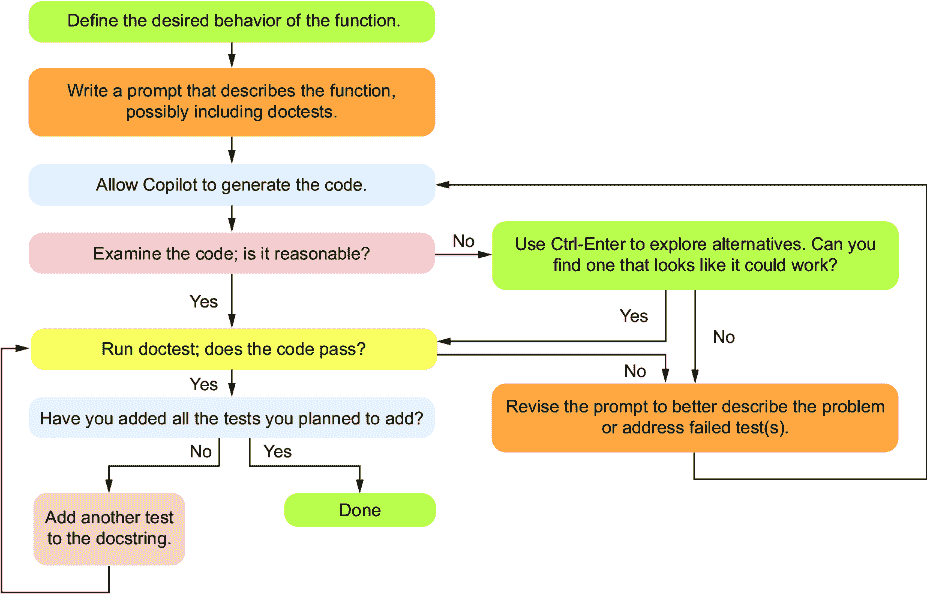

# 第六章：6 测试与提示工程

### 本章内容包括

+   理解测试 Copilot 代码的重要性

+   使用闭盒测试与开盒测试

+   通过修改提示来解决 Copilot 的错误

+   通过实例讲解如何测试 Copilot 生成的代码

在第三章中，我们首次开始意识到测试 Copilot 生成的代码的重要性。测试是编写软件的每个人都必须掌握的技能，因为它能让你确信代码是否正常工作。在本章中，我们将学习如何全面地测试代码，并通过修改提示帮助 Copilot 修复无法工作的代码。

测试是一个至关重要的技能，你需要学会如何独立做好这件事，以便检查代码是否正确。Copilot 可以生成测试，并且在生成测试的质量上已有所提高，但我们鼓励你暂时不要使用 Copilot 生成测试，因为你需要先学会如何独立做得足够好，才能验证 Copilot 生成的测试是否合理。这一点在接下来的几章中也适用——问题分解、测试和调试是你必须自己学会的技能，然后才能寻求 Copilot 的帮助，因为你需要知道自己是否掌握了这些技能，才能知道 Copilot 做的是否合理。

## 6.1 为什么测试代码至关重要

在第三章中，我们提到过你应该测试代码以确保它的正确性。不幸的是，根据我们的经验，初学编程的程序员似乎对测试有一种排斥感！为什么？我们认为有几个原因。第一个原因是存在一个被广泛记录的问题，叫做*超级错误*，即人类在刚开始学习编程时，往往认为计算机能够理解代码的意图并作出相应的反应[1]。因为他们写的代码对他们来说是有意义的，所以他们很难想象代码可能会不工作。第二个问题是对第一个问题的加剧：如果你认为自己的代码是对的，那么测试只会带来坏消息。如果你不测试，就无法发现代码是否有问题。这就像老话说的，把头埋在沙子里。

专业的软件工程师采用的测试方法与新手程序员截然不同。他们对待测试非常严谨，因为代码中的一个错误可能会给公司带来重大后果。没有人愿意成为那个让公司失去大量收入、让黑客访问机密用户数据，或者导致自动驾驶汽车发生事故的人。考虑到错误的成本，假设代码是错误的，直到经过验证是正确的，这种做法更为合理。只有在广泛测试之后，我们才会相信它正常工作。而且，公司不仅仅进行一次测试，他们会将测试保存在系统中，这样每次有人更改代码时，测试不仅会在更改的代码上运行，还会在任何可能受更改代码影响的代码上运行（这就是回归测试）。

公司非常重视这一点，以至于他们经常在编写代码之前就编写测试，这个过程叫做测试驱动开发（TDD）。这确保每个人都同意代码应该做什么或不应该做什么。我们认为，你（作为读者）不需要采用这种方法来编写本书中的程序，但我们在这里提到它是为了传达测试的重要性。在编写代码之前思考测试可以帮助你理解代码应该做什么，从而帮助你编写更好的提示。事实上，你可以直接在提示中包含测试用例！

最后，让我们记住关于 Copilot 的事情：它会犯错。我们不应该假设 Copilot 给我们的任何代码都是正确的。所有这些意味着，你从 Copilot 那里获得的任何代码都应该在信任它之前进行测试。

## 6.2 闭盒测试与开盒测试

软件工程师通常有两种方式来测试他们的代码。第一种叫做闭盒测试，这种方法假设你对代码的工作原理一无所知。因此，这种测试方法涉及到改变输入并观察输出。我们通常看到闭盒测试应用于函数或整个程序。闭盒测试的优点在于，你不需要查看代码就可以进行测试，因此可以专注于期望的行为。

第二种测试方法叫做开盒测试，在这种方法中，我们查看代码，找出可能出错的地方。开盒测试的优势在于，通过查看代码的具体结构，我们可以发现代码可能出错的位置，并为该部分代码设计额外的测试。我们将同时使用闭盒测试和开盒测试，结合这两种方法来强化我们的测试。闭盒测试和开盒测试的简要总结见表 6.1。在本节中，让我们看看如何使用这些方法测试一些函数。

##### 表 6.1 闭盒测试和开盒测试的简要概述

| 闭盒测试 | 开盒测试 |
| --- | --- |
| 需要理解函数规格才能测试  | 需要理解函数规格和实现该函数的代码才能测试  |
| 测试不需要理解代码的功能。  | 测试应该根据代码的编写方式量身定制。 |
| 测试人员不需要具备关于他们测试的代码的技术专长。  | 测试人员需要能够理解代码，以便确定哪些测试可能更为重要。 |
| 通过改变输入并检查预期结果来测试函数  | 可以像封闭盒测试一样测试函数，但也可以在函数内进行更细粒度的测试 |

### 6.2.1 封闭盒测试

假设我们正尝试测试一个接受单词列表（字符串）并返回最长单词的函数。更准确地说，函数签名应该是

```py
def longest_word(words):
```

期望的输入是一个单词列表。期望的输出是该列表中字符数最多的单词。如果多个单词字符数相同，则应返回第一个该长度的单词。

##### 表达测试用例的简写

编写函数测试时，标准格式是写出函数名称及其输入和期望的结果。例如，调用

```py
>>> longest_word(['a', 'bb', 'ccc'])
'ccc'
```

这意味着如果我们用输入列表`['a', 'bb', 'ccc']`调用`longest_word`函数，那么该函数返回的值应该是`'ccc'`。

通常我们考虑编写测试用例的分类有两种：

+   *常见用例—*这些案例包括一些你可以想象函数接收到的标准输入以及相应的结果。

+   ***边缘案例—*这些案例是不常见的，但可能会破坏代码的情况。这些输入可能会更深入地测试函数的一些规则，或者包含意外输入（例如，包含所有空字符串的列表）。**

**回顾我们在前一个示例中的`longest_word`函数签名，让我们思考一些我们可能会用来测试它的测试用例。在本章稍后，我们将看到如何实际运行这些测试用例，以判断我们的代码是否正常工作。让我们从*常见用例*开始。我们很可能想包括一个测试，测试几个单词，其中有一个单词比其他单词长：**

```py
>>> longest_word(['cat', 'dog', 'bird']) 
'bird'
```

这是另一个测试，包含更多的单词，且列表中的最长单词出现在其他位置：

```py
>>> longest_word(['happy', 'birthday', 'my', 'cat']) 
'birthday'
```

最后，让我们来一个只有一个单词的测试：

```py
>>> longest_word(['happy']) 
'happy'
```

如果程序能够处理这些常见的用例，我们的下一步就是考虑一些*边缘案例*。让我们来考虑一些边缘案例。

假设我们想检查函数是否符合我们的描述，当有多个相同长度的单词时，返回第一个单词。这个测试可能被视为常见案例或边缘案例，取决于你问谁：

```py
>>> longest_word(['cat', 'dog', 'me']) 
'cat'
```

如果列表中的所有单词都没有字符，我们该怎么办？一个没有字符的字符串被称为*空字符串*，写作一个空的引号对。如果我们只有一个空字符串的列表，那么最长的单词就是空字符串！因此，包含所有空字符串的测试应该只会返回一个空字符串：

```py
>>> longest_word(['', ''])
''
```

*边缘情况*这个术语来源于这样一个事实：错误通常发生在执行的“边缘”，即第一个或最后一个元素。在许多循环中，错误可能发生在循环开始时（例如，忘记或错误处理列表中的第一个元素）或在结束时（例如，忘记最后一个元素或超出列表的末尾，尝试访问一个不存在的元素）。特别是当代码可能有循环处理多个元素时，你需要注意循环开始和结束时的行为。

##### 错误输入测试

另一类测试将测试函数在接收到不正确输入时的响应。我们在本书中不会深入讨论这一点，因为我们假设你会正确调用自己的函数，但在生产代码中，这种测试可能很常见。一些调用函数时传递不正确输入的例子可能是通过使用`None`而不是实际列表来传递一个不存在的列表（例如，`longest_word(None)`），给函数一个空列表（例如，`longest_word([])`），给函数传递一个包含整数的列表作为输入（例如，`longest_word([1,2])`），或者提供一个包含字符串的列表，但字符串中含有空格或多个单词（例如，`longest_word(['hi there', 'my', 'friend'])`）。很难说当函数接收到不正确的输入时应该做什么，程序员需要决定他们是否关心这一点，但我们在本书中忽略了这一类测试，因为我们假设你会以函数设计所能处理的方式来调用你的函数。

### 6.2.2 我们怎么知道应该使用哪些测试用例？

在第三章中，我们讨论了好的测试涉及捕获不同类别的函数调用。找到这些类别的一种方法是通过使用参数类型并改变它们的值。

例如，如果函数接受字符串或列表作为参数，那么测试该字符串或列表为空、只有一个元素或有多个元素的情况可能是合理的。如果我们要测试多个元素的情况，可能会使用四个元素。例如，使用五个或六个元素可能没有意义，因为如果我们的代码能处理四个元素，那么在增加到五个时，不太可能突然出错。有时，某些测试用例对于特定函数可能没有意义；例如，要求从一个没有任何单词的列表中找出最长的单词就没有意义，因此我们不会为`longest_word`函数测试空列表。

另一个例子是，如果一个函数接受两个数字作为参数，那么当一个数字为零、两个数字都为零、一个数字为负数、两个数字都为负数以及两个数字都为正数时，测试是有意义的。

找到类别的另一种方法是考虑函数的具体任务。例如，对于我们的`longest_word`函数，它应该是找出最长的单词，所以我们应该测试它在典型情况下是否真正执行了这个任务。而且，如果多个单词是最长的，它应该返回第一个这些单词，所以我们应该有一个测试用例，其中列表中有多个最长的单词。

寻找测试类别是科学与艺术的结合。我们在这里给出了一些经验法则，但什么算是有用的测试用例通常取决于测试的具体功能。正如通常情况一样，练习你的测试技能是提高你编写有用测试的能力的最佳方式，最终有助于你改进代码。

### 6.2.3 开盒测试

开盒测试和闭盒测试之间的最大区别在于，开盒测试会检查代码，以查看是否有其他种类的测试用例需要检查。理论上，闭盒测试可能足以完全测试该函数，但开盒测试通常会给你更多的思路，了解代码可能在哪些地方出错。假设我们要求 Copilot 编写我们的`longest_word`函数，并且得到了以下列出的代码。

##### 第 6.1 号列表 查找最长单词的函数（错误的！）

```py
def longest_word(words):
 ''' 
 words is a list of words

 return the word from the list with the most characters
 if multiple words are the longest, return the first 
 such word 
 '''
    longest = ""
    for i in range(0,len(words)):
        if len(words[i]) >= len(longest):     #1
            longest = words[i]
    return longest
```

#1 `>=`是错的。应该是`>`。

对于这个例子，我们故意在代码中引入了一个错误，以帮助解释开盒测试的作用。假设在思考测试用例时，你忘记了测试当`words`列表中有两个单词都拥有最多字符时会发生什么。那么，阅读这段代码时你可能会发现如下的`if`语句：

```py
   if len(words[i]) >= len(longest):
        longest = words[i]
```

阅读`if`语句时，你可能会注意到，当最新元素的长度大于*或等于*我们迄今为止见过的最长单词时，它会更新单词列表中的最长单词。这是一个错误；应该是`>`，而不是`>=`，但假设你不确定。这会促使你写一个像我们之前描述的那样的测试用例，其中有多个单词，其中一个或多个是最长的：

```py
>>> longest_word(['cat', 'dog', 'me']) 
'cat'
```

这个测试会在第 6.1 号列表中的代码中失败，因为它会返回`'dog'`，而不是正确的答案`'cat'`。测试失败是有价值的信息，说明第 6.1 号列表中的代码是错误的。

正如我们所说的，开箱测试很有用，因为它能帮助我们构建符合代码本身结构的测试用例。例如，如果我们的代码使用了一个循环，在进行开箱测试时我们会看到这个循环。列表 6.1 中的循环是正确的，但通过查看代码中的循环，我们会提醒自己测试边界情况，确保它能够正确处理第一个元素、最后一个元素和空列表。总而言之，了解代码如何处理输入，往往能帮助我们洞察程序可能在哪些情况下出错。

## 6.3 如何测试你的代码

有许多有效的方式来测试你的代码，这些方式从简单的测试开始，可能只是为了检查你的代码是否正常工作，到构建在公司回归测试套件中的测试。对于生产代码，Python 程序员通常使用比我们在本章展示的更强大、更完整的测试工具。最常见的工具是 pytest，它是一个需要安装才能使用的模块。我们认为 pytest 超出了我们在这里介绍测试核心概念的需求。我们将集中在更轻量级的测试上，以帮助你确保 Copilot 的代码能够正常工作。我们可以通过在 Python 提示符中测试或使用 Python 内置的模块 doctest 来实现这一点。

### 6.3.1 使用 Python 提示符进行测试

测试的第一种方式是通过 Python 提示符，在交互窗口中进行，就像我们在之前的章节中所做的那样。这种测试的优点是它运行迅速，而且你可以根据上一个测试的输出轻松地添加更多的测试。到目前为止，我们运行的测试就是通过 Python 提示符进行的测试。例如，

```py
>>> longest_word(['cat', 'dog', 'me']) 
'cat'
```

在运行那个测试时，如果你期望结果是 `'cat'`，你会很高兴看到这个结果。然而，如果测试显示你的代码是错误的，那么你现在有机会回去修正它。

当你修复了代码之后，你需要测试新代码。这时候，使用 Python 提示符单独进行测试可能会出错。当你回到刚刚修改过的代码进行测试时，你可能会倾向于仅仅运行之前失败的那个测试用例。然而，在修复代码以正确处理之前失败的测试用例时，你可能引入了一个错误，导致那些已经通过的测试用例现在失败。因此，你真正需要的是一种方法，可以不仅运行当前的测试，还能运行所有之前的测试。

### 6.3.2 在你的 Python 文件中进行测试（我们不会使用这种方式）

你可能会想将所有测试用例放入你的 Python 程序中（在函数外部，即在类似主函数的位置），以便它们都能运行。这个解决方案解决了我们刚才描述的 Python 提示问题，但也引入了一个新问题。当你希望你的 Python 程序执行其原本设计的主要任务，而不仅仅是运行测试时，会发生什么呢？你可以删除所有测试，但如果希望重新运行它们，那就失去了意义。你也可以将它们注释掉，以便未来可以运行，但这也不是一个很干净的解决方案。那么，我们想要的就是一种方法，能够在需要时运行所有测试，但仍然能够运行程序。做到这一点的方法是使用一个名为 doctest 的模块。

### 6.3.3 doctest

doctest 模块是 Python 的内置模块。使用 doctest 的好处在于，我们只需将测试用例添加到描述函数的 docstring 中。这个增强版的 docstring 具有双重功能。首先，我们可以随时使用 doctest 运行所有这些测试用例。其次，它有时能帮助 Copilot 生成更好的代码，或者修复已经编写但没有完全工作的代码。让我们编写包含所有测试用例并准备好通过 doctest 执行的`longest_word`函数（见清单 6.2）。

##### 清单 6.2 使用 doctest 测试`longest_word`函数

```py
def longest_word(words): 
 ''' 
 words is a list of words

 return the word from the list with the most characters
 if multiple words are the longest, return the first 
 such word 

 >>> longest_word(['cat', 'dog', 'bird']) #1
 **'bird'** #1
 #1
 **>>> longest_word(['happy', 'birthday', 'my', 'cat'])** #1
 **'birthday'** #1

 **>>> longest_word(['happy'])** #1
 **'happy'** #1
 #1
 **>>> longest_word(['cat', 'dog', 'me'])** #1
 **'cat'** #1
 #1
 **>>> longest_word(['', ''])** #1
 **''** #1
 **'''** #1
    longest = ''                             #2
    for i in range(0,len(words)):            #2
        if len(words[i]) > len(longest):     #2
            longest = words[i]               #2
    return longest                           #2
**import doctest                  ** #3
**doctest.testmod(verbose=True)   ** #3
```

#1 显示了 doctest 的测试用例

#2 显示了函数的正确代码

#3 调用 doctest 进行测试的代码（在主程序中）

在这段代码中，我们看到 docstring 中包含了我们提供的测试用例，作为 Copilot 的提示。Copilot 生成了正确的代码来实现这个函数。然后，我们手动编写了最后两行代码来执行测试。运行后，我们得到了如下清单中的输出。

##### 清单 6.3 从运行清单 6.2 中的程序得到的 doctest 输出

```py
Trying:
    longest_word(['cat', 'dog', 'bird'])  
Expecting:
    'bird'
ok              #1
Trying:
    longest_word(['happy', 'birthday', 'my', 'cat'])
Expecting:
    'birthday'
ok               #2
Trying:
    longest_word(['happy'])
Expecting:
    'happy'
ok             #3
Trying:
    longest_word(['cat', 'dog', 'me'])
Expecting:
    'cat'
ok           #4
Trying:
    longest_word(['', ''])
Expecting:
    ''
ok                   #5
1 items had no tests:          #6
    __main__                   #6
1 items passed all tests:          #7
   5 tests in __main__.longest_word
5 tests in 2 items.
5 passed and 0 failed.     #8
Test passed.
```

#1 longest_word 中的第一个测试通过了

#2 longest_word 中的第二个测试通过了

#3 longest_word 中的第三个测试通过了

#4 longest_word 中的第四个测试通过了

#5 longest_word 中的第五个测试通过了

#6 主程序中（函数外部）没有测试。

#7 longest_word 通过了所有测试。

#8 0 失败是你希望看到的结果。

从这个输出中，我们可以看到每个测试都运行并且通过了。之所以这些测试能运行，是因为我们在清单 6.2 中添加的最后两行代码：

```py
import doctest
doctest.testmod(verbose=True)
```

在第一行，我们导入了 `doctest` 模块。这个模块帮助我们通过在运行程序时自动运行测试用例来测试代码。在第二行，我们调用了 `doctest` 模块中的 `testmod` 函数。这个函数调用告诉 `doctest` 执行所有的测试；参数 `verbose=True` 告诉 `doctest` 给出所有测试的结果，无论它们是否通过。如果我们切换为 `verbose=False`，它只会在测试用例失败时给出输出（`verbose=False` 实际上是默认值，所以你可以在不传递任何参数的情况下调用这个函数，它默认不会提供输出，除非一个或多个测试失败）。这个特性非常有用，因为我们可以让 `doctest` 继续运行，只有在测试失败时才会看到输出。

在这种情况下，我们的代码通过了所有测试用例。但是，让我们体验一下当代码未通过时会发生什么。

如果我们发现一个单词与当前最长的单词长度相同，我们应该忽略它，因为当有多个单词的长度相同且为最长时，我们始终希望返回第一个最长的单词。因此，正确的做法是使用 `>` 在 `if` 语句中（只有当找到的新单词确实比当前最长的单词长时才会更新最长单词），而不是 `>=`。

我们可以通过将 `>` 改为 `>=` 来破坏清单 6.2 中的代码，这会导致它选择最长长度单词中的最后一个，而不是第一个。让我们将以下行改为：

```py
if len(words[i]) > len(longest):
```

改为：

```py
if len(words[i]) >= len(longest):
```

现在，测试不应该全部通过。另外，让我们把最后一行改为：

```py
doctest.testmod()
```

通过不给 `testmod` 函数传递任何参数，`verbose` 现在被设置为 `False`。当我们运行代码时，输出如下：

```py
**********************************************************************
File "c:\Users\leo\Copilot_book\Chapter6\test_longest_word.py", 
line 12, in __main__.longest_word
Failed example:
    longest_word(['cat', 'dog', 'me'])
Expected:
    'cat'
Got:
    'dog'
**********************************************************************        
1 items had failures:
   1 of   5 in __main__.longest_word
***Test Failed*** 1 failures.
```

`doctest` 方便地告诉我们运行了哪些测试、期望的输出是什么，以及函数实际输出了什么。这可以帮助我们捕捉到错误，并返回修复它。

##### Copilot 不会自动运行测试用例。

我们经常听到这样的问题：为什么 Copilot 在生成代码时不直接结合测试用例？例如，如果我们添加了测试用例，希望 Copilot 能尝试生成函数，并仅提供能够通过这些测试用例的代码。遗憾的是，这样做存在一些技术挑战，截至本文写作时，这个功能尚未包含在内。所以，如果你添加了测试用例，它只会改进对 Copilot 的提示，但不能保证 Copilot 生成的代码能通过这些测试。

到目前为止，我们已经看到如何通过 Python 提示和 `doctest` 运行测试。现在我们知道如何测试我们的代码了，让我们思考一下这将如何改变我们的代码设计周期。

## 6.4 再次审视与 Copilot 一起设计函数的周期

在第三章中，我们给出了函数设计的早期版本（见图 3.3）。当时，我们并不像现在这样了解如何检查我们的代码（这一点我们在第 4 和第五章学到了），也不太清楚如何测试代码。因此，让我们创建这个周期的新版本（图 6.1），以反映我们新的理解。



##### 图 6.1 使用 Copilot 的函数设计周期，增加了更多关于测试的内容

这个图比之前稍微复杂一些，但如果我们仔细查看，可以看到大部分原始过程都被保留了。新增或更改的内容包括以下几点：

+   在编写提示时，我们可以将 doctests 作为初步提示的一部分，帮助 Copilot 生成代码。

+   在完成了第 4 和第五章的内容后，我们已经具备了良好的能力，能够检查代码是否正常运行，因此现在我们增加了一步来处理当 Copilot 提供的初始代码看起来不对时该怎么办。如果发生这种情况，我们将使用 Ctrl-Enter 来查看 Copilot 的建议，希望能找到解决方案。如果我们找到了这样的解决方案，我们将选择它并继续前进。如果没有找到，我们需要修改我们的提示，以帮助 Copilot 生成更好的建议。

+   在找到看起来正确的代码后，我们将运行 doctest，查看代码是否通过了我们在提示中包含的 doctests（如果我们没有包含任何，它会自动通过）。如果 doctest 通过，我们可以继续添加测试并检查，直到我们满意代码正常运行。如果 doctest 失败，我们需要弄清楚如何修改提示，以解决失败的测试。一旦提示被修改，希望它能够帮助 Copilot 生成新的代码，从而通过我们提供的测试。

有了这个新的工作流程，我们不仅能更好地判断代码是否正常工作，还能在代码没有正常工作的情况下修复它。在接下来的章节中，我们将为自己提供更多的工具，以便在代码没有正常工作时提供帮助，但现在，让我们通过解决一个新问题并使用我们在这里描述的工作流程来测试 Copilot 提供的解决方案，将这些内容整合起来。

## 6.5 完整的测试示例

让我们尝试一个问题，帮助学生决定在面对面课堂上应该坐哪里。虽然我们讨论的是在教室中找到空座位，但这个问题与在音乐会大厅、剧院、电影院或办公室布局中寻找空座位的问题是相同的。

假设我们有一个教室布局，表示为一个包含座位排的二维列表。每个座位要么为空格（`'` `'`），要么是一个学生（`'S'`），分别表示空座位或已占用座位。我们将要求 Copilot 创建一个函数，确定我们可以在哪一排添加最多学生，同时在此过程中，我们还将设计测试，以检查代码是否正常工作。

### 6.5.1 找到我们能在一排中增加的最多学生数

我们想弄清楚我们能在教室的一排中最多增加多少新学生。（等价地，我们在找出任意一排中空座位最多的数量。）为此，让我们从一个有些模糊的提示开始，看看 Copilot 的表现如何。

##### 列表 6.4 我们能在一排中增加的最大学生数

```py
def most_students(classroom):
 '''
 classroom is a list of lists
 Each ' ' is an empty seat
 Each 'S' is a student
 How many new students can sit in a row? #1
 **'''**
    max_students = 0
    for row in classroom:
        students = 0
        for seat in row:
            if seat == 'S':
                students += 1
            else:
                students = 0
            if students > max_students:
                max_students = students
    return max_students
```

#1 这是提示中一个有些模糊的部分。

为了这个例子，我们的提示语不太好。“一排可以坐多少新学生？”是给人类的合理起点，但它不够具体，很容易想象 Copilot 在解读我们意思时会感到困惑。Copilot 可能会搞不清楚我们是要计算学生人数还是每排的空座位数量，或者它可能会返回整个教室的空座位总数，而不是某一排的空座位数。事实证明，我们的提示语确实让 Copilot 感到困惑，代码也不正确，但在我们深入代码之前，让我们先考虑应该运行哪些测试用例。我们提出了以下一组测试用例：

+   一个教室，有一些连续的空座位和一些不连续的空座位，确保它不仅仅是在计算连续空座位的数量

+   一个没有空座位的教室，确保在这种情况下返回 0

+   一个教室中有一排空座位，确保所有座位都被计算在内，包括第一和最后一个座位（边缘情况）

+   一个教室有多排空座位相同数量的座位，确保它只返回其中一个值（而不是可能返回所有这些排的空座位总和）

让我们先添加第一个测试用例，并添加 doctest 代码来运行该测试，如下所示。

##### 列表 6.5 我们能在一排中增加的最大学生数

```py
def most_students(classroom):
 '''
 classroom is a list of lists
 Each ' ' is an empty seat
 Each 'S' is a student

 How many new students can sit in a row?

 >>> most_students([['S', ' ', 'S', 'S', 'S', 'S'], \ #1
 **['S', 'S', 'S', 'S', 'S', 'S'], \** 
 **[' ', 'S', ' ', 'S', ' ', ' ']])** 
 **4**
 **'''**
    max_students = 0
    for row in classroom:
        students = 0
        for seat in row:
            if seat == 'S':
                students += 1
            else:
                students = 0
            if students > max_students:
                max_students = students
    return max_students

**import doctest**
**doctest.testmod(verbose=False)**
```

#1 常见情况的 doctest。如果需要换行，docstring 测试用例中必须使用 \。

当我们运行这段代码时，我们得到了这个输出（我们手动清理了教室座位列表的格式，以便于答案的可读性）：

```py
**********************************************************************
Failed example:
    most_students([['S', ' ', 'S', 'S', 'S', 'S'],
                   ['S', 'S', 'S', 'S', 'S', 'S'], 
                   [' ', 'S', ' ', 'S', ' ', ' ']])
Expected:
    4
Got:
    6
**********************************************************************
1 items had failures:
   1 of   1 in __main__.most_students
***Test Failed*** 1 failures.
```

虽然我们希望代码能够正常工作，但我们很感激第一个测试用例找到了一个错误。空座位最多的排是第三排，有四个空座位。但 Copilot 提供的代码错误地告诉我们答案是六。这个问题很奇怪。即使不读代码，你也可以推测它可能是在计算每排座位数，或者每排可坐的最大学生数。我们的测试用例中第二排已经坐满了学生，因此很难判断。我们能做的是将教室设置为：

```py
 >>> most_students([['S', ' ', 'S', 'S', 'S', 'S'], \ 
 [' ', 'S', 'S', 'S', 'S', 'S'], \ #1
 **[' ', 'S', ' ', 'S', ' ', ' ']])** 
 **4**
```

#1 我们从第二排删除了第一个学生。

因此，第二行现在有五个学生。当我们再次运行代码时，测试又失败了，代码给出的答案是五。看起来这段代码不仅仅告诉我们每行的座位数。它一定是在做一些与学生座位相关的事情。我们的下一步是改进提示词，看看是否能从 Copilot 得到更好的代码，但为了完整性，首先让我们解释一下代码在下面的列表中真正的操作。

##### 列表 6.6 Copilot 错误代码的详细解析

```py
 max_students = 0    #1
    for row in classroom:     #2
        students = 0             #3
        for seat in row:           #4
            if seat == 'S':        #5
                students += 1      #5
            else:                        #6
                students = 0             #6
            if students > max_students:     #7
                max_students = students    
    return max_students
```

#1 从将 max_students 初始化为 0 开始

#2 对于课堂中的每一行

#3 为这一行初始化学生计数器为 0

#4 对每个座位进行处理

#5 如果座位上有学生，递增计数器。

#6 如果有空座位，重置计数器。

#7 检查学生计数器是否大于之前看到的最大值，如果是，则更新最大值。

从代码描述中可以看到每行的操作，但是从宏观上看，这段代码是在统计每行中连续坐着的学生人数。它通过为每行初始化一个计数器为 0，然后在每次看到一个学生坐下时递增计数器。当它看到空座位时，计数器会被重置。内循环结尾的`if`语句是一个相当标准的方式，用于跟踪之前看到的最大值，在这里，它是跟踪最大连续学生数。这完全不是我们想要的，而我们可怜的提示词部分也得为此负责。然而，关键的一点是，我们的测试让我们知道代码是不正确的。（如果你在阅读代码时自己发现了错误，那也很好！）

### 6.5.2 改进提示词以寻找更好的解决方案

让我们重写提示词，保留测试用例，看看是否能得到更好的结果，见下面的列表。

##### 列表 6.7 再次尝试找出最多的学生人数

```py
def most_students(classroom):
 '''
 classroom is a list of lists #1
 Each ' ' is an empty seat #1
 Each 'S' is a student #1
 #1
 Return the maximum total number of ' ' characters #1
 **In a given row.** 

 **>>> most_students([['S', ' ', 'S', 'S', 'S', 'S'], \**
 **[' ', 'S', 'S', 'S', 'S', 'S'], \**
 **[' ', 'S', ' ', 'S', ' ', ' ']])**
 **4**
 **'''**
    max_seats = 0
    for row in classroom:
        seats = row.count(' ')      #2
        if seats > max_seats:     #3
            max_seats = seats              #3
    return max_seats

**import doctest**
**doctest.testmod(verbose=False)**
```

#1 改进后的提示词明确要求我们在任何给定的行中寻找最多的 `' '` 字符。

#2 count 是一个列表函数，返回列表中某个参数出现的次数。

#3 用于跟踪最大座位数的代码

为了得到这个解决方案，我们必须通过 Ctrl-Enter 查找 Copilot 的可能解决方案。现在一些解决方案计算了连续出现的 `' '`，而其他的，如 6.7 列表中的那个，成功通过了 doctest。奇怪的是，当我们第一次尝试改进后的提示词时，推荐的解决方案是正确的。这又提醒我们，Copilot 输出的非确定性使得测试变得如此重要。

让我们花点时间看看是什么让第二个提示词比第一个更好。两个提示词都包含了

```py
def most_students(classroom):
 '''
 classroom is a list of lists
 Each ' ' is an empty seat
 Each 'S' is a student
```

提示词中导致我们收到错误答案的部分是

```py
How many new students can sit in a row?
```

提示词中得出正确答案的部分是

```py
Return the maximum total number of ' ' characters in a given row. 
```

你永远无法真正知道像 Copilot 这样的大型语言模型（LLM）为什么会给出它的答案，但我们要记住，它是通过基于给定的单词和训练数据中出现过的单词来做出下一个单词的预测（即，GitHub 上的大量代码）。

第一个提示要求 Copilot 做出一些推理，有些推理它做得很好，有些则不太好。从某种意义上说，提示是在让 Copilot 知道在一个列表的列表中，什么是“行”。幸运的是，这在编程中非常常见，因此它在这里没有问题。

然后，提示要求 Copilot 做出一个基本的逻辑推理，即推断空座位是一个*新*学生可以坐的位置。这里是 Copilot 遇到困难的地方。我们怀疑是因为我们在询问新学生坐在哪一排时，Copilot 没有能够做出推理，意识到“新”学生需要弄清楚你能*添加*多少学生，换句话说，就是有多少个空座位。相反，Copilot 专注于提示中的“学生 °.°.°. 在一排”部分，并开始计算每一排中的学生。它本来也可以利用函数名（说实话，函数名本可以更好，例如`max_empty_seats_per_row`）来思考它需要计算最多的学生数。那并不是我们想要的，但我们能理解 Copilot 为什么会犯这个错误。

现在让我们来谈谈为什么在面对我们模糊的第一个提示时，Copilot 决定计算某一行中*连续*的学生人数。也许计算连续学生是 Copilot 训练数据中更常见的模式。也可能是因为“坐在一排”可以解释为“坐得连续”。或者也许是因为当我们编写这个示例时，我们正在处理另一个版本的问题，该问题要求计算连续的空座位，而 Copilot 记住了那次对话。我们不知道 Copilot 为什么给出这个答案，但我们知道我们的提示太模糊了。

相比之下，我们的第二个提示在几个方面更加具体。首先，它明确要求最大值。其次，它要求计算一排中的空格或空座位的数量。这消除了 Copilot 推断空座位意味着为新学生留位置的需求。我们还使用了“总计”和“给定行”来试图让 Copilot 摆脱它当前的连续值计数方法，但这并没有完全解决问题。因此，我们最终不得不筛选 Copilot 的回答（使用 Ctrl-Enter），这些回答有时在寻找连续的空座位，有时则是在寻找空座位的数量。

### 6.5.3 测试新解决方案

回到我们的示例，由于新代码通过了当前的测试，让我们再给它做更多的测试，以确保它的行为是正确的。在下一个测试中，我们将检查当任何行中没有空座位时，代码是否能正确返回 0：

```py
    >>> most_students([['S', 'S', 'S'], \
                       ['S', 'S', 'S'], \
                       ['S', 'S', 'S']])
    0
```

下一个测试将确保代码正确地计算出单行中的所有三个空座位（这里是第二行），以避免出现边缘情况问题（例如，未能计算第一个或最后一个元素）。诚然，从代码中可以看出，`count` 函数正在被使用，并且由于该函数是 Python 内置的，我们应该相当有信心这个测试会通过。然而，还是更安全进行测试，以确保：

```py
    >>> most_students([['S', 'S', 'S'], \
                       [' ', ' ', ' '], \
                       ['S', 'S', 'S']])
    3
```

最后一个测试检查 Copilot 是否正确处理两个行中空座位数量相同的情况：

```py
    >>> most_students([[' ', ' ', 'S'], \
                       ['S', ' ', ' '], \
                       ['S', 'S', 'S']])
    2
```

在添加了这些测试用例后，我们再次运行了完整程序，如下所示，所有测试用例都通过了。

##### 列表 6.8 最大学生人数的完整代码和文档测试

```py
def most_students(classroom):
 '''
 classroom is a list of lists
 Each ' ' is an empty seat
 Each 'S' is a student

 Return the maximum total number of ' ' characters in a 
 given row. 

 >>> most_students([['S', ' ', 'S’, 'S', 'S', 'S'], \
 [' ', 'S', 'S', 'S', 'S', 'S'], \
 [' ', 'S', ' ', 'S', ' ', ' ']])
 4
 >>> most_students([['S', 'S', 'S'], \
 ['S', 'S', 'S'], \
 ['S', 'S', 'S']])
 0
 >>> most_students([['S', 'S', 'S'], \
 [' ', ' ', ' '], \
 ['S', 'S', 'S']])
 3
 >>> most_students([[' ', ' ', 'S'], \
 ['S', ' ', ' '], \
 ['S', 'S', 'S']])
 2
 '''
    max_seats = 0
    for row in classroom:
        seats = row.count(' ')
        if seats > max_seats:
            max_seats = seats
    return max_seats

import doctest
doctest.testmod(verbose=False)
```

在这个示例中，我们演示了如何编写一个函数来从头到尾解决一个问题。Copilot 给出了错误的答案，部分原因是提示语难以理解。我们发现它给出错误答案是因为代码在我们的第一个测试中失败了。然后，我们改进了提示，并利用前两章学到的代码阅读技巧挑选出一个看起来适合我们需求的解决方案。新代码通过了我们最初的基本测试，因此我们添加了更多的测试用例，以验证代码在更多情况下是否有效。在看到它通过这些额外的测试后，我们有了更多证据证明代码是正确的。此时，我们已经测试了常见情况和边缘情况，因此我们对当前的代码非常有信心。关于测试，这个例子展示了测试如何帮助我们发现错误*并*增强我们对代码功能正确性的信心。

## 6.6 另一个完整的测试示例：文件测试

在大多数情况下，您可以像我们在前面的示例中一样，通过向文档字符串中添加示例来测试代码。然而，有时测试可能会变得更加具有挑战性。当您需要测试与某种外部输入交互的代码时，就会出现这种情况。一个例子是当我们需要测试与外部网站交互的代码，但这种情况在高级代码中更常见，而不是本书范围内的代码。

本书范围内的一个示例是处理文件。当输入是文件时，如何编写测试用例？Python 确实支持在文档字符串内部进行此类操作，但为了保持与我们已做内容的一致性，我们将不采用这种方式。相反，我们将使用外部文件来测试我们的代码。让我们通过修改第二章中的 NFL 四分卫（QB）示例来看如何做到这一点。

我们可以使用整个文件走一遍示例，但因为我们查询四分卫的信息仅限于文件的前九列，所以我们将去掉文件中其余的列，以使内容更易读。去除剩余列后，表 6.2 展示了文件的前四行。

##### 表 6.2 NFL 数据集简化版的前四行

| game_id | player_id | position | player | team | pass_cmp | pass_att | pass_yds | pass_td |
| --- | --- | --- | --- | --- | --- | --- | --- | --- |
| 201909050chi  | RodgAa00  | QB  | Aaron Rodgers  | GNB  | 18  | 30  | 203  | 1  |
| 201909050chi  | JoneAa00  | RB  | Aaron Jones  | GNB  | 0  | 0  | 0  | 0  |
| 201909050chi  | ValdMa00  | WR  | Marquez Valdes-Scantling  | GNB  | 0  | 0  | 0  | 0  |

我们假设在接下来的例子中，数据集的每一行仅包含这九列，但我们希望你能理解如何处理完整数据集（你只需要在每种情况下添加所有其他列）。

假设我们想要编写一个函数，该函数接受数据集的文件名和球员的名字作为输入，然后输出该球员在数据集中所达到的总传球码数。我们假设用户提供的数据格式与第二章和表 6.2 中的 NFL 进攻统计文件一致。在编写提示或函数之前，我们该如何进行测试呢？我们有几种选择：

+   *在更大的数据集中寻找测试——*一种解决方案是将完整的数据集和多个球员名字作为输入传递给函数。挑战在于确定我们是否正确。我们可以使用 Google Sheets 或 Microsoft Excel 等软件打开文件，并利用电子表格的功能为每个球员找出答案。例如，我们可以将文件作为表格在 Excel 中打开，按球员排序，找到某个球员，并使用 Excel 中的求和函数计算该球员的所有传球码数。这并不是一个坏的解决方案，但它也需要不少工作，如果你花足够的时间去寻找测试答案，你可能已经完成了需求，而不再需要 Python 代码了！换句话说，弄清楚测试案例的答案，可能就已经得到了你最初想要的答案，这样代码就不那么有价值了。另一个问题是，如何找到所有你想测试的边界情况：你的数据集是否包含所有你想要测试的边界情况，以便编写一个在其他数据集上也能运行的程序呢？这种方法的另一个缺点是，当函数执行的操作比简单地在多行中求和复杂得多时，如何处理这种情况：在这种情况下，弄清楚某些真实测试值的答案可能需要大量的工作。

+   *创建人工数据集进行测试——*另一种解决方案是创建人工数据集，在这些数据集中你知道多种可能查询的答案。因为数据集是人工创建的，你可以加入边界情况，看看代码在这些情况下如何表现，而不必在真实数据集中寻找这种罕见的例子。（有时，真实数据集中可能没有这些边界情况，但你仍然希望进行测试，以便当数据集更新或新增时，代码能够正常运行。）

鉴于在人工数据集上创建测试用例的优势，我们将在这里采用这种方法。

### 6.6.1 我们应该运行哪些测试？

让我们思考一下我们希望测试的常见情况和边缘情况。对于常见情况，我们希望有几个测试：

+   *一个球员在数据集中多次出现（非连续），包括最后一行。* 这个测试确保代码在返回结果之前迭代所有球员（即，不做出数据按球员名字排序的错误假设）。

+   *一个球员出现在数据集的连续行中。* 这个测试确保没有出现某种错误，其中连续的值被跳过。

+   *某球员在数据集中仅出现一次。* 这个测试确保即使只是对一个值求和时，结果也能正常处理。

+   *数据集中可能出现非四分卫球员。* 对此，我们确保代码包含所有球员，而不仅仅是四分卫。

+   *某球员在一场比赛中传球码数为 0。* 这个测试确保代码在球员没有传球码数时正确运行。因为球员可能因伤缺席比赛，所以这是一个常见的测试情况。

对于边缘情况，我们希望再测试几个内容：

+   *该球员不在数据集中。* 这实际上非常有趣：我们希望代码在这种情况下做什么？一个合理的答案是返回他们传球了 0 码。如果我们询问数据集关于勒布朗·詹姆斯（篮球运动员，而非美式足球运动员）在 2019 到 2022 年间在 NFL 的传球码数，0 是正确答案。然而，这可能不是生产代码中最优雅的解决方案。例如，如果我们询问关于亚伦·罗杰斯（拼写错误为 Aron Rodgers）的传球码数，我们宁愿让代码告诉我们他不在数据集中，而不是说他传了 0 码，这在他在此期间两次获得联盟 MVP 的情况下可能会非常混淆我们。为了表示该名字缺失，我们可能会返回一个大负值（例如，-9999），或者我们可能会使用异常处理，但这些超出了本书的讨论范围。

+   *一个球员在所有比赛中的总码数为负，或者某个球员在单场比赛中的码数为负，以确保代码正确处理负值。* 如果你不熟悉美式足球，这种情况可能发生在球员接到球并被擒抱在起始点（进攻线）后面。四分卫在整场比赛中的传球码数为负的情况很少见，但如果他们传出一次负码数的传球，并且在同一时刻受伤，导致他们之后无法继续比赛，那么这种情况是有可能发生的。

现在我们已经对测试内容有了大致的了解，接下来让我们构建一个人工文件来捕捉这些测试用例。我们本可以将这些测试分布在多个文件中，这也是一个合理的选择，但将它们放在一个文件中的优点是，我们可以将所有测试用例保存在一起。表 6.3 是我们构建并保存为 test_file.csv 的内容。

##### 表 6.3 我们的文件来测试 NFL 传球码数功能

| game_id | player_id | position | player | team | pass_cmp | pass_att | pass_yds | pass_td |
| --- | --- | --- | --- | --- | --- | --- | --- | --- |
| 201909050chi  | RodgAa00  | QB  | 亚伦·罗杰斯  | GNB  | 20  | 30  | 200  | 1  |
| 201909080crd  | JohnKe06  | RB  | 凯里昂·约翰逊  | DET  | 1  | 1  | 5  | 0  |
| 201909080crd  | PortLe00  | QB  | 莱奥·波特  | UCSD  | 0  | 1  | 0  | 0  |
| 201909080car  | GoffJa00  | QB  | 贾里德·高夫  | LAR  | 20  | 25  | 200  | 1  |
| 201909050chi  | RodgAa00  | QB  | 亚伦·罗杰斯  | GNB  | 10  | 15  | 150  | 1  |
| 201909050chi  | RodgAa00  | QB  | 亚伦·罗杰斯  | GNB  | 25  | 35  | 300  | 1  |
| 201909080car  | GoffJa00  | QB  | 贾里德·高夫  | LAR  | 1  | 1  | –10  | 0  |
| 201909080crd  | ZingDa00  | QB  | 丹·津加罗  | UT  | 1  | 1  | –10  | 0  |
| 201909050chi  | RodgAa00  | QB  | 亚伦·罗杰斯  | GNB  | 15  | 25  | 150  | 0  |

请注意，这里的数据完全是人工构造的。（这些不是任何球员的真实统计数据，你可以从丹和莱奥现在变成 NFL 四分卫这一点看出来。）我们确实保留了部分真实球员的名字，以及来自原始数据集的真实`game_id`和`player_id`。通常来说，尽量让你的人工数据尽可能接近真实数据，这样测试更为真实，更有可能代表实际数据的情况。

让我们看看如何在这个测试文件中融入所有的测试用例（表 6.3）。亚伦·罗杰斯在文件中出现多次，包括连续出现和非连续出现，也作为最后一条记录出现。贾里德·高夫多次出现，我们为他在一场比赛中人工设置了–10 码（作为一名顶级 NFL 四分卫，我希望他能接受我们给他设置一个不太理想的单场比赛数据）。我们保留了凯里昂·约翰逊作为跑卫（RB）并从真实数据集中给了他 5 码的传球码数，以确保解决方案不会仅仅过滤四分卫。凯里昂·约翰逊在数据中只有一条记录。我们将莱奥·波特添加到数据集中，并为他设置了 0 码传球码数（他确信自己会尽一切努力避免被 NFL 球员擒抱）。我们还添加了丹·津加罗并给了他一次成功的传球，但为–10 码，覆盖了单个球员的总数据为负的情况。表 6.4 展示了当我们针对每个球员运行查询时，它*应该*返回的结果。

##### 表 6.4 测试用例中每个球员的传球码数

| Player | Passing yards in the test case |
| --- | --- |
| 亚伦·罗杰斯  | 800  |
| 凯里昂·约翰逊  | 5  |
| 莱奥·波特  | 0  |
| 贾里德·高夫  | 190  |
| 丹·津加罗  | –10  |

### 6.6.2 创建函数

我们先从函数名开始，在文档字符串中描述问题。这个问题可能足够复杂，我们可能需要在函数中提供提示，帮助它打开文件、处理数据并关闭文件，但让我们先试着描述函数，看看 Copilot 如何处理。

##### 列表 6.9 查找每个球员总传球码数的函数

```py
def tot_pass_yds_player(input_file, player):     #1
 **"""**
 **input_file is a string that is the name of a file**
 **player is the name of a player**

 **The file is a csv file with a header row**
 **Column 4 is the player's name and column**
 **8 is the number of passing yards for that player**

 **return the total number of passing yards for the player**
 **"""**
    import csv
    with open(input_file, 'r') as csvfile:
        reader = csv.reader(csvfile)
        next(reader)
        total = 0
        for row in reader:
            if row[3] == player:
                total += int(row[7])
        return total
```

#1 我们简化了函数名。

在查看生成的代码之前，我们想指出的是，我们没有为这个示例包含测试用例，因为它们可能对 Copilot 没有帮助。如果你的测试用例只是打开并使用人工文件，我们建议你在添加测试用例之前让 Copilot 生成代码。每个测试用例将只是一个文件名、一个球员和预期的输出。Copilot 可能无法读取与该文件名对应的文件，也无法理解我们是在对第八列求和以获得期望的结果。这意味着，给 Copilot 提供测试用例不会增加提示的质量。事实上，我们数据的人工性质甚至可能让它感到困惑（例如，现实中的 NFL 球员什么时候会有负的传球码数？）。

现在看看 Copilot 给我们的代码，我们可以看到它非常合理，几乎和我们在第二章看到的代码完全相同。既然我们阅读后觉得它合理，让我们看看如何测试它。

### 6.6.3 测试函数

为了测试这个函数，我们将增加文档字符串，包含完整代码的测试用例，如下所示。

##### 列表 6.10 测试查找球员传球码数的函数

```py
def tot_pass_yds_player(input_file, player):
 """
 input_file is a string that is the name of a file
 player is the name of a player

 The file is a csv file with a header row
 Column 4 is the player's name and column
 8 is the number of passing yards for that player

 return the total number of passing yards for the player

 >>> tot_pass_yds_player('test_file.csv’, 'Aaron Rodgers')
 800
 >>> tot_pass_yds_player('test_file.csv', 'Kerryon Johnson')
 5
 >>> tot_pass_yds_player('test_file.csv', 'Leo Porter')
 0
 >>> tot_pass_yds_player('test_file.csv', 'Jared Goff')
 190
 >>> tot_pass_yds_player('test_file.csv', 'Dan Zingaro')
 -10
 >>> tot_pass_yds_player('test_file.csv', 'Tom Brady')
 0 #1
    """
    import csv
    with open(input_file, 'r') as csvfile:
        reader = csv.reader(csvfile)
        next(reader)
        total = 0
        for row in reader:
            if row[3] == player:
                total += int(row[7])
        return total

import doctest
doctest.testmod(verbose=False)
```

#1 针对数据集中没有该球员的额外测试用例

我们运行了这段代码，所有的测试用例都通过了。（我们知道所有的测试用例都通过了，因为 doctest 没有输出。）现在我们有了额外的证据，证明代码正常运行！

### 6.6.4 doctest 的常见挑战

让我们重写之前的提示，并在第一个测试中添加一个非常微妙的错误，如下所示。

##### 列表 6.11 doctest 中的错误

```py
def tot_pass_yds_player(input_file, player):
 """
 input_file is a string that is the name of a file
 player is the name of a player
 The file is a csv file with a header row
 The 4th Column is the player's name and the 8th column
 is the number of passing yards for that player

 return the total number of passing yards for the player

 >>> tot_pass_yds_player('test_file.csv', 'Aaron Rodgers')
 800 #1
 **>>> tot_pass_yds_player('test_file.csv', 'Kerryon Johnson')**
 **5**
 **>>> tot_pass_yds_player('test_file.csv', 'Leo Porter')**
 **0**
 **>>> tot_pass_yds_player('test_file.csv', 'Jared Goff')**
 **190**
 **>>> tot_pass_yds_player('test_file.csv', 'Dan Zingaro')**
 **-10**
 **>>> tot_pass_yds_player('test_file.csv', 'Tom Brady')**
 **0** 
    """
    import csv
    with open(input_file, 'r') as csvfile:
        reader = csv.reader(csvfile)
        next(reader)
        total = 0
        for row in reader:
            if row[3] == player:
                total += int(row[7])
        return total

import doctest
doctest.testmod(verbose=False)
```

#1 800 后面有一个不可见的空格。

当我们运行这段代码时，出现了以下错误：

```py
Failed example:
    tot_pass_yds_player('test_file.csv', 'Aaron Rodgers')
Expected:
    800 
Got:
    800
```

初看起来，这似乎很奇怪。测试用例期望得到 800，但得到了 800，却告诉我们失败了。实际上，事实是我们在编写测试用例时犯了个错误，写成了“800 ”（后面有空格）而不是“800”。这个错误导致 Python 认为空格很重要，从而导致测试失败。坏消息是，这是使用 doctest 时一个非常常见的问题！我们犯这个错误的次数比我们愿意承认的要多。好消息是，只需要找到并删除空格，就能轻松修复。如果一个测试失败了，但 doctest 的输出提示它应该通过，请始终检查输出的行末是否有空格，或者输出中任何地方的多余或缺失的空格，看看与 doctest 的预期是否完全一致。

鉴于我们的所有测试用例都通过了，我们可以有信心返回到更大的数据集并使用我们刚刚创建的函数。这个例子中的关键点是，我们可以且应该创建人工文件来测试与文件打交道的函数。再次强调，测试是为了确保代码正常运行，你要确保测试你写的或由 Copilot 提供的任何代码。

在本章中，我们学习了测试代码的重要性、如何测试代码以及如何通过两个详细的示例进行测试。在我们的示例中，我们编写并测试了函数。那么，我们如何决定应该编写哪些函数来解决更大的问题呢？好吧，我们通过一个被称为问题分解的过程来解决这个问题，我们将在下一章详细介绍这个过程。

## 6.7 练习

1.  给定以下场景，确定是闭盒测试还是开盒测试更为合适，并解释为什么：

    1.  测试人员收到一个函数规格说明，需要确保该函数在不查看实现的情况下正确执行。

    1.  测试人员需要通过编写测试，特别是针对通过理解代码实现而揭示的边缘情况，来调试一个函数。

1.  这里有一个包含一些测试用例的函数。识别以下哪些测试用例是常见用例，哪些是边缘用例：

```py
def calculate_average(numbers):
    if not numbers:
        return 0
    return sum(numbers) / len(numbers)
# Test cases:
calculate_average([1, 2, 3, 4, 5])
calculate_average([10, 20, 30])
calculate_average([])
calculate_average([-1, -2, -3, -4, -5])
calculate_average([1000000, 2000000, 3000000])
calculate_average([3.5, 4.5, 5.5])
calculate_average([1, 2, "a", 4])
calculate_average([0])
```

1.  3\. 我们正在构建一个分析网站流量的程序。网站流量表示为一个字典列表。每个字典有两个键：`"weekday"`（表示星期几的字符串）和`"visitors"`（表示该天访问者数量的整数）。同一个星期几可以出现在多个字典中。我们的目标是找出访问人数最多的星期几。

这是我们给 AI 代码生成工具的初始提示：

def busiest_day(traffic_data): # traffic_data 是一个字典列表。# 找出最繁忙的日期。

工具生成了以下代码，但似乎不太正确。

```py
def busiest_day(traffic_data):
  most_visitors = 0
  busiest_day = None
  for day in traffic_data:
    if day["visitors"] > most_visitors:
      most_visitors = day["visitors"]
      busiest_day = day["weekday"]
  return busiest_day
```

你能解释为什么以及如何改进提示，以获得所需的功能吗？

1.  4\. 假设你有一个函数（`find_highest_grossing_book(filename)`），它分析书籍销售数据并返回总收入最高的书籍信息。销售数据存储在一个 CSV 文件中，每一行代表一次销售。CSV 文件的列如下：

    1.  `title`—书籍的标题（字符串）

    1.  `author`—书籍的作者（字符串）

    1.  `price`—书籍的价格（浮动数值）

    1.  `quantity`—该销售的销售数量（整数）

创建一个包含`find_highest_grossing_book`函数的 Python 脚本（此处不提供实现）。包含一个说明函数目的的文档字符串，并使用 doctest 模块添加测试用例。

1.  5\. 检查提供的`is_palindrome`函数的测试用例。找出哪些测试用例是错误的，并解释原因。提供正确版本的测试用例。

```py
def is_palindrome(s):
    """
    Return True if string s reads the same forward and backward.
    >>> is_palindrome("racecar")
    True
    >>> is_palindrome("hello")
    False
    >>> is_palindrome("A man, a plan, a canal, Panama")
    True
    >>> is_palindrome("")
    True
    >>> is_palindrome("a")
    True
    >>> is_palindrome("Noon")
    True
    """
    cleaned = ''.join(char.lower() for char in s if char.isalnum())
    return cleaned == cleaned[::-1]
```

1.  6\. 分析 `find_max` 函数的测试覆盖率。现有的测试用例是否覆盖了所有场景？如有必要，请提出额外的测试用例。

```py
def find_max(numbers):
    """ 
    Returns the maximum number from a list.
    >>> find_max([1, 2, 3, 4, 5])
    5
    >>> find_max([-1, -2, -3, -4, -5])
    -1 
    >>> find_max([42])
    42
    >>> find_max([])
    None
    """ 
    if not numbers:
        return None
    max_number = numbers[0]
    for num in numbers:
        if num > max_number:
            max_number = num
    return max_number
```

## 总结

+   测试是在使用 Copilot 编写软件时一项关键技能。

+   封闭盒测试和开放盒测试是确保代码正确性的不同方法。在封闭盒测试中，我们根据已知的关于问题的信息来设计测试用例；而在开放盒测试中，我们还会额外检查代码本身。

+   Doctest 是 Python 自带的一个模块，帮助我们测试代码。

+   使用 doctest 时，我们将测试用例添加到函数的文档字符串描述中。

+   创建人工文件是测试使用文件的代码的一种有效方法。**
