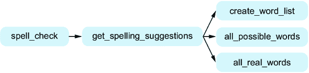
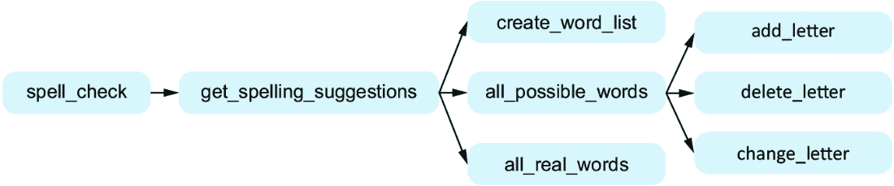
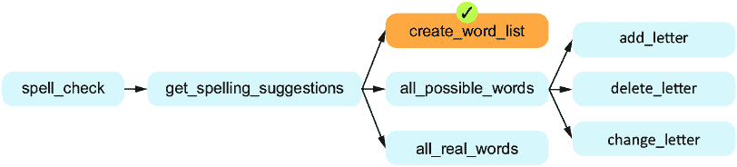
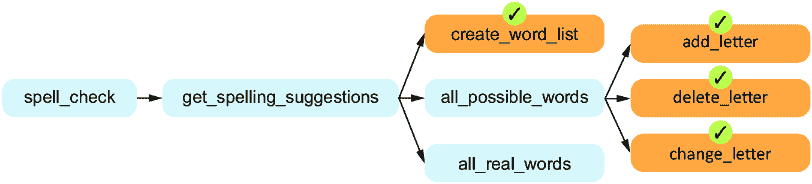
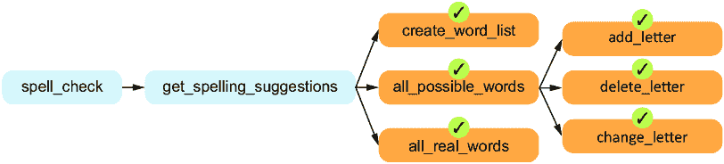
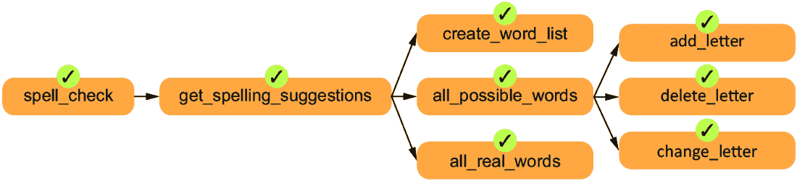

# 第七章：7 问题分解

### 本章内容涵盖

+   理解问题分解以及我们为什么需要这样做

+   使用自顶向下设计来进行问题分解并编写程序

+   使用自顶向下设计编写拼写建议程序

在第三章中，我们讨论了为什么不应该让 Copilot 解决大问题。试想一下，如果我们让 Copilot“设计一个双人策略游戏”，会发生什么情况。

在最坏的情况下，Copilot 可能什么有用的事都做不了。我们有时会看到这种情况，Copilot 反复给我们评论，却从不提供真正的代码。

在最佳情况下，我们会得到一个现成的程序，所有决策都已经为我们做出。这个程序可能与我们想要的并不完全匹配。作为程序员的一个强大之处在于定制我们所创建的内容。即使我们不想定制任何东西，如果 Copilot 给出的程序有缺陷，我们该怎么办呢？如果程序来自 Copilot 并且我们不理解它，修复一个大程序将会非常困难。

为了让我们得到一个符合要求的程序，我们需要将小的子问题交给 Copilot，并将这些解决方案组合成我们自己的程序。本章的重点是学习如何将大问题分解成更小的子问题，这对于解决我们想解决的大问题至关重要。

## 7.1 问题分解

问题分解包括从一个可能没有完全指定的大问题开始，并将其分解为子问题，每个子问题都被明确定义并有助于解决我们的整体问题。我们的目标是为每个子问题编写一个函数来解决。对于某些子问题，我们可能能够通过适量的代码来解决，但其他子问题可能仍然太大，无法在合理大小的函数中捕获。（在第三章中，我们提到我们希望保持函数简短——大约 12 到 20 行——这样才能有最佳的机会从 Copilot 获得优质的代码，测试这些代码，并在必要时修复代码中的错误。）如果某个子问题仍然太大，无法在一个函数中实现，那么我们会进一步将该子问题分解成自己的子子问题。希望这些子子问题现在已经足够小，但如果没有，我们会继续分解它们！我们这么做的关键原因是为了管理复杂性。每个函数应该足够简单，以便我们能理解它的目的，并且 Copilot 能够很好地解决它。如果出现问题，我们也不会有太多的代码需要翻找来找到问题。当我们编写极其复杂的代码时，我们很可能会犯错误。Copilot 也是如此！而且，当我们在冗长复杂的代码中出现错误时，问题并不容易找到和修复。问题分解对于高质量代码的重要性无法过分强调。

从一个大问题开始，并将其分解成更小的任务的过程叫做*问题分解*。我们在这里采用的这种方式与软件工程技术中的*自顶向下设计*是同义的。之所以称之为自顶向下设计，是因为我们从想要完成的大任务开始，然后将其分解为更小的任务。完成自顶向下设计后，我们可以在代码中实现这些函数。我们将有一个针对整体问题的函数，它将调用针对每个子问题的函数。每个子问题函数会根据需要进一步调用它们自己的函数，以解决任何子子问题，依此类推。

正如我们在第三章中讨论的那样，我们希望最终得到的函数在我们的整体程序中扮演一个小角色，并且其行为是明确定义的。我们需要这些函数，以便可以调用它们来减少本来会过于复杂的函数的复杂性。为了提高清晰度和易理解性，我们寻求设计具有少量参数并返回少量高效有用信息的函数。

## 7.2 自顶向下设计的小示例

我们很快就会深入探讨一个更真实的自顶向下设计如何工作的例子，但我们首先想用我们之前的一些例子来铺垫。让我们回顾一下我们在第三章中写的一个函数的设计：`get_strong_password`。这个函数会反复提示用户输入密码，直到他们输入一个强密码为止。不要去回头看那段代码——我们希望从头开始。

假设我们想用自顶向下设计来解决这个任务。如果这是一个小而明确的任务，我们可以直接实现为一个单一的函数。然而，对于这个任务，我们确实看到有一个子任务；即，什么是强密码？关于强密码有什么规则？对我们来说，这听起来像是一个可以从这个函数中拆分出来的子任务，从而简化它。事实上，在第三章当我们写这个函数时，我们确实调用了我们之前写的`is_strong_password`函数，该函数负责判断一个密码是否强大。

我们可以如图 7.1 所示描绘这种自顶向下的设计。为了便于展示本章后面会变得很大的图形，我们将始终从左到右展示设计，而不是从上到下，但相同的基本原理依然适用。


##### 图 7.1 `get_strong_password`函数的函数图。`get_strong_password`调用`is_strong_password`。

这张图表明我们的目标是让`get_strong_password`调用`is_strong_password`来完成它的一部分工作。

现在，回到我们的第二个示例，回想一下第三章，我们也写了一个`best_word`函数，它接受一个单词列表作为参数，并返回得分最高的单词。同样，别回去看那段代码——我们想在这里重新想一想它的实现。让我们思考一下这个任务的代码可能是什么样子的。它可能会使用一个循环来考虑每个单词，在这个循环中，它需要跟踪到目前为止我们看到的最好单词。对于每个单词，我们需要通过加总每个字母的分数来计算它的得分。记住，*a*值 1 分，*b*值 3 分，*c*值 3 分，*d*值 2 分，*e*值 1 分，依此类推。

哇，慢点！我们真的在深入探讨这个“每个字母值多少分”的问题。这听起来像是一个子任务。如果我们有一个函数，可以告诉我们每个单词值多少分，那么在`best_word`函数中就不需要担心这个分数问题了。在第三章中，我们写了一个叫`num_points`的函数，正好完成这个子任务：接受一个单词作为参数并返回它的总得分。我们可以从`best_word`中调用`num_points`，如图 7.2 所示。这样，`best_word`的任务就变得更容易了。


##### 图 7.2 `best_word`的函数图

在第三章中，我们恰好是从子任务写到任务，从叶子函数写到父函数。本章我们会继续这样做，但我们会先进行自顶向下的设计，以弄清楚我们需要哪些函数。

我们刚才谈到的这两个来自第三章的示例比较小，实际上你可能能通过一个函数快速写出它们的代码。但对于更大的示例，问题分解是唯一能控制复杂度的办法。

接下来我们将深入探讨一个更大的自顶向下设计示例。我们希望你从这一章中学到的关键技能是如何将一个大问题拆解成更小的子问题。我们鼓励你多次阅读接下来的示例。第一次阅读时，目标是从高层次理解各个部分如何结合起来解决整体问题。第二次阅读时，可以更深入地了解每个函数如何单独工作。

## 7.3 拼写建议

在本章剩下的部分，我们将从头到尾使用自顶向下的设计解决一个问题。我们希望你在自己使用这种方法解决问题时能够成功，所以你会在本书的其余部分看到自顶向下设计的身影。

哎呀——我们这里有个拼写错误吗？*Sucessful*？应该是*successful*。英语单词有时真的很难拼写！你可能已经遇到过许多这样的单词。是*thorough*还是*thourough*？是*acceptable*还是*acceptible*？是*receive*还是*recieve*？我们要编写一个程序，接受一个可能拼错的单词，并提供可能的修正建议。这是一个基本的单词拼写检查程序！

我们该如何提出这些可能的修正建议呢？好吧，让我们看看刚才提供的单词对，并讨论它们所示范的错误类型。

我们在*sucessful*这个单词中的错误是漏掉了一个字母——我们需要在其中添加一个*c*，才能得到正确的单词*successful*。因此，通常来说，考虑向拼错的单词中添加字母似乎是一个好主意，因为这可能正是修正它所需要的。我们将考虑在任何可能的位置添加任何可能的字母，而不仅仅是重复已有的字母。这将帮助我们修正诸如*acknowlege*（缺少*d*）这样的拼写错误。

还有其他类型的错误我们也需要考虑。例如，*thourough*中的错误不是缺少一个字母，而是我们多了一个字母——我们需要删除第一个*u*，变成*thorough*。因此，我们将考虑从拼错的单词中删除任何单个字母，看看是否能修正它。

我们还能修正什么其他的错误呢？比如那个拼错的单词*acceptible*。那是一种新的错误类型：没有缺失字母，也没有多余的字母，但有一个字母需要改为另一个字母。也就是说，如果我们将*i*改为*a*，就能得到正确拼写的单词*acceptable*。为此，我们可以尝试将每个字母替换为字母表中的另一个字母，看看是否能修正拼写错误。

除了我们刚才提到的三种方法，还有很多修正拼写错误的方式。但是我们在这里停下来，因为我们认为修正这三种错误已经足够展示自顶向下设计的目的。这意味着我们的程序将无法修正拼错的单词*recieve*为*receive*，因为我们不会修正两个字母顺序错误的问题。我们也无法修正拼错的单词*camoflague*为 camouflage，因为我们只会修正一个拼写错误（*camoflague*有两个不同的错误，一个字母缺失*u*，另一个字母多了*u*）。当你完成这一章后，如果你希望深入学习，我们鼓励你继续改进你的程序，了解更多关于修正拼写错误的方法。

## 7.4 使用自顶向下设计进行拼写建议

我们的任务是“编写一个程序，接受一个可能拼写错误的单词，并提供可能的纠正建议。”这是一个很大的任务，我们肯定不希望将其塞入一个单一的函数中。

许多程序——无论是分析数据、提供拼写建议，还是猜测未知文本的作者——都有三个不同的任务要执行。首先是输入任务：我们需要获取程序运行所需的数据。其次是处理任务，程序对数据执行其应做的操作。现在，处理数据是好事，但如果用户不知道程序通过处理得出的结果，那它就没什么用。这就是第三步，输出步骤的作用，它是我们与用户沟通的地方。表 7.1 总结了这个过程。

##### 表 7.1 输入、处理数据和输出任务的总结

| 阶段 | 角色 | 拼写建议示例 |
| --- | --- | --- |
| 输入 | 获取函数所需的输入信息。 | 提供拼写错误的单词*sucessful*和一组正确拼写的单词。 |
| 处理数据 | 对这些数据执行函数指定的操作。 | 考虑对该单词进行更改，可能会得到正确拼写的单词，例如，在*sucessful*的*su*后面或前面添加字母*c*，将得到正确的单词*successful*。许多其他错误单词（例如，通过在*u*前添加字母*c*而得到的*scucessful*）也可能被尝试，但结果中应仅包含真实单词。 |
| 输出 | 返回数据处理的结果。 | 返回建议“successful”。 |

你可以在第二章的数据处理示例中看到这个输入-处理-输出模型的应用。我们需要从 CSV 文件中读取数据（那是输入步骤），确定每个四分卫的传球码数（那是处理步骤），然后输出四分卫及其传球码数（那是输出步骤）。

我们可以用类似的方式来思考我们的拼写建议问题。这里的神奇之处在于，输入-处理-输出模型恰好为我们提供了在自顶向下设计中需要解决的三个子问题。我们所说的意思是（也参见表 7.1 中的示例）：

+   对于输入步骤，我们需要询问用户他们希望获取拼写建议的单词。

+   对于处理步骤，我们需要弄清楚用户单词的所有可能建议。

+   对于输出步骤，我们需要告诉用户在处理步骤中找到的所有拼写建议。

请注意，我们从一个大问题开始解决（总体拼写建议问题），现在我们有了三个更小的问题需要解决。我们的主函数或顶级函数最终会调用从这个问题分解中得到的任何函数。我们将把这个主函数命名为`spell_check`。

通常，但并非总是如此，我们需要为每个识别出的子问题拆分出一个单独的函数。再看看输入步骤。我们需要让用户输入一个单词。虽然我们可以为这个子任务拆分出一个单独的函数，但那样就过头了。为什么？因为 Python 已经有一个内置的函数用来向用户请求输入！这个函数叫做 `input`，我们在第三章的第 3.3.7 节中使用过它，那个时候我们让用户输入密码。

我们需要为输出步骤拆分一个单独的函数吗？再次不需要！输出步骤只是将内容输出给用户。我们知道可以使用 Python 已有的 `print` 函数来做到这一点。同样，拆分出一个函数来处理这个步骤并不会是错误的，如果你自己进行问题分解时可能会这么做。但你会注意到，这个函数会非常简短，几乎只包含对 `print` 的调用——到那时你可能会再次考虑是否真的需要将其拆分为单独的函数。

相比之下，处理步骤将涉及更多的工作。找出所有可能的拼写建议需要做大量的工作！我们需要支持删除一个字母、插入一个字母、将一个字母更改为另一个字母等等，这些都太复杂，无法全部放在我们的主 `spell_check` 函数中。我们需要为处理步骤单独拆分一个函数。接下来我们就要开始着手处理这个问题。

## 7.5 分解处理子问题

我们需要为实现处理步骤的函数起个名字。我们将其命名为 `get_spelling_suggestions`，因为它将负责返回用户输入的拼写建议。它肯定需要将用户拼写错误的单词作为参数传入，否则就无法访问它！

但在这里稍作停顿：你认为这个函数需要任何额外的参数吗？答案是：需要！以某种方式，这个函数需要知道哪些字符串是真正的英文单词。例如，它必须知道单词 *successful*、*thorough*、*acceptable* 和成千上万的其他英文单词。我们可以通过几种方式来实现这一点：我们可以将一个包含所有真实单词的列表或（Python）字典作为参数传递，或者我们可以将包含所有真实单词的文件名作为参数传递。当你设计函数时，你需要做出类似的决策，专注于函数需要的输入以及完成任务后需要的返回值。

除了拼写错误的单词外，我们还将让函数接受一个参数，传入包含有效单词列表的文件名。这个文件中的每一行包含一个有效单词。在本书的资源中，我们包含了一个名为 wordlist.txt 的示例单词列表文件，供你使用。（我们通过简单的互联网搜索找到了一份免费的词典单词列表。）

我们在这个过程步骤中需要做什么？我们可以考虑四个子任务。这就是更多的问提分解！这些子任务如下：

+   *从单词列表文件中获取单词列表*。单词文件是一个不错的起点，但将单词放在 Python 列表中会更加方便。这样，我们就可以轻松地判断一个字符串是否是有效单词。我们将这个函数命名为`create_word_list`。

+   *从用户的字符串生成所有可能的单词列表*。我们需要删除一个字母、插入一个字母，或者将一个字母更换成另一个字母。这将生成许多字符串，其中一些是实际的单词，而另一些则不是。例如，从字符串`sucessful`中，我们会生成实际单词*successful*，但也会生成`xsuccesful`、`sucxcesful`和`succesfrl`等字符串，这些显然不是实际单词。但没关系。现在我们只是想生成每一个可能的单词，以免错过任何一个。我们将这个函数命名为`all_possible_words`。

+   *使用所有可能单词的列表，生成仅包含实际单词的列表*。这是我们将潜在单词的完整列表筛选为那些实际存在的英语单词的步骤。我们将这个函数命名为`all_real_words`。

+   *返回唯一单词的列表*。为什么是唯一的？我们不希望返回相同的拼写建议两次，尽管可能有两种或更多方法从用户的字符串得出该拼写建议。例如，要修正单词*sucessful*，有两种方法：我们可以在已经存在的*c*前面再加一个*c*，或者我们可以在*e*前面加上*c*。这两种方法都会得到正确拼写的单词*successful*，但我们只希望保留一个。

如果我们将最终的子任务——获取唯一单词的列表——分解成一个独立的函数，我们可能会将其命名为`unique_words`或`only_unique_words`。虽然我们可以将这个子任务分解开，你也完全有理由这么做，但我们决定将其保留在`get_spelling_suggestions`函数中。原因是，在 Python 中，从列表中去除重复项实际上只需要一行代码。为了方便起见，我们现在告诉你这一点，但如果你自己进行自顶向下设计，这也是一个完全合理的子任务。

##### 多种方式分解问题

进行自顶向下设计没有唯一正确的方式，问题分解成子问题也没有唯一正确的方式。例如，你可能会对我们首先生成所有可能的单词（包括那些并非真正英语单词的伪单词）并在此基础上筛选出实际的英语单词感到惊讶。为什么不先检查每个可能的单词，只有在它是真正的单词时才将其添加到列表中呢？我们当然也可以这样做！如果你有这种替代的分解方式，或者我们激发了你的好奇心，我们鼓励你在完成本章内容后，自己尝试这种替代设计。

尝试自上而下的设计，然后在设计无法奏效时放弃，这并不丢人。那么，设计无法奏效是什么意思呢？嗯，也许你发现很难将大型函数拆分为明确的子问题。或者，也许你得到了几十个小函数，开始担心这些函数是否过于具体，不能解决一般问题。或者，也许你需要传递很多参数，其中一些参数可能只是为了继续传递下去，直到最终一个函数需要它们。或者，也许你只是想试试另一种自上而下的设计，看看效果如何！

我们鼓励在设计阶段进行实验，在最终确定代码的设计之前尝试不同的函数和不同的输入/输出。例如，之前我们讨论过`get_spelling_suggestions`函数应该接受一个包含真实单词的文件名，还是一个包含真实单词的列表（或字典）。在设计阶段，考虑这两种选择都是值得的。

这就剩下我们需要解决的三个子任务了。我们将在稍后对这些进行自上而下设计。但首先，让我们看看目前的进展如何（见图 7.3）。



##### 图 7.3 函数图，展示了`get_spelling_suggestions`的三个子任务

### 7.5.1 从词汇表文件中获取单词列表

这个任务的函数是`create_word_list`。它将接受一个参数，即词汇表文件的名称，并返回该文件中的单词列表。

我们是否需要对这个函数进行进一步的自上而下设计？让我们假设我们认为答案是肯定的。我们可以拆分出哪些子任务？我们可以考虑打开文件、读取内容和关闭文件的任务。但是，正如我们在第五章第 5.1.4 节学到的，打开文件只是通过调用 Python 的`open`函数来完成的。同样，关闭文件也是通过调用 Python 的`close`函数来完成的。那么，如何从文件中读取单词呢？这听起来和第五章第 5.1.4 节中读取 CSV 文件的行没有太大区别。所以我们认为没有必要进一步拆分这个函数的子任务。

### 7.5.2 生成所有可能单词的列表

这个任务的函数是`all_possible_words`，它将接受一个参数，给出我们希望提供拼写建议的字符串。它将返回所有可能的单词列表，这些单词可以通过添加一个字母、删除一个字母或更改一个字母得到。

添加一个字母、删除一个字母和更改一个字母是三种不同类型的任务。而且，它们看起来并不是特别简单的任务：它们需要在用户的字符串中的字母上进行某种循环。啊哈！看来我们需要对这个进行进一步的自上而下设计。特别地，我们将从这个函数中拆分出三个子任务：

+   `add_letter`—此函数将接受一个字符串参数，并返回一个通过在单词中任意位置添加一个字母可以得到的所有字符串列表。

+   `delete_letter`—此函数将接受一个字符串参数，并返回一个通过删除一个字母可以得到的所有字符串列表。

+   `change_letter`—此函数将接受一个字符串参数，并返回一个通过更改一个字母可以得到的所有字符串列表。

表 7.2 提供了我们期望每个函数对于两个不同输入字符串的返回结果。对于 `add_letter` 和 `change_letter`，返回了大量字符串，因为它们会考虑在输入字符串中的每个位置添加或更改每个字母。

##### 表 7.2 `add_letter`、`delete_letter` 和 `change_letter` 函数示例

| 输入字符串 | `add_letter` 返回的字符串 | `delete_letter` 返回的字符串 | `change_letter` 返回的字符串 |
| --- | --- | --- | --- |
| `cu`  | `acu, bcu, ccu, …, zcu cau, cbu, ccu, …, czu cua, cub, cuc, …, cuz`  | `u, c`  | `au, bu, du, …, zu, ca, cb, cc, …, cz`  |
| `cad`  | `acad, bcad, ccad, …, zcad caad, cbad, ccad, …, czad caad, cabd, cacd, …, cazd cada, cadb, cadc, …, cadz`  | `ad, cd, ca`  | `aad, bad, dad, …, za cbd, ccd, cdd, …, czd caa, cab, cac, …, caz`  |

像往常一样，重要的是要思考是否需要将这三个函数进一步拆分为子任务。然而，考虑到我们期望看到的模式只是对字母的循环遍历，我们会觉得可以继续推进，如果假设不正确，我们可以重新审视自顶向下的设计。现在我们可以告诉你，我们在没有进一步拆分的情况下也能做到。

##### 知道何时停止将任务划分为子任务

通常，知道何时停止将任务分解为更小的子任务，更像是一种艺术而非科学。设计程序时，需要通过实践来获得直觉，判断何时停止。许多经验丰富的开发人员通常会为每个子任务停下来，考虑编程的复杂性，并在脑海中勾画出函数的步骤。如果解决方案不直接，他们通常会选择将其分解为更多步骤。但我们不期望你现在就能做到这一点。一些公司发布了指导方针，通过建议函数行数的限制（例如，不超过 12 行）来鼓励简化函数，但许多人认为限制应该更多地基于复杂性，而不是长度，尽管长度和复杂性是相关的。

当你刚开始时，一个合适的代理是将每个函数的行数限制在 12 到 20 行之间。如果你后来发现某个函数最终只有一行，它仍然是一个子任务，但可能不需要自己的函数。（有时，如果一个短函数被不同的函数多次调用，或者有助于简化调用函数，保留它也是可以的。）

在刚开始练习时，犯错是正常的；我们肯定也犯过。有时一个子任务看起来只需要实现一个简单的函数，结果却比预期的要困难得多。在这种情况下，你知道只需要再将它拆分得更小。同样，我们也遇到过一些函数只有一行，如果它们经常被使用或者让调用函数更易理解，我们就将那一行保持为一个函数。

### 7.5.3 生成所有真实单词的列表

这个任务的函数是`all_real_words`。它将接受两个参数：真实单词的列表和所有可能单词的列表。它将返回一个仅包含真实单词的列表，从所有可能单词的列表中筛选出来。这个函数的代码将遍历所有可能的单词列表，检查每个单词是否出现在真实单词的列表中。由于这是一个小而明确的任务，不会生成很多代码，所以我们可以直接将这个函数保留，而不需要进一步拆分。

## 7.6 自顶向下设计总结

我们已经完成了自顶向下设计的过程。你可以在图 7.4 中看到我们的最终设计。



##### 图 7.4 添加了`all_possible_words`三个子任务的函数图

我们不要只看到树木，忽略了森林。如果我们放眼全局，我们所做的是将最初的一个大问题拆解为几个更小的问题，每个问题我们都会实现为一个函数。最初的`spell_check`问题可能让人觉得很有压力，但没关系，因为我们将它拆解为一个主要子任务`get_spelling_suggestions`。`get_spelling_suggestions`函数本身仍然是一个大问题，但我们通过相同的过程解决了它：我们将其拆解为三个子任务。两个子任务，`create_word_list`和`all_real_words`，看起来可以用一个函数来解决，但另一个任务，`all_possible_words`，则足够复杂，我们觉得需要三个额外的子任务（`add_letter`、`delete_letter`和`change_letter`）。我们希望你从中学到的一个重要点是，我们在每一步都使用了相同的分解问题的方法，把最初看起来令人生畏的任务，变成了一系列可以解决的小任务，而这些小任务将变成函数。

我们的下一步是从设计转向实现。现在我们知道了解决问题所需的函数。是时候写代码了！

## 7.7 实现我们的函数

当你进行自上而下设计时，正如我们刚刚做的那样，你从整体问题开始，并将其拆解成子问题。这就是为什么我们从`spell_check`（我们的整体问题）开始，最终到了像`add_letter`这样的函数，它不需要进一步拆分。但当我们要求 Copilot 实现这些函数时，我们并不会按照相同的顺序工作。相反，我们将按*相反*的顺序工作，先做最小的子问题，然后再做依赖于这些子问题的函数。这对应于从图 7.4 中的右到左移动，从叶子函数开始，继续到非叶子函数。

我们以相反的顺序实现函数，这样当我们想实现更大的函数时，Copilot 已经知道了较小的函数。这样，Copilot 就更有可能按照我们的预期调用子任务函数。

我们想在这里专注于问题分解，并且已朝着这个目标做出了一些决策。首先，虽然我们会在文档字符串中包含一些测试，但我们不会像第六章那样进行完整的测试。我们鼓励你使用 doctest 运行我们提供的测试，并添加你自己的测试，以进一步验证代码。其次，我们没有过多关注提示工程，而是专注于那些产生良好结果的提示。在下一章，我们将专注于调试，那时我们会回到提示工程的内容。第三，我们不专注于全面阅读和理解代码。话虽如此，我们已包括一些注释来解释代码的作用和工作原理。

### 7.7.1 create_word_list

我们将从我们的`create_word_list`函数开始。和第三章一样，我们先写函数头（`def` 行）和文档字符串，然后 Copilot 会填写代码。这就是我们让 Copilot 为本章所有函数编写代码的方式。

我们已经知道我们的`create_word_list`函数应该做什么：从单词列表文件中读取单词，并将它们作为一个 Python 单词列表返回。我们小心地在文档字符串中写下我们想要的内容，如列表 7.1 所示。

##### 列表 7.1 读取单词列表的函数

```py
def create_word_list(filename):   #1
 **'''** #2
 **filename is the name of a file that has one English word per line.**

 **Return a list of the words in the file.**
    '''
    file = open(filename)        #3
    words = []
    for line in file:              #4
        words.append(line.strip())    #5
    file.close()
    return words
```

#1 我们自己写的标题

#2 我们自己写的文档字符串

#3 打开文件

#4 遍历文件的每一行

#5 将每个单词添加到我们的单词列表中

我们使用了一个描述性的参数名 `filename`，它清楚地表明了参数的用途。我们也小心地在文档字符串中使用了这个参数名。我们的文档字符串还明确表示我们想要*返回*列表（而不是，例如，打印它）。

我们在这个函数的文档字符串中没有包含测试，因为我们不想分散实现每个函数的整体目标。但如果你想的话，你知道怎么做！具体来说，我们在第六章中做了这个，我们创建了一个小文件用于测试目的。在这里，你可以创建一个每行一个单词的小文件，但只包含少数几个英语单词，然后测试我们从文件中读取的单词列表是否与我们放入文件中的单词相匹配。我们已经完成了`create_word_list`函数，因此我们可以将其标记为完成，如图 7.5 所示。



##### 图 7.5 完整的函数图，`create_word_list`已完成

为了节省空间，我们不会在每次实现完一个函数后展示更新的图示，但我们会偶尔展示它。

### 7.7.2 add_letter

现在我们将开始处理`all_possible_words`所需的函数，从`add_letter`开始。`add_letter`函数以一个字符串作为参数，并返回通过向该字符串添加一个字母可以形成的所有可能单词列表。让我们简要地考虑一下使用这个函数时预期的结果，通过一个快速的例子。如果我们给函数传递字符串`cu`（如表 7.2 所示），它将会生成一个单词列表，其中每个字母都添加到每个可能的位置。这意味着它应该包括在`cu`之前添加`a`得到`acu`，在`cu`之前添加`b`得到`bcu`，以此类推，直到添加`z`得到`zcu`。该函数还应该包括介于`c`和`u`之间的每个字母，形成`cau`、`cbu`、`ccu`...、`czu`。最后（因为有三个可以添加字母的位置），我们预期该函数将添加`cu`后面的每个可能字母，形成`cua`、`cub`、`cuc`...、`cuz`。我们的提示词和由 Copilot 生成的代码如列表 7.2 所示。

##### 列表 7.2 添加任何可能字母的函数

```py
def add_letter(word):
 '''
 word is a string with at least one letter.

 Return a list of all the strings that can be obtained by
 adding one letter to word.
 '''
    words = []
    for i in range(len(word) + 1):         #1
        for c in 'abcdefghijklmnopqrstuvwxyz':  #2
            new_word = word[:i] + c + word[i:]    #3
            words.append(new_word)       #4
    return words
```

#1 遍历每个索引，从 0 到刚好超过最后一个字符

#2 遍历每个小写字母

#3 通过将字符 c 放置在索引 i 处来形成一个新单词

#4 将这个新单词添加到我们的单词列表中

这里的代码相当微妙，需要仔细测试。例如，请注意外层循环使用的是`len(word) + 1`，而不是更标准的`len(word)`。如果没有`+ 1`，我们将会在单词字符串的每个现有索引处添加字符。但这样实际上会忽略掉我们还希望能够在现有字母之后添加字母的事实！`+ 1`增加了一个额外的迭代，我们可以在字符串的末尾添加一个字符。

对于外层循环的每个索引，我们在内层循环中考虑每个可能的小写字母。`new_word = word[:i] + c + word[i:]`这行代码使用了字符串切片技术，这是一种通过两个索引从字符串中提取字母的技术，用于将当前内层循环的字符添加到当前外层循环的位置。

虽然在本章中我们不会花太多时间在测试上，因为重点是问题分解，但你会希望通过给它一个拼写错误的单词（例如*cu*）来测试此函数，然后打印返回的单词并确保它包括如`acu`（添加到开头）、`cau`（添加到中间）和`cua`（添加到末尾）等字符串，以及可能的真实单词，如*cup*和*cut*。

请注意，我们不希望在文档字符串中包括确切的测试，因为这个函数返回的列表非常庞大！例如，尝试在 Python 提示符下键入：

```py
>>> add_letter('cu')
```

你会得到一个包含 78 个字符串的列表！这只是针对我们小小的`'cu'`字符串。随着参数字符串中字符数量的增加，返回列表中的字符串数量显著增加。

### 7.7.3 delete_letter

与`add_letter`类似，`delete_letter`将一个字符串作为参数并返回一个潜在单词的列表。不同之处在于，`delete_letter`不是添加字母，而是删除字符串中的每个可能字母，从而得到新的潜在单词。让我们思考一下我们期望这个函数执行的操作。如果我们给它字符串“carf”，它应该尝试删除每个字母来生成字符串“arf”（删除“c”）、“crf”（删除“a”）、“caf”（删除“r”）和“car”（删除“f”）。同样，我们为这个函数给了 Copilot 提示，如清单 7.3 所示。

##### 清单 7.3 删除任何字母的函数

```py
def delete_letter(word):
 '''
 word is a string with at least one letter.

 Return a list of all the strings that can be obtained by
 deleting one letter from word.

 >>> delete_letter('carf')
 ['arf', 'crf', 'caf', 'car']
 >>> delete_letter('a')
 ['']
 '''
    words = []
    for i in range(len(word)):        #1
            new_word = word[:i] + word[i + 1:]      #2
            words.append(new_word)     #3
    return words
```

#1 遍历每个索引，从 0 到最后一个字符

#2 通过删除索引 i 处的字符来形成一个新单词

#3 将这个新单词添加到我们的单词列表中

这段代码类似于我们的`add_letter`代码。不同之处在于这次只有一个循环，而不是两个。原因是我们不需要一个内部循环来遍历字母*a*、*b*、*c*、*d*等。因为我们删除的是已经存在于单词中的字母，而不是找出要添加哪个字母。

### 7.7.4 change_letter

现在，是时候处理`all_possible_words`的第三个也是最后一个子任务`change_letter`了！这个函数负责生成通过将字符串中的一个字母替换为其他字母而得到的单词。考虑到我们希望在这里看到的效果，让我们再考虑一下字符串`cu`（如表 7.2 所示）。我们希望这个函数将字母*c*替换为所有可能的字母，以生成字符串`au`、`bu`、`du`……，`zu`，并将字母*u*替换为所有可能的字母，以生成字符串`ca`、`cb`、`cc`……，`cz`。（请注意，我们省略了尝试`cu`，因为它是初始字符串，我们只考虑字母的变化。）请参见清单 7.4，查看我们为此函数提供的提示和 Copilot 的代码。

##### 清单 7.4 更改任何字母的函数

```py
def change_letter(word):
 '''
 word is a string with at least one letter.

 Return a list of all the strings that can be obtained by
 changing one letter to another letter in word.
 '''
    words = []
    for i in range(len(word)):          #1
        for c in 'abcdefghijklmnopqrstuvwxyz':       #2
            if c != word[i]:                             #3
                new_word = word[:i] + c + word[i + 1:]    #4
                words.append(new_word)    #5
    return words
```

#1 遍历每个索引，从 0 到最后一个字符

#2 遍历每个小写字母

#3 如果 c 与索引 i 处的字母不同

#4 通过将索引 i 处的字符替换为字符 c 来形成一个新单词

#5 将这个新单词添加到我们的单词列表中

这段代码与我们的`add_letter`代码非常相似！主要区别在于我们使用字符串切片来改变一个已有的字符，而不是添加一个新字符。

到目前为止，我们已经完成了实现`all_possible_words`所需的三个函数。查看图 7.6，我们标出了已取得的重要进展！接下来，我们将处理`all_possible_words`。



##### 图 7.6 完整的函数图，其中`all_possible_words`的辅助函数已完成

### 7.7.5 all_possible_words

我们现在能够实现`all_possible_words`的原因是，我们已经实现了`all_possible_words`所需的三个子任务函数。当我们要求 Copilot 编写这段代码时，我们期待看到`add_letter`、`delete_letter`和`change_letter`的调用。查看列表 7.5，你会看到 Copilot 正是这样做的，并且是根据我们提供的提示。

##### 列表 7.5 生成所有可能单词的函数

```py
def all_possible_words(word):
 '''
 word is a string with at least one letter.

 Return a list of all the strings that can be obtained by
 adding one letter to word, deleting one letter from word,
 or changing one letter in word.
 '''
    return add_letter(word) + delete_letter(word) \    #1
             + change_letter(word)    #2
```

#1 调用辅助函数添加一个字母并删除一个字母

#2 调用辅助函数更改一个字母

生成所有可能的单词可不简单。然而，我们通过一行 Python 代码就成功实现了！它仅调用了三个辅助函数，仅此而已。这正是我们进行自顶向下设计的原因：通过将大部分复杂性转移到辅助函数中，使得复杂的函数变得更容易实现。

### 7.7.6 all_real_words

我们离实现`get_spelling_suggestions`已经不远了，但还没有完全完成，因为我们首先需要实现它的子任务函数`all_real_words`。`all_real_words`函数接受两个参数。第一个参数是英文单词列表（来自英文单词列表文件）。第二个参数是可能的单词列表（来自`all_possible_words`）。该函数返回的是那些在`possible_words`中且是实际单词的单词列表。让我们开始吧！

##### 列表 7.6 生成所有真实单词的函数

```py
def all_real_words(word_list, possible_words):
 '''
 word_list is a list of English words.
 possible_words is a list of possible words.

 Return a list of words from possible_words that are in word_list.
 >>> english_words = ['scarf', 'cat', 'card', 'cafe']
 >>> possible_words = ['carfe', 'card', 'cat', 'cafe']
 >>> all_real_words(english_words, possible_words)
 ['card', 'cat', 'cafe']
 '''
    real_words = []
    for word in possible_words:       #1
        if word in word_list:           #2
            real_words.append(word)    #3
    return real_words
```

#1 遍历可能的单词

#2 这个词是一个真实单词吗？

#3 是的：将这个单词添加到我们将返回的真实单词列表中

文档字符串中的测试是这个函数如何工作的一个好例子。它使用`english_words`列表作为第一个参数，`possible_words`列表作为第二个参数。该函数将返回那些既在`possible_words`中又在`english_words`中的单词。我们使用这个非常小的测试案例，而不是使用成千上万的英文单词，是因为这样更容易手动确定正确的返回值！

让我们看看图 7.7 中我们的进展如何。我们已经接近完成了——只差两个函数！



##### 图 7.7 完整的函数图，其中`all_possible_words`和`all_real_words`已完成

### 7.7.7 get_spelling_suggestions

我们已经实现了`create_word_list`、`all_possible_words`和`all_real_words`，这三个子任务函数正是`get_spelling_suggestions`所需要的。那就意味着，是时候实现`get_spelling_suggestions`了！

这个函数接受两个参数：一个包含真实单词（每行一个单词）文件的名称和我们希望提供拼写建议的字符串。它返回唯一拼写建议的列表。像往常一样，在检查 Copilot 代码中的非叶函数时，你需要确认它正在调用你预期的辅助函数，正如在列表 7.7 中所示。在继续之前，确保它调用了所有应该调用的辅助函数。

##### 列表 7.7 返回拼写建议的函数

```py
def get_spelling_suggestions(word_file, possible_word):
 '''
 word_file is the name of a file that has one English word per line.
 possible_word is a string that may or may not be a real word.

 Return the list of all possible unique corrections 
 for possible_word.
 '''
    word_list = create_word_list(word_file)        #1
    possible_words = all_possible_words(possible_word)        #2
    real_words = all_real_words(word_list, possible_words)    #3
    return list(set(real_words))    #4
```

#1 获取英语单词列表

#2 获取可能的单词列表

#3 确定哪些可能的单词是拼写建议

#4 返回唯一的拼写建议列表

最后一行很棘手。显然，它确保我们只返回唯一的单词——但怎么做到呢？让我们请 Copilot 来解释一下！以下是我们在使用`/explain`命令向 Copilot 请求时得到的解释：

Copilot 这行 Python 代码执行了两个操作：

1.  `set(real_words)`：这段代码是从`real_words`列表创建一个集合。在 Python 中，集合是一个无序的唯一元素集合。所以，这个操作会去除`real_words`列表中的任何重复元素。

1.  `list(set(real_words))`：这段代码是将集合转换回列表。结果是一个所有元素都是唯一的列表。

总结一下，这行代码的作用是从`real_words`列表中去除任何重复的单词。

### 7.7.8 拼写检查

我们已经到了最后一个函数`spell_check`！它接受一个参数：一个表示单词列表文件名的字符串。它要求用户输入一个字符串，然后向用户展示该字符串的所有拼写更正。

##### 列表 7.8 我们的主函数，和用户交互

```py
def spell_check(word_file):
 '''
 word_file is the name of a file that has one English word per line.
 Ask user for a word.
 Print all possible corrections for the word, one per line.
 '''
    word = input('Enter a word: ')                          #1
    suggestions = get_spelling_suggestions(word_file, word)    #2
    for suggestion in suggestions:     #3
        print(suggestion)    #4
```

#1 让用户输入一个字符串

#2 为用户获取拼写建议

#3 遍历拼写建议

#4 将每个拼写建议单独打印在一行上

查阅图 7.8，确认我们确实已经实现了所有的函数！



##### 图 7.8 完整的函数图，所有函数都已完成！

你需要在 Python 程序的底部添加一行代码，来实际调用这个函数。否则，你的程序什么也不做，因为没有函数被调用！所以，在底部添加这一行：

```py
spell_check('wordlist.txt')
```

现在，假设你的目录中有`wordlist.txt`文件以及 Python 程序，你可以运行它！它会让你输入一个单词。试着输入拼写错误的单词*sucessful*（就是那个一开始出问题的单词！），然后你应该会看到程序提供拼写建议*successful*，像这样：

```py
Enter a word: sucessful
successful
```

也尝试其他拼写错误的词，例如*thourough*和*acceptible*。目前为止，程序只给出了一个拼写建议，因为只有一个真正的单词与我们尝试的词只有一次编辑的差距。我们鼓励你尝试输入*carf*，看看程序能否提供多个拼写建议。

恭喜你！你已经完成了第一个现实世界的自上而下设计。你的程序为一个单词提供拼写建议，就像拼写检查器一样。通过进行一些前期设计工作，将原始问题分解成更小的子问题，我们使得问题的实现变得更加容易。

许多计算机科学家认为问题分解是编写优秀软件所需的*最*关键技能[1]。我们在本章中看到了问题分解的价值：通过将一个大问题分解成更小的步骤，直到每个步骤都更容易解决，它使得一个大问题变得可解。我们在本章中通过自上而下的设计（从大任务开始，将其分解成小任务）来实践这一技能。使用像 Copilot 和 ChatGPT 这样的工具时，这项技能仍然至关重要，因为它们在解决小而明确的问题时表现更好，而不是解决大问题。如本章开头所提到的，问题分解更多的是一种艺术而非科学，需要通过实践才能掌握。我们将在接下来的章节中做更多问题分解的练习，帮助你更直观地理解如何自己去做。

## 7.8 练习

1.  使用之前讨论过的`get_strong_password`和`best_word`的示例，采用自上而下的设计方法来解决一个新问题。假设我们要编写一个名为`find_highest_scoring_word`的函数，它接受一个包含多个句子的列表作为参数，并返回所有句子中得分最高的单词。每个单词的得分计算方法与`best_word`函数中的计算方法相同：

    1.  确定解决此问题所需的子任务。你会设计哪些单独的函数，将任务分解成更小、更易管理的部分？

    1.  绘制一个类似于图 7.1 和 7.2 的函数图，描述这些函数如何相互调用来解决整体问题。

1.  我们谈到了有时任务足够简单，不需要将其分解成更小的任务。对于以下任务，决定是否将其分解成更小的子任务。如果是，请列出子任务并解释为什么。如果不是，请解释为什么任务足够简单，能够保持为单一函数。

    1.  读取一个文件并打印其内容

    1.  根据学生成绩列表计算班级的平均分

    1.  在一个数字列表中查找最大值

    1.  处理在线商店订单，包括验证订单、计算总价、应用折扣和生成发票

1.  为什么我们选择将`create_word_list`函数作为一个单独的函数来创建？这个任务可以作为一个更大函数的一部分吗？请解释你的理由。

1.  假设你需要更改拼写检查器的工作方式。具体来说，你想修改`add_letter`函数，排除某些字母（例如，*q*、*x*、*z*）不被添加。你将如何修改我们写的程序？

1.  以下函数处理一个订单列表，计算含税总价，若适用则应用折扣，并生成汇总报告。

```py
def process_orders(orders):
    total_price = 0
    for order in orders:
        price = order['price']
        quantity = order['quantity']
        total_price += price * quantity
    tax = total_price * 0.08
    total_price_with_tax = total_price + tax
    report = f"Total price: ${total_price:.2f}\n"
    report += f"Tax: ${tax:.2f}\n"
    if total_price_with_tax > 100:
        discount = total_price_with_tax * 0.1
        total_price_with_tax -= discount
        report += f"Discount: ${discount:.2f}\n"
    report += f"Total price with tax: ${total_price_with_tax:.2f}\n"
    print(report)

a = {'price': 20, 'quantity': 5}
lst = [a]
process_orders(lst)
```

通过将`process_orders`函数重构（重新设计），将其分解为更小的子问题。将每个子问题实现为一个单独的函数，并确保整体行为保持不变。

1.  6\. 在这个练习中，给定了一个已经分解成两个函数的代码片段：一个主函数和一个辅助函数。当我们使用以下代码中的测试用例 2 调用该函数时，会出现`ZeroDivisionError`。你的任务是根据提供的错误信息识别并修复这个错误。

```py
def calculate_average(numbers):
    total = sum(numbers)
    count = len(numbers)
    return total / count

def process_numbers(data):
    valid_numbers = [n for n in data if isinstance(n, int)]
    average = calculate_average(valid_numbers)
    print(f"The average of the valid numbers is: {average}")

# Test Case 1
data = [10, 20, 'a', 30, 'b', 40]
process_numbers(data)

# Test Case 2
data = ['a', 'b']
process_numbers(data)
```

## 总结

+   在我们有效实现一个大的编程问题之前，需要将其分解为更小的子问题。这被称为问题分解。

+   自顶向下设计是一种将问题分解为小的子任务函数的系统化技术。

+   在自顶向下设计中，我们寻求能够解决明确任务的小函数，这些函数可以被一个或多个其他函数使用。

+   当我们准备实现从自顶向下设计中产生的函数时，我们是从自底向上实现的；也就是说，我们首先实现叶子函数，然后是依赖于这些叶子函数的函数，依此类推，直到我们实现最顶层的函数。
