# 第八章：8 调试并更好地理解你的代码

### 本章内容包括

+   确定 bug 的来源

+   使用 Copilot 技巧修复错误

+   使用 Copilot 调试代码

+   使用 VS Code 调试器查看代码的运行情况

每个程序员的职业生涯中，都会遇到代码无法按预期运行的情况。这可能已经发生在你身上了，放心，这是学习编程过程中很正常的一部分。我们该如何修复代码呢？有时，仅仅改变提示语或更好地分解问题（就像你在之前的章节中学到的那样）就足以解决问题。但当你无法让 Copilot 给你不同或更好的代码，或者无法弄清楚为何你得到的代码无法正常工作时该怎么办呢？

本章有两个目的。主要目标是学习如何找到代码中的错误（称为 bug）并修复它们。为了找到这些 bugs，你需要实现第二个目标，即在运行代码时更深入地理解你的代码是如何工作的。

好消息是，代码中出现错误对程序员来说是再常见不过的事情，因此编程环境（如 Visual Studio Code，VS Code）提供了帮助我们发现问题的工具。在本章中，我们将学习如何使用这个叫做调试器的工具。

就像在之前几章中我们从小例子开始一样，我们将通过一些小例子来学习如何找到和修复错误的概念，然后通过深入一个更大的示例来更真实地展示这个过程，这个示例类似于你未来可能编写的代码。

## 8.1 错误（bug）是如何产生的？

首先是一个简短的术语课程。几十年前，计算机使用继电器或真空管，而不是晶体管。故事是这样的：Grace Hopper 博士在编程早期的计算机时，遇到了一次由继电器中的一只真实的虫子（蛾）引起的错误。今天，我们使用“bug”这个词来指代程序中的错误，尽管我们现在不再处理真实的虫子了。现在，bug 是由程序员的错误引起的；当我们调试代码时，我们是在去除这些 bugs。（Python 本身的实现或者计算机硬件中也可能存在 bugs，但它们非常罕见，所以我们可以假设代码中的错误是由于代码本身的原因。）

如果程序员真心想解决问题，他们是不会故意在代码中引入 bug 的。那么，为什么会出现 bug 呢？软件工程师和 Copilot 也会犯错误。你可能会问，是什么样的错误呢？有两种主要的 bug 类别：

+   ***语法错误*——当代码没有遵循 Python 语法要求时，就会发生这些错误。例如，在 `for` 循环的第一行末尾忘记写 `:` 就是一个语法错误。当你运行 Python 时，由于它试图根据你的程序描述生成机器代码，程序会遇到错误，不知道该怎么做，并给出错误提示。有时，这些错误信息比其他错误信息更易读。当人们以传统方式学习编程时，没有 Copilot，这些错误非常常见。学习所有 Python 语法规则并将其养成习惯需要一些时间。即使是我们两个，尽管编写了几十年的代码，有时仍然会写出带有语法错误的代码。好消息是，使用 Copilot 编写代码几乎完全消除了这个问题！坏消息是，在两种类型的 bug 中，语法错误是最容易发现和修复的。**

***   ***逻辑错误——*这些错误发生在程序的逻辑上有问题时。例如，也许代码的目的是统计“Dan”这个词在单词列表中出现的次数，但代码实际上统计的是单词列表中包含“dan”（不区分大小写）这个子串的单词的数量。这段代码在两个方面做错了：它会将 *dan* 和 *DAN* 这样的词视为匹配项，尽管我们并不希望这些匹配；而且，它会把 *dan* 当作一个单词的一部分，而不是完整的单词。也就是说，它会把 *Daniel*、*danger* 和 *dan* 这样的词计数进来，尽管我们并不希望将这些计入！代码的某个地方出了问题，我们需要找出问题所在并理解原因。通常，找到逻辑错误是最困难的部分。一旦我们知道了错误的所在，我们需要修复它，修复这些 bug 可能需要更改一个字符，也可能需要完全重写代码。逻辑错误可能发生在提示描述不清晰，或者 Copilot 因各种原因生成了错误的代码。****

****## 8.2 如何找到 bug

找到 bug 可能是一个挑战。从根本上来说，不管是你还是 Copilot 编写了代码，你在编写时都认为（或 Copilot “认为”）代码是正确的。这就是为什么同事往往比作者更容易发现代码中的 bug，作者自己反而看不出来，因为是自己编写的代码！

在本书中，bug 对我们来说并不陌生，因为我们已经看到过代码中的错误，我们通过阅读代码和/或测试找出了这些错误。在前几章中，我们通过阅读代码找到了 bug 的源头。在本章中，我们将讨论你在测试时发现的 bug，但无法弄清楚代码为什么出错。通常，你可以通过尝试其他 Copilot 提示、使用新提示修复错误，或者请求 Copilot 为你修复 bug 来绕过弄清楚代码出错的过程，但根据我们的经验，这些方法并不总是有效。那么，我们需要更多的工具来帮助我们找出代码中的错误位置。

### 8.2.1 使用 `print` 语句了解代码行为

从根本上讲，逻辑错误意味着作者认为代码会做的事情和代码实际做的事情之间存在不匹配。识别这种不匹配的一种常见方法是使用 `print` 语句来了解程序的行为，因为它们能告诉你计算机实际在做什么。一种有用的做法是，在不同的时间点打印变量，以查看这些变量在这些时刻的值。让我们试试我们刚才给出的那个例子，查找单词 *Dan* 在单词列表中的位置。这里是错误的代码。

##### 列表 8.1 计数匹配单词的错误函数

```py
def count_words(words):
    count = 0
    for word in words:
        if "dan" in word.lower():    #1
            count += 1
    return count
```

#1 `lower` 方法将单词转换为全小写字母。

你可能已经看出代码哪里出错了，但让我们假设我们不知道问题出在哪里，正在尝试弄清楚代码出了什么问题。假设我们通过运行以下测试用例发现我们的代码是错误的：

```py
>>> words = ["Dan", "danger", "Leo"]   
>>> count_words(words)
2
```

我们预计得到的答案是 1，但我们得到了 2。值得注意的是，将 *danger* 包含在这个测试用例中帮助我们找到了代码中的错误。问题出在哪里呢？为了弄清楚这一点，我们可以添加 `print` 语句。当你想这样做时，你需要阅读代码，弄清楚应该在哪里放置这些语句。看着这段代码，在函数开始时打印列表可能是个不错的主意，具体取决于我们看到的 bug，但这里的 bug 似乎与计数有关，而不特别是与单词列表有关。我们可以在 `for` 循环的第一行打印每个单词，以便检查代码是否正在处理每个单词。我们可能会在返回 `count` 之前打印它，但我们已经对返回的值有了较好的了解。这些都是合理的想法，有助于你更接近 bug，但这不是我们开始的地方。明确来说，如果我们从这些其他想法开始，也不会错；可能只是要多走几步才能找到 bug。

因为 bug 是将太多单词错误地计数为 *Dan* 单词，所以我们会将 `print` 语句放在 `if` 语句中，正是 `count` 被递增的地方，如以下列表所示。

##### 列表 8.2 查找 bug 的 `print` 语句示例

```py
def count_words(words):
    count = 0
    for word in words:
        if "dan" in word.lower():
            print(word,"is being counted")    #1
            count += 1
    return count
```

#1 显示被计数的单词的 `print` 语句

使用相同的测试用例重新运行代码，现在打印的是：

```py
>>> words = ["Dan", "danger", "Leo"]   
>>> count_words(words) 
Dan is being counted
danger is being counted
2
```

哦！这告诉我们程序在不应该的情况下将单词 *danger* 计算在内。接着我们可以给 Copilot 提供一个新的提示，将我们刚刚学到的知识结合进来，希望 Copilot 能修复这个问题。以下是我们在编辑器中添加的提示，Copilot 在接下来的示例中修复了代码。

##### 示例 8.3 使用提示修复已知的 bug

```py
def count_words(words):
    count = 0
    for word in words:
        # only count words that are exactly "Dan"    #1
        if word == "Dan":    #2
            count += 1       #2
    return count             #2
```

#1 触发 Copilot 生成正确代码的提示

#2 Copilot 根据提示添加的代码

一旦我们知道了 bug，告诉 Copilot 如何修复它就容易多了。当然，这是一个简单的例子，但这个方法同样适用于更复杂的代码。这个过程通常是迭代的。你让代码打印出一些内容，看看它打印的结果是否与预期一致。接着你再让代码打印其他内容，并与预期进行对比。你不断重复这个过程，直到发现代码打印的内容与预期不符。那时你就找到了 bug，可以给 Copilot 提供提示，帮助它生成更好的代码；如果修复很简单，你也可以直接修改代码。

根据代码的复杂性，使用 `print` 语句通常是调试的一种有效方式。我们通常将它作为调试的第一步。

##### 调试：一种艺术，更多的是一门技巧

在调试时，迭代过程是必要的，因为我们真的不清楚代码在做什么，为什么它没有达到我们的预期。添加一堆 `print` 语句，告诉你最初认为会发生的事情是没问题的，因为这些 `print` 语句会帮助你排除不该看的地方，这是一个有效的排除过程。找出应该寻找 bug 的地方需要时间和实践，所以如果你刚开始时发现自己花了很多时间，不要担心。

### 8.2.2 使用 VS Code 的调试器了解代码行为

VS Code 被初学者和专业人士都在使用，因此它具备帮助调试过程的工具。由于它被专业人士使用，调试工具拥有许多功能。为了本书的目的，我们将重点讲解一些最常用的功能，但如果你感兴趣，可以查看更多关于如何使用 VS Code 调试器的资源 ([`code.visualstudio.com/docs/editor/debugging`](https://code.visualstudio.com/docs/editor/debugging))。

为了展示这些工具，我们将通过几种方式调试前面示例中的同一个函数（请参考示例 8.1）。示例 8.4 提供了我们在本节中使用的代码。请注意，我们已经将 `count_words` 函数的测试添加到程序中。

##### 示例 8.4 用于调试的错误 `count_words` 函数

```py
def count_words(words): 
    count = 0 
    for word in words: 
        if "dan" in word.lower(): 
            count += 1 
    return count 

words = ["Dan", "danger", "Leo"]     #1
print(count_words(words))            #1
```

#1 直接调用 count_words 函数的代码

#### 使用调试器并设置断点

要使用调试器，我们需要设置一个 *断点* 并启动调试器。设置断点告诉调试器在你希望开始调试程序执行的地方停下来。一旦到达断点，你将能够检查变量值并逐行调试程序。断点非常有用。对于一个大型程序，你不想逐行调试整个程序，因为那样可能会花费大量时间。相反，通过使用断点，你可以只调试与你最相关的代码行。

要设置断点，将鼠标光标悬停在代码左侧，你将看到一个圆点出现。点击该圆点，如图 8.1 所示，这样就设置了一个断点。在你的项目中，你可能会想先在函数执行的开始处创建一个断点，然后逐步调试每一步。


##### 图 8.1 在 VS Code 中通过点击代码行左侧设置断点

如果你移开鼠标后看到断点左侧有一个红点，如图 8.2 所示，那么说明断点设置正确。

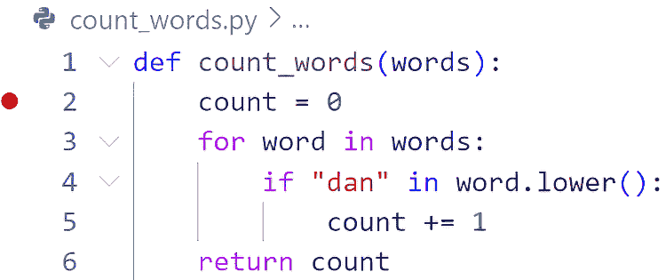

##### 图 8.2 我们在 VS Code 中的 count_words.py 文件的第 2 行设置了一个断点。

你可以设置多个断点，但在这个例子中，我们只设置一个断点在第 2 行。（注意，你可以通过再次点击那个红点来移除断点。）接下来，我们将启动调试器并查看它如何与断点一起工作。

#### 如何逐行调试代码

要启动调试器，选择运行 > 开始调试，如图 8.3 所示。


##### 图 8.3 在 VS Code 中启动调试器

一旦调试器启动，你应该看到类似于图 8.4 的界面。（如果这是第一次使用调试器，它可能会要求你选择一个调试配置，在这种情况下，你需要选择 Python。）

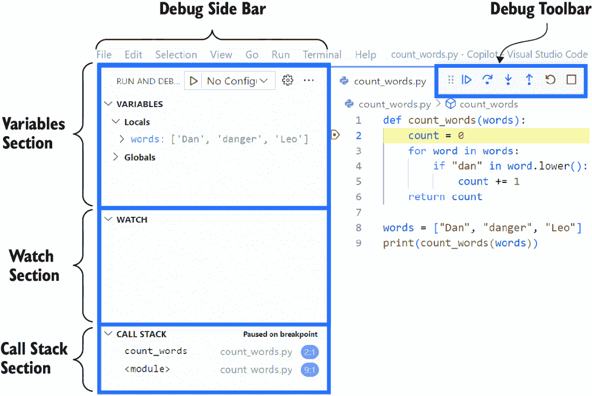

##### 图 8.4 VS Code 中的调试视图

VS Code 调试器有多个组件[1]。在左侧，调试侧边栏包含变量部分、观察部分和调用堆栈部分。让我们简要了解一下这些部分：

+   *变量部分*包含当前作用域内声明的变量（例如，`count_words` 内的变量）及其当前值。例如，`words` 参数被定义为包含 `['Dan',` `'danger',` `'Leo']` 的列表。你可以点击 `words` 左侧的箭头（>）查看该变量的更多详细信息。这个部分非常有用，因为你可以检查每个变量的值。

+   *观察部分*包含你希望特别监视的表达式。例如，你可以将表达式：`"dan"` `in` `word.lower()` 添加到观察表达式中，然后你就可以看到它对于每个不同的 `word` 值是否为 `True` 或 `False`。要添加一个表达式，只需将鼠标悬停在观察部分并点击 + 号。

+   *调用堆栈部分*包含了导致这行代码执行的已调用的函数。在这里，主函数（VS Code 中称之为 `<module>`）在第 9 行调用了 `count_words` 函数。在 `count_words` 函数内，我们当前在第 2 行。你可以通过查看当前高亮的代码行来再次确认这一点，因为第 2 行在图 8.4 中被高亮显示。

说到这一点，在右侧显示我们的代码编辑器，我们可以看到高亮显示的行 `count` `=` `0`。这就是当前还未执行的代码行。该行尚未执行的原因是因为我们在这行代码上设置了断点，通过带有点的箭头表示。当我们启动调试器时，它运行了代码，直到执行 `count` `=` `0` 之前。

调试工具栏（图 8.5）至关重要，因为它在你开始调试后驱动整个过程：你可以推进指令、重新启动调试或停止调试。

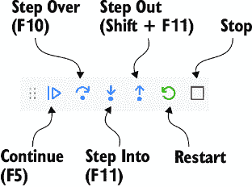

##### 图 8.5 调试工具栏

工具栏上的按钮，从左到右依次是

+   ***继续（F5）—*此按钮将继续执行，直到下一个断点被触发。在我们的示例中，`count_words` 中的第 2 行不会再执行，所以点击继续将使程序和调试会话一直运行到结束。**

***   ***步过（F10）—*此按钮将跳到当前函数中的下一行代码。如果当前函数中的一行代码调用了另一个函数（例如，当第 4 行调用 `word.lower()` 时），调试器将保持在 `count_words` 函数中，只会运行被调用的函数（例如，`word.lower()`）直到完成。*****   ***步入（F11）—*此按钮将跳到下一行代码，包括进入所有被调用的函数。与步过不同，当你使用步入时，调试器将进入当前函数调用的任何函数。例如，如果你在调用另一个函数的代码行上使用步入，它会进入该函数并继续从该函数内部逐行调试。默认情况下，它不会进入库函数调用（例如，`word.lower()` 是 Python 标准库的一部分），但会进入你编写的函数。*****   ***步出（Shift + F11）—*此按钮将执行代码直到当前函数结束，然后继续从该函数退出后的地方调试。*****   ***重新启动—*此按钮将重新启动调试过程。它将重新启动程序，并执行到第一个断点为止。*****   ***停止—*此按钮将停止调试过程。************

******#### 一行一行地调试代码

现在我们已经掌握了调试器的使用，让我们继续我们的示例，使用“步过”按钮。点击一次“步过”按钮，看看我们的视图如何变化（见图 8.6）。“步过”执行到了下一行代码，第 3 行。这意味着它执行了

```py
count = 0
```

并且即将准备好执行

```py
for word in words:
```

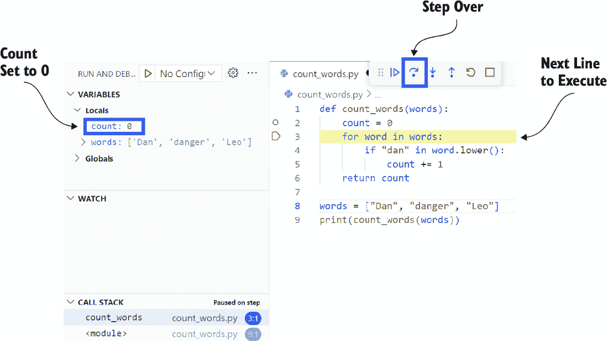

##### 图 8.6 我们在点击一次“Step Over”后的调试器视图。下一行（第 3 行）现在被高亮显示。

我们可以从界面中的各种线索看到 `count` `=` `0` 这一行代码已经执行。首先，在右侧的编辑器中，我们可以看到 `for` 循环被高亮显示，并且左侧的箭头指向了这一行代码。在左侧的调用堆栈部分，我们可以看到它现在位于 `count_words` 的第 3 行（如左侧显示 `count_words` 被高亮并且右侧的数字显示 3:1）。也许最重要的是，在左侧的变量部分，我们可以看到变量 `count` 已经被添加到局部变量中，并且其值为 `0`。最后这一点相当惊人，因为如果你试图逐行阅读代码并跟踪发生的事情，第 2 行的 `count` `=` `0` 会意味着一个名为 `count` 的变量被创建并赋值为 `0`。这正是 VS Code 调试器告诉我们的内容。我们希望你现在已经开始看到这个工具有多强大了。

让我们再点击一次“Step Over”。现在我们停在这一行之前。

```py
if "dan" in word.lower():
```

我们可以看到现在有了一个新的变量 `word`，其值为 `"Dan"`，这正是我们期望的：`word` 被赋值为 `words` 列表中的第一个元素。这是一个很好的时机来指出，除了在变量部分查看变量的值之外，你还可以将鼠标悬停在任何已经声明的变量上，来查看它的值。相当不错吧？

让我们再点击一次“Step Over”并观察 `if` 语句中的条件，`"dan"` `in` `word.lower()` 被评估为 `True`，所以我们将执行这一行代码。

```py
count += 1
```

现在我们已经掌握了这个操作，继续多点击几次“Step Over”。第一次点击时，它会返回到 `for` 循环，并且可以看到 `count` 已经增加到了 `1`。第二次点击时，它会停在 `if` 语句处，并且可以看到 `word` 的值现在是 `"danger"`。我们可以在这里停下来并添加一个监视表达式，看看这个 `if` 语句会做什么。要添加监视表达式，将鼠标悬停在 Watch 区域，然后点击出现在 Watch 右侧的加号箭头。这将允许你输入任何你想要的内容。我们输入了 `"dan"` `in` `word.lower()` 并按下回车键来添加这个监视表达式，如图 8.7 的调试侧边栏所示。

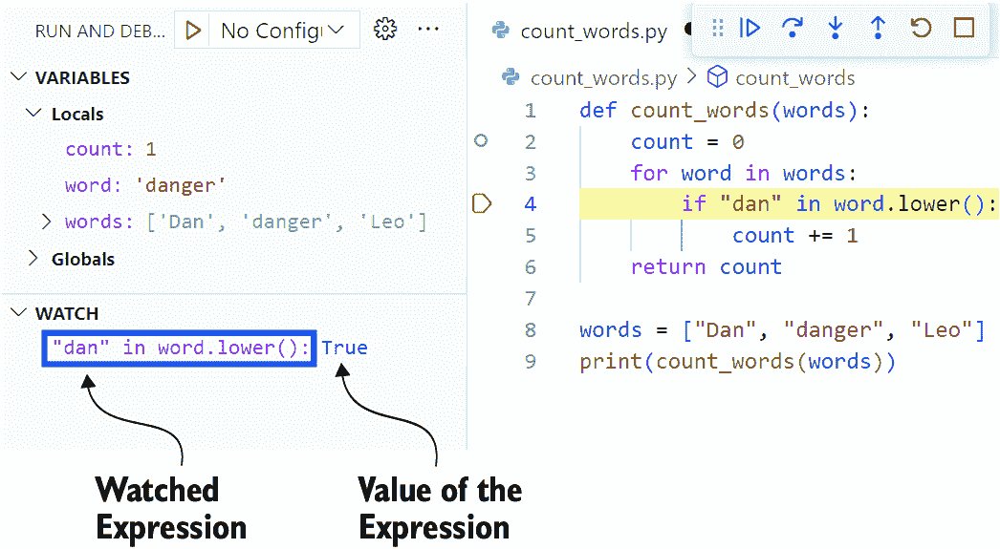

##### 图 8.7 添加监视表达式后的调试器视图

如果我们在本章之前没有找到 bug，那么就是在这里我们会发现它。表达式 `"dan"` `in` `word.lower()` 被评估为 `True`，这意味着 `count` 会再次增加。但是我们只希望精确匹配 `"Dan"` 这个单词，而不希望 `"danger"` 被计算在内！

这是调试函数的完全合理方式。正如我们之前注意到的，将断点放在函数执行的开头，然后逐步执行是调试的一个很好的起点。唯一可能使您难以使用这种方法的时候是`for`循环在出错前运行了成千上万个值。为了解决这样的挑战，我们可能会在特定位置放置一个断点，以避免在调试器中花费大量时间。让我们停止调试器（在调试工具栏中点击“停止”），移除第 2 行的断点（点击行左侧的红点），并尝试一个不同的断点。

#### 使用断点进行选择性调试

这一次，让我们将断点放在我们想要更密切监视的代码位置上。基于我们的测试案例显示列表中“计数”了两个单词，而我们只期望一个，我们应该尝试将断点放在递增`count`的行上，就像我们在图 8.8 中做的那样。

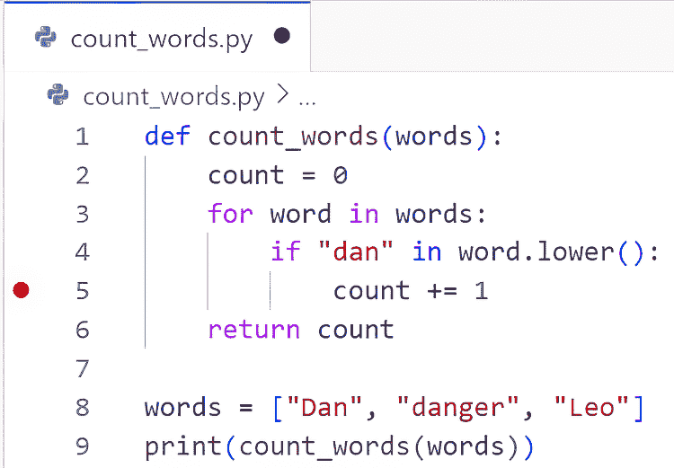

##### 图 8.8 在第 5 行放置新断点后的代码视图

一旦我们启动调试器，代码将运行，直到第一次`if`语句评估为`True`并且准备执行`count += 1`的行。图 8.9 显示了我们启动调试器后的调试器视图。

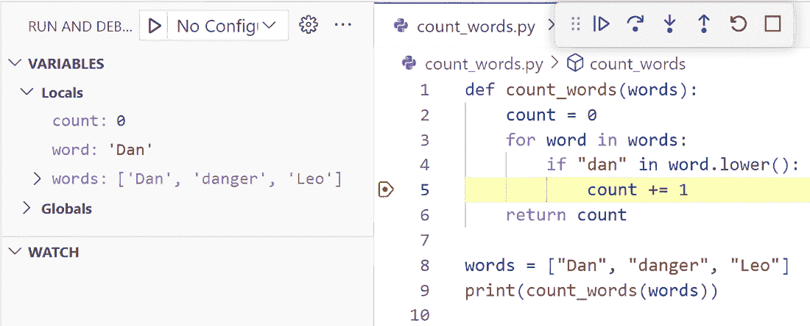

##### 图 8.9 调试器首次遇到断点（第 5 行）时的视图

我们将断点放在递增`count`的位置上，因为我们想看看列表中的哪个项目导致`count`增加。检查我们的局部变量，我们可以看到`word`是`'Dan'`，这时我们希望`count`变量增加。考虑到这是我们想要发生的，我们还没有找到我们的错误。

现在是我们真正利用断点位置的时候。我们希望代码执行直到再次遇到断点。这样做的方法是在调试工具栏中点击“继续”（参见图 8.5）。点击“继续”后，调试器应该显示如图 8.10 中所示。


##### 图 8.10 调试器在第二次遇到断点（第 5 行）时的视图

在变量部分，请注意`count`的值和`word`的值被突出显示。这是告诉您因为您点击了“继续”，这两个值已经改变了。`count`的值增加到了`1`，正如预期的那样，找到单词`'Dan'`后。`word`的值更新为`'danger'`。尽管`'danger'`是单词列表中的下一个值，但我们不应该期望找到代码为单词`'danger'`递增`count`。在这一点上，我们应该找到了我们的错误。请注意，通过良好放置断点，找到错误可以更快。但我们警告说，知道放置断点的最佳位置很像知道调试时要打印的最佳变量一样，这需要时间和练习来学会如何做得好。

在本节中，我们已经看到调试器在 VS Code 中的强大功能。设置断点并开始调试会话非常容易。当调试器监视函数中的变量时，你可以在调试侧边栏中检查这些变量，随着代码的执行，查看它们的变化。

## 8.3 如何修复错误（找到错误后）

在旧的编程学习方式中，这部分内容会告诉你如何自己修复错误。虽然这仍然是一个选择，但现在我们有了更多的选择，可以通过 Copilot 来解决问题。这些选择包括要求 Copilot 修复它，给它一个新的提示，重新描述问题，避免出现错误；给 Copilot 一个有针对性的提示，修复你找到的错误代码部分；如果是一个小问题，也可以自己修复。让我们看看如何做这些。

### 8.3.1 通过 Copilot Chat 请求 Copilot 修复您的错误

*在下面的示例中，我们将与 Copilot Chat 功能进行交互。Copilot Chat 功能允许你像与 ChatGPT 互动一样与 Copilot 互动，但仅限于编程相关的问题。你也可以与 ChatGPT 进行相同的互动（可以通过[`openai.com`](https://openai.com)访问，在写这篇文章时，ChatGPT 提供免费层）。我们更倾向于使用 Copilot Chat，因为它的界面是内置在最新版本的 VS Code 和 Copilot 扩展中的。*

*在之前的章节中，我们大多只要求 Copilot Chat 给出单一的答案，而在本章及后续章节中，我们将使用 Copilot Chat 与工具进行对话。当我们与工具对话时，我们将努力将我们写的内容（“Human”）与 Copilot 的回答（“GitHub Copilot”）分开。通过 Copilot Chat 功能，让我们看看 Copilot 是否能帮我们解决这个问题：*

LPHuman 我有一个函数，下面是它的代码，应该统计单词“Dan”在参数列表“words”中出现的次数。相反，它似乎统计的是字符“dan”在列表中出现的次数。你能帮我修复这个问题吗？

```py
*`*def count_words(words):*`* 
 *`*count = 0*`* 
 *`*for word in words:*`* 
 *`*if "dan" in word.lower():*`* 
 *`*count += 1*`* 
 *`*return count*`*
```

GitHub Copilot 当然！要计算单词“Dan”在列表中出现的次数，您可以修改`if`语句，检查整个单词是否等于“Dan”（不区分大小写）。这是修改后的代码：

```py
*`*def count_words(words):*`* 
 *`*count = 0*`* 
 *`*for word in words:*`* 
 *`*if word.lower() == "dan":*`* 
 *`*count += 1*`* 
 *`*return count*`*
```

这段代码将计算单词“Dan”（不区分大小写）在列表中出现的次数。

Copilot Chat 返回的答案更改了这一行代码

```py
if "dan" in word.lower():
```

到

```py
if word.lower() == "dan":
```

尽管这个变化看起来很小，但它的影响却很大。原始的代码行会在`word`中搜索字符串`"dan"`（在通过`.lower()`方法将单词转换为小写字母之后）。新的代码行检查`word`（同样，通过`.lower()`方法将其转换为小写字母）是否与字符串`"dan"`完全匹配。

这个来自 Copilot 的回答离正确的解决方案更近一步，因为它只会匹配整个单词，而不是在单词的任何位置查找`dan`。然而，调用`.lower()`会让它变得不区分大小写，因此它也会匹配`dan`，而我们之前的解决方案（列表 8.3）是区分大小写的（必须是完全的`Dan`）。我们希望保持区分大小写，因此我们可以继续使用 Copilot Chat 来让 Copilot 为我们修复这个问题。

LPHuman：你能给我相同的代码，但只统计单词“Dan”（区分大小写）出现的次数吗？

GitHub Copilot：当然！这是修改后的代码，它只统计单词“Dan”（区分大小写）：

```py
*`*def count_words(words):*`* 
 *`*count = 0*`* 
 *`*for word in words:*`* 
 *`*if word == "Dan":*`* 
 *`*count += 1*`* 
 *`*return count*`* 
```

这段代码将统计单词“Dan”（区分大小写）在列表中出现的次数。

在这种情况下，当我们知道代码出错的方式时，Copilot Chat 能够为我们解决问题。我们并没有明确说明哪一行代码有问题，但如果你知道这一点，也可以把它告诉 Copilot Chat。知道哪一行有问题的一个好处是，我们可以检查 Copilot 的修复是否确实更改了那一行代码。接下来，我们将继续探索其他修复该错误的选项。

### 8.3.2 给 Copilot 一个新的整个函数的提示

你已经看到我们在本书中多次重写函数的提示了。这仅仅是涉及到重写函数提示，并看看 Copilot 是否能够做得更好，有时使用 Ctrl-Enter 来探索 Copilot 的解决方案。我们在这里不再重复这一过程，因为你已经在之前的章节中看到过很多次了（例如，在第六章第 6.5.2 节）。

### 8.3.3 给 Copilot 一个有针对性的部分函数提示

我们在本章的列表 8.3 中使用了这个技巧。我们已将其作为列表 8.5 重新呈现。

##### 列表 8.5 使用提示修复已知错误（重新列出）

```py
def count_words(words):
    count = 0
    for word in words:
        # only count words that are exactly "Dan"     #1
        if word == "Dan":
            count += 1
    return count
```

#1 导致 Copilot 生成正确代码的提示

在这里，我们已经弄清楚了前一行

```py
if "dan" in word.lower():
```

并没有达到我们想要的效果。所以，我们删除了错误的代码，并特别添加了一个提示，明确告诉 Copilot 我们想要的是什么，结果它能够生成正确的代码。

### 8.3.4 自行修改代码修复错误

修复损坏代码的方法是本章的新内容。到目前为止，你在本书中已经看到了足够多的代码，可能能够通过直接修改代码来修复一些问题。例如，假设我们编写了以下代码。

##### 列表 8.6 统计指定数字出现在列表中的函数

```py
def count_between(numbers, x, y):
    count = 0
    for number in numbers:
        if number >= x and number <= y:
            count += 1
    return count
```

我们在本书的早些时候见过类似的函数。它会遍历数字列表中的所有数字，并检查每个数字是否大于或等于`x`且小于或等于`y`。如果数字位于`x`和`y`之间，它就会增加`count`。在函数的最后，它会返回`count`。如果目标是统计列表中位于`x`和`y`之间的数字（包括`x`和`y`），那么这里的代码是没有错的。

然而，*between*这个术语可能有些模糊。你想包含`x`和`y`，还是只想包括它们之间的值（不包括它们）？假设当你想象这个函数时，你希望不包括`x`和`y`。例如，如果列表是 2、4、8，而你提供的`x`和`y`值分别是 3 和 8，你希望`count`的值为 1（包括 4，但不包括 8）。你可能已经看到这个函数在这个目标下是错误的，并且知道如何修复它，但让我们假装你还没有意识到代码并没有达到你的期望。

和任何由 Copilot 或我们自己创建的函数一样，我们应该测试该函数。幸运的是，在编写第一个测试用例时，我们在测试用例（`numbers`）中包括了一个等于`x`（下限）和等于`y`（上限）的值：

```py
>>> numbers = [1, 2, 3, 4, 5, 6, 7, 8, 9]
>>> print(count_between(numbers, 3, 7))
5
```

在测试提示中的代码时，我们发现函数返回的答案是 5，但我们认为答案应该是 3。根据我们对*between*的定义，我们认为只有 4、5 和 6 位于 3 和 7 之间，所以答案应该是 3，也就是说，3 和 7 之间有三个数字。相反，代码给出的答案是 5。因此，我们知道代码没有正确运行，这得益于我们的测试用例。无论是通过检查代码，还是使用本章的调试技巧来寻找错误，我们意识到语句

```py
if number >= x and number <= y:
```

是罪魁祸首。在这里，完整的修复要求我们将`if`语句从

```py
if number >= x and number <= y:
```

到

```py
if number > x and number < y:
```

这是我们可以直接进行的更改，无需寻求 Copilot 的帮助（尽管 Copilot 也可能能帮助我们）。列表 8.7 中是更改后的修复函数。

##### 列表 8.7 修正后的计算指定数字的函数

```py
def count_between(numbers, x, y):
    count = 0
    for number in numbers:
        if number > x and number < y:    #1
            count += 1
    return count
```

#1 手动将 >= 改为 >，将 <= 改为 <

## 8.4 根据我们新学到的技能修改工作流程

现在我们知道如何以更加有意识的方式查找和修复错误，让我们回顾一下在第六章最后回顾过的工作流程。请注意，这个工作流程是关于如何设计单个函数的，因此它假设你已经完成了第七章中描述的函数分解，以确定适当的函数。新工作流程出现在图 8.11 中。

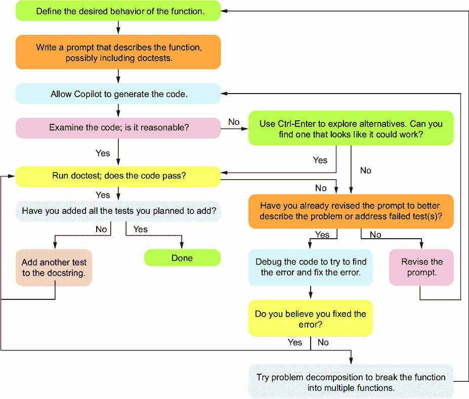

##### 图 8.11 与 Copilot 一起的函数设计周期，增加了调试部分

虽然图表开始变得有些复杂，但大部分内容与第六章中看到的类似。这里唯一的变化是加入了调试的内容。具体来说，如果你已经尝试修改提示，仍然无法得到有效的代码，那么就该开始显式地进行调试了。利用本章学到的工具，你可能能成功地找出一些错误，但不一定能发现所有的错误。如果你发现了错误并认为已经修复了它，那么流程图会让你回到测试阶段，以确保你的修复有效（并且没有破坏其他测试用例）。如果你万一通过新的提示无法让代码工作，且调试似乎无法进行，我们发现问题分解往往是你最好的下一步。换句话说，如果你怎么也调试不好某个函数，可能是该函数应该被拆分成多个小函数，这样你更有可能成功地编写这些小函数。

## 8.5 将我们的调试技能应用到新问题上

配备了新的技能和工作流程后，让我们尝试解决一个更具挑战性的调试问题。还记得第六章中我们试图确定教室中某一排座位中空座位最多的数量吗？我们将要在这里解决一个类似的问题。

与其寻找空座位，不如说我们想要计算在一排座位中连续坐着的最多学生，因为你可能想在考试前更好地安排他们的位置。你还可以想象，如果人们想要更多的私人空间，或者如果发生了疫情，这个方法可以用来更好地分散人群。我们编写了提示和一个基本的 doctest，Copilot 生成了一个解决方案。代码如下所示。

##### 列表 8.8 尝试计数连续座位上的学生

```py
def most_students(classroom):                                 #1
 **'''** 
 **classroom is a list of lists** 
 **Each ' ' is an empty seat** 
 **Each 'S' is a student** 

 **Find the most students seated consecutively in a row** 

 **>>> most_students([['S', ' ', 'S', ' ', 'S', 'S'],\** #2
 **['S', ' ', 'S', 'S', 'S', ' '],\** #2
 **[' ', 'S', ' ', 'S', ' ', ' ']])** #2
 **3** #2
 **'''**
    max_count = 0                          #3
    for row in classroom:                  #3
        count = 0                          #3
        for seat in row:                   #3
            if seat == 'S':                #3
                count += 1                 #3
            else:                          #3
                if count > max_count:      #3
                    max_count = count      #3
                count = 0                  #3
    return max_count                       #3

import doctest                     #4
doctest.testmod(verbose=True)      #4
```

#1 我们给 Copilot 的提示

#2 第一个测试用例

#3 Copilot 生成的代码

#4 我们添加的 doctest 运行代码

既然本章是关于调试的，你可能已经猜到代码并没有正确工作。我们在阅读 Copilot 给我们的代码时发现了这个错误，但它是一个微妙的错误，我们怀疑很容易被忽略。如果你已经发现了这个问题，做得很好，但假装你没有看到它，并继续阅读本章。如果你还没有发现它，那么本章的内容对你会更有价值。

假设我们刚刚编写了这个提示和测试用例。我们通读了代码，发现它似乎是在跟踪最多的连续学生。只要看到座位上有学生，它就会增加计数。当座位上没有学生时，它会检查计数是否比之前的任何计数都大，并重置计数。看起来它至少走在了正确的轨道上。我们加入了一个测试用例，因此我们运行了代码，测试用例通过了。我们对这段代码感觉不错，但知道我们需要做更多的测试用例，特别是用于捕捉边界情况的测试用例（记住，边界情况是那些可能会导致代码出错的不常见情况）。

我们知道在处理列表时，检查代码是否在列表的开始和结束处正确执行是很重要的。为了测试列表的末尾，我们添加了一个测试用例，其中最大的连续学生组包含最后一个座位，然后重新运行代码。以下是我们在文档字符串中添加的新测试用例：

```py
>>> most_students([['S', ' ', 'S', 'S', 'S', 'S'],\    #1
                  ['S', ' ', 'S', 'S', 'S', ' '],\
                  [' ', 'S', ' ', 'S', ' ', ' ']])
4
```

#1 连续学生中最大的组数是 4。

我们再次运行代码，结果测试用例失败，令我们吃惊。以下是它告诉我们的信息（我们为了可读性重新格式化了输出）：

```py
Trying:
    most_students([['S', ' ', 'S', 'S', 'S', 'S'],
                   ['S', ' ', 'S', 'S', 'S', ' '],                
                   [' ', 'S’, ' ', 'S’, ' ', ' ']])
Expecting:
    4
**********************************************************************
File "c:\Copilot\max_consecutive.py", 
line 12, in __main__.most_students

Failed example:
    most_students([['S', ' ', 'S', 'S', 'S', 'S'],
                   ['S', ' ', 'S', 'S', 'S', ' '],                
                   [' ', 'S', ' ', 'S', ' ', ' ']])
Expected:
    4
Got:
    3
```

这很奇怪——代码似乎正常工作。这个边缘情况暴露了错误。在这一点上，我们希望生成一些假设，帮助我们引导调试工作。（如果你确实陷入困境，可以采取在函数的第一行代码处设置断点并逐步调试的方式，而不是尝试创建假设。）以下是我想到的两个假设：

+   `count`的更新跳过了列表中的最后一个元素。

+   `max_count`的更新缺少了列表中的最后一个元素。

为了简化调试过程，我们去除了通过的测试（将其放置一旁稍后恢复），并只运行失败的测试。以下代码显示了我们在开始调试过程之前的完整代码。

##### 列表 8.9 我们将调试的代码来计算连续学生数

```py
def most_students(classroom): 
 '''
 classroom is a list of lists
 Each ' ' is an empty seat
 Each 'S' is a student

 Find the most students seated consecutively in a row

 >>> most_students([['S', ' ', 'S', 'S', 'S', 'S'],\ #1
 **['S', ' ', 'S', 'S', 'S', ' '],\** #1
 **[' ', 'S', ' ', 'S', ' ', ' ']])** #1
 **4**
 **'''**
    max_count = 0
    for row in classroom:
        count = 0
        for seat in row:
            if seat == 'S':
                count += 1
            else:
                if count > max_count:
                    max_count = count
                count = 0
    return max_count

import doctest
doctest.testmod(verbose=True)
```

#1 失败的测试用例

我们将从第一个假设开始，即`count`在列表末尾未正确更新，并在`count`更新的位置设置断点。图 8.12 显示了调试器在启动后第一次暂停的情况。

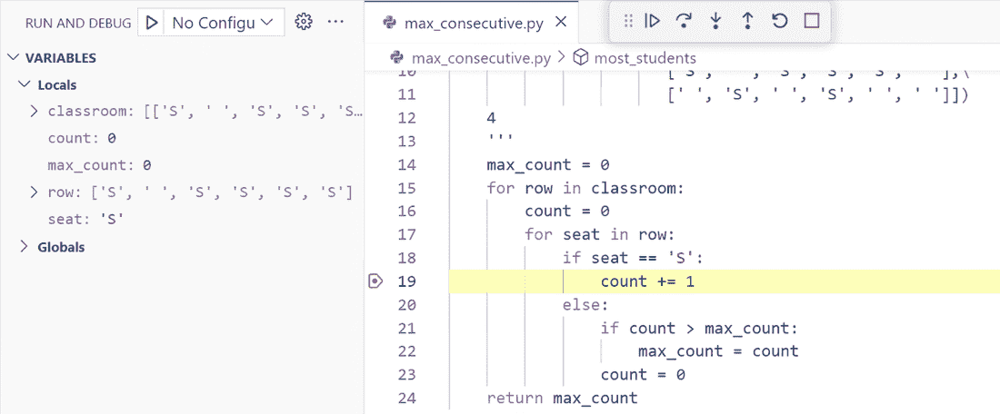

##### 图 8.12 调试器在`count`第一次更新之前停止

从调试器中我们可以看到，`count`仍然是`0`，所以它还没有被更新。我们处于第一个测试用例的第一行，因为`row`是`['S',` `'` `',` `'S',` `'S',` `'S',` `'S']`。我们正在查看的是一个`'S'`，这就是`count`在增加的原因。让我们点击调试工具栏中的继续按钮，查看`count`的下一个更新。点击继续后，调试器的状态如图 8.13 所示。

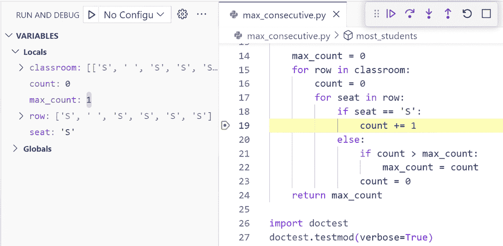

##### 图 8.13 调试器在`count`第二次更新之前停止

看来自从上次更新`count`以来发生了不少事情，因为此时`max_count`的值是`1`。这一定是在处理空位时发生的，因为`max_count`被设置为`1`，并且`count`被重置为`0`。此时，我们已经到了这一行的第三个座位，并且有学生坐在那里，`count`准备好更新了。我们需要检查`count`是否随着每个新学生的出现而持续更新。我们点击了继续，`count`增加到`1`。我们再次点击继续，`count`增加到`2`。我们再次点击继续，`count`增加到`3`。此时，我们已经到了该行的最后一个学生，接下来要检查`count`是否增加到`4`。为此，我们点击了“Step Over”一次，`count`确实更新为`4`。你可以在图 8.14 中看到此时调试器的状态。

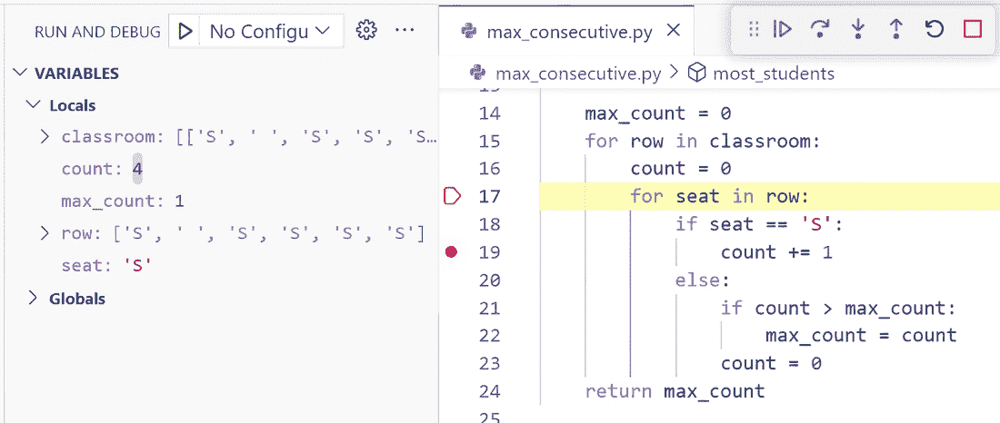

##### 图 8.14 调试器在`count`连续四次更新后停下

好消息和坏消息此时都来了。好消息是`count`正在正确更新。坏消息是我们的第一个假设是错的，我们还没找到我们的 bug。我们可以将断点移到`max_count`更新的那一行（第 22 行），然后点击重新启动并从头开始调试第二个假设，但考虑到目前在调试器中`count`的值是`4`，我们不如继续跟踪代码，确保`max_count`得到更新。或者说，我们知道它不会更新，所以我们想要看看为什么。

在点击“Step Over”之前，调试器中已经有了一个线索。这个线索来自于下一个要执行的代码行是`for` `seat` `in` `row`。但我们刚才看到的学生是`row`中的最后一个学生。这意味着这个`for`循环即将结束（意味着我们不会再次执行循环体，也就意味着`max_count`无法更新）。让我们通过点击“Step Over”看看是否真是这样。调试器的状态如图 8.15 所示。

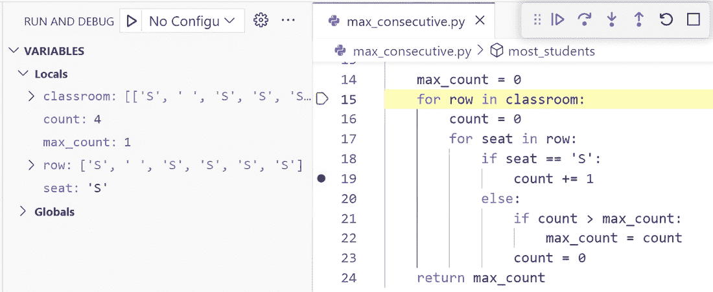

##### 图 8.15 调试器在完成第一行后停止

我们刚刚完成了第一行的处理，但我们从未更新`max_count`。下一行代码将选择下一个`row`，之后的代码会将`count`重新设置为`0`。我们在没有更新`max_count`的情况下完成了行的循环，尽管我们找到了一个比当前`max_count`更大的`count`。如果你还没看到 bug，建议你继续步进，直到下次`max_count`更新为止，那时问题可能会更加明显。

代码中的错误在于只有遇到空座位时才会更新`max_count`。这意味着如果一行以学生结束，那么检查是否应更新`max_count`的代码将永远不会在该行运行。仔细检查代码后发现，检查是否应更新`max_count`和更新`max_count`的操作应该发生在`if-else`语句之外，或者在`count`更新后紧接着进行。

这是一个我们可能可以手动修复的问题，因为我们只需要将两行代码移动到更合适的位置。列表 8.10 中的代码是修正后的函数（没有测试或提示）。

##### 列表 8.10 修正后的统计连续学生的函数

```py
def most_students(classroom):
    max_count = 0
    for row in classroom:
        count = 0
        for seat in row:
            if seat == 'S':
                count += 1
                if count > max_count:    #1
                    max_count = count    #1
            else:
                count = 0
    return max_count
```

#1 将 count 与 max_count 的测试移动到更新 count 后面

这段新代码通过了之前旧代码和原始测试未能通过的测试。添加了另一个测试，确保当连续学生的最长组出现在行的开头时，代码仍然有效。现在我们更加确信代码已正确运行。

## 8.6 使用调试器更好地理解代码

我们猜想你已经对调试器印象深刻了，我们也是。当学生以传统方式学习编程时，很多时间都花在确保学生能够像调试器一样逐步跟踪代码，绘制所有变量的状态，并在每一行执行后更新它们。事实上，网络上甚至有一个免费的工具叫做 Python Tutor [2]，它可以创建内存状态的图示，比调试器更易于阅读，帮助新程序员了解代码的执行过程。

无论你喜欢使用调试器，还是想使用像 Python Tutor 这样的工具，我们鼓励你尝试一下自己在书中早些章节写的代码。从我们个人与学习编程的人合作的经验来看，逐行跟踪程序并观察变量的状态如何变化，可能是一次真正启发性的体验，我们希望你也能从中受益。

## 8.7 调试的注意事项

从与学生的互动中，我们也发现调试对新手学习者来说，可能是一种非常令人沮丧的体验 [3]。在学习编程时，每个人都希望自己的代码能正常工作，找到并修复错误是在代码没有正常工作时花费的时间。有几种方法可以帮助克服这种沮丧。首先，问题分解可以极大帮助你获得正确的 Copilot 代码，而无需进行大量的调试。其次，记住每个人的代码有时也不会工作，包括我们的代码。这是编程过程中很自然的一部分，也是需要一些练习的部分。最后，始终，必须始终，测试你编写的每个函数。我们发现，当学生在调试中卡住时，通常是因为多个函数之间的相互作用中存在错误，导致没有对每个函数进行测试。当这种情况发生时，找到并修复错误是非常困难的。调试相互作用的错误非常令人沮丧，避免这种经历是我们俩都严格测试每个编写的函数的一个重要原因。

好消息是，如果你测试每个编写的函数，并且仔细将问题分解成小而易于管理的步骤，你就不会经常遇到调试的情况。而且，即便遇到调试，你也只是在调试某个函数中的错误，这正是几乎每个程序员都会做的事。通过一些练习，你会掌握这一技能。

## 8.8 练习

1.  给定一个 Python 函数，应该计算列表中所有偶数的总和。然而，函数并未正确工作。当你调用该函数并传入列表`[1,` `2,` `3,` `4]`时，它返回`4`而不是`6`：

```py
def sum_even_numbers(numbers):
    total = 0
    for number in numbers:
        if number % 2 == 0:
            total += number
        else:
            total = 0
    return total
```

识别`sum_even_numbers`函数中的错误，并解释如何修复它。修改代码以修正错误，并使用提供的测试用例验证解决方案。

1.  2\. 你给定了一个 Python 函数，应该查找列表中数字的最大值。然而，函数并未按预期工作。你的任务是确定该函数为何不正确工作，以及如何修复它（提示，考虑输入列表中可能的整数值）：

```py
def find_max(numbers): 
    max_number = 0 
    for i in range(0, len(numbers)): 
        if numbers[i] > max_number: 
            max_number = numbers[i] 
   return max_number
```

1.  3\. 你给定了一个 Python 函数，应该检查一个字符串是否是有效的密码。一个有效的密码必须满足以下标准：

    1.  密码长度必须至少为 8 个字符。

    1.  密码必须包含至少一个大写字母。

    1.  密码必须包含至少一个小写字母。

    1.  密码必须包含至少一个数字。

然而，函数并未正确工作。确定函数的问题所在，并修复它：

```py
def is_valid_password(password):
    if len(password) <= 8:
        if any(char.isupper() for char in password):
            if any(char.islower() for char in password):
                if any(char.isdigit() for char in password):
                    return True
            return False
        return False
    return False
```

1.  4\. 你正在编写一个 Python 函数，根据一天中的时间向用户打招呼。该函数接受一个小时（0 到 23 之间的整数）作为输入，并返回问候消息（“Good morning”，“Good afternoon”或“Good evening”）：

```py
def greet_user(hour):
  # This code has an error!
  if hour < 12:
    greeting = "Good morning"
  else:
    greeting = "Good evening"
  return greeting
```

你正在考虑使用以下提示来让 Copilot 帮助你修复错误：“我有一个根据时间向用户问候的函数，但它似乎将中午分类为‘Good evening’。你能帮我修复逻辑吗？”该提示提到了问题，但没有准确指出错误所在。看看你是否能修改提供的提示，使其更加具体，并引导 Copilot 提出正确的修复方法。

## 摘要

+   调试是一项重要的技能，它包括查找代码中的错误并加以修正。

+   `Print`语句是了解代码运行情况的一种有效方式。

+   VS Code 调试器是另一种了解代码运行情况的方式，提供了强大的功能来监控变量在代码执行过程中如何变化。

+   一旦发现错误，有多种方法可以帮助 Copilot 修复错误，但如果失败，你通常也可以直接修复代码。

+   现在，我们的函数设计流程包括调试，而凭借调试技能，你更有可能编写出你想要的软件。

+   除了调试外，VS Code 调试器还可以作为学习如何理解代码的重要工具。
