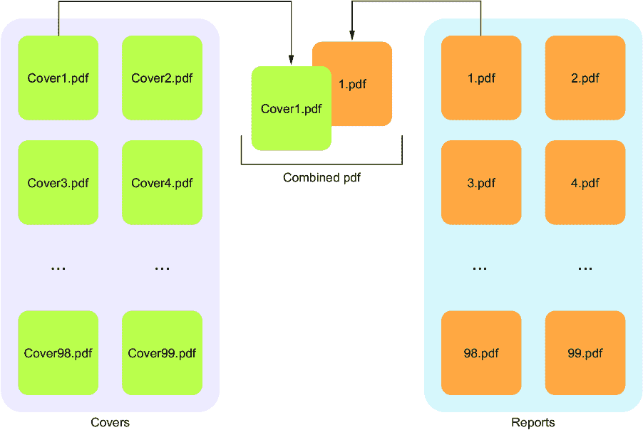
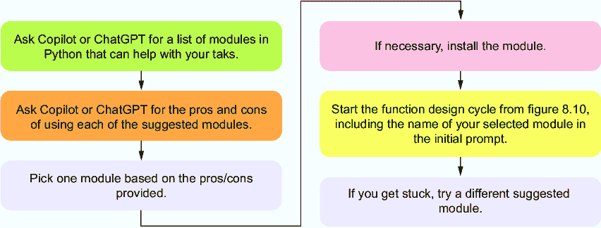
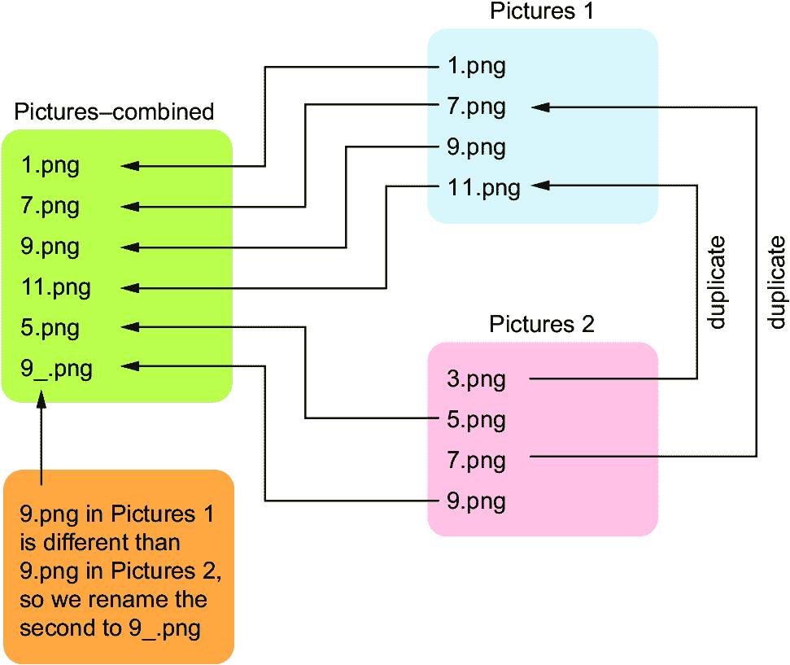

# 第九章：9 *自动化繁琐任务*

### 本章内容包括

+   理解为什么程序员编写工具

+   确定我们需要编写哪些模块来制作一个给定的工具

+   自动化清理包含 > > > 符号的电子邮件

+   自动化处理 PDF 文件

+   自动化移除多个图片库中的重复图片

假设你负责为 100 个人创建 100 份报告。也许你是老师，需要给每个学生发送一份报告。也许你在 HR 工作，需要给每位员工发送年度评估报告。不管你是什么角色，你面临的都是需要创建这些报告的问题，而且你决定将报告准备为.pdf 文件。你还需要为每份报告准备定制化的封面页，这些封面页是由你的同事（一个平面设计师）设计的。

你和你的同事独立工作，最后，工作完成了。等等，别急。因为现在你必须把每个封面页放到每份报告的开头。

在这一点上，非程序员可能会咬紧牙关，开始手动处理这个任务，将封面页与第一份报告合并，第二个封面页与第二份报告合并，依此类推。这可能需要几个小时。如果他们没有意识到可能有其他方法，非程序员可能会继续推进，直到任务完成。

但现在你是程序员了。而大多数程序员，包括我们俩在内，绝不会继续手动做这种工作。

在本章中，我们将向你展示如何编写程序来自动化繁琐的任务。本章中的第二个例子将自动化“合并封面页和报告”的情况。但我们还会展示其他例子。收到一封被转发了很多次的电子邮件

> > > > > > 它看起来

像

> > > > > > 这样吗？

或者你们家有好几部手机，每部手机里都有数百张图片，而你只想把这些图片集中到一个地方，这样就可以归档而不丢失任何内容？在本章中，我们将向你展示如何自动化这样的任务。

## 9.1 为什么程序员制作工具

有一个程序员常常表达的普遍观点：我们很懒。这并不意味着我们不想做工作，而是说我们不想做*重复、无聊、繁琐*的工作，因为这些正是计算机擅长的。程序员们会对这种辛苦的工作产生一种类似蜘蛛感应的敏锐感觉。假设 Leo 有几百张照片，他想要删除所有重复的照片。没有人会手动去做这件事。又比如 Dan 需要给他的每个学生发送定制化的邮件。如果学生人数不多也就算了，但如果是几位以上的学生，他绝对不会手动去做这件事。一旦程序员们开始意识到自己反复按相同的键盘或执行同样的步骤，他们就会停下来，编写工具来自动化这一过程。

当程序员谈论工具时，他们是在谈论那些可以节省时间的程序。工具通常不是最终目标，编写工具本身可能感觉枯燥乏味，也不怎么光彩。但一旦我们有了工具，我们就可以用它来节省时间。有时，我们会用工具一次，处理一个特定的任务，然后再也不使用它了。然而，通常情况下，工具会反复派上用场，无论我们是按照原样使用它，还是进行一些小修改。例如，在 Dan 完成每一门课程的教学后，他会使用自己编写的程序将所有学生的成绩整理并提交给学校。他每次都对工具进行小修改——比如改变每个作业的权重——然后 Dan 就可以使用这个略微修改过的工具来完成工作。

使用 Copilot 的一个伟大之处在于，它让编写这些工具变得更加轻松。以下是一位软件工程师对这一点的解释：

> 我们都知道工具的重要性，知道有效的工具难以创建，也知道管理层并不关心或理解工具的需求……我无法表达现在我每天可以构建两个高质量工具，满足我每个想解决的问题时，编程的感觉是多么根本性的不同。[1]

## 9.2 如何使用 Copilot 编写工具

正如我们在第五章讨论模块时所学到的那样，有时我们需要使用模块来帮助我们编写所需的程序。有些模块是 Python 内置的。例如，在第五章中，我们使用了内置的 zipfile 模块来帮助我们创建一个 .zip 文件。其他模块则不是内置的，我们需要先安装它们，然后才能使用。

在编写工具时，我们通常会处理一些专业化的数据格式（如 zip 文件、PDF 文件、Microsoft Excel 表格、图片），或者执行一些特定的任务（如发送电子邮件、与网站互动、移动文件）。对于这些大多数情况，我们需要使用某个模块。那么，使用哪个模块呢？它是内置的，还是需要我们安装的？这些是我们需要首先回答的问题。

幸运的是，我们可以使用 Copilot Chat（或 ChatGPT）来帮助我们入门。作为提醒，我们使用 Copilot Chat 功能是因为它已经内置于我们的 Visual Studio Code (VS Code) 集成开发环境（IDE）中，并且 Copilot Chat 可以访问我们当前正在编写的代码，因此它能够将我们正在做的事情融入到它的回答中。

计划是与 Copilot 进行对话，确定我们需要使用哪个模块。一旦我们知道了，并且安装了该模块（如果需要的话），我们就可以开始编写工具的代码了。我们会按照以往的方式进行：编写函数头和文档字符串，然后让 Copilot 为我们填充代码。一旦 Copilot 开始编写代码，我们需要按照之前章节中的相同步骤进行，包括检查代码的正确性、修复错误，甚至可能需要进行一些问题分解。为了将我们的注意力集中在编写自动化任务工具上，我们将尽量减少在这些额外任务上花费的时间。

我们可能可以让 Copilot 或 ChatGPT 为我们编写整个工具，甚至不需要将它放入函数中。不过我们在这里不会这么做，因为我们仍然认为函数的好处是值得的。一个函数将帮助我们记录代码，以便我们知道它的功能，并且如果我们后来决定，比如说，添加额外的参数来改变工具的行为，它也能提供灵活性。

## 9.3 示例 1：清理电子邮件文本

有时，一封电子邮件被回复并转发多次，结果变得很混乱，某些行前面有很多大于号（>）和空格。以下是我们所说的示例邮件：

> > > 嗨，Leo，
> > > 
> > > > > Dan——你的自然语言研究有进展吗？
> > > > > 
> > > 是的！你给我看的那个网站

[`www.kaggle.com/`](https://www.kaggle.com/)

> > > 非常有用。我在这里找到了一组数据集，收集了

非常感谢

> > > 可能对我的研究有用的问答。
> > > 
> > > 谢谢，
> > > 
> > > Dan

假设你想保存这封电子邮件中的信息以备将来使用。你可能想清理每行开头的 > 和空格符号。你可以手动删除它们——毕竟这封邮件并不长——但不要这么做，因为你现在有机会设计一个通用工具，以后每当你需要执行这个任务时都可以使用它。无论你的邮件有五行、一百行，还是一百万行，都没关系：只需要使用工具，轻松完成。

### 9.3.1 与 Copilot 对话

我们需要让工具能够处理凌乱的电子邮件，以便它可以清理这些邮件。我们可以通过首先将电子邮件的文本复制到剪贴板（使用操作系统上的复制到剪贴板命令，比如 Ctrl-C）来实现这一点。

每个计算机操作系统都有一个剪贴板，用来存储最后复制的内容。如果你曾经使用过复制粘贴功能，那你就使用过剪贴板。我们将使用剪贴板暂时存储文本，以便我们可以编辑剪贴板中的文本，然后粘贴到需要的地方。

将杂乱的电子邮件文本复制到剪贴板后，我们可以在剪贴板中的文本上运行工具，工具将清理电子邮件并用清理后的版本替换剪贴板中的内容。为了让工具执行合理的操作，我们假设你的剪贴板中有电子邮件文本。该工具将删除每行开头的`>`和空格字符，以便你可以将清理后的电子邮件粘贴（使用操作系统的粘贴命令，如 Ctrl-V）到你想要的位置。在 Python 中，它需要将剪贴板内容读取到字符串中（即复制剪贴板内容），进行清理，然后将清理后的新文本放回剪贴板（即粘贴到剪贴板），替换掉之前存在的杂乱电子邮件版本。

那么，如何在 Python 程序中访问剪贴板呢？这是我们需要弄明白的，因此这将构成我们与 Copilot 对话的框架。与第八章类似，我们将使用“Human”表示我们输入的提示，使用“GitHub Copilot”表示 Copilot 的回答。你也可以使用 Copilot Chat 功能或 ChatGPT 进行类似的对话。我们将提示输入到 Copilot Chat 窗口。

在与 Copilot 的对话中，我们会广泛探索，然后才会定下一个解决方案。我们会在通过一个示例掌握操作后解释为什么这样做，但在此先说明一下，以便你为这种看似间接的方法做好准备。Copilot 在回答中提供了不少示例代码。在探索过程中，可以浏览这些代码，但不要在其中迷失。我们将在确定方案并进行详细讨论后，再仔细查看代码的具体内容。让我们开始学习吧！

LPHuman 我想编写一个 Python 程序，能够访问剪贴板并让我使用剪贴板进行复制和粘贴。我该怎么做？

GitHub Copilot 你可以使用 pyperclip 模块在 Python 中访问剪贴板。下面是一个示例程序，演示如何使用剪贴板进行复制和粘贴：

```py
*````*```pypython*````*

*`*import pyperclip*`*

*`*# 复制到剪贴板*`*

*`*pyperclip.copy('Hello, world!')*`*

*`*# 从剪贴板粘贴*`*

*`*text = pyperclip.paste()*`*

*`*print(text)*`*

*```py`*```*```py`*
```

这个程序首先导入 pyperclip 模块。然后，它使用`copy()`函数将字符串`'Hello, world!'`复制到剪贴板。最后，它使用`paste()`函数将剪贴板的内容粘贴到“text”变量中，并打印出结果。

你可以通过在终端中运行`pip install pyperclip`来安装 pyperclip 模块。

Copilot 的回答教会了我们如何在 Python 程序中使用 pyperclip 模块与剪贴板进行交互。它提供的示例代码甚至向我们展示了如何从程序中复制内容到剪贴板，并将剪贴板中的内容粘贴到变量（`text`）中。我们正在取得很大的进展！

响应的最后一段告诉我们如何安装 pyperclip。啊哈！所以 pyperclip 默认并不包含在 Python 中。虽然我们稍后会学习如何安装模块，但最好还是不要担心这个问题。那么，让我们继续讨论，询问 Copilot 是否有更好的解决办法。

LPHuman 有没有一种方法可以在不安装 Python 模块的情况下完成？

GitHub Copilot 是的，你可以使用 Python 自带的 tkinter 模块来访问剪贴板。下面是一个示例程序，它让你无需安装任何额外的模块就可以通过剪贴板进行复制和粘贴：

```py
*````*```pypython*````*

*`*import tkinter as tk*`*

*`*# 创建一个 Tkinter 窗口*`*

*`*root = tk.Tk()*`*

*`*# 隐藏窗口*`*

*`*root.withdraw()*`*

*`*# 复制到剪贴板*`*

*`*root.clipboard_clear()*`*

*`*root.clipboard_append('Hello, world!')*`*

*`*# 从剪贴板粘贴*`*

*`*text = root.clipboard_get()*`*

*`*print(text)*`*

*```py`*```*```py`*
```

该程序首先使用`Tk()`函数创建一个隐藏的 Tkinter 窗口，并通过`withdraw()`方法将其隐藏。接着，使用`clipboard_clear()`方法清空剪贴板，并使用`clipboard_append()`方法将字符串`'Hello, world!'`添加到剪贴板中。最后，使用`clipboard_get()`方法获取剪贴板的内容并打印结果。

请注意，这个方法只有在你有图形环境的情况下才有效，例如在 Linux 或 macOS 上的桌面环境，或 Windows 上的 Windows 桌面。如果你在一个仅有终端的环境中运行 Python，你需要使用其他方法来访问剪贴板。

看起来我们得到了一些东西，同时也失去了一些东西。收获是这个 tkinter 模块是内置于 Python 中的。失去的是“这个方法只有在你有图形环境的情况下才有效。”我们在 Python 环境中是否有图形环境呢？虽然我们可以尝试运行代码来找出答案，但这个要求让我们犹豫不决。毕竟，pyperclip 解决方案没有这个要求，所以我们也许不需要它（无论它是什么意思）。让我们再试一次。

LPHuman 有没有不需要安装 Python 模块的其他方法？

GitHub Copilot 是的，你可以使用 win32clipboard 模块来访问剪贴板，这个模块在 Windows 的标准库中包含。下面是一个示例程序，它让你无需安装任何额外的模块就可以通过剪贴板进行复制和粘贴：

```py
*````*```pypython*````*

*`*import win32clipboard*`*

*`*# 复制到剪贴板*`*

*`*text = "Hello, world!"*`*

*`*win32clipboard.OpenClipboard()*`*

*`*win32clipboard.EmptyClipboard()*`*

*`*win32clipboard.SetClipboardText(text)*`*

*`*win32clipboard.CloseClipboard()*`*

*`*# 从剪贴板粘贴*`*

*`*win32clipboard.OpenClipboard()*`*

*`*pasted_text = win32clipboard.GetClipboardData()*`*

*`*win32clipboard.CloseClipboard()*`*

*`*print(pasted_text)*`*

*```py`*```*```py`*
```

这个程序首先导入了 win32clipboard 模块。要将文本复制到剪贴板，可以调用 `OpenClipboard()` 函数打开剪贴板，然后调用 `EmptyClipboard()` 清除现有数据，最后调用 `SetClipboardText()` 设置剪贴板上的文本。设置文本后，应调用 `CloseClipboard()` 关闭剪贴板。

要从剪贴板粘贴，可以调用 `OpenClipboard()` 打开剪贴板，然后调用 `GetClipboardData()` 获取剪贴板中的文本。获取文本后，应调用 `CloseClipboard()` 关闭剪贴板。在这个示例中，程序将文本 `"Hello,` `world!"` 复制到剪贴板，然后将其粘贴并打印到控制台。

“Windows 上的标准库，”嗯？这令人担忧，因为这意味着我们的工具可能无法在其他操作系统上运行。让我们来看看这个问题。

LPHuman：这也能在 Linux 或 macOS 上工作吗？

GitHub Copilot 不，win32clipboard 模块是专门为 Windows 设计的，在 Linux 或 macOS 上无法使用。在 Linux 上，你可以使用 `xclip` 命令行工具来访问剪贴板。以下是一个示例程序，演示如何在 Linux 上使用剪贴板进行复制和粘贴：

```py
*````*```pypython*````*

*`*import subprocess*`*

*`*# 复制到剪贴板*`*

*`*text = "Hello, world!"*`*

*`*subprocess.run(['xclip', '-selection', 'clipboard'], input=text.encode('utf-8'))*`*

*`*# 从剪贴板粘贴*`*

*`*p = subprocess.Popen(['xclip', '-selection', 'clipboard', '-o'], stdout=subprocess.PIPE)*`*

*`*pasted_text = p.stdout.read().decode('utf-8')*`*

*`*print(pasted_text)*`*

*```py`*```*```py`*
```

这个程序使用 subprocess 模块来运行 `xclip` 命令行工具。要将文本复制到剪贴板，可以调用 `subprocess.run()` 并传入带有 `-selection` `clipboard` 选项的 `xclip` 命令，以指定剪贴板选择，并通过 `input` 参数传入你想复制的文本。要从剪贴板粘贴，可以调用 `subprocess.Popen()` 并传入带有 `-selection` `clipboard` `-o` 选项的 `xclip` 命令来读取剪贴板中的文本，然后使用 `Popen` 对象的 `stdout` 属性读取命令的输出。在这个示例中，程序将文本 `"Hello,` `world!"` 复制到剪贴板，然后将其粘贴并打印到控制台。

在 macOS 上，你可以使用 `pbcopy` 和 `pbpaste` 命令行工具来访问剪贴板。使用方法与 `xclip` 类似。

我们已经获得了一些针对不同操作系统的解决方案。我们不喜欢这样！我们希望我们的工具能够在任何操作系统上都能工作。（即使我们自己只使用 Windows，也许有一天，我们会与使用不同操作系统的其他人分享这个工具。）

我们本可以继续讨论，但回头看，安装那个单独的 pyperclip 模块似乎也没那么糟糕。我们就继续吧。一般来说，在决定如何开始编写工具时，探索你的选项是有价值的，而与 Copilot 的对话有助于进行这种探索。

##### 为什么我们应该探索并理解我们的选项

有几个原因说明你不应该仅仅使用 Copilot 聊天告诉你使用的第一个模块：

+   它可能无法在所有操作系统上运行。一般来说，我们希望找到在多个操作系统上都能使用的模块，这样无论你（如果以后切换操作系统）还是你分享工具的其他人都能使用该工具。

+   结果可能是它最终不适用于我们的使用场景，或者我们可能会很难让代码正常运行。如果我们有其他选择，我们可以先尝试那些选项，而不是把太多时间花在一个可能最终无法成功的策略上。

+   模块会频繁更新。通常，这是为了添加新功能和修复错误，但有时在这个过程中，某些功能也会被移除或更改。当模块的作者移除某个功能时，称为*废弃该功能*。一旦某个功能被废弃，它可能不再工作，我们需要找到替代品。Copilot 仅会间歇性地进行训练，而不是持续训练，因此，如果在 Copilot 接受训练后有新版本的模块发布，Copilot 就不了解这些更新。这可能导致 Copilot 建议的代码依赖于比你实际拥有的模块版本更旧的版本。我们稍后会在本章中看到解决这个问题的方法。但如果遇到麻烦，拥有其他选项可供探索是非常有用的。

### 9.3.2 编写清理邮件的工具

我们需要做的第一件事是安装 pyperclip 模块。但是我们该如何安装呢？好消息是，Python 让安装新模块变得非常容易。进入 VS Code 右下角的终端，输入以下命令：

```py
pip install pyperclip
```

注意  对于某些操作系统，你可能需要使用`pip3`而不是`pip`。在 Windows 机器上，如果你按照第二章的安装说明进行安装，我们建议使用`pip`。在 Mac 或 Linux 机器上，我们建议使用`pip3`。

当你运行这个命令时，你可能会看到其他模块也被安装。别担心：有时模块需要其他模块才能正常工作，Python 会将它们一起安装，这样你就不必自己担心安装这些依赖项。

安装好后，我们可以导入模块，然后编写我们用于删除行首的`>`和空格字符的函数的头部和文档字符串。我们在这里导入模块的原因是为了影响 Copilot 在为我们编写函数代码时使用该模块。以下是我们使用的提示和 Copilot 提供的代码。

##### 列表 9.1 第一次尝试：清理剪贴板中的邮件文本

```py
import pyperclip

def clean_email():
 '''
 The clipboard contains lines of text.
 Clean up the text by removing any > or space
 characters from the beginning of each line.
 Replace the clipboard with the cleaned text.
 '''
    text = pyperclip.paste()                      #1
    lines = text.splitlines()                 #2
    for i in range(len(lines)):                   #3
        lines[i] = lines[i].lstrip(' >')             #4
    text = '        #5

'.join(lines)       #5

    pyperclip.copy(text)       #6

if __name__ == '__main__':            #7
    clean_email()       #8
```

#1 将剪贴板的当前内容放入文本字符串中

#2 将字符串拆分为行的列表

#3 遍历每一行

#4 从行的开头删除空格和 `>` 符号

#5 这看起来很奇怪。

#6 将清理后的文本复制到剪贴板

#7 注意一个常见的 Python 约定（参见以下讨论）。

#8 调用我们的函数来自动清理剪贴板！

我们可以看到，程序正在按照正确的步骤顺序执行：它获取剪贴板内容，清理文本，然后将清理后的文本复制回剪贴板。正如我们之前与 Copilot 的对话中学到的那样，我们希望 Copilot 编写的代码使用 `pyperclip` 的 `paste` 和 `copy` 函数，而它确实是在这么做。程序中的倒数第二行是我们在本书中从未见过的：

```py
if __name__ == '__main__':
```

如果你愿意，其实可以删除这一行（如果你删除，也请取消缩进下面的那一行）。它确保 `clean_email` 函数只有在你运行程序时才会被调用，而不是在你作为模块导入时调用。毕竟，如果你确实想将其作为模块导入（作为更大程序的一部分使用），你会在需要该功能时调用 `clean_email`，而不一定是在模块导入后立即调用。（而且，一般来说，任何时候你想更深入理解一行代码时，都可以向 Copilot 询问！）不幸的是，这段代码不能正常工作。如果你运行它，你会收到以下错误：

```py
File "C:\repos\book_code\ch9\email_cleanup.py", line 14
    text = '
           ^
SyntaxError: unterminated string literal (detected at line 14)
```

语法错误意味着我们的程序并不是有效的 Python 代码。我们现在要修复这个问题！我们有几种方式来解决这个问题。一种是高亮显示你的代码并要求 Copilot Chat 修复错误。对我们来说，这确实修复了问题。你也可以尝试向 ChatGPT 提出问题：“为我的代码 `<insert your code>` 提供修复建议。”这是一个有用的技巧，当 Copilot 返回的代码无法按预期工作时，可以考虑使用。

Copilot 通过修复语法错误的那一行代码为我们修正了程序。新的代码如下所示。

##### 列表 9.2 第二次尝试：清理剪贴板中的电子邮件文本

```py
import pyperclip

def clean_email():
 '''
 The clipboard contains lines of text.
 Clean up the text by removing any > or space
 characters from the beginning of each line.
 Replace the clipboard with the cleaned text.
 '''
    text = pyperclip.paste()
    lines = text.splitlines()
    for i in range(len(lines)):
        lines[i] = lines[i].lstrip(' >')
    text = '\n'.join(lines)        #1

    pyperclip.copy(text)

if __name__ == '__main__':
    clean_email()
```

#1 将各个行重新连接成一个字符串

新的代码行，已经从我们之前那行奇怪的代码改动过来，是

```py
text = '\n'.join(lines)
```

这一行的目标是将所有文本行连接成一个单一的字符串，程序稍后会将该字符串复制到剪贴板。`\n` 代表什么？它表示代码中的换行符。`join` 方法是什么？它将列表中的所有项（行）连接成一个单一的字符串。

我们可以通过稍微实验一下 `join` 来更详细地了解它是如何工作的。这里是一个使用空字符串而不是 `'\n'` 字符串的 `join` 示例：

```py
>>> lines = ['first line', 'second', 'the last line']   #1
>>> print(''.join(lines))           #2
first linesecondthe last line
```

#1 显示包含三行的列表

#2 在空字符串上调用 `join` 方法

注意，有些词语被挤在一起了。这并不是我们想要的——我们需要在它们之间加点东西。怎么加一个空格呢？我们再试试使用 `join`，这次在字符串中使用空格，而不是空字符串：

```py
>>> print(' '.join(lines))
first line second the last line
```

或者，我们可以使用 `'*'`：

```py
>>> print('*'.join(lines))
first line*second*the last line
```

这解决了我们紧凑的词语问题。而且，`*s` 告诉我们每行的结尾位置，但如果能够保持邮件是三行的事实就更好了。

我们需要在 Python 中找到一种使用换行符或新行字符的方法，而不是空格或 `*`。我们不能直接按 Enter，因为那样会把字符串分成两行，这不是有效的 Python 语法。解决方法是使用 `'\n'`：

```py
>>> print('\n'.join(lines))
first line
second
the last line
```

现在我们的工具准备好使用了。如果你把一些杂乱的邮件文本复制到剪贴板，运行我们的程序并粘贴剪贴板，你会看到邮件已经被清理好了。例如，如果我们运行它处理之前的样本邮件，得到的清理后版本如下：

你好，Leo，

Dan —— 你的自然语言研究有进展吗？

是的！你给我看的那个网站

[`www.kaggle.com/`](https://www.kaggle.com/)

非常有用。我在上面找到了一个数据集，收集了

很多

可能对我的研究有用的问答数据集。

谢谢，

Dan

当然，我们还可以做得更多。那封电子邮件中的换行不太理想（“a lot”这一行非常短且不必要地短），你可能也想把它清理一下。你可以通过在给 Copilot 的提示中加入新要求，开始进行这些改进。我们在这里停下，因为我们已经完成了初步的邮件清理，但我们鼓励你继续探索更强大的解决方案。

## 9.4 示例 2：为 PDF 文件添加封面

让我们回到本章开始时的场景。我们已经写了 100 份 .pdf 格式的报告。我们的同事为这些报告设计了 100 个封面，封面也是 .pdf 格式的，我们需要将封面和报告合并，使每个最终的 .pdf 文件都以封面开始，接着是报告内容。图 9.1 提供了所需流程的示意图。



##### 图 9.1 创建合并后的 .pdf 文件的期望过程示意图，方法是将封面目录中的报告封面与报告目录中的报告合并。请注意，报告可能不止一页。

##### PDF 文件（以及 Microsoft Word 和 Excel 文件）不是文本文件

你可能会想，为什么我们不能像操作 .csv 文件那样，直接使用 Python 的 `read` 和 `write` 方法来处理 .pdf 文件呢？毕竟，在第二章处理 .csv 文件时我们就是这么做的。

最大的区别在于.csv 文件是文本文件，这些文件是人类可读的，不带格式或特殊命令。然而，许多其他文件格式不是文本文件。例如，.pdf 文件不是人类可读的，需要通过理解.pdf 格式的代码来处理。Microsoft Word 文件和 Microsoft Excel 文件也是如此：它们不是文本文件，所以我们需要专门的工具来处理它们。

在本书的资源中，在 ch9 文件夹内，你会找到两个子文件夹：报告子文件夹包含 100 个报告，格式为.pdf 文件，封面子文件夹包含 100 个封面，格式为.pdf 文件，每个报告都有一个封面。报告的命名方式为 1.pdf、2.pdf、3.pdf，依此类推；对应的封面命名为 cover1.pdf、cover2.pdf、cover3.pdf，依此类推。我们将在本节中将这些报告和封面合并在一起。

打开一些封面.pdf 文件和一些报告.pdf 文件。你可以使用 Adobe Acrobat 等程序，或者用你通常在电脑上打开.pdf 文件的方法。你会注意到封面总是恰好一页，而报告可能不止一页。当我们编写代码时，我们应该注意告诉 Copilot，报告可能有多页；否则，Copilot 可能会假设报告像封面一样只有一页。

你可能会想知道我们是如何创建这些 100 个封面和报告的。如果我们是手动制作它们，一次一个，你一定会感到失望，对吧？别担心，我们自动化了这个创建过程，就像我们接下来将自动化合并过程一样。

### 9.4.1 与 Copilot 对话

我们需要我们的工具来找到所有报告和封面，将封面添加到每个报告的前面，并生成一个包含封面和报告页面的最终.pdf 文件。我们如何使用 Python 合并.pdf 文件呢？让我们来看看。

LPHuman 我需要编写一个**合并.pdf 文件的 Python 程序。我该怎么做？**

**GitHub Copilot 你可以使用 PyPDF2 库在 Python 中合并 PDF 文件。下面是一个示例代码片段，展示了如何合并两个 PDF 文件：

```py
*````*```pypython*````*

*`*import PyPDF2*`*

*`*# 打开需要合并的 PDF 文件*`*

*`*pdf1 = open('file1.pdf', 'rb')*`*

*`*pdf2 = open('file2.pdf', 'rb')*`*

*`*# 为每个文件创建一个 PDF 读取对象*`*

*`*reader1 = PyPDF2.PdfFileReader(pdf1)*`*

*`*reader2 = PyPDF2.PdfFileReader(pdf2)*`*

*`*# 创建一个 PDF 写入对象*`*

*`*writer = PyPDF2.PdfFileWriter()*`*

*`*# 循环遍历每个 PDF 的页面并将它们添加到写入对象*`*

*`*for i in range(reader1.getNumPages()):*`*

*`*page = reader1.getPage(i)*`*

*`*writer.addPage(page)*`*

*`*for i in range(reader2.getNumPages()):*`*

*`*page = reader2.getPage(i)*`*

*`*writer.addPage(page)*`*

*`*# 将合并后的 PDF 写入文件*`*

*`*output = open('merged.pdf', 'wb')*`*

*`*writer.write(output)*`*

*`*# 关闭输入和输出文件*`*

*`*pdf1.close()*`*

*`*pdf2.close()*`*

*`*output.close()*`*

*```py`*```*```py`*
```

在这个示例中，我们首先使用 `open()` 函数打开要合并的两个 PDF 文件。然后，我们使用 PyPDF2 中的 `PdfFileReader()` 函数为每个文件创建一个 PDF 阅读器对象。

接下来，我们使用 `PdfFileWriter()` 函数创建一个 PDF 写入对象。然后，我们通过每个 PDF 文件的页面，使用阅读器对象的 `getNumPages()` 和 `getPage()` 方法，并使用 `addPage()` 方法将每一页添加到写入对象中。

最后，我们使用写入对象的 `write()` 方法将合并后的 PDF 写入文件，并使用 `close()` 方法关闭所有输入和输出文件。

我们有了线索！这个 PyPDF2 模块似乎做到了我们需要的功能。它看起来提供了 `PdfFileReader` 来读取现有的 .pdf 文件和 `PdfFileWriter` 来创建新的 .pdf 文件。我们看到代码使用 `getPage` 从现有的 .pdf 文件中获取页面，并用 `addPage` 将其写入新 .pdf 文件——非常有前景。有没有什么 Python 内置的功能可以使用，这样我们就不必担心安装 PyPDF2？

LPHuman 是否有方法不需要安装 Python 模块就能做到这一点？

GitHub Copilot 是的，你可以使用 subprocess 模块来调用像 `pdftk` 这样的命令行工具来合并 PDF 文件。下面是一个示例代码片段，展示如何使用 `pdftk` 合并两个 PDF 文件：

```py
*````*```pypython*````*

*`*import subprocess*`*

*`*# 调用 pdftk 合并 PDF 文件*`*

*`*subprocess.call(['pdftk', 'file1.pdf', 'file2.pdf',*`*

*`*'cat', 'output', 'merged.pdf'])*`*

*```py`*```*```py`*
```

在这个示例中，我们使用 `subprocess.call()` 函数来调用 `pdftk`，并传递适当的参数以合并两个 PDF 文件 `file1.pdf` 和 `file2.pdf`。`cat` 参数告诉 `pdftk` 连接输入文件，而 `output` 参数指定输出文件名为 `merged.pdf`。

请注意，你需要在系统中安装 `pdftk` 才能使这段代码正常工作。如果你没有安装 `pdftk`，可以从官方网站下载：[`www.pdflabs.com/tools/pdftk-the-pdf-toolkit/`](https://www.pdflabs.com/tools/pdftk-the-pdf-toolkit/)。

这种方法可能最终会有价值，但它并不是一个内置的解决方案。毕竟，最后一段提到我们需要安装一个叫做 `pdftk` 的新软件！

此时，我们可能会选择使用 PyPDF2 的第一种选项。但让我们继续使用 Copilot，以确保不会错过任何好的选择。

LPHuman 是否有其他 Python 的 PDF 库我应该考虑使用？

GitHub Copilot 是的，确实有几个其他的 Python 库可以用来处理 PDF 文件。以下是一些流行的库：

1.  ReportLab——一个用于从零开始创建 PDF 文档的库，支持文本、图形和图片。

1.  FPDF——一个用于从零开始创建 PDF 文档的库，支持文本、图形和图片。

1.  PDFMiner——一个用于从 PDF 文件中提取文本和元数据的库。

1.  PyMuPDF——一个用于处理 PDF 文件的库，支持文本、图形和图像。

1.  pdfrw——一个用于读取和写入 PDF 文件的库，支持文本、图形和图像。

每个库都有其优缺点，因此你应选择最适合自己需求的库。如果你只需要合并 PDF 文件，那么 PyPDF2 或 pdftk 可能就足够了。然而，如果你需要更复杂地创建或操作 PDF 文件，那么其他一些库可能会是更好的选择。

最后一段告诉我们，如果我们只需要合并.pdf 文件，使用 PyPDF2 可能已经足够了。但是，让我们通过了解所有这些工具的优缺点来结束这个对话。这样，如果我们在使用 PyPDF2 时遇到问题，就能知道接下来该去哪里寻求帮助。

LPHuman 能总结一下这些库的**优缺点**吗？

**GitHub Copilot 当然！以下是我提到的这些库的优缺点总结：

PyPDF2——一个用于处理 PDF 文件的库，支持文本、图形和图像。

优点：

1.  用于简单任务（如合并 PDF 文件）时易于使用。

1.  提供良好的文档和示例。

1.  支持广泛的 PDF 功能。

缺点：

1.  对像表单和注释这样的高级 PDF 功能支持有限。

1.  对于大型 PDF 文件可能较慢。

ReportLab——一个用于从头创建 PDF 文档的库，支持文本、图形和图像。

优点：

1.  在创建复杂 PDF 文档时非常强大和灵活。

1.  支持广泛的 PDF 功能。

1.  提供良好的文档和示例。

缺点：

1.  对初学者来说有较高的学习曲线。

1.  对于大型 PDF 文件可能较慢。

FPDF——一个用于从头创建 PDF 文档的库，支持文本、图形和图像。

优点：

1.  轻量且易于使用。

1.  提供良好的文档和示例。

1.  支持广泛的 PDF 功能。

缺点：

1.  对像表单和注释这样的高级 PDF 功能支持有限。

1.  对于大型 PDF 文件可能较慢。

PDFMiner——一个用于从 PDF 文件中提取文本和元数据的库。

优点：

1.  在从 PDF 文件中提取文本和元数据时非常强大和灵活。

1.  支持广泛的 PDF 功能。

1.  提供良好的文档和示例。

缺点：

1.  对初学者来说有较高的学习曲线。

1.  对创建或操作 PDF 文件的支持有限。

PyMuPDF——一个用于处理 PDF 文件的库，支持文本、图形和图像。

优点：

1.  在处理 PDF 文件时非常快速高效。

1.  支持广泛的 PDF 功能。

1.  提供良好的文档和示例。

缺点：

1.  对初学者来说有较高的学习曲线。

1.  对创建或操作 PDF 文件的支持有限。

pdfrw——一个用于读取和写入 PDF 文件的库，支持文本、图形和图像。

优点：

1.  在读取和写入 PDF 文件时非常强大和灵活。

1.  支持广泛的 PDF 功能。

1.  提供良好的文档和示例。

缺点：

1.  初学者面临陡峭的学习曲线。

1.  处理大型 PDF 文件时可能会比较慢。

不要被其中的“初学者陡峭的学习曲线”警告吓到。如果 Copilot 已经对这个库进行了训练，那么你仍然可能会成功。

根据我们在这里学到的内容，我们可能会去掉 PDFMiner，因为它显然“对创建或操作 PDF 文件的支持有限”，但我们会保留其他所有库，以防我们需要它们。目前，我们将继续使用 PyPDF2，看看效果如何。

### 9.4.2 编写工具

请继续安装 PyPDF2 模块。注意大小写：这个模块叫做 PyPDF2，而不是 pypdf2、pyPDF2 或其他任何大小写形式。

在我们之前的示例中，我们编写了一个函数来清理剪贴板上的电子邮件。我们不需要向那个函数传递任何信息，因此函数没有参数。在这里，我们的函数需要三个参数：包含报告的目录名、包含封面的目录名，以及我们希望写入最终（合并）.pdf 文件的目录名。

在我们的文档字符串中，我们需要解释这些目录的用途，以及目录中文件名的模式。毕竟，Copilot 需要知道报告是如何与封面页匹配的。

#### 尝试 PyPDF2

我们将使用 PyPDF2 Python 库来尝试完成这个任务。回顾一下 Copilot Chat 告诉我们的关于 PyPDF2 库的信息。它提供的示例代码使用了 `PdfFileReader` 来读取现有的 .pdf 文件，并使用 `PdfFileWriter` 创建一个新的 .pdf 文件。它还使用了 `getPage` 和 `addPage` 来操作页面。注意这些代码，它们是 Copilot 正在生成正确代码的标志。下面是我们使用的提示和 Copilot 给我们的代码。

##### 列表 9.3 添加封面到 .pdf 文档的函数

```py
import PyPDF2

def add_covers(report_dir, cover_dir, final_dir):
 '''
 report_dir is a directory of reports named 1.pdf, 2.pdf, and so on.
 These files may be one page or more than one page.

 cover_dir is a directory of covers, with one cover per report.
 The filenames in this directory are cover1.pdf, cover2.pdf, and 
 so on. Each of these files is one page.

 Add the cover to the beginning of each report,
 and store all resulting pdfs in final_dir.
 '''
    report_files = os.listdir(report_dir)      #1
    for report_file in report_files:                  #2
        report = open(os.path.join(report_dir, report_file), 'rb')
        report_reader = PyPDF2.PdfFileReader(report)         #3
        report_writer = PyPDF2.PdfFileWriter()                         #4
        for page_num in range(report_reader.numPages):              #5
            report_writer.addPage(  \       #6
            report_reader.getPage(page_num))     #6
        cover = open(os.path.join(cover_dir,                       #7
                     'cover' + report_file), 'rb')       #6
        cover_reader = PyPDF2.PdfFileReader(cover)            #8
        report_writer.insertPage(  \                                #9
                      cover_reader.getPage(0), 0)         #6
        result = open(os.path.join(final_dir, report_file), 'wb') #6
        report_writer.write(result)   #10
        report.close() #6
        cover.close() #6
        result.close() #6

if __name__ == '__main__': #6
    add_covers('reports', 'covers', 'final')   #11
```

#1 获取 .pdf 报告的列表

#2 遍历 .pdf 报告

#3 我们可以使用 report_reader 来读取报告的页面。

#4 我们可以使用 report_writer 将页面写入新的 .pdf 文件

#5 遍历报告的每一页

#6 将页面添加到我们的新 .pdf 文件中

#7 打开与该报告相关的封面

#8 我们可以使用 cover_reader 来读取封面。

#9 将封面添加到我们新 .pdf 文件的开头

#10 保存我们的新 .pdf 文件

#11 调用我们的函数来完成所有合并！

##### 小心自动化程序

我们编写的像合并 .pdf 文件这样的程序，可以非常快速地处理成百上千个文件。如果它们没有正确运行，可能会导致文件损坏或丢失。每当我们使用`open`并且将`'w'`或`'wb'`作为第二个参数时，就意味着我们正在覆盖一个文件。

让我们关注我们程序中第 9.3 列表中的这一行：

```py
result = open(os.path.join(final_dir, report_file), 'wb')
```

它使用`open`函数打开一个文件。具体来说，它在`final_dir`目录中打开当前的`report_file`文件。`open`函数的第二个参数`'wb'`表示我们想以写入模式（`'w'`）打开文件，并且文件是二进制文件（`'b'`），而不是文本文件。如果文件不存在，`'w'`会导致文件被创建。那并不是危险的部分。危险的部分在于，当文件已经存在时，`'w'`会清空文件的内容，给我们一个空文件来开始写入。现在，如果我们的程序正常工作并且只在`final_dir`中进行此操作，那么我们是安全的。但是这正是我们在放开程序之前需要仔细验证的部分。

我们强烈建议您首先在一个不重要的小文件目录中进行测试。此外，我们建议将打开文件的代码行（使用`'w'`或`'wb'`）改为打印一个无害的输出消息，这样您就能清楚地看到哪些文件将被覆盖或创建。例如，在我们的程序中，我们需要注释掉以下两行：

```py
result = open(os.path.join(final_dir, report_file), 'wb')
report_writer.write(result)
```

相反，我们将使用`print`来打印出本来会被创建或覆盖的文件。

```py
print('Will write', os.path.join(final_dir, report_file))
```

然后，当您运行程序时，您会看到程序*计划*写入的文件名。如果输出看起来正常——也就是说，程序正好作用于您想要它作用的文件——那么您就可以取消注释实际执行操作的代码。

请小心，并*始终*保留重要文件的备份！

清单 9.3 中程序的最后一行假设报告目录叫做`reports`，封面目录叫做`covers`，最终的.pdf 文件应该存放在`final`目录中。

现在，创建`final`目录。它应该和`reports`、`covers`目录一起存在。

代码的整体结构对我们来说看起来很有前景：它获取了一份.pdf 报告的列表，然后对于每一份报告，它将这些页面与封面页合并。它使用`for`循环遍历报告的各个页面，这是一个不错的做法，因为这样可以抓取所有的页面。相比之下，它*没有*对封面.pdf 文件使用`for`循环，这也是正确的做法，因为我们知道封面只有一页。

然而，它给我们的第一行代码看起来是使用了一个名为`listdir`的函数，它位于一个名为 os 的模块中。还有其他几行代码也使用了这个模块。我们需要导入这个 os 模块吗？确实需要！我们可以通过运行代码来证明这一点。如果您运行代码，您会得到一个错误：

```py
Traceback (most recent call last):
  File "merge_pdfs.py", …
    add_covers('reports', 'covers', 'final')
  File " merge_pdfs.py",  …
    report_files = os.listdir(report_dir)
                   ^^
NameError: name 'os' is not defined
```

我们需要在程序开头添加`import os`来修复这个问题。更新后的代码如下。

##### 清单 9.4 改进后的函数，用于将封面添加到.pdf 文档

```py
import os          #1
**import PyPDF2**

**def add_covers(report_dir, cover_dir, final_dir):**
 **'''**
 **report_dir is a directory of reports named 1.pdf, 2.pdf, and so on.**
 **These files may be one page or more than one page.**

 **cover_dir is a directory of covers, with one cover per report.**
 **The filenames in this directory are cover1.pdf, cover2.pdf, and so on.**
 **Each of these files is one page.**

 **Add the cover to the beginning of each report,**
 **and store all resulting pdfs in final_dir.**
 **'''**
    report_files = os.listdir(report_dir)
    for report_file in report_files:
        report = open(os.path.join(report_dir, report_file), 'rb')
        report_reader = PyPDF2.PdfFileReader(report)
        report_writer = PyPDF2.PdfFileWriter()
        for page_num in range(report_reader.numPages):
            report_writer.addPage(report_reader.getPage(page_num))
        cover = open(os.path.join(cover_dir, 'cover' + report_file), 'rb')
        cover_reader = PyPDF2.PdfFileReader(cover)
        report_writer.insertPage(cover_reader.getPage(0), 0)
        result = open(os.path.join(final_dir, report_file), 'wb')
        report_writer.write(result)
        report.close()
        cover.close()
        result.close()

if __name__ == '__main__':
    add_covers('reports', 'covers', 'final')
```

#1 我们之前缺少了这个导入。

尽管如此，我们仍然未能摆脱困境。当我们运行我们的程序时，我们得到以下错误：

```py
Traceback (most recent call last):
  File "merge_pdfs.py", line 34, in <module>
    add_covers('reports', 'covers', 'final')
  File "merge_pdfs.py", line 20, in add_covers
    report_reader = PyPDF2.PdfFileReader(report)     #1
                    ^^^^^^^^^^^^^^^^^^^^^^^^^^^^
  File "...\PyPDF2\_reader.py", line 1974, in __init__
    deprecation_with_replacement("PdfFileReader", "PdfReader", "3.0.0")
  File "...\PyPDF2\_utils.py", line 369, in deprecation_with_replacement
    deprecation(DEPR_MSG_HAPPENED.format(old_name, removed_in, new_name))
  File "...\PyPDF2\_utils.py", line 351, in deprecation
    raise DeprecationError(msg)
PyPDF2.errors.DeprecationError: PdfFileReader is  #2
deprecated and was removed in PyPDF2 3.0.0\. Use   #2
PdfReader instead.                                #2
```

#1 在我们的代码中，导致错误的那一行

#2 我们不能再使用 PdfFileReader 了 —— 它已经消失了！

我们遇到了一个问题，Copilot 认为：“嘿，让我们使用 `PdfFileReader`，因为我被训练过这是 PyPDF2 的一部分”，但在 Copilot 受训和我们写作的时间之间，PyPDF2 的维护者已经移除了 `PdfFileReader`，并用其他东西替换了它（根据错误消息的最后一行，应该是 `PdfReader`）。如果你读到这本书的时候，这个差异可能已经被修复了，但我们希望假装它仍然混乱，这样我们就可以教你如果未来发生这种情况时应该怎么做。此时，我们有三个选择：

+   *安装 PyPDF2 的早期版本。* 错误消息的最后两行告诉我们，我们从 PyPDF2 需要的函数 `PdfFileReader` 已在 PyPDF2 3.0.0 中被移除。因此，如果我们安装比 3.0.0 早的版本，我们应该可以恢复我们的功能。一般来说，安装库的早期版本并不建议，因为安全问题可能存在于那些后来在更近期版本中修复的版本中。此外，旧版本可能存在已经在较新版本中修复的 bug。值得 Google 一下最近库中的变化，以确定使用旧版本是否安全。在这种情况下，我们已经做了这项工作，看不出使用 PyPDF2 的旧版本存在明显风险。

+   *按照错误消息中的建议自行修复代码。* 也就是说，我们会将 `PdfFileReader` 替换为 `PdfReader` 并再次运行程序。在这种情况下，我们将被告知其他已弃用的内容，我们需要按照相同的过程进行修复。PyPDF2 的作者告诉我们如何在错误消息中做这些更新，这非常好。为了练习，你可能会喜欢按照错误消息建议的每次更新来进行。我们希望所有错误消息都这么有用，但情况并非总是如此。有时，一个函数将被移除而我们没有任何后路。在这种情况下，考虑下一步可能会更容易。

+   *使用不同的库。* 之前，我们向 Copilot 请求了其他可能的 .pdf Python 库的建议，我们收到了许多建议。如果这里的前两个选项不令人满意，我们可以尝试其中之一。

我们将说明如何通过第一选项（使用 PyPDF2 的早期版本）和第三选项（完全使用不同的库）来解决问题并使我们的代码运行。

#### 使用 PyPDF2 的早期版本

当使用 `pip install` 安装 Python 库时，默认情况下会获取库的最新版本。通常这是我们想要的——最新和最好的——但也可以显式请求库的旧版本。

这里，我们需要一个 PyPDF2 版本低于 3.0.0 的版本。与标准的 pip 使用方法不同，

```py
pip install PyPDF2
```

我们可以改用

```py
pip install "PyPDF2 < 3.0.0"
```

`< 3.0.0` 是我们用来请求版本小于 3.0.0 的库的命令。执行此命令时，应该会输出类似以下内容：

```py
Collecting PyPDF2<3.0.0
  Installing collected packages: PyPDF2
  Attempting uninstall: PyPDF2
    Found existing installation: PyPDF2 3.0.1     #1
    Uninstalling PyPDF2-3.0.1:                  #2
      Successfully uninstalled PyPDF2-3.0.1
Successfully installed PyPDF2-2.12.1          #3
```

#1 我们曾有一个版本 &gt;= 3.0.0 的版本。

#2 正在移除该版本……

#3 ……并且正在安装版本 2.12.1。

现在我们安装了旧版本的 PyPDF2。此时，你应该能够运行我们的程序。它只需要几秒钟，任务就完成了。你可以检查最终目录，找到新创建的 .pdf 文件。打开其中几个文件，确保程序已经正确处理：每个 .pdf 文件应该以封面页开始，并包含报告的所有页面（如果报告有多页，不只是第一页）。

想想手动做这件事会多么繁琐，而现在我们已经让计算机为我们完成了这项工作。而且，下次我们需要做同样的事情（更多的报告给更多的人）时，我们已经有了一个工具，可以帮助我们快速完成任务。

#### 使用不同的 .pdf 库

现在让我们试着用 PyPDF2 来解决问题，使用另一个库——其中一个是 Copilot 在我们关于 .pdf 库的初始对话中提到的。

我们不会向你详细说明我们如何决定尝试哪个库，但我们会简要回顾我们旅程的亮点。我们首先向 Copilot Chat 询问如何使用 ReportLab Python 模块来合并 .pdf 文件，但这将我们引导回使用 PyPDF2。对于 FPDF，我们得到了相同的回应：我们被告知 FPDF 无法合并 .pdf 文件，但 PyPDF2 可以。然后我们转向询问 PyMuPDF，并且这部分对话很有成效：

LPHuman 如何使用 Python 的 PyMuPDF 库合并 .pdf 文件？

GitHub Copilot 你可以使用 PyMuPDF 库中的 fitz 模块来合并 PDF 文件。以下是一个示例代码片段，展示了如何使用 PyMuPDF 合并两个 PDF 文件：

```py
*````*```pypython*````*

*`*import fitz*`*

*`*# 合并两个 PDF 文件*`*

*`*pdf_files = ['file1.pdf', 'file2.pdf']*`*

*`*pdf_writer = fitz.Document()*`*

*`*for pdf_file in pdf_files:*`*

*`*pdf_reader = fitz.open(pdf_file)*`*

*`*for page in pdf_reader:*`*

*`*pdf_writer.insert_pdf(page)*`*

*`*pdf_writer.save('merged.pdf')*`*

*`*pdf_writer.close()*`*

*```py`*```*```py`*
```

这段代码首先创建一个要合并的 PDF 文件列表（`file1.pdf` 和 `file2.pdf`）。然后它使用 `fitz` 创建一个新的 `Document` 对象，代表合并后的 PDF。它遍历列表中的每个 PDF 文件，使用 `fitz` 打开，并通过 `insert_pdf()` 方法将每一页 PDF 文件插入到 `pdf_writer` 对象中。最后，使用 `save()` 方法将合并后的 PDF 保存到一个名为 `merged.pdf` 的新文件中。

您可以修改此代码，以使用 PyMuPDF 向合并的 PDF 中添加任何额外的内容。只需创建一个新的 `Page` 对象，将内容添加到页面中，然后使用 `insert_page()` 方法将该页面插入到 `pdf_writer` 对象中。

这里的示例代码使用`insert_pdf`将每个 .pdf 文件添加到合并后的 .pdf 文件中。我们也应该关注我们的代码是否使用了`insert_pdf`。这个库叫做 PyMuPDF，因此我们需要通过以下方式安装它：

```py
pip install PyMuPDF
```

但我们为什么要使用 `import fitz`？为什么用 `import fitz` 而不是 `import PyMuPDF`？显然，这个库的设计者更喜欢 fitz 而不是 PyMuPDF，所以我们需要使用 fitz。虽然这种情况很少见，但偶尔我们会遇到安装库时使用一个名字，而导入时用另一个名字！

##### 如果在导入时遇到 NameError

如果 Python 提示您 `NameError`，并且该错误指向您尝试导入的库，那么很可能是您没有成功导入该库。可能是该库实际上没有安装，或者您需要使用不同的名称来导入它。如果您发现已经安装了库，但似乎无法导入它，请使用 Copilot Chat 与我们对话。

现在我们准备生成一些代码。以下清单显示了我们使用的提示和 Copilot 给出的代码。

##### 清单 9.5 改进的函数，用于将封面添加到 .pdf 文档中

```py
import os
import fitz 

def add_covers(report_dir, cover_dir, final_dir):
 '''
 report_dir is a directory of reports named 1.pdf, 2.pdf, and so on.
 These files may be one page or more than one page.

 cover_dir is a directory of covers, with one cover per report.
 The filenames in this directory are cover1.pdf, cover2.pdf, and so on.
 Each of these files is one page.

 Add the cover to the beginning of each report,
 and store all resulting pdfs in final_dir.
 '''
    if not os.path.exists(final_dir):          #1
        os.mkdir(final_dir)                         #2
    for report in os.listdir(report_dir):             #3
        report_path = os.path.join(report_dir, report)
        cover_path = os.path.join(cover_dir, f'cover{report}')
        final_path = os.path.join(final_dir, report)
        cover_doc = fitz.open(cover_path)                   #4
        report_doc = fitz.open(report_path)       #5
        final_doc = fitz.open()                #6
        final_doc.insert_pdf(cover_doc)       #7
        final_doc.insert_pdf(report_doc)       #8
        final_doc.save(final_path)            #9

if __name__ == '__main__':
    add_covers('reports', 'covers', 'final')
```

#1 如果 final_dir 目录不存在，. . .

#2 . . . 创建 final_dir 目录。

#3 遍历 .pdf 报告

#4 用于读取封面

#5 用于读取报告

#6 用作我们的新输出文件

#7 将封面添加到我们的新 .pdf 文件

#8 将报告添加到我们的新 .pdf 文件

#9 保存我们新的 .pdf 文件

这个程序恰好从一些代码开始，如果输出目录尚不存在，它会创建该目录。之后，步骤与我们早前使用 PyPDF2 的程序类似，尽管每个程序调用的函数不同。（这是有道理的，因为 PyPDF2 和 PyMuPDF 是不同的库，具有不同的功能和特性。）在这两种情况下，我们都使用 `listdir` 来获取报告 .pdf 文件名的列表。在 `for` 循环中，我们遍历这些报告；循环中的代码负责创建一个新的 .pdf 文件，其中包含封面，随后是报告。在我们的 PyPDF2 代码中，有一个内层 `for` 循环，我们需要循环遍历报告的所有页面。在当前的程序中，我们不需要这样做，因为 Copilot 使用了 `insert_pdf` 函数，它可以一次性将 .pdf 文件插入到另一个 .pdf 文件中（而不是逐页插入）。无论你是选择安装旧版库，还是选择使用其他库，我们都解决了问题，并自动化了本可能非常繁琐的任务。

注意到我们稍微修改了上一章中描述的工作流程，以考虑处理可能帮助您完成任务的不同 Python 模块。修改后的工作流程见图 9.2。



##### 图 9.2 对我们的工作流程的补充，以应对使用不同 Python 模块的情况

## 9.5 示例 3：合并手机图片库

现在假设你在手机上拍了很多照片。你的伴侣（或兄弟姐妹、父母或孩子）也在他们的手机上拍了很多照片。你们每个人都有成百上千张照片！有时你把照片发给你的伴侣，他们也会把照片发给你，这样你和你的伴侣就有了对方的一部分照片，但并不是全部。

你过了一段时间这样的生活，但老实说，这开始变得有点混乱了。每当你想找一张照片时，半数时候你找不到，因为那是你伴侣在他们手机上拍的照片，他们没发给你。而且，你开始在各处看到很多重复的照片。

然后你有了一个想法：“如果我们把我手机里的所有照片和你手机里的所有照片都拿出来，然后创建一个合并后的照片库！这样我们就能把所有照片都集中在一个地方！”记住，你们两个的手机可能都有数百张照片，所以手动操作是不现实的。我们要自动化这个过程！

为了更精确地描述我们的任务，我们可以说我们有两个图片目录（可以把每个目录想象成一部手机的内容），我们想将它们合并到一个新目录里。图片的常见文件格式是.png 格式，所以我们在这里将处理这些文件。你的手机实际可能使用的是.jpg 格式，而不是.png 格式，但不用担心。如果你愿意，你可以根据我们在这里做的操作，适应其他图片文件格式（或任何其他图片格式）。

在本书的资源中，在 ch9 目录下，你会找到两个子目录，里面是图片文件。这些子目录名为 pictures1 和 pictures2。你可以想象，pictures1 是你手机上的照片（98 张），而 pictures2 是你伴侣手机上的照片（112 张）。我们将把这两个手机目录合并成一个新的目录。

以你在电脑上打开图片或照片的方式打开一些.png 文件。我们生成的图片只是一些随机的形状，但我们在这里编写的程序无论图片里是什么内容，都能正常工作。

一开始我们说过，同一张照片可能出现在两部手机上，所以我们在照片中生成了一些重复的文件。（我们总共有 210 个图片文件，但其中有 10 个是重复的，所以实际上只有 200 张独特的照片。）例如，在 pictures1 目录下，有一个名为 1566.png 的文件，而在 pictures2 目录下，有一个名为 2471.png 的文件。这两张文件是相同的，当我们从两部手机生成文件目录时，我们只想保留其中一张。这里的问题是，这些图片是相同的，尽管它们的文件名不同。

如果两个文件名相同呢？这是否意味着这些图片是相同的？举个例子，注意到每个目录，pictures1 和 pictures2，都有一个叫做 9595.png 的文件。你可能认为文件名相同意味着里面的图片也会是一样的。但不，打开这些图片你会发现它们是不同的！这在现实生活中也可能发生：你和你的伙伴可能各自拍了不同的照片，虽然可能性微小，但你们的手机选择的文件名恰好可能相同。

如果我们不小心，我们可能会把 pictures1 中的 9595.png 复制到新目录，然后再把 pictures2 中的 9595.png 覆盖过去。我们需要确保在复制文件时，不会覆盖掉已经存在的同名不同图片。我们在图 9.3 中提供了这个过程的示例。



##### 图 9.3 示例：将 pictures1 和 pictures2 文件夹中的照片合并到 pictures–combined 文件夹中，并管理重复项的删除

##### 我们处理的是目录，而不是实际的手机

我们假设你已经在电脑上有两个图片目录。这些目录可能来自任何地方，且我们在这里所做的与手机无关。

但是如果你想真正执行这个任务，处理手机上的图片，你首先需要把这些图片传到你的电脑上。你可以用 ChatGPT 讨论如何实现！由于这些细节与不同手机相关，超出了我们使用 Copilot 自动化的范围，所以我们这里不会深入探讨。

### 9.5.1 与 Copilot 的对话

我们的工具将从 pictures1 和 pictures2 中创建一个合并的图片目录，但不会有重复的图片。如果我们的原始合并图片目录中有相同的图片多次，我们希望在新目录中只保留其中一张。

在这个时候，我们至少有两个问题需要解答：如何使用 Python 复制文件，如何判断两个文件是否是同一张图片？我们可以先向 Copilot Chat 询问如何复制文件：

LPHuman 我需要写一个 Python 程序来复制文件。怎么做？

GitHub Copilot 你可以使用 Python 中的 shutil 模块来复制文件。以下是一个示例：

```py
*````*```pypython*````*

*`*import shutil*`*

*`*# 用你自己的源路径和目标路径替换这里*`*

*`*source = '/path/to/source/file'*`*

*`*destination = '/path/to/destination/file'*`*

*`*# 复制文件*`*

*`*shutil.copy(source, destination)*`*

*```py`*```*```py`*
```

这将把文件从源路径复制到目标路径。如果目标文件已经存在，它将被覆盖。

很好。我们可以使用 shutil 模块来复制文件；我们需要记得导入这个模块。Copilot 给出的最后一句话是一个重要的警告。我们应当小心，避免将文件覆盖到已经存在的文件上。接下来，让我们确认这个 shutil 模块是否是 Python 内置的。

LPHuman 这个 shutil 模块是 Python 内置的吗？

GitHub Copilot 是的，shutil 模块是 Python 内置的模块，因此你不需要额外安装任何东西来使用它。

你可能会疑惑，为什么我们要将文件复制到新的目录中，而不是直接从原始目录移动到新目录。原因是我们希望保留原始目录，以防出现 bug，导致无法将所有文件成功移动到新目录。如果新目录出了问题也无妨，因为原始目录依然完好无损。

这就是关于复制文件我们需要了解的全部内容。现在，让我们继续学习如何判断两个文件是否是相同的图片。

正如我们之前提到的，光凭文件名无法判断图片是否相同。那么我们该怎么做呢？

LPHuman 使用 Python，我如何判断 .png 文件是否相同？

GitHub Copilot 你可以使用 Python 中的 filecmp 模块来比较两个文件，检查它们是否相同。以下是一个示例代码片段，用于比较两个 .png 文件：

```py
*````*```pypython*````*

*`*import filecmp*`*

*`*# 将这些文件路径替换为实际的 .png 文件路径*`*

*`*# 你想要比较的文件*`*

*`*file1 = '/path/to/file1.png'*`*

*`*file2 = '/path/to/file2.png'*`*

*`*if filecmp.cmp(file1, file2):*`*

*`*print('这些文件是相同的。')*`*

*`*else:*`*

*`*print('这些文件不同。')*`*

*```py`*```*```py`*
```*

这段代码将比较两个文件的内容，如果它们相同，将返回 `True`，如果不同，则返回 `False`。

顺便提一下，Copilot 的最后一句话是错的。那段代码并没有返回 `True` 或 `False`。就像 Copilot 在我们的 Python 文件中可能会生成错误的代码一样，Copilot Chat 也可能会产生错误的解释。

我们的提示没有明确说明需要比较多少个文件。是两个文件？数百个文件？提示中并没有说明。Copilot 告诉我们如果要比较两个文件应该怎么做，这是一种合理的做法。但这并不是我们需要的。我们需要能够在成百上千的文件中判断哪些文件是重复的。这样，我们就能检测到重复的文件，并避免将其复制到新目录中。让我们再试一次。

LPHuman 如果我有数百个 .png 文件，想找到重复的文件——你给的方法还适用吗？

GitHub Copilot 如果你有成百上千个 .png 文件并想找出重复文件，你可以使用 os 模块遍历目录中的所有文件，并将每个文件与目录中的其他文件进行比较。下面是一个执行此操作的代码示例：

```py
*````*```pypython*````*

*`*import os*`*

*`*import filecmp*`*

*`*# 将此替换为实际的目录路径，其中包含您的 .png*`*

*`*# 文件所在位置*`*

*`*directory = '/path/to/directory'*`*

*`*# 遍历目录中的所有文件*`*

*`*for filename1 in os.listdir(directory):*`*

*`*if filename1.endswith('.png'):*`*

*`*for filename2 in os.listdir(directory):*`*

*`*if filename2.endswith('.png') and filename1 != filename2:*`*

*`*file1 = os.path.join(directory, filename1)*`*

*`*file2 = os.path.join(directory, filename2)*`*

*`*if filecmp.cmp(file1, file2):*`*

*`*print(f'{filename1} 和 {filename2} 是重复的。')*`*

*```py`*```*```py`*
```

这段代码将遍历目录中的所有文件，并将每个`.png`文件与目录中的其他`.png`文件进行比较。如果两个文件相同，它将打印一条消息，表示它们是重复的。请注意，对于包含大量文件的大目录，这种方法可能会比较慢。

外部 `for` 循环遍历目录中的每个文件。我们如何知道当前文件是否有重复呢？好吧，我们可以遍历目录中的每个文件并将其与当前文件进行比较。这就是内部 `for` 循环的作用：它使用 `filecmp.cmp` 来比较当前文件（`file1`）与每个其他文件（`file2`）。

我们在提示中没有提到我们关心的是跨多个目录查找重复项，所以 Copilot 在这里只专注于单个目录。如果这个差异成了障碍，我们可以使我们的提示更精确。

Copilot 在这里使用了另外两个模块，os 和 filecmp。我们本可以问 Copilot 这些模块是否是 Python 内置的，但为了节省时间，我们直接告诉你它们是内置模块。

现在我们希望你关注 Copilot 最后一句话：“请注意，这种方法对于包含大量文件的大目录可能会比较慢。” 什么是“慢”？什么是“多”？我们并不知道。

你可能会想让 Copilot 提供一个更好的解决方案，一个不会在“大目录和许多文件”中变慢的解决方案。但是许多程序员不会那样做。在我们尝试（未优化的，看似较慢的）方法之前，优化解决方案往往是一个错误，原因有两个。首先，也许我们的“慢”程序实际上足够快！我们完全可以先试试。其次，更优化的程序通常是更复杂的程序，而且它们可能更难以正确实现。虽然这并不总是如此，但它确实有可能。而且，再说一遍，如果我们的未优化程序已经完成了任务，我们根本不必担心更优化的版本。

现在，如果我们的程序真的太慢，或者你发现自己反复使用这个程序，那么继续与 Copilot 一起工作，寻找更快的解决方案可能是值得的。但目前来说，我们的程序足够用了。

### 9.5.2 自上而下的设计

这个任务比我们之前的两个任务稍微复杂一些。一方面，我们需要小心不要覆盖新目录中已经存在的文件。另一方面，我们需要先确定哪些文件需要复制（记住，我们只想复制那些在新目录中没有相同文件的文件）。与我们刚完成的.pdf 合并任务相比，我们没有这些额外的考虑。

为此，我们将在这里使用自上而下的设计和问题分解。别担心，这不会是像第七章那样的完整自上而下设计示例。我们这里的任务比那一章中的拼写建议任务要小得多。我们只会做一些简单的自上而下设计，这将帮助 Copilot 为我们提供我们需要的内容。

我们的顶级函数将负责解决我们的整体任务：将 pictures1 和 pictures2 目录中的所有独特图片放入目标目录中。在第三章中，我们学到了应该尽可能地让函数更通用，以便使其在其他任务中也能更有用或更具通用性。在这里，我们一直在考虑将两个图片目录合并在一起。但为什么不合并 3 个、5 个或 50 个目录呢？目录的数量不重要；我们应该能够合并任意数量的目录。

所以，我们不再设计一个顶级函数，它接受两个字符串（目录名称）作为参数，而是让这个函数接受一个字符串列表。这样，我们可以在任意数量的图片目录上使用它。而且，我们仍然可以在两个图片目录上方便地使用它——我们只需传递一个包含两个目录名称的列表。

我们将为顶级函数命名为`make_copies`。我们需要两个参数：我们刚才讨论过的目录名称列表，以及我们希望所有文件存放的目标目录名称。

这个函数会做什么呢？它将遍历目录列表中的每个目录，然后对于每个目录，它会遍历其中的每个文件。对于每个文件，我们需要判断是否需要复制它，如果需要复制，就进行实际的复制操作。

判断是否需要复制文件，并且可能执行复制操作，这是一个可以从`make_copies`中拆分出来的子任务。我们将为这个子任务命名函数为`make_copy`。我们的`make_copy`函数将接受两个参数：文件名和目标目录。如果文件与目标目录中的任何文件不相同，则该函数将把文件复制到目标目录。

假设我们想把名为 9595.png 的文件从我们的某个图片目录复制到目标目录，但该文件已经存在于目标目录中。我们不想覆盖已经存在的文件，因此需要想出一个新的文件名。我们可以尝试在文件名的.png 部分前面添加一个 _（下划线）字符。这样我们就得到了 9595_.png。这个文件可能在目标目录中不存在，但如果存在，我们可以尝试 9595__.png、9595___.png，依此类推，直到找到一个在目标目录中不存在的文件名。

生成唯一文件名是一个可以从`make_copy`函数中拆分出来的任务。我们将把它命名为`get_good_filename`。它将接受一个文件名作为参数，并返回一个该文件名的版本，该版本在目标目录中不存在。

就这样，我们的自上而下设计完成了。图 9.4 将我们的工作展示为一棵树（好吧，至少是树干），显示了哪个函数由哪个其他函数调用。


##### 图 9.4 图像合并的自上而下设计。最顶部（最左侧）的函数是`make_copies`，它的子函数是`make_copy`，而它的子函数是`get_good_filename`。

### 9.5.3 编写工具

这次我们不需要安装任何模块。我们从与 Copilot 的对话中知道，我们将使用内建的 shutil 模块来复制文件。我们还将使用内建的 filecmp 模块来比较文件，使用内建的 os 模块来获取目录中的文件列表。因此，我们将在 Python 程序的顶部导入这三个模块。

和第七章一样，我们将通过从函数树的底部开始，逐步向上解决问题。我们这么做是为了让 Copilot 在为父函数编写代码时能调用我们已经写好的函数。对于每个函数，我们提供`def`行和文档字符串，Copilot 编写代码。我们还提供了一些注释来解释代码的工作原理。

再次查看图 9.4，我们看到我们需要实现的第一个函数是`get_good_filename`。让我们在以下列表中完成它。

##### 列表 9.6 用于我们的图片合并任务的`get_good_filename`函数

```py
import shutil
import filecmp
import os

def get_good_filename(fname):
 '''
 fname is the name of a png file.

 While the file fname exists, add an _ character
 right before the .png part of the filename;
 e.g. 9595.png becomes 9595_.png.

 Return the resulting filename.
 '''
    while os.path.exists(fname):           #1
        fname = fname.replace('.png', '_.png')      #2
    return fname          #3
```

#1 当文件名存在时 . . .

#2 . . . 在.png 之前插入一个 _，通过将.png 替换为 _.png。

#3 返回我们现在知道不存在的文件名

我们需要编写的下一个函数是`make_copy`。这个函数用于将文件复制到目标目录，但仅在该文件与我们已复制的文件不相同时进行复制。我们希望 Copilot 在编写代码时做几件事情：

+   使用`os.listdir`获取目标目录中文件的列表。

+   使用`filecmp.cmp`来判断两个文件是否相同。

+   如果没有相同的文件，使用`shutil.copy`来复制文件。

+   调用我们刚刚编写的`get_good_filename`函数。

以下列表展示了我们的提示和 Copilot 提供的代码。请注意，代码做了我们想要它做的一切。

##### 清单 9.7 `make_copy` 函数用于我们的图片合并任务

```py
def make_copy(fname, target_dir):
 '''
 fname is a filename like pictures1/1262.png.
 target_dir is the name of a directory. #2
 #2
 Compare the file fname to all files in target_dir. #2
 If fname is not identical to any file in #2
 target_dir, copy it to target_dir #2
 ''' #2
    for target_fname in os.listdir(target_dir):      #1
        if filecmp.cmp(fname, os.path.join(  \    #2
                   target_dir, target_fname)):   
            return                                    #3
    shutil.copy(fname, get_good_filename(      #4
            os.path.join(target_dir,  \        #4
                 os.path.basename(fname))))   #4
```

#1 遍历目标目录中的文件

#2 如果文件与目标目录中的文件相同，. . .

#3 . . . 从函数返回，而没有复制文件。

#4 否则，复制文件并使用一个不存在的合适文件名。

只剩下一个函数了，那就是我们的顶级 `make_copies` 函数。对于我们每个图片目录中的每个文件，我们期望代码调用 `make_copy` 来复制文件（如果需要），如下所示。

##### 清单 9.8 `make_copies` 函数用于我们的图片合并任务

```py
def make_copies(dirs, target_dir):
 '''
 dirs is a list of directory names.
 target_dir is the name of a directory.

 Check each file in the directories and compare it to all files 
 in target_dir. If a file is not identical to any file in 
 target_dir, copy it to target_dir
 '''
    for dir in dirs:                         #1
        for fname in os.listdir(dir):              #2
            make_copy(os.path.join(dir, fname),  \   #3
                      target_dir)                    #3

make_copies(['pictures1', 'pictures2'],  #4
             'pictures_combined')        #3
```

#1 遍历我们的图片目录

#2 遍历当前图片目录中的文件

#3 如果需要，将当前文件复制到目标目录

#4 在我们的两个图片目录和给定目标目录上运行程序

Copilot 的最后一行代码，在 `make_copies` 函数下面，假设我们的目标目录将命名为 pictures_combined。现在创建该目录，使其与 pictures1 和 pictures2 图片目录并列。

正如我们在本章早些时候处理 .pdf 文件时所讨论的，首先在你不关心的样本目录上测试程序是非常重要的。你的样本目录应该只有几个文件，这样你就可以手动判断程序是否按预期工作。你还应该包括一些重要的边界情况，比如在每个目录中都有相同的文件名。

一旦你有了样本目录，你应该创建一个“无害”的版本，该版本仅输出消息，而不实际复制文件。对于我们的程序，你应该将 `make_copy` 中的行改为使用 `print` 而不是 `shutil.copy`。

如果输出结果检查无误，只有在此之后，你才应在实际目录上运行真正的程序。记住，我们的程序是复制文件（而非移动文件），所以即使在实际目录中，如果出现问题，很可能是新目录出了问题，而不是我们真正关心的原始目录。

我们假设你现在已经准备好在 pictures1 和 pictures2 目录上运行程序。运行后，你可以检查你的 pictures_combined 目录中的结果。你应该看到该目录下有 200 个文件，正好是我们在两个图片目录中独有的图片数量。我们是否正确处理了同名文件存在于两个图片目录中的情况，但它们是不同的图片？是的，你可以看到我们有名为 9595.png 和 9595_.png 的文件，因此我们没有将一个文件覆盖成另一个文件。

哦，程序在你计算机上运行了多久？最多几秒钟，对吧？事实证明，Copilot 提出的“对于包含许多文件的大目录，这种方法可能很慢”并没有对我们产生影响。

现在，我们都知道人们往往在手机上拥有成千上万张照片，而不是几百张。如果你在两个真实的手机图片库上运行这个程序，你仍然需要确定它是否在可接受的时间内完成。你可以运行程序并让它运行一两分钟，或者等待你愿意等的时间。为了有趣，我们还在总共 10,000 个小图像文件上测试了我们的程序（这比我们在本章中使用的 210 张照片更具现实意义），结果发现它只用了 1 分钟就完成了。在某个时刻，我们的程序会变得过于缓慢，无法实际使用，那时你需要通过 Copilot Chat 进行进一步研究，找到一个更高效的程序。

在本章中，我们成功地实现了自动化三个繁琐的任务：清理电子邮件、为数百个.pdf 文件添加封面，以及将多个图片库合并成一个。每个案例的处理方法都是相同的：使用 Copilot Chat 确定需要使用的模块，然后按照我们在本书中总结的方法，让 Copilot 编写所需的代码。

记住，每当你发现自己在重复同样的任务时，值得尝试使用 Copilot 和 Python 将其自动化。除了本章展示的内容之外，还有许多有用的 Python 模块可以帮助完成此类任务。例如，有用于处理图像、操作 Microsoft Excel 或 Microsoft Word 文件、发送电子邮件、抓取网站数据等的模块。如果是繁琐的任务，很可能有人已经创建了一个 Python 模块来帮助你处理，并且 Copilot 能够帮助你有效地使用该模块。

## 9.6 练习

1.  你已经有一个工具，可以通过删除每行开头的`>`或空格字符来清理电子邮件文本。你将采取哪些步骤来增强此工具，以便也能删除过短的行（例如，删除字符少于五个的行，排除空格）？

1.  你正在编写一个 Python 程序来清理存储在计算机上的一堆图片，决定使用 Pillow 库（Python 图像库[PIL]的一个分支）。在安装了最新版本的 Pillow 后，你运行程序时遇到了以下错误：

```py
Traceback (most recent call last):
  File "image_cleanup.py", line 4, in <module>
    resized_image = image.resize((new_width, new_height), Image.ANTIALIAS)
                                                          ^^^^^^^^^^^^^^^
AttributeError: module 'PIL.Image' has no attribute 'ANTIALIAS'
```

你可以采取哪些步骤来解决这个问题？

1.  3. 你被提供了一个名为 sales_data.xlsx 的 Excel 文件，其中包含不同产品的月度销售数据。你的任务是编写一个 Python 程序，读取销售数据，计算每个产品的总销售额，并将结果写入一个名为 total_sales.xlsx 的新 Excel 文件。sales_data.xlsx 文件包含每个月（1 月、2 月等）的列。

你的程序应执行以下操作：

1.  从`销售数据.xlsx`中读取数据。

1.  计算每个产品在所有月份中的总销售额。

1.  将产品名称及其总销售额写入`total_sales.xlsx`。

提示：对输入文件做合理假设，你可能需要导入一些库来帮助你处理.xlsx 文件。如果你没有 Excel 或 OpenOffice 来读写.xlsx 文件，可以改用.csv 文件来完成任务。

1.  4\. 每天从不同来源寻找新闻文章阅读可能会非常繁琐。你的任务是用 Python 编写一个网页爬虫，从新闻网站提取并显示最新文章的标题和网址。你需要使用 beautifulsoup4 和 requests 模块。

## 总结

+   程序员经常创建工具来自动化繁琐的任务。

+   使用 Python 模块来帮助我们编写工具是很常见的。

+   我们可以通过 Copilot Chat 来确定应使用哪些 Python 模块。

+   与 Copilot 交流有助于理解各种可能适用的 Python 模块的优缺点。

+   有许多 Python 模块可以用来处理剪贴板、.pdf 文件和其他文件格式、复制文件等任务。****
