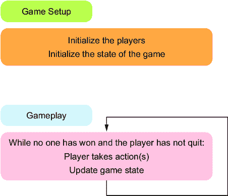
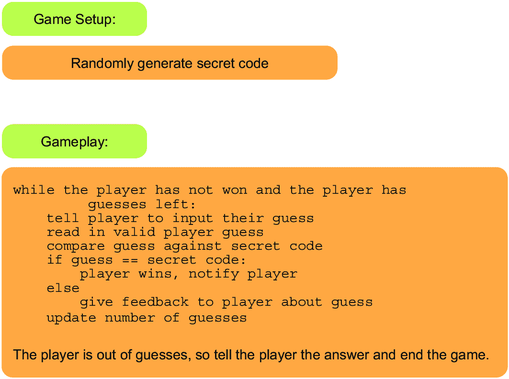
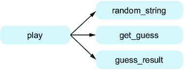
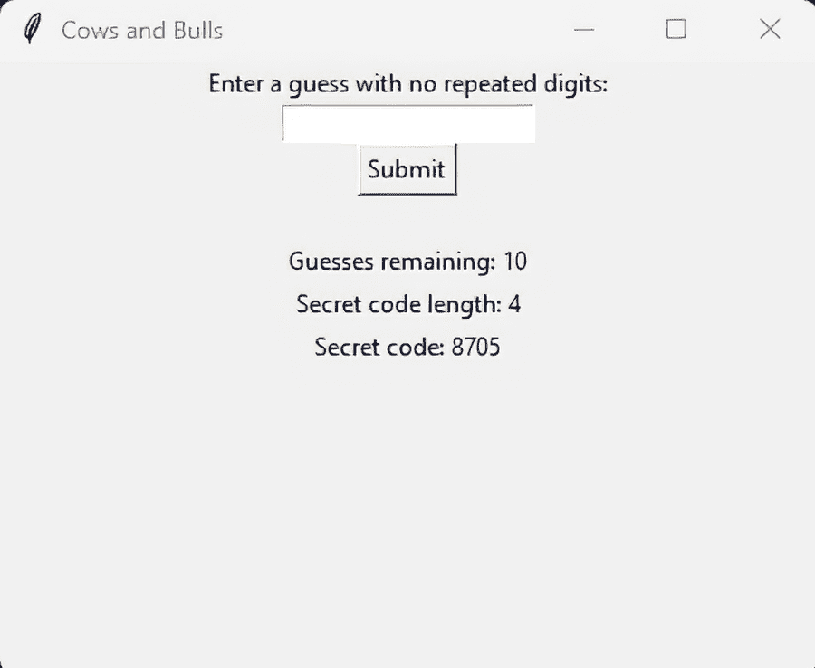
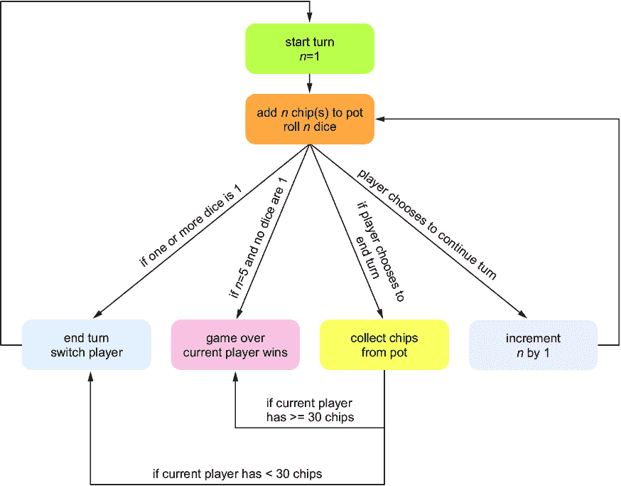
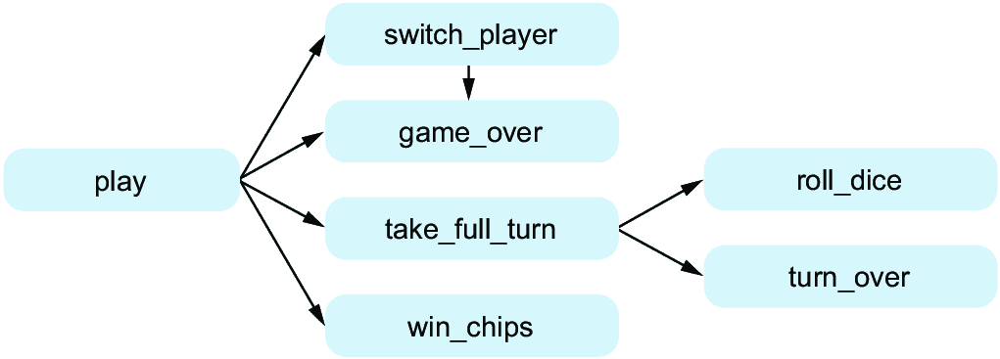

# 第十章：10 制作一些游戏

### 本章内容

+   为我们的程序添加随机性

+   设计和编程一个破译密码的逻辑游戏

+   设计和编程一个“押运运气”骰子游戏

人们学习编程的原因有很多。有些人希望像我们在上一章中所做的那样自动化繁琐的任务。有些人希望从事人工智能（AI）的工作（你将在第十一章中体验到）。还有些人希望制作互动网站、安卓或 iOS 应用程序，或者 Alexa 技能。程序员可以制作的东西是无穷无尽的。

另一个学习编程的热门原因是创造游戏。因此，我们决定通过设计两个小型计算机游戏来继续我们的 Copilot 编程旅程。第一个是一个破译密码游戏，玩家通过线索来识别计算机的秘密密码。第二个是一个双人骰子游戏，两个玩家需要平衡风险和运气，在另一个玩家之前达到要求的点数。与使用图形和动画不同，这些游戏使用文本。我们做出这个决定，是为了帮助我们专注于游戏逻辑，而不是游戏的呈现方式或玩家与游戏的互动方式。在此过程中，如果你有兴趣进一步提升你的游戏制作能力，我们也提供了一些后续步骤。别担心，你目前的技能已经是一个很好的起点了！

## 10.1 游戏程序

如果你考虑和家人或朋友一起玩棋盘游戏，你可以将整个过程分为两个主要阶段。第一个阶段是游戏设置。这包括设置游戏棋盘、为每个玩家分发起始资金或卡牌等。第二个阶段是游戏进行。在棋盘游戏中，通常是一个人轮流行动，如果没有人获胜，另一人再轮流行动。每一轮，游戏状态（棋盘、玩家资金等）都会发生变化。在编写计算机游戏时，我们也需要小心地实现这些阶段。

在许多专门为视频游戏设计的编程环境中，通常有两个分开处理的标准功能。一个是游戏设置功能，用来设置游戏内容，另一个是更新功能，用来在玩家采取行动或时间流逝时改变游戏状态。图 10.1 展示了视频游戏的基本流程。



##### 图 10.1 大多数视频游戏的基本流程

让我们先集中讨论游戏的更新部分。假设玩家可以按下键盘上的一个按钮，在 2D 游戏中向前移动。更新函数将使玩家的角色向前移动，并检查玩家的移动是否使其与游戏世界中的某个元素发生交互。一些游戏还会根据时间变化状态，而不管玩家的行为如何。在这些游戏中，更新函数还会更新游戏本身的状态（例如，在吃豆人游戏中移动幽灵）。在每个时间步骤或用户操作的结束时，游戏将检查结束条件。结束条件通常包括以下内容：

+   玩家通过完成某个目标赢得游戏。

+   玩家因掉入悬崖、撞到怪物等原因失去游戏。

+   玩家选择退出游戏。

有许多编程环境专门针对游戏设计，我们推荐 Python 的 pygame 模块[1]作为一个很好的起点。如果你在此基础上继续深入游戏设计，建议你查看 Unity[2]，这是一个用于 3D 游戏设计的工具。然而，在本章中，我们将仅使用标准 Python 来向你展示如何设计一个基本的游戏，而无需深入这些新的环境。

## 10.2 添加随机性

许多游戏，包括我们在本章中将要制作的两个游戏，都依赖于随机性来增加乐趣。在第一个游戏中，我们需要计算机生成我们将要推断的数字的随机数字。在第二个游戏中，我们需要掷骰子，这实际上就是生成介于一和六之间的随机数字。敌人的行为、谜题的初始朝向或攻击造成的伤害量，也就是随机性，通常涉及游戏设计中的这些以及其他许多方面。

因此，我们需要能够在 Python 程序中生成随机数字。为了学习如何做这一点，我们将像在上一章中一样使用 Copilot Chat。

LPHuman 我需要在我的**Python 程序**中生成随机数字。我该怎么做？

**GitHub Copilot 你可以使用 Python 中的 random 模块生成随机数字。以下是一个示例：

```py
*````*```pypython*````*

*`*import random*`*

*`*# 生成一个介于 1 和 10 之间的随机整数（包括 1 和 10）*`*

*`*random_number = random.randint(1, 10)*`*

*`*print(random_number)*`*

*`*# 生成一个介于 0 和 1 之间的随机浮动数*`*

*`*random_float = random.random()*`*

*`*print(random_float)*`*

*```py`*```*```py`*
```

这段代码导入了 random 模块，然后使用`randint`函数生成一个介于 1 到 10 之间的随机整数（包括 1 和 10），并使用`random`函数生成一个介于 0 到 1 之间的随机浮动数。

Copilot 建议使用一个名为 random 的模块中的函数来生成随机数字。让我们检查一下 random 模块是否已经内置于 Python 中。

LPHuman 这个 random 模块是内置于 Python 中的吗？

GitHub Copilot 是的，random 模块是 Python 的一个内置模块，因此你无需安装任何额外的模块就能使用它。你只需在 Python 代码中导入它并开始使用其函数。

我们将按照 Copilot 的建议导入这个模块，测试我们刚学到的两个函数。我们将在 Python >>> 提示符下进行测试，这是我们在前几章中用来探索 Python 功能的地方。要进入 Python 提示符，按 Ctrl-Shift-P，输入`REPL`，然后选择 Python: 启动 REPL。

基于 Copilot 对我们第一个问题的回答，我们知道可以使用`randint`函数生成一个在最低允许数字和最高允许数字之间的随机整数。我们可能会使用这个函数生成可以组合成更大数字的单个数字。每个数字的范围在 0 到 9 之间，所以我们将让`randint`生成 0 到 9 之间的随机数：

```py
>>> import random
>>> random.randint(0, 9)
5
>>> random.randint(0, 9)
1
>>> random.randint(0, 9)
9                            #1
>>> random.randint(0, 9)
9
>>> random.randint(0, 9)
5
>>> random.randint(0, 9)
0                           #2
>>> random.randint(0, 9)
4
```

#1 我们恰好得到了最大值。

#2 我们恰好得到了最小值。

或者，我们可能想要生成骰子的掷点。每次掷骰子的结果在 1 到 6 之间，所以我们可以让`randint`生成 1 到 6 之间的随机数：

```py
>>> random.randint(1, 6)
2
>>> random.randint(1, 6)
2
>>> random.randint(1, 6)
4
>>> random.randint(1, 6)
1
>>> random.randint(1, 6)
5
```

Copilot 告诉我们的另一个函数叫做`random`。（是的，模块和这个函数都叫`random`！所以，我们需要使用`random.random()`来调用这个函数。）这个函数不会生成一个随机整数；而是生成一个在 0 和 1 之间的随机小数（不包括 1）。例如，你可能得到的不是像 5 这样的随机数，而是像 0.1926502 这样的随机数。这类带小数的数字被称为浮动数（或浮点数）。下面是一些调用这个函数的例子：

```py
>>> random.random()
0.03853937835258148
>>> random.random()
0.44152027974631813
>>> random.random()
0.774000627219771
>>> random.random()
0.4388949032154501
```

我们可以想象这个函数对于游戏也会很有用。例如，你可以将这些浮动值视为事件发生的概率，较高的数字对应较高的概率。然后，你可以使用这些浮动值来判断事件是否应该发生。不过，在本章的游戏中，我们不需要这个函数。

## 10.3 示例 1：公牛与奶牛

*我们的第一个游戏将基于一个叫做“公牛与奶牛”的旧破译游戏。它可能让你想起游戏 Wordle（但如果你没玩过 Wordle 也没关系）。我们将能与计算机一起玩这个游戏。随机性在这个游戏中扮演了至关重要的角色，正如我们将看到的那样。*

*### 10.3.1 游戏如何运作

在这个游戏中，玩家 1 想出一个秘密代码，这个代码是一个由四个数字组成的序列。玩家 2 必须猜出这个秘密代码是什么。在我们版本的游戏中，计算机将充当玩家 1，而人类玩家将充当玩家 2。

它的工作原理是这样的。计算机会随机选择四个不同的数字（不允许重复数字）作为秘密代码。例如，它可能选择数字 1862。然后，你猜测你认为计算机选择的四个数字是什么。例如，你可能猜测是 3821。

对于每个猜测，你会被告知两件事情。首先，你会被告知你猜测中有多少个数字与秘密代码中对应位置的数字完全匹配。我们将出现在正确位置的数字称为“正确”。假设秘密代码是 1862，你猜测的是 3821。你的猜测和秘密代码中的第二个数字都是 8，所以这是一个匹配。没有其他匹配，因此你会被告知这个猜测中正确的数字数量是 1。

其次，你会被告知在你的猜测中有多少个数字出现在秘密代码的其他位置。我们将出现在秘密代码中但位置错误的数字称为“错误位置”。我们再次使用 1862 作为秘密代码，3821 作为你的猜测。你猜测中的第三个数字是 2。它与秘密代码中的第三个数字不匹配（那是 6），但在秘密代码的其他位置有一个 2。同样，你猜测中的第四个数字是 1。它与秘密代码中的第四个数字不匹配，但在秘密代码的其他位置也有一个 1。总的来说，你的两个数字（1 和 2）存在于秘密代码中，尽管它们不在预期的位置。通过这个猜测，你会被告知有 2 个数字在错误位置。你可以利用这些线索逐渐缩小秘密代码的可能性。

##### Wordle

如果你玩过 Wordle，你可能会注意到 Wordle 和我们的游戏之间的一些相似之处。Wordle 使用字母，而我们的游戏使用数字，但你在猜测中得到的反馈类型是相似的。在这两种情况下，你都会被告知字母或数字是否在正确的位置或错误的位置。在 Wordle 中，你会得到关于每个字母的线索。例如，如果你猜测的第一个字母是*h*，你可能会被告知*h*在单词中，但位置不对。相比之下，在我们的游戏中，你不会被单独告知每个数字的提示，而是通过聚合提示来告知你整个猜测的情况。尽管如此，我们希望你能注意到这些相似之处，以及你正在构建的东西与最近全球流行的游戏现象相似！

我们找到了一款免费的“牛与牛”游戏，你可以在[www.mathsisfun.com/games/bulls-and-cows.html](http://www.mathsisfun.com/games/bulls-and-cows.html)玩。我们建议你在继续之前先玩几轮游戏，这样你可以清楚地理解游戏的规则。（注意，他们使用术语*牛*来表示*正确*，使用*牛*来表示*错误位置*。）

在表格 10.1 中，我们提供了一个与游戏的交互示例。我们包括了“评论”列来传达我们的思考和从每个猜测中学到的内容。

##### 表格 10.1 游戏示例

| 猜测 | 错误位置 | 正确 | 评论 |
| --- | --- | --- | --- |
| 0123  | 1  | 0  | 在答案中，0、1、2、3 中的一个数字存在，但都不在正确的位置。 |
| 4567  | 3  | 0  | 在答案中，4、5、6、7 中的三个数字存在，但都不在正确的位置。  |
| 9045  | 0  | 1  | 因为答案中包含一个来自 0123 的数字和三个来自 4567 的数字，我们知道 8 和 9 不在答案中。根据之前的猜测，我们知道至少有一个数字 4 或 5 必须在答案中，并且 0 可能在答案中。一个正确的提示意味着 4 或 5 在正确的位置，4 或 5 不在解决方案中，0 不在解决方案中。 |
| 9048  | 0  | 0  | 我们知道 8、9 和 0 不在答案中，依据之前的猜测。零个正确和零个错位的提示告诉我们 4 也不在答案中，根据之前的猜测，我们现在知道 5 是最后一位数字。 |
| 1290  | 1  | 0  | 回到最初的猜测，我们想知道 1、2 和 3 中的哪一位数字在答案中。我们知道 9 和 0 不在答案中，所以一个错位的提示意味着 1 或 2 在答案中，3 不在答案中。此外，无论 1 或 2 哪个在答案中，它目前的位置是错误的。 |
| 6715  | 2  | 1  | 因为 4 不在解决方案中，我们从第二次猜测中得知 5、6 和 7 在答案中。我们的猜测告诉我们 1 不在答案中，6 和 7 的位置错误。由于 1 不在答案中，2 必须在答案中（根据之前的猜测）。因为 5 在最后，并且我们曾在第二和第三位置尝试过 2，但没有正确的提示，2 必须在第一位置。由于我们曾在第一和第三位置尝试过 6，并且都不正确，6 必须在第二位置。这样就剩下 7 在第三位置了。我们猜对了。 |
| 2675  | 0  | 4  | 是的，这是正确的。 |

游戏的挑战在于你有有限的猜测次数，必须在这些次数内成功猜出计算机的秘密代码。在我们表格 10.1 中的例子中，我们用七次猜测猜出了代码 2675。每次猜测后，我们会根据提示中的错位数字和正确数字数量来指导我们的思考。

在我们刚提到的免费版本游戏中，不允许在猜测中多次使用相同的数字。例如，猜测 1231 就不被允许，因为有两个 1。在我们的游戏版本中，我们也会保持这个限制。

### 10.3.2 自顶向下设计

我们的总体任务是编写一个程序来与计算机一起玩《猜数字》游戏。让我们像在第七章和第九章那样，对这个大任务进行自顶向下的设计。游戏过程中必须发生什么呢？回答这个问题将帮助我们将游戏分解成更小的任务。为了帮助我们完成这一任务，我们根据游戏规则和示例思考了游戏每一步发生的事情。每一个高层步骤都出现在图 10.2 中，所以让我们逐一分析它们。



##### 图 10.2 《猜数字》游戏的步骤

我们将从设置开始。为了让我们能够玩这个游戏，计算机必须随机生成一个秘密代码。我们需要确保秘密代码中没有重复的数字。对我们来说，这听起来像是一个足够复杂且自成一体的任务，因此它应该是一个独立的子任务函数。

在计算机生成秘密代码后，我们可以进入实际的游戏玩法。这时玩家开始进行猜测。我们可能认为可以仅使用`input`来询问玩家的猜测，从而避免使用一个单独的函数来处理这个问题。但我们确实需要确保玩家输入的数字是正确的，并且他们的猜测中没有重复的数字。单单通过一次`input`调用无法做到这些，因此我们也会为此创建一个函数。

一旦玩家做出有效的猜测，我们需要弄清楚两件事：有多少数字是正确的，多少数字是位置错误的？我们应该使用一个函数来完成这两个任务吗？或者，也许我们应该有两个函数，一个用于正确的数字，另一个用于位置错误的数字？我们看到每种做法都有很好的理由。如果我们将这两个任务合并成同一个函数，我们可以将玩家反馈集中在一个地方，这可能会让我们更容易确认代码是正确的。另一方面，使用两个独立的函数会让我们更容易分别测试每种类型的反馈（正确或错误），但这也会导致反馈的逻辑分散到两个函数中。我们有些随意地选择在这里使用一个函数，但如果你希望使用两个独立的函数，我们鼓励你在完成本节内容后自己尝试。

让我们总结一下。我们有一个函数来生成计算机的秘密代码。我们有一个函数来获取玩家的下一个猜测。我们有一个函数来获取玩家猜测的正确/错误线索。这些是我们很高兴从顶层函数中拆分出来的三个主要子任务。

还有其他子任务可以拆分吗？我们的顶层函数肯定还有一些工作要做。例如，我们需要检测玩家的猜测是否与秘密代码匹配，并在这种情况下结束游戏。不过，我们觉得不需要为此单独写一个函数。要判断用户的猜测是否等于秘密代码，我们可以使用 Python 的`==`运算符，它可以直接告诉我们两个值是否相等。而结束游戏，我们可以使用`return`语句来结束顶层游戏函数，从而停止程序。类似地，如果玩家在用完所有猜测次数后仍未猜中秘密代码，我们需要告诉他们游戏结束，但同样，我们应该能通过少量的 Python 代码做到这一点。因此，我们将在此结束顶层函数，调用三个子任务函数。

当我们在第七章解决拼写建议问题时，我们需要将一个子任务拆分为子子任务。但是在这里，我们的三个子任务将作为单个函数来处理。

例如，让我们再次考虑第一个子任务：生成计算机的秘密代码，且不允许重复数字。我们能从中拆分出任何子子任务吗？也许我们可以有一个函数来检查提议的秘密代码中是否有重复的数字。然后，我们可以继续生成秘密代码，调用我们的子子任务函数，直到它告诉我们没有重复数字为止。这样是可行的，但我们也可以逐位生成秘密代码，并且在一开始就不允许重复数字被加入到代码中。这个后者的方案似乎不需要拆分任何子子任务。

现在让我们考虑第二个子任务：获取玩家的下一个猜测。我们可以拆分出一个子子任务，告诉我们一个猜测是否有效（即，它具有正确的长度并且没有重复）。虽然我们当然可以这么做，但通过在子任务函数内部进行几个检查就能轻松完成这件事。（你是不是又回想起第七章关于有效密码和检测有效密码的例子，其中我们将有效性检查拆分成了一个独立的函数？如果是的话，区别在于检查密码是否有效很可能比我们这里需要的有效性检查要复杂得多。）将其拆分为另一个子子任务当然是可以的，但我们将不这样做。我们已经认为我们的第三个子任务按原样处理就很好，因此我们将在这里停止我们的自顶向下设计。

我们将把顶级函数命名为`play`。在其中，我们将调用对应于我们刚刚确定的三个子任务的三个函数。我们将第一个子任务（生成计算机的秘密代码）对应的函数命名为`random_string`，第二个子任务（获取玩家的下一个猜测）对应的函数命名为`get_guess`，第三个子任务（向玩家提供反馈）对应的函数命名为`guess_result`。有关这个自顶向下设计的树状图，请参见图 10.3。



##### 图 10.3 《公牛与母牛》游戏的自顶向下设计。最上面（最左边）的函数是`play`，它调用`random_string`、`get_guess`和`guess_result`。

### 10.3.3 参数和返回类型

*通常，我们会在自顶向下设计中为每个函数定义参数类型和返回值类型，但我们希望在这里单独讨论，因为这次有一些微妙的方面。例如，你可能已经想象到我们会使用整数来表示秘密代码和猜测；但正如我们稍后会看到的，这并不是最好的选择。在我们编写每个函数之前，我们将做出一些决定，关于如何表示所有函数的数据。*

*`play`函数是我们顶层的函数，也是游戏的起始点。这个函数本来可以不接受任何参数。在函数的代码中，我们必须硬编码密钥是四位数字以及玩家可以获得例如 10 次猜测的事实。但这并不是很灵活。如果我们想玩一个密钥是七位数、玩家可以猜测 100 次的游戏版本怎么办？我们就得进入代码并做出所有必要的更改。因此，为了让游戏更容易配置，我们可以为这个函数提供一些参数。例如，尽管密钥的长度通常是四位数，但我们可以使用一个参数来设置密钥的长度，允许它设定为我们想要的任何值。同样地，玩家可以猜测的最大次数也可以不直接写在函数中，而是作为参数，这样我们就可以很方便地更改它。然后，我们所需要做的就是调用这个函数并传入不同的参数值，来改变游戏玩法，而不必修改函数本身的代码。

##### 使用参数和变量来避免魔法数字

允许猜测次数和密钥位数的数量是我们用来解释代码设计中一个重要原则的好例子。这个原则是，当我们编写代码时，如果一个数字可以是参数或变量，它就应该是。这一原则确保了代码的灵活性。当程序员看到代码中出现数字，而不是友好的名称时，他们称这种数字为“魔法数字”，而我们要避免这种情况。在我们讨论玩家可猜测次数或密钥位数时，如果遵循这一原则，这些数字应该作为参数。在某个时刻，这些参数需要被赋予具体的数值以使代码正常工作，但我们应该尽可能在代码的最高层次为它们赋值（例如，玩家可能在游戏开始时设置这些参数）。

为了帮助遵守这一通用原则，每当你在代码中看到一个原始数字（例如 4），就问问自己，是否可以将它作为参数或变量。大多数情况下，它应该是。

添加这些参数是另一个例子，正如我们在第三章讨论的那样，将函数设为通用而不是不必要地限制性。我们的`random_string`函数是生成计算机密钥的函数。为什么我们在这个函数名中使用`string`？难道我们不应该返回一个随机整数，例如 1862 吗？字符串和这个有什么关系呢？

返回一个整数的问题在于，密钥可能以 0 开始。像 0825 这样的密钥是一个完全有效的四位数密钥。但作为整数，0825 是 825，这就没有足够的位数。字符串`'0825'`仅仅是四个数字字符，因此以`'0'`开头的字符串没有问题。

除此之外，让我们提前思考一下我们最终需要做的事情——计算机的秘密代码。我们需要将其与玩家的猜测逐位比较，以确定哪些数字匹配。使用字符串的索引可以让我们轻松访问字符串中的每个字符，这正是我们所需要的。访问整数的每个单独数字则更加具有挑战性：整数不支持索引！

所以，我们的`random_string`函数将接受秘密代码所需的位数作为参数，并返回一个该长度的随机字符串，其中每个字符都是一个数字字符。当我们谈论字符串中的数字时，我们指的只是字符串中的字符。它们恰好是数字字符，但它们仍然是字符，就像`'a'`或`'*'`一样。不要被字符串看起来像一个数字所困扰！这里有一个示例，显示这些字符串与其他字符串的工作方式相同：

```py
>>> s = '1862'
>>> s[0]        #1
'1'
>>> s[1]
'8'
>>> s[2]
'6'
>>> s[3]
'2'
>>> s + 1           #2
Traceback (most recent call last):
  File "<stdin>", line 1, in <module>
TypeError: can only concatenate str (not "int") to str
>>> s + '1'              #3
'18621'
```

#1 我们像往常一样访问字符串的字符。

#2 我们不能将字符串和整数相加。

#3 这是字符串连接，而不是数字加法。

那么，`get_guess`呢？这是一个从玩家那里获取下一个猜测的函数。与`random_string`一样，这个函数需要知道一个有效猜测的位数，所以我们将其设为一个参数。它将返回一个字符串，表示玩家的猜测。

最后，让我们谈谈`guess_result`，这个函数告诉我们有多少数字是正确的，有多少数字是错位的。这个函数需要玩家的猜测字符串和计算机的秘密代码字符串，以便进行比较，因此我们需要这个函数接受这两个参数。我们需要返回两条信息——正确的数字数量和错位的数字数量——所以我们将返回一个包含两个整数的列表。

### 10.3.4 实现我们的函数

完成了自上而下的设计后，我们现在可以与 Copilot 一起编写每个函数的代码了。像往常一样，我们将按自下而上的顺序编写函数。这意味着我们将首先实现我们的三个子任务函数，然后最终实现我们最高层次的`play`函数。

#### random_string

像往常一样，当使用 Copilot 来生成代码时，我们提供`def`行和文档字符串，然后 Copilot 编写代码。在每个代码列表中，我们还会提供一些关于代码如何工作的指导。

我们希望`random_string`函数接受一个秘密代码的位数作为参数，并返回一个没有重复数字的随机秘密代码。在这个函数的代码中，我们可以预期 Copilot 使用`random.randint`在一个循环中运行，直到我们得到足够的位数。为了避免添加重复的数字，代码会仅在该数字不在代码中时才将一个随机数字添加到秘密代码中。我们在 Copilot 的结果中找到了这样的解决方案，并且我们选择在以下列表中展示它。

##### 列表 10.1 用于生成秘密代码的 `random_string` 函数

```py
import random           #1

**def random_string(length):**
 **'''**
 **length is an integer.**

 **Return a string of the given length, where each character**
 **is a digit from 0 to 9, and with no repeated digits.**
 **'''**
    s = ''          #2
    while len(s) < length:             #3
        r = random.randint(0, 9)     #4
        if str(r) not in s:        #5
            s += str(r)          #6
    return s           #7
```

#1 不要忘记导入 random 模块。

#2 从空字符串（当前没有数字）作为秘密代码开始

#3 当我们还需要数字时，继续循环

#4 生成一个从 0 到 9 的随机整数

#5 如果这个数字还没有出现在秘密代码中 . . .

#6 . . . 将此数字添加到秘密代码中。

#7 返回秘密代码

本章我们不专注于测试，但即使专注于测试，我们也不会在该函数的文档字符串中包括具体的测试。这是因为这个函数的结果是随机的。随机性会使得测试函数变得困难，因为很难控制你得到的随机值。我们可以做的是在文档字符串中添加一个测试，至少检查生成的秘密代码包含正确数量的字符，没有重复的字符，并且每个字符都是有效的数字。你也可以通过运行这些函数并观察它们的结果来进行测试，确保它们的结果总是在你的随机范围内，并且结果看起来是随机的。

如果你进行了测试，你会发现我们对这个函数的实现完全没有问题，不需要做更多的修改。如果你只是希望游戏能够运行，可以跳到我们开始编写`get_guess`函数的部分。如果你希望更深入了解 Python 和函数设计，我们愿意借此机会花些时间探讨不同的解决方案。

我们鼓励你查看在按下 Ctrl-Enter 时弹出的窗口中的 Copilot 提议，看看其他可能的方案。例如，我们可以从一个包含所有整数从 0 到 9 的列表开始，然后使用一个名为 `random.shuffle` 的函数将该列表打乱顺序。然后，我们只需要从打乱后的列表中取出前 `length` 个整数（其中 `length` 是秘密代码的长度），这就是秘密代码！我们可以确保不会得到重复的数字，因为我们打乱的原始列表中没有重复的数字。这个版本的函数可能看起来像以下列出的代码。

##### 列表 10.2 `random_string` 函数的替代解决方案

```py
import random
def random_string(length):
 '''
 length is an integer.

 Return a string of the given length, where each character
 is a digit from 0 to 9, and with no repeated digits.
 '''
    digits = list(range(10))               #1
    random.shuffle(digits)             #2
    return ''.join(str(d) for d in digits[:length])    #3
```

#1 创建列表 [0, 1, 2, 3, 4, 5, 6, 7, 8, 9]

#2 随机打乱列表的顺序

#3 从打乱后的列表中返回前 `length` 个数字

如果你想了解这段代码在做什么，你完全有工具去了解！不要认为这段代码是无法理解的。你可以请 Copilot 解释代码，可能得到如下解释。

LPHuman 我的 `random_string` 函数做了什么？

GitHub Copilot 这段代码是一个名为 `random_string` 的 Python 函数，接受一个整数 `length` 作为输入，返回一个给定长度的字符串，其中每个字符都是 0 到 9 之间的数字，并且没有重复的数字。

函数首先使用 `range` 函数和 `list` 构造器创建一个从 0 到 9 的数字列表。然后，使用随机模块中的 `shuffle` 函数对列表进行洗牌。这样可以确保数字顺序是随机的。

最后，函数使用列表推导式将洗牌后的列表中的前 `length` 位数字转换为字符串，并使用 `join` 方法将它们连接成一个单一的字符串。

总体来说，`random_string` 函数生成一个不重复的随机数字字符串，这对于生成唯一的标识符或密码非常有用。

什么是 *列表推导式*？你不需要自己弄明白，你可以让 Copilot 解释给你听。

LPHuman：那个列表推导式是怎么工作的？

GitHub Copilot `random_string` 函数中的列表推导式用于将洗牌后的列表中的前 `length` 位数字转换为字符串，并使用 `join` 方法将它们连接成一个单一的字符串。

以下是列表推导式如何工作的细节：

1.  `str(d)` 对于 `digits[:length]` 是生成字符串列表的表达式。它会取 `digits` 列表中前 `length` 个元素，将每个数字使用 `str` 函数转换为字符串，并返回结果字符串。

1.  `digits[:length]` 是列表推导式操作的可迭代对象。它取 `digits` 列表中前 `length` 个元素，这些元素已经被随机洗牌过。

1.  整个列表推导式被方括号括起来，这样可以从表达式生成的元素中创建一个新列表。

最后，`join` 方法被调用在生成的字符串列表上，将它们连接成一个没有分隔符的单一字符串。

Copilot 中的一些文本可能不完全能理解，但你可以继续让它解释你不理解的部分，直到你确信你明白它是如何工作的。

我们本不需要展示这个第二个有效解决方案，但我们想借此机会提醒你你已经取得了多大的进展。随着你在本书中的学习，你不断发展了理解和创建软件的工具和技巧，同时也培养了学习和持续学习的信心！回到当前的问题，让我们编写下一个函数。

#### get_guess

我们的 `get_guess` 函数接受所需数字的个数作为参数，并从玩家那里返回一个有效的猜测。记住，要使猜测有效，它必须包含正确数量的数字，并且不能有重复的数字。以下是我们从 Copilot 获得的代码。

##### 清单 10.3 函数 `get_guess` 用于用户输入

```py
def get_guess(length):
 '''
 length is an integer.

 Keep asking the player to enter a string where each character 
 is a digit from 0 to 9, until they enter a valid guess.
 A valid guess has the given length and has no repeated digits.
 '''
    guess = input('Enter a guess: ')                           #1
    while len(guess) != length or not guess.isdigit()\    #2
            or len(set(guess)) != length:                
        guess = input('Enter a guess: ')                #3
    return guess       #4
```

#1 首先尝试从玩家那里获取有效猜测

#2 如果长度错误，或者猜测不是全数字或有重复 . . .

#3 . . . 随后尝试从玩家那里获取有效猜测

#4 返回有效的猜测

那个`while-loop`条件是个复杂的条件！最后一部分，`len(set(guess))` `!=` `length`，用于检查用户是否输入了重复的数字。它使用了 Python 集合来完成这个任务。我们在第七章第 7.7.7 节中曾见过这个技巧，不过那是很久以前的事了！所以，如果你需要复习一下，不妨请教 Copilot 来解释这一行。

#### guess_result

我们的`guess_result`函数接受两个字符串作为参数：玩家最近的猜测和秘密代码。它返回一个包含两个整数的列表：正确数字的数量和位置错误数字的数量。

这是一个非常难以正确实现的函数，因此尽管我们在之前的函数中没有展示我们希望运行的测试，但我们将在这个函数的文档字符串中提供一些明确的测试。我们之所以添加这些文档字符串测试，是因为这个函数的逻辑将足够复杂，仅凭阅读代码很难判断代码是否正确。对于我们的文档字符串测试，我们需要一些不同秘密代码和用户猜测的良好示例案例，以确保函数返回的正确和错误位置的数字数量符合预期。当然，按照第六章所说，如果你有兴趣进行更深入的测试，你可能还想添加更多的测试用例。我们的第一个测试用例是

```py
>>> guess_result('3821', '1862')
```

这里正确的返回值是`[1,` `2]`，因为有一个数字是正确的（8），有两个数字是位置错误的（2 和 1）。我们的第二个测试用例是

```py
>>> guess_result('1234', '4321')
```

这次正确的返回值是`[0,` `4]`，因为没有正确的数字，但猜测的四个数字都被放错了位置。以下是我们的完整文档字符串，包括测试用例，以及 Copilot 的代码。

##### 列表 10.4 函数`guess_result`用于获取猜测结果

```py
def guess_result(guess, secret_code):
 '''
 guess and secret_code are strings of the same length.

 Return a list of two values:
 the first value is the number of indices in guess where
 the character at that index matches the character at the
 same index in secret_code; the second value is the 
 number of indices in guess where the character at that 
 index exists at a different index in secret_code.

 >>> guess_result('3821', '1862')
 [1, 2]
 >>> guess_result('1234', '4321')
 [0, 4]
 '''
    correct = 0                     #1
    misplaced = 0          #2
    for i in range(len(guess)):             #3
        if guess[i] == secret_code[i]:    #4
            correct += 1        #5
        elif guess[i] in secret_code:     #6
            misplaced += 1             #7
    return [correct, misplaced]      #8
```

#1 这个变量用于正确的数字。

#2 这个变量用于位置错误的数字。

#3 遍历每个数字字符串的索引

#4 这个数字是正确的。

#5 将正确的计数增加 1

#6 这不是一个匹配项，但被放错了位置。

#7 将位置错误的计数增加 1

#8 返回一个包含两个结果的列表

这里`elif`的使用非常微妙。如果它是用`if`而不是`elif`写的，那么代码就错了！你看出来为什么吗？如果没有，试着和 Copilot 交谈一下，再继续阅读我们这里的解释。

假设`if`条件`guess[i]` `==` `secret_code[i]`为`True`。在这种情况下，我们将`correct`增加 1，并跳过`elif`语句。（记住，`elif`语句只有在前面的`if`和任何前面的`elif`条件为`False`时才会执行。）

现在，假设我们将`elif`改为`if`。如果`if`条件`guess[i]` `==` `secret_code[i]`为`True`，我们仍然会将`correct`增加 1。但接着，我们会检查`guess[i]` `in` `secret_code`条件，而这个条件也会为`True`。毕竟，我们刚才说了`guess[i]` `==` `secret_code[i]`，这证明`guess[i]`确实在`secret_code`中某个位置。所以，我们会错误地将`misplaced` `+=` `1`，这显然是我们不希望发生的（它是一个匹配的数字，而不是一个错误位置的数字）！

#### play

我们已经完成了子任务函数！现在我们只需要编写`play`顶级函数。

我们的`play`函数接受两个整数作为参数：秘密代码和猜测的位数，以及玩家用来猜测秘密代码的猜测次数。它不返回任何内容——它只是进行游戏！我们为这个函数提供的最终提示和代码如下所示。

##### 列表 10.5 函数`play`用于玩游戏

```py
def play(num_digits, num_guesses):
 '''
 Generate a random string with num_digits digits.
 The player has num_guesses guesses to guess the random 
 string. After each guess, the player is told how many 
 digits in the guess are in the correct place, and how 
 many digits exist but are in the wrong place.
 '''
    answer = random_string(num_digits)                         #1
    print('I generated a random {}-digit number.'.format(num_digits))
    print('You have {} guesses to guess the number.'.format(num_guesses))
    for i in range(num_guesses):                        #2
        guess = get_guess(num_digits)            #3
        result = guess_result(guess, answer)          #4
        print('Correct: {}, Misplaced: {}'.format( \   #5
                            result[0], result[1]))     #5
        if guess == answer:            #6
            print('You win!')
            return             #7
    print('You lose! The correct answer was \   #8
                     {}.'.format(answer))       #8
```

#1 生成计算机的秘密代码

#2 每个可能的玩家猜测循环一次

#3 获取玩家的下一个有效猜测

#4 获取该猜测的“正确”和“错误位置”反馈

#5 告诉玩家提示

#6 玩家正确猜出了秘密代码！

#7 退出函数；这结束了游戏。

#8 如果我们到这里，说明玩家已经用完了猜测次数。

如果我们现在运行程序，什么也不会发生。那是因为我们还没有调用`play`函数！我们总是需要记得调用我们的顶级函数。为了调用它，我们可以在`play`函数下添加这一行：

```py
play(4, 10)
```

`4`表示我们正在玩四位数的代码和猜测，`10`表示我们有 10 次猜测机会来正确猜出秘密代码。你可以更改这些参数，调整游戏的设置。

在继续之前，让我们先试试我们的游戏。我们会展示我们最初的几个猜测，然后是我们的最终猜测：

```py
I generated a random 4-digit number.
You have 10 guesses to guess the number.
Enter a guess: 0123
Correct: 1, Misplaced: 0
Enter a guess: 4567
Correct: 1, Misplaced: 0
Enter a guess: 8901
Correct: 2, Misplaced: 0
Enter a guess: 8902
Correct: 2, Misplaced: 1
...
Enter a guess: 2897
Correct: 1, Misplaced: 3
You lose! The correct answer was 8927.
```

我们成功设计了一个计算机游戏，这是一种与我们在本书中编写的其他程序非常不同的程序。我们的计算机游戏与用户互动，具有随机性，涉及两位玩家（人类玩家猜测，计算机玩家提供正确/错误位置的线索），并且有胜负条件。这是很多新东西！然而，我们也希望你能看到我们从之前的章节学到了多少并带了多少内容过来。我们依然在做自顶向下的设计，依然在设计函数，依然在测试代码，依然在阅读代码，依然在与 Copilot 交流。你在这一章节之前没有写过游戏，但从本质上讲，你已经具备了做到这一点的技能。不要让看似新的程序或应用类型阻止你尝试去做它。

### 10.3.5 为“猜数字”添加图形界面

也许您会对我们的游戏看起来不像您最近玩过的游戏感到失望，因为没有图形，只有文本。例如，没有一个漂亮的区域来输入文本，没有按钮可以点击，完全没有图形界面。在本章中，我们已经讨论了为什么专注于文本游戏，但这并不意味着将此游戏转换为图形界面版本完全超出了您的能力范围，因为您可以与 Copilot 交互，看看它是否可以帮助您入门。

挑战在于程序员使用称为*事件驱动编程*的编程样式创建图形用户界面，我们尚未在本章中教授，并且在本章中无法全部教授。您可以阅读事件驱动编程代码并理解其大致含义，这就是如果要求 Copilot 编写代码生成图形界面时需要做的事情。尽管如此，如果 Copilot 未能提供您想要的结果，则在熟悉事件驱动编程之前可能很难修复。如果您希望了解更多信息，关于使用 Python 进行游戏编程和包括图形用户界面和事件驱动编程的优秀书籍是*Invent Your Own Computer Games with Python* [3]。

##### 事件驱动编程

事件驱动编程通常用于与用户交互的程序。在高层次上，程序建立了一种用户与程序交互的方式（例如，按按钮或输入文本），然后只是等待用户采取行动，有时在等待用户输入时更新游戏状态。一旦用户与游戏交互，代码将此交互识别为*事件*，每个事件都有与之关联的代码，在事件发生时应执行。例如，当用户点击退出游戏按钮时，触发需要执行的代码（例如，保存游戏状态并退出程序）。

当我们要求 Copilot 为 Bulls and Cows 创建图形界面时，它给了我们令人印象深刻的结果，因此我们想向您展示它的表现。即使不了解事件驱动编程，代码也相对易读。例如，您可能会找到游戏的标题并更改它。为此，我们向 Copilot Chat 提出了以下问题：

LPHuman 您能将此程序转换为使用图形界面而不是文本界面吗？

Copilot 回应我们，逐步列出了我们需要进行的更改。然后，它重写了代码，使游戏现在使用带有按钮和编辑框的图形界面，而不是文本界面。有关新界面，请参见图 10.4。要生成此界面的代码，请访问该书籍的网站，以便自行运行或了解代码。



##### 图 10.4 由 Copilot 提供的游戏图形界面。请注意，界面中显示了秘密代码，可能是为了帮助测试（你会在玩游戏之前删除它）。

## 10.4 示例 2：Bogart

*我们的第二个游戏将是一个双人骰子游戏。在“牛与牛”游戏中，一个玩家是人类，另一个是计算机。这一次，我们将为两个人类玩家编写一个游戏。随机性再次将在游戏中发挥关键作用。一旦我们完成，你可以与朋友或家人一起玩！*

*### 10.4.1 游戏规则

我们将在这里编写的游戏叫做 Bogart，由 Crab Fragment Labs 设计。这是一个为两名玩家设计的骰子游戏。游戏还使用了一个筹码或硬币的锅。不过，由于我们将其实现为计算机游戏，因此显然不需要实际的骰子或筹码。

##### Bogart

Bogart 游戏由 James Ernest 设计（© 1999 James Ernest 和 Cheapass Games，已获许可；[`crabfragmentlabs.com/`](https://crabfragmentlabs.com/)）。你可以免费下载原版游戏的说明书，作为游戏.pdf 文件的一部分：[`crabfragmentlabs.com/shop/p/chief-herman-1`](https://crabfragmentlabs.com/shop/p/chief-herman-1)。如果你喜欢这个游戏并且停不下来，我们鼓励你支持 Crab Fragment Labs 所做的工作。感谢他们允许我们在这里使用他们的游戏！

游戏开始时，锅中的筹码为空（没有任何筹码）。随机选择两名玩家中的一位开始游戏。从那里开始，每个玩家轮流进行，直到游戏结束。我们首先解释玩家进行回合意味着什么，然后给出游戏结束时的规则。图 10.5 也提供了游戏流程的概述。

在玩家回合开始时，向锅中添加一个筹码，玩家掷一个骰子。如果掷出的骰子是 1，那么该玩家的回合结束，并且他们不会收集任何筹码。如果掷出的骰子不是 1，那么玩家可以决定是否继续他们的回合。如果他们决定不继续回合，他们将收集锅中的所有筹码（使锅为空）。



##### 图 10.5 Bogart 中的玩家回合

如果他们决定继续回合，那么向锅中添加两个筹码，并且他们掷两个骰子。如果其中一个或两个骰子是 1，那么玩家的回合结束。否则，玩家再次可以决定是否继续他们的回合。

如果他们继续回合，那么他们先掷三个骰子，再掷四个骰子，然后掷五个骰子。（玩家不能跳过某个骰子的数量；他们必须按顺序掷骰，从一个骰子开始。）如果他们掷出了 1，那么回合结束，他们不会收集任何筹码。如果他们决定不继续回合，那么他们将收集锅中的所有筹码。

在这个游戏中，掷出 1 对当前玩家来说是坏消息。当掷一个骰子时，掷出 1 的概率较低，只有 1/6（约 17%）。当掷两个骰子时，掷出至少一个 1 的概率更高，这次大约是 31%。掷三个骰子的概率更高（42%），掷四个骰子的概率更高（52%），掷五个骰子的概率更高（60%）。因此，回合延长得越久，你最终掷出 1 的概率越大，这样你回合什么也得不到。更糟糕的是，如果另一个玩家比你更保守地玩，他们可能会收集到很多你留在锅里的筹码。与此同时，回合延长得越久，锅里的筹码积累得越快，假设你最终成功结束回合，你可以收集到更多的筹码。整个诀窍在于决定什么时候冒险争取更多筹码，什么时候拿走你已经拥有的筹码。

这就是玩家回合的运作方式。玩家轮流进行回合，掷骰子并收集筹码，直到游戏结束。游戏有两种结束方式：

1.  如果一个玩家收集了 30 个或更多筹码，那么这个玩家就赢了。

1.  假设一个玩家在他们的回合里先掷一个骰子，然后是两个骰子，接着是三个、四个、五个骰子，而且他们从来没有掷出 1。然后，这个玩家立刻赢了。不管他们收集了多少筹码：如果他们掷了五个骰子，且其中没有一个是 1，他们就赢了。

#### 博加特示例游戏

让我们模拟几回合游戏，确保我们清楚地了解一切是如何运作的。锅开始时是空的。假设玩家 1 是随机选择的第一个玩家。我们往锅里加一个筹码，玩家 1 掷了一个骰子。假设他们掷出了一个 5。现在玩家 1 必须决定是结束回合拿走锅里的一个筹码，还是继续回合。

假设他们继续他们的回合。我们往锅里再加两个筹码；现在锅里有三个筹码。玩家 1 掷了两个骰子。假设他们掷出了一个 4 和一个 2。

他们应该结束回合并拿走三个筹码吗？不，不行。他们想要更多。他们继续他们的回合。我们往锅里再加三个筹码；现在锅里有六个筹码。玩家 1 掷了三个骰子。这次他们掷出了一个 6，一个 5，还有——哦不！——一个 1。玩家 1 的回合结束了。他们没有拿到任何筹码，并且留了六个诱人的筹码在锅里，供玩家 2 收集。

现在轮到玩家 2 了。我们往锅里加一个筹码——现在锅里有七个筹码！——玩家 2 掷了一个骰子。假设他们掷出了一个 2。如果玩家 2 现在结束回合，他们将收集到锅里的七个筹码。这看起来好多啊，所以假设玩家 2 决定结束回合。

现在锅里空了，该轮到玩家 1 了。玩家 1 有很多追赶的任务：他们有 0 个筹码，而玩家 2 有 7 个筹码。我们暂时停在这里，但游戏会继续，直到有一个玩家收集到 30 个或更多筹码，或者他们成功地掷了五个骰子且没有掷出任何 1。

### 10.4.2 自顶向下设计

正如我们在实现“牛与牛”游戏时所遇到的那样，实现“博加特”是一个大问题，我们需要自上而下的设计。我们现在提供这个设计，但在继续之前，我们鼓励你自己尝试一下。我们推荐这样做，因为我们发现，对于这个游戏来说，有效的自上而下设计是微妙的，原因在于许多元素之间的相互作用。例如，玩家的回合可以以三种方式结束：收集筹码、不收集筹码以及直接获胜。我们需要能够确定发生了哪种情况。另一个例子是，在每个玩家的回合结束后，我们需要切换到另一个玩家——不过，遗憾的是，并非总是这样：如果玩家获胜，我们希望立即停止游戏并宣布他们为胜者，而不是切换到另一个玩家！我们将主要专注于我们成功的自上而下设计，但偶尔也会说明我们做出某些决策的原因，以及其他决策中的错误。

我们将把顶层函数命名为`play`。以下是我们需要为游戏解决的主要子任务：

1.  初始化锅，并让玩家 1 和玩家 2 从零筹码开始。这是游戏设置阶段的一部分。

1.  随机选择玩家 1 或玩家 2 开始游戏，这也是游戏设置的一部分。

1.  现在进入游戏阶段。在游戏未结束时，执行以下操作：

    1.  打印锅中的筹码数量，玩家 1 的筹码数量，以及玩家 2 的筹码数量。

    1.  执行当前玩家的完整回合。

    1.  如果当前玩家赢得了筹码，将筹码给当前玩家，并将锅中的筹码重置为零。

    1.  切换到另一位玩家的回合。

1.  打印出获胜玩家的名字（玩家 1 或玩家 2）。

在本书的这一部分，我们推测你已经足够熟悉来自 Copilot 的代码，能够直观地理解哪些任务需要单独的函数。任务 1 只是一些变量赋值，因此我们不需要为此创建单独的函数。其他不需要单独函数的任务有任务 2（只是调用了`random.randint`），任务 3a（只是几个`print`调用），和任务 4（一个`print`调用）。我们将把剩余的每个子任务封装在一个函数中。以下子部分描述了剩余子任务的具体内容。

#### 任务 3。游戏未结束时

我们将有一个`while`循环，它在游戏未结束时持续进行，因此我们需要一个函数来判断游戏是否结束！这个函数如何知道游戏是否结束呢？它需要知道玩家 1 和玩家 2 当前各自的筹码数量。这样，它就可以检查是否有玩家的筹码至少为 30。不过记住，游戏结束的另一种方式是当玩家掷出五个骰子，其中没有一个是 1。因此，这个函数还需要知道当前玩家最近的骰子投掷结果。

我们将把这个函数命名为`game_over`。它将接受三个参数：玩家 1 的筹码、玩家 2 的筹码和骰子掷出的列表。若游戏结束则返回`True`，否则返回`False`。该函数的代码需要检查一些条件，但我们应该能够在不拆分为更多子任务的情况下完成。

#### 任务 3b：为当前玩家进行完整回合

我们将把这个函数命名为`take_full_turn`。该函数*需要*知道目前锅中有多少筹码，以便在需要时进行更新。它还需要返回更新后的锅中筹码数量。除此之外，我们需要管理很多事情才能执行完整的回合，因此我们需要控制这个函数的复杂性。下面是我们认为这个函数可能需要执行的操作：

1.  允许玩家先掷一个骰子，然后是两个骰子，接着是三个骰子，依此类推，直到玩家的回合结束。

1.  根据本回合发生的情况更新当前玩家的筹码数量。我们可以添加一个额外的返回值，将这个更新的信息传递给调用此函数的对象。

1.  确定游戏是否结束。我们可以添加一个额外的返回值，其中`True`表示游戏已结束，`False`表示游戏尚未结束。

我们最初尝试让这个函数完成这三项任务，但未能从 Copilot 那里得到令人满意的代码。这并不令人意外，因为我们要求这个函数做的事情太多了。于是我们将注意力集中在这个函数的核心任务上，即第 1 点。

但是好吧，如果我们只关注第 1 点，那么我们将如何更新当前玩家的筹码数量（第 2 点），以及我们如何知道游戏是否结束（第 3 点）？对于第 2 点，我们想到的解决方案是，在这个函数中不更新当前玩家的筹码数量，而是返回回合结束后锅中筹码的总数。

例如，如果锅中有 10 个筹码，而这次玩家的回合产生了 6 个筹码，那么我们将返回 16。玩家是否能收集到这 16 个筹码—这取决于他们的回合结束方式—但我们在这里不讨论这一点（这是由调用函数来处理的）。

对于第 3 点（判断游戏是否结束），我们的解决方案是让函数将最近的骰子掷出列表作为返回值的一部分。（调用此函数的函数还将需要这个掷出列表来处理第 2 点。）调用此函数的函数可以使用这些掷出结果来判断游戏是否结束。

总结来说，我们的函数将接受锅中筹码的数量作为参数，并返回一个包含两个值的列表：玩家回合结束后锅中筹码的新数量，以及最近一次的骰子掷出列表。

为了进行完整的回合，我们需要能够掷骰子：首先是一颗骰子，然后是两颗骰子，接着是三颗骰子，以此类推。我们将这部分拆解成一个名为`roll_dice`的函数。该函数将以骰子的数量作为参数，并返回一个骰子结果列表。例如，如果我们要求该函数掷三颗骰子，返回的可能是`[6, 1, 4]`。

我们还需要根据最近的骰子结果列表来判断回合是否结束。如果玩家掷出了任何 1，或者掷出了五颗骰子且没有一颗是 1，那么回合结束。我们将这部分也拆解成一个名为`turn_over`的函数。该函数将以骰子结果列表为参数，如果回合结束，则返回`True`，否则返回`False`。

如果回合没有结束，那么我们需要问玩家是否希望继续他们的回合。我们会要求玩家给出是（y）或否（n）的回答。我们可以通过调用`input`函数来实现。如果玩家想继续进行回合，我们可以再次调用`roll_dice`。我们不需要一个单独的函数来获取用户输入，因此不再进一步拆解这一部分。如果我们想要验证用户的输入（拒绝任何不是 y 或 n 的回答），这会增加足够的复杂性，可能会导致我们将其拆解出来。

总结一下，我们为`take_full_turn`函数分解了两个子任务：`roll_dice`和`turn_over`。这些函数不需要进一步拆解。对于`roll_dice`，我们可以在循环中使用`random.randint`来生成我们需要的骰子结果。而`turn_over`将包括对骰子结果的几次检查，以确定是否结束了本轮，无需进一步拆解。

#### 任务 3c。如果当前玩家赢得了筹码

当玩家的回合结束时，我们将得到新筹码数和结束回合的最终骰子结果列表。我们需要判断玩家是否获得了这些筹码。（如果最终的骰子结果列表中没有 1，则玩家获得筹码；否则，他们没有获得筹码，筹码留在了奖池中。）

我们将拆解出一个函数来判断玩家是否获得筹码。我们将其命名为`wins_chips`。该函数将以最近的骰子结果列表为参数，如果玩家赢得了筹码，则返回`True`，否则返回`False`。

#### 任务 3d. 切换到另一个玩家的回合

我们将这个函数命名为 `switch_player`。假设当前玩家刚刚完成了他们的回合。我们需要切换到另一个玩家的回合，但前提是游戏还没有结束。我们的函数将封装这一逻辑。它需要调用 `game_over` 来判断游戏是否结束，因此 `switch_player` 至少需要三个参数：玩家 1 的筹码，玩家 2 的筹码，以及最近一次的骰子掷出结果列表。我们还需要一个参数来指示当前玩家（1 或 2），这样我们就可以返回下一个切换到的玩家编号。因此，函数将接受这四个参数，并返回 1 或 2，表示我们切换到的下一个玩家。

如果游戏已经结束，这个函数不会做任何事情。如果游戏没有结束，那么我们需要将 1 改为 2 或将 2 改为 1。我们已经有了 `game_over` 函数，这对于拆解这个函数已经足够了。

我们已经完成了自顶向下的设计！请查看图 10.6，查看我们的函数树。



##### 图 10.6 Bogart 游戏的自顶向下设计

### 10.4.3 实现我们的函数

现在是时候与 Copilot 一起编写每个函数的代码了。和往常一样，我们将从叶子函数开始，逐步实现自顶向下的 `play` 函数，只有当其他所有函数都实现之后，我们才会实现顶层的 `play` 函数。我们可以从任何一个叶子函数开始。我们将从 `game_over` 函数开始，因为它同时被 `play` 和 `switch_player` 需要。然后，我们将继续实现其他函数。

#### game_over

这个函数接受三个参数：玩家 1 拥有的筹码数量，玩家 2 拥有的筹码数量，以及最近一次的掷骰结果列表。如果游戏结束，它返回 `True`，如果没有结束，则返回 `False`，如下所示的列表所示。

##### 列表 10.6 中的 `game_over` 函数，位于 Bogart 中

```py
def game_over(player1, player2, rolls):
 '''
 player1 is the number of chips that player 1 has.
 player2 is the number of chips that player 2 has.
 rolls is the last list of dice rolls.

 Return True if the game is over, False otherwise.

 The game is over if player1 has at least 30 chips, 
 or player 2 has at least 30 chips, 
 or there are 5 rolls none of which is a 1.
 '''
    return player1 >= 30 or player2 >= 30 or \       #1
            (len(rolls) == 5 and not 1 in rolls)     #1
```

#1 游戏结束的三种方式

记住，游戏有三种方式结束：玩家 1 至少有 30 个筹码，玩家 2 至少有 30 个筹码，或者某个玩家在最后一次回合中成功掷出了五个骰子且没有掷出 1。

##### 直接返回布尔值

你可能预期代码应该是这样，使用 `if-else` 和实际的 `return` `True` 和 `return` `False` 语句：

```py
if player1 >= 30 or player2 >= 30 or (len(rolls) == 5
        and not 1 in rolls):
    return True
else:
    return False
```

这样也可以，但更常见的是程序员直接使用 `return` 语句与 `True`/`False` 表达式一起使用。它之所以有效，是因为表达式的结果就是返回的内容。如果表达式为真，返回 `True`，如果表达式为假，返回 `False`。这与 `if-else` 版本做的事情完全一样！

#### roll_dice

这是一个用于掷骰子并为游戏添加随机性的函数。它以要掷的骰子数量为参数，并返回骰子掷出的列表。我们可以预期 Copilot 会在这里使用 `random.randint`，如列表 10.7 所示。

除了返回投掷结果列表之外，如果这个函数还能够打印每次投掷的结果，那就更好了。这样玩家就能准确地看到他们投掷了什么。在文档字符串中，我们要求 Copilot 打印投掷结果（除了返回投掷结果列表之外）。

##### 示例 10.7 `roll_dice` 函数在 Bogart 中

```py
import random
def roll_dice(n):
 '''
 Create a list of n random integers between 1 and 6.
 Print each of these integers, and return the list.
 '''
    rolls = []                   #1
    for i in range(n):          #2
        roll = random.randint(1, 6)      #3
        print(roll)                   #4
        rolls.append(roll)      #5
    return rolls      #6
```

#1 骰子投掷列表（1 到 6 之间的整数），初始为空

#2 循环 n 次，每次投掷一次

#3 使用 “randint” 生成一个 1 到 6 之间的随机整数

#4 打印投掷结果，供玩家查看

#5 将投掷结果添加到投掷列表中

#6 返回投掷结果列表

#### turn_over

这个函数接受最近的投掷结果列表，并用它来判断当前玩家的回合是否结束。如果回合结束，返回 `True`，否则返回 `False`，如下所示的示例。

##### 示例 10.8 `turn_over` 函数在 Bogart 中

```py
def turn_over(rolls):
 '''
 Return True if the turn is over, False otherwise.

 The turn is over if any of the rolls is a 1, 
 or if there are exactly five rolls.
 '''
    return 1 in rolls or len(rolls) == 5      #1
```

#1 回合结束的两种方式

玩家回合结束有两种方式。第一种是投掷结果中出现了 1。第二种是玩家投掷了五个骰子。

`len(rolls)` 是否为 `==` `5` 真的是回合结束的标志吗？我们难道不需要检查是否有投掷到 1 吗？不，如果玩家投掷了五个骰子，那么他们的回合就结束，无论骰子的结果如何。如果他们投掷了 1，那么回合结束（且他们不会收集任何筹码）。如果他们没有投掷到 1，那么回合仍然结束（而且在这种情况下他们将自动获胜）。

#### take_full_turn

我们现在可以使用 `take_full_turn`，如示例 10.9 所示。这个函数接受当前奖池中的筹码数量作为参数。它将处理当前玩家完整回合中的所有投掷结果，并返回一个包含两个值的列表：奖池中新筹码的数量和最终的投掷结果列表。

##### 示例 10.9 `take_full_turn` 函数在 Bogart 中

```py
def take_full_turn(pot_chips):
 '''
 The pot has pot_chips chips.

 Take a full turn for the current player and, once done, 
 return a list of two values:
 the number of chips in the pot, and the final list of dice rolls.

 Begin by rolling 1 die, and put 1 chip into the pot.
 Then, if the turn isn't over, ask the player whether 
 they'd like to continue their turn.
 If they respond 'n', then the turn is over.
 If they respond 'y', then roll one more die than last time, 
 and add 1 chip to the pot for each die that is rolled.
 (for example, if 3 dice were rolled last time, then 
 roll 4 dice and add 4 chips to the pot.)
 If the turn is not over, repeat by asking the player again 
 whether they'd like to continue their turn.
 '''
    rolls = roll_dice(1)      #1
    pot_chips += 1                       #2
    while not turn_over(rolls):                   #3
        keep_going = input('Continue? (y/n) ')      #4
        if keep_going == 'y':                       #5
            rolls = roll_dice(len(rolls) + 1)         #6
            pot_chips += len(rolls)           #7
        else:
            break                  #8
    return pot_chips, rolls    #9
```

#1 投掷一个骰子

#2 向奖池中添加一个筹码

#3 当当前玩家的回合没有结束时 . . .

#4 . . . 询问玩家是否要继续他们的回合。

#5 如果玩家确实想继续他们的回合 . . .

#6 . . . 比上次多投掷一个骰子。

#7 向奖池中添加新筹码

#8 跳出 while 循环

#9 返回奖池中的筹码数量和最终的投掷结果列表

#### wins_chips

这个函数接受投掷结果列表作为参数。如果投掷结果有效（即没有 1），玩家将收集筹码。如果投掷结果中包含任何 1，玩家将无法收集筹码。这个函数返回 `True` 如果玩家能够收集筹码，否则返回 `False`，如下所示的示例。

##### 示例 10.10 `wins_chips` 函数在 Bogart 中

```py
def wins_chips(rolls):
 '''
 Return True if the player wins chips, False otherwise.

 The player wins the chips if none of the rolls is a 1.
 '''
    return not 1 in rolls      #1
```

#1 当没有 1 出现时返回 True，否则返回 False

#### switch_player

这个函数接受四个参数：玩家 1 拥有的筹码数，玩家 2 拥有的筹码数，最近一轮的掷骰子列表（由当前玩家掷出），以及当前玩家的编号。如果游戏没有结束，这个函数返回另一个玩家的编号。如果游戏结束了，函数则返回当前玩家（因为另一个玩家已经没有回合了！）。请参见以下代码清单。

##### 清单 10.11 博加特中的`switch_player`函数

```py
def switch_player(player1, player2, rolls, current_player):
 '''
 player1 is the number of chips that player 1 has.
 player2 is the number of chips that player 2 has.
 rolls is the last list of dice rolls.
 current_player is the current player (1 or 2).

 If the game is not over, switch current_player to the other player.
 Return the new current_player.
 '''
    if not game_over(player1, player2, rolls):     #1
        if current_player == 1:                #2
            current_player = 2
        else:
            current_player = 1
    return current_player        #3
```

#1 如果游戏未结束…

#2 …从 1 切换到 2，或者从 2 切换到 1。

#3 返回新的当前玩家

#### play

我们已经完成了`play`函数！我们决定不使用任何参数来编写这个函数。你可能会想，如果我们添加一个参数来指定赢得游戏所需的筹码数（目前是 30），代码会不会更灵活呢？当然可以这样做；我们在这里没有这样做，以保持代码中参数的数量较小。这个函数不返回任何内容，而是像下面的清单所示那样进行游戏。

##### 清单 10.12 博加特中的`play`函数

```py
def play():
 '''
 Play the game until the game is over.

 The pot starts with 0 chips, and each player starts with 0 chips.

 Randomly decide whether player 1 or player 2 goes first.

 Before each turn, print three lines of information:
 1\. The number of chips in the pot
 2\. The number of chips that each player has
 3\. Whether it is player 1's turn or player 2's turn

 Take a full turn for the current player. 
 If they won the chips, add the chips in the pot to the 
 total for that player and reset the pot to have 0 chips.

 Then, switch to the other player's turn.

 Once the game is over, print the current player 
 (that's the player who won).
 '''
    pot_chips = 0      #1
    player1 = 0        #1
    player2 = 0        #1
    current_player = random.randint(1, 2)      #2
    rolls = []
    while not game_over(player1, player2, rolls):     #3
        print('Pot chips:', pot_chips)               #4
        print('Player 1 chips:', player1)              #4
        print('Player 2 chips:', player2)            #4
        print('Player', current_player, 'turn')      #4
        pot_chips, rolls = take_full_turn(pot_chips)     #5
        if wins_chips(rolls):                           #6
            if current_player == 1:                   #7
                player1 += pot_chips                       #8
            else:
                player2 += pot_chips          #9
            pot_chips = 0                              #10
        current_player = switch_player(player1, player2,  #11
                                       rolls, current_player)
    print('Player', current_player, 'wins!')   #12
```

#1 初始化底池和玩家，开始时都没有筹码

#2 随机决定由玩家 1 或玩家 2 开始游戏

#3 当游戏没有结束时…

#4 …打印当前游戏状态。

#5 让当前玩家进行他们的回合

#6 如果当前玩家赢得筹码…

#7 …然后是玩家 1 的回合…

#8 …给玩家 1 从底池中拿筹码；…

#9 …否则，给玩家 2 从底池中拿筹码。

#10 重置底池，底池现在有 0 筹码

#11 切换到另一个玩家的回合

#12 打印出谁赢了

现在我们拥有了游戏所需的所有代码。只需要添加

```py
play()
```

在你现有的代码下方调用我们的`play`函数，然后你就能开始游戏了！

#### 自定义游戏

我们对 Copilot 给出的结果很满意，游戏也确实可以玩。但是，老实说，与玩家的互动可以做得更具用户友好性。例如，以下是当我们运行游戏并按下 y 几次后，游戏开始时可能会出现的情况：

底池筹码：0

玩家 1 的筹码：0

玩家 2 的筹码：0

玩家 2 的回合

4

继续吗？（y/n） y

5

2

继续吗？（y/n） y

3

1

4

底池筹码：6

玩家 1 的筹码：0

玩家 2 的筹码：0

玩家 1 的回合

2

继续吗？（y/n）

没有欢迎信息。像 4、5、2 这样的数字只是出现在那里，毫无解释它们的含义。游戏问我们是否要“继续吗？（y/n）。”但是，继续什么呢？并不明确。

我们可以通过增加更多的`print`调用来使与玩家的互动更加愉快。我们可以直接在每个`print`语句中放入我们想要的内容。为什么不直接使用 Copilot 呢？实际上，直接做可能比让 Copilot 准确打印我们想要的内容要简单。例如，以下清单展示了一个新版的`play`函数，我们增加了更多的`print`调用来解释发生了什么并更好地格式化游戏输出。

##### 清单 10.13 博加特中格式更好的`play`函数

```py
def play():
 '''
 Play the game until the game is over.

 The pot starts with 0 chips, and each player starts with 0 chips.

 Randomly decide whether player 1 or player 2 goes first.

 Before each turn, print three lines of information:
 1\. The number of chips in the pot
 2\. The number of chips that each player has
 3\. Whether it is player 1's turn or player 2's turn

 Take a full turn for the current player. 
 If they won the chips, add the chips in the pot to the
 total for that player
 and reset the pot to have 0 chips.

 Then, switch to the other player's turn.

 Once the game is over, print the current player 
 (that's the player who won).
 '''
    pot_chips = 0
    player1 = 0
    player2 = 0
    current_player = random.randint(1, 2)
    rolls = []

    print('Welcome to Bogart!')       #1
    print()                            #2

    while not game_over(player1, player2, rolls):
        print('Pot chips:', pot_chips)
        print('Player 1 chips:', player1)
        print('Player 2 chips:', player2)
        print('Player', current_player, 'turn')
        pot_chips, rolls = take_full_turn(pot_chips)
        if wins_chips(rolls):
            print('Player', current_player, 'gets',  #3
                  pot_chips, 'chips!')                 #3
            if current_player == 1:
                player1 += pot_chips
            else:
                player2 += pot_chips
            pot_chips = 0
        current_player = switch_player(player1, player2, 
                                       rolls, current_player)

        print()
        print()
        print('-=' * 20)     #4
        print()

    print('Player', current_player, 'wins!')
```

#1 打印欢迎信息

#2 打印空行

#3 打印消息，说明当前玩家获得了筹码

#4 将每个回合与下一个回合分开

我们鼓励你在其他地方也添加 `print` 调用，以使游戏互动更加生动！例如，在 `roll_dice` 中，你可以添加一个 `print` 调用，告诉玩家即将掷骰（**掷骰**将在下面的输出中显示）。在 `take_full_turn` 中，你可以添加一个 `print` 调用，在询问玩家是否要继续回合之前，打印出底池中的筹码数量。以下是我们做出这些修改后，游戏互动的样子：

欢迎来到博加特！

底池筹码：0

玩家 1 的筹码：0

玩家 2 的筹码：0

玩家 2 回合

**掷骰**

2

底池当前有 1 个筹码。

继续回合吗？（y/n）y

**掷骰**

6

3

底池当前有 3 个筹码。

继续回合吗？（y/n）y

**掷骰**

1

1

6

-=-=-=-=-=-=-=-=-=-=-=-=-=-=-=-=-=-=-=-=

底池筹码：6

玩家 1 的筹码：0

玩家 2 的筹码：0

玩家 1 回合

**掷骰**

5

底池当前有 7 个筹码。

继续回合吗？（y/n）

尝试对你的代码做类似的修改。让游戏变成你的作品！

在本章中，我们使用 Copilot 帮助我们编写了两个计算机游戏：一个逻辑游戏（类似于 Wordle，但用数字），以及一个两人掷骰游戏。我们能够做到这一点，利用了我们在整本书中培养的技能，包括问题分解、编写清晰的文档字符串和与 Copilot Chat 的互动。

## 10.5 练习

1.  以下 `guess_result` 函数中存在一个错误，导致正确和错误位置数字的计数不正确。找出并修复该错误：

```py
def guess_result(guess, secret_code): 
   correct = 0 
   misplaced = 0 
   for i in range(len(guess)): 
      if guess[i] == secret_code[i]: 
  correct += 1 
     if guess[i] in secret_code: 
         misplaced += 1 
return [correct, misplaced]
```

1.  2\. 修改本章中的 `get_guess` 函数，以包含错误消息，指导玩家输入有效的猜测。确保这些消息清晰且有帮助。发挥创意！以下是一些示例：

    1.  “错误：猜测必须仅包含数字。”

    1.  “错误：猜测不得包含重复的数字。”

1.  3\. 为什么我们选择将数字个数和猜测次数作为参数传递给 `play` 函数来玩“公牛与犊牛”游戏？这个决策如何增强了游戏的灵活性？

1.  4\. 实现一个简单的掷骰游戏，玩家掷两个骰子。如果总和为 7 或 11，玩家获胜。如果总和为 2、3 或 12，玩家失败。对于任何其他总和，玩家继续掷骰，直到他们要么匹配最初的掷骰结果（获胜），要么掷出 7（失败）。仔细思考一下你如何将这个主要问题分解成更小的子问题！

1.  5\. 实现一个博加特游戏版本，其中一名玩家是人类，另一名是计算机。为此，你需要制定一些规则，供计算机在结束其回合时使用。例如，当计算机在回合中已积累的筹码数量足够赢得游戏时，计算机肯定会选择停止掷骰子！此外，当计算机能在当前回合赚取大量筹码时，它也可能会选择停止掷骰子。

1.  6. *价格对决*游戏节目是一个很好的小游戏来源，可能会很有趣实现。例如，你可以尝试实现名为“任何数字”的游戏：

[`priceisright.fandom.com/wiki/Any_Number`](https://priceisright.fandom.com/wiki/Any_Number)

在你的游戏中，玩家应该继续选择数字，直到揭示出某个奖品的所有数字；这就是玩家赢得的奖品。

1.  7. 使用 Pygame 库创建一个简单的游戏。在这个游戏中，玩家控制一个角色左右移动，收集掉落的物体。目标是尽可能多地收集物体而不漏掉它们。你可以灵活设计游戏中的物体外观，所以尽情发挥吧！作为一个潜在的扩展：你能想到如何记录玩家的最高得分吗？

## 总结

+   游戏有一个共同的程序流程，包括游戏设置和游戏玩法。

+   随机性是许多游戏中的一个重要元素。

+   我们可以通过使用 random 模块中的函数为我们的 Python 游戏添加随机性。

+   我们可以使用与本书中相同的工作流，通过问题分解发挥关键作用，利用 Copilot 实现游戏。*****
