# 第十一章：11 创建一个作者身份识别程序

### 本章内容包括

+   使用自顶向下设计编写一个作者身份识别程序

+   学习重构代码以及为什么要进行重构

在第七章中，我们通过编写拼写建议程序学习了问题分解和自顶向下设计。在这里，我们将自顶向下设计提升到一个新的层次，解决一个更大的问题。我们依然在做与第七章相同的事情：将一个问题分解成子问题，必要时再将这些子问题分解成更小的子问题。而且，就像之前一样，我们希望设计出具有少量参数的函数，并且这些函数能返回一个有意义且对调用者有用的结果。如果我们能设计出被多个其他函数调用的函数，那就更好了——这有助于减少代码重复！

我们包括这一章是因为我们想提供一个比第七章中我们解决的拼写建议问题更真实的例子。我们希望这里的例子能够激励你，并让你感觉这是一个你自己也能想象并希望解决的实际问题。

在本章中，我们将编写一个程序，试图识别一本神秘书籍的未知作者。这将是一个使用人工智能（AI）来进行预测的程序示例。我们无法抗拒在一本关于编程与人工智能的书中加入一个 AI 示例！

## 11.1 作者身份识别

这个问题基于我们的同事 Michelle Craig[1]创建的一个作业。让我们先来看一下这两段书籍摘录：

+   *摘录 1*——我尚未向你们描述最独特的部分。大约六年前——确切地说，是 1882 年 5 月 4 日——《泰晤士报》上刊登了一则广告，寻求玛丽·莫尔斯坦小姐的地址，并表示如果她能够现身，将对她有利。广告上没有附上姓名或地址。那时我刚刚进入塞西尔·福雷斯特夫人家中，担任家庭教师。在她的建议下，我在广告栏中发布了我的地址。就在同一天，一只小纸板盒通过邮寄送到我这里，盒子里装着一颗非常大且光泽明亮的珍珠。盒中没有附带任何文字。自那时以来，每年同一日期，总会出现一个类似的盒子，里面有一颗类似的珍珠，且没有任何关于寄件人的线索。经过专家鉴定，它们属于一种稀有种类，且价值不菲。你们可以自己看，这些珍珠非常美丽。

+   *片段 2*——这是十一月的一个星期五晚上，道佛路上的景象，正是此历史事件中的第一位与此有关系的人出现之前。对他来说，道佛路延伸至道佛邮车前方，当邮车轰隆轰隆地驶上射手山时，他走在泥泞的山路上，与其他乘客一样；不是因为在这种情况下他们特别喜欢走路，而是因为山路、马具、泥巴和邮车太重，以至于马车已经停了三次，甚至有一次试图把车拉到路边，意图带着车回到布莱克希思。尽管如此，缰绳、鞭子、车夫和警卫的组合，还是遵循了那条禁止某些野兽拥有理性目的的战争条款；于是，马车队终于屈服，恢复了职责。

假设我们问你，这两个片段是否很可能是同一个作者写的。你可能做出的一个合理假设是，不同的作者写作风格不同，而这些差异会在我们可以计算的文本指标中表现出来。

例如，无论是谁写的第一个片段，与第二个片段相比，似乎使用了更多的短句。从第一个片段中，我们可以看到像“没有附上姓名或地址”和“没有写的字条”这样的短句；而这些句子在第二个片段中是没有的。同样，第一个片段中的句子似乎比第二个片段的句子更简单；看看第二个片段中那些逗号和分号。

这个分析可能会让你相信这些文本是由不同的作者写的，事实上，它们确实是。第一个片段是由阿瑟·柯南·道尔爵士写的，第二个片段则是由查尔斯·狄更斯写的。

公平地说，我们完全是精挑细选了这两个片段。道尔确实使用了一些长而复杂的句子。狄更斯确实使用了一些短句。但总的来说，至少对于我们从中提取的两本书而言，道尔写的句子比狄更斯短。更一般来说，如果我们看两本不同作者写的书，我们可能会发现在某些可量化的方面存在平均差异。

假设我们有一堆书籍，且我们知道它们的作者。我们有一本是由道尔写的，一本是由狄更斯写的，等等。然后，一本神秘的书出现了。哦不！我们不知道它是谁写的！它是道尔失落的《福尔摩斯故事》吗？还是狄更斯失落的《雾都孤儿》续集？我们想弄清楚那位未知的作者是谁，为此，我们将使用一种基本的人工智能技术。

我们的策略是为每位作者想出一个*签名*，使用我们知道他们写的其中一本书。我们将这些签名称为*已知签名*。每个签名将捕捉关于书籍文本的度量，如每句平均单词数和句子的平均复杂度。接着，我们将为那本作者未知的神秘书籍想出一个签名。我们将这个签名称为*未知签名*。然后，我们将查看所有已知签名，将每个与我们的未知签名进行比较。我们将使用与未知签名最接近的那个作为我们对未知作者的猜测。

当然，我们并不清楚未知作者是否真的是我们已有签名的其中一位作者。比如说，可能是一个全新的作者。即使未知作者*确实*是我们已有签名的其中一位作者，我们仍然可能猜错。毕竟，可能同一位作者会以不同的风格写书（这会导致他们的书籍有非常不同的签名），或者我们根本没能捕捉到每位作者写作时最具代表性的特点。事实上，我们在这一章并非要开发一个行业级的作者身份识别程序。尽管如此，考虑到这一任务的难度，我们认为我们将在这里展示的方法取得的效果仍然非常令人印象深刻。

##### 机器学习

我们在这里进行的作者身份识别是一个*机器学习*(ML)任务。机器学习是人工智能的一个分支，旨在帮助计算机“从数据中学习”，从而进行预测。机器学习有多种形式；我们在这里使用的是有监督学习。在有监督学习中，我们可以访问训练数据，这些数据由对象及其已知类别（或标签）组成。在我们的案例中，对象是书籍文本，而每本书的类别是写这本书的作者。我们可以通过计算每本书的特征——如每句平均单词数、句子平均复杂度等——在训练集上进行训练（即学习）。之后，当我们得到一本作者未知的书时，我们可以利用在训练中学到的内容来进行预测（或猜测）。

## 11.2 使用自顶向下设计的作者身份识别

好吧，我们想“编写一个程序来确定一本书的作者”。这看起来是一个艰巨的任务，如果我们尝试一次性完成，使用一个单独的函数来解决，确实会很困难。但就像在第七章的拼写建议例子中一样，我们并不打算这么做。我们将系统地将这个问题分解为可以解决的子问题。

在第七章中，我们通过使用读取输入、处理输入并生成输出结果的模型解决了拼写建议问题。我们可以认为我们的作者身份识别程序也遵循了这个模型：

+   *输入步骤* ——对于输入步骤，我们需要询问用户神秘书籍的文件名。

+   *过程步骤* — 在过程步骤中，我们需要找出神秘书籍的签名（也就是未知签名），以及我们已知作者的每本书的签名（这些是已知签名）。为每本书创建签名通常称为机器学习中的训练阶段。我们还需要将未知签名与每个已知签名进行比较，以找出哪个已知签名最接近。这些比较是机器学习中的预测阶段。

+   *输出步骤* — 在输出步骤中，我们需要向用户报告与已知签名最接近的未知签名。

也就是说，为了解决我们的整体作者身份识别问题，我们需要解决这三个子问题。我们正在开始顶层设计！

我们将顶层函数命名为`make_guess`。在这个函数中，我们将解决我们识别的三个子问题。

对于输入步骤，我们只需要询问用户一个文件名。这是我们可以用少量代码完成的事情，因此我们可能不需要为此单独创建一个函数。输出步骤似乎也类似：假设我们已经知道哪个已知签名最接近，我们可以直接向用户报告。相比之下，过程步骤看起来需要做的工作比较多，我们肯定希望进一步拆解这个子问题。这就是我们接下来要做的。

## 11.3 拆解过程子问题

我们将整体过程函数命名为`process_data`。它将接受神秘书籍文件名和已知作者书籍目录名称作为参数，并返回最接近的已知签名的名称。

查看我们对过程步骤的描述，似乎我们有三个子问题需要解决：

+   *找出神秘书籍的签名。* 这是我们的未知签名。我们将这个函数命名为`make_signature`。

+   *找出我们已知作者的每本书的签名。* 这些是我们的已知签名。我们将这个函数命名为`get_all_signatures`。

+   *将未知签名与每个已知签名进行比较，以找出哪个已知签名最接近。* 因为相似的签名差异很小，我们将这个函数命名为`lowest_score`。

我们将依次处理这些子问题的顶层设计。图 11.1 展示了到目前为止我们所得到的设计图。

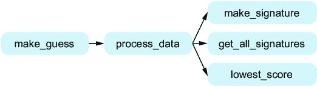

##### 图 11.1 展示了`process_data`的三个子任务的函数图

### 11.3.1 找出神秘书籍的签名

这个任务的函数`make_signature`将以我们书本的文本作为参数，并返回书本的签名。在此时，我们需要决定将用来确定每本书签名的特征。我们可以通过回顾之前的示例段落来拆解这个问题。我们注意到，作者的段落在句子复杂度和长度上有所不同。你可能也已经猜到，作者们在使用的单词长度和单词的使用方式上也会有所不同（例如，有些作者可能比其他作者更加重复）。因此，我们需要一些特征基于作者句子的结构，另一些则基于作者使用的单词。我们将详细探讨这些特征。

#### 与作者句子结构相关的特征

在我们之前提到的道尔与狄更斯的例子中，我们讨论了将每句的单词平均数作为一个特征。我们可以通过将单词总数除以句子总数来计算这一点。例如，考虑以下文本：

> 就在那天，一只小纸板盒通过邮寄送到我这里，里面有一颗非常大且光亮的珍珠。我没有发现任何写信的字句。

如果你计算单词和句子的数量，你会发现共有 32 个单词（card-board 算作一个单词）和两句话，因此我们将计算平均每句单词数，结果为 32/2 = 16。这将是*平均每句单词数*特征。

我们还注意到，句子的复杂度可能因作者而异（即，有些作者的句子中使用更多的逗号和分号），因此将句子复杂度作为一个特征是合理的。更复杂的句子通常包含更多的短语，而短语是句子中有逻辑关系的部分。将一个句子拆解成其组成的短语本身就是一个挑战，尽管我们可以尝试更准确地进行拆解，但我们将在此采用一个更简便的经验法则。也就是说，我们认为，句子中的短语之间是由逗号、分号或冒号分隔的。再看看之前的文本，我们发现共有三个短语。第一句有两个短语：“The same day there arrived through the post a small card-board box addressed to me”和“which I found to contain a very large and lustrous pearl”。第二句没有逗号、分号或冒号，因此只有一个短语。由于共有三个短语和两句话，我们可以认为这段文本的句子复杂度为 3/2 = 1.5。这将是*平均句子复杂度*特征。

我们希望这些基于句子的特征在直觉上能合理地帮助我们区分作者的写作风格。接下来，让我们开始看看作者在使用单词时可能的不同之处。

#### 与作者的单词选择相关的特征

你可能已经能想到自己的单词级特征指标，但我们在这里使用三个在我们经验中效果良好的指标。首先，有可能某些作者使用的单词比其他作者更短。为此，我们将使用平均单词长度，即每个单词的平均字母数。让我们考虑这段我们创建的示例文本：

> 一颗珍珠！珍珠！光辉的珍珠！稀有。多么好的发现。

如果你计算字母和单词，你应该会发现总共有 41 个字母和 10 个单词。（这里不要将标点符号算作字母。）所以，我们计算平均单词长度为 41/10 = 4.1。这就是 *平均单词长度* 特征。

第二，有些作者可能比其他作者使用更多重复的词。为了捕捉这一点，我们将计算作者使用的不同词汇数，并将其除以总词数。以我们之前的示例文本为例，使用了七个不同的单词：*a*、*pearl*、*lustrous*、*rare*、*what*、*nice* 和 *find*。总共有 10 个单词，因此我们计算此指标为 7/10 = 0.7。这就是 *不同词汇数除以总词数* 特征。

第三，有些作者可能倾向于使用很多一次性单词，而其他作者则倾向于重复使用单词。为了计算这一点，我们将计算那些仅使用一次的单词数，并将其除以总词数。以我们的示例文本为例，有五个单词仅使用一次：*lustrous*、*rare*、*what*、*nice* 和 *find*。总共有 10 个单词，因此我们计算此指标为 5/10 = 0.5。这就是 *仅使用一次的单词数除以总词数* 特征。

总的来说，我们有五个特征将组成每个签名。我们需要将这些数字存储在一个单一值中，因此每个签名将使用一个包含五个数字的列表。

让我们深入探讨如何实现这些特征，从单词级别的特征开始，然后转向句子级别的特征。我们将按以下顺序进行：

+   平均单词长度

+   不同单词数除以总词数

+   仅使用一次的单词数除以总词数

+   每个句子的平均单词数

+   平均句子复杂度

对于每一个子任务，我们最终都将编写一个函数。我们有一个更新的图，列出了这些新函数的函数名，帮助我们在图 11.2 中实现 `make_signature`。我们是否需要进一步细化这些问题，还是它们就这样可以？让我们看看！

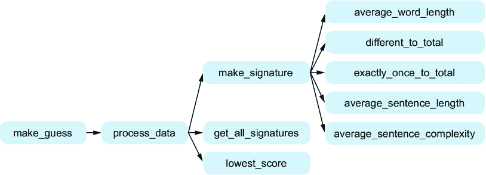

##### 图 11.2 函数图，展示了 `make_signature` 的附加五个子任务

#### 平均单词长度

这个任务的函数`average_word_length`将把书籍的文本作为参数，并返回平均单词长度。我们可以通过对文本使用`split`方法来开始解决这个任务。提醒一下，`split`方法用于将一个字符串分割成其各个部分的列表。默认情况下，`split`会以空格为分隔符。书籍文本是一个字符串，如果我们按空格分割，就能得到它的单词！这正是我们需要的。接着，我们可以遍历这个单词列表，统计字母数和单词数。

这是一个不错的开始，但我们需要小心一些，因为我们不想把非字母当作字母来计算。例如，“pearl”有五个字母，但“pearl.”或“pearl!!”或“(pearl)”也有五个字母。哈哈，这听起来像是一个子任务！换句话说，我们可以将清理单词的子任务提取到一个独立的函数中，由`average_word_length`来使用。我们将这个清理函数命名为`clean_word`。

另一个好处是拥有`clean_word`函数，它帮助我们识别“单词”实际上并不是单词。例如，假设文本中的一个“单词”是....当我们将其传递给`clean_word`时，它会返回一个空字符串。这意味着它实际上不是一个单词，因此我们不会将其计入单词数量。

#### 不同的单词除以总单词数

这个任务的函数`different_to_total`将把书籍的文本作为参数，并返回使用的不同单词数量与总单词数量的比例。

和`average_word_length`一样，我们需要小心，只计算字母，而不包括标点符号。但是等等——我们刚才谈到过`clean_word`函数，它在`average_word_length`中需要用到。我们也可以在这里使用这个函数！事实上，我们将在五个特性任务的大部分中使用`clean_word`。这就是一个有用的通用函数的标志！我们的自顶向下设计进行得很顺利。我们可以在图 11.3 中的更新函数图中看到，`clean_word`函数将被两个函数调用。

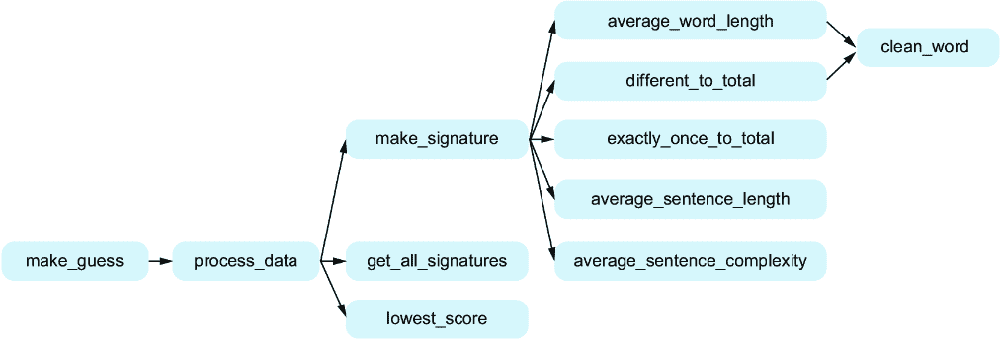

##### 图 11.3 函数图，展示了两个函数，它们都使用`clean_word`函数来辅助处理

这里还有一个额外的复杂情况，涉及到像*pearl*、*Pearl*和*PEARL*这样的单词。我们希望将它们视为相同的单词，但如果我们仅仅使用字符串比较，它们会被视为不同的单词。一个解决方案是将其分离为另一个子问题，将字符串转换为全小写字母。我们也可以把这看作是清理单词的另一个部分，就像去除标点符号一样。我们选择第二个选项。那么，我们将做的是让`clean_word`函数不仅去除标点符号，还将单词转换为小写字母。

你可能会想，是否需要拆分出另一个子任务，来确定不同单词的数量。你可以这么做，且这样做不会错。然而，如果我们不这样做，我们会发现这个函数依然非常可管理，因此我们就不再拆分。随着实践和经验的积累，你会逐渐学会判断哪些任务需要进一步拆解。

#### 仅使用一次的单词数与总单词数的比值

这个任务的函数`exactly_once_to_total`将以书籍的文本作为参数，返回仅使用一次的单词数与总单词数的比值。我们还需要使用`clean_word`函数，原因与前两个任务类似：确保我们只处理字母，而不是标点符号。同样，尽管我们可以拆分一个子任务来确定仅使用一次的单词数，但我们会发现，编写这段 Python 代码其实并不复杂，因此我们将直接完成这个任务，不再进一步拆分。

#### 每个句子的平均单词数

这个任务的函数`average_sentence_length`将以书籍的文本作为参数，返回每个句子的平均单词数。为了分割我们文本中的单词，前面三个任务我们使用了字符串的 split 方法。那么，我们该如何将文本分割成句子呢？有没有字符串方法可以做到这一点？

不幸的是，没有。为此，将有助于拆分一个任务，将我们的文本字符串分割成句子。我们将这个子任务的函数命名为`get_sentences`。`get_sentences`函数将以书籍的文本作为参数，并返回一个由文本中句子组成的列表。

什么是句子？我们将句子定义为由句号（.）、问号（?）或感叹号（!）分隔的文本。这个规则虽然方便且简单，但会犯错误。例如，这段文本有多少个句子？

> 当时，我刚刚以家庭教师的身份进入塞西尔·福雷斯特夫人的家庭。

答案是有的。然而，我们的程序将会提取出两个句子，而不是一个。它会被像*Mrs.*这样的词误导，因为它以一个句号结尾。如果你在这一章后继续做作者身份识别，你可以尝试让规则更健壮，或者使用复杂的自然语言处理（NLP）软件来做得更好。然而，对于我们的目的来说，我们会满足于这个规则，尽管它有时会将句子识别错误，因为大多数时候我们会识别正确。如果我们偶尔出错一次，这些错误对我们的度量标准不会产生显著影响。

#### 平均句子复杂度

这个任务的函数我们命名为`average_sentence_complexity`。它将以一句话的文本作为参数，并返回句子复杂度的度量。

如前所述，我们对使用句子中的短语数量来量化句子复杂性感兴趣。就像我们用标点符号将句子分开一样，我们将使用不同的标点符号来将短语分开。也就是说，我们认为短语是由逗号（,）、分号（;）或冒号（:）分隔的。

有一个子任务来将句子分解成短语，像我们曾经有一个子任务来将文本分解成句子一样，那将是很好的。我们来实现这个目标！我们将为这个子任务创建一个名为`get_phrases`的函数。`get_phrases`函数将接受书中的一段句子作为参数，并返回从句子中分离出的短语列表。

让我们暂停一下，思考一下我们正在做的`get_sentences`和`get_phrases`函数的工作。想一想，这两个函数其实非常相似。它们唯一的区别在于用来分隔文本的字符。`get_sentences`关心句号、问号和感叹号，而`get_phrases`关心逗号、分号和冒号。我们看到了一个可以简化这两个任务的父任务的机会！

换句话说，假设我们有一个`split_string`函数，它接受两个参数：文本和一个分隔字符的字符串，并返回一个由这些分隔符分隔开的文本片段列表。我们可以用`'.?!'`来分割句子，或者用`,;:`来分割短语。这样，`get_sentences`和`get_phrases`的实现就会更简单，且能减少代码重复。这是一个胜利！

到目前为止，我们已经完整地展开了支持`make_signature`高级函数所需的所有函数，这一点在图 11.4 中有所体现。接下来我们将转向`get_all_signatures`函数。

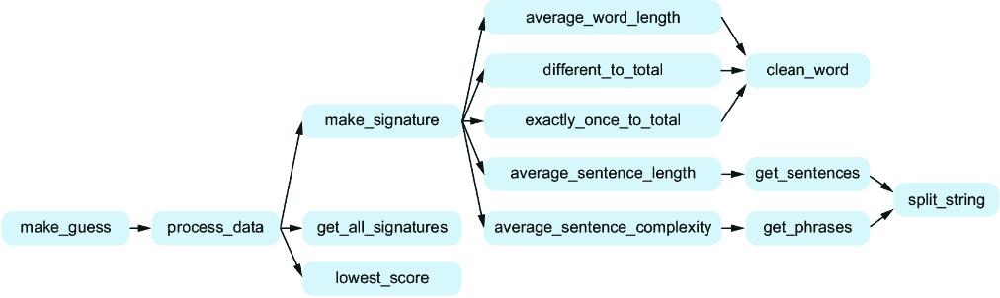

##### 图 11.4 完整的`make_signature`函数支持函数图

#### 计算每个已知签名

我们刚刚努力将`make_signature`函数拆解成五个主要任务，每个任务对应签名的一个特征。我们设计这个函数是为了确定未知签名——即我们正在尝试识别作者的神秘文本的签名。

接下来的任务是找出每本我们知道作者的书籍的签名。在本书的资源文件夹中的 ch11 目录下，你会找到一个名为`known_authors`的目录。在这个目录下，你会发现几个文件，每个文件以作者的名字命名。每个文件包含该作者的书籍。例如，如果你打开 Arthur_Conan_Doyle.txt，你会看到由亚瑟·柯南·道尔（Arthur Conan Doyle）所著的《血字的研究》（*A Study in Scarlet*）的文本。我们需要为这些文件确定签名。

令人惊讶的是，解决这个问题的工作量比看起来要少得多。这是因为我们可以使用相同的`make_signature`函数，那个我们为确定神秘书籍的签名而设计的函数，也能用来确定任何已知书籍的签名！

我们为这个任务命名函数为`get_all_signatures`。让这个函数接受一本书的文本作为参数是没有意义的，因为它应该能够获取我们所有已知书籍的签名。相反，它将接受一个已知书籍目录作为参数。它的行为是遍历该目录中的文件，为每个文件计算签名。

我们需要这个函数告诉我们哪个签名对应哪本书。换句话说，我们需要它将每本书与其对应的签名关联起来。正因为如此，Python 才有字典！因此，我们让这个函数返回一个字典，其中键是文件名，值是对应的签名。我们的函数图并不需要任何*新*函数来支持`get_all_signatures`函数，因此我们在图 11.5 中的更新图只展示了`get_all_signatures`如何调用`make_signature`。


##### 图 11.5 函数图已经更新，`get_all_signatures`调用`make_signature`

#### 寻找最接近的已知签名

让我们回顾一下我们目前设计的内容：

+   我们设计了`make_signature`函数，以便获取神秘书籍的未知签名。

+   我们设计了`get_all_signatures`函数，以便获取我们所有已知的签名。

现在，我们需要设计一个函数，告诉我们哪个已知签名最好；也就是说，哪个已知签名最接近我们的未知签名。我们每个签名将是一个包含五个数字的列表，表示每个特征的数量。这些数字的顺序将与之前使用的顺序相同：平均单词长度、不同单词占总单词的比例、仅出现一次的单词占总单词的比例、每个句子的平均单词数，以及平均句子复杂度。

假设我们有两个签名。第一个签名是`[4.6,` `0.1,` `0.05,` `10,` `2]`，这意味着该书的平均单词长度为 4.6，不同单词占总单词的比例为 0.1，依此类推。第二个签名是`[4.3,` `0.1,` `0.04,` `16,` `4]`。

有很多种方法可以通过比较签名的差异来得出整体评分。我们将使用的方法是给每个特征一个差异评分，然后将这些评分加起来得到我们的整体评分。

让我们来看一下每个签名在第一个特征上的值：4.6 和 4.3。如果我们相减，得到的差值是 4.6 – 4.3 = 0.3。我们可以将 0.3 作为这个特征的答案，但实际上，如果我们使用不同的权重来对每个差值进行*加权*，效果会更好。每个权重表示该特征的重要性。我们将使用一些权重（`[11,` `33,` `50,` `0.4,` `4]`），这些在我们的经验中证明效果良好。你可能会好奇这些权重到底从哪里来。但请注意，它们并没有什么神秘之处：多年来与我们的学生合作，我们发现这些权重似乎有效。这只是一个强大的作者识别程序的起点。在进行这种类型的研究时，人们通常会*调整*他们的训练，也就是调整权重，以获得更强的结果。

当我们说我们使用权重`[11,` `33,` `50,` `0.4,` `4]`时，这意味着我们会将第一个特征的差异乘以 11，第二个特征的差异乘以 33，依此类推。因此，我们不会仅仅得到第一个特征的差值 0.3，而是得到 0.3 × 11 = 3.3。

我们需要小心像第四个特征这样的特征，其中差异是负数。我们不希望从 10 – 16 = -6 开始，因为这是一个负数，这会*抵消*其他特征的正差异。相反，我们需要先将这个数变为正数，然后再乘以它的权重。去掉数字的负号称为取绝对值，绝对值用`abs`表示。那么，第四个特征的完整计算是 abs(10 – 16) × 0.4 = 2.4。

表 11.1 给出了每个特征的计算。如果我们将五个得分加起来，我们得到一个总得分 14.2。

##### 表 11.1 计算两个签名之间的差异

| 特征编号 | 签名 1 中该特征的值 | 签名 2 中该特征的值 | 特征的权重 | 特征的贡献 |
| --- | --- | --- | --- | --- |
| 1  | 4.6  | 4.3  | 11  | abs(4.6 – 4.3) × 11 = 3.3  |
| 2  | 0.1  | 0.1  | 33  | abs(0.1 – 0.1) × 33 = 0  |
| 3  | 0.05  | 0.04  | 50  | abs(0.05 – 0.04) × 50 = 0.5  |
| 4  | 10  | 16  | 0.4  | abs(10 – 16) × 0.4 = 2.4  |
| 5  | 2  | 4  | 4  | abs(2 – 4) × 4 = 8  |
| 总和  |  |  |  | 14.2  |

记住我们在自顶向下设计中的位置：我们需要一个函数来告诉我们哪个已知的签名是最好的。现在，我们知道如何比较两个签名并获取比较得分。我们需要将这种比较应用于未知签名与每个已知签名之间，以确定哪个已知签名是最好的。得分越低，签名越相似；得分越高，签名之间的差异越大。因此，我们最终需要选择得分最低的签名。

我们将为这个任务命名函数为`lowest_score`。它将接受三个参数：一个字典，将作者名映射到他们已知的签名，一个未知的签名，以及一个权重列表。该函数将返回与我们的未知签名比较得分最低的签名。

想一想这个函数需要做的工作。它需要遍历已知的签名。我们可以用`for`循环来实现——这里不需要子任务。它将需要将未知签名与当前已知签名进行比较。哦！那就是一个子任务，它体现了我们在表 11.1 中概述的评分机制。我们将为这个子任务命名函数为`get_score`。我们的`get_score`函数将接受两个签名进行比较，以及权重列表，并返回这两个签名比较的得分。

## 11.4 我们自上而下设计的总结

我们做到了！我们将原本的大问题分解成了几个较小的问题，这些问题可以实现为一个函数。

图 11.6 展示了我们在分解问题过程中所做的所有工作。记住，我们从`make_guess`函数开始，它将解决整体问题。为了帮助我们实现`make_guess`，我们创建了一个`process_data`函数，它将为`make_guess`做一些工作。为了帮助`process_data`，我们又创建了三个函数，`make_signature`、`get_all_signatures`和`lowest_score`，它们各自有自己的辅助函数，等等。在勾画出我们为解决问题所需的函数后，我们的下一步将是实现它们。

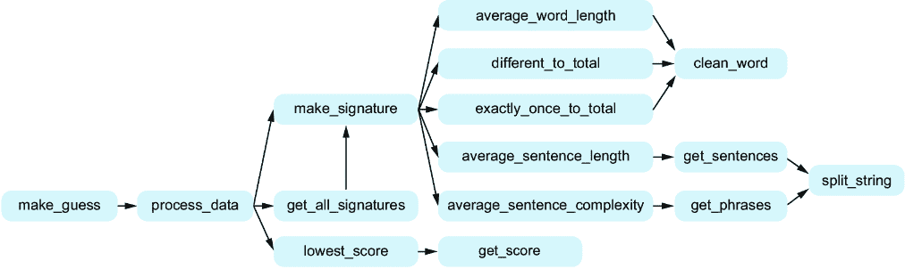

##### 图 11.6 `make_guess`的完整函数图

## 11.5 实现我们的函数

现在我们准备好让 Copilot 实现我们所需的每个函数。我们通过从顶部开始——最大的问题——然后向下分解为更小的问题来设计我们的函数。但请记住，在第七章中提到过，这并不是我们实现函数的顺序；相反，我们应该按照相反的顺序实现函数，从底部到顶部（或者在图 11.6 中从右到左）。

就像在第七章中的示例一样，我们不会过多关注测试、提示工程、调试或代码阅读。我们确实鼓励你运行我们提供的文档字符串中的 doctest 测试，并进一步鼓励你为每个函数添加额外的测试。

### 11.5.1 clean_word

我们将从`clean_word`函数开始。像往常一样，我们提供函数头（`def`行）和文档字符串，让 Copilot 填充代码。我们还提供了一些注释，简要说明代码的工作原理。

记住，我们希望我们的`clean_word`函数去除可能出现在单词周围的标点符号，并将单词转换为小写。但是我们不希望修改单词中间的标点符号，例如*card-board*中的“-”。我们已经写了文档字符串来明确我们想要的效果。

##### 列表 11.1 分析的干净单词

```py
def clean_word(word):
 '''
 word is a string.

 Return a version of word in which all letters have been
 converted to lowercase, and punctuation characters have been
 stripped from both ends. Inner punctuation is left untouched.

 >>> clean_word('Pearl!')
 'pearl'
 >>> clean_word('card-board')
 'card-board'
 '''
    word = word.lower()                #1
    word = word.strip(string.punctuation)   #2
    return word
```

#1 将单词转换为小写

#2 使用 string 模块去除两端的标点符号

在第三章处理密码功能时，我们看到 Copilot 使用了 string 模块，现在我们再次看到 Copilot 在这里使用它。根据我们在第三章的工作，我们知道如果不先导入 string，这将不起作用，因此请添加

```py
import string
```

如我们在以下列表中所做的那样，放置在该函数上方。

##### 列表 11.2 用于分析的清理单词，已完成

```py
import string
def clean_word(word):
 '''
 word is a string.

 Return a version of word in which all letters have been
 converted to lowercase, and punctuation characters have 
 been stripped from both ends. Inner punctuation is left
 untouched.

 >>> clean_word('Pearl!')
 'pearl'
 >>> clean_word('card-board')
 'card-board'
 '''
    word = word.lower() 
    word = word.strip(string.punctuation) 
    return word
```

这完成了 `clean_word` 函数，所以我们可以在图 11.7 的函数图表中将其标记为已完成。

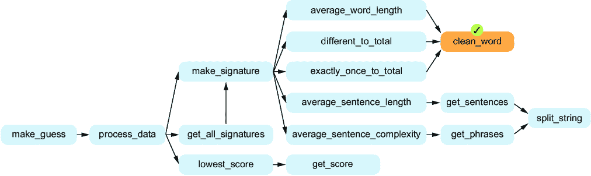

##### 图 11.7 完整的函数图表，`clean_word` 已完成

### 11.5.2 average_word_length

现在让我们处理五个标志性特性函数中的第一个：`average_word_length`。它需要确定每个单词的平均字母数，但我们不希望将周围的标点符号算作字母，也不包括没有字母的单词。我们希望在这里使用我们的`clean_word`函数，如以下列表所示。和往常一样，我们已经编写了文档字符串，希望能引导 Copilot 做出这些决策。

##### 列表 11.3 平均单词长度

```py
def average_word_length(text):
 '''
 text is a string of text.

 Return the average word length of the words in text.
 Do not count empty words as words.
 Do not include surrounding punctuation.

 >>> average_word_length('A pearl! Pearl! Lustrous pearl! \
Rare. What a nice find.')
 4.1
 '''
    words = text.split()        #1
    total = 0                      #2
    count = 0                #3
    for word in words:        #4
        word = clean_word(word)       #5
        if word != '':              #6
            total += len(word)     #7
            count += 1            #8
    return total / count        #9
```

#1 将字符串分割成单词

#2 total 将计算所有单词中字母的总数。

#3 count 将计算单词数。

#4 遍历每个单词

#5 Copilot 为我们调用 clean_word！

#6 仅在单词不为空时考虑此单词

#7 添加单词中字母的数量

#8 给这个单词的计数加 1

#9 返回字母数除以单词数

你会注意到在这里的 doctest 中，我们将字符串拆分为两行，第一行以 `\` 字符结尾。我们这么做的原因是，字符串否则无法在书中适应一行。我们还需要保持第二行没有任何缩进；否则，doctest 会将那个缩进作为字符串中的空格。在你的计算机上，你可以将字符串输入为一行，而无需担心 `\` 或缺少缩进。

我们现在可以在更新后的图表（图 11.8）中标记 `average_word_length` 为完成。尽管这样做令人满意，但逐个标记这些功能可能会造成太多干扰，因此我们将仅定期回顾图表。

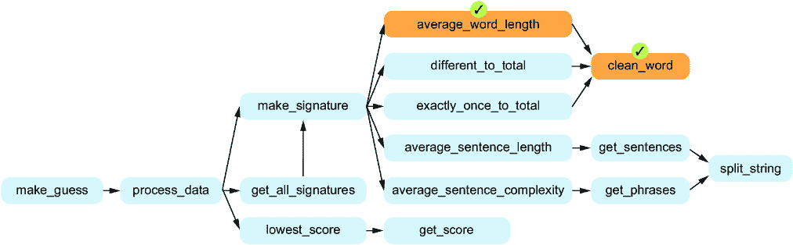

##### 图 11.8 完整的函数图表，`average_word_length` 已完成

### 11.5.3 different_to_total

这是我们的第二个标志性特性。我们需要这个功能来计算不同单词的数量除以总单词数。同样，我们不希望包含周围的标点符号或空单词。

##### 列表 11.4 按总词数划分的不同单词

```py
def different_to_total(text):
 '''
 text is a string of text.

 Return the number of unique words in text
 divided by the total number of words in text.
 Do not count empty words as words.
 Do not include surrounding punctuation.
 >>> different_to_total('A pearl! Pearl! Lustrous pearl! \
Rare. What a nice find.')
 0.7
 '''
    words = text.split()     #1
    total = 0                     #2
    unique = set()               #3
    for word in words:
        word = clean_word(word)     #4
        if word != '':
            total += 1
            unique.add(word)      #5
    return len(unique) / total      #6
```

#1 将字符串分割成单词

#2 total 将计算所有非空单词的总数。

#3 一组唯一的单词

#4 Copilot 再次为我们调用 clean_word！

#5 集合像列表一样，但不接受重复项。

#6 返回不同单词的数量除以总单词数

这段代码使用 Python 集合，而不是 Python 列表，来存储它找到的唯一单词。集合类似于列表，但它不允许重复，因此如果你尝试多次添加相同的单词，它只会保留一个副本。这就是为什么我们可以在返回语句中使用 `len(unique)` 来获取唯一单词的总数。

在这里我们不需要了解更多关于 Python 集合的知识。但如果你有兴趣了解更多，你可以向 Copilot 请求代码解释，或在 Google 上搜索关于 Python 集合的信息。

### 11.5.4 exactly_once_to_total

我们准备实现我们的第三个签名功能。这个功能计算了仅使用一次的单词的数量与总单词数量的比值，如下所示。我们向 Copilot 提供了提示，并收到了以下函数。

##### 列表 11.5 仅使用一次的单词的比例：尝试 1

```py
def exactly_once_to_total(text):
 '''
 text is a string of text.

 Return the number of words that show up exactly once in text
 divided by the total number of words in text.
 Do not count empty words as words.
 Do not include surrounding punctuation.

 >>> exactly_once_to_total('A pearl! Pearl! Lustrous pearl! \
Rare. What a nice find.')
 0.5
 '''
    words = text.split()
    unique = set()
    total = 0
    for word in words:
        word = clean_word(word)
        if word != '':
            if word not in unique:
                unique.add(word)
            else:
                unique.remove(word)   #1
            total += 1
    return len(unique) / total
```

#1 从唯一集合中移除单词？

当我们快速浏览代码时，看起来 `unique` 是一个集合，用于跟踪唯一的单词。在最后，我们将唯一单词的数量除以总单词的数量。

然而，当我们使用 doctest 运行我们的测试用例时，你会看到我们的代码没有通过测试。我们需要的结果是 0.5，但我们的代码不幸给出了 0.6。我们的代码是错误的，我们需要保持警惕！

让我们回顾一下代码，看看为什么它是错误的。假设某个单词在文本中出现了三次。当我们的代码第一次找到这个单词时，它会将其添加到`unique`中。第二次，它会从`unique`中*移除*该单词。到目前为止，这没问题，因为该单词不再是只使用一次，所以它不应该在其中。但第三次，它会将这个单词再次添加到`unique`中！因此，我们的代码会将一些本应计算为只使用一次的单词错误地计算为使用了多次。我们查看了按 Ctrl-Enter 按下时出现的列表，找到了这个正确的替代版本，如下所示。

##### 列表 11.6 仅使用一次的单词的比例：尝试 2

```py
def exactly_once_to_total(text):
 '''
 text is a string of text.

 Return the number of words that show up exactly once in text
 divided by the total number of words in text.
 Do not count empty words as words.
 Do not include surrounding punctuation.

 >>> exactly_once_to_total('A pearl! Pearl! Lustrous pearl! \
Rare. What a nice find.')
 0.5
 '''
    words = text.split()
    total = 0
    unique = set()             #1
    once = set()             #2
    for word in words:
        word = clean_word(word)
        if word != '':
            total += 1
            if word in unique:     #3
                once.discard(word)     #4
            else:
                unique.add(word)     #5
                once.add(word)        #6
    return len(once) / total        #7
```

#1 跟踪我们看到的所有单词

#2 跟踪仅使用一次的单词——这是我们最终关心的

#3 我们再次看到了这个单词。

#4 所以这个单词必须从仅使用一次的集合中移除。

#5 我们现在已经看到了这个单词。

#6 到目前为止，这个单词只使用了一次。

#7 返回仅使用一次的单词数量与总单词数量的比值

这段代码很棘手！要理解它，首先要关注 `else` 代码。这是我们第一次看到每个单词时运行的代码。这个单词会同时被添加到 `unique` 和 `once` 集合中。正是 `once` 集合会帮助我们跟踪仅使用一次的单词。

现在假设我们第二次遇到一个单词。由于这个单词已经在 `unique` 中（我们第一次遇到这个单词时将它添加到了 `unique`），`if` 代码会在这种情况下运行。现在，由于我们已经遇到该单词多次，我们需要将它从 `once` 集中移除。这正是 `if` 代码所做的：它使用 `once.discard(word)` 将该单词从 `once` 中移除。

总结一下，第一次遇到一个单词时，它会被添加到 `once` 中。当我们再次遇到它时，它会从 `once` 中移除，并且永远不会再被添加回 `once`。`once` 集正确地跟踪了仅出现一次的单词。

### 11.5.5 split_string

我们已经完成了三个基于单词级别的特征函数。在我们能够继续处理两个基于句子级别的特征函数之前，我们需要编写 `get_sentences`。但要编写 `get_sentences`，我们首先需要 `split_string`，这就是我们现在要处理的内容。

我们的 `split_string` 函数应该能够根据任意数量的分隔符拆分字符串。它本身与句子或短语无关。我们已经包括了一个文档字符串测试来突出这一点：尽管我们将用它来拆分句子和短语，但它比这更通用。请看下面的列表。

##### 列表 11.7 根据分隔符拆分字符串

```py
def split_string(text, separators):
 '''
 text is a string of text.
 separators is a string of separator characters.

 Split the text into a list using any of the one-character
 separators and return the result.
 Remove spaces from beginning and end
 of a string before adding it to the list.
 Do not include empty strings in the list.

 >>> split_string('one*two[three', '*[')
 ['one', 'two', 'three']
 >>> split_string('A pearl! Pearl! Lustrous pearl! Rare. \
What a nice find.', '.?!') 
 ['A pearl', 'Pearl', 'Lustrous pearl', 'Rare', \
'What a nice find']
 '''
    words = []        #1
    word = ''             **#2
    for char in text:
        if char in separators:    #3
            word = word.strip()      #4
            if word != '':          #5
                words.append(word)      #6
            word = ''                 #7
        else:
            word += char           #8
    word = word.strip()      #9
    if word != '':          **
        words.append(word)  ** #9
    return words #9******
```

******#1 一个更好的变量名应该是 all_strings。

#2 一个更好的变量名应该是 current_string。

#3 当前字符串在此结束。

#4 移除当前字符串开头和结尾的空格

#5 如果当前字符串不为空 . . .

#6 . . . 将其保存为拆分字符串之一。

#7 清空当前字符串，为下一个字符串做准备

#8 添加到当前字符串（暂不拆分）

#9 处理最终的拆分字符串，若不为空******  ******你可能会对 `for` 循环之后和 `return` 语句之前的代码感到好奇。它似乎在重复 `for` 循环中的一些代码，那么它在那里做什么呢？这些代码存在是因为循环只有在找到分隔符字符时，才会将拆分字符串添加到我们的字符串列表中。如果文本没有以分隔符字符结尾，循环就不会添加最终的拆分字符串。循环下方的代码确保了这个最终的拆分字符串不会丢失。

自从我们更新了函数图后已经有一段时间了，是时候更新了！这也提醒我们，我们是从底层向上（图中的从右到左）完成函数的。因此，图 11.9 展示了我们迄今完成的所有函数。

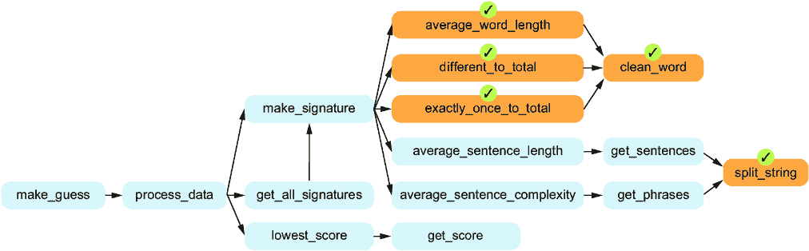

##### 图 11.9 完整的函数图已更新，包含 `different_to_total`、`exactly_once_to_total` 和现已完成的 `split_string`

### 11.5.6 get_sentences

在我们的自上而下设计中，我们将大部分 `get_sentences` 的工作委派给了 `split_string` 函数。因此，我们期望的是 Copilot 通过合适的调用来实现 `get_sentences`，并调用 `split_string`。

我们不希望句子开头或结尾有空格，也不希望有空句子。最初我们在文档字符串中有这些要求，但即使没有这些要求，Copilot 也正确地调用了`split_string`，该函数本身也能处理这些边缘情况。

##### 示例 11.8 返回文本中的句子列表

```py
def get_sentences(text):
 '''
 text is a string of text.

 Return a list of the sentences from text.
 Sentences are separated by a '.', '?' or '!'.

 >>> get_sentences('A pearl! Pearl! Lustrous pearl! Rare. \
What a nice find.')
 ['A pearl', 'Pearl', 'Lustrous pearl', 'Rare', \
'What a nice find']
 '''
    return split_string(text, '.?!')     #1
```

#1 使用句子分隔符字符调用 split_string

### 11.5.7 平均句子长度

现在我们已经有了`get_sentences`，可以继续实现我们的第四个签名特征`average_sentence_length`。这个函数计算每个句子的平均单词数。我们向 Copilot 提供了提示，并得到了如下的函数。

##### 示例 11.9 每个句子的平均单词数

```py
def average_sentence_length(text):
 '''
 text is a string of text.

 Return the average number of words per sentence in text.
 Do not count empty words as words.

 >>> average_sentence_length('A pearl! Pearl! Lustrous pearl! \
Rare. What a nice find.')
 2.0
 '''
    sentences = get_sentences(text)    #1
    total = 0
    for sentence in sentences:        #2
        words = sentence.split()     #3
        for word in words:       #4
            if word != '':
                total += 1
    return total / len(sentences)     #5
```

#1 获取句子列表

#2 遍历句子

#3 将当前句子分解成单词

#4 遍历句子的单词

#5 返回单词数除以句子数

### 11.5.8 get_phrases

就像我们在实现`average_sentence_length`之前需要`get_sentences`一样，我们在实现`average_sentence_complexity`之前也需要`get_phrases`。

与`get_sentences`一样，我们期望 Copilot 调用`split_string`来获取短语。正如它在这里所做的那样，下面的示例展示了这一过程。

##### 示例 11.10 返回句子的短语列表

```py
def get_phrases(sentence):
 '''
 sentence is a sentence string.

 Return a list of the phrases from sentence.
 Phrases are separated by a ',', ';' or ':'.

 >>> get_phrases('Lustrous pearl, Rare, What a nice find')
 ['Lustrous pearl', 'Rare', 'What a nice find']
 '''
    return split_string(sentence, ',;:')    #1
```

#1 使用短语分隔符字符调用 split_string

### 11.5.9 平均句子复杂度

完成`get_phrases`之后，我们可以提示实现`average_sentence_complexity`。代码如下所示。

##### 示例 11.11 每个句子的平均短语数

```py
def average_sentence_complexity(text):
 '''
 text is a string of text.

 Return the average number of phrases per sentence in text.

 >>> average_sentence_complexity('A pearl! Pearl! Lustrous \
pearl! Rare. What a nice find.')
 1.0
 >>> average_sentence_complexity('A pearl! Pearl! Lustrous \
pearl! Rare, what a nice find.')
 1.25 **#1
 **'''**
    sentences = get_sentences(text)     #2
    total = 0
    for sentence in sentences:               #3
        phrases = get_phrases(sentence)       #4
        total += len(phrases)             #5
    return total / len(sentences)      #6**
```

**#1 我们将句号改为逗号，使得这个 5/4 = 1.25。

#2 获取句子列表

#3 遍历句子

#4 获取当前句子的短语列表

#5 添加当前句子的短语数

#6 返回短语数除以句子数 **我们现在进展顺利！我们已经完成了生成`make_signature`所需的所有函数，如图 11.10 所示。

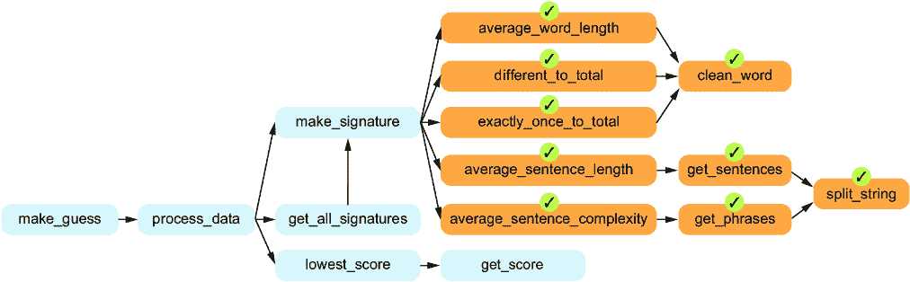

##### 图 11.10 完整的函数图更新，显示我们现在已经准备好编写`make_signature`

### 11.5.10 make_signature

到目前为止，我们已经编写了九个函数，虽然它们都很重要，但我们现在可能有些不满足，因为我们甚至还没有处理文本签名。我们有一些函数来清理单词，按不同方式拆分字符串，计算签名的个别特征，但没有一个函数能生成完整的签名。

现在情况发生了变化，因为我们终于准备好实现`make_signature`来为文本生成签名。此函数将接收一本书的文本，并返回五个数字的列表，每个数字都是调用我们五个特征函数中的一个的结果。

##### 示例 11.12 文本的数值签名

```py
def make_signature(text):
 '''
 The signature for text is a list of five elements:
 average word length, different words divided by total words, 
 words used exactly once divided by total words,
 average sentence length, and average sentence complexity.

 Return the signature for text. 

 >>> make_signature('A pearl! Pearl! Lustrous pearl! \
Rare, what a nice find.')
 [4.1, 0.7, 0.5, 2.5, 1.25]
 '''
    return [average_word_length(text),            #1
            different_to_total(text),            ** #1
            exactly_once_to_total(text),         ** #1
            average_sentence_length(text),        #1
            average_sentence_complexity(text)]   ** #1******
```

******#1 调用了我们的五个特性函数中的每一个。******  ******注意，这个函数可以实现为仅仅调用我们五个特性函数中的每一个。现在暂停一下，思考一下如果没有先进行良好的自顶向下设计，这个函数会有多乱。我们在这里调用的所有五个函数的代码本应在一个单独的函数中，而且它们各自的变量和计算会混合成一团糟。幸运的是，我们使用了自顶向下设计！因此，我们的函数更易于阅读，也更容易让我们确信它做的事情是对的。

### 11.5.11 get_all_signatures

我们的 `process_data` 函数有三个子任务需要我们实现。我们刚刚完成了第一个子任务（`make_signature`），现在我们将继续第二个子任务，即我们的 `get_all_signatures` 函数。

从现在开始，我们假设你的工作目录中有你的代码，并且它还包含我们提供的书籍子目录。我们需要这个函数返回我们已知作者目录中每个文件的签名。我们希望 Copilot 在这里调用 `make_signature`，使这个函数比它本来会更简单。

Copilot 确实为我们做了这个，但我们得到的代码仍然有两个问题。我们最初的代码如下面的列表所示。

##### 列表 11.13 从已知作者处获取所有签名：尝试 1

```py
def get_all_signatures(known_dir):
 '''
 known_dir is the name of a directory of books.
 For each file in directory known_dir, determine its signature.

 Return a dictionary where each key is
 the name of a file, and the value is its signature.
 '''
    signatures = {}                                 #1
    for filename in os.listdir(known_dir):             #2
        with open(os.path.join(known_dir,           #3
                               filename)) as f:    ** #3
            text = f.read()                            #4
            signatures[filename] = make_signature(text)   #5
    return signatures**
```

**#1 我们的字典，最初为空，映射文件名到签名。

#2 遍历已知作者目录中的每个文件

#3 打开当前文件

#4 读取文件中的所有文本

#5 为文本生成签名并将其存储在字典中 ** ** 尝试从 Python 提示符运行此函数

```py
>>> get_all_signatures('known_authors')
```

然后你会得到以下错误：

```py
Traceback (most recent call last):
  File "<stdin>", line 1, in <module>
  File "C:\repos\book_code\ch11\authorship.py", line 207, 
  in get_all_signatures
    for filename in os.listdir(known_dir):
                    ^^
NameError: name 'os' is not defined
```

错误告诉我们该函数尝试使用一个名为 os 的模块，但我们没有这个模块可用。这个模块是 Python 内置的，我们知道该怎么办：导入它！也就是说，我们需要添加

```py
import os
```

在这个函数上方。之后，我们仍然会得到一个错误：

```py
>>> get_all_signatures('known_authors')
Traceback (most recent call last):
  File "<stdin>", line 1, in <module>
  File "C:\repos\book_code\ch11\authorship.py", line 209, 
  in get_all_signatures
    text = f.read()
           ^^^^^^^^
  File "…\Lib\encodings\cp1252.py", line 23, in decode
    return codecs.charmap_decode(input,self.errors,decoding_table)[0]
           ^^^^^^^^^^^^^^^^^^^^^^^^^^^^^^^^^^^^^^^^^^^^^^^^^^^^^^^
UnicodeDecodeError: 'charmap' codec can't decode byte 0x9d in 
position 2913: character maps to <undefined>
```

你可能会想知道什么是 `UnicodeDecodeError`。如果你对技术解释感兴趣，可以去谷歌搜索或者问 ChatGPT。我们需要知道的是，我们打开的每个文件都是以特定的方式编码的，而 Python 选择了错误的编码方式来读取这个文件。

然而，我们可以通过在函数顶部附近添加注释来指导 Copilot 修复它。 （当你遇到类似的错误时，可以尝试在生成的错误代码上方直接添加注释。然后，一旦删除了错误代码，Copilot 通常可以生成正确的代码。）一旦我们这样做，一切都会顺利，如下所示。

##### 列表 11.14 从已知作者处获取所有签名：尝试 2

```py
import os

def get_all_signatures(known_dir):
 '''
 known_dir is the name of a directory of books.
 For each file in directory known_dir, determine its signature.

 Return a dictionary where each key is
 the name of a file, and the value is its signature.
 '''
    signatures = {}
 # Fix UnicodeDecodeError **#1
    for filename in os.listdir(known_dir):
        with open(os.path.join(known_dir, filename), 
                  encoding='utf-8') as f:
            text = f.read()
            signatures[filename] = make_signature(text)
    return signatures**
```

**#1 此提示告诉 Copilot 修复我们之前看到的错误。** **现在，如果你运行这个函数，你应该会看到一个包含作者及其签名的字典，像这样：

```py
>>> get_all_signatures('known_authors')
{'Arthur_Conan_Doyle.txt': [4.3745884086670195, 
0.1547122890234636, 0.09005503235165442, 
15.48943661971831, 2.082394366197183], 
'Charles_Dickens.txt': [4.229579999566339, 
0.0796743207788547, 0.041821158307855766, 
17.286386709736963, 2.698477157360406], 
'Frances_Hodgson_Burnett.txt': [4.230464334694739, 
0.08356818832607418, 0.04201769324672584, 
13.881251286272896, 1.9267338958633464], 
'Jane_Austen.txt': [4.492473405509028, 
0.06848572461149259, 0.03249477538065084, 
17.507478923035084, 2.607560511286375], 
'Mark_Twain.txt': [4.372851190055795, 
0.1350377851543188, 0.07780210466840878, 
14.395167731629392, 2.16194089456869]}
```

为了简便起见，我们没有在此函数的文档字符串中添加测试。不过，如果我们添加了测试，我们会创建一个假的小书，类似于我们在第六章第二个示例中做的那样。尽管如此，我们还是希望继续推进函数分解的总体目标，因此如果你想继续深入，可以自己完成这个练习。如图 11.11 所示，我们已经完成了两个 `process_data` 子任务。让我们继续前进！

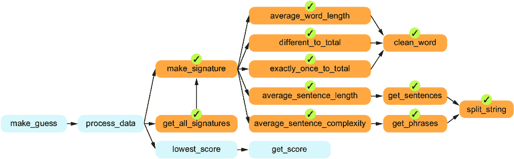

##### 图 11.11 完整的功能图，已更新以显示 `make_signature` 和 `get_all_signatures` 已完成

### 11.5.12 get_score

让我们实现 `get_score`，在这里我们需要编码比较签名的方式。记住，之前我们讨论过，找到每个特征上的差异，乘以权重，然后将所有差异加起来得出总分？这正是我们希望 `get_score` 实现的功能。

在文档字符串中解释这个公式将是一个挑战。我们甚至不确定它是否应该放在那里：文档字符串应该解释如何使用你的函数，而不是它的内部工作原理。而且，可以说，我们函数的使用者反而不会在乎这个具体的公式。我们可以做的是使用一个通用的文档字符串，不涉及具体公式，看看 Copilot 如何处理它。接下来我们在下面的列表中演示。

##### 列表 11.15 比较两个签名

```py
def get_score(signature1, signature2, weights):
 '''
 signature1 and signature2 are signatures.
 weights is a list of five weights.

 Return the score for signature1 and signature2.

 >>> get_score([4.6, 0.1, 0.05, 10, 2],\
 [4.3, 0.1, 0.04, 16, 4],\
 [11, 33, 50, 0.4, 4]) **#1
 **14.2**
 **'''**
    score = 0
    for i in range(len(signature1)):                #2
        score += abs(signature1[i] - signature2[i]) \   #3
                 * weights[i]                           #3
    return score**
```

**#1 这些权重，[11, 33, 50, 0.4, 4]，对我们非常有效。

#2 遍历每个签名索引

#3 将加权差异添加到得分** **Copilot 完全实现了我们想要的公式。现在，在我们开始认为 Copilot 能读取我们的心思或类似的事情之前，请记住，我们使用的这个公式是一个非常常见的用于比较签名的度量标准。多年来，许多学生和程序员都用这个公式实现了作者身份识别。Copilot 之所以给我们返回这个公式，是因为它在其训练数据中出现得非常频繁。如果 Copilot 给出了一个不同的公式，我们本可以尝试在注释中描述我们的需求，或者如果那样做无效，我们自己更改代码来实现所需功能。

### 11.5.13 lowest_score

我们的 `lowest_score` 函数最终将完成我们需要实现 `process_data` 的所有工作。我们刚刚实现的 `get_score` 函数给出了任意两个签名之间的得分。我们的 `lowest_score` 函数将会调用 `get_score`，对每个已知签名与未知签名进行比较。然后它将返回与未知签名得分最低的已知签名，如以下列表所示。

##### 列表 11.16 最接近的已知签名

```py
def lowest_score(signatures_dict, unknown_signature, weights):
 '''
 signatures_dict is a dictionary mapping keys to signatures.
 unknown_signature is a signature.
 weights is a list of five weights.
 Return the key whose signature value has the lowest 
 score with unknown_signature.

 >>> d = {'Dan': [1, 1, 1, 1, 1],\ **#1
 **'Leo': [3, 3, 3, 3, 3]}** #1
 **>>> unknown = [1, 0.8, 0.9, 1.3, 1.4]**
 **>>> weights = [11, 33, 50, 0.4, 4]**
 **>>> lowest_score(d, unknown, weights)** **#2
 **'Dan'**
 **'''**
    lowest = None
    for key in signatures_dict:           **#3
        score = get_score(signatures_dict[key],           #4
                          unknown_signature, weights) 
        if lowest is None or score < lowest[1]:      #5
            lowest = (key, score)       #6
    return lowest[0]   #7******
```

****#1 使用变量在 doctest 中使测试本身更容易阅读

#2 这一行更容易阅读，因为我们使用了变量。

#3 遍历每个作者名字

#4 获取将此已知签名与未知签名比较的得分

#5 如果这是第一次比较，或者我们找到更低的分数……

#6 . . . 这会存储最佳键及其对应的分数。

#7 lowest[0] 是最佳键。****  ****第一个参数`signatures_dict`是一个字典，将作者的名字映射到他们已知的签名。这最终会通过`get_all_signatures`函数得到。第二个参数`unknown_signature`将最终来自调用`make_signature`生成的神秘书籍签名。第三个参数`weights`将在我们调用这个函数时由我们硬编码。

### 11.5.14 process_data

只剩下两个函数了！其中之一是`process_data`—感觉我们花了很久时间，但终于准备好了。

我们的`process_data`函数将在以下代码中接收两个参数：神秘书籍的文件名和已知作者书籍的目录。它将返回我们认为写这本神秘书籍的作者。

##### 示例 11.17 最接近神秘作者的签名

```py
def process_data(mystery_filename, known_dir):
 '''
 mystery_filename is the filename of a mystery book whose 
 author we want to know.
 known_dir is the name of a directory of books.

 Return the name of the signature closest to 
 the signature of the text of mystery_filename.
 '''
    signatures = get_all_signatures(known_dir)           #1
    with open(mystery_filename, encoding='utf-8') as f:    #2
        text = f.read()                                #3
        unknown_signature = make_signature(text)         #4
    return lowest_score(signatures, unknown_signature,    #5
                        [11, 33, 50, 0.4, 4])             #5
```

#1 获取所有已知的签名

#2 Copilot 利用我们的先前工作来正确获取编码。

#3 读取神秘书籍的文本

#4 获取未知的签名

#5 返回具有最低比较分数的签名

再次注意我们多么依赖于早期的函数。这个极其有用的`process_data`函数现在实际上只是一个经过精心排序的函数调用列表。

在本章节的书籍资源中，我们包含了几个未知作者的文件，例如 unknown1.txt 和 unknown2.txt。这些文件应该与您的代码（以及已知作者文件的子目录）一起放在当前工作目录中。

让我们调用`process_data`来猜测是谁写了`'unknown1.txt'`：

```py
>>> process_data('unknown1.txt', 'known_authors')
'Arthur_Conan_Doyle.txt'
```

我们的程序猜测是亚瑟·柯南·道尔写了 unknown1.txt。如果你通过打开文件查看 unknown1.txt 的内容，你会发现我们的猜测是正确的。这本书叫做《四签名》，是一本著名的亚瑟·柯南·道尔作品。

### 11.5.15 make_guess

目前，为了猜测一本书的作者，我们需要输入 Python 代码来运行`process_data`。这对用户来说并不友好；如果我们能运行程序并让它询问我们要使用哪个神秘书籍文件，那就太好了。

我们将通过实现`make_guess`这个最顶层函数，为我们的程序画上完美的句号！这个函数将会要求用户输入一个神秘书籍的文件名，使用`process_data`获取最佳猜测，并告知用户这一猜测，具体实现请参见以下代码。

##### 示例 11.18 与用户互动并猜测文本的作者

```py
def make_guess(known_dir):
 '''
 Ask user for a filename.
 Get all known signatures from known_dir,
 and print the name of the one that has the lowest score 
 with the user's filename.
 '''
    filename = input('Enter filename: ')       #1
    print(process_data(filename, known_dir))     #2
```

#1 向用户询问神秘书籍的文件名

#2 调用`process_data`完成所有工作并报告我们的猜测

这完成了我们图表中的所有函数！图 11.12 展示了我们已经从底部到最顶部检查完了每个函数。

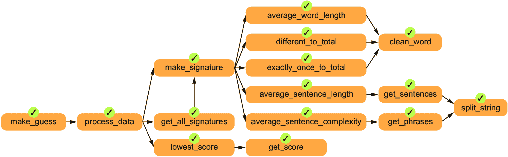

##### 图 11.12 `make_guess`所需的所有函数现在都已完成！

如果你将我们所有的代码放入你的 Python 文件中，并在该文件的底部添加以下代码行，你就能运行程序来猜测一本神秘书籍的作者：

```py
make_guess('known_authors')
```

例如，下面是当我们运行程序并输入`unknown1.txt`作为未知书籍时发生的情况：

```py
Enter filename: unknown1.txt       
Arthur_Conan_Doyle.txt
```

它正确地告诉我们，`unknown1.txt`是由阿瑟·柯南·道尔所写！尝试对我们提供的每个其他未知书籍文件进行运行。它能正确猜出多少本？又错猜了哪些？

恭喜你！你已经完成了你的第一个真实世界的自顶向下设计。看看我们完成了什么——一个任何初学者程序员都应该为之自豪的作者识别程序。你的程序使用人工智能学习各个作者的写作风格（他们平均使用短词还是长词，平均使用短句还是长句，等等），通过使用其训练数据中的书籍文本。然后，它应用这些学习，预测一本神秘书籍的作者，通过确定哪位作者的风格最接近这本神秘书籍——非常酷！我们成功地解决了一个非常困难的问题，并通过将问题分解并让 Copilot 为每个子问题编写代码来实现它。

## 11.6 进一步发展

在进行自顶向下设计之后，人们通常会发现重构代码的机会，这意味着在不改变代码行为的情况下，使代码更清晰或更有条理。我们可以通过多种方式重构我们的程序。例如，你可能会注意到，我们的许多标志性特征函数将字符串拆分成单词，然后忽略空白单词。这个任务（从字符串中返回一个非空单词的列表）可以被拆分成一个独立的子任务函数，这样任何调用它的函数都会更加简洁。

我们也可能决定将权重传递给`process_data`，而不是在该函数中硬编码权重。然后，权重将在`make_guess`中硬编码，这将使决策在函数层次结构中更高，从而使得需要时更容易找到并更改。

我们也可以在功能或效率方面改进程序。在功能方面，现在我们的程序只是打印出它对神秘书籍作者的最佳猜测。但我们对这个猜测一无所知。是否有第二个作者的猜测与我们猜测的作者非常接近？如果有，我们可能会想知道。更一般来说，我们可能希望知道前几名的猜测，而不仅仅是最顶端的猜测。这样，即使最顶端的猜测错误，我们也能获得关于作者是谁的有用信息。这些是我们可以添加到程序中的附加功能。

为了提高效率，让我们再想一想那个`get_all_signatures`函数。那个函数做了很多工作！如果我们在已知目录中有五本书，那么它将读取每个文件并计算每个签名。没什么大不了的，对吧？只有五个文件，计算机处理起来很快。但试想一下，如果我们有 100 个文件或 1 万个文件呢？将这些工作当作一次性任务来做可能是可以接受的，但这不是我们程序的做法。事实上，每次我们运行程序来猜测神秘书籍的作者时，它都会运行那个`get_all_signatures`函数，这意味着每次都需要重新创建那些签名。这是一个巨大的浪费；如果我们能将那些签名存储在某个地方，以后再也不需要计算它们，那就好了。的确，如果我们要重新设计代码以提高效率，第一步就是确保已知文本的签名只计算一次，并且以后复用。

这正是像 Copilot 这样的工具所做的！OpenAI 只在大量代码语料库上训练了 GitHub Copilot 一次。那花费了成千上万小时的计算时间。但现在训练完成后，它就能不断为我们写代码，而无需每次从头开始训练。一次训练，之后多次预测的这个理念，在所有的机器学习中都是一个常见的范式。

## 11.7 练习

1.  以下哪一项不是本章中描述的基于 AI 的作者身份识别过程中的一步？

    1.  计算神秘书籍的平均单词长度

    1.  比较神秘书籍的签名与已知签名

    1.  请求用户提供神秘书籍的文件名

    1.  计算神秘书籍的总页数

1.  构建一个能够根据邮件内容区分垃圾邮件和非垃圾邮件（正常邮件）的分类器。使用特征如单词频率、某些关键词的出现和邮件长度。以下是你需要采取的步骤：

    1.  收集垃圾邮件和非垃圾邮件的数据集。你可以在线找到公开的数据集，例如 Enron 垃圾邮件数据集。

    1.  对邮件进行预处理（去除停用词、标点符号等）。

    1.  提取特征（例如，单词计数、某些单词的出现）。

    1.  使用我们标记的数据训练分类器（监督学习）。对于分类器，一个简单有效的选择是朴素贝叶斯分类器（可以使用 Python 库来帮助实现）。

    1.  使用一个单独的邮件集来测试分类器，检查其准确性。

1.  在这个练习中，你将创建一个简单的文本生成程序，使用 n-gram。N-gram 是给定文本或语音样本中的连续序列的*n*项。你将使用这些 n-gram 来生成模仿输入文本风格的新文本。关键思想是构建一个模型，训练它知道哪些单词通常跟在其他单词后面（例如，“猫吃”是合理的，“纸巾吃”不合理），然后在可能的选择中随机选择下一个单词。如有需要，可以查阅 n-gram 获取更多信息。以下是你需要采取的步骤：

    1.  选择可以加载到 Python 中的输入文本。你可以使用像是：“傲慢与偏见”（简·奥斯汀著）这样的作品。

    1.  预处理文本，将其转换为小写并去除标点符号。

    1.  从输入文本创建 n-gram。一个 n-gram 是给定文本中的连续序列的*n*项。在这个例子中，我们将使用二元组（*n* = 2）。

    1.  使用生成的 n-gram 来产生新文本。从一个随机的 n-gram 开始，并根据 n-gram 模型不断添加新单词，直到达到所需的长度。

## 概述

+   随着我们程序复杂度的增加，自顶向下的设计变得越来越关键。

+   作者识别是猜测神秘书籍作者的过程。

+   我们可以使用关于单词的特征（例如，平均单词长度）和句子的特征（例如，每个句子的平均单词数）来表征每位已知作者的写作风格。

+   机器学习是计算机科学中一个重要的领域，它研究机器如何从数据中学习并进行预测。

+   在监督学习中，我们有一些训练数据，以对象（例如书籍）和它们的类别（谁写了每本书）的形式存在。我们可以从这些数据中学习，以便对新对象进行预测。

+   一个签名由特征列表组成，每个对象一个签名。

+   重构代码意味着改进代码的设计（例如，通过减少代码重复）。
