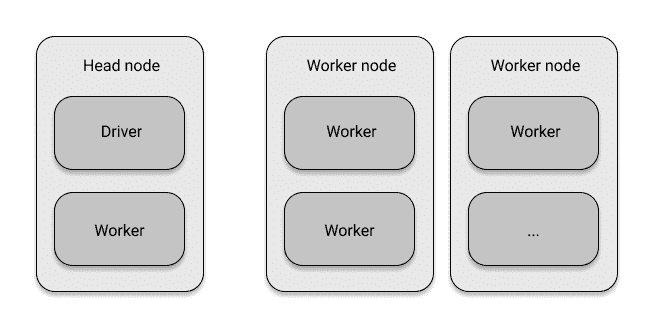
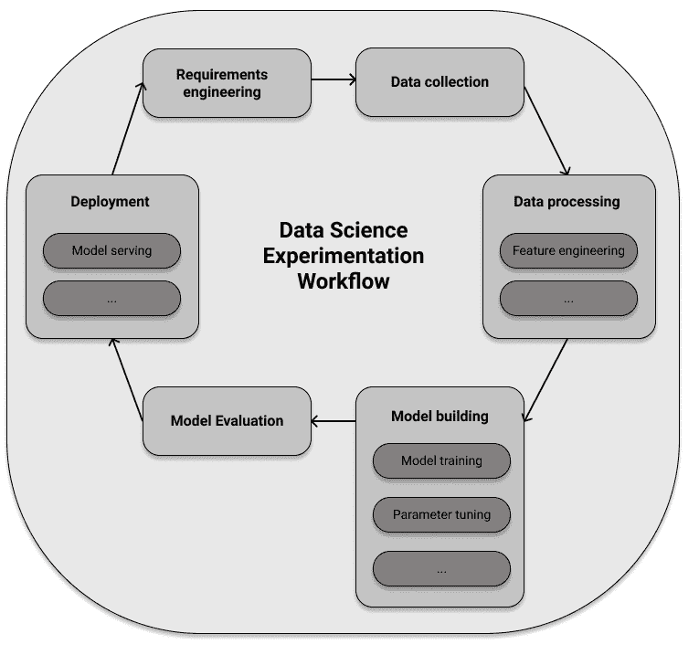
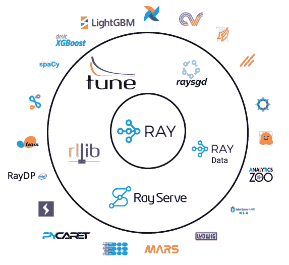

# 第一章\. Ray 概述

> 分布式系统是指你甚至都不知道存在的计算机出现故障，可能会使你自己的计算机无法使用。
> 
> 莱斯利·兰波特

我们需要高效的分布式计算的原因之一是，我们正在以越来越快的速度收集越来越多种类的数据。过去十年中出现的存储系统、数据处理和分析引擎对许多公司的成功至关重要。有趣的是，大多数“大数据”技术是由（数据）工程师构建和操作的，他们负责数据收集和处理任务。其理念是为了让数据科学家可以专注于他们擅长的工作。作为数据科学从业者，您可能希望专注于训练复杂的机器学习模型、运行高效的超参数选择、构建全新和定制的模型或仿真，或者提供您的模型以展示它们。同时，您可能*必须*将它们扩展到计算集群。为此，您选择的分布式系统需要支持所有这些细粒度的“大计算”任务，可能还需要使用专门的硬件。理想情况下，它还应该适合您正在使用的大数据工具链，并且足够快以满足您的延迟要求。换句话说，分布式计算必须强大且灵活，以处理复杂的数据科学工作负载，而 Ray 可以帮助您实现这一点。

Python 很可能是今天数据科学中最流行的语言，对我来说，在日常工作中它是最实用的。现在它已经超过 30 年了，但仍然拥有一个不断增长和活跃的社区。丰富的 [PyData 生态系统](https://pydata.org/) 是数据科学家工具箱的重要组成部分。你如何确保扩展你的工作负载同时仍然利用你需要的工具？这是一个棘手的问题，特别是因为社区不能被迫抛弃他们的工具箱或编程语言。这意味着数据科学的分布式计算工具必须为其现有的社区构建。

# Ray 是什么？

我喜欢 Ray 的原因是它符合以上所有要求。它是为 Python 数据科学社区构建的灵活分布式计算框架。Ray 容易上手，保持简单事物的简单。它的核心 API 尽可能精简，帮助您有效地思考要编写的分布式程序。您可以在笔记本电脑上有效地并行执行 Python 程序，并且几乎无需任何更改即可在集群上运行您在本地测试过的代码。它的高级库易于配置，并且可以无缝地一起使用。其中一些，如 Ray 的强化学习库，将有一个光明的未来作为独立项目，无论是分布式还是非分布式。虽然 Ray 的核心是用 C++ 构建的，但从一开始就是以 Python 为主的框架，与许多重要的数据科学工具集成，并且可以依靠一个不断增长的生态系统。

分布式 Python 并不新鲜，Ray 也不是这个领域的第一个框架（也不会是最后一个），但它在提供内容方面确实与众不同。当你结合 Ray 的多个模块并拥有自定义的、机器学习密集型工作负载时，Ray 表现尤为出色，否则这些工作将难以实现。它通过利用你已知且想要使用的 Python 工具，轻松地运行复杂工作负载，使分布式计算灵活多变。换句话说，通过*学习 Ray*，你可以了解*数据科学中灵活的分布式 Python*。

在本章中，你将初步了解 Ray 可以为你做些什么。我们将讨论组成 Ray 的三个层次，即其核心引擎、高级库和生态系统。在整个章节中，我们将展示首个代码示例，让你对 Ray 有所感觉，但我们将深入讨论 Ray 的 API 和组件留到后面的章节。你可以把本章视为整本书的概述。

# 什么导致了 Ray 的出现？

编写分布式系统很困难。它需要你可能没有的特定知识和经验。理想情况下，这样的系统应该不会干扰你，而是提供抽象层让你专注于工作。但实际上，“所有非平凡的抽象，在某种程度上，都会泄漏”（[Spolsky](https://www.joelonsoftware.com/2002/11/11/the-law-of-leaky-abstractions/)），让计算机集群按照你的意愿工作无疑是困难的。许多软件系统需要远远超出单个服务器所能提供的资源。即使一个服务器足够了，现代系统也需要具备故障安全性，并提供高可用性等功能。这意味着你的应用程序可能需要在多台甚至多个数据中心上运行，以确保它们的可靠性。

即使你对机器学习（ML）或更广义的人工智能（AI）不太熟悉，你一定听说过这个领域的最新突破。仅举两个例子，像[Deepmind 的 AlphaFold](https://deepmind.com/blog/article/alphafold-a-solution-to-a-50-year-old-grand-challenge-in-biology)解决蛋白质折叠问题，或者[OpenAI 的 Codex](https://openai.com/blog/openai-codex/)帮助软件开发人员处理繁琐的工作，近期都成为了新闻。你可能也听说过，ML 系统通常需要大量数据来进行训练。OpenAI 在他们的论文[“AI and Compute”](https://openai.com/blog/ai-and-compute/)中展示了 AI 模型训练所需的计算能力呈指数增长，这些操作以 petaflops（每秒数千万亿次操作）计量，自 2012 年以来每 3.4 个月*翻倍*。

将这与摩尔定律¹进行比较，该定律规定计算机中的晶体管数量每两年翻一番。即使你对摩尔定律持乐观态度，你也能看出在机器学习中有分布式计算的明显需求。你还应该了解到，许多机器学习任务可以自然地分解为并行运行。因此，如果可以加快速度，为什么不这样做呢？

分布式计算通常被认为很难。但是为什么会这样呢？难道不应该找到良好的抽象方法在集群上运行代码，而不必不断考虑各个单独的机器及其相互操作吗？如果我们专门关注人工智能工作负载会怎样呢？

加州大学伯克利分校的[RISELab](https://rise.cs.berkeley.edu/)的研究人员创建了 Ray 来解决这些问题。当时存在的工具都不能满足他们的需求。他们正在寻找一种简单的方式将工作负载分发到计算集群中以加快处理速度。他们考虑的工作负载性质相当灵活，不适合现有的分析引擎。与此同时，RISELab 希望建立一个系统来处理工作分发的细节。通过合理的默认行为，研究人员应能够专注于他们的工作。理想情况下，他们应该能够使用 Python 中所有他们喜爱的工具。因此，Ray 的设计强调高性能和异构工作负载。[Anyscale](https://www.anyscale.com/)，Ray 背后的公司，正在构建一个托管 Ray 应用程序的托管平台，并提供托管解决方案。让我们来看看 Ray 设计用于哪些应用程序的示例。

## Python 和强化学习中的灵活工作负载

我手机上的一个我最喜欢的应用可以自动分类或“标记”我们花园中的各种植物。它的工作原理很简单，只需展示相关植物的图片即可。这非常有帮助，因为我擅长的不是分辨它们。（我并不是在炫耀我的花园有多大，只是我分辨不好。）在过去几年中，我们见证了许多类似的令人印象深刻的应用程序的激增。

最终，人工智能的承诺是建立超越分类对象的智能代理。想象一下，一个人工智能应用不仅了解您的植物，还可以照顾它们。这样的应用程序必须

+   在动态环境中运行（如季节变化）

+   对环境变化做出反应（如剧烈风暴或害虫攻击您的植物）

+   进行一系列操作（如浇水和施肥）

+   完成长期目标（如优先考虑植物健康）

通过观察环境，这样的人工智能也会学习探索其可能采取的行动，并随着时间的推移提出更好的解决方案。如果你觉得这个例子太假或者离实际太远，自己也不难想出符合上述所有要求的例子。想想如何管理和优化供应链，在考虑波动需求时战略性地补充仓库存货，或者编排装配线中的加工步骤。另一个可以从人工智能期望中看到的著名例子是史蒂芬·沃兹尼亚克的著名“咖啡测试”。如果你被邀请去朋友家，你可以找到厨房，找到咖啡机和所有必要的配料，弄清楚如何冲一杯咖啡，并坐下来享用。一台机器应该能做同样的事情，尽管最后一部分可能有点难度。你能想到哪些其他例子呢？

你可以在机器学习的一个子领域——强化学习（RL）中自然地表述所有上述要求。我们在第四章中专门讨论了 RL。现在，理解它与代理通过观察环境并发出动作进行互动有关就足够了。在 RL 中，代理通过分配奖励来评估他们的环境（例如，我的植物在 1 到 10 的尺度上有多健康）。术语“强化”来自于代理有望学会寻求导致良好结果（高奖励）的行为，并回避惩罚性情况（低或负奖励）。代理与其环境的交互通常通过创建其计算模拟来建模。正如你可以从我们提供的例子中想象的那样，这些模拟很快就会变得复杂起来。

我们还没有像我描绘的那种园艺机器人。我们也不知道哪种人工智能范式会让我们达到那里。我知道的是，世界充满了复杂、动态和有趣的例子，我们需要应对这些问题。为此，我们需要帮助我们做到这一点的计算框架，而 Ray 正是为此而建立的。RISELab 创建 Ray 以在规模上构建和运行复杂的人工智能应用程序，而强化学习从一开始就是 Ray 的一个组成部分。

## 三层：核心、库和生态系统

现在你知道为什么 Ray 被建立以及其创作者的初衷，让我们来看看 Ray 的三个层次。

+   一个用简明的核心 API 为 Python 提供的低级分布式计算框架。³

+   由 Ray 的创建者构建和维护的一组高级数据科学库。

+   一个与其他著名项目进行整合和合作的不断增长的生态系统。

这里有很多内容需要解开，我们将在本章节的剩余部分逐个探讨这些层次。您可以将 Ray 的核心引擎及其 API 想象为中心，其他所有东西都是在其基础上构建的。Ray 的数据科学库则是在其之上构建的。在实践中，大多数数据科学家将直接使用这些更高级别的库，并且不经常需要回到核心 API。对于经验丰富的从业者来说，Ray 的第三方集成数量不断增加，是另一个很好的切入点。让我们逐个看看这些层次。

# 分布式计算框架

Ray 的核心是一个分布式计算框架。在这里，我们只介绍基本术语，并在第二章中深入讨论 Ray 的架构。简而言之，Ray 设置并管理计算机群集，以便您可以在其上运行分布式任务。一个 Ray 群集由通过网络连接的节点组成。您将程序编写到所谓的 *driver*，即程序根节点上，该节点位于 *head node* 上。*driver* 可以运行 *jobs*，即在群集节点上运行的任务集合。具体来说，一个 job 的各个任务在 *worker nodes* 上的 *worker* 进程上运行。图 图 1-1 描述了 Ray 群集的基本结构。



###### 图 1-1\. Ray 簇的基本组件

有趣的是，Ray 群集也可以是一个 *本地群集*，即仅由您自己的计算机组成的群集。在这种情况下，只有一个节点，即头节点，它具有驱动程序进程和一些工作进程。默认的工作进程数量是您机器上可用的 CPU 数量。

有了这些知识，现在是时候动手运行您的第一个本地 Ray 群集了。在任何主流操作系统上使用 `pip` 安装 Ray⁴ 应该是无缝的：

```py
pip install "ray[rllib, serve, tune]"==1.9.0
```

通过简单的 `pip install ray` 命令，您只安装了 Ray 的基本组件。由于我们希望探索一些高级功能，我们还安装了“extras” 中的 `rllib`、`serve` 和 `tune`，稍后我们将讨论它们。根据您的系统配置，您可能不需要上述安装命令中的引号。

接下来，请启动一个 Python 会话。您可以使用 `ipython` 解释器，我觉得它非常适合跟随简单示例。如果您不想自己输入命令，也可以转到[本章节的 jupyter notebook](https://github.com/maxpumperla/learning_ray/blob/main/notebooks/ch_01_overview.ipynb) 并在那里运行代码。选择权在您，但无论如何，请记住使用 Python 版本 `3.7` 或更高版本。在您的 Python 会话中，您现在可以轻松导入并初始化 Ray，如下所示：

##### 示例 1-1\.

```py
import ray
ray.init()
```

使用这两行代码，你已经在本地机器上启动了一个 Ray 集群。这个集群可以作为工作节点利用你计算机上所有可用的核心。在这种情况下，你没有向 `init` 函数提供任何参数。如果你想在一个“真实”的集群上运行 Ray，你需要向 `init` 传递更多参数。其余的代码将保持不变。

运行这段代码后，你应该会看到以下形式的输出（我们使用省略号删除了杂乱的内容）：

```py
... INFO services.py:1263 -- View the Ray dashboard at http://127.0.0.1:8265
{'node_ip_address': '192.168.1.41',
 'raylet_ip_address': '192.168.1.41',
 'redis_address': '192.168.1.41:6379',
 'object_store_address': '.../sockets/plasma_store',
 'raylet_socket_name': '.../sockets/raylet',
 'webui_url': '127.0.0.1:8265',
 'session_dir': '...',
 'metrics_export_port': 61794,
 'node_id': '...'}
```

这表明你的 Ray 集群已经启动并运行。从输出的第一行可以看出，Ray 自带一个预打包的仪表板。很可能你可以在 [*http://127.0.0.1:8265*](http://127.0.0.1:8265) 查看它，除非你的输出显示了不同的端口。如果愿意，你可以花些时间探索这个仪表板。例如，你应该看到列出了所有 CPU 核心以及你（简单的）Ray 应用程序的总利用率。我们将在后续章节中回到仪表板。

我们在这里还没有完全准备好深入了解 Ray 集群的所有细节。稍微提前一点，你可能会看到 `raylet_ip_address`，它是所谓的 *Raylet* 的引用，负责在你的工作节点上安排任务。每个 Raylet 都有一个用于分布式对象的存储，上面的 `object_store_address` 暗示了这一点。任务一旦被安排，就会由工作进程执行。在 第二章 中，你将更好地理解所有这些组件以及它们如何组成一个 Ray 集群。

在继续之前，我们还应该简要提到 Ray 核心 API 非常易于访问和使用。但由于它也是一个相对底层的接口，使用它构建有趣的示例需要一些时间。第二章 中有一个广泛的第一个示例，可以帮助你开始使用 Ray 核心 API，在 第三章 中，你将看到如何构建一个更有趣的 Ray 强化学习应用程序。

现在你的 Ray 集群还没有做太多事情，但这将很快改变。在下一节快速介绍数据科学工作流程之后，你将运行你的第一个具体的 Ray 示例。

# 一套数据科学库

转向 Ray 的第二层，本节将介绍 Ray 自带的所有数据科学库。为此，让我们首先俯瞰一下做数据科学意味着什么。一旦理解了这个背景，理解 Ray 的高级库并看到它们如何对你有用就容易得多了。如果你对数据科学过程有很好的理解，可以直接跳到 “使用 Ray Data 进行数据处理” 部分。

## 机器学习与数据科学工作流程

“数据科学”（DS）这个有些难以捉摸的术语近年来发生了很大变化，你可以在网上找到许多不同用途的定义。[⁵] 对我来说，它是*通过利用数据获得见解并构建真实应用*的实践。这是一个非常广泛的定义，你不一定同意我的观点。我的观点是，数据科学是一个围绕构建和理解事物的实践和应用领域，这在*纯粹*学术背景下几乎没有意义。从这个意义上讲，将这个领域的从业者描述为“数据科学家”就像将黑客描述为“计算机科学家”一样不合适。[⁶]

既然你对 Python 很熟悉，希望你带有一定的工匠精神，我们可以从非常实用的角度来探讨 Ray 的数据科学库。在实践中进行数据科学是一个迭代的过程，大致如下：

需求工程

你需要与利益相关者交流，明确需要解决的问题，并为这个项目澄清需求。

数据收集

然后你收集、检查和审视数据。

数据处理

然后你处理数据，以便能够解决问题。

模型构建

接着，你开始使用数据构建模型（广义上），这可以是一个包含重要指标的仪表盘，一个可视化效果，或者一个机器学习模型，还有许多其他形式。

模型评估

接下来的步骤是根据第一步的要求评估你的模型。

部署

如果一切顺利（很可能不会），你将在生产环境中部署解决方案。你应该将其视为需要监控的持续过程，而不是一次性步骤。

否则，你需要回到起点重新开始。最有可能的结果是，即使在初次部署之后，你也需要在各种方面改进解决方案。

机器学习并不一定是这个过程的一部分，但你可以看到构建智能应用或获得见解如何从机器学习中受益。在你的社交媒体平台中建立人脸检测应用，无论是好是坏，可能就是一个例子。当明确包括构建机器学习模型的数据科学过程时，你可以进一步指定一些步骤：

数据处理

要训练机器学习模型，你需要数据以一种能被你的 ML 模型理解的格式。转换和选择应该被馈送到模型中的数据的过程通常称为*特征工程*。这一步骤可能会很混乱。如果你能依靠常用工具来完成这项工作，你将受益匪浅。

模型训练

在机器学习中，你需要在上一步处理的数据上训练算法。这包括选择适合任务的正确算法，如果你能从多种算法中选择，那将会很有帮助。

超参数调优

机器学习模型具有在模型训练步骤中调整的参数。大多数 ML 模型还有另一组参数，称为*超参数*，可以在训练之前修改。这些参数可以严重影响您所得到的 ML 模型的性能，需要适当地进行调整。有很好的工具可以帮助自动化这个过程。

模型服务

训练后的模型需要部署。服务一个模型意味着通过任何必要的手段使其对需要访问的人员可用。在原型中，通常使用简单的 HTTP 服务器，但也有许多专门的 ML 模型服务软件包。

这个列表并不全面。如果你从未经历过这些步骤或对术语感到困惑，不要担心，我们将在后面的章节中详细讨论。如果你想更深入地了解构建机器学习应用程序时数据科学流程的整体视图，书籍[《Building Machine Learning Powered Applications》](https://www.oreilly.com/library/view/building-machine-learning/9781492045106/)专门讨论了这个问题。

图 Figure 1-2 概述了我们刚讨论的步骤：



###### 图 1-2\. 使用机器学习进行数据科学实验工作流程的概述

此时，你可能想知道这些与 Ray 有什么关系。好消息是 Ray 为上述四种专门的机器学习任务各自提供了专用库，涵盖了数据处理、模型训练、超参数调整和模型服务。而 Ray 的设计方式，所有这些库都是*分布式构建*的。接下来我们逐一介绍每一个。

## 使用 Ray Data 进行数据处理

Ray 的第一个高级库被称为“Ray Data”。这个库包含一个称为`Dataset`的数据结构，用于加载各种格式和系统的数据的多种连接器，用于转换这些数据集的 API，用于构建数据处理管道以及与其他数据处理框架的许多集成。`Dataset`抽象构建在强大的[Arrow 框架](https://arrow.apache.org/)之上。

要使用 Ray Data，你需要安装 Python 的 Arrow，例如通过运行`pip install pyarrow`。我们现在将讨论一个简单的示例，从 Python 数据结构创建一个在本地 Ray 集群上分布式的`Dataset`。具体来说，你将从一个包含字符串`name`和整数`data`的 Python 字典创建一个包含`10000`个条目的数据集：

##### 示例 1-2\.

```py
import ray

items = [{"name": str(i), "data": i} for i in range(10000)]
ds = ray.data.from_items(items)   
ds.show(5)  
```


使用`ray.data`模块中的`from_items`创建一个`Dataset`。


打印`Dataset`的前 10 个条目。

`show`一个`Dataset`意味着打印它的一些值。你应该在命令行上精确地看到`5`个所谓的`ArrowRow`元素，如下所示：

```py
ArrowRow({'name': '0', 'data': 0})
ArrowRow({'name': '1', 'data': 1})
ArrowRow({'name': '2', 'data': 2})
ArrowRow({'name': '3', 'data': 3})
ArrowRow({'name': '4', 'data': 4})
```

现在你有了一些分布式的行数据，但是你能用这些数据做什么呢？`Dataset` API 在函数式编程方面表现得非常出色，因为它非常适合数据转换。尽管 Python 3 在隐藏一些函数式编程能力时有所改进，但你可能已经熟悉诸如 `map`、`filter` 等功能。如果还不熟悉，学起来也很容易。`map` 对数据集的每个元素进行转换，并行进行。`filter` 根据布尔过滤函数删除数据点。稍微复杂一点的 `flat_map` 首先类似于 `map` 映射值，然后还会“展平”结果。例如，如果 `map` 会生成一个列表的列表，`flat_map` 将会展平嵌套列表并给出一个单一的列表。有了这三个函数式 API 调用，让我们看看你能多轻松地转换你的数据集 `ds`：

##### 示例 1-3。使用常见的函数式编程例程转换 `Dataset`。

```py
squares = ds.map(lambda x: x["data"] ** 2)  

evens = squares.filter(lambda x: x % 2 == 0)  
evens.count()

cubes = evens.flat_map(lambda x: [x, x**3])  
sample = cubes.take(10)  
print(sample)
```


我们将 `ds` 的每一行映射为仅保留其 `data` 条目的平方值。


然后，我们筛选出 `squares` 中的偶数（共 5000 个元素）。


然后，我们使用 `flat_map` 用其各自的立方体增强剩余值。


`take` 总共 `10` 个值意味着离开 Ray 并返回一个可以打印这些值的 Python 列表。

`Dataset` 转换的缺点是每个步骤都是同步执行的。在示例 Example 1-3 中，这不是问题，但对于复杂的任务，例如混合读取文件和处理数据，您希望执行可以重叠各个任务。`DatasetPipeline` 正是这样做的。让我们将最后一个例子重写为一个流水线。

##### 示例 1-4。

```py
pipe = ds.window()  
result = pipe\
    .map(lambda x: x["data"] ** 2)\
    .filter(lambda x: x % 2 == 0)\
    .flat_map(lambda x: [x, x**3])  
result.show(10)
```


你可以通过在其上调用 `.window()` 将 `Dataset` 转换为流水线。


流水线步骤可以链接以产生与以前相同的结果。

Ray 数据还有很多要说的，特别是它与显著数据处理系统的集成，但我们必须推迟深入讨论直到 Chapter 7。

## 模型训练。

接下来让我们看看 Ray 的分布式训练能力。为此，您可以访问两个库。一个专门用于强化学习，另一个则具有不同的范围，主要针对监督学习任务。

### 使用 Ray RLlib 进行强化学习。

让我们从 *Ray RLlib* 开始进行强化学习。这个库由现代 ML 框架 TensorFlow 和 PyTorch 提供支持，你可以选择使用其中之一。这两个框架在概念上似乎越来越收敛，所以你可以根据自己的喜好选择其中一个，而不会在过程中失去太多。在整本书中，为了保持一致性，我们使用 TensorFlow。现在就可以通过 `pip install tensorflow` 安装它。

在 RLlib 中运行示例的最简单方法之一是使用命令行工具 `rllib`，我们之前已经通过 `pip` 隐式安装过了。一旦你在 第四章 中运行更复杂的示例，你将主要依赖其 Python API，但现在我们只是想初步尝试运行 RL 实验。

我们将讨论一个相当经典的控制问题，即平衡摆动摆的问题。想象一下，你有一个像图 图 1-3 中所示的摆锤，固定在一个点上并受重力作用。你可以通过从左侧或右侧推动摆锤来操纵它。如果你施加恰到好处的力量，摆锤可能会保持竖直位置。这是我们的目标 - 我们要解决的问题是是否能教会一个强化学习算法来为我们做到这一点。


###### 图 1-3\. 控制一个简单的摆锤，通过向左或向右施加力来实现

具体来说，我们希望训练一个能够向左或向右推动的强化学习代理，从而通过作用于其环境（操纵摆锤）来达到“竖直位置”目标，进而获得奖励。要使用 Ray RLlib 解决这个问题，可以将以下内容保存在名为 `pendulum.yml` 的文件中。

##### 示例 1-5\.

```py
# pendulum.yml
pendulumppo:
    env: Pendulum-v1  
    run: PPO  
    checkpoint_freq: 5  
    stop:
        episode_reward_mean: 800  
    config:
        lambda: 0.1  
        gamma: 0.95
        lr: 0.0003
        num_sgd_iter: 6
```


`Pendulum-v1` 环境模拟了我们刚刚描述的摆动问题。


我们使用一种强大的 RL 算法叫做 Proximal Policy Optimization，即 PPO。


每经过五次“训练迭代”我们就会对模型进行检查点保存。


一旦我们达到 `-800` 的奖励，我们将停止实验。


PPO 需要一些 RL 特定的配置才能解决这个问题。

这个配置文件的详细信息在这一点上并不重要，请不要被它们分散注意力。重要的部分是你要指定内置的`Pendulum-v1`环境以及足够的 RL 特定配置，以确保训练过程顺利进行。配置是 Ray 的一个简化版本的[tuned examples](https://github.com/ray-project/ray/tree/master/rllib/tuned_examples)之一。我们选择了这个配置，因为它不需要任何特殊的硬件，并且在几分钟内完成。如果你的计算机足够强大，你也可以尝试运行这个调整后的示例，它应该会得到更好的结果。要训练这个摆例子，你现在可以简单地运行：

```py
rllib train -f pendulum.yml
```

如果你愿意，你可以检查这个 Ray 程序的输出，并查看训练过程中不同指标的演变。如果你不想自己创建这个文件，并且想要运行一个能给你更好结果的实验，你也可以这样运行：

```py
curl https://raw.githubusercontent.com/maxpumperla/learning_ray/main/notebooks/pendulum.yml -o pendulum.yml
rllib train -f pendulum.yml
```

无论如何，假设训练程序已经完成，我们现在可以检查它的表现如何。要可视化训练过的摆，你需要安装另一个 Python 库，使用`pip install pyglet`。你需要弄清楚的另一件事是 Ray 存储了你的训练进展的地方。当你运行`rllib train`进行实验时，Ray 会为你创建一个唯一的实验 ID，并默认将结果存储在`~/ray-results`的子文件夹中。对于我们使用的训练配置，你应该看到一个结果文件夹，看起来像是`~/ray_results/pendulum-ppo/PPO_Pendulum-v1_<experiment_id>`。在训练过程中，中间的模型检查点会在同一个文件夹中生成。例如，在我的机器上有一个文件夹：

```py
 ~/ray_results/pendulum-ppo/PPO_Pendulum-v1_20cbf_00000_0_2021-09-24_15-20-03/checkpoint_000029/checkpoint-29
```

一旦你找到实验 ID 并选择了检查点 ID（作为经验法则，ID 越大，结果越好），你可以像这样评估你的摆训练运行的训练性能：

```py
rllib evaluate \
  ~/ray_results/pendulum-ppo/PPO_Pendulum-v1_<experiment_id>/checkpoint_0000<cp-id>/checkpoint-<cp-id> \
  --run PPO --env Pendulum-v1 --steps 2000
```

你应该看到一个由代理控制的摆的动画，看起来像图 1-3。由于我们选择了快速的训练过程而不是最大化性能，你应该看到代理在摆运动中有些困难。我们本可以做得更好，如果你有兴趣浏览 Ray 调整后的示例来针对`Pendulum-v1`环境，你会找到许多这个练习的解决方案。这个示例的重点是向你展示使用 RLlib 来训练和评估强化学习任务可以有多简单，只需两个命令行调用到`rllib`。

### 使用 Ray 进行分布式训练

Ray RLlib 专注于强化学习，但如果你需要为其他类型的机器学习，比如监督学习，训练模型，你可以在这种情况下使用另一个 Ray 库进行分布式训练，称为*Ray Train*。目前，我们对诸如`TensorFlow`之类的框架尚不了解，无法为 Ray Train 给出具体和有信息的例子。在第六章讨论时，我们会讨论所有这些。但我们至少可以大致勾画一下 ML 模型的分布式训练“包装器”会是什么样子，概念上足够简单：

##### 例 1-6。

```py
from ray.train import Trainer

def training_function():  
    pass

trainer = Trainer(backend="tensorflow", num_workers=4)  
trainer.start()

results = trainer.run(training_function)  
trainer.shutdown()
```


首先，定义你的 ML 模型训练函数。我们这里简单传递。


然后用 TensorFlow 作为后端初始化一个`Trainer`实例。


最后，在 Ray 集群上扩展你的训练函数。

如果你对分布式训练感兴趣，你可以跳到第六章。

## 超参数调整

命名事物很难，但 Ray 团队通过*Ray Tune*找到了关键点，你可以用它来调整各种参数。具体而言，它被设计用于为机器学习模型找到良好的超参数。典型的设置如下：

+   你想运行一个非常耗费计算资源的训练函数。在 ML 中，运行需要数天甚至数周的训练过程并不罕见，但我们假设你只需几分钟。

+   作为训练的结果，你计算一个所谓的目标函数。通常你要么希望最大化你的收益，要么最小化你的损失，以你实验的性能为准。

+   难点在于你的训练函数可能依赖于某些参数、超参数，这些影响你的目标函数值。

+   你可能有关于个别超参数应该是什么的直觉，但调整它们可能很困难。即使你可以将这些参数限制在合理的范围内，测试各种组合通常是不可行的。你的训练函数简直太昂贵了。

你能做些什么来有效地采样超参数，并在你的目标上获得“足够好”的结果？专注于解决这个问题的领域称为*超参数优化*（HPO），而 Ray Tune 拥有大量用于解决此问题的算法。让我们看一个 Ray Tune 的第一个例子，用于我们刚刚解释的情况。重点再次在 Ray 及其 API 上，而不是特定的 ML 任务（我们现在只是模拟）。

##### 例 1-7。使用 Ray Tune 最小化昂贵训练函数的目标

```py
from ray import tune
import math
import time

def training_function(config):  
    x, y = config["x"], config["y"]
    time.sleep(10)
    score = objective(x, y)
    tune.report(score=score)  

def objective(x, y):
    return math.sqrt((x**2 + y**2)/2)  

result = tune.run(  
    training_function,
    config={
        "x": tune.grid_search([-1, -.5, 0, .5, 1]),  
        "y": tune.grid_search([-1, -.5, 0, .5, 1])
    })

print(result.get_best_config(metric="score", mode="min"))
```


我们模拟一个昂贵的训练函数，它依赖于从`config`读取的两个超参数`x`和`y`。


在睡眠了 5 秒钟以模拟训练和计算目标后，我们将分数报告给 `tune`。


目标函数计算 `x` 和 `y` 的平方的平均值，并返回该项的平方根。这种类型的目标函数在机器学习中非常常见。


我们接着使用 `tune.run` 来初始化我们的 `training_function` 的超参数优化。


一个关键部分是为 `tune` 提供 `x` 和 `y` 的参数空间以进行搜索。

Example 1-7 中的 Tune 示例为一个具有给定 `objective` 的 `training_function` 找到了最佳的参数 `x` 和 `y` 的选择。尽管目标函数一开始可能看起来有点吓人，因为我们计算 `x` 和 `y` 的平方和，所有的值都是非负的。这意味着在 `x=0` 和 `y=0` 处获得最小值，这会使目标函数的值为 `0`。

我们进行所谓的 *网格搜索*，遍历所有可能的参数组合。因为我们为 `x` 和 `y` 明确传递了五个可能的值，这总共有 `25` 个组合会传递给训练函数。由于我们指示 `training_function` 睡眠 `10` 秒钟，顺序测试所有超参数组合将总共需要超过四分钟。由于 Ray 在并行化这个工作负载方面很聪明，在我的笔记本电脑上，整个实验只需要大约 `35` 秒。现在想象一下，每个训练运行都需要几个小时，我们有 20 个而不是两个超参数。这使得网格搜索变得不可行，特别是如果你对参数范围没有明智的猜测。在这种情况下，你将不得不使用 Ray Tune 中更复杂的超参数优化方法，正如 Chapter 5 中讨论的那样。

## 模型服务

Ray 的高级库中的最后一个我们将讨论的专注于模型服务，简称为 *Ray Serve*。要看它在实际中的示例，你需要一个训练好的机器学习模型来提供服务。幸运的是，现在你可以在互联网上找到许多有趣的已经为你训练好的模型。例如，*Hugging Face* 提供了许多可直接在 Python 中下载的模型。我们将使用的模型是一个称为 *GPT-2* 的语言模型，它接受文本作为输入，并生成继续或完成输入的文本。例如，你可以提示一个问题，GPT-2 将尝试完成它。

提供这样一个模型是使其易于访问的一个好方法。你可能不知道如何在你的电脑上加载和运行 TensorFlow 模型，但你现在知道如何用简单的英语提问。模型服务隐藏了解决方案的实现细节，让用户可以专注于提供输入和理解模型的输出。

要继续，请确保运行`pip install transformers`来安装 Hugging Face 库，该库包含我们想要使用的模型。有了这个，我们现在可以导入并启动 Ray 的`serve`库的实例，加载并部署一个 GPT-2 模型，并询问它生命的意义，就像这样：

##### 示例 1-8。

```py
from ray import serve
from transformers import pipeline
import requests

serve.start()  

@serve.deployment  
def model(request):
    language_model = pipeline("text-generation", model="gpt2")  
    query = request.query_params["query"]
    return language_model(query, max_length=100)  

model.deploy()  

query = "What's the meaning of life?"
response = requests.get(f"http://localhost:8000/model?query={query}")  
print(response.text)
```


我们在本地启动`serve`。


`@serve.deployment`装饰器将一个带有`request`参数的函数转换为一个`serve`部署。


在每次请求中加载`model`函数内的`language_model`是低效的，但这是展示部署的最快方法。


我们要求模型给出最多`100`个字符来继续我们的查询。


然后，我们正式部署模型，使其可以开始通过 HTTP 接收请求。


我们使用不可或缺的`requests`库来获取您可能有的任何问题的响应。

在[待定链接]中，您将学习如何在各种场景下正确地部署模型，但现在我鼓励您尝试这个示例并测试不同的查询。重复运行最后两行代码将会在实际操作中每次得到不同的答案。这是一颗深邃的诗意宝石，引发更多的问题，我在我的机器上查询过并稍作年龄限制的审查：

```py
[{
    "generated_text": "What's the meaning of life?\n\n
     Is there one way or another of living?\n\n
     How does it feel to be trapped in a relationship?\n\n
     How can it be changed before it's too late?
     What did we call it in our time?\n\n
     Where do we fit within this world and what are we going to live for?\n\n
     My life as a person has been shaped by the love I've received from others."
}]
```

这里我们结束了对 Ray 数据科学库的风驰电掣的介绍，这是 Ray 的第二层。在我们结束本章之前，让我们简要地看一看第三层，即围绕 Ray 的不断增长的生态系统。

# 一个不断增长的生态系统

Ray 的高级库功能强大，本书中应该对其进行更深入的探讨。虽然它们在数据科学实验生命周期中的用处不可否认，但我也不想给人留下 Ray 从现在开始就是您唯一需要的印象。事实上，我认为最好和最成功的框架是与现有解决方案和思想良好整合的框架。更好地专注于您的核心优势，并利用其他工具弥补解决方案中缺失的部分。通常没有理由重新发明轮子。

## Ray 如何整合和扩展

为了给您一个 Ray 如何与其他工具集成的示例，可以考虑 Ray Data 是其库中的一个相对较新的添加。如果要简化一下，也许有点过于简单化，Ray 可以被视为一个以计算为先的框架。相比之下，像 Apache Spark⁷或 Dask 等分布式框架可以被视为以数据为先。几乎您在 Spark 中做的任何事情都以定义分布式数据集及其转换开始。Dask 则致力于将常见数据结构如 Pandas 数据帧或 Numpy 数组引入到分布式设置中。从各自的角度来看，它们都非常强大，我们将在[Link to Come]中为您提供更详细和公平的比较与 Ray。关键在于，Ray Data 并不试图取代这些工具。相反，它与两者都很好地集成。正如您将要看到的那样，这是 Ray 的一个常见主题。

## Ray 作为分布式接口

Ray 中一个我认为极大低估的方面是，其库无缝集成了常见工具作为*后端*。Ray 通常创建通用接口，而不是试图创建新的标准⁸。这些接口允许您以分布式方式运行任务，这是大多数相应后端所不具备的，或者不具备相同的程度。例如，Ray RLlib 和 Train 支持来自 TensorFlow 和 PyTorch 的全部功能。Ray Tune 支持来自几乎所有著名的超参数优化工具的算法，包括 Hyperopt、Optuna、Nevergrad、Ax、SigOpt 等等。这些工具默认情况下都不是分布式的，但 Tune 在一个通用接口中统一了它们。Ray Serve 可以与 FastAPI 等框架一起使用，Ray Data 由 Arrow 支持，并与 Spark 和 Dask 等其他框架有着许多集成。总的来说，这似乎是一个可以用来扩展当前 Ray 项目或将新后端集成进来的健壮设计模式。

# 摘要

总结一下本章讨论的内容，图 1-4 给出了 Ray 的三个层次的概述。Ray 的核心分布式执行引擎位于框架的中心。对于实际的数据科学工作流程，您可以使用 Ray Data 进行数据处理，使用 Ray RLlib 进行强化学习，使用 Ray Train 进行分布式模型训练，使用 Ray Tune 进行超参数调优，以及使用 Ray Serve 进行模型服务。您已经看到了每个库的示例，并对它们的 API 有了初步的了解。此外，Ray 的生态系统还有许多扩展，我们稍后会更详细地讨论。也许您已经在图 1-4⁹中发现了一些您了解和喜欢的工具？



###### 图 1-4\. Ray 的三个层次：其核心 API，库 RLlib、Tune、Ray Train、Ray Serve、Ray Data 以及许多第三方集成

¹ 摩尔定律长期以来都有效，但可能已经显示出放缓的迹象。不过我们不打算在这里讨论它。重要的不是我们的计算机通常变得更快，而是与我们需要的计算量之间的关系。

² 对于你们中的专家，我并不声称强化学习是答案。强化学习只是一种自然适合于讨论人工智能目标的范式。

³ 本书是关于 Python 的，因此我们将专注于 Python。但你至少应该知道 Ray 也有一个 Java API，目前相对于其 Python 版本来说，还不够成熟。

⁴ 我们目前使用的是 Ray 版本 `1.9.0`，因为这是本文写作时最新的版本。

⁵ 我从未喜欢过将数据科学归类为学科交叉点，比如数学、编码和商业的交集。最终，这并不能告诉你从业者们*做*什么。告诉厨师他们坐在农业、热力学和人际关系的交集上，并不完全正确，也并不是非常有帮助。

⁶ 作为一项有趣的练习，我建议阅读保罗·格雷厄姆（Paul Graham）著名的[《黑客与画家》](http://www.paulgraham.com/hp.xhtml)一文，将“计算机科学”替换为“数据科学”。那么黑客 2.0 会是什么样子呢？

⁷ Spark 是由加州大学伯克利分校的 AMPLab 创建的。互联网上充斥着关于 Ray 应该被视为 Spark 替代品的博客文章。最好将它们视为具有不同优势的工具，两者都很可能会继续存在。

⁸ 在深度学习框架[Keras](https://keras.io)正式成为企业旗舰的一部分之前，它起初是各种低级框架（如 Theano、CNTK 或 TensorFlow）的方便 API 规范。从这个意义上说，Ray RLlib 有可能成为 RL 的 Keras。Ray Tune 或许只是超参数优化的 Keras。更广泛采用的缺失可能是更优雅的 API。

⁹ 请注意，“Ray Train”在较早版本的 Ray 中被称为“raysgd”，并且还没有新的标志。
