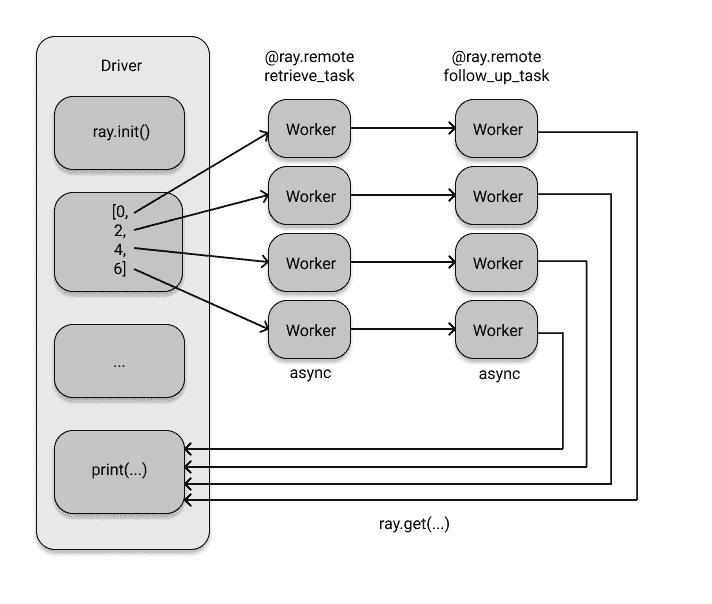
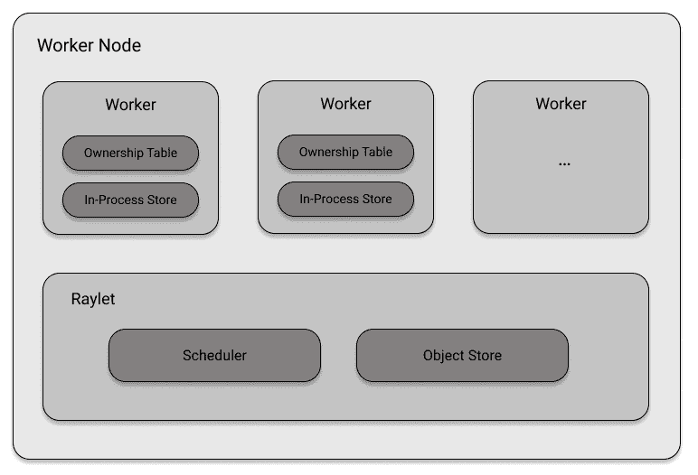
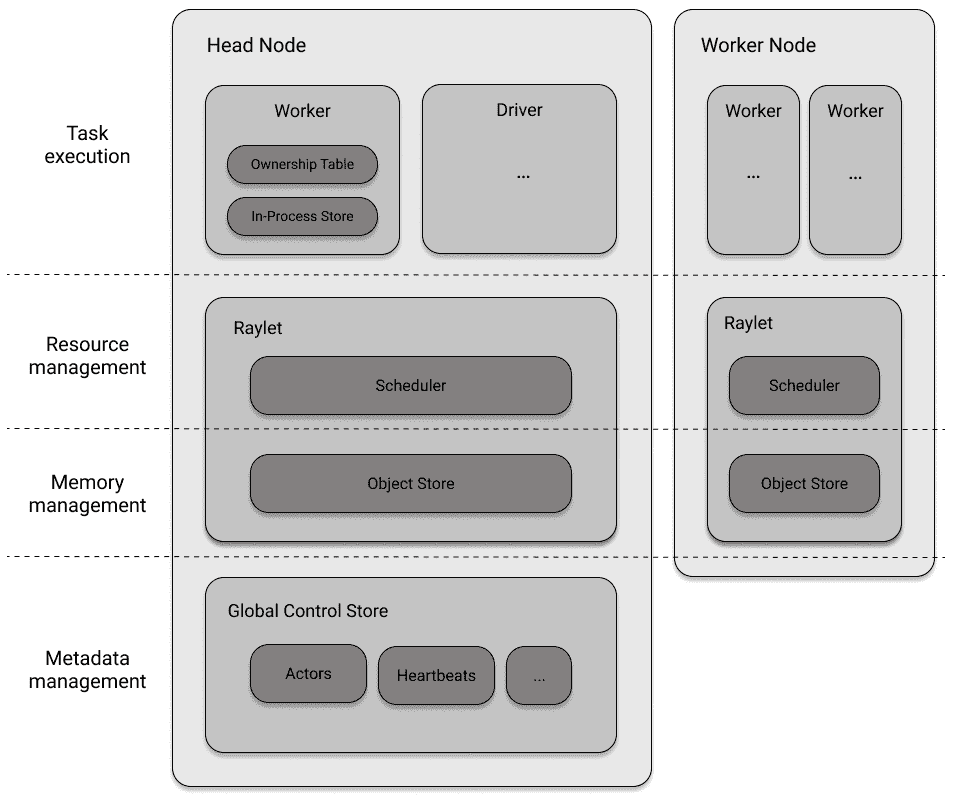

# 第二章：开始使用 Ray Core

对于一本关于分布式 Python 的书来说，有一定讽刺意味的是，Python 本身在分布式计算方面效果并不好。它的解释器实际上是单线程的，这使得在同一台机器上利用多个 CPU，甚至整个机群，使用纯 Python 变得困难。这意味着您需要额外的工具支持，幸运的是，Python 生态系统为您提供了一些选择。例如，像`multiprocessing`这样的库可以帮助您在单台机器上分发工作，但不能跨越机器。

在本章中，您将了解 Ray 核心如何通过启动本地集群处理分布式计算，并学习如何使用 Ray 精简而强大的 API 来并行化一些有趣的计算任务。例如，您将构建一个示例，以高效异步地在 Ray 上运行数据并行任务，这种方式方便而且不容易用其他工具复制。我们将讨论*任务*和*actors*如何作为 Python 中函数和类的分布式版本工作。您还将了解 Ray 的所有基本概念及其架构的内部工作原理。换句话说，我们将让您深入了解 Ray 引擎的内部工作。

# Ray 核心简介

本章的大部分内容是一个扩展的 Ray 核心示例，我们将一起构建。许多 Ray 的概念可以通过一个良好的示例来解释，这正是我们将要做的。与之前一样，您可以通过自己键入代码（强烈推荐）或者通过跟随本章的[笔记本](https://github.com/maxpumperla/learning_ray/blob/main/notebooks/ch_02_ray_core.ipynb)来跟随这个示例。

在第一章中，我们向您介绍了 Ray 集群的基础知识，并展示了如何通过简单地键入来启动本地集群

##### 示例 2-1.

```py
import ray
ray.init()
```

在继续之前，您需要一个运行中的 Ray 集群来运行本章的示例。本节的目标是为您快速介绍 Ray Core API，从现在起我们将简称为 Ray API。

作为 Python 程序员，Ray API 的一个伟大之处在于它非常贴近我们的生活。它使用熟悉的概念，如装饰器、函数和类，为您提供快速的学习体验。Ray API 旨在为分布式计算提供通用的编程接口。这绝非易事，但我认为 Ray 在这方面取得了成功，因为它为您提供了直观学习和使用的良好抽象。Ray 引擎在后台为您处理所有繁重的工作。这种设计理念使得 Ray 能够与现有的 Python 库和系统兼容。

## 使用 Ray API 的第一个示例

举个例子，考虑以下从数据库检索和处理数据的函数。我们的虚拟`database`是一个简单的 Python 列表，包含这本书标题的单词。我们假设从这个数据库检索一个单独的`item`并进一步处理它是昂贵的，通过让 Python `sleep`来模拟这一过程。

##### 示例 2-2\.

```py
import time

database =   ![1
    "Learning", "Ray",
    "Flexible", "Distributed", "Python", "for", "Data", "Science"
]

def retrieve(item):
    time.sleep(item / 10.)  
    return item, database[item]
```


一个包含这本书标题的字符串数据的虚拟数据库。


我们模拟一个长时间运行的数据处理操作。

我们的数据库有八个项目，从`database[0]`的“Learning”到`database[7]`的“Science”。如果我们按顺序检索所有项目，那需要多长时间？对于索引为`5`的项目，我们等待半秒（`5 / 10.`），依此类推。总体而言，我们可以预期大约需要 `(0+1+2+3+4+5+6+7)/10\. = 2.8` 秒的运行时间。让我们看看实际上会得到什么：

##### 示例 2-3\.

```py
def print_runtime(input_data, start_time, decimals=1):
    print(f'Runtime: {time.time() - start_time:.{decimals}f} seconds, data:')
    print(*input_data, sep="\n")

start = time.time()
data = [retrieve(item) for item in range(8)]  
print_runtime(data, start)  
```


我们使用列表推导式来检索所有八个项目。


然后我们解压数据，每个项目都单独打印在一行上。

如果您运行此代码，您应该看到以下输出：

```py
Runtime: 2.8 seconds, data:
(0, 'Learning')
(1, 'Ray')
(2, 'Flexible')
(3, 'Distributed')
(4, 'Python')
(5, 'for')
(6, 'Data')
(7, 'Science')
```

我们在程序输出后截断小数点后一位数字。还有一点额外的开销使得总时间接近 `2.82` 秒。在您的计算机上可能会略少一些，或者更多，这取决于您的计算机性能。重要的是我们的简单 Python 实现无法并行运行此函数。也许这对您来说并不奇怪，但您至少可以怀疑 Python 的列表推导在这方面更有效率。我们得到的运行时间几乎是最坏的情况，即我们在运行代码之前计算的 `2.8` 秒。仔细想想，看到一个基本上大部分时间都在睡眠的程序运行得这么慢甚至有点令人沮丧。最终，您可以归咎于全局解释器锁（GIL），但它已经够受罪了。

### 函数和远程 Ray 任务

假设这样一个任务可以从并行化中受益是合理的。如果完美分布，运行时间不应该比最长的子任务长多少，即`7/10\. = 0.7`秒。因此，让我们看看如何在 Ray 上扩展这个例子。为此，您可以按照以下步骤使用`@ray.remote`装饰器：

##### 示例 2-4\.

```py
@ray.remote  
def retrieve_task(item):
    return retrieve(item)  
```


只需这个装饰器，我们就可以将任何 Python 函数变成 Ray 任务。


其他一切保持不变。`retrieve_task`只是简单地传递给`retrieve`。

这样，函数`retrieve_task`变成了所谓的 Ray 任务。这是一个非常方便的设计选择，因为你可以首先专注于你的 Python 代码，而不必完全改变你的思维方式或编程范式来使用 Ray。请注意，在实践中，你只需简单地给你的原始`retrieve`函数添加`@ray.remote`装饰器（毕竟，这就是装饰器的预期用途），但我们为了尽可能清晰地保持事物，不想改动先前的代码。

足够简单，那么在检索数据并测量性能的代码中，你需要改变什么？事实证明，不需要太多改动。让我们看看你会如何做：

##### 示例 2-5。衡量你的 Ray 任务的性能。

```py
start = time.time()
data_references = [retrieve_task.remote(item) for item in range(8)]  
data = ray.get(data_references)  
print_runtime(data, start, 2)
```


要在本地 Ray 集群上运行`retrieve_task`，你使用`.remote()`并像以前一样传递你的数据。你会得到一个对象引用的列表。


要获取数据，而不仅仅是 Ray 对象引用，你使用`ray.get`。

你有发现区别吗？你必须使用`remote`函数远程执行你的 Ray 任务。当任务在远程执行时，即使在本地集群上，Ray 也会*异步*执行。最后一个代码片段中的`data_references`中的列表项并不直接包含结果。实际上，如果你检查第一个项目的 Python 类型，使用`type(data_references[0])`，你会发现它实际上是一个`ObjectRef`。这些对象引用对应于你需要询问结果的*futures*。这就是调用`ray.get(...)`的用途。

我们仍然希望在这个例子²中进一步努力，但让我们在这里退后一步，总结一下我们到目前为止所做的。你从一个 Python 函数开始，并使用`@ray.remote`装饰它。这使得你的函数成为一个 Ray 任务。然后，你不是直接在代码中调用原始函数，而是在 Ray 任务上调用了`.remote(...)`。最后一步是从 Ray 集群中`.get(...)`结果。我认为这个过程如此直观，以至于我敢打赌，你现在甚至可以从另一个函数创建自己的 Ray 任务，而不必回顾这个例子。为什么不现在就试试呢？

回到我们的例子，通过使用 Ray 任务，我们在性能方面得到了什么？在我的机器上，运行时钟为`0.71`秒，稍微超过最长子任务的`0.7`秒。这非常好，比以前要好得多，但我们可以通过利用 Ray 的更多 API 进一步改进我们的程序。

### 使用 put 和 get 的对象存储

你可能注意到，在 `retrieve` 的定义中，我们*直接*从我们的 `数据库` 访问了项目。在本地 Ray 集群上运行这没问题，但想象一下你在一个包含多台计算机的实际集群上运行。所有这些计算机如何访问相同的数据？请记住，在 Ray 集群中，有一个带有驱动程序进程（运行 `ray.init()`）的头节点，以及许多带有执行任务的工作程序进程的工作节点。我的笔记本电脑有总共 8 个 CPU 核心，因此 Ray 将在我的单节点本地集群上创建 8 个工作进程。我们的 `数据库` 目前仅在驱动程序上定义，但运行任务的工作程序需要访问它来运行 `retrieve` 任务。幸运的是，Ray 提供了一种简单的方法来在驱动程序和工作程序（或工作程序之间）之间共享数据。您可以简单地使用 `put` 将您的数据放入 Ray 的*分布式对象存储*中，然后在工作程序上使用 `get` 来检索它，如下所示。

##### 示例 2-6。

```py
database_object_ref = ray.put(database)  

@ray.remote
def retrieve_task(item):
    obj_store_data = ray.get(database_object_ref)  
    time.sleep(item / 10.)
    return item, obj_store_data[item]
```


`put` 将你的 `数据库` 放入对象存储并接收到它的引用。


这使得您的工作程序可以在集群中的任何位置 `get` 到数据。

通过这种方式使用对象存储，您可以让 Ray 处理整个集群中的数据访问。我们将在讨论 Ray 的基础设施时详细讨论数据在节点之间和工作程序内部如何传递。虽然与对象存储的交互需要一些开销，但 Ray 在存储数据方面非常聪明，这在处理更大、更真实的数据集时可以提供性能收益。目前，重要的部分是在真正分布式设置中这一步骤是必不可少的。如果愿意，尝试使用这个新的 `retrieve_task` 函数重新运行 示例 2-5，并确认它仍然如预期般运行。

### 使用 Ray 的等待函数进行非阻塞调用。

请注意在示例 2-5 中如何使用`ray.get(data_references)`来访问结果。这个调用是*阻塞的*，这意味着我们的驱动程序必须等待所有结果可用。在我们的情况下这并不是什么大问题，程序现在在不到一秒内完成。但想象一下，如果每个数据项的处理需要几分钟，那该怎么办？在那种情况下，你可能希望释放驱动程序来处理其他任务，而不是闲坐着。此外，最好能够在结果可用时即时处理它们（某些结果比其他的更快完成）。还有一个需要记住的问题是，如果一个数据项无法按预期获取会发生什么情况？假设数据库连接中某处发生死锁。在这种情况下，驱动程序将会挂起并永远无法检索所有项。因此，明智的做法是使用合理的超时。在我们的场景中，在停止任务之前，我们不应等待超过最长数据检索任务的 10 倍时间。这里是如何通过使用`wait`在 Ray 中实现的：

##### 示例 2-7\.

```py
start = time.time()
data_references = [retrieve_task.remote(item) for item in range(8)]
all_data = []

while len(data_references) > 0:  
    finished, data_references = ray.wait(data_references, num_returns=2, timeout=7.0)  
    data = ray.get(finished)
    print_runtime(data, start, 3)  
    all_data.extend(data)  
```


不阻塞，我们循环处理未完成的`data_references`。


我们使用合理的`timeout`异步`wait`等待完成的数据。在这里，`data_references`被覆盖，以防止无限循环。


当结果到达时，我们按两个数据块打印它们。


然后，直到完成，我们将新的`data`追加到`all_data`中。

如您所见，`ray.wait`返回两个参数，即已完成的数据和仍需要处理的未来数据。我们使用`num_returns`参数，默认为`1`，让`wait`在新的一对数据项可用时返回。在我的笔记本电脑上，这导致以下输出：

```py
Runtime: 0.108 seconds, data:
(0, 'Learning')
(1, 'Ray')
Runtime: 0.308 seconds, data:
(2, 'Flexible')
(3, 'Distributed')
Runtime: 0.508 seconds, data:
(4, 'Python')
(5, 'for')
Runtime: 0.709 seconds, data:
(6, 'Data')
(7, 'Science')
```

请注意，在`while`循环中，与其仅仅打印结果，我们可以做许多其他事情，比如使用已检索到的数据启动其他工作节点上的全新任务。

### 处理任务依赖关系

到目前为止，我们的示例程序在概念上相当简单。它只包括一个步骤，即检索一堆数据。现在，想象一下，一旦加载了数据，您希望对其运行后续处理任务。更具体地说，假设我们希望使用第一个检索任务的结果查询其他相关数据（假装您正在从同一数据库中的不同表中查询数据）。以下代码设置了这样一个任务，并依次运行我们的`retrieve_task`和`follow_up_task`。

##### 示例 2-8\. 运行依赖另一个 Ray 任务的后续任务

```py
@ray.remote
def follow_up_task(retrieve_result):  
    original_item, _ = retrieve_result
    follow_up_result = retrieve(original_item + 1)  
    return retrieve_result, follow_up_result  

retrieve_refs = [retrieve_task.remote(item) for item in [0, 2, 4, 6]]
follow_up_refs = [follow_up_task.remote(ref) for ref in retrieve_refs]  

result = [print(data) for data in ray.get(follow_up_refs)]
```


使用`retrieve_task`的结果，我们在其基础上计算另一个 Ray 任务。


利用第一个任务中的`original_item`，我们`retrieve`更多的数据。


然后我们返回原始数据和后续数据。


我们将第一个任务中的对象引用传递给第二个任务。

运行此代码将产生以下输出。

```py
((0, 'Learning'), (1, 'Ray'))
((2, 'Flexible'), (3, 'Distributed'))
((4, 'Python'), (5, 'for'))
((6, 'Data'), (7, 'Science'))
```

如果您在异步编程方面没有太多经验，您可能对示例 2-8 不感兴趣。但我希望说服您，这段代码至少有些令人惊讶³，因为这段代码片段实际上是可以运行的。那么，有什么了不起的地方呢？毕竟，这段代码看起来像是普通的 Python 代码 - 一个函数定义和几个列表推导式。关键在于，`follow_up_task`函数体期望其输入参数`retrieve_result`是一个 Python `tuple`，我们在函数定义的第一行对其进行解包。

但通过调用`[follow_up_task.remote(ref) for ref in retrieve_refs]`，我们根本没有向后续任务传递元组。相反，我们使用`retrieve_refs`传递了 Ray 的*对象引用*。在幕后发生的是，Ray 知道`follow_up_task`需要实际的值，因此在该任务内部，它将调用`ray.get`来解析这些 future 对象。Ray 为所有任务构建依赖图，并按照依赖关系的顺序执行它们。您不必显式告诉 Ray 何时等待先前的任务完成，它会自动推断这些信息。

仅当单个检索任务完成时，后续任务才会被调度。如果问我，这是一个令人难以置信的特性。实际上，如果我像`retrieve_refs`那样称呼它为`retrieve_result`，您甚至可能没有注意到这个重要细节。这是有意设计的。Ray 希望您专注于工作，而不是集群计算的细节。在图 Figure 2-1 中，您可以看到可视化的两个任务的依赖图。



###### 图 2-1\. 使用 Ray 异步并行运行两个依赖任务

如果您愿意，可以尝试重写示例 2-8，以便在将值传递给后续任务之前明确使用`get`。这不仅会引入更多样板代码，而且写起来和理解起来也没有那么直观。

### 从类到 actors

在结束这个示例之前，让我们讨论 Ray Core 的另一个重要概念。注意在我们的示例中，一切本质上都是一个函数。我们只是使用`ray.remote`装饰器使其中一些成为远程函数，除此之外只是使用普通的 Python。假设我们想追踪我们的`database`被查询的频率？当然，我们可以简单地计算我们的检索任务的结果，但是有没有更好的方法？我们想以一种“分布式”的方式进行跟踪，这样就能扩展。为此，Ray 有*actors*的概念。actors 允许您在集群上运行*有状态*的计算。它们还可以相互通信⁴。就像 Ray 任务只是被装饰的函数一样，Ray actors 是被装饰的 Python 类。让我们编写一个简单的计数器来跟踪我们的数据库调用。

##### 示例 2-9。

```py
@ray.remote  
class DataTracker:
    def __init__(self):
        self._counts = 0

    def increment(self):
        self._counts += 1

    def counts(self):
        return self._counts
```


我们可以通过使用与之前相同的`ray.remote`装饰器使任何 Python 类成为 Ray actor。

这个`DataTracker`类已经是一个 actor，因为我们给它装饰了`ray.remote`。这个 actor 可以追踪状态，这里只是一个简单的计数器，并且它的方法是 Ray 任务，可以像我们之前使用函数一样精确地调用，即使用`.remote()`。让我们看看如何修改我们现有的`retrieve_task`以包含这个新的 actor。

##### 示例 2-10。

```py
@ray.remote
def retrieve_tracker_task(item, tracker):  
    obj_store_data = ray.get(database_object_ref)
    time.sleep(item / 10.)
    tracker.increment.remote()  
    return item, obj_store_data[item]

tracker = DataTracker.remote()  

data_references = [retrieve_tracker_task.remote(item, tracker) for item in range(8)]  
data = ray.get(data_references)
print(ray.get(tracker.counts.remote()))  
```


我们将`tracker` actor 传递给这个任务。


`tracker`每次调用都会收到一个`increment`。


我们通过在类上调用`.remote()`来实例化我们的`DataTracker` actor。


这个 actor 被传递到检索任务中。


然后我们可以从另一个远程调用中获取我们的`tracker`的`counts`状态。

毫不奇怪，这个计算的结果实际上是`8`。我们不需要 actor 来计算这个，但我希望你能看出它可以多么有用，可以跨集群跟踪状态，潜在地覆盖多个任务。事实上，我们可以将我们的 actor 传递给任何依赖任务，甚至将其传递给另一个 actor 的构造函数。你可以做任何事情，没有限制，正是这种灵活性使 Ray API 如此强大。值得一提的是，分布式 Python 工具很少允许进行这种有状态的计算。这个特性非常有用，特别是在运行复杂的分布式算法时，例如使用强化学习时。这完成了我们广泛的第一个 Ray API 示例。接下来让我们看看是否可以简洁地总结 Ray API。

## Ray 核心 API 概述

如果你回想一下我们在前面的例子中做过的事情，你会注意到我们只使用了总共六种 API 方法⁵。你使用 `ray.init()` 来启动集群，使用 `@ray.remote` 将函数和类转换为任务和 actor。然后我们使用 `ray.put()` 将数据传入 Ray 的对象存储，使用 `ray.get()` 从集群中检索数据。最后，我们在 actor 方法或任务上使用 `.remote()` 在我们的集群上运行代码，并使用 `ray.wait` 避免阻塞调用。

虽然 Ray API 中有六种方法看起来可能不多，但这些方法在你使用 Ray API⁶ 时很可能是你唯一关心的。让我们简要总结它们在表格中，这样你以后可以轻松地参考。

表 2-1\. Ray 核心的六个主要 API 方法

| API 调用 | 描述 |
| --- | --- |
| `ray.init()` | 初始化你的 Ray 集群。传入一个 `address` 来连接到现有的集群。 |
| `@ray.remote` | 将函数转换为任务，类转换为 actor。 |
| `ray.put()` | 将数据放入 Ray 的对象存储中。 |
| `ray.get()` | 从对象存储中获取数据。返回你在那里 `put` 的数据或由任务或 actor 计算的数据。 |
| `.remote()` | 在你的 Ray 集群上运行 actor 方法或任务，并用于实例化 actors。 |
| `ray.wait()` | 返回两个对象引用列表，一个是我们正在等待的已完成任务，另一个是未完成的任务。 |

现在你已经看到了 Ray API 的实际应用，让我们快速讨论一下 Ray 的设计哲学，然后再讨论其系统架构。

## 设计原则

Ray 是根据几个设计原则构建的，你已经对大多数原则有所了解。它的 API 设计简单且通用。其计算模型依赖于灵活性。其系统架构设计用于性能和可伸缩性。让我们更详细地看看每一个。

### 简单和抽象

正如你所见，Ray 的 API 不仅简单易懂，而且易于掌握。无论你只想使用笔记本电脑上的所有 CPU 核心还是利用集群中的所有机器，都无关紧要。你可能需要改变一两行代码，但你使用的 Ray 代码基本保持不变。正如任何好的分布式系统一样，Ray 在幕后管理任务分发和协调。这很棒，因为你不必为分布式计算的机制而烦恼。一个好的抽象层让你专注于工作，我认为 Ray 在这方面做得很好。

由于 Ray 的 API 如此通用且符合 Python 风格，它很容易与其他工具集成。例如，Ray actor 可以调用或被现有的分布式 Python 工作负载调用。从这个意义上说，Ray 也适用于分布工作负载的“胶水代码”，因为它足够高效和灵活，可以在不同系统和框架之间进行通信。

### 灵活性

对于 AI 工作负载，特别是在处理强化学习等范式时，您需要一个灵活的编程模型。射线的 API 旨在使编写灵活且可组合的代码变得容易。简而言之，如果您可以用 Python 表达您的工作负载，那么您可以用射线分发它。当然，您仍然需要确保您有足够的资源可用，并且要谨慎考虑您想要分发的内容。但射线不会限制您所能做的事情。

射线在计算异构性方面也很灵活。例如，假设您正在进行复杂的模拟。模拟通常可以分解为多个任务或步骤。其中一些步骤可能需要几小时才能运行，而其他一些步骤只需要几毫秒，但总是需要快速调度和执行。有时，模拟中的单个任务可能需要很长时间，但其他较小的任务应该能够并行运行而不会阻塞它。此外，后续任务可能依赖于上游任务的结果，因此您需要一个允许良好处理任务依赖性的*动态执行*框架。在本章中我们讨论的示例中，您已经看到射线的 API 是为此而构建的。

您还需要确保您在资源使用方面具有灵活性。例如，某些任务可能必须在 GPU 上运行，而其他任务最适合在几个 CPU 核心上运行。射线为您提供了这种灵活性。

### 速度和可伸缩性

射线的另一个设计原则是射线执行其异构任务的速度。它可以处理数百万个任务每秒。更重要的是，使用射线只会产生非常低的延迟。它被设计为在毫秒级的延迟下执行任务。

要使分布式系统快速，它还需要具有良好的可扩展性。射线在您的计算集群中有效地分发和调度任务。它也以容错的方式进行，因为在分布式系统中，问题不在于是否，而在于何时出现问题。一台机器可能会出现故障，中止任务，或者干脆起火。[⁷] 在任何情况下，射线都建立在快速从故障中恢复的基础上，这有助于其整体速度。

# 理解射线系统组件

您已经了解了射线 API 的使用方式，并理解了射线背后的设计哲学。现在是时候更好地了解底层系统组件了。换句话说，射线是如何工作的，以及它如何实现其功能的？

## 在节点上调度和执行工作

您知道射线集群由节点组成。我们将首先查看单个节点上发生的情况，然后再放大讨论整个集群的互操作性。

正如我们已经讨论过的，一个工作节点由多个工作进程或简单地说是工作组成。每个工作进程都有一个唯一的 ID、一个 IP 地址和一个端口，通过这些可以引用它们。工作进程之所以被称为工作进程，是有原因的，它们是盲目执行您给予它们的工作的组件。但是是谁告诉它们什么时候做什么的呢？一个工作进程可能已经很忙了，它可能没有适当的资源来运行一个任务（例如访问 GPU），甚至可能没有运行给定任务所需的数据。除此之外，工作进程对其执行的工作之前或之后发生的事情一无所知，没有协调。

为了解决这些问题，每个工作节点都有一个称为*Raylet*的组件。把 Raylets 想象成节点的智能组件，负责管理工作进程。Raylets 在作业之间共享，并由两个组件组成，即任务调度器和对象存储。

首先让我们谈谈对象存储。在本章的运行示例中，我们已经在不明确指定的情况下宽泛地使用了对象存储的概念。Ray 集群的每个节点都配备有一个对象存储，位于该节点的 Raylet 内部，并且所有存储的对象共同形成了集群的分布式对象存储。对象存储在节点之间具有*共享内存*，因此每个工作进程都可以轻松访问它。对象存储是在[Plasma](https://arrow.apache.org/docs/python/plasma.xhtml)中实现的，现在它归属于 Apache Arrow 项目。功能上，对象存储负责内存管理，并最终确保工作进程可以访问它们所需的数据。

Raylet 的第二个组件是其调度器。调度器负责资源管理等多项工作。例如，如果一个任务需要访问 4 个 CPU，调度器需要确保它可以找到一个空闲的工作进程，可以*授权访问*这些资源。默认情况下，调度器了解并获取其节点上可用的 CPU 数、GPU 数以及内存量的信息，但如果需要，您可以注册自定义资源。如果它无法提供所需的资源，则无法调度任务的执行。

除了资源外，调度器需要处理的另一个要求是*依赖解析*。这意味着它需要确保每个工作节点具备执行任务所需的所有输入数据。为此，调度器将首先通过查找对象存储中的数据来解析本地依赖关系。如果所需数据在该节点的对象存储中不可用，调度器将不得不与其他节点通信（稍后我们会告诉您如何），并拉取远程依赖项。一旦调度器确保了任务的足够资源，解析了所有所需的依赖关系，并为任务找到了一个工作节点，它就可以将该任务安排到执行队列中。

任务调度是一个非常复杂的话题，即使我们只讨论单个节点。我想你可以轻松想象出一些情况，即由于资源不足，错误或天真地规划任务执行可能会“阻塞”下游任务。特别是在分布式环境中，分配这样的工作可能会很快变得非常棘手。

现在你已经了解了 Raylet，让我们简要回到工作进程，以便我们可以结束对工作节点的讨论。对于 Ray 整体性能做出贡献的一个重要概念是*拥有权*。

拥有权（Ownership）意味着运行某个进程的过程对其负责。这样一来，整体设计就是去中心化的，因为各个任务都有唯一的所有者。具体来说，这意味着每个工作进程拥有它提交的任务，包括正确执行和结果可用性（即正确解析对象引用）。此外，通过 `ray.put()` 注册的任何东西都由调用者拥有。你应该理解拥有权与依赖性的对比，我们在讨论任务依赖性时已经通过示例进行了解释。

举个具体的例子，假设我们有一个程序启动了一个名为 `task` 的任务，它接受一个名为 `val` 的输入值，并在内部调用另一个任务。具体代码如下：

##### 例子 2-11。

```py
@ray.remote
def task_owned():
    return

@ray.remote
def task(dependency):
    res_owned = task_owned.remote()
    return

val = ray.put("value")
res = task.remote(dependency=val)
```

从这一点开始，我们不再提及它，但是这个例子假设你已经启动了一个带有 `ray.init()` 的运行中的 Ray 集群。让我们快速分析一下这个例子中的拥有权和依赖关系。我们定义了两个任务 `task` 和 `task_owned`，总共有三个变量，即 `val`、`res` 和 `res_owned`。我们的主程序定义了 `val`（将 `"value"` 放入对象存储）和 `res`（程序的最终结果），并调用了 `task`。换句话说，根据 Ray 的拥有权定义，驱动程序拥有 `task`、`val` 和 `res`。相比之下，`res` 依赖于 `task`，但它们之间没有拥有关系。当调用 `task` 时，它以 `val` 作为依赖项。然后调用 `task_owned` 并赋值 `res_owned`，因此它同时拥有这两者。最后，`task_owned` 本身并不拥有任何东西，但显然 `res_owned` 依赖于它。

对于 Ray 的工作来说，了解拥有权是重要的，但在实际使用中并不经常遇到。我们在这个背景下提到它的原因是工作进程需要追踪它们所拥有的内容。事实上，它们有一个所谓的*拥有权表*来确保这一点。如果一个任务失败并需要重新计算，工作进程已经拥有完成此操作所需的所有信息。此外，工作进程还有一个用于小对象的进程内存储，其默认限制为 100KB。工作进程拥有这个存储空间，可以直接访问和存储小数据，而不必与 Raylet 对象存储产生通信开销，后者主要用于大对象。

总结关于工作节点的讨论，图 图 2-2 给出了所有涉及组件的概述。



###### 图 2-2\. 组成 Ray 工作节点的系统组件

## 头节点

我们在第一章已经指出，每个 Ray 集群都有一个特殊节点称为头节点。到目前为止，您知道这个节点有驱动程序进程⁸。驱动程序可以自己提交任务，但不能执行它们。您还知道头节点可以有一些工作进程，这对于能够运行由单个节点组成的本地集群是很重要的。换句话说，头节点具有工作节点拥有的一切（包括一个 Raylet），但它还有一个驱动进程。

另外，头节点配备了一个称为*全局控制存储*（GCS）的组件。GCS 是一个键值存储，目前在 Redis 中实现。它是一个重要的组件，负责携带关于集群的全局信息，例如系统级元数据。例如，它有一个包含每个 Raylet 心跳信号的表，以确保它们仍然可达。反过来，Raylet 发送心跳信号到 GCS 表示它们仍然存活。GCS 还在各自的表中存储 Ray actor 和大对象的位置，并知道对象之间的依赖关系。

## 分布式调度和执行

让我们简要讨论集群编排以及节点如何管理、计划和执行任务。在谈论工作节点时，我们已经指出，使用 Ray 分发工作负载涉及多个组件。以下是这个过程中涉及的步骤和复杂性的概述。

分布式内存：单个 Raylet 的对象存储在节点上共享它们的内存。但有时需要在节点之间传输数据，这称为*分布式对象传输*。这对于远程依赖解析是必要的，以便工作节点具有运行任务所需的数据。

通信

Ray 集群中大部分通信（例如对象传输）都通过[*gRPC*](https://grpc.io/)协议进行。

资源管理和满足

在一个节点上，Raylet 负责为任务所有者分配资源并*租赁*工作进程。所有节点上的调度器形成分布式调度器。通过与 GCS 的通信，本地调度器了解其他节点的资源。

任务执行

一旦任务被提交执行，所有依赖项（本地和远程数据）都需要解析，例如通过从对象存储中检索大数据，然后执行才能开始。

如果最近几节内容在技术上显得有些复杂，那是因为确实如此。在我看来，理解你正在使用的软件的基本模式和思想非常重要，但我承认，在一开始理解 Ray 的架构细节可能会有些困难。事实上，Ray 的设计原则之一就是在可用性和架构复杂性之间做出权衡。如果你想更深入地了解 Ray 的架构，一个好的起点是阅读[它们的架构白皮书](https://docs.google.com/document/d/1lAy0Owi-vPz2jEqBSaHNQcy2IBSDEHyXNOQZlGuj93c/preview)。

总结一下，让我们通过图 Figure 2-3 的简明架构概述来总结我们所知道的所有内容：



###### 图 2-3\. Ray 架构组件概述

# 总结

你已经在本章看到了 Ray API 的基本操作。你知道如何将数据 `put` 到对象存储中，并如何 `get` 回来。此外，你还熟悉了使用 `@ray.remote` 装饰器将 Python 函数声明为 Ray 任务，并且知道如何使用 `.remote()` 在 Ray 集群上运行它们。同样地，你理解了如何从 Python 类声明 Ray actor，如何实例化它，并利用它进行有状态的分布式计算。

此外，你还了解了 Ray 集群的基本知识。在使用 `ray.init(...)` 启动它们后，你知道可以向集群提交由任务组成的作业。驻留在主节点上的驱动进程将任务分发给工作节点。每个节点上的 Raylet 将调度任务，并且工作进程将执行它们。这次快速的 Ray 核心之旅应该能让你开始编写自己的分布式程序，而在下一章中，我们将通过共同实现一个基本的机器学习应用程序来测试你的知识。

¹ 我依然不知道如何正确发音这个缩写词，但我觉得那些把 GIF 发音成“长颈鹿”的人也会把 GIL 发音成“吉他”。随便选一个，或者拼写出来，如果你不确定的话。

² 这个例子改编自迪恩·沃姆普勒的精彩报告 [“什么是 Ray？”](https://www.oreilly.com/library/view/what-is-ray/9781492085768/)。

³ 根据[克拉克的第三定律](https://en.wikipedia.org/wiki/Clarke%27s_three_laws)，任何足够先进的技术都无法与魔法区分开来。对我来说，这个例子确实有些神奇的成分。

⁴ 演员模型是计算机科学中一个已经确立的概念，例如在 Akka 或 Erlang 中可以找到它的实现。然而，演员的历史和具体细节并不适用于我们的讨论。

⁵ 引用[艾伦·凯](https://www.youtube.com/watch?v=NdSD07U5uBs)的话来说，为了实现简单，你需要找到稍微复杂一点的构建块。在我看来，Ray API 正是为 Python 分布式计算而设计的。

⁶ 你可以查看[API 参考文档](https://docs.ray.io/en/latest/package-ref.xhtml)，会发现其实有相当多的可用方法。在某个时候，你应该投入时间去理解`init`的参数，但其他所有方法如果你不是 Ray 集群的管理员，可能对你没什么兴趣。

⁷ 这听起来可能很激烈，但并非玩笑。举一个例子，在 2021 年 3 月，一家法国数据中心完全被烧毁，这件事你可以在[这篇文章](https://www.reuters.com/article/us-france-ovh-fire-idUSKBN2B20NU)中了解到。如果你的整个集群被烧毁了，恐怕 Ray 也无能为力。

⁸ 实际上，它可能有多个驱动程序，但这对我们的讨论来说并不重要。
