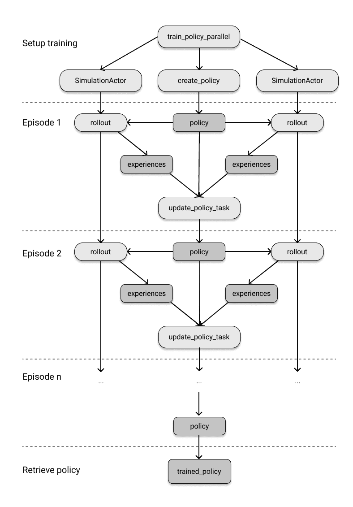

# 第三章。构建你的第一个分布式应用程序

现在你已经看到了 Ray API 的基础知识，让我们用它构建一个更现实的东西。通过这个相对较短的章节结束时，你将已经从零开始构建了一个强化学习（RL）问题，实现了第一个解决方案，并使用了 Ray 任务和执行者将此解决方案并行化到一个本地集群中——所有这些都不到 250 行代码。

本章旨在适用于没有任何强化学习经验的读者。我们将解决一个简单的问题，并培养必要的技能来实际应对它。由于第四章完全致力于这个主题，我们将跳过所有高级的强化学习主题和术语，只专注于手头的问题。但即使你是一个相当高级的强化学习用户，你也很可能会受益于在分布式环境中实现一个经典算法。

这是与 Ray Core *仅仅* 一起工作的最后一章了。我希望你学会欣赏它的强大和灵活性，以及你可以多快地实现分布式实验，否则需要相当大的努力来扩展。

# 设置一个简单的迷宫问题

与之前的章节一样，我鼓励你与我一起编写本章的代码，并在我们进行时共同构建此应用程序。如果你不想这样做，你也可以简单地跟随[本章的笔记本](https://github.com/maxpumperla/learning_ray/blob/main/notebooks/ch_03_core_app.ipynb)。

为了给你一个概念，我们正在构建的应用程序结构如下：

+   你实现了一个简单的二维迷宫游戏，其中一个单个玩家可以在四个主要方向上移动。

+   你将迷宫初始化为一个`5x5`的网格，玩家被限制在其中。

+   `25`个网格单元中的一个是“目标”，玩家称为“追寻者”必须到达的目标。

+   你不会硬编码一个解决方案，而是会使用一个强化学习算法，让追寻者学会找到目标。

+   这是通过反复运行迷宫的模拟来完成的，奖励追寻者找到目标并聪明地跟踪追寻者的哪些决策有效，哪些不行。

+   由于模拟可以并行化，并且我们的 RL 算法也可以并行训练，我们利用 Ray API 来并行化整个过程。

我们还没有准备好将此应用程序部署到由多个节点组成的实际 Ray 集群上，所以现在我们将继续使用本地集群。如果你对基础设施主题感兴趣，并想学习如何设置 Ray 集群，请跳到[链接将到来的地方]，要看到一个完全部署的 Ray 应用程序，你可以转到[链接将到来的地方]。

让我们从实现刚刚草绘的二维迷宫开始。我们的想法是在 Python 中实现一个简单的网格，该网格从`(0, 0)`开始，到`(4, 4)`结束，并正确定义玩家如何在网格中移动。为此，我们首先需要一个用于沿四个基本方向移动的抽象。这四个动作，即向上、向下、向左和向右，可以在 Python 中被编码为我们称之为`Discrete`的类。移动多个离散动作的抽象是如此有用，以至于我们将其泛化到`n`个方向，而不仅仅是四个。如果你担心，这并不是过早 - 我们实际上在一会儿需要一个通用的`Discrete`类。

##### 例子 3-1\.

```py
import random

class Discrete:
    def __init__(self, num_actions: int):
        """ Discrete action space for num_actions.
        Discrete(4) can be used as encoding moving in one of the cardinal directions.
        """
        self.n = num_actions

    def sample(self):
        return random.randint(0, self.n - 1)  

space = Discrete(4)
print(space.sample())  
```


一个离散动作可以在`0`到`n-1`之间均匀抽样。


例如，从`Discrete(4)`中抽样将给出`0`、`1`、`2`或`3`。

从`Discrete(4)`中进行抽样，例如在这个例子中会随机返回`0`、`1`、`2`或`3`。我们如何解释这些数字由我们决定，所以假设我们选择“向下”、“向左”、“向右”和“向上”的顺序。

现在我们知道如何编码在迷宫中移动了，让我们编写迷宫本身的代码，包括`goal`单元格和试图找到目标的`seeker`玩家的位置。为此，我们将实现一个名为`Environment`的 Python 类。它被称为这个名字，因为迷宫是玩家“生活”的环境。为了简化问题，我们将`seeker`始终放在`(0, 0)`，将`goal`放在`(4, 4)`。为了使`seeker`移动并找到其目标，我们将用`Discrete(4)`初始化`Environment`的`action_space`。

我们的迷宫环境中还有一点信息需要设置，那就是`seeker`位置的编码。原因是我们将来要实现一个算法，用于跟踪哪些动作对应于哪些`seeker`位置带来了良好的结果。将`seeker`位置编码为`Discrete(5*5)`，这样可以变成一个更易处理的单一数字。在强化学习术语中，把玩家可以访问的游戏信息称为*observation*。所以，类比我们为`seeker`定义动作空间一样，我们也可以为其定义一个`observation_space`。这里是我们刚刚讨论过的实现：

##### 例子 3-2\.

```py
import os

class Environment:

    seeker, goal = (0, 0), (4, 4)  
    info = {'seeker': seeker, 'goal': goal}

    def __init__(self,  *args, **kwargs):
        self.action_space = Discrete(4)  
        self.observation_space = Discrete(5*5)  
```


`seeker`初始化在迷宫的左上角，`goal`初始化在右下角。


我们的`seeker`可以向下、向左、向上和向右移动。


并且它可以处于总共`25`种状态中，每个状态代表网格上的一个位置。

请注意，我们还定义了一个`info`变量，它可以用于打印迷宫当前状态的信息，例如用于调试目的。要从寻求者的角度玩找到目标的实际游戏，我们必须定义几个辅助方法。显然，当寻求者找到目标时，游戏应该被认为是“完成”的。此外，我们应该奖励寻求者找到目标。当游戏结束时，我们应该能够将其重置为初始状态，以便再次游戏。最后，我们还定义了一个`get_observation`方法，返回编码的`seeker`位置。继续实现`Environment`类，这转化为以下四种方法。

##### 示例 3-3\.

```py
    def reset(self):  
        """Reset seeker and goal positions, return observations."""
        self.seeker = (0, 0)
        self.goal = (4, 4)

        return self.get_observation()

    def get_observation(self):
        """Encode the seeker position as integer"""
        return 5 * self.seeker[0] + self.seeker[1]  

    def get_reward(self):
        """Reward finding the goal"""
        return 1 if self.seeker == self.goal else 0  

    def is_done(self):
        """We're done if we found the goal"""
        return self.seeker == self.goal  
```


要开始一个新游戏，我们必须将网格`reset`为其原始状态。


将寻求者元组转换为环境的`observation_space`中的值。


只有当寻求者到达目标时才会获得奖励。


如果寻求者在目标处，则游戏结束。

最后要实现的关键方法是`step`方法。想象一下你在玩迷宫游戏，并决定向右移动作为你的下一步。`step`方法将采取这个动作（即`3`，表示“右”）并将其应用到游戏的内部状态。为了反映发生了什么变化，`step`方法将返回寻求者的观察结果、其奖励、游戏是否结束以及游戏的`info`值。这就是`step`方法的工作原理：

##### 示例 3-4\.

```py
    def step(self, action):
        """Take a step in a direction and return all available information."""
        if action == 0:  # move down
            self.seeker = (min(self.seeker[0] + 1, 4), self.seeker[1])
        elif action == 1:  # move left
            self.seeker = (self.seeker[0], max(self.seeker[1] - 1, 0))
        elif action == 2:  # move up
            self.seeker = (max(self.seeker[0] - 1, 0), self.seeker[1])
        elif action == 3:  # move right
            self.seeker = (self.seeker[0], min(self.seeker[1] + 1, 4))
        else:
            raise ValueError("Invalid action")

        return self.get_observation(), self.get_reward(), self.is_done(), self.info  
```


在指定方向迈出一步后，我们返回观察结果、奖励、游戏是否结束以及可能有用的任何其他信息。

我说`step`方法是最后一个必要的方法，但实际上我们想定义一个更有帮助的辅助方法来可视化游戏并帮助我们理解它。这个`render`方法将把游戏的当前状态打印到命令行。

##### 示例 3-5\.

```py
    def render(self, *args, **kwargs):
        """Render the environment, e.g. by printing its representation."""
        os.system('cls' if os.name == 'nt' else 'clear')  
        grid = [['| ' for _ in range(5)] + ["|\n"] for _ in range(5)]
        grid[self.goal[0]][self.goal[1]] = '|G'
        grid[self.seeker[0]][self.seeker[1]] = '|S'  
        print(''.join([''.join(grid_row) for grid_row in grid]))  
```


首先，我们清除屏幕。


然后我们绘制网格，在上面标记目标为`G`，标记寻求者为`S`。


然后，通过将其打印到您的屏幕上来渲染网格。

太好了，现在我们完成了定义我们的 2D 迷宫游戏的`Environment`类的实现。我们可以通过这个游戏进行`step`，知道什么时候`done`并再次`reset`它。游戏的玩家，即寻求者，还可以观察其环境，并为找到目标而获得奖励。

让我们使用这个实现来玩一个寻找目标的游戏，寻找者只需随机采取行动。这可以通过创建一个新的`Environment`，对其进行采样并应用行动，然后渲染环境直到游戏结束来完成：

##### 示例 3-6。

```py
import time

environment = Environment()

while not environment.is_done():
    random_action = environment.action_space.sample()  
    environment.step(random_action)
    time.sleep(0.1)
    environment.render()  
```


我们可以通过应用采样的行动来测试我们的环境，直到我们完成为止。


为了可视化环境，我们在等待十分之一秒后渲染它（否则代码运行得太快了，无法跟上）。

如果你在你的电脑上运行这个程序，最终你会看到游戏结束了，寻找者找到了目标。如果你不幸的话，可能会花一些时间。

如果你认为这是一个非常简单的问题，并且解决它只需走 8 步，即随意向右和向下各四次，我不会和你争辩。关键是，我们想要使用机器学习来解决这个问题，这样我们以后就可以解决更困难的问题。具体来说，我们想要实现一个算法，通过反复玩游戏：观察发生了什么，决定下一步要做什么，并为你的行为获得奖励，从而自行解决如何玩游戏。

如果你愿意的话，现在是时候让游戏变得更加复杂了。只要你不改变我们为`Environment`类定义的接口，你可以以许多方式修改这个游戏。以下是一些建议：

+   将其设为 10x10 网格或随机化寻找者的初始位置。

+   让网格的外围墙变得危险。每当你试图接触它们时，你都会受到-100 的奖励，即严重惩罚。

+   在网格中引入障碍物，寻找者无法通过。

如果你感觉非常有冒险精神，你也可以随机化目标位置。这需要额外的注意，因为目前寻找者在`get_observation`方法中对目标位置没有信息。也许在阅读完本章之后再回来解决这个最后的练习。

# 建立一个模拟

有了`Environment`类的实现，解决“教导”寻找者如何玩得好这个问题需要什么？它如何能够在最少的 8 步中一直找到目标？我们已经为迷宫环境配备了奖励信息，这样寻找者就可以使用这个信号来学习玩游戏。在强化学习中，你会反复玩游戏，并从你在这个过程中获得的经验中学习。游戏的玩家通常被称为*代理*，它在环境中采取*行动*，观察其*状态*并获得*奖励*。¹代理学得越好，它就越能够解释当前游戏状态（观察）并找到导致更有益的结果的行动。

无论您想使用什么样的强化学习算法（如果您了解任何算法），您都需要一种重复模拟游戏以收集经验数据的方法。因此，我们将很快实现一个简单的`Simulation`类。

我们需要继续进行的另一个有用的抽象是`Policy`，一种指定行动的方式。目前，我们可以为追逐者随机抽取行动来玩游戏。`Policy`允许我们为当前游戏状态获取更好的行动。实际上，我们将`Policy`定义为一个具有`get_action`方法的类，该方法接受游戏状态并返回一个动作。

请记住，在我们的游戏中，追逐者在网格上有`25`种可能的状态，并且可以执行`4`个动作。一个简单的想法是观察状态和动作的配对，并为配对分配高值，如果在这个状态下执行此动作将导致高奖励，否则分配低值。例如，从您对游戏的直觉来看，向下或向右移动总是一个好主意，而向左或向上移动则不是。然后，创建一个`25x4`的查找表，包含所有可能的状态-动作配对，并将其存储在我们的`Policy`中。然后我们只需请求我们的策略在给定状态时返回任何动作的最高值。当然，实现一个为这些状态-动作配对找到好值的算法是具有挑战性的部分。让我们首先实现这个`Policy`的概念，然后再考虑适合的算法。

##### 示例 3-7\.

```py
class Policy:

    def __init__(self, env):
        """A Policy suggests actions based on the current state.
        We do this by tracking the value of each state-action pair.
        """
        self.state_action_table = [
            [0 for _ in range(env.action_space.n)]for _ in range(env.observation_space.n)  
        ]
        self.action_space = env.action_space

    def get_action(self, state, explore=True, epsilon=0.1):  
        """Explore randomly or exploit the best value currently available."""
        if explore and random.uniform(0, 1) < epsilon:  
            return self.action_space.sample()
        return np.argmax(self.state_action_table[state])
```


我们为每个状态-动作对定义了一个值的嵌套列表，初始值为零。


根据需求，我们可以`explore`随机行动，以避免陷入次优行为。


有时候我们可能希望在游戏中随机探索行动，这就是为什么我们在`get_action`方法中引入了一个`explore`参数。默认情况下，这种情况发生的概率为 10%。

我们返回查找表中值最高的动作，给定当前状态。

我在`Policy`定义中添加了一个小的实现细节，可能有点令人困惑。`get_action`方法有一个`explore`参数。这样做的原因是，如果您学习了一个极度不好的策略，例如总是想向左移动的策略，您将永远没有机会找到更好的解决方案。换句话说，有时您需要探索新的方法，而不是“利用”您对游戏的当前理解。如前所述，我们还没有讨论如何学习改善我们策略的`state_action_table`中的值。现在，只需记住策略在模拟迷宫游戏时给我们所需的行动即可。

继续之前提到的`Simulation`类，一个模拟应当接受一个`Environment`并计算给定`Policy`的动作，直至达到目标并结束游戏。当我们“执行”这样的完整游戏时观察到的数据，就是我们所说的*经验*。因此，我们的`Simulation`类具有一个`rollout`方法，用于计算一个完整游戏的`经验`并返回它们。这里是`Simulation`类的实现：

##### 示例 3-8\.

```py
class Simulation(object):
    def __init__(self, env):
        """Simulates rollouts of an environment, given a policy to follow."""
        self.env = env

    def rollout(self, policy, render=False, explore=True, epsilon=0.1):  
        """Returns experiences for a policy rollout."""
        experiences = []
        state = self.env.reset()  
        done = False
        while not done:
            action = policy.get_action(state, explore, epsilon)  
            next_state, reward, done, info = self.env.step(action)  
            experiences.append([state, action, reward, next_state])  
            state = next_state
            if render:  
                time.sleep(0.05)
                self.env.render()

        return experiences
```


我们通过遵循`policy`的动作计算游戏的“roll-out”，可以选择渲染模拟。


为了确保，我们在每次`rollout`之前重置环境。


传入的`policy`驱动我们采取的动作。`explore`和`epsilon`参数被传递。


我们通过应用策略的`action`在环境中进行步进。


我们定义经验为一个`(state, action, reward, next_state)`四元组。


在每个步骤可选择渲染环境。

注意，我们在`rollout`中收集的每个`experiences`条目包含四个值：当前状态、采取的动作、接收到的奖励和下一个状态。我们即将实现的算法将利用这些经验来学习。其他算法可能使用其他的经验值，但这些是我们继续所需的。

现在我们有一个尚未学到任何东西的策略，但我们已经可以测试其接口是否工作。让我们通过初始化一个`Simulation`对象，调用其在一个不那么聪明的`Policy`上的`rollout`方法，并打印其`state_action_table`来试试看：

##### 示例 3-9\.

```py
untrained_policy = Policy(environment)
sim = Simulation(environment)

exp = sim.rollout(untrained_policy, render=True, epsilon=1.0)  
for row in untrained_policy.state_action_table:
    print(row)  
```


我们使用一个“未经训练”的策略进行一个完整游戏的“roll-out”，并进行渲染。


当前所有状态-动作值均为零。

如果你觉得自上一节以来我们没有取得太多进展，我可以向你保证，接下来的部分将会有所进展。设置`Simulation`和`Policy`的准备工作是为了正确地构架问题。现在唯一剩下的就是设计一种智能的方式，根据我们收集到的经验更新`Policy`的内部状态，使其真正学会玩迷宫游戏。

# 训练强化学习模型

假设我们有一组经验数据，这些数据是从几场游戏中收集到的。更新我们`Policy`的`state_action_table`中的值的聪明方法是什么？这里有一个想法。假设你处于位置`(3,5)`，然后决定向右移动，将你移到`(4,5)`，距离目标只有一步之遥。显然，在这种情况下，你可以向右移动并收到奖励`1`。这必须意味着你当前的状态结合向右行动应该有一个很高的值。换句话说，这个特定的状态-动作对的值应该很高。相反，在相同的情况下向左移动并没有带来任何进展，因此相应的状态-动作对应该有一个低值。

更一般地说，假设你处于给定的`state`，然后决定采取一个`action`，导致一个`reward`，然后进入`next_state`。请记住，这就是我们定义的一次经验。通过我们的`policy.state_action_table`，我们可以稍微展望一下，并查看从`next_state`采取行动是否能带来任何好处。也就是说，我们可以计算

```py
next_max = np.max(policy.state_action_table[next_state])
```

如何将这个值的知识与当前的状态-动作值进行比较，即`value = policy.state_action_table[state][action]`？有许多方法可以解决这个问题，但显然我们不能完全丢弃当前的`value`，而过于信任`next_max`。毕竟，这只是我们在这里使用的单一经验。因此，作为第一个近似值，为什么我们不简单地计算旧值和期望值的加权和，并选择`new_value = 0.9 * value + 0.1 * next_max`？在这里，`0.9`和`0.1`这些值被任意地选择，唯一重要的是第一个值足够高以反映我们保留旧值的偏好，并且这两个权重的总和为`1`。这个公式是一个很好的起点，但问题在于我们根本没有考虑到从`reward`中获取的关键信息。事实上，我们应该更加信任当前的`reward`值而不是预测的`next_max`值，因此最好稍微打折后者，比如说 10%。更新状态-动作值将如下所示：

```py
new_value = 0.9 * value + 0.1 * (reward + 0.9 * next_max)
```

根据你对这种推理方式的经验水平，最后几段可能需要一些时间消化。好消息是，如果你已经理解到这一点，这一章剩下的部分可能会很容易理解。从数学上讲，这是这个示例中唯一的（也是最后的）难点。如果你以前接触过强化学习，你现在可能已经注意到这是所谓的 Q 学习算法的实现方式。它被称为这样，因为状态-动作表可以描述为一个函数`Q(state, action)`，它返回这些对的值。

我们已经接近了，现在让我们通过为一个策略和收集到的经验实现一个`update_policy`函数来正式化这个过程：

##### 示例 3-10。

```py
import numpy as np

def update_policy(policy, experiences, weight=0.1, discount_factor=0.9):
    """Updates a given policy with a list of (state, action, reward, state)
    experiences."""
    for state, action, reward, next_state in experiences:  
        next_max = np.max(policy.state_action_table[next_state])  
        value = policy.state_action_table[state][action]  
        new_value = (1 - weight) * value + weight * (reward + discount_factor * next_max)  
        policy.state_action_table[state][action] = new_value  
```


我们按顺序遍历所有经验。


然后我们在下一个状态中选择所有可能动作中的最大值。


然后提取当前状态动作值。


新值是旧值和期望值的加权和，期望值是当前奖励和折扣`next_max`的总和。


更新后，我们设置新的`state_action_table`值。

现在有了这个函数，训练策略做出更好的决策就变得非常简单了。我们可以使用以下过程：

+   初始化一个策略和一个模拟器。

+   运行模拟多次，比如总共运行`10000`次。

+   对于每场游戏，首先通过运行`rollout`收集经验。

+   然后通过调用`update_policy`更新收集到的经验来更新策略。

就是这样！以下`train_policy`函数直接实现了上述过程。

##### 示例 3-11\.

```py
def train_policy(env, num_episodes=10000, weight=0.1, discount_factor=0.9):
    """Training a policy by updating it with rollout experiences."""
    policy = Policy(env)
    sim = Simulation(env)
    for _ in range(num_episodes):
        experiences = sim.rollout(policy)  
        update_policy(policy, experiences, weight, discount_factor)  

    return policy

trained_policy = train_policy(environment)  
```


收集每场游戏的经验。


使用这些经验更新我们的策略。


最后，从之前的`enviroment`中训练并返回一个策略。

请注意，在强化学习文献中，高级说法是迷宫游戏的完整游戏称为一个*情节*。这就是为什么我们在`train_policy`函数中称之为`num_episodes`而不是`num_games`的原因。

现在我们有了一个训练过的策略，让我们看看它的表现如何。在本章中，我们之前随机运行了两次策略，只是为了了解它们在迷宫问题上的表现。但现在让我们在几个游戏上适当评估我们训练过的策略，看看它的平均表现如何。具体来说，我们将运行我们的模拟几个情节，并计算每个情节需要多少步才能达到目标。因此，让我们实现一个`evaluate_policy`函数，正好做到这一点：

##### 示例 3-12\.

```py
def evaluate_policy(env, policy, num_episodes=10):
    """Evaluate a trained policy through rollouts."""
    simulation = Simulation(env)
    steps = 0

    for _ in range(num_episodes):
        experiences = simulation.rollout(policy, render=True, explore=False)  
        steps += len(experiences)  

    print(f"{steps / num_episodes} steps on average "
          f"for a total of {num_episodes} episodes.")

    return steps / num_episodes

evaluate_policy(environment, trained_policy)
```


这次我们将`explore`设置为`False`，以充分利用训练过的策略的学习。


`experiences`的长度是我们完成游戏所需的步数。

除了看到训练过的策略连续十次击败迷宫问题，正如我们希望的那样，您还应该看到以下提示：

```py
8.0 steps on average for a total of 10 episodes.
```

换句话说，训练后的策略能够为迷宫游戏找到最优解。这意味着你成功地从头开始实现了你的第一个强化学习算法！

基于你目前积累的理解，你认为将 `seeker` 放入随机起始位置，然后运行这个评估函数仍然有效吗？为什么不继续做必要的更改？

另一个有趣的问题是问问自己，我们使用的算法中有什么假设？例如，该算法明确要求所有状态-动作对都可以被制表。如果我们有数百万个状态和数千个动作，你认为它仍然会表现良好吗？

# 构建一个分布式 Ray 应用程序。

让我们在这里退一步。如果你是一个强化学习专家，你会知道我们一直在做什么。如果你完全是强化学习的新手，你可能会感到有些不知所措。如果你处于中间某个位置，你可能会喜欢这个例子，但可能会想知道我们到目前为止所做的与 Ray 有什么关系。这是一个很好的问题。很快你就会看到，为了使上述强化学习实验成为一个分布式 Ray 应用程序，我们只需要编写三个简短的代码片段。这就是我们要做的：

+   我们创建了一个 Ray 任务，可以远程初始化一个 `Policy`。

+   然后，我们只需几行代码将 `Simulation` 设为 Ray actor。

+   然后我们将 `update_policy` 函数封装在一个 Ray 任务中。

+   最后，我们定义了一个结构与原始版本完全相同的并行版本的 `train_policy`。

让我们通过实现一个 `create_policy` 任务和一个名为 `SimulationActor` 的 Ray actor 来解决这个计划的前两个步骤：

##### 示例 3-13。

```py
import ray

ray.init()
environment = Environment()
env_ref = ray.put(environment)  

@ray.remote
def create_policy():
    env = ray.get(env_ref)
    return Policy(env)  

@ray.remote
class SimulationActor(Simulation):  
    """Ray actor for a Simulation."""
    def __init__(self):
        env = ray.get(env_ref)
        super().__init__(env)
```


初始化后，我们将我们的 `environment` 放入 Ray 对象存储。


这个远程任务返回一个新的 `Policy` 对象。


这个 Ray actor 以一种简单直接的方式封装了我们的 `Simulation` 类。

在你在第 第二章 中建立的 Ray Core 基础上，阅读这段代码应该不成问题。也许自己编写它可能需要一些适应时间，但在概念上，你应该掌握这个例子的要领。

接下来，让我们定义一个分布式的 `update_policy_task` Ray 任务，然后将所有内容（两个任务和一个 actor）封装在一个名为 `train_policy_parallel` 的函数中，在你的本地 Ray 集群上分发这个强化学习工作负载：

##### 示例 3-14。

```py
@ray.remote
def update_policy_task(policy_ref, experiences_list):
    """Remote Ray task for updating a policy with experiences in parallel."""
    [update_policy(policy_ref, ray.get(xp)) for xp in experiences_list]  
    return policy_ref

def train_policy_parallel(num_episodes=1000, num_simulations=4):
    """Parallel policy training function."""
    policy = create_policy.remote()  
    simulations = [SimulationActor.remote() for _ in range(num_simulations)]  

    for _ in range(num_episodes):
        experiences = [sim.rollout.remote(policy) for sim in simulations]  
        policy = update_policy_task.remote(policy, experiences)  

    return ray.get(policy)  
```


这个任务通过向 `update_policy` 函数传递从对象存储中检索到的策略和经验的引用，委托给原始函数。


为了并行训练，我们首先远程创建一个策略，返回一个我们称之为 `policy` 的引用。


我们不是创建一个模拟，而是创建四个模拟执行者。


现在，我们从远程模拟执行者收集经验。


然后我们可以远程更新我们的策略。注意`experiences`是经验的嵌套列表。


最后，我们再次从对象存储中检索训练好的策略。

这使得我们能够采取最后一步，以与之前相同的方式并行运行训练过程，然后评估结果。

##### 示例 3-15。

```py
parallel_policy = train_policy_parallel()
evaluate_policy(environment, parallel_policy)
```

这两行的结果与我们在迷宫 RL 训练的串行版本运行时相同。希望您能欣赏`train_policy_parallel`与`train_policy`具有完全相同的高级结构。逐行比较这两者是一个很好的练习。基本上，将训练过程并行化所需的全部工作就是以适当的方式三次使用`ray.remote`装饰器。当然，您需要一些经验才能做到这一点。但请注意，我们几乎没有花费时间思考分布式计算，而是将更多时间花在实际的应用代码上。我们无需采用全新的编程范式，只需以最自然的方式解决问题。最终，这才是您想要的——而 Ray 非常擅长提供这种灵活性。

最后，让我们快速查看我们刚刚构建的 Ray 应用程序的任务执行图。总结一下，我们所做的是：

+   `train_policy_parallel`函数创建了多个`SimulationActor`执行者和一个`create_policy`策略。

+   模拟执行者使用策略创建回合，并收集用于更新策略的经验，`update_policy_task`利用这些经验来更新策略。

+   这是可行的，因为策略更新的方式设计得很好。不管经验是由一个模拟还是多个模拟收集的，都没有关系。

+   进行回合和更新操作，直到达到我们希望训练的轮数，然后返回最终的`trained_policy`。

图图 3-1 以一种紧凑的方式总结了此任务图：



###### 图 3-1。使用 Ray 并行训练强化学习策略。

本章的运行示例有一个有趣的旁注，即它是[其创作者在初始论文](https://arxiv.org/abs/1712.05889)中用来展示 Ray 灵活性的伪代码实现。该论文有一张类似于图 3-1 的图表，值得阅读以获取背景知识。

# 回顾强化学习术语。

在我们结束本章之前，让我们在更广泛的背景下讨论我们在迷宫示例中遇到的概念。这样做将为您准备好在下一章中更复杂的强化学习设置，并向您展示我们为本章的运行示例简化了哪些内容。

每个强化学习问题都从制定*环境*的形式开始，该环境描述了您想要进行“游戏”的动态。环境托管一个玩家或*代理*，通过简单的接口与其环境进行交互。代理可以请求来自环境的信息，即其在环境中的当前*状态*、在此状态下收到的*奖励*以及游戏是否*完成*。通过观察状态和奖励，代理可以学习基于其接收到的信息做出决策。具体而言，代理将发出一个*动作*，环境可以通过采取下一步来执行该动作。

代理用于在给定状态下生成动作的机制称为*策略*，有时我们会说代理遵循特定策略。给定一个策略，我们可以使用该策略模拟或*展开*几步或整个游戏。在展开过程中，我们可以收集*经验*，这些经验包括当前状态和奖励、下一步动作以及结果状态的信息。从开始到结束的整个步骤序列称为*回合*，环境可以通过将其重置到初始状态来开始新的回合。

在本章中使用的策略基于简单的*状态-动作值*（也称为*Q 值*）制表的理念，并且用于根据回合收集的经验更新策略的算法称为*Q 学习*。更普遍地说，您可以将我们实施的状态-动作表视为策略使用的*模型*。在下一章中，您将看到更复杂的模型示例，例如神经网络用于学习状态-动作值。策略可以决定*利用*它对环境学到的内容，选择其模型的最佳可用值，或者通过选择随机动作*探索*环境。

这里介绍的许多基本概念适用于任何 RL 问题，但我们做了一些简化的假设。例如，环境中可能存在*多个代理*（想象一下有多个寻找者竞争首先达到目标的情况），我们将在下一章中研究所谓的多代理环境和多代理 RL。此外，我们假设代理的*action space*是*discrete*的，这意味着代理只能采取固定的一组行动。当然，您也可以有*continuous*的动作空间，第一章中的摆锤示例就是其中的一个例子。特别是当您有多个代理时，动作空间可能会更复杂，您可能需要动作元组，甚至根据情况进行嵌套。我们为迷宫游戏考虑的*observation space*也相当简单，被建模为一组离散状态。您可以很容易想象，像机器人这样与其环境互动的复杂代理可能会使用图像或视频数据作为观测值，这也需要一个更复杂的观测空间。

我们所做的另一个关键假设是环境是*deterministic*的，这意味着当我们的代理选择采取行动时，结果的状态总是反映出那个选择。在一般环境中，情况并非如此，环境中可能存在随机因素。例如，在迷宫游戏中，我们可以实现一个硬币翻转，每当出现反面时，代理就会被随机推向一个方向。在这种情况下，我们不能像本章中那样事先规划，因为行动不会确定地导致每次都是相同的下一个状态。为了反映这种概率行为，在一般情况下，我们必须考虑我们的 RL 实验中的*state transition probabilities*。

最后，我想在这里谈论的最后一个简化假设是，我们一直把环境及其动态视为可以完美模拟的游戏。但事实是，有些物理系统无法忠实地模拟。在这种情况下，您可能仍然可以通过像我们在我们的`Environment`类中定义的接口与这个物理环境交互，但会涉及一些通信开销。实际上，我发现将 RL 问题视为游戏来推理几乎没有损害体验的感觉。

# 总结

总结一下，我们在纯 Python 中实现了一个简单的迷宫问题，然后使用简单的强化学习算法解决了在该迷宫中找到目标的任务。然后，我们将这个解决方案移植到一个大致只有 25 行代码的分布式 Ray 应用程序中。在这个过程中，我们无需规划如何使用 Ray，只需简单地使用 Ray API 来并行化我们的 Python 代码。这个例子展示了 Ray 如何让你专注于应用程序代码，而不必考虑与 Ray 的交互。它还展示了如何高效地实现和分布使用 RL 等高级技术的定制工作负载。

在下一章中，你将基于所学内容继续构建，并看到使用更高级别的 Ray RLlib 库直接解决迷宫问题是多么容易。

¹ 正如我们将在第四章中看到的那样，你也可以在多人游戏中运行强化学习。将迷宫环境变成所谓的多智能体环境，其中多个搜索者竞争目标，是一个有趣的练习。
