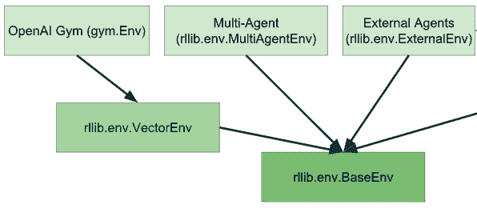

# 第四章：使用 Ray RLlib 的强化学习

在上一章中，你从头开始构建了一个强化学习（RL）环境，一个模拟来执行一些游戏，一个 RL 算法，以及并行化训练算法的代码。知道如何做这一切是很好的，但实际上在训练 RL 算法时，你真正想做的只是第一部分，即指定你的自定义环境，“游戏”¹。然后大部分精力将会放在选择正确的算法上，设置它，为问题找到最佳参数，并且总体上专注于训练一个表现良好的算法。

Ray RLlib 是一个工业级库，用于大规模构建 RL 算法。你已经在 第一章 中看到了 RLlib 的一个示例，但在本章中我们将深入探讨。RLlib 的优点在于它是一个成熟的开发库，并提供了良好的抽象以便开发者使用。正如你将看到的，许多这些抽象你已经从上一章中了解过了。

我们首先通过概述 RLlib 的能力来开始本章。然后我们迅速回顾一下 第三章 中的迷宫游戏，并展示如何在几行代码中使用 RLlib 命令行界面（CLI）和 RLlib Python API 来处理它。你将看到 RLlib 的易用性在开始学习它的关键概念之前是多么简单。

我们还将更详细地研究一些在实践中非常有用但通常在其他 RL 库中得不到良好支持的高级 RL 主题。例如，你将学习如何为你的 RL 代理创建一个学习课程，以便它们可以先学习简单的场景，然后再转向更复杂的场景。你还将看到 RLlib 如何处理单个环境中有多个代理，并如何利用在当前应用之外收集的经验数据来提高你的代理性能。

# RLlib 概述

在我们深入一些示例之前，让我们快速概述一下 RLlib 的功能。作为 Ray 生态系统的一部分，RLlib 继承了 Ray 的所有性能和可扩展性优势。特别是，RLlib 默认是分布式的，因此你可以将 RL 训练扩展到任意数量的节点。其他 RL 库可能也能够扩展实验，但通常并不简单明了。

基于 Ray 构建的另一个好处是，RLlib 与其他 Ray 库紧密集成。例如，所有 RLlib 算法都可以通过 Ray Tune 进行调优，正如我们将在 第五章 中看到的，你也可以使用 Ray Serve 无缝部署你的 RLlib 模型，正如我们将在 第八章 中讨论的那样。

极其有用的是，RLlib 在撰写本文时与两种主要的深度学习框架都兼容，即 PyTorch 和 TensorFlow。您可以将其中任何一个用作后端，并且可以轻松地在它们之间切换，通常只需更改一行代码。这是一个巨大的优势，因为公司通常被锁定在其底层深度学习框架中，无法承担切换到另一个系统并重写其代码的成本。

RLlib 还解决了许多现实世界的问题，并且是许多公司将其 RL 工作负载推向生产的成熟库。我经常向工程师推荐 RLlib，因为它的 API 往往对他们具有吸引力。其中一个原因是 RLlib API 为许多应用程序提供了正确的抽象级别，同时仍然足够灵活，可以在必要时进行扩展。

除了这些更一般的好处之外，RLlib 还具有许多 RL 特定的功能，我们将在本章中介绍。事实上，RLlib 功能如此丰富，以至于它本身都应该有一本书来介绍，所以我们只能在这里涉及一些方面。例如，RLlib 具有丰富的高级 RL 算法库可供选择。在本章中，我们将只专注于其中的一些选择，但您可以在[RLlib 算法页面](https://docs.ray.io/en/latest/rllib-algorithms.xhtml)上跟踪不断增长的选项列表。RLlib 还有许多用于指定 RL 环境的选项，并且在训练过程中处理这些选项非常灵活，详见[RLlib 环境概述](https://docs.ray.io/en/latest/rllib-env.xhtml)。

# 使用 RLlib 入门

要使用 RLlib，请确保已在计算机上安装了它：

```py
pip install "ray[rllib]"==1.9.0
```

与本书中的每一章一样，如果您不想自己键入代码来跟进，可以查看本章的[附带笔记本](https://github.com/maxpumperla/learning_ray/blob/main/notebooks/ch_04_rllib.ipynb)。

每个 RL 问题都始于拥有一个有趣的环境来研究。在第一章中，我们已经看过了经典的摆动平衡问题。请回忆一下，我们没有实现这个摆动环境，它是由 RLlib 自带的。

相反，在第三章中，我们自己实现了一个简单的迷宫游戏。这个实现的问题是我们不能直接将其与 RLlib 或任何其他 RL 库一起使用。原因是在 RL 中，您必须遵循环境的普遍标准。您的环境需要实现某些接口。用于 RL 环境的最知名且最广泛使用的库是`gym`，这是一个来自 OpenAI 的[开源 Python 项目](https://gym.openai.com/)。

让我们看看`gym`是什么，以及如何将上一章的迷宫`Environment`转换为与 RLlib 兼容的`gym`环境。

## 创建一个 Gym 环境

如果你看过在 GitHub 上很好文档化且易于阅读的`gym.Env`环境接口 [链接](https://github.com/openai/gym/blob/master/gym/core.py#L17)，你会注意到这个接口的实现具有两个必需的类变量和三个子类需要实现的方法。你不必查看源代码，但我鼓励你看一看。你可能会对你已经了解到的关于`gym`环境的知识感到惊讶。

简而言之，gym 环境的接口看起来像以下的伪代码：

```py
import gym

class Env:

    action_space: gym.spaces.Space
    observation_space: gym.spaces.Space  

    def step(self, action):  
        ...

    def reset(self):  
        ...

    def render(self, mode="human"):  
        ...
```


`gym.Env`接口具有动作和观察空间。


`Env`可以运行`step`并返回一个包含观测、奖励、完成状态和其他信息的元组。


一个`Env`可以通过`reset`方法重置自身，并返回当前的观测结果。


我们可以为不同目的`render`一个`Env`，比如用于人类显示或作为字符串表示。

如果你仔细阅读了第三章，你会注意到这与我们在那里构建的迷宫`Environment`接口非常相似。事实上，`gym`中有一个所谓的`Discrete`空间在`gym.spaces`中实现，这意味着我们可以将我们的迷宫`Environment`作为`gym.Env`来使用。我们假设你将这段代码存储在一个名为`maze_gym_env.py`的文件中，并且`Discrete`空间和来自第三章的`Environment`代码要么位于文件的顶部（或者被导入到那里）。

```py
# Original definition of `Environment` and `Discrete` go here.

import gym
from gym.spaces import Discrete  

class GymEnvironment(Environment, gym.Env):  
    def __init__(self, *args, **kwargs):
        """Make our original `Environment` a gym `Env`."""
        super().__init__(*args, **kwargs)

gym_env = GymEnvironment()
```


我们使用我们自己的`Discrete`实现覆盖`gym`的实现。


然后，我们简单地使我们的`GymEnvironment`实现`gym.Env`。接口本质上与之前相同。

当然，我们本来可以通过直接从中继承的方式使我们的原始`Environment`实现`gym.Env`。但重点在于，在强化学习的背景下，`gym.Env`接口如此自然地显现出来，所以不依赖外部库实现它是个不错的练习。

值得注意的是，`gym.Env`接口还提供了有用的实用功能和许多有趣的示例实现。例如，我们在第一章中使用的`Pendulum-v1`环境就是`gym`的一个例子，还有[许多其他环境](https://gym.openai.com/envs)可用于测试你的强化学习算法。

## 运行 RLlib CLI

现在我们已经将我们的`GymEnvironment`实现为`gym.Env`，以下是您如何在 RLlib 中使用它。您在第一章中已经看到了 RLlib CLI 的运行情况，但这次情况有些不同。在第一章中，我们仅通过*名称*在一个 YAML 文件中引用了`Pendulum-v1`环境，以及其他 RL 训练配置。这次我们想要使用我们自己的`gym`环境类，即我们在`maze_gym_env.py`中定义的`GymEnvironment`类。为了在 Ray RLlib 中指定这个类，您需要使用从引用它的地方的类的完整限定名称，即在我们的情况下是`maze_gym_env.GymEnvironment`。如果您有一个更复杂的 Python 项目，并且您的环境存储在另一个模块中，您只需相应地添加模块名。

以下的 YAML 文件指定了在`GymEnvironment`类上训练 RLlib 算法所需的最小配置。为了尽可能地与我们在第三章中的实验保持一致，我们使用 Q-learning 时，选择了`DQN`作为我们训练的算法。此外，为了确保我们可以控制训练的时间，我们设置了显式的停止条件，即通过将`timesteps_total`设置为`10000`。

```py
# maze.yml
maze_env:
    env: maze_gym_env.GymEnvironment  
    run: DQN
    checkpoint_freq: 1 
    stop:
        timesteps_total: 10000  
```


我们在这里指定了相对 Python 路径到我们的环境类。


我们在每次训练迭代后存储我们模型的检查点。


我们还可以为训练指定一个停止条件，这里是最大 10000 步。

假设您将此配置存储在一个名为`maze.yml`的文件中，您现在可以通过运行以下`train`命令来启动 RLlib 训练运行：

```py
 rllib train -f maze.yml
```

这一行代码基本上处理了我们在第三章中所做的一切，但更好。它为我们运行了一个更复杂的 Q-Learning 版本（DQN），在底层处理多个工作者的扩展，并且甚至自动为我们创建算法的检查点。

从训练脚本的输出中，您应该看到 Ray 会将训练结果写入位于`~/ray_results/maze_env`的`logdir`目录。在那个文件夹中，您会找到另一个以`DQN_maze_gym_env.GymEnvironment_`开头的目录，其中包含这个实验的标识符（在我的情况下是`0ae8d`）和当前的日期和时间。在那个目录中，您应该会找到几个以`checkpoint`前缀开头的其他子目录。对于我电脑上的训练运行，总共有`10`个检查点可用，并且我们正在使用最后一个（`checkpoint_000010/checkpoint-10`）来评估我们训练过的 RLlib 算法。通过在我的机器上生成的文件夹和检查点，您可以使用`rllib evaluate`命令读取如下（根据您的机器调整检查点路径）：

```py
rllib evaluate ~/ray_results/maze_env/DQN_maze_gym_env.Environment_0ae8d_00000_
0_2022-02-08_13-52-59/checkpoint_000010/checkpoint-10\
  --run DQN\
  --env maze_gym_env.Environment\
  --steps 100
```

`--run`中使用的算法和`--env`中指定的环境必须与训练运行中使用的算法和环境匹配，我们评估了经过训练的算法共计 100 步。这应该会导致以下形式的输出：

```py
Episode #1: reward: 1.0
Episode #2: reward: 1.0
Episode #3: reward: 1.0
...
Episode #13: reward: 1.0
```

在我们给`DQN`算法设置的简单迷宫环境中，RLlib 算法每次都能获得最大奖励`1`，这应该不会让人感到意外。

在转向 RLlib 的 Python API 之前，应该注意`train`和`evaluate`CLI 命令即使对于更复杂的环境也很方便。YAML 配置可以接受 Python API 会接受的任何参数，因此从这个意义上说，在命令行上训练您的实验没有限制²。

## 使用 RLlib Python API

话虽如此，您可能会大部分时间在 Python 中编写您的强化学习实验。最终，RLlib CLI 只是我们现在要看的基础 Python 库的一个包装器。

要从 Python 运行 RLlib 的 RL 工作负载，您的主入口点是`Trainer`类。具体而言，对于您选择的算法，您希望使用相应的`Trainer`。在我们的案例中，由于我们决定使用 Deep Q-Learning (DQN)进行演示，我们将使用`DQNTrainer`类。

### 训练 RLlib 模型

RLlib 为其所有`Trainer`实现提供了良好的默认值，这意味着您可以初始化它们而不必调整这些训练器的任何配置参数³。例如，要生成一个 DQN 训练器，您可以简单地使用`DQNTrainer(env=GymEnvironment)`。但值得注意的是，RLlib 训练器是高度可配置的，正如您将在以下示例中看到的。具体来说，我们向`Trainer`构造函数传递了一个`config`字典，并告诉它总共使用四个工作进程。这意味着`DQNTrainer`将生成四个 Ray actor，每个使用一个 CPU 内核，以并行方式训练我们的 DQN 算法。

在您使用所需的`env`初始化您的训练器，并传入您想要的`config`之后，您可以简单地调用`train`方法。让我们使用这种方法来对算法进行总共十次迭代的训练：

```py
from ray.tune.logger import pretty_print
from maze_gym_env import GymEnvironment
from ray.rllib.agents.dqn import DQNTrainer

trainer = DQNTrainer(env=GymEnvironment, config={"num_workers": 4})  

config = trainer.get_config()  
print(pretty_print(config))

for i in range(10):
    result = trainer.train()  

print(pretty_print(result))  
```


我们使用 RLlib 中的`DQNTrainer`来使用 Deep-Q-Networks (DQN)进行训练，使用 4 个并行工作者（Ray actors）。


每个`Trainer`都有一个复杂的默认配置。


我们随后可以简单地调用`train`方法来对代理进行十次迭代的训练。


使用`pretty_print`实用程序，我们可以生成训练结果的易读输出。

请注意，`10` 次训练迭代并没有特殊意义，但应足以使算法充分学习如何解决迷宫问题。这个例子只是向您展示，您完全可以控制训练过程。

从打印的 `config` 字典中，您可以验证 `num_workers` 参数设置为 4⁴。同样地，如果您运行此训练脚本，则 `result` 包含了关于 `Trainer` 状态和训练结果的详细信息，这些信息过于冗长，无法在此处列出。对我们目前最相关的部分来说，有关算法奖励的信息应当表明算法已学会解决迷宫问题。您应该看到以下形式的输出：

```py
...
episode_reward_max: 1.0
episode_reward_mean: 1.0
episode_reward_min: 1.0
episodes_this_iter: 15
episodes_total: 19
...
timesteps_total: 10000
training_iteration: 10
...
```

特别是，这个输出显示每一集平均达到的最小奖励为 `1.0`，这意味着代理程序总是能够达到目标并收集到最大奖励（`1.0`）。

### 保存、加载和评估 RLlib 模型

对于这个简单示例来说，达到目标并不太难，但我们来看看评估训练过的算法是否确认代理也可以以最优的方式达到目标，即仅需最少的八步即可。

为此，我们利用了您已经从 RLlib CLI 中看到的另一种机制，即 *checkpointing*。创建模型检查点非常有用，以确保您在崩溃时可以恢复工作，或者简单地持续跟踪训练进度。您可以通过调用 `trainer.save()` 在训练过程的任何时候创建 RLlib 训练器的检查点。一旦您有了检查点，您可以轻松地通过调用 `trainer.evaluate(checkpoint)` 和您创建的检查点来 `restore` 您的 `Trainer`。整个过程如下所示：

```py
checkpoint = trainer.save()  
print(checkpoint)

evaluation = trainer.evaluate(checkpoint)  
print(pretty_print(evaluation))

restored_trainer = DQNTrainer(env=GymEnvironment)
restored_trainer.restore(checkpoint)  
```


您可以使用 `save` 来创建训练器的检查点。


RLlib 的训练器可以在您的检查点处进行评估。


您还可以从给定的检查点 `restore` 任何 `Trainer`。

我应该提到，您也可以直接调用 `trainer.evaluate()` 而无需先创建检查点，但通常最好还是使用检查点。现在看看输出，我们可以确认，经过训练的 RLlib 算法确实收敛到了迷宫问题的良好解决方案，这是通过评估中的长度为 `8` 的集数表明的：

```py
~/ray_results/DQN_GymEnvironment_2022-02-09_10-19-301o3m9r6d/checkpoint_000010/
checkpoint-10 evaluation:
  ...
  episodes_this_iter: 5
  hist_stats:
    episode_lengths:
    - 8
    - 8
    ...
```

### 计算动作

RLlib 训练器拥有比我们迄今为止看到的`train`、`evaluate`、`save`和`restore`方法更多的功能。例如，您可以直接根据环境的当前状态计算动作。在第三章中，我们通过在环境中进行步进并收集奖励来实现了回合轧制。我们可以通过以下方式轻松地为我们的`GymEnvironment`使用 RLlib 实现相同的功能：

```py
env = GymEnvironment()
done = False
total_reward = 0
observations = env.reset()

while not done:
    action = trainer.compute_single_action(observations)  
    observations, reward, done, info = env.step(action)
    total_reward += reward
```


要为给定的`observations`计算动作，请使用`compute_single_action`。

如果您需要一次计算多个动作，而不仅仅是单个动作，您可以使用`compute_actions`方法，该方法以字典形式的观察结果作为输入，并产生具有相同字典键的动作字典作为输出。

```py
action = trainer.compute_actions({"obs_1": observations, "obs_2": observations})
print(action)
# {'obs_1': 0, 'obs_2': 1}
```

### 访问策略和模型状态

请记住，每个强化学习算法都基于一个*策略*，该策略根据智能体对环境的当前观察选择下一个动作。每个策略又基于一个底层*模型*。

就我们在第三章中讨论的基本 Q 学习而言，模型是一个简单的状态-动作值查找表，也称为 Q 值。该策略根据所学到的模型决定是否*利用*，或者通过随机动作*探索*环境来预测下一个动作。

在使用深度 Q 学习时，策略的基础模型是一个神经网络，它大致将观察结果映射到动作。请注意，为了选择环境中的下一个动作，我们最终对近似的 Q 值的具体值不感兴趣，而是对每个动作的*概率*感兴趣。所有可能动作的概率分布称为*动作分布*。在我们这里使用的迷宫示例中，我们可以向上、向右、向下或向左移动，因此在这种情况下，动作分布是一个包含四个概率的向量，每个概率对应一个动作。

为了具体说明，让我们看看如何在 RLlib 中访问策略和模型：

```py
policy = trainer.get_policy()
print(policy.get_weights())

model = policy.model
```

`policy`和`model`都有许多有用的方法可供探索。在这个示例中，我们使用`get_weights`来检查策略底层模型的参数（标准惯例称为“权重”）。

为了让您相信这里实际上不只是一个模型在起作用，而实际上是我们在单独的 Ray 工作器上训练的四个模型集合，我们可以访问我们在训练中使用的所有工作器，然后像这样询问每个工作器的策略权重：

```py
workers = trainer.workers
workers.foreach_worker(lambda remote_trainer: remote_trainer.get_policy().get_weights())
```

通过这种方式，您可以在每个工作器上访问`Trainer`实例的每个可用方法。原则上，您也可以使用这种方法*设置*模型参数，或以其他方式配置您的工作器。RLlib 工作器最终是 Ray actor，因此您几乎可以按照任何方式更改和操作它们。

我们尚未讨论在`DQNTrainer`中使用的具体深度 Q 学习实现，但是实际上使用的`model`比我到目前为止描述的要复杂一些。从任何从策略获得的 RLlib`model`都有一个`base_model`，它具有一个`summary`方法来描述自身：

```py
model.base_model.summary()
```

如您在下面的输出中所见，此模型接收我们的`observations`。这些`observations`的形状有点奇怪地标注为`[(None, 25)]`，但本质上这只是表示我们正确编码了预期的`5*5`迷宫网格值。该模型接着使用两个所谓的`Dense`层，并在最后预测一个单一值。

```py
Model: "model"
____________________________________________________________________________________
Layer (type)                    Output Shape         Param #     Connected to
====================================================================================
observations (InputLayer)       [(None, 25)]         0
____________________________________________________________________________________
fc_1 (Dense)                    (None, 256)          6656        observations[0][0]
____________________________________________________________________________________
fc_out (Dense)                  (None, 256)          65792       fc_1[0][0]
____________________________________________________________________________________
value_out (Dense)               (None, 1)            257         fc_1[0][0]
====================================================================================
Total params: 72,705
Trainable params: 72,705
Non-trainable params: 0
____________________________________________________________________________________
```

请注意，您完全可以为您的 RLlib 实验定制此模型。例如，如果您的环境非常复杂并且具有较大的观察空间，您可能需要一个更大的模型来捕捉该复杂性。但是，这需要对底层神经网络框架（在这种情况下为 TensorFlow）有深入的了解，我们并不假设您已具备⁵。

接下来，让我们看看我们是否可以从环境中获取一些观察结果，并将它们传递给我们刚刚从我们的策略中提取出来的`model`。这部分内容有点技术性，因为在 RLlib 中直接访问模型有点困难。原因是通常情况下，您只会通过您的`policy`与一个`model`进行接口，它会负责预处理观察结果并将其传递给模型（以及其他操作）。

幸运的是，我们可以简单地访问策略使用的预处理器，从我们的环境中`transform`观察结果，然后将其传递给模型：

```py
from ray.rllib.models.preprocessors import get_preprocessor
env = GymEnvironment()
obs_space = env.observation_space
preprocessor = get_preprocessor(obs_space)(obs_space)  

observations = env.reset()
transformed = preprocessor.transform(observations).reshape(1, -1)  

model_output, _ = model.from_batch({"obs": transformed})  
```


您可以使用`get_processor`来访问策略使用的预处理器。


对于从您的`env`获取的任何`observations`，您都可以使用`transform`将其转换为模型所期望的格式。请注意，我们也需要重新调整这些观察结果的形状。


您可以使用模型的`from_batch`方法，在预处理后的观察字典上获取模型输出。

计算了我们的`model_output`之后，我们现在既可以访问 Q 值，也可以访问模型对于该输出的动作分布，如下所示：

```py
q_values = model.get_q_value_distributions(model_output)  
print(q_values)

action_distribution = policy.dist_class(model_output, model)  
sample = action_distribution.sample()  
print(sample)
```


`get_q_value_distributions`方法仅适用于`DQN`模型。


通过访问`dist_class`，我们可以获取策略的动作分布类。


可以从动作分布中进行抽样。

# 配置 RLlib 实验

现在您已经在示例中看到了 RLlib 的基本 Python 训练 API，让我们退一步，更深入地讨论如何配置和运行 RLlib 实验。到目前为止，您知道您的`Trainer`接受一个`config`参数，到目前为止，我们只用它来设置 Ray 工作器的数量为 4。

如果您想要更改 RLlib 训练运行的行为，方法是更改您的`Trainer`的`config`参数。这既相对简单，因为您可以快速添加配置属性，也有点棘手，因为您必须知道`config`字典期望哪些关键字。一旦您掌握了可用的内容和期望的内容，找到并调整正确的配置属性就会变得更容易。

RLlib 的配置分为两部分，即特定于算法和通用配置。到目前为止，在示例中我们使用了`DQN`作为我们的算法，它具有某些仅适用于此选择的属性⁶。一旦您选择了算法并希望为性能进行优化，特定于算法的配置就变得更加相关，但在实践中，RLlib 为您提供了很好的默认值以便开始使用。您可以在[RLlib 算法的 API 参考](https://docs.ray.io/en/latest/rllib-algorithms.xhtml)中查找配置参数。

算法的通用配置可以进一步分为以下类型。

## 资源配置

无论您是在本地使用还是在集群上使用 Ray RLlib，您都可以指定用于训练过程的资源。以下是考虑的最重要选项：

`num_gpus`

指定用于训练的 GPU 数量。首先检查您选择的算法是否支持 GPU 是很重要的。此值也可以是分数。例如，如果在`DQN`中使用四个回滚工作器（`num_workers`= 4），则可以设置`num_gpus=0.25`以将所有四个工作器放置在同一个 GPU 上，以便所有训练器都能从潜在的加速中受益。

`num_cpus_per_worker`

设置每个工作器使用的 CPU 数。

## 调试和日志配置

对于任何项目来说，调试您的应用程序都至关重要，机器学习也不例外。RLlib 允许您配置它记录信息的方式以及您如何访问它。

`log_level`

设置要使用的日志记录级别。这可以是`DEBUG`、`INFO`、`WARN`或`ERROR`，默认为`WARN`。您应该尝试不同的级别，看看在实践中哪个最适合您的需求。

`callbacks`

您可以指定自定义*回调函数*，在训练过程中的各个时点调用。我们将在第五章中更详细地讨论这个话题。

`ignore_worker_failures`

对于测试来说，将此属性设置为`True`可能会忽略工作器的失败（默认为`False`）。

`logger_config`

您可以指定一个自定义的日志配置，作为一个嵌套字典传递。

## 回滚工作器和评估配置

当然，你也可以指定训练和评估期间用于回放的工作者数量。

`num_workers`

你已经见过这个选项了。它用于指定要使用的 Ray 工作者数量。

`num_envs_per_worker`

指定每个工作者要评估的环境数量。这一设置允许你对环境进行“批量”评估。特别是，如果你的模型评估时间很长，将环境分组可以加速训练。

`create_env_on_driver`

如果你至少设置了 `num_workers` 为 1，那么驱动进程不需要创建环境，因为有回放工作者。如果你将此属性设置为 `True`，你将在驱动器上创建一个额外的环境。

`explore`

默认设置为 `True`，此属性允许你关闭探索，例如在评估算法时。

`evaluation_num_workers`

指定要使用的并行评估工作者数量，默认值为 0。

## 环境配置

`env`

指定你想用于训练的环境。这可以是 Ray RLlib 已知的环境的字符串，如任何 `gym` 环境，或者你实现的自定义环境的类名。还有一种方法是 *注册* 你的环境，以便你可以通过名称引用它们，但这需要使用 Ray Tune。我们将在 第五章 中学习这个功能。

`observation_space` 和 `action_space`

你可以指定环境的观察空间和动作空间。如果不指定，它们将从环境中推断出来。

`env_config`

你可以选择指定一个环境配置选项的字典，这些选项将传递给环境构造函数。

`render_env`

默认设置为 `False`，此属性允许你打开环境渲染，这需要你实现环境的 `render` 方法。

注意，我们省略了列出的每种类型的许多可用配置选项。此外，还有一类通用配置选项，用于修改强化学习训练过程的行为，比如修改要使用的底层模型。这些属性在某种意义上是最重要的，同时也需要对强化学习有最具体的了解。对于这篇关于 RLlib 的介绍，我们无法再深入讨论更多细节。但好消息是，如果你是 RL 软件的常规用户，你将很容易识别相关的训练配置选项。

# 使用 RLlib 环境

到目前为止，我们只向你介绍了 `gym` 环境，但 RLlib 支持多种环境。在快速概述所有可用选项后，我们将向你展示两个具体的高级 RLlib 环境示例。

## RLlib 环境概述

所有可用的 RLlib 环境都扩展自一个通用的 `BaseEnv` 类。如果您想要使用多个相同的 `gym.Env` 环境副本，可以使用 RLlib 的 `VectorEnv` 包装器。矢量化环境非常有用，但也是对您已经见过的内容的直接推广。RLlib 提供的另外两种类型的环境更有趣，值得更多的关注。

第一个称为 `MultiAgentEnv`，允许您训练具有 *多个智能体* 的模型。与多个智能体一起工作可能会很棘手，因为您必须确保在环境中定义您的智能体具有适当的接口，并考虑每个智能体可能有完全不同的与其环境交互方式。更重要的是，智能体可能会相互交互，并且必须尊重彼此的行动。在更高级的设置中，甚至可能存在智能体的 *层次结构*，这些结构明确依赖于彼此。简而言之，运行多智能体强化学习实验很困难，我们将在下一个示例中看到 RLlib 如何处理这一问题。

我们将看看的另一种环境类型称为 `ExternalEnv`，它可以用于将外部模拟器连接到 RLlib。例如，想象一下我们早期简单迷宫问题是一个实际机器人导航迷宫的模拟。在这种情况下，将机器人（或其模拟，实现在不同的软件堆栈中）与 RLlib 的学习代理共同定位可能并不适合。为此，RLlib 为您提供了一个简单的客户端-服务器架构，用于通过 REST API 与外部模拟器进行通信。

在图 Figure 4-1 中，我们总结了所有可用的 RLlib 环境：



###### Figure 4-1\. 所有可用的 RLlib 环境概述

## 多智能体工作

在 RLlib 中定义多智能体环境的基本思想很简单。无论您在 gym 环境中定义为单个值的内容，现在您都可以定义为具有每个智能体值的字典，并且每个智能体都有其独特的键。当然，实际上细节比这更复杂。但一旦您定义了一个承载多个智能体的环境，必须定义这些智能体应该如何学习。

在单智能体环境中，有一个智能体和一个策略需要学习。在多智能体环境中，可能会有多个智能体映射到一个或多个策略。例如，如果您的环境中有一组同质智能体，则可以为所有智能体定义一个单一策略。如果它们都以相同的方式 *行动*，那么它们的行为可以以相同的方式学习。相反，您可能会遇到异构智能体的情况，其中每个智能体都必须学习单独的策略。在这两个极端之间，图 Figure 4-2 中显示了一系列可能性：


###### 图 4-2。在多代理强化学习问题中将代理映射到策略

我们继续使用迷宫游戏作为本章的运行示例。这样，您可以亲自检查接口在实践中的差异。因此，为了将我们刚刚概述的思想转化为代码，让我们定义一个`GymEnvironment`类的多代理版本。我们的`MultiAgentEnv`类将精确地有两个代理，我们将它们编码在一个名为`agents`的 Python 字典中，但原则上，这也适用于任意数量的代理。我们开始通过初始化和重置我们的新环境：

```py
from ray.rllib.env.multi_agent_env import MultiAgentEnv
from gym.spaces import Discrete
import os

class MultiAgentMaze(MultiAgentEnv):

    agents = {1: (4, 0), 2: (0, 4)}  
    goal = (4, 4)
    info = {1: {'obs': agents[1]}, 2: {'obs': agents[2]}}  

    def __init__(self,  *args, **kwargs):  
        self.action_space = Discrete(4)
        self.observation_space = Discrete(5*5)

    def reset(self):
        self.agents = {1: (4, 0), 2: (0, 4)}

        return {1: self.get_observation(1), 2: self.get_observation(2)}  
```


现在，我们有两个搜索者在一个名为`agents`的字典中具有`(0, 4)`和`(4, 0)`的起始位置。


对于`info`对象，我们使用代理 ID 作为键。


动作和观察空间与之前完全相同。


观察现在是每个代理的字典。

请注意，与单一代理情况相比，我们既不需要修改动作空间也不需要修改观察空间，因为我们在这里使用的是两个本质上相同的代理，它们可以使用相同的空间。在更复杂的情况下，您需要考虑这样一个事实，即对于某些代理，动作和观察可能看起来不同。

接下来，让我们将我们的辅助方法`get_observation`、`get_reward`和`is_done`泛化为适用于多个代理的方法。我们通过将`action_id`传递给它们的签名，并像以前一样处理每个代理来实现这一点。

```py
    def get_observation(self, agent_id):  
        seeker = self.agents[agent_id]
        return 5 * seeker[0] + seeker[1]

    def get_reward(self, agent_id):
        return 1 if self.agents[agent_id] == self.goal else 0

    def is_done(self, agent_id):
        return self.agents[agent_id] == self.goal
```


根据其 ID 获取特定代理。


重新定义每个辅助方法，以便每个代理都可以使用。

接下来，要将`step`方法移植到我们的多代理设置中，您必须知道`MultiAgentEnv`现在期望`step`传递给一个动作是一个字典，其键也是代理 ID。我们通过循环遍历所有可用代理并代表它们行动来定义一个步骤⁷。

```py
    def step(self, action):  
        agent_ids = action.keys()

        for agent_id in agent_ids:
            seeker = self.agents[agent_id]
            if action[agent_id] == 0:  # move down
                seeker = (min(seeker[0] + 1, 4), seeker[1])
            elif action[agent_id] == 1:  # move left
                seeker = (seeker[0], max(seeker[1] - 1, 0))
            elif action[agent_id] == 2:  # move up
                seeker = (max(seeker[0] - 1, 0), seeker[1])
            elif action[agent_id] == 3:  # move right
                seeker = (seeker[0], min(seeker[1] + 1, 4))
            else:
                raise ValueError("Invalid action")
            self.agents[agent_id] = seeker  

        observations = {i: self.get_observation(i) for i in agent_ids}  
        rewards = {i: self.get_reward(i) for i in agent_ids}
        done = {i: self.is_done(i) for i in agent_ids}

        done["__all__"] = all(done.values())  

        return observations, rewards, done, self.info
```


`step`中的动作现在是每个代理的字典。


在为每个搜索者应用正确的动作之后，我们设置所有`agents`的正确状态。


`observations`、`rewards` 和 `dones` 也是以代理 ID 为键的字典。


此外，RLlib 需要知道所有代理何时完成。

最后一步是修改环境的渲染方式，我们通过在屏幕上打印迷宫时用其 ID 表示每个代理来实现这一点。

```py
    def render(self, *args, **kwargs):
        os.system('cls' if os.name == 'nt' else 'clear')
        grid = [['| ' for _ in range(5)] + ["|\n"] for _ in range(5)]
        grid[self.goal[0]][self.goal[1]] = '|G'
        grid[self.agents[1][0]][self.agents[1][1]] = '|1'
        grid[self.agents[2][0]][self.agents[2][1]] = '|2'
        print(''.join([''.join(grid_row) for grid_row in grid]))
```

例如，可以通过以下代码随机执行一个情节，直到*一个*代理到达目标：

```py
import time

env = MultiAgentMaze()

while True:
    obs, rew, done, info = env.step(
        {1: env.action_space.sample(), 2: env.action_space.sample()}
    )
    time.sleep(0.1)
    env.render()
    if any(done.values()):
        break
```

注意我们如何确保通过 Python 字典的方式传递两个随机样本到`step`方法，并检查任何代理是否已经完成了`done`。为了简单起见，我们使用了这个`break`条件，因为两个寻找者同时偶然找到目标的可能性非常小。但是当然，我们希望两个代理最终能够完成迷宫。

无论如何，配备我们的`MultiAgentMaze`，训练一个 RLlib 的`Trainer`的方法与以前完全相同。

```py
from ray.rllib.agents.dqn import DQNTrainer

simple_trainer = DQNTrainer(env=MultiAgentMaze)
simple_trainer.train()
```

这涵盖了训练多智能体强化学习（MARL）问题的最简单情况。但是，如果你还记得我们之前说的，当使用多个代理时，代理和策略之间总是有一个映射关系。如果不指定这样的映射，我们的两个寻找者都会隐式地分配到相同的策略。可以通过修改我们训练器配置中的`multiagent`字典来改变这一点，如下所示：

##### 示例 4-1\.

```py
trainer = DQNTrainer(env=MultiAgentMaze, config={
    "multiagent": {
        "policies": {  
            "policy_1": (None, env.observation_space, env.action_space, {"gamma": 0.80}),
            "policy_2": (None, env.observation_space, env.action_space, {"gamma": 0.95}),
        },
        "policy_mapping_fn": lambda agent_id: f"policy_{agent_id}",  
    },
})

print(trainer.train())
```


我们首先为我们的代理定义多个策略。


每个代理随后可以通过自定义的`policy_mapping_fn`映射到一个策略。

正如您所看到的，运行多智能体 RL 实验是 RLlib 的一等公民，并且有很多更多的内容可以讨论。支持 MARL 问题是 RLlib 最强大的功能之一。

## 使用策略服务器和客户端

对于本节中环境的最后一个例子，假设我们原始的`GymEnvironment`只能在一个不能运行 RLlib 的机器上模拟，例如因为它没有足够的可用资源。我们可以在一个`PolicyClient`上运行环境，该客户端可以向一个相应的*服务器*询问适当的下一步动作以应用于环境。反过来，服务器不知道环境的情况。它只知道如何从`PolicyClient`摄取输入数据，并负责运行所有 RL 相关的代码，特别是定义一个 RLlib 的`config`对象并训练一个`Trainer`。

### 定义一个服务器

让我们首先定义这种应用程序的服务器端。我们定义一个名为`PolicyServerInput`的内容，在`localhost`的`9900`端口上运行。这个策略输入是客户端稍后将提供的。将这个`policy_input`定义为我们训练器配置的`input`，我们可以定义另一个在服务器上运行的`DQNTrainer`：

```py
# policy_server.py
import ray
from ray.rllib.agents.dqn import DQNTrainer
from ray.rllib.env.policy_server_input import PolicyServerInput
import gym

ray.init()

def policy_input(context):
    return PolicyServerInput(context, "localhost", 9900)  

config = {
    "env": None,  
    "observation_space": gym.spaces.Discrete(5*5),
    "action_space": gym.spaces.Discrete(4),
    "input": policy_input,  
    "num_workers": 0,
    "input_evaluation": [],
    "log_level": "INFO",
}

trainer = DQNTrainer(config=config)
```


`policy_input`函数返回一个在 localhost 上运行在端口 9900 上的`PolicyServerInput`对象。


我们明确将`env`设置为`None`，因为这个服务器不需要环境。


要使这个工作起来，我们需要将我们的 `policy_input` 输入到实验的 `input` 中。

有了这个`trainer`的定义 ⁸，我们现在可以像这样在服务器上开始一个训练会话：

```py
# policy_server.py
if __name__ == "__main__":

    time_steps = 0
    for _ in range(100):
        results = trainer.train()
        checkpoint = trainer.save()  
        if time_steps >= 10.000:  
            break
        time_steps += results["timesteps_total"]
```


我们最多训练 100 次迭代，并在每次迭代后保存检查点。


如果训练超过 10,000 个时间步，我们停止训练。

在接下来的内容中，我们假设你将最后两个代码片段存储在一个名为 `policy_server.py` 的文件中。如果愿意，你现在可以在本地终端上运行 `python policy_server.py` 来启动这个策略服务器。

### 定义一个客户端

接下来，为了定义应用程序的相应客户端端，我们定义一个`PolicyClient`，它连接到刚刚启动的服务器。由于我们不能假设您家里或云端有多台计算机，与之前相反，我们将在同一台机器上启动此客户端。换句话说，客户端将连接到 `http://localhost:9900`，但如果您可以在不同的机器上运行服务器，可以用该机器的 IP 地址替换 `localhost`，只要它在网络中可用。

策略客户端具有相当简洁的接口。它们可以触发服务器开始或结束一个 episode，从中获取下一个动作，并将奖励信息记录到其中（否则不会有）。说到这里，这是如何定义这样一个客户端的方法。

```py
# policy_client.py
import gym
from ray.rllib.env.policy_client import PolicyClient
from maze_gym_env import GymEnvironment

if __name__ == "__main__":
    env = GymEnvironment()
    client = PolicyClient("http://localhost:9900", inference_mode="remote")  

    obs = env.reset()
    episode_id = client.start_episode(training_enabled=True)  

    while True:
        action = client.get_action(episode_id, obs)  

        obs, reward, done, info = env.step(action)

        client.log_returns(episode_id, reward, info=info)  

        if done:
            client.end_episode(episode_id, obs)  
            obs = env.reset()

            exit(0)  
```


我们在服务器地址上启动一个策略客户端，以 `remote` 推理模式运行。


接着，我们告诉服务器开始一个 episode。


对于给定的环境观察，我们可以从服务器获取下一个动作。


`client`必须向服务器记录奖励信息。


如果达到某个特定条件，我们可以停止客户端进程。


如果环境处于 `done` 状态，我们必须通知服务器 episode 已经完成。

假设你把这段代码存储在 `policy_client.py` 中，并通过运行 `python policy_client.py` 启动它，之后我们之前启动的服务器将仅仅从客户端获取环境信息进行学习。

# 高级概念

到目前为止，我们一直在处理简单的环境，这些环境足够简单，可以用 RLlib 中最基本的 RL 算法设置来解决。当然，在实践中，您并不总是那么幸运，可能需要想出其他方法来解决更难的环境问题。在本节中，我们将介绍迷宫环境的稍微更难的版本，并讨论一些帮助您解决这个环境的高级概念。

## 构建高级环境

让我们让我们的迷宫`GymEnvironment`变得更具挑战性。首先，我们将其大小从`5x5`增加到`11x11`网格。然后我们在迷宫中引入障碍物，代理可以穿过，但会受到惩罚，即负奖励`-1`。这样，我们的搜索代理将不得不学会避开障碍物，同时找到目标。另外，我们随机化代理的起始位置。所有这些都使得 RL 问题更难解决。让我们首先看看这个新`AdvancedEnv`的初始化：

```py
from gym.spaces import Discrete
import random
import os

class AdvancedEnv(GymEnvironment):

    def __init__(self, seeker=None, *args, **kwargs):
        super().__init__(*args, **kwargs)
        self.maze_len = 11
        self.action_space = Discrete(4)
        self.observation_space = Discrete(self.maze_len * self.maze_len)

        if seeker:  
            assert 0 <= seeker[0] < self.maze_len and 0 <= seeker[1] < self.maze_len
            self.seeker = seeker
        else:
            self.reset()

        self.goal = (self.maze_len-1, self.maze_len-1)
        self.info = {'seeker': self.seeker, 'goal': self.goal}

        self.punish_states =   ![2
            (i, j) for i in range(self.maze_len) for j in range(self.maze_len)
            if i % 2 == 1 and j % 2 == 0
        ]
```


现在我们可以在初始化时设置`seeker`的位置。


我们将`punish_states`引入作为代理的障碍物。

接下来，在重置环境时，我们希望确保将代理的位置重置为随机状态。我们还将达到目标的正奖励增加到`5`，以抵消通过障碍物时的负奖励（在 RL 训练器探测到障碍位置之前，这种情况会经常发生）。像这样平衡奖励在校准 RL 实验中是至关重要的任务。

```py
    def reset(self):
        """Reset seeker position randomly, return observations."""
        self.seeker = (random.randint(0, self.maze_len - 1), random.randint(0, self.maze_len - 1))
        return self.get_observation()

    def get_observation(self):
        """Encode the seeker position as integer"""
        return self.maze_len * self.seeker[0] + self.seeker[1]

    def get_reward(self):
        """Reward finding the goal and punish forbidden states"""
        reward = -1 if self.seeker in self.punish_states else 0
        reward += 5 if self.seeker == self.goal else 0
        return reward

    def render(self, *args, **kwargs):
        """Render the environment, e.g. by printing its representation."""
        os.system('cls' if os.name == 'nt' else 'clear')
        grid = [['| ' for _ in range(self.maze_len)] + ["|\n"] for _ in range(self.maze_len)]
        for punish in self.punish_states:
            grid[punish[0]][punish[1]] = '|X'
        grid[self.goal[0]][self.goal[1]] = '|G'
        grid[self.seeker[0]][self.seeker[1]] = '|S'
        print(''.join([''.join(grid_row) for grid_row in grid]))
```

还有许多其他方法可以使这个环境变得更难，比如将其扩大许多倍，对代理在某个方向上的每一步引入负奖励，或者惩罚代理试图走出网格。到现在为止，您应该已经足够了解问题设置，可以自定义迷宫了。

尽管您可能已成功训练了这个环境，但这是一个介绍一些高级概念的好机会，您可以应用到其他 RL 问题中。

## 应用课程学习

RLlib 最有趣的特性之一是为 `Trainer` 提供一个*课程*来学习。这意味着，我们不是让训练器从任意的环境设置中学习，而是挑选出容易学习的状态，然后慢慢地引入更困难的状态。通过这种方式构建学习课程是使你的实验更快收敛于解决方案的好方法。唯一需要应用课程学习的是一个关于哪些起始状态比其他状态更容易的观点。对于许多环境来说，这实际上可能是一个挑战，但对于我们的高级迷宫来说，很容易想出一个简单的课程。即，追逐者距离目标的距离可以用作难度的度量。我们将使用的距离度量是追逐者坐标与目标之间的绝对距离之和，以定义一个`difficulty`。

要在 RLlib 中运行课程学习，我们定义一个 `CurriculumEnv`，它扩展了我们的 `AdvancedEnv` 和来自 RLLib 的所谓 `TaskSettableEnv`。`TaskSettableEnv` 的接口非常简单，你只需定义如何获取当前难度（`get_task`）以及如何设置所需难度（`set_task`）。下面是这个 `CurriculumEnv` 的完整定义：

```py
from ray.rllib.env.apis.task_settable_env import TaskSettableEnv

class CurriculumEnv(AdvancedEnv, TaskSettableEnv):

    def __init__(self, *args, **kwargs):
        AdvancedEnv.__init__(self)

    def difficulty(self):
        return abs(self.seeker[0] - self.goal[0]) + abs(self.seeker[1] - self.goal[1])

    def get_task(self):
        return self.difficulty()

    def set_task(self, task_difficulty):
        while not self.difficulty() <= task_difficulty:
            self.reset()
```

要在课程学习中使用这个环境，我们需要定义一个课程函数，告诉训练器何时以及如何设置任务难度。我们在这里有很多选择，但我们使用的是一个简单的调度，每 `1000` 个训练时间步骤增加一次难度：

```py
def curriculum_fn(train_results, task_settable_env, env_ctx):
    time_steps = train_results.get("timesteps_total")
    difficulty = time_steps // 1000
    print(f"Current difficulty: {difficulty}")
    return difficulty
```

要测试这个课程函数，我们需要将它添加到我们的 RLlib 训练器 `config` 中，即通过将 `env_task_fn` 属性设置为我们的 `curriculum_fn`。请注意，在对 `DQNTrainer` 进行`15`次迭代训练之前，我们还在配置中设置了一个 `output` 文件夹。这将把我们的训练运行的经验数据存储到指定的临时文件夹中。

```py
config = {
    "env": CurriculumEnv,
    "env_task_fn": curriculum_fn,
    "output": "/tmp/env-out",
}

from ray.rllib.agents.dqn import DQNTrainer

trainer = DQNTrainer(env=CurriculumEnv, config=config)

for i in range(15):
    trainer.train()
```

运行这个训练器，你应该看到任务难度随着时间的推移而增加，从而为训练器提供了容易开始的例子，以便它从中学习，并在进展中转移到更困难的任务。

课程学习是一个很棒的技术，RLlib 允许你通过我们刚刚讨论过的课程 API 轻松地将其纳入你的实验中。

## 使用离线数据

在我们之前的课程学习示例中，我们将训练数据存储到了一个临时文件夹中。有趣的是，你已经从第三章知道，在 Q 学习中，你可以先收集经验数据，然后决定在后续的训练步骤中何时使用它。数据收集与训练的分离打开了许多可能性。例如，也许你有一个良好的启发式算法，可以以一种不完美但合理的方式解决你的问题。或者你有人与环境互动的记录，演示了如何通过示例解决问题。

为了以后的训练收集经验数据的主题通常被称为*离线数据*。之所以称为离线数据，是因为它不是直接由与环境在线交互的策略生成的。不依赖于自己策略输出进行训练的算法称为离策略算法，Q 学习和 DQN 就是其中的一个例子。不具备这种属性的算法相应地称为在策略算法。换句话说，离策略算法可用于训练离线数据⁹。

要使用我们之前存储在`/tmp/env-out`文件夹中的数据，我们可以创建一个新的训练配置，将该文件夹作为`input`。请注意，在以下配置中，我们将`exploration`设置为`False`，因为我们只想利用以前收集的数据进行训练 - 该算法不会根据自己的策略进行探索。

```py
input_config = {
    "input": "/tmp/env-out",
    "input_evaluation": [],
    "explore": False
}
```

使用这个`input_config`进行训练的方式与以前完全相同，我们通过训练一个代理进行`10`次迭代并评估它来证明这一点：

```py
imitation_trainer = DQNTrainer(env=AdvancedEnv, config=input_config)
for i in range(10):
    imitation_trainer.train()

imitation_trainer.evaluate()
```

请注意，我们称之为`imitation_trainer`的训练器。这是因为这种训练过程旨在*模仿*我们之前收集的数据中反映的行为。因此，在 RL 中这种通过示范学习的类型通常被称为*模仿学习*或*行为克隆*。

## 其他高级主题

在结束本章之前，让我们看看 RLlib 还提供了一些其他高级主题。您已经看到 RLlib 有多么灵活，从使用各种不同环境到配置您的实验、在课程上进行训练或运行模仿学习。为了让您了解还有什么可能性，您还可以通过 RLlib 做以下几件事情：

+   您可以完全定制在幕后使用的模型和策略。如果您之前有过深度学习的经验，您就知道在 RL 中拥有一个良好的模型架构是多么重要。在 RL 中，这通常不像在监督学习中那样关键，但仍然是成功运行高级实验的重要部分。

+   您可以通过提供自定义预处理器来更改观察数据的预处理方式。对于我们简单的迷宫示例，没有什么需要预处理的，但在处理图像或视频数据时，预处理通常是一个关键步骤。

+   在我们的`AdvancedEnv`中，我们介绍了要避免的状态。我们的代理需要学会这样做，但是 RLlib 有一个功能可以通过所谓的*参数化动作空间*自动避免它们。粗略地说，您可以在每个时间点上从动作空间中“屏蔽掉”所有不需要的动作。

+   在某些情况下，具有可变观察空间可能也是必要的，RLlib 也完全支持这一点。

+   我们只是简要触及了离线数据的主题。Rllib 具有完整的 Python API，用于读写经验数据，可在各种情况下使用。

+   最后，我要再次强调，我们这里仅仅使用了`DQNTrainer`来简化操作，但 RLlib 拥有令人印象深刻的训练算法范围。举一个例子，MARWIL 算法是一种复杂的混合算法，您可以使用它从离线数据中进行模仿学习，同时还可以混合“在线”生成的常规训练数据。

# 摘要

总结一下，您在本章中看到了 RLlib 的一些有趣特性。我们涵盖了训练多智能体环境，处理由另一个智能体生成的离线数据，设置客户端-服务器架构以将模拟与 RL 训练分离，并使用课程学习来指定越来越困难的任务。

我们还为您快速概述了 RLlib 的主要概念，以及如何使用其 CLI 和 Python API。特别是，我们展示了如何根据您的需求配置 RLlib 训练器和环境。由于我们只覆盖了 RLlib 的一小部分可能性，我们鼓励您阅读其[文档并探索其 API](https://docs.ray.io/en/master/rllib/index.xhtml)。

在下一章中，您将学习如何使用 Ray Tune 调整 RLlib 模型和策略的超参数。

¹ 我们仅仅使用了一个简单的游戏来说明强化学习的过程。强化学习有许多有趣的工业应用，并非仅限于游戏。

² 我们需要提及的是，RLlib CLI 在内部使用 Ray Tune，用于诸如模型的检查点等许多其他功能。您将在第五章中更多了解这种集成。

³ 当然，配置你的模型是强化学习实验的关键部分。我们将在下一节详细讨论 RLlib 训练器的配置。

⁴ 如果将`num_workers`设置为`0`，只会创建本地节点上的本地工作进程，并且所有训练都在此进行。这在调试时非常有用，因为不会生成额外的 Ray actor 进程。

⁵ 如果您想了解更多关于定制化您的 RLlib 模型的信息，请查看 Ray 文档中关于[自定义模型的指南](https://docs.ray.io/en/latest/rllib-models.xhtml#custom-models-implementing-your-own-forward-logic)。

⁶ 对于专家来说，我们的 DQNs 是通过`"dueling": True`和`"double_q": True`的默认参数实现的双 Q 学习模型。

⁷ 注意，这可能会导致诸如决定哪个代理程序首先行动之类的问题。在我们的简单迷宫问题中，行动顺序不重要，但在更复杂的场景中，这成为正确建模 RL 问题的关键部分。

⁸ 由于技术原因，我们必须在这里指定观察和行动空间，这在项目的未来迭代中可能不再需要，因为它泄漏了环境信息。同时请注意，我们需要将`input_evaluation`设置为空列表才能使此服务器正常工作。

⁹ 请注意，RLlib 还具有诸如`PPO`之类的广泛的在线策略算法。
