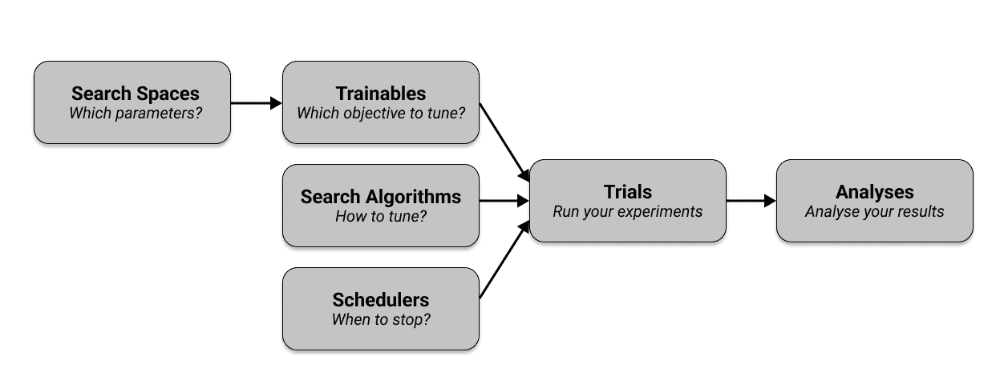

# 第五章：使用 Ray Tune 进行超参数优化

在上一章中，我们看到了如何构建和运行各种强化学习实验。运行这些实验可能会很昂贵，无论是在计算资源方面还是运行时间方面。当您转向更具挑战性的任务时，这种情况只会加剧，因为不太可能仅仅从头开始选择一个算法并运行它以获得良好的结果。换句话说，某个时候，您需要调整算法的超参数以获得最佳结果。正如我们将在本章中看到的那样，调整机器学习模型是困难的，但 Ray Tune 是帮助您解决这一任务的绝佳选择。

Ray Tune 是一款非常强大的超参数优化工具。它不仅默认以分布式方式工作，就像 Ray 构建的任何其他库一样，而且它还是当前功能最丰富的超参数优化（HPO）库之一。更为重要的是，Tune 还与一些最杰出的 HPO 库集成，如 HyperOpt、Optuna 等等。这是非常了不起的，因为它使 Tune 成为分布式 HPO 实验的理想选择，几乎无论您来自哪个其他库，或者您是从头开始。

在本章中，我们将首先深入探讨为什么 HPO 很难做到以及如何使用 Ray 自己去简单地实现它。然后我们会教给您 Ray Tune 的核心概念以及如何使用它来调整我们在前一章中构建的 RLlib 模型。最后，我们还将研究如何使用 Tune 来进行监督学习任务，使用像 PyTorch 和 TensorFlow 这样的框架。在此过程中，我们将展示 Tune 如何与其他 HPO 库集成，并向您介绍其更多高级特性。

# 调整超参数

让我们简要回顾一下超参数优化的基础知识。如果您对这个主题很熟悉，可以跳过本节，但由于我们还讨论了分布式 HPO 的方面，您可能仍然会从中受益。这一章节的[笔记本](https://github.com/maxpumperla/learning_ray/blob/main/notebooks/ch_05_tune.ipynb)可以在本书的 GitHub 仓库中找到。

如果您还记得我们在第三章介绍的第一个强化学习实验，我们定义了一个非常基础的 Q 学习算法，其内部的*状态-动作值*根据明确的更新规则进行更新。初始化后，我们从未直接接触这些*模型参数*，它们是由算法学习的。相比之下，在设置算法时，我们明确选择了在训练之前的 `weight` 和 `discount_factor` 参数。我当时没有告诉您我们选择如何设置这些参数，我们只是接受它们足以解决手头问题的事实。同样，在第四章中，我们通过设置 `num_workers=4` 来初始化一个使用四个 rollout worker 的 RLlib 算法的 `config`。这些参数称为*超参数*，找到它们的好选择对于成功的实验至关重要。超参数优化领域致力于高效地找到这样的良好选择。

## 使用 Ray 构建一个随机搜索示例

超参数如我们的 Q 学习算法中的 `weight` 或 `discount_factor` 是*连续*参数，因此我们不可能测试它们的所有组合。更重要的是，这些参数选择可能彼此不独立。如果我们希望它们被选中，我们还需要为每个参数指定一个*值范围*（在这种情况下，两个超参数都需要在 0 到 1 之间选择）。那么，我们如何确定好甚至是最优的超参数呢？

让我们看一个快速示例，实现了一个天真但有效的超参数调整方法。这个示例还将允许我们介绍稍后将使用的一些术语。核心思想是我们可以尝试*随机抽样*超参数，为每个样本运行算法，然后根据我们得到的结果选择最佳运行。但为了体现本书的主题，我们不仅想在顺序循环中运行它，我们希望使用 Ray 并行计算我们的运行。

为了保持简单，我们将再次回顾我们在第三章中介绍的简单 Q 学习算法。如果您不记得主训练函数的签名，我们将其定义为 `train_policy(env, num_episodes=10000, weight=0.1, discount_factor=0.9)`。这意味着我们可以通过向 `train_policy` 函数传入不同的值来调整算法的 `weight` 和 `discount_factor` 参数，并查看算法的性能。为此，让我们为我们的超参数定义一个所谓的*搜索空间*。对于所讨论的两个参数，我们只需在 0 到 1 之间均匀采样值，共 10 个选择。以下是其样子：

##### 示例 5-1\.

```py
import random
search_space = []
for i in range(10):
    random_choice = {
        'weight': random.uniform(0, 1),
        'discount_factor': random.uniform(0, 1)
    }
    search_space.append(random_choice)
```

接下来，我们定义一个*目标函数*，或者简称*目标*。目标函数的作用是评估给定超参数集在我们感兴趣的任务中的性能。在我们的情况下，我们想要训练我们的强化学习算法并评估训练好的策略。回想一下，在第三章中，我们还定义了一个`evaluate_policy`函数，目的正是如此。`evaluate_policy`函数被定义为返回代理在底层迷宫环境中达到目标所需的平均步数。换句话说，我们想要找到一组能够最小化我们目标函数结果的超参数集。为了并行化目标函数，我们将使用`ray.remote`装饰器来将我们的`objective`变成一个 Ray 任务。

##### 示例 5-2\.

```py
import ray

@ray.remote
def objective(config):  
    environment = Environment()
    policy = train_policy(  
        environment, weight=config["weight"], discount_factor=config["discount_factor"]
    )
    score = evaluate_policy(environment, policy)  
    return [score, config]  
```


我们将一个超参数样本字典传递给我们的目标函数。


然后我们使用选定的超参数训练我们的 RL 策略。


之后，我们可以评估策略，以获取我们希望最小化的分数。


我们返回得分和一起选择的超参数以便后续分析。

最后，我们可以使用 Ray 并行运行目标函数，通过迭代搜索空间并收集结果：

##### 示例 5-3\.

```py
result_objects = [objective.remote(choice) for choice in search_space]
results = ray.get(result_objects)

results.sort(key=lambda x: x[0])
print(results[-1])
```

此超参数运行的实际结果并不是非常有趣，因为问题很容易解决（大多数运行将返回 8 步的最优解，无论选择哪些超参数）。但是，如果我还没有向您展示 Ray 的能力，更有趣的是使用 Ray 并行化目标函数有多么容易。事实上，我想鼓励您重新编写上述示例，只需循环遍历搜索空间并为每个样本调用目标函数，以确认这样的串行循环有多么缓慢。

从概念上讲，我们运行上述示例的三个步骤代表了超参数调整工作的一般过程。首先，您定义一个搜索空间，然后定义一个目标函数，最后运行分析以找到最佳超参数。在 HPO 中，通常将每个超参数样本对目标函数的评估称为*试验*，所有试验形成您分析的基础。关于如何从搜索空间中抽样参数（在我们的案例中是随机抽样），这完全取决于*搜索算法*的决定。实际上，找到好的超参数说起来容易做起来难，因此让我们更仔细地看看为什么这个问题如此棘手。

## 为什么 HPO 难？

如果您从上述示例中稍微放大视角，就会发现在使超参数调整过程顺利运行中有许多复杂因素。以下是最重要的几个要点的快速概述：

+   您的搜索空间可以由大量超参数组成。这些参数可能具有不同的数据类型和范围。一些参数可能是相关的，甚至依赖于其他参数。从复杂的、高维空间中抽样良好的候选者是一项困难的任务。

+   随机选择参数可能效果出乎意料地好，但并不总是最佳选择。一般来说，您需要测试更复杂的搜索算法来找到最佳参数。

+   特别是，即使像我们刚刚所做的那样并行化您的超参数搜索，单次运行目标函数可能需要很长时间才能完成。这意味着您不能负担得起总共运行太多次搜索。例如，训练神经网络可能需要几个小时才能完成，因此您的超参数搜索最好要有效。

+   在分发搜索时，您需要确保有足够的计算资源可用于有效地运行对目标函数的搜索。例如，您可能需要一个 GPU 来快速计算您的目标函数，因此您所有的搜索运行都需要访问一个 GPU。为每个试验分配必要的资源对加速搜索至关重要。

+   您希望拥有便捷的工具来进行您的 HPO 实验，如提前停止糟糕的运行，保存中间结果，从先前的试验重新启动，或暂停和恢复运行等。

作为一种成熟的、分布式的 HPO 框架，Ray Tune 处理所有这些话题，并为您提供一个简单的界面来运行超参数调整实验。在我们研究 Tune 如何工作之前，让我们重写上面的例子以使用 Tune。

# 对 Tune 的介绍

要初尝 Tune 的滋味，将我们对随机搜索的天真 Ray Core 实现移植到 Tune 是直截了当的，并且遵循与之前相同的三个步骤。首先，我们定义一个搜索空间，但这次使用`tune.uniform`，而不是`random`库：

##### 示例 5-4。

```py
from ray import tune

search_space = {
    "weight": tune.uniform(0, 1),
    "discount_factor": tune.uniform(0, 1),
}
```

接下来，我们可以定义一个目标函数，几乎与以前的相同。我们设计得就是这样。唯一的区别是，这次我们将分数返回为一个字典，并且我们不需要一个`ray.remote`装饰器，因为 Tune 会在内部为我们分配此目标函数。

##### 示例 5-5。

```py
def tune_objective(config):
    environment = Environment()
    policy = train_policy(
        environment, weight=config["weight"], discount_factor=config["discount_factor"]
    )
    score = evaluate_policy(environment, policy)

    return {"score": score}
```

有了这个`tune_objective`函数的定义，我们可以将其传递到`tune.run`调用中，以及我们定义的搜索空间。默认情况下，Tune 将为您运行随机搜索，但您也可以指定其他搜索算法，很快您将看到。调用`tune.run`为您的目标生成随机搜索试验，并返回包含有关超参数搜索信息的`analysis`对象。我们可以通过调用`get_best_config`并指定`metric`和`mode`参数（我们希望最小化我们的分数）来获得找到的最佳超参数：

##### 示例 5-6。

```py
analysis = tune.run(tune_objective, config=search_space)
print(analysis.get_best_config(metric="score", mode="min"))
```

这个快速示例涵盖了 Tune 的基础知识，但还有很多要解开的。`tune.run`函数非常强大，有许多参数供您配置运行。为了理解这些不同的配置选项，我们首先需要向您介绍 Tune 的关键概念。

## Tune 是如何工作的？

要有效地使用 Tune，您必须了解六个关键概念，其中四个在上一个示例中已经使用过。下面是 Ray Tune 组件的非正式概述及其思考方式：

+   *搜索空间*: 这些空间确定要选择的参数。搜索空间定义了每个参数值的范围以及如何对其进行采样。它们定义为字典，并使用 Tune 的采样函数指定有效的超参数值。您已经看到了`tune.uniform`，但[还有很多其他选择可供选择](https://docs.ray.io/en/latest/tune/api_docs/search_space.xhtml#tune-sample-docs)。

+   *可训练对象*: `Trainable`是 Tune 对您想要“调整”的目标的正式表示。Tune 还有基于类的 API，但在本书中我们只使用基于函数的 API。对于我们来说，`Trainable`是一个带有单个参数（搜索空间）的函数，它向 Tune 报告得分。最简单的方法是通过返回包含您感兴趣得分的字典来实现。

+   *试验*: 通过触发`tune.run(...)`，Tune 将确保设置试验并安排它们在集群上执行。每个试验包含关于目标单次运行的所有必要信息，给定一组超参数。

+   *分析*: 调用`run`方法完成后返回一个`ExperimentAnalysis`对象，其中包含所有试验的结果。您可以使用此对象深入了解试验结果。

+   *搜索算法*: Tune 支持多种搜索算法，它们是调整超参数的核心。到目前为止，您只隐式地遇到了 Tune 的默认搜索算法，它从搜索空间中随机选择超参数。

+   *调度器*: Tune 实验的最后一个关键组件是*调度器*。调度器计划并执行搜索算法选择的试验。默认情况下，Tune 按先进先出（FIFO）的方式调度搜索算法选择的试验。实际上，您可以将调度器视为加快实验速度的一种方法，例如通过提前停止不成功的试验。

图 图 5-1 概述了 Tune 的主要组件及其在一个图表中的关系：



###### 图 5-1\. Ray Tune 的核心组件。

注意，Tune 内部运行在 Ray 集群的驱动进程上，该进程会生成多个工作进程（使用 Ray actors），这些进程执行您的 HPO 实验的各个单独试验。在驱动程序上定义的可训练对象必须发送到工作进程，并且需要将试验结果通知给运行`tune.run(...)`的驱动程序。

搜索空间、可训练模型、试验和分析不需要额外解释太多，我们将在本章的其余部分看到每个组件的更多示例。但是搜索算法，或简称为*搜索器*，以及调度器需要更详细的阐述。

### 搜索算法

Tune 提供的所有高级搜索算法以及其集成的许多第三方 HPO 库都属于*贝叶斯优化*的范畴。不幸的是，深入讨论特定贝叶斯搜索算法的细节远远超出了本书的范围。基本思想是，根据先前试验的结果更新您对值得探索的超参数范围的信念。使用这一原则的技术能够做出更为明智的决策，因此通常比独立随机抽样参数（例如随机抽样）更为高效。

除了我们已经看到的基本随机搜索以外，还有从预定义的选择“网格”中选择超参数的*网格搜索*，Tune 还提供了各种贝叶斯优化搜索器。例如，Tune 集成了流行的 HyperOpt 和 Optuna 库，您可以通过这两个库使用流行的 TPE（树形结构 Parzen 估计器）搜索器与 Tune 一起使用。不仅如此，Tune 还集成了 Ax、BlendSearch、FLAML、Dragonfly、Scikit-Optimize、BayesianOptimization、HpBandSter、Nevergrad、ZOOpt、SigOpt 和 HEBO 等工具。如果您需要在集群上使用这些工具运行 HPO 实验，或者想要轻松地在它们之间切换，Tune 是您的首选。

为了更具体地说明问题，让我们重新编写我们之前的基本随机搜索 Tune 示例，使用`bayesian-optimization`库。为此，请确保首先在您的 Python 环境中安装这个库，例如使用`pip install bayesian-optimization`。

##### 示例 5-7\.

```py
from ray.tune.suggest.bayesopt import BayesOptSearch

algo = BayesOptSearch(random_search_steps=4)

tune.run(
    tune_objective,
    config=search_space,
    metric="score",
    mode="min",
    search_alg=algo,
    stop={"training_iteration": 10},
)
```

请注意，我们在贝叶斯优化的开始时进行四个随机步骤来“热启动”，并且我们明确地`stop`在 10 次训练迭代后停止试验运行。

请注意，由于我们不仅仅是随机选择参数来使用`BayesOptSearch`，我们在 Tune 运行中使用的`search_alg`需要知道要优化的`metric`以及是最小化还是优化这个指标。正如我们之前所讨论的，我们希望达到一个`"min"` `"score"`。

### 调度器

接下来让我们讨论如何在 Tune 中使用*试验调度器*来使您的运行更加高效。我们还将在这一节中介绍一种稍微不同的方法，用于在目标函数中向 Tune 报告您的指标。

因此，假设我们不像本章中所有示例中那样直接计算分数，而是在循环中计算*中间分数*。这在监督式机器学习场景中经常发生，当为模型进行多次迭代训练时（我们将在本章后面看到具体应用）。通过选择良好的超参数，这个中间分数可能会在它计算的循环之前停滞。换句话说，如果我们不再看到足够的增量变化，为什么不早点停止试验呢？这正是 Tune 的调度程序构建的情况之一。

这里是这样一个目标函数的快速示例。这是一个玩具例子，但它将帮助我们更好地讨论我们希望 Tune 找到的最优超参数，远比我们讨论一个黑盒场景要好。

##### 示例 5-8。

```py
def objective(config):
    for step in range(30):  
        score = config["weight"] * (step ** 0.5) + config["bias"]
        tune.report(score=score)  

search_space = {"weight": tune.uniform(0, 1), "bias": tune.uniform(0, 1)}
```


通常情况下，您可能希望计算中间分数，例如在“训练循环”中。


您可以使用`tune.report`来告诉 Tune 这些中间分数的情况。

我们希望在这里最小化的分数是一个正数的平方根乘以一个`weight`，再加上一个`bias`项。显然，这两个超参数都需要尽可能小，以最小化任何正`x`的`score`。考虑到平方根函数的“平坦化”，我们可能不必计算所有`30`次循环通过以找到足够好的值来调整我们的两个超参数。如果你想象每个`score`计算花费一个小时，尽早停止可能会极大地提升您的实验运行速度。

让我们通过使用流行的 Hyperband 算法作为我们的试验调度程序来说明这个想法。该调度程序需要传递一个指标和模式（再次，我们要`min`-imize 我们的`score`）。我们还确保运行 10 个样本，以避免过早停止：

##### 示例 5-9。

```py
from ray.tune.schedulers import HyperBandScheduler

scheduler = HyperBandScheduler(metric="score", mode="min")

analysis = tune.run(
    objective,
    config=search_space,
    scheduler=scheduler,
    num_samples=10,
)

print(analysis.get_best_config(metric="score", mode="min"))
```

请注意，在这种情况下，我们没有指定搜索算法，这意味着 Hyperband 将在通过随机搜索选择的参数上运行。我们也可以*结合*这个调度程序与另一个搜索算法。这将使我们能够选择更好的试验超参数并及早停止不良试验。然而，请注意，并非每个调度程序都可以与搜索算法结合使用。建议您查看[Tune 的调度程序兼容矩阵](https://docs.ray.io/en/latest/tune/key-concepts.xhtml#schedulers)获取更多信息。

总结一下，除了 Hyperband 外，Tune 还包括分布式实现的早停算法，如中位数停止规则、ASHA、基于人口的训练（PBT）和基于人口的强盗（PB2）。

## 配置和运行 Tune

在探讨更具体的使用 Ray Tune 的机器学习示例之前，让我们深入研究一些有用的主题，这些主题将帮助您更好地利用您的 Tune 实验，例如正确利用资源、停止和恢复试验、向您的 Tune 运行添加回调，或定义自定义和条件搜索空间。

### 指定资源

默认情况下，每个 Tune 试验将在一个 CPU 上运行，并利用尽可能多的 CPU 用于并发试验。例如，如果您在具有 8 个 CPU 的笔记本电脑上运行 Tune，则本章中迄今计算的任何实验都将生成 8 个并发试验，并为每个试验分配一个 CPU。可以使用 Tune 运行的 `resources_per_trial` 参数来控制这种行为。

有趣的是，这不仅限于 CPU，您还可以确定每个试验使用的 GPU 数量。此外，Tune 还允许您使用 *分数资源*，即您可以在试验之间共享资源。所以，假设您的机器有 12 个 CPU 和两个 GPU，并且您请求您的 `objective` 使用以下资源：

```py
from ray import tune

tune.run(objective, num_samples=10, resources_per_trial={"cpu": 2, "gpu": 0.5})
```

这意味着 Tune 可以在您的机器上调度和执行最多四个并发试验，因为这样可以最大化 GPU 的利用率（同时您仍然可以有 4 个空闲的 CPU 用于其他任务）。如果您愿意，还可以通过将字节的数量传递给 `resources_per_trial` 来指定试验使用的 `"memory"` 量。还请注意，如果您需要显式地 *限制* 并发试验的数量，可以通过将 `max_concurrent_trials` 参数传递给您的 `tune.run(...)` 来实现。在上述示例中，假设您希望始终保留一个 GPU 供其他任务使用，您可以通过设置 `max_concurrent_trials = 2` 来限制并发试验的数量为两个。

请注意，我们刚刚为单台机器上的资源举例的所有内容，自然地扩展到任何 Ray 集群及其可用资源。在任何情况下，Ray 都会尝试安排下一个试验，但会等待并确保有足够的资源可用才执行它们。

### 回调和指标

如果你花了一些时间调查我们在本章中启动的 Tune 运行的输出，你会注意到每个试验默认都有很多信息，比如试验 ID、执行日期等等。有趣的是，Tune 不仅允许你自定义要报告的指标，还可以通过提供 *回调* 来钩入 `tune.run`。让我们计算一个快速而代表性的示例，同时做这两件事。

稍微修改之前的示例，假设我们想在每次试验返回结果时记录特定消息。为此，您只需要在来自 `ray.tune` 包的 `Callback` 对象上实现 `on_trial_result` 方法。下面是一个报告 `score` 的目标函数的示例：

##### 示例 5-10\.

```py
from ray import tune
from ray.tune import Callback
from ray.tune.logger import pretty_print

class PrintResultCallback(Callback):
    def on_trial_result(self, iteration, trials, trial, result, **info):
        print(f"Trial {trial} in iteration {iteration}, got result: {result['score']}")

def objective(config):
    for step in range(30):
        score = config["weight"] * (step ** 0.5) + config["bias"]
        tune.report(score=score, step=step, more_metrics={})
```

请注意，除了分数之外，我们还向 Tune 报告 `step` 和 `more_metrics`。实际上，您可以在此处公开任何其他想要跟踪的指标，Tune 将其添加到其试验指标中。以下是如何使用我们的自定义回调运行 Tune 实验，并打印刚刚定义的自定义指标：

##### 示例 5-11\.

```py
search_space = {"weight": tune.uniform(0, 1), "bias": tune.uniform(0, 1)}

analysis = tune.run(
    objective,
    config=search_space,
    mode="min",
    metric="score",
    callbacks=[PrintResultCallback()])

best = analysis.best_trial
print(pretty_print(best.last_result))
```

运行此代码将产生以下输出（除了您将在任何其他 Tune 运行中看到的输出之外）。请注意，我们需要在这里明确指定 `mode` 和 `metric`，以便 Tune 知道我们通过 `best_result` 意味着什么。首先，您应该看到我们回调函数的输出，同时试验正在运行：

```py
...
Trial objective_85955_00000 in iteration 57, got result: 1.5379782083952644
Trial objective_85955_00000 in iteration 58, got result: 1.5539087627537493
Trial objective_85955_00000 in iteration 59, got result: 1.569535794562848
Trial objective_85955_00000 in iteration 60, got result: 1.5848760187255326
Trial objective_85955_00000 in iteration 61, got result: 1.5999446700996236
...
```

然后，在程序的最后，我们打印最佳可用试验的指标，其中包括我们定义的三个自定义指标。以下输出省略了一些默认指标，以使其更易读。我们建议您自己运行这样的示例，特别是熟悉阅读 Tune 试验输出（由于其并发性质可能会有些压倒性）。

```py
Result logdir: /Users/maxpumperla/ray_results/objective_2022-05-23_15-52-01
...
done: true
experiment_id: ea5d89c2018f483183a005a1b5d47302
experiment_tag: 0_bias=0.73356,weight=0.16088
hostname: mac
iterations_since_restore: 30
more_metrics: {}
score: 1.5999446700996236
step: 29
trial_id: '85955_00000'
...
```

请注意，我们使用 `on_trial_result` 作为实现自定义 Tune `Callback` 的方法示例，但您还有许多其他有用的选项，它们都相对容易理解。在此列出它们并不是很有帮助，但我发现一些回调方法特别有用，如 `on_trial_start`、`on_trial_error`、`on_experiment_end` 和 `on_checkpoint`。后者暗示了我们接下来将讨论的 Tune 运行的一个重要方面。

### 检查点、停止和恢复

您启动的 Tune 试验越多，它们在单独运行时的时间越长，特别是在分布式设置中，越需要一种机制来保护您免受故障的影响，停止运行或从以前的结果中恢复。Tune 通过定期为您创建 *checkpoints* 来实现这一点。Tune 动态调整检查点的频率，以确保至少有 95% 的时间用于运行试验，并且不会将过多资源用于存储检查点。

在我们刚刚计算的示例中，使用的检查点目录或 `logdir` 是 `/Users/maxpumperla/ray_results/objective_2022-05-23_15-52-01`。如果您在您的机器上运行此示例，默认情况下其结构将是 `~/ray_results/<your-objective>_<date>_<time>`。如果您知道您的实验的 `name`，您可以像这样轻松 `resume` 它：

##### 示例 5-12\.

```py
analysis = tune.run(
    objective,
    name="/Users/maxpumperla/ray_results/objective_2022-05-23_15-52-01",
    resume=True,
    config=search_space)
```

同样地，您可以通过定义停止条件并将其明确传递给 `tune.run` 来 *stop* 您的试验。最简单的选项是通过提供带有停止条件的字典来实现，我们之前已经看到了这个选项。以下是如何在达到 `training_iteration` 计数为 10 时停止运行我们的 `objective` 分析，这是所有 Tune 运行的内置指标之一：

##### 示例 5-13\.

```py
tune.run(
    objective,
    config=search_space,
    stop={"training_iteration": 10})
```

这种指定停止条件的方式之一的缺点是，它假定所涉及的度量是*增加*的。例如，我们计算的 `score` 起始较高，这是我们希望最小化的。为了为我们的 `score` 制定一个灵活的停止条件，最好的方法是提供一个如下的停止函数。

##### 示例 5-14。

```py
def stopper(trial_id, result):
    return result["score"] < 2

tune.run(
    objective,
    config=search_space,
    stop=stopper)
```

在需要更多上下文或显式状态的停止条件的情况下，您还可以定义一个自定义的 `Stopper` 类，将其传递给 Tune 运行的 `stop` 参数，但我们不会在这里涵盖这种情况。

### 自定义和条件搜索空间

我们在这里要涵盖的最后一个更高级的主题是复杂的搜索空间。到目前为止，我们只看到彼此独立的超参数，但实际上，有时某些超参数是相互依赖的。此外，虽然 Tune 的内置搜索空间提供了很多选择，但有时您可能希望从更奇特的分布或您自己的模块中对参数进行抽样。

这里是您可以在 Tune 中处理这两种情况的方法。继续使用我们简单的 `objective` 示例，假设您不想使用 Tune 的 `tune.uniform`，而想要使用 `numpy` 包中的 `random.uniform` 采样器来为您的 `weight` 参数。然后，您的 `bias` 参数应该是 `weight` 乘以一个标准正态变量。使用 `tune.sample_from`，您可以处理这种情况（或更复杂和嵌套的情况），如下所示：

##### 示例 5-15。

```py
from ray import tune
import numpy as np

search_space = {
    "weight": tune.sample_from(lambda context: np.random.uniform(low=0.0, high=1.0)),
    "bias": tune.sample_from(lambda context: context.config.alpha * np.random.normal())
}

tune.run(objective, config=search_space)
```

在 Ray Tune 中有许多有趣的功能可以探索，但是让我们在这里转换一下视角，看看如何使用 Tune 进行一些机器学习应用。

# 使用 Tune 进行机器学习

正如我们所看到的，Tune 是多才多艺的，允许您为任何您给定的目标调整超参数。特别是，您可以将其与您感兴趣的任何机器学习框架一起使用。在本节中，我们将给出两个示例来说明这一点。

首先，我们将使用 Tune 来优化 RLlib 强化学习实验的参数，然后我们将通过 Tune 使用 Optuna 来调整 Keras 模型。

## 使用 RLlib 和 Tune

RLlib 和 Tune 已经设计成可以很好地配合使用，因此您可以轻松地为现有的 RLlib 代码设置一个 HPO 实验。事实上，RLlib 的 Trainers 可以作为 `tune.run` 的第一个参数传入，作为 `Trainable`。您可以选择实际的 Trainer 类，如 `DQNTrainer`，或其字符串表示形式，如 `"DQN"`。作为 Tune `metric`，您可以传递由您的 RLlib 实验跟踪的任何指标，例如 `"episode_reward_mean"`。而 `tune.run` 的 `config` 参数就是您的 RLlib Trainer 配置，但您可以利用 Tune 的搜索空间 API 的全部功能来对超参数进行抽样，例如学习率或训练批次大小¹。这里是我们刚刚描述的完整示例，运行一个在 `CartPole-v0` gym 环境上进行调优的 RLlib 实验：

##### 示例 5-16。

```py
from ray import tune

analysis = tune.run(
    "DQN",
    metric="episode_reward_mean",
    mode="max",
    config={
        "env": "CartPole-v0",
        "lr": tune.uniform(1e-5, 1e-4),
        "train_batch_size": tune.choice([10000, 20000, 40000]),
    },
)
```

## 调整 Keras 模型

结束本章时，让我们看一个稍微更复杂的示例。正如我们之前提到的，这本书不是主要介绍机器学习，而是介绍 Ray 及其库的入门。这意味着我们既不能向您介绍 ML 的基础知识，也不能花太多时间详细介绍 ML 框架。因此，在本节中，我们假设您熟悉 Keras 及其 API，并对监督学习有一些基本了解。如果您没有这些先决条件，您仍然应该能够跟上，并专注于 Ray Tune 特定部分。您可以将以下示例视为将 Tune 应用于机器学习工作负载的更现实的场景。

从鸟瞰角度来看，我们将加载一个常见的数据集，为 ML 任务准备它，通过创建一个深度学习模型定义一个 Tune 目标，该模型使用 Keras 报告精度指标，并使用 Tune 的 HyperOpt 集成来定义调优我们 Keras 模型的一组超参数的搜索算法。工作流程保持不变-我们定义一个目标，一个搜索空间，然后使用`tune.run`与我们想要的配置。

要定义一个用于训练的数据集，让我们编写一个简单的`load_data`实用函数，加载 Keras 附带的著名 MNIST 数据。MNIST 由 28 乘以 28 像素的手写数字图像组成。我们将像素值归一化为 0 到 1 之间，并将这十个数字的标签作为*categorical variables*。这里是如何只使用 Keras 内置功能来做到这一点（在运行之前确保`pip install tensorflow`）：

##### 示例 5-17。

```py
from tensorflow.keras.datasets import mnist
from tensorflow.keras.utils import to_categorical

def load_data():
    (x_train, y_train), (x_test, y_test) = mnist.load_data()
    num_classes = 10
    x_train, x_test = x_train / 255.0, x_test / 255.0
    y_train = to_categorical(y_train, num_classes)
    y_test = to_categorical(y_test, num_classes)
    return (x_train, y_train), (x_test, y_test)
```

接下来，我们定义一个调谐`目标`函数或可训练函数，通过加载我们刚刚定义的数据，设置一个顺序的 Keras 模型，其中的超参数来自我们传入`config`中的选择，然后编译和拟合模型。为了定义我们的深度学习模型，我们首先将 MNIST 输入图像展平为向量，然后添加两个全连接层（在 Keras 中称为`Dense`），并在其中添加一个`Dropout`层。我们要调节的超参数包括第一个`Dense`层的激活函数、`Dropout`率以及第一层的“隐藏”输出单元数。我们可以以同样的方式调节这个模型的任何其他超参数，这个选择只是一个例子。

我们可以像在本章的其他示例中手动报告感兴趣的度量方式一样（例如通过在我们的`objective`中返回字典或使用`tune.report(...)`）。但由于 Tune 配备了合适的 Keras 集成，我们可以使用所谓的`TuneReportCallback`作为自定义 Keras 回调，将其传递到我们模型的`fit`方法中。这是我们的 Keras `objective`函数的样子：

##### 示例 5-18。

```py
from tensorflow.keras.models import Sequential
from tensorflow.keras.layers import Flatten, Dense, Dropout
from ray.tune.integration.keras import TuneReportCallback

def objective(config):
    (x_train, y_train), (x_test, y_test) = load_data()
    model = Sequential()
    model.add(Flatten(input_shape=(28, 28)))
    model.add(Dense(config["hidden"], activation=config["activation"]))
    model.add(Dropout(config["rate"]))
    model.add(Dense(10, activation="softmax"))

    model.compile(loss="categorical_crossentropy", metrics=["accuracy"])
    model.fit(x_train, y_train, batch_size=128, epochs=10,
              validation_data=(x_test, y_test),
              callbacks=[TuneReportCallback({"mean_accuracy": "accuracy"})])
```

接下来，让我们使用自定义搜索算法来调整这个目标。具体来说，我们使用`HyperOptSearch`算法，通过 Tune 可以访问 HyperOpt 的 TPE 算法。要使用这种集成，请确保在您的机器上安装 HyperOpt（例如使用`pip install hyperopt==0.2.5`）。`HyperOptSearch`允许我们定义一组有前途的初始超参数选择进行研究。这是完全可选的，但有时您可能有良好的猜测作为起点。在我们的案例中，我们选择了一个`"rate"`为 0.2 的 dropout，128 个`"hidden"`单元，并且最初使用了整流线性单元（ReLU）的`"activation"`函数。除此之外，我们可以像之前使用`tune`实用工具一样定义一个搜索空间。最后，通过将所有内容传递到`tune.run`调用中，我们可以得到一个`analysis`对象来确定找到的最佳超参数。

##### 示例 5-19。

```py
from ray import tune
from ray.tune.suggest.hyperopt import HyperOptSearch

initial_params = [{"rate": 0.2, "hidden": 128, "activation": "relu"}]
algo = HyperOptSearch(points_to_evaluate=initial_params)

search_space = {
    "rate": tune.uniform(0.1, 0.5),
    "hidden": tune.randint(32, 512),
    "activation": tune.choice(["relu", "tanh"])
}

analysis = tune.run(
    objective,
    name="keras_hyperopt_exp",
    search_alg=algo,
    metric="mean_accuracy",
    mode="max",
    stop={"mean_accuracy": 0.99},
    num_samples=10,
    config=search_space,
)
print("Best hyperparameters found were: ", analysis.best_config)
```

注意，我们在这里充分利用了 HyperOpt 的全部功能，而无需学习其任何具体内容。我们使用 Tune 作为另一个 HPO 工具的分布式前端，同时利用其与 Keras 的原生集成。

虽然我们选择了 Keras 和 HyperOpt 的组合作为使用 Tune 与先进 ML 框架和第三方 HPO 库的示例，但正如前文所述，今天的流行使用中我们几乎可以选择任何其他机器学习库和 HPO 库。如果你对深入了解 Tune 提供的众多其他集成感兴趣，请查看[Ray Tune 文档示例](https://docs.ray.io/en/latest/tune/examples/index.xhtml)。

# 摘要

Tune 可以说是你今天可以选择的最多才多艺的 HPO 工具之一。它功能非常丰富，提供许多搜索算法、高级调度器、复杂的搜索空间、自定义停止器等许多其他功能，在本章中我们无法全部覆盖。此外，它与大多数知名 HPO 工具（如 Optuna 或 HyperOpt）无缝集成，这使得无论是从这些工具迁移，还是通过 Tune 简单利用它们的功能，都变得非常容易。由于 Tune 作为 Ray 生态系统的一部分默认是分布式的，它比许多竞争对手更具优势。您可以将 Ray Tune 视为一个灵活的、分布式的 HPO 框架，*扩展*了可能只能在单台机器上运行的其他框架。从这个角度来看，如果您需要扩展您的 HPO 实验，那么采用 Tune 几乎没有任何不合适的理由。

¹ 如果你想知道为什么`tune.run`中的`config`参数没有称为`search_space`，历史原因在于与 RLlib `config`对象的互操作性。
