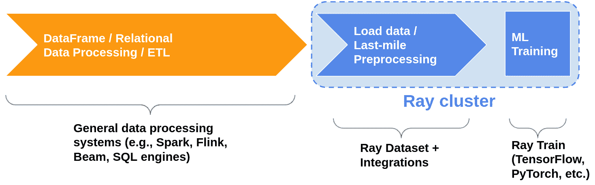
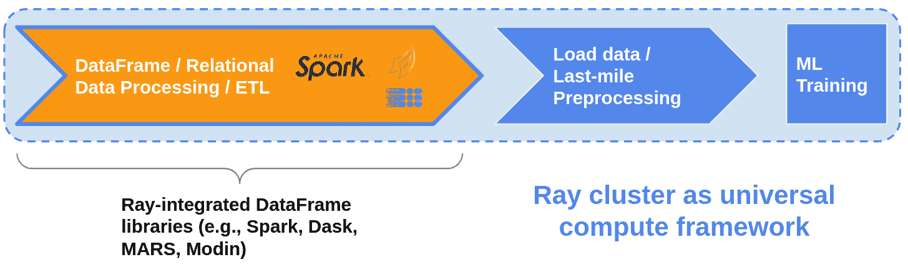

# 第七章. 使用 Ray 进行数据处理

Edward Oakes

在上一章中，您学习了如何使用 Ray 训练来扩展机器学习训练。当然，将机器学习应用于实践的关键组件是数据。在本章中，我们将探讨 Ray 上的核心数据处理能力集：Ray 数据。

虽然并不意味着取代 Apache Spark 或 Apache Hadoop 等更通用的数据处理系统，但 Ray 数据提供了基本的数据处理功能和一种标准方法，用于在 Ray 应用程序的不同部分加载、转换和传递数据。这使得 Ray 上的库生态系统能够以一种框架不可知的方式说同一种语言，用户可以混合和匹配功能，以满足他们的需求。

Ray 数据生态系统的核心组件是名副其实的“数据集”，它提供了在 Ray 集群中加载、转换和传递数据的核心抽象。数据集是使不同库能够在 Ray 之上相互操作的“粘合剂”。在本章中，您将看到这一点的实际操作，因为我们将展示如何使用 Dask on Ray 进行数据帧处理，并使用 Ray 训练和 Ray 调整将结果转换为数据集，以及如何使用数据集有效地进行大规模分布式深度学习训练。

数据集的主要优势包括：

灵活性

数据集支持各种数据格式，在 Ray 上与 Dask on Ray 等库集成无缝，可以在 Ray 任务和角色之间传递而不复制数据。

机器学习工作负载性能

数据集提供重要功能，如加速器支持、流水线处理和全局随机洗牌，加速机器学习训练和推理工作负载。

本章旨在使您熟悉在 Ray 上进行数据处理的核心概念，并帮助您了解如何完成常见模式以及为什么选择使用不同的部分来完成任务。本章假定您对诸如映射、过滤、分组和分区等数据处理概念有基本了解，但不是一般数据科学的教程，也不是对这些操作的内部实现进行深入挖掘。具有有限数据处理/数据科学背景的读者不应该在跟进时遇到问题。

我们将从对核心构建模块 Ray 数据集进行基本介绍开始。这将涵盖架构、API 基础知识以及示例，展示如何使用数据集来简化构建复杂的数据密集型应用程序。然后，我们将简要介绍 Ray 上的外部库集成，重点放在 Dask on Ray 上。最后，我们将通过在单个 Python 脚本中构建可扩展的端到端机器学习管道来将所有内容汇总。

本章的笔记本[也可在线获得](https://github.com/maxpumperla/learning_ray/blob/main/notebooks/ch_07_data_processing.ipynb)。

# Ray 数据集

## 数据集概述

Datasets 的主要目标是支持在 Ray 上进行数据处理的可扩展、灵活的抽象。Datasets 旨在成为 Ray 库完整生态系统中读取、写入和传输数据的标准方式。Datasets 最强大的用途之一是作为机器学习工作负载的数据摄入和预处理层，使您能够通过 Ray Train 和 Ray Tune 高效扩展训练。这将在本章的最后一节中详细探讨。

如果你之前使用过其他分布式数据处理 API，比如 Apache Spark 的 RDDs，那么你会觉得 Datasets API 非常熟悉。该 API 的核心依赖于函数式编程，并提供标准功能，如读取/写入多种不同的数据源，执行诸如映射、过滤和排序等基本转换，以及一些简单的聚合操作，比如分组。

在底层，Datasets 实现了分布式[Apache Arrow](https://arrow.apache.org/)。Apache Arrow 是一个统一的列式数据格式，用于数据处理库和应用程序，因此与之集成意味着 Datasets 能够与诸如 NumPy 和 pandas 等最受欢迎的处理库直接进行交互。

一个 Dataset 包含一系列 Ray 对象引用，每个引用指向数据的“块”。这些块可以是 Arrow 表格，也可以是 Python 列表（对于不支持 Arrow 格式的数据），存储在 Ray 的共享内存对象存储中，数据的计算（如映射或过滤操作）发生在 Ray 任务（有时是 actor）中。

由于 Datasets 依赖于 Ray 的任务和共享内存对象存储的核心原语，它继承了 Ray 的关键优势：可扩展到数百个节点、由于在同一节点上的进程之间共享内存而具有高效的内存使用率，以及对象溢出和恢复以优雅处理故障。此外，由于 Datasets 只是对象引用列表，它们还可以在任务和 actor 之间高效传递，而无需复制数据，这对于使数据密集型应用程序和库具有可扩展性至关重要。

## Datasets 基础

本节将基本概述 Ray Datasets，涵盖如何开始读取、写入和转换数据集。这并不意味着是全面参考，而是为了介绍基本概念，以便我们在后面的部分中构建一些有趣的示例，展示 Ray Datasets 的强大之处。有关支持的最新信息和确切语法，请参阅[Datasets 文档](https://docs.ray.io/en/latest/data/dataset.xhtml)。

若要按照本节示例操作，请确保在本地安装了 Ray Data：

```py
pip install "ray[data]"==1.9.0
```

### 创建数据集

首先，让我们创建一个简单的数据集并对其执行一些基本操作：

##### 示例 7-1\.

```py
import ray

# Create a dataset containing integers in the range [0, 10000).
ds = ray.data.range(10000)

# Basic operations: show the size of the dataset, get a few samples, print the schema.
print(ds.count())  # -> 10000
print(ds.take(5))  # -> [0, 1, 2, 3, 4]
print(ds.schema())  # -> <class 'int'>
```

我们创建了一个包含从 0 到 10000 的数字的数据集，然后打印了一些关于它的基本信息：记录总数，一些样本以及架构（稍后我们将详细讨论这一点）。

### 从存储中读取和写入

当然，对于真实的工作负载，您通常会希望从持久存储中读取数据并写入结果。写入和读取数据集非常简单；例如，要将数据集写入 CSV 文件，然后将其加载回内存，我们只需使用内置的 `write_csv` 和 `read_csv` 实用程序即可：

##### 示例 7-2\.

```py
# Save the dataset to a local file and load it back.
ray.data.range(10000).write_csv("local_dir")
ds = ray.data.read_csv("local_dir")
print(ds.count())
```

数据集支持多种常见的序列化格式，如 CSV、JSON 和 Parquet，并且可以从/写入到本地磁盘以及像 HDFS 或 AWS S3 这样的远程存储。

在上面的例子中，我们仅提供了一个本地文件路径（`"local_dir"`），因此数据集被写入到本地机器上的一个目录中。如果我们想要改为写入和读取 S3，我们需要提供类似 `"s3://my_bucket/"` 的路径，数据集将自动处理有效地读写远程存储，并通过多任务并行化请求以提高吞吐量。

请注意，数据集还支持自定义数据源，您可以使用它们来写入到任何不受开箱即用支持的外部数据存储系统。

### 内置转换

现在我们已经了解了如何创建和检查数据集的基本 API，让我们来看一些可以在其上执行的内置操作。下面的代码示例展示了数据集支持的三个基本操作：- 首先，我们`union`两个数据集。结果是一个包含两者所有记录的新数据集。- 然后，我们通过提供自定义过滤函数，`filter`数据集中的元素仅包括偶数整数。- 最后，我们对数据集进行`sort`排序。

##### 示例 7-3\.

```py
# Basic transformations: join two datasets, filter, and sort.
ds1 = ray.data.range(10000)
ds2 = ray.data.range(10000)
ds3 = ds1.union(ds2)
print(ds3.count())  # -> 20000

# Filter the combined dataset to only the even elements.
ds3 = ds3.filter(lambda x: x % 2 == 0)
print(ds3.count())  # -> 10000
print(ds3.take(5))  # -> [0, 2, 4, 6, 8]

# Sort the filtered dataset.
ds3 = ds3.sort()
print(ds3.take(5))  # -> [0, 0, 2, 2, 4]
```

除了上述操作外，数据集还支持您可能期望的常见聚合，例如 `groupby`、`sum`、`min` 等。您还可以传递用户定义的函数进行自定义聚合。

### 块和重新分区

使用数据集时要牢记的一件重要事情是*块*的概念，在本节中之前已经讨论过。块是构成数据集的基本数据块，操作是逐块应用到底层数据的。如果数据集中的块数过多，每个块将很小，并且每次操作都会有很多开销。如果块数太少，则操作无法高效并行化。

如果我们从上面的例子中查看一下，我们可以看到我们创建的初始数据集默认每个有 200 个块，当我们将它们组合时，结果数据集有 400 个块。在这种情况下，我们可能希望重新分区数据集，将其恢复到最初的 200 个块：

##### 示例 7-4\.

```py
ds1 = ray.data.range(10000)
print(ds1.num_blocks())  # -> 200
ds2 = ray.data.range(10000)
print(ds2.num_blocks())  # -> 200
ds3 = ds1.union(ds2)
print(ds3.num_blocks())  # -> 400

print(ds3.repartition(200).num_blocks())  # -> 200
```

块还控制了在将 Dataset 写入存储时创建的文件数（因此，如果希望所有数据合并到单个输出文件中，应在写入之前调用`.repartition(1)`）。

### 模式和数据格式

到目前为止，我们一直在处理仅由整数组成的简单 Dataset。然而，对于更复杂的数据处理，我们经常希望有一个模式，这样可以更轻松地理解数据并强制每列的类型。

鉴于数据集旨在成为 Ray 上应用程序和库的交互点，它们被设计为对特定数据类型不可知，并提供灵活性以在许多流行的数据格式之间读取、写入和转换。通过支持 Arrow 的列格式，Dataset 能够在 Python 字典、DataFrames 和序列化 parquet 文件等不同类型的结构化数据之间转换。

创建带有模式的 Dataset 的最简单方法是从 Python 字典列表创建它：

##### 示例 7-5。

```py
ds = ray.data.from_items([{"id": "abc", "value": 1}, {"id": "def", "value": 2}])
print(ds.schema())  # -> id: string, value: int64
```

在这种情况下，模式是从我们传递的字典键中推断出来的。我们还可以将数据类型与流行库（如 pandas）的数据类型进行转换：

##### 示例 7-6。

```py
pandas_df = ds.to_pandas()  # pandas_df will inherit the schema from our Dataset.
```

在这里，我们从 Dataset 转换为 pandas DataFrame，但反向操作也适用：如果您从 DataFrame 创建 Dataset，它将自动继承 DataFrame 的模式。

## 在 Dataset 上计算

在上面的部分中，我们介绍了 Ray Dataset 提供的一些功能，如过滤、排序和合并。然而，Dataset 最强大的部分之一是它们允许您利用 Ray 的灵活计算模型，并高效地处理大量数据。

执行 Dataset 上的自定义转换的主要方法是使用`.map()`。这允许您传递一个自定义函数，该函数将应用于 Dataset 的记录。一个基本的例子可能是将 Dataset 的记录平方：

##### 示例 7-7。

```py
ds = ray.data.range(10000).map(lambda x: x ** 2)
ds.take(5)  # -> [0, 1, 4, 9, 16]
```

在这个例子中，我们传递了一个简单的 lambda 函数，我们操作的数据是整数，但我们可以在这里传递任何函数，并在支持 Arrow 格式的结构化数据上操作。

我们还可以选择使用`.map_batches()`来映射数据批次，而不是单个记录。有些类型的计算在进行*向量化*时效率更高，这意味着它们使用一种更高效的算法或实现，可以同时操作一组项目。

重新访问我们简单的平方 Dataset 值的例子，我们可以重写它以批处理执行，并使用优化的`numpy.square`实现，而不是朴素的 Python 实现：

##### 示例 7-8。

```py
import numpy as np

ds = ray.data.range(10000).map_batches(lambda batch: np.square(batch).tolist())
ds.take(5)  # -> [0, 1, 4, 9, 16]
```

在进行深度学习训练或推理时，矢量化计算在 GPU 上尤其有用。然而，通常在 GPU 上执行计算也具有显著的固定成本，因为需要将模型权重或其他数据加载到 GPU 内存中。为此，Datasets 支持使用 Ray actors 对数据进行映射。Ray actors 寿命长且可以保存状态，与无状态的 Ray tasks 相反，因此我们可以通过在 actor 的构造函数中运行它们（例如将模型加载到 GPU 上）来缓存昂贵的操作成本。

要使用 Datasets 执行批处理推理，我们需要传递一个类而不是一个函数，指定此计算应使用 actors 运行，并使用 `.map_batches()`，以便我们可以执行矢量化推理。如果我们希望这在 GPU 上运行，还会传递`num_gpus=1`，这指定了运行 map 函数的 actor 每个都需要一个 GPU。Datasets 将自动为一组 actor 进行自动缩放，以执行映射操作。

##### 示例 7-9\.

```py
def load_model():
    # Return a dummy model just for this example.
    # In reality, this would likely load some model weights onto a GPU.
    class DummyModel:
        def __call__(self, batch):
            return batch

    return DummyModel()

class MLModel:
    def __init__(self):
        # load_model() will only run once per actor that's started.
        self._model = load_model()

    def __call__(self, batch):
        return self._model(batch)

ds.map_batches(MLModel, compute="actors")
```

## 数据集管道

默认情况下，Dataset 操作是阻塞的，这意味着它们从开始到结束同步运行，一次只有一个操作发生。然而，对于某些工作负载，这种模式可能非常低效。例如，考虑以下一组 Dataset 转换，这些转换可能用于对机器学习模型进行批处理推理：

##### 示例 7-10\.

```py
ds = ray.data.read_parquet("s3://my_bucket/input_data")\
        .map(cpu_intensive_preprocessing)\
        .map_batches(gpu_intensive_inference, compute="actors", num_gpus=1)\
        .repartition(10)\
        .write_parquet("s3://my_bucket/output_predictions")
```

此流水线共有五个阶段，每个阶段都强调系统的不同部分： - 从远程存储中读取需要集群入口带宽，并可能受到存储系统吞吐量的限制。 - 对输入进行预处理需要 CPU 资源。 - 在模型上进行矢量化推理需要 GPU 资源。 - 重新分区需要集群内部的网络带宽。 - 写入远程存储需要集群出口带宽，并可能再次受到存储吞吐量的限制。



###### 图 7-1\. 一个天真的 Dataset 计算，导致阶段之间的空闲资源

在这种情况下，相对于顺序执行阶段并允许它们重叠，很可能效率会更高。这意味着一旦从存储中读取了一些数据，它就被馈送到预处理阶段，然后到推理阶段，依此类推。



###### 图 7-2\. 一个优化的 DatasetPipeline，实现了阶段之间的重叠计算并减少了空闲资源

这种流水线将改善端到端工作负载的整体资源使用情况，提高吞吐量，从而减少运行计算所需的成本（更少的空闲资源更好！）。

使用 `ds.window()` 可以将数据集转换为 [DatasetPipelines](https://docs.ray.io/en/latest/data/dataset-pipeline.xhtml)，从而实现我们在这种场景中希望的管道化行为。窗口指定在通过管道中的一个阶段之前将通过多少个块传递到下一个阶段。可以使用 `blocks_per_window` 参数进行调整，默认为 10。

让我们重写上面低效伪代码，改用 DatasetPipeline：

##### 示例 7-11\.

```py
ds = ray.data.read_parquet("s3://my_bucket/input_data")\
        .window(blocks_per_window=5)\
        .map(cpu_intensive_preprocessing)\
        .map_batches(gpu_intensive_inference, compute="actors", num_gpus=1)\
        .repartition(10)\
        .write_parquet("s3://my_bucket/output_predictions")
```

唯一的修改是在 `read_parquet` 之后和预处理阶段之前添加了 `.window()` 调用。现在 Dataset 已经转换为 DatasetPipeline，并且其阶段将以 5 块窗口并行进行，减少空闲资源并提高效率。

使用 `ds.repeat()` 可以创建 DatasetPipelines，以有限次数或无限次数重复管道中的阶段。在下一节中我们将进一步探讨这一点，我们将在训练工作负载中使用它。当然，除了推理之外，管道化对于训练的性能同样有益。

## 示例：从头开始的并行 SGD

数据集的一个关键优点是它们可以在任务和参与者之间传递。在本节中，我们将探讨如何利用这一点来编写复杂分布式工作负载的高效实现，如分布式超参数调整和机器学习训练。

如 第五章 中讨论的，机器学习训练中的一个常见模式是探索一系列“超参数”，以找到产生最佳模型的超参数。我们可能希望在广泛的超参数范围内运行，而这样做可能非常昂贵。数据集使我们能够在单个 Python 脚本中轻松地跨多个并行训练运行中共享相同的内存中数据：我们可以加载和预处理数据一次，然后将其引用传递给许多下游参与者，这些参与者可以从共享内存中读取数据。

此外，有时在处理非常大的数据集时，将完整的训练数据加载到单个进程或单台机器的内存中是不可行的。在分布式训练中，通常将数据分片到许多不同的工作节点上进行并行训练，并使用参数服务器同步或异步地合并结果。有一些重要的考虑因素可能会使这变得棘手：1\. 许多分布式训练算法采用同步方法，要求工作节点在每个训练 epoch 后同步其权重。这意味着需要一些协调来维护工作节点在操作的数据批次之间的一致性。2\. 在每个 epoch 中，每个工作节点获取数据的随机样本是重要的。全局随机洗牌已被证明比本地洗牌或不洗牌效果更好。

让我们通过一个示例来演示如何使用 Ray Datasets 实现这种类型的模式。在示例中，我们将使用不同的超参数并行地训练多个 SDG 分类器的副本。虽然这不完全相同，但它是一个类似的模式，专注于 Ray Datasets 在机器学习训练工作负载中的灵活性和强大性。

我们将在生成的二分类数据集上训练一个 scikit-learn `SGDClassifier`，我们将调整的超参数是正则化项（alpha 值）。实际的机器学习任务和模型的详细信息对于本示例并不重要，你可以用任何示例替换模型和数据。这里的重点是我们如何使用 Datasets 来编排数据加载和计算过程。

首先，让我们定义我们的`TrainingWorker`，它将在数据上训练分类器的一个副本：

##### 示例 7-12。

```py
from sklearn import datasets
from sklearn.linear_model import SGDClassifier
from sklearn.model_selection import train_test_split

@ray.remote
class TrainingWorker:
    def __init__(self, alpha: float):
        self._model = SGDClassifier(alpha=alpha)

    def train(self, train_shard: ray.data.Dataset):
        for i, epoch in enumerate(train_shard.iter_epochs()):
            X, Y = zip(*list(epoch.iter_rows()))
            self._model.partial_fit(X, Y, classes=[0, 1])

        return self._model

    def test(self, X_test: np.ndarray, Y_test: np.ndarray):
        return self._model.score(X_test, Y_test)
```

关于`TrainingWorker`有几点重要的事项需要注意：- 它只是一个简单的`SGDClassifier`包装器，并使用给定的 alpha 值实例化它。- 主要的训练功能在`train`方法中进行。每个 epoch，它都会在可用的数据上对分类器进行训练。- 我们还有一个`test`方法，可以用来针对测试集运行训练好的模型。

现在，让我们用不同的超参数（alpha 值）实例化几个`TrainingWorker`：

##### 示例 7-13。

```py
ALPHA_VALS = [0.00008, 0.00009, 0.0001, 0.00011, 0.00012]

print(f"Starting {len(ALPHA_VALS)} training workers.")
workers = [TrainingWorker.remote(alpha) for alpha in ALPHA_VALS]
```

接下来，我们生成训练和验证数据，并将训练数据转换为 Dataset。在这里，我们使用`.repeat()`来创建一个 DatasetPipeline。这定义了我们训练将运行的 epoch 数量。在每个 epoch 中，后续操作将应用于 Dataset，并且工作者将能够迭代处理结果数据。我们还随机打乱数据并将其分片以传递给训练工作者，每个工作者获得一个相等的块。

##### 示例 7-14。

```py
# Generate training & validation data for a classification problem.
X_train, X_test, Y_train, Y_test = train_test_split(*datasets.make_classification())

# Create a dataset pipeline out of the training data. The data will be randomly
# shuffled and split across the workers for 10 iterations.
train_ds = ray.data.from_items(list(zip(X_train, Y_train)))
shards = train_ds.repeat(10)\
                 .random_shuffle_each_window()\
                 .split(len(workers), locality_hints=workers)
```

要在工作者上运行训练，我们调用它们的`train`方法，并将 DatasetPipeline 的一个 shard 传递给每个工作者。然后，我们阻塞等待所有工作者的训练完成。总结这个阶段发生的事情如下：- 每个 epoch，每个工作者都会获得随机的数据 shard。- 工作者在分配给它的数据片段上训练其本地模型。- 一旦工作者完成了当前 shard 的训练，它会阻塞直到其他工作者也完成。- 上述过程在剩余的 epochs 中重复（在本例中总共为 10 个 epochs）。

##### 示例 7-15。

```py
# Wait for training to complete on all of the workers.
ray.get([worker.train.remote(shard) for worker, shard in zip(workers, shards)])
```

最后，我们可以在一些测试数据上测试每个工作者训练出的模型，以确定哪个 alpha 值产生了最准确的模型。

##### 示例 7-16。

```py
# Get validation results from each worker.
print(ray.get([worker.test.remote(X_test, Y_test) for worker in workers]))
```

虽然这可能不是一个真实的机器学习任务，实际上你可能应该选择 Ray Tune 或 Ray Train，但这个例子传达了 Ray 数据集的强大之处，特别是对于机器学习工作负载。仅用几十行 Python 代码，我们就能实现一个复杂的分布式超参数调整和训练工作流程，可以轻松扩展到数十台或数百台机器，并且不受任何框架或特定机器学习任务的限制。

# 外部库集成

## 概述

虽然 Ray 数据集支持一些常见的数据处理功能，但正如上文所述，它并不是完整数据处理系统的替代品。相反，它更侧重于执行“最后一英里”处理，如基本数据加载、清理和特征化，然后进行机器学习训练或推断。


###### 图 7-3\. 使用 Ray 进行机器学习的典型工作流程：使用外部系统进行主要数据处理和 ETL，使用 Ray 数据集进行最后一英里预处理

然而，还有许多其他功能更完备的 DataFrame 和关系型数据处理系统与 Ray 集成：- Dask on Ray - RayDP（Spark on Ray） - Modin（Pandas on Ray） - Mars on Ray

这些都是独立的数据处理库，你可能在 Ray 的环境之外也很熟悉它们。每个工具都与 Ray 核心集成，可以实现比内置数据集更具表现力的数据处理，同时利用 Ray 的部署工具、可扩展的调度和共享内存对象存储交换数据。


###### 图 7-4\. Ray 数据生态系统集成的好处，实现在 Ray 上更具表现力的数据处理。这些库与 Ray 数据集集成，以提供给下游库，如 Ray Train。

为了本书的目的，我们将稍微深入探讨一下 Dask on Ray，让你对这些集成有所了解。如果你对特定集成的详细信息感兴趣，请参阅最新的 [Ray 文档](https://docs.ray.io/en/latest/data/dask-on-ray.xhtml) 获取最新信息。

## Dask on Ray

要跟着本节的示例进行操作，请安装 Ray 和 Dask：

```py
pip install ray["data"]==1.9.0 dask
```

Dask) 是一个专门针对将分析和科学计算工作负载扩展到集群的并行计算 Python 库。Dask 最受欢迎的功能之一是 [Dask DataFrames](https://docs.dask.org/en/stable/dataframe.xhtml)，它提供了 pandas DataFrame API 的一个子集，在处理单节点内存不可行的情况下可以扩展到一组机器上。DataFrames 通过创建一个*任务图*来工作，该图提交给调度器执行。执行 Dask DataFrames 操作的最典型方式是使用 Dask 分布式调度器，但也有一个可插拔的 API，允许其他调度器执行这些任务图。

Ray 自带一个 Dask 调度器后端，允许 Dask DataFrame 任务图作为 Ray 任务执行，并因此利用 Ray 调度器和共享内存对象存储。这完全不需要修改核心 DataFrames 代码；相反，为了使用 Ray 运行，您只需首先连接到一个运行中的 Ray 集群（或在本地运行 Ray），然后启用 Ray 调度器后端：

##### 示例 7-17\.

```py
import ray
from ray.util.dask import enable_dask_on_ray

ray.init()  # Start or connect to Ray.
enable_dask_on_ray()  # Enable the Ray scheduler backend for Dask.
```

现在我们可以运行常规的 Dask DataFrames 代码，并让它跨 Ray 集群进行扩展。例如，我们可能想使用标准的 DataFrame 操作进行一些时间序列分析，如过滤、分组和计算标准偏差（示例摘自 Dask 文档）。

##### 示例 7-18\.

```py
import dask

df = dask.datasets.timeseries()
df = df[df.y > 0].groupby("name").x.std()
df.compute()  # Trigger the task graph to be evaluated.
```

如果您习惯于 pandas 或其他 DataFrame 库，您可能会想知道为什么我们需要调用 `df.compute()`。这是因为 Dask 默认是*延迟执行*的，只会在需要时计算结果，从而优化将在整个集群上执行的任务图。

这个功能中最强大的一个方面是它与 Ray 数据集非常好地集成在一起。我们可以使用内置工具将 Ray 数据集转换为 Dask DataFrame，反之亦然：

##### 示例 7-19\.

```py
import ray
ds = ray.data.range(10000)

# Convert the Dataset to a Dask DataFrame.
df = ds.to_dask()
print(df.std().compute())  # -> 2886.89568

# Convert the Dask DataFrame back to a Dataset.
ds = ray.data.from_dask(df)
print(ds.std())  # -> 2886.89568
```

这个简单的例子可能看起来不太令人印象深刻，因为我们能够使用 Dask DataFrames 或 Ray 数据集计算标准偏差。然而，正如您将在下一节看到的那样，当我们构建一个端到端的 ML pipeline 时，这使得工作流程非常强大。例如，我们可以利用 DataFrame 的全部表现力来进行特征化和预处理，然后直接将数据传递到诸如分布式训练或推断等下游操作，同时保持所有数据在内存中。这突显了 DataFrames 如何在 Ray 上实现广泛的用例，并且像 Dask on Ray 这样的集成使生态系统变得更加强大。

# 构建一个 ML Pipeline

虽然我们能够在前一节从头开始构建一个简单的分布式训练应用程序，但还有许多边缘情况、性能优化机会和我们想要解决的可用性功能，以构建一个真实的应用程序。正如您在前几章关于 Ray RLlib、Ray Tune 和 Ray Train 中学到的，Ray 拥有一系列库，使我们能够构建可投入生产的 ML 应用程序。在本节中，我们将探讨如何使用数据集作为“粘合层”来端到端构建 ML 管道。

## 背景

要成功将机器学习模型投入生产，首先需要使用标准的 ETL 流程收集和编目数据。然而，这还不是故事的结束：为了训练模型，我们还经常需要对数据进行特征化，然后再将其馈送到我们的训练过程中，而我们如何将数据馈送到训练中会对成本和性能产生很大影响。训练完模型后，我们还想要在许多不同的数据集上运行推断，毕竟这正是训练模型的全部意义！这个端到端的过程在下图中概述。

尽管这可能看起来只是一系列步骤，但在实践中，机器学习的数据处理工作流程是一个迭代的实验过程，以定义正确的特征集并在其上训练高性能模型。高效加载、转换和将数据输入训练和推断也对性能至关重要，这直接转化为计算密集型模型的成本。通常情况下，实现这些 ML 流水线意味着将多个不同的系统连接在一起，并在阶段之间将中间结果实现到远程存储。这有两个主要缺点：1\. 首先，它需要为单个工作流程编排许多不同的系统和程序。这对于任何 ML 从业者来说可能是很难处理的，因此许多人会借助工作流程编排系统，如[Apache Airflow](https://airflow.apache.org/)。虽然 Airflow 有一些很好的好处，但引入它也意味着引入了许多复杂性（特别是在开发中）。2\. 其次，我们在多个不同的系统上运行我们的 ML 工作流程意味着我们需要在每个阶段之间读取和写入存储。这会因数据传输和序列化而产生重大的开销和成本。

相比之下，使用 Ray，我们能够将完整的机器学习流水线构建为一个单独的应用程序，可以作为单个 Python 脚本运行。内置和第三方库的生态系统使得可以混合匹配适合特定用例的正确功能，并构建可扩展的、可投入生产的管道。Ray 数据集充当粘合层，使我们能够在避免昂贵的序列化成本和保持中间数据在共享内存中的情况下，高效地加载、预处理和计算数据。

## 端到端示例：在纽约出租车乘车中预测大费用

本节将通过一个实际的端到端示例演示如何使用 Ray 构建深度学习流水线。我们将建立一个二元分类模型，以预测出租车行程是否会有较大的小费（超过车费的 20%），使用公共的[纽约市出租车和豪华车委员会（TLC）出行记录数据](https://www1.nyc.gov/site/tlc/about/tlc-trip-record-data.page)。我们的工作流程将与典型的机器学习从业者非常相似：- 首先，我们将加载数据，进行基本预处理，并计算我们模型中将使用的特征。- 然后，我们将定义一个神经网络，并使用分布式数据并行训练它。- 最后，我们将把训练好的神经网络应用于新的数据批次。

本例将使用 Ray 上的 Dask 并训练一个 PyTorch 神经网络，但请注意，这里没有具体限定于这两个库，Ray Dataset 和 Ray Train 可以与许多流行的机器学习工具一起使用。要在本节中按照示例代码操作，请安装 Ray、PyTorch 和 Dask：

```py
pip install ray["data"]==1.9.0 torch dask
```

在下面的示例中，我们将从本地磁盘加载数据，以便在您的机器上轻松运行示例。您可以使用 AWS CLI 从[AWS 开放数据注册表](https://registry.opendata.aws/nyc-tlc-trip-records-pds/)下载数据到您的本地机器上：

```py
pip install awscli==1.22.1
aws s3 cp --no-sign-request "s3://nyc-tlc/trip data/" ./nyc_tlc_data/
```

如果您想直接从云存储加载数据，请将示例中的本地路径替换为相应的 S3 URL。

### 使用 Ray 上的 Dask 进行加载、预处理和特征化

训练我们的模型的第一步是加载和预处理数据。为此，我们将使用 Ray 上的 Dask，正如上文所讨论的，它为我们提供了一个方便的 DataFrame API，并且可以跨集群扩展预处理并有效地传递到我们的训练和推断操作中。

下面是我们的预处理和特征化代码：

##### 示例 7-20。

```py
import ray
from ray.util.dask import enable_dask_on_ray

import dask.dataframe as dd

LABEL_COLUMN = "is_big_tip"

enable_dask_on_ray()

def load_dataset(path: str, *, include_label=True):
    # Load the data and drop unused columns.
    df = dd.read_csv(path, assume_missing=True,
                     usecols=["tpep_pickup_datetime", "tpep_dropoff_datetime",
                              "passenger_count", "trip_distance", "fare_amount",
                              "tip_amount"])

    # Basic cleaning, drop nulls and outliers.
    df = df.dropna()
    df = df[(df["passenger_count"] <= 4) &
            (df["trip_distance"] < 100) &
            (df["fare_amount"] < 1000)]

    # Convert datetime strings to datetime objects.
    df["tpep_pickup_datetime"] = dd.to_datetime(df["tpep_pickup_datetime"])
    df["tpep_dropoff_datetime"] = dd.to_datetime(df["tpep_dropoff_datetime"])

    # Add three new features: trip duration, hour the trip started, and day of the week.
    df["trip_duration"] = (df["tpep_dropoff_datetime"] -
                           df["tpep_pickup_datetime"]).dt.seconds
    df = df[df["trip_duration"] < 4 * 60 * 60] # 4 hours.
    df["hour"] = df["tpep_pickup_datetime"].dt.hour
    df["day_of_week"] = df["tpep_pickup_datetime"].dt.weekday

    if include_label:
        # Calculate label column: if tip was more or less than 20% of the fare.
        df[LABEL_COLUMN] = df["tip_amount"] > 0.2 * df["fare_amount"]

    # Drop unused columns.
    df = df.drop(
        columns=["tpep_pickup_datetime", "tpep_dropoff_datetime", "tip_amount"]
    )

    return ray.data.from_dask(df)
```

这涉及到基本的数据加载和清洗（删除空值和异常值），以及将一些列转换为可以用作机器学习模型特征的格式。例如，我们将提供为字符串的上车和下车日期时间转换为三个数值特征：`trip_duration`、`hour`和`day_of_week`。这在 Dask 内置支持的[Python datetime utilites](https://docs.python.org/3/library/datetime.xhtml)的帮助下变得非常简单。如果这些数据将用于训练，我们还需要计算标签列（小费是否超过车费的 20%）。

最后，一旦我们计算出预处理后的 Dask DataFrame，我们将其转换为 Ray Dataset，以便稍后传递到我们的训练和推断过程中。

### 定义一个 PyTorch 模型

现在我们已经清理和准备好数据，我们需要定义一个模型架构，我们将用于模型。实际上，这可能是一个迭代过程，并涉及研究类似问题的最新技术。为了我们的示例，我们将保持简单，并使用基本的 PyTorch 神经网络。神经网络有三个线性变换，从我们的特征向量维度开始，然后使用 Sigmoid 激活函数输出一个值在 0 到 1 之间。此输出值将四舍五入以产生是否会有较大小费的二进制预测。

##### 示例 7-21。

```py
import torch
import torch.nn as nn
import torch.nn.functional as F

NUM_FEATURES = 6

class FarePredictor(nn.Module):
    def __init__(self):
        super().__init__()

        self.fc1 = nn.Linear(NUM_FEATURES, 256)
        self.fc2 = nn.Linear(256, 16)
        self.fc3 = nn.Linear(16, 1)

        self.bn1 = nn.BatchNorm1d(256)
        self.bn2 = nn.BatchNorm1d(16)

    def forward(self, *x):
        x = torch.cat(x, dim=1)
        x = F.relu(self.fc1(x))
        x = self.bn1(x)
        x = F.relu(self.fc2(x))
        x = self.bn2(x)
        x = F.sigmoid(self.fc3(x))

        return x
```

### 使用 Ray Train 进行分布式训练

现在我们已经定义了神经网络架构，我们需要一种有效地在我们的数据上训练它的方式。这个数据集非常庞大（总共数百 GB），因此我们最好的选择可能是执行分布式数据并行训练。我们将使用 Ray Train，在第六章中学习到的内容中定义可扩展的训练过程，这将在底层使用[PyTorch DataParallel](https://pytorch.org/docs/stable/generated/torch.nn.DataParallel.xhtml)。

首先，我们需要定义逻辑，以便在每个工作节点的每个时期训练数据批次。这将接收完整数据集的本地片段，通过本地模型副本运行，并执行反向传播。

##### 示例 7-22。

```py
import ray.train as train

def train_epoch(iterable_dataset, model, loss_fn, optimizer, device):
    model.train()
    for X, y in iterable_dataset:
        X = X.to(device)
        y = y.to(device)

        # Compute prediction error.
        pred = torch.round(model(X.float()))
        loss = loss_fn(pred, y)

        # Backpropagation.
        optimizer.zero_grad()
        loss.backward()
        optimizer.step()
```

接下来，我们还需要为每个工作节点定义验证其当前模型副本的逻辑。这将通过模型运行本地数据批次，将预测与实际标签值进行比较，并使用提供的损失函数计算随后的损失。

##### 示例 7-23。

```py
def validate_epoch(iterable_dataset, model, loss_fn, device):
    num_batches = 0
    model.eval()
    loss = 0
    with torch.no_grad():
        for X, y in iterable_dataset:
            X = X.to(device)
            y = y.to(device)
            num_batches += 1
            pred = torch.round(model(X.float()))
            loss += loss_fn(pred, y).item()
    loss /= num_batches
    result = {"loss": loss}
    return result
```

最后，我们定义核心训练逻辑。这将接收各种配置选项（例如批量大小和其他模型超参数），实例化模型、损失函数和优化器，然后运行核心训练循环。在每个时期，每个工作节点将获取其训练和验证数据集的片段，将其转换为本地的[PyTorch 数据集](https://pytorch.org/docs/stable/data.xhtml)，并运行上述定义的验证和训练代码。每个时期结束后，工作节点将使用 Ray Train 工具报告结果并保存当前模型权重以供以后使用。

##### 示例 7-24。

```py
def train_func(config):
    batch_size = config.get("batch_size", 32)
    lr = config.get("lr", 1e-2)
    epochs = config.get("epochs", 3)

    train_dataset_pipeline_shard = train.get_dataset_shard("train")
    validation_dataset_pipeline_shard = train.get_dataset_shard("validation")

    model = train.torch.prepare_model(FarePredictor())

    loss_fn = nn.SmoothL1Loss()
    optimizer = torch.optim.Adam(model.parameters(), lr=lr)

    train_dataset_iterator = train_dataset_pipeline_shard.iter_epochs()
    validation_dataset_iterator = \
        validation_dataset_pipeline_shard.iter_epochs()

    for epoch in range(epochs):
        train_dataset = next(train_dataset_iterator)
        validation_dataset = next(validation_dataset_iterator)

        train_torch_dataset = train_dataset.to_torch(
            label_column=LABEL_COLUMN,
            batch_size=batch_size,
        )
        validation_torch_dataset = validation_dataset.to_torch(
            label_column=LABEL_COLUMN,
            batch_size=batch_size)

        device = train.torch.get_device()

        train_epoch(train_torch_dataset, model, loss_fn, optimizer, device)
        result = validate_epoch(validation_torch_dataset, model, loss_fn,
                                device)
        train.report(**result)
        train.save_checkpoint(epoch=epoch, model_weights=model.module.state_dict())
```

现在已经定义了完整的训练过程，我们需要加载训练和验证数据以供训练工作节点使用。在这里，我们调用之前定义的`load_dataset`函数，该函数将进行预处理和特征化，然后将数据集分割为训练和验证数据集¹。最后，我们希望将这两个数据集都转换为[数据集流水线](https://docs.ray.io/en/latest/data/dataset-pipeline.xhtml)，以提高效率，并确保在每个时期将训练数据集在所有工作节点之间全局洗牌。

##### 示例 7-25。

```py
def get_training_datasets(*, test_pct=0.8):
    ds = load_dataset("nyc_tlc_data/yellow_tripdata_2020-01.csv")
    ds, _ = ds.split_at_indices([int(0.01 * ds.count())])
    train_ds, test_ds = ds.split_at_indices([int(test_pct * ds.count())])
    train_ds_pipeline = train_ds.repeat().random_shuffle_each_window()
    test_ds_pipeline = test_ds.repeat()
    return {"train": train_ds_pipeline, "validation": test_ds_pipeline}
```

一切准备就绪，现在是运行我们的分布式训练过程的时候了！剩下的就是创建一个 Trainer，传入我们的 Datasets，并让训练在配置的工作节点上扩展和运行。训练完成后，我们使用检查点 API 获取最新的模型权重。

##### 示例 7-26。

```py
trainer = train.Trainer("torch", num_workers=4)
config = {"lr": 1e-2, "epochs": 3, "batch_size": 64}
trainer.start()
trainer.run(train_func, config, dataset=get_training_datasets())
model_weights = trainer.latest_checkpoint.get("model_weights")
trainer.shutdown()
```

### 使用 Ray 数据集进行分布式批量推理

一旦我们训练了一个模型并获得了最佳准确性，下一步就是实际应用它。有时这意味着提供低延迟服务，我们将在第八章中探讨这一点，但通常任务是在数据批次到达时跨批次应用模型。

让我们使用上述训练过程中的训练模型权重，并将其应用于新的数据批次（在本例中，只是同一公共数据集的另一块）。为此，首先需要以与训练相同的方式加载、预处理和特征化数据。然后我们将加载我们的模型，并在整个数据集上进行`map`操作。如上节所述，Datasets 允许我们通过 Ray Actors 高效地执行此操作，甚至只需通过更改一个参数即可使用 GPU。我们只需将训练好的模型权重封装在一个类中，该类将加载并配置一个推理模型，然后调用`map_batches`并传入推理模型类：

##### 示例 7-27。

```py
class InferenceWrapper:
    def __init__(self):
        self._model = FarePredictor()
        self._model.load_state_dict(model_weights)
        self._model.eval()

    def __call__(self, df):
        tensor = torch.as_tensor(df.to_numpy(), dtype=torch.float32)
        with torch.no_grad():
            predictions = torch.round(self._model(tensor))
        df[LABEL_COLUMN] = predictions.numpy()
        return df

ds = load_dataset("nyc_tlc_data/yellow_tripdata_2021-01.csv", include_label=False)
ds.map_batches(InferenceWrapper, compute="actors").write_csv("output")
```

¹ 代码仅加载数据的一个子集进行测试，若要进行规模化测试，请在调用`load_dataset`时使用所有数据分区，并在训练模型时增加`num_workers`。
