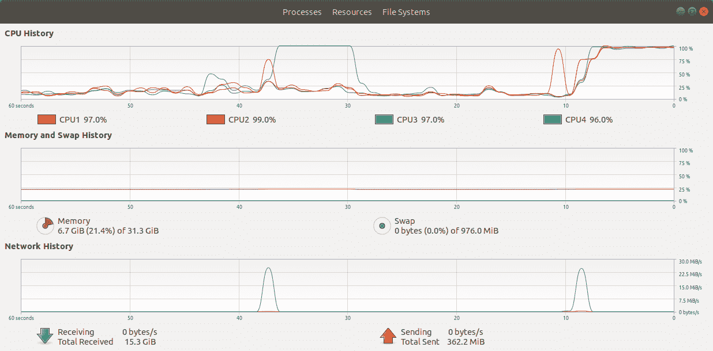

# 第三章：使用命令行

命令行是实际操作的地方。尽管有许多强大的图形界面工具，但命令行仍然是 DevOps 工作的主场。从 Python 中与你的 shell 环境交互，并创建 Python 命令行工具，在使用 Python 进行 DevOps 时都是必要的。

# 使用 Shell

Python 提供了与系统和 shell 交互的工具。你应该熟悉 `sys`、`os` 和 `subprocess` 模块，因为它们都是必不可少的工具。

## 使用 sys 模块与解释器交互

`sys` 模块提供了访问与 Python 解释器紧密相关的变量和方法。

###### 注意

在读取时有两种主流的字节解释方式。第一种 *little endian*，将每个后续字节解释为具有更高重要性（表示更大数字）。另一种 *big endian*，假设第一个字节具有最大重要性，并从那里开始移动。

你可以使用 `sys.byteorder` 属性来查看当前架构的字节顺序：

```py
In [1]: import sys

In [2]: sys.byteorder
Out[2]: 'little'
```

你可以使用 `sys.getsizeof` 来查看 Python 对象的大小。如果你处理有限内存，这将非常有用：

```py
In [3]: sys.getsizeof(1)
Out[3]: 28
```

如果你想要根据底层操作系统执行不同的行为，可以使用 `sys.platform` 进行检查：

```py
In [5]: sys.platform
Out[5]: 'darwin'
```

更常见的情况是你想要使用仅在特定版本的 Python 中可用的语言特性或模块。你可以使用 `sys.version_info` 来根据正在运行的 Python 解释器控制行为。在这里，我们为 Python 3.7 打印不同的消息，低于 3.7 的 Python 版本，以及低于 3 的 Python 版本：

```py
if sys.version_info.major < 3:
    print("You need to update your Python version")
elif sys.version_info.minor < 7:
    print("You are not running the latest version of Python")
else:
    print("All is good.")
```

当我们编写命令行工具时，我们稍后会更多地涵盖 `sys` 的使用。

## 使用 os 模块处理操作系统

你在 第二章 中看到了 `os` 模块用于处理文件系统。它还有一堆与操作系统相关的各种属性和函数。在 示例 3-1 中，我们展示了其中一些。

##### 示例 3-1\. os 模块示例

```py
In [1]: import os

In [2]: os.getcwd() 
Out[2]: '/Users/kbehrman/Google-Drive/projects/python-devops'

In [3]: os.chdir('/tmp') 

In [4]: os.getcwd()
Out[4]: '/private/tmp'

In [5]: os.environ.get('LOGLEVEL') 

In [6]: os.environ['LOGLEVEL'] = 'DEBUG' 

In [7]: os.environ.get('LOGLEVEL')
Out[7]: 'DEBUG'

In [8]: os.getlogin() 
Out[8]: 'kbehrman'
```


获取当前工作目录。


更改当前工作目录。


`os.environ` 保存了加载 `os` 模块时设置的环境变量。


这是设置和环境变量。该设置适用于从此代码生成的子进程。


这是在终端中生成此进程的用户登录信息。

`os` 模块的最常见用法是从环境变量中获取设置。这些设置可能是设置日志级别或诸如 API 密钥之类的秘密。

## 使用 subprocess 模块生成进程

在许多情况下，你需要从你的 Python 代码中运行应用程序外部的应用程序。这可能是内置的 shell 命令、Bash 脚本或任何其他命令行应用程序。为此，你可以生成一个新的*进程*（应用程序的实例）。当你想在 Python 中生成进程并在其中运行命令时，`subprocess` 模块是正确的选择。使用`subprocess`，你可以在 Python 中运行你喜欢的 shell 命令或其他命令行软件，并从中收集其输出。对于大多数用例，你应该使用`subprocess.run`函数来生成进程：

```py
In [1]: cp = subprocess.run(['ls','-l'],
                            capture_output=True,
                            universal_newlines=True)

In [2]: cp.stdout
Out[2]: 'total 96
         -rw-r--r--  1 kbehrman  staff     0 Apr 12 08:48 __init__.py
         drwxr-xr-x  5 kbehrman  staff   160 Aug 18 15:47 __pycache__
         -rw-r--r--  1 kbehrman  staff   123 Aug 13 12:13 always_say_it.py
         -rwxr-xr-x  1 kbehrman  staff  1409 Aug  8 15:36 argparse_example.py
         -rwxr-xr-x  1 kbehrman  staff   734 Aug 12 09:36 click_example.py
         -rwxr-xr-x  1 kbehrman  staff   538 Aug 13 10:41 fire_example.py
         -rw-r--r--  1 kbehrman  staff    41 Aug 18 15:17 foo_plugin_a.py
         -rw-r--r--  1 kbehrman  staff    41 Aug 18 15:47 foo_plugin_b.py
         -rwxr-xr-x  1 kbehrman  staff   335 Aug 10 12:36 simple_click.py
         -rwxr-xr-x  1 kbehrman  staff   256 Aug 13 09:21 simple_fire.py
         -rwxr-xr-x  1 kbehrman  staff   509 Aug  8 10:27 simple_parse.py
         -rwxr-xr-x  1 kbehrman  staff   502 Aug 18 15:11 simple_plugins.py
         -rwxr-xr-x  1 kbehrman  staff   850 Aug  6 14:44 sys_argv.py
         -rw-r--r--  1 kbehrman  staff   182 Aug 18 16:24 sys_example.py
'
```

`subprocess.run`函数在进程完成后返回`CompletedProcess`实例。在这种情况下，我们使用参数`-l`运行`ls` shell 命令来查看当前目录的内容。我们设置它来捕获`stdout`和`stderr`的输出，然后使用`cp.stdout`访问结果。如果我们在不存在的目录上运行我们的`ls`命令，导致返回错误，我们可以在`cp.stderr`中看到输出：

```py
In [3]: cp = subprocess.run(['ls','/doesnotexist'],
                            capture_output=True,
                            universal_newlines=True)

In [3]: cp.stderr
Out[3]: 'ls: /doesnotexist: No such file or directory\n'
```

通过使用`check`参数，你可以更好地集成错误处理。如果子进程报告错误，这将引发异常：

```py
In [23]: cp = subprocess.run(['ls', '/doesnotexist'],
                             capture_output=True,
                             universal_newlines=True,
                             check=True)
---------------------------------------------------------------------------
CalledProcessError                        Traceback (most recent call last)
<ipython-input-23-c0ac49c40fee> in <module>
----> 1 cp = subprocess.run(['ls', '/doesnotexist'],
                            capture_output=True,
                            universal_newlines=True,
                            check=True)

~/.pyenv/versions/3.7.0/lib/python3.7/subprocess.py ...
    466         if check and retcode:
    467             raise CalledProcessError(retcode, process.args,
--> 468                                      output=stdout, stderr=stderr)
    469     return CompletedProcess(process.args, retcode, stdout, stderr)
    470

CalledProcessError: Command '['ls', '/doesnotexist']' returned non-zero exit
```

这样，你就不必检查`stderr`以查找失败。你可以像处理其他 Python 异常一样处理来自子进程的错误。

# 创建命令行工具

在命令行上调用 Python 脚本的最简单方法是使用 Python 调用它。当你构建一个 Python 脚本时，顶级语句（不嵌套在代码块中）会在脚本被调用或导入时运行。如果你有一个希望在代码加载时运行的函数，你可以在顶级调用它：

```py
def say_it():
    greeting = 'Hello'
    target = 'Joe'
    message = f'{greeting} {target}'
    print(message)

say_it()
```

此函数在脚本在命令行上运行时运行：

```py
$ python always_say_it.py

Hello Joe
```

此外，当文件被导入时：

```py
In [1]: import always_say_it
Hello Joe
```

这种方法只适用于最简单的脚本。然而，这种方法的一个显著缺点是，如果你想将你的模块导入到其他 Python 模块中，代码会在导入时运行，而不是等待调用模块。导入你的模块的人通常希望控制其内容在何时被调用。你可以通过使用全局变量`*name*`来添加仅在从命令行调用时发生的功能。你已经看到，这个变量在导入时报告模块的名称。如果模块直接在命令行上调用，它将被设置为字符串`**main**`。命令行上运行的模块的约定是在最后一个块中测试这一点，并从该块运行特定于命令行的代码。要修改脚本，仅在命令行调用时自动运行函数，而不在导入时运行，请将函数调用放入测试之后的块中：

```py
def say_it():
    greeting = 'Hello'
    target = 'Joe'
    message = f'{greeting} {target}'
    print(message)

if __name__ == '__main__':
    say_it()
```

当你导入此函数时，此块不会运行，因为`__name__`变量反映了导入时的模块路径。然而，当直接运行模块时，它会运行：

```py
$ python say_it.py

Hello Joe
```

创建命令行工具的第一步是分离只有在命令行调用时才应运行的代码。下一步是接受命令行参数。除非您的工具只做一件事，否则需要接受命令以知道该做什么。此外，执行更复杂任务的命令行工具接受用于配置其工作方式的可选标志。请记住，这些命令和标志是任何使用您工具的人的*用户界面*（UI）。您需要考虑它们的易用性和可理解性。提供文档是使您的代码易于理解的重要部分。

## 使用 sys.argv

处理命令行参数的最简单和最基本的方法是使用 `sys` 模块的 `argv` 属性。该属性是在运行时传递给 Python 脚本的参数列表。如果脚本在命令行上运行，第一个参数是脚本的名称。列表中的其余项目是剩余的命令行参数，表示为字符串：

```py
#!/usr/bin/env python
"""
Simple command-line tool using sys.argv
"""
import sys

if __name__ == '__main__':
    print(f"The first argument:  '{sys.argv[0]}'")
    print(f"The second argument: '{sys.argv[1]}'")
    print(f"The third argument:  '{sys.argv[2]}'")
    print(f"The fourth argument: '{sys.argv[3]}'")
```

在命令行上运行并查看参数：

```py
$ ./sys_argv.py --a-flag some-value 13

The first argument:  './sys_argv.py'
The second argument: '--a-flag'
The third argument:  'some-value'
The fourth argument: '13'
```

您可以使用这些参数来编写自己的参数解析器。要查看这可能是什么样子，请查看 示例 3-2。

##### 示例 3-2\. 使用 sys.argv 进行解析

```py
#!/usr/bin/env python
"""
Simple command-line tool using sys.argv
"""
import sys

def say_it(greeting, target):
    message = f'{greeting} {target}'
    print(message)

if __name__ == '__main__': 
    greeting = 'Hello'  
    target = 'Joe'

    if '--help' in sys.argv:  
        help_message = f"Usage: {sys.argv[0]} --name <NAME> --greeting <GREETING>"
        print(help_message)
        sys.exit()  

    if '--name' in sys.argv:
        # Get position after name flag
        name_index = sys.argv.index('--name') + 1 
        if name_index < len(sys.argv): 
            name = sys.argv[name_index]

    if '--greeting' in sys.argv:
        # Get position after greeting flag
        greeting_index = sys.argv.index('--greeting') + 1
        if greeting_index < len(sys.argv):
            greeting = sys.argv[greeting_index]

    say_it(greeting, name) 
```


在这里，我们测试是否从命令行运行。


默认值设置在以下两行。


检查字符串 `--help` 是否在参数列表中。


在打印帮助消息后退出程序。


我们需要标志后面的值的位置，这应该是关联的值。


测试参数列表的长度是否足够。如果提供了标志但没有值，则长度不够。


调用函数时，使用参数修改的值。

示例 3-2 已经足够打印出一个简单的帮助消息并接受函数的参数：

```py
$ ./sys_argv.py --help
Usage: ./sys_argv.py --name <NAME> --greeting <GREETING>

$ ./sys_argv.py --name Sally --greeting Bonjour
Bonjour Sally
```

这种方法充满了复杂性和潜在的错误。 示例 3-2 无法处理许多情况。 如果用户拼错或者大小写不正确的标志，标志将被忽略且没有有用的反馈。 如果他们使用不受支持的命令或尝试使用多个值与标志，则再次忽略错误。 您应该了解`argv`解析方法，但除非您专门编写参数解析器，否则不要在任何生产代码中使用它。 幸运的是，有为创建命令行工具设计用户界面的模块和包。 这些包提供了在 shell 中运行时设计模块用户界面的框架。 三种流行的解决方案是*argparse*，*click*和*python-fire*。 这三者都包括设计必需参数，可选标志和显示帮助文档的方法。 第一个`argparse`是 Python 标准库的一部分，其他两个是需要单独安装的第三方包（使用`pip`安装）。

## 使用 argparse

`argparse`抽象了解析参数的许多细节。 使用它，您可以详细设计命令行用户界面，定义命令和标志以及它们的帮助消息。 它使用解析器对象的概念，您可以将命令和标志附加到其中。 然后解析器解析参数，您可以使用结果调用您的代码。 您使用`ArgumentParser`对象构建您的接口，这些对象为您解析用户输入：

```py
if __name__ == '__main__':
    parser = argparse.ArgumentParser(description='Maritime control')
```

您可以使用`add_argument`方法向解析器添加基于位置的命令或可选标志（参见示例 3-3）。 此方法的第一个参数是新参数（命令或标志）的名称。 如果名称以短横线开头，则将其视为可选标志参数； 否则将其视为位置依赖命令。 解析器创建一个解析后的参数对象，该对象具有您可以使用的属性来访问输入。 示例 3-3 是一个简单的程序，用于回显用户输入并展示`argparse`的基本工作原理。

##### 示例 3-3\. simple_parse.py

```py
#!/usr/bin/env python
"""
Command-line tool using argparse
"""
import argparse

if __name__ == '__main__':
    parser = argparse.ArgumentParser(description='Echo your input') 
    parser.add_argument('message',               
                        help='Message to echo')

    parser.add_argument('--twice', '-t',         
                        help='Do it twice',
                        action='store_true')     

    args = parser.parse_args()  

    print(args.message)    
    if args.twice:
        print(args.message)
```


创建解析器对象，并附上其文档消息。


添加一个基于位置的命令及其帮助消息。


添加一个可选参数。


将可选参数存储为布尔值。


使用解析器解析参数。


按名称访问参数值。 可选参数的名称已删除*--*。

当您使用`--twice`标志运行它时，输入消息会打印两次：

```py
$ ./simple_parse.py hello --twice
hello
hello
```

`argparse`根据您提供的帮助和描述文本自动设置帮助和使用消息：

```py
$ ./simple_parse.py  --help
usage: simple_parse.py [-h] [--twice] message

Echo your input

positional arguments:
  message      Message to echo

optional arguments:
  -h, --help   show this help message and exit
  --twice, -t  Do it twice
```

许多命令行工具使用嵌套的命令级别来分组控制命令区域。想想 `git`。它有顶层命令，比如 `git stash`，下面有单独的命令，比如 `git stash pop`。使用 `argparse`，你可以通过在主解析器下创建子解析器来创建子命令。你可以使用子解析器创建命令的层次结构。在 示例 3-4 中，我们实现了一个海事应用程序，其中有用于船只和水手的命令。我们向主解析器添加了两个子解析器；每个子解析器都有自己的命令。

##### 示例 3-4\\. argparse_example.py

```py
#!/usr/bin/env python
"""
Command-line tool using argparse
"""
import argparse

def sail():
    ship_name = 'Your ship'
    print(f"{ship_name} is setting sail")

def list_ships():
    ships = ['John B', 'Yankee Clipper', 'Pequod']
    print(f"Ships: {','.join(ships)}")

def greet(greeting, name):
    message = f'{greeting} {name}'
    print(message)

if __name__ == '__main__':
    parser = argparse.ArgumentParser(description='Maritime control') 

    parser.add_argument('--twice', '-t',   
                        help='Do it twice',
                        action='store_true')

    subparsers = parser.add_subparsers(dest='func') 

    ship_parser =  subparsers.add_parser('ships',  
                                         help='Ship related commands')
    ship_parser.add_argument('command', 
                             choices=['list', 'sail'])

    sailor_parser = subparsers.add_parser('sailors', 
                                          help='Talk to a sailor')
    sailor_parser.add_argument('name', 
                               help='Sailors name')
    sailor_parser.add_argument('--greeting', '-g',
                               help='Greeting',
                               default='Ahoy there')

    args = parser.parse_args()
    if args.func == 'sailors': 
        greet(args.greeting, args.name)
    elif args.command == 'list':
        list_ships()
    else:
        sail()
```


创建顶层解析器。


添加一个顶级参数，可以与这个解析器层次结构下的任何命令一起使用。


创建一个子解析器对象来保存子解析器。`dest` 是选择子解析器时使用的属性名称。


为 *ships* 添加一个子解析器。


为 *ships* 子解析器添加一个命令。`choices` 参数提供了命令的可能选择列表。


为 *sailors* 添加一个子解析器。


为 *sailors* 子解析器添加一个必需的位置参数。


通过检查 `func` 值来检查使用了哪个子解析器。

示例 3-4 有一个顶级可选参数 (`twice`) 和两个子解析器。每个子解析器都有自己的命令和标志。`argparse` 自动创建一个帮助消息的层次结构，并使用 `--help` 标志显示它们。顶级帮助命令包括子解析器和顶级 `twice` 参数都有文档记录：

```py
$ ./argparse_example.py --help
usage: argparse_example.py [-h] [--twice] {ships,sailors} ...

Maritime control

positional arguments:
  {ships,sailors}
    ships          Ship related commands
    sailors        Talk to a sailor

optional arguments:
  -h, --help       show this help message and exit
  --twice, -t      Do it twice
```

你可以使用命令后的 `help` 标志来深入探讨子命令（子解析器）。

```py
$ ./argparse_example.py ships --help
usage: argparse_example.py ships [-h] {list,sail}

positional arguments:
  {list,sail}

optional arguments:
  -h, --help   show this help message and exit
```

正如你所看到的，`argparse` 可以很好地控制你的命令行界面。你可以设计一个多层次的界面，并内置文档，有很多选项来微调你的设计。不过，这需要你付出很多工作，所以让我们看一些更简单的选项。

## 使用 click

`click` 包最初是为与 web 框架 `flask` 配合而开发的。它使用 Python *函数装饰器* 将命令行接口直接与你的函数绑定在一起。与 `argparse` 不同，`click` 直接将你的接口决策与代码的其余部分交织在一起。

这意味着你将你的标志和选项直接与它们公开的函数的参数绑定在一起。你可以使用 click 的 `command` 和 `option` 函数作为你的函数之前的装饰器，从你的函数中创建一个简单的命令行工具：

```py
#!/usr/bin/env python
"""
Simple Click example
"""
import click

@click.command()
@click.option('--greeting', default='Hiya', help='How do you want to greet?')
@click.option('--name', default='Tammy', help='Who do you want to greet?')
def greet(greeting, name):
    print(f"{greeting} {name}")

if __name__ == '__main__':
    greet()
```

`click.command` 表示应将函数公开给命令行访问。`click.option` 将参数添加到命令行，自动将其链接到同名函数参数（`--greeting` 对应 `greet` 和 `--name` 对应 `name`）。`click` 在后台做一些工作，使我们可以在主块中调用我们的 `greet` 方法，而不需要被 `options` 装饰器所覆盖的参数。

这些装饰器处理解析命令行参数，并自动生成帮助消息：

```py
$ ./simple_click.py --greeting Privet --name Peggy
Privet Peggy

$ ./simple_click.py --help
Usage: simple_click.py [OPTIONS]

Options:
  --greeting TEXT  How do you want to greet?
  --name TEXT      Who do you want to greet?
  --help           Show this message and exit.
```

您可以看到，使用 `click` 可以以比 `argparse` 更少的代码将函数暴露为命令行使用。您可以集中精力于代码的业务逻辑，而不是设计界面。

现在让我们看一个更复杂的示例，其中包含嵌套命令。使用 `click.group` 创建表示组的函数来嵌套命令。在 Example 3-5 中，我们使用 `argparse` 嵌套命令，其接口与 Example 3-4 中的接口非常相似。

##### 示例 3-5\. click_example.py

```py
#!/usr/bin/env python
"""
Command-line tool using argparse
"""
import click

@click.group() 
def cli(): 
    pass

@click.group(help='Ship related commands') 
def ships():
    pass

cli.add_command(ships) 

@ships.command(help='Sail a ship') 
def sail():
    ship_name = 'Your ship'
    print(f"{ship_name} is setting sail")

@ships.command(help='List all of the ships')
def list_ships():
    ships = ['John B', 'Yankee Clipper', 'Pequod']
    print(f"Ships: {','.join(ships)}")

@cli.command(help='Talk to a sailor')  
@click.option('--greeting', default='Ahoy there', help='Greeting for sailor')
@click.argument('name')
def sailors(greeting, name):
    message = f'{greeting} {name}'
    print(message)

if __name__ == '__main__':
    cli()  
```


创建一个顶级组，其他组和命令将驻留在其中。


创建一个函数作为顶级组的操作。`click.group` 方法将该函数转换为一个组。


创建一个用于容纳 `ships` 命令的组。


将 `ships` 组作为顶级组的一个命令添加。请注意，`cli` 函数现在是一个具有 `add_command` 方法的组。


向 `ships` 组添加一个命令。注意，使用了 `ships.command` 而不是 `click.command`。


向 `cli` 组添加一个命令。


调用顶级组。

`click` 生成的顶级帮助消息如下所示：

```py
./click_example.py --help
Usage: click_example.py [OPTIONS] COMMAND [ARGS]...

Options:
  --help  Show this message and exit.

Commands:
  sailors  Talk to a sailor
  ships    Ship related commands
```

您可以像这样查看子组的帮助：

```py
$ ./click_example.py ships --help
Usage: click_example.py ships [OPTIONS] COMMAND [ARGS]...

  Ship related commands

Options:
  --help  Show this message and exit.

Commands:
  list-ships  List all of the ships
  sail        Sail a ship
```

如果您比较 Example 3-4 和 Example 3-5，您会看到使用 `argparse` 和 `click` 的一些区别。在这些示例中，`click` 方法确实需要的代码量少得多，几乎只有一半。用户界面（UI）代码穿插在整个程序中；这在创建纯粹作为组的函数时尤为重要。如果您有一个复杂的程序和复杂的界面，应尽可能将不同的功能隔离开来。通过这样做，您可以更轻松地测试和调试单独的组件。在这种情况下，您可能会选择使用 `argparse` 来保持界面代码的独立性。

## fire

现在，让我们更进一步，用尽量少的 UI 代码制作一个命令行工具。`fire`包使用你的代码的内省来自动创建接口。如果你有一个简单的函数想要暴露，可以将其作为参数调用`fire.Fire`：

```py
#!/usr/bin/env python
"""
Simple fire example
"""
import fire

def greet(greeting='Hiya', name='Tammy'):
    print(f"{greeting} {name}")

if __name__ == '__main__':
    fire.Fire(greet)
```

然后，`fire`根据方法的名称和参数创建 UI：

```py
$ ./simple_fire.py --help

NAME
    simple_fire.py

SYNOPSIS
    simple_fire.py <flags>

FLAGS
    --greeting=GREETING
    --name=NAME
```

在简单情况下，通过不带参数调用`fire`可以自动暴露多个方法：

```py
#!/usr/bin/env python
"""
Simple fire example
"""
import fire

def greet(greeting='Hiya', name='Tammy'):
    print(f"{greeting} {name}")

def goodbye(goodbye='Bye', name='Tammy'):
    print(f"{goodbye} {name}")

if __name__ == '__main__':
    fire.Fire()
```

`fire`从每个函数创建命令并自动记录文档：

```py
$ ./simple_fire.py --help
INFO: Showing help with the command 'simple_fire.py -- --help'.

NAME
    simple_fire.py

SYNOPSIS
    simple_fire.py GROUP | COMMAND

GROUPS
    GROUP is one of the following:

     fire
       The Python fire module.

COMMANDS
    COMMAND is one of the following:

     greet

     goodbye
(END)
```

如果你试图理解别人的代码或调试自己的代码，这真的非常方便。通过额外的一行代码，你就可以与模块的所有函数进行命令行交互。这非常强大。因为`fire`使用程序本身的结构来确定接口，它甚至比`argparse`或`click`更与你的非接口代码紧密相关。要模仿我们的巢状命令接口，你需要定义具有要暴露的接口结构的类。要了解一种方法，请查看示例 3-6。

##### 示例 3-6\. fire_example.py

```py
#!/usr/bin/env python
"""
Command-line tool using fire
"""
import fire

class Ships(): 
    def sail(self):
        ship_name = 'Your ship'
        print(f"{ship_name} is setting sail")

    def list(self):
        ships = ['John B', 'Yankee Clipper', 'Pequod']
        print(f"Ships: {','.join(ships)}")

def sailors(greeting, name): 
    message = f'{greeting} {name}'
    print(message)

class Cli(): 

    def __init__(self):
        self.sailors = sailors
        self.ships = Ships()

if __name__ == '__main__':
    fire.Fire(Cli) 
```


为船只命令定义一个类。


`sailors`没有子命令，因此可以定义为一个函数。


定义一个充当顶级组的类。将`sailors`函数和`Ships`作为类的属性添加。


在充当顶层组的类上调用`fire.Fire`：

自动生成的顶层文档代表`Ships`类作为一个组，`sailors`命令作为一个命令：

```py
$ ./fire_example.py

NAME
    fire_example.py

SYNOPSIS
    fire_example.py GROUP | COMMAND

GROUPS
    GROUP is one of the following:

     ships

COMMANDS
    COMMAND is one of the following:

     sailors
(END)
```

展示代表附加到`Ships`类的方法的命令的`ships`组文档：

```py
$ ./fire_example.py ships --help
INFO: Showing help with the command 'fire_example.py ships -- --help'.

NAME
    fire_example.py ships

SYNOPSIS
    fire_example.py ships COMMAND

COMMANDS
    COMMAND is one of the following:

     list

     sail
(END)
```

`sailors`函数的参数转换为位置参数：

```py
$ ./fire_example.py sailors --help
INFO: Showing help with the command 'fire_example.py sailors -- --help'.

NAME
    fire_example.py sailors

SYNOPSIS
    fire_example.py sailors GREETING NAME

POSITIONAL ARGUMENTS
    GREETING
    NAME

NOTES
    You can also use flags syntax for POSITIONAL ARGUMENTS
(END)
```

按预期调用命令和子命令：

```py
$ ./fire_example.py ships sail
Your ship is setting sail
chapter3$ ./fire_example.py ships list
Ships: John B,Yankee Clipper,Pequod
chapter3$ ./fire_example.py sailors Hiya Karl
Hiya Karl
```

`fire`的一个令人兴奋的特性是能够轻松进入交互模式。通过使用`--interactive`标志，`fire`打开一个带有你脚本中对象和函数的 IPython shell：

```py
$ ./fire_example.py sailors Hiya Karl -- --interactive
Hiya Karl
Fire is starting a Python REPL with the following objects:
Modules: fire
Objects: Cli, Ships, component, fire_example.py, result, sailors, self, trace

Python 3.7.0 (default, Sep 23 2018, 09:47:03)
Type 'copyright', 'credits' or 'license' for more information
IPython 7.5.0 -- An enhanced Interactive Python. Type '?' for help.
 ---------------------------------------------------------------------------
In [1]: sailors
Out[1]: <function __main__.sailors(greeting, name)>

In [2]: sailors('hello', 'fred')
hello fred
```

在这里，我们在交互模式下运行海事程序的`sailors`命令。一个 IPython shell 打开，你可以访问`sailors`函数。这种交互模式与使用`fire`暴露对象的简便性结合使用，使其成为调试和介绍新代码的合适工具。

现在你已经使用命令行工具构建库的全套，从非常实用的`argparse`，到不那么冗长的`click`，最后到极简的`fire`。那么你应该使用哪个？对于大多数用例，我们推荐使用`click`。它平衡了简易性和控制性。在需要将 UI 代码与业务逻辑分离的复杂界面情况下，`argparse`是不二之选。此外，如果需要快速访问没有命令行接口的代码，`fire`适合你。

## 实现插件

一旦实现了应用程序的命令行用户界面，你可能想考虑一个插件系统。插件是由程序用户提供的代码片段，用于扩展功能。插件系统被用于各种应用程序中，从像 Autodesk 的 Maya 这样的大型应用到像 Flask 这样的最小的 Web 框架。你可以编写一个工具，处理文件系统的遍历，并允许用户提供插件来操作其内容。任何插件系统的关键部分都是插件发现。你的程序需要知道哪些插件是可用的，以加载和运行。

##### 示例 3-7\. simple_plugins.py

```py
#!/usr/bin/env python
import fire
import pkgutil
import importlib

def find_and_run_plugins(plugin_prefix):
    plugins = {}

    # Discover and Load Plugins
    print(f"Discovering plugins with prefix: {plugin_prefix}")
    for _, name, _ in  pkgutil.iter_modules(): 
        if name.startswith(plugin_prefix): 
            module = importlib.import_module(name) 
            plugins[name] = module

    # Run Plugins
    for name, module in plugins.items():
        print(f"Running plugin {name}")
        module.run()  

if __name__ == '__main__':
    fire.Fire()
```


`pkgutil.iter_modules` 返回当前`sys.path`中所有可用的模块。


检查模块是否使用了我们的插件前缀。


使用`importlib`加载模块，将其保存在后续使用的`dict`中。


调用插件上的`run`方法。

编写供应用于示例 3-7 的插件就像提供模块一样简单，这些模块的名称使用共享前缀，并且功能通过名为`run`的方法访问。如果你编写两个文件，使用前缀`foo_plugin`并且具有各自的运行方法：

```py
def run():
    print("Running plugin A")
```

```py
def run():
    print("Running plugin B")
```

你可以通过我们的插件应用程序发现并运行它们：

```py
$ ./simple_plugins.py find_and_run_plugins foo_plugin
Running plugin foo_plugin_a
Running plugin A
Running plugin foo_plugin_b
Running plugin B
```

你可以轻松扩展这个简单的示例，为你的应用程序创建插件系统。

# 案例研究：用命令行工具为 Python 添加涡轮增压

现在是编写代码的绝佳时机；一点点代码可以做很多事情。单个函数就能实现令人难以置信的功能。由于 GPU、机器学习、云计算和 Python 的推广，创建“涡轮增压”命令行工具变得轻而易举。将其视为从基本内燃发动机升级到喷气发动机的代码升级基本配方。升级的基本配方是什么？一个函数，一些强大的逻辑，最后，一个装饰器将其路由到命令行。

编写和维护传统的 GUI 应用程序 —— 无论是 Web 还是桌面 —— 都是一项枯燥无味的任务。一切都始于最好的意图，但很快可能变成一个压垮灵魂、耗时紧张的折磨过程，最后你会问自己，为什么最初会认为成为程序员是个好主意呢？为什么你要运行那个基本上将 1970 年代技术 —— 关系数据库 —— 自动化为一系列 Python 文件的 Web 框架设置实用程序呢？老式的 Ford Pinto 汽车尾部爆炸的汽油箱比你的 Web 框架还有新技术。一定有更好的方式来谋生。

答案很简单：停止编写 Web 应用程序，转而编写具有喷气动力的命令行工具。以下各节讨论的增压命令行工具专注于快速结果与最少代码行。它们可以做到像从数据中学习（机器学习）、使你的代码运行快两千倍，最重要的是，生成彩色的终端输出。

这里是将用于制作几个解决方案的原始成分：

+   Click 框架

+   Python CUDA 框架

+   Numba 框架

+   Scikit-learn 机器学习框架

## 使用 Numba 即时编译器（JIT）

Python 因其本质上是脚本语言而声名狼藉，因其性能慢而著称。解决这个问题的一种方法是使用 Numba 即时编译器（JIT）。让我们看看这段代码是什么样子的。

首先，使用一个定时装饰器来掌握函数的运行时：

```py
def timing(f):
    @wraps(f)
    def wrap(*args, **kwargs):
        ts = time()
        result = f(*args, **kwargs)
        te = time()
        print(f"fun: {f.__name__}, args: [{args}, {kwargs}] took: {te-ts} sec")
        return result
    return wrap
```

接下来，添加一个 `numba.jit` 装饰器，使用 `nopython` 关键字参数并将其设置为 `True`。这将确保代码将由 JIT 而不是常规 Python 运行。

```py
@timing
@numba.jit(nopython=True)
def expmean_jit(rea):
    """Perform multiple mean calculations"""

    val = rea.mean() ** 2
    return val
```

当你运行它时，可以看到通过命令行工具同时运行了 `jit` 和常规版本：

```py
$ python nuclearcli.py jit-test
Running NO JIT
func:'expmean' args:[(array([[1.0000e+00, 4.2080e+05, 2350e+05, ...,
                                  1.0543e+06, 1.0485e+06, 1.0444e+06],
       [2.0000e+00, 5.4240e+05, 5.4670e+05, ...,
              1.5158e+06, 1.5199e+06, 1.5253e+06],
       [3.0000e+00, 7.0900e+04, 7.1200e+04, ...,
              1.1380e+05, 1.1350e+05, 1.1330e+05],
       ...,
       [1.5277e+04, 9.8900e+04, 9.8100e+04, ...,
              2.1980e+05, 2.2000e+05, 2.2040e+05],
       [1.5280e+04, 8.6700e+04, 8.7500e+04, ...,
              1.9070e+05, 1.9230e+05, 1.9360e+05],
       [1.5281e+04, 2.5350e+05, 2.5400e+05, ..., 7.8360e+05, 7.7950e+05,
        7.7420e+05]], dtype=float32),), {}] took: 0.0007 sec
$ python nuclearcli.py jit-test --jit
Running with JIT
func:'expmean_jit' args:[(array([[1.0000e+00, 4.2080e+05, 4.2350e+05, ...,
                                     0543e+06, 1.0485e+06, 1.0444e+06],
       [2.0000e+00, 5.4240e+05, 5.4670e+05, ..., 1.5158e+06, 1.5199e+06,
        1.5253e+06],
       [3.0000e+00, 7.0900e+04, 7.1200e+04, ..., 1.1380e+05, 1.1350e+05,
        1.1330e+05],
       ...,
       [1.5277e+04, 9.8900e+04, 9.8100e+04, ..., 2.1980e+05, 2.2000e+05,
        2.2040e+05],
       [1.5280e+04, 8.6700e+04, 8.7500e+04, ..., 1.9070e+05, 1.9230e+05,
        1.9360e+05],
       [1.5281e+04, 2.5350e+05, 2.5400e+05, ..., 7.8360e+05, 7.7950e+05,
@click.option('--jit/--no-jit', default=False)
        7.7420e+05]], dtype=float32),), {}] took: 0.2180 sec
```

这是如何工作的？只需几行代码就可以进行这个简单的切换：

```py
@cli.command()
def jit_test(jit):
    rea = real_estate_array()
    if jit:
        click.echo(click.style('Running with JIT', fg='green'))
        expmean_jit(rea)
    else:
        click.echo(click.style('Running NO JIT', fg='red'))
        expmean(rea)
```

在某些情况下，JIT 版本可以使代码运行速度提高数千倍，但基准测试非常关键。另一个需要指出的是这一行：

```py
click.echo(click.style('Running with JIT', fg='green'))
```

这个脚本允许生成彩色的终端输出，当创建复杂工具时非常有用。

## 使用 CUDA Python 在 GPU 上运行

另一种加速代码的方式是直接在 GPU 上运行它。这个示例需要在支持 CUDA 的机器上运行。这是代码的样子：

```py
@cli.command()
def cuda_operation():
    """Performs Vectorized Operations on GPU"""

    x = real_estate_array()
    y = real_estate_array()

    print("Moving calculations to GPU memory")
    x_device = cuda.to_device(x)
    y_device = cuda.to_device(y)
    out_device = cuda.device_array(
        shape=(x_device.shape[0],x_device.shape[1]), dtype=np.float32)
    print(x_device)
    print(x_device.shape)
    print(x_device.dtype)

    print("Calculating on GPU")
    add_ufunc(x_device,y_device, out=out_device)

    out_host = out_device.copy_to_host()
    print(f"Calculations from GPU {out_host}")
```

需要指出的是，如果先将 Numpy 数组移动到 GPU，然后在 GPU 上执行向量化函数，完成工作后再将数据从 GPU 移回。通过使用 GPU，代码可能会有显著的改进，这取决于它正在运行的内容。命令行工具的输出如下所示：

```py
$ python nuclearcli.py cuda-operation
Moving calculations to GPU memory
<numba.cuda.cudadrv.devicearray.DeviceNDArray object at 0x7f01bf6ccac8>
(10015, 259)
float32
Calculating on GPU
Calculcations from GPU [
 [2.0000e+00 8.4160e+05 8.4700e+05 ... 2.1086e+06 2.0970e+06 2.0888e+06]
 [4.0000e+00 1.0848e+06 1.0934e+06 ... 3.0316e+06 3.0398e+06 3.0506e+06]
 [6.0000e+00 1.4180e+05 1.4240e+05 ... 2.2760e+05 2.2700e+05 2.2660e+05]
 ...
 [3.0554e+04 1.9780e+05 1.9620e+05 ... 4.3960e+05 4.4000e+05 4.4080e+05]
 [3.0560e+04 1.7340e+05 1.7500e+05 ... 3.8140e+05 3.8460e+05 3.8720e+05]
 [3.0562e+04 5.0700e+05 5.0800e+05 ... 1.5672e+06 1.5590e+06 1.5484e+06]
]
```

## 使用 Numba 运行真正的多核多线程 Python

Python 的一个常见性能问题是缺乏真正的多线程性能。这也可以通过 Numba 来解决。以下是一些基本操作的示例：

```py
@timing
@numba.jit(parallel=True)
def add_sum_threaded(rea):
    """Use all the cores"""

    x,_ = rea.shape
    total = 0
    for _ in numba.prange(x):
        total += rea.sum()
        print(total)

@timing
def add_sum(rea):
    """traditional for loop"""

    x,_ = rea.shape
    total = 0
    for _ in numba.prange(x):
        total += rea.sum()
        print(total)

@cli.command()
@click.option('--threads/--no-jit', default=False)
def thread_test(threads):
    rea = real_estate_array()
    if threads:
        click.echo(click.style('Running with multicore threads', fg='green'))
        add_sum_threaded(rea)
    else:
        click.echo(click.style('Running NO THREADS', fg='red'))
        add_sum(rea)
```

注意，并行版本的关键区别在于它使用 `@numba.jit(parallel=True)` 和 `numba.prange` 来为迭代生成线程。正如你在图 3-1 中所看到的，机器上的所有 CPU 都被充分利用，但当几乎相同的代码运行时没有并行化，它只使用一个核心。



###### 图 3-1。使用所有核心

```py
$ python nuclearcli.py thread-test
$ python nuclearcli.py thread-test --threads
```

## KMeans 聚类

另一个可以通过命令行工具完成的强大功能是机器学习。在下面的示例中，仅使用几行代码就创建了一个 KMeans 聚类函数。这将一个 Pandas DataFrame 聚类成默认的三个集群：

```py
def kmeans_cluster_housing(clusters=3):
    """Kmeans cluster a dataframe"""
    url = "https://raw.githubusercontent.com/noahgift/\
 socialpowernba/master/data/nba_2017_att_val_elo_win_housing.csv"
    val_housing_win_df =pd.read_csv(url)
    numerical_df =(
        val_housing_win_df.loc[:,["TOTAL_ATTENDANCE_MILLIONS", "ELO",
        "VALUE_MILLIONS", "MEDIAN_HOME_PRICE_COUNTY_MILLIONS"]]
    )
    #scale data
    scaler = MinMaxScaler()
    scaler.fit(numerical_df)
    scaler.transform(numerical_df)
    #cluster data
    k_means = KMeans(n_clusters=clusters)
    kmeans = k_means.fit(scaler.transform(numerical_df))
    val_housing_win_df['cluster'] = kmeans.labels_
    return val_housing_win_df
```

通过传入另一个数字（如下所示），可以更改集群数量，使用 `click`：

```py
@cli.command()
@click.option("--num", default=3, help="number of clusters")
def cluster(num):
    df = kmeans_cluster_housing(clusters=num)
    click.echo("Clustered DataFrame")
    click.echo(df.head())
```

最后，下面显示了带有集群分配的 Pandas DataFrame 的输出。注意它现在有了一个列作为集群分配：

```py
$ python -W nuclearcli.py cluster
```

```py
Clustered DataFrame
               TEAM  GMS    ...         COUNTY   cluster
0     Chicago Bulls   41    ...           Cook         0
1  Dallas Mavericks   41    ...         Dallas         0
2  Sacramento Kings   41    ...     Sacremento         1
3        Miami Heat   41    ...     Miami-Dade         0
4   Toronto Raptors   41    ...    York-County         0

[5 rows x 12 columns]
```

```py
$ python -W nuclearcli.py cluster --num 2
```

```py
Clustered DataFrame
               TEAM  GMS     ...         COUNTY   cluster
0     Chicago Bulls   41     ...           Cook         1
1  Dallas Mavericks   41     ...         Dallas         1
2  Sacramento Kings   41     ...     Sacremento         0
3        Miami Heat   41     ...     Miami-Dade         1
4   Toronto Raptors   41     ...    York-County         1

[5 rows x 12 columns]
```

# 练习

+   使用 `sys` 编写一个脚本，仅在从命令行运行时才打印*命令行*。

+   使用 `click` 创建一个命令行工具，它接受一个名称作为参数，并在名称不以 *p* 开头时打印它。

+   使用 `fire` 从命令行访问现有 Python 脚本中的方法。
