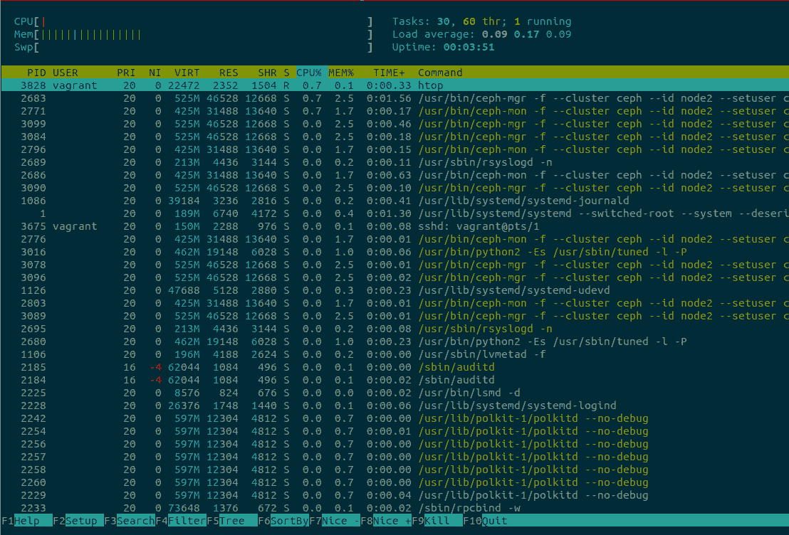

# 第四章：有用的 Linux 实用工具

当他开始职业生涯时，命令行及其工具是 Alfredo 感到亲密的原因之一。在一家中型公司担任系统管理员时，他的第一份工作涉及管理一切与 Linux 相关的事务。小型 IT 部门专注于 Windows 服务器和桌面系统，他们非常不喜欢使用命令行。有一次，IT 管理员告诉他，他了解图形用户界面（GUI）、安装实用工具以及一般工具来解决问题：*“我不是程序员，如果没有 GUI，我就无法使用它。”*

Alfredo 被聘为承包商，帮助公司管理几台 Linux 服务器。当时，[Subversion (SVN) 是版本控制的热门工具](https://subversion.apache.org)，开发人员依赖这一单一的 SVN 服务器来推动他们的工作。与使用中心化身份服务器不同，由两个*域控制器*提供，它使用了一个基于文本的认证系统，将用户映射到代表密码的哈希值。这意味着用户名不一定映射到域控制器中的用户名，并且密码可以是任意的。通常情况下，开发人员会要求重置密码，然后有人必须编辑这个文本文件来更新哈希值。项目经理要求 Alfredo 将 SVN 的认证整合到域控制器（微软的 Active Directory）中。他第一个问题是为什么 IT 部门之前没有做这件事？*“他们说这是不可能的，但是 Alfredo，这是谎言，SVN 可以与 Active Directory 整合。”*

他从未使用过像 Active Directory 这样的认证服务，对 SVN 的理解也很浅薄，但他决心要让这个工作成功。Alfredo 开始阅读关于 SVN 和 Active Directory 的所有信息，利用一个运行 SVN 服务器的虚拟机进行尝试，并努力让这种认证机制工作起来。他花了大约两周时间研究所有相关的部分，并最终成功让它投入生产。这感觉非常强大；他掌握了独特的知识，现在完全可以负责这个系统。IT 管理员以及整个部门都非常激动。Alfredo 尝试与他人分享这些新获得的知识，但总是遇到借口：*“没时间”，“太忙了”，“其他优先事项”，以及“也许下周吧。”*

技术人员的一个恰当描述是：“知识工作者”。你的好奇心和对知识的不断追求将继续提升你以及你所工作的环境。永远不要让同事（或像阿尔弗雷多那样整个 IT 部门）成为改进系统的障碍。如果有学习新东西的机会，一定要抓住！最糟糕的情况是，你获得了也许不经常使用但却可能改变你职业生涯的知识。

Linux 确实有桌面环境，但它真正的力量来自理解和使用命令行，最终，通过扩展它。当没有现成的工具解决问题时，经验丰富的 DevOps 人员将制定自己的解决方案。通过组合核心部件来提出解决方案的这种能力非常强大，最终在那个工作中感到有效率是可以完成任务而不必安装现成软件来修复问题。

本章将介绍 Shell 中的一些常见模式，并包括一些有用的 Python 命令，这些命令应该增强与机器交互的能力。我们发现创建别名和“一行代码”是工作中最有趣的事情之一，有时它们非常有用，最终成为插件或独立的软件。

# 磁盘工具

系统中有几种不同的工具可用于获取设备信息。其中许多具有功能重叠，一些具有交互式会话以处理磁盘操作，如`fdisk`和`parted`。

精通磁盘工具非常重要，不仅可以检索信息和操作分区，还能准确地衡量性能。特别是性能衡量是一个难点。对于“如何衡量设备性能？”这个问题，最好的答案是“取决于”，因为很难为特定的度量标准做到这一点。

## 性能测量

如果我们不得不在一个无法访问互联网或我们无法控制并因此无法安装软件包的服务器上工作，那么我们将不得不说`dd`工具（应该在所有主要的 Linux 发行版上都可以找到）将帮助提供一些答案。如果可能的话，可以与`iostat`配合使用，以区分是哪个命令在占用设备，哪个在获取报告。

正如一位经验丰富的性能工程师所说，这取决于测量的对象和方式。例如，`dd`是单线程的并且有其限制，比如不能进行多个随机读写；它还测量吞吐量而不是每秒的输入/输出操作数（IOPS）。你在测量什么？吞吐量还是 IOPS？

###### 注意

关于这些示例，需要提个醒。它们可能会破坏你的系统，请不要盲目跟随，并确保使用可以被清除的设备。

这个简单的单行命令将运行 `dd` 来获取一个全新设备（在本例中为 */dev/sdc*）的一些数据：

```py
$ dd if=/dev/zero of=/dev/sdc count=10 bs=100M
10+0 records in
10+0 records out
1048576000 bytes (1.0 GB, 1000 MiB) copied, 1.01127 s, 1.0 GB/s
```

它以 1GB/s 的速率写入 100 兆字节的 10 条记录。这是吞吐量。通过 `dd` 获得 IOPS 的简单方法是使用 `iostat`。在此示例中，`iostat` 仅在受 `dd` 猛烈攻击的设备上运行，使用 `-d` 标志仅提供设备信息，并以一秒的间隔运行：

```py
$ iostat -d /dev/sdc 1

Device             tps    kB_read/s    kB_wrtn/s    kB_read    kB_wrtn
sdc            6813.00         0.00   1498640.00          0    1498640

Device             tps    kB_read/s    kB_wrtn/s    kB_read    kB_wrtn
sdc            6711.00         0.00   1476420.00          0    1476420
```

`iostat` 输出将每秒重复一次，直到发出 `Ctrl-C` 取消操作。输出中的第二列是 `tps`，代表每秒事务数，等同于 IOPS。一个更好的可视化输出的方法是在每次运行时清除终端：

```py
$ while true; do clear && iostat -d /dev/sdc && sleep 1; done
```

### 使用 fio 进行准确的测试

如果 `dd` 和 `iostat` 不足够，性能测试中最常用的工具是 `fio`。它可以帮助澄清设备在读取或写入密集环境中的性能行为（甚至可以调整读取与写入的百分比）。

`fio` 的输出非常详细。下面的示例修剪了输出以突出显示读写操作的 IOPS：

```py
$ fio --name=sdc-performance --filename=/dev/sdc --ioengine=libaio \
  --iodepth=1 --rw=randrw --bs=32k --direct=0 --size=64m
sdc-performance: (g=0): rw=randwrite, bs=(R) 32.0KiB-32.0KiB,
(W) 32.0KiB-32.0KiB, (T) 32.0KiB-32.0KiB, ioengine=libaio, iodepth=1
fio-3.1
Starting 1 process

sdc-performance: (groupid=0, jobs=1): err= 0: pid=2879:
   read: IOPS=1753, BW=54.8MiB/s (57.4MB/s)(31.1MiB/567msec)
...
   iops        : min= 1718, max= 1718, avg=1718.00, stdev= 0.00, samples=1
  write: IOPS=1858, BW=58.1MiB/s (60.9MB/s)(32.9MiB/567msec)
...
   iops        : min= 1824, max= 1824, avg=1824.00, stdev= 0.00, samples=1
```

示例中使用的标志命名了*作业* `sdc-performance`，直接指向 */dev/sdc* 设备（将需要超级用户权限），使用本地 Linux 异步 I/O 库，将 `iodepth` 设置为 `1`（一次发送的顺序 I/O 请求数），并定义了 32 千字节的缓冲区大小的随机读写操作，使用了带缓冲的 I/O（可以设置为 1 以使用无缓冲 I/O），作用于 64 兆字节文件。这是一个非常长的命令！

`fio` 工具有大量额外选项，可以帮助几乎所有需要准确 IOPS 测量的情况。例如，它可以跨多个设备进行测试，进行一些*I/O 预热*，甚至为测试设置 I/O 阈值，以防超出定义的限制。最后，命令行中的许多选项可以使用 INI 风格的文件进行配置，从而可以很好地脚本化作业执行。

## 分区

我们倾向于使用交互式会话的 `fdisk` 来创建分区，但在某些情况下，如大分区（两 TB 或更大），`fdisk` 可能不太适用。在这些情况下，您应该使用 `parted` 作为备选方案。

一个快速的交互式会话展示如何使用 `fdisk` 创建一个带有默认起始值和四吉比字节大小的主分区。最后使用 `w` 键来*写入*更改：

```py
$ sudo fdisk /dev/sds

Command (m for help): n
Partition type:
   p   primary (0 primary, 0 extended, 4 free)
   e   extended
Select (default p): p
Partition number (1-4, default 1):
First sector (2048-22527999, default 2048):
Using default value 2048
Last sector, +sectors or +size{K,M,G} (2048-22527999, default 22527999): +4G
Partition 1 of type Linux and of size 4 GiB is set

Command (m for help): w
The partition table has been altered!

Calling ioctl() to re-read partition table.
Syncing disks.
```

`parted` 以不同的界面实现相同功能：

```py
$ sudo parted /dev/sdaa
GNU Parted 3.1
Using /dev/sdaa
Welcome to GNU Parted! Type 'help' to view a list of commands.
(parted) mklabel
New disk label type? gpt
(parted) mkpart
Partition name?  []?
File system type?  [ext2]?
Start? 0
End? 40%
```

最后，您可以使用几个命令实现在命令行上以编程方式创建分区，而无需任何交互提示：

```py
$ parted --script /dev/sdaa mklabel gpt
$ parted --script /dev/sdaa mkpart primary 1 40%
$ parted --script /dev/sdaa print
Disk /dev/sdaa: 11.5GB
Sector size (logical/physical): 512B/512B
Partition Table: gpt
Disk Flags:

Number  Start   End     Size    File system  Name     Flags
 1      1049kB  4614MB  4613MB
```

## 检索特定设备信息

有时候需要设备的特定信息时，要么使用`lsblk`要么使用`blkid`更合适。`fdisk`在没有超级用户权限时无法正常工作。在这里，`fdisk`列出了有关*/dev/sda*设备的信息：

```py
$ fdisk -l /dev/sda
fdisk: cannot open /dev/sda: Permission denied

$ sudo fdisk -l /dev/sda

Disk /dev/sda: 42.9 GB, 42949672960 bytes, 83886080 sectors
Units = sectors of 1 * 512 = 512 bytes
Sector size (logical/physical): 512 bytes / 512 bytes
I/O size (minimum/optimal): 512 bytes / 512 bytes
Disk label type: dos
Disk identifier: 0x0009d9ce

   Device Boot      Start         End      Blocks   Id  System
/dev/sda1   *        2048    83886079    41942016   83  Linux
```

`blkid`类似，它也需要超级用户权限：

```py
$ blkid /dev/sda

$ sudo blkid /dev/sda
/dev/sda: PTTYPE="dos"
```

`lsblk`允许获取信息而无需更高的权限，并提供相同的信息输出：

```py
$ lsblk /dev/sda
NAME   MAJ:MIN RM SIZE RO TYPE MOUNTPOINT
sda      8:0    0  40G  0 disk
└─sda1   8:1    0  40G  0 part /
$ sudo lsblk /dev/sda
NAME   MAJ:MIN RM SIZE RO TYPE MOUNTPOINT
sda      8:0    0  40G  0 disk
└─sda1   8:1    0  40G  0 part /
```

此命令使用`-p`标志进行低级设备探测，*非常彻底*，应该会为设备提供足够好的信息：

```py
$ blkid -p /dev/sda1
UUID="8e4622c4-1066-4ea8-ab6c-9a19f626755c" TYPE="xfs" USAGE="filesystem"
PART_ENTRY_SCHEME="dos" PART_ENTRY_TYPE="0x83" PART_ENTRY_FLAGS="0x80"
PART_ENTRY_NUMBER="1" PART_ENTRY_OFFSET="2048" PART_ENTRY_SIZE="83884032"
```

`lsblk`有一些默认属性要查找：

```py
$ lsblk -P /dev/nvme0n1p1
NAME="nvme0n1p1" MAJ:MIN="259:1" RM="0" SIZE="512M" RO="0" TYPE="part"
```

但它还允许您设置特定的标志以请求特定的属性：

```py
lsblk -P -o SIZE /dev/nvme0n1p1
SIZE="512M"
```

以这种方式访问属性使得编写脚本和从 Python 端访问变得容易。

# 网络工具

随着越来越多的服务器需要互联，网络工具不断改进。本节中的许多实用程序涵盖了像安全外壳（SSH）隧道这样的有用单行命令，但有些则深入到测试网络性能的细节，例如使用 Apache Bench 工具。

## SSH 隧道

您是否尝试过访问在远程服务器上运行但除了通过 SSH 无法访问的 HTTP 服务？当 HTTP 服务已启用但不需要公开访问时会出现这种情况。我们上次看到这种情况发生是在生产实例的[RabbitMQ](https://www.rabbitmq.com)上启用了管理插件，它在端口 15672 上启动了 HTTP 服务。服务没有暴露出来是有道理的；没有必要公开它，因为它很少被使用，而且可以使用 SSH 的隧道功能。

这通过创建与远程服务器的 SSH 连接，然后将远程端口（在我的情况下是 15672）转发到源机器上的本地端口来工作。远程机器具有自定义的 SSH 端口，这略微复杂化了命令。命令如下所示：

```py
$ ssh -L 9998:localhost:15672 -p 2223 adeza@prod1.rabbitmq.ceph.internal -N
```

这里有三个标志，三个数字和两个地址。让我们解析一下命令，以便更清楚地理解正在发生的事情。`-L`标志表明我们要启用转发并绑定到一个远程端口（RabbitMQ 的默认端口 15672）的本地端口（9998）。接下来的`-p`标志指示远程服务器的自定义 SSH 端口为 2223，然后指定用户名和地址。最后，`-N`表示不应该进入远程 shell 并进行转发。

当正确执行时，命令会似乎挂起，但允许您进入[*http://localhost:9998/*](http://localhost:9998/)并查看远程 RabbitMQ 实例的登录页面。在进行隧道时了解的一个有用标志是`-f`：它会将进程发送到后台，这对于这种非临时连接很有帮助，使终端准备好并保持干净，可以继续工作。

## 使用 Apache Benchmark（ab）进行 HTTP 基准测试

我们确实喜欢测试我们使用的服务器，以确保它们能够正确处理负载，特别是在它们被提升到生产环境之前。有时，甚至会尝试触发某些在重负载下可能发生的奇怪竞态条件。Apache Benchmark 工具（命令行中的 `ab`）是其中一个可以仅用几个标志迅速启动的小工具。

此命令将在运行 Nginx 的本地实例上一次创建 100 个请求，总共 10,000 个请求：

```py
$ ab -c 100 -n 10000 http://localhost/
```

这对于系统来说是相当残酷的处理方式，但这是一个本地服务器，请求只是一个 HTTP `GET`。来自 `ab` 的详细输出非常全面，如下所示（已削减以保持简洁）：

```py
Benchmarking localhost (be patient)
...
Completed 10000 requests
Finished 10000 requests

Server Software:        nginx/1.15.9
Server Hostname:        localhost
Server Port:            80

Document Path:          /
Document Length:        612 bytes

Concurrency Level:      100
Time taken for tests:   0.624 seconds
Complete requests:      10000
Failed requests:        0
Total transferred:      8540000 bytes
HTML transferred:       6120000 bytes
Requests per second:    16015.37 [#/sec] (mean)
Time per request:       6.244 [ms] (mean)
Time per request:       0.062 [ms] (mean, across all concurrent requests)
Transfer rate:          13356.57 [Kbytes/sec] received

Connection Times (ms)
              min  mean[+/-sd] median   max
Connect:        0    3   0.6      3       5
Processing:     0    4   0.8      3       8
Waiting:        0    3   0.8      3       6
Total:          0    6   1.0      6       9
```

这种信息及其呈现方式非常了不起。一眼就可以快速判断生产服务器是否断开连接（在 `Failed requests` 字段中），以及平均值是多少。使用 `GET` 请求，但 `ab` 允许您使用其他 HTTP 动词，如 `POST`，甚至进行 `HEAD` 请求。您需要小心使用这种类型的工具，因为它很容易使服务器超载。以下是来自生产环境中 HTTP 服务的更为真实的数据（已削减以保持简洁）：

```py
...
Benchmarking prod1.ceph.internal (be patient)

Server Software:        nginx
Server Hostname:        prod1.ceph.internal
Server Port:            443
SSL/TLS Protocol:       TLSv1.2,ECDHE-RSA-AES256-GCM-SHA384,2048,256
Server Temp Key:        ECDH P-256 256 bits
TLS Server Name:        prod1.ceph.internal

Complete requests:      200
Failed requests:        0
Total transferred:      212600 bytes
HTML transferred:       175000 bytes
Requests per second:    83.94 [#/sec] (mean)
Time per request:       1191.324 [ms] (mean)
Time per request:       11.913 [ms] (mean, across all concurrent requests)
Transfer rate:          87.14 [Kbytes/sec] received
....
```

现在数字看起来不同，它命中了一个启用了 SSL 的服务，并且 `ab` 列出了协议。每秒 83 次请求，我们认为它可以做得更好，但这是一个生成 JSON 的 API 服务器，并且通常不会一次性承载太多负载，就像刚生成的那样。

## 使用 molotov 进行负载测试

[Molotov](https://molotov.readthedocs.io) 项目是一个有趣的负载测试项目。它的一些特点类似于 Apache Benchmark，但作为一个 Python 项目，它提供了一种使用 Python 和 `asyncio` 模块编写场景的方法。

这是 `molotov` 最简单示例的样子：

```py
import molotov

@molotov.scenario(100)
async def scenario_one(session):
    async with session.get("http://localhost:5000") as resp:
        assert resp.status == 200
```

将文件保存为 *load_test.py*，创建一个小型 Flask 应用程序，该应用程序在其主 URL 处处理 `POST` 和 `GET` 请求，并将其保存为 *small.py*：

```py
from flask import Flask, redirect, request

app = Flask('basic app')

@app.route('/', methods=['GET', 'POST'])
def index():
    if request.method == 'POST':
        redirect('https://www.google.com/search?q=%s' % request.args['q'])
    else:
        return '<h1>GET request from Flask!</h1>'
```

使用 `FLASK_APP=small.py flask run` 启动 Flask 应用程序，然后使用先前创建的 *load_test.py* 文件运行 `molotov`：

```py
$ molotov -v -r 100 load_test.py
**** Molotov v1.6\. Happy breaking! ****
Preparing 1 worker...
OK
SUCCESSES: 100 | FAILURES: 0 WORKERS: 0
*** Bye ***
```

单个工作程序上的一百个请求运行到本地 Flask 实例。当负载测试扩展到每个请求更多时，这个工具确实表现出色。它具有类似单元测试的概念，如设置、拆卸，甚至可以对某些事件做出反应的代码。由于小型 Flask 应用程序可以处理重定向到 Google 搜索的 `POST`，因此在 *load_test.py* 文件中添加另一个场景到 *load_test*。这次更改权重，使得 100% 的请求执行 `POST`：

```py
@molotov.scenario(100)
async def scenario_post(session):
    resp = await session.post("http://localhost:5000", params={'q': 'devops'})
    redirect_status = resp.history[0].status
    error = "unexpected redirect status: %s" % redirect_status
    assert redirect_status == 301, error
```

运行这个新场景以展示以下内容：

```py
$ molotov -v -r 1 --processes 1 load_test.py
**** Molotov v1.6\. Happy breaking! ****
Preparing 1 worker...
OK
AssertionError('unexpected redirect status: 302',)
  File ".venv/lib/python3.6/site-packages/molotov/worker.py", line 206, in step
    **scenario['kw'])
  File "load_test.py", line 12, in scenario_two
    assert redirect_status == 301, error
SUCCESSES: 0 | FAILURES: 1
*** Bye ***
```

一个请求（使用 `-r 1`）就足以导致失败。断言需要更新为检查 `302` 而不是 `301`。一旦状态更新，将 `POST` 场景的权重更改为 `80`，以便其他请求（使用 `GET`）发送到 Flask 应用程序。最终文件如下：

```py
import molotov

@molotov.scenario()
async def scenario_one(session):
    async with session.get("http://localhost:5000/") as resp:
        assert resp.status == 200

@molotov.scenario(80)
async def scenario_two(session):
    resp = await session.post("http://localhost:5000", params={'q': 'devops'})
    redirect_status = resp.history[0].status
    error = "unexpected redirect status: %s" % redirect_status
    assert redirect_status == 301, error
```

运行 *load_test.py* 进行 10 次请求以分发请求，其中两次为 `GET` 请求，其余为 `POST` 请求：

```py
127.0.0.1 - - [04/Sep/2019 12:10:54] "POST /?q=devops HTTP/1.1" 302 -
127.0.0.1 - - [04/Sep/2019 12:10:56] "POST /?q=devops HTTP/1.1" 302 -
127.0.0.1 - - [04/Sep/2019 12:10:57] "POST /?q=devops HTTP/1.1" 302 -
127.0.0.1 - - [04/Sep/2019 12:10:58] "GET / HTTP/1.1" 200 -
127.0.0.1 - - [04/Sep/2019 12:10:58] "POST /?q=devops HTTP/1.1" 302 -
127.0.0.1 - - [04/Sep/2019 12:10:59] "POST /?q=devops HTTP/1.1" 302 -
127.0.0.1 - - [04/Sep/2019 12:11:00] "POST /?q=devops HTTP/1.1" 302 -
127.0.0.1 - - [04/Sep/2019 12:11:01] "GET / HTTP/1.1" 200 -
127.0.0.1 - - [04/Sep/2019 12:11:01] "POST /?q=devops HTTP/1.1" 302 -
127.0.0.1 - - [04/Sep/2019 12:11:02] "POST /?q=devops HTTP/1.1" 302 -
```

正如你所看到的，`molotov` 可以通过纯 Python 很容易地扩展，并且可以修改以适应其他更复杂的需求。这些例子只是展示了该工具可以做什么的冰山一角。

# CPU 实用程序

有两个重要的 CPU 实用程序：`top` 和 `htop`。你可以在今天的大多数 Linux 发行版中找到预安装的 `top`，但是如果你能够安装软件包，那么 `htop` 是非常好用的，我们更喜欢它的可自定义界面而不是 `top`。还有一些其他工具可以提供 CPU 可视化，甚至可能是监控，但是没有一个像 `top` 和 `htop` 那样完整且广泛可用。例如，完全可以从 `ps` 命令获取 CPU 利用率：

```py
$ ps -eo pcpu,pid,user,args | sort -r | head -10
%CPU   PID USER     COMMAND
 0.3   719 vagrant  -bash
 0.1   718 vagrant  sshd: vagrant@pts/0
 0.1   668 vagrant  /lib/systemd/systemd --user
 0.0     9 root     [rcu_bh]
 0.0    95 root     [ipv6_addrconf]
 0.0    91 root     [kworker/u4:3]
 0.0     8 root     [rcu_sched]
 0.0    89 root     [scsi_tmf_1]
```

`ps` 命令需要一些自定义字段。第一个是 `pcpu`，它给出了 CPU 使用情况，然后是进程 ID、用户，最后是命令。这将通过排序的反向管道处理，因为默认情况下它从较少的 CPU 使用情况到更多的 CPU 使用情况，并且你需要将最高的 CPU 使用情况显示在顶部。最后，由于该命令为每个进程显示此信息，因此使用 `head` 命令过滤前 10 个结果。

但是这个命令相当冗长，记忆起来很有挑战性，并且不能实时更新。即使使用别名，你最好还是使用 `top` 或 `htop`。正如你将看到的，两者都有丰富的功能。

## 使用 htop 查看进程

`htop` 工具就像 `top`（一个交互式进程查看器），但完全跨平台（适用于 OS X、FreeBSD、OpenBSD 和 Linux），提供更好的可视化支持（参见图 4-1），使用起来非常愉快。访问 [*https://hisham.hm/htop*](https://hisham.hm/htop) 查看在服务器上运行 `htop` 的截图。`htop` 的一个主要缺点是，你可能知道的所有 `top` 的快捷键都不兼容，因此你需要重新调整你的大脑来理解并使用它们来使用 `htop`。



###### 图 4-1\. 在服务器上运行的 htop

立即看到在 图 4-1 中显示的信息的外观和感觉是不同的。CPU、内存和交换空间在左上角清晰显示，并随着系统的变化而变化。箭头键可以向上或向下滚动，甚至可以左右滚动，提供对进程的整个命令的视图。

想要终止一个进程吗？使用箭头键移动到该进程，或者按 `/` 逐步搜索（和过滤）该进程，然后按 `k`。一个新菜单将显示可以发送给进程的所有信号，例如 `SIGTERM` 而不是 `SIGKILL`。可以*“标记”*多个要终止的进程。按空格键标记所选进程，用不同颜色突出显示。犯了一个错误想要取消标记吗？再次按空格键。这一切都感觉非常直观。

`htop`的一个问题是它将许多操作映射到`F`键，而您可能没有。例如，`F1`是帮助。替代方法是在可能的情况下使用等效的映射。要访问帮助菜单，请使用`h`键；要访问设置，请使用`Shift s`，而不是 F2。

`t`键（再次，多么直观！）将进程列表切换为树形式。可能最常用的功能是排序。按`>`键会弹出菜单，以选择您想要的排序类型：PID、用户、内存、优先级和 CPU 百分比仅为其中几个。还有直接排序的快捷方式（跳过菜单选择）：按内存（`Shift i`）、CPU（`Shift p`）和时间（`Shift t`）。

最后，两个令人难以置信的功能：只要这些已安装并对用户可用，您可以直接在选择的进程中运行`strace`或`lsof`。如果进程需要超级用户权限，`htop`将报告，并且需要使用`sudo`以特权用户身份运行。要在所选进程上运行`strace`，请使用`s`键；对于`lsof`，请使用`l`键。

如果使用`strace`或`lsof`，可以使用`/`字符进行搜索和过滤选项。多么令人难以置信的实用工具！希望将来能实现其他非`F`键映射，尽管大多数工作可以通过替代映射完成。

###### 提示

如果通过其交互会话定制了`htop`，更改将保存在通常位于`~/.config/htop/htoprc`的配置文件中。如果在会话中定义了配置，然后在会话中后来更改了它们，则会话将覆盖先前在`htoprc`文件中定义的内容。

# 使用 Bash 和 ZSH

一切都从定制开始。Bash 和 ZSH 通常都会有一个*“点文件”*，即以点开头的文件，用于保存配置，默认情况下在目录内容列表时是隐藏的，存放在用户的主目录中。对于 Bash 来说，这是`.bashrc`，对于 ZSH 来说，是`.zshrc`。这两个 shell 都支持几层按预定义顺序加载的位置，最终会加载用户的配置文件。

当安装 ZSH 时，通常不会创建`.zshrc`文件。这是它在 CentOS 发行版中的最小版本（为简洁起见，所有注释已删除）：

```py
$ cat /etc/skel/.zshrc
autoload -U compinit
compinit

setopt COMPLETE_IN_WORD
```

Bash 中有一些附加项，但没有什么令人意外的。毫无疑问，您会对某些行为或在其他服务器上看到的事物感到极度恼火，并希望复制它们。我们无法在终端中没有颜色，所以无论是哪个 shell，都必须启用颜色。在您知晓之前，您已深入到配置中，并希望添加一堆有用的别名和函数。

此后，文本编辑器配置就出现了，在不同的机器上或者添加新机器时，这一切都显得难以管理，所有这些有用的别名都没有设置，这简直是*令人难以置信*，但是没有在任何地方启用颜色支持。每个人都有自己解决这个问题的方式，完全是一种无法转移的，特设的方式：阿尔弗雷多在某些时候使用*Makefile*，而他的同事们要么什么都不用，要么用一个 Bash 脚本。一个名为[Dotdrop](https://deadc0de.re/dotdrop)的新项目有很多功能，可以使所有这些点文件有条不紊地工作起来，包括复制、符号链接和为开发和其他机器保留独立的*配置文件*——当你从一台机器移动到另一台机器时非常有用。

您可以在 Python 项目中使用 Dotdrop，虽然您可以通过常规的`virtualenv`和`pip`工具安装它，但建议将其包含为点文件存储库的子模块。如果您还没有这样做，将所有点文件放入版本控制非常方便，以便跟踪更改。阿尔弗雷多的[dotfiles](https://oreil.ly/LV1AH)是公开可用的，并且他尽可能使其保持最新。

独立于所使用的内容，通过版本控制跟踪更改，并确保一切始终保持更新，是一个很好的策略。

## 自定义 Python Shell

您可以通过将有用的模块导入 Python 文件并将其导出为环境变量来自定义 Python shell。我将我的配置文件保存在一个名为*dotfiles*的仓库中，因此在我的 shell 配置文件（对我而言是*$HOME/.zshrc*）中定义如下导出：

```py
export PYTHONSTARTUP=$HOME/dotfiles/pythonstartup.py
```

若要尝试此功能，请创建一个名为*pythonstartup.py*的新 Python 文件（虽然可以命名为任何名称），内容如下：

```py
import types
import uuid

helpers = types.ModuleType('helpers')
helpers.uuid4 = uuid.uuid4()
```

现在打开一个新的 Python shell，并指定新创建的*pythonstartup.py*：

```py
$ PYTHONSTARTUP=pythonstartup.py python
Python 3.7.3 (default, Apr  3 2019, 06:39:12)
[GCC 8.3.0] on linux
Type "help", "copyright", "credits" or "license" for more information.
>>> helpers
<module 'helpers'>
>>> helpers.uuid4()
UUID('966d7dbe-7835-4ac7-bbbf-06bf33db5302')
```

`helpers`对象立即可用。由于我们添加了`uuid4`属性，我们可以将其作为`helpers.uuid4()`访问。正如您可能已经注意到的那样，所有导入和定义将在 Python shell 中可用。这是一种方便的扩展行为的方式，可以与默认 shell 一起使用。

## 递归全局搜索

在 ZSH 中，默认启用递归全局搜索，但 Bash（4 及更高版本）需要使用`shopt`来设置。递归全局搜索是一种很酷的设置，允许您以以下语法遍历路径：

```py
$ ls **/*.py
```

该片段将递归地遍历每个文件和目录，并列出以`.py`结尾的每个文件。这是如何在 Bash 4 中启用它的：

```py
$ shopt -s globstar
```

## 搜索和替换时，需要确认提示。

Vim 在其搜索和替换引擎中有一个很好的功能，提示是否执行替换或跳过。当你不能准确地匹配所需的正则表达式，但又想忽略一些其他接近的匹配时，这特别有用。我们了解正则表达式，但尽量避免成为专家，因为对于一切都使用它们是非常诱人的。大多数情况下，你会希望执行简单的搜索和替换，而不是为了找到完美的正则表达式而苦恼。

要在 Vim 命令的末尾添加`c`标志以启用确认提示：

```py
:%s/original term/replacement term/gc
```

上述内容翻译为：在整个文件中搜索*原始术语*并用*替换术语*替换，但在每次匹配时提示，以便可以决定是否更改或跳过。如果找到匹配项，Vim 将显示如下消息：

```py
replace with replacement term (y/n/a/q/l/^E/^Y)?
```

整个确认工作流可能看起来很傻，但它允许你放松对正则表达式的约束，甚至在不使用正则表达式进行更简单的匹配和替换时也可以使用。一个快速的例子是生产工具中最近的 API 更改，更改了对象属性以进行调用。代码返回`True`或`False`以通知是否需要超级用户权限。在单个文件中的实际替换如下所示：

```py
:%s/needs_root/needs_root()/gc
```

增加的难度在于`needs_root`还散落在注释和文档字符串中，因此不容易想出一个允许在注释块内或文档字符串的一部分时跳过替换的正则表达式。使用`c`标志，你只需按下`Y`或`N`即可继续。根本不需要正则表达式！

使用启用了递归通配符(`shopt -s globstar`在 Bash 4 中)，这个强大的单行命令将遍历所有匹配的文件，执行搜索并根据需要的情况进行替换：

```py
vim -c "bufdo! set eventignore-=Syntax | %s/needs_root/needs_root()/gce" **/*.py
```

这里有很多内容要处理，但上面的例子将递归遍历查找所有以`.py`结尾的文件，加载到 Vim 中，并仅在有匹配时执行带有确认的搜索和替换。如果没有匹配，则跳过该文件。使用`set eventignore-=Syntax`是因为否则在这种执行方式下 Vim 不会加载语法文件；我们喜欢语法高亮，并期望在使用这种替换时它能正常工作。`|`字符后的下一部分是带有确认标志和`e`标志的替换，后者有助于忽略可能会导致平稳工作流中断的任何错误。

###### 提示

还有许多其他标志和变体可用于增强替换命令。要了解有关 Vim 搜索和替换的特殊标志的更多信息，请查看`:help substitute`，特别是`s_flags`部分。

使用一个接受两个参数（搜索和替换术语）和路径的函数，使复杂的单行命令更容易记住。

```py
vsed() {
  search=$1
  replace=$2
  shift
 shift
  vim -c "bufdo! set eventignore-=Syntax| %s/$search/$replace/gce" $*
}
```

将其命名为`vsed`，结合了 Vim 和`sed`工具，使其更容易记忆。在终端中看起来很简单，可以让你轻松自信地对多个文件进行更改，因为你可以接受或拒绝每次替换：

```py
$ vsed needs_root needs_root() **/*.py
```

## 删除临时 Python 文件

Python 的`pyc`，以及最近的`*pycache*`目录，有时可能会妨碍工作。这个简单的一行命令别名为`pyclean`，使用`find`命令删除`pyc`，然后继续查找`*pycache*`目录，并使用工具的内置删除标志递归删除它们：

```py
alias pyclean='find . \
 \( -type f -name "*.py[co]" -o -type d -name "__pycache__" \) -delete &&
 echo "Removed pycs and __pycache__"'
```

## 进程清单和过滤

进程列表用于查看机器上正在运行的内容，然后进行过滤以检查特定应用程序是你每天至少会做几次的事情之一。毫不奇怪，每个人都会对`ps`工具（我们通常使用`aux`）的标志或标志的顺序有所变化。你每天都会做这么多次，以至于这些标志和顺序会深深印在你的脑海中，很难用其他方式做。

作为列出进程和一些信息的良好起点，比如进程 ID，试试这个：

```py
$ ps auxw
```

此命令列出所有进程，使用*BSD 风格*标志（不带破折号`-`的标志），无论它们是否具有终端（tty），并包括拥有进程的用户。最后，它为输出提供更多空间（`w`标志）。

大多数情况下，你会使用`grep`进行过滤，以获取关于特定进程的信息。例如，如果你想检查 Nginx 是否正在运行，你可以将输出通过管道传递到 grep，并将`nginx`作为参数传递：

```py
$ ps auxw | grep nginx
root     29640  1536 ?        Ss   10:11   0:00 nginx: master process
www-data 29648  5440 ?        S    10:11   0:00 nginx: worker process
alfredo  30024   924 pts/14   S+   10:12   0:00 grep nginx
```

这很棒，但包含`grep`命令有些让人讨厌。特别是当除了`grep`之外没有结果时，这尤其让人恼火：

```py
$ ps auxw | grep apache
alfredo  31351  0.0  0.0   8856   912 pts/13   S+   10:15   0:00 grep apache
```

没有找到`apache`进程，但是视觉上可能会让你误以为有，双重检查确实只是因为参数而导致`grep`被包含在内，这可能会很快令人疲倦。解决方法是向`grep`添加另一个管道来从输出中过滤自身：

```py
$ ps auxw | grep apache | grep -v grep
```

必须始终记住添加额外的`grep`同样令人恼火，因此别名来拯救：

```py
alias pg='ps aux | grep -v grep | grep $1'
```

新的别名将过滤掉第一个`grep`行，仅留下有趣的输出（如果有的话）：

```py
$ pg vim
alfredo  31585  77836 20624 pts/3    S+   18:39   0:00 vim /home/alfredo/.zshrc
```

## Unix 时间戳

要在 Python 中获取广泛使用的 Unix 时间戳非常容易：

```py
In [1]: import time

In [2]: int(time.time())
Out[2]: 1566168361
```

但在 shell 中，可能会更复杂一些。这个别名适用于 OS X，它具有 BSD 风格的`date`工具：

```py
alias timestamp='date -j -f "%a %b %d %T %Z %Y" "`date`" "+%s"'
```

OS X 的工具可能有些古怪，导致你总是搞不清楚为什么特定实用程序（比如这种情况下的`date`）的行为完全不同。在 Linux 版本的`date`中，一个更简单的方法可以达到同样的效果：

```py
alias timestamp='date "+%s"'
```

# 将 Python 与 Bash 和 ZSH 混合使用

我们从未想过尝试将 Python 与像 ZSH 或 Bash 这样的 shell 混合使用。这感觉违反常识，但这里有几个很好的例子，你几乎可以每天都使用。总的来说，我们的经验法则是 shell 脚本的上限是 10 行；超过这个限制的任何内容都可能是一个 bug，会让你浪费时间，因为错误报告并不能帮助你解决问题。

## 随机密码生成器

每周你需要的帐号和密码数量只会增加，即使是一次性帐号，你也可以使用 Python 生成强大的密码。创建一个有用的随机密码生成器，将内容发送到剪贴板以便轻松粘贴：

```py
In [1]: import os

In [2]: import base64

In [3]: print(base64.b64encode(os.urandom(64)).decode('utf-8'))
gHHlGXnqnbsALbAZrGaw+LmvipTeFi3tA/9uBltNf9g2S9qTQ8hTpBYrXStp+i/o5TseeVo6wcX2A==
```

将其移植到一个可以接受任意长度的 shell 函数（在站点限制长度为某个特定数字时非常有用）看起来像这样：

```py
mpass() {
    if [ $1 ]; then
        length=$1
    else
        length=12
    fi
    _hash=`python3 -c "
import os,base64
exec('print(base64.b64encode(os.urandom(64))[:${length}].decode(\'utf-8\'))')
 "`
    echo $_hash | xclip -selection clipboard
    echo "new password copied to the system clipboard"
}
```

现在 `mpass` 函数默认生成 12 个字符的密码，然后将生成的字符串内容发送到 `xclip`，以便将其复制到剪贴板方便粘贴。

###### 注意

在许多发行版中默认未安装 `xclip`，因此您需要确保它已安装以使函数正常工作。如果没有 `xclip`，任何其他可以帮助管理系统剪贴板的工具都可以正常工作。

## 模块是否存在？

查找模块是否存在，如果存在则获取该模块的路径。这在被其他函数重用时非常有用，可以接受该输出进行处理：

```py
try() {
    python -c "
exec('''
try:
 import ${1} as _
 print(_.__file__)
except Exception as e:
 print(e)
''')"
}
```

## 切换到模块路径

在调试库和依赖项或者探索模块源码时经常会被问到*“这个模块在哪？”*。Python 安装和分发模块的方式并不直观，在不同的 Linux 发行版中路径完全不同，并且有各自的约定。如果导入模块然后使用 `print`，你可以找出模块的路径：

```py
In [1]: import os

In [2]: print(os)
<module 'os' from '.virtualenvs/python-devops/lib/python3.6/os.py'>
```

获取路径以便于切换目录并查看模块并不方便。这个函数将尝试导入作为参数的模块，打印出来（这是 shell，所以 `return` 对我们没用），然后切换到它：

```py
cdp() {
    MODULE_DIRECTORY=`python -c "
exec('''
try:
 import os.path as _, ${module}
 print(_.dirname(_.realpath(${module}.__file__)))
except Exception as e:
 print(e)
''')"`
    if  [[ -d $MODULE_DIRECTORY ]]; then
        cd $MODULE_DIRECTORY
    else
        echo "Module ${1} not found or is not importable: $MODULE_DIRECTORY"
    fi
}
```

让它更加健壮，以防包名中有破折号并且模块使用下划线，添加：

```py
    module=$(sed 's/-/_/g' <<< $1)
```

如果输入有破折号，这个小函数可以实时解决并帮助我们到达目标位置：

```py
$ cdp pkg-resources
$ pwd
/usr/lib/python2.7/dist-packages/pkg_resources
```

## 将 CSV 文件转换为 JSON

Python 自带一些内置功能，如果你从未接触过它们，可能会感到惊讶。它可以原生处理 JSON 和 CSV 文件。只需几行代码即可加载 CSV 文件，然后*“转储”*其内容为 JSON。使用以下 CSV 文件（*addresses.csv*）在 Python shell 中查看转储的内容：

```py
John,Doe,120 Main St.,Riverside, NJ, 08075
Jack,Jhonson,220 St. Vernardeen Av.,Phila, PA,09119
John,Howards,120 Monroe St.,Riverside, NJ,08075
Alfred, Reynolds, 271 Terrell Trace Dr., Marietta, GA, 30068
Jim, Harrison, 100 Sandy Plains Plc., Houston, TX, 77005
```

```py
>>> import csv
>>> import json
>>> contents = open("addresses.csv").readlines()
>>> json.dumps(list(csv.reader(contents)))
'[["John", "Doe", "120 Main St.", "Riverside", " NJ", " 08075"],
["Jack", "Jhonson", "220 St. Vernardeen Av.", "Phila", " PA", "09119"],
["John", "Howards", "120 Monroe St.", "Riverside", " NJ", "08075"],
["Alfred", " Reynolds", " 271 Terrell Trace Dr.", " Marietta", " GA", " 30068"],
["Jim", " Harrison", " 100 Sandy Plains Plc.", " Houston", " TX", " 77005"]]'
```

将交互式会话移植为可以在命令行上执行的函数：

```py
csv2json () {
	python3 -c "
exec('''
import csv,json
print(json.dumps(list(csv.reader(open(\'${1}\')))))
''')
"
}
```

在 shell 中使用它，这比记住所有调用和模块要简单得多：

```py
$ csv2json addresses.csv
[["John", "Doe", "120 Main St.", "Riverside", " NJ", " 08075"],
["Jack", "Jhonson", "220 St. Vernardeen Av.", "Phila", " PA", "09119"],
["John", "Howards", "120 Monroe St.", "Riverside", " NJ", "08075"],
["Alfred", " Reynolds", " 271 Terrell Trace Dr.", " Marietta", " GA", " 30068"],
["Jim", " Harrison", " 100 Sandy Plains Plc.", " Houston", " TX", " 77005"]]
```

# Python 单行代码

一般来说，编写长的单行 Python 代码并不被视为良好的实践。[PEP 8](https://oreil.ly/3P_qQ)指南甚至不赞成使用分号来合并语句（在 Python 中可以使用分号！）。但是，快速调试语句和调试器的调用是可以的。它们毕竟是临时的。

## 调试器

一些程序员发誓将`print()`语句作为调试运行代码的最佳策略。在某些情况下，这可能效果不错，但大多数时候我们使用 Python 调试器（使用`pdb`模块）或`ipdb`，它使用 IPython 作为后端。通过创建断点，您可以查看变量并在堆栈上下移动。这些单行语句非常重要，您应该记住它们：

设置一个断点并进入 Python 调试器（`pdb`）：

```py
import pdb;pdb.set_trace()
```

设置一个断点，并进入基于 IPython（`ipdb`）的 Python 调试器：

```py
import ipdb;ipdb.set_trace()
```

尽管在技术上不是调试器（您无法在堆栈中前进或后退），但这个一行命令允许您在执行到它时启动一个 IPython 会话：

```py
import IPython; IPython.embed()
```

###### 注意

每个人似乎都有自己喜欢的调试器工具。我们发现`pdb`太粗糙（没有自动完成，没有语法高亮），所以我们更喜欢`ipdb`。如果有人使用不同的调试器，不要感到惊讶！最后，了解`pdb`的工作原理是有用的，因为它是无论调试器如何都需要熟练掌握的基础。在无法控制的系统中，直接使用`pdb`，因为您无法安装依赖项；您可能不喜欢它，但您仍然可以处理。

## 这段代码有多快？

Python 有一个模块可以多次运行一段代码，并从中获取一些性能指标。许多用户喜欢问是否有高效的方法来处理循环或更新字典，而有很多了解的人都喜欢`timeit`模块来证明性能。

正如您可能已经看到的，我们是[IPython](https://ipython.org)的粉丝，其交互式 shell 配备了`timeit`模块的“魔术”特殊功能。 “魔术”函数以`%`字符为前缀，并在 shell 中执行不同的操作。关于性能的一项永久性喜爱是列表推导是否比仅附加到列表更快。以下两个示例使用`timeit`模块进行测试：

```py
In [1]: def f(x):
   ...:     return x*x
   ...:

In [2]: %timeit for x in range(100): f(x)
100000 loops, best of 3: 20.3 us per loop
```

在标准的 Python shell（或解释器）中，你需要导入模块并直接访问它。在这种情况下，调用看起来有点不同：

```py
>>> array = []
>>> def appending():
...     for i in range(100):
...         array.append(i)
...
>>> timeit.repeat("appending()", "from __main__ import appending")
[5.298534262983594, 5.32031941099558, 5.359099322988186]
>>> timeit.repeat("[i for i in range(100)]")
[2.2052824340062216, 2.1648171059787273, 2.1733458579983562]
```

输出有点奇怪，但这是因为它是为另一个模块或库处理而设计的，而不是为了人类可读性。平均值倾向于列表推导。这是在 IPython 中的样子：

```py
In [1]: def appending():
   ...:     array = []
   ...:     for i in range(100):
   ...:         array.append(i)
   ...:

In [2]: %timeit appending()
5.39 µs ± 95.1 ns per loop (mean ± std. dev. of 7 runs, 100000 loops each)

In [3]: %timeit [i for i in range(100)]
2.1 µs ± 15.2 ns per loop (mean ± std. dev. of 7 runs, 100000 loops each)
```

因为 IPython 将`timeit`公开为特殊命令（注意前缀为`%`），所以输出是人类可读的，并且更有助于查看，并且不需要像在标准的 Python shell 中那样奇怪的导入。

# strace

当应用程序没有记录感兴趣的部分或根本没有记录时，能够了解程序如何与操作系统交互变得至关重要。`strace` 的输出可能有些粗糙，但掌握一些基本知识后，理解问题应用程序的运行情况就会变得更容易。有一次，Alfredo 尝试理解为什么拒绝访问文件的权限。这个文件位于一个符号链接中，这个链接似乎具有所有正确的权限。到底发生了什么？仅仅通过查看日志很难说清楚，因为这些日志在显示访问文件时的权限时并不特别有用。

`strace` 在输出中包含了这两行：

```py
stat("/var/lib/ceph/osd/block.db", 0x7fd) = -1 EACCES (Permission denied)
lstat("/var/lib/ceph/osd/block.db", {st_mode=S_IFLNK|0777, st_size=22}) = 0
```

程序正在设置父目录的所有权，这个目录恰好是一个链接，以及 *block.db*，在这种情况下也是指向一个块设备的链接。块设备本身具有正确的权限，那么问题出在哪里呢？原来，目录中的链接有一个 *粘性位*，阻止其他链接改变路径，包括块设备在内。`chown` 工具有一个特殊标志（`-h` 或 `--no-dereference`），表示所有权的更改也应影响这些链接。

没有像 `strace` 这样的工具，这种类型的调试将会很困难（甚至是不可能的）。要尝试它，请创建一个名为 *follow.py* 的文件，内容如下：

```py
import subprocess

subprocess.call(['ls', '-alh'])
```

它导入 `subprocess` 模块来执行系统调用。它将会将系统调用的内容输出到 `ls`。不要直接使用 Python 进行调用，而是使用 `strace` 前缀来看看发生了什么：

```py
$ strace python follow.py
```

终端应该已经填满了大量输出，其中大部分看起来可能非常陌生。不管你是否理解正在发生的事情，强迫自己逐行查看。有些行比其他行更容易区分。你会看到很多 `read` 和 `fstat` 调用；你将看到实际的系统调用以及进程在每个步骤中的操作。还有一些文件上的 `open` 和 `close` 操作，特别是应该显示出几个 `stat` 调用的特定部分：

```py
stat("/home/alfredo/go/bin/python", 0x7ff) = -1 ENOENT (No such file)
stat("/usr/local/go/bin/python", 0x7ff) = -1 ENOENT (No such file)
stat("/usr/local/bin/python", 0x7ff) = -1 ENOENT (No such file)
stat("/home/alfredo/bin/python", 0x7ff) = -1 ENOENT (No such file)
stat("/usr/local/sbin/python", 0x7ff) = -1 ENOENT (No such file)
stat("/usr/local/bin/python", 0x7ff) = -1 ENOENT (No such file)
stat("/usr/sbin/python", 0x7ff) = -1 ENOENT (No such file)
stat("/usr/bin/python", {st_mode=S_IFREG|0755, st_size=3691008, ...}) = 0
readlink("/usr/bin/python", "python2", 4096) = 7
readlink("/usr/bin/python2", "python2.7", 4096) = 9
readlink("/usr/bin/python2.7", 0x7ff, 4096) = -1 EINVAL (Invalid argument)
stat("/usr/bin/Modules/Setup", 0x7ff) = -1 ENOENT (No such file)
stat("/usr/bin/lib/python2.7/os.py", 0x7ffd) = -1 ENOENT (No such file)
stat("/usr/bin/lib/python2.7/os.pyc", 0x7ff) = -1 ENOENT (No such file)
stat("/usr/lib/python2.7/os.py", {st_mode=S_IFREG|0644, ...}) = 0
stat("/usr/bin/pybuilddir.txt", 0x7ff) = -1 ENOENT (No such file)
stat("/usr/bin/lib/python2.7/lib-dynload", 0x7ff) = -1 ENOENT (No such file)
stat("/usr/lib/python2.7/lib-dynload", {st_mode=S_IFDIR|0755, ...}) = 0
```

这个系统相当老旧，输出中的 `python` 意味着 `python2.7`，因此它在文件系统中穿行以找到正确的可执行文件。它经过几个步骤直到达到 */usr/bin/python*，这是一个指向 */usr/bin/python2* 的链接，进而又将进程发送到 */usr/bin/python2.7*。然后它在 */usr/bin/Modules/Setup* 上调用 `stat`，对于我们作为 Python 开发者来说，这是一个闻所未闻的地方，仅仅是继续到 `os` 模块。

它继续到 *pybuilddir.txt* 和 *lib-dynload*。真是一段旅程。没有 `strace`，我们可能会尝试阅读执行此操作的代码，以尝试弄清楚接下来会发生什么。但 `strace` 让这变得极为容易，包括沿途的所有有趣步骤，每个调用都有有用的信息。

该工具有许多值得研究的标志；例如，它可以 *附加到一个 PID*。如果您知道进程的 PID，可以告诉 `strace` 生成关于它正在进行的操作的输出。

其中一个有用的标志是 `-f`；它将随着初始程序创建的子进程而跟踪它们。在示例 Python 文件中，调用了 `subprocess`，它调用了 `ls`；如果修改 `strace` 的命令以使用 `-f`，输出将更加丰富，包含有关该调用的详细信息。

当 *follow.py* 在主目录中运行时，与 `-f` 标志有很多不同之处。您可以看到对点文件（其中一些是符号链接）的 `lstat` 和 `readlink` 调用：

```py
[pid 30127] lstat(".vimrc", {st_mode=S_IFLNK|0777, st_size=29, ...}) = 0
[pid 30127] lgetxattr(".vimrc", "security.selinux", 0x55c5a36f4720, 255)
[pid 30127] readlink(".vimrc", "/home/alfredo/dotfiles/.vimrc", 30) = 29
[pid 30127] lstat(".config", {st_mode=S_IFDIR|0700, st_size=4096, ...}) = 0
```

不仅显示对这些文件的调用，而且 PID 在输出中有前缀，这有助于识别哪个（子）进程在做什么。例如，不带 `-f` 标志的 `strace` 调用不会显示 PID。

最后，要详细分析输出，将其保存到文件中会很有帮助。这可以通过 `-o` 标志实现：

```py
$ strace -o output.txt python follow.py
```

# 练习

+   定义 IOPS 是什么。

+   解释吞吐量和 IOPS 之间的区别是什么。

+   列出 `fdisk` 创建分区的一个 `parted` 没有的限制。

+   列出可以提供磁盘信息的三个工具。

+   SSH 隧道可以做什么？何时有用？

# 案例研究问题

+   使用 `molotov` 工具创建一个负载测试，测试一个具有 `200` HTTP 状态的服务器的 `JSON` 响应。
