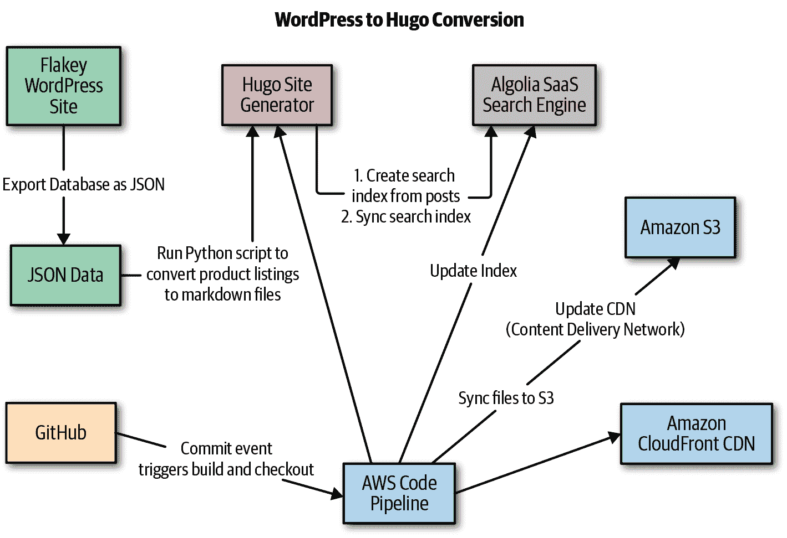
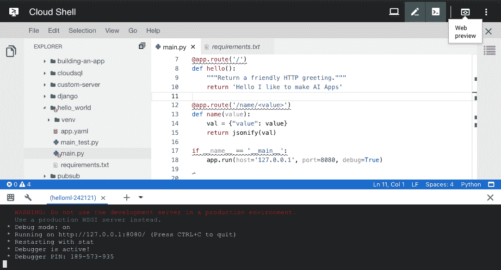
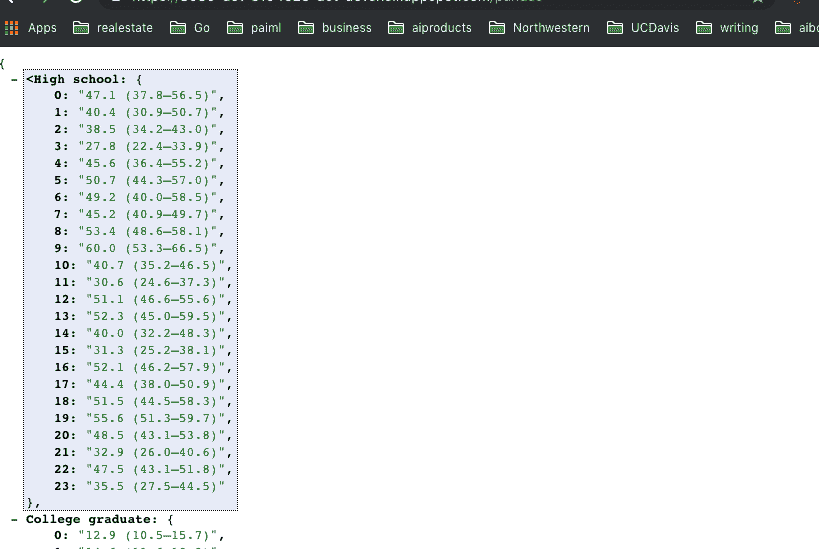
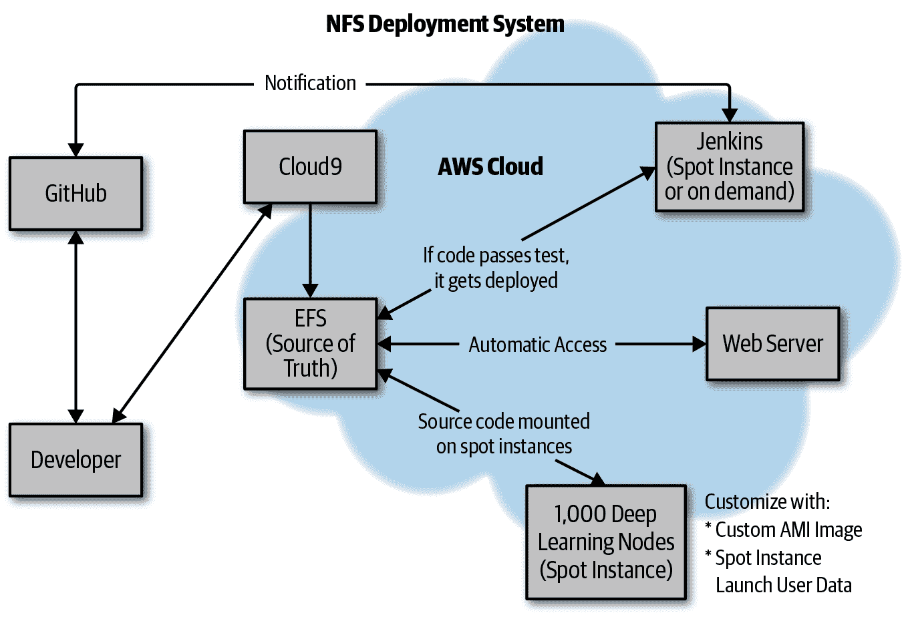

# 第六章：连续集成和连续部署

*作者：Noah*

连续集成（CI）和连续部署（CD）的实践对现代软件开发生命周期过程至关重要。CI 系统从诸如 GitHub 这样的源代码控制系统中克隆软件的代码库，将软件构建为可以是二进制、tar 归档或 Docker 镜像的构件，并且非常重要的是，还运行软件的单元测试和/或集成测试。CD 系统将由 CI 系统构建的构件部署到目标环境中。这种部署可以自动化处理非生产环境，但通常在生产环境中包括手动批准步骤。此类系统的更高级别是连续交付平台，该平台自动化生产部署步骤，并且能够基于从监控和日志平台获取的指标回滚部署。

# 真实案例研究：将维护不善的 WordPress 网站转换为 Hugo

不久之前，一个朋友请求帮忙修复他们公司的网站。该公司销售价格昂贵的二手科学设备，其库存通过一个经常被黑客攻击、性能糟糕或者经常宕机的 WordPress 站点提供。通常我会避免卷入这样的项目，但因为是朋友，我决定帮忙。你可以在这个[Git 仓库](https://oreil.ly/myos1)中参考转换项目的代码。

GitHub 仓库中覆盖了转换过程的每一个步骤。这些步骤包括：

1.  备份

1.  转换

1.  升级

1.  部署

###### 注意

故事有个有趣的结局。在创建了一个坚不可摧的、性能惊人的、安全的、自动部署的、以及 SEO 无敌的“坦克”式网站后，它在多年间零漏洞、零宕机地运行着。在我早已忘记这个项目的时候，我收到了朋友的一条短信。我已经有几年没和他联系了。他说网站挂了，需要我的帮助。

我回复他问如何可能的时候发了个短信。这是在 Amazon S3 上运行的，有 99.999999999%的正常运行时间。他回复说最近又把它转回 WordPress 了，因为“更容易”修改。我笑了，并告诉他我不适合他的项目。俗话说，善有善报。

我考虑的一些需求包括：

+   它需要进行持续部署。

+   它需要快速运行和开发！

+   它应该是由云提供商托管的静态站点。

+   应该有一个合理的工作流程，可以从 WordPress 进行转换。

+   应该可以使用 Python 创建一个合理的搜索界面。

最终，我决定使用[Hugo](https://gohugo.io)，[AWS](https://aws.amazon.com)，以及[Algolia](https://www.algolia.com)。整体架构看起来像图 6-1。



###### 图 6-1 连续部署与 Hugo

## 设置 Hugo

开始使用 Hugo 非常简单（参见[Hugo 入门指南](https://oreil.ly/r_Rcg)）。首先，安装软件。在我的 OS X 机器上，我是这样做的：

```py
brew install hugo
```

如果您已经安装了 Hugo，您可能需要升级：

```py
Error: hugo 0.40.3 is already installed
To upgrade to 0.57.2, run brew upgrade hugo.
```

如果您使用另一个平台，可以在[这里的说明](https://oreil.ly/FfWdo)中进行跟随。要验证一切是否正常工作，请运行`hugo version`：

```py
(.python-devops) ➜  ~ hugo version
Hugo Static Site Generator v0.57.2/extended darwin/amd64 BuildDate: unknown
```

唯一剩下的事情是初始化一个骨架 Hugo 应用程序并安装一个主题：

```py
hugo new site quickstart
```

这将创建一个名为`quickstart`的新网站。您可以通过运行`hugo`非常快地再次构建此站点。这会将 Markdown 文件编译为 HTML 和 CSS。

## 将 WordPress 转换为 Hugo 文章

接下来，我通过原始转储将 WordPress 数据库转换为 JSON。然后，我编写了一个 Python 脚本，将这些数据转换为 Markdown 格式的 Hugo 文章。以下是该代码：

```py
"""Conversion code of old database fields into markdown example.

If you did a database dump of WordPress and then converted it to JSON, you could
tweak this."""

import os
import shutil
from category import CAT
from new_picture_products import PICTURES

def check_all_category():
  ares = {}
  REC = []
  for pic in PICTURES:
    res  = check_category(pic)
    if not res:
      pic["categories"] = "Other"
      REC.append(pic)
      continue

    title,key = res
    if key:
      print("FOUND MATCH: TITLE--[%s], CATEGORY--[%s]" %\
        (title, key))
      ares[title]= key
      pic["categories"] = key
      REC.append(pic)
  return ares, REC

def check_category(rec):

  title = str(rec['title'])
  for key, values in CAT.items():
    print("KEY: %s, VALUE: %s" % (key, values))
    if title in key:
      return title,key
    for val in values:
      if title in val:
        return title,key

def move_image(val):
  """Creates a new copy of the uploaded images to img dir"""

  source_picture = "static/uploads/%s" % val["picture"]
  destination_dir = "static/img/"
  shutil.copy(source_picture, destination_dir)

def new_image_metadata(vals):
  new_paths = []
  for val in vals:
    pic = val['picture'].split("/")[-1:].pop()
    destination_dir = "static/img/%s" % pic
    val['picture'] = destination_dir
    new_paths.append(val)
  return new_paths

CAT_LOOKUP = {'2100': 'Foo',
 'a': 'Biz',
 'b': 'Bam',
 'c': 'Bar',
 '1': 'Foobar',
 '2': 'bizbar',
 '3': 'bam'}

def write_post(val):

    tags = val["tags"]
    date = val["date"]
    title = val["title"]
    picture = val["picture"]
    categories = val["categories"]
    out = """
+++
tags = ["%s"]
categories = ["%s"]
date = "%s"
title = "%s"
banner = "%s"
+++

 **Product Name**: %s""" %\
 (tags, categories, date, title, picture.lstrip("/"),
   title, picture, picture, title)

    filename = "../content/blog/%s.md" % title
    if os.path.exists(filename):
        print("Removing: %s" % filename)
        os.unlink(filename)

    with open(filename, 'a') as the_file:
        the_file.write(out)

if __name__ == '__main__':
    from new_pic_category import PRODUCT
    for product in PRODUCT:
        write_post(product)
```

## 创建 Algolia 索引并更新它

将数据库产品转换为 Markdown 文章后，下一步是编写一些 Python 代码来创建 Algolia 索引并将其同步。[Algolia](https://www.algolia.com)是一个很好的工具，因为它可以快速解决搜索引擎问题，并且还具有很好的 Python 支持。

此脚本遍历所有 Markdown 文件并生成一个可上传到 Algolia 的搜索索引：

```py
"""
Creates a very simple JSON index for Hugo to import into Algolia. Easy to extend.

#might be useful to run this on content directory to remove spaces
for f in *\ *; do mv "$f" "${f// /_}"; done

"""
import os
import json

CONTENT_ROOT = "../content/products"
CONFIG = "../config.toml"
INDEX_PATH = "../index.json"

def get_base_url():
    for line in open(CONFIG):
        if line.startswith("baseurl"):
            url = line.split("=")[-1].strip().strip('""')
            return url

def build_url(base_url, title):

    url = "<a href='%sproducts/%s'>%s</a>" %\
         (base_url.strip(), title.lower(), title)
    return url

def clean_title(title):
    title_one = title.replace("_", " ")
    title_two = title_one.replace("-", " ")
    title_three = title_two.capitalize()
    return title_three

def build_index():
    baseurl = get_base_url()
    index =[]
    posts = os.listdir(CONTENT_ROOT)
    for line in posts:
        print("FILE NAME: %s" % line)
        record = {}
        title = line.strip(".md")
        record['url'] = build_url(baseurl, title)
        record['title'] = clean_title(title)
        print("INDEX RECORD: %s" % record)
        index.append(record)
    return index

def write_index():
    index = build_index()
    with open(INDEX_PATH, 'w') as outfile:
        json.dump(index,outfile)

if __name__ == '__main__':
    write_index()
```

最后，可以使用以下片段将索引发送到 Algolia：

```py
import json
from algoliasearch import algoliasearch

def update_index():
    """Deletes index, then updates it"""
    print("Starting Updating Index")
    client = algoliasearch.Client("YOUR_KEY", "YOUR_VALUE")
    index = client.init_index("your_INDEX")
    print("Clearing index")
    index.clear_index()
    print("Loading index")
    batch = json.load(open('../index.json'))
    index.add_objects(batch)

if __name__ == '__main__':
    update_index()
```

## 使用 Makefile 进行编排

使用`Makefile`可以复制后续部署过程中使用的步骤。我通常设置一个`Makefile`在本地编排这些步骤。以下是整个构建和部署过程的样子：

```py
build:
  rm -rf public
  hugo

watch: clean
  hugo server -w

create-index:
  cd algolia;python make_algolia_index.py;cd ..

update-index:
  cd algolia;python sync_algolia_index.py;cd ..

make-index: create-index update-index

clean:
  -rm -rf public

sync:
  aws s3 --profile <yourawsprofile> sync --acl \
    "public-read" public/ s3://example.com

build-deploy-local: build sync

all: build-deploy-local
```

## 使用 AWS CodePipeline 部署

Amazon Web Services（AWS）是通过 Amazon S3、Amazon Route 53 和 Amazon CloudFront 托管静态网站的常见部署目标。他们的构建服务器服务 AWS CodePipeline 非常适合这些站点的部署机制。您可以登录 AWS CodePipeline，设置一个新的构建项目，并告诉它使用一个*buildspec.yml*文件。代码可以定制，模板化的部分可以替换为实际值。

一旦 GitHub 接收到更改事件，CodePipeline 会在容器中运行安装。首先，它获取指定版本的特定版本的 Hugo。接下来，它构建 Hugo 页面。由于 Go 语言的速度非常快，可以在几秒钟内渲染数千个 Hugo 页面。

最后，HTML 页面被同步到 Amazon S3。因为这在 AWS 内部运行并且被同步，所以速度非常快。最后一步是使 CloudFront 失效：

```py
version: 0.1

environment_variables:
  plaintext:
    HUGO_VERSION: "0.42"

phases:
  install:
    commands:
      - cd /tmp
      - wget https://github.com/gohugoio/hugo/releases/\
      download/v${HUGO_VERSION}/hugo_${HUGO_VERSION}_Linux-64bit.tar.gz
      - tar -xzf hugo_${HUGO_VERSION}_Linux-64bit.tar.gz
      - mv hugo /usr/bin/hugo
      - cd -
      - rm -rf /tmp/*
  build:
    commands:
      - rm -rf public
      - hugo
  post_build:
    commands:
      - aws s3 sync public/ s3://<yourwebsite>.com/ --region us-west-2 --delete
      - aws s3 cp s3://<yourwebsite>.com/\
      s3://<yourwebsite>.com/ --metadata-directive REPLACE \
        --cache-control 'max-age=604800' --recursive
      - aws cloudfront create-invalidation --distribution-id=<YOURID> --paths '/*'
      - echo Build completed on `date`
```

# 实际案例研究：使用 Google Cloud Build 部署 Python 应用引擎应用程序

回到 2008 年，我写了关于使用 Google App Engine 的第一篇文章。您需要使用 Wayback Machine 从[O’Reilly 博客](https://oreil.ly/8LoIf)获取它。

现代时代的重启。这是 Google App Engine 的另一个版本，但这次使用 [Google Cloud Build](https://oreil.ly/MllhM)。Google Cloud 平台（GCP）Cloud Build 的工作方式与 AWS CodePipeline 非常相似。这里有一个配置文件，它已经检入 GitHub 仓库。配置文件名为 *cloudbuild.yaml*。你可以在此项目的 [Git 仓库中查看所有源代码](https://oreil.ly/vxsnc)：

```py
steps:
- name: python:3.7
  id: INSTALL
  entrypoint: python3
  args:
  - '-m'
  - 'pip'
  - 'install'
  - '-t'
  - '.'
  - '-r'
  - 'requirements.txt'
- name: python:3.7
  entrypoint: ./pylint_runner
  id: LINT
  waitFor:
  - INSTALL
- name: "gcr.io/cloud-builders/gcloud"
  args: ["app", "deploy"]
timeout: "1600s"
images: ['gcr.io/$PROJECT_ID/pylint']
```

注意 *cloudbuild.yaml* 文件安装了在 *requirements.txt* 文件中看到的包，并运行 `gcloud app deploy`，这在 GitHub 上检入时部署 App Engine 应用程序：

```py
Flask==1.0.2
gunicorn==19.9.0
pylint==2.3.1
```

这里是如何设置整个项目的步骤走-through：

1.  创建项目。

1.  激活云 Shell。

1.  参考 [Python 3 App Engine 的 hello world 文档](https://oreil.ly/zgf5J)。

1.  运行 `describe`:

    ```py
    verify project is working
    ```bash

    gcloud projects describe $GOOGLE_CLOUD_PROJECT

    ```py
    output of command:
    ```bash

    createTime: '2019-05-29T21:21:10.187Z'

    生命周期状态：活动

    名称：helloml

    projectId: helloml-xxxxx

    projectNumber: '881692383648'

    ```py
    ```

1.  你可能想验证是否选择了正确的项目。如果没有，请执行以下操作进行切换：

    ```py
    gcloud config set project $GOOGLE_CLOUD_PROJECT
    ```

1.  创建 App Engine 应用程序：

    ```py
    gcloud app create
    ```

    这将询问区域。继续选择 `us-central [12]`。

    ```py
    Creating App Engine application in project [helloml-xxx]
    and region [us-central]....done.
    Success! The app is now created.
    Please use `gcloud app deploy` to deploy your first app.
    ```

1.  克隆 hello world 示例应用程序仓库：

    ```py
    git clone https://github.com/GoogleCloudPlatform/python-docs-samples
    ```

1.  `cd` 进入 repo：

    ```py
    cd python-docs-samples/appengine/standard_python37/hello_world
    ```

1.  更新 Cloudshell 镜像（请注意，这是可选的）：

    ```py
    git clone https://github.com/noahgift/gcp-hello-ml.git
    # Update .cloudshellcustomimagerepo.json with project and image name
    # TIP: enable "Boost Mode" in in Cloudshell
    cloudshell env build-local
    cloudshell env push
    cloudshell env update-default-image
    # Restart Cloudshell VM
    ```

1.  创建并启用虚拟环境：

    ```py
    virtualenv --python $(which python) venv
    source venv/bin/activate
    ```

    双重检查是否有效：

    ```py
    which python
    /home/noah_gift/python-docs-samples/appengine/\
      standard_python37/hello_world/venv/bin/python
    ```

1.  激活云 Shell 编辑器。

1.  安装包：

    ```py
    pip install -r requirements.txt
    ```

    这应该安装 Flask:

    ```py
    Flask==1.0.2
    ```

1.  本地运行 Flask。这将在 GCP Shell 中本地运行 Flask：

    ```py
    python main.py
    ```

1.  使用网页预览（见 Figure 6-2）。

    

    ###### Figure 6-2\. 网页预览

1.  更新 *main.py*:

    ```py
    from flask import Flask
    from flask import jsonify

    app = Flask(__name__)

    @app.route('/')
    def hello():
        """Return a friendly HTTP greeting."""
        return 'Hello I like to make AI Apps'

    @app.route('/name/<value>')
    def name(value):
        val = {"value": value}
        return jsonify(val)

    if __name__ == '__main__':
        app.run(host='127.0.0.1', port=8080, debug=True)
    ```

1.  测试传入参数以执行此功能：

    ```py
    @app.route('/name/<value>')
    def name(value):
        val = {"value": value}
        return jsonify(val)
    ```

    例如，调用此路由将会将单词 *lion* 传递到 Flask 中的 name 函数中：

    ```py
    https://8080-dot-3104625-dot-devshell.appspot.com/name/lion
    ```

    在 web 浏览器中返回一个值：

    ```py
    {
    value: "lion"
    }
    ```

1.  现在部署应用程序：

    ```py
    gcloud app deploy
    ```

    警告！第一次部署可能需要大约 10 分钟。您可能还需要启用 Cloud Build API。

    ```py
    Do you want to continue (Y/n)?  y
    Beginning deployment of service [default]...
    ╔════════════════════════════════════════════════════════════╗
    ╠═ Uploading 934 files to Google Cloud Storage              ═╣
    ```

1.  现在流式传输日志文件：

    ```py
    gcloud app logs tail -s default
    ```

1.  生产应用已部署，应如此：

    ```py
    Setting traffic split for service [default]...done.
    Deployed service [default] to [https://helloml-xxx.appspot.com]
    You can stream logs from the command line by running:
      $ gcloud app logs tail -s default

      $ gcloud app browse
    (venv) noah_gift@cloudshell:~/python-docs-samples/appengine/\
      standard_python37/hello_world (helloml-242121)$ gcloud app
     logs tail -s default
    Waiting for new log entries...
    2019-05-29 22:45:02 default[2019]  [2019-05-29 22:45:02 +0000] [8]
    2019-05-29 22:45:02 default[2019]  [2019-05-29 22:45:02 +0000] [8]
     (8)
    2019-05-29 22:45:02 default[2019]  [2019-05-29 22:45:02 +0000] [8]
    2019-05-29 22:45:02 default[2019]  [2019-05-29 22:45:02 +0000] [25]
    2019-05-29 22:45:02 default[2019]  [2019-05-29 22:45:02 +0000] [27]
    2019-05-29 22:45:04 default[2019]  "GET /favicon.ico HTTP/1.1" 404
    2019-05-29 22:46:25 default[2019]  "GET /name/usf HTTP/1.1" 200
    ```

1.  添加新路由并测试：

    ```py
    @app.route('/html')
    def html():
        """Returns some custom HTML"""
        return """
     <title>This is a Hello World World Page</title>
     <p>Hello</p>
     <p><b>World</b></p>
     """
    ```

1.  安装 Pandas 并返回 JSON 结果。此时，您可能希望考虑创建一个 `Makefile` 并执行以下操作：

    ```py
    touch Makefile
    #this goes inside that file
    install:
      pip install -r requirements.txt
    ```

    您可能还想设置 lint：

    ```py
    pylint --disable=R,C main.py
    ------------------------------------
    Your code has been rated at 10.00/10
    ```

    Web 路由语法看起来像以下代码块。在顶部添加 Pandas 导入：

    ```py
    import pandas as pd

    @app.route('/pandas')
    def pandas_sugar():
        df = pd.read_csv(
          "https://raw.githubusercontent.com/noahgift/sugar/\
     master/data/education_sugar_cdc_2003.csv")
        return jsonify(df.to_dict())
    ```

    当您调用路由 https://<yourapp>.appspot.com/pandas 时，您应该看到类似 Figure 6-3 的东西。

    

    ###### Figure 6-3\. JSON 输出示例

1.  添加此 Wikipedia 路由：

    ```py
    import wikipedia
    @app.route('/wikipedia/<company>')
    def wikipedia_route(company):
        result = wikipedia.summary(company, sentences=10)
        return result
    ```

1.  向应用添加 NLP：

    1.  运行 [IPython Notebook](https://oreil.ly/c564z)。

    1.  启用云自然语言 API。

    1.  运行 `pip install google-cloud-language`:

        ```py
        In [1]: from google.cloud import language
           ...: from google.cloud.language import enums
           ...:
           ...: from google.cloud.language import types
        In [2]:
        In [2]: text = "LeBron James plays for the Cleveland Cavaliers."
           ...: client = language.LanguageServiceClient()
           ...: document = types.Document(
           ...:         content=text,
           ...:         type=enums.Document.Type.PLAIN_TEXT)
           ...: entities = client.analyze_entities(document).entities
        In [3]: entities
        ```

1.  这是一个端到端的 AI API 示例：

    ```py
    from flask import Flask
    from flask import jsonify
    import pandas as pd
    import wikipedia

    app = Flask(__name__)

    @app.route('/')
    def hello():
        """Return a friendly HTTP greeting."""
        return 'Hello I like to make AI Apps'

    @app.route('/name/<value>')
    def name(value):
        val = {"value": value}
        return jsonify(val)

    @app.route('/html')
    def html():
        """Returns some custom HTML"""
        return """
     <title>This is a Hello World World Page</title>
     <p>Hello</p>
     <p><b>World</b></p>
     """
    @app.route('/pandas')
    def pandas_sugar():
        df = pd.read_csv(
          "https://raw.githubusercontent.com/noahgift/sugar/\
     master/data/education_sugar_cdc_2003.csv")
        return jsonify(df.to_dict())

    @app.route('/wikipedia/<company>')
    def wikipedia_route(company):

        # Imports the Google Cloud client library
        from google.cloud import language
        from google.cloud.language import enums
        from google.cloud.language import types
        result = wikipedia.summary(company, sentences=10)

        client = language.LanguageServiceClient()
        document = types.Document(
            content=result,
            type=enums.Document.Type.PLAIN_TEXT)
        entities = client.analyze_entities(document).entities
        return str(entities)

    if __name__ == '__main__':
        app.run(host='127.0.0.1', port=8080, debug=True)
    ```

本节展示了如何在 Google Cloud Shell 中从头开始设置 App Engine 应用程序，以及如何使用 GCP Cloud Build 进行持续交付。

# 实际案例研究：NFSOPS

NFSOPS 是一种操作技术，利用 NFS（网络文件系统）挂载点来管理计算机集群。听起来像是一种新技术，但实际上自 Unix 存在以来就一直存在。Noah 在 2000 年就曾在加州理工学院的 Unix 系统上使用 NFS 挂载点来管理和维护软件。新的东西又重新回到了老的循环。

作为旧金山虚拟现实创业公司的兼职顾问，我面临的一个问题是如何快速构建一个作业框架，可以将工作分派给成千上万个 AWS Spot Instances。

最终解决方案是使用 NFSOPS（图 6-4）在亚秒内部署 Python 代码到成千上万的计算机视觉 Spot Instances。



###### 图 6-4\. NFSOPS

NFSOPS 的工作方式是利用构建服务器，例如 Jenkins，在几个亚马逊弹性文件系统（EFS）挂载点（DEV、STAGE、PROD）上挂载。当进行持续集成构建时，最后一步是对相应挂载点进行 `rsync`：

```py
#Jenkins deploy build step
rsync -az --delete * /dev-efs/code/
```

“部署”然后在亚秒内完成到挂载点。当成千上万的 Spot Instances 被启动时，它们预配置为挂载 EFS（NFS 挂载点）并使用源代码。这是一种优化简单和速度的便捷部署模式。它还可以与 IAC、Amazon Machine Image（AMI）或 Ansible 很好地配合使用。
