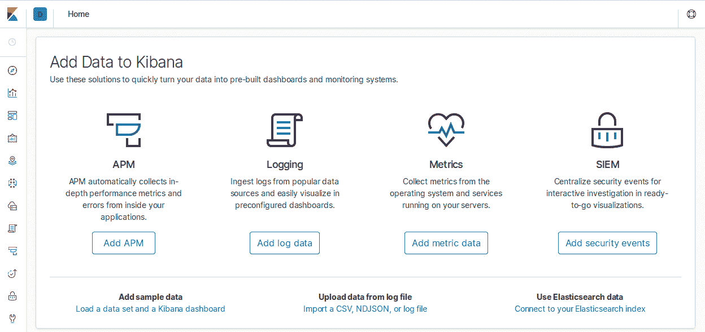

# 第七章。监控和日志记录

当诺亚在旧金山的初创公司工作时，他利用午餐时间锻炼。他会打篮球，跑到科伊特塔上，或者练巴西柔术。诺亚工作过的大多数初创公司都提供午餐。

他发现一个非常不寻常的模式，在午饭后回来。从来没有剩下任何不健康的东西可吃。剩下的东西通常是完整的沙拉，水果，蔬菜或健康的瘦肉。一群群的初创公司工作人员在他锻炼时吃光了所有不健康的选择，不留一丝诱惑吃坏的食物。不随波逐流确实有一番道理。

同样，当开发机器学习模型，移动应用程序和 Web 应用程序时，忽视操作是一条容易的路。忽视操作是如此典型，就像在提供午餐时吃薯片，苏打水和冰淇淋一样。虽然成为正常人并不一定是首选。在本章中，描述了软件开发的“沙拉和瘦肉”方法。

# 构建可靠系统的关键概念

经过一段时间的公司建设，看看在软件工程部分起作用和不起作用的东西是有趣的。其中一个最好的反模式是“相信我”。任何理智的 DevOps 专业人员都不会相信人类。他们是有缺陷的，会犯情感上的错误，并且可以随心所欲地摧毁整个公司。特别是如果他们是公司的创始人。

不是基于完全胡言乱语的层次结构，构建可靠系统的更好方法是逐步构建它们。此外，在创建平台时，应该经常预期失败。唯一会影响这个真理的事情是如果有一个有权势的人参与建立架构。在那种情况下，这个真理将呈指数增长。

你可能听说过 Netflix 的混沌猴，但为什么要费心呢？相反，让你公司的创始人，首席技术官或工程副总裁做随意编码并对你的架构和代码库提出质疑。人类混沌猴将在 Netflix 周围打转。更好的是，让他们在生产中断期间编译 jar 文件，并逐个将它们放在节点上，通过 SSH，同时喊着，“这会奏效的！”通过这种方式，混沌和自我之间的谐波均值被实现。

对于理智的 DevOps 专业人员来说，行动项目是什么？自动化大于层次结构。解决初创公司混乱的唯一方法是自动化，怀疑，谦卑和不可变的 DevOps 原则。

# 不可变的 DevOps 原则

很难想象有比这个不可改变的原则更好的地方来开始构建可靠的系统。如果首席技术官正在从笔记本电脑构建 Java 的`.jar`文件来解决生产问题，你应该辞职。没有什么能够拯救你的公司。我们应该知道——我们曾经在那里！

无论一个人有多聪明/强大/有魅力/有创意/有钱，如果他们在软件平台危机中手动应用关键更改，你已经死了。只是你还不知道。摆脱这种可怕状态的替代方案是自动化。

长期来看，人类不能参与软件部署。这是软件行业存在的头号反模式。它本质上是暴徒对你的平台造成严重破坏的后门。相反，部署软件、测试软件和构建软件需要 100%自动化。

在公司中，你可以产生最显著的初始影响是建立持续集成和持续交付。其他所有事情都相形见绌。

## 集中日志记录

在自动化之后，日志记录在重要性上紧随其后。在大规模分布式系统中，日志记录不是可选的。必须特别关注应用程序级别和环境级别的日志记录。

例如，异常应始终发送到集中日志记录系统。另一方面，在开发软件时，通常创建调试日志而不是打印语句是一个好主意。为什么这样做？花费了很多时间开发调试源代码的启发式算法。为什么不捕获它，以便在生产中再次出现问题时可以打开它？

这里的诀窍在于日志记录级别。通过创建仅出现在非生产环境中的调试日志级别，可以将调试逻辑保留在源代码中。同样，不要让过于冗长的日志在生产中出现并引起混乱，可以随时开启或关闭它们。

在大规模分布式系统中，日志记录的一个例子是[Ceph](https://ceph.com)的使用：守护程序可以拥有高达 20 个调试级别！所有这些级别都在代码中处理，允许系统精细调节日志记录量。Ceph 通过能够限制每个守护程序的日志记录量进一步推动了这一策略。系统有几个守护程序，可以增加一个或所有守护程序的日志记录量。

## 案例研究：生产数据库损坏硬盘

日志记录的另一个关键策略是解决可扩展性问题。一旦应用程序足够庞大，可能不再可行将所有日志存储在文件中。阿尔弗雷多曾经被指派解决一个广泛网络应用的主数据库问题，这个应用托管大约一百家报纸、广播电台和电视台的站点。这些站点产生了大量流量并生成了大量日志。产生了如此多的日志输出，以至于 PostgreSQL 的日志记录被设置到最低，他无法调试问题，因为需要提高日志级别。如果提高日志级别，应用程序将因所产生的强烈 I/O 而停止工作。每天早上五点左右，数据库负载就会急剧上升。情况越来越糟。

数据库管理员反对提高日志级别以查看最昂贵的查询（PostgreSQL 可以在日志中包含查询信息）整整一天，因此我们妥协了：每天早晨五点左右十五分钟。一旦能够获取这些日志，阿尔弗雷多立即开始评估最慢的查询及其运行频率。有一个明显的优胜者：一个耗时如此之长的`SELECT *`查询，以至于十五分钟的时间窗口无法捕获其运行时间。应用程序并未对任何表进行全表查询；那么问题出在哪里呢？

经过多次劝说，我们终于获得了对数据库服务器的访问权限。如果每天清晨五点左右出现负载激增，是否可能存在某种定期脚本？我们调查了`crontab`（用于记录定时运行任务的程序），发现了一个可疑的脚本：*backup.sh*。脚本内容包含几条 SQL 语句，其中包括多个`SELECT *`。数据库管理员使用此脚本备份主数据库，随着数据库规模的增长，负载也随之增加，直至无法忍受。解决方案？停止使用此脚本，开始备份四个次要（副本）数据库中的一个。

这解决了备份问题，但并没有解决无法访问日志的问题。提前考虑分发日志输出是正确的做法。像[`rsyslog`](https://www.rsyslog.com)这样的工具就是为解决这类问题而设计的，如果从一开始就添加，可以避免在生产中遇到问题时束手无策。

## 是否自建还是购买？

令人难以置信的是*供应商锁定*如何备受关注。然而，供应商锁定是因人而异的。在旧金山市中心，你几乎可以随处一掷石头就能碰到有人大声疾呼供应商锁定的罪恶。然而，深入挖掘之后，你会想知道他们的替代方案是什么。

在经济学中，有一个叫做比较优势的原则。简而言之，它意味着将精力集中在自己最擅长的事务上，并将其他任务外包给其他人是经济上有利的。尤其是在云计算领域，不断的改进使最终用户从中受益，而且通常比以前更少复杂。

除非你的公司运营规模达到技术巨头之一，否则几乎不可能实施、维护和改进私有云，并能在同时节省成本和提升业务。例如，2017 年，亚马逊发布了跨多个*可用区*具有自动故障切换功能的多主数据库部署能力。作为曾尝试过这一点的人，我可以说这几乎是不可能的，而在这种情况下添加自动故障切换功能非常困难。在考虑外包时要考虑的一个关键问题是：“这是否是业务的核心竞争力？”一个运营自己邮件服务器但核心竞争力是销售汽车零件的公司，正在玩火并且可能已经在亏钱。

## 容错性

容错性是一个迷人的主题，但它可能非常令人困惑。容错性的含义是什么，如何实现？学习更多关于容错性的信息的好地方是阅读尽可能多的来自 AWS 的[白皮书](https://oreil.ly/zYuls)。

在设计容错系统时，最好从尝试回答以下问题开始：当此服务宕机时，我可以实施什么来消除（或减少）手动交互？没有人喜欢收到关键系统宕机的通知，尤其是这意味着需要多个步骤来恢复，更不用说还需要与其他服务进行沟通，确保一切恢复正常。需要注意的是，这个问题并不是将宕机视为不太可能发生的事件，而是明确承认该服务会宕机，并且需要进行一些工作来使其恢复运行。

不久之前，计划对复杂的构建系统进行全面重新设计。该构建系统完成了多项任务，其中大部分与软件打包和发布相关：必须检查依赖关系，使用`make`和其他工具构建二进制文件，生成 RPM 和 Debian 软件包，并创建和托管不同 Linux 发行版（如 CentOS、Debian 和 Ubuntu）的软件库。这个构建系统的主要要求是速度快。

尽管速度是主要目标之一，但在设计涉及多个步骤和不同组件的系统时，解决已知的痛点并努力防止新问题的出现非常有用。大型系统中总会存在未知因素，但使用适当的日志记录（以及日志聚合）、监控和恢复策略至关重要。

现在回到构建系统，其中一个问题是创建仓库的机器有些复杂：一个 HTTP API 接收特定项目特定版本的软件包，并自动生成仓库。 这个过程涉及数据库、RabbitMQ 服务用于异步任务处理，以及大量的存储空间来保存仓库，由 Nginx 提供服务。 最后，一些状态报告将发送到中央仪表板，以便开发人员可以查看其分支在构建过程中的位置。 设计所有东西都围绕这个服务可能出现故障的可能性是*至关重要*的。

在白板上添加了一张大字条，上面写着：“错误：仓库服务因磁盘已满而停止。” 任务并不是要防止磁盘满，而是要创建一个能在磁盘满的情况下继续工作，并在问题解决后几乎不费力就能重新将其纳入系统的系统。 “磁盘已满”错误是一个虚构的错误，可能是任何事情，比如 RabbitMQ 没有运行或者 DNS 问题，但它完美地说明了当前的任务。

直到某个关键部分失效时，理解监控、日志记录和良好设计模式的重要性才变得困难，并且几乎无法确定*为什么*以及*如何*。 你需要知道为什么它会崩溃，以便可以采取预防措施（警报、监控和自我恢复）来避免将来出现类似问题。

为了使这个系统能够继续工作，我们将负载分成了五台机器，它们都是相同的，做着相同的工作：创建和托管仓库。 生成二进制文件的节点将查询一个健康的仓库机器的 API，然后该机器会发送一个 HTTP 请求来查询其列表中下一个构建服务器的 `/health/` 终端。 如果服务器报告健康，则二进制文件会发送到那里；否则，API 将选择列表中的下一个服务器。 如果一个节点连续三次未通过健康检查，它将被移出轮换。 系统管理员只需在修复后重新启动仓库服务即可将其重新纳入轮换。（仓库服务有一个自我健康评估，如果成功将通知 API 准备好进行工作。）

虽然实现并非完全可靠（仍需努力使服务器恢复运行，并且通知并不总是准确），但在需要恢复服务时对服务维护产生了巨大影响，并保持所有内容在降级状态下继续运行。 这就是容错性的全部意义所在！

# 监控

监控是这样一种事情，你几乎什么都不做也可以声称已经建立了一个监控系统（作为实习生，Alfredo 曾经使用一个`curl`定时任务来检查一个生产网站），但是它可能变得非常复杂，以至于生产环境看起来像是灵活的。当监控和报告做得正确时，通常可以帮助回答生产生命周期中最困难的问题。拥有它是至关重要的，但要做到这一点却很困难。这就是为什么有许多公司专门从事监控、警报和指标可视化的原因。

在其核心，大多数服务遵循两种范式：拉取和推送。本章将涵盖 Prometheus（拉取）和 Graphite 与 StatsD（推送）。了解在何时选择其中一种更为合适以及其中的注意事项，在为环境添加监控时是非常实用的。更重要的是，了解两者并具备根据特定场景选择最佳服务的能力，这一点非常实际。

可靠的时间序列软件必须能够承受极高的事务信息输入速率，能够存储这些信息，与时间相关联，支持查询，并提供一个可以根据过滤器和查询自定义的图形界面。本质上，它几乎必须像一个高性能数据库，但专门用于时间、数据操作和可视化。

## Graphite

Graphite 是一个用于数字时间数据的数据存储：它保存与捕获时间相关的数值信息，并根据可自定义的规则保存这些信息。它提供了一个*非常强大*的 API，可以查询有关其数据的信息，包括时间范围，并且还可以应用*函数*对数据进行转换或计算。

[Graphite](https://oreil.ly/-0YEs)的一个重要方面是它*不会收集数据*；相反，它集中精力于其 API 和处理大量数据的能力。这迫使用户考虑与 Graphite 部署的收集软件。有很多选择可供将指标发送到 Graphite；在本章中，我们将介绍其中一种选择，StatsD。

Graphite 的另一个有趣之处在于，虽然它自带了一个可以按需呈现图形的 Web 应用程序，但通常会部署一个不同的服务，该服务可以直接使用 Graphite 作为图形的后端。一个很好的例子就是优秀的[Grafana 项目](https://grafana.com)，它提供了一个功能齐全的 Web 应用程序用于呈现指标。

## StatsD

Graphite 允许您通过 TCP 或 UDP 将指标推送到它，但是使用类似 StatsD 的工具特别方便，因为 Python 中有仪表化选项，允许通过 UDP 聚合指标然后将其发送到 Graphite。这种设置对于不应阻塞发送数据的 Python 应用程序很合理（TCP 连接会阻塞，直到收到响应；UDP 则不会）。如果捕获的非常耗时的 Python 循环用于指标，那么将其通信时间加入到捕获指标的服务中是没有意义的。

简而言之，将指标发送到 StatsD 服务感觉就像没有成本一样（应该是这样！）。利用可用的 Python 仪器，测量一切非常直接。一旦 StatsD 服务有足够的指标要发送到 Graphite，它就会开始发送指标的过程。所有这些都是完全异步进行的，有助于应用程序的继续运行。指标、监控和日志记录绝不能以任何方式影响生产应用程序！

使用 StatsD 时，推送到它的数据在给定间隔（默认为 10 秒）内聚合并刷新到可配置的后端（如 Graphite）。在几个生产环境中部署了 Graphite 和 StatsD 的组合后，发现在每个应用程序服务器上使用一个 StatsD 实例比为所有应用程序使用单个实例更容易。这种部署方式允许更简单的配置和更紧密的安全性：所有应用服务器上的配置将指向 `localhost` 的 StatsD 服务，不需要打开外部端口。最后，StatsD 将通过出站 UDP 连接将指标发送到 Graphite。这也通过将可扩展性进一步推向 Graphite 的管道下游来分担负载。

###### 注意

StatsD 是一个 `Node.js` 守护程序，因此安装它意味着引入 `Node.js` 依赖。它绝对 *不是* 一个 Python 项目！

## Prometheus

在许多方面，[Prometheus](https://prometheus.io) 与 Graphite 非常相似（强大的查询和可视化）。主要区别在于它从源头 *拉取* 信息，并且通过 HTTP 进行。这需要服务公开 HTTP 端点以允许 Prometheus 收集指标数据。与 Graphite 的另一个显著区别是，它内置了警报功能，可以配置规则来触发警报或使用 `Alertmanager`：一个负责处理警报、静音、聚合并将其中继到不同系统（如电子邮件、聊天和值班平台）的组件。

一些项目（比如 [Ceph](https://ceph.com)）已经具有可配置选项，以便让 Prometheus 在特定间隔内抓取信息。当这种类型的集成被提供时，这是很好的；否则，它需要在某个地方运行一个可以公开服务的 HTTP 实例来暴露度量数据。例如，在 [PostgreSQL 数据库](https://www.postgresql.org) 的情况下，Prometheus 导出器是运行一个公开数据的 HTTP 服务的容器。在许多情况下，这可能是*fine*的，但是如果已经有集成可以使用诸如[collectd](https://collectd.org)之类的东西收集数据，那么运行 HTTP 服务可能效果不是那么好。

Prometheus 是短期数据或频繁变化的时间数据的绝佳选择，而 Graphite 更适合长期历史信息。两者都提供非常先进的查询语言，但 Prometheus 更为强大。

对于 Python 来说，[`prometheus_client`](https://oreil.ly/t9NtW)是一个很好的实用工具，可以开始将指标发送到 Prometheus；如果应用程序已经是基于 Web 的，该客户端还具有许多不同 Python Web 服务器的集成，例如 Twisted、WSGI、Flask，甚至 Gunicorn。除此之外，它还可以导出所有数据以直接在定义的端点公开（而不是在单独的 HTTP 实例上执行）。如果你想让你的 Web 应用程序在 `/metrics/` 暴露出来，那么添加一个调用 `prometheus_client.generate_latest()` 的处理程序将以 Prometheus 解析器理解的格式返回内容。

创建一个小的 Flask 应用程序（保存到`web.py`中），以了解`generate_latest()`的使用是多么简单，并确保安装了`prometheus_client`包：

```py
from flask import Response, Flask
import prometheus_client

app = Flask('prometheus-app')

@app.route('/metrics/')
def metrics():
    return Response(
        prometheus_client.generate_latest(),
        mimetype='text/plain; version=0.0.4; charset=utf-8'
    )
```

使用开发服务器运行应用程序：

```py
$ FLASK_APP=web.py flask run
 * Serving Flask app "web.py"
 * Environment: production
   WARNING: This is a development server.
   Use a production WSGI server instead.
 * Running on http://127.0.0.1:5000/ (Press CTRL+C to quit)
127.0.0.1 - - [07/Jul/2019 10:16:20] "GET /metrics HTTP/1.1" 308 -
127.0.0.1 - - [07/Jul/2019 10:16:20] "GET /metrics/ HTTP/1.1" 200 -
```

在应用程序运行时，打开一个 Web 浏览器，输入网址`[*http://localhost:5000/metrics*](http://localhost:5000/metrics)`。它开始生成 Prometheus 可以收集的输出，即使没有什么真正重要的东西：

```py
...
# HELP process_cpu_seconds_total Total user and system CPU time in seconds.
# TYPE process_cpu_seconds_total counter
process_cpu_seconds_total 0.27
# HELP process_open_fds Number of open file descriptors.
# TYPE process_open_fds gauge
process_open_fds 6.0
# HELP process_max_fds Maximum number of open file descriptors.
# TYPE process_max_fds gauge
process_max_fds 1024.0
```

大多数生产级 Web 服务器（如 Nginx 和 Apache）可以生成有关响应时间和延迟的详尽指标。例如，如果向 Flask 应用程序添加这种类型的度量数据，那么中间件，其中所有请求都可以记录，将是一个很好的选择。应用程序通常会在请求中执行其他有趣的操作，所以让我们添加另外两个端点——一个带有计数器，另一个带有计时器。这两个新端点将生成度量数据，该数据将由 `prometheus_client` 库处理，并在通过 HTTP 请求 `/metrics/` 端点时报告。

向我们的小应用程序添加一个计数器涉及一些小的更改。创建一个新的索引端点：

```py
@app.route('/')
def index():
    return '<h1>Development Prometheus-backed Flask App</h1>'
```

现在定义 `Counter` 对象。添加计数器的名称（`requests`）、一个简短的描述（`Application Request Count`）和至少一个有用的标签（比如 `endpoint`）。这个标签将帮助识别这个计数器来自哪里：

```py
from prometheus_client import Counter

REQUESTS = Counter(
    'requests', 'Application Request Count',
    ['endpoint']
)

@app.route('/')
def index():
    REQUESTS.labels(endpoint='/').inc()
    return '<h1>Development Prometheus-backed Flask App</h1>'
```

定义了 `REQUESTS` 计数器后，将其包含在 `index()` 函数中，重新启动应用程序并进行几次请求。然后如果请求 `/metrics/`，输出应显示我们创建的一些新活动：

```py
...
# HELP requests_total Application Request Count
# TYPE requests_total counter
requests_total{endpoint="/"} 3.0
# TYPE requests_created gauge
requests_created{endpoint="/"} 1.562512871203272e+09
```

现在添加一个 `Histogram` 对象来捕获一个端点的详细信息，有时回复时间较长。代码通过随机休眠一段时间来模拟这一情况。与 `index` 函数一样，还需要一个新的端点，其中使用了 `Histogram` 对象：

```py
from prometheus_client import Histogram

TIMER = Histogram(
    'slow', 'Slow Requests',
    ['endpoint']
)
```

模拟的昂贵操作将使用一个函数来跟踪开始时间和结束时间，然后将这些信息传递给直方图对象：

```py
import time
import random

@app.route('/database/')
def database():
    with TIMER.labels('/database').time():
        # simulated database response time
        sleep(random.uniform(1, 3))
    return '<h1>Completed expensive database operation</h1>'
```

需要两个新模块：`time` 和 `random`。它们将帮助计算传递给直方图的时间，并模拟在数据库中执行的昂贵操作。再次运行应用程序并请求 `/database/` 端点将在 `/metrics/` 被轮询时开始生成内容。现在应该能看到几个测量我们模拟时间的项目：

```py
# HELP slow Slow Requests
# TYPE slow histogram
slow_bucket{endpoint="/database",le="0.005"} 0.0
slow_bucket{endpoint="/database",le="0.01"} 0.0
slow_bucket{endpoint="/database",le="0.025"} 0.0
slow_bucket{endpoint="/database",le="0.05"} 0.0
slow_bucket{endpoint="/database",le="0.075"} 0.0
slow_bucket{endpoint="/database",le="0.1"} 0.0
slow_bucket{endpoint="/database",le="0.25"} 0.0
slow_bucket{endpoint="/database",le="0.5"} 0.0
slow_bucket{endpoint="/database",le="0.75"} 0.0
slow_bucket{endpoint="/database",le="1.0"} 0.0
slow_bucket{endpoint="/database",le="2.5"} 2.0
slow_bucket{endpoint="/database",le="5.0"} 2.0
slow_bucket{endpoint="/database",le="7.5"} 2.0
slow_bucket{endpoint="/database",le="10.0"} 2.0
slow_bucket{endpoint="/database",le="+Inf"} 2.0
slow_count{endpoint="/database"} 2.0
slow_sum{endpoint="/database"} 2.0021886825561523
```

`Histogram` 对象非常灵活，可以作为上下文管理器、装饰器或直接接收值。拥有这种灵活性非常强大，有助于在大多数环境中轻松生成可用的仪器设备。

# 仪器设备

在我们熟悉的某家公司，有一个由多家不同报纸使用的大型应用程序——一个巨大的单体网络应用程序，没有运行时监控。运维团队在监视系统资源如内存和 CPU 使用率方面做得很好，但没有任何方式来检查每秒向第三方视频供应商发出多少 API 调用，以及这些调用有多昂贵。可以说，通过日志记录可以实现这种类型的测量，这并不是错误，但再次强调，这是一个有着荒谬数量日志记录的大型单体应用程序。

这里的问题是如何引入具有简单可视化和查询的健壮指标，而不需要开发人员进行三天的实施培训，并使其像在代码中添加日志语句一样简单。运行时的任何技术仪器设备必须尽可能接近前述声明。任何偏离这一前提的解决方案都将难以成功。如果查询和可视化困难，那么很少有人会关心或注意。如果实施（和维护！）困难，那么它可能会被放弃。如果开发人员在运行时添加这些内容复杂，那么无论基础设施和服务是否准备好接收指标，都不会发货（或至少不会是有意义的）。

`python-statsd`是一个出色的（而且很小）库，用于将指标推送到 StatsD（稍后可以中继到 Graphite），可以帮助您轻松地进行指标仪表化。在应用程序中有一个专用模块包装此库非常有用，因为您需要添加定制化内容，如果到处重复将会很繁琐。

###### 提示

StatsD 的 Python 客户端在 PyPI 上有几个可用的包。为了这些示例的目的，请使用`python-statsd`包。在虚拟环境中安装它，命令为`pip install python-statsd`。如果未使用正确的客户端可能会导致导入错误！

最简单的用例之一是计数器，`python-statsd`的示例显示类似于以下内容：

```py
>>> import statsd
>>>
>>> counter = statsd.Counter('app')
>>> counter += 1
```

本示例假定本地正在运行 StatsD。因此无需创建连接；在这里默认设置非常有效。但是`Counter`类的调用传递了一个在生产环境中不起作用的名称（`*app*`）。如“命名约定”所述，具有帮助识别统计信息的环境和位置的良好方案至关重要，但如果到处都这样做将会非常重复。在某些 Graphite 环境中，作为认证手段，所有发送的指标必须在命名空间前加上一个*secret*。这增加了另一个需要抽象化的层次，以便在仪表化指标时不需要它。

命名空间的某些部分（如密钥）必须是可配置的，而其他部分可以以编程方式分配。假设有一种方法可以选择性地使用函数`get_prefix()`作为命名空间前缀，那么`Counter`将被包装以在单独的模块中提供平滑交互。为使示例生效，请创建新模块，命名为*metrics.py*，并添加以下内容：

```py
import statsd
import get_prefix

def Counter(name):
    return statsd.Counter("%s.%s" % (get_prefix(), name))
```

遵循“命名约定”中使用的同一示例，用于调用 Amazon S3 API 的小型 Python 应用程序的某个路径，例如*web/api/aws.py*，`Counter`可以这样实例化：

```py
from metrics import Counter

counter = Counter(__name__)

counter += 1
```

通过使用`__name__`，`Counter`对象将以模块的完整 Python 命名空间（在接收端显示为`web.api.aws.Counter`）创建。这很好地实现了功能，但如果我们需要在不同位置的循环中有多个计数器，这种方式就不够灵活了。我们必须修改包装器，以允许使用后缀：

```py
import statsd
import get_prefix

def Counter(name, suffix=None):
    if suffix:
        name_parts = name.split('.')
        name_parts.append(suffix)
        name =  '.'.join(name_parts)
    return statsd.Counter("%s.%s" % (get_prefix(), name))
```

如果*aws.py*文件包含两个需要计数器的地方，例如用于 S3 读取和写入功能，则可以轻松添加后缀：

```py
from metrics import Counter
import boto

def s3_write(bucket, filename):
    counter = Counter(__name__, 's3.write')
    conn = boto.connect_s3()
    bucket = conn.get_bucket(bucket)
    key = boto.s3.key.Key(bucket, filename)
    with open(filename) as f:
        key.send_file(f)
    counter += 1

def s3_read(bucket, filename):
    counter = Counter(__name__, 's3.read')
    conn = boto.connect_s3()
    bucket = conn.get_bucket(bucket)
    k = Key(bucket)
    k.key = filename
    counter += 1
    return k
```

这两个辅助工具现在从同一个包装中具有独特的计数器，如果在生产环境中配置，则度量数据将显示在类似于 `secret.app1.web.api.aws.s3.write.Counter` 的命名空间中。在尝试识别每个操作的指标时，这种粒度是有帮助的。即使有些情况下不需要粒度，拥有而不使用总比需要而没有要好。大多数度量仪表板允许自定义分组指标。

在函数名称（或类方法）后添加后缀对于几乎不代表它们是什么或它们所做的功能的函数名称来说是有用的，因此通过使用有意义的内容来改进命名是增加灵活性的另一个好处：

```py
    def helper_for_expensive_operations_on_large_files():
        counter = Counter(__name__, suffix='large_file_operations')
        while slow_operation:
            ...
            counter +=1
```

###### 注意

计数器和其他指标类型，比如计量表，添加起来可能很容易，可以诱人地将它们包含在循环中，但对于每秒运行数千次的性能关键代码块来说，添加这些类型的仪表可能会产生影响。考虑限制发送的指标或稍后发送它们是不错的选择。

本节展示了如何为本地的 StatsD 服务添加仪表指标。此实例最终将其指标数据中继到像 Graphite 这样的配置后端，但这些简单的示例并不意味着仅适用于 StatsD。相反，它们表明添加帮助程序和实用工具来包装常见用法是必不可少的，当存在简单的仪表时，开发人员将希望在各处添加它们。拥有过多的度量数据的问题，比完全没有度量数据要好。

## 命名惯例

在大多数监控和度量服务中，如 Graphite、Grafana、Prometheus，甚至 StatsD 中，都有命名空间的概念。命名空间非常重要，值得仔细考虑一个约定，以便轻松识别系统组件，同时足够灵活以适应增长甚至变化。这些命名空间类似于 Python 的使用方式：每个名称之间用点分隔，每个分隔的部分表示从左到右层次结构中的一步。从左边开始的第一项是父级，每个后续部分都是子级。

例如，假设我们有一个灵活的 Python 应用程序，通过 AWS 进行一些 API 调用，在网站上提供图像服务。我们要关注的 Python 模块路径如下：*web/api/aws.py*。此路径的自然命名空间选择可能是：`web.api.aws`，但如果我们有多个生产应用服务器怎么办？一旦指标使用了一个命名空间，要改成其他方案就很困难（几乎不可能！）。我们改进命名空间以帮助识别生产服务器：`{server_name}.web.api.aws`

好多了！ 但是你能看到另一个问题吗？ 在发送指标时，会发送一个尾随名称。 在计数器示例中，名称将类似于：`{server_name}.web.api.aws.counter`。 这是一个问题，因为我们的小应用程序对 AWS 进行了几次调用，比如 S3，而且我们将来可能还想与其他 AWS 服务交互。 修复子命名比修复父命名更容易，因此在这种情况下，它只需要开发人员尽可能精确地匹配所测量的指标。 例如，如果我们在 *aws.py* 文件中有一个 S3 模块，那么将其包含进去以区分它与其他部分是有意义的。 该指标的子部分将类似于 `aws.s3`，计数器指标最终将看起来像 `aws.s3.counter`。

有这么多命名空间变量可能会感到繁琐，但是大多数已建立的度量服务都允许轻松组合，例如“显示上周所有来自东海岸生产服务器的 S3 调用的平均计数”。 很强大，对吧？

这里还有另一个潜在问题。 我们在生产和分级环境中该怎么办？ 如果我在某个虚拟机中进行开发和测试怎么办？ 如果每个人都将他们的开发机器命名为 `srv1`，那么`{server_name}`部分可能不会太有用。 如果部署到不同的地区，甚至如果计划超越单个地区或国家进行扩展，则额外添加到命名空间也是有意义的。 有许多方法可以扩展命名空间以更好地适应环境，但类似这样的适当前缀是合适的：`{region}.{prod|staging|dev}.{server_name}`

# 日志记录

配置 Python 日志记录可能会让人望而生畏。 日志记录模块性能很高，有几种不同的输出方式可以接收其输出。 一旦掌握了其初始配置，向其中添加内容就不那么复杂了。 由于不喜欢正确配置日志记录模块而曾经重写了另一种日志记录方式，我们曾经犯过错误。 这是一个错误，因为它几乎从未考虑过标准库模块擅长的所有事情：多线程环境、Unicode 和支持除 `STDOUT` 之外的多个目的地，仅举几例。

Python 的日志记录模块非常庞大，可以用来适应许多不同的用途（就像本章中所述的几乎所有软件一样），甚至一个完整的章节都不足以涵盖所有内容。 本节将为最简单的用例提供简短的示例，然后逐渐向更复杂的用法发展。 一旦几个场景被充分理解，将日志记录扩展到其他配置就不难了。

即使它很复杂，可能需要一些时间才能完全理解，但它是 DevOps 的 *重要支柱* 之一。 没有它，你就不能成为成功的 DevOps 人员。

## 为什么这么难？

Python 应用程序，如命令行工具和一次性工具，通常采用自顶向下的设计，非常程序化。当你开始用像 Python（或者可能是 Bash）这样的东西学习开发时，习惯于这种流程是合理的。即使转向更面向对象的编程并使用更多的类和模块，仍然存在声明所需内容、实例化对象以使用它们等这种感觉。模块和对象通常不会在导入时预先配置，并且在实例化之前全局配置某些导入的模块并不常见。

有这种感觉*“不知何故已经配置了，如果我甚至还没有调用它，这怎么可能。”* 日志记录就像这样；一旦在运行时配置，模块会在任何地方导入和使用之前持久化这种配置，并且在创建记录器之前。这一切都非常方便，但是当几乎没有其他东西以这种方式在 Python 标准库中运作时，要习惯这种方式是困难的！

## 基本配置

摆脱日志配置困扰的最简单方法就是简单地使用`basicconfig`。这是一个直接的方法来让日志记录工作，具有许多默认值，大约三行的工作量：

```py
>>> import logging
>>> logging.basicConfig()
>>> logger = logging.getLogger()
>>> logger.critical("this can't be that easy")
CRITICAL:root:this can't be that easy
```

几乎不需要理解任何关于日志记录的东西，消息就会出现，模块似乎配置正确。这也很好，它可以支持更多的定制选项，并且适合于不需要高度定制化日志接口的小型应用程序。日志消息的格式和设置详细程度都可以轻松实现：

```py
>>> import logging
>>> FORMAT = '%(asctime)s %(name)s %(levelname)s %(message)s'
>>> logging.basicConfig(format=FORMAT, level=logging.INFO)
>>> logger = logging.getLogger()
>>> logger.debug('this will probably not show up')
>>> logger.warning('warning is above info, should appear')
2019-07-08 08:31:08,493 root WARNING warning is above info, should appear
```

此示例配置为将最低级别设置为`INFO`，这就是为什么调试消息没有发出任何内容。格式化信息传递到`basicConfig`调用中以设置时间、日志名称（本节后面会详述）、级别名称和最后消息。对于大多数应用程序来说，这已经足够了，并且了解到日志记录的简单入门已经可以做这么多事情。

这种类型的配置问题在于它不足以应对更复杂的场景。这种配置有很多默认值，可能不被接受，并且更改起来很麻烦。如果应用程序有可能需要更复杂的内容，建议完全配置日志记录并努力理解如何做到这一点。

## 更深层次的配置

日志模块有几种不同的*loggers*；这些记录器可以独立配置，也可以从*parent*记录器继承配置。最顶层的记录器是`root`记录器，所有其他记录器都是子记录器（`root`是父记录器）。当配置`root`记录器时，实际上是为*全局*设置了配置。在不同应用程序或单个应用程序的不同部分需要不同类型的日志记录接口和设置时，这种组织日志记录的方式是有意义的。

如果一个 web 应用程序想要将 WSGI 服务器错误发送到电子邮件，但将其他所有内容记录到文件中，如果配置了单个根级别记录器，则这将是不可能的。这与“命名约定”类似，名称之间用点分隔，每个点表示一个新的子级别。这意味着可以配置`app.wsgi`以通过电子邮件发送错误日志，而`app.requests`可以单独设置为基于文件的记录。

###### 提示

处理这个命名空间的一个好方法是使用与 Python 相同的命名空间，而不是使用自定义的命名空间。通过在模块中使用`*name*`来创建记录器来实现这一点。对项目和日志记录使用相同的命名空间可以防止混淆。

日志记录的配置应尽可能早地设置。如果应用程序是一个命令行工具，那么正确的位置是在主入口点，可能甚至在解析参数之前。对于 web 应用程序，日志记录配置通常是通过框架的辅助工具进行的。今天最流行的 web 框架都提供了日志记录配置的接口：Django、Flask、Pecan 和 Pyramid 都提供了早期日志记录配置的接口。利用它！

此示例显示了如何配置一个命令行工具；你可以看到与`basicConfig`有一些相似之处：

```py
import logging
import os

BASE_FORMAT = "[%(name)s][%(levelname)-6s] %(message)s"
FILE_FORMAT = "[%(asctime)s]" + BASE_FORMAT

root_logger = logging.getLogger()
root_logger.setLevel(logging.DEBUG)

try:
    file_logger = logging.FileHandler('application.log')
except (OSError, IOError):
    file_logger = logging.FileHandler('/tmp/application.log')

file_logger.setLevel(logging.INFO)
console_logger.setFormatter(logging.Formatter(BASE_FORMAT))
root_logger.addHandler(file_logger)
```

这里发生了很多事情。通过调用`getLogger()`而不带任何参数来请求`root`记录器，并将级别设置为`DEBUG`。这是一个很好的默认设置，因为其他子记录器可以修改级别。接下来，配置文件记录器。在这种情况下，它尝试创建文件记录器，如果无法写入文件，则会回退到临时位置。然后将其设置为`INFO`级别，并更改其消息格式以包含时间戳（对于基于文件的日志文件很有用）。

请注意，在最后，文件记录器被添加到`root_logger`中。这感觉有些违反直觉，但在这种情况下，根配置被设置为处理所有内容。向根记录器添加*stream handler*将使应用程序同时将日志发送到文件和标准错误输出：

```py
console_logger = logging.StreamHandler()
console_logger.setFormatter(BASE_FORMAT)
console_logger.setLevel(logging.WARNING)
root_logger.addHandler(console_logger)
```

在这种情况下，使用`BASE_FORMAT`，因为它要去到终端，而时间戳可能会引起过多的噪音。正如你所看到的，它需要相当多的配置和设置，一旦我们开始处理不同的记录器，情况就会变得非常复杂。为了最小化这一点，最好使用一个带有设置所有这些选项的辅助程序的单独模块。作为这种类型配置的替代方案，`logging`模块提供了一种基于字典的配置，其中设置以键值接口设置。下面的示例显示了相同示例的配置会是什么样子。

要看它如何运作，请在文件末尾添加几个日志调用，直接用 Python 执行，并将其保存在名为*log_test.py*的文件中：

```py
# root logger
logger = logging.getLogger()
logger.warning('this is an info message from the root logger')

app_logger = logging.getLogger('my-app')
app_logger.warning('an info message from my-app')
```

根记录器是父记录器，并引入了一个名为`my-app`的新记录器。直接执行文件将在终端以及名为*application.log*的文件中输出：

```py
$ python log_test.py
[root][WARNING] this is an info message from the root logger
[my-app][WARNING] an info message from my-app
$ cat application.log
[2019-09-08 12:28:25,190][root][WARNING] this is an info message from the root
logger
[2019-09-08 12:28:25,190][my-app][WARNING] an info message from my-app
```

输出重复了，因为我们都配置了，但这并不意味着它们必须这样。文件日志记录器的格式已更改，允许在控制台中获得更清晰的视图：

```py
from logging.config import dictConfig

dictConfig({
    'version': 1,
    'formatters': {
        'BASE_FORMAT': {
            'format': '[%(name)s][%(levelname)-6s] %(message)s',
        },
        'FILE_FORMAT': {
            'format': '[%(asctime)s] [%(name)s][%(levelname)-6s] %(message)s',
        },
    },
    'handlers': {
        'console': {
            'class': 'logging.StreamHandler',
            'level': 'INFO',
            'formatter': 'BASE_FORMAT'
        },
        'file': {
            'class': 'logging.FileHandler',
            'level': 'DEBUG',
            'formatter': 'FILE_FORMAT'
        }

    },
    'root': {
        'level': 'INFO',
        'handlers': ['console', 'file']
    }
})
```

使用`dictConfig`有助于更好地可视化事物的走向以及它们如何相互联系，相对于早期更手动的示例。对于需要多个记录器的复杂设置，`dictConfig`方法更好。大多数 Web 框架都专门使用基于字典的配置。

有时候，日志格式被忽视了。它通常被视为为人阅读日志提供视觉吸引力的一种表面装饰。虽然这在某种程度上是正确的，但加上一些方括号来指定日志级别（例如，`[CRITICAL]`）也是很好的，但在其他环境细节（例如，生产、暂存或开发）需要分离时也可以起到一定作用。对于开发人员来说，日志来自开发版本可能会立即清晰，但如果它们被转发或集中收集，识别它们则非常重要。动态应用此操作是通过环境变量和在`dictConfig`中使用`logging.Filter`完成的：

```py
import os
from logging.config import dictConfig

import logging

class EnvironFilter(logging.Filter):
    def filter(self, record):
        record.app_environment = os.environ.get('APP_ENVIRON', 'DEVEL')
        return True

dictConfig({
    'version': 1,
    'filters' : {
        'environ_filter' : {
          '()': EnvironFilter
        }
    },
    'formatters': {
        'BASE_FORMAT': {
            'format':
                '[%(app_environment)s][%(name)s][%(levelname)-6s] %(message)s',
        }
    },
    'handlers': {
        'console': {
            'class': 'logging.StreamHandler',
            'level': 'INFO',
            'formatter': 'BASE_FORMAT',
            'filters': ['environ_filter'],
        }
    },
    'root': {
        'level': 'INFO',
        'handlers': ['console']
    }
})
```

在这个示例中发生了很多事情。可能会容易忽略一些已更新的内容。首先，添加了一个名为`EnvironFilter`的新类，它将`logging.Filter`作为基类，并定义了一个名为`filter`的方法，该方法接受一个`record`参数。这是基类要求定义此方法的方式。`record`参数被扩展以包括默认为`*DEVEL*`的`APP_ENVIRON`环境变量。

然后，在`dictConfig`中，添加了一个新的键（`filters`），将这个过滤器命名为`environ_filter`，指向`EnvironFilter`类。最后，在`handlers`键中，我们添加了`filters`键，它接受一个列表，在这种情况下，它只会添加一个单独的过滤器：`environ_filter`。

定义和命名过滤器感觉很笨重，但这是因为我们的例子太简单了。在更复杂的环境中，它允许您扩展和配置，而无需填充字典中的*样板文件*，使得更新或进一步扩展变得更加容易。

在命令行中进行快速测试表明新过滤器如何显示环境。在这个例子中，使用了基本的[Pecan](https://www.pecanpy.org)应用程序：

```py
$ pecan serve config.py
Starting server in PID 25585
serving on 0.0.0.0:8080, view at http://127.0.0.1:8080
2019-08-12 07:57:28,157 [DEVEL][INFO    ] [pecan.commands.serve] GET / 200
```

`DEVEL`的默认环境有效，将其更改为生产环境只需一个环境变量：

```py
$ APP_ENVIRON='PRODUCTION' pecan serve config.py
Starting server in PID 2832
serving on 0.0.0.0:8080, view at http://127.0.0.1:8080
2019-08-12 08:15:46,552 [PRODUCTION][INFO    ] [pecan.commands.serve] GET / 200
```

## 常见模式

日志模块提供了一些非常好用但并非立即显而易见的模式。其中一个模式是使用`logging.exception`助手。常见的工作流程如下：

```py
try:
    return expensive_operation()
except TypeError as error:
    logging.error("Running expensive_operation caused error: %s" % str(error))
```

这种工作流程在几个方面存在问题：它主要是*吞噬*异常，并仅报告其字符串表示。如果异常不明显或发生在不明显的位置，则报告`TypeError`是无用的。当字符串替换失败时，可能会得到一个 ValueError，但如果代码模糊了回溯，则该错误毫无帮助：

```py
[ERROR] Running expensive_operation caused an error:
    TypeError: not all arguments converted during string formatting
```

发生在哪里？我们知道在调用`expensive_operation()`时会发生，但是在哪里？在哪个函数、类或文件中？这种记录方式不仅无益，而且令人恼火！日志模块可以帮助我们记录完整的异常回溯：

```py
try:
    return expensive_operation()
except TypeError:
    logging.exception("Running expensive_operation caused error")
```

使用`logging.exception`助手会神奇地将完整的回溯推送到日志输出。实现不需要再担心像以前那样捕获`error`，甚至尝试从异常中检索有用信息。日志模块会处理一切。

另一种有用的模式是利用日志模块的内置能力进行字符串插值。以这段代码为例：

```py
>>> logging.error(
"An error was produced when calling: expensive_operation, \
with arguments: %s, %s" % (arguments))
```

该语句需要两个字符串替换，并且假设`arguments`将有两个项目。如果`arguments`没有两个参数，上述语句将破坏生产代码。您*绝对不希望*因为日志记录而破坏生产代码。该模块有一个助手来捕获这种情况，将其报告为问题，并允许程序继续运行：

```py
>>> logging.error("An error was produced when calling: expensive_operation, \
with arguments: %s, %s", arguments)
```

这是安全的，并且是向语句传递项目的推荐方式。

# ELK 堆栈

就像 Linux、Apache、MySQL 和 PHP 被称为*LAMP*一样，您经常会听到*ELK*堆栈：Elasticsearch、Logstash 和 Kibana。该堆栈允许您从日志中提取信息，捕获有用的元数据，并将其发送到文档存储（Elasticsearch），然后使用强大的仪表板（Kibana）显示信息。了解每个部分对于有效地消费日志至关重要。该堆栈的每个组件同样重要，尽管您可能会发现每个组件都有类似的应用，但本节重点介绍它们在示例应用程序中的实际角色。

大多数生产系统已经运行了一段时间，你很少有机会从头开始重新设计基础架构。即使你有幸能够从头开始设计基础架构，也可能会忽视日志结构的重要性。适当的日志结构和捕获有用信息一样重要，但当结构不完整时，Logstash 可以提供帮助。在安装 Nginx 时，默认的日志输出类似于这样：

```py
192.168.111.1 - - [03/Aug/2019:07:28:41 +0000] "GET / HTTP/1.1" 200 3700 "-" \
"Mozilla/5.0 (X11; Ubuntu; Linux x86_64; rv:68.0) Gecko/20100101 Firefox/68.0"
```

日志语句的某些部分很简单，比如 HTTP 方法（一个`GET`）和时间戳。如果你可以控制信息，丢弃无意义的内容或包含所需的数据，只要你清楚所有这些组件的含义即可。HTTP 服务器的配置在*/etc/nginx/nginx.conf*中包含了这些细节：

```py
http {
    log_format  main  '$remote_addr - $remote_user [$time_local] "$request" '
                      '$status $body_bytes_sent "$http_referer" '
                      '"$http_user_agent" "$http_x_forwarded_for"';
...
```

当你第一次看输出时，可能会认为破折号是表示缺失信息的，但这并不完全正确。在日志输出示例中，*两个*破折号跟在 IP 后面；一个只是装饰用的，第二个用于缺失信息。配置告诉我们，IP 后面跟着一个破折号，然后是`$remote_user`，在涉及认证时很有用，以便捕获已认证的用户。如果这是一个未启用认证的 HTTP 服务器，可以在有权限和访问权限的情况下从*nginx.conf*文件中删除`$remote_user`，或者可以使用从日志中提取元数据的规则来忽略它。让我们在下一节看看 Logstash 如何利用其大量的输入插件来帮助。

###### 提示

Elasticsearch、Logstash 和 Kibana 通常在 Linux 发行版中*不*可用。根据发行版的特性，需要导入正确的签名密钥，并配置包管理器以从正确的存储库获取。[请参阅官方文档上的安装部分](https://oreil.ly/A-EwN)。确保也安装了 Filebeat 包。这是一个轻量级（但功能强大）的日志转发工具。稍后将用它将日志发送到 Logstash。

## Logstash

决定采用 ELK 堆栈后的第一步是对一些 Logstash 规则进行修改，以从给定源中提取信息，过滤它，然后将其发送到一个服务（比如这种情况下的 Elasticsearch）。安装 Logstash 后，路径*/etc/logstash/*将可用，并且有一个有用的*conf.d*目录，我们可以在其中为不同的服务添加多个配置。我们的用例是捕获 Nginx 信息，对其进行过滤，然后将其发送到本地已安装并运行的 Elasticsearch 服务。

要消费日志，需要安装 `filebeat` 实用程序。这可以从安装 Elasticsearch、Kibana 和 Logstash 的相同软件仓库中获取。在配置 Logstash 之前，我们需要确保 Filebeat 已为 Nginx 日志文件和 Logstash 的位置进行了配置。

安装 Filebeat 后，在 */etc/filebeat/filebeat.yml* 文件中定义（或取消注释）以下行，添加 Nginx 的日志路径以及 localhost (`5044`) 的默认 Logstash 端口：

```py
filebeat.inputs:

- type: log
  enabled: true

  paths:
    - /var/log/nginx/*.log

output.logstash:
  hosts: ["localhost:5044"]
```

这使得 Filebeat 可以查看 */var/log/nginx/* 中的每个路径，并将其转发到 Logstash 的 `localhost` 实例。如果需要为另一个 Nginx 应用程序添加单独的日志文件，则在此处添加。配置文件中可能存在其他默认值，这些值应该保持不变。现在启动服务：

```py
$ systemctl start filebeat
```

现在在 Logstash 配置目录（在 */etc/logstash/conf.d/* 中）创建一个新文件，命名为 *nginx.conf*。首先要添加的部分是处理输入：

```py
input {
  beats {
    port => "5044"
  }
}
```

`input` 部分表明信息来源将通过 Filebeat 服务，使用 `5044` 端口。由于所有文件路径配置都在 Filebeat 配置中完成，这里不需要其他配置。

接下来，我们需要提取信息并映射到键（或字段）。需要设置一些解析规则以理解我们处理的非结构化数据。对于这种类型的解析，请使用 `grok` 插件；将以下配置追加到同一文件中：

```py
filter {
  grok {
    match => { "message" => "%{COMBINEDAPACHELOG}"}
  }
}
```

`filter` 部分现在定义了使用 `grok` 插件来接收传入行并应用强大的 `COMBINEDAPACHELOG`，这是一组正则表达式，可以准确地查找并映射来自 Nginx 的 Web 服务器日志的所有组件。

最后，输出部分需要设置新结构化数据的目标位置：

```py
output {
  elasticsearch {
    hosts => ["localhost:9200"]
  }
}
```

这意味着所有结构化数据都会发送到 Elasticsearch 的本地实例。正如你所看到的，对于 Logstash（和 Filebeat 服务），配置非常简单。可以添加多个插件和配置选项来进一步微调日志收集和解析。这种“一应俱全”的方法非常适合初学者，无需探索扩展或插件。如果你感兴趣，可以浏览 Logstash 源代码，并搜索包含 `COMBINEDAPACHELOG` 的 *grok-patterns* 文件，其中包含一组相当不错的正则表达式。

## Elasticsearch 和 Kibana

安装完 `elasticsearch` 包后，你几乎不需要做其他操作就可以在本地搭建一个可以接收来自 Logstash 的结构化数据的运行环境。确保服务已启动并正常运行：

```py
$ systemctl start elasticsearch
```

类似地，安装 `kibana` 包并启动服务：

```py
$ systemctl start kibana
```

第一次启动 Kibana 后，在浏览日志输出时，它立即开始寻找运行在主机上的 Elasticsearch 实例。这是其自身 Elasticsearch 插件的默认行为，无需额外配置。行为是透明的，消息告诉你它已经成功初始化插件并连接到 Elasticsearch：

```py
{"type":"log","@timestamp":"2019-08-09T12:34:43Z",
"tags":["status","plugin:elasticsearch@7.3.0","info"],"pid":7885,
"state":"yellow",
"message":"Status changed from uninitialized to yellow",
"prevState":"uninitialized","prevMsg":"uninitialized"}

{"type":"log","@timestamp":"2019-08-09T12:34:45Z",
"tags":["status","plugin:elasticsearch@7.3.0","info"],"pid":7885,
"state":"green","message":"Status changed from yellow to green - Ready",
"prevState":"yellow","prevMsg":"Waiting for Elasticsearch"}
```

在将配置更改为不正确的端口后，日志非常清楚地表明自动行为并未完全起作用：

```py
{"type":"log","@timestamp":"2019-08-09T12:59:27Z",
"tags":["error","elasticsearch","data"],"pid":8022,
"message":"Request error, retrying
  GET http://localhost:9199/_xpack => connect ECONNREFUSED 127.0.0.1:9199"}

{"type":"log","@timestamp":"2019-08-09T12:59:27Z",
"tags":["warning","elasticsearch","data"],"pid":8022,
"message":"Unable to revive connection: http://localhost:9199/"}
```

一旦 Kibana 正常运行，以及 Elasticsearch（在正确的端口上！）、Filebeat 和 Logstash，你将看到一个功能齐全的仪表板，并有很多选项可供开始使用，就像 图 7-1 中展示的那样。



###### 图 7-1\. Kibana 的起始仪表板页面

访问本地的 Nginx 实例以在日志中生成一些活动并启动数据处理。在这个例子中，使用了 Apache 基准测试工具 (`ab`)，但你也可以用你的浏览器或直接使用 `curl` 测试：

```py
$ ab -c 8 -n 50 http://localhost/
This is ApacheBench, Version 2.3 <$Revision: 1430300 $>
Copyright 1996 Adam Twiss, Zeus Technology Ltd, http://www.zeustech.net/
Licensed to The Apache Software Foundation, http://www.apache.org/

Benchmarking localhost (be patient).....done
```

要打开 Kibana 的默认 URL 和端口（运行在 `[*http://localhost:5601*](http://localhost:5601)`），无需做任何特定的配置。默认视图提供了大量添加选项。在 *discover* 部分，你将看到所有请求的结构化信息。这是 Logstash 处理的示例 JSON 片段，可以在 Kibana 中使用（Kibana 从 Elasticsearch 获取数据）：

```py
...
    "input": {
      "type": "log"
    },
    "auth": "-",
    "ident": "-",
    "request": "/",
    "response": "200",
    "@timestamp": "2019-08-08T21:03:46.513Z",
    "verb": "GET",
    "@version": "1",
    "referrer": "\"-\"",
    "httpversion": "1.1",
    "message": "::1 - - [08/Aug/2019:21:03:45 +0000] \"GET / HTTP/1.1\" 200",
    "clientip": "::1",
    "geoip": {},
    "ecs": {
      "version": "1.0.1"
    },
    "host": {
      "os": {
        "codename": "Core",
        "name": "CentOS Linux",
        "version": "7 (Core)",
        "platform": "centos",
        "kernel": "3.10.0-957.1.3.el7.x86_64",
        "family": "redhat"
      },
      "id": "0a75ccb95b4644df88f159c41fdc7cfa",
      "hostname": "node2",
      "name": "node2",
      "architecture": "x86_64",
      "containerized": false
    },
    "bytes": "3700"
  },
  "fields": {
    "@timestamp": [
      "2019-08-08T21:03:46.513Z"
    ]
  }
...
```

重要的键，如 `verb`、`timestamp`、`request` 和 `response`，已被 Logstash 解析并捕获。在这个初始设置中有很多工作要做，以将其转换为更有用和实用的内容。捕获的元数据可以帮助呈现流量（包括地理位置），而且 Kibana 甚至可以为数据设置阈值警报，用于在特定指标超出或低于设定值时进行警报。

在仪表板中，可以拆解这些结构化数据并用于创建有意义的图表和展示，如 图 7-2 所示。

即使 Kibana 是一个仪表板，并且 ELK 堆栈并非构建于 Python 上，这些服务集成得非常好，展示了出色的平台设计和架构。

###### 图 7-2\. Kibana 中的结构化数据

正如我们所见，ELK 堆栈可以让您开始捕获和解析日志，几乎不需要配置和努力。这些示例可能很简单，但已经演示了其组件的巨大能力。我们往往会面对一些基础设施，其中有一个 `cron` 记录正在 *tail* 日志并 *grep* 某些模式以发送电子邮件或向 Nagios 提交警报。使用功能强大的软件组件，并理解它们即使在最简单的形式下也能为您做多少，对于更好的基础设施至关重要，而在这种情况下，能够更好地看到基础设施正在做什么也非常重要。

# 练习

+   什么是容错性，它如何帮助基础设施系统？

+   针对产生大量日志的系统可以采取哪些措施？

+   解释为什么在将指标推送到其他系统时可能更喜欢 UDP。为什么 TCP 可能会有问题？

+   描述 *拉取* 和 *推送* 系统之间的区别。在什么情况下哪种更好？

+   制定一个命名规范，用于存储适用于生产环境、Web 和数据库服务器以及不同应用程序名称的指标。

# 案例研究问题

+   创建一个 Flask 应用程序，完全实现不同级别（info、debug、warning 和 error）的日志记录，并在产生异常时通过 StatsD 服务将指标（如计数器）发送到远程 Graphite 实例。
