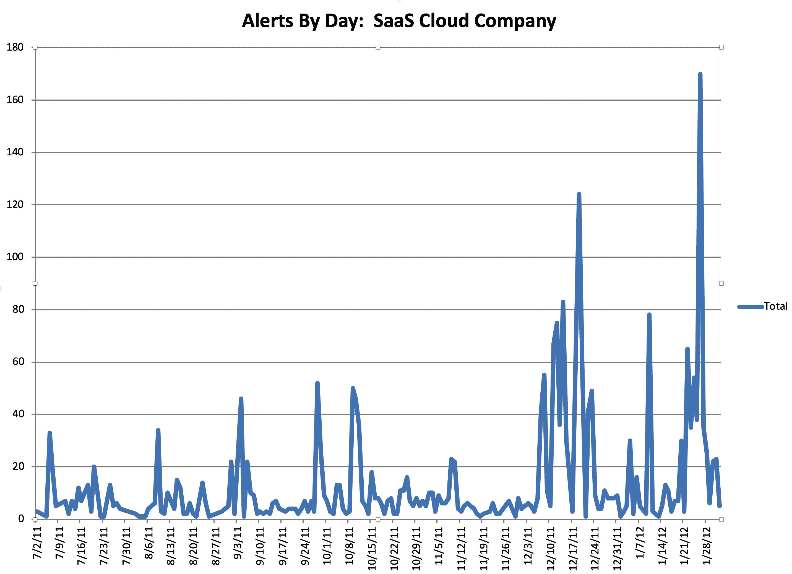
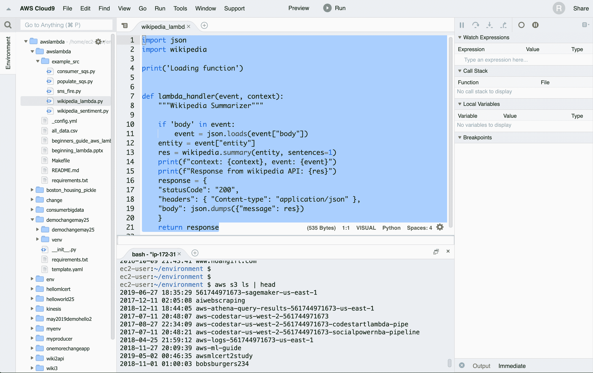
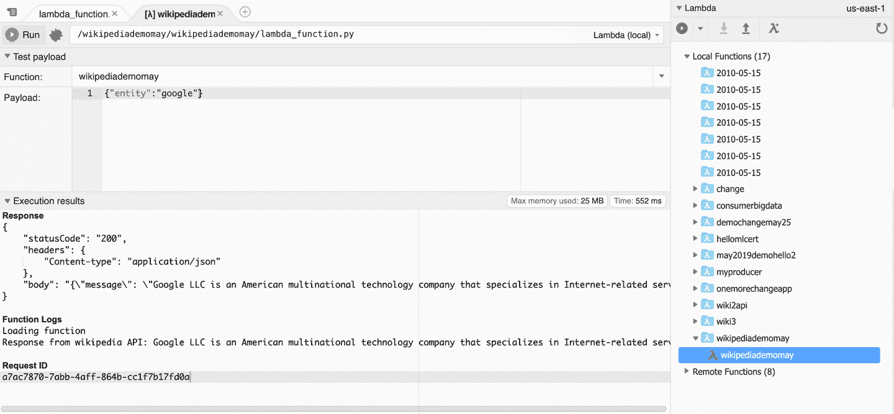
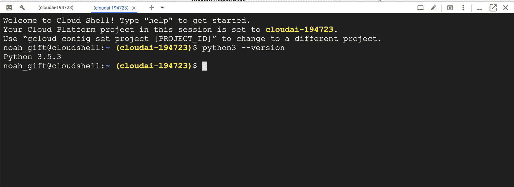
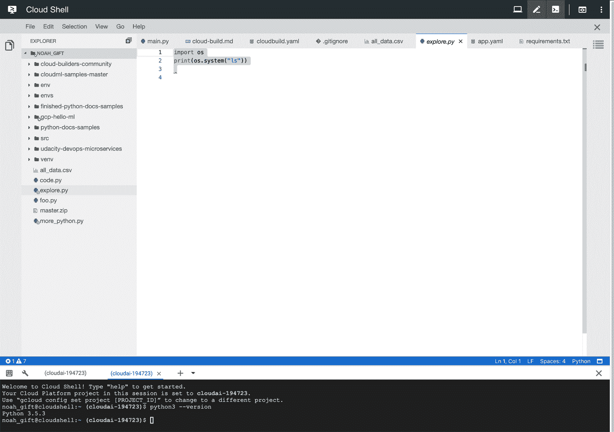
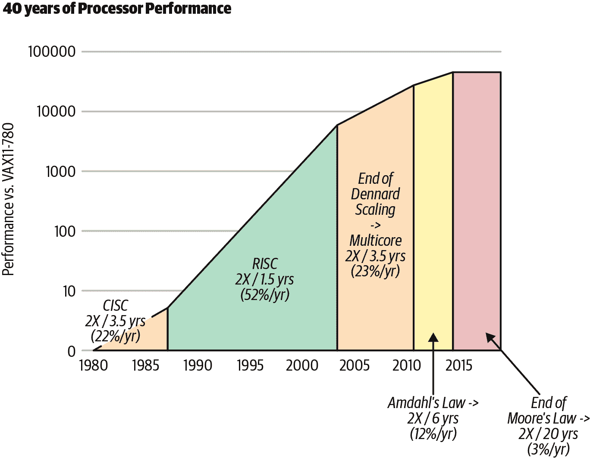
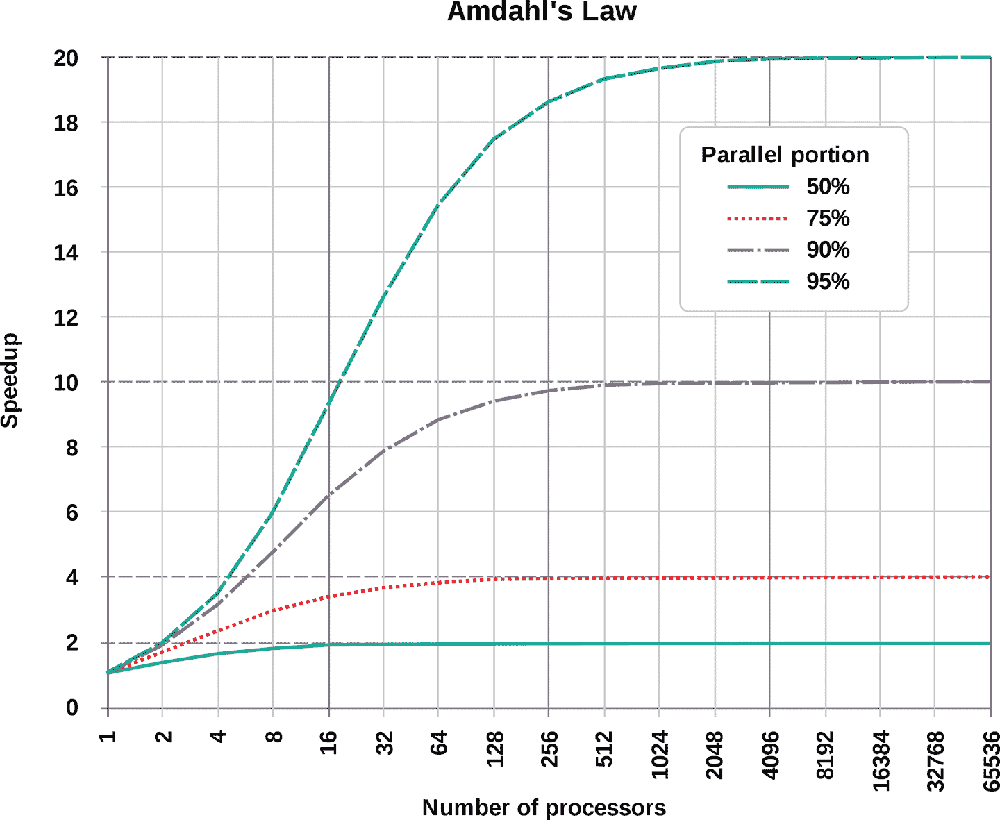
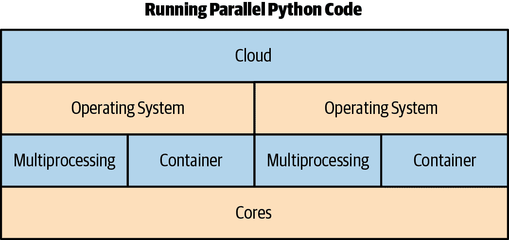

# 第九章 云计算

云计算是一个术语，它像其他流行的现代术语一样会造成混淆，比如大数据、人工智能和敏捷。当一个术语变得足够流行时，最终会对很多人有很多含义。这里是一个精确的定义。云是按需提供计算服务的交付，您只需支付您使用的量，就像任何其他公用事业一样：天然气、电力或水。

云计算的顶级好处包括成本、速度、全球规模、生产力、性能、可靠性和安全性。让我们逐个解析这些。

成本

没有前期成本，资源可以精确计量以满足需求。

速度

云提供自助服务，因此专业用户可以利用资源快速构建解决方案。

全球规模

所有主要云提供商都具有全球规模，这意味着可以在世界各地提供服务，以满足地理区域的需求。

生产力

许多任务，如架设服务器、配置网络硬件和物理保护数据中心，已经不复存在。公司可以专注于构建核心知识产权，而不是重复造轮子。

性能

与您拥有的硬件不同，云硬件不断升级，这意味着最快和最新的硬件始终按需可用。所有硬件还连接在一起，通过低延迟和高带宽的基础设施，创建了一个理想的高性能环境。

可靠性

云的核心架构在每一步都提供冗余。每个区域都有多个数据中心，每个数据中心都有多个。云原生架构可以围绕这些能力设计，从而实现高可用性架构。此外，许多核心云服务本身也具有高可用性，比如亚马逊 S3，其可靠性为九个“9”，即 99.999999999%。

安全性

您的安全性取决于最薄弱的环节。通过集中到中央化的安全性，可以实现更高级别的安全性。诸如物理访问数据中心或静止加密等问题，在第一天就成为行业标准。

# 云计算基础

从某些方面来看，很难在不考虑云的情况下思考 DevOps。亚马逊将以下内容描述为 DevOps 的最佳实践：持续集成、持续交付、微服务、基础设施即代码、监控与日志、以及沟通与协作。在这些最佳实践中，可以说所有这些都依赖于云的存在。即使是较难定义的“沟通与协作”实践，也是通过现代化的 SaaS 沟通工具套件实现的：Jira、Trello、Slack、GitHub 等。所有这些 SaaS 沟通工具都运行在云上。

现代云时代有什么独特之处？至少有三个定义性特征：理论上的无限计算资源，按需访问计算资源以及没有前期资本承诺。这些特征内涵了 DevOps 技能的帕累托分布。

在实践中，云在支持云的真正效率方面使用时变得极具成本效益。另一方面，对于使用云计算的不成熟组织来说，可能会非常昂贵，因为他们没有利用云计算的核心功能。可以说，在云计算的早期阶段，80%的总利润来自于未成熟的用户，他们让实例空闲，选择了错误的实例（过大），没有为自动扩展进行架构设计，或者使用了非云原生的软件架构，例如将所有内容都塞进关系数据库中。同样，其余 20%的总利润来自于具有卓越 DevOps 技能的极为节俭的组织。

在云存在之前，有一个永远不会消失的固定成本。这个成本无论是在金钱上还是在开发人员时间上都是固定的。一个数据中心必须由一个团队来维护，这是一份全职工作，而且非常昂贵。随着云的成熟发展，现在只有最优秀的人才才会在数据中心工作，他们为像谷歌、微软和亚马逊这样极为成熟的组织工作。从统计上讲，小公司无法长期拥有那些水平的数据中心工程师硬件技能。

经济学的一个基本法则是比较优势原则。与其看云计算的成本，然后认为自己可以通过自己动手省钱，不如看看不做某些事情的*机会成本*。大多数组织已经得出结论：

1.  他们无法在数据中心专业知识方面与谷歌、亚马逊和微软竞争。

1.  支付云服务费用使公司能够专注于其他领域，利用他们独特的技能。

Netflix 决定专注于提供流媒体服务和创作原创内容，而不是运营自己的数据中心。如果你看一下 Netflix 从 2008 年到 2019 年的 11 年股票价格（图 9-1），很难反驳这一策略。


###### 图 9-1\. Netflix 11 年股票价格

Netflix 的独特之处在于其在云端运营卓越性上的承诺。目前或曾经在 Netflix 工作的员工在各大会议上发表了许多演讲，在 GitHub 上开发和发布了工具，并在 DevOps 和云计算主题上撰写了文章和书籍。这进一步支持了这样一个观点：仅仅意识到云是正确的选择是不够的，这个决定必须以卓越的运营实践为支撑。否则，一个组织可能会像那些注册了一年会员却只去了三周健身房的人一样，那些不去健身房的会员在经济上补贴了那些经常去的会员。

# 云计算的类型

云计算有几种主要类型：公有云、私有云、混合云和多云。大多数情况下，当我们谈论云时，指的是公有云。但这并不是唯一的云类型。私有云由组织独占使用，可以是物理上位于该组织的数据中心，也可以由另一家公司为该组织托管。一些私有云提供商包括 HPE、VMware、戴尔和甲骨文。一个流行的开源私有云选项是 OpenStack。实际上的一个很好的例子是，Rackspace，一个在托管空间中更为专业的替代品，是 OpenStack 私有云即服务的最大提供商之一。

更加灵活的选择是混合云。混合云结合了私有云和公有云。这种架构的一个例子是在需要可伸缩性和额外容量的情况下使用公有云，而在日常运营中使用私有云。另一个例子可能涉及专用硬件架构，比如在私有云中进行深度学习的 GPU 农场，而连接的公有云则作为核心基础设施。即使是主要的云供应商也进入了这个领域。一个很好的例子是谷歌的 [Anthos 平台](https://cloud.google.com/anthos)。这个平台通过在本地数据中心与 GCP 之间建立链接来完成难以置信的工作，允许以无缝的方式运行 Kubernetes 集群。

最后，多云是一种选择，部分由现代 DevOps 技术（如 Docker 容器）和基础设施即代码（IaC）解决方案（如 Terraform）所启用。多云策略涉及同时使用多个云。一个很好的例子是在多个云上同时运行容器中的作业。为什么这样做？首先，你可以决定在 AWS Spot 实例价格适宜以赚取利润时运行作业，但在 AWS 价格过高时切换到 GCP。像 Terraform 这样的工具允许你将云概念抽象为熟悉的配置语言，而容器允许代码和执行环境在能运行容器的任何目标上运行。

# 云服务的类型

云服务有五种主要类型：基础设施即服务（IaaS），金属即服务（MaaS），平台即服务（PaaS），无服务器，以及软件即服务（SaaS）。这些云服务在不同的抽象层上工作，并各有利弊。让我们来详细了解每一种服务。

## 基础设施即服务

Infrastructure as a Service（基础设施即服务，IaaS）是一个低级别的类别，包括按分钟租用虚拟机、访问对象存储、提供软件定义网络（SDN）和软件定义存储（SDS），以及竞标可用虚拟机的能力。这种服务水平与 AWS 密切相关，特别是在早期（2006 年）亚马逊推出 S3 云存储、SQS（简单队列服务）和 EC2（虚拟机）时。

这项服务对于在 DevOps 方面拥有强大专业知识的组织来说具有巨大的成本效益和可靠性，只需少数人就能完成。缺点是 IaaS 有陡峭的学习曲线，当管理效率低下时，它在成本和人力上可能会非常昂贵。在 2009 年至 2019 年期间的旧金山湾区，这种情况在许多公司的 AWS 上实时发生。

一个令人铭记的故事是，当诺亚管理一个提供监控和搜索工具的 SaaS 公司的工程部门时发生的。在他上任的第一个月，云端发生了两个关乎任务的严重问题。第一个问题发生在第一周，是 SaaS 计费系统错误配置了存储系统。公司正在删除付费客户的数据！问题的要点是他们没有成功在云端运作所需的 DevOps 基础设施：没有构建服务器，没有测试，没有真正的隔离开发环境，没有代码审查，以及有限的自动部署软件能力。诺亚采取的解决措施是这些 DevOps 实践，就在一场象征性的大火正在燃烧的时候。

###### 注意

一名开发人员曾用烤面包机烤培根，导致办公室起火。诺亚闻到了烟味，于是走进了厨房，发现火焰正顺着墙壁和天花板蔓延。他对情况的讽刺意味感到震惊，所以他坐在那里几秒钟，沉浸在其中。幸运的是，一个反应迅速的同事（产品经理）拿起了灭火器，扑灭了火势。

我们的云架构随后发生了第二个更为严重的问题。公司所有开发人员都必须值班，以确保 24/7 覆盖（除了 CTO/创始人经常编写直接或间接导致故障的代码......稍后再说）。一天晚上，当诺亚值班时，他在凌晨 2 点被 CEO/创始人的手机电话吵醒。他告诉诺亚他们被黑客攻击了，整个 SaaS 系统不复存在。平台上没有任何网页服务器、搜索端点或任何其他虚拟机在运行。诺亚问为什么他没有收到警报，CEO 说监控系统也被删除了。诺亚决定凌晨 2 点驱车去公司解决问题。

随着更多信息浮出水面，问题变得显而易见。CEO 和创始人最初设置了 AWS 账户，并且所有有关服务中断的电子邮件都发送到他的邮箱。几个月来，亚马逊一直向他发送关于我们所在地区北弗吉尼亚的虚拟机需要退役并且即将删除的电子邮件。最终那一天到来了，在深夜，整个公司的服务器都停止存在了。

当诺亚开车去上班时，他发现了这个问题，于是专注于从 GitHub 源代码重新构建一个完整的 SaaS 公司。从这一点开始，诺亚开始理解 AWS 的强大和复杂性。他从凌晨 2 点到下午 8 点之间，将 SaaS 系统恢复正常，能够接收数据、处理支付并提供仪表板服务。又花了 48 小时完全恢复所有备份数据。

导致恢复时间如此之长的原因之一是部署过程集中在先前员工创建但从未提交到版本控制的 Puppet 的分支版本上。幸运的是，诺亚在凌晨 6 点左右找到了存活下来的孤立机器上的那个版本的 Puppet 的副本。如果这台机器不存在，可能会导致公司的灭亡。在没有基础设施即代码（IAC）支撑的情况下，完全重建这种复杂公司可能需要一周时间。

一个非常令人压力巨大的经历，但最终有一个相对幸运的结局，给他带来了很多教训。诺亚意识到这是云计算的一个折衷之处；虽然非常强大，但学习曲线对于旧金山湾区的风投支持的初创公司来说压力巨大。现在回到那位 CTO/创始人，他不在值班，但是在没有使用构建服务器或持续集成系统的情况下将代码推送到生产环境。这个人并不是故事的反派。诺亚本人在职业生涯的某个阶段如果成为一家公司的 CTO/创始人，可能也会犯同样的错误。

真正的问题是权力动态。等级制度并不等同于正确性。很容易沉迷于自己的权力，并认为因为你掌管着，你所做的一切总是有道理的。当诺亚经营一家公司时，他也犯了类似的错误。关键要点是过程必须正确，而不是个人。如果不自动化，那就是有问题的。如果没有经过某种类型的自动化质量控制测试，那也是有问题的。如果部署不可重复，那也是有问题的。

最后要分享的关于这家公司的故事涉及监控。在这两次初始危机之后，症状得到了缓解，但根本疾病仍然是恶性的。该公司存在一个无效的工程过程。另一个故事突显了根本问题。有一个自制的监控系统（再次由创始人最初创建），平均每 3-4 小时生成一次警报，每天 24 小时。

由于除了首席技术官外，所有工程人员都在值班，大部分工程人员总是睡眠不足，因为他们每晚都会接到系统不工作的警报。对警报的“修复”是重新启动服务。诺亚自愿连续一个月值班，以便工程有时间解决问题。这段持续的痛苦和缺觉期导致他意识到几件事情。首先，监控系统不比随机更好。他可能用这个 Python 脚本完全替换整个系统：

```py
from  random import choices

hours = list(range(1,25))
status = ["Alert", "No Alert"]
for hour in hours:
    print(f"Hour: {hour} -- {choices(status)}"
```

```py
✗ python random_alert.py
Hour: 1 -- ['No Alert']
Hour: 2 -- ['No Alert']
Hour: 3 -- ['Alert']
Hour: 4 -- ['No Alert']
Hour: 5 -- ['Alert']
Hour: 6 -- ['Alert']
Hour: 7 -- ['Alert']
Hour: 8 -- ['No Alert']
Hour: 9 -- ['Alert']
Hour: 10 -- ['Alert']
Hour: 11 -- ['No Alert']
Hour: 12 -- ['Alert']
Hour: 13 -- ['No Alert']
Hour: 14 -- ['No Alert']
Hour: 15 -- ['No Alert']
Hour: 16 -- ['Alert']
Hour: 17 -- ['Alert']
Hour: 18 -- ['Alert']
Hour: 19 -- ['Alert']
Hour: 20 -- ['No Alert']
Hour: 21 -- ['Alert']
Hour: 22 -- ['Alert']
Hour: 23 -- ['No Alert']
Hour: 24 -- ['Alert']
```

一旦他意识到这一点，他深入挖掘数据，并按天创建了过去一年每个单独警报的历史图片（注意这些警报旨在可行动并“唤醒你”）。从图 9-2 中可以看出，这些警报不仅毫无意义，而且在事后看来频率还荒谬增长。他们在“货物崇拜”工程最佳实践，并象征性地在一个由稻草建造的泥土跑道上挥舞棕榈树枝。



###### 图 9-2\. SaaS 公司每日警报

查看数据后，了解到工程师们花费了多年的生命响应页面和夜间被唤醒，却毫无意义。这种痛苦和牺牲一无所获，强化了生活不公的悲哀真相。这种情况的不公非常令人沮丧，并且需要大量说服才能让人们同意关闭警报。人类行为中有一种固有的偏见，继续做你一直做过的事情。此外，由于痛苦如此严重和持久，往往倾向于赋予更深层次的意义。最终，这是一个虚假的神。

对于这家特定公司使用 AWS 云 IaaS 的回顾实际上是 DevOps 的卖点：

1.  你必须有交付流水线和反馈循环：构建、测试、发布、监控，然后计划。

1.  开发与运维不是独立的。如果首席技术官在编写代码，他们也应该负责值班（多年被惊醒的痛苦和苦难将成为正确的反馈循环）。

1.  地位在等级制度中并不比流程更重要。团队成员之间应该有一种强调所有权和责任的合作关系，不论职称、薪水或者经验水平。

1.  速度是 DevOps 的基本要求。因此，微服务和持续交付是必需的，因为它们使团队能够快速拥有自己的服务并发布软件。

1.  快速交付是 DevOps 的基本要求，但它还需要持续集成、持续交付以及有效和可操作的监控和日志记录。

1.  它提供了在规模上管理基础设施和开发过程的能力。自动化和一致性是硬性要求。使用基础设施即代码（IaC）以可重复和自动化的方式管理开发、测试和生产环境是解决方案。

## **MaaS**（Metal as a Service）

**MaaS**（Metal as a Service）允许你像虚拟机一样处理物理服务器。在管理虚拟机集群时同样便捷的使用体验也适用于物理硬件。MaaS 是由 Canonical 提供的一项服务，Canonical 的所有者马克·舒特尔沃斯特称其为“云语义”进入裸金属世界。MaaS 还可以指的是使用将硬件视为虚拟化硬件的供应商概念。这方面的一个很好的例子是 SoftLayer，这是一家被 IBM 收购的裸金属提供商。

在正面的优势中，对硬件拥有完全控制确实对特定应用具有一定吸引力。这方面的一个很好的例子可以是使用基于 GPU 的数据库。实际上，常规公共云也可以提供类似的服务，因此进行全面的成本效益分析有助于在何时使用 MaaS 时进行合理的辩解。

## 平台即服务（Platform as a Service）

PaaS（Platform as a Service）是一个完整的开发和部署环境，具备创建云服务所需的所有资源。其例子包括 Heroku 和 Google App Engine。PaaS 与 IaaS 不同之处在于它拥有开发工具、数据库管理工具以及高级服务，提供“点对点”集成。可以捆绑的服务类型的例子包括认证服务、数据库服务或 Web 应用服务。

对 PaaS 的一个合理批评是，长期来看它可能比 IaaS 更昂贵，正如之前讨论的；然而这取决于环境。如果组织无法执行 DevOps 行为，那么成本就成了无关紧要的点。在这种情况下，最好支付更昂贵的服务，提供更多这些能力。对于需要学习管理 IaaS 部署高级功能的组织来说，机会成本可能对初创企业的短期生命周期来说太高。对于一个组织来说，把这些能力外包给 PaaS 提供商可能更明智。

## 无服务器计算

无服务器是云计算的新类别之一，仍然在积极发展中。无服务器的真正承诺在于能够花更多时间构建应用程序和服务，而不需要或几乎不需要考虑它们的运行方式。每个主要的云平台都有无服务器解决方案。

服务器无关解决方案的构建模块是计算节点或函数即服务（FaaS）。AWS 拥有 Lambda，GCP 拥有 Cloud Functions，Microsoft 拥有 Azure Functions。传统上，这些云函数的底层执行已经被抽象为一个运行时，即 Python 2.7、Python 3.6 或 Python 3.7\. 所有这些供应商都支持 Python 运行时，并且在某些情况下，它们还支持通过定制的 Docker 容器来定制底层运行时。这里是一个简单的 AWS Lambda 函数示例，用于获取维基百科的第一页。

有几点需要指出关于这个 Lambda 函数。逻辑本身在 `lambda_handler` 中，并且它接受两个参数。第一个参数 `event` 来自于触发它的任何内容。Lambda 可以是从 Amazon Cloud Watch 事件定时器到使用从 AWS Lambda 控制台制定的负载运行。第二个参数 `context` 具有方法和属性，提供有关调用、函数和执行环境的信息。

```py
import json
import wikipedia

print('Loading function')

def lambda_handler(event, context):
    """Wikipedia Summarizer"""

    entity = event["entity"]
    res = wikipedia.summary(entity, sentences=1)
    print(f"Response from wikipedia API: {res}")
    response = {
    "statusCode": "200",
    "headers": { "Content-type": "application/json" },
    "body": json.dumps({"message": res})
    }
    return response
```

要使用 Lambda 函数，需要发送一个 `JSON` 负载：

```py
{"entity":"google"}
```

Lambda 的输出也是一个 `JSON` 负载：

```py
Response
{
    "statusCode": "200",
    "headers": {
        "Content-type": "application/json"
    },
    "body": "{\"message\": \"Google LLC is an American multinational technology"}
}
```

FaaS 最强大的一点之一是能够编写响应事件而不是持续运行的代码：例如 Ruby on Rails 应用程序。FaaS 是云原生能力，真正利用了云的弹性特性。此外，编写 Lambda 函数的开发环境已经有了很大进步。

AWS 的 Cloud9 是一个基于浏览器的开发环境，与 AWS 深度集成（图 9-3）。



###### 图 9-3\. 使用 AWS Cloud9

Cloud9 现在是我编写 AWS Lambda 函数和运行需要 AWS API 密钥的代码的首选环境。Cloud9 内置了用于编写 AWS Lambda 函数的工具，使得在本地构建和测试它们，以及部署到 AWS 中变得简单直观。

图 9-4 显示了如何传递 `JSON` 负载并在 Cloud9 中本地测试 lambda。这种测试方式是这一不断发展平台的显著优势。



###### 图 9-4\. 在 Cloud9 中运行 Lambda 函数

同样，Google Cloud 在你使用 GCP 云 Shell 环境时开始启动你（参见 图 9-5）。云 Shell 还允许您快速启动开发，访问关键命令行工具和完整的开发环境。



###### 图 9-5\. GCP 云 Shell

GCP 云 Shell 编辑器（参见 图 9-6）是一个功能齐全的 IDE，具有语法高亮显示、文件浏览器和许多传统 IDE 中通常找到的其他工具。



###### 图 9-6\. GCP 云 Shell 编辑器

关键要点是，在云端，最好在可能的情况下使用本地开发工具。这样做可以减少安全漏洞，限制由于从笔记本电脑传输数据到云端而导致的减速，并因其与本地环境的深度集成而提高生产力。

## 软件即服务

SaaS 和云从一开始就被结合在一起。随着云端的功能不断增加，SaaS 产品继续在云端创新的基础上分发创新。SaaS 产品有许多优势，特别是在 DevOps 领域。例如，如果你刚开始时可以*租用*一个监控解决方案，为什么要自己建造呢？此外，许多核心的 DevOps 原则，如持续集成和持续交付，也可以通过云供应商提供的 SaaS 应用（如 AWS CodePipeline）或第三方 SaaS 解决方案（如 CircleCI）实现。

在许多情况下，能够混合使用 IaaS、PaaS 和 SaaS 允许现代公司以比 10 年前更可靠和高效的方式开发产品。由于云端以及构建在云端之上的 SaaS 公司的快速演变，每年构建软件变得更加容易。

# 基础设施即代码

IaC 在 第十章 中有更详细的介绍；请参考该章节以获取 IaC 的更详细说明。然而，就云和 DevOps 而言，IaC 是实施真实世界云计算的基本要素。在云上实施 DevOps 实践必须具备 IaC 的能力。

# 持续交付

持续交付是一个较新的术语，可能会在持续集成和持续部署之间产生混淆。关键区别在于软件被*交付*到某个环境，例如一个演示环境，可以进行自动化和手动测试。虽然不要求立即部署，但它处于可部署状态。有关构建系统的更详细解释可以在 第十五章 中找到，但同样值得指出的是，这是正确使用云的基本要求之一。

# 虚拟化和容器

在云中最基本的组成部分莫过于虚拟化了。当 AWS 在 2006 年正式推出时，Amazon 弹性计算云（EC2）是发布的核心服务之一。有几个关键的虚拟化领域需要讨论。

## 硬件虚拟化

AWS 发布的第一个虚拟化抽象是硬件虚拟化。硬件虚拟化有两种形式：半虚拟化（PV）或硬件虚拟机（HVM）。最佳性能来自于 HVM。性能上的关键差异在于，HVM 能够利用硬件扩展，与主机硬件紧密结合，实质上使虚拟机成为主机硬件的一部分，而不仅仅是一个不知情于主机操作的客人。

硬件虚拟化提供了在一个主机上运行多个操作系统的能力，以及将 CPU、I/O（包括网络和磁盘）和内存分区到客户操作系统的能力。这种方法有许多优点，是现代云计算的基础，但对于 Python 本身也存在一些独特的挑战。一个问题是，通常的粒度对于 Python 来说太大，无法充分利用环境。由于 Python 和线程的限制（它们不能在多核上工作），一个有两个核心的虚拟机可能会浪费一个核心。使用硬件虚拟化和 Python 语言，由于缺乏真正的多线程，可能会造成资源的巨大浪费。对于 Python 应用程序的虚拟机配置往往会导致一个或多个核心处于空闲状态，浪费金钱和能源。幸运的是，云计算提供了新的解决方案，帮助消除 Python 语言中的这些缺陷。特别是，容器和无服务器消除了这个问题，因为它们将云视为一个操作系统，而不是线程，有的是 lambda 或容器。而不是在队列上监听线程，lambda 响应来自云队列（例如 SQS）的事件。

## 软件定义网络

软件定义网络（SDNs）是云计算的重要组成部分。SDNs 的杀手级特性在于能够动态和程序化地改变网络行为。在此能力出现之前，这通常由网络专家负责管理，类似于使用 F5 负载均衡器。诺亚曾在一家大型电信公司工作过，那里每天都有一个称为“变更管理”的会议，由一个名叫 Bob 的人负责控制每一个被发布的软件。

要成为 Bob，需要有独特的个性。Bob 和公司内的人们经常发生争吵。这是经典的 IT 运维与开发之间的斗争，Bob 乐于说不。云和 DevOps 完全消除了这个角色、硬件和每周的吵架。持续交付流程是使用精确配置、软件和所需数据持续地构建和部署软件，以用于生产环境。Bob 的角色深深地融入了矩阵中的 0 和 1 中，被一些 Terraform 代码所取代。

## 软件定义存储

软件定义存储（SDS）是一种允许按需配置存储的抽象概念。此存储可以配置有细粒度的磁盘 I/O 和网络 I/O。一个很好的例子是亚马逊的 EBS 卷，您可以在其中配置已配置的磁盘 I/O。通常，云 SDS 会随着卷大小自动增加磁盘 I/O。一个如何在实践中工作的绝佳例子是亚马逊弹性文件系统（EFS）。EFS 随着存储大小的增长增加磁盘 I/O（这是自动发生的），并且设计用于支持同时来自数千个 EC2 实例的请求。它还与亚马逊 EC2 实例深度集成，允许挂起的写入进行缓冲并异步发生。

诺亚在这种情况下使用 EFS 有丰富的经验。在 AWS 批处理可用之前，他设计并编写了一个系统，该系统利用了数千个挂载了 EFS 卷的 spot 实例，它们执行从 Amazon SQS 收集的分布式计算机视觉作业。使用一个始终在线的分布式文件系统对于分布式计算来说是一个巨大的优势，并且它简化了从部署到集群计算的一切。

## 容器

容器已经存在了几十年，它们指的是操作系统级虚拟化。内核允许存在隔离的用户空间实例。在 2000 年代初期，有许多托管公司使用 Apache 网站的虚拟托管作为操作系统级虚拟化的形式。大型机和经典的 Unix 操作系统，如 AIX、HP-UX 和 Solaris，多年来也拥有先进的容器形式。作为开发人员，诺亚在 2007 年推出的 Solaris LDOM 技术中使用了 Solaris LDOM 技术，并对他如何能够安装允许对 CPU、内存和 I/O 进行细粒度控制的完整操作系统而感到敬畏，所有这些都可以通过远程登录到具有带外管理卡的机器来完成。

容器的现代版本正在快速发展，借鉴了主机时代的优秀特性，并结合了像源代码控制这样的新思想。特别是，容器的一个重大革新是将其视为从版本控制中签出的项目。Docker 容器现在是容器的标准格式，所有主要的云供应商都支持 Dockerfile 容器和 Kubernetes 容器管理软件。有关容器的更多信息，请参阅第十二章，但与云相关的基本内容列于此处：

容器注册表

所有的云服务提供商都有一个容器注册表，用于存储您的容器。

Kubernetes 管理服务

所有的云服务提供商都有 Kubernetes 服务，并且这现在是管理基于容器的部署的标准。

Dockerfile 格式

这是构建容器的标准方法，它是一个简单的文件格式。在构建过程中使用像[hadolint](https://oreil.ly/XboVE)这样的代码审查工具是一个最佳实践，以确保简单的错误不会通过。

使用容器进行持续集成

所有的云服务提供商都有基于云的构建系统，允许与容器集成。谷歌有[Cloud Build](https://oreil.ly/xy6Ag)，亚马逊有[AWS CodePipeline](https://oreil.ly/I5bdH)，Azure 有[Azure Pipelines](https://oreil.ly/aEOx4)。它们都可以构建容器并将其注册到容器注册表中，同时也可以使用容器构建项目。

深度集成容器到所有云服务中

当你进入云平台上的托管服务时，可以放心它们都有一个共同点——容器！亚马逊的 SageMaker，一个托管的机器学习平台，使用容器。谷歌云 Shell 云开发环境使用容器来允许您定制开发环境。

# 分布式计算中的挑战和机遇

计算机科学中最具挑战性的领域之一是分布式计算。在云计算的现代时代，有几个根本性的转变彻底改变了一切。最显著的转变之一是多核机器的兴起和摩尔定律的终结。请参见图 9-7。



###### 图 9-7\. 摩尔定律的终结（来源：John Hennessy 和 David Patterson，《计算机体系结构：定量方法》第 6 版，2018 年）

摩尔定律揭示了云时代表现出来的两个基本问题。第一个问题是，CPU 被设计为多用途处理器。它们并不专门用于运行并行工作负载。如果将其与增加 CPU 速度的终极物理极限相结合，CPU 在云时代变得不那么关键。在 2015 年，摩尔定律实际上结束了，每年的增益率为 3%。

第二个问题是，为了抵消单处理器速度的限制而制造多核机器导致了软件语言的连锁反应。许多语言以前在多核利用方面存在重大问题，因为它们是在多处理器甚至是互联网之前设计的时代。Python 在这里是一个很好的例子。更具挑战性的是，图 9-8 显示，通过为主要非并行问题增加更多核心并不是一种“免费午餐”。



###### 图 9-8\. 阿姆达尔定律

云和不同的架构的机会，例如应用特定集成电路（ASIC）。这些包括图形处理单元（GPU）、现场可编程门阵列（FPGA）和张量处理单元（TPU）。这些专用芯片越来越多地用于机器学习工作负载，并为使用多种硬件组合解决分布式计算中的复杂问题铺平了道路。

# 云时代的 Python 并发性、性能和进程管理

想象一下，在旧金山的一个危险街区深夜走在黑暗的街道上。在这种情况下，你是巴西柔术的黑带。你独自一人，注意到有个陌生人似乎在跟踪你。当他们走近时，你的心开始加速，你想到了你多年的武术训练。你会不会不得不在街上和陌生人打斗？你每周在健身房与对手进行活跃的实战。你觉得自己准备好了，如果需要的话可以保护自己。你也知道巴西柔术是一种高效的武术，适用于现实世界的情况。

另一方面，与人打斗仍然是要避免的事情。这是危险的。可能会涉及武器。你可能会赢得这场斗争，但会严重伤害你的对手。你也可能会输掉这场战斗，并且自己也会受重伤。即使是巴西柔术的专家也知道，在街头打斗并不是一个理想的场景，尽管很有可能会赢得比赛。

Python 中的并发性非常类似。有一些方便的模式，如多进程和 asyncio。最好是节制地使用并发性。通常，与通过编程语言自己创建的并发性相比，使用平台的并发性选项（无服务器、批处理处理、竞价实例）更好。

# 进程管理

Python 中的进程管理是该语言的一个突出能力。当 Python 作为连接其他平台、语言和进程的胶水时，它表现最佳。此外，进程管理的实际实现在多年来已经发生了显著变化，并且继续改进。

## 用子进程管理进程

使用标准库启动进程最简单和最有效的方法是使用`run()`函数。只要你安装了 Python 3.7 或更高版本，就从这里开始简化你的代码。一个简单的示例只需要一行代码：

```py
out = subprocess.run(["ls", "-l"], capture_output=True)
```

这行代码几乎可以满足你所需。它在 Python 子进程中调用 shell 命令并捕获输出。返回值是一个`CompletedProcess`类型的对象。这个对象包含了启动进程时使用的`args`：`returncode`、`stdout`、`stderr`和`check_returncode`。

这个一行代码替换了过于冗长和复杂的调用 shell 命令的方法。对于经常写 Python 代码并夹杂着 shell 命令的开发人员来说，这非常棒。以下是一些可能有用的其他提示。

### 避免使用 shell=True

最佳实践是将命令作为列表中的项调用：

```py
subprocess.run["ls", "-la"]
```

最好避免使用字符串：

```py
#AVOID THIS
subprocess.run("ls -la", shell=True)
```

这样做的原因很简单。如果你接受任意字符串并执行它，很容易意外引入一个安全漏洞。假设你编写了一个允许用户列出目录的简单程序。用户可以植入任何想要的命令并利用你的程序。意外制造后门非常可怕，希望这说明了使用`shell=True`是多么糟糕的主意！

```py
#This is input by a malicious user and causes permanent data loss
user_input = 'some_dir && rm -rf /some/important/directory'
my_command = "ls -l " + user_input
subprocess.run(my_command, shell=True)
```

相反，你可以通过不允许使用字符串完全避免这个问题：

```py
#This is input by a malicious user and does nothing
user_input = 'some_dir && rm -rf /some/important/directory'
subprocess.run(["ls", "-l", user_input])
```

### 设置适当的超时时间并在适当时处理它们

如果你正在编写一个可能运行一段时间的进程的代码，你应该设置一个明智的默认超时时间。一个测试这个的简单方法是使用 Unix 的`sleep`命令。下面是一个在 IPython shell 中在超时触发之前完成的`sleep`命令的示例。它返回一个`CompletedProcess`对象：

```py
In [1]: subprocess.run(["sleep", "3"], timeout=4)
Out[1]: CompletedProcess(args=['sleep', '3'], returncode=0)
```

这里是第二个版本，它会抛出一个异常。在大多数情况下，处理这个异常会很明智：

```py
----> 1 subprocess.run(["sleep", "3"], timeout=1)

/Library/Frameworks/Python.framework/Versions/3.7/lib/python3.7/subprocess.py
 in run(input, capture_output, timeout, check, *popenargs, **kwargs)
    477             stdout, stderr = process.communicate()
    478             raise TimeoutExpired(process.args, timeout, output=stdout,
--> 479                                  stderr=stderr)
    480       except:  # Including KeyboardInterrupt, communicate handled that.
    481             process.kill()

TimeoutExpired: Command '['sleep', '3']' timed out after 1 seconds
```

一个合理的做法是捕获这个异常`TimeoutExpired`，然后记录异常并实现一些清理代码：

```py
import logging
import subprocess

try:
    subprocess.run(["sleep", "3"], timeout=4)
except subprocess.TimeoutExpired:
    logging.exception("Sleep command timed out")
```

在构建专业级别的系统时，记录异常至关重要。如果这段代码稍后部署在许多机器上，没有一个可搜索的集中式日志系统，追踪错误可能会变得不可能。对于 DevOps 专业人员来说，遵循这个模式并传播它的用处是至关重要的。

### 用 Python 线程的问题

你可能在成长过程中有过父母告诉你不要和某个朋友交往的经历。如果是这样，很可能是因为你的父母试图帮助你避免犯错。Python 线程就像你成长过程中那个糟糕的朋友一样。如果你继续和它们联系，事情不会有好结果。

在其他语言中，线程是一个合理的折衷方案。在像 C#这样的语言中，你可以执行与队列连接的线程池，并期望每个生成的线程都可以利用设备上的所有核心。这种已经被证明有效的使用线程与队列的模式减少了在代码中手动设置和移除锁的缺点。

Python 不是这样工作的。如果你生成线程，它不会利用你机器上的所有核心，并且它通常会表现出非确定性的方式，从一个核心跳到另一个核心，甚至“减慢你的代码”。为什么在有替代方案的情况下要使用这样的东西呢？

如果你对学习更多关于 DevOps 感兴趣，那么你很可能专注于实用性。你只想学习和应用实际和有意义的知识。实用性是避免在 Python 中使用线程的另一个理由。理论上，在某些情况下可以使用线程并获得性能提升，如果问题是 I/O 绑定的话。然而，再次问一下，为什么要使用一个不可靠的工具，当有可靠的工具存在时？在 Python 中使用线程就像开车需要推一下然后通过弹跳离合器来启动汽车，因为电池不靠谱。当你没有地方可以推动它或者无法把车停在斜坡上时会发生什么？采用这种策略纯粹是疯狂的！

本章中没有使用线程的示例。为什么展示一些不正确的东西？与其使用线程，不如专注于本章中概述的其他替代方案。

## 使用多进程解决问题

多进程库是使用 Python 标准库在机器上利用所有核心的唯一统一方式。查看图 9-9 时，操作系统级别有几个选择：多进程和容器。



###### 图 9-9\. 运行并行 Python 代码

使用容器作为替代方案是一个重要的区别。如果使用多进程库的目的是在没有进程间通信的情况下多次调用进程，可以有很强的理由使用容器、虚拟机或云原生构造，如函数即服务。一个受欢迎且有效的云原生选项是 AWS Lambda。

同样，与自行分叉进程相比，容器具有许多优势。容器有许多优点。容器定义为代码。容器可以精确地调整到所需的级别：即内存、CPU 或磁盘 I/O。它们是直接竞争对手，通常是自行分叉进程的更好替代品。在实践中，它们也可以更容易地融入 DevOps 思维方式。

从 DevOps 的角度来看，如果你认同这样一个观点，即除非没有其他选择，否则应该避免在 Python 中自己实现并发，那么即使是使用 multiprocessing 模块的场景也是有限的。也许在开发和实验阶段，multiprocessing 最好只作为一种工具，因为在容器和云层面都存在更好的选择。

另一种说法是问你信任哪个进程分叉：你在 Python 中编写的多进程代码，Google 编写的 Kubernetes 开发人员，还是亚马逊编写的 AWS Lambda 开发人员？经验告诉我，当我站在巨人的肩膀上时，我做出了最好的决定。在哲学考虑之后，这里是一些有效使用多进程的方法。

## 使用 Pool()分叉进程

测试多进程分叉能力并针对其运行函数的一个直接方法是使用 sklearn 机器学习库计算 KMeans 聚类。KMeans 计算密集且时间复杂度为 O(n**2)，这意味着随着数据量增加，其增长速度会指数级减慢。这个例子非常适合在宏观或微观级别上并行化处理。在下面的例子中，`make_blobs`方法创建了一个包含 10 万条记录和 10 个特征的数据集。每个 KMeans 算法的计时以及总计时如下：

```py
from sklearn.datasets.samples_generator import make_blobs
from sklearn.cluster import KMeans
import time

def do_kmeans():
    """KMeans clustering on generated data"""

    X,_ = make_blobs(n_samples=100000, centers=3, n_features=10,
                random_state=0)
    kmeans = KMeans(n_clusters=3)
    t0 = time.time()
    kmeans.fit(X)
    print(f"KMeans cluster fit in {time.time()-t0}")

def main():
    """Run Everything"""

    count = 10
    t0 = time.time()
    for _ in range(count):
        do_kmeans()
    print(f"Performed {count} KMeans in total time: {time.time()-t0}")

if __name__ == "__main__":
    main()
```

KMeans 算法的运行时显示，其是一个昂贵的操作，运行 10 次迭代需要 3.5 秒：

```py
(.python-devops) ➜  python kmeans_sequential.py
KMeans cluster fit in 0.29854321479797363
KMeans cluster fit in 0.2869119644165039
KMeans cluster fit in 0.2811620235443115
KMeans cluster fit in 0.28687286376953125
KMeans cluster fit in 0.2845759391784668
KMeans cluster fit in 0.2866239547729492
KMeans cluster fit in 0.2843656539916992
KMeans cluster fit in 0.2885470390319824
KMeans cluster fit in 0.2878849506378174
KMeans cluster fit in 0.28443288803100586
Performed 10 KMeans in total time: 3.510640859603882
```

在下面的例子中，使用`multiprocessing.Pool.map`方法将 10 个 KMeans 集群操作分配给一个包含 10 个进程的池。这个例子通过将参数`100000`映射到函数`do_kmeans`来实现：

```py
from multiprocessing import Pool
from sklearn.datasets.samples_generator import make_blobs
from sklearn.cluster import KMeans
import time

def do_kmeans(n_samples):
    """KMeans clustering on generated data"""

    X,_ = make_blobs(n_samples, centers=3, n_features=10,
                random_state=0)
    kmeans = KMeans(n_clusters=3)
    t0 = time.time()
    kmeans.fit(X)
    print(f"KMeans cluster fit in {time.time()-t0}")

def main():
    """Run Everything"""

    count = 10
    t0 = time.time()
    with Pool(count) as p:
        p.map(do_kmeans, [100000,100000,100000,100000,100000,
                    100000,100000,100000,100000,100000])

    print(f"Performed {count} KMeans in total time: {time.time()-t0}")

if __name__ == "__main__":
    main()
```

每个 KMeans 操作的运行时间较慢，但总体加速度翻倍。这是并发框架的常见问题；并行工作分配有开销。并行代码的运行并不是“免费午餐”。每个任务的启动时间约为 1 秒：

```py
(.python-devops) ➜ python kmeans_multiprocessing.py
KMeans cluster fit in 1.3836050033569336
KMeans cluster fit in 1.3868029117584229
KMeans cluster fit in 1.3955950736999512
KMeans cluster fit in 1.3925609588623047
KMeans cluster fit in 1.3877739906311035
KMeans cluster fit in 1.4068050384521484
KMeans cluster fit in 1.41087007522583
KMeans cluster fit in 1.3935530185699463
KMeans cluster fit in 1.4161033630371094
KMeans cluster fit in 1.4132652282714844
Performed 10 KMeans in total time: 1.6691410541534424
```

这个例子展示了为什么对代码进行性能分析和谨慎立即跳转到并发是至关重要的。如果问题规模较小，那么并行化方法的开销可能会使代码变慢，并且调试起来更加复杂。

从 DevOps 的角度来看，最直接和最可维护的方法始终应该是首选。实际上，这可能意味着这种多进程并行化的风格是一个合理的方法，但在尝试宏观准备水平的并行化方法之前不要轻易采用。一些替代的宏观方法可能包括使用容器，使用 FaaS（如 AWS Lambda 或其他无服务器技术），或者使用一个高性能服务器，Python 运行工人对其进行工作（如 RabbitMQ 或 Redis）。

## 作为服务的函数和无服务器

现代 AI 时代已经创建了压力，促使新范式的出现。CPU 时钟速度的增加已经停滞不前，这实际上结束了摩尔定律。与此同时，数据爆炸、云计算的兴起以及应用特定集成电路（ASIC）的可用性填补了这一空白。现在，函数作为工作单元已经成为一个重要的概念。

Serverless 和 FaaS 可以在某种程度上互换使用，它们描述了在云平台上作为工作单元运行函数的能力。

## 使用 Numba 进行高性能 Python

Numba 是一个非常酷的库，用于进行分布式问题解决的实验。使用它就像是用高性能的市场售后部件改装你的汽车一样。它还利用了使用 ASIC 解决特定问题的趋势。

## 使用 Numba 即时编译器

让我们来看看 [官方文档示例](https://oreil.ly/KlW5s) 中关于 Numba 即时编译器（JIT）的例子，稍作调整，然后分析发生了什么。

这个示例是一个被 JIT 装饰的 Python 函数。参数 `nopython=True` 强制代码通过 JIT 并使用 LLVM 编译器进行优化。如果不选择这个选项，意味着如果某些内容无法转换为 LLVM，则会保持常规的 Python 代码：

```py
import numpy as np
from numba import jit

@jit(nopython=True)
def go_fast(a):
    """Expects Numpy Array"""

    count = 0
    for i in range(a.shape[0]):
        count += np.tanh(a[i, i])
    return count + trace
```

接下来，创建一个 numpy 数组，并使用 IPython 的魔术函数来计时它：

```py
x = np.arange(100).reshape(10, 10)
%timeit go_fast(x)
```

输出显示，运行该代码耗时 855 纳秒：

```py
The slowest run took 33.43 times longer than the fastest. This example could mean
that an intermediate result is cached. 1000000 loops, best of 3: 855 ns per loop
```

可以使用此技巧运行常规版本以避免装饰器：

```py
%timeit go_fast.py_func(x)
```

输出显示，没有 JIT，常规 Python 代码运行速度慢了 20 倍：

```py
The slowest run took 4.15 times longer than the fastest. This result could mean
that an intermediate run is cached. 10000 loops, best of 3: 20.5 µs per loop
```

使用 Numba JIT，for 循环是可以加速的优化对象。它还优化了 numpy 函数和 numpy 数据结构。这里的主要观点是，也许值得查看已运行多年的现有代码，看看 Python 基础架构的关键部分是否可以受益于使用 Numba JIT 进行编译。

## 使用高性能服务器

自我实现是人类发展中的一个重要概念。自我实现的最简单定义是个体达到他们真实潜力的状态。为了做到这一点，他们必须接受自己的人性，包括其中的所有缺陷。有一种理论认为，不到 1%的人已完全实现了自我。

同样的概念也可以应用于 Python，这种语言。全面接受语言的优势和劣势允许开发人员充分利用它。Python 不是一种高性能语言。Python 不是一种像其他语言（如 Go、Java、C、C++、C# 或 Erlang）那样优化用于编写服务器的语言。相反，Python 是一种在高性能语言或平台上应用高级逻辑的语言。

Python 之所以广受欢迎，是因为它符合人类思维的自然过程。通过足够的语言使用经验，你可以像使用母语一样思考 Python。逻辑可以用许多方式表达：语言、符号表示、代码、图片、声音和艺术。计算机科学构造，如内存管理、类型声明、并发原语和面向对象设计可以从纯逻辑中抽象出来。它们对于表达一个想法是可选的。

类似 Python 这样的语言的强大之处在于它允许用户在逻辑层面工作，而不是计算机科学层面。什么是要点？为任务选择正确的工具，而通常这是云或另一种语言的服务。

# 结论

DevOps 和数据科学都有一个共同点，那就是它们既是职位名称，又是能力。DevOps 方法的一些好处是速度、自动化、可靠性、规模和安全性通过实用主义实现。在考虑可用框架和解决方案之前使用宏观级别的解决方案来提高并发和进程管理的效率是一种危险的 DevOps 反模式。

Python 在云时代的要点是什么？

+   学会为手头的任务掌握正确的并发技术。

+   学会使用高性能计算库 Numba 为你的代码提速，使用真实线程、JIT 和 GPU。

+   学会使用 FaaS 优雅地解决独特问题。

+   将云视为操作系统，并让它承担并发的繁重工作。

+   拥抱云原生构造，如持续交付、Docker 格式容器和无服务器。

# 练习

+   什么是 IaaS？

+   什么是 PaaS？

+   弹性是什么意思？

+   可用性是什么意思？

+   什么是块存储？

+   云计算服务的不同类型是什么？

+   什么是无服务器？

+   IaaS 和 PaaS 之间有哪些关键区别？

+   什么是 CAP 定理？

+   什么是阿姆达尔定律？

# 案例研究问题

+   一家公司犹豫不决地转向云计算，因为它听说可能会更昂贵。有哪些方法可以减轻采用云计算的成本风险？

+   什么是云原生架构的例子？绘制一个云原生系统的架构图，并列出关键特性。

+   spot 或抢先实例有什么作用？它们如何节省金钱？它们适用于什么问题？它们不适用于什么问题？
