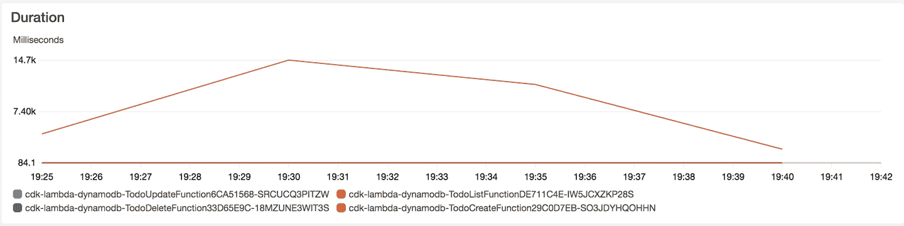
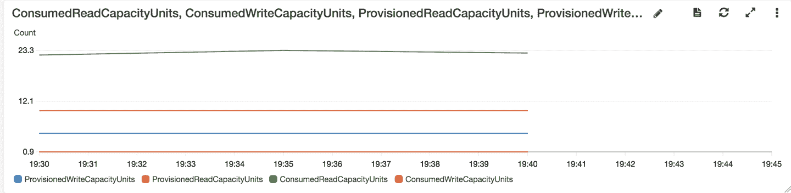
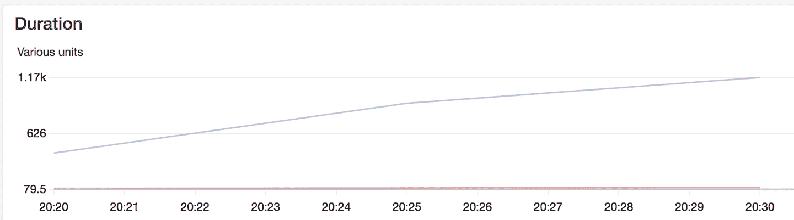
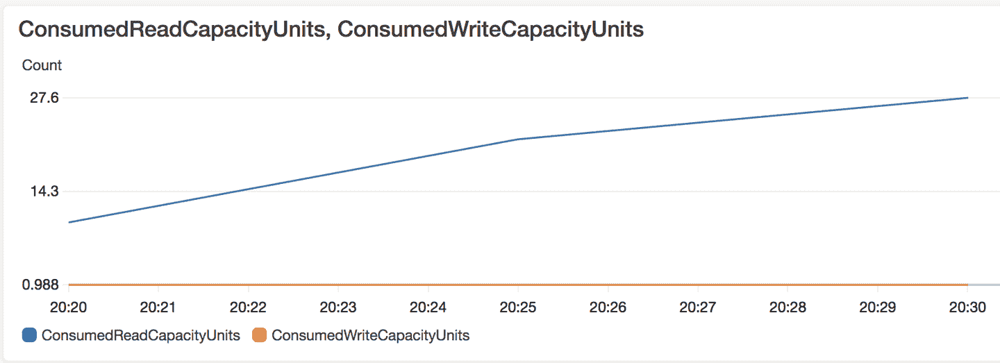
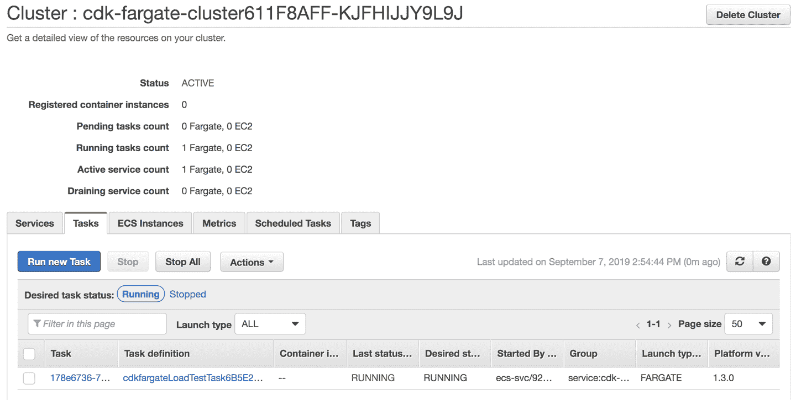
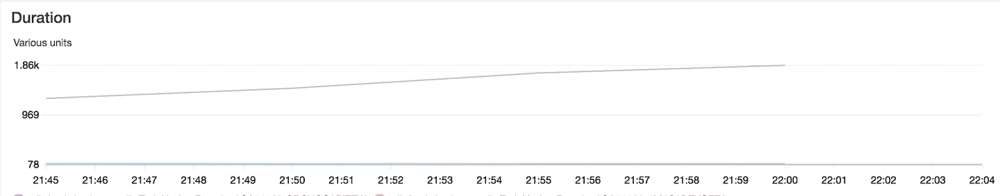
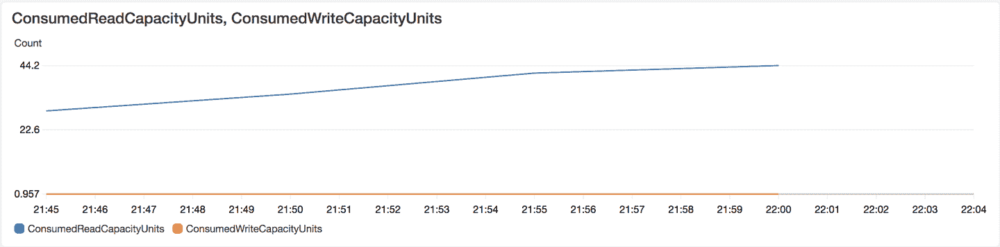
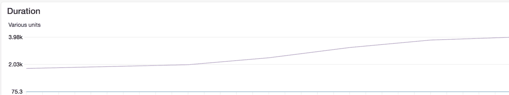
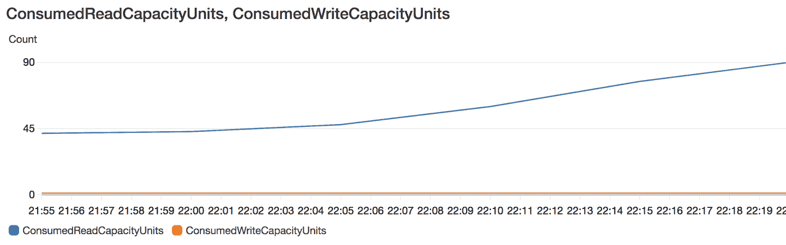

# 第十三章。无服务器技术

*无服务器*是当今 IT 行业中引起很多关注的一个词汇。像这样的词汇经常会导致人们对它们的实际含义有不同的看法。表面上看，*无服务器*意味着一个你不再需要担心管理服务器的世界。在某种程度上，这是正确的，但只适用于使用*无服务器*技术提供的功能的开发人员。本章展示了在幕后需要发生很多工作才能实现这个无服务器的神奇世界。

许多人将术语*无服务器*等同于函数即服务（FaaS）。这在某种程度上是正确的，这主要是因为 AWS 在 2015 年推出了 Lambda 服务。AWS Lambdas 是可以在云中运行的函数，而无需部署传统服务器来托管这些函数。因此，*无服务器*这个词就诞生了。

然而，FaaS 并不是唯一可以称为无服务器的服务。如今，三大公共云提供商（亚马逊、微软和谷歌）都提供容器即服务（CaaS），允许您在它们的云中部署完整的 Docker 容器，而无需提供托管这些容器的服务器。这些服务也可以称为无服务器。这些服务的示例包括 AWS Fargate、Microsoft Azure 容器实例和 Google Cloud Run。

无服务器技术的一些用例是什么？对于像 AWS Lambda 这样的 FaaS 技术，特别是由于 Lambda 函数可以被其他云服务触发的事件驱动方式，用例包括：

+   提取-转换-加载（ETL）数据处理，其中，例如，将文件上传到 S3，触发 Lambda 函数对数据进行 ETL 处理，并将其发送到队列或后端数据库

+   对其他服务发送到 CloudWatch 的日志进行 ETL 处理

+   基于 CloudWatch Events 触发 Lambda 函数以类似 cron 的方式调度任务

+   基于 Amazon SNS 触发 Lambda 函数的实时通知

+   使用 Lambda 和 Amazon SES 处理电子邮件

+   无服务器网站托管，静态 Web 资源（如 Javascript、CSS 和 HTML）存储在 S3 中，并由 CloudFront CDN 服务前端处理，以及由 API Gateway 处理的 REST API 将 API 请求路由到 Lambda 函数，后者与后端（如 Amazon RDS 或 Amazon DynamoDB）通信

每个云服务提供商的在线文档中都可以找到许多无服务器使用案例。例如，在 Google Cloud 无服务器生态系统中，Web 应用程序最适合由 Google AppEngine 处理，API 最适合由 Google Functions 处理，而 CloudRun 则适合在 Docker 容器中运行进程。举个具体的例子，考虑一个需要执行 TensorFlow 框架的机器学习任务（如对象检测）的服务。由于 FaaS 的计算、内存和磁盘资源限制，再加上 FaaS 设置中库的有限可用性，可能更适合使用 Google Cloud Run 这样的 CaaS 服务来运行这样的服务，而不是使用 Google Cloud Functions 这样的 FaaS 服务。

三大云服务提供商还围绕其 FaaS 平台提供丰富的 DevOps 工具链。例如，当你使用 AWS Lambda 时，你可以轻松地添加 AWS 的这些服务：

+   AWS X-Ray 用于追踪/可观测性。

+   Amazon CloudWatch 用于日志记录、警报和事件调度。

+   AWS Step Functions 用于无服务器工作流协调。

+   AWS Cloud9 用于基于浏览器的开发环境。

如何选择 FaaS 和 CaaS？在一个维度上，这取决于部署的单位。如果你只关心短暂的函数，少量依赖和少量数据处理，那么 FaaS 可以适合你。另一方面，如果你有长时间运行的进程，有大量依赖和重的计算需求，那么使用 CaaS 可能更好。大多数 FaaS 服务对运行时间（Lambda 的最长时间为 15 分钟）、计算能力、内存大小、磁盘空间、HTTP 请求和响应限制都有严格的限制。FaaS 短执行时间的优势在于你只需支付函数运行的时长。

如果你还记得第 第十二章 开头关于宠物与牲畜与昆虫的讨论，函数可以真正被视为短暂存在、执行一些处理然后消失的短命昆虫。由于它们的短暂特性，FaaS 中的函数也是无状态的，这是在设计应用程序时需要牢记的重要事实。

选择 FaaS 和 CaaS 的另一个维度是你的服务与其他服务之间的交互次数和类型。例如，AWS Lambda 函数可以由其他至少八个 AWS 服务异步触发，包括 S3、简单通知服务（SNS）、简单电子邮件服务（SES）和 CloudWatch。这种丰富的交互使得编写响应事件的函数更加容易，因此在这种情况下 FaaS 胜出。

正如您在本章中将看到的，许多 FaaS 服务实际上基于 Kubernetes，这些天是事实上的容器编排标准。尽管您的部署单元是一个函数，但在幕后，FaaS 工具会创建和推送 Docker 容器到一个您可能管理或可能不管理的 Kubernetes 集群中。OpenFaas 和 OpenWhisk 是这种基于 Kubernetes 的 FaaS 技术的示例。当您自托管这些 FaaS 平台时，您很快就会意识到*服务器*构成了大部分无服务器的单词。突然间，您不得不非常关心如何照料和喂养您的 Kubernetes 集群。

当我们将 DevOps 一词分为其部分 Dev 和 Ops 时，无服务器技术更多地针对 Dev 方面。它们帮助开发人员在部署其代码时感觉少一些摩擦。特别是在自托管场景中，负担在 Ops 身上，以提供将支持 FaaS 或 CaaS 平台的基础设施（有时非常复杂）。然而，即使 Dev 方面在使用无服务器时可能觉得 Ops 需求较少（这确实会发生，尽管根据定义这种分割使其成为非 DevOps 情况），在使用无服务器平台时仍然有很多与 Ops 相关的问题需要担心：安全性、可伸缩性、资源限制和容量规划、监视、日志记录和可观察性。传统上，这些被视为 Ops 的领域，但在我们讨论的新兴 DevOps 世界中，它们需要由 Dev 和 Ops 共同解决并合作。一个 Dev 团队在完成编写代码后不应该觉得任务已经完成。相反，它应该承担责任，并且是的，以在生产环境中全程完成服务，并内置良好的监控、日志记录和跟踪。

我们从这一章开始，展示如何使用它们的 FaaS 提供的相同 Python 函数（表示简单 HTTP 端点），将其部署到“三巨头”云提供商。

###### 注

以下示例中使用的某些命令会产生大量输出。除了在理解命令时必要的情况下，我们将省略大部分输出行，以节省树木并使读者能够更好地专注于文本。

# 将相同的 Python 函数部署到“三巨头”云提供商

对于 AWS 和 Google，我们使用无服务器平台，通过抽象出参与 FaaS 运行时环境的云资源的创建来简化这些部署。无服务器平台目前尚不支持 Microsoft Azure 的 Python 函数，因此在这种情况下，我们展示如何使用 Azure 特定的 CLI 工具。

## 安装无服务器框架

[无服务器平台](https://serverless.com)基于 nodejs。要安装它，请使用`npm`：

```py
$ npm install -g serverless
```

## 将 Python 函数部署到 AWS Lambda

首先克隆无服务器平台示例 GitHub 存储库：

```py
$ git clone https://github.com/serverless/examples.git
$ cd aws-python-simple-http-endpoint
$ export AWS_PROFILE=gheorghiu-net
```

Python HTTP 端点定义在文件*handler.py*中：

```py
$ cat handler.py
import json
import datetime

def endpoint(event, context):
    current_time = datetime.datetime.now().time()
    body = {
        "message": "Hello, the current time is " + str(current_time)
    }

    response = {
        "statusCode": 200,
        "body": json.dumps(body)
    }

    return response
```

无服务器平台使用声明性方法指定需要创建的资源，该方法使用一个名为*serverless.yaml*的 YAML 文件。以下是声明一个名为`currentTime`的函数的文件，对应于之前定义的`handler`模块中的 Python 函数`endpoint`：

```py
$ cat serverless.yml
service: aws-python-simple-http-endpoint

frameworkVersion: ">=1.2.0 <2.0.0"

provider:
  name: aws
  runtime: python2.7 # or python3.7, supported as of November 2018

functions:
  currentTime:
    handler: handler.endpoint
    events:
      - http:
          path: ping
          method: get
```

在*serverless.yaml*中修改 Python 版本为 3.7：

```py
provider:
  name: aws
  runtime: python3.7
```

通过运行`serverless deploy`命令将函数部署到 AWS Lambda：

```py
$ serverless deploy
Serverless: Packaging service...
Serverless: Excluding development dependencies...
Serverless: Uploading CloudFormation file to S3...
Serverless: Uploading artifacts...
Serverless:
Uploading service aws-python-simple-http-endpoint.zip file to S3 (1.95 KB)...
Serverless: Validating template...
Serverless: Updating Stack...
Serverless: Checking Stack update progress...
..............
Serverless: Stack update finished...
Service Information
service: aws-python-simple-http-endpoint
stage: dev
region: us-east-1
stack: aws-python-simple-http-endpoint-dev
resources: 10
api keys:
  None
endpoints:
  GET - https://3a88jzlxm0.execute-api.us-east-1.amazonaws.com/dev/ping
functions:
  currentTime: aws-python-simple-http-endpoint-dev-currentTime
layers:
  None
Serverless:
Run the "serverless" command to setup monitoring, troubleshooting and testing.
```

通过使用`curl`命中其端点来测试部署的 AWS Lambda 函数：

```py
$ curl https://3a88jzlxm0.execute-api.us-east-1.amazonaws.com/dev/ping
{"message": "Hello, the current time is 23:16:30.479690"}%
```

使用`serverless invoke`命令直接调用 Lambda 函数：

```py
$ serverless invoke --function currentTime
{
    "statusCode": 200,
    "body": "{\"message\": \"Hello, the current time is 23:18:38.101006\"}"
}
```

直接调用 Lambda 函数并同时检查日志（发送到 AWS CloudWatch Logs）：

```py
$ serverless invoke --function currentTime --log
{
    "statusCode": 200,
    "body": "{\"message\": \"Hello, the current time is 23:17:11.182463\"}"
}
--------------------------------------------------------------------
START RequestId: 5ac3c9c8-f8ca-4029-84fa-fcf5157b1404 Version: $LATEST
END RequestId: 5ac3c9c8-f8ca-4029-84fa-fcf5157b1404
REPORT RequestId: 5ac3c9c8-f8ca-4029-84fa-fcf5157b1404
Duration: 1.68 ms Billed Duration: 100 ms   Memory Size: 1024 MB
Max Memory Used: 56 MB
```

请注意，前述输出中的`Billed Duration`为 100 毫秒。这显示了使用 FaaS 的一个优势——以非常短的时间段计费。

还有一件事我们想要引起您的注意，即无服务器平台在创建作为 Lambda 设置的一部分的 AWS 资源时在幕后进行了大量工作。无服务器平台创建了一个称为 CloudFormation 堆栈的栈，此案例中称为`aws-python-simple-http-endpoint-dev`。您可以使用`aws` CLI 工具检查它：

```py
$ aws cloudformation describe-stack-resources \
  --stack-name aws-python-simple-http-endpoint-dev
  --region us-east-1 | jq '.StackResources[].ResourceType'
"AWS::ApiGateway::Deployment"
"AWS::ApiGateway::Method"
"AWS::ApiGateway::Resource"
"AWS::ApiGateway::RestApi"
"AWS::Lambda::Function"
"AWS::Lambda::Permission"
"AWS::Lambda::Version"
"AWS::Logs::LogGroup"
"AWS::IAM::Role"
"AWS::S3::Bucket"
```

请注意，这个 CloudFormation 堆栈包含不少于 10 种 AWS 资源类型，否则您将不得不手动创建或手动关联这些资源。

## 将 Python 函数部署到 Google Cloud Functions

在本节中，我们将以服务器平台示例 GitHub 存储库中`google-python-simple-http-endpoint`目录中的代码为例：

```py
$ gcloud projects list
PROJECT_ID                  NAME                        PROJECT_NUMBER
pulumi-gke-testing          Pulumi GKE Testing          705973980178
pythonfordevops-gke-pulumi  pythonfordevops-gke-pulumi  787934032650
```

创建一个新的 GCP 项目：

```py
$ gcloud projects create pythonfordevops-cloudfunction
```

初始化本地的`gcloud`环境：

```py
$ gcloud init
Welcome! This command will take you through the configuration of gcloud.

Settings from your current configuration [pythonfordevops-gke-pulumi] are:
compute:
  region: us-west1
  zone: us-west1-c
core:
  account: grig.gheorghiu@gmail.com
  disable_usage_reporting: 'True'
  project: pythonfordevops-gke-pulumi

Pick configuration to use:
[1] Re-initialize this configuration with new settings
[2] Create a new configuration
[3] Switch to and re-initialize existing configuration: [default]
Please enter your numeric choice:  2

Enter configuration name. Names start with a lower case letter and
contain only lower case letters a-z, digits 0-9, and hyphens '-':
pythonfordevops-cloudfunction
Your current configuration has been set to: [pythonfordevops-cloudfunction]

Choose the account you would like to use to perform operations for
this configuration:
 [1] grig.gheorghiu@gmail.com
 [2] Log in with a new account
Please enter your numeric choice:  1

You are logged in as: [grig.gheorghiu@gmail.com].

Pick cloud project to use:
 [1] pulumi-gke-testing
 [2] pythonfordevops-cloudfunction
 [3] pythonfordevops-gke-pulumi
 [4] Create a new project
Please enter numeric choice or text value (must exactly match list
item):  2

Your current project has been set to: [pythonfordevops-cloudfunction].
```

授权本地 Shell 与 GCP：

```py
$ gcloud auth login
```

使用无服务器框架部署与 AWS Lambda 示例相同的 Python HTTP 端点，但这次作为 Google Cloud Function：

```py
$ serverless deploy

  Serverless Error ---------------------------------------

  Serverless plugin "serverless-google-cloudfunctions"
  initialization errored: Cannot find module 'serverless-google-cloudfunctions'
Require stack:
- /usr/local/lib/node_modules/serverless/lib/classes/PluginManager.js
- /usr/local/lib/node_modules/serverless/lib/Serverless.js
- /usr/local/lib/node_modules/serverless/lib/utils/autocomplete.js
- /usr/local/lib/node_modules/serverless/bin/serverless.js

  Get Support --------------------------------------------
     Docs:          docs.serverless.com
     Bugs:          github.com/serverless/serverless/issues
     Issues:        forum.serverless.com

  Your Environment Information ---------------------------
     Operating System:          darwin
     Node Version:              12.9.0
     Framework Version:         1.50.0
     Plugin Version:            1.3.8
     SDK Version:               2.1.0
```

我们刚遇到的错误是由于尚未安装*package.json*中指定的依赖项：

```py
$ cat package.json
{
  "name": "google-python-simple-http-endpoint",
  "version": "0.0.1",
  "description":
  "Example demonstrates how to setup a simple HTTP GET endpoint with python",
  "author": "Sebastian Borza <sebito91@gmail.com>",
  "license": "MIT",
  "main": "handler.py",
  "scripts": {
    "test": "echo \"Error: no test specified\" && exit 1"
  },
  "dependencies": {
    "serverless-google-cloudfunctions": "².1.0"
  }
}
```

无服务器平台是用 node.js 编写的，因此它的包需要使用`npm install`安装：

```py
$ npm install
```

再次尝试部署：

```py
$ serverless deploy

  Error --------------------------------------------------

  Error: ENOENT: no such file or directory,
  open '/Users/ggheo/.gcloud/keyfile.json'
```

要生成凭据密钥，请在 GCP IAM 服务帐户页面上创建一个名为`sa`的新服务帐户。在此案例中，新服务帐户的电子邮件设置为`sa-255@pythonfordevops-cloudfunction.iam.gserviceaccount.com`。

创建一个凭据密钥，并将其下载为`~/.gcloud/pythonfordevops-cloudfunction.json`。

指定项目和*serverless.yml*中密钥的路径：

```py
$ cat serverless.yml

service: python-simple-http-endpoint

frameworkVersion: ">=1.2.0 <2.0.0"

package:
  exclude:
    - node_modules/**
    - .gitignore
    - .git/**

plugins:
  - serverless-google-cloudfunctions

provider:
  name: google
  runtime: python37
  project: pythonfordevops-cloudfunction
  credentials: ~/.gcloud/pythonfordevops-cloudfunction.json

functions:
  currentTime:
    handler: endpoint
    events:
      - http: path
```

转到 GCP 部署管理器页面并启用 Cloud Deployment Manager API；然后还为 Google Cloud Storage 启用计费。

再次尝试部署：

```py
$ serverless deploy
Serverless: Packaging service...
Serverless: Excluding development dependencies...
Serverless: Compiling function "currentTime"...
Serverless: Uploading artifacts...

  Error --------------------------------------------------

  Error: Not Found
  at createError
  (/Users/ggheo/code/mycode/examples/google-python-simple-http-endpoint/
  node_modules/axios/lib/core/createError.js:16:15)
  at settle (/Users/ggheo/code/mycode/examples/
  google-python-simple-http-endpoint/node_modules/axios/lib/
  core/settle.js:18:12)
  at IncomingMessage.handleStreamEnd
  (/Users/ggheo/code/mycode/examples/google-python-simple-http-endpoint/
  node_modules/axios/lib/adapters/http.js:202:11)
  at IncomingMessage.emit (events.js:214:15)
  at IncomingMessage.EventEmitter.emit (domain.js:476:20)
  at endReadableNT (_stream_readable.js:1178:12)
  at processTicksAndRejections (internal/process/task_queues.js:77:11)

  For debugging logs, run again after setting the "SLS_DEBUG=*"
  environment variable.
```

阅读关于 GCP 凭据和角色的[无服务器平台文档](https://oreil.ly/scsRg)。

需要分配给部署所使用的服务帐户的以下角色：

+   部署管理器编辑器

+   存储管理员

+   日志管理员

+   云函数开发者角色

还要阅读有关需启用的 GCP API 的 Serverless 平台文档[文档](https://oreil.ly/rKiHg)：

在 GCP 控制台中需要启用以下 API：

+   Google Cloud Functions

+   Google Cloud Deployment Manager

+   Google Cloud Storage

+   Stackdriver Logging

转到 GCP 控制台中的部署管理器，并检查错误消息：

```py
sls-python-simple-http-endpoint-dev failed to deploy

sls-python-simple-http-endpoint-dev has resource warnings
sls-python-simple-http-endpoint-dev-1566510445295:
{"ResourceType":"storage.v1.bucket",
"ResourceErrorCode":"403",
"ResourceErrorMessage":{"code":403,
"errors":[{"domain":"global","location":"Authorization",
"locationType":"header",
"message":"The project to be billed is associated
with an absent billing account.",
"reason":"accountDisabled"}],
"message":"The project to be billed is associated
 with an absent billing account.",
 "statusMessage":"Forbidden",
 "requestPath":"https://www.googleapis.com/storage/v1/b",
 "httpMethod":"POST"}}
```

在 GCP 控制台中删除`sls-python-simple-http-endpoint-dev`部署，并再次运行`serverless deploy`：

```py
$ serverless deploy

Deployed functions
first
  https://us-central1-pythonfordevops-cloudfunction.cloudfunctions.net/http
```

最初，由于我们没有为 Google Cloud Storage 启用计费，`serverless deploy`命令一直失败。在*serverless.yml*中指定的服务的部署标记为失败，并且即使启用了 Cloud Storage 计费后，后续的`serverless deploy`命令仍然失败。一旦在 GCP 控制台中删除了失败的部署，`serverless deploy`命令就开始工作了。

直接调用部署的 Google Cloud Function：

```py
$ serverless invoke --function currentTime
Serverless: v1os7ptg9o48 {
    "statusCode": 200,
    "body": {
        "message": "Received a POST request at 03:46:39.027230"
    }
}
```

使用`serverless logs`命令检查日志：

```py
$ serverless logs --function currentTime
Serverless: Displaying the 4 most recent log(s):

2019-08-23T03:35:12.419846316Z: Function execution took 20 ms,
finished with status code: 200
2019-08-23T03:35:12.400499207Z: Function execution started
2019-08-23T03:34:27.133107221Z: Function execution took 11 ms,
finished with status code: 200
2019-08-23T03:34:27.122244864Z: Function execution started
```

使用`curl`测试函数端点：

```py
$ curl \
https://undefined-pythonfordevops-cloudfunction.cloudfunctions.net/endpoint
<!DOCTYPE html>
<html lang=en>
  <p><b>404.</b> <ins>That’s an error.</ins>
  <p>The requested URL was not found on this server.
  <ins>That’s all we know.</ins>
```

由于我们没有在*serverless.yml*中定义区域，端点 URL 以`undefined`开头并返回错误。

在*serverless.yml*中将区域设置为`us-central1`：

```py
provider:
  name: google
  runtime: python37
  region: us-central1
  project: pythonfordevops-cloudfunction
  credentials: /Users/ggheo/.gcloud/pythonfordevops-cloudfunction.json
```

使用`serverless deploy`部署新版本，并使用`curl`测试函数端点：

```py
$ curl \
https://us-central1-pythonfordevops-cloudfunction.cloudfunctions.net/endpoint
{
    "statusCode": 200,
    "body": {
        "message": "Received a GET request at 03:51:02.560756"
    }
}%
```

## 将 Python 函数部署到 Azure

Serverless 平台尚不支持基于 Python 的[Azure Functions](https://oreil.ly/4WQKG)。我们将演示如何使用 Azure 本地工具部署 Azure Python 函数。

根据您特定操作系统的[官方 Microsoft 文档](https://oreil.ly/GHS4c)注册 Microsoft Azure 账户并安装 Azure Functions 运行时。如果使用 macOS，使用`brew`：

```py
$ brew tap azure/functions
$ brew install azure-functions-core-tools
```

为 Python 函数代码创建新目录：

```py
$ mkdir azure-functions-python
$ cd azure-functions-python
```

安装 Python 3.6，因为 Azure Functions 不支持 3.7。创建并激活`virtualenv`：

```py
$ brew unlink python
$ brew install \
https://raw.githubusercontent.com/Homebrew/homebrew-core/
f2a764ef944b1080be64bd88dca9a1d80130c558/Formula/python.rb \
--ignore-dependencies

$ python3 -V
Python 3.6.5

$ python3 -m venv .venv
$ source .venv/bin/activate
```

使用 Azure `func`实用程序创建名为`python-simple-http-endpoint`的本地函数项目：

```py
$ func init python-simple-http-endpoint
Select a worker runtime:
1\. dotnet
2\. node
3\. python
4\. powershell (preview)
Choose option: 3
```

切换到新创建的*python-simple-http-endpoint*目录，并使用`func new`命令创建 Azure HTTP 触发器函数：

```py
$ cd python-simple-http-endpoint
$ func new
Select a template:
1\. Azure Blob Storage trigger
2\. Azure Cosmos DB trigger
3\. Azure Event Grid trigger
4\. Azure Event Hub trigger
5\. HTTP trigger
6\. Azure Queue Storage trigger
7\. Azure Service Bus Queue trigger
8\. Azure Service Bus Topic trigger
9\. Timer trigger
Choose option: 5
HTTP trigger
Function name: [HttpTrigger] currentTime
Writing python-simple-http-endpoint/currentTime/__init__.py
Writing python-simple-http-endpoint/currentTime/function.json
The function "currentTime" was created successfully
from the "HTTP trigger" template.
```

检查创建的 Python 代码：

```py
$ cat currentTime/__init__.py
import logging

import azure.functions as func

def main(req: func.HttpRequest) -> func.HttpResponse:
    logging.info('Python HTTP trigger function processed a request.')

    name = req.params.get('name')
    if not name:
        try:
            req_body = req.get_json()
        except ValueError:
            pass
        else:
            name = req_body.get('name')

    if name:
        return func.HttpResponse(f"Hello {name}!")
    else:
        return func.HttpResponse(
             "Please pass a name on the query string or in the request body",
             status_code=400
        )
```

在本地运行函数：

```py
$ func host start

[8/24/19 12:21:35 AM] Host initialized (299ms)
[8/24/19 12:21:35 AM] Host started (329ms)
[8/24/19 12:21:35 AM] Job host started
[8/24/19 12:21:35 AM]  INFO: Starting Azure Functions Python Worker.
[8/24/19 12:21:35 AM]  INFO: Worker ID: e49c429d-9486-4167-9165-9ecd1757a2b5,
Request ID: 2842271e-a8fe-4643-ab1a-f52381098ae6, Host Address: 127.0.0.1:53952
Hosting environment: Production
Content root path: python-simple-http-endpoint
Now listening on: http://0.0.0.0:7071
Application started. Press Ctrl+C to shut down.
[8/24/19 12:21:35 AM] INFO: Successfully opened gRPC channel to 127.0.0.1:53952

Http Functions:

  currentTime: [GET,POST] http://localhost:7071/api/currentTime
```

在另一个终端中测试：

```py
$ curl http://127.0.0.1:7071/api/currentTime\?name\=joe
Hello joe!%
```

在*currentTime/init.py*中更改 HTTP 处理程序，以在其响应中包含当前时间：

```py
import datetime

def main(req: func.HttpRequest) -> func.HttpResponse:
    logging.info('Python HTTP trigger function processed a request.')

    name = req.params.get('name')
    if not name:
        try:
            req_body = req.get_json()
        except ValueError:
            pass
        else:
            name = req_body.get('name')

    current_time = datetime.datetime.now().time()
    if name:
        return func.HttpResponse(f"Hello {name},
        the current time is {current_time}!")
    else:
        return func.HttpResponse(
             "Please pass a name on the query string or in the request body",
             status_code=400
        )
```

使用`curl`测试新函数：

```py
$ curl http://127.0.0.1:7071/api/currentTime\?name\=joe
Hello joe, the current time is 17:26:54.256060!%
```

使用`pip`安装 Azure CLI：

```py
$ pip install azure.cli
```

使用`az`CLI 实用程序在交互模式下创建 Azure 资源组、存储帐户和函数应用。此模式提供自动完成、命令描述和示例的交互式 shell。请注意，如果要跟随操作，需要指定一个不同且唯一的`functionapp`名称。您可能还需要指定支持免费试用帐户的其他 Azure 区域，如`eastus`：

```py
$ az interactive
az>> login
az>> az group create --name myResourceGroup --location westus2
az>> az storage account create --name griggheorghiustorage --location westus2 \
--resource-group myResourceGroup --sku Standard_LRS
az>> az functionapp create --resource-group myResourceGroup --os-type Linux \
--consumption-plan-location westus2 --runtime python \
--name pyazure-devops4all \
--storage-account griggheorghiustorage
az>> exit
```

使用`func`实用程序将`functionapp`项目部署到 Azure：

```py
$ func azure functionapp publish pyazure-devops4all --build remote
Getting site publishing info...
Creating archive for current directory...
Perform remote build for functions project (--build remote).
Uploading 2.12 KB

OUTPUT OMITTED

Running post deployment command(s)...
Deployment successful.
App container will begin restart within 10 seconds.
Remote build succeeded!
Syncing triggers...
Functions in pyazure-devops4all:
    currentTime - [httpTrigger]
      Invoke url:
      https://pyazure-devops4all.azurewebsites.net/api/
      currenttime?code=b0rN93O04cGPcGFKyX7n9HgITTPnHZiGCmjJN/SRsPX7taM7axJbbw==
```

使用`curl`命中其端点测试在 Azure 上部署的函数：

```py
$ curl "https://pyazure-devops4all.azurewebsites.net/api/currenttime\
?code\=b0rN93O04cGPcGFKyX7n9HgITTPnHZiGCmjJN/SRsPX7taM7axJbbw\=\=\&name\=joe"
Hello joe, the current time is 01:20:32.036097!%
```

删除不再需要的任何云资源始终是个好主意。在这种情况下，您可以运行：

```py
$ az group delete --name myResourceGroup
```

# 将 Python 函数部署到自托管 FaaS 平台

正如本章前面提到的，许多 FaaS 平台正在运行在 Kubernetes 集群之上。这种方法的一个优点是您部署的函数作为常规 Docker 容器在 Kubernetes 内部运行，因此您可以使用现有的 Kubernetes 工具，特别是在可观察性方面（监视、日志记录和跟踪）。另一个优点是潜在的成本节约。通过将您的无服务器函数作为容器运行在现有的 Kubernetes 集群中，您可以使用集群的现有容量，并且不像将您的函数部署到第三方 FaaS 平台时那样按函数调用付费。

在本节中，我们考虑其中一个平台：[OpenFaaS](https://www.openfaas.com)。一些运行在 Kubernetes 上的类似 FaaS 平台的其他示例包括以下内容：

+   [Kubeless](https://kubeless.io)

+   [Fn 项目](https://fnproject.io)（为 Oracle FaaS 提供动力的底层技术，称为 Oracle 函数）

+   [Fission](https://fission.io)

+   [Apache OpenWhisk](https://openwhisk.apache.org)

## 部署 Python 函数到 OpenFaaS

对于本示例，我们使用 Rancher 的“Kubernetes-lite”分发称为 `k3s`。我们使用 `k3s` 而不是 `minikube` 来展示 Kubernetes 生态系统中可用的各种工具。

通过运行[`k3sup`](https://oreil.ly/qK0xJ) 实用程序，在 Ubuntu EC2 实例上设置 `k3s` Kubernetes 集群。

下载并安装 `k3sup`：

```py
$ curl -sLS https://get.k3sup.dev | sh
$ sudo cp k3sup-darwin /usr/local/bin/k3sup
```

验证远程 EC2 实例的 SSH 连通性：

```py
$ ssh ubuntu@35.167.68.86 date
Sat Aug 24 21:38:57 UTC 2019
```

通过 `k3sup install` 安装 `k3s`：

```py
$ k3sup install --ip 35.167.68.86 --user ubuntu
OUTPUT OMITTED
Saving file to: kubeconfig
```

检查 *kubeconfig* 文件：

```py
$ cat kubeconfig
apiVersion: v1
clusters:
- cluster:
    certificate-authority-data: BASE64_FIELD
    server: https://35.167.68.86:6443
  name: default
contexts:
- context:
    cluster: default
    user: default
  name: default
current-context: default
kind: Config
preferences: {}
users:
- name: default
  user:
    password: OBFUSCATED
    username: admin
```

将 `KUBECONFIG` 环境变量指向本地的 *kubeconfig* 文件，并针对远程 k3s 集群测试 `kubectl` 命令：

```py
$ export KUBECONFIG=./kubeconfig

$ kubectl cluster-info
Kubernetes master is running at https://35.167.68.86:6443
CoreDNS is running at
https://35.167.68.86:6443/api/v1/namespaces/kube-system/
services/kube-dns:dns/proxy

To further debug and diagnose cluster problems, use
'kubectl cluster-info dump'.

$ kubectl get nodes
NAME            STATUS   ROLES    AGE   VERSION
ip-10-0-0-185   Ready    master   10m   v1.14.6-k3s.1
```

下一步是在 k3s Kubernetes 集群上安装 OpenFaas 无服务器平台。

在本地的 macOS 上安装 `faas-cli`：

```py
$ brew install faas-cli
```

为 Tiller 创建 RBAC 权限，Tiller 是 Helm 的服务器组件：

```py
$ kubectl -n kube-system create sa tiller \
  && kubectl create clusterrolebinding tiller \
  --clusterrole cluster-admin \
  --serviceaccount=kube-system:tiller
serviceaccount/tiller created
clusterrolebinding.rbac.authorization.k8s.io/tiller created
```

通过 `helm init` 安装 Tiller：

```py
$ helm init --skip-refresh --upgrade --service-account tiller
```

下载、配置并安装 OpenFaaS 的 Helm chart：

```py
$ wget \
https://raw.githubusercontent.com/openfaas/faas-netes/master/namespaces.yml

$ cat namespaces.yml
apiVersion: v1
kind: Namespace
metadata:
  name: openfaas
  labels:
    role: openfaas-system
    access: openfaas-system
    istio-injection: enabled
---
apiVersion: v1
kind: Namespace
metadata:
  name: openfaas-fn
  labels:
    istio-injection: enabled
    role: openfaas-fn

$ kubectl apply -f namespaces.yml
namespace/openfaas created
namespace/openfaas-fn created

$ helm repo add openfaas https://openfaas.github.io/faas-netes/
"openfaas" has been added to your repositories
```

为连接到 OpenFaaS 网关的基本身份验证生成随机密码：

```py
$ PASSWORD=$(head -c 12 /dev/urandom | shasum| cut -d' ' -f1)

$ kubectl -n openfaas create secret generic basic-auth \
--from-literal=basic-auth-user=admin \
--from-literal=basic-auth-password="$PASSWORD"
secret/basic-auth created
```

通过安装 Helm chart 部署 OpenFaaS：

```py
$ helm repo update \
 && helm upgrade openfaas --install openfaas/openfaas \
    --namespace openfaas  \
    --set basic_auth=true \
    --set serviceType=LoadBalancer \
    --set functionNamespace=openfaas-fn

OUTPUT OMITTED

NOTES:
To verify that openfaas has started, run:
kubectl --namespace=openfaas get deployments -l "release=openfaas,app=openfaas"
```

###### 注意

此处使用的没有 TLS 的 `basic_auth` 设置仅用于实验/学习。任何重要环境都应配置为确保凭据通过安全的 TLS 连接传递。

验证在 `openfaas` 命名空间中运行的服务：

```py
$ kubectl get service -nopenfaas
NAME                TYPE           CLUSTER-IP      EXTERNAL-IP   PORT(S)
alertmanager        ClusterIP      10.43.193.61    <none>        9093/TCP
basic-auth-plugin   ClusterIP      10.43.83.12     <none>        8080/TCP
gateway             ClusterIP      10.43.7.46      <none>        8080/TCP
gateway-external    LoadBalancer   10.43.91.91     10.0.0.185    8080:31408/TCP
nats                ClusterIP      10.43.33.153    <none>        4222/TCP
prometheus          ClusterIP      10.43.122.184   <none>        9090/TCP
```

将远程实例的端口 `8080` 转发到本地端口 `8080`：

```py
$ kubectl port-forward -n openfaas svc/gateway 8080:8080 &
[1] 29183
Forwarding from 127.0.0.1:8080 -> 8080
```

转到 OpenFaaS Web UI，网址为[*http://localhost:8080*](http://localhost:8080)，使用用户名 `admin` 和密码 `$PASSWORD` 登录。

继续通过创建一个 OpenFaaS Python 函数。使用 `faas-cli` 工具创建一个名为 `hello-python` 的新 OpenFaaS 函数：

```py
$ faas-cli new --lang python hello-python
Folder: hello-python created.
Function created in folder: hello-python
Stack file written: hello-python.yml
```

检查 `hello-python` 函数的配置文件：

```py
$ cat hello-python.yml
version: 1.0
provider:
  name: openfaas
  gateway: http://127.0.0.1:8080
functions:
  hello-python:
    lang: python
    handler: ./hello-python
    image: hello-python:latest
```

检查自动创建的目录 *hello-python*：

```py
$ ls -la hello-python
total 8
drwx------  4 ggheo  staff  128 Aug 24 15:16 .
drwxr-xr-x  8 ggheo  staff  256 Aug 24 15:16 ..
-rw-r--r--  1 ggheo  staff  123 Aug 24 15:16 handler.py
-rw-r--r--  1 ggheo  staff    0 Aug 24 15:16 requirements.txt

$ cat hello-python/handler.py
def handle(req):
    """handle a request to the function
    Args:
        req (str): request body
    """

    return req
```

编辑 *handler.py* 并将从 Serverless 平台的 simple-http-example 打印当前时间的代码复制过来：

```py
$ cat hello-python/handler.py
import json
import datetime

def handle(req):
    """handle a request to the function
 Args:
 req (str): request body
 """

    current_time = datetime.datetime.now().time()
    body = {
        "message": "Received a {} at {}".format(req, str(current_time))
    }

    response = {
        "statusCode": 200,
        "body": body
    }
    return json.dumps(response, indent=4)
```

下一步是构建 OpenFaaS Python 函数。 使用 `faas-cli build` 命令将根据自动生成的 Dockerfile 构建 Docker 镜像：

```py
$ faas-cli build -f ./hello-python.yml
[0] > Building hello-python.
Clearing temporary build folder: ./build/hello-python/
Preparing ./hello-python/ ./build/hello-python//function
Building: hello-python:latest with python template. Please wait..
Sending build context to Docker daemon  8.192kB
Step 1/29 : FROM openfaas/classic-watchdog:0.15.4 as watchdog

DOCKER BUILD OUTPUT OMITTED

Successfully tagged hello-python:latest
Image: hello-python:latest built.
[0] < Building hello-python done.
[0] worker done.
```

检查本地是否存在 Docker 镜像：

```py
$ docker images | grep hello-python
hello-python                          latest
05b2c37407e1        29 seconds ago      75.5MB
```

将 Docker 镜像打标签并推送到 Docker Hub 注册表，以便在远程 Kubernetes 群集上使用：

```py
$ docker tag hello-python:latest griggheo/hello-python:latest
```

编辑 *hello-python.yml* 并更改：

```py
image: griggheo/hello-python:latest
```

使用 `faas-cli push` 命令将镜像推送到 Docker Hub：

```py
$ faas-cli push -f ./hello-python.yml
[0] > Pushing hello-python [griggheo/hello-python:latest].
The push refers to repository [docker.io/griggheo/hello-python]
latest: digest:
sha256:27e1fbb7f68bb920a6ff8d3baf1fa3599ae92e0b3c607daac3f8e276aa7f3ae3
size: 4074
[0] < Pushing hello-python [griggheo/hello-python:latest] done.
[0] worker done.
```

现在，将 OpenFaaS Python 函数部署到远程 `k3s` 群集。 使用 `faas-cli deploy` 命令部署函数：

```py
$ faas-cli deploy -f ./hello-python.yml
Deploying: hello-python.
WARNING! Communication is not secure, please consider using HTTPS.
Letsencrypt.org offers free SSL/TLS certificates.
Handling connection for 8080

unauthorized access, run "faas-cli login"
to setup authentication for this server

Function 'hello-python' failed to deploy with status code: 401
```

使用 `faas-cli login` 命令获取认证凭据：

```py
$ echo -n $PASSWORD | faas-cli login -g http://localhost:8080 \
-u admin --password-stdin
Calling the OpenFaaS server to validate the credentials...
Handling connection for 8080
WARNING! Communication is not secure, please consider using HTTPS.
Letsencrypt.org offers free SSL/TLS certificates.
credentials saved for admin http://localhost:8080
```

编辑 *hello-python.yml* 并更改：

```py
gateway: http://localhost:8080
```

因为我们从处理程序返回 JSON，请将这些行添加到 *hello-python.yml*：

```py
    environment:
      content_type: application/json
```

*hello-python.yml* 的内容：

```py
$ cat hello-python.yml
version: 1.0
provider:
  name: openfaas
  gateway: http://localhost:8080
functions:
  hello-python:
    lang: python
    handler: ./hello-python
    image: griggheo/hello-python:latest
    environment:
      content_type: application/json
```

再次运行 `faas-cli deploy` 命令：

```py
$ faas-cli deploy -f ./hello-python.yml
Deploying: hello-python.
WARNING! Communication is not secure, please consider using HTTPS.
Letsencrypt.org offers free SSL/TLS certificates.
Handling connection for 8080
Handling connection for 8080

Deployed. 202 Accepted.
URL: http://localhost:8080/function/hello-python
```

如果需要进行代码更改，请使用以下命令重新构建和重新部署函数。 请注意， `faas-cli remove` 命令将删除函数的当前版本：

```py
$ faas-cli build -f ./hello-python.yml
$ faas-cli push -f ./hello-python.yml
$ faas-cli remove -f ./hello-python.yml
$ faas-cli deploy -f ./hello-python.yml
```

现在使用 `curl` 测试已部署的函数：

```py
$ curl localhost:8080/function/hello-python --data-binary 'hello'
Handling connection for 8080
{
    "body": {
        "message": "Received a hello at 22:55:05.225295"
    },
    "statusCode": 200
}
```

使用 `faas-cli` 直接调用函数进行测试：

```py
$ echo -n "hello" | faas-cli invoke hello-python
Handling connection for 8080
{
    "body": {
        "message": "Received a hello at 22:56:23.549509"
    },
    "statusCode": 200
}
```

下一个示例将更加全面。 我们将演示如何使用 AWS CDK 为存储在 DynamoDB 表中的`todo`项目提供创建/读取/更新/删除（CRUD）REST 访问的 API 网关后面的几个 Lambda 函数。 我们还将展示如何使用在 AWS Fargate 中部署的容器运行 Locust 负载测试工具来负载测试我们的 REST API。 Fargate 容器也将由 AWS CDK 提供。

# 使用 AWS CDK 来配置 DynamoDB 表，Lambda 函数和 API Gateway 方法：

我们在 第十章 简要提到了 AWS CDK。 AWS CDK 是一款允许您使用真实代码（当前支持的语言为 TypeScript 和 Python）定义基础架构期望状态的产品，与使用 YAML 定义文件（如 Serverless 平台所做的方式）不同。

在全局级别使用 `npm` 安装 CDK CLI（根据您的操作系统，您可能需要使用 `sudo` 来运行以下命令）：

```py
$ npm install cdk -g
```

为 CDK 应用程序创建一个目录：

```py
$ mkdir cdk-lambda-dynamodb-fargate
$ cd cdk-lambda-dynamodb-fargate
```

使用 `cdk init` 创建一个示例 Python 应用程序：

```py
$ cdk init app --language=python
Applying project template app for python
Executing Creating virtualenv...

# Welcome to your CDK Python project!

This is a blank project for Python development with CDK.
The `cdk.json` file tells the CDK Toolkit how to execute your app.
```

列出创建的文件：

```py
$ ls -la
total 40
drwxr-xr-x   9 ggheo  staff   288 Sep  2 10:10 .
drwxr-xr-x  12 ggheo  staff   384 Sep  2 10:10 ..
drwxr-xr-x   6 ggheo  staff   192 Sep  2 10:10 .env
-rw-r--r--   1 ggheo  staff  1651 Sep  2 10:10 README.md
-rw-r--r--   1 ggheo  staff   252 Sep  2 10:10 app.py
-rw-r--r--   1 ggheo  staff    32 Sep  2 10:10 cdk.json
drwxr-xr-x   4 ggheo  staff   128 Sep  2 10:10 cdk_lambda_dynamodb_fargate
-rw-r--r--   1 ggheo  staff     5 Sep  2 10:10 requirements.txt
-rw-r--r--   1 ggheo  staff  1080 Sep  2 10:10 setup.py
```

检查主文件 *app.py*：

```py
$ cat app.py
#!/usr/bin/env python3

from aws_cdk import core

from cdk_lambda_dynamodb_fargate.cdk_lambda_dynamodb_fargate_stack \
import CdkLambdaDynamodbFargateStack

app = core.App()
CdkLambdaDynamodbFargateStack(app, "cdk-lambda-dynamodb-fargate")

app.synth()
```

CDK 程序由一个包含一个或多个堆栈的 *app* 组成。堆栈对应于 CloudFormation 堆栈对象。

检查定义 CDK 堆栈的模块：

```py
$ cat cdk_lambda_dynamodb_fargate/cdk_lambda_dynamodb_fargate_stack.py
from aws_cdk import core

class CdkLambdaDynamodbFargateStack(core.Stack):

    def __init__(self, scope: core.Construct, id: str, **kwargs) -> None:
        super().__init__(scope, id, **kwargs)

        # The code that defines your stack goes here
```

因为我们将有两个堆栈，一个用于 DynamoDB/Lambda/API Gateway 资源，另一个用于 Fargate 资源，请重命名：

*cdk_lambda_dynamodb_fargate/cdk_lambda_dynamodb_fargate_stack.py*：

到 *cdk_lambda_dynamodb_fargate/cdk_lambda_dynamodb_stack.py*：

将类 `CdkLambdaDynamodbFargateStack` 改为 `CdkLambdaDynamodbStack`。

同时更改*app.py*以引用更改后的模块和类名：

```py
from cdk_lambda_dynamodb_fargate.cdk_lambda_dynamodb_stack \
import CdkLambdaDynamodbStack

CdkLambdaDynamodbStack(app, "cdk-lambda-dynamodb")
```

激活`virtualenv`：

```py
$ source .env/bin/activate
```

我们将采用[URL 缩短器 CDK 示例](https://oreil.ly/q2dDF)，并使用[无服务器平台 AWS Python REST API 示例](https://oreil.ly/o_gxS)中的代码修改它，以构建用于创建、列出、获取、更新和删除`todo`项目的 REST API。使用 Amazon DynamoDB 来存储数据。

检查*examples/aws-python-rest-api-with-dynamodb*中的*serverless.yml*文件，并使用`serverless`命令部署它，以查看创建的 AWS 资源：

```py
$ pwd
~/code/examples/aws-python-rest-api-with-dynamodb

$ serverless deploy
Serverless: Stack update finished...
Service Information
service: serverless-rest-api-with-dynamodb
stage: dev
region: us-east-1
stack: serverless-rest-api-with-dynamodb-dev
resources: 34
api keys:
  None
endpoints:
POST - https://tbst34m2b7.execute-api.us-east-1.amazonaws.com/dev/todos
GET - https://tbst34m2b7.execute-api.us-east-1.amazonaws.com/dev/todos
GET - https://tbst34m2b7.execute-api.us-east-1.amazonaws.com/dev/todos/{id}
PUT - https://tbst34m2b7.execute-api.us-east-1.amazonaws.com/dev/todos/{id}
DELETE - https://tbst34m2b7.execute-api.us-east-1.amazonaws.com/dev/todos/{id}
functions:
  create: serverless-rest-api-with-dynamodb-dev-create
  list: serverless-rest-api-with-dynamodb-dev-list
  get: serverless-rest-api-with-dynamodb-dev-get
  update: serverless-rest-api-with-dynamodb-dev-update
  delete: serverless-rest-api-with-dynamodb-dev-delete
layers:
  None
Serverless: Run the "serverless" command to setup monitoring, troubleshooting and
            testing.
```

上一条命令创建了五个 Lambda 函数、一个 API Gateway 和一个 DynamoDB 表。

在我们正在构建的堆栈中的 CDK 目录中，添加一个 DynamoDB 表：

```py
$ pwd
~/code/devops/serverless/cdk-lambda-dynamodb-fargate

$ cat cdk_lambda_dynamodb_fargate/cdk_lambda_dynamodb_stack.py
from aws_cdk import core
from aws_cdk import aws_dynamodb

class CdkLambdaDynamodbStack(core.Stack):

    def __init__(self, scope: core.Construct, id: str, **kwargs) -> None:
        super().__init__(scope, id, **kwargs)

        # define the table stores Todo items
        table = aws_dynamodb.Table(self, "Table",
                                    partition_key=aws_dynamodb.Attribute(
                                      name="id",
                                      type=aws_dynamodb.AttributeType.STRING),
                                    read_capacity=10,
                                    write_capacity=5)
```

安装所需的 Python 模块：

```py
$ cat requirements.txt
-e .
aws-cdk.core
aws-cdk.aws-dynamodb

$ pip install -r requirements.txt
```

通过运行`cdk synth`来检查将要创建的 CloudFormation 堆栈：

```py
$ export AWS_PROFILE=gheorghiu-net
$ cdk synth
```

在*app.py*中将包含区域值的名为`variable`的变量传递给构造函数`CdkLambdaDynamodbStack`：

```py
app_env = {"region": "us-east-2"}
CdkLambdaDynamodbStack(app, "cdk-lambda-dynamodb", env=app_env)
```

再次运行`cdk synth`：

```py
$ cdk synth
Resources:
  TableCD117FA1:
    Type: AWS::DynamoDB::Table
    Properties:
      KeySchema:
        - AttributeName: id
          KeyType: HASH
      AttributeDefinitions:
        - AttributeName: id
          AttributeType: S
      ProvisionedThroughput:
        ReadCapacityUnits: 10
        WriteCapacityUnits: 5
    UpdateReplacePolicy: Retain
    DeletionPolicy: Retain
    Metadata:
      aws:cdk:path: cdk-lambda-dynamodb-fargate/Table/Resource
  CDKMetadata:
    Type: AWS::CDK::Metadata
    Properties:
      Modules: aws-cdk=1.6.1,
      @aws-cdk/aws-applicationautoscaling=1.6.1,
      @aws-cdk/aws-autoscaling-common=1.6.1,
      @aws-cdk/aws-cloudwatch=1.6.1,
      @aws-cdk/aws-dynamodb=1.6.1,
      @aws-cdk/aws-iam=1.6.1,
      @aws-cdk/core=1.6.1,
      @aws-cdk/cx-api=1.6.1,@aws-cdk/region-info=1.6.1,
      jsii-runtime=Python/3.7.4
```

通过运行`cdk deploy`部署 CDK 堆栈：

```py
$ cdk deploy
cdk-lambda-dynamodb-fargate: deploying...
cdk-lambda-dynamodb-fargate: creating CloudFormation changeset...
 0/3 | 11:12:25 AM | CREATE_IN_PROGRESS   | AWS::DynamoDB::Table |
 Table (TableCD117FA1)
 0/3 | 11:12:25 AM | CREATE_IN_PROGRESS   | AWS::CDK::Metadata   |
 CDKMetadata
 0/3 | 11:12:25 AM | CREATE_IN_PROGRESS   | AWS::DynamoDB::Table |
 Table (TableCD117FA1) Resource creation Initiated
 0/3 | 11:12:27 AM | CREATE_IN_PROGRESS   | AWS::CDK::Metadata   |
 CDKMetadata Resource creation Initiated
 1/3 | 11:12:27 AM | CREATE_COMPLETE      | AWS::CDK::Metadata   |
 CDKMetadata
 2/3 | 11:12:56 AM | CREATE_COMPLETE      | AWS::DynamoDB::Table |
 Table (TableCD117FA1)
 3/3 | 11:12:57 AM | CREATE_COMPLETE      | AWS::CloudFormation::Stack |
 cdk-lambda-dynamodb-fargate

Stack ARN:
arn:aws:cloudformation:us-east-2:200562098309:stack/
cdk-lambda-dynamodb/3236a8b0-cdad-11e9-934b-0a7dfa8cb208
```

下一步是向堆栈添加 Lambda 函数和 API Gateway 资源。

在 CDK 代码目录中，创建一个*lambda*目录，并从[无服务器平台 AWS Python REST API 示例](https://oreil.ly/mRSjn)复制 Python 模块：

```py
$ pwd
~/code/devops/serverless/cdk-lambda-dynamodb-fargate

$ mkdir lambda
$ cp ~/code/examples/aws-python-rest-api-with-dynamodb/todos/* lambda
$ ls -la lambda
total 48
drwxr-xr-x   9 ggheo  staff   288 Sep  2 10:41 .
drwxr-xr-x  10 ggheo  staff   320 Sep  2 10:19 ..
-rw-r--r--   1 ggheo  staff     0 Sep  2 10:41 __init__.py
-rw-r--r--   1 ggheo  staff   822 Sep  2 10:41 create.py
-rw-r--r--   1 ggheo  staff   288 Sep  2 10:41 decimalencoder.py
-rw-r--r--   1 ggheo  staff   386 Sep  2 10:41 delete.py
-rw-r--r--   1 ggheo  staff   535 Sep  2 10:41 get.py
-rw-r--r--   1 ggheo  staff   434 Sep  2 10:41 list.py
-rw-r--r--   1 ggheo  staff  1240 Sep  2 10:41 update.py
```

将所需模块添加到*requirements.txt*中，并使用`pip`安装它们：

```py
$ cat requirements.txt
-e .
aws-cdk.core
aws-cdk.aws-dynamodb
aws-cdk.aws-lambda
aws-cdk.aws-apigateway

$ pip install -r requirements.txt
```

在堆栈模块中创建 Lambda 和 API Gateway 构造：

```py
$ cat cdk_lambda_dynamodb_fargate/cdk_lambda_dynamodb_stack.py
from aws_cdk import core
from aws_cdk.core import App, Construct, Duration
from aws_cdk import aws_dynamodb, aws_lambda, aws_apigateway

class CdkLambdaDynamodbStack(core.Stack):

    def __init__(self, scope: core.Construct, id: str, **kwargs) -> None:
        super().__init__(scope, id, **kwargs)

        # define the table stores Todo todos
        table = aws_dynamodb.Table(self, "Table",
            partition_key=aws_dynamodb.Attribute(
                name="id",
                type=aws_dynamodb.AttributeType.STRING),
            read_capacity=10,
            write_capacity=5)

        # define the Lambda functions
        list_handler = aws_lambda.Function(self, "TodoListFunction",
            code=aws_lambda.Code.asset("./lambda"),
            handler="list.list",
            timeout=Duration.minutes(5),
            runtime=aws_lambda.Runtime.PYTHON_3_7)

        create_handler = aws_lambda.Function(self, "TodoCreateFunction",
            code=aws_lambda.Code.asset("./lambda"),
            handler="create.create",
            timeout=Duration.minutes(5),
            runtime=aws_lambda.Runtime.PYTHON_3_7)

        get_handler = aws_lambda.Function(self, "TodoGetFunction",
            code=aws_lambda.Code.asset("./lambda"),
            handler="get.get",
            timeout=Duration.minutes(5),
            runtime=aws_lambda.Runtime.PYTHON_3_7)

        update_handler = aws_lambda.Function(self, "TodoUpdateFunction",
            code=aws_lambda.Code.asset("./lambda"),
            handler="update.update",
            timeout=Duration.minutes(5),
            runtime=aws_lambda.Runtime.PYTHON_3_7)

        delete_handler = aws_lambda.Function(self, "TodoDeleteFunction",
            code=aws_lambda.Code.asset("./lambda"),
            handler="delete.delete",
            timeout=Duration.minutes(5),
            runtime=aws_lambda.Runtime.PYTHON_3_7)

        # pass the table name to each handler through an environment variable
        # and grant the handler read/write permissions on the table.
        handler_list = [
            list_handler,
            create_handler,
            get_handler,
            update_handler,
            delete_handler
        ]
        for handler in handler_list:
            handler.add_environment('DYNAMODB_TABLE', table.table_name)
            table.grant_read_write_data(handler)

        # define the API endpoint
        api = aws_apigateway.LambdaRestApi(self, "TodoApi",
            handler=list_handler,
            proxy=False)

        # define LambdaIntegrations
        list_lambda_integration = \
            aws_apigateway.LambdaIntegration(list_handler)
        create_lambda_integration = \
            aws_apigateway.LambdaIntegration(create_handler)
        get_lambda_integration = \
            aws_apigateway.LambdaIntegration(get_handler)
        update_lambda_integration = \
            aws_apigateway.LambdaIntegration(update_handler)
        delete_lambda_integration = \
            aws_apigateway.LambdaIntegration(delete_handler)

        # define REST API model and associate methods with LambdaIntegrations
        api.root.add_method('ANY')

        todos = api.root.add_resource('todos')
        todos.add_method('GET', list_lambda_integration)
        todos.add_method('POST', create_lambda_integration)

        todo = todos.add_resource('{id}')
        todo.add_method('GET', get_lambda_integration)
        todo.add_method('PUT', update_lambda_integration)
        todo.add_method('DELETE', delete_lambda_integration)
```

值得注意的是我们刚刚审查的代码的几个特点：

+   我们能够在每个`handler`对象上使用`add_environment`方法，将在 Python 代码中用于 Lambda 函数的环境变量`DYNAMODB_TABLE`传递，并将其设置为`table.table_name`。在构建时不知道 DynamoDB 表的名称，因此 CDK 将其替换为令牌，并在部署堆栈时将令牌设置为表的正确名称（有关更多详细信息，请参阅[Tokens](https://oreil.ly/XfdEU)文档）。

+   当我们遍历所有 Lambda 处理程序列表时，我们充分利用了一个简单的编程语言结构，即`for`循环。尽管这看起来很自然，但仍值得指出，因为循环和变量传递是基于 YAML 的基础设施即代码工具（如 Terraform）中尴尬实现的功能，如果有的话。

+   我们定义了与 API Gateway 的各个端点相关联的 HTTP 方法(GET、POST、PUT、DELETE)，并将正确的 Lambda 函数与每个端点关联。

使用`cdk deploy`部署堆栈：

```py
$ cdk deploy
cdk-lambda-dynamodb-fargate failed: Error:
This stack uses assets, so the toolkit stack must be deployed
to the environment
(Run "cdk bootstrap aws://unknown-account/us-east-2")
```

通过运行`cdk bootstrap`来修复：

```py
$ cdk bootstrap
Bootstrapping environment aws://ACCOUNTID/us-east-2...
CDKToolkit: creating CloudFormation changeset...
Environment aws://ACCOUNTID/us-east-2 bootstrapped.
```

再次部署 CDK 堆栈：

```py
$ cdk deploy
OUTPUT OMITTED

Outputs:
cdk-lambda-dynamodb.TodoApiEndpointC1E16B6C =
https://k6ygy4xw24.execute-api.us-east-2.amazonaws.com/prod/

Stack ARN:
arn:aws:cloudformation:us-east-2:ACCOUNTID:stack/cdk-lambda-dynamodb/
15a66bb0-cdba-11e9-aef9-0ab95d3a5528
```

下一步是使用`curl`测试 REST API。

首先创建一个新的`todo`项目：

```py
$ curl -X \
POST https://k6ygy4xw24.execute-api.us-east-2.amazonaws.com/prod/todos \
--data '{ "text": "Learn CDK" }'
{"id": "19d55d5a-cdb4-11e9-9a8f-9ed29c44196e", "text": "Learn CDK",
"checked": false,
"createdAt": "1567450902.262834",
"updatedAt": "1567450902.262834"}%
```

创建第二个`todo`项目：

```py
$ curl -X \
POST https://k6ygy4xw24.execute-api.us-east-2.amazonaws.com/prod/todos \
--data '{ "text": "Learn CDK with Python" }'
{"id": "58a992c6-cdb4-11e9-9a8f-9ed29c44196e", "text": "Learn CDK with Python",
"checked": false,
"createdAt": "1567451007.680936",
"updatedAt": "1567451007.680936"}%
```

通过指定其 ID 来尝试获取刚创建项目的详细信息：

```py
$ curl \
https://k6ygy4xw24.execute-api.us-east-2.amazonaws.com/
prod/todos/58a992c6-cdb4-11e9-9a8f-9ed29c44196e
{"message": "Internal server error"}%
```

通过检查 Lambda 函数`TodoGetFunction`的 CloudWatch 日志来进行调查：

```py
[ERROR] Runtime.ImportModuleError:
Unable to import module 'get': No module named 'todos'
```

要修复，请更改*lambda/get.py*中的行：

```py
from todos import decimalencoder
```

到：

```py
import decimalencoder
```

使用`cdk deploy`重新部署堆栈。

试着再次使用`curl`获取`todo`项目的详细信息：

```py
$ curl \
https://k6ygy4xw24.execute-api.us-east-2.amazonaws.com/
prod/todos/58a992c6-cdb4-11e9-9a8f-9ed29c44196e
{"checked": false, "createdAt": "1567451007.680936",
"text": "Learn CDK with Python",
"id": "58a992c6-cdb4-11e9-9a8f-9ed29c44196e",
"updatedAt": "1567451007.680936"}
```

对需要 decimalencoder 模块的 *lambda* 目录中的所有模块进行 `import decimalencoder` 更改，并使用 `cdk deploy` 重新部署。

列出所有 `todos` 并使用 `jq` 工具格式化输出：

```py
$ curl \
https://k6ygy4xw24.execute-api.us-east-2.amazonaws.com/prod/todos | jq
[
  {
    "checked": false,
    "createdAt": "1567450902.262834",
    "text": "Learn CDK",
    "id": "19d55d5a-cdb4-11e9-9a8f-9ed29c44196e",
    "updatedAt": "1567450902.262834"
  },
  {
    "checked": false,
    "createdAt": "1567451007.680936",
    "text": "Learn CDK with Python",
    "id": "58a992c6-cdb4-11e9-9a8f-9ed29c44196e",
    "updatedAt": "1567451007.680936"
  }
]
```

删除一个 `todo` 并验证列表不再包含它：

```py
$ curl -X DELETE \
https://k6ygy4xw24.execute-api.us-east-2.amazonaws.com/prod/todos/
19d55d5a-cdb4-11e9-9a8f-9ed29c44196e

$ curl https://k6ygy4xw24.execute-api.us-east-2.amazonaws.com/prod/todos | jq
[
  {
    "checked": false,
    "createdAt": "1567451007.680936",
    "text": "Learn CDK with Python",
    "id": "58a992c6-cdb4-11e9-9a8f-9ed29c44196e",
    "updatedAt": "1567451007.680936"
  }
]
```

现在测试使用 `curl` 更新现有的 `todo` 项目：

```py
$ curl -X \
PUT https://k6ygy4xw24.execute-api.us-east-2.amazonaws.com/prod/todos/
58a992c6-cdb4-11e9-9a8f-9ed29c44196e \
--data '{ "text": "Learn CDK with Python by reading the PyForDevOps book" }'
{"message": "Internal server error"}%
```

检查与此端点相关联的 Lambda 函数的 CloudWatch 日志显示：

```py
[ERROR] Exception: Couldn't update the todo item.
Traceback (most recent call last):
  File "/var/task/update.py", line 15, in update
    raise Exception("Couldn't update the todo item.")
```

更改 *lambda/update.py* 中的验证测试为：

```py
    data = json.loads(event['body'])
    if 'text' not in data:
        logging.error("Validation Failed")
        raise Exception("Couldn't update the todo item.")
```

同样将 `checked` 的值更改为 `True`，因为我们已经看到了一个我们正在尝试更新的帖子：

```py
ExpressionAttributeValues={
         ':text': data['text'],
         ':checked': True,
         ':updatedAt': timestamp,
       },
```

使用 `cdk deploy` 重新部署堆栈。

使用 `curl` 测试更新 `todo` 项目：

```py
$ curl -X \
PUT https://k6ygy4xw24.execute-api.us-east-2.amazonaws.com/prod/todos/
58a992c6-cdb4-11e9-9a8f-9ed29c44196e \
--data '{ "text": "Learn CDK with Python by reading the PyForDevOps book"}'
{"checked": true, "createdAt": "1567451007.680936",
"text": "Learn CDK with Python by reading the PyForDevOps book",
"id": "58a992c6-cdb4-11e9-9a8f-9ed29c44196e", "updatedAt": 1567453288764}%
```

列出 `todo` 项目以验证更新：

```py
$ curl https://k6ygy4xw24.execute-api.us-east-2.amazonaws.com/prod/todos | jq
[
  {
    "checked": true,
    "createdAt": "1567451007.680936",
    "text": "Learn CDK with Python by reading the PyForDevOps book",
    "id": "58a992c6-cdb4-11e9-9a8f-9ed29c44196e",
    "updatedAt": 1567453288764
  }
]
```

下一步是为我们刚刚部署的 REST API 运行负载测试的 AWS Fargate 容器。每个容器将运行一个 Docker 镜像，该镜像使用 [Taurus 测试自动化框架](https://gettaurus.org) 运行 [Molotov 负载测试工具](https://oreil.ly/OGDne)。我们在 第五章 中介绍了 Molotov 作为一个简单而非常有用的基于 Python 的负载测试工具。

首先在名为 *loadtest* 的目录中创建一个运行 Taurus 和 Molotov 的 Dockerfile：

```py
$ mkdir loadtest; cd loadtest
$ cat Dockerfile
FROM blazemeter/taurus

COPY scripts /scripts
COPY taurus.yaml /bzt-configs/

WORKDIR /bzt-configs
ENTRYPOINT ["sh", "-c", "bzt -l /tmp/artifacts/bzt.log /bzt-configs/taurus.yaml"]
```

Dockerfile 使用 *taurus.yaml* 配置文件运行 Taurus 的 `bzt` 命令行：

```py
$ cat taurus.yaml
execution:
- executor: molotov
  concurrency: 10  # number of Molotov workers
  iterations: 5  # iteration limit for the test
  ramp-up: 30s
  hold-for: 5m
  scenario:
    script: /scripts/loadtest.py  # has to be valid Molotov script
```

在这个配置文件中，`concurrency` 的值设置为 10，这意味着我们正在模拟 10 个并发用户或虚拟用户（VUs）。`executor` 被定义为一个基于名为 *loadtest.py* 的脚本的 `molotov` 测试。以下是这个作为 Python 模块的脚本：

```py
$ cat scripts/loadtest.py
import os
import json
import random
import molotov
from molotov import global_setup, scenario

@global_setup()
def init_test(args):
    BASE_URL=os.getenv('BASE_URL', '')
    molotov.set_var('base_url', BASE_URL)

@scenario(weight=50)
async def _test_list_todos(session):
    base_url= molotov.get_var('base_url')
    async with session.get(base_url + '/todos') as resp:
        assert resp.status == 200, resp.status

@scenario(weight=30)
async def _test_create_todo(session):
    base_url= molotov.get_var('base_url')
    todo_data = json.dumps({'text':
      'Created new todo during Taurus/molotov load test'})
    async with session.post(base_url + '/todos',
      data=todo_data) as resp:
        assert resp.status == 200

@scenario(weight=10)
async def _test_update_todo(session):
    base_url= molotov.get_var('base_url')
    # list all todos
    async with session.get(base_url + '/todos') as resp:
        res = await resp.json()
        assert resp.status == 200, resp.status
        # choose random todo and update it with PUT request
        todo_id = random.choice(res)['id']
        todo_data = json.dumps({'text':
          'Updated existing todo during Taurus/molotov load test'})
        async with session.put(base_url + '/todos/' + todo_id,
          data=todo_data) as resp:
            assert resp.status == 200

@scenario(weight=10)
async def _test_delete_todo(session):
    base_url= molotov.get_var('base_url')
    # list all todos
    async with session.get(base_url + '/todos') as resp:
        res = await resp.json()
        assert resp.status == 200, resp.status
        # choose random todo and delete it with DELETE request
        todo_id = random.choice(res)['id']
        async with session.delete(base_url + '/todos/' + todo_id) as resp:
            assert resp.status == 200
```

脚本有四个装饰为 `scenarios` 的函数，由 Molotov 运行。它们会测试 CRUD REST API 的各种端点。权重指示每个场景在整体测试持续时间中被调用的大致百分比。例如，在这个例子中，函数 `_test_list_todos` 将大约 50% 的时间被调用，`_test_create_todo` 将大约 30% 的时间被调用，而 `_test_update_todo` 和 `_test_delete_todo` 每次将各自运行约 10% 的时间。

构建本地 Docker 镜像：

```py
$ docker build -t cdk-loadtest .
```

创建本地的 *artifacts* 目录：

```py
$ mkdir artifacts
```

运行本地 Docker 镜像，并将本地 *artifacts* 目录挂载为 Docker 容器内的 */tmp/artifacts*：

```py
$ docker run --rm -d \
--env BASE_URL=https://k6ygy4xw24.execute-api.us-east-2.amazonaws.com/prod \
-v `pwd`/artifacts:/tmp/artifacts cdk-loadtest
```

通过检查 *artifacts/molotov.out* 文件来调试 Molotov 脚本。

Taurus 的结果可以通过 `docker logs CONTAINER_ID` 或检查文件 *artifacts/bzt.log* 进行检查。

通过检查 Docker 日志获得的结果：

```py
$ docker logs -f a228f8f9a2bc
19:26:26 INFO: Taurus CLI Tool v1.13.8
19:26:26 INFO: Starting with configs: ['/bzt-configs/taurus.yaml']
19:26:26 INFO: Configuring...
19:26:26 INFO: Artifacts dir: /tmp/artifacts
19:26:26 INFO: Preparing...
19:26:27 INFO: Starting...
19:26:27 INFO: Waiting for results...
19:26:32 INFO: Changed data analysis delay to 3s
19:26:32 INFO: Current: 0 vu  1 succ  0 fail  0.546 avg rt  /
Cumulative: 0.546 avg rt, 0% failures
19:26:39 INFO: Current: 1 vu  1 succ  0 fail  1.357 avg rt  /
Cumulative: 0.904 avg rt, 0% failures
ETC
19:41:00 WARNING: Please wait for graceful shutdown...
19:41:00 INFO: Shutting down...
19:41:00 INFO: Post-processing...
19:41:03 INFO: Test duration: 0:14:33
19:41:03 INFO: Samples count: 1857, 0.00% failures
19:41:03 INFO: Average times: total 6.465, latency 0.000, connect 0.000
19:41:03 INFO: Percentiles:
+---------------+---------------+
| Percentile, % | Resp. Time, s |
+---------------+---------------+
|           0.0 |          0.13 |
|          50.0 |          1.66 |
|          90.0 |        14.384 |
|          95.0 |         26.88 |
|          99.0 |        27.168 |
|          99.9 |        27.584 |
|         100.0 |        27.792 |
+---------------+---------------+
```

为 Lambda 持续时间创建 CloudWatch 仪表板（Figure 13-1）以及 DynamoDB 配置和消耗的读写能力单位（Figure 13-2）：



###### Figure 13-1\. Lambda 持续时间



###### Figure 13-2\. DynamoDB 配置和消耗的读写能力单位

DynamoDB 的指标显示我们的 DynamoDB 读取容量单位配置不足。这导致了延迟，特别是在 List 函数中（Lambda 执行时长图中显示为红线，达到 14.7 秒），该函数从 DynamoDB 表中检索所有 `todo` 项目，因此读取操作较重。我们在创建 DynamoDB 表时将配置的读取容量单位设置为 10，CloudWatch 图表显示其上升至 25。

让我们将 DynamoDB 表类型从 `PROVISIONED` 更改为 `PAY_PER_REQUEST`。在 *cdk_lambda_dynamodb_fargate/cdk_lambda_dynamodb_stack.py* 中进行更改：

```py
        table = aws_dynamodb.Table(self, "Table",
            partition_key=aws_dynamodb.Attribute(
                name="id",
                type=aws_dynamodb.AttributeType.STRING),
            billing_mode = aws_dynamodb.BillingMode.PAY_PER_REQUEST)
```

运行 `cdk deploy`，然后运行本地 Docker 负载测试容器。

这次结果好多了：

```py
+---------------+---------------+
| Percentile, % | Resp. Time, s |
+---------------+---------------+
|           0.0 |         0.136 |
|          50.0 |         0.505 |
|          90.0 |         1.296 |
|          95.0 |         1.444 |
|          99.0 |         1.806 |
|          99.9 |         2.226 |
|         100.0 |          2.86 |
+---------------+---------------+
```

Lambda 执行时长的图表（图 13-3）和 DynamoDB 消耗的读取和写入容量单位的图表（图 13-4）看起来也好多了。



###### 图 13-3\. Lambda 执行时长



###### 图 13-4\. DynamoDB 消耗的读取和写入容量单位

注意，DynamoDB 消耗的读取容量单位是由 DynamoDB 自动按需分配的，并且正在扩展以满足 Lambda 函数的增加读取请求。对读取请求贡献最大的函数是 List 函数，在 Molotov *loadtest.py* 脚本中通过 `session.get(base_url + /todos)` 在列出、更新和删除场景中调用。

接下来，我们将创建一个 Fargate CDK 栈，该栈将根据先前创建的 Docker 镜像运行容器：

```py
$ cat cdk_lambda_dynamodb_fargate/cdk_fargate_stack.py
from aws_cdk import core
from aws_cdk import aws_ecs, aws_ec2

class FargateStack(core.Stack):
    def __init__(self, scope: core.Construct, id: str, **kwargs) -> None:
        super().__init__(scope, id, **kwargs)

        vpc = aws_ec2.Vpc(
            self, "MyVpc",
            cidr= "10.0.0.0/16",
            max_azs=3
        )
        # define an ECS cluster hosted within the requested VPC
        cluster = aws_ecs.Cluster(self, 'cluster', vpc=vpc)

        # define our task definition with a single container
        # the image is built & published from a local asset directory
        task_definition = aws_ecs.FargateTaskDefinition(self, 'LoadTestTask')
        task_definition.add_container('TaurusLoadTest',
            image=aws_ecs.ContainerImage.from_asset("loadtest"),
            environment={'BASE_URL':
            "https://k6ygy4xw24.execute-api.us-east-2.amazonaws.com/prod/"})

        # define our fargate service. TPS determines how many instances we
        # want from our task (each task produces a single TPS)
        aws_ecs.FargateService(self, 'service',
            cluster=cluster,
            task_definition=task_definition,
            desired_count=1)
```

在 `FargateStack` 类的代码中需要注意的几点：

+   使用 `aws_ec2.Vpc` CDK 构造函数创建了一个新的 VPC。

+   在新 VPC 中创建了一个 ECS 集群。

+   基于 *loadtest* 目录中的 Dockerfile 创建了一个 Fargate 任务定义；CDK 聪明地根据此 Dockerfile 构建 Docker 镜像，然后推送到 ECR Docker 注册表。

+   创建了一个 ECS 服务来运行基于推送到 ECR 的镜像的 Fargate 容器；`desired_count` 参数指定我们要运行多少个容器。

在 *app.py* 中调用 `FargateStack` 构造函数：

```py
$ cat app.py
#!/usr/bin/env python3

from aws_cdk import core

from cdk_lambda_dynamodb_fargate.cdk_lambda_dynamodb_stack \
import CdkLambdaDynamodbStack
from cdk_lambda_dynamodb_fargate.cdk_fargate_stack import FargateStack

app = core.App()
app_env = {
    "region": "us-east-2",
}

CdkLambdaDynamodbStack(app, "cdk-lambda-dynamodb", env=app_env)
FargateStack(app, "cdk-fargate", env=app_env)

app.synth()
```

部署 `cdk-fargate` 栈：

```py
$ cdk deploy cdk-fargate
```

转到 AWS 控制台，检查带有运行 Fargate 容器的 ECS 集群（图 13-5）。



###### 图 13-5\. 带有运行中 Fargate 容器的 ECS 集群

检查 CloudWatch 仪表板，查看 Lambda 执行时长（图 13-6）和 DynamoDB 消耗的读取和写入容量单位（图 13-7），注意延迟看起来不错。



###### 图 13-6\. Lambda 执行时长



###### 图 13-7\. DynamoDB 消耗的读取和写入容量单位

将 *cdk_lambda_dynamodb_fargate/cdk_fargate_stack.py* 中的 Fargate 容器数量增加到 5：

```py
       aws_ecs.FargateService(self, 'service',
           cluster=cluster,
           task_definition=task_definition,
           desired_count=5)
```

重新部署 `cdk-fargate` 栈：

```py
$ cdk deploy cdk-fargate
```

检查 CloudWatch 仪表板以查看 Lambda 持续时间（图 13-8）和 DynamoDB 消耗的读写容量单位（图 13-9）。



###### 图 13-8\. Lambda 持续时间



###### 图 13-9\. DynamoDB 消耗的读写容量单位

由于我们现在模拟了 5 × 10 = 50 个并发用户，DynamoDB 读取容量单位和 Lambda 持续时间指标均按预期增加。

为了模拟更多用户，我们可以同时增加 *taurus.yaml* 配置文件中的`concurrency`值，并增加 Fargate 容器的`desired_count`。在这两个值之间，我们可以轻松增加对 REST API 端点的负载。

删除 CDK 堆栈：

```py
$ cdk destroy cdk-fargate
$ cdk destroy cdk-lambda-dynamodb
```

值得注意的是，我们部署的无服务器架构（API Gateway + 五个 Lambda 函数 + DynamoDB 表）非常适合我们的 CRUD REST API 应用程序。我们还遵循了最佳实践，并通过 AWS CDK 使用 Python 代码定义了所有基础设施。

# 练习

+   在 Google 的 CaaS 平台上运行一个简单的 HTTP 端点：[Cloud Run](https://cloud.google.com/run)。

+   在我们提到的基于 Kubernetes 的其他 FaaS 平台上运行一个简单的 HTTP 端点：[Kubeless](https://kubeless.io), [Fn Project](https://fnproject.io) 和 [Fission](https://fission.io)。

+   在生产级 Kubernetes 集群（如 Amazon EKS、Google GKE 或 Azure AKS）中安装和配置[Apache OpenWhisk](https://openwhisk.apache.org)。

+   将 AWS 的 REST API 示例移植到 GCP 和 Azure。GCP 提供 [Cloud Endpoints](https://cloud.google.com/endpoints) 来管理多个 API。类似地，Azure 提供 [API Management](https://oreil.ly/tmDh7)。
