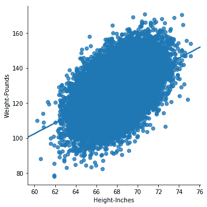
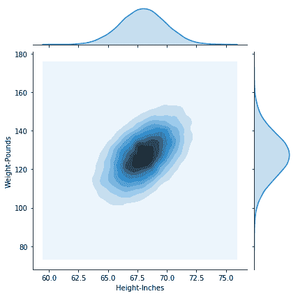
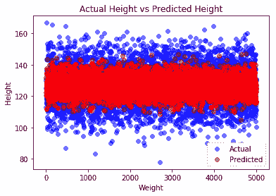
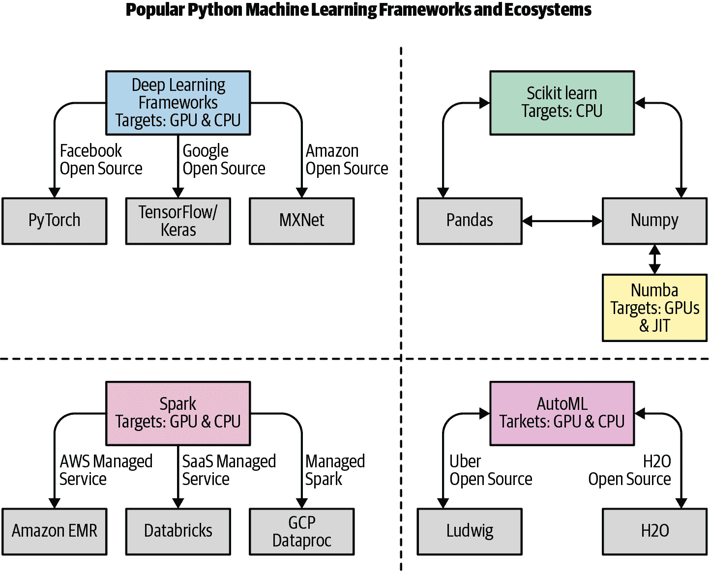
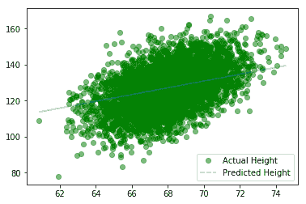
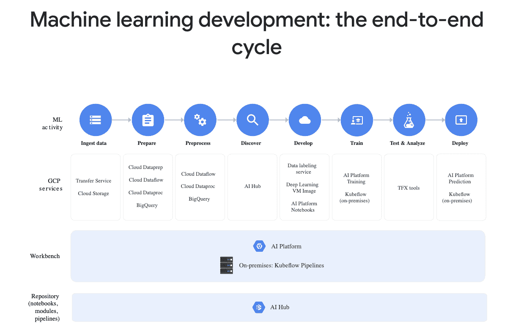
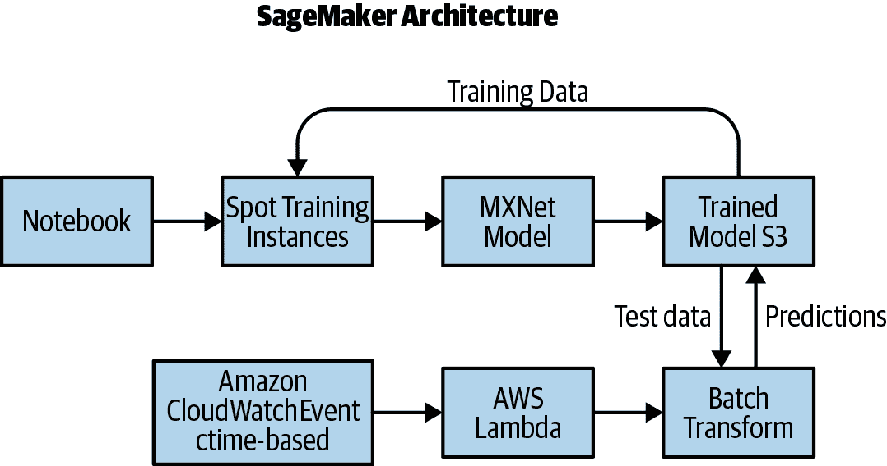
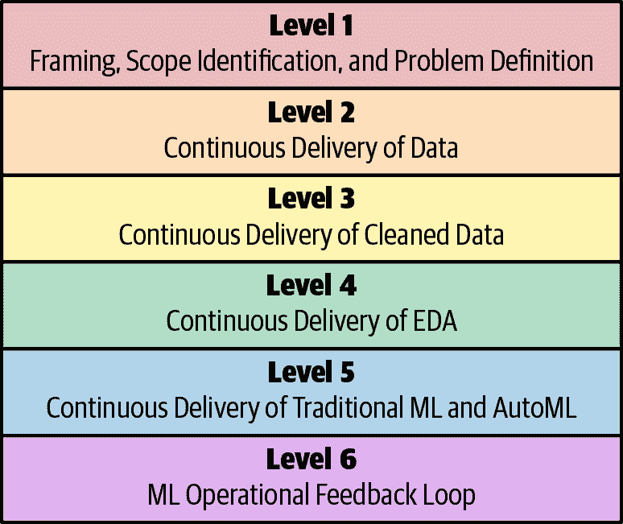
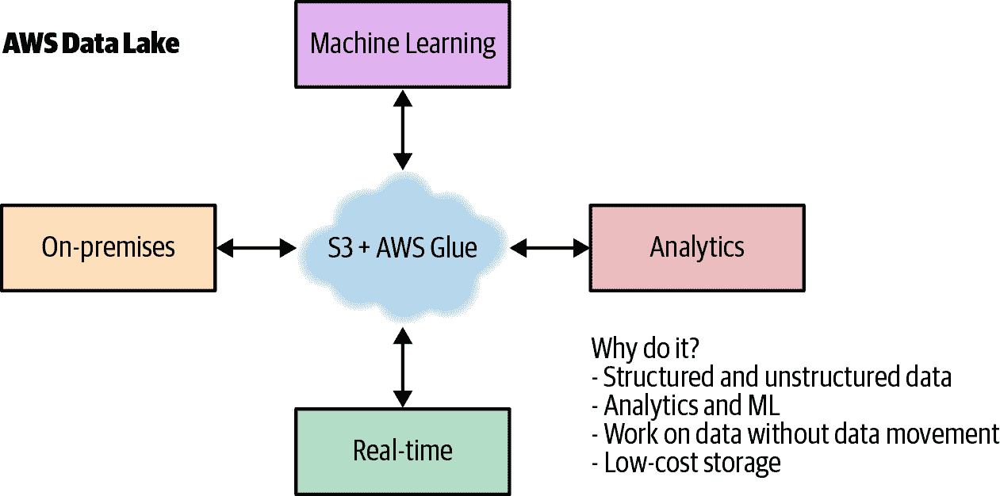

# 第十四章 机器学习运维与机器学习工程

2020 年最热门的职位之一是机器学习工程师。其他热门职位包括数据工程师、数据科学家和机器学习科学家。尽管您可以成为 DevOps 专家，但 DevOps 是一种行为，DevOps 的原则可以应用于任何软件项目，包括机器学习。让我们看看一些核心的 DevOps 最佳实践：持续集成、持续交付、微服务、基础设施即代码、监控与日志记录、以及沟通与协作。这些中哪个不适用于机器学习？

软件工程项目越复杂，而机器学习就更复杂，您就越需要 DevOps 原则。有比 API 做机器学习预测更好的微服务示例吗？在本章中，让我们深入探讨如何使用 DevOps 思维以专业且可重复的方式进行机器学习。

# 什么是机器学习？

机器学习是一种利用算法自动从数据中学习的方法。主要有四种类型：监督学习、半监督学习、无监督学习和强化学习。

## 监督学习

在监督学习中，已知并标记了正确答案。例如，如果您想要从体重预测身高，可以收集人们身高和体重的示例。身高将是目标，体重将是特征。

让我们看一个监督学习的示例：

+   [原始数据集](https://oreil.ly/jzWmI)

+   25,000 个 18 岁儿童身高和体重的合成记录

### 摄入

`**输入[0]:**`

```py
import pandas as pd
```

`**输入[7]:**`

```py
df = pd.read_csv(
  "https://raw.githubusercontent.com/noahgift/\
 regression-concepts/master/\
 height-weight-25k.csv")
df.head()
```

`**输出[7]:**`

|  | 索引 | 身高-英寸 | 体重-磅 |
| --- | --- | --- | --- |
| `0` | `1` | `65.78331` | `112.9925` |
| `1` | `2` | `71.51521` | `136.4873` |
| `2` | `3` | `69.39874` | `153.0269` |
| `3` | `4` | `68.21660` | `142.3354` |
| `4` | `5` | `67.78781` | `144.2971` |

### 探索性数据分析（EDA）

让我们看看数据，看看可以探索什么。

#### 散点图

在这个示例中，使用了 Python 中流行的绘图库 seaborn 来可视化数据集。如果需要安装它，您可以在笔记本中使用`!pip install seaborn`进行安装。您还可以在部分中使用`!pip install <包名称>`安装任何其他库。如果您使用的是 Colab 笔记本，则这些库已经为您安装好。查看身高/体重 lm 图（图 14-1）。

`**输入[0]:**`

```py
import seaborn as sns
import numpy as np
```

`**输入[9]:**`

```py
sns.lmplot("Height-Inches", "Weight-Pounds", data=df)
```



###### 图 14-1 身高/体重 lm 图

### 描述性统计

接下来，可以生成一些描述性统计。

`**输入[10]:**`

```py
df.describe()
```

`**输出[10]:**`

|  | 索引 | 身高-英寸 | 体重-磅 |
| --- | --- | --- | --- |
| `数量` | `25000.000000` | `25000.000000` | `25000.000000` |
| `均值` | `12500.500000` | `67.993114` | `127.079421` |
| `标准差` | `7217.022701` | `1.901679` | `11.660898` |
| `最小值` | `1.000000` | `60.278360` | `78.014760` |
| `25%` | `6250.750000` | `66.704397` | `119.308675` |
| `50%` | `12500.500000` | `67.995700` | `127.157750` |
| `75%` | `18750.250000` | `69.272958` | `134.892850` |
| `max` | `25000.000000` | `75.152800` | `170.924000` |

### 核密度分布

密度图的分布（图 14-2）显示了两个变量之间的关系。

`**In[11]:**`

```py
sns.jointplot("Height-Inches", "Weight-Pounds", data=df, kind="kde")
```

`**Out[11]:**`



###### 图 14-2\. 密度图

## 建模

现在让我们来审查建模过程。机器学习建模是指算法从数据中学习的过程。总体思路是利用历史数据来预测未来数据。

### Sklearn 回归模型

首先，数据被提取为特征和目标，然后被分割为训练集和测试集。这允许测试集被保留以测试训练模型的准确性。

`**In[0]:**`

```py
from sklearn.model_selection import train_test_split
```

#### 提取并检查特征和目标

建议明确提取目标和特征变量，并在一个单元格中重塑它们。然后，您会想要检查形状，以确保它是适合使用 Sklearn 进行机器学习的正确维度。

`**In[0]:**`

```py
y = df['Weight-Pounds'].values #Target
y = y.reshape(-1, 1)
X = df['Height-Inches'].values #Feature(s)
X = X.reshape(-1, 1)
```

`**In[14]:**`

```py
y.shape
```

`**Out[14]:**`

```py
(25000, 1)
```

#### 分割数据

数据被分为 80%/20% 的比例。

`**In[15]:**`

```py
X_train, X_test, y_train, y_test = train_test_split(X, y, test_size=0.2)
print(X_train.shape, y_train.shape)
print(X_test.shape, y_test.shape)
```

`**Out[15]:**`

```py
(20000, 1) (20000, 1)
(5000, 1) (5000, 1)
```

#### 拟合模型

现在模型使用从 Sklearn 导入的 LinearRegression 算法进行拟合。

`**In[0]:**`

```py
from sklearn.linear_model import LinearRegression
lm = LinearRegression()
model = lm.fit(X_train, y_train)
y_predicted = lm.predict(X_test)
```

#### 打印线性回归模型的准确性

现在训练好的模型可以展示在预测新数据时的准确性。这是通过计算预测数据与测试数据的 RMSE 或均方根误差来完成的。

`**In[18]:**`

```py
from sklearn.metrics import mean_squared_error
from math import sqrt

#RMSE Root Mean Squared Error
rms = sqrt(mean_squared_error(y_predicted, y_test))
rms
```

`**Out[18]:**`

```py
10.282608230082417
```

#### 绘制预测的身高与实际身高

现在让我们绘制预测的身高与实际身高（图 14-3）的图表，以查看该模型在预测中的表现如何。

`**In[19]:**`

```py
import matplotlib.pyplot as plt
_, ax = plt.subplots()

ax.scatter(x = range(0, y_test.size), y=y_test, c = 'blue', label = 'Actual',
  alpha = 0.5)
ax.scatter(x = range(0, y_predicted.size), y=y_predicted, c = 'red',
  label = 'Predicted', alpha = 0.5)

plt.title('Actual Height vs Predicted Height')
plt.xlabel('Weight')
plt.ylabel('Height')
plt.legend()
plt.show()
```



###### 图 14-3\. 预测的身高与实际身高

这是一个创建机器学习模型的非常简单但又强大的实际工作流示例。

# Python 机器学习生态系统

让我们快速了解一下 Python 机器学习生态系统（图 14-4）。

主要有四个领域：深度学习、sklearn、AutoML 和 Spark。在深度学习领域，最流行的框架依次是 TensorFlow/Keras、PyTorch 和 MXNet。Google 赞助 TensorFlow，Facebook 赞助 PyTorch，而 MXNet 来自亚马逊。您将会看到亚马逊 SageMaker 经常提到 MXNet。需要注意的是，这些深度学习框架针对 GPU 进行优化，使其性能比 CPU 目标提升多达 50 倍。



###### 图 14-4\. Python 机器学习生态系统

Sklearn 生态系统通常在同一个项目中同时使用 Pandas 和 Numpy。Sklearn 故意不针对 GPU，但是有一个名为 Numba 的项目专门针对 GPU（包括 NVIDIA 和 AMD）。

在 AutoML 中，Uber 的 Ludwig 和 H20 的 H20 AutoML 是两个领先的工具。两者都可以节省开发机器学习模型的时间，并且还可以优化现有的机器学习模型。

最后，有 Spark 生态系统，它建立在 Hadoop 的基础上。Spark 可以针对 GPU 和 CPU 进行优化，并通过多个平台实现：Amazon EMR、Databricks、GCP Dataproc 等。

## 使用 PyTorch 进行深度学习

现在定义了使用 Python 进行机器学习的生态系统，让我们看看如何将简单线性回归示例移植到 PyTorch，并在 CUDA GPU 上运行它。获取 NVIDIA GPU 的一个简单方法是使用 Colab 笔记本。Colab 笔记本是由 Google 托管的与 Jupyter 兼容的笔记本，用户可以免费访问 GPU 和张量处理单元（TPU）。您可以在[GPU 中运行此代码](https://oreil.ly/kQhKO)。

### 使用 PyTorch 进行回归

首先，将数据转换为`float32`。

`**In[0]:**`

```py
# Training Data
x_train = np.array(X_train, dtype=np.float32)
x_train = x_train.reshape(-1, 1)
y_train = np.array(y_train, dtype=np.float32)
y_train = y_train.reshape(-1, 1)

# Test Data
x_test = np.array(X_test, dtype=np.float32)
x_test = x_test.reshape(-1, 1)
y_test = np.array(y_test, dtype=np.float32)
y_test = y_test.reshape(-1, 1)
```

请注意，如果您不使用 Colab 笔记本，可能需要安装 PyTorch。此外，如果您使用 Colab 笔记本，您可以拥有 NVIDIA GPU 并运行此代码。如果您不使用 Colab，则需要在具有 GPU 的平台上运行。

`**In[0]:**`

```py
import torch
from torch.autograd import Variable

class linearRegression(torch.nn.Module):
    def __init__(self, inputSize, outputSize):
        super(linearRegression, self).__init__()
        self.linear = torch.nn.Linear(inputSize, outputSize)

    def forward(self, x):
        out = self.linear(x)
        return out
```

现在创建一个启用 CUDA 的模型（假设您在 Colab 上或者有 NVIDIA GPU 的机器上运行）。

`**In[0]:**`

```py
inputDim = 1        # takes variable 'x'
outputDim = 1       # takes variable 'y'
learningRate = 0.0001
epochs = 1000

model = linearRegression(inputDim, outputDim)
model.cuda()
```

`**Out[0]:**`

```py
linearRegression(
  (linear): Linear(in_features=1, out_features=1, bias=True)
)
```

创建随机梯度下降和损失函数。

`**In[0]:**`

```py
criterion = torch.nn.MSELoss()
optimizer = torch.optim.SGD(model.parameters(), lr=learningRate)
```

现在训练模型。

`**In[0]:**`

```py
for epoch in range(epochs):
    inputs = Variable(torch.from_numpy(x_train).cuda())
    labels = Variable(torch.from_numpy(y_train).cuda())
    optimizer.zero_grad()
    outputs = model(inputs)
    loss = criterion(outputs, labels)
    print(loss)
    # get gradients w.r.t to parameters
    loss.backward()
    # update parameters
    optimizer.step()
    print('epoch {}, loss {}'.format(epoch, loss.item()))
```

为了节省空间，输出被抑制了超过 1000 次运行。

`**Out[0]:**`

```py
tensor(29221.6543, device='cuda:0', grad_fn=<MseLossBackward>)
epoch 0, loss 29221.654296875
tensor(266.7252, device='cuda:0', grad_fn=<MseLossBackward>)
epoch 1, loss 266.72515869140625
tensor(106.6842, device='cuda:0', grad_fn=<MseLossBackward>)
epoch 2, loss 106.6842269897461
....output suppressed....
epoch 998, loss 105.7930908203125
tensor(105.7931, device='cuda:0', grad_fn=<MseLossBackward>)
epoch 999, loss 105.7930908203125
```

#### 绘制预测高度与实际高度

现在让我们绘制预测高度与实际高度的图示（图 14-5），就像简单模型一样。

`**In[0]:**`

```py
with torch.no_grad():
    predicted = model(Variable(torch.from_numpy(x_test).cuda())).cpu().\
      data.numpy()
    print(predicted)

plt.clf()
plt.plot(x_test, y_test, 'go', label='Actual Height', alpha=0.5)
plt.plot(x_test, predicted, '--', label='Predicted Height', alpha=0.5)
plt.legend(loc='best')
plt.show()
```



###### 图 14-5\. 预测高度与实际高度

#### 打印 RMSE

最后，让我们打印出 RMSE 并进行比较。

`**In[0]:**`

```py
#RMSE Root Mean Squared Error
rms = sqrt(mean_squared_error(x_test, predicted))
rms
```

`**Out[0]:**`

```py
59.19054613663507
```

深度学习确实需要更多的代码，但其概念与 sklearn 模型相同。这里的重要一点是 GPU 正成为生产流水线中不可或缺的一部分。即使您自己不进行深度学习，了解构建基于 GPU 的机器学习模型的过程也是有帮助的。

# 云机器学习平台

机器学习中一个普遍存在的方面是基于云的机器学习平台。Google 提供了 GCP AI 平台（图 14-6）。



###### 图 14-6\. GCP AI 平台

GCP 平台具有许多高级自动化组件，从数据准备到数据标记。AWS 平台提供 Amazon SageMaker（图 14-7）。



###### 图 14-7\. Amazon SageMaker

SageMaker 还具有许多高级组件，包括在 spot 实例上训练和弹性预测端点。

# 机器学习成熟度模型

现在面临的一个重大挑战之一是意识到希望进行机器学习的公司需要进行变革。机器学习成熟度模型图表（图 14-8）展示了一些挑战和机会。



###### 图 14-8\. 机器学习成熟度模型

## 机器学习关键术语

让我们定义一些关键的机器学习术语，这将在本章的其余部分中非常有帮助：

机器学习

基于样本或训练数据建立数学模型的一种方法。

模型

这是机器学习应用中的产品。一个简单的例子是线性方程，即预测 X 和 Y 之间关系的直线。

特征

特征是电子表格中用作信号以创建机器学习模型的列。一个很好的例子是 NBA 球队每场比赛得分。

目标

目标是电子表格中你试图预测的列。一个很好的例子是一支 NBA 球队赛季获胜场次。

超大规模机器学习

这是根据已知的正确历史值预测未来值的机器学习类型。一个很好的例子是使用每场比赛得分特征来预测 NBA 赛季中的胜利次数。

无监督机器学习

这是一种处理未标记数据的机器学习类型。它不是预测未来值，而是通过工具如聚类来发现隐藏的模式，进而可以用作标签。一个很好的例子是创建具有类似得分、篮板、盖帽和助攻的 NBA 球员集群。一个集群可以称为“高个子顶级球员”，另一个集群可以称为“得分后卫”。

深度学习

这是一种使用人工神经网络进行监督或无监督机器学习的方法。深度学习最流行的框架是 Google 的 TensorFlow。

Scikit-learn

这是 Python 中最流行的机器学习框架之一。

熊猫

这是用于进行数据处理和分析的最流行的库之一。它与 scikit-learn 和 Numpy 配合良好。

Numpy

这是进行低级科学计算的主要 Python 库。它支持大型多维数组，并拥有大量的高级数学函数。它广泛地与 scikit-learn、Pandas 和 TensorFlow 一起使用。

## 第 1 级：构架、范围识别和问题定义

让我们先来看看第一层。在公司实施机器学习时，重要的是考虑需要解决的问题以及如何构架这些问题。机器学习项目失败的一个关键原因是组织在开始之前没有先提出问题。

一个很好的类比是为旧金山的一家餐馆连锁店建立移动应用程序。一个天真的方法是立即开始构建本地 iOS 和本地 Android 应用程序（使用两个开发团队）。一个典型的移动团队可能是每个应用程序三名全职开发人员。所以这意味着每个开发人员大约 20 万美元，需要聘请六名开发人员。项目的运行成本现在约为每年 120 万美元。移动应用程序每年能带来超过 120 万美元的收入吗？如果不能，是否有更简单的替代方案？也许使用现有公司的网络开发人员的移动优化 Web 应用程序会是一个更好的选择。

那么，与一家专门从事食品配送的公司合作并完全外包这项任务呢？这种方法的利弊是什么？同样的思维过程可以和应该应用于机器学习和数据科学倡议。例如，你的公司是否需要雇佣六名年薪 50 万美元的博士级机器学习研究员？还有什么替代方案？对于机器学习来说，一点点范围界定和问题定义可以大大增加成功的机会。

## Level 2：数据的持续交付

文明的基础之一是运行水。罗马的高架渠道早在公元前 312 年就为城市提供了数英里的水源。运行水使得城市成功所必需的基础设施得以实现。据联合国儿童基金会估计，全球 2018 年，妇女和女童每天花费约 2 亿小时来取水。这是一个巨大的机会成本；时间不足以学习、照顾孩子、工作或放松。

一个流行的说法是“软件正在吞噬世界”。与此相关的是，未来每家公司都需要有一个机器学习和人工智能战略。其中一部分战略是更加认真地思考数据的持续交付。就像运行水一样，“运行数据”每天为您节省数小时的时间。数据湖的一个潜在解决方案如图 14-9 所示。



###### 图 14-9. AWS 数据湖

乍看之下，数据湖可能看起来像是在寻找问题的解决方案，或者过于简单而无法做任何有用的事情。但是让我们来看看它解决的一些问题：

+   您可以在不移动数据的情况下处理数据。

+   存储数据是便宜的。

+   创建存档数据的生命周期策略是直接的。

+   创建安全并审核数据的生命周期策略是直接的。

+   生产系统与数据处理分离。

+   它可以拥有几乎无限和弹性的存储和磁盘 I/O。

这种架构的替代方案通常是一种临时混乱的等同于步行四小时到井边取水然后返回的混乱状态。安全性在数据湖架构中也是一个主要因素，就像在供水中一样。通过集中数据存储和交付的架构，防止和监控数据违规变得更加简单明了。以下是一些可能有助于防止未来数据违规的想法：

+   你的数据是否处于静态加密状态？如果是，谁拥有解密密钥？解密事件是否被记录和审计？

+   你的数据是否在离开你的网络时被记录和审计？例如，将整个客户数据库移出网络何时是一个好主意？为什么这不受监控和审计？

+   你进行定期数据安全审计吗？为什么不？

+   你是否存储个人身份信息（PII）？为什么？

+   你是否监控关键生产事件的监控？你为什么不监控数据安全事件？

我们为什么要让数据在内部网络之外流动？如果我们设计关键数据为字面上无法在主机网络之外传输的方形销钉，例如核发射代码，会怎样？让数据无法移出环境似乎是防止这些违规行为的一种可行方式。如果外部网络本身只能传输“圆销钉”数据包会怎样？此外，这可能是提供此类安全数据湖云的一个很好的“锁定”功能。

## Level 3: 持续交付干净的数据

希望你能接受持续交付数据背后的理念，以及对公司的机器学习计划的成功有多么重要。持续交付数据的一个巨大改进是持续交付干净的数据。为什么要费力交付一团糟的数据？弗林特市密歇根州最近出现的污水问题让人联想起。大约在 2014 年，弗林特将水源从休伦湖和底特律河改为弗林特河。官员未能施用腐蚀抑制剂，导致老化管道中的铅渗漏到饮水供应中。这也可能导致外部水源变更引发的瘟疫，导致 12 人死亡，另有 87 人患病。

最早的数据科学成功故事之一涉及 1849-1854 年的脏水。约翰·斯诺能够使用数据可视化来识别霍乱病例的聚类（图 14-10）。这导致发现了爆发的根本原因。污水直接被泵入饮用水供应中！


###### 图 14-10\. 霍乱病例聚类

考虑以下观察：

+   为什么数据不会自动处理以“清洁”它？

+   你能够可视化具有“污水”的数据管道的部分吗？

+   公司花费了多少时间在可以完全自动化的数据清洗任务上？

## Level 4: 持续交付探索性数据分析

如果你对数据科学的唯一看法是 Kaggle 项目，可能会觉得数据科学的主要目标是生成尽可能精确的预测。然而，数据科学和机器学习远不止于此。数据科学是一个多学科领域，有几种不同的视角。其中一种视角是关注因果关系。是什么潜在特征推动了模型？你能解释模型如何得出其预测吗？几个 Python 库在这方面提供了帮助：ELI5、SHAP 和 LIME。它们都致力于帮助解释机器学习模型的真实运行方式。

预测的世界观不太关注如何达到答案，而更关注预测是否准确。在一个云原生、大数据的世界中，这种方法具有优点。某些机器学习问题使用大量数据表现良好，例如使用深度学习进行图像识别。你拥有的数据和计算能力越多，你的预测准确性就会越好。

你的产品已经投入使用了吗？为什么没有？如果你建立机器学习模型，而它们没有被使用，那你建模的目的是什么？

你不知道什么？通过观察数据，你能学到什么？通常，数据科学更感兴趣的是过程而不是结果。如果你只关注预测，那么你可能会错过数据的完全不同的视角。

## Level 5：传统机器学习和 AutoML 的持续交付

抗拒自动化如同人类历史的常态。卢德运动是英国纺织工人的秘密组织，他们在 1811 年到 1816 年间摧毁纺织机器，作为抗议的形式。最终，抗议者被击毙，反叛被法律和军事力量镇压，进步的道路依然前行。

如果你审视人类的历史，那些自动化取代曾由人类执行的任务的工具正在不断发展。在技术性失业中，低技能工人被取代，而高技能工人的薪水增加。一个例子是系统管理员与 DevOps 专业人员之间的对比。是的，一些系统管理员失去了工作，例如那些专注于数据中心更换硬盘等任务的工人，但是新的、薪水更高的工作，比如云架构师，也随之出现。

在机器学习和数据科学的职位招聘中，年薪通常在三十万到一百万美元之间，并不少包含着许多基本的商业规则：调整超参数，删除空值，以及将作业分发至集群。我提出的自动化定律（automator’s law）说：“如果你谈论自动化某事，它最终将会被自动化。” 关于自动机器学习（AutoML）有很多讨论，因此机器学习的大部分内容将不可避免地被自动化。

这意味着，就像其他自动化示例一样，工作的性质将发生变化。一些工作将变得更加熟练（想象一下能够每天训练数千个机器学习模型的人），而一些工作将因为机器能够做得更好而自动化（比如调整 JSON 数据结构中数值的工作，即调优超参数）。

## 第 6 级别：ML 操作反馈循环

为什么要开发移动应用？想必是为了让移动设备上的用户使用你的应用。那么机器学习呢？特别是与数据科学或统计学相比，机器学习的目的是创建模型并预测某些事物。如果模型没有投入生产，那它到底在做什么呢？

此外，将模型推送到生产环境是学习更多的机会。当模型真正部署到生产环境时，它是否能够准确预测新数据的情况？模型是否如预期地对用户产生影响，比如增加购买或在网站上停留的时间？只有在模型实际部署到生产环境时，才能获得这些宝贵的见解。

另一个重要的问题是可伸缩性和可重复性。一个真正技术成熟的组织可以按需部署软件，包括机器学习模型。在这里，机器学习模型的 DevOps 最佳实践同样重要：持续部署、微服务、监控和仪表化。

将更多这种技术成熟性注入到您的组织中的一个简单方法是，应用与选择云计算而不是物理数据中心相同的逻辑。租用他人的专业知识并利用规模经济。

# Sklearn Flask 与 Kubernetes 和 Docker

让我们通过 Docker 和 Kubernetes 实现基于 sklearn 的机器学习模型的真实部署。

这是一个 Dockerfile。注意，它提供了一个 Flask 应用程序。Flask 应用程序将托管 sklearn 应用程序。请注意，您可能希望安装 Hadolint，这允许您对 Dockerfile 进行代码检查：[*https://github.com/hadolint/hadolint*](https://github.com/hadolint/hadolint)。

```py
FROM python:3.7.3-stretch

# Working Directory
WORKDIR /app

# Copy source code to working directory
COPY . app.py /app/

# Install packages from requirements.txt
# hadolint ignore=DL3013
RUN pip install --upgrade pip &&\
    pip install --trusted-host pypi.python.org -r requirements.txt

# Expose port 80
EXPOSE 80

# Run app.py at container launch
CMD ["python", "app.py"]
```

这是 `Makefile`，它作为应用程序运行时的中心点：

```py
setup:
  python3 -m venv ~/.python-devops

install:
  pip install --upgrade pip &&\
    pip install -r requirements.txt

test:
  #python -m pytest -vv --cov=myrepolib tests/*.py
  #python -m pytest --nbval notebook.ipynb

lint:
  hadolint Dockerfile
  pylint --disable=R,C,W1203 app.py

all: install lint test
```

这是 *requirements.txt* 文件：

```py
Flask==1.0.2
pandas==0.24.2
scikit-learn==0.20.3
```

这是 *app.py* 文件：

```py
from flask import Flask, request, jsonify
from flask.logging import create_logger
import logging

import pandas as pd
from sklearn.externals import joblib
from sklearn.preprocessing import StandardScaler

app = Flask(__name__)
LOG = create_logger(app)
LOG.setLevel(logging.INFO)

def scale(payload):
    """Scales Payload"""

    LOG.info(f"Scaling Payload: {payload}")
    scaler = StandardScaler().fit(payload)
    scaled_adhoc_predict = scaler.transform(payload)
    return scaled_adhoc_predict

@app.route("/")
def home():
    html = "<h3>Sklearn Prediction Home</h3>"
    return html.format(format)

# TO DO:  Log out the prediction value
@app.route("/predict", methods=['POST'])
def predict():
    """Performs an sklearn prediction

 input looks like:
 {
 "CHAS":{
 "0":0
 },
 "RM":{
 "0":6.575
 },
 "TAX":{
 "0":296.0
 },
 "PTRATIO":{
 "0":15.3
 },
 "B":{
 "0":396.9
 },
 "LSTAT":{
 "0":4.98
 }

 result looks like:
 { "prediction": [ 20.35373177134412 ] }

 """

    json_payload = request.json
    LOG.info(f"JSON payload: {json_payload}")
    inference_payload = pd.DataFrame(json_payload)
    LOG.info(f"inference payload DataFrame: {inference_payload}")
    scaled_payload = scale(inference_payload)
    prediction = list(clf.predict(scaled_payload))
    return jsonify({'prediction': prediction})

if __name__ == "__main__":
    clf = joblib.load("boston_housing_prediction.joblib")
    app.run(host='0.0.0.0', port=80, debug=True)
```

这是 *run_docker.sh* 文件：

```py
#!/usr/bin/env bash

# Build image
docker build --tag=flasksklearn .

# List docker images
docker image ls

# Run flask app
docker run -p 8000:80 flasksklearn
```

这是 *run_kubernetes.sh* 文件：

```py
#!/usr/bin/env bash

dockerpath="noahgift/flasksklearn"

# Run in Docker Hub container with kubernetes
kubectl run flaskskearlndemo\
    --generator=run-pod/v1\
    --image=$dockerpath\
    --port=80 --labels app=flaskskearlndemo

# List kubernetes pods
kubectl get pods

# Forward the container port to host
kubectl port-forward flaskskearlndemo 8000:80
```

```py
#!/usr/bin/env bash
# This tags and uploads an image to Docker Hub

#Assumes this is built
#docker build --tag=flasksklearn .

dockerpath="noahgift/flasksklearn"

# Authenticate & Tag
echo "Docker ID and Image: $dockerpath"
docker login &&\
    docker image tag flasksklearn $dockerpath

# Push Image
docker image push $dockerpath
```

# Sklearn Flask 与 Kubernetes 和 Docker

您可能会问自己模型是如何创建然后“泡菜”出来的。您可以在此处查看 [整个笔记本](https://oreil.ly/_pHz-)。

首先，导入一些机器学习的库：

```py
import numpy
from numpy import arange
from matplotlib import pyplot
import seaborn as sns
import pandas as pd
from pandas import read_csv
from pandas import set_option
from sklearn.preprocessing import StandardScaler
from sklearn.model_selection import train_test_split
from sklearn.model_selection import KFold
from sklearn.model_selection import cross_val_score
from sklearn.model_selection import GridSearchCV
from sklearn.linear_model import LinearRegression
from sklearn.linear_model import Lasso
from sklearn.linear_model import ElasticNet
from sklearn.tree import DecisionTreeRegressor
from sklearn.neighbors import KNeighborsRegressor
from sklearn.svm import SVR
from sklearn.pipeline import Pipeline
from sklearn.ensemble import RandomForestRegressor
from sklearn.ensemble import GradientBoostingRegressor
from sklearn.ensemble import ExtraTreesRegressor
from sklearn.ensemble import AdaBoostRegressor
from sklearn.metrics import mean_squared_error
```

`**In[0]:**`

```py
boston_housing = "https://raw.githubusercontent.com/\
noahgift/boston_housing_pickle/master/housing.csv"
names = ['CRIM', 'ZN', 'INDUS', 'CHAS',
'NOX', 'RM', 'AGE', 'DIS', 'RAD', 'TAX',
 'PTRATIO', 'B', 'LSTAT', 'MEDV']
df = read_csv(boston_housing,
  delim_whitespace=True, names=names)
```

`**In[0]:**`

```py
df.head()
```

`**Out[0]:**`

|  | `CRIM` | `ZN` | `INDUS` | `CHAS` | `NOX` | `RM` | `AGE` |
| --- | --- | --- | --- | --- | --- | --- | --- |
| `0` | `0.00632` | `18.0` | `2.31` | `0` | `0.538` | `6.575` | `65.2` |
| `1` | `0.02731` | `0.0` | `7.07` | `0` | `0.469` | `6.421` | `78.9` |
| `2` | `0.02729` | `0.0` | `7.07` | `0` | `0.469` | `7.185` | `61.1` |
| `3` | `0.03237` | `0.0` | `2.18` | `0` | `0.458` | `6.998` | `45.8` |
| `4` | `0.06905` | `0.0` | `2.18` | `0` | `0.458` | `7.147` | `54.2` |
|  | `DIS` | `RAD` | `TAX` | `PTRATIO` | `B` | `LSTAT` | `MEDV` |
| --- | --- | --- | --- | --- | --- | --- | --- |
| `0` | `4.0900` | `1` | `296.0` | `15.3` | `396.90` | `4.98` | `24.0` |
| `1` | `4.9671` | `2` | `242.0` | `17.8` | `396.90` | `9.14` | `21.6` |
| `2` | `4.9671` | `2` | `242.0` | `17.8` | `392.83` | `4.03` | `34.7` |
| `3` | `6.0622` | `3` | `222.0` | `18.7` | `394.63` | `2.94` | `33.4` |
| `4` | `6.0622` | `3` | `222.0` | `18.7` | `396.90` | `5.33` | `36.2` |

## EDA

这些是模型的特征：

房价中位数

查尔斯河虚拟变量（1 表示地段与河流接壤；0 表示否）

RM

每个住宅的平均房间数

TAX

完整价值的房产税率每$10,000

PTRATIO

每个住宅的平均房间数

Bk

镇上的师生比

LSTAT

`%` 人口低地位

MEDV

住户的房屋中位数价格（以千美元为单位）

`**In[0]:**`

```py
prices = df['MEDV']
df = df.drop(['CRIM','ZN','INDUS','NOX','AGE','DIS','RAD'], axis = 1)
features = df.drop('MEDV', axis = 1)
df.head()
```

`**Out[0]:**`

|  | `CHAS` | `RM` | `TAX` | `PTRATIO` | `B` | `LSTAT` | `MEDV` |
| --- | --- | --- | --- | --- | --- | --- | --- |
| `0` | `0` | `6.575` | `296.0` | `15.3` | `396.90` | `4.98` | `24.0` |
| `1` | `0` | `6.421` | `242.0` | `17.8` | `396.90` | `9.14` | `21.6` |
| `2` | `0` | `7.185` | `242.0` | `17.8` | `392.83` | `4.03` | `34.7` |
| `3` | `0` | `6.998` | `222.0` | `18.7` | `394.63` | `2.94` | `33.4` |
| `4` | `0` | `7.147` | `222.0` | `18.7` | `396.90` | `5.33` | `36.2` |

## 建模

这是笔记本中建模的地方。一个有用的策略是始终创建四个主要部分的笔记本：

+   摄取

+   EDA

+   建模

+   结论

在这个建模部分，数据从 DataFrame 中提取并传递到 sklearn 的`train_test_split`模块中，该模块用于将数据拆分为训练和验证数据。

### 拆分数据

`**In[0]:**`

```py
# Split-out validation dataset
array = df.values
X = array[:,0:6]
Y = array[:,6]
validation_size = 0.20
seed = 7
X_train, X_validation, Y_train, Y_validation = train_test_split(X, Y,
  test_size=validation_size, random_state=seed)
```

`**In[0]:**`

```py
for sample in list(X_validation)[0:2]:
    print(f"X_validation {sample}")
```

`**Out[0]:**`

```py
X_validation [  1.      6.395 666.     20.2   391.34   13.27 ]
X_validation [  0.      5.895 224.     20.2   394.81   10.56 ]
```

## 调整缩放的 GBM

这个模型使用了几种在许多成功的 Kaggle 项目中可以参考的高级技术。这些技术包括 GridSearch，可以帮助找到最佳的超参数。注意，数据的缩放也是必要的，大多数机器学习算法都期望进行某种类型的缩放以生成准确的预测。

`**In[0]:**`

```py
# Test options and evaluation metric using Root Mean Square error method
num_folds = 10
seed = 7
RMS = 'neg_mean_squared_error'
scaler = StandardScaler().fit(X_train)
rescaledX = scaler.transform(X_train)
param_grid = dict(n_estimators=numpy.array([50,100,150,200,250,300,350,400]))
model = GradientBoostingRegressor(random_state=seed)
kfold = KFold(n_splits=num_folds, random_state=seed)
grid = GridSearchCV(estimator=model, param_grid=param_grid, scoring=RMS, cv=kfold)
grid_result = grid.fit(rescaledX, Y_train)

print("Best: %f using %s" % (grid_result.best_score_, grid_result.best_params_))
means = grid_result.cv_results_['mean_test_score']
stds = grid_result.cv_results_['std_test_score']
params = grid_result.cv_results_['params']
for mean, stdev, param in zip(means, stds, params):
    print("%f (%f) with: %r" % (mean, stdev, param))
```

`**Out[0]:**`

```py
Best: -11.830068 using {'n_estimators': 200}
-12.479635 (6.348297) with: {'n_estimators': 50}
-12.102737 (6.441597) with: {'n_estimators': 100}
-11.843649 (6.631569) with: {'n_estimators': 150}
-11.830068 (6.559724) with: {'n_estimators': 200}
-11.879805 (6.512414) with: {'n_estimators': 250}
-11.895362 (6.487726) with: {'n_estimators': 300}
-12.008611 (6.468623) with: {'n_estimators': 350}
-12.053759 (6.453899) with: {'n_estimators': 400}

/usr/local/lib/python3.6/dist-packages/sklearn/model_selection/_search.py:841:
DeprecationWarning:
DeprecationWarning)
```

## 拟合模型

此模型使用 GradientBoostingRegressor 进行拟合。培训模型后的最后一步是拟合模型并使用设置的数据检查错误。这些数据被缩放并传递到模型中，使用“均方误差”指标评估准确性。

`**In[0]:**`

```py
# prepare the model
scaler = StandardScaler().fit(X_train)
rescaledX = scaler.transform(X_train)
model = GradientBoostingRegressor(random_state=seed, n_estimators=400)
model.fit(rescaledX, Y_train)
# transform the validation dataset
rescaledValidationX = scaler.transform(X_validation)
predictions = model.predict(rescaledValidationX)
print("Mean Squared Error: \n")
print(mean_squared_error(Y_validation, predictions))
```

`**Out[0]:**`

```py
Mean Squared Error:

26.326748591395717
```

## 评估

机器学习中较为棘手的一个方面是模型评估。这个示例展示了如何将预测和原始房屋价格添加到同一个 DataFrame 中。该 DataFrame 可用于计算差异。

`**In[0]:**`

```py
predictions=predictions.astype(int)
evaluate = pd.DataFrame({
        "Org House Price": Y_validation,
        "Pred House Price": predictions
    })
evaluate["difference"] = evaluate["Org House Price"]-evaluate["Pred House Price"]
evaluate.head()
```

差异显示在这里。

`**Out[0]:**`

|  | `原房价` | `预测房价` | `差异` |
| --- | --- | --- | --- |
| `0` | `21.7` | `21` | `0.7` |
| `1` | `18.5` | `19` | `-0.5` |
| `2` | `22.2` | `20` | `2.2` |
| `3` | `20.4` | `19` | `1.4` |
| `4` | `8.8` | `9` | `-0.2` |

使用 Pandas 的 describe 方法是查看数据分布的好方法。

`**In[0]:**`

```py
evaluate.describe()
```

`**Out[0]:**`

|  | `原始房价` | `预测房价` | `差异` |
| --- | --- | --- | --- |
| `count` | `102.000000` | `102.000000` | `102.000000` |
| `mean` | `22.573529` | `22.117647` | `0.455882` |
| `std` | `9.033622` | `8.758921` | `5.154438` |
| `min` | `6.300000` | `8.000000` | `-34.100000` |
| `25%` | `17.350000` | `17.000000` | `-0.800000` |
| `50%` | `21.800000` | `20.500000` | `0.600000` |
| `75%` | `24.800000` | `25.000000` | `2.200000` |
| `max` | `50.000000` | `56.000000` | `22.000000` |

## adhoc_predict

让我们测试这个预测模型，看看在反序列化后的工作流程会是什么样子。当为机器学习模型开发 Web API 时，在笔记本中测试 API 将会很有帮助。在实际笔记本中调试和创建函数比在 Web 应用中努力创建正确的函数要容易得多。

`**In[0]:**`

```py
actual_sample = df.head(1)
actual_sample
```

`**Out[0]:**`

|  | `CHAS` | `RM` | `TAX` | `PTRATIO` | `B` | `LSTAT` | `MEDV` |
| --- | --- | --- | --- | --- | --- | --- | --- |
| `0` | `0` | `6.575` | `296.0` | `15.3` | `396.9` | `4.98` | `24.0` |

`**In[0]:**`

```py
adhoc_predict = actual_sample[["CHAS", "RM", "TAX", "PTRATIO", "B", "LSTAT"]]
adhoc_predict.head()
```

`**Out[0]:**`

|  | `CHAS` | `RM` | `TAX` | `PTRATIO` | `B` | `LSTAT` |
| --- | --- | --- | --- | --- | --- | --- |
| `0` | `0` | `6.575` | `296.0` | `15.3` | `396.9` | `4.98` |

## JSON 工作流

这是笔记本中对调试 Flask 应用程序有用的一节。正如前面提到的，开发 API 代码在机器学习项目中更加直接，确保其有效，然后将该代码传输到脚本中。另一种方法是尝试在没有 Jupyter 提供的相同交互式工具的软件项目中获取准确的代码语法。

`**In[0]:**`

```py
json_payload = adhoc_predict.to_json()
json_payload
```

`**Out[0]:**`

```py
{"CHAS":{"0":0},"RM":
{"0":6.575},"TAX":
{"0":296.0},"PTRATIO":
{"0":15.3},"B":{"0":396.9},"LSTAT":
{"0":4.98}}
```

## 尺度输入

需要对数据进行缩放才能进行预测。这个工作流需要在笔记本中详细说明，而不是在网页应用中苦苦挣扎，这样调试将会更加困难。下面的部分展示了解决机器学习预测流程中这一部分的代码。然后可以将其用于在 Flask 应用程序中创建函数。

`**In[0]:**`

```py
scaler = StandardScaler().fit(adhoc_predict)
scaled_adhoc_predict = scaler.transform(adhoc_predict)
scaled_adhoc_predict
```

`**Out[0]:**`

```py
array([[0., 0., 0., 0., 0., 0.]])
```

`**In[0]:**`

```py
list(model.predict(scaled_adhoc_predict))
```

`**Out[0]:**`

```py
[20.35373177134412]
```

### Pickling sklearn

接下来，我们来导出这个模型。

`**In[0]:**`

```py
from sklearn.externals import joblib
```

`**In[0]:**`

```py
joblib.dump(model, 'boston_housing_prediction.joblib')
```

`**Out[0]:**`

```py
['boston_housing_prediction.joblib']
```

`**In[0]:**`

```py
!ls -l
```

`**Out[0]:**`

```py
total 672
-rw-r--r-- 1 root root 681425 May  5 00:35 boston_housing_prediction.joblib
drwxr-xr-x 1 root root   4096 Apr 29 16:32 sample_data
```

### 解析并预测

`**In[0]:**`

```py
clf = joblib.load('boston_housing_prediction.joblib')
```

## 从 Pickle 中 adhoc_predict

`**In[0]:**`

```py
actual_sample2 = df.head(5)
actual_sample2
```

`**Out[0]:**`

|  | `CHAS` | `RM` | `TAX` | `PTRATIO` | `B` | `LSTAT` | `MEDV` |
| --- | --- | --- | --- | --- | --- | --- | --- |
| `0` | `0` | `6.575` | `296.0` | `15.3` | `396.90` | `4.98` | `24.0` |
| `1` | `0` | `6.421` | `242.0` | `17.8` | `396.90` | `9.14` | `21.6` |
| `2` | `0` | `7.185` | `242.0` | `17.8` | `392.83` | `4.03` | `34.7` |
| `3` | `0` | `6.998` | `222.0` | `18.7` | `394.63` | `2.94` | `33.4` |
| `4` | `0` | `7.147` | `222.0` | `18.7` | `396.90` | `5.33` | `36.2` |

`**In[0]:**`

```py
adhoc_predict2 = actual_sample[["CHAS", "RM", "TAX", "PTRATIO", "B", "LSTAT"]]
adhoc_predict2.head()
```

`**Out[0]:**`

|  | `CHAS` | `RM` | `TAX` | `PTRATIO` | `B` | `LSTAT` |
| --- | --- | --- | --- | --- | --- | --- |
| `0` | `0` | `6.575` | `296.0` | `15.3` | `396.9` | `4.98` |

## 缩放输入

`**In[0]:**`

```py
scaler = StandardScaler().fit(adhoc_predict2)
scaled_adhoc_predict2 = scaler.transform(adhoc_predict2)
scaled_adhoc_predict2
```

`**Out[0]:**`

```py
array([[0., 0., 0., 0., 0., 0.]])
```

`**In[0]:**`

```py
# Use pickle loaded model
list(clf.predict(scaled_adhoc_predict2))
```

`**Out[0]:**`

```py
[20.35373177134412]
```

最后，将被 Pickle 的模型加载回来，并针对真实数据集进行测试。

# 练习

+   scikit-learn 和 PyTorch 之间的一些关键区别是什么？

+   什么是 AutoML 以及为什么要使用它？

+   更改 scikit-learn 模型以使用身高来预测体重。

+   在 Google Colab 笔记本中运行 PyTorch 示例，并在 CPU 和 GPU 运行时之间切换。如果有性能差异，请解释其原因。

+   什么是 EDA 以及在数据科学项目中为什么如此重要？

# 案例研究问题

+   前往 Kaggle 网站，选择一个流行的 Python 笔记本，并将其转换为容器化的 Flask 应用程序，该应用程序使用本章中所示的示例作为指南提供预测。现在通过托管的 Kubernetes 服务（例如 Amazon EKS）将其部署到云环境中。

# 学习评估

+   解释不同类型的机器学习框架和生态系统。

+   运行和调试现有的 scikit-learn 和 PyTorch 机器学习项目。

+   将 Flask scikit-learn 模型进行容器化。

+   了解生产机器学习成熟度模型。
